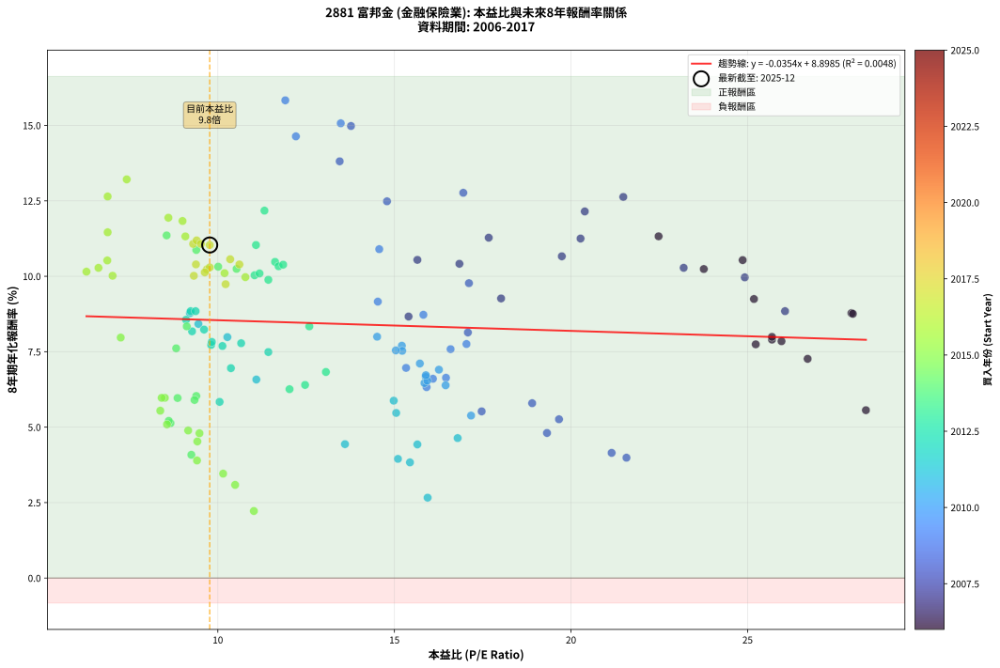
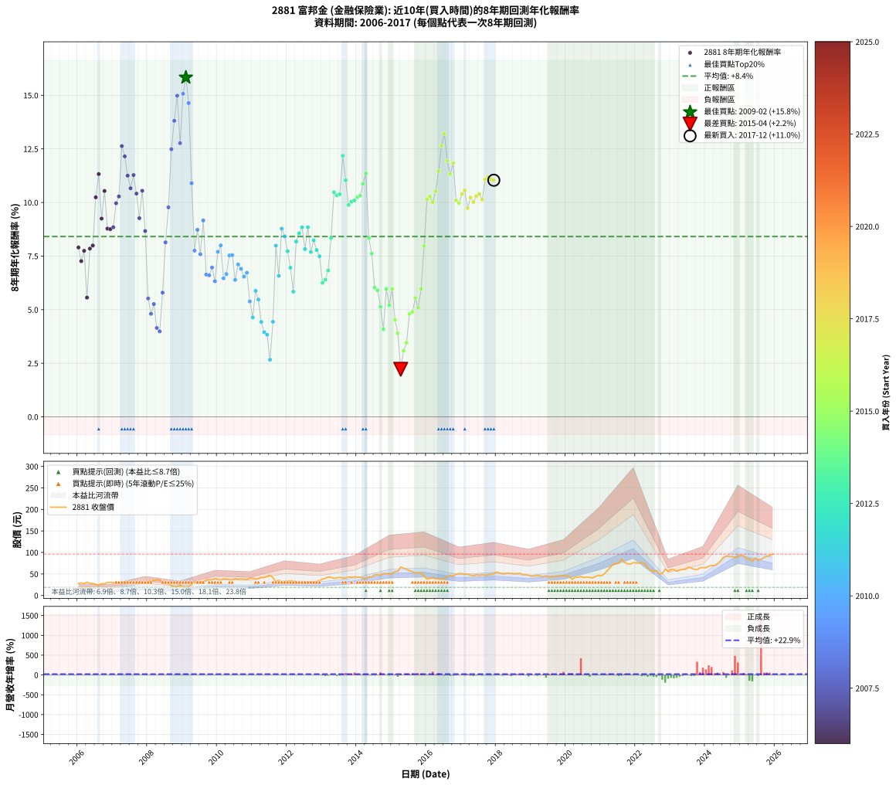

# 2881 富邦金 - 本益比與未來報酬率分析

!!! info "報告資訊"
    - **股票代號**: 2881
    - **公司名稱**: 富邦金
    - **產業別**: 金融保險業
    - **分析期間**: 2006-2017 (144 個數據點)
    - **資料來源**: Type 12 (ShowMonthlyK_ChartFlow) 月收盤價與本益比
    - **報酬率口徑**: 含現金股利 (簡化: 年度合計，假設每年7/1入帳)
    - **報告生成時間**: 2026-01-07 18:46:09 CST

## 📈 視覺化圖表

### 圖表1: 本益比 vs 未來報酬率關係

*圖表1：2881 富邦金 本益比與8年期未來報酬率關係 (2006-2017)*

### 圖表2: 歷年買入時點的8年期實際報酬率

*圖表2：2881 富邦金 歷年買入時點的8年期實際報酬率 (2006-2017)*

## 📍 買點訊號說明

本報告提供兩種買點提示訊號（顯示於圖表2的股價子圖中）：

### ▲ 小綠色三角形（回測驗證）
- **計算方式**: 使用全部歷史資料計算本益比第25百分位數
- **用途**: 事後驗證，顯示歷史上哪些時點確實為低估區
- **限制**: 當下無法判斷，僅供回測參考
- **特性**: 後見之明（Look-Ahead Bias）

### ▲ 小橘色三角形（即時訊號）
- **計算方式**: 使用截至當月的過去5年資料計算本益比第25百分位數
- **用途**: 實際投資決策，當時即可判斷
- **優勢**: 可操作性強，符合實務需求
- **特性**: 無後見之明，滾動窗口計算

!!! tip "如何使用兩種訊號"
    - **綠色▲** 幫助理解歷史估值機會，驗證策略有效性
    - **橘色▲** 可作為實際買進參考，但仍需搭配基本面分析
    - 兩種訊號重疊時，表示即時判斷與事後驗證一致，信心度較高
    - 僅有綠色▲時，表示當時無法判斷（需要未來資料才能確認）
    - 僅有橘色▲時，表示即時判斷為買點，但事後可能不是最佳時機

## 📊 估值分析摘要

| 指標 | 數值 |
|:---:|:---:|
| **目前本益比** (2017-12) | **9.77 倍** |
| **歷史平均本益比** | 13.79 倍 |
| **估值水準** | 🟢 相對低估 |
| **預期8年年化報酬率** | **+8.55%** |
| **歷史平均報酬率** | +8.41% |
| **相關係數 (R²)** | 0.0048 |
| **趨勢線斜率** | -0.0354 |

!!! abstract "核心洞察"
    目前本益比顯著低於歷史平均，預期未來報酬率可能較高

    根據歷史數據回測，2881 富邦金 在目前本益比 **9.8倍** 的估值水準下，
    預期未來8年年化報酬率約為 **+8.6%**。

    **重要提醒**: 本分析基於歷史數據統計，實際報酬率會受到公司基本面變化、產業趨勢、
    總體經濟環境等多重因素影響。R² = 0.00 表示本益比可解釋約 0.5% 的報酬率變異。

## 📈 歷史估值統計

### 最佳買點 (最高報酬率)

| 項目 | 數值 |
|:---:|:---:|
| 起始時間 | 2009-02 |
| 當時本益比 | 11.91 倍 |
| 起始價格 | 18.9 元 |
| 8年後價格 | 49.8 元 |
| **8年年化報酬率** | **+15.83%** |

### 最差買點 (最低報酬率)

| 項目 | 數值 |
|:---:|:---:|
| 起始時間 | 2015-04 |
| 當時本益比 | 11.02 倍 |
| 起始價格 | 66.1 元 |
| 8年後價格 | 59.0 元 |
| **8年年化報酬率** | **+2.22%** |

## 🎯 投資啟示

### 本益比與報酬率關係

趨勢線方程式: **y = -0.0354x + 8.8985**

!!! note "負相關"
    本益比與未來報酬率呈現負相關。較低的本益比通常帶來較高的未來報酬率，
    但相關性不算非常強。**估值仍是重要參考指標之一**。

### 估值區間建議

基於歷史數據分析:

- **🟢 低估區** (P/E < 11.0): 預期報酬率較高，可考慮增加持股
- **🟡 合理區** (P/E 11.0-16.5): 預期報酬率符合長期趨勢，正常持有
- **🔴 高估區** (P/E > 16.5): 預期報酬率較低，可考慮減碼或觀望

!!! danger "風險提示"
    - 過去表現不代表未來結果
    - 本分析假設公司基本面無重大結構性變化
    - 產業環境劇變可能使歷史規律失效
    - 應結合公司財報、產業趨勢、總體經濟等多重因素綜合判斷

!!! success "長期投資觀點"
    歷史數據顯示，在合理或低估的估值水準買入並長期持有，
    往往能獲得較佳的投資報酬。**耐心等待好價格**是價值投資的核心原則。

## 📊 數據品質

- **資料來源**: GoodInfo.tw Type 12 (ShowMonthlyK_ChartFlow)
- **資料頻率**: 月度收盤價與本益比
- **回測期間**: 2006-2017
- **數據點數量**: 144 個 (每個點代表一次8年期回測)

### 計算方法說明

1. **8年期年化報酬率**:
   - 對每個歷史時點，計算其後8年的實際投資報酬率
   - 期末價值(不含股利): 期末價格
   - 期末價值(含現金股利): 期末價格 + 持有期間內的現金股利合計 (簡化: 年度合計，假設每年7/1入帳)
   - 公式: 年化報酬率 = [(期末價值/期初價格)^(1/年數) - 1] × 100%

2. **本益比 (P/E Ratio)**:
   - 使用當時的月收盤價與EPS計算
   - 資料來源: Type 12 月度河流圖本益比數據

3. **趨勢線 (Linear Regression)**:
   - 使用最小平方法擬合線性趨勢線
   - R²值衡量本益比對報酬率的解釋能力

---

*本報告由 Stock Analysis System v1.9.0 自動生成*
*數據更新時間: 2026-01-07 18:46:09 CST*

## 📋 月度回測明細表

（每一列對應時間線圖中的一個買入點；可用來對照 SVG 圖上的每個點。）

| 買入月份 | 賣出月份 | 回測期限_年 | 實際持有年數 | 買入本益比_倍 | 買入收盤價_元 | 賣出收盤價_元 | 現金股利合計_元 | 總報酬率_pct | 年化報酬率_pct |
| --- | --- | --- | --- | --- | --- | --- | --- | --- | --- |
| 2006-01 | 2014-01 | 8 | 8.000 | 25.69 | 28.00 | 42.80 | 8.65 | +83.74 | +7.90 |
| 2006-02 | 2014-02 | 8 | 8.000 | 26.70 | 29.10 | 42.35 | 8.65 | +75.24 | +7.26 |
| 2006-03 | 2014-03 | 8 | 8.000 | 25.23 | 27.50 | 41.30 | 8.65 | +81.62 | +7.74 |
| 2006-04 | 2014-04 | 8 | 8.000 | 28.35 | 30.90 | 39.00 | 8.65 | +54.19 | +5.56 |
| 2006-05 | 2014-05 | 8 | 8.000 | 25.96 | 28.30 | 43.15 | 8.65 | +83.02 | +7.85 |
| 2006-06 | 2014-06 | 8 | 8.000 | 25.69 | 28.00 | 43.15 | 8.65 | +84.99 | +7.99 |
| 2006-07 | 2014-07 | 8 | 8.000 | 23.76 | 25.90 | 47.50 | 9.00 | +118.13 | +10.24 |
| 2006-08 | 2014-08 | 8 | 8.000 | 22.48 | 24.50 | 48.80 | 9.00 | +135.90 | +11.32 |
| 2006-09 | 2014-09 | 8 | 8.000 | 25.18 | 27.45 | 46.70 | 9.00 | +102.90 | +9.25 |
| 2006-10 | 2014-10 | 8 | 8.000 | 24.86 | 27.10 | 51.40 | 9.00 | +122.86 | +10.54 |
| 2006-11 | 2014-11 | 8 | 8.000 | 27.94 | 30.45 | 50.70 | 9.00 | +96.05 | +8.78 |
| 2006-12 | 2014-12 | 8 | 8.000 | 27.98 | 30.50 | 50.70 | 9.00 | +95.72 | +8.76 |
| 2007-01 | 2015-01 | 8 | 8.000 | 26.06 | 30.10 | 50.30 | 9.00 | +97.00 | +8.84 |
| 2007-02 | 2015-02 | 8 | 8.000 | 24.92 | 30.40 | 56.00 | 9.00 | +113.80 | +9.96 |
| 2007-03 | 2015-03 | 8 | 8.000 | 23.19 | 29.80 | 56.20 | 9.00 | +118.78 | +10.28 |
| 2007-04 | 2015-04 | 8 | 8.000 | 21.48 | 29.00 | 66.10 | 9.00 | +158.95 | +12.63 |
| 2007-05 | 2015-05 | 8 | 8.000 | 20.39 | 28.85 | 63.20 | 9.00 | +150.25 | +12.15 |
| 2007-06 | 2015-06 | 8 | 8.000 | 20.27 | 30.00 | 61.40 | 9.00 | +134.65 | +11.25 |
| 2007-07 | 2015-07 | 8 | 8.000 | 19.74 | 30.50 | 57.60 | 11.00 | +124.90 | +10.66 |
| 2007-08 | 2015-08 | 8 | 8.000 | 17.67 | 28.45 | 55.90 | 11.00 | +135.14 | +11.28 |
| 2007-09 | 2015-09 | 8 | 8.000 | 16.84 | 28.20 | 51.30 | 11.00 | +120.91 | +10.41 |
| 2007-10 | 2015-10 | 8 | 8.000 | 18.02 | 31.35 | 52.70 | 11.00 | +103.18 | +9.27 |
| 2007-11 | 2015-11 | 8 | 8.000 | 15.65 | 28.25 | 52.00 | 11.00 | +122.99 | +10.54 |
| 2007-12 | 2015-12 | 8 | 8.000 | 15.40 | 28.80 | 45.00 | 11.00 | +94.43 | +8.67 |
| 2008-01 | 2016-01 | 8 | 8.000 | 17.47 | 32.00 | 38.20 | 11.00 | +53.74 | +5.52 |
| 2008-02 | 2016-02 | 8 | 8.000 | 19.32 | 34.65 | 39.45 | 11.00 | +45.59 | +4.81 |
| 2008-03 | 2016-03 | 8 | 8.000 | 19.66 | 34.50 | 41.00 | 11.00 | +50.71 | +5.26 |
| 2008-04 | 2016-04 | 8 | 8.000 | 21.15 | 36.30 | 39.25 | 11.00 | +38.42 | +4.15 |
| 2008-05 | 2016-05 | 8 | 8.000 | 21.57 | 36.20 | 38.50 | 11.00 | +36.73 | +3.99 |
| 2008-06 | 2016-06 | 8 | 8.000 | 18.90 | 31.00 | 37.65 | 11.00 | +56.92 | +5.79 |
| 2008-07 | 2016-07 | 8 | 8.000 | 17.08 | 27.35 | 39.65 | 11.50 | +87.01 | +8.14 |
| 2008-08 | 2016-08 | 8 | 8.000 | 17.11 | 26.75 | 44.90 | 11.50 | +110.83 | +9.77 |
| 2008-09 | 2016-09 | 8 | 8.000 | 14.79 | 22.55 | 46.30 | 11.50 | +156.30 | +12.48 |
| 2008-10 | 2016-10 | 8 | 8.000 | 13.45 | 20.00 | 44.80 | 11.50 | +181.48 | +13.81 |
| 2008-11 | 2016-11 | 8 | 8.000 | 13.77 | 19.95 | 49.45 | 11.50 | +205.49 | +14.98 |
| 2008-12 | 2016-12 | 8 | 8.000 | 16.95 | 23.90 | 51.00 | 11.50 | +161.49 | +12.77 |
| 2009-01 | 2017-01 | 8 | 8.000 | 13.48 | 20.20 | 50.60 | 11.50 | +207.41 | +15.07 |
| 2009-02 | 2017-02 | 8 | 8.000 | 11.91 | 18.90 | 49.75 | 11.50 | +224.05 | +15.83 |
| 2009-03 | 2017-03 | 8 | 8.000 | 12.21 | 20.45 | 49.50 | 11.50 | +198.27 | +14.64 |
| 2009-04 | 2017-04 | 8 | 8.000 | 14.57 | 25.70 | 47.30 | 11.50 | +128.78 | +10.90 |
| 2009-05 | 2017-05 | 8 | 8.000 | 17.04 | 31.55 | 45.85 | 11.50 | +81.76 | +7.76 |
| 2009-06 | 2017-06 | 8 | 8.000 | 15.82 | 30.70 | 48.45 | 11.50 | +95.26 | +8.72 |
| 2009-07 | 2017-07 | 8 | 8.000 | 16.59 | 33.65 | 46.90 | 13.50 | +79.48 | +7.59 |
| 2009-08 | 2017-08 | 8 | 8.000 | 14.53 | 30.75 | 48.50 | 13.50 | +101.61 | +9.16 |
| 2009-09 | 2017-09 | 8 | 8.000 | 16.46 | 36.30 | 47.20 | 13.50 | +67.21 | +6.64 |
| 2009-10 | 2017-10 | 8 | 8.000 | 16.09 | 36.90 | 48.05 | 13.50 | +66.79 | +6.60 |
| 2009-11 | 2017-11 | 8 | 8.000 | 15.33 | 36.50 | 49.05 | 13.50 | +71.36 | +6.96 |
| 2009-12 | 2017-12 | 8 | 8.000 | 15.91 | 39.30 | 50.70 | 13.50 | +63.35 | +6.33 |
| 2010-01 | 2018-01 | 8 | 8.000 | 15.21 | 37.40 | 54.20 | 13.50 | +81.01 | +7.70 |
| 2010-02 | 2018-02 | 8 | 8.000 | 14.51 | 35.50 | 52.20 | 13.50 | +85.06 | +8.00 |
| 2010-03 | 2018-03 | 8 | 8.000 | 15.85 | 38.60 | 50.20 | 13.50 | +65.02 | +6.46 |
| 2010-04 | 2018-04 | 8 | 8.000 | 15.89 | 38.50 | 51.00 | 13.50 | +67.52 | +6.66 |
| 2010-05 | 2018-05 | 8 | 8.000 | 15.22 | 36.70 | 52.10 | 13.50 | +78.74 | +7.53 |
| 2010-06 | 2018-06 | 8 | 8.000 | 15.04 | 36.10 | 51.10 | 13.50 | +78.94 | +7.54 |
| 2010-07 | 2018-07 | 8 | 8.000 | 16.45 | 39.30 | 50.70 | 13.80 | +64.12 | +6.39 |
| 2010-08 | 2018-08 | 8 | 8.000 | 15.72 | 37.35 | 50.90 | 13.80 | +73.22 | +7.11 |
| 2010-09 | 2018-09 | 8 | 8.000 | 16.26 | 38.45 | 51.80 | 13.80 | +70.61 | +6.91 |
| 2010-10 | 2018-10 | 8 | 8.000 | 15.93 | 37.50 | 48.45 | 13.80 | +65.99 | +6.54 |
| 2010-11 | 2018-11 | 8 | 8.000 | 15.89 | 37.20 | 48.80 | 13.80 | +68.27 | +6.72 |
| 2010-12 | 2018-12 | 8 | 8.000 | 17.17 | 40.00 | 47.05 | 13.80 | +52.12 | +5.38 |
| 2011-01 | 2019-01 | 8 | 8.000 | 16.79 | 40.60 | 44.55 | 13.80 | +43.71 | +4.64 |
| 2011-02 | 2019-02 | 8 | 8.000 | 14.98 | 37.55 | 45.50 | 13.80 | +57.92 | +5.88 |
| 2011-03 | 2019-03 | 8 | 8.000 | 15.05 | 39.05 | 46.00 | 13.80 | +53.13 | +5.47 |
| 2011-04 | 2019-04 | 8 | 8.000 | 15.65 | 42.00 | 45.60 | 13.80 | +41.42 | +4.43 |
| 2011-05 | 2019-05 | 8 | 8.000 | 15.10 | 41.85 | 43.25 | 13.80 | +36.32 | +3.95 |
| 2011-06 | 2019-06 | 8 | 8.000 | 15.44 | 44.15 | 45.85 | 13.80 | +35.10 | +3.83 |
| 2011-07 | 2019-07 | 8 | 8.000 | 15.94 | 47.00 | 43.20 | 14.80 | +23.40 | +2.66 |
| 2011-08 | 2019-08 | 8 | 8.000 | 13.60 | 41.30 | 43.65 | 14.80 | +41.52 | +4.44 |
| 2011-09 | 2019-09 | 8 | 8.000 | 10.27 | 32.10 | 44.55 | 14.80 | +84.89 | +7.99 |
| 2011-10 | 2019-10 | 8 | 8.000 | 11.09 | 35.65 | 44.55 | 14.80 | +66.48 | +6.58 |
| 2011-11 | 2019-11 | 8 | 8.000 | 9.21 | 30.40 | 44.80 | 14.80 | +96.05 | +8.78 |
| 2011-12 | 2019-12 | 8 | 8.000 | 9.45 | 32.05 | 46.40 | 14.80 | +90.95 | +8.42 |
| 2012-01 | 2020-01 | 8 | 8.000 | 9.81 | 33.00 | 45.05 | 14.80 | +81.36 | +7.73 |
| 2012-02 | 2020-02 | 8 | 8.000 | 10.37 | 34.60 | 44.45 | 14.80 | +71.24 | +6.95 |
| 2012-03 | 2020-03 | 8 | 8.000 | 10.05 | 33.25 | 37.55 | 14.80 | +57.44 | +5.84 |
| 2012-04 | 2020-04 | 8 | 8.000 | 9.27 | 30.45 | 42.30 | 14.80 | +87.52 | +8.18 |
| 2012-05 | 2020-05 | 8 | 8.000 | 9.10 | 29.65 | 42.40 | 14.80 | +92.91 | +8.56 |
| 2012-06 | 2020-06 | 8 | 8.000 | 9.23 | 29.80 | 43.90 | 14.80 | +96.98 | +8.84 |
| 2012-07 | 2020-07 | 8 | 8.000 | 9.83 | 31.50 | 41.75 | 15.80 | +82.70 | +7.82 |
| 2012-08 | 2020-08 | 8 | 8.000 | 9.37 | 29.75 | 42.80 | 15.80 | +96.97 | +8.84 |
| 2012-09 | 2020-09 | 8 | 8.000 | 10.13 | 31.90 | 41.90 | 15.80 | +80.88 | +7.69 |
| 2012-10 | 2020-10 | 8 | 8.000 | 9.61 | 30.00 | 40.70 | 15.80 | +88.33 | +8.23 |
| 2012-11 | 2020-11 | 8 | 8.000 | 10.66 | 33.00 | 44.30 | 15.80 | +82.12 | +7.78 |
| 2012-12 | 2020-12 | 8 | 8.000 | 11.43 | 35.10 | 46.75 | 15.80 | +78.21 | +7.49 |
| 2013-01 | 2021-01 | 8 | 8.000 | 12.03 | 37.75 | 45.55 | 15.80 | +62.52 | +6.26 |
| 2013-02 | 2021-02 | 8 | 8.000 | 12.47 | 40.00 | 49.90 | 15.80 | +64.25 | +6.40 |
| 2013-03 | 2021-03 | 8 | 8.000 | 13.06 | 42.80 | 56.80 | 15.80 | +69.63 | +6.83 |
| 2013-04 | 2021-04 | 8 | 8.000 | 12.59 | 42.15 | 64.20 | 15.80 | +89.80 | +8.34 |
| 2013-05 | 2021-05 | 8 | 8.000 | 11.62 | 39.70 | 72.30 | 15.80 | +121.91 | +10.48 |
| 2013-06 | 2021-06 | 8 | 8.000 | 11.72 | 40.85 | 73.90 | 15.80 | +119.58 | +10.33 |
| 2013-07 | 2021-07 | 8 | 8.000 | 11.85 | 42.10 | 75.00 | 17.80 | +120.43 | +10.38 |
| 2013-08 | 2021-08 | 8 | 8.000 | 11.32 | 41.00 | 85.00 | 17.80 | +150.73 | +12.18 |
| 2013-09 | 2021-09 | 8 | 8.000 | 11.08 | 40.90 | 76.70 | 17.80 | +131.05 | +11.04 |
| 2013-10 | 2021-10 | 8 | 8.000 | 11.43 | 43.00 | 73.60 | 17.80 | +112.56 | +9.88 |
| 2013-11 | 2021-11 | 8 | 8.000 | 11.04 | 42.30 | 73.10 | 17.80 | +114.89 | +10.03 |
| 2013-12 | 2021-12 | 8 | 8.000 | 11.18 | 43.60 | 76.30 | 17.80 | +115.83 | +10.09 |
| 2014-01 | 2022-01 | 8 | 8.000 | 10.53 | 42.80 | 75.60 | 17.80 | +118.22 | +10.25 |
| 2014-02 | 2022-02 | 8 | 8.000 | 10.01 | 42.35 | 75.10 | 17.80 | +119.36 | +10.32 |
| 2014-03 | 2022-03 | 8 | 8.000 | 9.39 | 41.30 | 76.50 | 17.80 | +128.33 | +10.87 |
| 2014-04 | 2022-04 | 8 | 8.000 | 8.55 | 39.00 | 74.40 | 17.80 | +136.41 | +11.35 |
| 2014-05 | 2022-05 | 8 | 8.000 | 9.12 | 43.15 | 64.10 | 17.80 | +89.80 | +8.34 |
| 2014-06 | 2022-06 | 8 | 8.000 | 8.82 | 43.15 | 59.80 | 17.80 | +79.84 | +7.61 |
| 2014-07 | 2022-07 | 8 | 8.000 | 9.39 | 47.50 | 56.10 | 19.80 | +59.79 | +6.03 |
| 2014-08 | 2022-08 | 8 | 8.000 | 9.34 | 48.80 | 57.40 | 19.80 | +58.20 | +5.90 |
| 2014-09 | 2022-09 | 8 | 8.000 | 8.66 | 46.70 | 49.90 | 19.80 | +49.25 | +5.13 |
| 2014-10 | 2022-10 | 8 | 8.000 | 9.25 | 51.40 | 51.00 | 19.80 | +37.74 | +4.08 |
| 2014-11 | 2022-11 | 8 | 8.000 | 8.86 | 50.70 | 60.80 | 19.80 | +58.97 | +5.97 |
| 2014-12 | 2022-12 | 8 | 8.000 | 8.61 | 50.70 | 56.30 | 19.80 | +50.10 | +5.21 |
| 2015-01 | 2023-01 | 8 | 8.000 | 8.50 | 50.30 | 60.20 | 19.80 | +59.05 | +5.97 |
| 2015-02 | 2023-02 | 8 | 8.000 | 9.42 | 56.00 | 60.00 | 19.80 | +42.50 | +4.53 |
| 2015-03 | 2023-03 | 8 | 8.000 | 9.41 | 56.20 | 56.50 | 19.80 | +35.77 | +3.90 |
| 2015-04 | 2023-04 | 8 | 8.000 | 11.02 | 66.10 | 59.00 | 19.80 | +19.21 | +2.22 |
| 2015-05 | 2023-05 | 8 | 8.000 | 10.49 | 63.20 | 60.80 | 19.80 | +27.53 | +3.09 |
| 2015-06 | 2023-06 | 8 | 8.000 | 10.15 | 61.40 | 60.80 | 19.80 | +31.27 | +3.46 |
| 2015-07 | 2023-07 | 8 | 8.000 | 9.48 | 57.60 | 65.50 | 18.30 | +45.49 | +4.80 |
| 2015-08 | 2023-08 | 8 | 8.000 | 9.16 | 55.90 | 63.60 | 18.30 | +46.51 | +4.89 |
| 2015-09 | 2023-09 | 8 | 8.000 | 8.37 | 51.30 | 60.70 | 18.30 | +54.00 | +5.55 |
| 2015-10 | 2023-10 | 8 | 8.000 | 8.56 | 52.70 | 60.10 | 18.30 | +48.77 | +5.09 |
| 2015-11 | 2023-11 | 8 | 8.000 | 8.41 | 52.00 | 64.40 | 18.30 | +59.04 | +5.97 |
| 2015-12 | 2023-12 | 8 | 8.000 | 7.25 | 45.00 | 64.80 | 18.30 | +84.67 | +7.97 |
| 2016-01 | 2024-01 | 8 | 8.000 | 6.28 | 38.20 | 64.50 | 18.30 | +116.75 | +10.15 |
| 2016-02 | 2024-02 | 8 | 8.000 | 6.62 | 39.45 | 68.00 | 18.30 | +118.76 | +10.28 |
| 2016-03 | 2024-03 | 8 | 8.000 | 7.02 | 41.00 | 69.70 | 18.30 | +114.63 | +10.02 |
| 2016-04 | 2024-04 | 8 | 8.000 | 6.87 | 39.25 | 69.10 | 18.30 | +122.68 | +10.52 |
| 2016-05 | 2024-05 | 8 | 8.000 | 6.88 | 38.50 | 73.40 | 18.30 | +138.18 | +11.46 |
| 2016-06 | 2024-06 | 8 | 8.000 | 6.88 | 37.65 | 79.30 | 18.30 | +159.23 | +12.64 |
| 2016-07 | 2024-07 | 8 | 8.000 | 7.42 | 39.65 | 88.20 | 18.80 | +169.86 | +13.21 |
| 2016-08 | 2024-08 | 8 | 8.000 | 8.60 | 44.90 | 91.90 | 18.80 | +146.55 | +11.94 |
| 2016-09 | 2024-09 | 8 | 8.000 | 9.08 | 46.30 | 90.40 | 18.80 | +135.85 | +11.32 |
| 2016-10 | 2024-10 | 8 | 8.000 | 9.00 | 44.80 | 90.80 | 18.80 | +144.64 | +11.83 |
| 2016-11 | 2024-11 | 8 | 8.000 | 10.19 | 49.45 | 88.00 | 18.80 | +115.98 | +10.10 |
| 2016-12 | 2024-12 | 8 | 8.000 | 10.78 | 51.00 | 90.30 | 18.80 | +113.92 | +9.97 |
| 2017-01 | 2025-01 | 8 | 8.000 | 10.61 | 50.60 | 92.80 | 18.80 | +120.55 | +10.39 |
| 2017-02 | 2025-02 | 8 | 8.000 | 10.35 | 49.75 | 92.30 | 18.80 | +123.32 | +10.56 |
| 2017-03 | 2025-03 | 8 | 8.000 | 10.22 | 49.50 | 85.30 | 18.80 | +110.30 | +9.74 |
| 2017-04 | 2025-04 | 8 | 8.000 | 9.69 | 47.30 | 84.30 | 18.80 | +117.97 | +10.23 |
| 2017-05 | 2025-05 | 8 | 8.000 | 9.32 | 45.85 | 79.60 | 18.80 | +114.61 | +10.02 |
| 2017-06 | 2025-06 | 8 | 8.000 | 9.77 | 48.45 | 87.30 | 18.80 | +118.99 | +10.29 |
| 2017-07 | 2025-07 | 8 | 8.000 | 9.38 | 46.90 | 82.40 | 21.05 | +120.58 | +10.39 |
| 2017-08 | 2025-08 | 8 | 8.000 | 9.63 | 48.50 | 83.90 | 21.05 | +116.39 | +10.13 |
| 2017-09 | 2025-09 | 8 | 8.000 | 9.30 | 47.20 | 88.30 | 21.05 | +131.67 | +11.07 |
| 2017-10 | 2025-10 | 8 | 8.000 | 9.40 | 48.05 | 91.20 | 21.05 | +133.61 | +11.19 |
| 2017-11 | 2025-11 | 8 | 8.000 | 9.52 | 49.05 | 92.60 | 21.05 | +131.70 | +11.07 |
| 2017-12 | 2025-12 | 8 | 8.000 | 9.77 | 50.70 | 96.10 | 21.05 | +131.07 | +11.04 |
