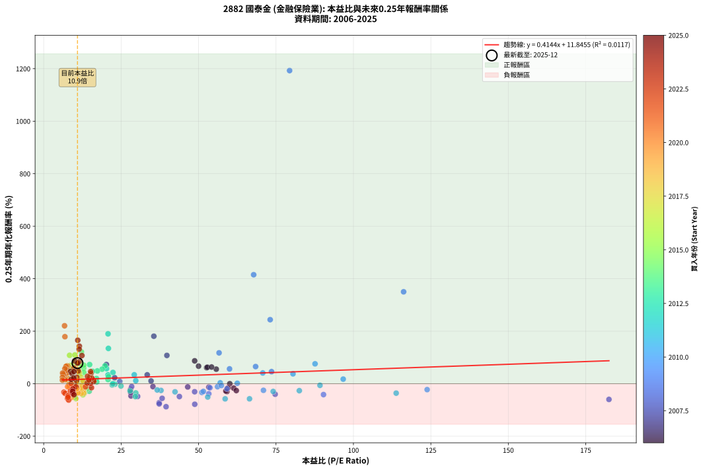
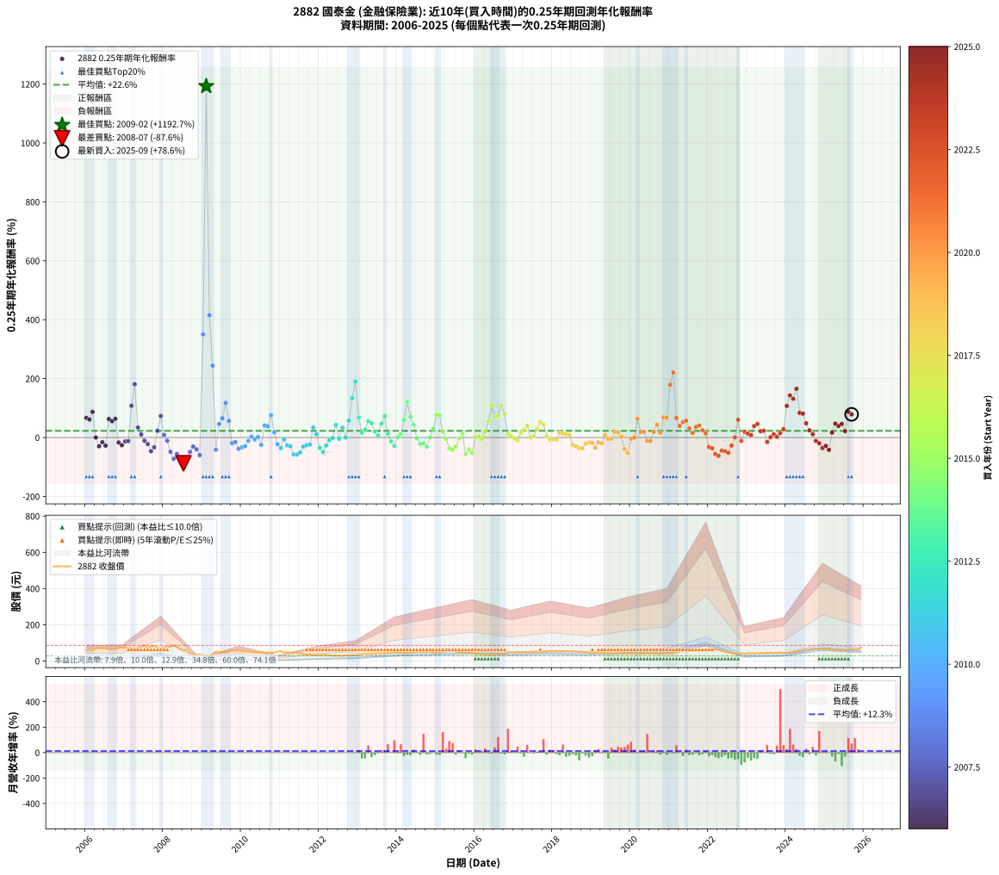

# 2882 國泰金 - 本益比與未來報酬率分析

!!! info "報告資訊"
    - **股票代號**: 2882
    - **公司名稱**: 國泰金
    - **產業別**: 金融保險業
    - **分析期間**: 2006-2025 (237 個數據點)
    - **資料來源**: Type 12 (ShowMonthlyK_ChartFlow) 月收盤價與本益比
    - **報酬率口徑**: 含現金股利 (簡化: 年度合計，假設每年7/1入帳)
    - **報告生成時間**: 2026-01-07 18:46:20 CST

## 📈 視覺化圖表

### 圖表1: 本益比 vs 未來報酬率關係

*圖表1：2882 國泰金 本益比與0.25年期未來報酬率關係 (2006-2025)*

### 圖表2: 歷年買入時點的0.25年期實際報酬率

*圖表2：2882 國泰金 歷年買入時點的0.25年期實際報酬率 (2006-2025)*

## 📍 買點訊號說明

本報告提供兩種買點提示訊號（顯示於圖表2的股價子圖中）：

### ▲ 小綠色三角形（回測驗證）
- **計算方式**: 使用全部歷史資料計算本益比第25百分位數
- **用途**: 事後驗證，顯示歷史上哪些時點確實為低估區
- **限制**: 當下無法判斷，僅供回測參考
- **特性**: 後見之明（Look-Ahead Bias）

### ▲ 小橘色三角形（即時訊號）
- **計算方式**: 使用截至當月的過去5年資料計算本益比第25百分位數
- **用途**: 實際投資決策，當時即可判斷
- **優勢**: 可操作性強，符合實務需求
- **特性**: 無後見之明，滾動窗口計算

!!! tip "如何使用兩種訊號"
    - **綠色▲** 幫助理解歷史估值機會，驗證策略有效性
    - **橘色▲** 可作為實際買進參考，但仍需搭配基本面分析
    - 兩種訊號重疊時，表示即時判斷與事後驗證一致，信心度較高
    - 僅有綠色▲時，表示當時無法判斷（需要未來資料才能確認）
    - 僅有橘色▲時，表示即時判斷為買點，但事後可能不是最佳時機

## 📊 估值分析摘要

| 指標 | 數值 |
|:---:|:---:|
| **目前本益比** (2025-09) | **10.91 倍** |
| **歷史平均本益比** | 25.89 倍 |
| **估值水準** | 🟢 相對低估 |
| **預期0.25年年化報酬率** | **+16.37%** |
| **歷史平均報酬率** | +22.57% |
| **相關係數 (R²)** | 0.0117 |
| **趨勢線斜率** | 0.4144 |

!!! abstract "核心洞察"
    目前本益比顯著低於歷史平均，預期未來報酬率可能較高

    根據歷史數據回測，2882 國泰金 在目前本益比 **10.9倍** 的估值水準下，
    預期未來0.25年年化報酬率約為 **+16.4%**。

    **重要提醒**: 本分析基於歷史數據統計，實際報酬率會受到公司基本面變化、產業趨勢、
    總體經濟環境等多重因素影響。R² = 0.01 表示本益比可解釋約 1.2% 的報酬率變異。

## 📈 歷史估值統計

### 最佳買點 (最高報酬率)

| 項目 | 數值 |
|:---:|:---:|
| 起始時間 | 2009-02 |
| 當時本益比 | 79.39 倍 |
| 起始價格 | 28.1 元 |
| 0.25年後價格 | 52.7 元 |
| **0.25年年化報酬率** | **+1192.67%** |

### 最差買點 (最低報酬率)

| 項目 | 數值 |
|:---:|:---:|
| 起始時間 | 2008-07 |
| 當時本益比 | 39.51 倍 |
| 起始價格 | 59.6 元 |
| 0.25年後價格 | 35.2 元 |
| **0.25年年化報酬率** | **-87.57%** |

## 🎯 投資啟示

### 本益比與報酬率關係

趨勢線方程式: **y = 0.4144x + 11.8455**

!!! info "弱相關或正相關"
    本益比與未來報酬率相關性較弱。這可能表示該股票的報酬率更多受到
    公司成長性、產業趨勢等因素影響，而非估值水準。**需綜合考量多項指標**。

### 估值區間建議

基於歷史數據分析:

- **🟢 低估區** (P/E < 20.7): 預期報酬率較高，可考慮增加持股
- **🟡 合理區** (P/E 20.7-31.1): 預期報酬率符合長期趨勢，正常持有
- **🔴 高估區** (P/E > 31.1): 預期報酬率較低，可考慮減碼或觀望

!!! danger "風險提示"
    - 過去表現不代表未來結果
    - 本分析假設公司基本面無重大結構性變化
    - 產業環境劇變可能使歷史規律失效
    - 應結合公司財報、產業趨勢、總體經濟等多重因素綜合判斷

!!! success "長期投資觀點"
    歷史數據顯示，在合理或低估的估值水準買入並長期持有，
    往往能獲得較佳的投資報酬。**耐心等待好價格**是價值投資的核心原則。

## 📊 數據品質

- **資料來源**: GoodInfo.tw Type 12 (ShowMonthlyK_ChartFlow)
- **資料頻率**: 月度收盤價與本益比
- **回測期間**: 2006-2025
- **數據點數量**: 237 個 (每個點代表一次0.25年期回測)

### 計算方法說明

1. **0.25年期年化報酬率**:
   - 對每個歷史時點，計算其後0.25年的實際投資報酬率
   - 期末價值(不含股利): 期末價格
   - 期末價值(含現金股利): 期末價格 + 持有期間內的現金股利合計 (簡化: 年度合計，假設每年7/1入帳)
   - 公式: 年化報酬率 = [(期末價值/期初價格)^(1/年數) - 1] × 100%

2. **本益比 (P/E Ratio)**:
   - 使用當時的月收盤價與EPS計算
   - 資料來源: Type 12 月度河流圖本益比數據

3. **趨勢線 (Linear Regression)**:
   - 使用最小平方法擬合線性趨勢線
   - R²值衡量本益比對報酬率的解釋能力

---

*本報告由 Stock Analysis System v1.9.0 自動生成*
*數據更新時間: 2026-01-07 18:46:20 CST*

## 📋 月度回測明細表

（每一列對應時間線圖中的一個買入點；可用來對照 SVG 圖上的每個點。）

| 買入月份 | 賣出月份 | 回測期限_年 | 實際持有年數 | 買入本益比_倍 | 買入收盤價_元 | 賣出收盤價_元 | 現金股利合計_元 | 總報酬率_pct | 年化報酬率_pct |
| --- | --- | --- | --- | --- | --- | --- | --- | --- | --- |
| 2006-01 | 2006-05 | 0.25 | 0.329 | 50.00 | 59.50 | 70.40 | 0.00 | +18.32 | +66.86 |
| 2006-02 | 2006-05 | 0.25 | 0.246 | 52.61 | 62.60 | 70.40 | 0.00 | +12.46 | +61.05 |
| 2006-03 | 2006-07 | 0.25 | 0.334 | 48.74 | 58.00 | 70.00 | 1.49 | +23.26 | +87.05 |
| 2006-04 | 2006-07 | 0.25 | 0.249 | 60.08 | 71.50 | 70.00 | 1.49 | -0.01 | -0.04 |
| 2006-05 | 2006-08 | 0.25 | 0.252 | 59.16 | 70.40 | 62.90 | 1.49 | -8.53 | -29.82 |
| 2006-06 | 2006-09 | 0.25 | 0.252 | 59.50 | 70.80 | 66.30 | 1.49 | -4.25 | -15.83 |
| 2006-07 | 2006-10 | 0.25 | 0.252 | 58.82 | 70.00 | 64.50 | 0.00 | -7.86 | -27.74 |
| 2006-08 | 2006-12 | 0.25 | 0.334 | 52.86 | 62.90 | 74.00 | 0.00 | +17.65 | +62.67 |
| 2006-09 | 2006-12 | 0.25 | 0.249 | 55.71 | 66.30 | 74.00 | 0.00 | +11.61 | +55.43 |
| 2006-10 | 2007-01 | 0.25 | 0.252 | 54.20 | 64.50 | 73.00 | 0.00 | +13.18 | +63.47 |
| 2006-11 | 2007-03 | 0.25 | 0.329 | 61.34 | 73.00 | 68.70 | 0.00 | -5.89 | -16.87 |
| 2006-12 | 2007-03 | 0.25 | 0.246 | 62.18 | 74.00 | 68.70 | 0.00 | -7.16 | -26.04 |
| 2007-01 | 2007-05 | 0.25 | 0.329 | 53.32 | 73.00 | 69.70 | 0.00 | -4.52 | -13.13 |
| 2007-02 | 2007-05 | 0.25 | 0.246 | 46.50 | 72.00 | 69.70 | 0.00 | -3.19 | -12.34 |
| 2007-03 | 2007-07 | 0.25 | 0.334 | 39.77 | 68.70 | 86.20 | 1.50 | +27.66 | +107.72 |
| 2007-04 | 2007-07 | 0.25 | 0.249 | 35.56 | 67.80 | 86.20 | 1.50 | +29.35 | +180.94 |
| 2007-05 | 2007-08 | 0.25 | 0.252 | 33.42 | 69.70 | 73.50 | 1.50 | +7.60 | +33.77 |
| 2007-06 | 2007-09 | 0.25 | 0.252 | 34.66 | 78.50 | 79.00 | 1.50 | +2.55 | +10.50 |
| 2007-07 | 2007-10 | 0.25 | 0.252 | 35.27 | 86.20 | 83.70 | 0.00 | -2.90 | -11.03 |
| 2007-08 | 2007-12 | 0.25 | 0.334 | 28.02 | 73.50 | 67.60 | 0.00 | -8.03 | -22.16 |
| 2007-09 | 2007-12 | 0.25 | 0.249 | 28.19 | 79.00 | 67.60 | 0.00 | -14.43 | -46.50 |
| 2007-10 | 2008-01 | 0.25 | 0.252 | 28.07 | 83.70 | 75.60 | 0.00 | -9.68 | -33.24 |
| 2007-11 | 2008-03 | 0.25 | 0.331 | 22.91 | 72.40 | 77.50 | 0.00 | +7.04 | +22.81 |
| 2007-12 | 2008-03 | 0.25 | 0.249 | 20.24 | 67.60 | 77.50 | 0.00 | +14.64 | +73.08 |
| 2008-01 | 2008-05 | 0.25 | 0.331 | 24.56 | 75.60 | 77.70 | 0.00 | +2.78 | +8.62 |
| 2008-02 | 2008-05 | 0.25 | 0.249 | 28.40 | 80.00 | 77.70 | 0.00 | -2.87 | -11.05 |
| 2008-03 | 2008-07 | 0.25 | 0.334 | 30.33 | 77.50 | 59.60 | 2.50 | -19.87 | -48.48 |
| 2008-04 | 2008-07 | 0.25 | 0.249 | 37.28 | 85.50 | 59.60 | 2.50 | -27.37 | -72.29 |
| 2008-05 | 2008-08 | 0.25 | 0.252 | 38.24 | 77.70 | 60.80 | 2.50 | -18.53 | -55.68 |
| 2008-06 | 2008-09 | 0.25 | 0.252 | 37.29 | 66.00 | 43.15 | 2.50 | -30.83 | -76.86 |
| 2008-07 | 2008-10 | 0.25 | 0.252 | 39.51 | 59.60 | 35.25 | 0.00 | -40.86 | -87.57 |
| 2008-08 | 2008-12 | 0.25 | 0.334 | 48.77 | 60.80 | 36.50 | 0.00 | -39.97 | -78.30 |
| 2008-09 | 2008-12 | 0.25 | 0.249 | 43.81 | 43.15 | 36.50 | 0.00 | -15.41 | -48.92 |
| 2008-10 | 2009-01 | 0.25 | 0.252 | 48.73 | 35.25 | 32.15 | 0.00 | -8.79 | -30.61 |
| 2008-11 | 2009-03 | 0.25 | 0.329 | 74.73 | 34.50 | 29.15 | 0.00 | -15.51 | -40.12 |
| 2008-12 | 2009-03 | 0.25 | 0.246 | 182.50 | 36.50 | 29.15 | 0.00 | -20.14 | -59.85 |
| 2009-01 | 2009-05 | 0.25 | 0.329 | 116.20 | 32.15 | 52.70 | 0.00 | +63.92 | +350.07 |
| 2009-02 | 2009-05 | 0.25 | 0.246 | 79.39 | 28.05 | 52.70 | 0.00 | +87.88 | +1192.67 |
| 2009-03 | 2009-07 | 0.25 | 0.334 | 67.79 | 29.15 | 50.40 | 0.00 | +72.90 | +415.13 |
| 2009-04 | 2009-07 | 0.25 | 0.249 | 73.12 | 37.05 | 50.40 | 0.00 | +36.03 | +243.88 |
| 2009-05 | 2009-08 | 0.25 | 0.252 | 90.34 | 52.70 | 46.05 | 0.00 | -12.62 | -41.46 |
| 2009-06 | 2009-09 | 0.25 | 0.252 | 73.56 | 48.55 | 53.40 | 0.00 | +9.99 | +45.94 |
| 2009-07 | 2009-10 | 0.25 | 0.252 | 68.42 | 50.40 | 57.20 | 0.00 | +13.49 | +65.28 |
| 2009-08 | 2009-12 | 0.25 | 0.334 | 56.62 | 46.05 | 59.70 | 0.00 | +29.64 | +117.54 |
| 2009-09 | 2009-12 | 0.25 | 0.249 | 60.00 | 53.40 | 59.70 | 0.00 | +11.80 | +56.46 |
| 2009-10 | 2010-01 | 0.25 | 0.252 | 59.17 | 57.20 | 54.20 | 0.00 | -5.24 | -19.26 |
| 2009-11 | 2010-03 | 0.25 | 0.329 | 53.67 | 56.00 | 53.00 | 0.00 | -5.36 | -15.43 |
| 2009-12 | 2010-03 | 0.25 | 0.246 | 53.30 | 59.70 | 53.00 | 0.00 | -11.22 | -38.31 |
| 2010-01 | 2010-05 | 0.25 | 0.329 | 51.06 | 54.20 | 47.45 | 0.00 | -12.45 | -33.29 |
| 2010-02 | 2010-05 | 0.25 | 0.246 | 51.55 | 51.70 | 47.45 | 0.00 | -8.22 | -29.40 |
| 2010-03 | 2010-07 | 0.25 | 0.334 | 56.12 | 53.00 | 50.40 | 0.50 | -3.96 | -11.40 |
| 2010-04 | 2010-07 | 0.25 | 0.249 | 57.00 | 50.50 | 50.40 | 0.50 | +0.79 | +3.22 |
| 2010-05 | 2010-08 | 0.25 | 0.252 | 57.35 | 47.45 | 46.10 | 0.50 | -1.79 | -6.92 |
| 2010-06 | 2010-09 | 0.25 | 0.252 | 62.50 | 48.05 | 47.75 | 0.50 | +0.42 | +1.66 |
| 2010-07 | 2010-10 | 0.25 | 0.252 | 70.95 | 50.40 | 46.85 | 0.00 | -7.04 | -25.17 |
| 2010-08 | 2010-12 | 0.25 | 0.334 | 70.73 | 46.10 | 51.70 | 0.00 | +12.15 | +40.95 |
| 2010-09 | 2010-12 | 0.25 | 0.249 | 80.49 | 47.75 | 51.70 | 0.00 | +8.27 | +37.58 |
| 2010-10 | 2011-01 | 0.25 | 0.252 | 87.61 | 46.85 | 54.00 | 0.00 | +15.26 | +75.75 |
| 2010-11 | 2011-03 | 0.25 | 0.329 | 96.70 | 46.05 | 48.55 | 0.00 | +5.43 | +17.46 |
| 2010-12 | 2011-03 | 0.25 | 0.246 | 123.80 | 51.70 | 48.55 | 0.00 | -6.09 | -22.52 |
| 2011-01 | 2011-05 | 0.25 | 0.329 | 113.80 | 54.00 | 46.65 | 0.00 | -13.61 | -35.94 |
| 2011-02 | 2011-05 | 0.25 | 0.246 | 89.20 | 47.40 | 46.65 | 0.00 | -1.58 | -6.27 |
| 2011-03 | 2011-07 | 0.25 | 0.334 | 82.53 | 48.55 | 43.20 | 0.60 | -9.78 | -26.53 |
| 2011-04 | 2011-07 | 0.25 | 0.249 | 74.09 | 47.80 | 43.20 | 0.60 | -8.37 | -29.59 |
| 2011-05 | 2011-08 | 0.25 | 0.252 | 66.45 | 46.65 | 37.00 | 0.60 | -19.40 | -57.52 |
| 2011-06 | 2011-09 | 0.25 | 0.252 | 58.58 | 44.45 | 35.20 | 0.60 | -19.46 | -57.65 |
| 2011-07 | 2011-10 | 0.25 | 0.252 | 52.96 | 43.20 | 36.15 | 0.00 | -16.32 | -50.70 |
| 2011-08 | 2011-12 | 0.25 | 0.334 | 42.40 | 37.00 | 32.70 | 0.00 | -11.62 | -30.92 |
| 2011-09 | 2011-12 | 0.25 | 0.249 | 37.87 | 35.20 | 32.70 | 0.00 | -7.10 | -25.60 |
| 2011-10 | 2012-01 | 0.25 | 0.252 | 36.65 | 36.15 | 33.75 | 0.00 | -6.64 | -23.87 |
| 2011-11 | 2012-03 | 0.25 | 0.331 | 29.24 | 30.50 | 33.60 | 0.00 | +10.16 | +33.94 |
| 2011-12 | 2012-03 | 0.25 | 0.249 | 29.73 | 32.70 | 33.60 | 0.00 | +2.75 | +11.51 |
| 2012-01 | 2012-05 | 0.25 | 0.331 | 29.74 | 33.75 | 29.25 | 0.00 | -13.33 | -35.08 |
| 2012-02 | 2012-05 | 0.25 | 0.249 | 29.59 | 34.60 | 29.25 | 0.00 | -15.46 | -49.04 |
| 2012-03 | 2012-07 | 0.25 | 0.334 | 27.90 | 33.60 | 29.70 | 0.50 | -10.12 | -27.34 |
| 2012-04 | 2012-07 | 0.25 | 0.249 | 24.94 | 30.90 | 29.70 | 0.50 | -2.27 | -8.79 |
| 2012-05 | 2012-08 | 0.25 | 0.252 | 22.97 | 29.25 | 28.60 | 0.50 | -0.51 | -2.02 |
| 2012-06 | 2012-09 | 0.25 | 0.252 | 22.36 | 29.25 | 31.50 | 0.50 | +9.40 | +42.87 |
| 2012-07 | 2012-10 | 0.25 | 0.252 | 22.11 | 29.70 | 29.35 | 0.00 | -1.18 | -4.60 |
| 2012-08 | 2012-12 | 0.25 | 0.334 | 20.76 | 28.60 | 31.50 | 0.00 | +10.14 | +33.53 |
| 2012-09 | 2012-12 | 0.25 | 0.249 | 22.30 | 31.50 | 31.50 | 0.00 | +0.00 | +0.00 |
| 2012-10 | 2013-01 | 0.25 | 0.252 | 20.28 | 29.35 | 32.90 | 0.00 | +12.10 | +57.35 |
| 2012-11 | 2013-03 | 0.25 | 0.329 | 20.89 | 30.95 | 40.95 | 0.00 | +32.31 | +134.48 |
| 2012-12 | 2013-03 | 0.25 | 0.246 | 20.77 | 31.50 | 40.95 | 0.00 | +30.00 | +190.01 |
| 2013-01 | 2013-05 | 0.25 | 0.329 | 19.78 | 32.90 | 39.00 | 0.00 | +18.54 | +67.82 |
| 2013-02 | 2013-05 | 0.25 | 0.246 | 20.77 | 37.60 | 39.00 | 0.00 | +3.72 | +15.99 |
| 2013-03 | 2013-07 | 0.25 | 0.334 | 20.92 | 40.95 | 43.60 | 0.70 | +8.18 | +26.54 |
| 2013-04 | 2013-07 | 0.25 | 0.249 | 18.86 | 39.70 | 43.60 | 0.70 | +11.59 | +55.28 |
| 2013-05 | 2013-08 | 0.25 | 0.252 | 17.32 | 39.00 | 42.40 | 0.70 | +10.51 | +48.71 |
| 2013-06 | 2013-09 | 0.25 | 0.252 | 17.05 | 40.90 | 42.10 | 0.70 | +4.65 | +19.75 |
| 2013-07 | 2013-10 | 0.25 | 0.252 | 17.13 | 43.60 | 44.30 | 0.00 | +1.61 | +6.53 |
| 2013-08 | 2013-12 | 0.25 | 0.334 | 15.75 | 42.40 | 48.25 | 0.00 | +13.80 | +47.25 |
| 2013-09 | 2013-12 | 0.25 | 0.249 | 14.83 | 42.10 | 48.25 | 0.00 | +14.61 | +72.85 |
| 2013-10 | 2014-01 | 0.25 | 0.252 | 14.83 | 44.30 | 45.65 | 0.00 | +3.05 | +12.66 |
| 2013-11 | 2014-03 | 0.25 | 0.329 | 14.84 | 46.50 | 44.40 | 0.00 | -4.52 | -13.12 |
| 2013-12 | 2014-03 | 0.25 | 0.246 | 14.71 | 48.25 | 44.40 | 0.00 | -7.98 | -28.64 |
| 2014-01 | 2014-05 | 0.25 | 0.329 | 13.69 | 45.65 | 45.90 | 0.00 | +0.55 | +1.68 |
| 2014-02 | 2014-05 | 0.25 | 0.246 | 13.19 | 44.70 | 45.90 | 0.00 | +2.68 | +11.35 |
| 2014-03 | 2014-07 | 0.25 | 0.334 | 12.90 | 44.40 | 50.40 | 1.50 | +16.89 | +59.56 |
| 2014-04 | 2014-07 | 0.25 | 0.249 | 12.18 | 42.60 | 50.40 | 1.50 | +21.83 | +120.91 |
| 2014-05 | 2014-08 | 0.25 | 0.252 | 12.92 | 45.90 | 51.00 | 1.50 | +14.38 | +70.47 |
| 2014-06 | 2014-09 | 0.25 | 0.252 | 12.94 | 46.65 | 49.55 | 1.50 | +9.43 | +43.02 |
| 2014-07 | 2014-10 | 0.25 | 0.252 | 13.77 | 50.40 | 50.00 | 0.00 | -0.79 | -3.11 |
| 2014-08 | 2014-12 | 0.25 | 0.334 | 13.73 | 51.00 | 46.95 | 0.00 | -7.94 | -21.94 |
| 2014-09 | 2014-12 | 0.25 | 0.249 | 13.15 | 49.55 | 46.95 | 0.00 | -5.25 | -19.45 |
| 2014-10 | 2015-01 | 0.25 | 0.252 | 13.08 | 50.00 | 45.50 | 0.00 | -9.00 | -31.23 |
| 2014-11 | 2015-03 | 0.25 | 0.329 | 12.87 | 49.90 | 50.00 | 0.00 | +0.20 | +0.61 |
| 2014-12 | 2015-03 | 0.25 | 0.246 | 11.95 | 46.95 | 50.00 | 0.00 | +6.50 | +29.10 |
| 2015-01 | 2015-05 | 0.25 | 0.329 | 11.42 | 45.50 | 54.90 | 0.00 | +20.66 | +77.11 |
| 2015-02 | 2015-05 | 0.25 | 0.246 | 11.84 | 47.80 | 54.90 | 0.00 | +14.85 | +75.42 |
| 2015-03 | 2015-07 | 0.25 | 0.334 | 12.22 | 50.00 | 51.00 | 2.00 | +6.00 | +19.06 |
| 2015-04 | 2015-07 | 0.25 | 0.249 | 12.95 | 53.70 | 51.00 | 2.00 | -1.30 | -5.13 |
| 2015-05 | 2015-08 | 0.25 | 0.252 | 13.07 | 54.90 | 46.90 | 2.00 | -10.93 | -36.84 |
| 2015-06 | 2015-09 | 0.25 | 0.252 | 12.67 | 53.90 | 44.95 | 2.00 | -12.89 | -42.19 |
| 2015-07 | 2015-10 | 0.25 | 0.252 | 11.84 | 51.00 | 46.40 | 0.00 | -9.02 | -31.29 |
| 2015-08 | 2015-12 | 0.25 | 0.334 | 10.75 | 46.90 | 46.30 | 0.00 | -1.28 | -3.78 |
| 2015-09 | 2015-12 | 0.25 | 0.249 | 10.18 | 44.95 | 46.30 | 0.00 | +3.00 | +12.61 |
| 2015-10 | 2016-01 | 0.25 | 0.252 | 10.38 | 46.40 | 37.60 | 0.00 | -18.97 | -56.61 |
| 2015-11 | 2016-03 | 0.25 | 0.331 | 10.09 | 45.65 | 38.55 | 0.00 | -15.55 | -39.97 |
| 2015-12 | 2016-03 | 0.25 | 0.249 | 10.11 | 46.30 | 38.55 | 0.00 | -16.74 | -52.06 |
| 2016-01 | 2016-05 | 0.25 | 0.331 | 8.33 | 37.60 | 37.70 | 0.00 | +0.27 | +0.80 |
| 2016-02 | 2016-05 | 0.25 | 0.249 | 8.39 | 37.30 | 37.70 | 0.00 | +1.07 | +4.37 |
| 2016-03 | 2016-07 | 0.25 | 0.334 | 8.80 | 38.55 | 35.85 | 2.00 | -1.82 | -5.34 |
| 2016-04 | 2016-07 | 0.25 | 0.249 | 8.40 | 36.25 | 35.85 | 2.00 | +4.41 | +18.93 |
| 2016-05 | 2016-08 | 0.25 | 0.252 | 8.87 | 37.70 | 40.10 | 2.00 | +11.67 | +55.00 |
| 2016-06 | 2016-09 | 0.25 | 0.252 | 8.36 | 35.00 | 40.10 | 2.00 | +20.29 | +108.19 |
| 2016-07 | 2016-10 | 0.25 | 0.252 | 8.70 | 35.85 | 40.95 | 0.00 | +14.23 | +69.56 |
| 2016-08 | 2016-12 | 0.25 | 0.334 | 9.89 | 40.10 | 48.20 | 0.00 | +20.20 | +73.47 |
| 2016-09 | 2016-12 | 0.25 | 0.249 | 10.06 | 40.10 | 48.20 | 0.00 | +20.20 | +109.27 |
| 2016-10 | 2017-01 | 0.25 | 0.252 | 10.44 | 40.95 | 47.50 | 0.00 | +16.00 | +80.23 |
| 2016-11 | 2017-03 | 0.25 | 0.329 | 12.16 | 46.90 | 48.70 | 0.00 | +3.84 | +12.15 |
| 2016-12 | 2017-03 | 0.25 | 0.246 | 12.72 | 48.20 | 48.70 | 0.00 | +1.04 | +4.28 |
| 2017-01 | 2017-05 | 0.25 | 0.329 | 12.35 | 47.50 | 47.10 | 0.00 | -0.84 | -2.54 |
| 2017-02 | 2017-05 | 0.25 | 0.246 | 12.36 | 48.25 | 47.10 | 0.00 | -2.38 | -9.33 |
| 2017-03 | 2017-07 | 0.25 | 0.334 | 12.30 | 48.70 | 49.20 | 2.00 | +5.13 | +16.17 |
| 2017-04 | 2017-07 | 0.25 | 0.249 | 12.05 | 48.40 | 49.20 | 2.00 | +5.79 | +25.32 |
| 2017-05 | 2017-08 | 0.25 | 0.252 | 11.56 | 47.10 | 49.25 | 2.00 | +8.81 | +39.83 |
| 2017-06 | 2017-09 | 0.25 | 0.252 | 12.13 | 50.10 | 48.20 | 2.00 | +0.20 | +0.79 |
| 2017-07 | 2017-10 | 0.25 | 0.252 | 11.75 | 49.20 | 49.80 | 0.00 | +1.22 | +4.93 |
| 2017-08 | 2017-12 | 0.25 | 0.334 | 11.61 | 49.25 | 53.50 | 0.00 | +8.63 | +28.12 |
| 2017-09 | 2017-12 | 0.25 | 0.249 | 11.21 | 48.20 | 53.50 | 0.00 | +11.00 | +52.00 |
| 2017-10 | 2018-01 | 0.25 | 0.252 | 11.43 | 49.80 | 54.60 | 0.00 | +9.64 | +44.10 |
| 2017-11 | 2018-03 | 0.25 | 0.329 | 11.71 | 51.70 | 52.50 | 0.00 | +1.55 | +4.78 |
| 2017-12 | 2018-03 | 0.25 | 0.246 | 11.97 | 53.50 | 52.50 | 0.00 | -1.87 | -7.37 |
| 2018-01 | 2018-05 | 0.25 | 0.329 | 12.33 | 54.60 | 53.60 | 0.00 | -1.83 | -5.47 |
| 2018-02 | 2018-05 | 0.25 | 0.246 | 12.43 | 54.50 | 53.60 | 0.00 | -1.65 | -6.53 |
| 2018-03 | 2018-07 | 0.25 | 0.334 | 12.10 | 52.50 | 52.70 | 2.50 | +5.14 | +16.20 |
| 2018-04 | 2018-07 | 0.25 | 0.249 | 12.45 | 53.50 | 52.70 | 2.50 | +3.18 | +13.38 |
| 2018-05 | 2018-08 | 0.25 | 0.252 | 12.60 | 53.60 | 52.60 | 2.50 | +2.80 | +11.58 |
| 2018-06 | 2018-09 | 0.25 | 0.252 | 12.78 | 53.80 | 52.50 | 2.50 | +2.23 | +9.15 |
| 2018-07 | 2018-10 | 0.25 | 0.252 | 12.65 | 52.70 | 49.00 | 0.00 | -7.02 | -25.10 |
| 2018-08 | 2018-12 | 0.25 | 0.334 | 12.76 | 52.60 | 47.00 | 0.00 | -10.65 | -28.61 |
| 2018-09 | 2018-12 | 0.25 | 0.249 | 12.87 | 52.50 | 47.00 | 0.00 | -10.48 | -35.87 |
| 2018-10 | 2019-01 | 0.25 | 0.252 | 12.14 | 49.00 | 43.60 | 0.00 | -11.02 | -37.10 |
| 2018-11 | 2019-03 | 0.25 | 0.329 | 12.16 | 48.55 | 44.95 | 0.00 | -7.42 | -20.90 |
| 2018-12 | 2019-03 | 0.25 | 0.246 | 11.90 | 47.00 | 44.95 | 0.00 | -4.36 | -16.56 |
| 2019-01 | 2019-05 | 0.25 | 0.329 | 10.85 | 43.60 | 40.80 | 0.00 | -6.42 | -18.29 |
| 2019-02 | 2019-05 | 0.25 | 0.246 | 11.09 | 45.30 | 40.80 | 0.00 | -9.93 | -34.60 |
| 2019-03 | 2019-07 | 0.25 | 0.334 | 10.82 | 44.95 | 40.80 | 1.50 | -5.90 | -16.63 |
| 2019-04 | 2019-07 | 0.25 | 0.249 | 10.59 | 44.70 | 40.80 | 1.50 | -5.37 | -19.87 |
| 2019-05 | 2019-08 | 0.25 | 0.252 | 9.52 | 40.80 | 40.15 | 1.50 | +2.08 | +8.53 |
| 2019-06 | 2019-09 | 0.25 | 0.252 | 9.87 | 43.00 | 40.90 | 1.50 | -1.40 | -5.43 |
| 2019-07 | 2019-10 | 0.25 | 0.252 | 9.23 | 40.80 | 40.30 | 0.00 | -1.23 | -4.78 |
| 2019-08 | 2019-12 | 0.25 | 0.334 | 8.94 | 40.15 | 42.55 | 0.00 | +5.98 | +18.98 |
| 2019-09 | 2019-12 | 0.25 | 0.249 | 8.97 | 40.90 | 42.55 | 0.00 | +4.03 | +17.20 |
| 2019-10 | 2020-01 | 0.25 | 0.252 | 8.71 | 40.30 | 40.65 | 0.00 | +0.87 | +3.49 |
| 2019-11 | 2020-03 | 0.25 | 0.331 | 8.89 | 41.70 | 35.30 | 0.00 | -15.35 | -39.53 |
| 2019-12 | 2020-03 | 0.25 | 0.249 | 8.94 | 42.55 | 35.30 | 0.00 | -17.04 | -52.75 |
| 2020-01 | 2020-05 | 0.25 | 0.331 | 8.44 | 40.65 | 40.05 | 0.00 | -1.48 | -4.39 |
| 2020-02 | 2020-05 | 0.25 | 0.249 | 8.23 | 40.05 | 40.05 | 0.00 | +0.00 | +0.00 |
| 2020-03 | 2020-07 | 0.25 | 0.334 | 7.17 | 35.30 | 39.60 | 2.00 | +17.85 | +63.50 |
| 2020-04 | 2020-07 | 0.25 | 0.249 | 8.02 | 39.90 | 39.60 | 2.00 | +4.26 | +18.23 |
| 2020-05 | 2020-08 | 0.25 | 0.252 | 7.96 | 40.05 | 39.85 | 2.00 | +4.49 | +19.07 |
| 2020-06 | 2020-09 | 0.25 | 0.252 | 8.23 | 41.85 | 38.60 | 2.00 | -2.99 | -11.34 |
| 2020-07 | 2020-10 | 0.25 | 0.252 | 7.71 | 39.60 | 38.40 | 0.00 | -3.03 | -11.50 |
| 2020-08 | 2020-12 | 0.25 | 0.334 | 7.67 | 39.85 | 42.25 | 0.00 | +6.02 | +19.13 |
| 2020-09 | 2020-12 | 0.25 | 0.249 | 7.36 | 38.60 | 42.25 | 0.00 | +9.46 | +43.71 |
| 2020-10 | 2021-01 | 0.25 | 0.252 | 7.24 | 38.40 | 39.90 | 0.00 | +3.91 | +16.43 |
| 2020-11 | 2021-03 | 0.25 | 0.329 | 7.54 | 40.40 | 47.95 | 0.00 | +18.69 | +68.45 |
| 2020-12 | 2021-03 | 0.25 | 0.246 | 7.81 | 42.25 | 47.95 | 0.00 | +13.49 | +67.13 |
| 2021-01 | 2021-05 | 0.25 | 0.329 | 6.85 | 39.90 | 55.90 | 0.00 | +40.10 | +179.08 |
| 2021-02 | 2021-05 | 0.25 | 0.246 | 6.73 | 41.95 | 55.90 | 0.00 | +33.25 | +220.62 |
| 2021-03 | 2021-07 | 0.25 | 0.334 | 7.22 | 47.95 | 54.30 | 2.50 | +18.46 | +66.05 |
| 2021-04 | 2021-07 | 0.25 | 0.249 | 7.41 | 52.30 | 54.30 | 2.50 | +8.60 | +39.28 |
| 2021-05 | 2021-08 | 0.25 | 0.252 | 7.49 | 55.90 | 59.60 | 2.50 | +11.09 | +51.83 |
| 2021-06 | 2021-09 | 0.25 | 0.252 | 6.84 | 53.90 | 57.90 | 2.50 | +12.06 | +57.15 |
| 2021-07 | 2021-10 | 0.25 | 0.252 | 6.55 | 54.30 | 58.10 | 0.00 | +7.00 | +30.81 |
| 2021-08 | 2021-12 | 0.25 | 0.334 | 6.85 | 59.60 | 62.50 | 0.00 | +4.87 | +15.29 |
| 2021-09 | 2021-12 | 0.25 | 0.249 | 6.36 | 57.90 | 62.50 | 0.00 | +7.94 | +35.91 |
| 2021-10 | 2022-01 | 0.25 | 0.252 | 6.10 | 58.10 | 63.30 | 0.00 | +8.95 | +40.54 |
| 2021-11 | 2022-03 | 0.25 | 0.329 | 6.04 | 60.00 | 64.50 | 0.00 | +7.50 | +24.62 |
| 2021-12 | 2022-03 | 0.25 | 0.246 | 6.04 | 62.50 | 64.50 | 0.00 | +3.20 | +13.64 |
| 2022-01 | 2022-05 | 0.25 | 0.329 | 6.53 | 63.30 | 55.70 | 0.00 | -12.01 | -32.25 |
| 2022-02 | 2022-05 | 0.25 | 0.246 | 6.89 | 62.30 | 55.70 | 0.00 | -10.59 | -36.52 |
| 2022-03 | 2022-07 | 0.25 | 0.334 | 7.68 | 64.50 | 45.50 | 3.50 | -24.03 | -56.08 |
| 2022-04 | 2022-07 | 0.25 | 0.249 | 8.06 | 62.50 | 45.50 | 3.50 | -21.60 | -62.35 |
| 2022-05 | 2022-08 | 0.25 | 0.252 | 7.84 | 55.70 | 44.55 | 3.50 | -13.73 | -44.37 |
| 2022-06 | 2022-09 | 0.25 | 0.252 | 7.88 | 50.90 | 39.95 | 3.50 | -14.64 | -46.65 |
| 2022-07 | 2022-10 | 0.25 | 0.252 | 7.83 | 45.50 | 37.80 | 0.00 | -16.92 | -52.10 |
| 2022-08 | 2022-12 | 0.25 | 0.334 | 8.62 | 44.55 | 40.00 | 0.00 | -10.21 | -27.57 |
| 2022-09 | 2022-12 | 0.25 | 0.249 | 8.84 | 39.95 | 40.00 | 0.00 | +0.13 | +0.50 |
| 2022-10 | 2023-01 | 0.25 | 0.252 | 9.76 | 37.80 | 42.55 | 0.00 | +12.57 | +59.99 |
| 2022-11 | 2023-03 | 0.25 | 0.329 | 13.50 | 43.55 | 41.80 | 0.00 | -4.02 | -11.74 |
| 2022-12 | 2023-03 | 0.25 | 0.246 | 15.50 | 40.00 | 41.80 | 0.00 | +4.50 | +19.56 |
| 2023-01 | 2023-05 | 0.25 | 0.329 | 16.15 | 42.55 | 44.30 | 0.00 | +4.11 | +13.05 |
| 2023-02 | 2023-05 | 0.25 | 0.246 | 16.15 | 43.45 | 44.30 | 0.00 | +1.96 | +8.18 |
| 2023-03 | 2023-07 | 0.25 | 0.334 | 15.23 | 41.80 | 45.75 | 0.90 | +11.60 | +38.91 |
| 2023-04 | 2023-07 | 0.25 | 0.249 | 15.16 | 42.45 | 45.75 | 0.90 | +9.89 | +46.04 |
| 2023-05 | 2023-08 | 0.25 | 0.252 | 15.52 | 44.30 | 45.60 | 0.90 | +4.97 | +21.22 |
| 2023-06 | 2023-09 | 0.25 | 0.252 | 14.83 | 43.15 | 44.55 | 0.90 | +5.33 | +22.90 |
| 2023-07 | 2023-10 | 0.25 | 0.252 | 15.43 | 45.75 | 43.90 | 0.00 | -4.04 | -15.12 |
| 2023-08 | 2023-12 | 0.25 | 0.334 | 15.10 | 45.60 | 45.75 | 0.00 | +0.33 | +0.99 |
| 2023-09 | 2023-12 | 0.25 | 0.249 | 14.49 | 44.55 | 45.75 | 0.00 | +2.69 | +11.26 |
| 2023-10 | 2024-01 | 0.25 | 0.252 | 14.03 | 43.90 | 44.15 | 0.00 | +0.57 | +2.28 |
| 2023-11 | 2024-03 | 0.25 | 0.331 | 14.60 | 46.50 | 48.65 | 0.00 | +4.62 | +14.62 |
| 2023-12 | 2024-03 | 0.25 | 0.249 | 14.12 | 45.75 | 48.65 | 0.00 | +6.34 | +27.98 |
| 2024-01 | 2024-05 | 0.25 | 0.331 | 12.34 | 44.15 | 56.20 | 0.00 | +27.29 | +107.19 |
| 2024-02 | 2024-05 | 0.25 | 0.249 | 11.51 | 45.05 | 56.20 | 0.00 | +24.75 | +142.93 |
| 2024-03 | 2024-07 | 0.25 | 0.334 | 11.44 | 48.65 | 62.40 | 2.00 | +32.37 | +131.56 |
| 2024-04 | 2024-07 | 0.25 | 0.249 | 11.00 | 50.50 | 62.40 | 2.00 | +27.52 | +165.36 |
| 2024-05 | 2024-08 | 0.25 | 0.252 | 11.41 | 56.20 | 63.50 | 2.00 | +16.55 | +83.67 |
| 2024-06 | 2024-09 | 0.25 | 0.252 | 11.21 | 59.00 | 66.50 | 2.00 | +16.10 | +80.89 |
| 2024-07 | 2024-10 | 0.25 | 0.252 | 11.14 | 62.40 | 68.90 | 0.00 | +10.42 | +48.20 |
| 2024-08 | 2024-12 | 0.25 | 0.334 | 10.69 | 63.50 | 68.30 | 0.00 | +7.56 | +24.38 |
| 2024-09 | 2024-12 | 0.25 | 0.249 | 10.59 | 66.50 | 68.30 | 0.00 | +2.71 | +11.32 |
| 2024-10 | 2025-01 | 0.25 | 0.252 | 10.42 | 68.90 | 66.80 | 0.00 | -3.05 | -11.56 |
| 2024-11 | 2025-03 | 0.25 | 0.329 | 9.45 | 65.70 | 61.20 | 0.00 | -6.85 | -19.42 |
| 2024-12 | 2025-03 | 0.25 | 0.246 | 9.37 | 68.30 | 61.20 | 0.00 | -10.40 | -35.95 |
| 2025-01 | 2025-05 | 0.25 | 0.329 | 9.34 | 66.80 | 59.80 | 0.00 | -10.48 | -28.60 |
| 2025-02 | 2025-05 | 0.25 | 0.246 | 9.76 | 68.40 | 59.80 | 0.00 | -12.57 | -42.03 |
| 2025-03 | 2025-07 | 0.25 | 0.334 | 8.91 | 61.20 | 60.90 | 3.50 | +5.23 | +16.48 |
| 2025-04 | 2025-07 | 0.25 | 0.249 | 8.70 | 58.50 | 60.90 | 3.50 | +10.09 | +47.06 |
| 2025-05 | 2025-08 | 0.25 | 0.252 | 9.09 | 59.80 | 61.50 | 3.50 | +8.70 | +39.24 |
| 2025-06 | 2025-09 | 0.25 | 0.252 | 9.75 | 62.80 | 65.60 | 3.50 | +10.03 | +46.16 |
| 2025-07 | 2025-10 | 0.25 | 0.252 | 9.67 | 60.90 | 64.00 | 0.00 | +5.09 | +21.79 |
| 2025-08 | 2025-12 | 0.25 | 0.334 | 9.99 | 61.50 | 75.80 | 0.00 | +23.25 | +86.99 |
| 2025-09 | 2025-12 | 0.25 | 0.249 | 10.91 | 65.60 | 75.80 | 0.00 | +15.55 | +78.62 |
