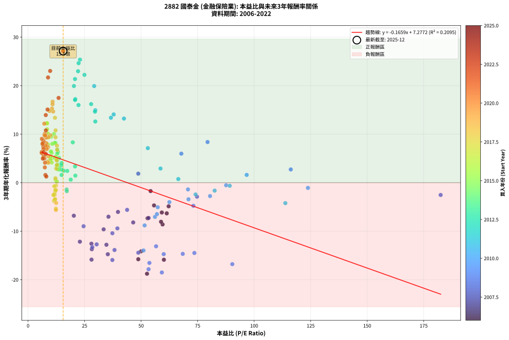
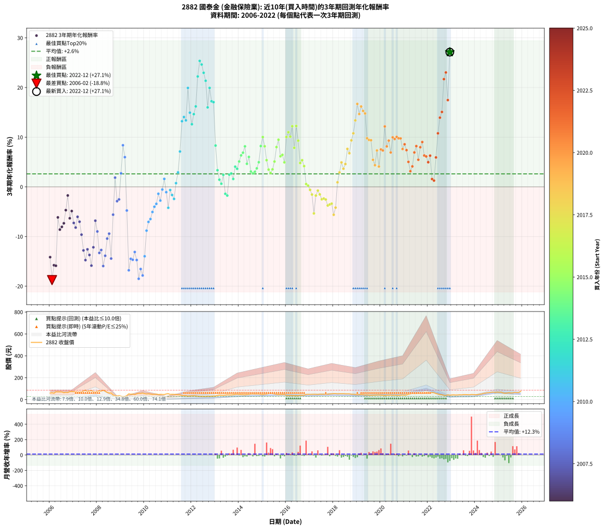

# 2882 國泰金 - 本益比與未來報酬率分析

!!! info "報告資訊"
    - **股票代號**: 2882
    - **公司名稱**: 國泰金
    - **產業別**: 金融保險業
    - **分析期間**: 2006-2022 (204 個數據點)
    - **資料來源**: Type 12 (ShowMonthlyK_ChartFlow) 月收盤價與本益比
    - **報酬率口徑**: 含現金股利 (簡化: 年度合計，假設每年7/1入帳)
    - **報告生成時間**: 2026-01-11 20:54:37 CST

## 📈 視覺化圖表

### 圖表1: 本益比 vs 未來報酬率關係

*圖表1：2882 國泰金 本益比與3年期未來報酬率關係 (2006-2022)*

### 圖表2: 歷年買入時點的3年期實際報酬率

*圖表2：2882 國泰金 歷年買入時點的3年期實際報酬率 (2006-2022)*

## 📍 買點訊號說明

本報告提供兩種買點提示訊號（顯示於圖表2的股價子圖中）：

### ▲ 小綠色三角形（回測驗證）
- **計算方式**: 使用全部歷史資料計算本益比第25百分位數
- **用途**: 事後驗證，顯示歷史上哪些時點確實為低估區
- **限制**: 當下無法判斷，僅供回測參考
- **特性**: 後見之明（Look-Ahead Bias）

### ▲ 小橘色三角形（即時訊號）
- **計算方式**: 使用截至當月的過去5年資料計算本益比第25百分位數
- **用途**: 實際投資決策，當時即可判斷
- **優勢**: 可操作性強，符合實務需求
- **特性**: 無後見之明，滾動窗口計算

!!! tip "如何使用兩種訊號"
    - **綠色▲** 幫助理解歷史估值機會，驗證策略有效性
    - **橘色▲** 可作為實際買進參考，但仍需搭配基本面分析
    - 兩種訊號重疊時，表示即時判斷與事後驗證一致，信心度較高
    - 僅有綠色▲時，表示當時無法判斷（需要未來資料才能確認）
    - 僅有橘色▲時，表示即時判斷為買點，但事後可能不是最佳時機

## 📊 估值分析摘要

| 指標 | 數值 |
|:---:|:---:|
| **目前本益比** (2022-12) | **15.50 倍** |
| **歷史平均本益比** | 28.12 倍 |
| **估值水準** | 🟢 相對低估 |
| **預期3年年化報酬率** | **+4.71%** |
| **歷史平均報酬率** | +2.61% |
| **相關係數 (R²)** | 0.2095 |
| **趨勢線斜率** | -0.1659 |

!!! abstract "核心洞察"
    目前本益比顯著低於歷史平均，預期未來報酬率可能較高

    根據歷史數據回測，2882 國泰金 在目前本益比 **15.5倍** 的估值水準下，
    預期未來3年年化報酬率約為 **+4.7%**。

    **重要提醒**: 本分析基於歷史數據統計，實際報酬率會受到公司基本面變化、產業趨勢、
    總體經濟環境等多重因素影響。R² = 0.21 表示本益比可解釋約 21.0% 的報酬率變異。

## 📈 歷史估值統計

### 最佳買點 (最高報酬率)

| 項目 | 數值 |
|:---:|:---:|
| 起始時間 | 2022-12 |
| 當時本益比 | 15.50 倍 |
| 起始價格 | 40.0 元 |
| 3年後價格 | 75.8 元 |
| **3年年化報酬率** | **+27.13%** |

### 最差買點 (最低報酬率)

| 項目 | 數值 |
|:---:|:---:|
| 起始時間 | 2006-02 |
| 當時本益比 | 52.61 倍 |
| 起始價格 | 62.6 元 |
| 3年後價格 | 28.1 元 |
| **3年年化報酬率** | **-18.77%** |

## 🎯 投資啟示

### 本益比與報酬率關係

趨勢線方程式: **y = -0.1659x + 7.2772**

!!! note "負相關"
    本益比與未來報酬率呈現負相關。較低的本益比通常帶來較高的未來報酬率，
    但相關性不算非常強。**估值仍是重要參考指標之一**。

### 估值區間建議

基於歷史數據分析:

- **🟢 低估區** (P/E < 22.5): 預期報酬率較高，可考慮增加持股
- **🟡 合理區** (P/E 22.5-33.7): 預期報酬率符合長期趨勢，正常持有
- **🔴 高估區** (P/E > 33.7): 預期報酬率較低，可考慮減碼或觀望

!!! danger "風險提示"
    - 過去表現不代表未來結果
    - 本分析假設公司基本面無重大結構性變化
    - 產業環境劇變可能使歷史規律失效
    - 應結合公司財報、產業趨勢、總體經濟等多重因素綜合判斷

!!! success "長期投資觀點"
    歷史數據顯示，在合理或低估的估值水準買入並長期持有，
    往往能獲得較佳的投資報酬。**耐心等待好價格**是價值投資的核心原則。

## 📊 數據品質

- **資料來源**: GoodInfo.tw Type 12 (ShowMonthlyK_ChartFlow)
- **資料頻率**: 月度收盤價與本益比
- **回測期間**: 2006-2022
- **數據點數量**: 204 個 (每個點代表一次3年期回測)

### 計算方法說明

1. **3年期年化報酬率**:
   - 對每個歷史時點，計算其後3年的實際投資報酬率
   - 期末價值(不含股利): 期末價格
   - 期末價值(含現金股利): 期末價格 + 持有期間內的現金股利合計 (簡化: 年度合計，假設每年7/1入帳)
   - 公式: 年化報酬率 = [(期末價值/期初價格)^(1/年數) - 1] × 100%

2. **本益比 (P/E Ratio)**:
   - 使用當時的月收盤價與EPS計算
   - 資料來源: Type 12 月度河流圖本益比數據

3. **趨勢線 (Linear Regression)**:
   - 使用最小平方法擬合線性趨勢線
   - R²值衡量本益比對報酬率的解釋能力

---

*本報告由 Stock Analysis System v1.9.0 自動生成*
*數據更新時間: 2026-01-11 20:54:37 CST*

## 📋 月度回測明細表

（每一列對應時間線圖中的一個買入點；可用來對照 SVG 圖上的每個點。）

| 買入月份 | 賣出月份 | 回測期限_年 | 實際持有年數 | 買入本益比_倍 | 買入收盤價_元 | 賣出收盤價_元 | 現金股利合計_元 | 總報酬率_pct | 年化報酬率_pct |
| --- | --- | --- | --- | --- | --- | --- | --- | --- | --- |
| 2006-01 | 2009-01 | 3 | 3.001 | 50.00 | 59.50 | 32.15 | 5.49 | -36.73 | -14.15 |
| 2006-02 | 2009-02 | 3 | 3.001 | 52.61 | 62.60 | 28.05 | 5.49 | -46.42 | -18.77 |
| 2006-03 | 2009-03 | 3 | 3.001 | 48.74 | 58.00 | 29.15 | 5.49 | -40.27 | -15.78 |
| 2006-04 | 2009-04 | 3 | 3.001 | 60.08 | 71.50 | 37.05 | 5.49 | -40.50 | -15.89 |
| 2006-05 | 2009-05 | 3 | 3.001 | 59.16 | 70.40 | 52.70 | 5.49 | -17.34 | -6.15 |
| 2006-06 | 2009-06 | 3 | 3.001 | 59.50 | 70.80 | 48.55 | 5.49 | -23.67 | -8.61 |
| 2006-07 | 2009-07 | 3 | 3.001 | 58.82 | 70.00 | 50.40 | 4.00 | -22.29 | -8.06 |
| 2006-08 | 2009-08 | 3 | 3.001 | 52.86 | 62.90 | 46.05 | 4.00 | -20.43 | -7.33 |
| 2006-09 | 2009-09 | 3 | 3.001 | 55.71 | 66.30 | 53.40 | 4.00 | -13.42 | -4.69 |
| 2006-10 | 2009-10 | 3 | 3.001 | 54.20 | 64.50 | 57.20 | 4.00 | -5.12 | -1.73 |
| 2006-11 | 2009-11 | 3 | 3.001 | 61.34 | 73.00 | 56.00 | 4.00 | -17.81 | -6.33 |
| 2006-12 | 2009-12 | 3 | 3.001 | 62.18 | 74.00 | 59.70 | 4.00 | -13.92 | -4.87 |
| 2007-01 | 2010-01 | 3 | 3.001 | 53.32 | 73.00 | 54.20 | 4.00 | -20.27 | -7.27 |
| 2007-02 | 2010-02 | 3 | 3.001 | 46.50 | 72.00 | 51.70 | 4.00 | -22.64 | -8.20 |
| 2007-03 | 2010-03 | 3 | 3.001 | 39.77 | 68.70 | 53.00 | 4.00 | -17.03 | -6.03 |
| 2007-04 | 2010-04 | 3 | 3.001 | 35.56 | 67.80 | 50.50 | 4.00 | -19.62 | -7.02 |
| 2007-05 | 2010-05 | 3 | 3.001 | 33.42 | 69.70 | 47.45 | 4.00 | -26.18 | -9.62 |
| 2007-06 | 2010-06 | 3 | 3.001 | 34.66 | 78.50 | 48.05 | 4.00 | -33.69 | -12.80 |
| 2007-07 | 2010-07 | 3 | 3.001 | 35.27 | 86.20 | 50.40 | 3.00 | -38.05 | -14.75 |
| 2007-08 | 2010-08 | 3 | 3.001 | 28.02 | 73.50 | 46.10 | 3.00 | -33.20 | -12.58 |
| 2007-09 | 2010-09 | 3 | 3.001 | 28.19 | 79.00 | 47.75 | 3.00 | -35.76 | -13.71 |
| 2007-10 | 2010-10 | 3 | 3.001 | 28.07 | 83.70 | 46.85 | 3.00 | -40.44 | -15.86 |
| 2007-11 | 2010-11 | 3 | 3.001 | 22.91 | 72.40 | 46.05 | 3.00 | -32.25 | -12.17 |
| 2007-12 | 2010-12 | 3 | 3.001 | 20.24 | 67.60 | 51.70 | 3.00 | -19.08 | -6.81 |
| 2008-01 | 2011-01 | 3 | 3.001 | 24.56 | 75.60 | 54.00 | 3.00 | -24.60 | -8.98 |
| 2008-02 | 2011-03 | 3 | 3.080 | 28.40 | 80.00 | 48.55 | 3.00 | -35.56 | -13.30 |
| 2008-03 | 2011-03 | 3 | 2.998 | 30.33 | 77.50 | 48.55 | 3.00 | -33.48 | -12.72 |
| 2008-04 | 2011-04 | 3 | 2.998 | 37.28 | 85.50 | 47.80 | 3.00 | -40.58 | -15.94 |
| 2008-05 | 2011-05 | 3 | 2.998 | 38.24 | 77.70 | 46.65 | 3.00 | -36.10 | -13.88 |
| 2008-06 | 2011-06 | 3 | 2.998 | 37.29 | 66.00 | 44.45 | 3.00 | -28.11 | -10.42 |
| 2008-07 | 2011-07 | 3 | 2.998 | 39.51 | 59.60 | 43.20 | 1.10 | -25.67 | -9.42 |
| 2008-08 | 2011-08 | 3 | 2.998 | 48.77 | 60.80 | 37.00 | 1.10 | -37.34 | -14.44 |
| 2008-09 | 2011-09 | 3 | 2.998 | 43.81 | 43.15 | 35.20 | 1.10 | -15.87 | -5.60 |
| 2008-10 | 2011-10 | 3 | 2.998 | 48.73 | 35.25 | 36.15 | 1.10 | +5.67 | +1.86 |
| 2008-11 | 2011-11 | 3 | 2.998 | 74.73 | 34.50 | 30.50 | 1.10 | -8.41 | -2.89 |
| 2008-12 | 2011-12 | 3 | 2.998 | 182.50 | 36.50 | 32.70 | 1.10 | -7.40 | -2.53 |
| 2009-01 | 2012-01 | 3 | 2.998 | 116.20 | 32.15 | 33.75 | 1.10 | +8.40 | +2.73 |
| 2009-02 | 2012-02 | 3 | 2.998 | 79.39 | 28.05 | 34.60 | 1.10 | +27.27 | +8.38 |
| 2009-03 | 2012-03 | 3 | 3.001 | 67.79 | 29.15 | 33.60 | 1.10 | +19.04 | +5.98 |
| 2009-04 | 2012-04 | 3 | 3.001 | 73.12 | 37.05 | 30.90 | 1.10 | -13.63 | -4.77 |
| 2009-05 | 2012-05 | 3 | 3.001 | 90.34 | 52.70 | 29.25 | 1.10 | -42.41 | -16.80 |
| 2009-06 | 2012-06 | 3 | 3.001 | 73.56 | 48.55 | 29.25 | 1.10 | -37.49 | -14.49 |
| 2009-07 | 2012-07 | 3 | 3.001 | 68.42 | 50.40 | 29.70 | 1.60 | -37.90 | -14.68 |
| 2009-08 | 2012-08 | 3 | 3.001 | 56.62 | 46.05 | 28.60 | 1.60 | -34.42 | -13.12 |
| 2009-09 | 2012-09 | 3 | 3.001 | 60.00 | 53.40 | 31.50 | 1.60 | -38.01 | -14.73 |
| 2009-10 | 2012-10 | 3 | 3.001 | 59.17 | 57.20 | 29.35 | 1.60 | -45.89 | -18.51 |
| 2009-11 | 2012-11 | 3 | 3.001 | 53.67 | 56.00 | 30.95 | 1.60 | -41.88 | -16.54 |
| 2009-12 | 2012-12 | 3 | 3.001 | 53.30 | 59.70 | 31.50 | 1.60 | -44.56 | -17.84 |
| 2010-01 | 2013-01 | 3 | 3.001 | 51.06 | 54.20 | 32.90 | 1.60 | -36.35 | -13.98 |
| 2010-02 | 2013-02 | 3 | 3.001 | 51.55 | 51.70 | 37.60 | 1.60 | -24.18 | -8.81 |
| 2010-03 | 2013-03 | 3 | 3.001 | 56.12 | 53.00 | 40.95 | 1.60 | -19.72 | -7.06 |
| 2010-04 | 2013-04 | 3 | 3.001 | 57.00 | 50.50 | 39.70 | 1.60 | -18.22 | -6.48 |
| 2010-05 | 2013-05 | 3 | 3.001 | 57.35 | 47.45 | 39.00 | 1.60 | -14.44 | -5.06 |
| 2010-06 | 2013-06 | 3 | 3.001 | 62.50 | 48.05 | 40.90 | 1.60 | -11.55 | -4.01 |
| 2010-07 | 2013-07 | 3 | 3.001 | 70.95 | 50.40 | 43.60 | 1.80 | -9.92 | -3.42 |
| 2010-08 | 2013-08 | 3 | 3.001 | 70.73 | 46.10 | 42.40 | 1.80 | -4.12 | -1.39 |
| 2010-09 | 2013-09 | 3 | 3.001 | 80.49 | 47.75 | 42.10 | 1.80 | -8.06 | -2.76 |
| 2010-10 | 2013-10 | 3 | 3.001 | 87.61 | 46.85 | 44.30 | 1.80 | -1.60 | -0.54 |
| 2010-11 | 2013-11 | 3 | 3.001 | 96.70 | 46.05 | 46.50 | 1.80 | +4.89 | +1.60 |
| 2010-12 | 2013-12 | 3 | 3.001 | 123.80 | 51.70 | 48.25 | 1.80 | -3.19 | -1.08 |
| 2011-01 | 2014-01 | 3 | 3.001 | 113.80 | 54.00 | 45.65 | 1.80 | -12.13 | -4.22 |
| 2011-02 | 2014-02 | 3 | 3.001 | 89.20 | 47.40 | 44.70 | 1.80 | -1.90 | -0.64 |
| 2011-03 | 2014-03 | 3 | 3.001 | 82.53 | 48.55 | 44.40 | 1.80 | -4.84 | -1.64 |
| 2011-04 | 2014-04 | 3 | 3.001 | 74.09 | 47.80 | 42.60 | 1.80 | -7.11 | -2.43 |
| 2011-05 | 2014-05 | 3 | 3.001 | 66.45 | 46.65 | 45.90 | 1.80 | +2.25 | +0.74 |
| 2011-06 | 2014-06 | 3 | 3.001 | 58.58 | 44.45 | 46.65 | 1.80 | +9.00 | +2.91 |
| 2011-07 | 2014-07 | 3 | 3.001 | 52.96 | 43.20 | 50.40 | 2.70 | +22.92 | +7.12 |
| 2011-08 | 2014-08 | 3 | 3.001 | 42.40 | 37.00 | 51.00 | 2.70 | +45.14 | +13.22 |
| 2011-09 | 2014-09 | 3 | 3.001 | 37.87 | 35.20 | 49.55 | 2.70 | +48.44 | +14.07 |
| 2011-10 | 2014-10 | 3 | 3.001 | 36.65 | 36.15 | 50.00 | 2.70 | +45.78 | +13.38 |
| 2011-11 | 2014-11 | 3 | 3.001 | 29.24 | 30.50 | 49.90 | 2.70 | +72.46 | +19.92 |
| 2011-12 | 2014-12 | 3 | 3.001 | 29.73 | 32.70 | 46.95 | 2.70 | +51.83 | +14.93 |
| 2012-01 | 2015-01 | 3 | 3.001 | 29.74 | 33.75 | 45.50 | 2.70 | +42.81 | +12.61 |
| 2012-02 | 2015-03 | 3 | 3.080 | 29.59 | 34.60 | 50.00 | 2.70 | +52.31 | +14.64 |
| 2012-03 | 2015-03 | 3 | 2.998 | 27.90 | 33.60 | 50.00 | 2.70 | +56.85 | +16.20 |
| 2012-04 | 2015-04 | 3 | 2.998 | 24.94 | 30.90 | 53.70 | 2.70 | +82.52 | +22.23 |
| 2012-05 | 2015-05 | 3 | 2.998 | 22.97 | 29.25 | 54.90 | 2.70 | +96.92 | +25.36 |
| 2012-06 | 2015-06 | 3 | 2.998 | 22.36 | 29.25 | 53.90 | 2.70 | +93.50 | +24.63 |
| 2012-07 | 2015-07 | 3 | 2.998 | 22.11 | 29.70 | 51.00 | 4.20 | +85.86 | +22.97 |
| 2012-08 | 2015-08 | 3 | 2.998 | 20.76 | 28.60 | 46.90 | 4.20 | +78.67 | +21.36 |
| 2012-09 | 2015-09 | 3 | 2.998 | 22.30 | 31.50 | 44.95 | 4.20 | +56.03 | +16.00 |
| 2012-10 | 2015-10 | 3 | 2.998 | 20.28 | 29.35 | 46.40 | 4.20 | +72.40 | +19.92 |
| 2012-11 | 2015-11 | 3 | 2.998 | 20.89 | 30.95 | 45.65 | 4.20 | +61.07 | +17.23 |
| 2012-12 | 2015-12 | 3 | 2.998 | 20.77 | 31.50 | 46.30 | 4.20 | +60.32 | +17.05 |
| 2013-01 | 2016-01 | 3 | 2.998 | 19.78 | 32.90 | 37.60 | 4.20 | +27.05 | +8.31 |
| 2013-02 | 2016-02 | 3 | 2.998 | 20.77 | 37.60 | 37.30 | 4.20 | +10.37 | +3.35 |
| 2013-03 | 2016-03 | 3 | 3.001 | 20.92 | 40.95 | 38.55 | 4.20 | +4.40 | +1.44 |
| 2013-04 | 2016-04 | 3 | 3.001 | 18.86 | 39.70 | 36.25 | 4.20 | +1.89 | +0.63 |
| 2013-05 | 2016-05 | 3 | 3.001 | 17.32 | 39.00 | 37.70 | 4.20 | +7.44 | +2.42 |
| 2013-06 | 2016-06 | 3 | 3.001 | 17.05 | 40.90 | 35.00 | 4.20 | -4.16 | -1.40 |
| 2013-07 | 2016-07 | 3 | 3.001 | 17.13 | 43.60 | 35.85 | 5.50 | -5.16 | -1.75 |
| 2013-08 | 2016-08 | 3 | 3.001 | 15.75 | 42.40 | 40.10 | 5.50 | +7.55 | +2.45 |
| 2013-09 | 2016-09 | 3 | 3.001 | 14.83 | 42.10 | 40.10 | 5.50 | +8.31 | +2.70 |
| 2013-10 | 2016-10 | 3 | 3.001 | 14.83 | 44.30 | 40.95 | 5.50 | +4.85 | +1.59 |
| 2013-11 | 2016-11 | 3 | 3.001 | 14.84 | 46.50 | 46.90 | 5.50 | +12.69 | +4.06 |
| 2013-12 | 2016-12 | 3 | 3.001 | 14.71 | 48.25 | 48.20 | 5.50 | +11.30 | +3.63 |
| 2014-01 | 2017-01 | 3 | 3.001 | 13.69 | 45.65 | 47.50 | 5.50 | +16.10 | +5.10 |
| 2014-02 | 2017-02 | 3 | 3.001 | 13.19 | 44.70 | 48.25 | 5.50 | +20.25 | +6.34 |
| 2014-03 | 2017-03 | 3 | 3.001 | 12.90 | 44.40 | 48.70 | 5.50 | +22.07 | +6.87 |
| 2014-04 | 2017-04 | 3 | 3.001 | 12.18 | 42.60 | 48.40 | 5.50 | +26.53 | +8.16 |
| 2014-05 | 2017-05 | 3 | 3.001 | 12.92 | 45.90 | 47.10 | 5.50 | +14.60 | +4.65 |
| 2014-06 | 2017-06 | 3 | 3.001 | 12.94 | 46.65 | 50.10 | 5.50 | +19.19 | +6.02 |
| 2014-07 | 2017-07 | 3 | 3.001 | 13.77 | 50.40 | 49.20 | 6.00 | +9.52 | +3.08 |
| 2014-08 | 2017-08 | 3 | 3.001 | 13.73 | 51.00 | 49.25 | 6.00 | +8.33 | +2.70 |
| 2014-09 | 2017-09 | 3 | 3.001 | 13.15 | 49.55 | 48.20 | 6.00 | +9.38 | +3.03 |
| 2014-10 | 2017-10 | 3 | 3.001 | 13.08 | 50.00 | 49.80 | 6.00 | +11.60 | +3.73 |
| 2014-11 | 2017-11 | 3 | 3.001 | 12.87 | 49.90 | 51.70 | 6.00 | +15.63 | +4.96 |
| 2014-12 | 2017-12 | 3 | 3.001 | 11.95 | 46.95 | 53.50 | 6.00 | +26.73 | +8.21 |
| 2015-01 | 2018-01 | 3 | 3.001 | 11.42 | 45.50 | 54.60 | 6.00 | +33.19 | +10.02 |
| 2015-02 | 2018-02 | 3 | 3.001 | 11.84 | 47.80 | 54.50 | 6.00 | +26.57 | +8.17 |
| 2015-03 | 2018-03 | 3 | 3.001 | 12.22 | 50.00 | 52.50 | 6.00 | +17.00 | +5.37 |
| 2015-04 | 2018-04 | 3 | 3.001 | 12.95 | 53.70 | 53.50 | 6.00 | +10.80 | +3.48 |
| 2015-05 | 2018-05 | 3 | 3.001 | 13.07 | 54.90 | 53.60 | 6.00 | +8.56 | +2.78 |
| 2015-06 | 2018-06 | 3 | 3.001 | 12.67 | 53.90 | 53.80 | 6.00 | +10.95 | +3.52 |
| 2015-07 | 2018-07 | 3 | 3.001 | 11.84 | 51.00 | 52.70 | 6.50 | +16.08 | +5.09 |
| 2015-08 | 2018-08 | 3 | 3.001 | 10.75 | 46.90 | 52.60 | 6.50 | +26.01 | +8.01 |
| 2015-09 | 2018-09 | 3 | 3.001 | 10.18 | 44.95 | 52.50 | 6.50 | +31.26 | +9.49 |
| 2015-10 | 2018-10 | 3 | 3.001 | 10.38 | 46.40 | 49.00 | 6.50 | +19.61 | +6.15 |
| 2015-11 | 2018-11 | 3 | 3.001 | 10.09 | 45.65 | 48.55 | 6.50 | +20.59 | +6.44 |
| 2015-12 | 2018-12 | 3 | 3.001 | 10.11 | 46.30 | 47.00 | 6.50 | +15.55 | +4.93 |
| 2016-01 | 2019-01 | 3 | 3.001 | 8.33 | 37.60 | 43.60 | 6.50 | +33.24 | +10.04 |
| 2016-02 | 2019-03 | 3 | 3.080 | 8.39 | 37.30 | 44.95 | 6.50 | +37.94 | +11.01 |
| 2016-03 | 2019-03 | 3 | 2.998 | 8.80 | 38.55 | 44.95 | 6.50 | +33.46 | +10.11 |
| 2016-04 | 2019-04 | 3 | 2.998 | 8.40 | 36.25 | 44.70 | 6.50 | +41.24 | +12.21 |
| 2016-05 | 2019-05 | 3 | 2.998 | 8.87 | 37.70 | 40.80 | 6.50 | +25.46 | +7.86 |
| 2016-06 | 2019-06 | 3 | 2.998 | 8.36 | 35.00 | 43.00 | 6.50 | +41.43 | +12.26 |
| 2016-07 | 2019-07 | 3 | 2.998 | 8.70 | 35.85 | 40.80 | 6.00 | +30.54 | +9.30 |
| 2016-08 | 2019-08 | 3 | 2.998 | 9.89 | 40.10 | 40.15 | 6.00 | +15.09 | +4.80 |
| 2016-09 | 2019-09 | 3 | 2.998 | 10.06 | 40.10 | 40.90 | 6.00 | +16.96 | +5.36 |
| 2016-10 | 2019-10 | 3 | 2.998 | 10.44 | 40.95 | 40.30 | 6.00 | +13.06 | +4.18 |
| 2016-11 | 2019-11 | 3 | 2.998 | 12.16 | 46.90 | 41.70 | 6.00 | +1.71 | +0.57 |
| 2016-12 | 2019-12 | 3 | 2.998 | 12.72 | 48.20 | 42.55 | 6.00 | +0.73 | +0.24 |
| 2017-01 | 2020-01 | 3 | 2.998 | 12.35 | 47.50 | 40.65 | 6.00 | -1.79 | -0.60 |
| 2017-02 | 2020-02 | 3 | 2.998 | 12.36 | 48.25 | 40.05 | 6.00 | -4.56 | -1.54 |
| 2017-03 | 2020-03 | 3 | 3.001 | 12.30 | 48.70 | 35.30 | 6.00 | -15.20 | -5.34 |
| 2017-04 | 2020-04 | 3 | 3.001 | 12.05 | 48.40 | 39.90 | 6.00 | -5.17 | -1.75 |
| 2017-05 | 2020-05 | 3 | 3.001 | 11.56 | 47.10 | 40.05 | 6.00 | -2.23 | -0.75 |
| 2017-06 | 2020-06 | 3 | 3.001 | 12.13 | 50.10 | 41.85 | 6.00 | -4.49 | -1.52 |
| 2017-07 | 2020-07 | 3 | 3.001 | 11.75 | 49.20 | 39.60 | 6.00 | -7.32 | -2.50 |
| 2017-08 | 2020-08 | 3 | 3.001 | 11.61 | 49.25 | 39.85 | 6.00 | -6.90 | -2.36 |
| 2017-09 | 2020-09 | 3 | 3.001 | 11.21 | 48.20 | 38.60 | 6.00 | -7.47 | -2.55 |
| 2017-10 | 2020-10 | 3 | 3.001 | 11.43 | 49.80 | 38.40 | 6.00 | -10.84 | -3.75 |
| 2017-11 | 2020-11 | 3 | 3.001 | 11.71 | 51.70 | 40.40 | 6.00 | -10.25 | -3.54 |
| 2017-12 | 2020-12 | 3 | 3.001 | 11.97 | 53.50 | 42.25 | 6.00 | -9.81 | -3.38 |
| 2018-01 | 2021-01 | 3 | 3.001 | 12.33 | 54.60 | 39.90 | 6.00 | -15.93 | -5.62 |
| 2018-02 | 2021-02 | 3 | 3.001 | 12.43 | 54.50 | 41.95 | 6.00 | -12.02 | -4.18 |
| 2018-03 | 2021-03 | 3 | 3.001 | 12.10 | 52.50 | 47.95 | 6.00 | +2.76 | +0.91 |
| 2018-04 | 2021-04 | 3 | 3.001 | 12.45 | 53.50 | 52.30 | 6.00 | +8.97 | +2.90 |
| 2018-05 | 2021-05 | 3 | 3.001 | 12.60 | 53.60 | 55.90 | 6.00 | +15.49 | +4.91 |
| 2018-06 | 2021-06 | 3 | 3.001 | 12.78 | 53.80 | 53.90 | 6.00 | +11.34 | +3.64 |
| 2018-07 | 2021-07 | 3 | 3.001 | 12.65 | 52.70 | 54.30 | 6.00 | +14.42 | +4.59 |
| 2018-08 | 2021-08 | 3 | 3.001 | 12.76 | 52.60 | 59.60 | 6.00 | +24.71 | +7.64 |
| 2018-09 | 2021-09 | 3 | 3.001 | 12.87 | 52.50 | 57.90 | 6.00 | +21.71 | +6.77 |
| 2018-10 | 2021-10 | 3 | 3.001 | 12.14 | 49.00 | 58.10 | 6.00 | +30.82 | +9.37 |
| 2018-11 | 2021-11 | 3 | 3.001 | 12.16 | 48.55 | 60.00 | 6.00 | +35.94 | +10.77 |
| 2018-12 | 2021-12 | 3 | 3.001 | 11.90 | 47.00 | 62.50 | 6.00 | +45.74 | +13.38 |
| 2019-01 | 2022-01 | 3 | 3.001 | 10.85 | 43.60 | 63.30 | 6.00 | +58.94 | +16.70 |
| 2019-02 | 2022-02 | 3 | 3.001 | 11.09 | 45.30 | 62.30 | 6.00 | +50.77 | +14.66 |
| 2019-03 | 2022-03 | 3 | 3.001 | 10.82 | 44.95 | 64.50 | 6.00 | +56.84 | +16.18 |
| 2019-04 | 2022-04 | 3 | 3.001 | 10.59 | 44.70 | 62.50 | 6.00 | +53.24 | +15.29 |
| 2019-05 | 2022-05 | 3 | 3.001 | 9.52 | 40.80 | 55.70 | 6.00 | +51.23 | +14.78 |
| 2019-06 | 2022-06 | 3 | 3.001 | 9.87 | 43.00 | 50.90 | 6.00 | +32.33 | +9.78 |
| 2019-07 | 2022-07 | 3 | 3.001 | 9.23 | 40.80 | 45.50 | 8.00 | +31.13 | +9.45 |
| 2019-08 | 2022-08 | 3 | 3.001 | 8.94 | 40.15 | 44.55 | 8.00 | +30.88 | +9.38 |
| 2019-09 | 2022-09 | 3 | 3.001 | 8.97 | 40.90 | 39.95 | 8.00 | +17.24 | +5.44 |
| 2019-10 | 2022-10 | 3 | 3.001 | 8.71 | 40.30 | 37.80 | 8.00 | +13.65 | +4.36 |
| 2019-11 | 2022-11 | 3 | 3.001 | 8.89 | 41.70 | 43.55 | 8.00 | +23.62 | +7.32 |
| 2019-12 | 2022-12 | 3 | 3.001 | 8.94 | 42.55 | 40.00 | 8.00 | +12.81 | +4.10 |
| 2020-01 | 2023-01 | 3 | 3.001 | 8.44 | 40.65 | 42.55 | 8.00 | +24.35 | +7.53 |
| 2020-02 | 2023-03 | 3 | 3.080 | 8.23 | 40.05 | 41.80 | 8.00 | +24.34 | +7.33 |
| 2020-03 | 2023-03 | 3 | 2.998 | 7.17 | 35.30 | 41.80 | 8.00 | +41.08 | +12.16 |
| 2020-04 | 2023-04 | 3 | 2.998 | 8.02 | 39.90 | 42.45 | 8.00 | +26.44 | +8.14 |
| 2020-05 | 2023-05 | 3 | 2.998 | 7.96 | 40.05 | 44.30 | 8.00 | +30.59 | +9.31 |
| 2020-06 | 2023-06 | 3 | 2.998 | 8.23 | 41.85 | 43.15 | 8.00 | +22.22 | +6.92 |
| 2020-07 | 2023-07 | 3 | 2.998 | 7.71 | 39.60 | 45.75 | 6.90 | +32.95 | +9.97 |
| 2020-08 | 2023-08 | 3 | 2.998 | 7.67 | 39.85 | 45.60 | 6.90 | +31.74 | +9.63 |
| 2020-09 | 2023-09 | 3 | 2.998 | 7.36 | 38.60 | 44.55 | 6.90 | +33.29 | +10.06 |
| 2020-10 | 2023-10 | 3 | 2.998 | 7.24 | 38.40 | 43.90 | 6.90 | +32.29 | +9.78 |
| 2020-11 | 2023-11 | 3 | 2.998 | 7.54 | 40.40 | 46.50 | 6.90 | +32.18 | +9.75 |
| 2020-12 | 2023-12 | 3 | 2.998 | 7.81 | 42.25 | 45.75 | 6.90 | +24.62 | +7.62 |
| 2021-01 | 2024-01 | 3 | 2.998 | 6.85 | 39.90 | 44.15 | 6.90 | +27.94 | +8.57 |
| 2021-02 | 2024-02 | 3 | 2.998 | 6.73 | 41.95 | 45.05 | 6.90 | +23.84 | +7.39 |
| 2021-03 | 2024-03 | 3 | 3.001 | 7.22 | 47.95 | 48.65 | 6.90 | +15.85 | +5.03 |
| 2021-04 | 2024-04 | 3 | 3.001 | 7.41 | 52.30 | 50.50 | 6.90 | +9.75 | +3.15 |
| 2021-05 | 2024-05 | 3 | 3.001 | 7.49 | 55.90 | 56.20 | 6.90 | +12.88 | +4.12 |
| 2021-06 | 2024-06 | 3 | 3.001 | 6.84 | 53.90 | 59.00 | 6.90 | +22.26 | +6.93 |
| 2021-07 | 2024-07 | 3 | 3.001 | 6.55 | 54.30 | 62.40 | 6.40 | +26.70 | +8.21 |
| 2021-08 | 2024-08 | 3 | 3.001 | 6.85 | 59.60 | 63.50 | 6.40 | +17.28 | +5.46 |
| 2021-09 | 2024-09 | 3 | 3.001 | 6.36 | 57.90 | 66.50 | 6.40 | +25.91 | +7.98 |
| 2021-10 | 2024-10 | 3 | 3.001 | 6.10 | 58.10 | 68.90 | 6.40 | +29.60 | +9.03 |
| 2021-11 | 2024-11 | 3 | 3.001 | 6.04 | 60.00 | 65.70 | 6.40 | +20.17 | +6.31 |
| 2021-12 | 2024-12 | 3 | 3.001 | 6.04 | 62.50 | 68.30 | 6.40 | +19.52 | +6.12 |
| 2022-01 | 2025-01 | 3 | 3.001 | 6.53 | 63.30 | 66.80 | 6.40 | +15.64 | +4.96 |
| 2022-02 | 2025-02 | 3 | 3.001 | 6.89 | 62.30 | 68.40 | 6.40 | +20.06 | +6.28 |
| 2022-03 | 2025-03 | 3 | 3.001 | 7.68 | 64.50 | 61.20 | 6.40 | +4.81 | +1.58 |
| 2022-04 | 2025-04 | 3 | 3.001 | 8.06 | 62.50 | 58.50 | 6.40 | +3.84 | +1.26 |
| 2022-05 | 2025-05 | 3 | 3.001 | 7.84 | 55.70 | 59.80 | 6.40 | +18.85 | +5.92 |
| 2022-06 | 2025-06 | 3 | 3.001 | 7.88 | 50.90 | 62.80 | 6.40 | +35.95 | +10.78 |
| 2022-07 | 2025-07 | 3 | 3.001 | 7.83 | 45.50 | 60.90 | 6.40 | +47.91 | +13.93 |
| 2022-08 | 2025-08 | 3 | 3.001 | 8.62 | 44.55 | 61.50 | 6.40 | +52.41 | +15.08 |
| 2022-09 | 2025-09 | 3 | 3.001 | 8.84 | 39.95 | 65.60 | 6.40 | +80.23 | +21.69 |
| 2022-10 | 2025-10 | 3 | 3.001 | 9.76 | 37.80 | 64.00 | 6.40 | +86.24 | +23.03 |
| 2022-11 | 2025-11 | 3 | 3.001 | 13.50 | 43.55 | 64.20 | 6.40 | +62.11 | +17.47 |
| 2022-12 | 2025-12 | 3 | 3.001 | 15.50 | 40.00 | 75.80 | 6.40 | +105.50 | +27.13 |
