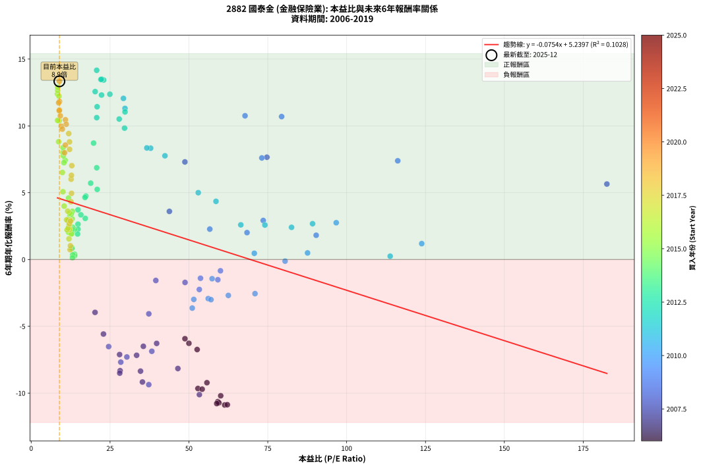
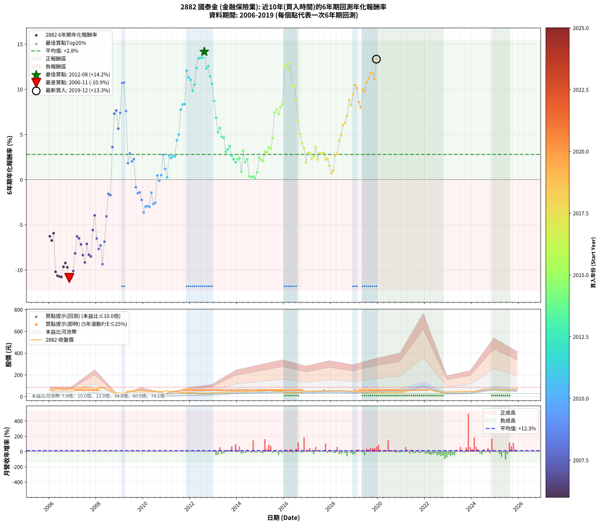

# 2882 國泰金 - 本益比與未來報酬率分析

!!! info "報告資訊"
    - **股票代號**: 2882
    - **公司名稱**: 國泰金
    - **產業別**: 金融保險業
    - **分析期間**: 2006-2019 (168 個數據點)
    - **資料來源**: Type 12 (ShowMonthlyK_ChartFlow) 月收盤價與本益比
    - **報酬率口徑**: 含現金股利 (簡化: 年度合計，假設每年7/1入帳)
    - **報告生成時間**: 2026-01-22 23:04:44 CST

## 📈 視覺化圖表

### 圖表1: 本益比 vs 未來報酬率關係

*圖表1：2882 國泰金 本益比與6年期未來報酬率關係 (2006-2019)*

### 圖表2: 歷年買入時點的6年期實際報酬率

*圖表2：2882 國泰金 歷年買入時點的6年期實際報酬率 (2006-2019)*

## 📍 買點訊號說明

本報告提供兩種買點提示訊號（顯示於圖表2的股價子圖中）：

### ▲ 小綠色三角形（回測驗證）
- **計算方式**: 使用全部歷史資料計算本益比第25百分位數
- **用途**: 事後驗證，顯示歷史上哪些時點確實為低估區
- **限制**: 當下無法判斷，僅供回測參考
- **特性**: 後見之明（Look-Ahead Bias）

### ▲ 小橘色三角形（即時訊號）
- **計算方式**: 使用截至當月的過去5年資料計算本益比第25百分位數
- **用途**: 實際投資決策，當時即可判斷
- **優勢**: 可操作性強，符合實務需求
- **特性**: 無後見之明，滾動窗口計算

!!! tip "如何使用兩種訊號"
    - **綠色▲** 幫助理解歷史估值機會，驗證策略有效性
    - **橘色▲** 可作為實際買進參考，但仍需搭配基本面分析
    - 兩種訊號重疊時，表示即時判斷與事後驗證一致，信心度較高
    - 僅有綠色▲時，表示當時無法判斷（需要未來資料才能確認）
    - 僅有橘色▲時，表示即時判斷為買點，但事後可能不是最佳時機

## 📊 估值分析摘要

| 指標 | 數值 |
|:---:|:---:|
| **目前本益比** (2019-12) | **8.94 倍** |
| **歷史平均本益比** | 32.47 倍 |
| **估值水準** | 🟢 相對低估 |
| **預期6年年化報酬率** | **+4.57%** |
| **歷史平均報酬率** | +2.79% |
| **相關係數 (R²)** | 0.1028 |
| **趨勢線斜率** | -0.0754 |

!!! abstract "核心洞察"
    目前本益比顯著低於歷史平均，預期未來報酬率可能較高

    根據歷史數據回測，2882 國泰金 在目前本益比 **8.9倍** 的估值水準下，
    預期未來6年年化報酬率約為 **+4.6%**。

    **重要提醒**: 本分析基於歷史數據統計，實際報酬率會受到公司基本面變化、產業趨勢、
    總體經濟環境等多重因素影響。R² = 0.10 表示本益比可解釋約 10.3% 的報酬率變異。

## 📈 歷史估值統計

### 最佳買點 (最高報酬率)

| 項目 | 數值 |
|:---:|:---:|
| 起始時間 | 2012-08 |
| 當時本益比 | 20.76 倍 |
| 起始價格 | 28.6 元 |
| 6年後價格 | 52.6 元 |
| **6年年化報酬率** | **+14.16%** |

### 最差買點 (最低報酬率)

| 項目 | 數值 |
|:---:|:---:|
| 起始時間 | 2006-11 |
| 當時本益比 | 61.34 倍 |
| 起始價格 | 73.0 元 |
| 6年後價格 | 30.9 元 |
| **6年年化報酬率** | **-10.89%** |

## 🎯 投資啟示

### 本益比與報酬率關係

趨勢線方程式: **y = -0.0754x + 5.2397**

!!! note "負相關"
    本益比與未來報酬率呈現負相關。較低的本益比通常帶來較高的未來報酬率，
    但相關性不算非常強。**估值仍是重要參考指標之一**。

### 估值區間建議

基於歷史數據分析:

- **🟢 低估區** (P/E < 26.0): 預期報酬率較高，可考慮增加持股
- **🟡 合理區** (P/E 26.0-39.0): 預期報酬率符合長期趨勢，正常持有
- **🔴 高估區** (P/E > 39.0): 預期報酬率較低，可考慮減碼或觀望

!!! danger "風險提示"
    - 過去表現不代表未來結果
    - 本分析假設公司基本面無重大結構性變化
    - 產業環境劇變可能使歷史規律失效
    - 應結合公司財報、產業趨勢、總體經濟等多重因素綜合判斷

!!! success "長期投資觀點"
    歷史數據顯示，在合理或低估的估值水準買入並長期持有，
    往往能獲得較佳的投資報酬。**耐心等待好價格**是價值投資的核心原則。

## 📊 數據品質

- **資料來源**: GoodInfo.tw Type 12 (ShowMonthlyK_ChartFlow)
- **資料頻率**: 月度收盤價與本益比
- **回測期間**: 2006-2019
- **數據點數量**: 168 個 (每個點代表一次6年期回測)

### 計算方法說明

1. **6年期年化報酬率**:
   - 對每個歷史時點，計算其後6年的實際投資報酬率
   - 期末價值(不含股利): 期末價格
   - 期末價值(含現金股利): 期末價格 + 持有期間內的現金股利合計 (簡化: 年度合計，假設每年7/1入帳)
   - 公式: 年化報酬率 = [(期末價值/期初價格)^(1/年數) - 1] × 100%

2. **本益比 (P/E Ratio)**:
   - 使用當時的月收盤價與EPS計算
   - 資料來源: Type 12 月度河流圖本益比數據

3. **趨勢線 (Linear Regression)**:
   - 使用最小平方法擬合線性趨勢線
   - R²值衡量本益比對報酬率的解釋能力

---

*本報告由 Stock Analysis System v1.9.0 自動生成*
*數據更新時間: 2026-01-22 23:04:44 CST*

## 📋 月度回測明細表

（每一列對應時間線圖中的一個買入點；可用來對照 SVG 圖上的每個點。）

| 買入月份 | 賣出月份 | 回測期限_年 | 實際持有年數 | 買入本益比_倍 | 買入收盤價_元 | 賣出收盤價_元 | 現金股利合計_元 | 總報酬率_pct | 年化報酬率_pct |
| --- | --- | --- | --- | --- | --- | --- | --- | --- | --- |
| 2006-01 | 2012-01 | 6 | 5.999 | 50.00 | 59.50 | 33.75 | 6.59 | -32.20 | -6.27 |
| 2006-02 | 2012-02 | 6 | 5.999 | 52.61 | 62.60 | 34.60 | 6.59 | -34.20 | -6.74 |
| 2006-03 | 2012-03 | 6 | 6.001 | 48.74 | 58.00 | 33.60 | 6.59 | -30.70 | -5.93 |
| 2006-04 | 2012-04 | 6 | 6.001 | 60.08 | 71.50 | 30.90 | 6.59 | -47.56 | -10.20 |
| 2006-05 | 2012-05 | 6 | 6.001 | 59.16 | 70.40 | 29.25 | 6.59 | -49.09 | -10.64 |
| 2006-06 | 2012-06 | 6 | 6.001 | 59.50 | 70.80 | 29.25 | 6.59 | -49.37 | -10.72 |
| 2006-07 | 2012-07 | 6 | 6.001 | 58.82 | 70.00 | 29.70 | 5.60 | -49.57 | -10.78 |
| 2006-08 | 2012-08 | 6 | 6.001 | 52.86 | 62.90 | 28.60 | 5.60 | -45.63 | -9.65 |
| 2006-09 | 2012-09 | 6 | 6.001 | 55.71 | 66.30 | 31.50 | 5.60 | -44.04 | -9.22 |
| 2006-10 | 2012-10 | 6 | 6.001 | 54.20 | 64.50 | 29.35 | 5.60 | -45.81 | -9.71 |
| 2006-11 | 2012-11 | 6 | 6.001 | 61.34 | 73.00 | 30.95 | 5.60 | -49.93 | -10.89 |
| 2006-12 | 2012-12 | 6 | 6.001 | 62.18 | 74.00 | 31.50 | 5.60 | -49.86 | -10.87 |
| 2007-01 | 2013-01 | 6 | 6.001 | 53.32 | 73.00 | 32.90 | 5.60 | -47.26 | -10.11 |
| 2007-02 | 2013-02 | 6 | 6.001 | 46.50 | 72.00 | 37.60 | 5.60 | -40.00 | -8.16 |
| 2007-03 | 2013-03 | 6 | 6.001 | 39.77 | 68.70 | 40.95 | 5.60 | -32.24 | -6.28 |
| 2007-04 | 2013-04 | 6 | 6.001 | 35.56 | 67.80 | 39.70 | 5.60 | -33.19 | -6.50 |
| 2007-05 | 2013-05 | 6 | 6.001 | 33.42 | 69.70 | 39.00 | 5.60 | -36.01 | -7.17 |
| 2007-06 | 2013-06 | 6 | 6.001 | 34.66 | 78.50 | 40.90 | 5.60 | -40.76 | -8.36 |
| 2007-07 | 2013-07 | 6 | 6.001 | 35.27 | 86.20 | 43.60 | 4.80 | -43.85 | -9.17 |
| 2007-08 | 2013-08 | 6 | 6.001 | 28.02 | 73.50 | 42.40 | 4.80 | -35.78 | -7.11 |
| 2007-09 | 2013-09 | 6 | 6.001 | 28.19 | 79.00 | 42.10 | 4.80 | -40.63 | -8.32 |
| 2007-10 | 2013-10 | 6 | 6.001 | 28.07 | 83.70 | 44.30 | 4.80 | -41.34 | -8.50 |
| 2007-11 | 2013-11 | 6 | 6.001 | 22.91 | 72.40 | 46.50 | 4.80 | -29.14 | -5.58 |
| 2007-12 | 2013-12 | 6 | 6.001 | 20.24 | 67.60 | 48.25 | 4.80 | -21.52 | -3.96 |
| 2008-01 | 2014-01 | 6 | 6.001 | 24.56 | 75.60 | 45.65 | 4.80 | -33.27 | -6.52 |
| 2008-02 | 2014-03 | 6 | 6.081 | 28.40 | 80.00 | 44.40 | 4.80 | -38.50 | -7.68 |
| 2008-03 | 2014-03 | 6 | 5.999 | 30.33 | 77.50 | 44.40 | 4.80 | -36.52 | -7.30 |
| 2008-04 | 2014-04 | 6 | 5.999 | 37.28 | 85.50 | 42.60 | 4.80 | -44.56 | -9.37 |
| 2008-05 | 2014-05 | 6 | 5.999 | 38.24 | 77.70 | 45.90 | 4.80 | -34.75 | -6.87 |
| 2008-06 | 2014-06 | 6 | 5.999 | 37.29 | 66.00 | 46.65 | 4.80 | -22.05 | -4.07 |
| 2008-07 | 2014-07 | 6 | 5.999 | 39.51 | 59.60 | 50.40 | 3.80 | -9.06 | -1.57 |
| 2008-08 | 2014-08 | 6 | 5.999 | 48.77 | 60.80 | 51.00 | 3.80 | -9.87 | -1.72 |
| 2008-09 | 2014-09 | 6 | 5.999 | 43.81 | 43.15 | 49.55 | 3.80 | +23.64 | +3.60 |
| 2008-10 | 2014-10 | 6 | 5.999 | 48.73 | 35.25 | 50.00 | 3.80 | +52.62 | +7.30 |
| 2008-11 | 2014-11 | 6 | 5.999 | 74.73 | 34.50 | 49.90 | 3.80 | +55.65 | +7.65 |
| 2008-12 | 2014-12 | 6 | 5.999 | 182.50 | 36.50 | 46.95 | 3.80 | +39.04 | +5.65 |
| 2009-01 | 2015-01 | 6 | 5.999 | 116.20 | 32.15 | 45.50 | 3.80 | +53.34 | +7.39 |
| 2009-02 | 2015-02 | 6 | 5.999 | 79.39 | 28.05 | 47.80 | 3.80 | +83.96 | +10.70 |
| 2009-03 | 2015-03 | 6 | 5.999 | 67.79 | 29.15 | 50.00 | 3.80 | +84.56 | +10.76 |
| 2009-04 | 2015-04 | 6 | 5.999 | 73.12 | 37.05 | 53.70 | 3.80 | +55.20 | +7.60 |
| 2009-05 | 2015-05 | 6 | 5.999 | 90.34 | 52.70 | 54.90 | 3.80 | +11.39 | +1.81 |
| 2009-06 | 2015-06 | 6 | 5.999 | 73.56 | 48.55 | 53.90 | 3.80 | +18.85 | +2.92 |
| 2009-07 | 2015-07 | 6 | 5.999 | 68.42 | 50.40 | 51.00 | 5.80 | +12.70 | +2.01 |
| 2009-08 | 2015-08 | 6 | 5.999 | 56.62 | 46.05 | 46.90 | 5.80 | +14.44 | +2.27 |
| 2009-09 | 2015-09 | 6 | 5.999 | 60.00 | 53.40 | 44.95 | 5.80 | -4.96 | -0.84 |
| 2009-10 | 2015-10 | 6 | 5.999 | 59.17 | 57.20 | 46.40 | 5.80 | -8.74 | -1.51 |
| 2009-11 | 2015-11 | 6 | 5.999 | 53.67 | 56.00 | 45.65 | 5.80 | -8.13 | -1.40 |
| 2009-12 | 2015-12 | 6 | 5.999 | 53.30 | 59.70 | 46.30 | 5.80 | -12.73 | -2.24 |
| 2010-01 | 2016-01 | 6 | 5.999 | 51.06 | 54.20 | 37.60 | 5.80 | -19.93 | -3.64 |
| 2010-02 | 2016-02 | 6 | 5.999 | 51.55 | 51.70 | 37.30 | 5.80 | -16.63 | -2.99 |
| 2010-03 | 2016-03 | 6 | 6.001 | 56.12 | 53.00 | 38.55 | 5.80 | -16.32 | -2.93 |
| 2010-04 | 2016-04 | 6 | 6.001 | 57.00 | 50.50 | 36.25 | 5.80 | -16.73 | -3.01 |
| 2010-05 | 2016-05 | 6 | 6.001 | 57.35 | 47.45 | 37.70 | 5.80 | -8.32 | -1.44 |
| 2010-06 | 2016-06 | 6 | 6.001 | 62.50 | 48.05 | 35.00 | 5.80 | -15.09 | -2.69 |
| 2010-07 | 2016-07 | 6 | 6.001 | 70.95 | 50.40 | 35.85 | 7.30 | -14.38 | -2.55 |
| 2010-08 | 2016-08 | 6 | 6.001 | 70.73 | 46.10 | 40.10 | 7.30 | +2.82 | +0.46 |
| 2010-09 | 2016-09 | 6 | 6.001 | 80.49 | 47.75 | 40.10 | 7.30 | -0.73 | -0.12 |
| 2010-10 | 2016-10 | 6 | 6.001 | 87.61 | 46.85 | 40.95 | 7.30 | +2.99 | +0.49 |
| 2010-11 | 2016-11 | 6 | 6.001 | 96.70 | 46.05 | 46.90 | 7.30 | +17.70 | +2.75 |
| 2010-12 | 2016-12 | 6 | 6.001 | 123.80 | 51.70 | 48.20 | 7.30 | +7.35 | +1.19 |
| 2011-01 | 2017-01 | 6 | 6.001 | 113.80 | 54.00 | 47.50 | 7.30 | +1.48 | +0.25 |
| 2011-02 | 2017-02 | 6 | 6.001 | 89.20 | 47.40 | 48.25 | 7.30 | +17.19 | +2.68 |
| 2011-03 | 2017-03 | 6 | 6.001 | 82.53 | 48.55 | 48.70 | 7.30 | +15.35 | +2.41 |
| 2011-04 | 2017-04 | 6 | 6.001 | 74.09 | 47.80 | 48.40 | 7.30 | +16.53 | +2.58 |
| 2011-05 | 2017-05 | 6 | 6.001 | 66.45 | 46.65 | 47.10 | 7.30 | +16.61 | +2.59 |
| 2011-06 | 2017-06 | 6 | 6.001 | 58.58 | 44.45 | 50.10 | 7.30 | +29.13 | +4.35 |
| 2011-07 | 2017-07 | 6 | 6.001 | 52.96 | 43.20 | 49.20 | 8.70 | +34.03 | +5.00 |
| 2011-08 | 2017-08 | 6 | 6.001 | 42.40 | 37.00 | 49.25 | 8.70 | +56.62 | +7.76 |
| 2011-09 | 2017-09 | 6 | 6.001 | 37.87 | 35.20 | 48.20 | 8.70 | +61.65 | +8.33 |
| 2011-10 | 2017-10 | 6 | 6.001 | 36.65 | 36.15 | 49.80 | 8.70 | +61.83 | +8.35 |
| 2011-11 | 2017-11 | 6 | 6.001 | 29.24 | 30.50 | 51.70 | 8.70 | +98.03 | +12.06 |
| 2011-12 | 2017-12 | 6 | 6.001 | 29.73 | 32.70 | 53.50 | 8.70 | +90.21 | +11.31 |
| 2012-01 | 2018-01 | 6 | 6.001 | 29.74 | 33.75 | 54.60 | 8.70 | +87.56 | +11.05 |
| 2012-02 | 2018-03 | 6 | 6.081 | 29.59 | 34.60 | 52.50 | 8.70 | +76.88 | +9.83 |
| 2012-03 | 2018-03 | 6 | 5.999 | 27.90 | 33.60 | 52.50 | 8.70 | +82.14 | +10.51 |
| 2012-04 | 2018-04 | 6 | 5.999 | 24.94 | 30.90 | 53.50 | 8.70 | +101.29 | +12.37 |
| 2012-05 | 2018-05 | 6 | 5.999 | 22.97 | 29.25 | 53.60 | 8.70 | +112.99 | +13.43 |
| 2012-06 | 2018-06 | 6 | 5.999 | 22.36 | 29.25 | 53.80 | 8.70 | +113.68 | +13.49 |
| 2012-07 | 2018-07 | 6 | 5.999 | 22.11 | 29.70 | 52.70 | 10.70 | +113.47 | +13.48 |
| 2012-08 | 2018-08 | 6 | 5.999 | 20.76 | 28.60 | 52.60 | 10.70 | +121.33 | +14.16 |
| 2012-09 | 2018-09 | 6 | 5.999 | 22.30 | 31.50 | 52.50 | 10.70 | +100.63 | +12.31 |
| 2012-10 | 2018-10 | 6 | 5.999 | 20.28 | 29.35 | 49.00 | 10.70 | +103.41 | +12.57 |
| 2012-11 | 2018-11 | 6 | 5.999 | 20.89 | 30.95 | 48.55 | 10.70 | +91.44 | +11.43 |
| 2012-12 | 2018-12 | 6 | 5.999 | 20.77 | 31.50 | 47.00 | 10.70 | +83.17 | +10.62 |
| 2013-01 | 2019-01 | 6 | 5.999 | 19.78 | 32.90 | 43.60 | 10.70 | +65.05 | +8.71 |
| 2013-02 | 2019-02 | 6 | 5.999 | 20.77 | 37.60 | 45.30 | 10.70 | +48.94 | +6.87 |
| 2013-03 | 2019-03 | 6 | 5.999 | 20.92 | 40.95 | 44.95 | 10.70 | +35.90 | +5.25 |
| 2013-04 | 2019-04 | 6 | 5.999 | 18.86 | 39.70 | 44.70 | 10.70 | +39.55 | +5.71 |
| 2013-05 | 2019-05 | 6 | 5.999 | 17.32 | 39.00 | 40.80 | 10.70 | +32.05 | +4.74 |
| 2013-06 | 2019-06 | 6 | 5.999 | 17.05 | 40.90 | 43.00 | 10.70 | +31.30 | +4.64 |
| 2013-07 | 2019-07 | 6 | 5.999 | 17.13 | 43.60 | 40.80 | 11.50 | +19.95 | +3.08 |
| 2013-08 | 2019-08 | 6 | 5.999 | 15.75 | 42.40 | 40.15 | 11.50 | +21.82 | +3.34 |
| 2013-09 | 2019-09 | 6 | 5.999 | 14.83 | 42.10 | 40.90 | 11.50 | +24.47 | +3.72 |
| 2013-10 | 2019-10 | 6 | 5.999 | 14.83 | 44.30 | 40.30 | 11.50 | +16.93 | +2.64 |
| 2013-11 | 2019-11 | 6 | 5.999 | 14.84 | 46.50 | 41.70 | 11.50 | +14.41 | +2.27 |
| 2013-12 | 2019-12 | 6 | 5.999 | 14.71 | 48.25 | 42.55 | 11.50 | +12.02 | +1.91 |
| 2014-01 | 2020-01 | 6 | 5.999 | 13.69 | 45.65 | 40.65 | 11.50 | +14.24 | +2.24 |
| 2014-02 | 2020-02 | 6 | 5.999 | 13.19 | 44.70 | 40.05 | 11.50 | +15.32 | +2.41 |
| 2014-03 | 2020-03 | 6 | 6.001 | 12.90 | 44.40 | 35.30 | 11.50 | +5.41 | +0.88 |
| 2014-04 | 2020-04 | 6 | 6.001 | 12.18 | 42.60 | 39.90 | 11.50 | +20.66 | +3.18 |
| 2014-05 | 2020-05 | 6 | 6.001 | 12.92 | 45.90 | 40.05 | 11.50 | +12.31 | +1.95 |
| 2014-06 | 2020-06 | 6 | 6.001 | 12.94 | 46.65 | 41.85 | 11.50 | +14.36 | +2.26 |
| 2014-07 | 2020-07 | 6 | 6.001 | 13.77 | 50.40 | 39.60 | 12.00 | +2.38 | +0.39 |
| 2014-08 | 2020-08 | 6 | 6.001 | 13.73 | 51.00 | 39.85 | 12.00 | +1.67 | +0.28 |
| 2014-09 | 2020-09 | 6 | 6.001 | 13.15 | 49.55 | 38.60 | 12.00 | +2.12 | +0.35 |
| 2014-10 | 2020-10 | 6 | 6.001 | 13.08 | 50.00 | 38.40 | 12.00 | +0.80 | +0.13 |
| 2014-11 | 2020-11 | 6 | 6.001 | 12.87 | 49.90 | 40.40 | 12.00 | +5.01 | +0.82 |
| 2014-12 | 2020-12 | 6 | 6.001 | 11.95 | 46.95 | 42.25 | 12.00 | +15.55 | +2.44 |
| 2015-01 | 2021-01 | 6 | 6.001 | 11.42 | 45.50 | 39.90 | 12.00 | +14.07 | +2.22 |
| 2015-02 | 2021-02 | 6 | 6.001 | 11.84 | 47.80 | 41.95 | 12.00 | +12.87 | +2.04 |
| 2015-03 | 2021-03 | 6 | 6.001 | 12.22 | 50.00 | 47.95 | 12.00 | +19.90 | +3.07 |
| 2015-04 | 2021-04 | 6 | 6.001 | 12.95 | 53.70 | 52.30 | 12.00 | +19.74 | +3.05 |
| 2015-05 | 2021-05 | 6 | 6.001 | 13.07 | 54.90 | 55.90 | 12.00 | +23.68 | +3.60 |
| 2015-06 | 2021-06 | 6 | 6.001 | 12.67 | 53.90 | 53.90 | 12.00 | +22.26 | +3.41 |
| 2015-07 | 2021-07 | 6 | 6.001 | 11.84 | 51.00 | 54.30 | 12.50 | +30.98 | +4.60 |
| 2015-08 | 2021-08 | 6 | 6.001 | 10.75 | 46.90 | 59.60 | 12.50 | +53.73 | +7.43 |
| 2015-09 | 2021-09 | 6 | 6.001 | 10.18 | 44.95 | 57.90 | 12.50 | +56.62 | +7.76 |
| 2015-10 | 2021-10 | 6 | 6.001 | 10.38 | 46.40 | 58.10 | 12.50 | +52.16 | +7.24 |
| 2015-11 | 2021-11 | 6 | 6.001 | 10.09 | 45.65 | 60.00 | 12.50 | +58.82 | +8.01 |
| 2015-12 | 2021-12 | 6 | 6.001 | 10.11 | 46.30 | 62.50 | 12.50 | +61.99 | +8.37 |
| 2016-01 | 2022-01 | 6 | 6.001 | 8.33 | 37.60 | 63.30 | 12.50 | +101.60 | +12.39 |
| 2016-02 | 2022-03 | 6 | 6.081 | 8.39 | 37.30 | 64.50 | 12.50 | +106.43 | +12.66 |
| 2016-03 | 2022-03 | 6 | 5.999 | 8.80 | 38.55 | 64.50 | 12.50 | +99.74 | +12.22 |
| 2016-04 | 2022-04 | 6 | 5.999 | 8.40 | 36.25 | 62.50 | 12.50 | +106.90 | +12.89 |
| 2016-05 | 2022-05 | 6 | 5.999 | 8.87 | 37.70 | 55.70 | 12.50 | +80.90 | +10.39 |
| 2016-06 | 2022-06 | 6 | 5.999 | 8.36 | 35.00 | 50.90 | 12.50 | +81.14 | +10.41 |
| 2016-07 | 2022-07 | 6 | 5.999 | 8.70 | 35.85 | 45.50 | 14.00 | +65.97 | +8.81 |
| 2016-08 | 2022-08 | 6 | 5.999 | 9.89 | 40.10 | 44.55 | 14.00 | +46.01 | +6.51 |
| 2016-09 | 2022-09 | 6 | 5.999 | 10.06 | 40.10 | 39.95 | 14.00 | +34.54 | +5.07 |
| 2016-10 | 2022-10 | 6 | 5.999 | 10.44 | 40.95 | 37.80 | 14.00 | +26.50 | +4.00 |
| 2016-11 | 2022-11 | 6 | 5.999 | 12.16 | 46.90 | 43.55 | 14.00 | +22.71 | +3.47 |
| 2016-12 | 2022-12 | 6 | 5.999 | 12.72 | 48.20 | 40.00 | 14.00 | +12.03 | +1.91 |
| 2017-01 | 2023-01 | 6 | 5.999 | 12.35 | 47.50 | 42.55 | 14.00 | +19.05 | +2.95 |
| 2017-02 | 2023-02 | 6 | 5.999 | 12.36 | 48.25 | 43.45 | 14.00 | +19.07 | +2.95 |
| 2017-03 | 2023-03 | 6 | 5.999 | 12.30 | 48.70 | 41.80 | 14.00 | +14.58 | +2.29 |
| 2017-04 | 2023-04 | 6 | 5.999 | 12.05 | 48.40 | 42.45 | 14.00 | +16.63 | +2.60 |
| 2017-05 | 2023-05 | 6 | 5.999 | 11.56 | 47.10 | 44.30 | 14.00 | +23.78 | +3.62 |
| 2017-06 | 2023-06 | 6 | 5.999 | 12.13 | 50.10 | 43.15 | 14.00 | +14.07 | +2.22 |
| 2017-07 | 2023-07 | 6 | 5.999 | 11.75 | 49.20 | 45.75 | 12.90 | +19.21 | +2.97 |
| 2017-08 | 2023-08 | 6 | 5.999 | 11.61 | 49.25 | 45.60 | 12.90 | +18.78 | +2.91 |
| 2017-09 | 2023-09 | 6 | 5.999 | 11.21 | 48.20 | 44.55 | 12.90 | +19.19 | +2.97 |
| 2017-10 | 2023-10 | 6 | 5.999 | 11.43 | 49.80 | 43.90 | 12.90 | +14.06 | +2.22 |
| 2017-11 | 2023-11 | 6 | 5.999 | 11.71 | 51.70 | 46.50 | 12.90 | +14.89 | +2.34 |
| 2017-12 | 2023-12 | 6 | 5.999 | 11.97 | 53.50 | 45.75 | 12.90 | +9.63 | +1.54 |
| 2018-01 | 2024-01 | 6 | 5.999 | 12.33 | 54.60 | 44.15 | 12.90 | +4.49 | +0.73 |
| 2018-02 | 2024-02 | 6 | 5.999 | 12.43 | 54.50 | 45.05 | 12.90 | +6.33 | +1.03 |
| 2018-03 | 2024-03 | 6 | 6.001 | 12.10 | 52.50 | 48.65 | 12.90 | +17.24 | +2.69 |
| 2018-04 | 2024-04 | 6 | 6.001 | 12.45 | 53.50 | 50.50 | 12.90 | +18.50 | +2.87 |
| 2018-05 | 2024-05 | 6 | 6.001 | 12.60 | 53.60 | 56.20 | 12.90 | +28.92 | +4.32 |
| 2018-06 | 2024-06 | 6 | 6.001 | 12.78 | 53.80 | 59.00 | 12.90 | +33.64 | +4.95 |
| 2018-07 | 2024-07 | 6 | 6.001 | 12.65 | 52.70 | 62.40 | 12.40 | +41.94 | +6.01 |
| 2018-08 | 2024-08 | 6 | 6.001 | 12.76 | 52.60 | 63.50 | 12.40 | +44.30 | +6.30 |
| 2018-09 | 2024-09 | 6 | 6.001 | 12.87 | 52.50 | 66.50 | 12.40 | +50.29 | +7.02 |
| 2018-10 | 2024-10 | 6 | 6.001 | 12.14 | 49.00 | 68.90 | 12.40 | +65.92 | +8.80 |
| 2018-11 | 2024-11 | 6 | 6.001 | 12.16 | 48.55 | 65.70 | 12.40 | +60.87 | +8.24 |
| 2018-12 | 2024-12 | 6 | 6.001 | 11.90 | 47.00 | 68.30 | 12.40 | +71.70 | +9.43 |
| 2019-01 | 2025-01 | 6 | 6.001 | 10.85 | 43.60 | 66.80 | 12.40 | +81.65 | +10.46 |
| 2019-02 | 2025-02 | 6 | 6.001 | 11.09 | 45.30 | 68.40 | 12.40 | +78.37 | +10.12 |
| 2019-03 | 2025-03 | 6 | 6.001 | 10.82 | 44.95 | 61.20 | 12.40 | +63.74 | +8.56 |
| 2019-04 | 2025-04 | 6 | 6.001 | 10.59 | 44.70 | 58.50 | 12.40 | +58.61 | +7.99 |
| 2019-05 | 2025-05 | 6 | 6.001 | 9.52 | 40.80 | 59.80 | 12.40 | +76.96 | +9.98 |
| 2019-06 | 2025-06 | 6 | 6.001 | 9.87 | 43.00 | 62.80 | 12.40 | +74.88 | +9.76 |
| 2019-07 | 2025-07 | 6 | 6.001 | 9.23 | 40.80 | 60.90 | 14.40 | +84.56 | +10.75 |
| 2019-08 | 2025-08 | 6 | 6.001 | 8.94 | 40.15 | 61.50 | 14.40 | +89.04 | +11.19 |
| 2019-09 | 2025-09 | 6 | 6.001 | 8.97 | 40.90 | 65.60 | 14.40 | +95.60 | +11.83 |
| 2019-10 | 2025-10 | 6 | 6.001 | 8.71 | 40.30 | 64.00 | 14.40 | +94.54 | +11.73 |
| 2019-11 | 2025-11 | 6 | 6.001 | 8.89 | 41.70 | 64.20 | 14.40 | +88.49 | +11.14 |
| 2019-12 | 2025-12 | 6 | 6.001 | 8.94 | 42.55 | 75.80 | 14.40 | +111.99 | +13.34 |
