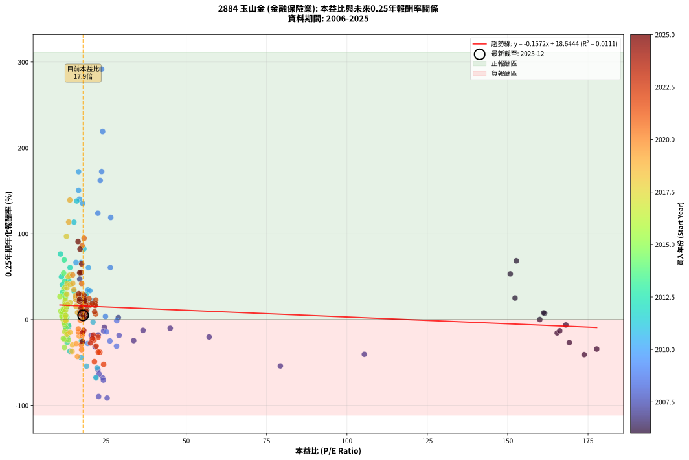
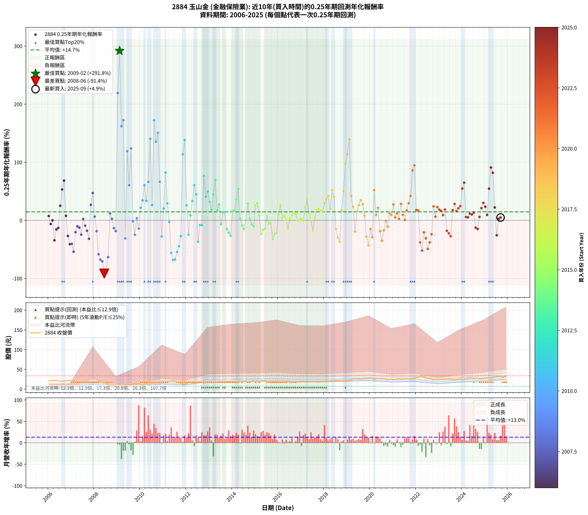

# 2884 玉山金 - 本益比與未來報酬率分析

!!! info "報告資訊"
    - **股票代號**: 2884
    - **公司名稱**: 玉山金
    - **產業別**: 金融保險業
    - **分析期間**: 2006-2025 (237 個數據點)
    - **資料來源**: Type 12 (ShowMonthlyK_ChartFlow) 月收盤價與本益比
    - **報酬率口徑**: 含現金股利 (簡化: 年度合計，假設每年7/1入帳)
    - **報告生成時間**: 2026-01-13 13:34:04 CST

## 📈 視覺化圖表

### 圖表1: 本益比 vs 未來報酬率關係

*圖表1：2884 玉山金 本益比與0.25年期未來報酬率關係 (2006-2025)*

### 圖表2: 歷年買入時點的0.25年期實際報酬率

*圖表2：2884 玉山金 歷年買入時點的0.25年期實際報酬率 (2006-2025)*

## 📍 買點訊號說明

本報告提供兩種買點提示訊號（顯示於圖表2的股價子圖中）：

### ▲ 小綠色三角形（回測驗證）
- **計算方式**: 使用全部歷史資料計算本益比第25百分位數
- **用途**: 事後驗證，顯示歷史上哪些時點確實為低估區
- **限制**: 當下無法判斷，僅供回測參考
- **特性**: 後見之明（Look-Ahead Bias）

### ▲ 小橘色三角形（即時訊號）
- **計算方式**: 使用截至當月的過去5年資料計算本益比第25百分位數
- **用途**: 實際投資決策，當時即可判斷
- **優勢**: 可操作性強，符合實務需求
- **特性**: 無後見之明，滾動窗口計算

!!! tip "如何使用兩種訊號"
    - **綠色▲** 幫助理解歷史估值機會，驗證策略有效性
    - **橘色▲** 可作為實際買進參考，但仍需搭配基本面分析
    - 兩種訊號重疊時，表示即時判斷與事後驗證一致，信心度較高
    - 僅有綠色▲時，表示當時無法判斷（需要未來資料才能確認）
    - 僅有橘色▲時，表示即時判斷為買點，但事後可能不是最佳時機

## 📊 估值分析摘要

| 指標 | 數值 |
|:---:|:---:|
| **目前本益比** (2025-09) | **17.91 倍** |
| **歷史平均本益比** | 25.30 倍 |
| **估值水準** | 🟢 相對低估 |
| **預期0.25年年化報酬率** | **+15.83%** |
| **歷史平均報酬率** | +14.67% |
| **相關係數 (R²)** | 0.0111 |
| **趨勢線斜率** | -0.1572 |

!!! abstract "核心洞察"
    目前本益比顯著低於歷史平均，預期未來報酬率可能較高

    根據歷史數據回測，2884 玉山金 在目前本益比 **17.9倍** 的估值水準下，
    預期未來0.25年年化報酬率約為 **+15.8%**。

    **重要提醒**: 本分析基於歷史數據統計，實際報酬率會受到公司基本面變化、產業趨勢、
    總體經濟環境等多重因素影響。R² = 0.01 表示本益比可解釋約 1.1% 的報酬率變異。

## 📈 歷史估值統計

### 最佳買點 (最高報酬率)

| 項目 | 數值 |
|:---:|:---:|
| 起始時間 | 2009-02 |
| 當時本益比 | 23.65 倍 |
| 起始價格 | 8.0 元 |
| 0.25年後價格 | 11.2 元 |
| **0.25年年化報酬率** | **+291.77%** |

### 最差買點 (最低報酬率)

| 項目 | 數值 |
|:---:|:---:|
| 起始時間 | 2008-06 |
| 當時本益比 | 25.38 倍 |
| 起始價格 | 16.5 元 |
| 0.25年後價格 | 8.5 元 |
| **0.25年年化報酬率** | **-91.42%** |

## 🎯 投資啟示

### 本益比與報酬率關係

趨勢線方程式: **y = -0.1572x + 18.6444**

!!! note "負相關"
    本益比與未來報酬率呈現負相關。較低的本益比通常帶來較高的未來報酬率，
    但相關性不算非常強。**估值仍是重要參考指標之一**。

### 估值區間建議

基於歷史數據分析:

- **🟢 低估區** (P/E < 20.2): 預期報酬率較高，可考慮增加持股
- **🟡 合理區** (P/E 20.2-30.4): 預期報酬率符合長期趨勢，正常持有
- **🔴 高估區** (P/E > 30.4): 預期報酬率較低，可考慮減碼或觀望

!!! danger "風險提示"
    - 過去表現不代表未來結果
    - 本分析假設公司基本面無重大結構性變化
    - 產業環境劇變可能使歷史規律失效
    - 應結合公司財報、產業趨勢、總體經濟等多重因素綜合判斷

!!! success "長期投資觀點"
    歷史數據顯示，在合理或低估的估值水準買入並長期持有，
    往往能獲得較佳的投資報酬。**耐心等待好價格**是價值投資的核心原則。

## 📊 數據品質

- **資料來源**: GoodInfo.tw Type 12 (ShowMonthlyK_ChartFlow)
- **資料頻率**: 月度收盤價與本益比
- **回測期間**: 2006-2025
- **數據點數量**: 237 個 (每個點代表一次0.25年期回測)

### 計算方法說明

1. **0.25年期年化報酬率**:
   - 對每個歷史時點，計算其後0.25年的實際投資報酬率
   - 期末價值(不含股利): 期末價格
   - 期末價值(含現金股利): 期末價格 + 持有期間內的現金股利合計 (簡化: 年度合計，假設每年7/1入帳)
   - 公式: 年化報酬率 = [(期末價值/期初價格)^(1/年數) - 1] × 100%

2. **本益比 (P/E Ratio)**:
   - 使用當時的月收盤價與EPS計算
   - 資料來源: Type 12 月度河流圖本益比數據

3. **趨勢線 (Linear Regression)**:
   - 使用最小平方法擬合線性趨勢線
   - R²值衡量本益比對報酬率的解釋能力

---

*本報告由 Stock Analysis System v1.9.0 自動生成*
*數據更新時間: 2026-01-13 13:34:04 CST*

## 📋 月度回測明細表

（每一列對應時間線圖中的一個買入點；可用來對照 SVG 圖上的每個點。）

| 買入月份 | 賣出月份 | 回測期限_年 | 實際持有年數 | 買入本益比_倍 | 買入收盤價_元 | 賣出收盤價_元 | 現金股利合計_元 | 總報酬率_pct | 年化報酬率_pct |
| --- | --- | --- | --- | --- | --- | --- | --- | --- | --- |
| 2006-01 | 2006-05 | 0.25 | 0.329 | 161.50 | 21.00 | 21.50 | 0.00 | +2.38 | +7.42 |
| 2006-02 | 2006-05 | 0.25 | 0.246 | 168.10 | 21.85 | 21.50 | 0.00 | -1.60 | -6.34 |
| 2006-03 | 2006-07 | 0.25 | 0.334 | 160.00 | 20.80 | 19.80 | 1.00 | +0.00 | +0.00 |
| 2006-04 | 2006-07 | 0.25 | 0.249 | 177.70 | 23.10 | 19.80 | 1.00 | -9.96 | -34.36 |
| 2006-05 | 2006-08 | 0.25 | 0.252 | 165.40 | 21.50 | 19.60 | 1.00 | -4.19 | -15.61 |
| 2006-06 | 2006-09 | 0.25 | 0.252 | 166.20 | 21.60 | 19.85 | 1.00 | -3.47 | -13.09 |
| 2006-07 | 2006-10 | 0.25 | 0.252 | 152.30 | 19.80 | 20.95 | 0.00 | +5.81 | +25.12 |
| 2006-08 | 2006-12 | 0.25 | 0.334 | 150.80 | 19.60 | 22.60 | 0.00 | +15.31 | +53.17 |
| 2006-09 | 2006-12 | 0.25 | 0.249 | 152.70 | 19.85 | 22.60 | 0.00 | +13.85 | +68.33 |
| 2006-10 | 2007-01 | 0.25 | 0.252 | 161.20 | 20.95 | 21.35 | 0.00 | +1.91 | +7.80 |
| 2006-11 | 2007-03 | 0.25 | 0.329 | 169.20 | 22.00 | 19.85 | 0.00 | -9.77 | -26.88 |
| 2006-12 | 2007-03 | 0.25 | 0.246 | 173.80 | 22.60 | 19.85 | 0.00 | -12.17 | -40.94 |
| 2007-01 | 2007-05 | 0.25 | 0.329 | 105.40 | 21.35 | 18.00 | 0.00 | -15.69 | -40.52 |
| 2007-02 | 2007-05 | 0.25 | 0.246 | 79.27 | 21.80 | 18.00 | 0.00 | -17.43 | -54.04 |
| 2007-03 | 2007-07 | 0.25 | 0.334 | 57.12 | 19.85 | 18.40 | 0.00 | -7.30 | -20.32 |
| 2007-04 | 2007-07 | 0.25 | 0.249 | 45.00 | 18.90 | 18.40 | 0.00 | -2.65 | -10.20 |
| 2007-05 | 2007-08 | 0.25 | 0.252 | 36.55 | 18.00 | 17.40 | 0.00 | -3.33 | -12.59 |
| 2007-06 | 2007-09 | 0.25 | 0.252 | 33.63 | 19.00 | 17.70 | 0.00 | -6.84 | -24.53 |
| 2007-07 | 2007-10 | 0.25 | 0.252 | 28.86 | 18.40 | 18.50 | 0.00 | +0.54 | +2.18 |
| 2007-08 | 2007-12 | 0.25 | 0.334 | 24.51 | 17.40 | 16.85 | 0.00 | -3.16 | -9.17 |
| 2007-09 | 2007-12 | 0.25 | 0.249 | 22.62 | 17.70 | 16.85 | 0.00 | -4.80 | -17.92 |
| 2007-10 | 2008-01 | 0.25 | 0.252 | 21.64 | 18.50 | 16.80 | 0.00 | -9.19 | -31.80 |
| 2007-11 | 2008-03 | 0.25 | 0.331 | 18.49 | 17.15 | 18.55 | 0.00 | +8.16 | +26.73 |
| 2007-12 | 2008-03 | 0.25 | 0.249 | 16.85 | 16.85 | 18.55 | 0.00 | +10.09 | +47.08 |
| 2008-01 | 2008-05 | 0.25 | 0.331 | 17.84 | 16.80 | 17.15 | 0.00 | +2.08 | +6.42 |
| 2008-02 | 2008-05 | 0.25 | 0.249 | 20.43 | 18.05 | 17.15 | 0.00 | -4.99 | -18.56 |
| 2008-03 | 2008-07 | 0.25 | 0.334 | 22.48 | 18.55 | 13.45 | 0.40 | -25.34 | -58.30 |
| 2008-04 | 2008-07 | 0.25 | 0.249 | 23.93 | 18.35 | 13.45 | 0.40 | -24.52 | -67.67 |
| 2008-05 | 2008-08 | 0.25 | 0.252 | 24.21 | 17.15 | 12.20 | 0.40 | -26.53 | -70.59 |
| 2008-06 | 2008-09 | 0.25 | 0.252 | 25.38 | 16.50 | 8.49 | 0.40 | -46.12 | -91.42 |
| 2008-07 | 2008-10 | 0.25 | 0.252 | 22.73 | 13.45 | 7.60 | 0.00 | -43.49 | -89.63 |
| 2008-08 | 2008-12 | 0.25 | 0.334 | 22.87 | 12.20 | 8.73 | 0.00 | -28.44 | -63.28 |
| 2008-09 | 2008-12 | 0.25 | 0.249 | 17.87 | 8.49 | 8.73 | 0.00 | +2.83 | +11.84 |
| 2008-10 | 2009-01 | 0.25 | 0.252 | 18.24 | 7.60 | 7.65 | 0.00 | +0.66 | +2.64 |
| 2008-11 | 2009-03 | 0.25 | 0.329 | 24.28 | 8.70 | 8.30 | 0.00 | -4.60 | -13.35 |
| 2008-12 | 2009-03 | 0.25 | 0.246 | 29.10 | 8.73 | 8.30 | 0.00 | -4.93 | -18.53 |
| 2009-01 | 2009-05 | 0.25 | 0.329 | 23.97 | 7.65 | 11.20 | 0.00 | +46.41 | +219.09 |
| 2009-02 | 2009-05 | 0.25 | 0.246 | 23.65 | 8.00 | 11.20 | 0.00 | +40.00 | +291.77 |
| 2009-03 | 2009-07 | 0.25 | 0.334 | 23.22 | 8.30 | 11.45 | 0.00 | +37.95 | +162.01 |
| 2009-04 | 2009-07 | 0.25 | 0.249 | 23.68 | 8.92 | 11.45 | 0.00 | +28.36 | +172.43 |
| 2009-05 | 2009-08 | 0.25 | 0.252 | 28.29 | 11.20 | 10.20 | 0.00 | -8.93 | -31.02 |
| 2009-06 | 2009-09 | 0.25 | 0.252 | 26.51 | 11.00 | 13.40 | 0.00 | +21.82 | +118.92 |
| 2009-07 | 2009-10 | 0.25 | 0.252 | 26.37 | 11.45 | 12.90 | 0.00 | +12.66 | +60.54 |
| 2009-08 | 2009-12 | 0.25 | 0.334 | 22.50 | 10.20 | 13.35 | 0.00 | +30.88 | +123.83 |
| 2009-09 | 2009-12 | 0.25 | 0.249 | 28.36 | 13.40 | 13.35 | 0.00 | -0.37 | -1.49 |
| 2009-10 | 2010-01 | 0.25 | 0.252 | 26.24 | 12.90 | 12.00 | 0.00 | -6.98 | -24.96 |
| 2009-11 | 2010-03 | 0.25 | 0.329 | 24.86 | 12.70 | 12.85 | 0.00 | +1.18 | +3.64 |
| 2009-12 | 2010-03 | 0.25 | 0.246 | 25.19 | 13.35 | 12.85 | 0.00 | -3.75 | -14.35 |
| 2010-01 | 2010-05 | 0.25 | 0.329 | 20.96 | 12.00 | 12.80 | 0.00 | +6.67 | +21.71 |
| 2010-02 | 2010-05 | 0.25 | 0.246 | 19.35 | 11.90 | 12.80 | 0.00 | +7.56 | +34.43 |
| 2010-03 | 2010-07 | 0.25 | 0.334 | 19.54 | 12.85 | 14.85 | 0.20 | +17.11 | +60.47 |
| 2010-04 | 2010-07 | 0.25 | 0.249 | 20.00 | 14.00 | 14.85 | 0.20 | +7.49 | +33.64 |
| 2010-05 | 2010-08 | 0.25 | 0.252 | 17.24 | 12.80 | 14.35 | 0.20 | +13.66 | +66.28 |
| 2010-06 | 2010-09 | 0.25 | 0.252 | 16.75 | 13.15 | 16.20 | 0.20 | +24.71 | +140.27 |
| 2010-07 | 2010-10 | 0.25 | 0.252 | 17.95 | 14.85 | 15.75 | 0.00 | +6.06 | +26.31 |
| 2010-08 | 2010-12 | 0.25 | 0.334 | 16.49 | 14.35 | 20.05 | 0.00 | +39.72 | +172.20 |
| 2010-09 | 2010-12 | 0.25 | 0.249 | 17.75 | 16.20 | 20.05 | 0.00 | +23.77 | +135.33 |
| 2010-10 | 2011-01 | 0.25 | 0.252 | 16.49 | 15.75 | 19.85 | 0.00 | +26.03 | +150.56 |
| 2010-11 | 2011-03 | 0.25 | 0.329 | 15.69 | 15.65 | 18.50 | 0.00 | +18.21 | +66.40 |
| 2010-12 | 2011-03 | 0.25 | 0.246 | 19.28 | 20.05 | 18.50 | 0.00 | -7.73 | -27.86 |
| 2011-01 | 2011-05 | 0.25 | 0.329 | 19.43 | 19.85 | 21.10 | 0.00 | +6.30 | +20.43 |
| 2011-02 | 2011-05 | 0.25 | 0.246 | 18.14 | 18.20 | 21.10 | 0.00 | +15.93 | +82.22 |
| 2011-03 | 2011-07 | 0.25 | 0.334 | 18.78 | 18.50 | 19.95 | 0.20 | +8.92 | +29.15 |
| 2011-04 | 2011-07 | 0.25 | 0.249 | 21.00 | 20.30 | 19.95 | 0.20 | -0.74 | -2.93 |
| 2011-05 | 2011-08 | 0.25 | 0.252 | 22.25 | 21.10 | 16.95 | 0.20 | -18.72 | -56.08 |
| 2011-06 | 2011-09 | 0.25 | 0.252 | 21.94 | 20.40 | 15.10 | 0.20 | -25.00 | -68.09 |
| 2011-07 | 2011-10 | 0.25 | 0.252 | 21.88 | 19.95 | 15.05 | 0.00 | -24.56 | -67.34 |
| 2011-08 | 2011-12 | 0.25 | 0.334 | 18.97 | 16.95 | 13.05 | 0.00 | -23.01 | -54.29 |
| 2011-09 | 2011-12 | 0.25 | 0.249 | 17.26 | 15.10 | 13.05 | 0.00 | -13.58 | -44.32 |
| 2011-10 | 2012-01 | 0.25 | 0.252 | 17.57 | 15.05 | 13.90 | 0.00 | -7.64 | -27.06 |
| 2011-11 | 2012-03 | 0.25 | 0.331 | 15.03 | 12.60 | 16.20 | 0.00 | +28.57 | +113.53 |
| 2011-12 | 2012-03 | 0.25 | 0.249 | 15.91 | 13.05 | 16.20 | 0.00 | +24.14 | +138.18 |
| 2012-01 | 2012-05 | 0.25 | 0.331 | 15.92 | 13.90 | 15.00 | 0.00 | +7.91 | +25.85 |
| 2012-02 | 2012-05 | 0.25 | 0.249 | 17.38 | 16.10 | 15.00 | 0.00 | -6.83 | -24.73 |
| 2012-03 | 2012-07 | 0.25 | 0.334 | 16.54 | 16.20 | 16.45 | 0.20 | +2.78 | +8.55 |
| 2012-04 | 2012-07 | 0.25 | 0.249 | 15.01 | 15.50 | 16.45 | 0.20 | +7.42 | +33.28 |
| 2012-05 | 2012-08 | 0.25 | 0.252 | 13.82 | 15.00 | 16.70 | 0.20 | +12.67 | +60.56 |
| 2012-06 | 2012-09 | 0.25 | 0.252 | 13.44 | 15.30 | 16.60 | 0.20 | +9.80 | +44.96 |
| 2012-07 | 2012-10 | 0.25 | 0.252 | 13.80 | 16.45 | 14.65 | 0.00 | -10.94 | -36.88 |
| 2012-08 | 2012-12 | 0.25 | 0.334 | 13.42 | 16.70 | 16.25 | 0.00 | -2.69 | -7.85 |
| 2012-09 | 2012-12 | 0.25 | 0.249 | 12.79 | 16.60 | 16.25 | 0.00 | -2.11 | -8.20 |
| 2012-10 | 2013-01 | 0.25 | 0.252 | 10.84 | 14.65 | 16.90 | 0.00 | +15.36 | +76.34 |
| 2012-11 | 2013-03 | 0.25 | 0.329 | 11.43 | 16.05 | 17.95 | 0.00 | +11.84 | +40.57 |
| 2012-12 | 2013-03 | 0.25 | 0.246 | 11.15 | 16.25 | 17.95 | 0.00 | +10.46 | +49.75 |
| 2013-01 | 2013-05 | 0.25 | 0.329 | 11.55 | 16.90 | 18.50 | 0.00 | +9.47 | +31.70 |
| 2013-02 | 2013-05 | 0.25 | 0.246 | 12.08 | 17.75 | 18.50 | 0.00 | +4.23 | +18.29 |
| 2013-03 | 2013-07 | 0.25 | 0.334 | 12.17 | 17.95 | 20.00 | 0.30 | +13.09 | +44.53 |
| 2013-04 | 2013-07 | 0.25 | 0.249 | 12.02 | 17.80 | 20.00 | 0.30 | +14.04 | +69.47 |
| 2013-05 | 2013-08 | 0.25 | 0.252 | 12.44 | 18.50 | 18.95 | 0.30 | +4.05 | +17.09 |
| 2013-06 | 2013-09 | 0.25 | 0.252 | 12.25 | 18.30 | 19.15 | 0.30 | +6.28 | +27.37 |
| 2013-07 | 2013-10 | 0.25 | 0.252 | 13.34 | 20.00 | 19.65 | 0.00 | -1.75 | -6.77 |
| 2013-08 | 2013-12 | 0.25 | 0.334 | 12.59 | 18.95 | 19.80 | 0.00 | +4.49 | +14.04 |
| 2013-09 | 2013-12 | 0.25 | 0.249 | 12.67 | 19.15 | 19.80 | 0.00 | +3.39 | +14.34 |
| 2013-10 | 2014-01 | 0.25 | 0.252 | 12.95 | 19.65 | 18.85 | 0.00 | -4.07 | -15.21 |
| 2013-11 | 2014-03 | 0.25 | 0.329 | 13.03 | 19.85 | 18.35 | 0.00 | -7.56 | -21.27 |
| 2013-12 | 2014-03 | 0.25 | 0.246 | 12.94 | 19.80 | 18.35 | 0.00 | -7.32 | -26.56 |
| 2014-01 | 2014-05 | 0.25 | 0.329 | 12.30 | 18.85 | 19.80 | 0.00 | +5.04 | +16.14 |
| 2014-02 | 2014-05 | 0.25 | 0.246 | 12.41 | 19.05 | 19.80 | 0.00 | +3.94 | +16.97 |
| 2014-03 | 2014-07 | 0.25 | 0.334 | 11.93 | 18.35 | 20.05 | 0.28 | +10.77 | +35.82 |
| 2014-04 | 2014-07 | 0.25 | 0.249 | 11.85 | 18.25 | 20.05 | 0.28 | +11.38 | +54.10 |
| 2014-05 | 2014-08 | 0.25 | 0.252 | 12.83 | 19.80 | 19.65 | 0.28 | +0.64 | +2.55 |
| 2014-06 | 2014-09 | 0.25 | 0.252 | 12.39 | 19.15 | 18.45 | 0.28 | -2.21 | -8.51 |
| 2014-07 | 2014-10 | 0.25 | 0.252 | 12.95 | 20.05 | 19.25 | 0.00 | -3.99 | -14.93 |
| 2014-08 | 2014-12 | 0.25 | 0.334 | 12.67 | 19.65 | 19.65 | 0.00 | +0.00 | +0.00 |
| 2014-09 | 2014-12 | 0.25 | 0.249 | 11.88 | 18.45 | 19.65 | 0.00 | +6.50 | +28.78 |
| 2014-10 | 2015-01 | 0.25 | 0.252 | 12.37 | 19.25 | 19.40 | 0.00 | +0.78 | +3.13 |
| 2014-11 | 2015-03 | 0.25 | 0.329 | 12.57 | 19.60 | 19.15 | 0.00 | -2.30 | -6.83 |
| 2014-12 | 2015-03 | 0.25 | 0.246 | 12.58 | 19.65 | 19.15 | 0.00 | -2.54 | -9.93 |
| 2015-01 | 2015-05 | 0.25 | 0.329 | 12.38 | 19.40 | 20.90 | 0.00 | +7.73 | +25.44 |
| 2015-02 | 2015-05 | 0.25 | 0.246 | 12.46 | 19.60 | 20.90 | 0.00 | +6.63 | +29.77 |
| 2015-03 | 2015-07 | 0.25 | 0.334 | 12.13 | 19.15 | 19.20 | 0.43 | +2.53 | +7.78 |
| 2015-04 | 2015-07 | 0.25 | 0.249 | 13.26 | 21.00 | 19.20 | 0.43 | -6.50 | -23.64 |
| 2015-05 | 2015-08 | 0.25 | 0.252 | 13.14 | 20.90 | 19.55 | 0.43 | -4.38 | -16.28 |
| 2015-06 | 2015-09 | 0.25 | 0.252 | 12.91 | 20.60 | 19.35 | 0.43 | -3.96 | -14.81 |
| 2015-07 | 2015-10 | 0.25 | 0.252 | 11.99 | 19.20 | 19.55 | 0.00 | +1.82 | +7.44 |
| 2015-08 | 2015-12 | 0.25 | 0.334 | 12.16 | 19.55 | 19.15 | 0.00 | -2.05 | -6.00 |
| 2015-09 | 2015-12 | 0.25 | 0.249 | 12.00 | 19.35 | 19.15 | 0.00 | -1.03 | -4.08 |
| 2015-10 | 2016-01 | 0.25 | 0.252 | 12.08 | 19.55 | 17.70 | 0.00 | -9.46 | -32.61 |
| 2015-11 | 2016-03 | 0.25 | 0.331 | 12.10 | 19.65 | 18.00 | 0.00 | -8.40 | -23.26 |
| 2015-12 | 2016-03 | 0.25 | 0.249 | 11.75 | 19.15 | 18.00 | 0.00 | -6.01 | -22.01 |
| 2016-01 | 2016-05 | 0.25 | 0.331 | 10.93 | 17.70 | 18.25 | 0.00 | +3.11 | +9.68 |
| 2016-02 | 2016-05 | 0.25 | 0.249 | 10.69 | 17.20 | 18.25 | 0.00 | +6.10 | +26.85 |
| 2016-03 | 2016-07 | 0.25 | 0.334 | 11.27 | 18.00 | 17.80 | 0.43 | +1.28 | +3.87 |
| 2016-04 | 2016-07 | 0.25 | 0.249 | 11.28 | 17.90 | 17.80 | 0.43 | +1.84 | +7.61 |
| 2016-05 | 2016-08 | 0.25 | 0.252 | 11.58 | 18.25 | 17.85 | 0.43 | +0.16 | +0.65 |
| 2016-06 | 2016-09 | 0.25 | 0.252 | 12.14 | 19.00 | 17.85 | 0.43 | -3.79 | -14.22 |
| 2016-07 | 2016-10 | 0.25 | 0.252 | 11.45 | 17.80 | 17.95 | 0.00 | +0.84 | +3.39 |
| 2016-08 | 2016-12 | 0.25 | 0.334 | 11.57 | 17.85 | 18.35 | 0.00 | +2.80 | +8.62 |
| 2016-09 | 2016-12 | 0.25 | 0.249 | 11.65 | 17.85 | 18.35 | 0.00 | +2.80 | +11.73 |
| 2016-10 | 2017-01 | 0.25 | 0.252 | 11.80 | 17.95 | 18.45 | 0.00 | +2.79 | +11.52 |
| 2016-11 | 2017-03 | 0.25 | 0.329 | 12.24 | 18.50 | 18.45 | 0.00 | -0.27 | -0.82 |
| 2016-12 | 2017-03 | 0.25 | 0.246 | 12.23 | 18.35 | 18.45 | 0.00 | +0.54 | +2.23 |
| 2017-01 | 2017-05 | 0.25 | 0.329 | 12.31 | 18.45 | 18.60 | 0.00 | +0.81 | +2.50 |
| 2017-02 | 2017-05 | 0.25 | 0.246 | 12.45 | 18.65 | 18.60 | 0.00 | -0.27 | -1.08 |
| 2017-03 | 2017-07 | 0.25 | 0.334 | 12.32 | 18.45 | 19.25 | 0.49 | +7.00 | +22.44 |
| 2017-04 | 2017-07 | 0.25 | 0.249 | 12.19 | 18.25 | 19.25 | 0.49 | +8.17 | +37.05 |
| 2017-05 | 2017-08 | 0.25 | 0.252 | 12.43 | 18.60 | 18.60 | 0.49 | +2.64 | +10.90 |
| 2017-06 | 2017-09 | 0.25 | 0.252 | 12.51 | 18.70 | 18.15 | 0.49 | -0.32 | -1.25 |
| 2017-07 | 2017-10 | 0.25 | 0.252 | 12.88 | 19.25 | 18.35 | 0.00 | -4.68 | -17.31 |
| 2017-08 | 2017-12 | 0.25 | 0.334 | 12.46 | 18.60 | 18.90 | 0.00 | +1.61 | +4.91 |
| 2017-09 | 2017-12 | 0.25 | 0.249 | 12.16 | 18.15 | 18.90 | 0.00 | +4.13 | +17.65 |
| 2017-10 | 2018-01 | 0.25 | 0.252 | 12.30 | 18.35 | 19.20 | 0.00 | +4.63 | +19.69 |
| 2017-11 | 2018-03 | 0.25 | 0.329 | 12.44 | 18.55 | 19.55 | 0.00 | +5.39 | +17.33 |
| 2017-12 | 2018-03 | 0.25 | 0.246 | 12.68 | 18.90 | 19.55 | 0.00 | +3.44 | +14.71 |
| 2018-01 | 2018-05 | 0.25 | 0.329 | 12.82 | 19.20 | 20.90 | 0.00 | +8.85 | +29.46 |
| 2018-02 | 2018-05 | 0.25 | 0.246 | 12.86 | 19.35 | 20.90 | 0.00 | +8.01 | +36.71 |
| 2018-03 | 2018-07 | 0.25 | 0.334 | 12.93 | 19.55 | 21.35 | 0.61 | +12.34 | +41.69 |
| 2018-04 | 2018-07 | 0.25 | 0.249 | 13.82 | 21.00 | 21.35 | 0.61 | +4.59 | +19.72 |
| 2018-05 | 2018-08 | 0.25 | 0.252 | 13.68 | 20.90 | 22.60 | 0.61 | +11.07 | +51.70 |
| 2018-06 | 2018-09 | 0.25 | 0.252 | 13.84 | 21.25 | 22.55 | 0.61 | +9.00 | +40.81 |
| 2018-07 | 2018-10 | 0.25 | 0.252 | 13.84 | 21.35 | 20.50 | 0.00 | -3.98 | -14.90 |
| 2018-08 | 2018-12 | 0.25 | 0.334 | 14.58 | 22.60 | 20.10 | 0.00 | -11.06 | -29.60 |
| 2018-09 | 2018-12 | 0.25 | 0.249 | 14.48 | 22.55 | 20.10 | 0.00 | -10.86 | -36.98 |
| 2018-10 | 2019-01 | 0.25 | 0.252 | 13.10 | 20.50 | 21.35 | 0.00 | +4.15 | +17.50 |
| 2018-11 | 2019-03 | 0.25 | 0.329 | 13.23 | 20.80 | 23.75 | 0.00 | +14.18 | +49.73 |
| 2018-12 | 2019-03 | 0.25 | 0.246 | 12.72 | 20.10 | 23.75 | 0.00 | +18.16 | +96.83 |
| 2019-01 | 2019-05 | 0.25 | 0.329 | 13.41 | 21.35 | 27.40 | 0.00 | +28.34 | +113.70 |
| 2019-02 | 2019-05 | 0.25 | 0.246 | 13.77 | 22.10 | 27.40 | 0.00 | +23.98 | +139.26 |
| 2019-03 | 2019-07 | 0.25 | 0.334 | 14.68 | 23.75 | 26.00 | 0.71 | +12.46 | +42.14 |
| 2019-04 | 2019-07 | 0.25 | 0.249 | 15.55 | 25.35 | 26.00 | 0.71 | +5.36 | +23.34 |
| 2019-05 | 2019-08 | 0.25 | 0.252 | 16.68 | 27.40 | 25.25 | 0.71 | -5.26 | -19.29 |
| 2019-06 | 2019-09 | 0.25 | 0.252 | 15.71 | 26.00 | 26.25 | 0.71 | +3.69 | +15.48 |
| 2019-07 | 2019-10 | 0.25 | 0.252 | 15.59 | 26.00 | 27.55 | 0.00 | +5.96 | +25.85 |
| 2019-08 | 2019-12 | 0.25 | 0.334 | 15.03 | 25.25 | 27.90 | 0.00 | +10.50 | +34.82 |
| 2019-09 | 2019-12 | 0.25 | 0.249 | 15.51 | 26.25 | 27.90 | 0.00 | +6.29 | +27.72 |
| 2019-10 | 2020-01 | 0.25 | 0.252 | 16.16 | 27.55 | 28.10 | 0.00 | +2.00 | +8.16 |
| 2019-11 | 2020-03 | 0.25 | 0.331 | 15.75 | 27.05 | 24.25 | 0.00 | -10.35 | -28.10 |
| 2019-12 | 2020-03 | 0.25 | 0.249 | 16.13 | 27.90 | 24.25 | 0.00 | -13.08 | -43.04 |
| 2020-01 | 2020-05 | 0.25 | 0.331 | 16.48 | 28.10 | 26.65 | 0.00 | -5.16 | -14.78 |
| 2020-02 | 2020-05 | 0.25 | 0.249 | 17.29 | 29.05 | 26.65 | 0.00 | -8.26 | -29.26 |
| 2020-03 | 2020-07 | 0.25 | 0.334 | 14.65 | 24.25 | 27.10 | 0.79 | +15.01 | +52.01 |
| 2020-04 | 2020-07 | 0.25 | 0.249 | 16.75 | 27.30 | 27.10 | 0.79 | +2.16 | +8.98 |
| 2020-05 | 2020-08 | 0.25 | 0.252 | 16.60 | 26.65 | 27.20 | 0.79 | +5.03 | +21.52 |
| 2020-06 | 2020-09 | 0.25 | 0.252 | 17.59 | 27.80 | 25.60 | 0.79 | -5.07 | -18.66 |
| 2020-07 | 2020-10 | 0.25 | 0.252 | 17.43 | 27.10 | 24.30 | 0.00 | -10.33 | -35.14 |
| 2020-08 | 2020-12 | 0.25 | 0.334 | 17.78 | 27.20 | 25.55 | 0.00 | -6.07 | -17.09 |
| 2020-09 | 2020-12 | 0.25 | 0.249 | 17.01 | 25.60 | 25.55 | 0.00 | -0.20 | -0.78 |
| 2020-10 | 2021-01 | 0.25 | 0.252 | 16.42 | 24.30 | 23.60 | 0.00 | -2.88 | -10.96 |
| 2020-11 | 2021-03 | 0.25 | 0.329 | 17.29 | 25.15 | 26.10 | 0.00 | +3.78 | +11.95 |
| 2020-12 | 2021-03 | 0.25 | 0.246 | 17.87 | 25.55 | 26.10 | 0.00 | +2.15 | +9.03 |
| 2021-01 | 2021-05 | 0.25 | 0.329 | 16.40 | 23.60 | 25.55 | 0.00 | +8.26 | +27.33 |
| 2021-02 | 2021-05 | 0.25 | 0.246 | 17.43 | 25.25 | 25.55 | 0.00 | +1.19 | +4.91 |
| 2021-03 | 2021-07 | 0.25 | 0.334 | 17.91 | 26.10 | 26.50 | 0.61 | +3.87 | +12.04 |
| 2021-04 | 2021-07 | 0.25 | 0.249 | 18.38 | 26.95 | 26.50 | 0.61 | +0.59 | +2.40 |
| 2021-05 | 2021-08 | 0.25 | 0.252 | 17.31 | 25.55 | 26.60 | 0.61 | +6.50 | +28.39 |
| 2021-06 | 2021-09 | 0.25 | 0.252 | 17.71 | 26.30 | 26.30 | 0.61 | +2.32 | +9.53 |
| 2021-07 | 2021-10 | 0.25 | 0.252 | 17.74 | 26.50 | 26.55 | 0.00 | +0.19 | +0.75 |
| 2021-08 | 2021-12 | 0.25 | 0.334 | 17.69 | 26.60 | 28.05 | 0.00 | +5.45 | +17.22 |
| 2021-09 | 2021-12 | 0.25 | 0.249 | 17.39 | 26.30 | 28.05 | 0.00 | +6.65 | +29.51 |
| 2021-10 | 2022-01 | 0.25 | 0.252 | 17.45 | 26.55 | 29.00 | 0.00 | +9.23 | +41.97 |
| 2021-11 | 2022-03 | 0.25 | 0.329 | 17.60 | 26.95 | 33.05 | 0.00 | +22.63 | +86.09 |
| 2021-12 | 2022-03 | 0.25 | 0.246 | 18.21 | 28.05 | 33.05 | 0.00 | +17.83 | +94.59 |
| 2022-01 | 2022-05 | 0.25 | 0.329 | 19.29 | 29.00 | 30.60 | 0.00 | +5.52 | +17.76 |
| 2022-02 | 2022-05 | 0.25 | 0.246 | 20.08 | 29.45 | 30.60 | 0.00 | +3.90 | +16.82 |
| 2022-03 | 2022-07 | 0.25 | 0.334 | 23.11 | 33.05 | 27.50 | 0.67 | -14.77 | -38.02 |
| 2022-04 | 2022-07 | 0.25 | 0.249 | 24.29 | 33.85 | 27.50 | 0.67 | -16.78 | -52.16 |
| 2022-05 | 2022-08 | 0.25 | 0.252 | 22.56 | 30.60 | 28.20 | 0.67 | -5.65 | -20.63 |
| 2022-06 | 2022-09 | 0.25 | 0.252 | 21.97 | 29.00 | 25.75 | 0.67 | -8.90 | -30.92 |
| 2022-07 | 2022-10 | 0.25 | 0.252 | 21.43 | 27.50 | 23.20 | 0.00 | -15.64 | -49.09 |
| 2022-08 | 2022-12 | 0.25 | 0.334 | 22.62 | 28.20 | 24.05 | 0.00 | -14.72 | -37.91 |
| 2022-09 | 2022-12 | 0.25 | 0.249 | 21.28 | 25.75 | 24.05 | 0.00 | -6.60 | -23.98 |
| 2022-10 | 2023-01 | 0.25 | 0.252 | 19.77 | 23.20 | 24.50 | 0.00 | +5.60 | +24.17 |
| 2022-11 | 2023-03 | 0.25 | 0.329 | 21.82 | 24.80 | 25.30 | 0.00 | +2.02 | +6.26 |
| 2022-12 | 2023-03 | 0.25 | 0.246 | 21.86 | 24.05 | 25.30 | 0.00 | +5.20 | +22.83 |
| 2023-01 | 2023-05 | 0.25 | 0.329 | 21.76 | 24.50 | 25.90 | 0.00 | +5.71 | +18.43 |
| 2023-02 | 2023-05 | 0.25 | 0.246 | 21.66 | 24.95 | 25.90 | 0.00 | +3.81 | +16.38 |
| 2023-03 | 2023-07 | 0.25 | 0.334 | 21.49 | 25.30 | 25.85 | 0.19 | +2.92 | +9.00 |
| 2023-04 | 2023-07 | 0.25 | 0.249 | 20.73 | 24.95 | 25.85 | 0.19 | +4.36 | +18.71 |
| 2023-05 | 2023-08 | 0.25 | 0.252 | 21.07 | 25.90 | 24.45 | 0.19 | -4.87 | -17.98 |
| 2023-06 | 2023-09 | 0.25 | 0.252 | 20.76 | 26.05 | 24.25 | 0.19 | -6.18 | -22.39 |
| 2023-07 | 2023-10 | 0.25 | 0.252 | 20.18 | 25.85 | 23.85 | 0.00 | -7.74 | -27.36 |
| 2023-08 | 2023-12 | 0.25 | 0.334 | 18.71 | 24.45 | 25.80 | 0.00 | +5.52 | +17.46 |
| 2023-09 | 2023-12 | 0.25 | 0.249 | 18.20 | 24.25 | 25.80 | 0.00 | +6.39 | +28.23 |
| 2023-10 | 2024-01 | 0.25 | 0.252 | 17.56 | 23.85 | 24.75 | 0.00 | +3.77 | +15.84 |
| 2023-11 | 2024-03 | 0.25 | 0.331 | 18.49 | 25.60 | 27.25 | 0.00 | +6.45 | +20.75 |
| 2023-12 | 2024-03 | 0.25 | 0.249 | 18.30 | 25.80 | 27.25 | 0.00 | +5.62 | +24.54 |
| 2024-01 | 2024-05 | 0.25 | 0.331 | 17.33 | 24.75 | 28.60 | 0.00 | +15.56 | +54.72 |
| 2024-02 | 2024-05 | 0.25 | 0.249 | 17.45 | 25.25 | 28.60 | 0.00 | +13.27 | +64.88 |
| 2024-03 | 2024-07 | 0.25 | 0.334 | 18.60 | 27.25 | 26.55 | 1.20 | +1.83 | +5.59 |
| 2024-04 | 2024-07 | 0.25 | 0.249 | 18.47 | 27.40 | 26.55 | 1.20 | +1.28 | +5.23 |
| 2024-05 | 2024-08 | 0.25 | 0.252 | 19.05 | 28.60 | 28.20 | 1.20 | +2.80 | +11.58 |
| 2024-06 | 2024-09 | 0.25 | 0.252 | 18.78 | 28.55 | 28.05 | 1.20 | +2.45 | +10.09 |
| 2024-07 | 2024-10 | 0.25 | 0.252 | 17.26 | 26.55 | 27.40 | 0.00 | +3.20 | +13.33 |
| 2024-08 | 2024-12 | 0.25 | 0.334 | 18.12 | 28.20 | 26.95 | 0.00 | -4.43 | -12.69 |
| 2024-09 | 2024-12 | 0.25 | 0.249 | 17.81 | 28.05 | 26.95 | 0.00 | -3.92 | -14.83 |
| 2024-10 | 2025-01 | 0.25 | 0.252 | 17.20 | 27.40 | 27.80 | 0.00 | +1.46 | +5.92 |
| 2024-11 | 2025-03 | 0.25 | 0.329 | 16.75 | 27.00 | 28.75 | 0.00 | +6.48 | +21.06 |
| 2024-12 | 2025-03 | 0.25 | 0.246 | 16.53 | 26.95 | 28.75 | 0.00 | +6.68 | +30.00 |
| 2025-01 | 2025-05 | 0.25 | 0.329 | 16.79 | 27.80 | 29.80 | 0.00 | +7.19 | +23.55 |
| 2025-02 | 2025-05 | 0.25 | 0.246 | 17.33 | 29.15 | 29.80 | 0.00 | +2.23 | +9.36 |
| 2025-03 | 2025-07 | 0.25 | 0.334 | 16.84 | 28.75 | 32.05 | 1.20 | +15.65 | +54.55 |
| 2025-04 | 2025-07 | 0.25 | 0.249 | 16.33 | 28.30 | 32.05 | 1.20 | +17.49 | +90.98 |
| 2025-05 | 2025-08 | 0.25 | 0.252 | 16.94 | 29.80 | 33.45 | 1.20 | +16.28 | +81.97 |
| 2025-06 | 2025-09 | 0.25 | 0.252 | 18.40 | 32.85 | 33.35 | 1.20 | +5.18 | +22.18 |
| 2025-07 | 2025-10 | 0.25 | 0.252 | 17.70 | 32.05 | 29.75 | 0.00 | -7.18 | -25.59 |
| 2025-08 | 2025-12 | 0.25 | 0.334 | 18.21 | 33.45 | 33.75 | 0.00 | +0.90 | +2.71 |
| 2025-09 | 2025-12 | 0.25 | 0.249 | 17.91 | 33.35 | 33.75 | 0.00 | +1.20 | +4.90 |
