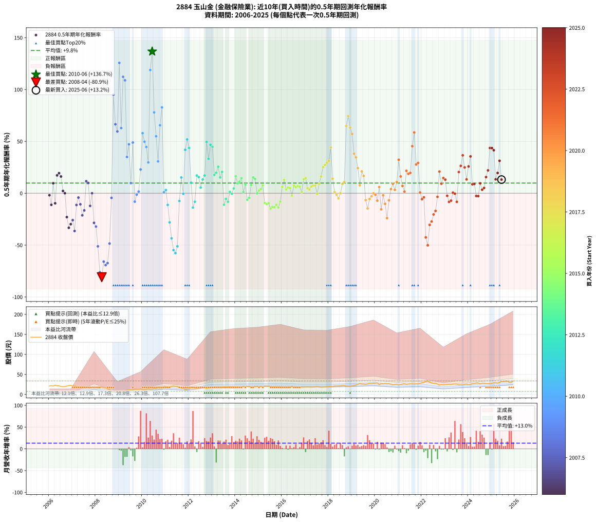

# 2884 玉山金 - 本益比與未來報酬率分析

!!! info "報告資訊"
    - **股票代號**: 2884
    - **公司名稱**: 玉山金
    - **產業別**: 金融保險業
    - **分析期間**: 2006-2025 (234 個數據點)
    - **資料來源**: Type 12 (ShowMonthlyK_ChartFlow) 月收盤價與本益比
    - **報酬率口徑**: 含現金股利 (簡化: 年度合計，假設每年7/1入帳)
    - **報告生成時間**: 2026-01-07 18:47:08 CST

## 📈 視覺化圖表

### 圖表1: 本益比 vs 未來報酬率關係

*圖表1：2884 玉山金 本益比與0.5年期未來報酬率關係 (2006-2025)*

### 圖表2: 歷年買入時點的0.5年期實際報酬率

*圖表2：2884 玉山金 歷年買入時點的0.5年期實際報酬率 (2006-2025)*

## 📍 買點訊號說明

本報告提供兩種買點提示訊號（顯示於圖表2的股價子圖中）：

### ▲ 小綠色三角形（回測驗證）
- **計算方式**: 使用全部歷史資料計算本益比第25百分位數
- **用途**: 事後驗證，顯示歷史上哪些時點確實為低估區
- **限制**: 當下無法判斷，僅供回測參考
- **特性**: 後見之明（Look-Ahead Bias）

### ▲ 小橘色三角形（即時訊號）
- **計算方式**: 使用截至當月的過去5年資料計算本益比第25百分位數
- **用途**: 實際投資決策，當時即可判斷
- **優勢**: 可操作性強，符合實務需求
- **特性**: 無後見之明，滾動窗口計算

!!! tip "如何使用兩種訊號"
    - **綠色▲** 幫助理解歷史估值機會，驗證策略有效性
    - **橘色▲** 可作為實際買進參考，但仍需搭配基本面分析
    - 兩種訊號重疊時，表示即時判斷與事後驗證一致，信心度較高
    - 僅有綠色▲時，表示當時無法判斷（需要未來資料才能確認）
    - 僅有橘色▲時，表示即時判斷為買點，但事後可能不是最佳時機

## 📊 估值分析摘要

| 指標 | 數值 |
|:---:|:---:|
| **目前本益比** (2025-06) | **18.40 倍** |
| **歷史平均本益比** | 25.40 倍 |
| **估值水準** | 🟢 相對低估 |
| **預期0.5年年化報酬率** | **+10.74%** |
| **歷史平均報酬率** | +9.78% |
| **相關係數 (R²)** | 0.0205 |
| **趨勢線斜率** | -0.1378 |

!!! abstract "核心洞察"
    目前本益比顯著低於歷史平均，預期未來報酬率可能較高

    根據歷史數據回測，2884 玉山金 在目前本益比 **18.4倍** 的估值水準下，
    預期未來0.5年年化報酬率約為 **+10.7%**。

    **重要提醒**: 本分析基於歷史數據統計，實際報酬率會受到公司基本面變化、產業趨勢、
    總體經濟環境等多重因素影響。R² = 0.02 表示本益比可解釋約 2.0% 的報酬率變異。

## 📈 歷史估值統計

### 最佳買點 (最高報酬率)

| 項目 | 數值 |
|:---:|:---:|
| 起始時間 | 2010-06 |
| 當時本益比 | 16.75 倍 |
| 起始價格 | 13.2 元 |
| 0.5年後價格 | 20.1 元 |
| **0.5年年化報酬率** | **+136.69%** |

### 最差買點 (最低報酬率)

| 項目 | 數值 |
|:---:|:---:|
| 起始時間 | 2008-04 |
| 當時本益比 | 23.93 倍 |
| 起始價格 | 18.4 元 |
| 0.5年後價格 | 7.6 元 |
| **0.5年年化報酬率** | **-80.93%** |

## 🎯 投資啟示

### 本益比與報酬率關係

趨勢線方程式: **y = -0.1378x + 13.2801**

!!! note "負相關"
    本益比與未來報酬率呈現負相關。較低的本益比通常帶來較高的未來報酬率，
    但相關性不算非常強。**估值仍是重要參考指標之一**。

### 估值區間建議

基於歷史數據分析:

- **🟢 低估區** (P/E < 20.3): 預期報酬率較高，可考慮增加持股
- **🟡 合理區** (P/E 20.3-30.5): 預期報酬率符合長期趨勢，正常持有
- **🔴 高估區** (P/E > 30.5): 預期報酬率較低，可考慮減碼或觀望

!!! danger "風險提示"
    - 過去表現不代表未來結果
    - 本分析假設公司基本面無重大結構性變化
    - 產業環境劇變可能使歷史規律失效
    - 應結合公司財報、產業趨勢、總體經濟等多重因素綜合判斷

!!! success "長期投資觀點"
    歷史數據顯示，在合理或低估的估值水準買入並長期持有，
    往往能獲得較佳的投資報酬。**耐心等待好價格**是價值投資的核心原則。

## 📊 數據品質

- **資料來源**: GoodInfo.tw Type 12 (ShowMonthlyK_ChartFlow)
- **資料頻率**: 月度收盤價與本益比
- **回測期間**: 2006-2025
- **數據點數量**: 234 個 (每個點代表一次0.5年期回測)

### 計算方法說明

1. **0.5年期年化報酬率**:
   - 對每個歷史時點，計算其後0.5年的實際投資報酬率
   - 期末價值(不含股利): 期末價格
   - 期末價值(含現金股利): 期末價格 + 持有期間內的現金股利合計 (簡化: 年度合計，假設每年7/1入帳)
   - 公式: 年化報酬率 = [(期末價值/期初價格)^(1/年數) - 1] × 100%

2. **本益比 (P/E Ratio)**:
   - 使用當時的月收盤價與EPS計算
   - 資料來源: Type 12 月度河流圖本益比數據

3. **趨勢線 (Linear Regression)**:
   - 使用最小平方法擬合線性趨勢線
   - R²值衡量本益比對報酬率的解釋能力

---

*本報告由 Stock Analysis System v1.9.0 自動生成*
*數據更新時間: 2026-01-07 18:47:08 CST*

## 📋 月度回測明細表

（每一列對應時間線圖中的一個買入點；可用來對照 SVG 圖上的每個點。）

| 買入月份 | 賣出月份 | 回測期限_年 | 實際持有年數 | 買入本益比_倍 | 買入收盤價_元 | 賣出收盤價_元 | 現金股利合計_元 | 總報酬率_pct | 年化報酬率_pct |
| --- | --- | --- | --- | --- | --- | --- | --- | --- | --- |
| 2006-01 | 2006-07 | 0.5 | 0.496 | 161.50 | 21.00 | 19.80 | 1.00 | -0.95 | -1.91 |
| 2006-02 | 2006-08 | 0.5 | 0.498 | 168.10 | 21.85 | 19.60 | 1.00 | -5.72 | -11.15 |
| 2006-03 | 2006-10 | 0.5 | 0.586 | 160.00 | 20.80 | 20.95 | 1.00 | +5.53 | +9.62 |
| 2006-04 | 2006-10 | 0.5 | 0.501 | 177.70 | 23.10 | 20.95 | 1.00 | -4.98 | -9.69 |
| 2006-05 | 2006-12 | 0.5 | 0.586 | 165.40 | 21.50 | 22.60 | 1.00 | +9.77 | +17.24 |
| 2006-06 | 2006-12 | 0.5 | 0.501 | 166.20 | 21.60 | 22.60 | 1.00 | +9.26 | +19.33 |
| 2006-07 | 2007-01 | 0.5 | 0.504 | 152.30 | 19.80 | 21.35 | 0.00 | +7.83 | +16.14 |
| 2006-08 | 2007-03 | 0.5 | 0.580 | 150.80 | 19.60 | 19.85 | 0.00 | +1.28 | +2.21 |
| 2006-09 | 2007-03 | 0.5 | 0.496 | 152.70 | 19.85 | 19.85 | 0.00 | +0.00 | +0.00 |
| 2006-10 | 2007-05 | 0.5 | 0.580 | 161.20 | 20.95 | 18.00 | 0.00 | -14.08 | -23.01 |
| 2006-11 | 2007-05 | 0.5 | 0.496 | 169.20 | 22.00 | 18.00 | 0.00 | -18.18 | -33.30 |
| 2006-12 | 2007-07 | 0.5 | 0.580 | 173.80 | 22.60 | 18.40 | 0.00 | -18.58 | -29.83 |
| 2007-01 | 2007-07 | 0.5 | 0.496 | 105.40 | 21.35 | 18.40 | 0.00 | -13.82 | -25.92 |
| 2007-02 | 2007-08 | 0.5 | 0.498 | 79.27 | 21.80 | 17.40 | 0.00 | -20.18 | -36.39 |
| 2007-03 | 2007-10 | 0.5 | 0.586 | 57.12 | 19.85 | 18.50 | 0.00 | -6.80 | -11.33 |
| 2007-04 | 2007-10 | 0.5 | 0.501 | 45.00 | 18.90 | 18.50 | 0.00 | -2.12 | -4.18 |
| 2007-05 | 2007-12 | 0.5 | 0.586 | 36.55 | 18.00 | 16.85 | 0.00 | -6.39 | -10.66 |
| 2007-06 | 2007-12 | 0.5 | 0.501 | 33.63 | 19.00 | 16.85 | 0.00 | -11.32 | -21.31 |
| 2007-07 | 2008-01 | 0.5 | 0.504 | 28.86 | 18.40 | 16.80 | 0.00 | -8.70 | -16.52 |
| 2007-08 | 2008-03 | 0.5 | 0.583 | 24.51 | 17.40 | 18.55 | 0.00 | +6.61 | +11.60 |
| 2007-09 | 2008-03 | 0.5 | 0.498 | 22.62 | 17.70 | 18.55 | 0.00 | +4.80 | +9.87 |
| 2007-10 | 2008-05 | 0.5 | 0.583 | 21.64 | 18.50 | 17.15 | 0.00 | -7.30 | -12.18 |
| 2007-11 | 2008-05 | 0.5 | 0.498 | 18.49 | 17.15 | 17.15 | 0.00 | +0.00 | +0.00 |
| 2007-12 | 2008-07 | 0.5 | 0.583 | 16.85 | 16.85 | 13.45 | 0.40 | -17.80 | -28.55 |
| 2008-01 | 2008-07 | 0.5 | 0.498 | 17.84 | 16.80 | 13.45 | 0.40 | -17.56 | -32.13 |
| 2008-02 | 2008-08 | 0.5 | 0.501 | 20.43 | 18.05 | 12.20 | 0.40 | -30.19 | -51.20 |
| 2008-03 | 2008-10 | 0.5 | 0.586 | 22.48 | 18.55 | 7.60 | 0.40 | -56.87 | -76.20 |
| 2008-04 | 2008-10 | 0.5 | 0.501 | 23.93 | 18.35 | 7.60 | 0.40 | -56.40 | -80.93 |
| 2008-05 | 2008-12 | 0.5 | 0.586 | 24.21 | 17.15 | 8.73 | 0.40 | -46.76 | -65.90 |
| 2008-06 | 2008-12 | 0.5 | 0.501 | 25.38 | 16.50 | 8.73 | 0.40 | -44.67 | -69.31 |
| 2008-07 | 2009-01 | 0.5 | 0.504 | 22.73 | 13.45 | 7.65 | 0.00 | -43.12 | -67.38 |
| 2008-08 | 2009-03 | 0.5 | 0.580 | 22.87 | 12.20 | 8.30 | 0.00 | -31.97 | -48.50 |
| 2008-09 | 2009-03 | 0.5 | 0.496 | 17.87 | 8.49 | 8.30 | 0.00 | -2.24 | -4.46 |
| 2008-10 | 2009-05 | 0.5 | 0.580 | 18.24 | 7.60 | 11.20 | 0.00 | +47.37 | +95.05 |
| 2008-11 | 2009-05 | 0.5 | 0.496 | 24.28 | 8.70 | 11.20 | 0.00 | +28.74 | +66.48 |
| 2008-12 | 2009-07 | 0.5 | 0.580 | 29.10 | 8.73 | 11.45 | 0.00 | +31.16 | +59.57 |
| 2009-01 | 2009-07 | 0.5 | 0.496 | 23.97 | 7.65 | 11.45 | 0.00 | +49.67 | +125.65 |
| 2009-02 | 2009-08 | 0.5 | 0.498 | 23.65 | 8.00 | 10.20 | 0.00 | +27.50 | +62.83 |
| 2009-03 | 2009-10 | 0.5 | 0.586 | 23.22 | 8.30 | 12.90 | 0.00 | +55.42 | +112.26 |
| 2009-04 | 2009-10 | 0.5 | 0.501 | 23.68 | 8.92 | 12.90 | 0.00 | +44.62 | +108.83 |
| 2009-05 | 2009-12 | 0.5 | 0.586 | 28.29 | 11.20 | 13.35 | 0.00 | +19.20 | +34.95 |
| 2009-06 | 2009-12 | 0.5 | 0.501 | 26.51 | 11.00 | 13.35 | 0.00 | +21.36 | +47.17 |
| 2009-07 | 2010-01 | 0.5 | 0.504 | 26.37 | 11.45 | 12.00 | 0.00 | +4.80 | +9.76 |
| 2009-08 | 2010-03 | 0.5 | 0.580 | 22.50 | 10.20 | 12.85 | 0.00 | +25.98 | +48.87 |
| 2009-09 | 2010-03 | 0.5 | 0.496 | 28.36 | 13.40 | 12.85 | 0.00 | -4.10 | -8.11 |
| 2009-10 | 2010-05 | 0.5 | 0.580 | 26.24 | 12.90 | 12.80 | 0.00 | -0.78 | -1.33 |
| 2009-11 | 2010-05 | 0.5 | 0.496 | 24.86 | 12.70 | 12.80 | 0.00 | +0.79 | +1.60 |
| 2009-12 | 2010-07 | 0.5 | 0.580 | 25.19 | 13.35 | 14.85 | 0.20 | +12.73 | +22.92 |
| 2010-01 | 2010-07 | 0.5 | 0.496 | 20.96 | 12.00 | 14.85 | 0.20 | +25.41 | +57.91 |
| 2010-02 | 2010-08 | 0.5 | 0.498 | 19.35 | 11.90 | 14.35 | 0.20 | +22.26 | +49.68 |
| 2010-03 | 2010-10 | 0.5 | 0.586 | 19.54 | 12.85 | 15.75 | 0.20 | +24.12 | +44.59 |
| 2010-04 | 2010-10 | 0.5 | 0.501 | 20.00 | 14.00 | 15.75 | 0.20 | +13.92 | +29.71 |
| 2010-05 | 2010-12 | 0.5 | 0.586 | 17.24 | 12.80 | 20.05 | 0.20 | +58.20 | +118.77 |
| 2010-06 | 2010-12 | 0.5 | 0.501 | 16.75 | 13.15 | 20.05 | 0.20 | +53.98 | +136.69 |
| 2010-07 | 2011-01 | 0.5 | 0.504 | 17.95 | 14.85 | 19.85 | 0.00 | +33.67 | +77.90 |
| 2010-08 | 2011-03 | 0.5 | 0.580 | 16.49 | 14.35 | 18.50 | 0.00 | +28.92 | +54.91 |
| 2010-09 | 2011-03 | 0.5 | 0.496 | 17.75 | 16.20 | 18.50 | 0.00 | +14.20 | +30.72 |
| 2010-10 | 2011-05 | 0.5 | 0.580 | 16.49 | 15.75 | 21.10 | 0.00 | +33.97 | +65.50 |
| 2010-11 | 2011-05 | 0.5 | 0.496 | 15.69 | 15.65 | 21.10 | 0.00 | +34.82 | +82.75 |
| 2010-12 | 2011-07 | 0.5 | 0.580 | 19.28 | 20.05 | 19.95 | 0.20 | +0.50 | +0.86 |
| 2011-01 | 2011-07 | 0.5 | 0.496 | 19.43 | 19.85 | 19.95 | 0.20 | +1.51 | +3.07 |
| 2011-02 | 2011-08 | 0.5 | 0.498 | 18.14 | 18.20 | 16.95 | 0.20 | -5.77 | -11.24 |
| 2011-03 | 2011-10 | 0.5 | 0.586 | 18.78 | 18.50 | 15.05 | 0.20 | -17.57 | -28.09 |
| 2011-04 | 2011-10 | 0.5 | 0.501 | 21.00 | 20.30 | 15.05 | 0.20 | -24.88 | -43.50 |
| 2011-05 | 2011-12 | 0.5 | 0.586 | 22.25 | 21.10 | 13.05 | 0.20 | -37.20 | -54.80 |
| 2011-06 | 2011-12 | 0.5 | 0.501 | 21.94 | 20.40 | 13.05 | 0.20 | -35.05 | -57.74 |
| 2011-07 | 2012-01 | 0.5 | 0.504 | 21.88 | 19.95 | 13.90 | 0.00 | -30.33 | -51.19 |
| 2011-08 | 2012-03 | 0.5 | 0.583 | 18.97 | 16.95 | 16.20 | 0.00 | -4.42 | -7.47 |
| 2011-09 | 2012-03 | 0.5 | 0.498 | 17.26 | 15.10 | 16.20 | 0.00 | +7.28 | +15.16 |
| 2011-10 | 2012-05 | 0.5 | 0.583 | 17.57 | 15.05 | 15.00 | 0.00 | -0.33 | -0.57 |
| 2011-11 | 2012-05 | 0.5 | 0.498 | 15.03 | 12.60 | 15.00 | 0.00 | +19.05 | +41.89 |
| 2011-12 | 2012-07 | 0.5 | 0.583 | 15.91 | 13.05 | 16.45 | 0.20 | +27.59 | +51.86 |
| 2012-01 | 2012-07 | 0.5 | 0.498 | 15.92 | 13.90 | 16.45 | 0.20 | +19.78 | +43.66 |
| 2012-02 | 2012-08 | 0.5 | 0.501 | 17.38 | 16.10 | 16.70 | 0.20 | +4.97 | +10.16 |
| 2012-03 | 2012-10 | 0.5 | 0.586 | 16.54 | 16.20 | 14.65 | 0.20 | -8.33 | -13.80 |
| 2012-04 | 2012-10 | 0.5 | 0.501 | 15.01 | 15.50 | 14.65 | 0.20 | -4.19 | -8.20 |
| 2012-05 | 2012-12 | 0.5 | 0.586 | 13.82 | 15.00 | 16.25 | 0.20 | +9.67 | +17.06 |
| 2012-06 | 2012-12 | 0.5 | 0.501 | 13.44 | 15.30 | 16.25 | 0.20 | +7.52 | +15.56 |
| 2012-07 | 2013-01 | 0.5 | 0.504 | 13.80 | 16.45 | 16.90 | 0.00 | +2.74 | +5.50 |
| 2012-08 | 2013-03 | 0.5 | 0.580 | 13.42 | 16.70 | 17.95 | 0.00 | +7.49 | +13.24 |
| 2012-09 | 2013-03 | 0.5 | 0.496 | 12.79 | 16.60 | 17.95 | 0.00 | +8.13 | +17.09 |
| 2012-10 | 2013-05 | 0.5 | 0.580 | 10.84 | 14.65 | 18.50 | 0.00 | +26.28 | +49.48 |
| 2012-11 | 2013-05 | 0.5 | 0.496 | 11.43 | 16.05 | 18.50 | 0.00 | +15.26 | +33.20 |
| 2012-12 | 2013-07 | 0.5 | 0.580 | 11.15 | 16.25 | 20.00 | 0.30 | +24.92 | +46.72 |
| 2013-01 | 2013-07 | 0.5 | 0.496 | 11.55 | 16.90 | 20.00 | 0.30 | +20.12 | +44.76 |
| 2013-02 | 2013-08 | 0.5 | 0.498 | 12.08 | 17.75 | 18.95 | 0.30 | +8.45 | +17.68 |
| 2013-03 | 2013-10 | 0.5 | 0.586 | 12.17 | 17.95 | 19.65 | 0.30 | +11.14 | +19.76 |
| 2013-04 | 2013-10 | 0.5 | 0.501 | 12.02 | 17.80 | 19.65 | 0.30 | +12.08 | +25.56 |
| 2013-05 | 2013-12 | 0.5 | 0.586 | 12.44 | 18.50 | 19.80 | 0.30 | +8.65 | +15.21 |
| 2013-06 | 2013-12 | 0.5 | 0.501 | 12.25 | 18.30 | 19.80 | 0.30 | +9.84 | +20.59 |
| 2013-07 | 2014-01 | 0.5 | 0.504 | 13.34 | 20.00 | 18.85 | 0.00 | -5.75 | -11.09 |
| 2013-08 | 2014-03 | 0.5 | 0.580 | 12.59 | 18.95 | 18.35 | 0.00 | -3.17 | -5.39 |
| 2013-09 | 2014-03 | 0.5 | 0.496 | 12.67 | 19.15 | 18.35 | 0.00 | -4.18 | -8.25 |
| 2013-10 | 2014-05 | 0.5 | 0.580 | 12.95 | 19.65 | 19.80 | 0.00 | +0.76 | +1.32 |
| 2013-11 | 2014-05 | 0.5 | 0.496 | 13.03 | 19.85 | 19.80 | 0.00 | -0.25 | -0.51 |
| 2013-12 | 2014-07 | 0.5 | 0.580 | 12.94 | 19.80 | 20.05 | 0.28 | +2.66 | +4.62 |
| 2014-01 | 2014-07 | 0.5 | 0.496 | 12.30 | 18.85 | 20.05 | 0.28 | +7.83 | +16.43 |
| 2014-02 | 2014-08 | 0.5 | 0.498 | 12.41 | 19.05 | 19.65 | 0.28 | +4.60 | +9.44 |
| 2014-03 | 2014-10 | 0.5 | 0.586 | 11.93 | 18.35 | 19.25 | 0.28 | +6.41 | +11.18 |
| 2014-04 | 2014-10 | 0.5 | 0.501 | 11.85 | 18.25 | 19.25 | 0.28 | +6.99 | +14.44 |
| 2014-05 | 2014-12 | 0.5 | 0.586 | 12.83 | 19.80 | 19.65 | 0.28 | +0.64 | +1.09 |
| 2014-06 | 2014-12 | 0.5 | 0.501 | 12.39 | 19.15 | 19.65 | 0.28 | +4.05 | +8.25 |
| 2014-07 | 2015-01 | 0.5 | 0.504 | 12.95 | 20.05 | 19.40 | 0.00 | -3.24 | -6.33 |
| 2014-08 | 2015-03 | 0.5 | 0.580 | 12.67 | 19.65 | 19.15 | 0.00 | -2.54 | -4.34 |
| 2014-09 | 2015-03 | 0.5 | 0.496 | 11.88 | 18.45 | 19.15 | 0.00 | +3.79 | +7.80 |
| 2014-10 | 2015-05 | 0.5 | 0.580 | 12.37 | 19.25 | 20.90 | 0.00 | +8.57 | +15.22 |
| 2014-11 | 2015-05 | 0.5 | 0.496 | 12.57 | 19.60 | 20.90 | 0.00 | +6.63 | +13.84 |
| 2014-12 | 2015-07 | 0.5 | 0.580 | 12.58 | 19.65 | 19.20 | 0.43 | -0.08 | -0.13 |
| 2015-01 | 2015-07 | 0.5 | 0.496 | 12.38 | 19.40 | 19.20 | 0.43 | +1.21 | +2.46 |
| 2015-02 | 2015-08 | 0.5 | 0.498 | 12.46 | 19.60 | 19.55 | 0.43 | +1.96 | +3.98 |
| 2015-03 | 2015-10 | 0.5 | 0.586 | 12.13 | 19.15 | 19.55 | 0.43 | +4.36 | +7.56 |
| 2015-04 | 2015-10 | 0.5 | 0.501 | 13.26 | 21.00 | 19.55 | 0.43 | -4.83 | -9.41 |
| 2015-05 | 2015-12 | 0.5 | 0.586 | 13.14 | 20.90 | 19.15 | 0.43 | -6.29 | -10.50 |
| 2015-06 | 2015-12 | 0.5 | 0.501 | 12.91 | 20.60 | 19.15 | 0.43 | -4.93 | -9.59 |
| 2015-07 | 2016-01 | 0.5 | 0.504 | 11.99 | 19.20 | 17.70 | 0.00 | -7.81 | -14.91 |
| 2015-08 | 2016-03 | 0.5 | 0.583 | 12.16 | 19.55 | 18.00 | 0.00 | -7.93 | -13.21 |
| 2015-09 | 2016-03 | 0.5 | 0.498 | 12.00 | 19.35 | 18.00 | 0.00 | -6.98 | -13.51 |
| 2015-10 | 2016-05 | 0.5 | 0.583 | 12.08 | 19.55 | 18.25 | 0.00 | -6.65 | -11.13 |
| 2015-11 | 2016-05 | 0.5 | 0.498 | 12.10 | 19.65 | 18.25 | 0.00 | -7.12 | -13.79 |
| 2015-12 | 2016-07 | 0.5 | 0.583 | 11.75 | 19.15 | 17.80 | 0.43 | -4.80 | -8.10 |
| 2016-01 | 2016-07 | 0.5 | 0.498 | 10.93 | 17.70 | 17.80 | 0.43 | +2.99 | +6.10 |
| 2016-02 | 2016-08 | 0.5 | 0.501 | 10.69 | 17.20 | 17.85 | 0.43 | +6.28 | +12.92 |
| 2016-03 | 2016-10 | 0.5 | 0.586 | 11.27 | 18.00 | 17.95 | 0.43 | +2.11 | +3.63 |
| 2016-04 | 2016-10 | 0.5 | 0.501 | 11.28 | 17.90 | 17.95 | 0.43 | +2.68 | +5.42 |
| 2016-05 | 2016-12 | 0.5 | 0.586 | 11.58 | 18.25 | 18.35 | 0.43 | +2.90 | +5.01 |
| 2016-06 | 2016-12 | 0.5 | 0.501 | 12.14 | 19.00 | 18.35 | 0.43 | -1.16 | -2.30 |
| 2016-07 | 2017-01 | 0.5 | 0.504 | 11.45 | 17.80 | 18.45 | 0.00 | +3.65 | +7.38 |
| 2016-08 | 2017-03 | 0.5 | 0.580 | 11.57 | 17.85 | 18.45 | 0.00 | +3.36 | +5.86 |
| 2016-09 | 2017-03 | 0.5 | 0.496 | 11.65 | 17.85 | 18.45 | 0.00 | +3.36 | +6.90 |
| 2016-10 | 2017-05 | 0.5 | 0.580 | 11.80 | 17.95 | 18.60 | 0.00 | +3.62 | +6.32 |
| 2016-11 | 2017-05 | 0.5 | 0.496 | 12.24 | 18.50 | 18.60 | 0.00 | +0.54 | +1.09 |
| 2016-12 | 2017-07 | 0.5 | 0.580 | 12.23 | 18.35 | 19.25 | 0.49 | +7.58 | +13.42 |
| 2017-01 | 2017-07 | 0.5 | 0.496 | 12.31 | 18.45 | 19.25 | 0.49 | +7.00 | +14.62 |
| 2017-02 | 2017-08 | 0.5 | 0.498 | 12.45 | 18.65 | 18.60 | 0.49 | +2.36 | +4.80 |
| 2017-03 | 2017-10 | 0.5 | 0.586 | 12.32 | 18.45 | 18.35 | 0.49 | +2.12 | +3.64 |
| 2017-04 | 2017-10 | 0.5 | 0.501 | 12.19 | 18.25 | 18.35 | 0.49 | +3.24 | +6.57 |
| 2017-05 | 2017-12 | 0.5 | 0.586 | 12.43 | 18.60 | 18.90 | 0.49 | +4.25 | +7.37 |
| 2017-06 | 2017-12 | 0.5 | 0.501 | 12.51 | 18.70 | 18.90 | 0.49 | +3.70 | +7.51 |
| 2017-07 | 2018-01 | 0.5 | 0.504 | 12.88 | 19.25 | 19.20 | 0.00 | -0.26 | -0.51 |
| 2017-08 | 2018-03 | 0.5 | 0.580 | 12.46 | 18.60 | 19.55 | 0.00 | +5.11 | +8.96 |
| 2017-09 | 2018-03 | 0.5 | 0.496 | 12.16 | 18.15 | 19.55 | 0.00 | +7.71 | +16.18 |
| 2017-10 | 2018-05 | 0.5 | 0.580 | 12.30 | 18.35 | 20.90 | 0.00 | +13.90 | +25.13 |
| 2017-11 | 2018-05 | 0.5 | 0.496 | 12.44 | 18.55 | 20.90 | 0.00 | +12.67 | +27.21 |
| 2017-12 | 2018-07 | 0.5 | 0.580 | 12.68 | 18.90 | 21.35 | 0.61 | +16.21 | +29.53 |
| 2018-01 | 2018-07 | 0.5 | 0.496 | 12.82 | 19.20 | 21.35 | 0.61 | +14.39 | +31.17 |
| 2018-02 | 2018-08 | 0.5 | 0.498 | 12.86 | 19.35 | 22.60 | 0.61 | +19.96 | +44.09 |
| 2018-03 | 2018-10 | 0.5 | 0.586 | 12.93 | 19.55 | 20.50 | 0.61 | +7.99 | +14.03 |
| 2018-04 | 2018-10 | 0.5 | 0.501 | 13.82 | 21.00 | 20.50 | 0.61 | +0.54 | +1.08 |
| 2018-05 | 2018-12 | 0.5 | 0.586 | 13.68 | 20.90 | 20.10 | 0.61 | -0.89 | -1.52 |
| 2018-06 | 2018-12 | 0.5 | 0.501 | 13.84 | 21.25 | 20.10 | 0.61 | -2.53 | -4.98 |
| 2018-07 | 2019-01 | 0.5 | 0.504 | 13.84 | 21.35 | 21.35 | 0.00 | +0.00 | +0.00 |
| 2018-08 | 2019-03 | 0.5 | 0.580 | 14.58 | 22.60 | 23.75 | 0.00 | +5.09 | +8.93 |
| 2018-09 | 2019-03 | 0.5 | 0.496 | 14.48 | 22.55 | 23.75 | 0.00 | +5.32 | +11.03 |
| 2018-10 | 2019-05 | 0.5 | 0.580 | 13.10 | 20.50 | 27.40 | 0.00 | +33.66 | +64.85 |
| 2018-11 | 2019-05 | 0.5 | 0.496 | 13.23 | 20.80 | 27.40 | 0.00 | +31.73 | +74.39 |
| 2018-12 | 2019-07 | 0.5 | 0.580 | 12.72 | 20.10 | 26.00 | 0.71 | +32.89 | +63.21 |
| 2019-01 | 2019-07 | 0.5 | 0.496 | 13.41 | 21.35 | 26.00 | 0.71 | +25.11 | +57.14 |
| 2019-02 | 2019-08 | 0.5 | 0.498 | 13.77 | 22.10 | 25.25 | 0.71 | +17.47 | +38.14 |
| 2019-03 | 2019-10 | 0.5 | 0.586 | 14.68 | 23.75 | 27.55 | 0.71 | +18.99 | +34.55 |
| 2019-04 | 2019-10 | 0.5 | 0.501 | 15.55 | 25.35 | 27.55 | 0.71 | +11.48 | +24.22 |
| 2019-05 | 2019-12 | 0.5 | 0.586 | 16.68 | 27.40 | 27.90 | 0.71 | +4.42 | +7.65 |
| 2019-06 | 2019-12 | 0.5 | 0.501 | 15.71 | 26.00 | 27.90 | 0.71 | +10.04 | +21.04 |
| 2019-07 | 2020-01 | 0.5 | 0.504 | 15.59 | 26.00 | 28.10 | 0.00 | +8.08 | +16.67 |
| 2019-08 | 2020-03 | 0.5 | 0.583 | 15.03 | 25.25 | 24.25 | 0.00 | -3.96 | -6.69 |
| 2019-09 | 2020-03 | 0.5 | 0.498 | 15.51 | 26.25 | 24.25 | 0.00 | -7.62 | -14.70 |
| 2019-10 | 2020-05 | 0.5 | 0.583 | 16.16 | 27.55 | 26.65 | 0.00 | -3.27 | -5.54 |
| 2019-11 | 2020-05 | 0.5 | 0.498 | 15.75 | 27.05 | 26.65 | 0.00 | -1.48 | -2.95 |
| 2019-12 | 2020-07 | 0.5 | 0.583 | 16.13 | 27.90 | 27.10 | 0.79 | -0.03 | -0.06 |
| 2020-01 | 2020-07 | 0.5 | 0.498 | 16.48 | 28.10 | 27.10 | 0.79 | -0.74 | -1.49 |
| 2020-02 | 2020-08 | 0.5 | 0.501 | 17.29 | 29.05 | 27.20 | 0.79 | -3.65 | -7.14 |
| 2020-03 | 2020-10 | 0.5 | 0.586 | 14.65 | 24.25 | 24.30 | 0.79 | +3.47 | +5.99 |
| 2020-04 | 2020-10 | 0.5 | 0.501 | 16.75 | 27.30 | 24.30 | 0.79 | -8.09 | -15.50 |
| 2020-05 | 2020-12 | 0.5 | 0.586 | 16.60 | 26.65 | 25.55 | 0.79 | -1.16 | -1.97 |
| 2020-06 | 2020-12 | 0.5 | 0.501 | 17.59 | 27.80 | 25.55 | 0.79 | -5.25 | -10.20 |
| 2020-07 | 2021-01 | 0.5 | 0.504 | 17.43 | 27.10 | 23.60 | 0.00 | -12.92 | -24.01 |
| 2020-08 | 2021-03 | 0.5 | 0.580 | 17.78 | 27.20 | 26.10 | 0.00 | -4.04 | -6.87 |
| 2020-09 | 2021-03 | 0.5 | 0.496 | 17.01 | 25.60 | 26.10 | 0.00 | +1.95 | +3.98 |
| 2020-10 | 2021-05 | 0.5 | 0.580 | 16.42 | 24.30 | 25.55 | 0.00 | +5.14 | +9.03 |
| 2020-11 | 2021-05 | 0.5 | 0.496 | 17.29 | 25.15 | 25.55 | 0.00 | +1.59 | +3.24 |
| 2020-12 | 2021-07 | 0.5 | 0.580 | 17.87 | 25.55 | 26.50 | 0.61 | +6.11 | +10.75 |
| 2021-01 | 2021-07 | 0.5 | 0.496 | 16.40 | 23.60 | 26.50 | 0.61 | +14.87 | +32.29 |
| 2021-02 | 2021-08 | 0.5 | 0.498 | 17.43 | 25.25 | 26.60 | 0.61 | +7.76 | +16.19 |
| 2021-03 | 2021-10 | 0.5 | 0.586 | 17.91 | 26.10 | 26.55 | 0.61 | +4.06 | +7.03 |
| 2021-04 | 2021-10 | 0.5 | 0.501 | 18.38 | 26.95 | 26.55 | 0.61 | +0.78 | +1.56 |
| 2021-05 | 2021-12 | 0.5 | 0.586 | 17.31 | 25.55 | 28.05 | 0.61 | +12.17 | +21.66 |
| 2021-06 | 2021-12 | 0.5 | 0.501 | 17.71 | 26.30 | 28.05 | 0.61 | +8.97 | +18.71 |
| 2021-07 | 2022-01 | 0.5 | 0.504 | 17.74 | 26.50 | 29.00 | 0.00 | +9.43 | +19.60 |
| 2021-08 | 2022-03 | 0.5 | 0.580 | 17.69 | 26.60 | 33.05 | 0.00 | +24.25 | +45.36 |
| 2021-09 | 2022-03 | 0.5 | 0.496 | 17.39 | 26.30 | 33.05 | 0.00 | +25.67 | +58.57 |
| 2021-10 | 2022-05 | 0.5 | 0.580 | 17.45 | 26.55 | 30.60 | 0.00 | +15.25 | +27.71 |
| 2021-11 | 2022-05 | 0.5 | 0.496 | 17.60 | 26.95 | 30.60 | 0.00 | +13.54 | +29.22 |
| 2021-12 | 2022-07 | 0.5 | 0.580 | 18.21 | 28.05 | 27.50 | 0.67 | +0.43 | +0.74 |
| 2022-01 | 2022-07 | 0.5 | 0.496 | 19.29 | 29.00 | 27.50 | 0.67 | -2.86 | -5.69 |
| 2022-02 | 2022-08 | 0.5 | 0.498 | 20.08 | 29.45 | 28.20 | 0.67 | -1.97 | -3.91 |
| 2022-03 | 2022-10 | 0.5 | 0.586 | 23.11 | 33.05 | 23.20 | 0.67 | -27.78 | -42.61 |
| 2022-04 | 2022-10 | 0.5 | 0.501 | 24.29 | 33.85 | 23.20 | 0.67 | -29.48 | -50.20 |
| 2022-05 | 2022-12 | 0.5 | 0.586 | 22.56 | 30.60 | 24.05 | 0.67 | -19.22 | -30.53 |
| 2022-06 | 2022-12 | 0.5 | 0.501 | 21.97 | 29.00 | 24.05 | 0.67 | -14.76 | -27.29 |
| 2022-07 | 2023-01 | 0.5 | 0.504 | 21.43 | 27.50 | 24.50 | 0.00 | -10.91 | -20.49 |
| 2022-08 | 2023-03 | 0.5 | 0.580 | 22.62 | 28.20 | 25.30 | 0.00 | -10.28 | -17.05 |
| 2022-09 | 2023-03 | 0.5 | 0.496 | 21.28 | 25.75 | 25.30 | 0.00 | -1.75 | -3.50 |
| 2022-10 | 2023-05 | 0.5 | 0.580 | 19.77 | 23.20 | 25.90 | 0.00 | +11.64 | +20.89 |
| 2022-11 | 2023-05 | 0.5 | 0.496 | 21.82 | 24.80 | 25.90 | 0.00 | +4.44 | +9.15 |
| 2022-12 | 2023-07 | 0.5 | 0.580 | 21.86 | 24.05 | 25.85 | 0.19 | +8.27 | +14.67 |
| 2023-01 | 2023-07 | 0.5 | 0.496 | 21.76 | 24.50 | 25.85 | 0.19 | +6.28 | +13.08 |
| 2023-02 | 2023-08 | 0.5 | 0.498 | 21.66 | 24.95 | 24.45 | 0.19 | -1.25 | -2.49 |
| 2023-03 | 2023-10 | 0.5 | 0.586 | 21.49 | 25.30 | 23.85 | 0.19 | -4.98 | -8.36 |
| 2023-04 | 2023-10 | 0.5 | 0.501 | 20.73 | 24.95 | 23.85 | 0.19 | -3.65 | -7.16 |
| 2023-05 | 2023-12 | 0.5 | 0.586 | 21.07 | 25.90 | 25.80 | 0.19 | +0.34 | +0.59 |
| 2023-06 | 2023-12 | 0.5 | 0.501 | 20.76 | 26.05 | 25.80 | 0.19 | -0.23 | -0.47 |
| 2023-07 | 2024-01 | 0.5 | 0.504 | 20.18 | 25.85 | 24.75 | 0.00 | -4.26 | -8.27 |
| 2023-08 | 2024-03 | 0.5 | 0.583 | 18.71 | 24.45 | 27.25 | 0.00 | +11.45 | +20.43 |
| 2023-09 | 2024-03 | 0.5 | 0.498 | 18.20 | 24.25 | 27.25 | 0.00 | +12.37 | +26.37 |
| 2023-10 | 2024-05 | 0.5 | 0.583 | 17.56 | 23.85 | 28.60 | 0.00 | +19.92 | +36.54 |
| 2023-11 | 2024-05 | 0.5 | 0.498 | 18.49 | 25.60 | 28.60 | 0.00 | +11.72 | +24.91 |
| 2023-12 | 2024-07 | 0.5 | 0.583 | 18.30 | 25.80 | 26.55 | 1.20 | +7.56 | +13.31 |
| 2024-01 | 2024-07 | 0.5 | 0.498 | 17.33 | 24.75 | 26.55 | 1.20 | +12.12 | +25.81 |
| 2024-02 | 2024-08 | 0.5 | 0.501 | 17.45 | 25.25 | 28.20 | 1.20 | +16.44 | +35.49 |
| 2024-03 | 2024-10 | 0.5 | 0.586 | 18.60 | 27.25 | 27.40 | 1.20 | +4.95 | +8.60 |
| 2024-04 | 2024-10 | 0.5 | 0.501 | 18.47 | 27.40 | 27.40 | 1.20 | +4.38 | +8.93 |
| 2024-05 | 2024-12 | 0.5 | 0.586 | 19.05 | 28.60 | 26.95 | 1.20 | -1.57 | -2.67 |
| 2024-06 | 2024-12 | 0.5 | 0.501 | 18.78 | 28.55 | 26.95 | 1.20 | -1.40 | -2.78 |
| 2024-07 | 2025-01 | 0.5 | 0.504 | 17.26 | 26.55 | 27.80 | 0.00 | +4.71 | +9.56 |
| 2024-08 | 2025-03 | 0.5 | 0.580 | 18.12 | 28.20 | 28.75 | 0.00 | +1.95 | +3.38 |
| 2024-09 | 2025-03 | 0.5 | 0.496 | 17.81 | 28.05 | 28.75 | 0.00 | +2.50 | +5.10 |
| 2024-10 | 2025-05 | 0.5 | 0.580 | 17.20 | 27.40 | 29.80 | 0.00 | +8.76 | +15.56 |
| 2024-11 | 2025-05 | 0.5 | 0.496 | 16.75 | 27.00 | 29.80 | 0.00 | +10.37 | +22.03 |
| 2024-12 | 2025-07 | 0.5 | 0.580 | 16.53 | 26.95 | 32.05 | 1.20 | +23.38 | +43.61 |
| 2025-01 | 2025-07 | 0.5 | 0.496 | 16.79 | 27.80 | 32.05 | 1.20 | +19.60 | +43.51 |
| 2025-02 | 2025-08 | 0.5 | 0.498 | 17.33 | 29.15 | 33.45 | 1.20 | +18.87 | +41.46 |
| 2025-03 | 2025-10 | 0.5 | 0.586 | 16.84 | 28.75 | 29.75 | 1.20 | +7.65 | +13.41 |
| 2025-04 | 2025-10 | 0.5 | 0.501 | 16.33 | 28.30 | 29.75 | 1.20 | +9.36 | +19.56 |
| 2025-05 | 2025-12 | 0.5 | 0.586 | 16.94 | 29.80 | 33.75 | 1.20 | +17.28 | +31.27 |
| 2025-06 | 2025-12 | 0.5 | 0.501 | 18.40 | 32.85 | 33.75 | 1.20 | +6.39 | +13.17 |
