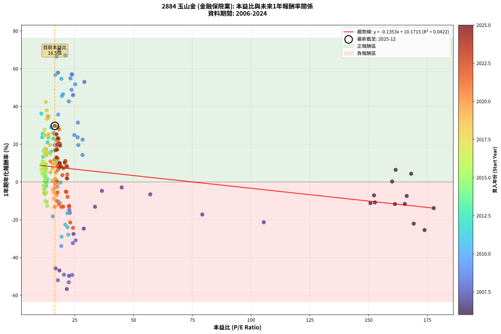
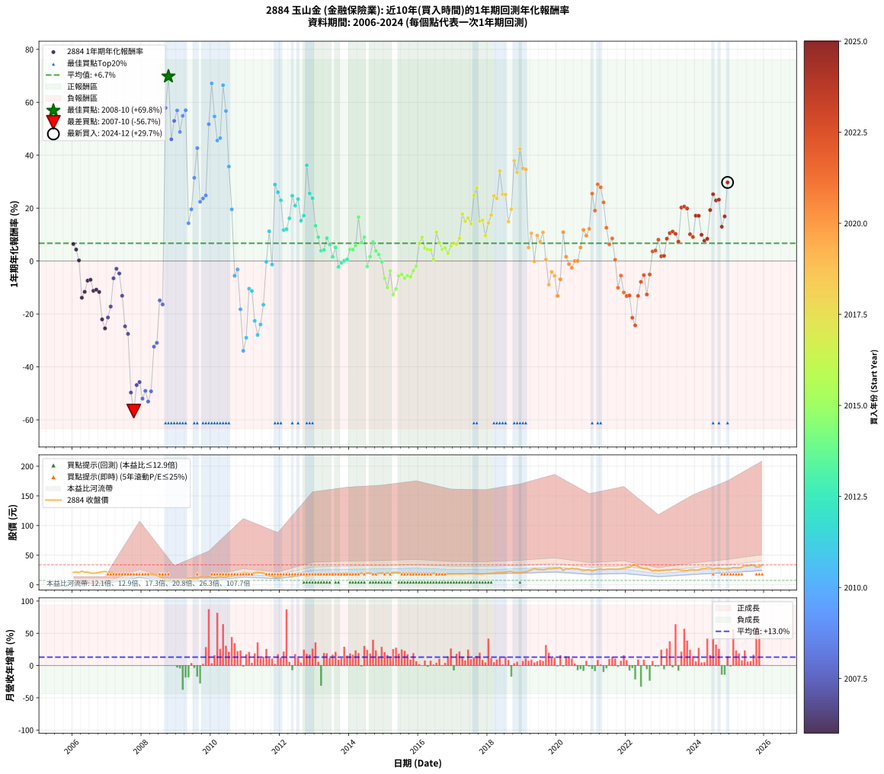

# 2884 玉山金 - 本益比與未來報酬率分析

!!! info "報告資訊"
    - **股票代號**: 2884
    - **公司名稱**: 玉山金
    - **產業別**: 金融保險業
    - **分析期間**: 2006-2024 (228 個數據點)
    - **資料來源**: Type 12 (ShowMonthlyK_ChartFlow) 月收盤價與本益比
    - **報酬率口徑**: 含現金股利 (簡化: 年度合計，假設每年7/1入帳)
    - **報告生成時間**: 2026-01-06 00:48:31 CST

## 📈 視覺化圖表

### 圖表1: 本益比 vs 未來報酬率關係

*圖表1：2884 玉山金 本益比與1年期未來報酬率關係 (2006-2024)*

### 圖表2: 歷年買入時點的1年期實際報酬率

*圖表2：2884 玉山金 歷年買入時點的1年期實際報酬率 (2006-2024)*

## 📍 買點訊號說明

本報告提供兩種買點提示訊號（顯示於圖表2的股價子圖中）：

### ▲ 小綠色三角形（回測驗證）
- **計算方式**: 使用全部歷史資料計算本益比第25百分位數
- **用途**: 事後驗證，顯示歷史上哪些時點確實為低估區
- **限制**: 當下無法判斷，僅供回測參考
- **特性**: 後見之明（Look-Ahead Bias）

### ▲ 小橘色三角形（即時訊號）
- **計算方式**: 使用截至當月的過去5年資料計算本益比第25百分位數
- **用途**: 實際投資決策，當時即可判斷
- **優勢**: 可操作性強，符合實務需求
- **特性**: 無後見之明，滾動窗口計算

!!! tip "如何使用兩種訊號"
    - **綠色▲** 幫助理解歷史估值機會，驗證策略有效性
    - **橘色▲** 可作為實際買進參考，但仍需搭配基本面分析
    - 兩種訊號重疊時，表示即時判斷與事後驗證一致，信心度較高
    - 僅有綠色▲時，表示當時無法判斷（需要未來資料才能確認）
    - 僅有橘色▲時，表示即時判斷為買點，但事後可能不是最佳時機

## 📊 估值分析摘要

| 指標 | 數值 |
|:---:|:---:|
| **目前本益比** (2024-12) | **16.53 倍** |
| **歷史平均本益比** | 25.61 倍 |
| **估值水準** | 🟢 相對低估 |
| **預期1年年化報酬率** | **+7.94%** |
| **歷史平均報酬率** | +6.71% |
| **相關係數 (R²)** | 0.0422 |
| **趨勢線斜率** | -0.1353 |

!!! abstract "核心洞察"
    目前本益比顯著低於歷史平均，預期未來報酬率可能較高

    根據歷史數據回測，2884 玉山金 在目前本益比 **16.5倍** 的估值水準下，
    預期未來1年年化報酬率約為 **+7.9%**。

    **重要提醒**: 本分析基於歷史數據統計，實際報酬率會受到公司基本面變化、產業趨勢、
    總體經濟環境等多重因素影響。R² = 0.04 表示本益比可解釋約 4.2% 的報酬率變異。

## 📈 歷史估值統計

### 最佳買點 (最高報酬率)

| 項目 | 數值 |
|:---:|:---:|
| 起始時間 | 2008-10 |
| 當時本益比 | 18.24 倍 |
| 起始價格 | 7.6 元 |
| 1年後價格 | 12.9 元 |
| **1年年化報酬率** | **+69.80%** |

### 最差買點 (最低報酬率)

| 項目 | 數值 |
|:---:|:---:|
| 起始時間 | 2007-10 |
| 當時本益比 | 21.64 倍 |
| 起始價格 | 18.5 元 |
| 1年後價格 | 7.6 元 |
| **1年年化報酬率** | **-56.68%** |

## 🎯 投資啟示

### 本益比與報酬率關係

趨勢線方程式: **y = -0.1353x + 10.1715**

!!! note "負相關"
    本益比與未來報酬率呈現負相關。較低的本益比通常帶來較高的未來報酬率，
    但相關性不算非常強。**估值仍是重要參考指標之一**。

### 估值區間建議

基於歷史數據分析:

- **🟢 低估區** (P/E < 20.5): 預期報酬率較高，可考慮增加持股
- **🟡 合理區** (P/E 20.5-30.7): 預期報酬率符合長期趨勢，正常持有
- **🔴 高估區** (P/E > 30.7): 預期報酬率較低，可考慮減碼或觀望

!!! danger "風險提示"
    - 過去表現不代表未來結果
    - 本分析假設公司基本面無重大結構性變化
    - 產業環境劇變可能使歷史規律失效
    - 應結合公司財報、產業趨勢、總體經濟等多重因素綜合判斷

!!! success "長期投資觀點"
    歷史數據顯示，在合理或低估的估值水準買入並長期持有，
    往往能獲得較佳的投資報酬。**耐心等待好價格**是價值投資的核心原則。

## 📊 數據品質

- **資料來源**: GoodInfo.tw Type 12 (ShowMonthlyK_ChartFlow)
- **資料頻率**: 月度收盤價與本益比
- **回測期間**: 2006-2024
- **數據點數量**: 228 個 (每個點代表一次1年期回測)

### 計算方法說明

1. **1年期年化報酬率**:
   - 對每個歷史時點，計算其後1年的實際投資報酬率
   - 期末價值(不含股利): 期末價格
   - 期末價值(含現金股利): 期末價格 + 持有期間內的現金股利合計 (簡化: 年度合計，假設每年7/1入帳)
   - 公式: 年化報酬率 = [(期末價值/期初價格)^(1/年數) - 1] × 100%

2. **本益比 (P/E Ratio)**:
   - 使用當時的月收盤價與EPS計算
   - 資料來源: Type 12 月度河流圖本益比數據

3. **趨勢線 (Linear Regression)**:
   - 使用最小平方法擬合線性趨勢線
   - R²值衡量本益比對報酬率的解釋能力

---

*本報告由 Stock Analysis System v1.9.0 自動生成*
*數據更新時間: 2026-01-06 00:48:31 CST*

## 📋 月度回測明細表

（每一列對應時間線圖中的一個買入點；可用來對照 SVG 圖上的每個點。）

| 買入月份 | 賣出月份 | 回測期限_年 | 實際持有年數 | 買入本益比_倍 | 買入收盤價_元 | 賣出收盤價_元 | 現金股利合計_元 | 總報酬率_pct | 年化報酬率_pct |
| --- | --- | --- | --- | --- | --- | --- | --- | --- | --- |
| 2006-01 | 2007-01 | 1 | 0.999 | 161.50 | 21.00 | 21.35 | 1.00 | +6.43 | +6.43 |
| 2006-02 | 2007-02 | 1 | 0.999 | 168.10 | 21.85 | 21.80 | 1.00 | +4.35 | +4.35 |
| 2006-03 | 2007-03 | 1 | 0.999 | 160.00 | 20.80 | 19.85 | 1.00 | +0.24 | +0.24 |
| 2006-04 | 2007-04 | 1 | 0.999 | 177.70 | 23.10 | 18.90 | 1.00 | -13.85 | -13.86 |
| 2006-05 | 2007-05 | 1 | 0.999 | 165.40 | 21.50 | 18.00 | 1.00 | -11.63 | -11.64 |
| 2006-06 | 2007-06 | 1 | 0.999 | 166.20 | 21.60 | 19.00 | 1.00 | -7.41 | -7.41 |
| 2006-07 | 2007-07 | 1 | 0.999 | 152.30 | 19.80 | 18.40 | 0.00 | -7.07 | -7.08 |
| 2006-08 | 2007-08 | 1 | 0.999 | 150.80 | 19.60 | 17.40 | 0.00 | -11.22 | -11.23 |
| 2006-09 | 2007-09 | 1 | 0.999 | 152.70 | 19.85 | 17.70 | 0.00 | -10.83 | -10.84 |
| 2006-10 | 2007-10 | 1 | 0.999 | 161.20 | 20.95 | 18.50 | 0.00 | -11.69 | -11.70 |
| 2006-11 | 2007-11 | 1 | 0.999 | 169.20 | 22.00 | 17.15 | 0.00 | -22.05 | -22.06 |
| 2006-12 | 2007-12 | 1 | 0.999 | 173.80 | 22.60 | 16.85 | 0.00 | -25.44 | -25.46 |
| 2007-01 | 2008-01 | 1 | 0.999 | 105.40 | 21.35 | 16.80 | 0.00 | -21.31 | -21.32 |
| 2007-02 | 2008-02 | 1 | 0.999 | 79.27 | 21.80 | 18.05 | 0.00 | -17.20 | -17.21 |
| 2007-03 | 2008-03 | 1 | 1.002 | 57.12 | 19.85 | 18.55 | 0.00 | -6.55 | -6.54 |
| 2007-04 | 2008-04 | 1 | 1.002 | 45.00 | 18.90 | 18.35 | 0.00 | -2.91 | -2.90 |
| 2007-05 | 2008-05 | 1 | 1.002 | 36.55 | 18.00 | 17.15 | 0.00 | -4.72 | -4.71 |
| 2007-06 | 2008-06 | 1 | 1.002 | 33.63 | 19.00 | 16.50 | 0.00 | -13.16 | -13.13 |
| 2007-07 | 2008-07 | 1 | 1.002 | 28.86 | 18.40 | 13.45 | 0.40 | -24.73 | -24.68 |
| 2007-08 | 2008-08 | 1 | 1.002 | 24.51 | 17.40 | 12.20 | 0.40 | -27.59 | -27.54 |
| 2007-09 | 2008-09 | 1 | 1.002 | 22.62 | 17.70 | 8.49 | 0.40 | -49.77 | -49.70 |
| 2007-10 | 2008-10 | 1 | 1.002 | 21.64 | 18.50 | 7.60 | 0.40 | -56.76 | -56.68 |
| 2007-11 | 2008-11 | 1 | 1.002 | 18.49 | 17.15 | 8.70 | 0.40 | -46.94 | -46.87 |
| 2007-12 | 2008-12 | 1 | 1.002 | 16.85 | 16.85 | 8.73 | 0.40 | -45.82 | -45.75 |
| 2008-01 | 2009-01 | 1 | 1.002 | 17.84 | 16.80 | 7.65 | 0.40 | -52.08 | -52.01 |
| 2008-02 | 2009-03 | 1 | 1.081 | 20.43 | 18.05 | 8.30 | 0.40 | -51.80 | -49.08 |
| 2008-03 | 2009-03 | 1 | 0.999 | 22.48 | 18.55 | 8.30 | 0.40 | -53.10 | -53.12 |
| 2008-04 | 2009-04 | 1 | 0.999 | 23.93 | 18.35 | 8.92 | 0.40 | -49.21 | -49.23 |
| 2008-05 | 2009-05 | 1 | 0.999 | 24.21 | 17.15 | 11.20 | 0.40 | -32.36 | -32.38 |
| 2008-06 | 2009-06 | 1 | 0.999 | 25.38 | 16.50 | 11.00 | 0.40 | -30.91 | -30.93 |
| 2008-07 | 2009-07 | 1 | 0.999 | 22.73 | 13.45 | 11.45 | 0.00 | -14.87 | -14.88 |
| 2008-08 | 2009-08 | 1 | 0.999 | 22.87 | 12.20 | 10.20 | 0.00 | -16.39 | -16.40 |
| 2008-09 | 2009-09 | 1 | 0.999 | 17.87 | 8.49 | 13.40 | 0.00 | +57.83 | +57.88 |
| 2008-10 | 2009-10 | 1 | 0.999 | 18.24 | 7.60 | 12.90 | 0.00 | +69.74 | +69.80 |
| 2008-11 | 2009-11 | 1 | 0.999 | 24.28 | 8.70 | 12.70 | 0.00 | +45.98 | +46.01 |
| 2008-12 | 2009-12 | 1 | 0.999 | 29.10 | 8.73 | 13.35 | 0.00 | +52.92 | +52.97 |
| 2009-01 | 2010-01 | 1 | 0.999 | 23.97 | 7.65 | 12.00 | 0.00 | +56.86 | +56.91 |
| 2009-02 | 2010-02 | 1 | 0.999 | 23.65 | 8.00 | 11.90 | 0.00 | +48.75 | +48.79 |
| 2009-03 | 2010-03 | 1 | 0.999 | 23.22 | 8.30 | 12.85 | 0.00 | +54.82 | +54.87 |
| 2009-04 | 2010-04 | 1 | 0.999 | 23.68 | 8.92 | 14.00 | 0.00 | +56.95 | +57.00 |
| 2009-05 | 2010-05 | 1 | 0.999 | 28.29 | 11.20 | 12.80 | 0.00 | +14.29 | +14.30 |
| 2009-06 | 2010-06 | 1 | 0.999 | 26.51 | 11.00 | 13.15 | 0.00 | +19.55 | +19.56 |
| 2009-07 | 2010-07 | 1 | 0.999 | 26.37 | 11.45 | 14.85 | 0.20 | +31.43 | +31.46 |
| 2009-08 | 2010-08 | 1 | 0.999 | 22.50 | 10.20 | 14.35 | 0.20 | +42.64 | +42.67 |
| 2009-09 | 2010-09 | 1 | 0.999 | 28.36 | 13.40 | 16.20 | 0.20 | +22.38 | +22.40 |
| 2009-10 | 2010-10 | 1 | 0.999 | 26.24 | 12.90 | 15.75 | 0.20 | +23.64 | +23.65 |
| 2009-11 | 2010-11 | 1 | 0.999 | 24.86 | 12.70 | 15.65 | 0.20 | +24.80 | +24.81 |
| 2009-12 | 2010-12 | 1 | 0.999 | 25.19 | 13.35 | 20.05 | 0.20 | +51.68 | +51.72 |
| 2010-01 | 2011-01 | 1 | 0.999 | 20.96 | 12.00 | 19.85 | 0.20 | +67.08 | +67.13 |
| 2010-02 | 2011-02 | 1 | 0.999 | 19.35 | 11.90 | 18.20 | 0.20 | +54.61 | +54.66 |
| 2010-03 | 2011-03 | 1 | 0.999 | 19.54 | 12.85 | 18.50 | 0.20 | +45.52 | +45.55 |
| 2010-04 | 2011-04 | 1 | 0.999 | 20.00 | 14.00 | 20.30 | 0.20 | +46.42 | +46.46 |
| 2010-05 | 2011-05 | 1 | 0.999 | 17.24 | 12.80 | 21.10 | 0.20 | +66.40 | +66.46 |
| 2010-06 | 2011-06 | 1 | 0.999 | 16.75 | 13.15 | 20.40 | 0.20 | +56.65 | +56.69 |
| 2010-07 | 2011-07 | 1 | 0.999 | 17.95 | 14.85 | 19.95 | 0.20 | +35.69 | +35.72 |
| 2010-08 | 2011-08 | 1 | 0.999 | 16.49 | 14.35 | 16.95 | 0.20 | +19.51 | +19.53 |
| 2010-09 | 2011-09 | 1 | 0.999 | 17.75 | 16.20 | 15.10 | 0.20 | -5.56 | -5.56 |
| 2010-10 | 2011-10 | 1 | 0.999 | 16.49 | 15.75 | 15.05 | 0.20 | -3.17 | -3.18 |
| 2010-11 | 2011-11 | 1 | 0.999 | 15.69 | 15.65 | 12.60 | 0.20 | -18.21 | -18.22 |
| 2010-12 | 2011-12 | 1 | 0.999 | 19.28 | 20.05 | 13.05 | 0.20 | -33.92 | -33.93 |
| 2011-01 | 2012-01 | 1 | 0.999 | 19.43 | 19.85 | 13.90 | 0.20 | -28.97 | -28.98 |
| 2011-02 | 2012-02 | 1 | 0.999 | 18.14 | 18.20 | 16.10 | 0.20 | -10.44 | -10.45 |
| 2011-03 | 2012-03 | 1 | 1.002 | 18.78 | 18.50 | 16.20 | 0.20 | -11.35 | -11.33 |
| 2011-04 | 2012-04 | 1 | 1.002 | 21.00 | 20.30 | 15.50 | 0.20 | -22.66 | -22.62 |
| 2011-05 | 2012-05 | 1 | 1.002 | 22.25 | 21.10 | 15.00 | 0.20 | -27.96 | -27.91 |
| 2011-06 | 2012-06 | 1 | 1.002 | 21.94 | 20.40 | 15.30 | 0.20 | -24.02 | -23.98 |
| 2011-07 | 2012-07 | 1 | 1.002 | 21.88 | 19.95 | 16.45 | 0.20 | -16.54 | -16.51 |
| 2011-08 | 2012-08 | 1 | 1.002 | 18.97 | 16.95 | 16.70 | 0.20 | -0.29 | -0.29 |
| 2011-09 | 2012-09 | 1 | 1.002 | 17.26 | 15.10 | 16.60 | 0.20 | +11.26 | +11.23 |
| 2011-10 | 2012-10 | 1 | 1.002 | 17.57 | 15.05 | 14.65 | 0.20 | -1.33 | -1.33 |
| 2011-11 | 2012-11 | 1 | 1.002 | 15.03 | 12.60 | 16.05 | 0.20 | +28.97 | +28.90 |
| 2011-12 | 2012-12 | 1 | 1.002 | 15.91 | 13.05 | 16.25 | 0.20 | +26.05 | +25.99 |
| 2012-01 | 2013-01 | 1 | 1.002 | 15.92 | 13.90 | 16.90 | 0.20 | +23.02 | +22.97 |
| 2012-02 | 2013-03 | 1 | 1.081 | 17.38 | 16.10 | 17.95 | 0.20 | +12.73 | +11.72 |
| 2012-03 | 2013-03 | 1 | 0.999 | 16.54 | 16.20 | 17.95 | 0.20 | +12.04 | +12.05 |
| 2012-04 | 2013-04 | 1 | 0.999 | 15.01 | 15.50 | 17.80 | 0.20 | +16.13 | +16.14 |
| 2012-05 | 2013-05 | 1 | 0.999 | 13.82 | 15.00 | 18.50 | 0.20 | +24.67 | +24.69 |
| 2012-06 | 2013-06 | 1 | 0.999 | 13.44 | 15.30 | 18.30 | 0.20 | +20.92 | +20.93 |
| 2012-07 | 2013-07 | 1 | 0.999 | 13.80 | 16.45 | 20.00 | 0.30 | +23.40 | +23.42 |
| 2012-08 | 2013-08 | 1 | 0.999 | 13.42 | 16.70 | 18.95 | 0.30 | +15.27 | +15.28 |
| 2012-09 | 2013-09 | 1 | 0.999 | 12.79 | 16.60 | 19.15 | 0.30 | +17.17 | +17.18 |
| 2012-10 | 2013-10 | 1 | 0.999 | 10.84 | 14.65 | 19.65 | 0.30 | +36.18 | +36.21 |
| 2012-11 | 2013-11 | 1 | 0.999 | 11.43 | 16.05 | 19.85 | 0.30 | +25.55 | +25.56 |
| 2012-12 | 2013-12 | 1 | 0.999 | 11.15 | 16.25 | 19.80 | 0.30 | +23.69 | +23.71 |
| 2013-01 | 2014-01 | 1 | 0.999 | 11.55 | 16.90 | 18.85 | 0.30 | +13.31 | +13.32 |
| 2013-02 | 2014-02 | 1 | 0.999 | 12.08 | 17.75 | 19.05 | 0.30 | +9.01 | +9.02 |
| 2013-03 | 2014-03 | 1 | 0.999 | 12.17 | 17.95 | 18.35 | 0.30 | +3.90 | +3.90 |
| 2013-04 | 2014-04 | 1 | 0.999 | 12.02 | 17.80 | 18.25 | 0.30 | +4.21 | +4.22 |
| 2013-05 | 2014-05 | 1 | 0.999 | 12.44 | 18.50 | 19.80 | 0.30 | +8.65 | +8.65 |
| 2013-06 | 2014-06 | 1 | 0.999 | 12.25 | 18.30 | 19.15 | 0.30 | +6.28 | +6.29 |
| 2013-07 | 2014-07 | 1 | 0.999 | 13.34 | 20.00 | 20.05 | 0.28 | +1.63 | +1.63 |
| 2013-08 | 2014-08 | 1 | 0.999 | 12.59 | 18.95 | 19.65 | 0.28 | +5.15 | +5.15 |
| 2013-09 | 2014-09 | 1 | 0.999 | 12.67 | 19.15 | 18.45 | 0.28 | -2.21 | -2.22 |
| 2013-10 | 2014-10 | 1 | 0.999 | 12.95 | 19.65 | 19.25 | 0.28 | -0.63 | -0.63 |
| 2013-11 | 2014-11 | 1 | 0.999 | 13.03 | 19.85 | 19.60 | 0.28 | +0.13 | +0.13 |
| 2013-12 | 2014-12 | 1 | 0.999 | 12.94 | 19.80 | 19.65 | 0.28 | +0.64 | +0.64 |
| 2014-01 | 2015-01 | 1 | 0.999 | 12.30 | 18.85 | 19.40 | 0.28 | +4.38 | +4.39 |
| 2014-02 | 2015-02 | 1 | 0.999 | 12.41 | 19.05 | 19.60 | 0.28 | +4.34 | +4.34 |
| 2014-03 | 2015-03 | 1 | 0.999 | 11.93 | 18.35 | 19.15 | 0.28 | +5.86 | +5.87 |
| 2014-04 | 2015-04 | 1 | 0.999 | 11.85 | 18.25 | 21.00 | 0.28 | +16.58 | +16.59 |
| 2014-05 | 2015-05 | 1 | 0.999 | 12.83 | 19.80 | 20.90 | 0.28 | +6.95 | +6.95 |
| 2014-06 | 2015-06 | 1 | 0.999 | 12.39 | 19.15 | 20.60 | 0.28 | +9.01 | +9.02 |
| 2014-07 | 2015-07 | 1 | 0.999 | 12.95 | 20.05 | 19.20 | 0.43 | -2.07 | -2.07 |
| 2014-08 | 2015-08 | 1 | 0.999 | 12.67 | 19.65 | 19.55 | 0.43 | +1.70 | +1.71 |
| 2014-09 | 2015-09 | 1 | 0.999 | 11.88 | 18.45 | 19.35 | 0.43 | +7.24 | +7.24 |
| 2014-10 | 2015-10 | 1 | 0.999 | 12.37 | 19.25 | 19.55 | 0.43 | +3.82 | +3.82 |
| 2014-11 | 2015-11 | 1 | 0.999 | 12.57 | 19.60 | 19.65 | 0.43 | +2.47 | +2.48 |
| 2014-12 | 2015-12 | 1 | 0.999 | 12.58 | 19.65 | 19.15 | 0.43 | -0.33 | -0.33 |
| 2015-01 | 2016-01 | 1 | 0.999 | 12.38 | 19.40 | 17.70 | 0.43 | -6.52 | -6.52 |
| 2015-02 | 2016-02 | 1 | 0.999 | 12.46 | 19.60 | 17.20 | 0.43 | -10.03 | -10.03 |
| 2015-03 | 2016-03 | 1 | 1.002 | 12.13 | 19.15 | 18.00 | 0.43 | -3.73 | -3.73 |
| 2015-04 | 2016-04 | 1 | 1.002 | 13.26 | 21.00 | 17.90 | 0.43 | -12.69 | -12.67 |
| 2015-05 | 2016-05 | 1 | 1.002 | 13.14 | 20.90 | 18.25 | 0.43 | -10.60 | -10.58 |
| 2015-06 | 2016-06 | 1 | 1.002 | 12.91 | 20.60 | 19.00 | 0.43 | -5.66 | -5.64 |
| 2015-07 | 2016-07 | 1 | 1.002 | 11.99 | 19.20 | 17.80 | 0.43 | -5.05 | -5.04 |
| 2015-08 | 2016-08 | 1 | 1.002 | 12.16 | 19.55 | 17.85 | 0.43 | -6.50 | -6.48 |
| 2015-09 | 2016-09 | 1 | 1.002 | 12.00 | 19.35 | 17.85 | 0.43 | -5.53 | -5.52 |
| 2015-10 | 2016-10 | 1 | 1.002 | 12.08 | 19.55 | 17.95 | 0.43 | -5.98 | -5.97 |
| 2015-11 | 2016-11 | 1 | 1.002 | 12.10 | 19.65 | 18.50 | 0.43 | -3.66 | -3.66 |
| 2015-12 | 2016-12 | 1 | 1.002 | 11.75 | 19.15 | 18.35 | 0.43 | -1.93 | -1.93 |
| 2016-01 | 2017-01 | 1 | 1.002 | 10.93 | 17.70 | 18.45 | 0.43 | +6.67 | +6.65 |
| 2016-02 | 2017-03 | 1 | 1.081 | 10.69 | 17.20 | 18.45 | 0.43 | +9.77 | +9.00 |
| 2016-03 | 2017-03 | 1 | 0.999 | 11.27 | 18.00 | 18.45 | 0.43 | +4.89 | +4.89 |
| 2016-04 | 2017-04 | 1 | 0.999 | 11.28 | 17.90 | 18.25 | 0.43 | +4.36 | +4.36 |
| 2016-05 | 2017-05 | 1 | 0.999 | 11.58 | 18.25 | 18.60 | 0.43 | +4.27 | +4.28 |
| 2016-06 | 2017-06 | 1 | 0.999 | 12.14 | 19.00 | 18.70 | 0.43 | +0.68 | +0.68 |
| 2016-07 | 2017-07 | 1 | 0.999 | 11.45 | 17.80 | 19.25 | 0.49 | +10.90 | +10.91 |
| 2016-08 | 2017-08 | 1 | 0.999 | 11.57 | 17.85 | 18.60 | 0.49 | +6.95 | +6.96 |
| 2016-09 | 2017-09 | 1 | 0.999 | 11.65 | 17.85 | 18.15 | 0.49 | +4.43 | +4.43 |
| 2016-10 | 2017-10 | 1 | 0.999 | 11.80 | 17.95 | 18.35 | 0.49 | +4.96 | +4.97 |
| 2016-11 | 2017-11 | 1 | 0.999 | 12.24 | 18.50 | 18.55 | 0.49 | +2.92 | +2.93 |
| 2016-12 | 2017-12 | 1 | 0.999 | 12.23 | 18.35 | 18.90 | 0.49 | +5.67 | +5.68 |
| 2017-01 | 2018-01 | 1 | 0.999 | 12.31 | 18.45 | 19.20 | 0.49 | +6.73 | +6.73 |
| 2017-02 | 2018-02 | 1 | 0.999 | 12.45 | 18.65 | 19.35 | 0.49 | +6.39 | +6.39 |
| 2017-03 | 2018-03 | 1 | 0.999 | 12.32 | 18.45 | 19.55 | 0.49 | +8.62 | +8.63 |
| 2017-04 | 2018-04 | 1 | 0.999 | 12.19 | 18.25 | 21.00 | 0.49 | +17.76 | +17.77 |
| 2017-05 | 2018-05 | 1 | 0.999 | 12.43 | 18.60 | 20.90 | 0.49 | +15.01 | +15.02 |
| 2017-06 | 2018-06 | 1 | 0.999 | 12.51 | 18.70 | 21.25 | 0.49 | +16.26 | +16.27 |
| 2017-07 | 2018-07 | 1 | 0.999 | 12.88 | 19.25 | 21.35 | 0.61 | +14.09 | +14.10 |
| 2017-08 | 2018-08 | 1 | 0.999 | 12.46 | 18.60 | 22.60 | 0.61 | +24.80 | +24.82 |
| 2017-09 | 2018-09 | 1 | 0.999 | 12.16 | 18.15 | 22.55 | 0.61 | +27.62 | +27.64 |
| 2017-10 | 2018-10 | 1 | 0.999 | 12.30 | 18.35 | 20.50 | 0.61 | +15.06 | +15.07 |
| 2017-11 | 2018-11 | 1 | 0.999 | 12.44 | 18.55 | 20.80 | 0.61 | +15.43 | +15.45 |
| 2017-12 | 2018-12 | 1 | 0.999 | 12.68 | 18.90 | 20.10 | 0.61 | +9.59 | +9.60 |
| 2018-01 | 2019-01 | 1 | 0.999 | 12.82 | 19.20 | 21.35 | 0.61 | +14.39 | +14.40 |
| 2018-02 | 2019-02 | 1 | 0.999 | 12.86 | 19.35 | 22.10 | 0.61 | +17.38 | +17.39 |
| 2018-03 | 2019-03 | 1 | 0.999 | 12.93 | 19.55 | 23.75 | 0.61 | +24.62 | +24.64 |
| 2018-04 | 2019-04 | 1 | 0.999 | 13.82 | 21.00 | 25.35 | 0.61 | +23.63 | +23.65 |
| 2018-05 | 2019-05 | 1 | 0.999 | 13.68 | 20.90 | 27.40 | 0.61 | +34.03 | +34.06 |
| 2018-06 | 2019-06 | 1 | 0.999 | 13.84 | 21.25 | 26.00 | 0.61 | +25.24 | +25.26 |
| 2018-07 | 2019-07 | 1 | 0.999 | 13.84 | 21.35 | 26.00 | 0.71 | +25.11 | +25.12 |
| 2018-08 | 2019-08 | 1 | 0.999 | 14.58 | 22.60 | 25.25 | 0.71 | +14.87 | +14.88 |
| 2018-09 | 2019-09 | 1 | 0.999 | 14.48 | 22.55 | 26.25 | 0.71 | +19.56 | +19.57 |
| 2018-10 | 2019-10 | 1 | 0.999 | 13.10 | 20.50 | 27.55 | 0.71 | +37.85 | +37.88 |
| 2018-11 | 2019-11 | 1 | 0.999 | 13.23 | 20.80 | 27.05 | 0.71 | +33.46 | +33.49 |
| 2018-12 | 2019-12 | 1 | 0.999 | 12.72 | 20.10 | 27.90 | 0.71 | +42.34 | +42.37 |
| 2019-01 | 2020-01 | 1 | 0.999 | 13.41 | 21.35 | 28.10 | 0.71 | +34.94 | +34.97 |
| 2019-02 | 2020-02 | 1 | 0.999 | 13.77 | 22.10 | 29.05 | 0.71 | +34.66 | +34.69 |
| 2019-03 | 2020-03 | 1 | 1.002 | 14.68 | 23.75 | 24.25 | 0.71 | +5.09 | +5.08 |
| 2019-04 | 2020-04 | 1 | 1.002 | 15.55 | 25.35 | 27.30 | 0.71 | +10.49 | +10.47 |
| 2019-05 | 2020-05 | 1 | 1.002 | 16.68 | 27.40 | 26.65 | 0.71 | -0.15 | -0.15 |
| 2019-06 | 2020-06 | 1 | 1.002 | 15.71 | 26.00 | 27.80 | 0.71 | +9.65 | +9.63 |
| 2019-07 | 2020-07 | 1 | 1.002 | 15.59 | 26.00 | 27.10 | 0.79 | +7.27 | +7.26 |
| 2019-08 | 2020-08 | 1 | 1.002 | 15.03 | 25.25 | 27.20 | 0.79 | +10.86 | +10.83 |
| 2019-09 | 2020-09 | 1 | 1.002 | 15.51 | 26.25 | 25.60 | 0.79 | +0.54 | +0.54 |
| 2019-10 | 2020-10 | 1 | 1.002 | 16.16 | 27.55 | 24.30 | 0.79 | -8.93 | -8.91 |
| 2019-11 | 2020-11 | 1 | 1.002 | 15.75 | 27.05 | 25.15 | 0.79 | -4.10 | -4.09 |
| 2019-12 | 2020-12 | 1 | 1.002 | 16.13 | 27.90 | 25.55 | 0.79 | -5.59 | -5.58 |
| 2020-01 | 2021-01 | 1 | 1.002 | 16.48 | 28.10 | 23.60 | 0.79 | -13.20 | -13.17 |
| 2020-02 | 2021-03 | 1 | 1.081 | 17.29 | 29.05 | 26.10 | 0.79 | -7.43 | -6.89 |
| 2020-03 | 2021-03 | 1 | 0.999 | 14.65 | 24.25 | 26.10 | 0.79 | +10.89 | +10.90 |
| 2020-04 | 2021-04 | 1 | 0.999 | 16.75 | 27.30 | 26.95 | 0.79 | +1.62 | +1.62 |
| 2020-05 | 2021-05 | 1 | 0.999 | 16.60 | 26.65 | 25.55 | 0.79 | -1.16 | -1.16 |
| 2020-06 | 2021-06 | 1 | 0.999 | 17.59 | 27.80 | 26.30 | 0.79 | -2.55 | -2.55 |
| 2020-07 | 2021-07 | 1 | 0.999 | 17.43 | 27.10 | 26.50 | 0.61 | +0.04 | +0.04 |
| 2020-08 | 2021-08 | 1 | 0.999 | 17.78 | 27.20 | 26.60 | 0.61 | +0.04 | +0.04 |
| 2020-09 | 2021-09 | 1 | 0.999 | 17.01 | 25.60 | 26.30 | 0.61 | +5.12 | +5.12 |
| 2020-10 | 2021-10 | 1 | 0.999 | 16.42 | 24.30 | 26.55 | 0.61 | +11.77 | +11.78 |
| 2020-11 | 2021-11 | 1 | 0.999 | 17.29 | 25.15 | 26.95 | 0.61 | +9.58 | +9.59 |
| 2020-12 | 2021-12 | 1 | 0.999 | 17.87 | 25.55 | 28.05 | 0.61 | +12.17 | +12.18 |
| 2021-01 | 2022-01 | 1 | 0.999 | 16.40 | 23.60 | 29.00 | 0.61 | +25.47 | +25.49 |
| 2021-02 | 2022-02 | 1 | 0.999 | 17.43 | 25.25 | 29.45 | 0.61 | +19.05 | +19.06 |
| 2021-03 | 2022-03 | 1 | 0.999 | 17.91 | 26.10 | 33.05 | 0.61 | +28.97 | +28.99 |
| 2021-04 | 2022-04 | 1 | 0.999 | 18.38 | 26.95 | 33.85 | 0.61 | +27.87 | +27.89 |
| 2021-05 | 2022-05 | 1 | 0.999 | 17.31 | 25.55 | 30.60 | 0.61 | +22.15 | +22.17 |
| 2021-06 | 2022-06 | 1 | 0.999 | 17.71 | 26.30 | 29.00 | 0.61 | +12.59 | +12.59 |
| 2021-07 | 2022-07 | 1 | 0.999 | 17.74 | 26.50 | 27.50 | 0.67 | +6.30 | +6.31 |
| 2021-08 | 2022-08 | 1 | 0.999 | 17.69 | 26.60 | 28.20 | 0.67 | +8.53 | +8.54 |
| 2021-09 | 2022-09 | 1 | 0.999 | 17.39 | 26.30 | 25.75 | 0.67 | +0.46 | +0.46 |
| 2021-10 | 2022-10 | 1 | 0.999 | 17.45 | 26.55 | 23.20 | 0.67 | -10.09 | -10.10 |
| 2021-11 | 2022-11 | 1 | 0.999 | 17.60 | 26.95 | 24.80 | 0.67 | -5.49 | -5.50 |
| 2021-12 | 2022-12 | 1 | 0.999 | 18.21 | 28.05 | 24.05 | 0.67 | -11.87 | -11.88 |
| 2022-01 | 2023-01 | 1 | 0.999 | 19.29 | 29.00 | 24.50 | 0.67 | -13.21 | -13.22 |
| 2022-02 | 2023-02 | 1 | 0.999 | 20.08 | 29.45 | 24.95 | 0.67 | -13.01 | -13.01 |
| 2022-03 | 2023-03 | 1 | 0.999 | 23.11 | 33.05 | 25.30 | 0.67 | -21.42 | -21.44 |
| 2022-04 | 2023-04 | 1 | 0.999 | 24.29 | 33.85 | 24.95 | 0.67 | -24.31 | -24.33 |
| 2022-05 | 2023-05 | 1 | 0.999 | 22.56 | 30.60 | 25.90 | 0.67 | -13.17 | -13.18 |
| 2022-06 | 2023-06 | 1 | 0.999 | 21.97 | 29.00 | 26.05 | 0.67 | -7.86 | -7.87 |
| 2022-07 | 2023-07 | 1 | 0.999 | 21.43 | 27.50 | 25.85 | 0.19 | -5.31 | -5.32 |
| 2022-08 | 2023-08 | 1 | 0.999 | 22.62 | 28.20 | 24.45 | 0.19 | -12.63 | -12.64 |
| 2022-09 | 2023-09 | 1 | 0.999 | 21.28 | 25.75 | 24.25 | 0.19 | -5.09 | -5.09 |
| 2022-10 | 2023-10 | 1 | 0.999 | 19.77 | 23.20 | 23.85 | 0.19 | +3.62 | +3.62 |
| 2022-11 | 2023-11 | 1 | 0.999 | 21.82 | 24.80 | 25.60 | 0.19 | +3.99 | +3.99 |
| 2022-12 | 2023-12 | 1 | 0.999 | 21.86 | 24.05 | 25.80 | 0.19 | +8.06 | +8.07 |
| 2023-01 | 2024-01 | 1 | 0.999 | 21.76 | 24.50 | 24.75 | 0.19 | +1.79 | +1.79 |
| 2023-02 | 2024-02 | 1 | 0.999 | 21.66 | 24.95 | 25.25 | 0.19 | +1.96 | +1.96 |
| 2023-03 | 2024-03 | 1 | 1.002 | 21.49 | 25.30 | 27.25 | 0.19 | +8.45 | +8.44 |
| 2023-04 | 2024-04 | 1 | 1.002 | 20.73 | 24.95 | 27.40 | 0.19 | +10.58 | +10.55 |
| 2023-05 | 2024-05 | 1 | 1.002 | 21.07 | 25.90 | 28.60 | 0.19 | +11.15 | +11.13 |
| 2023-06 | 2024-06 | 1 | 1.002 | 20.76 | 26.05 | 28.55 | 0.19 | +10.32 | +10.30 |
| 2023-07 | 2024-07 | 1 | 1.002 | 20.18 | 25.85 | 26.55 | 1.20 | +7.35 | +7.33 |
| 2023-08 | 2024-08 | 1 | 1.002 | 18.71 | 24.45 | 28.20 | 1.20 | +20.25 | +20.20 |
| 2023-09 | 2024-09 | 1 | 1.002 | 18.20 | 24.25 | 28.05 | 1.20 | +20.62 | +20.57 |
| 2023-10 | 2024-10 | 1 | 1.002 | 17.56 | 23.85 | 27.40 | 1.20 | +19.92 | +19.87 |
| 2023-11 | 2024-11 | 1 | 1.002 | 18.49 | 25.60 | 27.00 | 1.20 | +10.16 | +10.13 |
| 2023-12 | 2024-12 | 1 | 1.002 | 18.30 | 25.80 | 26.95 | 1.20 | +9.11 | +9.09 |
| 2024-01 | 2025-01 | 1 | 1.002 | 17.33 | 24.75 | 27.80 | 1.20 | +17.17 | +17.13 |
| 2024-02 | 2025-03 | 1 | 1.081 | 17.45 | 25.25 | 28.75 | 1.20 | +18.61 | +17.10 |
| 2024-03 | 2025-03 | 1 | 0.999 | 18.60 | 27.25 | 28.75 | 1.20 | +9.91 | +9.92 |
| 2024-04 | 2025-04 | 1 | 0.999 | 18.47 | 27.40 | 28.30 | 1.20 | +7.66 | +7.67 |
| 2024-05 | 2025-05 | 1 | 0.999 | 19.05 | 28.60 | 29.80 | 1.20 | +8.39 | +8.40 |
| 2024-06 | 2025-06 | 1 | 0.999 | 18.78 | 28.55 | 32.85 | 1.20 | +19.26 | +19.28 |
| 2024-07 | 2025-07 | 1 | 0.999 | 17.26 | 26.55 | 32.05 | 1.20 | +25.24 | +25.25 |
| 2024-08 | 2025-08 | 1 | 0.999 | 18.12 | 28.20 | 33.45 | 1.20 | +22.87 | +22.89 |
| 2024-09 | 2025-09 | 1 | 0.999 | 17.81 | 28.05 | 33.35 | 1.20 | +23.17 | +23.19 |
| 2024-10 | 2025-10 | 1 | 0.999 | 17.20 | 27.40 | 29.75 | 1.20 | +12.96 | +12.97 |
| 2024-11 | 2025-11 | 1 | 0.999 | 16.75 | 27.00 | 30.35 | 1.20 | +16.85 | +16.86 |
| 2024-12 | 2025-12 | 1 | 0.999 | 16.53 | 26.95 | 33.75 | 1.20 | +29.68 | +29.71 |
