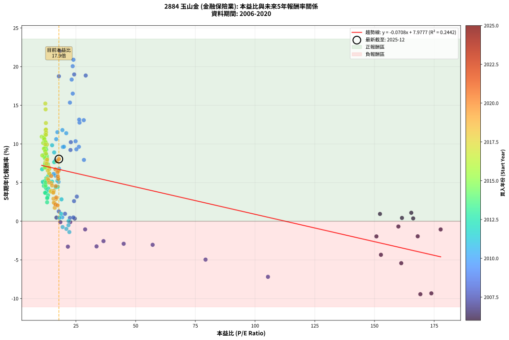
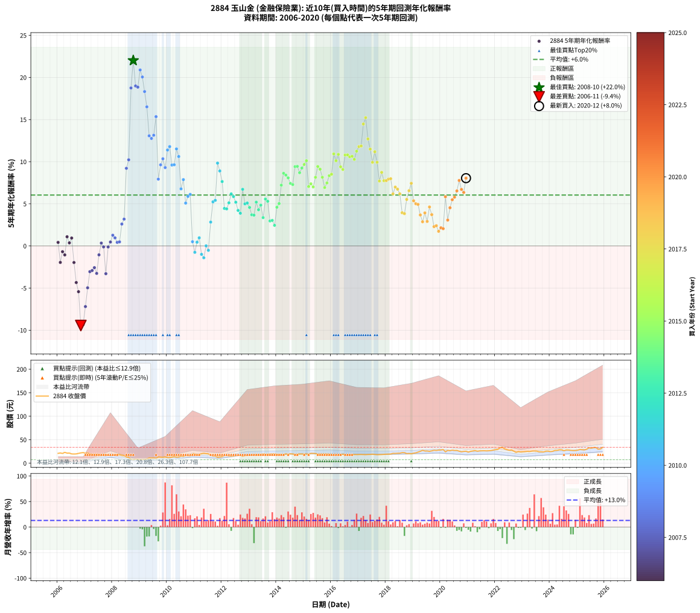

# 2884 玉山金 - 本益比與未來報酬率分析

!!! info "報告資訊"
    - **股票代號**: 2884
    - **公司名稱**: 玉山金
    - **產業別**: 金融保險業
    - **分析期間**: 2006-2020 (180 個數據點)
    - **資料來源**: Type 12 (ShowMonthlyK_ChartFlow) 月收盤價與本益比
    - **報酬率口徑**: 含現金股利 (簡化: 年度合計，假設每年7/1入帳)
    - **報告生成時間**: 2026-01-07 18:47:29 CST

## 📈 視覺化圖表

### 圖表1: 本益比 vs 未來報酬率關係

*圖表1：2884 玉山金 本益比與5年期未來報酬率關係 (2006-2020)*

### 圖表2: 歷年買入時點的5年期實際報酬率

*圖表2：2884 玉山金 歷年買入時點的5年期實際報酬率 (2006-2020)*

## 📍 買點訊號說明

本報告提供兩種買點提示訊號（顯示於圖表2的股價子圖中）：

### ▲ 小綠色三角形（回測驗證）
- **計算方式**: 使用全部歷史資料計算本益比第25百分位數
- **用途**: 事後驗證，顯示歷史上哪些時點確實為低估區
- **限制**: 當下無法判斷，僅供回測參考
- **特性**: 後見之明（Look-Ahead Bias）

### ▲ 小橘色三角形（即時訊號）
- **計算方式**: 使用截至當月的過去5年資料計算本益比第25百分位數
- **用途**: 實際投資決策，當時即可判斷
- **優勢**: 可操作性強，符合實務需求
- **特性**: 無後見之明，滾動窗口計算

!!! tip "如何使用兩種訊號"
    - **綠色▲** 幫助理解歷史估值機會，驗證策略有效性
    - **橘色▲** 可作為實際買進參考，但仍需搭配基本面分析
    - 兩種訊號重疊時，表示即時判斷與事後驗證一致，信心度較高
    - 僅有綠色▲時，表示當時無法判斷（需要未來資料才能確認）
    - 僅有橘色▲時，表示即時判斷為買點，但事後可能不是最佳時機

## 📊 估值分析摘要

| 指標 | 數值 |
|:---:|:---:|
| **目前本益比** (2020-12) | **17.87 倍** |
| **歷史平均本益比** | 27.31 倍 |
| **估值水準** | 🟢 相對低估 |
| **預期5年年化報酬率** | **+6.71%** |
| **歷史平均報酬率** | +6.04% |
| **相關係數 (R²)** | 0.2442 |
| **趨勢線斜率** | -0.0708 |

!!! abstract "核心洞察"
    目前本益比顯著低於歷史平均，預期未來報酬率可能較高

    根據歷史數據回測，2884 玉山金 在目前本益比 **17.9倍** 的估值水準下，
    預期未來5年年化報酬率約為 **+6.7%**。

    **重要提醒**: 本分析基於歷史數據統計，實際報酬率會受到公司基本面變化、產業趨勢、
    總體經濟環境等多重因素影響。R² = 0.24 表示本益比可解釋約 24.4% 的報酬率變異。

## 📈 歷史估值統計

### 最佳買點 (最高報酬率)

| 項目 | 數值 |
|:---:|:---:|
| 起始時間 | 2008-10 |
| 當時本益比 | 18.24 倍 |
| 起始價格 | 7.6 元 |
| 5年後價格 | 19.6 元 |
| **5年年化報酬率** | **+22.01%** |

### 最差買點 (最低報酬率)

| 項目 | 數值 |
|:---:|:---:|
| 起始時間 | 2006-11 |
| 當時本益比 | 169.20 倍 |
| 起始價格 | 22.0 元 |
| 5年後價格 | 12.6 元 |
| **5年年化報酬率** | **-9.44%** |

## 🎯 投資啟示

### 本益比與報酬率關係

趨勢線方程式: **y = -0.0708x + 7.9777**

!!! note "負相關"
    本益比與未來報酬率呈現負相關。較低的本益比通常帶來較高的未來報酬率，
    但相關性不算非常強。**估值仍是重要參考指標之一**。

### 估值區間建議

基於歷史數據分析:

- **🟢 低估區** (P/E < 21.9): 預期報酬率較高，可考慮增加持股
- **🟡 合理區** (P/E 21.9-32.8): 預期報酬率符合長期趨勢，正常持有
- **🔴 高估區** (P/E > 32.8): 預期報酬率較低，可考慮減碼或觀望

!!! danger "風險提示"
    - 過去表現不代表未來結果
    - 本分析假設公司基本面無重大結構性變化
    - 產業環境劇變可能使歷史規律失效
    - 應結合公司財報、產業趨勢、總體經濟等多重因素綜合判斷

!!! success "長期投資觀點"
    歷史數據顯示，在合理或低估的估值水準買入並長期持有，
    往往能獲得較佳的投資報酬。**耐心等待好價格**是價值投資的核心原則。

## 📊 數據品質

- **資料來源**: GoodInfo.tw Type 12 (ShowMonthlyK_ChartFlow)
- **資料頻率**: 月度收盤價與本益比
- **回測期間**: 2006-2020
- **數據點數量**: 180 個 (每個點代表一次5年期回測)

### 計算方法說明

1. **5年期年化報酬率**:
   - 對每個歷史時點，計算其後5年的實際投資報酬率
   - 期末價值(不含股利): 期末價格
   - 期末價值(含現金股利): 期末價格 + 持有期間內的現金股利合計 (簡化: 年度合計，假設每年7/1入帳)
   - 公式: 年化報酬率 = [(期末價值/期初價格)^(1/年數) - 1] × 100%

2. **本益比 (P/E Ratio)**:
   - 使用當時的月收盤價與EPS計算
   - 資料來源: Type 12 月度河流圖本益比數據

3. **趨勢線 (Linear Regression)**:
   - 使用最小平方法擬合線性趨勢線
   - R²值衡量本益比對報酬率的解釋能力

---

*本報告由 Stock Analysis System v1.9.0 自動生成*
*數據更新時間: 2026-01-07 18:47:29 CST*

## 📋 月度回測明細表

（每一列對應時間線圖中的一個買入點；可用來對照 SVG 圖上的每個點。）

| 買入月份 | 賣出月份 | 回測期限_年 | 實際持有年數 | 買入本益比_倍 | 買入收盤價_元 | 賣出收盤價_元 | 現金股利合計_元 | 總報酬率_pct | 年化報酬率_pct |
| --- | --- | --- | --- | --- | --- | --- | --- | --- | --- |
| 2006-01 | 2011-01 | 5 | 4.999 | 161.50 | 21.00 | 19.85 | 1.60 | +2.14 | +0.42 |
| 2006-02 | 2011-02 | 5 | 4.999 | 168.10 | 21.85 | 18.20 | 1.60 | -9.39 | -1.95 |
| 2006-03 | 2011-03 | 5 | 4.999 | 160.00 | 20.80 | 18.50 | 1.60 | -3.37 | -0.68 |
| 2006-04 | 2011-04 | 5 | 4.999 | 177.70 | 23.10 | 20.30 | 1.60 | -5.20 | -1.06 |
| 2006-05 | 2011-05 | 5 | 4.999 | 165.40 | 21.50 | 21.10 | 1.60 | +5.58 | +1.09 |
| 2006-06 | 2011-06 | 5 | 4.999 | 166.20 | 21.60 | 20.40 | 1.60 | +1.85 | +0.37 |
| 2006-07 | 2011-07 | 5 | 4.999 | 152.30 | 19.80 | 19.95 | 0.80 | +4.79 | +0.94 |
| 2006-08 | 2011-08 | 5 | 4.999 | 150.80 | 19.60 | 16.95 | 0.80 | -9.44 | -1.96 |
| 2006-09 | 2011-09 | 5 | 4.999 | 152.70 | 19.85 | 15.10 | 0.80 | -19.90 | -4.34 |
| 2006-10 | 2011-10 | 5 | 4.999 | 161.20 | 20.95 | 15.05 | 0.80 | -24.35 | -5.43 |
| 2006-11 | 2011-11 | 5 | 4.999 | 169.20 | 22.00 | 12.60 | 0.80 | -39.10 | -9.44 |
| 2006-12 | 2011-12 | 5 | 4.999 | 173.80 | 22.60 | 13.05 | 0.80 | -38.72 | -9.33 |
| 2007-01 | 2012-01 | 5 | 4.999 | 105.40 | 21.35 | 13.90 | 0.80 | -31.15 | -7.19 |
| 2007-02 | 2012-02 | 5 | 4.999 | 79.27 | 21.80 | 16.10 | 0.80 | -22.48 | -4.97 |
| 2007-03 | 2012-03 | 5 | 5.002 | 57.12 | 19.85 | 16.20 | 0.80 | -14.36 | -3.05 |
| 2007-04 | 2012-04 | 5 | 5.002 | 45.00 | 18.90 | 15.50 | 0.80 | -13.76 | -2.92 |
| 2007-05 | 2012-05 | 5 | 5.002 | 36.55 | 18.00 | 15.00 | 0.80 | -12.23 | -2.57 |
| 2007-06 | 2012-06 | 5 | 5.002 | 33.63 | 19.00 | 15.30 | 0.80 | -15.27 | -3.26 |
| 2007-07 | 2012-07 | 5 | 5.002 | 28.86 | 18.40 | 16.45 | 1.00 | -5.17 | -1.06 |
| 2007-08 | 2012-08 | 5 | 5.002 | 24.51 | 17.40 | 16.70 | 1.00 | +1.72 | +0.34 |
| 2007-09 | 2012-09 | 5 | 5.002 | 22.62 | 17.70 | 16.60 | 1.00 | -0.57 | -0.11 |
| 2007-10 | 2012-10 | 5 | 5.002 | 21.64 | 18.50 | 14.65 | 1.00 | -15.41 | -3.29 |
| 2007-11 | 2012-11 | 5 | 5.002 | 18.49 | 17.15 | 16.05 | 1.00 | -0.59 | -0.12 |
| 2007-12 | 2012-12 | 5 | 5.002 | 16.85 | 16.85 | 16.25 | 1.00 | +2.37 | +0.47 |
| 2008-01 | 2013-01 | 5 | 5.002 | 17.84 | 16.80 | 16.90 | 1.00 | +6.54 | +1.27 |
| 2008-02 | 2013-03 | 5 | 5.081 | 20.43 | 18.05 | 17.95 | 1.00 | +4.98 | +0.96 |
| 2008-03 | 2013-03 | 5 | 4.999 | 22.48 | 18.55 | 17.95 | 1.00 | +2.15 | +0.43 |
| 2008-04 | 2013-04 | 5 | 4.999 | 23.93 | 18.35 | 17.80 | 1.00 | +2.45 | +0.48 |
| 2008-05 | 2013-05 | 5 | 4.999 | 24.21 | 17.15 | 18.50 | 1.00 | +13.70 | +2.60 |
| 2008-06 | 2013-06 | 5 | 4.999 | 25.38 | 16.50 | 18.30 | 1.00 | +16.96 | +3.18 |
| 2008-07 | 2013-07 | 5 | 4.999 | 22.73 | 13.45 | 20.00 | 0.90 | +55.38 | +9.22 |
| 2008-08 | 2013-08 | 5 | 4.999 | 22.87 | 12.20 | 18.95 | 0.90 | +62.70 | +10.23 |
| 2008-09 | 2013-09 | 5 | 4.999 | 17.87 | 8.49 | 19.15 | 0.90 | +136.15 | +18.75 |
| 2008-10 | 2013-10 | 5 | 4.999 | 18.24 | 7.60 | 19.65 | 0.90 | +170.38 | +22.01 |
| 2008-11 | 2013-11 | 5 | 4.999 | 24.28 | 8.70 | 19.85 | 0.90 | +138.49 | +18.99 |
| 2008-12 | 2013-12 | 5 | 4.999 | 29.10 | 8.73 | 19.80 | 0.90 | +137.10 | +18.85 |
| 2009-01 | 2014-01 | 5 | 4.999 | 23.97 | 7.65 | 18.85 | 0.90 | +158.16 | +20.89 |
| 2009-02 | 2014-02 | 5 | 4.999 | 23.65 | 8.00 | 19.05 | 0.90 | +149.36 | +20.05 |
| 2009-03 | 2014-03 | 5 | 4.999 | 23.22 | 8.30 | 18.35 | 0.90 | +131.92 | +18.32 |
| 2009-04 | 2014-04 | 5 | 4.999 | 23.68 | 8.92 | 18.25 | 0.90 | +114.67 | +16.51 |
| 2009-05 | 2014-05 | 5 | 4.999 | 28.29 | 11.20 | 19.80 | 0.90 | +84.81 | +13.07 |
| 2009-06 | 2014-06 | 5 | 4.999 | 26.51 | 11.00 | 19.15 | 0.90 | +82.26 | +12.76 |
| 2009-07 | 2014-07 | 5 | 4.999 | 26.37 | 11.45 | 20.05 | 1.18 | +85.37 | +13.14 |
| 2009-08 | 2014-08 | 5 | 4.999 | 22.50 | 10.20 | 19.65 | 1.18 | +104.17 | +15.35 |
| 2009-09 | 2014-09 | 5 | 4.999 | 28.36 | 13.40 | 18.45 | 1.18 | +46.46 | +7.93 |
| 2009-10 | 2014-10 | 5 | 4.999 | 26.24 | 12.90 | 19.25 | 1.18 | +58.33 | +9.63 |
| 2009-11 | 2014-11 | 5 | 4.999 | 24.86 | 12.70 | 19.60 | 1.18 | +63.58 | +10.35 |
| 2009-12 | 2014-12 | 5 | 4.999 | 25.19 | 13.35 | 19.65 | 1.18 | +55.99 | +9.30 |
| 2010-01 | 2015-01 | 5 | 4.999 | 20.96 | 12.00 | 19.40 | 1.18 | +71.46 | +11.39 |
| 2010-02 | 2015-02 | 5 | 4.999 | 19.35 | 11.90 | 19.60 | 1.18 | +74.58 | +11.79 |
| 2010-03 | 2015-03 | 5 | 4.999 | 19.54 | 12.85 | 19.15 | 1.18 | +58.17 | +9.61 |
| 2010-04 | 2015-04 | 5 | 4.999 | 20.00 | 14.00 | 21.00 | 1.18 | +58.39 | +9.64 |
| 2010-05 | 2015-05 | 5 | 4.999 | 17.24 | 12.80 | 20.90 | 1.18 | +72.46 | +11.52 |
| 2010-06 | 2015-06 | 5 | 4.999 | 16.75 | 13.15 | 20.60 | 1.18 | +65.59 | +10.61 |
| 2010-07 | 2015-07 | 5 | 4.999 | 17.95 | 14.85 | 19.20 | 1.41 | +38.79 | +6.78 |
| 2010-08 | 2015-08 | 5 | 4.999 | 16.49 | 14.35 | 19.55 | 1.41 | +46.07 | +7.87 |
| 2010-09 | 2015-09 | 5 | 4.999 | 17.75 | 16.20 | 19.35 | 1.41 | +28.15 | +5.09 |
| 2010-10 | 2015-10 | 5 | 4.999 | 16.49 | 15.75 | 19.55 | 1.41 | +33.09 | +5.88 |
| 2010-11 | 2015-11 | 5 | 4.999 | 15.69 | 15.65 | 19.65 | 1.41 | +34.58 | +6.12 |
| 2010-12 | 2015-12 | 5 | 4.999 | 19.28 | 20.05 | 19.15 | 1.41 | +2.55 | +0.50 |
| 2011-01 | 2016-01 | 5 | 4.999 | 19.43 | 19.85 | 17.70 | 1.41 | -3.72 | -0.76 |
| 2011-02 | 2016-02 | 5 | 4.999 | 18.14 | 18.20 | 17.20 | 1.41 | +2.26 | +0.45 |
| 2011-03 | 2016-03 | 5 | 5.002 | 18.78 | 18.50 | 18.00 | 1.41 | +4.92 | +0.97 |
| 2011-04 | 2016-04 | 5 | 5.002 | 21.00 | 20.30 | 17.90 | 1.41 | -4.87 | -0.99 |
| 2011-05 | 2016-05 | 5 | 5.002 | 22.25 | 21.10 | 18.25 | 1.41 | -6.82 | -1.40 |
| 2011-06 | 2016-06 | 5 | 5.002 | 21.94 | 20.40 | 19.00 | 1.41 | +0.05 | +0.01 |
| 2011-07 | 2016-07 | 5 | 5.002 | 21.88 | 19.95 | 17.80 | 1.64 | -2.55 | -0.52 |
| 2011-08 | 2016-08 | 5 | 5.002 | 18.97 | 16.95 | 17.85 | 1.64 | +14.99 | +2.83 |
| 2011-09 | 2016-09 | 5 | 5.002 | 17.26 | 15.10 | 17.85 | 1.64 | +29.08 | +5.24 |
| 2011-10 | 2016-10 | 5 | 5.002 | 17.57 | 15.05 | 17.95 | 1.64 | +30.17 | +5.41 |
| 2011-11 | 2016-11 | 5 | 5.002 | 15.03 | 12.60 | 18.50 | 1.64 | +59.85 | +9.83 |
| 2011-12 | 2016-12 | 5 | 5.002 | 15.91 | 13.05 | 18.35 | 1.64 | +53.19 | +8.90 |
| 2012-01 | 2017-01 | 5 | 5.002 | 15.92 | 13.90 | 18.45 | 1.64 | +44.54 | +7.64 |
| 2012-02 | 2017-03 | 5 | 5.081 | 17.38 | 16.10 | 18.45 | 1.64 | +24.79 | +4.45 |
| 2012-03 | 2017-03 | 5 | 4.999 | 16.54 | 16.20 | 18.45 | 1.64 | +24.02 | +4.40 |
| 2012-04 | 2017-04 | 5 | 4.999 | 15.01 | 15.50 | 18.25 | 1.64 | +28.33 | +5.12 |
| 2012-05 | 2017-05 | 5 | 4.999 | 13.82 | 15.00 | 18.60 | 1.64 | +34.94 | +6.18 |
| 2012-06 | 2017-06 | 5 | 4.999 | 13.44 | 15.30 | 18.70 | 1.64 | +32.95 | +5.86 |
| 2012-07 | 2017-07 | 5 | 4.999 | 13.80 | 16.45 | 19.25 | 1.93 | +28.77 | +5.19 |
| 2012-08 | 2017-08 | 5 | 4.999 | 13.42 | 16.70 | 18.60 | 1.93 | +22.95 | +4.22 |
| 2012-09 | 2017-09 | 5 | 4.999 | 12.79 | 16.60 | 18.15 | 1.93 | +20.98 | +3.88 |
| 2012-10 | 2017-10 | 5 | 4.999 | 10.84 | 14.65 | 18.35 | 1.93 | +38.44 | +6.72 |
| 2012-11 | 2017-11 | 5 | 4.999 | 11.43 | 16.05 | 18.55 | 1.93 | +27.61 | +5.00 |
| 2012-12 | 2017-12 | 5 | 4.999 | 11.15 | 16.25 | 18.90 | 1.93 | +28.20 | +5.09 |
| 2013-01 | 2018-01 | 5 | 4.999 | 11.55 | 16.90 | 19.20 | 1.93 | +25.04 | +4.57 |
| 2013-02 | 2018-02 | 5 | 4.999 | 12.08 | 17.75 | 19.35 | 1.93 | +19.90 | +3.70 |
| 2013-03 | 2018-03 | 5 | 4.999 | 12.17 | 17.95 | 19.55 | 1.93 | +19.68 | +3.66 |
| 2013-04 | 2018-04 | 5 | 4.999 | 12.02 | 17.80 | 21.00 | 1.93 | +28.83 | +5.20 |
| 2013-05 | 2018-05 | 5 | 4.999 | 12.44 | 18.50 | 20.90 | 1.93 | +23.42 | +4.30 |
| 2013-06 | 2018-06 | 5 | 4.999 | 12.25 | 18.30 | 21.25 | 1.93 | +26.68 | +4.84 |
| 2013-07 | 2018-07 | 5 | 4.999 | 13.34 | 20.00 | 21.35 | 2.25 | +17.98 | +3.36 |
| 2013-08 | 2018-08 | 5 | 4.999 | 12.59 | 18.95 | 22.60 | 2.25 | +31.11 | +5.57 |
| 2013-09 | 2018-09 | 5 | 4.999 | 12.67 | 19.15 | 22.55 | 2.25 | +29.48 | +5.30 |
| 2013-10 | 2018-10 | 5 | 4.999 | 12.95 | 19.65 | 20.50 | 2.25 | +15.75 | +2.97 |
| 2013-11 | 2018-11 | 5 | 4.999 | 13.03 | 19.85 | 20.80 | 2.25 | +16.10 | +3.03 |
| 2013-12 | 2018-12 | 5 | 4.999 | 12.94 | 19.80 | 20.10 | 2.25 | +12.85 | +2.45 |
| 2014-01 | 2019-01 | 5 | 4.999 | 12.30 | 18.85 | 21.35 | 2.25 | +25.17 | +4.59 |
| 2014-02 | 2019-02 | 5 | 4.999 | 12.41 | 19.05 | 22.10 | 2.25 | +27.80 | +5.03 |
| 2014-03 | 2019-03 | 5 | 4.999 | 11.93 | 18.35 | 23.75 | 2.25 | +41.66 | +7.21 |
| 2014-04 | 2019-04 | 5 | 4.999 | 11.85 | 18.25 | 25.35 | 2.25 | +51.21 | +8.62 |
| 2014-05 | 2019-05 | 5 | 4.999 | 12.83 | 19.80 | 27.40 | 2.25 | +49.72 | +8.41 |
| 2014-06 | 2019-06 | 5 | 4.999 | 12.39 | 19.15 | 26.00 | 2.25 | +47.49 | +8.08 |
| 2014-07 | 2019-07 | 5 | 4.999 | 12.95 | 20.05 | 26.00 | 2.68 | +43.04 | +7.42 |
| 2014-08 | 2019-08 | 5 | 4.999 | 12.67 | 19.65 | 25.25 | 2.68 | +42.13 | +7.29 |
| 2014-09 | 2019-09 | 5 | 4.999 | 11.88 | 18.45 | 26.25 | 2.68 | +56.80 | +9.41 |
| 2014-10 | 2019-10 | 5 | 4.999 | 12.37 | 19.25 | 27.55 | 2.68 | +57.03 | +9.45 |
| 2014-11 | 2019-11 | 5 | 4.999 | 12.57 | 19.60 | 27.05 | 2.68 | +51.68 | +8.69 |
| 2014-12 | 2019-12 | 5 | 4.999 | 12.58 | 19.65 | 27.90 | 2.68 | +55.62 | +9.25 |
| 2015-01 | 2020-01 | 5 | 4.999 | 12.38 | 19.40 | 28.10 | 2.68 | +58.65 | +9.67 |
| 2015-02 | 2020-02 | 5 | 4.999 | 12.46 | 19.60 | 29.05 | 2.68 | +61.88 | +10.11 |
| 2015-03 | 2020-03 | 5 | 5.002 | 12.13 | 19.15 | 24.25 | 2.68 | +40.62 | +7.05 |
| 2015-04 | 2020-04 | 5 | 5.002 | 13.26 | 21.00 | 27.30 | 2.68 | +42.76 | +7.38 |
| 2015-05 | 2020-05 | 5 | 5.002 | 13.14 | 20.90 | 26.65 | 2.68 | +40.33 | +7.01 |
| 2015-06 | 2020-06 | 5 | 5.002 | 12.91 | 20.60 | 27.80 | 2.68 | +47.96 | +8.15 |
| 2015-07 | 2020-07 | 5 | 5.002 | 11.99 | 19.20 | 27.10 | 3.03 | +56.95 | +9.43 |
| 2015-08 | 2020-08 | 5 | 5.002 | 12.16 | 19.55 | 27.20 | 3.03 | +54.65 | +9.11 |
| 2015-09 | 2020-09 | 5 | 5.002 | 12.00 | 19.35 | 25.60 | 3.03 | +47.98 | +8.15 |
| 2015-10 | 2020-10 | 5 | 5.002 | 12.08 | 19.55 | 24.30 | 3.03 | +39.82 | +6.93 |
| 2015-11 | 2020-11 | 5 | 5.002 | 12.10 | 19.65 | 25.15 | 3.03 | +43.44 | +7.48 |
| 2015-12 | 2020-12 | 5 | 5.002 | 11.75 | 19.15 | 25.55 | 3.03 | +49.27 | +8.34 |
| 2016-01 | 2021-01 | 5 | 5.002 | 10.93 | 17.70 | 23.60 | 3.03 | +50.48 | +8.51 |
| 2016-02 | 2021-03 | 5 | 5.081 | 10.69 | 17.20 | 26.10 | 3.03 | +69.39 | +10.93 |
| 2016-03 | 2021-03 | 5 | 4.999 | 11.27 | 18.00 | 26.10 | 3.03 | +61.86 | +10.11 |
| 2016-04 | 2021-04 | 5 | 4.999 | 11.28 | 17.90 | 26.95 | 3.03 | +67.51 | +10.87 |
| 2016-05 | 2021-05 | 5 | 4.999 | 11.58 | 18.25 | 25.55 | 3.03 | +56.63 | +9.39 |
| 2016-06 | 2021-06 | 5 | 4.999 | 12.14 | 19.00 | 26.30 | 3.03 | +54.39 | +9.08 |
| 2016-07 | 2021-07 | 5 | 4.999 | 11.45 | 17.80 | 26.50 | 3.21 | +66.94 | +10.79 |
| 2016-08 | 2021-08 | 5 | 4.999 | 11.57 | 17.85 | 26.60 | 3.21 | +67.03 | +10.81 |
| 2016-09 | 2021-09 | 5 | 4.999 | 11.65 | 17.85 | 26.30 | 3.21 | +65.35 | +10.58 |
| 2016-10 | 2021-10 | 5 | 4.999 | 11.80 | 17.95 | 26.55 | 3.21 | +65.82 | +10.65 |
| 2016-11 | 2021-11 | 5 | 4.999 | 12.24 | 18.50 | 26.95 | 3.21 | +63.05 | +10.27 |
| 2016-12 | 2021-12 | 5 | 4.999 | 12.23 | 18.35 | 28.05 | 3.21 | +70.38 | +11.25 |
| 2017-01 | 2022-01 | 5 | 4.999 | 12.31 | 18.45 | 29.00 | 3.21 | +74.61 | +11.79 |
| 2017-02 | 2022-02 | 5 | 4.999 | 12.45 | 18.65 | 29.45 | 3.21 | +75.15 | +11.86 |
| 2017-03 | 2022-03 | 5 | 4.999 | 12.32 | 18.45 | 33.05 | 3.21 | +96.56 | +14.47 |
| 2017-04 | 2022-04 | 5 | 4.999 | 12.19 | 18.25 | 33.85 | 3.21 | +103.10 | +15.23 |
| 2017-05 | 2022-05 | 5 | 4.999 | 12.43 | 18.60 | 30.60 | 3.21 | +81.80 | +12.70 |
| 2017-06 | 2022-06 | 5 | 4.999 | 12.51 | 18.70 | 29.00 | 3.21 | +72.27 | +11.49 |
| 2017-07 | 2022-07 | 5 | 4.999 | 12.88 | 19.25 | 27.50 | 3.39 | +60.49 | +9.92 |
| 2017-08 | 2022-08 | 5 | 4.999 | 12.46 | 18.60 | 28.20 | 3.39 | +69.86 | +11.18 |
| 2017-09 | 2022-09 | 5 | 4.999 | 12.16 | 18.15 | 25.75 | 3.39 | +60.57 | +9.94 |
| 2017-10 | 2022-10 | 5 | 4.999 | 12.30 | 18.35 | 23.20 | 3.39 | +44.93 | +7.70 |
| 2017-11 | 2022-11 | 5 | 4.999 | 12.44 | 18.55 | 24.80 | 3.39 | +51.99 | +8.73 |
| 2017-12 | 2022-12 | 5 | 4.999 | 12.68 | 18.90 | 24.05 | 3.39 | +45.21 | +7.75 |
| 2018-01 | 2023-01 | 5 | 4.999 | 12.82 | 19.20 | 24.50 | 3.39 | +45.28 | +7.76 |
| 2018-02 | 2023-02 | 5 | 4.999 | 12.86 | 19.35 | 24.95 | 3.39 | +46.48 | +7.93 |
| 2018-03 | 2023-03 | 5 | 4.999 | 12.93 | 19.55 | 25.30 | 3.39 | +46.77 | +7.98 |
| 2018-04 | 2023-04 | 5 | 4.999 | 13.82 | 21.00 | 24.95 | 3.39 | +34.97 | +6.18 |
| 2018-05 | 2023-05 | 5 | 4.999 | 13.68 | 20.90 | 25.90 | 3.39 | +40.16 | +6.99 |
| 2018-06 | 2023-06 | 5 | 4.999 | 13.84 | 21.25 | 26.05 | 3.39 | +38.56 | +6.74 |
| 2018-07 | 2023-07 | 5 | 4.999 | 13.84 | 21.35 | 25.85 | 2.97 | +34.99 | +6.18 |
| 2018-08 | 2023-08 | 5 | 4.999 | 14.58 | 22.60 | 24.45 | 2.97 | +21.33 | +3.94 |
| 2018-09 | 2023-09 | 5 | 4.999 | 14.48 | 22.55 | 24.25 | 2.97 | +20.71 | +3.84 |
| 2018-10 | 2023-10 | 5 | 4.999 | 13.10 | 20.50 | 23.85 | 2.97 | +30.83 | +5.52 |
| 2018-11 | 2023-11 | 5 | 4.999 | 13.23 | 20.80 | 25.60 | 2.97 | +37.36 | +6.55 |
| 2018-12 | 2023-12 | 5 | 4.999 | 12.72 | 20.10 | 25.80 | 2.97 | +43.13 | +7.44 |
| 2019-01 | 2024-01 | 5 | 4.999 | 13.41 | 21.35 | 24.75 | 2.97 | +29.84 | +5.36 |
| 2019-02 | 2024-02 | 5 | 4.999 | 13.77 | 22.10 | 25.25 | 2.97 | +27.69 | +5.01 |
| 2019-03 | 2024-03 | 5 | 5.002 | 14.68 | 23.75 | 27.25 | 2.97 | +27.24 | +4.93 |
| 2019-04 | 2024-04 | 5 | 5.002 | 15.55 | 25.35 | 27.40 | 2.97 | +19.80 | +3.68 |
| 2019-05 | 2024-05 | 5 | 5.002 | 16.68 | 27.40 | 28.60 | 2.97 | +15.22 | +2.87 |
| 2019-06 | 2024-06 | 5 | 5.002 | 15.71 | 26.00 | 28.55 | 2.97 | +21.23 | +3.92 |
| 2019-07 | 2024-07 | 5 | 5.002 | 15.59 | 26.00 | 26.55 | 3.46 | +15.42 | +2.91 |
| 2019-08 | 2024-08 | 5 | 5.002 | 15.03 | 25.25 | 28.20 | 3.46 | +25.39 | +4.63 |
| 2019-09 | 2024-09 | 5 | 5.002 | 15.51 | 26.25 | 28.05 | 3.46 | +20.04 | +3.72 |
| 2019-10 | 2024-10 | 5 | 5.002 | 16.16 | 27.55 | 27.40 | 3.46 | +12.01 | +2.29 |
| 2019-11 | 2024-11 | 5 | 5.002 | 15.75 | 27.05 | 27.00 | 3.46 | +12.61 | +2.40 |
| 2019-12 | 2024-12 | 5 | 5.002 | 16.13 | 27.90 | 26.95 | 3.46 | +9.00 | +1.74 |
| 2020-01 | 2025-01 | 5 | 5.002 | 16.48 | 28.10 | 27.80 | 3.46 | +11.25 | +2.15 |
| 2020-02 | 2025-03 | 5 | 5.081 | 17.29 | 29.05 | 28.75 | 3.46 | +10.88 | +2.05 |
| 2020-03 | 2025-03 | 5 | 4.999 | 14.65 | 24.25 | 28.75 | 3.46 | +32.82 | +5.84 |
| 2020-04 | 2025-04 | 5 | 4.999 | 16.75 | 27.30 | 28.30 | 3.46 | +16.34 | +3.07 |
| 2020-05 | 2025-05 | 5 | 4.999 | 16.60 | 26.65 | 29.80 | 3.46 | +24.80 | +4.53 |
| 2020-06 | 2025-06 | 5 | 4.999 | 17.59 | 27.80 | 32.85 | 3.46 | +30.61 | +5.49 |
| 2020-07 | 2025-07 | 5 | 4.999 | 17.43 | 27.10 | 32.05 | 3.87 | +32.54 | +5.80 |
| 2020-08 | 2025-08 | 5 | 4.999 | 17.78 | 27.20 | 33.45 | 3.87 | +37.20 | +6.53 |
| 2020-09 | 2025-09 | 5 | 4.999 | 17.01 | 25.60 | 33.35 | 3.87 | +45.39 | +7.77 |
| 2020-10 | 2025-10 | 5 | 4.999 | 16.42 | 24.30 | 29.75 | 3.87 | +38.35 | +6.71 |
| 2020-11 | 2025-11 | 5 | 4.999 | 17.29 | 25.15 | 30.35 | 3.87 | +36.06 | +6.35 |
| 2020-12 | 2025-12 | 5 | 4.999 | 17.87 | 25.55 | 33.75 | 3.87 | +47.24 | +8.05 |
