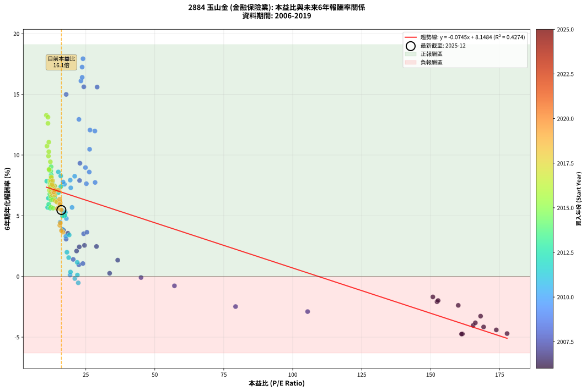
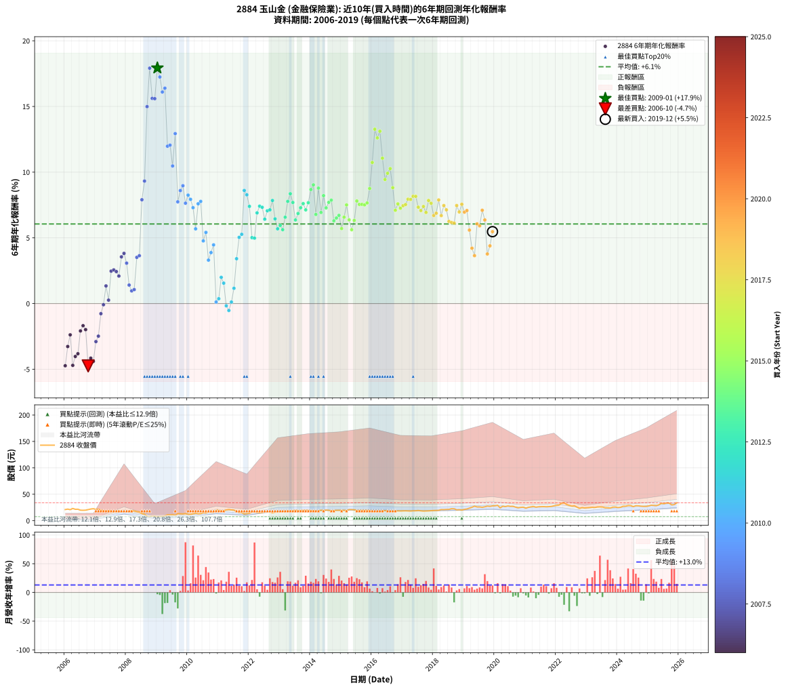

# 2884 玉山金 - 本益比與未來報酬率分析

!!! info "報告資訊"
    - **股票代號**: 2884
    - **公司名稱**: 玉山金
    - **產業別**: 金融保險業
    - **分析期間**: 2006-2019 (168 個數據點)
    - **資料來源**: Type 12 (ShowMonthlyK_ChartFlow) 月收盤價與本益比
    - **報酬率口徑**: 含現金股利 (簡化: 年度合計，假設每年7/1入帳)
    - **報告生成時間**: 2026-01-05 00:46:34 CST

## 📈 視覺化圖表

### 圖表1: 本益比 vs 未來報酬率關係

*圖表1：2884 玉山金 本益比與6年期未來報酬率關係 (2006-2019)*

### 圖表2: 歷年買入時點的6年期實際報酬率

*圖表2：2884 玉山金 歷年買入時點的6年期實際報酬率 (2006-2019)*

## 📍 買點訊號說明

本報告提供兩種買點提示訊號（顯示於圖表2的股價子圖中）：

### ▲ 小綠色三角形（回測驗證）
- **計算方式**: 使用全部歷史資料計算本益比第25百分位數
- **用途**: 事後驗證，顯示歷史上哪些時點確實為低估區
- **限制**: 當下無法判斷，僅供回測參考
- **特性**: 後見之明（Look-Ahead Bias）

### ▲ 小橘色三角形（即時訊號）
- **計算方式**: 使用截至當月的過去5年資料計算本益比第25百分位數
- **用途**: 實際投資決策，當時即可判斷
- **優勢**: 可操作性強，符合實務需求
- **特性**: 無後見之明，滾動窗口計算

!!! tip "如何使用兩種訊號"
    - **綠色▲** 幫助理解歷史估值機會，驗證策略有效性
    - **橘色▲** 可作為實際買進參考，但仍需搭配基本面分析
    - 兩種訊號重疊時，表示即時判斷與事後驗證一致，信心度較高
    - 僅有綠色▲時，表示當時無法判斷（需要未來資料才能確認）
    - 僅有橘色▲時，表示即時判斷為買點，但事後可能不是最佳時機

## 📊 估值分析摘要

| 指標 | 數值 |
|:---:|:---:|
| **目前本益比** (2019-12) | **16.13 倍** |
| **歷史平均本益比** | 28.05 倍 |
| **估值水準** | 🟢 相對低估 |
| **預期6年年化報酬率** | **+6.95%** |
| **歷史平均報酬率** | +6.06% |
| **相關係數 (R²)** | 0.4274 |
| **趨勢線斜率** | -0.0745 |

!!! abstract "核心洞察"
    目前本益比顯著低於歷史平均，預期未來報酬率可能較高

    根據歷史數據回測，2884 玉山金 在目前本益比 **16.1倍** 的估值水準下，
    預期未來6年年化報酬率約為 **+6.9%**。

    **重要提醒**: 本分析基於歷史數據統計，實際報酬率會受到公司基本面變化、產業趨勢、
    總體經濟環境等多重因素影響。R² = 0.43 表示本益比可解釋約 42.7% 的報酬率變異。

## 📈 歷史估值統計

### 最佳買點 (最高報酬率)

| 項目 | 數值 |
|:---:|:---:|
| 起始時間 | 2009-01 |
| 當時本益比 | 23.97 倍 |
| 起始價格 | 7.7 元 |
| 6年後價格 | 19.4 元 |
| **6年年化報酬率** | **+17.93%** |

### 最差買點 (最低報酬率)

| 項目 | 數值 |
|:---:|:---:|
| 起始時間 | 2006-10 |
| 當時本益比 | 161.20 倍 |
| 起始價格 | 20.9 元 |
| 6年後價格 | 14.7 元 |
| **6年年化報酬率** | **-4.74%** |

## 🎯 投資啟示

### 本益比與報酬率關係

趨勢線方程式: **y = -0.0745x + 8.1484**

!!! note "負相關"
    本益比與未來報酬率呈現負相關。較低的本益比通常帶來較高的未來報酬率，
    但相關性不算非常強。**估值仍是重要參考指標之一**。

### 估值區間建議

基於歷史數據分析:

- **🟢 低估區** (P/E < 22.4): 預期報酬率較高，可考慮增加持股
- **🟡 合理區** (P/E 22.4-33.7): 預期報酬率符合長期趨勢，正常持有
- **🔴 高估區** (P/E > 33.7): 預期報酬率較低，可考慮減碼或觀望

!!! danger "風險提示"
    - 過去表現不代表未來結果
    - 本分析假設公司基本面無重大結構性變化
    - 產業環境劇變可能使歷史規律失效
    - 應結合公司財報、產業趨勢、總體經濟等多重因素綜合判斷

!!! success "長期投資觀點"
    歷史數據顯示，在合理或低估的估值水準買入並長期持有，
    往往能獲得較佳的投資報酬。**耐心等待好價格**是價值投資的核心原則。

## 📊 數據品質

- **資料來源**: GoodInfo.tw Type 12 (ShowMonthlyK_ChartFlow)
- **資料頻率**: 月度收盤價與本益比
- **回測期間**: 2006-2019
- **數據點數量**: 168 個 (每個點代表一次6年期回測)

### 計算方法說明

1. **6年期年化報酬率**:
   - 對每個歷史時點，計算其後6年的實際投資報酬率
   - 期末價值(不含股利): 期末價格
   - 期末價值(含現金股利): 期末價格 + 持有期間內的現金股利合計 (簡化: 年度合計，假設每年7/1入帳)
   - 公式: 年化報酬率 = [(期末價值/期初價格)^(1/年數) - 1] × 100%

2. **本益比 (P/E Ratio)**:
   - 使用當時的月收盤價與EPS計算
   - 資料來源: Type 12 月度河流圖本益比數據

3. **趨勢線 (Linear Regression)**:
   - 使用最小平方法擬合線性趨勢線
   - R²值衡量本益比對報酬率的解釋能力

---

*本報告由 Stock Analysis System v1.9.0 自動生成*
*數據更新時間: 2026-01-05 00:46:34 CST*

## 📋 月度回測明細表

（每一列對應時間線圖中的一個買入點；可用來對照 SVG 圖上的每個點。）

| 買入月份 | 賣出月份 | 回測期限_年 | 實際持有年數 | 買入本益比_倍 | 買入收盤價_元 | 賣出收盤價_元 | 現金股利合計_元 | 總報酬率_pct | 年化報酬率_pct |
| --- | --- | --- | --- | --- | --- | --- | --- | --- | --- |
| 2006-01 | 2012-01 | 6 | 5.999 | 161.50 | 21.00 | 13.90 | 1.80 | -25.24 | -4.73 |
| 2006-02 | 2012-02 | 6 | 5.999 | 168.10 | 21.85 | 16.10 | 1.80 | -18.08 | -3.27 |
| 2006-03 | 2012-03 | 6 | 6.001 | 160.00 | 20.80 | 16.20 | 1.80 | -13.47 | -2.38 |
| 2006-04 | 2012-04 | 6 | 6.001 | 177.70 | 23.10 | 15.50 | 1.80 | -25.11 | -4.70 |
| 2006-05 | 2012-05 | 6 | 6.001 | 165.40 | 21.50 | 15.00 | 1.80 | -21.87 | -4.03 |
| 2006-06 | 2012-06 | 6 | 6.001 | 166.20 | 21.60 | 15.30 | 1.80 | -20.84 | -3.82 |
| 2006-07 | 2012-07 | 6 | 6.001 | 152.30 | 19.80 | 16.45 | 1.00 | -11.87 | -2.08 |
| 2006-08 | 2012-08 | 6 | 6.001 | 150.80 | 19.60 | 16.70 | 1.00 | -9.70 | -1.69 |
| 2006-09 | 2012-09 | 6 | 6.001 | 152.70 | 19.85 | 16.60 | 1.00 | -11.34 | -1.99 |
| 2006-10 | 2012-10 | 6 | 6.001 | 161.20 | 20.95 | 14.65 | 1.00 | -25.30 | -4.74 |
| 2006-11 | 2012-11 | 6 | 6.001 | 169.20 | 22.00 | 16.05 | 1.00 | -22.50 | -4.16 |
| 2006-12 | 2012-12 | 6 | 6.001 | 173.80 | 22.60 | 16.25 | 1.00 | -23.68 | -4.40 |
| 2007-01 | 2013-01 | 6 | 6.001 | 105.40 | 21.35 | 16.90 | 1.00 | -16.16 | -2.90 |
| 2007-02 | 2013-02 | 6 | 6.001 | 79.27 | 21.80 | 17.75 | 1.00 | -14.00 | -2.48 |
| 2007-03 | 2013-03 | 6 | 6.001 | 57.12 | 19.85 | 17.95 | 1.00 | -4.54 | -0.77 |
| 2007-04 | 2013-04 | 6 | 6.001 | 45.00 | 18.90 | 17.80 | 1.00 | -0.53 | -0.09 |
| 2007-05 | 2013-05 | 6 | 6.001 | 36.55 | 18.00 | 18.50 | 1.00 | +8.33 | +1.34 |
| 2007-06 | 2013-06 | 6 | 6.001 | 33.63 | 19.00 | 18.30 | 1.00 | +1.57 | +0.26 |
| 2007-07 | 2013-07 | 6 | 6.001 | 28.86 | 18.40 | 20.00 | 1.30 | +15.76 | +2.47 |
| 2007-08 | 2013-08 | 6 | 6.001 | 24.51 | 17.40 | 18.95 | 1.30 | +16.37 | +2.56 |
| 2007-09 | 2013-09 | 6 | 6.001 | 22.62 | 17.70 | 19.15 | 1.30 | +15.53 | +2.43 |
| 2007-10 | 2013-10 | 6 | 6.001 | 21.64 | 18.50 | 19.65 | 1.30 | +13.24 | +2.09 |
| 2007-11 | 2013-11 | 6 | 6.001 | 18.49 | 17.15 | 19.85 | 1.30 | +23.32 | +3.55 |
| 2007-12 | 2013-12 | 6 | 6.001 | 16.85 | 16.85 | 19.80 | 1.30 | +25.22 | +3.82 |
| 2008-01 | 2014-01 | 6 | 6.001 | 17.84 | 16.80 | 18.85 | 1.30 | +19.93 | +3.08 |
| 2008-02 | 2014-03 | 6 | 6.081 | 20.43 | 18.05 | 18.35 | 1.30 | +8.86 | +1.41 |
| 2008-03 | 2014-03 | 6 | 5.999 | 22.48 | 18.55 | 18.35 | 1.30 | +5.92 | +0.96 |
| 2008-04 | 2014-04 | 6 | 5.999 | 23.93 | 18.35 | 18.25 | 1.30 | +6.53 | +1.06 |
| 2008-05 | 2014-05 | 6 | 5.999 | 24.21 | 17.15 | 19.80 | 1.30 | +23.03 | +3.51 |
| 2008-06 | 2014-06 | 6 | 5.999 | 25.38 | 16.50 | 19.15 | 1.30 | +23.93 | +3.64 |
| 2008-07 | 2014-07 | 6 | 5.999 | 22.73 | 13.45 | 20.05 | 1.18 | +57.81 | +7.90 |
| 2008-08 | 2014-08 | 6 | 5.999 | 22.87 | 12.20 | 19.65 | 1.18 | +70.70 | +9.32 |
| 2008-09 | 2014-09 | 6 | 5.999 | 17.87 | 8.49 | 18.45 | 1.18 | +131.15 | +14.99 |
| 2008-10 | 2014-10 | 6 | 5.999 | 18.24 | 7.60 | 19.25 | 1.18 | +168.75 | +17.92 |
| 2008-11 | 2014-11 | 6 | 5.999 | 24.28 | 8.70 | 19.60 | 1.18 | +138.79 | +15.62 |
| 2008-12 | 2014-12 | 6 | 5.999 | 29.10 | 8.73 | 19.65 | 1.18 | +138.55 | +15.60 |
| 2009-01 | 2015-01 | 6 | 5.999 | 23.97 | 7.65 | 19.40 | 1.18 | +168.95 | +17.93 |
| 2009-02 | 2015-02 | 6 | 5.999 | 23.65 | 8.00 | 19.60 | 1.18 | +159.69 | +17.24 |
| 2009-03 | 2015-03 | 6 | 5.999 | 23.22 | 8.30 | 19.15 | 1.18 | +144.88 | +16.10 |
| 2009-04 | 2015-04 | 6 | 5.999 | 23.68 | 8.92 | 21.00 | 1.18 | +148.60 | +16.39 |
| 2009-05 | 2015-05 | 6 | 5.999 | 28.29 | 11.20 | 20.90 | 1.18 | +97.10 | +11.98 |
| 2009-06 | 2015-06 | 6 | 5.999 | 26.51 | 11.00 | 20.60 | 1.18 | +97.95 | +12.06 |
| 2009-07 | 2015-07 | 6 | 5.999 | 26.37 | 11.45 | 19.20 | 1.61 | +81.75 | +10.47 |
| 2009-08 | 2015-08 | 6 | 5.999 | 22.50 | 10.20 | 19.55 | 1.61 | +107.45 | +12.94 |
| 2009-09 | 2015-09 | 6 | 5.999 | 28.36 | 13.40 | 19.35 | 1.61 | +56.42 | +7.74 |
| 2009-10 | 2015-10 | 6 | 5.999 | 26.24 | 12.90 | 19.55 | 1.61 | +64.03 | +8.60 |
| 2009-11 | 2015-11 | 6 | 5.999 | 24.86 | 12.70 | 19.65 | 1.61 | +67.40 | +8.97 |
| 2009-12 | 2015-12 | 6 | 5.999 | 25.19 | 13.35 | 19.15 | 1.61 | +55.51 | +7.64 |
| 2010-01 | 2016-01 | 6 | 5.999 | 20.96 | 12.00 | 17.70 | 1.61 | +60.92 | +8.25 |
| 2010-02 | 2016-02 | 6 | 5.999 | 19.35 | 11.90 | 17.20 | 1.61 | +58.07 | +7.93 |
| 2010-03 | 2016-03 | 6 | 6.001 | 19.54 | 12.85 | 18.00 | 1.61 | +52.61 | +7.30 |
| 2010-04 | 2016-04 | 6 | 6.001 | 20.00 | 14.00 | 17.90 | 1.61 | +39.36 | +5.69 |
| 2010-05 | 2016-05 | 6 | 6.001 | 17.24 | 12.80 | 18.25 | 1.61 | +55.16 | +7.59 |
| 2010-06 | 2016-06 | 6 | 6.001 | 16.75 | 13.15 | 19.00 | 1.61 | +56.73 | +7.77 |
| 2010-07 | 2016-07 | 6 | 6.001 | 17.95 | 14.85 | 17.80 | 1.84 | +32.26 | +4.77 |
| 2010-08 | 2016-08 | 6 | 6.001 | 16.49 | 14.35 | 17.85 | 1.84 | +37.22 | +5.41 |
| 2010-09 | 2016-09 | 6 | 6.001 | 17.75 | 16.20 | 17.85 | 1.84 | +21.55 | +3.31 |
| 2010-10 | 2016-10 | 6 | 6.001 | 16.49 | 15.75 | 17.95 | 1.84 | +25.66 | +3.88 |
| 2010-11 | 2016-11 | 6 | 6.001 | 15.69 | 15.65 | 18.50 | 1.84 | +29.97 | +4.47 |
| 2010-12 | 2016-12 | 6 | 6.001 | 19.28 | 20.05 | 18.35 | 1.84 | +0.70 | +0.12 |
| 2011-01 | 2017-01 | 6 | 6.001 | 19.43 | 19.85 | 18.45 | 1.84 | +2.22 | +0.37 |
| 2011-02 | 2017-02 | 6 | 6.001 | 18.14 | 18.20 | 18.65 | 1.84 | +12.59 | +2.00 |
| 2011-03 | 2017-03 | 6 | 6.001 | 18.78 | 18.50 | 18.45 | 1.84 | +9.68 | +1.55 |
| 2011-04 | 2017-04 | 6 | 6.001 | 21.00 | 20.30 | 18.25 | 1.84 | -1.03 | -0.17 |
| 2011-05 | 2017-05 | 6 | 6.001 | 22.25 | 21.10 | 18.60 | 1.84 | -3.12 | -0.53 |
| 2011-06 | 2017-06 | 6 | 6.001 | 21.94 | 20.40 | 18.70 | 1.84 | +0.69 | +0.11 |
| 2011-07 | 2017-07 | 6 | 6.001 | 21.88 | 19.95 | 19.25 | 2.13 | +7.18 | +1.16 |
| 2011-08 | 2017-08 | 6 | 6.001 | 18.97 | 16.95 | 18.60 | 2.13 | +22.31 | +3.41 |
| 2011-09 | 2017-09 | 6 | 6.001 | 17.26 | 15.10 | 18.15 | 2.13 | +34.32 | +5.04 |
| 2011-10 | 2017-10 | 6 | 6.001 | 17.57 | 15.05 | 18.35 | 2.13 | +36.09 | +5.27 |
| 2011-11 | 2017-11 | 6 | 6.001 | 15.03 | 12.60 | 18.55 | 2.13 | +64.14 | +8.61 |
| 2011-12 | 2017-12 | 6 | 6.001 | 15.91 | 13.05 | 18.90 | 2.13 | +61.16 | +8.28 |
| 2012-01 | 2018-01 | 6 | 6.001 | 15.92 | 13.90 | 19.20 | 2.13 | +53.47 | +7.40 |
| 2012-02 | 2018-03 | 6 | 6.081 | 17.38 | 16.10 | 19.55 | 2.13 | +34.67 | +5.02 |
| 2012-03 | 2018-03 | 6 | 5.999 | 16.54 | 16.20 | 19.55 | 2.13 | +33.84 | +4.98 |
| 2012-04 | 2018-04 | 6 | 5.999 | 15.01 | 15.50 | 21.00 | 2.13 | +49.24 | +6.90 |
| 2012-05 | 2018-05 | 6 | 5.999 | 13.82 | 15.00 | 20.90 | 2.13 | +53.55 | +7.41 |
| 2012-06 | 2018-06 | 6 | 5.999 | 13.44 | 15.30 | 21.25 | 2.13 | +52.82 | +7.33 |
| 2012-07 | 2018-07 | 6 | 5.999 | 13.80 | 16.45 | 21.35 | 2.54 | +45.26 | +6.42 |
| 2012-08 | 2018-08 | 6 | 5.999 | 13.42 | 16.70 | 22.60 | 2.54 | +50.57 | +7.06 |
| 2012-09 | 2018-09 | 6 | 5.999 | 12.79 | 16.60 | 22.55 | 2.54 | +51.17 | +7.13 |
| 2012-10 | 2018-10 | 6 | 5.999 | 10.84 | 14.65 | 20.50 | 2.54 | +57.30 | +7.84 |
| 2012-11 | 2018-11 | 6 | 5.999 | 11.43 | 16.05 | 20.80 | 2.54 | +45.45 | +6.45 |
| 2012-12 | 2018-12 | 6 | 5.999 | 11.15 | 16.25 | 20.10 | 2.54 | +39.35 | +5.69 |
| 2013-01 | 2019-01 | 6 | 5.999 | 11.55 | 16.90 | 21.35 | 2.54 | +41.39 | +5.94 |
| 2013-02 | 2019-02 | 6 | 5.999 | 12.08 | 17.75 | 22.10 | 2.54 | +38.85 | +5.62 |
| 2013-03 | 2019-03 | 6 | 5.999 | 12.17 | 17.95 | 23.75 | 2.54 | +46.49 | +6.57 |
| 2013-04 | 2019-04 | 6 | 5.999 | 12.02 | 17.80 | 25.35 | 2.54 | +56.71 | +7.78 |
| 2013-05 | 2019-05 | 6 | 5.999 | 12.44 | 18.50 | 27.40 | 2.54 | +61.86 | +8.36 |
| 2013-06 | 2019-06 | 6 | 5.999 | 12.25 | 18.30 | 26.00 | 2.54 | +55.98 | +7.69 |
| 2013-07 | 2019-07 | 6 | 5.999 | 13.34 | 20.00 | 26.00 | 2.96 | +44.77 | +6.36 |
| 2013-08 | 2019-08 | 6 | 5.999 | 12.59 | 18.95 | 25.25 | 2.96 | +48.84 | +6.85 |
| 2013-09 | 2019-09 | 6 | 5.999 | 12.67 | 19.15 | 26.25 | 2.96 | +52.51 | +7.29 |
| 2013-10 | 2019-10 | 6 | 5.999 | 12.95 | 19.65 | 27.55 | 2.96 | +55.24 | +7.61 |
| 2013-11 | 2019-11 | 6 | 5.999 | 13.03 | 19.85 | 27.05 | 2.96 | +51.16 | +7.13 |
| 2013-12 | 2019-12 | 6 | 5.999 | 12.94 | 19.80 | 27.90 | 2.96 | +55.83 | +7.68 |
| 2014-01 | 2020-01 | 6 | 5.999 | 12.30 | 18.85 | 28.10 | 2.96 | +64.75 | +8.68 |
| 2014-02 | 2020-02 | 6 | 5.999 | 12.41 | 19.05 | 29.05 | 2.96 | +68.01 | +9.03 |
| 2014-03 | 2020-03 | 6 | 6.001 | 11.93 | 18.35 | 24.25 | 2.96 | +48.26 | +6.78 |
| 2014-04 | 2020-04 | 6 | 6.001 | 11.85 | 18.25 | 27.30 | 2.96 | +65.78 | +8.79 |
| 2014-05 | 2020-05 | 6 | 6.001 | 12.83 | 19.80 | 26.65 | 2.96 | +49.52 | +6.93 |
| 2014-06 | 2020-06 | 6 | 6.001 | 12.39 | 19.15 | 27.80 | 2.96 | +60.60 | +8.21 |
| 2014-07 | 2020-07 | 6 | 6.001 | 12.95 | 20.05 | 27.10 | 3.47 | +52.47 | +7.28 |
| 2014-08 | 2020-08 | 6 | 6.001 | 12.67 | 19.65 | 27.20 | 3.47 | +56.08 | +7.70 |
| 2014-09 | 2020-09 | 6 | 6.001 | 11.88 | 18.45 | 25.60 | 3.47 | +57.56 | +7.87 |
| 2014-10 | 2020-10 | 6 | 6.001 | 12.37 | 19.25 | 24.30 | 3.47 | +44.26 | +6.30 |
| 2014-11 | 2020-11 | 6 | 6.001 | 12.57 | 19.60 | 25.15 | 3.47 | +46.02 | +6.51 |
| 2014-12 | 2020-12 | 6 | 6.001 | 12.58 | 19.65 | 25.55 | 3.47 | +47.68 | +6.71 |
| 2015-01 | 2021-01 | 6 | 6.001 | 12.38 | 19.40 | 23.60 | 3.47 | +39.54 | +5.71 |
| 2015-02 | 2021-02 | 6 | 6.001 | 12.46 | 19.60 | 25.25 | 3.47 | +46.53 | +6.57 |
| 2015-03 | 2021-03 | 6 | 6.001 | 12.13 | 19.15 | 26.10 | 3.47 | +54.41 | +7.51 |
| 2015-04 | 2021-04 | 6 | 6.001 | 13.26 | 21.00 | 26.95 | 3.47 | +44.86 | +6.37 |
| 2015-05 | 2021-05 | 6 | 6.001 | 13.14 | 20.90 | 25.55 | 3.47 | +38.85 | +5.62 |
| 2015-06 | 2021-06 | 6 | 6.001 | 12.91 | 20.60 | 26.30 | 3.47 | +44.51 | +6.33 |
| 2015-07 | 2021-07 | 6 | 6.001 | 11.99 | 19.20 | 26.50 | 3.64 | +57.01 | +7.81 |
| 2015-08 | 2021-08 | 6 | 6.001 | 12.16 | 19.55 | 26.60 | 3.64 | +54.71 | +7.54 |
| 2015-09 | 2021-09 | 6 | 6.001 | 12.00 | 19.35 | 26.30 | 3.64 | +54.75 | +7.55 |
| 2015-10 | 2021-10 | 6 | 6.001 | 12.08 | 19.55 | 26.55 | 3.64 | +54.45 | +7.51 |
| 2015-11 | 2021-11 | 6 | 6.001 | 12.10 | 19.65 | 26.95 | 3.64 | +55.70 | +7.66 |
| 2015-12 | 2021-12 | 6 | 6.001 | 11.75 | 19.15 | 28.05 | 3.64 | +65.51 | +8.76 |
| 2016-01 | 2022-01 | 6 | 6.001 | 10.93 | 17.70 | 29.00 | 3.64 | +84.44 | +10.74 |
| 2016-02 | 2022-03 | 6 | 6.081 | 10.69 | 17.20 | 33.05 | 3.64 | +113.34 | +13.27 |
| 2016-03 | 2022-03 | 6 | 5.999 | 11.27 | 18.00 | 33.05 | 3.64 | +103.86 | +12.61 |
| 2016-04 | 2022-04 | 6 | 5.999 | 11.28 | 17.90 | 33.85 | 3.64 | +109.47 | +13.12 |
| 2016-05 | 2022-05 | 6 | 5.999 | 11.58 | 18.25 | 30.60 | 3.64 | +87.64 | +11.06 |
| 2016-06 | 2022-06 | 6 | 5.999 | 12.14 | 19.00 | 29.00 | 3.64 | +71.82 | +9.44 |
| 2016-07 | 2022-07 | 6 | 5.999 | 11.45 | 17.80 | 27.50 | 3.88 | +76.32 | +9.92 |
| 2016-08 | 2022-08 | 6 | 5.999 | 11.57 | 17.85 | 28.20 | 3.88 | +79.75 | +10.27 |
| 2016-09 | 2022-09 | 6 | 5.999 | 11.65 | 17.85 | 25.75 | 3.88 | +66.02 | +8.82 |
| 2016-10 | 2022-10 | 6 | 5.999 | 11.80 | 17.95 | 23.20 | 3.88 | +50.89 | +7.10 |
| 2016-11 | 2022-11 | 6 | 5.999 | 12.24 | 18.50 | 24.80 | 3.88 | +55.05 | +7.59 |
| 2016-12 | 2022-12 | 6 | 5.999 | 12.23 | 18.35 | 24.05 | 3.88 | +52.23 | +7.26 |
| 2017-01 | 2023-01 | 6 | 5.999 | 12.31 | 18.45 | 24.50 | 3.88 | +53.85 | +7.45 |
| 2017-02 | 2023-02 | 6 | 5.999 | 12.45 | 18.65 | 24.95 | 3.88 | +54.61 | +7.53 |
| 2017-03 | 2023-03 | 6 | 5.999 | 12.32 | 18.45 | 25.30 | 3.88 | +58.18 | +7.94 |
| 2017-04 | 2023-04 | 6 | 5.999 | 12.19 | 18.25 | 24.95 | 3.88 | +58.00 | +7.92 |
| 2017-05 | 2023-05 | 6 | 5.999 | 12.43 | 18.60 | 25.90 | 3.88 | +60.13 | +8.17 |
| 2017-06 | 2023-06 | 6 | 5.999 | 12.51 | 18.70 | 26.05 | 3.88 | +60.08 | +8.16 |
| 2017-07 | 2023-07 | 6 | 5.999 | 12.88 | 19.25 | 25.85 | 3.58 | +52.90 | +7.33 |
| 2017-08 | 2023-08 | 6 | 5.999 | 12.46 | 18.60 | 24.45 | 3.58 | +50.72 | +7.08 |
| 2017-09 | 2023-09 | 6 | 5.999 | 12.16 | 18.15 | 24.25 | 3.58 | +53.35 | +7.39 |
| 2017-10 | 2023-10 | 6 | 5.999 | 12.30 | 18.35 | 23.85 | 3.58 | +49.50 | +6.93 |
| 2017-11 | 2023-11 | 6 | 5.999 | 12.44 | 18.55 | 25.60 | 3.58 | +57.32 | +7.85 |
| 2017-12 | 2023-12 | 6 | 5.999 | 12.68 | 18.90 | 25.80 | 3.58 | +55.47 | +7.63 |
| 2018-01 | 2024-01 | 6 | 5.999 | 12.82 | 19.20 | 24.75 | 3.58 | +47.57 | +6.70 |
| 2018-02 | 2024-02 | 6 | 5.999 | 12.86 | 19.35 | 25.25 | 3.58 | +49.01 | +6.87 |
| 2018-03 | 2024-03 | 6 | 6.001 | 12.93 | 19.55 | 27.25 | 3.58 | +57.71 | +7.89 |
| 2018-04 | 2024-04 | 6 | 6.001 | 13.82 | 21.00 | 27.40 | 3.58 | +47.54 | +6.70 |
| 2018-05 | 2024-05 | 6 | 6.001 | 13.68 | 20.90 | 28.60 | 3.58 | +53.99 | +7.46 |
| 2018-06 | 2024-06 | 6 | 6.001 | 13.84 | 21.25 | 28.55 | 3.58 | +51.21 | +7.13 |
| 2018-07 | 2024-07 | 6 | 6.001 | 13.84 | 21.35 | 26.55 | 4.17 | +43.89 | +6.25 |
| 2018-08 | 2024-08 | 6 | 6.001 | 14.58 | 22.60 | 28.20 | 4.17 | +43.23 | +6.17 |
| 2018-09 | 2024-09 | 6 | 6.001 | 14.48 | 22.55 | 28.05 | 4.17 | +42.88 | +6.13 |
| 2018-10 | 2024-10 | 6 | 6.001 | 13.10 | 20.50 | 27.40 | 4.17 | +54.00 | +7.46 |
| 2018-11 | 2024-11 | 6 | 6.001 | 13.23 | 20.80 | 27.00 | 4.17 | +49.86 | +6.97 |
| 2018-12 | 2024-12 | 6 | 6.001 | 12.72 | 20.10 | 26.95 | 4.17 | +54.83 | +7.56 |
| 2019-01 | 2025-01 | 6 | 6.001 | 13.41 | 21.35 | 27.80 | 4.17 | +49.74 | +6.96 |
| 2019-02 | 2025-02 | 6 | 6.001 | 13.77 | 22.10 | 29.15 | 4.17 | +50.77 | +7.08 |
| 2019-03 | 2025-03 | 6 | 6.001 | 14.68 | 23.75 | 28.75 | 4.17 | +38.61 | +5.59 |
| 2019-04 | 2025-04 | 6 | 6.001 | 15.55 | 25.35 | 28.30 | 4.17 | +28.09 | +4.21 |
| 2019-05 | 2025-05 | 6 | 6.001 | 16.68 | 27.40 | 29.80 | 4.17 | +23.98 | +3.65 |
| 2019-06 | 2025-06 | 6 | 6.001 | 15.71 | 26.00 | 32.85 | 4.17 | +42.38 | +6.06 |
| 2019-07 | 2025-07 | 6 | 6.001 | 15.59 | 26.00 | 32.05 | 4.66 | +41.19 | +5.92 |
| 2019-08 | 2025-08 | 6 | 6.001 | 15.03 | 25.25 | 33.45 | 4.66 | +50.93 | +7.10 |
| 2019-09 | 2025-09 | 6 | 6.001 | 15.51 | 26.25 | 33.35 | 4.66 | +44.80 | +6.36 |
| 2019-10 | 2025-10 | 6 | 6.001 | 16.16 | 27.55 | 29.75 | 4.66 | +24.90 | +3.77 |
| 2019-11 | 2025-11 | 6 | 6.001 | 15.75 | 27.05 | 30.35 | 4.66 | +29.43 | +4.39 |
| 2019-12 | 2025-12 | 6 | 6.001 | 16.13 | 27.90 | 33.75 | 4.66 | +37.67 | +5.47 |
