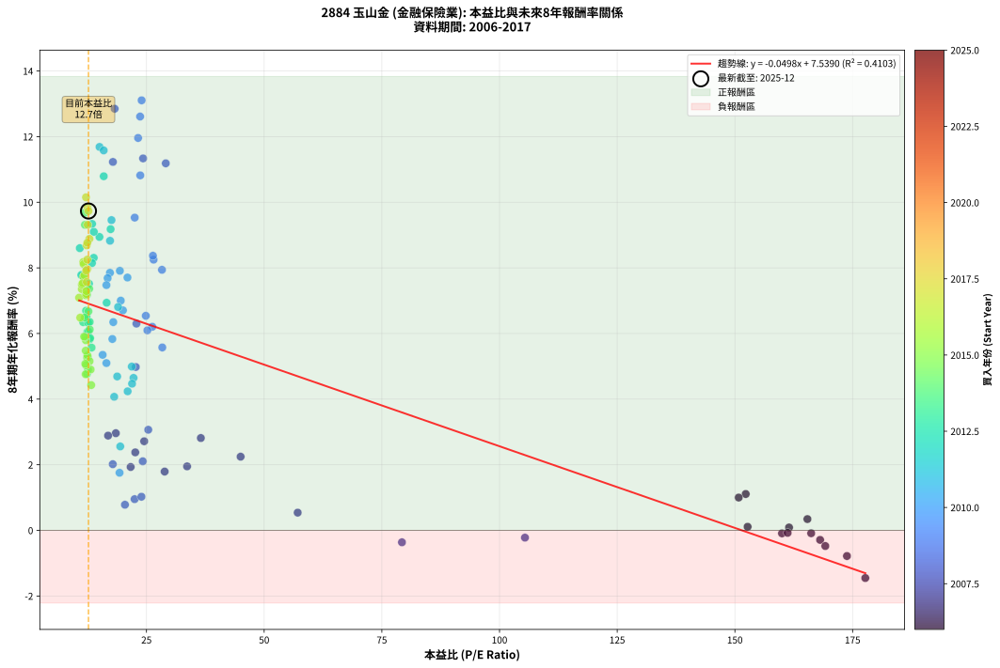
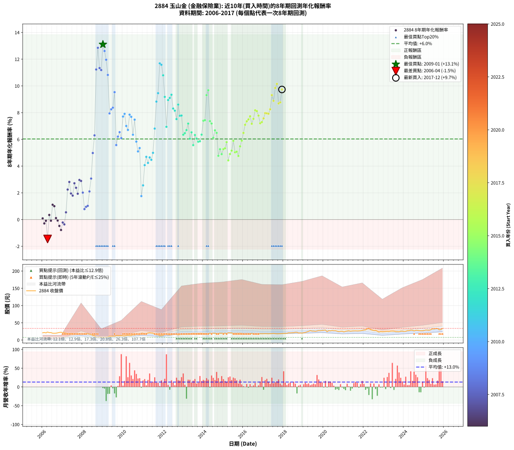

# 2884 玉山金 - 本益比與未來報酬率分析

!!! info "報告資訊"
    - **股票代號**: 2884
    - **公司名稱**: 玉山金
    - **產業別**: 金融保險業
    - **分析期間**: 2006-2017 (144 個數據點)
    - **資料來源**: Type 12 (ShowMonthlyK_ChartFlow) 月收盤價與本益比
    - **報酬率口徑**: 含現金股利 (簡化: 年度合計，假設每年7/1入帳)
    - **報告生成時間**: 2026-01-10 18:45:38 CST

## 📈 視覺化圖表

### 圖表1: 本益比 vs 未來報酬率關係

*圖表1：2884 玉山金 本益比與8年期未來報酬率關係 (2006-2017)*

### 圖表2: 歷年買入時點的8年期實際報酬率

*圖表2：2884 玉山金 歷年買入時點的8年期實際報酬率 (2006-2017)*

## 📍 買點訊號說明

本報告提供兩種買點提示訊號（顯示於圖表2的股價子圖中）：

### ▲ 小綠色三角形（回測驗證）
- **計算方式**: 使用全部歷史資料計算本益比第25百分位數
- **用途**: 事後驗證，顯示歷史上哪些時點確實為低估區
- **限制**: 當下無法判斷，僅供回測參考
- **特性**: 後見之明（Look-Ahead Bias）

### ▲ 小橘色三角形（即時訊號）
- **計算方式**: 使用截至當月的過去5年資料計算本益比第25百分位數
- **用途**: 實際投資決策，當時即可判斷
- **優勢**: 可操作性強，符合實務需求
- **特性**: 無後見之明，滾動窗口計算

!!! tip "如何使用兩種訊號"
    - **綠色▲** 幫助理解歷史估值機會，驗證策略有效性
    - **橘色▲** 可作為實際買進參考，但仍需搭配基本面分析
    - 兩種訊號重疊時，表示即時判斷與事後驗證一致，信心度較高
    - 僅有綠色▲時，表示當時無法判斷（需要未來資料才能確認）
    - 僅有橘色▲時，表示即時判斷為買點，但事後可能不是最佳時機

## 📊 估值分析摘要

| 指標 | 數值 |
|:---:|:---:|
| **目前本益比** (2017-12) | **12.68 倍** |
| **歷史平均本益比** | 30.33 倍 |
| **估值水準** | 🟢 相對低估 |
| **預期8年年化報酬率** | **+6.91%** |
| **歷史平均報酬率** | +6.03% |
| **相關係數 (R²)** | 0.4103 |
| **趨勢線斜率** | -0.0498 |

!!! abstract "核心洞察"
    目前本益比顯著低於歷史平均，預期未來報酬率可能較高

    根據歷史數據回測，2884 玉山金 在目前本益比 **12.7倍** 的估值水準下，
    預期未來8年年化報酬率約為 **+6.9%**。

    **重要提醒**: 本分析基於歷史數據統計，實際報酬率會受到公司基本面變化、產業趨勢、
    總體經濟環境等多重因素影響。R² = 0.41 表示本益比可解釋約 41.0% 的報酬率變異。

## 📈 歷史估值統計

### 最佳買點 (最高報酬率)

| 項目 | 數值 |
|:---:|:---:|
| 起始時間 | 2009-01 |
| 當時本益比 | 23.97 倍 |
| 起始價格 | 7.7 元 |
| 8年後價格 | 18.4 元 |
| **8年年化報酬率** | **+13.11%** |

### 最差買點 (最低報酬率)

| 項目 | 數值 |
|:---:|:---:|
| 起始時間 | 2006-04 |
| 當時本益比 | 177.70 倍 |
| 起始價格 | 23.1 元 |
| 8年後價格 | 18.2 元 |
| **8年年化報酬率** | **-1.45%** |

## 🎯 投資啟示

### 本益比與報酬率關係

趨勢線方程式: **y = -0.0498x + 7.5390**

!!! note "負相關"
    本益比與未來報酬率呈現負相關。較低的本益比通常帶來較高的未來報酬率，
    但相關性不算非常強。**估值仍是重要參考指標之一**。

### 估值區間建議

基於歷史數據分析:

- **🟢 低估區** (P/E < 24.3): 預期報酬率較高，可考慮增加持股
- **🟡 合理區** (P/E 24.3-36.4): 預期報酬率符合長期趨勢，正常持有
- **🔴 高估區** (P/E > 36.4): 預期報酬率較低，可考慮減碼或觀望

!!! danger "風險提示"
    - 過去表現不代表未來結果
    - 本分析假設公司基本面無重大結構性變化
    - 產業環境劇變可能使歷史規律失效
    - 應結合公司財報、產業趨勢、總體經濟等多重因素綜合判斷

!!! success "長期投資觀點"
    歷史數據顯示，在合理或低估的估值水準買入並長期持有，
    往往能獲得較佳的投資報酬。**耐心等待好價格**是價值投資的核心原則。

## 📊 數據品質

- **資料來源**: GoodInfo.tw Type 12 (ShowMonthlyK_ChartFlow)
- **資料頻率**: 月度收盤價與本益比
- **回測期間**: 2006-2017
- **數據點數量**: 144 個 (每個點代表一次8年期回測)

### 計算方法說明

1. **8年期年化報酬率**:
   - 對每個歷史時點，計算其後8年的實際投資報酬率
   - 期末價值(不含股利): 期末價格
   - 期末價值(含現金股利): 期末價格 + 持有期間內的現金股利合計 (簡化: 年度合計，假設每年7/1入帳)
   - 公式: 年化報酬率 = [(期末價值/期初價格)^(1/年數) - 1] × 100%

2. **本益比 (P/E Ratio)**:
   - 使用當時的月收盤價與EPS計算
   - 資料來源: Type 12 月度河流圖本益比數據

3. **趨勢線 (Linear Regression)**:
   - 使用最小平方法擬合線性趨勢線
   - R²值衡量本益比對報酬率的解釋能力

---

*本報告由 Stock Analysis System v1.9.0 自動生成*
*數據更新時間: 2026-01-10 18:45:38 CST*

## 📋 月度回測明細表

（每一列對應時間線圖中的一個買入點；可用來對照 SVG 圖上的每個點。）

| 買入月份 | 賣出月份 | 回測期限_年 | 實際持有年數 | 買入本益比_倍 | 買入收盤價_元 | 賣出收盤價_元 | 現金股利合計_元 | 總報酬率_pct | 年化報酬率_pct |
| --- | --- | --- | --- | --- | --- | --- | --- | --- | --- |
| 2006-01 | 2014-01 | 8 | 8.000 | 161.50 | 21.00 | 18.85 | 2.30 | +0.71 | +0.09 |
| 2006-02 | 2014-02 | 8 | 8.000 | 168.10 | 21.85 | 19.05 | 2.30 | -2.29 | -0.29 |
| 2006-03 | 2014-03 | 8 | 8.000 | 160.00 | 20.80 | 18.35 | 2.30 | -0.73 | -0.09 |
| 2006-04 | 2014-04 | 8 | 8.000 | 177.70 | 23.10 | 18.25 | 2.30 | -11.04 | -1.45 |
| 2006-05 | 2014-05 | 8 | 8.000 | 165.40 | 21.50 | 19.80 | 2.30 | +2.79 | +0.34 |
| 2006-06 | 2014-06 | 8 | 8.000 | 166.20 | 21.60 | 19.15 | 2.30 | -0.70 | -0.09 |
| 2006-07 | 2014-07 | 8 | 8.000 | 152.30 | 19.80 | 20.05 | 1.58 | +9.22 | +1.11 |
| 2006-08 | 2014-08 | 8 | 8.000 | 150.80 | 19.60 | 19.65 | 1.58 | +8.29 | +1.00 |
| 2006-09 | 2014-09 | 8 | 8.000 | 152.70 | 19.85 | 18.45 | 1.58 | +0.88 | +0.11 |
| 2006-10 | 2014-10 | 8 | 8.000 | 161.20 | 20.95 | 19.25 | 1.58 | -0.60 | -0.07 |
| 2006-11 | 2014-11 | 8 | 8.000 | 169.20 | 22.00 | 19.60 | 1.58 | -3.75 | -0.48 |
| 2006-12 | 2014-12 | 8 | 8.000 | 173.80 | 22.60 | 19.65 | 1.58 | -6.08 | -0.78 |
| 2007-01 | 2015-01 | 8 | 8.000 | 105.40 | 21.35 | 19.40 | 1.58 | -1.76 | -0.22 |
| 2007-02 | 2015-02 | 8 | 8.000 | 79.27 | 21.80 | 19.60 | 1.58 | -2.87 | -0.36 |
| 2007-03 | 2015-03 | 8 | 8.000 | 57.12 | 19.85 | 19.15 | 1.58 | +4.41 | +0.54 |
| 2007-04 | 2015-04 | 8 | 8.000 | 45.00 | 18.90 | 21.00 | 1.58 | +19.44 | +2.25 |
| 2007-05 | 2015-05 | 8 | 8.000 | 36.55 | 18.00 | 20.90 | 1.58 | +24.86 | +2.81 |
| 2007-06 | 2015-06 | 8 | 8.000 | 33.63 | 19.00 | 20.60 | 1.58 | +16.71 | +1.95 |
| 2007-07 | 2015-07 | 8 | 8.000 | 28.86 | 18.40 | 19.20 | 2.01 | +15.27 | +1.79 |
| 2007-08 | 2015-08 | 8 | 8.000 | 24.51 | 17.40 | 19.55 | 2.01 | +23.91 | +2.72 |
| 2007-09 | 2015-09 | 8 | 8.000 | 22.62 | 17.70 | 19.35 | 2.01 | +20.68 | +2.38 |
| 2007-10 | 2015-10 | 8 | 8.000 | 21.64 | 18.50 | 19.55 | 2.01 | +16.54 | +1.93 |
| 2007-11 | 2015-11 | 8 | 8.000 | 18.49 | 17.15 | 19.65 | 2.01 | +26.30 | +2.96 |
| 2007-12 | 2015-12 | 8 | 8.000 | 16.85 | 16.85 | 19.15 | 2.01 | +25.58 | +2.89 |
| 2008-01 | 2016-01 | 8 | 8.000 | 17.84 | 16.80 | 17.70 | 2.01 | +17.32 | +2.02 |
| 2008-02 | 2016-02 | 8 | 8.000 | 20.43 | 18.05 | 17.20 | 2.01 | +6.43 | +0.78 |
| 2008-03 | 2016-03 | 8 | 8.000 | 22.48 | 18.55 | 18.00 | 2.01 | +7.87 | +0.95 |
| 2008-04 | 2016-04 | 8 | 8.000 | 23.93 | 18.35 | 17.90 | 2.01 | +8.50 | +1.03 |
| 2008-05 | 2016-05 | 8 | 8.000 | 24.21 | 17.15 | 18.25 | 2.01 | +18.13 | +2.10 |
| 2008-06 | 2016-06 | 8 | 8.000 | 25.38 | 16.50 | 19.00 | 2.01 | +27.33 | +3.07 |
| 2008-07 | 2016-07 | 8 | 8.000 | 22.73 | 13.45 | 17.80 | 2.04 | +47.51 | +4.98 |
| 2008-08 | 2016-08 | 8 | 8.000 | 22.87 | 12.20 | 17.85 | 2.04 | +63.03 | +6.30 |
| 2008-09 | 2016-09 | 8 | 8.000 | 17.87 | 8.49 | 17.85 | 2.04 | +134.28 | +11.23 |
| 2008-10 | 2016-10 | 8 | 8.000 | 18.24 | 7.60 | 17.95 | 2.04 | +163.03 | +12.85 |
| 2008-11 | 2016-11 | 8 | 8.000 | 24.28 | 8.70 | 18.50 | 2.04 | +136.09 | +11.34 |
| 2008-12 | 2016-12 | 8 | 8.000 | 29.10 | 8.73 | 18.35 | 2.04 | +133.56 | +11.19 |
| 2009-01 | 2017-01 | 8 | 8.000 | 23.97 | 7.65 | 18.45 | 2.04 | +167.84 | +13.11 |
| 2009-02 | 2017-02 | 8 | 8.000 | 23.65 | 8.00 | 18.65 | 2.04 | +158.62 | +12.61 |
| 2009-03 | 2017-03 | 8 | 8.000 | 23.22 | 8.30 | 18.45 | 2.04 | +146.87 | +11.96 |
| 2009-04 | 2017-04 | 8 | 8.000 | 23.68 | 8.92 | 18.25 | 2.04 | +127.47 | +10.82 |
| 2009-05 | 2017-05 | 8 | 8.000 | 28.29 | 11.20 | 18.60 | 2.04 | +84.29 | +7.94 |
| 2009-06 | 2017-06 | 8 | 8.000 | 26.51 | 11.00 | 18.70 | 2.04 | +88.55 | +8.25 |
| 2009-07 | 2017-07 | 8 | 8.000 | 26.37 | 11.45 | 19.25 | 2.53 | +90.23 | +8.37 |
| 2009-08 | 2017-08 | 8 | 8.000 | 22.50 | 10.20 | 18.60 | 2.53 | +107.17 | +9.53 |
| 2009-09 | 2017-09 | 8 | 8.000 | 28.36 | 13.40 | 18.15 | 2.53 | +54.34 | +5.57 |
| 2009-10 | 2017-10 | 8 | 8.000 | 26.24 | 12.90 | 18.35 | 2.53 | +61.87 | +6.21 |
| 2009-11 | 2017-11 | 8 | 8.000 | 24.86 | 12.70 | 18.55 | 2.53 | +65.99 | +6.54 |
| 2009-12 | 2017-12 | 8 | 8.000 | 25.19 | 13.35 | 18.90 | 2.53 | +60.53 | +6.10 |
| 2010-01 | 2018-01 | 8 | 8.000 | 20.96 | 12.00 | 19.20 | 2.53 | +81.09 | +7.71 |
| 2010-02 | 2018-02 | 8 | 8.000 | 19.35 | 11.90 | 19.35 | 2.53 | +83.87 | +7.91 |
| 2010-03 | 2018-03 | 8 | 8.000 | 19.54 | 12.85 | 19.55 | 2.53 | +71.84 | +7.00 |
| 2010-04 | 2018-04 | 8 | 8.000 | 20.00 | 14.00 | 21.00 | 2.53 | +68.08 | +6.71 |
| 2010-05 | 2018-05 | 8 | 8.000 | 17.24 | 12.80 | 20.90 | 2.53 | +83.05 | +7.85 |
| 2010-06 | 2018-06 | 8 | 8.000 | 16.75 | 13.15 | 21.25 | 2.53 | +80.84 | +7.69 |
| 2010-07 | 2018-07 | 8 | 8.000 | 17.95 | 14.85 | 21.35 | 2.95 | +63.60 | +6.35 |
| 2010-08 | 2018-08 | 8 | 8.000 | 16.49 | 14.35 | 22.60 | 2.95 | +78.01 | +7.47 |
| 2010-09 | 2018-09 | 8 | 8.000 | 17.75 | 16.20 | 22.55 | 2.95 | +57.38 | +5.83 |
| 2010-10 | 2018-10 | 8 | 8.000 | 16.49 | 15.75 | 20.50 | 2.95 | +48.86 | +5.10 |
| 2010-11 | 2018-11 | 8 | 8.000 | 15.69 | 15.65 | 20.80 | 2.95 | +51.73 | +5.35 |
| 2010-12 | 2018-12 | 8 | 8.000 | 19.28 | 20.05 | 20.10 | 2.95 | +14.94 | +1.76 |
| 2011-01 | 2019-01 | 8 | 8.000 | 19.43 | 19.85 | 21.35 | 2.95 | +22.39 | +2.56 |
| 2011-02 | 2019-02 | 8 | 8.000 | 18.14 | 18.20 | 22.10 | 2.95 | +37.61 | +4.07 |
| 2011-03 | 2019-03 | 8 | 8.000 | 18.78 | 18.50 | 23.75 | 2.95 | +44.30 | +4.69 |
| 2011-04 | 2019-04 | 8 | 8.000 | 21.00 | 20.30 | 25.35 | 2.95 | +39.38 | +4.24 |
| 2011-05 | 2019-05 | 8 | 8.000 | 22.25 | 21.10 | 27.40 | 2.95 | +43.82 | +4.65 |
| 2011-06 | 2019-06 | 8 | 8.000 | 21.94 | 20.40 | 26.00 | 2.95 | +41.89 | +4.47 |
| 2011-07 | 2019-07 | 8 | 8.000 | 21.88 | 19.95 | 26.00 | 3.46 | +47.64 | +4.99 |
| 2011-08 | 2019-08 | 8 | 8.000 | 18.97 | 16.95 | 25.25 | 3.46 | +69.35 | +6.81 |
| 2011-09 | 2019-09 | 8 | 8.000 | 17.26 | 15.10 | 26.25 | 3.46 | +96.72 | +8.83 |
| 2011-10 | 2019-10 | 8 | 8.000 | 17.57 | 15.05 | 27.55 | 3.46 | +106.01 | +9.46 |
| 2011-11 | 2019-11 | 8 | 8.000 | 15.03 | 12.60 | 27.05 | 3.46 | +142.10 | +11.69 |
| 2011-12 | 2019-12 | 8 | 8.000 | 15.91 | 13.05 | 27.90 | 3.46 | +140.27 | +11.58 |
| 2012-01 | 2020-01 | 8 | 8.000 | 15.92 | 13.90 | 28.10 | 3.46 | +127.01 | +10.79 |
| 2012-02 | 2020-02 | 8 | 8.000 | 17.38 | 16.10 | 29.05 | 3.46 | +101.89 | +9.18 |
| 2012-03 | 2020-03 | 8 | 8.000 | 16.54 | 16.20 | 24.25 | 3.46 | +71.02 | +6.94 |
| 2012-04 | 2020-04 | 8 | 8.000 | 15.01 | 15.50 | 27.30 | 3.46 | +98.42 | +8.94 |
| 2012-05 | 2020-05 | 8 | 8.000 | 13.82 | 15.00 | 26.65 | 3.46 | +100.70 | +9.10 |
| 2012-06 | 2020-06 | 8 | 8.000 | 13.44 | 15.30 | 27.80 | 3.46 | +104.28 | +9.34 |
| 2012-07 | 2020-07 | 8 | 8.000 | 13.80 | 16.45 | 27.10 | 4.05 | +89.34 | +8.31 |
| 2012-08 | 2020-08 | 8 | 8.000 | 13.42 | 16.70 | 27.20 | 4.05 | +87.10 | +8.15 |
| 2012-09 | 2020-09 | 8 | 8.000 | 12.79 | 16.60 | 25.60 | 4.05 | +78.59 | +7.52 |
| 2012-10 | 2020-10 | 8 | 8.000 | 10.84 | 14.65 | 24.30 | 4.05 | +93.49 | +8.60 |
| 2012-11 | 2020-11 | 8 | 8.000 | 11.43 | 16.05 | 25.15 | 4.05 | +81.91 | +7.77 |
| 2012-12 | 2020-12 | 8 | 8.000 | 11.15 | 16.25 | 25.55 | 4.05 | +82.13 | +7.78 |
| 2013-01 | 2021-01 | 8 | 8.000 | 11.55 | 16.90 | 23.60 | 4.05 | +63.59 | +6.35 |
| 2013-02 | 2021-02 | 8 | 8.000 | 12.08 | 17.75 | 25.25 | 4.05 | +65.05 | +6.46 |
| 2013-03 | 2021-03 | 8 | 8.000 | 12.17 | 17.95 | 26.10 | 4.05 | +67.94 | +6.70 |
| 2013-04 | 2021-04 | 8 | 8.000 | 12.02 | 17.80 | 26.95 | 4.05 | +74.13 | +7.18 |
| 2013-05 | 2021-05 | 8 | 8.000 | 12.44 | 18.50 | 25.55 | 4.05 | +59.98 | +6.05 |
| 2013-06 | 2021-06 | 8 | 8.000 | 12.25 | 18.30 | 26.30 | 4.05 | +65.83 | +6.53 |
| 2013-07 | 2021-07 | 8 | 8.000 | 13.34 | 20.00 | 26.50 | 4.36 | +54.28 | +5.57 |
| 2013-08 | 2021-08 | 8 | 8.000 | 12.59 | 18.95 | 26.60 | 4.36 | +63.36 | +6.33 |
| 2013-09 | 2021-09 | 8 | 8.000 | 12.67 | 19.15 | 26.30 | 4.36 | +60.08 | +6.06 |
| 2013-10 | 2021-10 | 8 | 8.000 | 12.95 | 19.65 | 26.55 | 4.36 | +57.28 | +5.82 |
| 2013-11 | 2021-11 | 8 | 8.000 | 13.03 | 19.85 | 26.95 | 4.36 | +57.71 | +5.86 |
| 2013-12 | 2021-12 | 8 | 8.000 | 12.94 | 19.80 | 28.05 | 4.36 | +63.67 | +6.35 |
| 2014-01 | 2022-01 | 8 | 8.000 | 12.30 | 18.85 | 29.00 | 4.36 | +76.95 | +7.39 |
| 2014-02 | 2022-02 | 8 | 8.000 | 12.41 | 19.05 | 29.45 | 4.36 | +77.46 | +7.43 |
| 2014-03 | 2022-03 | 8 | 8.000 | 11.93 | 18.35 | 33.05 | 4.36 | +103.85 | +9.31 |
| 2014-04 | 2022-04 | 8 | 8.000 | 11.85 | 18.25 | 33.85 | 4.36 | +109.35 | +9.68 |
| 2014-05 | 2022-05 | 8 | 8.000 | 12.83 | 19.80 | 30.60 | 4.36 | +76.55 | +7.36 |
| 2014-06 | 2022-06 | 8 | 8.000 | 12.39 | 19.15 | 29.00 | 4.36 | +74.18 | +7.18 |
| 2014-07 | 2022-07 | 8 | 8.000 | 12.95 | 20.05 | 27.50 | 4.75 | +60.85 | +6.12 |
| 2014-08 | 2022-08 | 8 | 8.000 | 12.67 | 19.65 | 28.20 | 4.75 | +67.68 | +6.67 |
| 2014-09 | 2022-09 | 8 | 8.000 | 11.88 | 18.45 | 25.75 | 4.75 | +65.31 | +6.48 |
| 2014-10 | 2022-10 | 8 | 8.000 | 12.37 | 19.25 | 23.20 | 4.75 | +45.19 | +4.77 |
| 2014-11 | 2022-11 | 8 | 8.000 | 12.57 | 19.60 | 24.80 | 4.75 | +50.77 | +5.27 |
| 2014-12 | 2022-12 | 8 | 8.000 | 12.58 | 19.65 | 24.05 | 4.75 | +46.56 | +4.89 |
| 2015-01 | 2023-01 | 8 | 8.000 | 12.38 | 19.40 | 24.50 | 4.75 | +50.77 | +5.27 |
| 2015-02 | 2023-02 | 8 | 8.000 | 12.46 | 19.60 | 24.95 | 4.75 | +51.53 | +5.33 |
| 2015-03 | 2023-03 | 8 | 8.000 | 12.13 | 19.15 | 25.30 | 4.75 | +56.92 | +5.79 |
| 2015-04 | 2023-04 | 8 | 8.000 | 13.26 | 21.00 | 24.95 | 4.75 | +41.43 | +4.43 |
| 2015-05 | 2023-05 | 8 | 8.000 | 13.14 | 20.90 | 25.90 | 4.75 | +46.65 | +4.90 |
| 2015-06 | 2023-06 | 8 | 8.000 | 12.91 | 20.60 | 26.05 | 4.75 | +49.51 | +5.16 |
| 2015-07 | 2023-07 | 8 | 8.000 | 11.99 | 19.20 | 25.85 | 4.50 | +58.09 | +5.89 |
| 2015-08 | 2023-08 | 8 | 8.000 | 12.16 | 19.55 | 24.45 | 4.50 | +48.10 | +5.03 |
| 2015-09 | 2023-09 | 8 | 8.000 | 12.00 | 19.35 | 24.25 | 4.50 | +48.60 | +5.08 |
| 2015-10 | 2023-10 | 8 | 8.000 | 12.08 | 19.55 | 23.85 | 4.50 | +45.03 | +4.76 |
| 2015-11 | 2023-11 | 8 | 8.000 | 12.10 | 19.65 | 25.60 | 4.50 | +53.20 | +5.48 |
| 2015-12 | 2023-12 | 8 | 8.000 | 11.75 | 19.15 | 25.80 | 4.50 | +58.25 | +5.90 |
| 2016-01 | 2024-01 | 8 | 8.000 | 10.93 | 17.70 | 24.75 | 4.50 | +65.28 | +6.48 |
| 2016-02 | 2024-02 | 8 | 8.000 | 10.69 | 17.20 | 25.25 | 4.50 | +72.99 | +7.09 |
| 2016-03 | 2024-03 | 8 | 8.000 | 11.27 | 18.00 | 27.25 | 4.50 | +76.41 | +7.35 |
| 2016-04 | 2024-04 | 8 | 8.000 | 11.28 | 17.90 | 27.40 | 4.50 | +78.23 | +7.49 |
| 2016-05 | 2024-05 | 8 | 8.000 | 11.58 | 18.25 | 28.60 | 4.50 | +81.39 | +7.73 |
| 2016-06 | 2024-06 | 8 | 8.000 | 12.14 | 19.00 | 28.55 | 4.50 | +73.97 | +7.17 |
| 2016-07 | 2024-07 | 8 | 8.000 | 11.45 | 17.80 | 26.55 | 5.27 | +78.79 | +7.53 |
| 2016-08 | 2024-08 | 8 | 8.000 | 11.57 | 17.85 | 28.20 | 5.27 | +87.53 | +8.18 |
| 2016-09 | 2024-09 | 8 | 8.000 | 11.65 | 17.85 | 28.05 | 5.27 | +86.69 | +8.12 |
| 2016-10 | 2024-10 | 8 | 8.000 | 11.80 | 17.95 | 27.40 | 5.27 | +82.03 | +7.77 |
| 2016-11 | 2024-11 | 8 | 8.000 | 12.24 | 18.50 | 27.00 | 5.27 | +74.45 | +7.20 |
| 2016-12 | 2024-12 | 8 | 8.000 | 12.23 | 18.35 | 26.95 | 5.27 | +75.61 | +7.29 |
| 2017-01 | 2025-01 | 8 | 8.000 | 12.31 | 18.45 | 27.80 | 5.27 | +79.26 | +7.57 |
| 2017-02 | 2025-02 | 8 | 8.000 | 12.45 | 18.65 | 29.15 | 5.27 | +84.58 | +7.96 |
| 2017-03 | 2025-03 | 8 | 8.000 | 12.32 | 18.45 | 28.75 | 5.27 | +84.41 | +7.95 |
| 2017-04 | 2025-04 | 8 | 8.000 | 12.19 | 18.25 | 28.30 | 5.27 | +83.97 | +7.92 |
| 2017-05 | 2025-05 | 8 | 8.000 | 12.43 | 18.60 | 29.80 | 5.27 | +88.57 | +8.25 |
| 2017-06 | 2025-06 | 8 | 8.000 | 12.51 | 18.70 | 32.85 | 5.27 | +103.87 | +9.31 |
| 2017-07 | 2025-07 | 8 | 8.000 | 12.88 | 19.25 | 32.05 | 5.98 | +97.57 | +8.88 |
| 2017-08 | 2025-08 | 8 | 8.000 | 12.46 | 18.60 | 33.45 | 5.98 | +112.01 | +9.85 |
| 2017-09 | 2025-09 | 8 | 8.000 | 12.16 | 18.15 | 33.35 | 5.98 | +116.71 | +10.15 |
| 2017-10 | 2025-10 | 8 | 8.000 | 12.30 | 18.35 | 29.75 | 5.98 | +94.73 | +8.69 |
| 2017-11 | 2025-11 | 8 | 8.000 | 12.44 | 18.55 | 30.35 | 5.98 | +95.87 | +8.77 |
| 2017-12 | 2025-12 | 8 | 8.000 | 12.68 | 18.90 | 33.75 | 5.98 | +110.23 | +9.73 |
