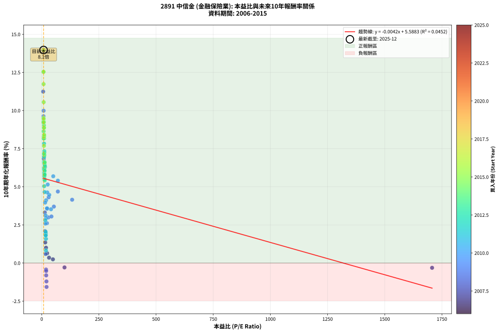

# 2891 中信金 - 本益比與未來報酬率分析

!!! info "報告資訊"
    - **股票代號**: 2891
    - **公司名稱**: 中信金
    - **產業別**: 金融保險業
    - **分析期間**: 2006-2015 (120 個數據點)
    - **資料來源**: Type 12 (ShowMonthlyK_ChartFlow) 月收盤價與本益比
    - **報酬率口徑**: 含現金股利 (簡化: 年度合計，假設每年7/1入帳)
    - **報告生成時間**: 2026-01-11 20:56:22 CST

## 📈 視覺化圖表

### 圖表1: 本益比 vs 未來報酬率關係

*圖表1：2891 中信金 本益比與10年期未來報酬率關係 (2006-2015)*

### 圖表2: 歷年買入時點的10年期實際報酬率

*圖表2：2891 中信金 歷年買入時點的10年期實際報酬率 (2006-2015)*

## 📍 買點訊號說明

本報告提供兩種買點提示訊號（顯示於圖表2的股價子圖中）：

### ▲ 小綠色三角形（回測驗證）
- **計算方式**: 使用全部歷史資料計算本益比第25百分位數
- **用途**: 事後驗證，顯示歷史上哪些時點確實為低估區
- **限制**: 當下無法判斷，僅供回測參考
- **特性**: 後見之明（Look-Ahead Bias）

### ▲ 小橘色三角形（即時訊號）
- **計算方式**: 使用截至當月的過去5年資料計算本益比第25百分位數
- **用途**: 實際投資決策，當時即可判斷
- **優勢**: 可操作性強，符合實務需求
- **特性**: 無後見之明，滾動窗口計算

!!! tip "如何使用兩種訊號"
    - **綠色▲** 幫助理解歷史估值機會，驗證策略有效性
    - **橘色▲** 可作為實際買進參考，但仍需搭配基本面分析
    - 兩種訊號重疊時，表示即時判斷與事後驗證一致，信心度較高
    - 僅有綠色▲時，表示當時無法判斷（需要未來資料才能確認）
    - 僅有橘色▲時，表示即時判斷為買點，但事後可能不是最佳時機

## 📊 估值分析摘要

| 指標 | 數值 |
|:---:|:---:|
| **目前本益比** (2015-12) | **8.05 倍** |
| **歷史平均本益比** | 35.05 倍 |
| **估值水準** | 🟢 相對低估 |
| **預期10年年化報酬率** | **+5.55%** |
| **歷史平均報酬率** | +4.47% |
| **相關係數 (R²)** | 0.0452 |
| **趨勢線斜率** | -0.0042 |

!!! abstract "核心洞察"
    目前本益比顯著低於歷史平均，預期未來報酬率可能較高

    根據歷史數據回測，2891 中信金 在目前本益比 **8.1倍** 的估值水準下，
    預期未來10年年化報酬率約為 **+5.6%**。

    **重要提醒**: 本分析基於歷史數據統計，實際報酬率會受到公司基本面變化、產業趨勢、
    總體經濟環境等多重因素影響。R² = 0.05 表示本益比可解釋約 4.5% 的報酬率變異。

## 📈 歷史估值統計

### 最佳買點 (最高報酬率)

| 項目 | 數值 |
|:---:|:---:|
| 起始時間 | 2015-12 |
| 當時本益比 | 8.05 倍 |
| 起始價格 | 16.9 元 |
| 10年後價格 | 50.2 元 |
| **10年年化報酬率** | **+13.97%** |

### 最差買點 (最低報酬率)

| 項目 | 數值 |
|:---:|:---:|
| 起始時間 | 2006-02 |
| 當時本益比 | nan 倍 |
| 起始價格 | 27.3 元 |
| 10年後價格 | 16.2 元 |
| **10年年化報酬率** | **-2.71%** |

## 🎯 投資啟示

### 本益比與報酬率關係

趨勢線方程式: **y = -0.0042x + 5.5883**

!!! note "負相關"
    本益比與未來報酬率呈現負相關。較低的本益比通常帶來較高的未來報酬率，
    但相關性不算非常強。**估值仍是重要參考指標之一**。

### 估值區間建議

基於歷史數據分析:

- **🟢 低估區** (P/E < 28.0): 預期報酬率較高，可考慮增加持股
- **🟡 合理區** (P/E 28.0-42.1): 預期報酬率符合長期趨勢，正常持有
- **🔴 高估區** (P/E > 42.1): 預期報酬率較低，可考慮減碼或觀望

!!! danger "風險提示"
    - 過去表現不代表未來結果
    - 本分析假設公司基本面無重大結構性變化
    - 產業環境劇變可能使歷史規律失效
    - 應結合公司財報、產業趨勢、總體經濟等多重因素綜合判斷

!!! success "長期投資觀點"
    歷史數據顯示，在合理或低估的估值水準買入並長期持有，
    往往能獲得較佳的投資報酬。**耐心等待好價格**是價值投資的核心原則。

## 📊 數據品質

- **資料來源**: GoodInfo.tw Type 12 (ShowMonthlyK_ChartFlow)
- **資料頻率**: 月度收盤價與本益比
- **回測期間**: 2006-2015
- **數據點數量**: 120 個 (每個點代表一次10年期回測)

### 計算方法說明

1. **10年期年化報酬率**:
   - 對每個歷史時點，計算其後10年的實際投資報酬率
   - 期末價值(不含股利): 期末價格
   - 期末價值(含現金股利): 期末價格 + 持有期間內的現金股利合計 (簡化: 年度合計，假設每年7/1入帳)
   - 公式: 年化報酬率 = [(期末價值/期初價格)^(1/年數) - 1] × 100%

2. **本益比 (P/E Ratio)**:
   - 使用當時的月收盤價與EPS計算
   - 資料來源: Type 12 月度河流圖本益比數據

3. **趨勢線 (Linear Regression)**:
   - 使用最小平方法擬合線性趨勢線
   - R²值衡量本益比對報酬率的解釋能力

---

*本報告由 Stock Analysis System v1.9.0 自動生成*
*數據更新時間: 2026-01-11 20:56:22 CST*

## 📋 月度回測明細表

（每一列對應時間線圖中的一個買入點；可用來對照 SVG 圖上的每個點。）

| 買入月份 | 賣出月份 | 回測期限_年 | 實際持有年數 | 買入本益比_倍 | 買入收盤價_元 | 賣出收盤價_元 | 現金股利合計_元 | 總報酬率_pct | 年化報酬率_pct |
| --- | --- | --- | --- | --- | --- | --- | --- | --- | --- |
| 2006-01 | 2016-01 | 10 | 9.999 |  | 25.60 | 16.10 | 4.55 | -19.34 | -2.13 |
| 2006-02 | 2016-02 | 10 | 9.999 |  | 27.30 | 16.20 | 4.55 | -23.99 | -2.71 |
| 2006-03 | 2016-03 | 10 | 10.001 |  | 23.05 | 17.00 | 4.55 | -6.51 | -0.67 |
| 2006-04 | 2016-04 | 10 | 10.001 |  | 26.20 | 16.40 | 4.55 | -20.04 | -2.21 |
| 2006-05 | 2016-05 | 10 | 10.001 |  | 25.80 | 17.10 | 4.55 | -16.09 | -1.74 |
| 2006-06 | 2016-06 | 10 | 10.001 |  | 26.85 | 16.85 | 4.55 | -20.30 | -2.24 |
| 2006-07 | 2016-07 | 10 | 10.001 |  | 25.50 | 17.60 | 4.86 | -11.92 | -1.26 |
| 2006-08 | 2016-08 | 10 | 10.001 |  | 21.55 | 18.35 | 4.86 | +7.70 | +0.74 |
| 2006-09 | 2016-09 | 10 | 10.001 |  | 24.70 | 18.20 | 4.86 | -6.64 | -0.68 |
| 2006-10 | 2016-10 | 10 | 10.001 |  | 24.15 | 17.00 | 4.86 | -9.48 | -0.99 |
| 2006-11 | 2016-11 | 10 | 10.001 |  | 27.60 | 17.50 | 4.86 | -18.99 | -2.08 |
| 2006-12 | 2016-12 | 10 | 10.001 |  | 27.25 | 17.65 | 4.86 | -17.39 | -1.89 |
| 2007-01 | 2017-01 | 10 | 10.001 |  | 27.70 | 17.80 | 4.86 | -18.19 | -1.99 |
| 2007-02 | 2017-02 | 10 | 10.001 |  | 26.30 | 18.35 | 4.86 | -11.75 | -1.24 |
| 2007-03 | 2017-03 | 10 | 10.001 |  | 25.85 | 18.75 | 4.86 | -8.67 | -0.90 |
| 2007-04 | 2017-04 | 10 | 10.001 |  | 26.25 | 18.85 | 4.86 | -9.68 | -1.01 |
| 2007-05 | 2017-05 | 10 | 10.001 |  | 25.05 | 19.15 | 4.86 | -4.15 | -0.42 |
| 2007-06 | 2017-06 | 10 | 10.001 | 1707.00 | 25.60 | 19.95 | 4.86 | -3.09 | -0.31 |
| 2007-07 | 2017-07 | 10 | 10.001 | 99.68 | 26.00 | 19.40 | 5.86 | -2.85 | -0.29 |
| 2007-08 | 2017-08 | 10 | 10.001 | 48.95 | 24.80 | 19.55 | 5.86 | +2.46 | +0.24 |
| 2007-09 | 2017-09 | 10 | 10.001 | 32.03 | 24.10 | 19.10 | 5.86 | +3.57 | +0.35 |
| 2007-10 | 2017-10 | 10 | 10.001 | 23.64 | 23.60 | 19.30 | 5.86 | +6.61 | +0.64 |
| 2007-11 | 2017-11 | 10 | 10.001 | 18.81 | 23.40 | 20.00 | 5.86 | +10.51 | +1.00 |
| 2007-12 | 2017-12 | 10 | 10.001 | 15.47 | 23.05 | 20.50 | 5.86 | +14.36 | +1.35 |
| 2008-01 | 2018-01 | 10 | 10.001 | 17.16 | 25.60 | 21.30 | 5.86 | +6.09 | +0.59 |
| 2008-02 | 2018-03 | 10 | 10.081 | 18.92 | 28.25 | 21.20 | 5.86 | -4.21 | -0.43 |
| 2008-03 | 2018-03 | 10 | 9.999 | 19.63 | 29.35 | 21.20 | 5.86 | -7.80 | -0.81 |
| 2008-04 | 2018-04 | 10 | 9.999 | 21.21 | 31.75 | 21.25 | 5.86 | -14.61 | -1.57 |
| 2008-05 | 2018-05 | 10 | 9.999 | 20.69 | 31.00 | 21.60 | 5.86 | -11.42 | -1.21 |
| 2008-06 | 2018-06 | 10 | 9.999 | 19.53 | 29.30 | 21.95 | 5.86 | -5.09 | -0.52 |
| 2008-07 | 2018-07 | 10 | 9.999 | 14.88 | 22.35 | 20.75 | 6.74 | +23.00 | +2.09 |
| 2008-08 | 2018-08 | 10 | 9.999 | 13.60 | 20.45 | 21.60 | 6.74 | +38.58 | +3.32 |
| 2008-09 | 2018-09 | 10 | 9.999 | 11.36 | 17.10 | 23.00 | 6.74 | +73.92 | +5.69 |
| 2008-10 | 2018-10 | 10 | 9.999 | 6.27 | 9.44 | 20.65 | 6.74 | +190.15 | +11.24 |
| 2008-11 | 2018-11 | 10 | 9.999 | 7.46 | 11.25 | 20.45 | 6.74 | +141.69 | +9.23 |
| 2008-12 | 2018-12 | 10 | 9.999 | 9.21 | 13.90 | 20.20 | 6.74 | +93.81 | +6.84 |
| 2009-01 | 2019-01 | 10 | 9.999 | 7.84 | 10.95 | 20.70 | 6.74 | +150.59 | +9.62 |
| 2009-02 | 2019-02 | 10 | 9.999 | 8.30 | 10.65 | 20.85 | 6.74 | +159.06 | +9.99 |
| 2009-03 | 2019-03 | 10 | 9.999 | 10.60 | 12.40 | 20.45 | 6.74 | +119.27 | +8.17 |
| 2009-04 | 2019-04 | 10 | 9.999 | 14.34 | 15.15 | 21.15 | 6.74 | +84.09 | +6.29 |
| 2009-05 | 2019-05 | 10 | 9.999 | 22.69 | 21.40 | 20.95 | 6.74 | +29.39 | +2.61 |
| 2009-06 | 2019-06 | 10 | 9.999 | 23.86 | 19.80 | 21.35 | 6.74 | +41.87 | +3.56 |
| 2009-07 | 2019-07 | 10 | 9.999 | 28.95 | 20.75 | 20.30 | 7.56 | +34.27 | +2.99 |
| 2009-08 | 2019-08 | 10 | 9.999 | 30.33 | 18.30 | 20.35 | 7.56 | +52.51 | +4.31 |
| 2009-09 | 2019-09 | 10 | 9.999 | 42.55 | 20.85 | 20.60 | 7.56 | +35.06 | +3.05 |
| 2009-10 | 2019-10 | 10 | 9.999 | 53.10 | 20.00 | 21.20 | 7.56 | +43.80 | +3.70 |
| 2009-11 | 2019-11 | 10 | 9.999 | 70.63 | 18.60 | 21.85 | 7.56 | +58.12 | +4.69 |
| 2009-12 | 2019-12 | 10 | 9.999 | 133.00 | 19.95 | 22.40 | 7.56 | +50.18 | +4.15 |
| 2010-01 | 2020-01 | 10 | 9.999 | 70.71 | 17.50 | 22.05 | 7.56 | +69.20 | +5.40 |
| 2010-02 | 2020-02 | 10 | 9.999 | 50.43 | 17.40 | 22.70 | 7.56 | +73.91 | +5.69 |
| 2010-03 | 2020-03 | 10 | 10.001 | 40.68 | 18.00 | 17.90 | 7.56 | +41.44 | +3.53 |
| 2010-04 | 2020-04 | 10 | 10.001 | 32.96 | 17.80 | 20.00 | 7.56 | +54.83 | +4.47 |
| 2010-05 | 2020-05 | 10 | 10.001 | 26.12 | 16.65 | 19.95 | 7.56 | +65.23 | +5.15 |
| 2010-06 | 2020-06 | 10 | 10.001 | 24.15 | 17.75 | 20.35 | 7.56 | +57.24 | +4.63 |
| 2010-07 | 2020-07 | 10 | 10.001 | 23.06 | 19.20 | 19.40 | 7.92 | +42.29 | +3.59 |
| 2010-08 | 2020-08 | 10 | 10.001 | 19.30 | 17.95 | 18.95 | 7.92 | +49.69 | +4.12 |
| 2010-09 | 2020-09 | 10 | 10.001 | 19.17 | 19.70 | 18.40 | 7.92 | +33.60 | +2.94 |
| 2010-10 | 2020-10 | 10 | 10.001 | 16.98 | 19.10 | 18.05 | 7.92 | +35.97 | +3.12 |
| 2010-11 | 2020-11 | 10 | 10.001 | 15.01 | 18.35 | 19.15 | 7.92 | +47.52 | +3.96 |
| 2010-12 | 2020-12 | 10 | 10.001 | 16.21 | 21.40 | 19.70 | 7.92 | +29.07 | +2.58 |
| 2011-01 | 2021-01 | 10 | 10.001 | 18.45 | 24.80 | 19.00 | 7.92 | +8.55 | +0.82 |
| 2011-02 | 2021-02 | 10 | 10.001 | 16.95 | 23.20 | 20.00 | 7.92 | +20.34 | +1.87 |
| 2011-03 | 2021-03 | 10 | 10.001 | 17.95 | 25.00 | 22.10 | 7.92 | +20.08 | +1.85 |
| 2011-04 | 2021-04 | 10 | 10.001 | 18.53 | 26.25 | 22.80 | 7.92 | +17.03 | +1.58 |
| 2011-05 | 2021-05 | 10 | 10.001 | 17.70 | 25.50 | 23.05 | 7.92 | +21.45 | +1.96 |
| 2011-06 | 2021-06 | 10 | 10.001 | 17.06 | 25.00 | 22.70 | 7.92 | +22.48 | +2.05 |
| 2011-07 | 2021-07 | 10 | 10.001 | 17.46 | 26.00 | 22.85 | 8.24 | +19.58 | +1.80 |
| 2011-08 | 2021-08 | 10 | 10.001 | 15.66 | 23.70 | 23.00 | 8.24 | +31.81 | +2.80 |
| 2011-09 | 2021-09 | 10 | 10.001 | 11.84 | 18.20 | 22.90 | 8.24 | +71.10 | +5.52 |
| 2011-10 | 2021-10 | 10 | 10.001 | 12.77 | 19.95 | 23.20 | 8.24 | +57.59 | +4.65 |
| 2011-11 | 2021-11 | 10 | 10.001 | 10.44 | 16.55 | 24.40 | 8.24 | +97.22 | +7.03 |
| 2011-12 | 2021-12 | 10 | 10.001 | 11.74 | 18.90 | 25.95 | 8.24 | +80.90 | +6.11 |
| 2012-01 | 2022-01 | 10 | 10.001 | 11.83 | 19.10 | 27.60 | 8.24 | +87.64 | +6.50 |
| 2012-02 | 2022-03 | 10 | 10.081 | 12.36 | 20.00 | 29.40 | 8.24 | +88.20 | +6.47 |
| 2012-03 | 2022-03 | 10 | 9.999 | 11.44 | 18.55 | 29.40 | 8.24 | +102.91 | +7.33 |
| 2012-04 | 2022-04 | 10 | 9.999 | 11.47 | 18.65 | 29.25 | 8.24 | +101.02 | +7.23 |
| 2012-05 | 2022-05 | 10 | 9.999 | 10.21 | 16.65 | 27.15 | 8.24 | +112.55 | +7.83 |
| 2012-06 | 2022-06 | 10 | 9.999 | 10.40 | 17.00 | 25.10 | 8.24 | +96.12 | +6.97 |
| 2012-07 | 2022-07 | 10 | 9.999 | 10.99 | 18.00 | 22.95 | 9.09 | +78.00 | +5.94 |
| 2012-08 | 2022-08 | 10 | 9.999 | 10.90 | 17.90 | 23.50 | 9.09 | +82.07 | +6.18 |
| 2012-09 | 2022-09 | 10 | 9.999 | 10.75 | 17.70 | 19.85 | 9.09 | +63.50 | +5.04 |
| 2012-10 | 2022-10 | 10 | 9.999 | 9.75 | 16.10 | 20.40 | 9.09 | +83.17 | +6.24 |
| 2012-11 | 2022-11 | 10 | 9.999 | 10.18 | 16.85 | 23.00 | 9.09 | +90.45 | +6.65 |
| 2012-12 | 2022-12 | 10 | 9.999 | 10.34 | 17.15 | 22.10 | 9.09 | +81.87 | +6.16 |
| 2013-01 | 2023-01 | 10 | 9.999 | 10.27 | 16.90 | 22.85 | 9.09 | +88.99 | +6.57 |
| 2013-02 | 2023-02 | 10 | 9.999 | 10.75 | 17.55 | 22.75 | 9.09 | +81.42 | +6.14 |
| 2013-03 | 2023-03 | 10 | 9.999 | 10.96 | 17.75 | 21.85 | 9.09 | +74.31 | +5.71 |
| 2013-04 | 2023-04 | 10 | 9.999 | 11.15 | 17.90 | 22.60 | 9.09 | +77.04 | +5.88 |
| 2013-05 | 2023-05 | 10 | 9.999 | 12.03 | 19.15 | 24.30 | 9.09 | +74.36 | +5.72 |
| 2013-06 | 2023-06 | 10 | 9.999 | 11.75 | 18.55 | 24.85 | 9.09 | +82.96 | +6.23 |
| 2013-07 | 2023-07 | 10 | 9.999 | 12.64 | 19.80 | 26.25 | 9.38 | +79.95 | +6.05 |
| 2013-08 | 2023-08 | 10 | 9.999 | 12.14 | 18.85 | 23.85 | 9.38 | +76.29 | +5.83 |
| 2013-09 | 2023-09 | 10 | 9.999 | 12.54 | 19.30 | 24.50 | 9.38 | +75.54 | +5.79 |
| 2013-10 | 2023-10 | 10 | 9.999 | 13.04 | 19.90 | 24.35 | 9.38 | +69.50 | +5.42 |
| 2013-11 | 2023-11 | 10 | 9.999 | 12.79 | 19.35 | 27.35 | 9.38 | +89.82 | +6.62 |
| 2013-12 | 2023-12 | 10 | 9.999 | 13.57 | 20.35 | 28.35 | 9.38 | +85.41 | +6.37 |
| 2014-01 | 2024-01 | 10 | 9.999 | 12.58 | 20.00 | 28.45 | 9.38 | +89.15 | +6.58 |
| 2014-02 | 2024-02 | 10 | 9.999 | 11.64 | 19.55 | 29.40 | 9.38 | +98.36 | +7.09 |
| 2014-03 | 2024-03 | 10 | 10.001 | 10.76 | 19.05 | 33.05 | 9.38 | +122.73 | +8.34 |
| 2014-04 | 2024-04 | 10 | 10.001 | 9.65 | 17.95 | 34.10 | 9.38 | +142.23 | +9.25 |
| 2014-05 | 2024-05 | 10 | 10.001 | 9.79 | 19.10 | 35.40 | 9.38 | +134.45 | +8.89 |
| 2014-06 | 2024-06 | 10 | 10.001 | 9.75 | 19.90 | 37.85 | 9.38 | +137.34 | +9.03 |
| 2014-07 | 2024-07 | 10 | 10.001 | 9.91 | 21.10 | 35.50 | 10.80 | +119.43 | +8.17 |
| 2014-08 | 2024-08 | 10 | 10.001 | 9.80 | 21.75 | 32.65 | 10.80 | +99.77 | +7.16 |
| 2014-09 | 2024-09 | 10 | 10.001 | 8.85 | 20.45 | 34.40 | 10.80 | +121.03 | +8.25 |
| 2014-10 | 2024-10 | 10 | 10.001 | 8.88 | 21.30 | 35.90 | 10.80 | +119.25 | +8.17 |
| 2014-11 | 2024-11 | 10 | 10.001 | 8.45 | 21.05 | 37.40 | 10.80 | +128.98 | +8.64 |
| 2014-12 | 2024-12 | 10 | 10.001 | 7.97 | 20.55 | 39.10 | 10.80 | +142.82 | +9.28 |
| 2015-01 | 2025-01 | 10 | 10.001 | 7.91 | 20.10 | 39.10 | 10.80 | +148.26 | +9.52 |
| 2015-02 | 2025-02 | 10 | 10.001 | 8.36 | 20.90 | 40.75 | 10.80 | +146.65 | +9.45 |
| 2015-03 | 2025-03 | 10 | 10.001 | 8.46 | 20.80 | 39.45 | 10.80 | +141.59 | +9.22 |
| 2015-04 | 2025-04 | 10 | 10.001 | 9.88 | 23.90 | 39.30 | 10.80 | +109.62 | +7.68 |
| 2015-05 | 2025-05 | 10 | 10.001 | 9.79 | 23.30 | 40.85 | 10.80 | +121.67 | +8.28 |
| 2015-06 | 2025-06 | 10 | 10.001 | 10.38 | 24.30 | 43.70 | 10.80 | +124.28 | +8.41 |
| 2015-07 | 2025-07 | 10 | 10.001 | 9.96 | 22.90 | 41.25 | 12.29 | +133.80 | +8.86 |
| 2015-08 | 2025-08 | 10 | 10.001 | 8.67 | 19.60 | 41.15 | 12.29 | +172.65 | +10.55 |
| 2015-09 | 2025-09 | 10 | 10.001 | 7.64 | 16.95 | 42.90 | 12.29 | +225.60 | +12.53 |
| 2015-10 | 2025-10 | 10 | 10.001 | 8.19 | 17.85 | 41.85 | 12.29 | +203.31 | +11.73 |
| 2015-11 | 2025-11 | 10 | 10.001 | 7.99 | 17.10 | 43.45 | 12.29 | +225.96 | +12.54 |
| 2015-12 | 2025-12 | 10 | 10.001 | 8.05 | 16.90 | 50.20 | 12.29 | +269.76 | +13.97 |
