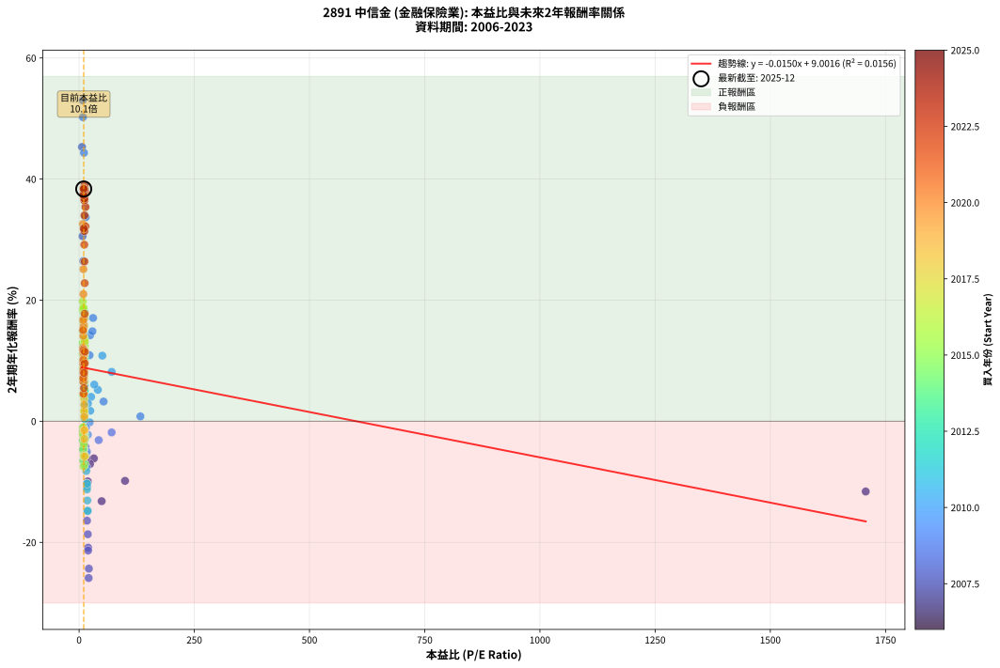
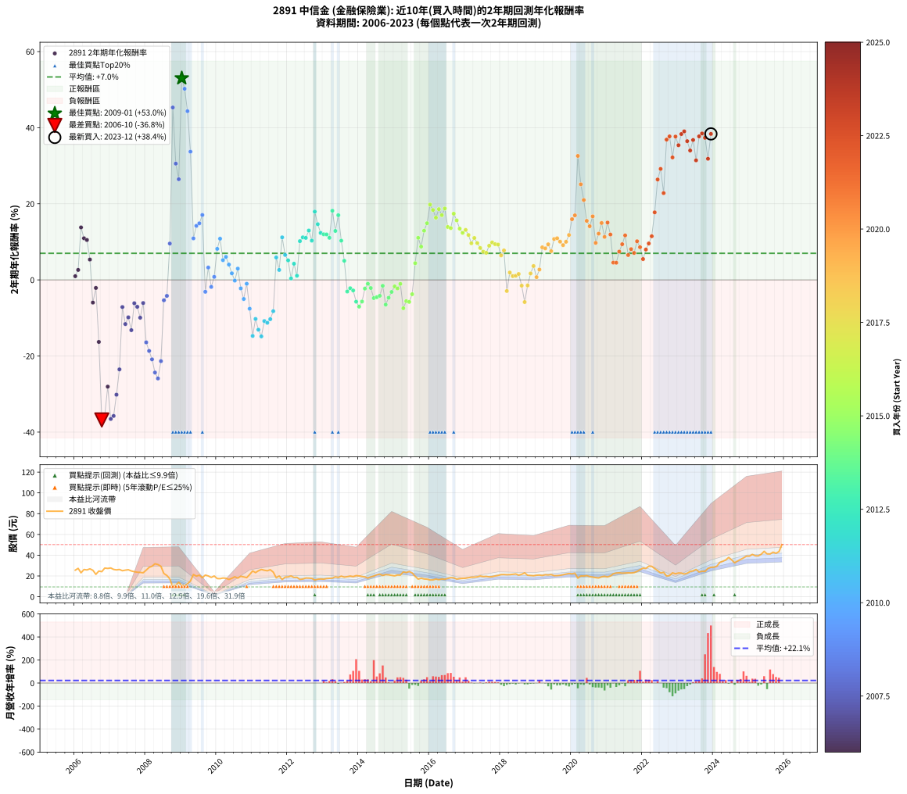

# 2891 中信金 - 本益比與未來報酬率分析

!!! info "報告資訊"
    - **股票代號**: 2891
    - **公司名稱**: 中信金
    - **產業別**: 金融保險業
    - **分析期間**: 2006-2023 (216 個數據點)
    - **資料來源**: Type 12 (ShowMonthlyK_ChartFlow) 月收盤價與本益比
    - **報酬率口徑**: 含現金股利 (簡化: 年度合計，假設每年7/1入帳)
    - **報告生成時間**: 2026-01-10 22:45:06 CST

## 📈 視覺化圖表

### 圖表1: 本益比 vs 未來報酬率關係

*圖表1：2891 中信金 本益比與2年期未來報酬率關係 (2006-2023)*

### 圖表2: 歷年買入時點的2年期實際報酬率

*圖表2：2891 中信金 歷年買入時點的2年期實際報酬率 (2006-2023)*

## 📍 買點訊號說明

本報告提供兩種買點提示訊號（顯示於圖表2的股價子圖中）：

### ▲ 小綠色三角形（回測驗證）
- **計算方式**: 使用全部歷史資料計算本益比第25百分位數
- **用途**: 事後驗證，顯示歷史上哪些時點確實為低估區
- **限制**: 當下無法判斷，僅供回測參考
- **特性**: 後見之明（Look-Ahead Bias）

### ▲ 小橘色三角形（即時訊號）
- **計算方式**: 使用截至當月的過去5年資料計算本益比第25百分位數
- **用途**: 實際投資決策，當時即可判斷
- **優勢**: 可操作性強，符合實務需求
- **特性**: 無後見之明，滾動窗口計算

!!! tip "如何使用兩種訊號"
    - **綠色▲** 幫助理解歷史估值機會，驗證策略有效性
    - **橘色▲** 可作為實際買進參考，但仍需搭配基本面分析
    - 兩種訊號重疊時，表示即時判斷與事後驗證一致，信心度較高
    - 僅有綠色▲時，表示當時無法判斷（需要未來資料才能確認）
    - 僅有橘色▲時，表示即時判斷為買點，但事後可能不是最佳時機

## 📊 估值分析摘要

| 指標 | 數值 |
|:---:|:---:|
| **目前本益比** (2023-12) | **10.05 倍** |
| **歷史平均本益比** | 23.25 倍 |
| **估值水準** | 🟢 相對低估 |
| **預期2年年化報酬率** | **+8.85%** |
| **歷史平均報酬率** | +6.98% |
| **相關係數 (R²)** | 0.0156 |
| **趨勢線斜率** | -0.0150 |

!!! abstract "核心洞察"
    目前本益比顯著低於歷史平均，預期未來報酬率可能較高

    根據歷史數據回測，2891 中信金 在目前本益比 **10.1倍** 的估值水準下，
    預期未來2年年化報酬率約為 **+8.9%**。

    **重要提醒**: 本分析基於歷史數據統計，實際報酬率會受到公司基本面變化、產業趨勢、
    總體經濟環境等多重因素影響。R² = 0.02 表示本益比可解釋約 1.6% 的報酬率變異。

## 📈 歷史估值統計

### 最佳買點 (最高報酬率)

| 項目 | 數值 |
|:---:|:---:|
| 起始時間 | 2009-01 |
| 當時本益比 | 7.84 倍 |
| 起始價格 | 10.9 元 |
| 2年後價格 | 24.8 元 |
| **2年年化報酬率** | **+53.01%** |

### 最差買點 (最低報酬率)

| 項目 | 數值 |
|:---:|:---:|
| 起始時間 | 2006-10 |
| 當時本益比 | nan 倍 |
| 起始價格 | 24.1 元 |
| 2年後價格 | 9.4 元 |
| **2年年化報酬率** | **-36.80%** |

## 🎯 投資啟示

### 本益比與報酬率關係

趨勢線方程式: **y = -0.0150x + 9.0016**

!!! note "負相關"
    本益比與未來報酬率呈現負相關。較低的本益比通常帶來較高的未來報酬率，
    但相關性不算非常強。**估值仍是重要參考指標之一**。

### 估值區間建議

基於歷史數據分析:

- **🟢 低估區** (P/E < 18.6): 預期報酬率較高，可考慮增加持股
- **🟡 合理區** (P/E 18.6-27.9): 預期報酬率符合長期趨勢，正常持有
- **🔴 高估區** (P/E > 27.9): 預期報酬率較低，可考慮減碼或觀望

!!! danger "風險提示"
    - 過去表現不代表未來結果
    - 本分析假設公司基本面無重大結構性變化
    - 產業環境劇變可能使歷史規律失效
    - 應結合公司財報、產業趨勢、總體經濟等多重因素綜合判斷

!!! success "長期投資觀點"
    歷史數據顯示，在合理或低估的估值水準買入並長期持有，
    往往能獲得較佳的投資報酬。**耐心等待好價格**是價值投資的核心原則。

## 📊 數據品質

- **資料來源**: GoodInfo.tw Type 12 (ShowMonthlyK_ChartFlow)
- **資料頻率**: 月度收盤價與本益比
- **回測期間**: 2006-2023
- **數據點數量**: 216 個 (每個點代表一次2年期回測)

### 計算方法說明

1. **2年期年化報酬率**:
   - 對每個歷史時點，計算其後2年的實際投資報酬率
   - 期末價值(不含股利): 期末價格
   - 期末價值(含現金股利): 期末價格 + 持有期間內的現金股利合計 (簡化: 年度合計，假設每年7/1入帳)
   - 公式: 年化報酬率 = [(期末價值/期初價格)^(1/年數) - 1] × 100%

2. **本益比 (P/E Ratio)**:
   - 使用當時的月收盤價與EPS計算
   - 資料來源: Type 12 月度河流圖本益比數據

3. **趨勢線 (Linear Regression)**:
   - 使用最小平方法擬合線性趨勢線
   - R²值衡量本益比對報酬率的解釋能力

---

*本報告由 Stock Analysis System v1.9.0 自動生成*
*數據更新時間: 2026-01-10 22:45:06 CST*

## 📋 月度回測明細表

（每一列對應時間線圖中的一個買入點；可用來對照 SVG 圖上的每個點。）

| 買入月份 | 賣出月份 | 回測期限_年 | 實際持有年數 | 買入本益比_倍 | 買入收盤價_元 | 賣出收盤價_元 | 現金股利合計_元 | 總報酬率_pct | 年化報酬率_pct |
| --- | --- | --- | --- | --- | --- | --- | --- | --- | --- |
| 2006-01 | 2008-01 | 2 | 1.999 |  | 25.60 | 25.60 | 0.50 | +1.95 | +0.97 |
| 2006-02 | 2008-02 | 2 | 1.999 |  | 27.30 | 28.25 | 0.50 | +5.31 | +2.62 |
| 2006-03 | 2008-03 | 2 | 2.001 |  | 23.05 | 29.35 | 0.50 | +29.50 | +13.79 |
| 2006-04 | 2008-04 | 2 | 2.001 |  | 26.20 | 31.75 | 0.50 | +23.09 | +10.94 |
| 2006-05 | 2008-05 | 2 | 2.001 |  | 25.80 | 31.00 | 0.50 | +22.09 | +10.49 |
| 2006-06 | 2008-06 | 2 | 2.001 |  | 26.85 | 29.30 | 0.50 | +10.99 | +5.35 |
| 2006-07 | 2008-07 | 2 | 2.001 |  | 25.50 | 22.35 | 0.20 | -11.57 | -5.96 |
| 2006-08 | 2008-08 | 2 | 2.001 |  | 21.55 | 20.45 | 0.20 | -4.18 | -2.11 |
| 2006-09 | 2008-09 | 2 | 2.001 |  | 24.70 | 17.10 | 0.20 | -29.96 | -16.30 |
| 2006-10 | 2008-10 | 2 | 2.001 |  | 24.15 | 9.44 | 0.20 | -60.08 | -36.80 |
| 2006-11 | 2008-11 | 2 | 2.001 |  | 27.60 | 11.25 | 0.20 | -58.51 | -35.57 |
| 2006-12 | 2008-12 | 2 | 2.001 |  | 27.25 | 13.90 | 0.20 | -48.26 | -28.05 |
| 2007-01 | 2009-01 | 2 | 2.001 |  | 27.70 | 10.95 | 0.20 | -59.75 | -36.54 |
| 2007-02 | 2009-02 | 2 | 2.001 |  | 26.30 | 10.65 | 0.20 | -58.75 | -35.75 |
| 2007-03 | 2009-03 | 2 | 2.001 |  | 25.85 | 12.40 | 0.20 | -51.26 | -30.17 |
| 2007-04 | 2009-04 | 2 | 2.001 |  | 26.25 | 15.15 | 0.20 | -41.52 | -23.52 |
| 2007-05 | 2009-05 | 2 | 2.001 |  | 25.05 | 21.40 | 0.20 | -13.77 | -7.14 |
| 2007-06 | 2009-06 | 2 | 2.001 | 1707.00 | 25.60 | 19.80 | 0.20 | -21.88 | -11.60 |
| 2007-07 | 2009-07 | 2 | 2.001 | 99.68 | 26.00 | 20.75 | 0.38 | -18.73 | -9.84 |
| 2007-08 | 2009-08 | 2 | 2.001 | 48.95 | 24.80 | 18.30 | 0.38 | -24.68 | -13.20 |
| 2007-09 | 2009-09 | 2 | 2.001 | 32.03 | 24.10 | 20.85 | 0.38 | -11.91 | -6.14 |
| 2007-10 | 2009-10 | 2 | 2.001 | 23.64 | 23.60 | 20.00 | 0.38 | -13.64 | -7.07 |
| 2007-11 | 2009-11 | 2 | 2.001 | 18.81 | 23.40 | 18.60 | 0.38 | -18.89 | -9.93 |
| 2007-12 | 2009-12 | 2 | 2.001 | 15.47 | 23.05 | 19.95 | 0.38 | -11.80 | -6.08 |
| 2008-01 | 2010-01 | 2 | 2.001 | 17.16 | 25.60 | 17.50 | 0.38 | -30.16 | -16.42 |
| 2008-02 | 2010-03 | 2 | 2.081 | 18.92 | 28.25 | 18.00 | 0.38 | -34.94 | -18.66 |
| 2008-03 | 2010-03 | 2 | 1.999 | 19.63 | 29.35 | 18.00 | 0.38 | -37.38 | -20.88 |
| 2008-04 | 2010-04 | 2 | 1.999 | 21.21 | 31.75 | 17.80 | 0.38 | -42.74 | -24.34 |
| 2008-05 | 2010-05 | 2 | 1.999 | 20.69 | 31.00 | 16.65 | 0.38 | -45.06 | -25.90 |
| 2008-06 | 2010-06 | 2 | 1.999 | 19.53 | 29.30 | 17.75 | 0.38 | -38.12 | -21.35 |
| 2008-07 | 2010-07 | 2 | 1.999 | 14.88 | 22.35 | 19.20 | 0.82 | -10.43 | -5.36 |
| 2008-08 | 2010-08 | 2 | 1.999 | 13.60 | 20.45 | 17.95 | 0.82 | -8.22 | -4.20 |
| 2008-09 | 2010-09 | 2 | 1.999 | 11.36 | 17.10 | 19.70 | 0.82 | +20.00 | +9.55 |
| 2008-10 | 2010-10 | 2 | 1.999 | 6.27 | 9.44 | 19.10 | 0.82 | +111.02 | +45.30 |
| 2008-11 | 2010-11 | 2 | 1.999 | 7.46 | 11.25 | 18.35 | 0.82 | +70.40 | +30.56 |
| 2008-12 | 2010-12 | 2 | 1.999 | 9.21 | 13.90 | 21.40 | 0.82 | +59.86 | +26.45 |
| 2009-01 | 2011-01 | 2 | 1.999 | 7.84 | 10.95 | 24.80 | 0.82 | +133.97 | +53.01 |
| 2009-02 | 2011-02 | 2 | 1.999 | 8.30 | 10.65 | 23.20 | 0.82 | +125.54 | +50.22 |
| 2009-03 | 2011-03 | 2 | 1.999 | 10.60 | 12.40 | 25.00 | 0.82 | +108.23 | +44.34 |
| 2009-04 | 2011-04 | 2 | 1.999 | 14.34 | 15.15 | 26.25 | 0.82 | +78.68 | +33.70 |
| 2009-05 | 2011-05 | 2 | 1.999 | 22.69 | 21.40 | 25.50 | 0.82 | +22.99 | +10.91 |
| 2009-06 | 2011-06 | 2 | 1.999 | 23.86 | 19.80 | 25.00 | 0.82 | +30.40 | +14.20 |
| 2009-07 | 2011-07 | 2 | 1.999 | 28.95 | 20.75 | 26.00 | 1.37 | +31.90 | +14.86 |
| 2009-08 | 2011-08 | 2 | 1.999 | 30.33 | 18.30 | 23.70 | 1.37 | +36.99 | +17.06 |
| 2009-09 | 2011-09 | 2 | 1.999 | 42.55 | 20.85 | 18.20 | 1.37 | -6.14 | -3.12 |
| 2009-10 | 2011-10 | 2 | 1.999 | 53.10 | 20.00 | 19.95 | 1.37 | +6.60 | +3.25 |
| 2009-11 | 2011-11 | 2 | 1.999 | 70.63 | 18.60 | 16.55 | 1.37 | -3.66 | -1.85 |
| 2009-12 | 2011-12 | 2 | 1.999 | 133.00 | 19.95 | 18.90 | 1.37 | +1.60 | +0.80 |
| 2010-01 | 2012-01 | 2 | 1.999 | 70.71 | 17.50 | 19.10 | 1.37 | +16.97 | +8.16 |
| 2010-02 | 2012-02 | 2 | 1.999 | 50.43 | 17.40 | 20.00 | 1.37 | +22.82 | +10.83 |
| 2010-03 | 2012-03 | 2 | 2.001 | 40.68 | 18.00 | 18.55 | 1.37 | +10.67 | +5.19 |
| 2010-04 | 2012-04 | 2 | 2.001 | 32.96 | 17.80 | 18.65 | 1.37 | +12.47 | +6.05 |
| 2010-05 | 2012-05 | 2 | 2.001 | 26.12 | 16.65 | 16.65 | 1.37 | +8.23 | +4.03 |
| 2010-06 | 2012-06 | 2 | 2.001 | 24.15 | 17.75 | 17.00 | 1.37 | +3.49 | +1.73 |
| 2010-07 | 2012-07 | 2 | 2.001 | 23.06 | 19.20 | 18.00 | 1.13 | -0.36 | -0.18 |
| 2010-08 | 2012-08 | 2 | 2.001 | 19.30 | 17.95 | 17.90 | 1.13 | +6.02 | +2.96 |
| 2010-09 | 2012-09 | 2 | 2.001 | 19.17 | 19.70 | 17.70 | 1.13 | -4.42 | -2.23 |
| 2010-10 | 2012-10 | 2 | 2.001 | 16.98 | 19.10 | 16.10 | 1.13 | -9.79 | -5.02 |
| 2010-11 | 2012-11 | 2 | 2.001 | 15.01 | 18.35 | 16.85 | 1.13 | -2.02 | -1.01 |
| 2010-12 | 2012-12 | 2 | 2.001 | 16.21 | 21.40 | 17.15 | 1.13 | -14.58 | -7.57 |
| 2011-01 | 2013-01 | 2 | 2.001 | 18.45 | 24.80 | 16.90 | 1.13 | -27.30 | -14.73 |
| 2011-02 | 2013-02 | 2 | 2.001 | 16.95 | 23.20 | 17.55 | 1.13 | -19.48 | -10.26 |
| 2011-03 | 2013-03 | 2 | 2.001 | 17.95 | 25.00 | 17.75 | 1.13 | -24.48 | -13.09 |
| 2011-04 | 2013-04 | 2 | 2.001 | 18.53 | 26.25 | 17.90 | 1.13 | -27.50 | -14.85 |
| 2011-05 | 2013-05 | 2 | 2.001 | 17.70 | 25.50 | 19.15 | 1.13 | -20.47 | -10.81 |
| 2011-06 | 2013-06 | 2 | 2.001 | 17.06 | 25.00 | 18.55 | 1.13 | -21.28 | -11.27 |
| 2011-07 | 2013-07 | 2 | 2.001 | 17.46 | 26.00 | 19.80 | 1.11 | -19.58 | -10.31 |
| 2011-08 | 2013-08 | 2 | 2.001 | 15.66 | 23.70 | 18.85 | 1.11 | -15.78 | -8.22 |
| 2011-09 | 2013-09 | 2 | 2.001 | 11.84 | 18.20 | 19.30 | 1.11 | +12.14 | +5.89 |
| 2011-10 | 2013-10 | 2 | 2.001 | 12.77 | 19.95 | 19.90 | 1.11 | +5.31 | +2.62 |
| 2011-11 | 2013-11 | 2 | 2.001 | 10.44 | 16.55 | 19.35 | 1.11 | +23.63 | +11.18 |
| 2011-12 | 2013-12 | 2 | 2.001 | 11.74 | 18.90 | 20.35 | 1.11 | +13.54 | +6.55 |
| 2012-01 | 2014-01 | 2 | 2.001 | 11.83 | 19.10 | 20.00 | 1.11 | +10.52 | +5.13 |
| 2012-02 | 2014-03 | 2 | 2.081 | 12.36 | 20.00 | 19.05 | 1.11 | +0.80 | +0.38 |
| 2012-03 | 2014-03 | 2 | 1.999 | 11.44 | 18.55 | 19.05 | 1.11 | +8.68 | +4.25 |
| 2012-04 | 2014-04 | 2 | 1.999 | 11.47 | 18.65 | 17.95 | 1.11 | +2.20 | +1.09 |
| 2012-05 | 2014-05 | 2 | 1.999 | 10.21 | 16.65 | 19.10 | 1.11 | +21.38 | +10.18 |
| 2012-06 | 2014-06 | 2 | 1.999 | 10.40 | 17.00 | 19.90 | 1.11 | +23.59 | +11.18 |
| 2012-07 | 2014-07 | 2 | 1.999 | 10.99 | 18.00 | 21.10 | 1.09 | +23.28 | +11.04 |
| 2012-08 | 2014-08 | 2 | 1.999 | 10.90 | 17.90 | 21.75 | 1.09 | +27.60 | +12.97 |
| 2012-09 | 2014-09 | 2 | 1.999 | 10.75 | 17.70 | 20.45 | 1.09 | +21.69 | +10.32 |
| 2012-10 | 2014-10 | 2 | 1.999 | 9.75 | 16.10 | 21.30 | 1.09 | +39.07 | +17.94 |
| 2012-11 | 2014-11 | 2 | 1.999 | 10.18 | 16.85 | 21.05 | 1.09 | +31.39 | +14.64 |
| 2012-12 | 2014-12 | 2 | 1.999 | 10.34 | 17.15 | 20.55 | 1.09 | +26.18 | +12.34 |
| 2013-01 | 2015-01 | 2 | 1.999 | 10.27 | 16.90 | 20.10 | 1.09 | +25.38 | +11.98 |
| 2013-02 | 2015-02 | 2 | 1.999 | 10.75 | 17.55 | 20.90 | 1.09 | +25.30 | +11.95 |
| 2013-03 | 2015-03 | 2 | 1.999 | 10.96 | 17.75 | 20.80 | 1.09 | +23.32 | +11.06 |
| 2013-04 | 2015-04 | 2 | 1.999 | 11.15 | 17.90 | 23.90 | 1.09 | +39.61 | +18.17 |
| 2013-05 | 2015-05 | 2 | 1.999 | 12.03 | 19.15 | 23.30 | 1.09 | +27.36 | +12.86 |
| 2013-06 | 2015-06 | 2 | 1.999 | 11.75 | 18.55 | 24.30 | 1.09 | +36.87 | +17.01 |
| 2013-07 | 2015-07 | 2 | 1.999 | 12.64 | 19.80 | 22.90 | 1.19 | +21.67 | +10.31 |
| 2013-08 | 2015-08 | 2 | 1.999 | 12.14 | 18.85 | 19.60 | 1.19 | +10.29 | +5.02 |
| 2013-09 | 2015-09 | 2 | 1.999 | 12.54 | 19.30 | 16.95 | 1.19 | -6.01 | -3.05 |
| 2013-10 | 2015-10 | 2 | 1.999 | 13.04 | 19.90 | 17.85 | 1.19 | -4.32 | -2.19 |
| 2013-11 | 2015-11 | 2 | 1.999 | 12.79 | 19.35 | 17.10 | 1.19 | -5.48 | -2.78 |
| 2013-12 | 2015-12 | 2 | 1.999 | 13.57 | 20.35 | 16.90 | 1.19 | -11.11 | -5.72 |
| 2014-01 | 2016-01 | 2 | 1.999 | 12.58 | 20.00 | 16.10 | 1.19 | -13.55 | -7.03 |
| 2014-02 | 2016-02 | 2 | 1.999 | 11.64 | 19.55 | 16.20 | 1.19 | -11.05 | -5.69 |
| 2014-03 | 2016-03 | 2 | 2.001 | 10.76 | 19.05 | 17.00 | 1.19 | -4.51 | -2.28 |
| 2014-04 | 2016-04 | 2 | 2.001 | 9.65 | 17.95 | 16.40 | 1.19 | -2.01 | -1.01 |
| 2014-05 | 2016-05 | 2 | 2.001 | 9.79 | 19.10 | 17.10 | 1.19 | -4.24 | -2.14 |
| 2014-06 | 2016-06 | 2 | 2.001 | 9.75 | 19.90 | 16.85 | 1.19 | -9.35 | -4.78 |
| 2014-07 | 2016-07 | 2 | 2.001 | 9.91 | 21.10 | 17.60 | 1.62 | -8.91 | -4.56 |
| 2014-08 | 2016-08 | 2 | 2.001 | 9.80 | 21.75 | 18.35 | 1.62 | -8.18 | -4.18 |
| 2014-09 | 2016-09 | 2 | 2.001 | 8.85 | 20.45 | 18.20 | 1.62 | -3.08 | -1.55 |
| 2014-10 | 2016-10 | 2 | 2.001 | 8.88 | 21.30 | 17.00 | 1.62 | -12.58 | -6.50 |
| 2014-11 | 2016-11 | 2 | 2.001 | 8.45 | 21.05 | 17.50 | 1.62 | -9.17 | -4.69 |
| 2014-12 | 2016-12 | 2 | 2.001 | 7.97 | 20.55 | 17.65 | 1.62 | -6.23 | -3.16 |
| 2015-01 | 2017-01 | 2 | 2.001 | 7.91 | 20.10 | 17.80 | 1.62 | -3.38 | -1.70 |
| 2015-02 | 2017-02 | 2 | 2.001 | 8.36 | 20.90 | 18.35 | 1.62 | -4.45 | -2.25 |
| 2015-03 | 2017-03 | 2 | 2.001 | 8.46 | 20.80 | 18.75 | 1.62 | -2.07 | -1.04 |
| 2015-04 | 2017-04 | 2 | 2.001 | 9.88 | 23.90 | 18.85 | 1.62 | -14.35 | -7.45 |
| 2015-05 | 2017-05 | 2 | 2.001 | 9.79 | 23.30 | 19.15 | 1.62 | -10.86 | -5.58 |
| 2015-06 | 2017-06 | 2 | 2.001 | 10.38 | 24.30 | 19.95 | 1.62 | -11.23 | -5.78 |
| 2015-07 | 2017-07 | 2 | 2.001 | 9.96 | 22.90 | 19.40 | 1.81 | -7.38 | -3.76 |
| 2015-08 | 2017-08 | 2 | 2.001 | 8.67 | 19.60 | 19.55 | 1.81 | +8.98 | +4.39 |
| 2015-09 | 2017-09 | 2 | 2.001 | 7.64 | 16.95 | 19.10 | 1.81 | +23.36 | +11.06 |
| 2015-10 | 2017-10 | 2 | 2.001 | 8.19 | 17.85 | 19.30 | 1.81 | +18.26 | +8.74 |
| 2015-11 | 2017-11 | 2 | 2.001 | 7.99 | 17.10 | 20.00 | 1.81 | +27.54 | +12.93 |
| 2015-12 | 2017-12 | 2 | 2.001 | 8.05 | 16.90 | 20.50 | 1.81 | +32.01 | +14.89 |
| 2016-01 | 2018-01 | 2 | 2.001 | 7.88 | 16.10 | 21.30 | 1.81 | +43.54 | +19.79 |
| 2016-02 | 2018-03 | 2 | 2.081 | 8.15 | 16.20 | 21.20 | 1.81 | +42.04 | +18.37 |
| 2016-03 | 2018-03 | 2 | 1.999 | 8.80 | 17.00 | 21.20 | 1.81 | +35.35 | +16.35 |
| 2016-04 | 2018-04 | 2 | 1.999 | 8.74 | 16.40 | 21.25 | 1.81 | +40.61 | +18.59 |
| 2016-05 | 2018-05 | 2 | 1.999 | 9.39 | 17.10 | 21.60 | 1.81 | +36.90 | +17.02 |
| 2016-06 | 2018-06 | 2 | 1.999 | 9.55 | 16.85 | 21.95 | 1.81 | +41.01 | +18.76 |
| 2016-07 | 2018-07 | 2 | 1.999 | 10.30 | 17.60 | 20.75 | 2.08 | +29.72 | +13.90 |
| 2016-08 | 2018-08 | 2 | 1.999 | 11.10 | 18.35 | 21.60 | 2.08 | +29.05 | +13.61 |
| 2016-09 | 2018-09 | 2 | 1.999 | 11.39 | 18.20 | 23.00 | 2.08 | +37.80 | +17.40 |
| 2016-10 | 2018-10 | 2 | 1.999 | 11.03 | 17.00 | 20.65 | 2.08 | +33.71 | +15.64 |
| 2016-11 | 2018-11 | 2 | 1.999 | 11.78 | 17.50 | 20.45 | 2.08 | +28.74 | +13.47 |
| 2016-12 | 2018-12 | 2 | 1.999 | 12.34 | 17.65 | 20.20 | 2.08 | +26.23 | +12.36 |
| 2017-01 | 2019-01 | 2 | 1.999 | 12.11 | 17.80 | 20.70 | 2.08 | +27.98 | +13.14 |
| 2017-02 | 2019-02 | 2 | 1.999 | 12.15 | 18.35 | 20.85 | 2.08 | +24.96 | +11.79 |
| 2017-03 | 2019-03 | 2 | 1.999 | 12.10 | 18.75 | 20.45 | 2.08 | +20.16 | +9.62 |
| 2017-04 | 2019-04 | 2 | 1.999 | 11.86 | 18.85 | 21.15 | 2.08 | +23.24 | +11.02 |
| 2017-05 | 2019-05 | 2 | 1.999 | 11.75 | 19.15 | 20.95 | 2.08 | +20.26 | +9.67 |
| 2017-06 | 2019-06 | 2 | 1.999 | 11.95 | 19.95 | 21.35 | 2.08 | +17.44 | +8.38 |
| 2017-07 | 2019-07 | 2 | 1.999 | 11.35 | 19.40 | 20.30 | 2.08 | +15.36 | +7.41 |
| 2017-08 | 2019-08 | 2 | 1.999 | 11.17 | 19.55 | 20.35 | 2.08 | +14.73 | +7.12 |
| 2017-09 | 2019-09 | 2 | 1.999 | 10.67 | 19.10 | 20.60 | 2.08 | +18.74 | +8.98 |
| 2017-10 | 2019-10 | 2 | 1.999 | 10.55 | 19.30 | 21.20 | 2.08 | +20.62 | +9.83 |
| 2017-11 | 2019-11 | 2 | 1.999 | 10.70 | 20.00 | 21.85 | 2.08 | +19.65 | +9.39 |
| 2017-12 | 2019-12 | 2 | 1.999 | 10.73 | 20.50 | 22.40 | 2.08 | +19.41 | +9.28 |
| 2018-01 | 2020-01 | 2 | 1.999 | 11.18 | 21.30 | 22.05 | 2.08 | +13.29 | +6.44 |
| 2018-02 | 2020-02 | 2 | 1.999 | 11.24 | 21.35 | 22.70 | 2.08 | +16.07 | +7.74 |
| 2018-03 | 2020-03 | 2 | 2.001 | 11.19 | 21.20 | 17.90 | 2.08 | -5.75 | -2.92 |
| 2018-04 | 2020-04 | 2 | 2.001 | 11.24 | 21.25 | 20.00 | 2.08 | +3.91 | +1.93 |
| 2018-05 | 2020-05 | 2 | 2.001 | 11.46 | 21.60 | 19.95 | 2.08 | +1.99 | +0.99 |
| 2018-06 | 2020-06 | 2 | 2.001 | 11.68 | 21.95 | 20.35 | 2.08 | +2.19 | +1.09 |
| 2018-07 | 2020-07 | 2 | 2.001 | 11.07 | 20.75 | 19.40 | 2.00 | +3.13 | +1.55 |
| 2018-08 | 2020-08 | 2 | 2.001 | 11.55 | 21.60 | 18.95 | 2.00 | -3.01 | -1.52 |
| 2018-09 | 2020-09 | 2 | 2.001 | 12.33 | 23.00 | 18.40 | 2.00 | -11.30 | -5.82 |
| 2018-10 | 2020-10 | 2 | 2.001 | 11.10 | 20.65 | 18.05 | 2.00 | -2.91 | -1.46 |
| 2018-11 | 2020-11 | 2 | 2.001 | 11.02 | 20.45 | 19.15 | 2.00 | +3.42 | +1.70 |
| 2018-12 | 2020-12 | 2 | 2.001 | 10.92 | 20.20 | 19.70 | 2.00 | +7.43 | +3.64 |
| 2019-01 | 2021-01 | 2 | 2.001 | 11.04 | 20.70 | 19.00 | 2.00 | +1.45 | +0.72 |
| 2019-02 | 2021-02 | 2 | 2.001 | 10.96 | 20.85 | 20.00 | 2.00 | +5.52 | +2.72 |
| 2019-03 | 2021-03 | 2 | 2.001 | 10.61 | 20.45 | 22.10 | 2.00 | +17.85 | +8.55 |
| 2019-04 | 2021-04 | 2 | 2.001 | 10.83 | 21.15 | 22.80 | 2.00 | +17.26 | +8.28 |
| 2019-05 | 2021-05 | 2 | 2.001 | 10.59 | 20.95 | 23.05 | 2.00 | +19.57 | +9.34 |
| 2019-06 | 2021-06 | 2 | 2.001 | 10.65 | 21.35 | 22.70 | 2.00 | +15.69 | +7.55 |
| 2019-07 | 2021-07 | 2 | 2.001 | 10.00 | 20.30 | 22.85 | 2.05 | +22.66 | +10.74 |
| 2019-08 | 2021-08 | 2 | 2.001 | 9.89 | 20.35 | 23.00 | 2.05 | +23.10 | +10.94 |
| 2019-09 | 2021-09 | 2 | 2.001 | 9.89 | 20.60 | 22.90 | 2.05 | +21.12 | +10.05 |
| 2019-10 | 2021-10 | 2 | 2.001 | 10.06 | 21.20 | 23.20 | 2.05 | +19.10 | +9.13 |
| 2019-11 | 2021-11 | 2 | 2.001 | 10.24 | 21.85 | 24.40 | 2.05 | +21.05 | +10.02 |
| 2019-12 | 2021-12 | 2 | 2.001 | 10.37 | 22.40 | 25.95 | 2.05 | +25.00 | +11.79 |
| 2020-01 | 2022-01 | 2 | 2.001 | 10.21 | 22.05 | 27.60 | 2.05 | +34.47 | +15.95 |
| 2020-02 | 2022-03 | 2 | 2.081 | 10.52 | 22.70 | 29.40 | 2.05 | +38.55 | +16.96 |
| 2020-03 | 2022-03 | 2 | 1.999 | 8.30 | 17.90 | 29.40 | 2.05 | +75.70 | +32.58 |
| 2020-04 | 2022-04 | 2 | 1.999 | 9.27 | 20.00 | 29.25 | 2.05 | +56.50 | +25.12 |
| 2020-05 | 2022-05 | 2 | 1.999 | 9.25 | 19.95 | 27.15 | 2.05 | +46.37 | +21.00 |
| 2020-06 | 2022-06 | 2 | 1.999 | 9.44 | 20.35 | 25.10 | 2.05 | +33.42 | +15.52 |
| 2020-07 | 2022-07 | 2 | 1.999 | 9.01 | 19.40 | 22.95 | 2.30 | +30.15 | +14.10 |
| 2020-08 | 2022-08 | 2 | 1.999 | 8.80 | 18.95 | 23.50 | 2.30 | +36.15 | +16.69 |
| 2020-09 | 2022-09 | 2 | 1.999 | 8.55 | 18.40 | 19.85 | 2.30 | +20.38 | +9.72 |
| 2020-10 | 2022-10 | 2 | 1.999 | 8.39 | 18.05 | 20.40 | 2.30 | +25.76 | +12.15 |
| 2020-11 | 2022-11 | 2 | 1.999 | 8.90 | 19.15 | 23.00 | 2.30 | +32.11 | +14.95 |
| 2020-12 | 2022-12 | 2 | 1.999 | 9.16 | 19.70 | 22.10 | 2.30 | +23.86 | +11.30 |
| 2021-01 | 2023-01 | 2 | 1.999 | 8.64 | 19.00 | 22.85 | 2.30 | +32.37 | +15.06 |
| 2021-02 | 2023-02 | 2 | 1.999 | 8.90 | 20.00 | 22.75 | 2.30 | +25.25 | +11.92 |
| 2021-03 | 2023-03 | 2 | 1.999 | 9.63 | 22.10 | 21.85 | 2.30 | +9.28 | +4.54 |
| 2021-04 | 2023-04 | 2 | 1.999 | 9.73 | 22.80 | 22.60 | 2.30 | +9.21 | +4.51 |
| 2021-05 | 2023-05 | 2 | 1.999 | 9.64 | 23.05 | 24.30 | 2.30 | +15.40 | +7.43 |
| 2021-06 | 2023-06 | 2 | 1.999 | 9.30 | 22.70 | 24.85 | 2.30 | +19.60 | +9.37 |
| 2021-07 | 2023-07 | 2 | 1.999 | 9.18 | 22.85 | 26.25 | 2.25 | +24.73 | +11.69 |
| 2021-08 | 2023-08 | 2 | 1.999 | 9.07 | 23.00 | 23.85 | 2.25 | +13.48 | +6.53 |
| 2021-09 | 2023-09 | 2 | 1.999 | 8.86 | 22.90 | 24.50 | 2.25 | +16.81 | +8.09 |
| 2021-10 | 2023-10 | 2 | 1.999 | 8.81 | 23.20 | 24.35 | 2.25 | +14.66 | +7.08 |
| 2021-11 | 2023-11 | 2 | 1.999 | 9.10 | 24.40 | 27.35 | 2.25 | +21.31 | +10.15 |
| 2021-12 | 2023-12 | 2 | 1.999 | 9.51 | 25.95 | 28.35 | 2.25 | +17.92 | +8.60 |
| 2022-01 | 2024-01 | 2 | 1.999 | 10.49 | 27.60 | 28.45 | 2.25 | +11.23 | +5.47 |
| 2022-02 | 2024-02 | 2 | 1.999 | 10.72 | 27.15 | 29.40 | 2.25 | +16.57 | +7.98 |
| 2022-03 | 2024-03 | 2 | 2.001 | 12.07 | 29.40 | 33.05 | 2.25 | +20.07 | +9.57 |
| 2022-04 | 2024-04 | 2 | 2.001 | 12.52 | 29.25 | 34.10 | 2.25 | +24.27 | +11.47 |
| 2022-05 | 2024-05 | 2 | 2.001 | 12.13 | 27.15 | 35.40 | 2.25 | +38.67 | +17.75 |
| 2022-06 | 2024-06 | 2 | 2.001 | 11.73 | 25.10 | 37.85 | 2.25 | +59.76 | +26.38 |
| 2022-07 | 2024-07 | 2 | 2.001 | 11.24 | 22.95 | 35.50 | 2.80 | +66.88 | +29.16 |
| 2022-08 | 2024-08 | 2 | 2.001 | 12.09 | 23.50 | 32.65 | 2.80 | +50.85 | +22.80 |
| 2022-09 | 2024-09 | 2 | 2.001 | 10.76 | 19.85 | 34.40 | 2.80 | +87.41 | +36.87 |
| 2022-10 | 2024-10 | 2 | 2.001 | 11.68 | 20.40 | 35.90 | 2.80 | +89.71 | +37.70 |
| 2022-11 | 2024-11 | 2 | 2.001 | 13.95 | 23.00 | 37.40 | 2.80 | +74.78 | +32.18 |
| 2022-12 | 2024-12 | 2 | 2.001 | 14.26 | 22.10 | 39.10 | 2.80 | +89.59 | +37.66 |
| 2023-01 | 2025-01 | 2 | 2.001 | 13.80 | 22.85 | 39.10 | 2.80 | +83.37 | +35.39 |
| 2023-02 | 2025-02 | 2 | 2.001 | 12.91 | 22.75 | 40.75 | 2.80 | +91.43 | +38.33 |
| 2023-03 | 2025-03 | 2 | 2.001 | 11.70 | 21.85 | 39.45 | 2.80 | +93.36 | +39.02 |
| 2023-04 | 2025-04 | 2 | 2.001 | 11.45 | 22.60 | 39.30 | 2.80 | +86.28 | +36.46 |
| 2023-05 | 2025-05 | 2 | 2.001 | 11.69 | 24.30 | 40.85 | 2.80 | +79.63 | +34.00 |
| 2023-06 | 2025-06 | 2 | 2.001 | 11.37 | 24.85 | 43.70 | 2.80 | +87.12 | +36.76 |
| 2023-07 | 2025-07 | 2 | 2.001 | 11.46 | 26.25 | 41.25 | 4.10 | +72.76 | +31.41 |
| 2023-08 | 2025-08 | 2 | 2.001 | 9.95 | 23.85 | 41.15 | 4.10 | +89.73 | +37.71 |
| 2023-09 | 2025-09 | 2 | 2.001 | 9.79 | 24.50 | 42.90 | 4.10 | +91.84 | +38.47 |
| 2023-10 | 2025-10 | 2 | 2.001 | 9.34 | 24.35 | 41.85 | 4.10 | +88.71 | +37.34 |
| 2023-11 | 2025-11 | 2 | 2.001 | 10.08 | 27.35 | 43.45 | 4.10 | +73.86 | +31.83 |
| 2023-12 | 2025-12 | 2 | 2.001 | 10.05 | 28.35 | 50.20 | 4.10 | +91.53 | +38.37 |
