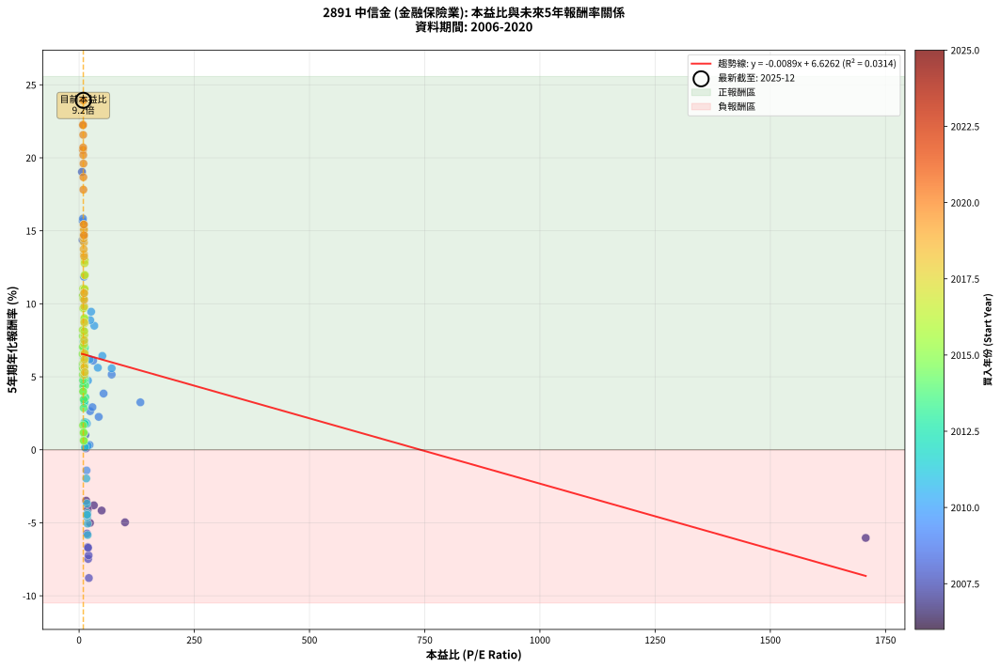
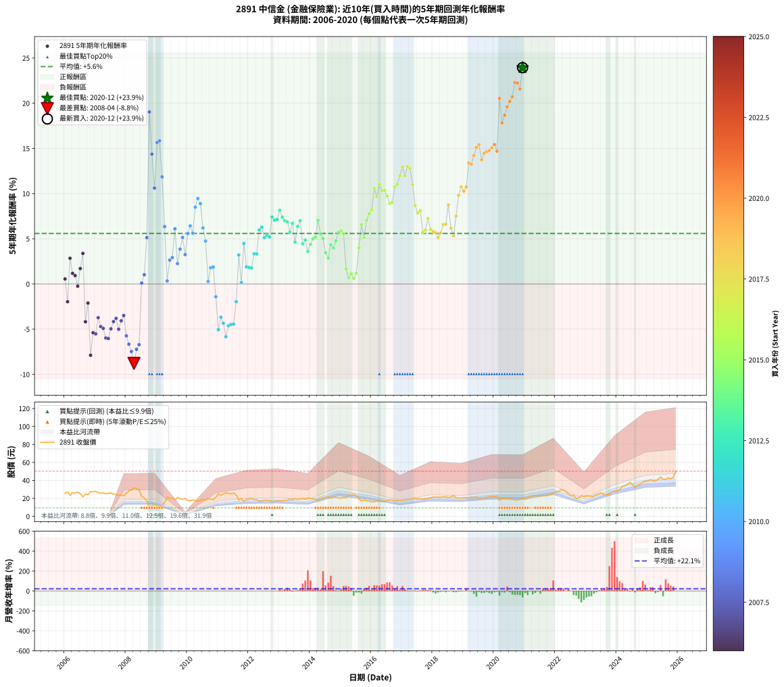

# 2891 中信金 - 本益比與未來報酬率分析

!!! info "報告資訊"
    - **股票代號**: 2891
    - **公司名稱**: 中信金
    - **產業別**: 金融保險業
    - **分析期間**: 2006-2020 (180 個數據點)
    - **資料來源**: Type 12 (ShowMonthlyK_ChartFlow) 月收盤價與本益比
    - **報酬率口徑**: 含現金股利 (簡化: 年度合計，假設每年7/1入帳)
    - **報告生成時間**: 2026-01-11 20:56:11 CST

## 📈 視覺化圖表

### 圖表1: 本益比 vs 未來報酬率關係

*圖表1：2891 中信金 本益比與5年期未來報酬率關係 (2006-2020)*

### 圖表2: 歷年買入時點的5年期實際報酬率

*圖表2：2891 中信金 歷年買入時點的5年期實際報酬率 (2006-2020)*

## 📍 買點訊號說明

本報告提供兩種買點提示訊號（顯示於圖表2的股價子圖中）：

### ▲ 小綠色三角形（回測驗證）
- **計算方式**: 使用全部歷史資料計算本益比第25百分位數
- **用途**: 事後驗證，顯示歷史上哪些時點確實為低估區
- **限制**: 當下無法判斷，僅供回測參考
- **特性**: 後見之明（Look-Ahead Bias）

### ▲ 小橘色三角形（即時訊號）
- **計算方式**: 使用截至當月的過去5年資料計算本益比第25百分位數
- **用途**: 實際投資決策，當時即可判斷
- **優勢**: 可操作性強，符合實務需求
- **特性**: 無後見之明，滾動窗口計算

!!! tip "如何使用兩種訊號"
    - **綠色▲** 幫助理解歷史估值機會，驗證策略有效性
    - **橘色▲** 可作為實際買進參考，但仍需搭配基本面分析
    - 兩種訊號重疊時，表示即時判斷與事後驗證一致，信心度較高
    - 僅有綠色▲時，表示當時無法判斷（需要未來資料才能確認）
    - 僅有橘色▲時，表示即時判斷為買點，但事後可能不是最佳時機

## 📊 估值分析摘要

| 指標 | 數值 |
|:---:|:---:|
| **目前本益比** (2020-12) | **9.16 倍** |
| **歷史平均本益比** | 26.01 倍 |
| **估值水準** | 🟢 相對低估 |
| **預期5年年化報酬率** | **+6.54%** |
| **歷史平均報酬率** | +5.59% |
| **相關係數 (R²)** | 0.0314 |
| **趨勢線斜率** | -0.0089 |

!!! abstract "核心洞察"
    目前本益比顯著低於歷史平均，預期未來報酬率可能較高

    根據歷史數據回測，2891 中信金 在目前本益比 **9.2倍** 的估值水準下，
    預期未來5年年化報酬率約為 **+6.5%**。

    **重要提醒**: 本分析基於歷史數據統計，實際報酬率會受到公司基本面變化、產業趨勢、
    總體經濟環境等多重因素影響。R² = 0.03 表示本益比可解釋約 3.1% 的報酬率變異。

## 📈 歷史估值統計

### 最佳買點 (最高報酬率)

| 項目 | 數值 |
|:---:|:---:|
| 起始時間 | 2020-12 |
| 當時本益比 | 9.16 倍 |
| 起始價格 | 19.7 元 |
| 5年後價格 | 50.2 元 |
| **5年年化報酬率** | **+23.94%** |

### 最差買點 (最低報酬率)

| 項目 | 數值 |
|:---:|:---:|
| 起始時間 | 2008-04 |
| 當時本益比 | 21.21 倍 |
| 起始價格 | 31.8 元 |
| 5年後價格 | 17.9 元 |
| **5年年化報酬率** | **-8.78%** |

## 🎯 投資啟示

### 本益比與報酬率關係

趨勢線方程式: **y = -0.0089x + 6.6262**

!!! note "負相關"
    本益比與未來報酬率呈現負相關。較低的本益比通常帶來較高的未來報酬率，
    但相關性不算非常強。**估值仍是重要參考指標之一**。

### 估值區間建議

基於歷史數據分析:

- **🟢 低估區** (P/E < 20.8): 預期報酬率較高，可考慮增加持股
- **🟡 合理區** (P/E 20.8-31.2): 預期報酬率符合長期趨勢，正常持有
- **🔴 高估區** (P/E > 31.2): 預期報酬率較低，可考慮減碼或觀望

!!! danger "風險提示"
    - 過去表現不代表未來結果
    - 本分析假設公司基本面無重大結構性變化
    - 產業環境劇變可能使歷史規律失效
    - 應結合公司財報、產業趨勢、總體經濟等多重因素綜合判斷

!!! success "長期投資觀點"
    歷史數據顯示，在合理或低估的估值水準買入並長期持有，
    往往能獲得較佳的投資報酬。**耐心等待好價格**是價值投資的核心原則。

## 📊 數據品質

- **資料來源**: GoodInfo.tw Type 12 (ShowMonthlyK_ChartFlow)
- **資料頻率**: 月度收盤價與本益比
- **回測期間**: 2006-2020
- **數據點數量**: 180 個 (每個點代表一次5年期回測)

### 計算方法說明

1. **5年期年化報酬率**:
   - 對每個歷史時點，計算其後5年的實際投資報酬率
   - 期末價值(不含股利): 期末價格
   - 期末價值(含現金股利): 期末價格 + 持有期間內的現金股利合計 (簡化: 年度合計，假設每年7/1入帳)
   - 公式: 年化報酬率 = [(期末價值/期初價格)^(1/年數) - 1] × 100%

2. **本益比 (P/E Ratio)**:
   - 使用當時的月收盤價與EPS計算
   - 資料來源: Type 12 月度河流圖本益比數據

3. **趨勢線 (Linear Regression)**:
   - 使用最小平方法擬合線性趨勢線
   - R²值衡量本益比對報酬率的解釋能力

---

*本報告由 Stock Analysis System v1.9.0 自動生成*
*數據更新時間: 2026-01-11 20:56:11 CST*

## 📋 月度回測明細表

（每一列對應時間線圖中的一個買入點；可用來對照 SVG 圖上的每個點。）

| 買入月份 | 賣出月份 | 回測期限_年 | 實際持有年數 | 買入本益比_倍 | 買入收盤價_元 | 賣出收盤價_元 | 現金股利合計_元 | 總報酬率_pct | 年化報酬率_pct |
| --- | --- | --- | --- | --- | --- | --- | --- | --- | --- |
| 2006-01 | 2011-01 | 5 | 4.999 |  | 25.60 | 24.80 | 1.52 | +2.81 | +0.56 |
| 2006-02 | 2011-02 | 5 | 4.999 |  | 27.30 | 23.20 | 1.52 | -9.45 | -1.97 |
| 2006-03 | 2011-03 | 5 | 4.999 |  | 23.05 | 25.00 | 1.52 | +15.05 | +2.84 |
| 2006-04 | 2011-04 | 5 | 4.999 |  | 26.20 | 26.25 | 1.52 | +5.99 | +1.17 |
| 2006-05 | 2011-05 | 5 | 4.999 |  | 25.80 | 25.50 | 1.52 | +4.73 | +0.93 |
| 2006-06 | 2011-06 | 5 | 4.999 |  | 26.85 | 25.00 | 1.52 | -1.23 | -0.25 |
| 2006-07 | 2011-07 | 5 | 4.999 |  | 25.50 | 26.00 | 1.75 | +8.82 | +1.71 |
| 2006-08 | 2011-08 | 5 | 4.999 |  | 21.55 | 23.70 | 1.75 | +18.10 | +3.38 |
| 2006-09 | 2011-09 | 5 | 4.999 |  | 24.70 | 18.20 | 1.75 | -19.23 | -4.18 |
| 2006-10 | 2011-10 | 5 | 4.999 |  | 24.15 | 19.95 | 1.75 | -10.14 | -2.12 |
| 2006-11 | 2011-11 | 5 | 4.999 |  | 27.60 | 16.55 | 1.75 | -33.70 | -7.89 |
| 2006-12 | 2011-12 | 5 | 4.999 |  | 27.25 | 18.90 | 1.75 | -24.22 | -5.40 |
| 2007-01 | 2012-01 | 5 | 4.999 |  | 27.70 | 19.10 | 1.75 | -24.73 | -5.52 |
| 2007-02 | 2012-02 | 5 | 4.999 |  | 26.30 | 20.00 | 1.75 | -17.30 | -3.73 |
| 2007-03 | 2012-03 | 5 | 5.002 |  | 25.85 | 18.55 | 1.75 | -21.47 | -4.72 |
| 2007-04 | 2012-04 | 5 | 5.002 |  | 26.25 | 18.65 | 1.75 | -22.29 | -4.92 |
| 2007-05 | 2012-05 | 5 | 5.002 |  | 25.05 | 16.65 | 1.75 | -26.55 | -5.98 |
| 2007-06 | 2012-06 | 5 | 5.002 | 1707.00 | 25.60 | 17.00 | 1.75 | -26.76 | -6.04 |
| 2007-07 | 2012-07 | 5 | 5.002 | 99.68 | 26.00 | 18.00 | 2.15 | -22.50 | -4.97 |
| 2007-08 | 2012-08 | 5 | 5.002 | 48.95 | 24.80 | 17.90 | 2.15 | -19.15 | -4.16 |
| 2007-09 | 2012-09 | 5 | 5.002 | 32.03 | 24.10 | 17.70 | 2.15 | -17.63 | -3.80 |
| 2007-10 | 2012-10 | 5 | 5.002 | 23.64 | 23.60 | 16.10 | 2.15 | -22.67 | -5.01 |
| 2007-11 | 2012-11 | 5 | 5.002 | 18.81 | 23.40 | 16.85 | 2.15 | -18.80 | -4.08 |
| 2007-12 | 2012-12 | 5 | 5.002 | 15.47 | 23.05 | 17.15 | 2.15 | -16.27 | -3.49 |
| 2008-01 | 2013-01 | 5 | 5.002 | 17.16 | 25.60 | 16.90 | 2.15 | -25.59 | -5.74 |
| 2008-02 | 2013-03 | 5 | 5.081 | 18.92 | 28.25 | 17.75 | 2.15 | -29.56 | -6.66 |
| 2008-03 | 2013-03 | 5 | 4.999 | 19.63 | 29.35 | 17.75 | 2.15 | -32.20 | -7.48 |
| 2008-04 | 2013-04 | 5 | 4.999 | 21.21 | 31.75 | 17.90 | 2.15 | -36.85 | -8.78 |
| 2008-05 | 2013-05 | 5 | 4.999 | 20.69 | 31.00 | 19.15 | 2.15 | -31.29 | -7.23 |
| 2008-06 | 2013-06 | 5 | 4.999 | 19.53 | 29.30 | 18.55 | 2.15 | -29.35 | -6.71 |
| 2008-07 | 2013-07 | 5 | 4.999 | 14.88 | 22.35 | 19.80 | 2.66 | +0.49 | +0.10 |
| 2008-08 | 2013-08 | 5 | 4.999 | 13.60 | 20.45 | 18.85 | 2.66 | +5.18 | +1.02 |
| 2008-09 | 2013-09 | 5 | 4.999 | 11.36 | 17.10 | 19.30 | 2.66 | +28.42 | +5.13 |
| 2008-10 | 2013-10 | 5 | 4.999 | 6.27 | 9.44 | 19.90 | 2.66 | +138.98 | +19.04 |
| 2008-11 | 2013-11 | 5 | 4.999 | 7.46 | 11.25 | 19.35 | 2.66 | +95.64 | +14.37 |
| 2008-12 | 2013-12 | 5 | 4.999 | 9.21 | 13.90 | 20.35 | 2.66 | +65.54 | +10.61 |
| 2009-01 | 2014-01 | 5 | 4.999 | 7.84 | 10.95 | 20.00 | 2.66 | +106.94 | +15.66 |
| 2009-02 | 2014-02 | 5 | 4.999 | 8.30 | 10.65 | 19.55 | 2.66 | +108.54 | +15.84 |
| 2009-03 | 2014-03 | 5 | 4.999 | 10.60 | 12.40 | 19.05 | 2.66 | +75.08 | +11.85 |
| 2009-04 | 2014-04 | 5 | 4.999 | 14.34 | 15.15 | 17.95 | 2.66 | +36.04 | +6.35 |
| 2009-05 | 2014-05 | 5 | 4.999 | 22.69 | 21.40 | 19.10 | 2.66 | +1.68 | +0.33 |
| 2009-06 | 2014-06 | 5 | 4.999 | 23.86 | 19.80 | 19.90 | 2.66 | +13.94 | +2.64 |
| 2009-07 | 2014-07 | 5 | 4.999 | 28.95 | 20.75 | 21.10 | 2.86 | +15.47 | +2.92 |
| 2009-08 | 2014-08 | 5 | 4.999 | 30.33 | 18.30 | 21.75 | 2.86 | +34.48 | +6.10 |
| 2009-09 | 2014-09 | 5 | 4.999 | 42.55 | 20.85 | 20.45 | 2.86 | +11.80 | +2.26 |
| 2009-10 | 2014-10 | 5 | 4.999 | 53.10 | 20.00 | 21.30 | 2.86 | +20.80 | +3.85 |
| 2009-11 | 2014-11 | 5 | 4.999 | 70.63 | 18.60 | 21.05 | 2.86 | +28.55 | +5.15 |
| 2009-12 | 2014-12 | 5 | 4.999 | 133.00 | 19.95 | 20.55 | 2.86 | +17.34 | +3.25 |
| 2010-01 | 2015-01 | 5 | 4.999 | 70.71 | 17.50 | 20.10 | 2.86 | +31.20 | +5.58 |
| 2010-02 | 2015-02 | 5 | 4.999 | 50.43 | 17.40 | 20.90 | 2.86 | +36.55 | +6.43 |
| 2010-03 | 2015-03 | 5 | 4.999 | 40.68 | 18.00 | 20.80 | 2.86 | +31.44 | +5.62 |
| 2010-04 | 2015-04 | 5 | 4.999 | 32.96 | 17.80 | 23.90 | 2.86 | +50.34 | +8.50 |
| 2010-05 | 2015-05 | 5 | 4.999 | 26.12 | 16.65 | 23.30 | 2.86 | +57.12 | +9.46 |
| 2010-06 | 2015-06 | 5 | 4.999 | 24.15 | 17.75 | 24.30 | 2.86 | +53.01 | +8.88 |
| 2010-07 | 2015-07 | 5 | 4.999 | 23.06 | 19.20 | 22.90 | 3.03 | +35.05 | +6.19 |
| 2010-08 | 2015-08 | 5 | 4.999 | 19.30 | 17.95 | 19.60 | 3.03 | +26.07 | +4.74 |
| 2010-09 | 2015-09 | 5 | 4.999 | 19.17 | 19.70 | 16.95 | 3.03 | +1.42 | +0.28 |
| 2010-10 | 2015-10 | 5 | 4.999 | 16.98 | 19.10 | 17.85 | 3.03 | +9.32 | +1.80 |
| 2010-11 | 2015-11 | 5 | 4.999 | 15.01 | 18.35 | 17.10 | 3.03 | +9.70 | +1.87 |
| 2010-12 | 2015-12 | 5 | 4.999 | 16.21 | 21.40 | 16.90 | 3.03 | -6.87 | -1.41 |
| 2011-01 | 2016-01 | 5 | 4.999 | 18.45 | 24.80 | 16.10 | 3.03 | -22.86 | -5.06 |
| 2011-02 | 2016-02 | 5 | 4.999 | 16.95 | 23.20 | 16.20 | 3.03 | -17.11 | -3.68 |
| 2011-03 | 2016-03 | 5 | 5.002 | 17.95 | 25.00 | 17.00 | 3.03 | -19.88 | -4.33 |
| 2011-04 | 2016-04 | 5 | 5.002 | 18.53 | 26.25 | 16.40 | 3.03 | -25.98 | -5.84 |
| 2011-05 | 2016-05 | 5 | 5.002 | 17.70 | 25.50 | 17.10 | 3.03 | -21.06 | -4.62 |
| 2011-06 | 2016-06 | 5 | 5.002 | 17.06 | 25.00 | 16.85 | 3.03 | -20.48 | -4.48 |
| 2011-07 | 2016-07 | 5 | 5.002 | 17.46 | 26.00 | 17.60 | 3.11 | -20.35 | -4.45 |
| 2011-08 | 2016-08 | 5 | 5.002 | 15.66 | 23.70 | 18.35 | 3.11 | -9.45 | -1.97 |
| 2011-09 | 2016-09 | 5 | 5.002 | 11.84 | 18.20 | 18.20 | 3.11 | +17.09 | +3.20 |
| 2011-10 | 2016-10 | 5 | 5.002 | 12.77 | 19.95 | 17.00 | 3.11 | +0.80 | +0.16 |
| 2011-11 | 2016-11 | 5 | 5.002 | 10.44 | 16.55 | 17.50 | 3.11 | +24.53 | +4.48 |
| 2011-12 | 2016-12 | 5 | 5.002 | 11.74 | 18.90 | 17.65 | 3.11 | +9.84 | +1.89 |
| 2012-01 | 2017-01 | 5 | 5.002 | 11.83 | 19.10 | 17.80 | 3.11 | +9.48 | +1.83 |
| 2012-02 | 2017-03 | 5 | 5.081 | 12.36 | 20.00 | 18.75 | 3.11 | +9.30 | +1.77 |
| 2012-03 | 2017-03 | 5 | 4.999 | 11.44 | 18.55 | 18.75 | 3.11 | +17.84 | +3.34 |
| 2012-04 | 2017-04 | 5 | 4.999 | 11.47 | 18.65 | 18.85 | 3.11 | +17.75 | +3.32 |
| 2012-05 | 2017-05 | 5 | 4.999 | 10.21 | 16.65 | 19.15 | 3.11 | +33.69 | +5.98 |
| 2012-06 | 2017-06 | 5 | 4.999 | 10.40 | 17.00 | 19.95 | 3.11 | +35.65 | +6.29 |
| 2012-07 | 2017-07 | 5 | 4.999 | 10.99 | 18.00 | 19.40 | 3.71 | +28.39 | +5.13 |
| 2012-08 | 2017-08 | 5 | 4.999 | 10.90 | 17.90 | 19.55 | 3.71 | +29.94 | +5.38 |
| 2012-09 | 2017-09 | 5 | 4.999 | 10.75 | 17.70 | 19.10 | 3.71 | +28.87 | +5.20 |
| 2012-10 | 2017-10 | 5 | 4.999 | 9.75 | 16.10 | 19.30 | 3.71 | +42.92 | +7.40 |
| 2012-11 | 2017-11 | 5 | 4.999 | 10.18 | 16.85 | 20.00 | 3.71 | +40.71 | +7.07 |
| 2012-12 | 2017-12 | 5 | 4.999 | 10.34 | 17.15 | 20.50 | 3.71 | +41.17 | +7.14 |
| 2013-01 | 2018-01 | 5 | 4.999 | 10.27 | 16.90 | 21.30 | 3.71 | +47.99 | +8.16 |
| 2013-02 | 2018-02 | 5 | 4.999 | 10.75 | 17.55 | 21.35 | 3.71 | +42.79 | +7.39 |
| 2013-03 | 2018-03 | 5 | 4.999 | 10.96 | 17.75 | 21.20 | 3.71 | +40.34 | +7.01 |
| 2013-04 | 2018-04 | 5 | 4.999 | 11.15 | 17.90 | 21.25 | 3.71 | +39.44 | +6.88 |
| 2013-05 | 2018-05 | 5 | 4.999 | 12.03 | 19.15 | 21.60 | 3.71 | +32.17 | +5.74 |
| 2013-06 | 2018-06 | 5 | 4.999 | 11.75 | 18.55 | 21.95 | 3.71 | +38.33 | +6.71 |
| 2013-07 | 2018-07 | 5 | 4.999 | 12.64 | 19.80 | 20.75 | 4.08 | +25.40 | +4.63 |
| 2013-08 | 2018-08 | 5 | 4.999 | 12.14 | 18.85 | 21.60 | 4.08 | +36.23 | +6.38 |
| 2013-09 | 2018-09 | 5 | 4.999 | 12.54 | 19.30 | 23.00 | 4.08 | +40.31 | +7.01 |
| 2013-10 | 2018-10 | 5 | 4.999 | 13.04 | 19.90 | 20.65 | 4.08 | +24.27 | +4.44 |
| 2013-11 | 2018-11 | 5 | 4.999 | 12.79 | 19.35 | 20.45 | 4.08 | +26.77 | +4.86 |
| 2013-12 | 2018-12 | 5 | 4.999 | 13.57 | 20.35 | 20.20 | 4.08 | +19.31 | +3.60 |
| 2014-01 | 2019-01 | 5 | 4.999 | 12.58 | 20.00 | 20.70 | 4.08 | +23.90 | +4.38 |
| 2014-02 | 2019-02 | 5 | 4.999 | 11.64 | 19.55 | 20.85 | 4.08 | +27.52 | +4.98 |
| 2014-03 | 2019-03 | 5 | 4.999 | 10.76 | 19.05 | 20.45 | 4.08 | +28.77 | +5.19 |
| 2014-04 | 2019-04 | 5 | 4.999 | 9.65 | 17.95 | 21.15 | 4.08 | +40.56 | +7.05 |
| 2014-05 | 2019-05 | 5 | 4.999 | 9.79 | 19.10 | 20.95 | 4.08 | +31.05 | +5.56 |
| 2014-06 | 2019-06 | 5 | 4.999 | 9.75 | 19.90 | 21.35 | 4.08 | +27.79 | +5.03 |
| 2014-07 | 2019-07 | 5 | 4.999 | 9.91 | 21.10 | 20.30 | 4.70 | +18.48 | +3.45 |
| 2014-08 | 2019-08 | 5 | 4.999 | 9.80 | 21.75 | 20.35 | 4.70 | +15.17 | +2.87 |
| 2014-09 | 2019-09 | 5 | 4.999 | 8.85 | 20.45 | 20.60 | 4.70 | +23.72 | +4.35 |
| 2014-10 | 2019-10 | 5 | 4.999 | 8.88 | 21.30 | 21.20 | 4.70 | +21.60 | +3.99 |
| 2014-11 | 2019-11 | 5 | 4.999 | 8.45 | 21.05 | 21.85 | 4.70 | +26.13 | +4.75 |
| 2014-12 | 2019-12 | 5 | 4.999 | 7.97 | 20.55 | 22.40 | 4.70 | +31.87 | +5.69 |
| 2015-01 | 2020-01 | 5 | 4.999 | 7.91 | 20.10 | 22.05 | 4.70 | +33.08 | +5.88 |
| 2015-02 | 2020-02 | 5 | 4.999 | 8.36 | 20.90 | 22.70 | 4.70 | +31.10 | +5.57 |
| 2015-03 | 2020-03 | 5 | 5.002 | 8.46 | 20.80 | 17.90 | 4.70 | +8.65 | +1.67 |
| 2015-04 | 2020-04 | 5 | 5.002 | 9.88 | 23.90 | 20.00 | 4.70 | +3.35 | +0.66 |
| 2015-05 | 2020-05 | 5 | 5.002 | 9.79 | 23.30 | 19.95 | 4.70 | +5.79 | +1.13 |
| 2015-06 | 2020-06 | 5 | 5.002 | 10.38 | 24.30 | 20.35 | 4.70 | +3.09 | +0.61 |
| 2015-07 | 2020-07 | 5 | 5.002 | 9.96 | 22.90 | 19.40 | 4.89 | +6.07 | +1.19 |
| 2015-08 | 2020-08 | 5 | 5.002 | 8.67 | 19.60 | 18.95 | 4.89 | +21.63 | +3.99 |
| 2015-09 | 2020-09 | 5 | 5.002 | 7.64 | 16.95 | 18.40 | 4.89 | +37.40 | +6.56 |
| 2015-10 | 2020-10 | 5 | 5.002 | 8.19 | 17.85 | 18.05 | 4.89 | +28.52 | +5.14 |
| 2015-11 | 2020-11 | 5 | 5.002 | 7.99 | 17.10 | 19.15 | 4.89 | +40.58 | +7.05 |
| 2015-12 | 2020-12 | 5 | 5.002 | 8.05 | 16.90 | 19.70 | 4.89 | +45.50 | +7.79 |
| 2016-01 | 2021-01 | 5 | 5.002 | 7.88 | 16.10 | 19.00 | 4.89 | +48.39 | +8.21 |
| 2016-02 | 2021-03 | 5 | 5.081 | 8.15 | 16.20 | 22.10 | 4.89 | +66.60 | +10.57 |
| 2016-03 | 2021-03 | 5 | 4.999 | 8.80 | 17.00 | 22.10 | 4.89 | +58.76 | +9.69 |
| 2016-04 | 2021-04 | 5 | 4.999 | 8.74 | 16.40 | 22.80 | 4.89 | +68.84 | +11.05 |
| 2016-05 | 2021-05 | 5 | 4.999 | 9.39 | 17.10 | 23.05 | 4.89 | +63.39 | +10.32 |
| 2016-06 | 2021-06 | 5 | 4.999 | 9.55 | 16.85 | 22.70 | 4.89 | +63.74 | +10.37 |
| 2016-07 | 2021-07 | 5 | 4.999 | 10.30 | 17.60 | 22.85 | 5.13 | +58.98 | +9.72 |
| 2016-08 | 2021-08 | 5 | 4.999 | 11.10 | 18.35 | 23.00 | 5.13 | +53.30 | +8.92 |
| 2016-09 | 2021-09 | 5 | 4.999 | 11.39 | 18.20 | 22.90 | 5.13 | +54.01 | +9.02 |
| 2016-10 | 2021-10 | 5 | 4.999 | 11.03 | 17.00 | 23.20 | 5.13 | +66.65 | +10.76 |
| 2016-11 | 2021-11 | 5 | 4.999 | 11.78 | 17.50 | 24.40 | 5.13 | +68.74 | +11.03 |
| 2016-12 | 2021-12 | 5 | 4.999 | 12.34 | 17.65 | 25.95 | 5.13 | +76.09 | +11.98 |
| 2017-01 | 2022-01 | 5 | 4.999 | 12.11 | 17.80 | 27.60 | 5.13 | +83.88 | +12.96 |
| 2017-02 | 2022-02 | 5 | 4.999 | 12.15 | 18.35 | 27.15 | 5.13 | +75.91 | +11.96 |
| 2017-03 | 2022-03 | 5 | 4.999 | 12.10 | 18.75 | 29.40 | 5.13 | +84.16 | +12.99 |
| 2017-04 | 2022-04 | 5 | 4.999 | 11.86 | 18.85 | 29.25 | 5.13 | +82.39 | +12.77 |
| 2017-05 | 2022-05 | 5 | 4.999 | 11.75 | 19.15 | 27.15 | 5.13 | +68.56 | +11.01 |
| 2017-06 | 2022-06 | 5 | 4.999 | 11.95 | 19.95 | 25.10 | 5.13 | +51.53 | +8.67 |
| 2017-07 | 2022-07 | 5 | 4.999 | 11.35 | 19.40 | 22.95 | 5.38 | +46.03 | +7.87 |
| 2017-08 | 2022-08 | 5 | 4.999 | 11.17 | 19.55 | 23.50 | 5.38 | +47.72 | +8.12 |
| 2017-09 | 2022-09 | 5 | 4.999 | 10.67 | 19.10 | 19.85 | 5.38 | +32.09 | +5.73 |
| 2017-10 | 2022-10 | 5 | 4.999 | 10.55 | 19.30 | 20.40 | 5.38 | +33.58 | +5.96 |
| 2017-11 | 2022-11 | 5 | 4.999 | 10.70 | 20.00 | 23.00 | 5.38 | +41.90 | +7.25 |
| 2017-12 | 2022-12 | 5 | 4.999 | 10.73 | 20.50 | 22.10 | 5.38 | +34.05 | +6.04 |
| 2018-01 | 2023-01 | 5 | 4.999 | 11.18 | 21.30 | 22.85 | 5.38 | +32.54 | +5.80 |
| 2018-02 | 2023-02 | 5 | 4.999 | 11.24 | 21.35 | 22.75 | 5.38 | +31.76 | +5.67 |
| 2018-03 | 2023-03 | 5 | 4.999 | 11.19 | 21.20 | 21.85 | 5.38 | +28.44 | +5.13 |
| 2018-04 | 2023-04 | 5 | 4.999 | 11.24 | 21.25 | 22.60 | 5.38 | +31.67 | +5.66 |
| 2018-05 | 2023-05 | 5 | 4.999 | 11.46 | 21.60 | 24.30 | 5.38 | +37.41 | +6.56 |
| 2018-06 | 2023-06 | 5 | 4.999 | 11.68 | 21.95 | 24.85 | 5.38 | +37.72 | +6.61 |
| 2018-07 | 2023-07 | 5 | 4.999 | 11.07 | 20.75 | 26.25 | 5.30 | +52.05 | +8.74 |
| 2018-08 | 2023-08 | 5 | 4.999 | 11.55 | 21.60 | 23.85 | 5.30 | +34.95 | +6.18 |
| 2018-09 | 2023-09 | 5 | 4.999 | 12.33 | 23.00 | 24.50 | 5.30 | +29.57 | +5.32 |
| 2018-10 | 2023-10 | 5 | 4.999 | 11.10 | 20.65 | 24.35 | 5.30 | +43.58 | +7.50 |
| 2018-11 | 2023-11 | 5 | 4.999 | 11.02 | 20.45 | 27.35 | 5.30 | +59.66 | +9.81 |
| 2018-12 | 2023-12 | 5 | 4.999 | 10.92 | 20.20 | 28.35 | 5.30 | +66.58 | +10.75 |
| 2019-01 | 2024-01 | 5 | 4.999 | 11.04 | 20.70 | 28.45 | 5.30 | +63.04 | +10.27 |
| 2019-02 | 2024-02 | 5 | 4.999 | 10.96 | 20.85 | 29.40 | 5.30 | +66.43 | +10.73 |
| 2019-03 | 2024-03 | 5 | 5.002 | 10.61 | 20.45 | 33.05 | 5.30 | +87.53 | +13.39 |
| 2019-04 | 2024-04 | 5 | 5.002 | 10.83 | 21.15 | 34.10 | 5.30 | +86.29 | +13.24 |
| 2019-05 | 2024-05 | 5 | 5.002 | 10.59 | 20.95 | 35.40 | 5.30 | +94.27 | +14.20 |
| 2019-06 | 2024-06 | 5 | 5.002 | 10.65 | 21.35 | 37.85 | 5.30 | +102.11 | +15.10 |
| 2019-07 | 2024-07 | 5 | 5.002 | 10.00 | 20.30 | 35.50 | 6.10 | +104.93 | +15.42 |
| 2019-08 | 2024-08 | 5 | 5.002 | 9.89 | 20.35 | 32.65 | 6.10 | +90.42 | +13.74 |
| 2019-09 | 2024-09 | 5 | 5.002 | 9.89 | 20.60 | 34.40 | 6.10 | +96.60 | +14.47 |
| 2019-10 | 2024-10 | 5 | 5.002 | 10.06 | 21.20 | 35.90 | 6.10 | +98.11 | +14.65 |
| 2019-11 | 2024-11 | 5 | 5.002 | 10.24 | 21.85 | 37.40 | 6.10 | +99.08 | +14.76 |
| 2019-12 | 2024-12 | 5 | 5.002 | 10.37 | 22.40 | 39.10 | 6.10 | +101.79 | +15.07 |
| 2020-01 | 2025-01 | 5 | 5.002 | 10.21 | 22.05 | 39.10 | 6.10 | +104.99 | +15.43 |
| 2020-02 | 2025-03 | 5 | 5.081 | 10.52 | 22.70 | 39.45 | 6.10 | +100.66 | +14.69 |
| 2020-03 | 2025-03 | 5 | 4.999 | 8.30 | 17.90 | 39.45 | 6.10 | +154.47 | +20.54 |
| 2020-04 | 2025-04 | 5 | 4.999 | 9.27 | 20.00 | 39.30 | 6.10 | +127.00 | +17.82 |
| 2020-05 | 2025-05 | 5 | 4.999 | 9.25 | 19.95 | 40.85 | 6.10 | +135.34 | +18.67 |
| 2020-06 | 2025-06 | 5 | 4.999 | 9.44 | 20.35 | 43.70 | 6.10 | +144.72 | +19.60 |
| 2020-07 | 2025-07 | 5 | 4.999 | 9.01 | 19.40 | 41.25 | 7.40 | +150.77 | +20.19 |
| 2020-08 | 2025-08 | 5 | 4.999 | 8.80 | 18.95 | 41.15 | 7.40 | +156.20 | +20.71 |
| 2020-09 | 2025-09 | 5 | 4.999 | 8.55 | 18.40 | 42.90 | 7.40 | +173.37 | +22.28 |
| 2020-10 | 2025-10 | 5 | 4.999 | 8.39 | 18.05 | 41.85 | 7.40 | +172.85 | +22.24 |
| 2020-11 | 2025-11 | 5 | 4.999 | 8.90 | 19.15 | 43.45 | 7.40 | +165.54 | +21.57 |
| 2020-12 | 2025-12 | 5 | 4.999 | 9.16 | 19.70 | 50.20 | 7.40 | +192.39 | +23.94 |
