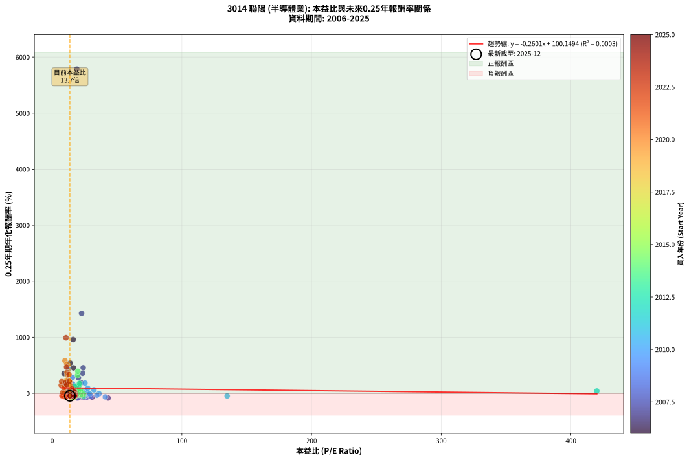
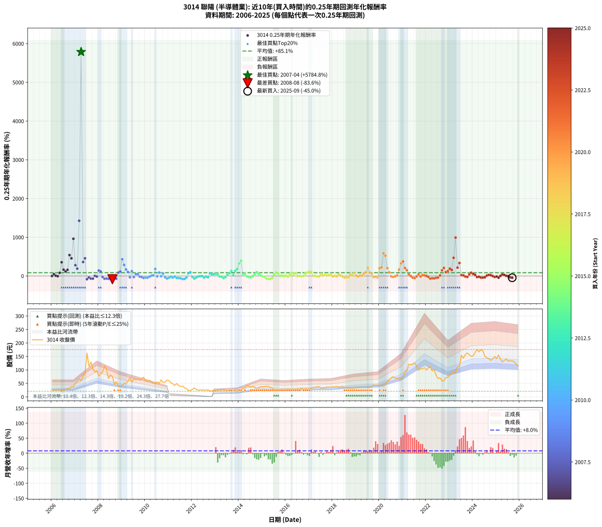

# 3014 聯陽 - 本益比與未來報酬率分析

!!! info "報告資訊"
    - **股票代號**: 3014
    - **公司名稱**: 聯陽
    - **產業別**: 半導體業
    - **分析期間**: 2006-2025 (237 個數據點)
    - **資料來源**: Type 12 (ShowMonthlyK_ChartFlow) 月收盤價與本益比
    - **報酬率口徑**: 含現金股利 (簡化: 年度合計，假設每年7/1入帳)
    - **報告生成時間**: 2026-01-11 20:56:29 CST

## 📈 視覺化圖表

### 圖表1: 本益比 vs 未來報酬率關係

*圖表1：3014 聯陽 本益比與0.25年期未來報酬率關係 (2006-2025)*

### 圖表2: 歷年買入時點的0.25年期實際報酬率

*圖表2：3014 聯陽 歷年買入時點的0.25年期實際報酬率 (2006-2025)*

## 📍 買點訊號說明

本報告提供兩種買點提示訊號（顯示於圖表2的股價子圖中）：

### ▲ 小綠色三角形（回測驗證）
- **計算方式**: 使用全部歷史資料計算本益比第25百分位數
- **用途**: 事後驗證，顯示歷史上哪些時點確實為低估區
- **限制**: 當下無法判斷，僅供回測參考
- **特性**: 後見之明（Look-Ahead Bias）

### ▲ 小橘色三角形（即時訊號）
- **計算方式**: 使用截至當月的過去5年資料計算本益比第25百分位數
- **用途**: 實際投資決策，當時即可判斷
- **優勢**: 可操作性強，符合實務需求
- **特性**: 無後見之明，滾動窗口計算

!!! tip "如何使用兩種訊號"
    - **綠色▲** 幫助理解歷史估值機會，驗證策略有效性
    - **橘色▲** 可作為實際買進參考，但仍需搭配基本面分析
    - 兩種訊號重疊時，表示即時判斷與事後驗證一致，信心度較高
    - 僅有綠色▲時，表示當時無法判斷（需要未來資料才能確認）
    - 僅有橘色▲時，表示即時判斷為買點，但事後可能不是最佳時機

## 📊 估值分析摘要

| 指標 | 數值 |
|:---:|:---:|
| **目前本益比** (2025-09) | **13.65 倍** |
| **歷史平均本益比** | 18.50 倍 |
| **估值水準** | 🟢 相對低估 |
| **預期0.25年年化報酬率** | **+96.60%** |
| **歷史平均報酬率** | +85.06% |
| **相關係數 (R²)** | 0.0003 |
| **趨勢線斜率** | -0.2601 |

!!! abstract "核心洞察"
    目前本益比顯著低於歷史平均，預期未來報酬率可能較高

    根據歷史數據回測，3014 聯陽 在目前本益比 **13.7倍** 的估值水準下，
    預期未來0.25年年化報酬率約為 **+96.6%**。

    **重要提醒**: 本分析基於歷史數據統計，實際報酬率會受到公司基本面變化、產業趨勢、
    總體經濟環境等多重因素影響。R² = 0.00 表示本益比可解釋約 0.0% 的報酬率變異。

## 📈 歷史估值統計

### 最佳買點 (最高報酬率)

| 項目 | 數值 |
|:---:|:---:|
| 起始時間 | 2007-04 |
| 當時本益比 | 19.02 倍 |
| 起始價格 | 59.6 元 |
| 0.25年後價格 | 162.5 元 |
| **0.25年年化報酬率** | **+5784.85%** |

### 最差買點 (最低報酬率)

| 項目 | 數值 |
|:---:|:---:|
| 起始時間 | 2008-08 |
| 當時本益比 | 19.43 倍 |
| 起始價格 | 75.0 元 |
| 0.25年後價格 | 41.0 元 |
| **0.25年年化報酬率** | **-83.60%** |

## 🎯 投資啟示

### 本益比與報酬率關係

趨勢線方程式: **y = -0.2601x + 100.1494**

!!! note "負相關"
    本益比與未來報酬率呈現負相關。較低的本益比通常帶來較高的未來報酬率，
    但相關性不算非常強。**估值仍是重要參考指標之一**。

### 估值區間建議

基於歷史數據分析:

- **🟢 低估區** (P/E < 14.8): 預期報酬率較高，可考慮增加持股
- **🟡 合理區** (P/E 14.8-22.2): 預期報酬率符合長期趨勢，正常持有
- **🔴 高估區** (P/E > 22.2): 預期報酬率較低，可考慮減碼或觀望

!!! danger "風險提示"
    - 過去表現不代表未來結果
    - 本分析假設公司基本面無重大結構性變化
    - 產業環境劇變可能使歷史規律失效
    - 應結合公司財報、產業趨勢、總體經濟等多重因素綜合判斷

!!! success "長期投資觀點"
    歷史數據顯示，在合理或低估的估值水準買入並長期持有，
    往往能獲得較佳的投資報酬。**耐心等待好價格**是價值投資的核心原則。

## 📊 數據品質

- **資料來源**: GoodInfo.tw Type 12 (ShowMonthlyK_ChartFlow)
- **資料頻率**: 月度收盤價與本益比
- **回測期間**: 2006-2025
- **數據點數量**: 237 個 (每個點代表一次0.25年期回測)

### 計算方法說明

1. **0.25年期年化報酬率**:
   - 對每個歷史時點，計算其後0.25年的實際投資報酬率
   - 期末價值(不含股利): 期末價格
   - 期末價值(含現金股利): 期末價格 + 持有期間內的現金股利合計 (簡化: 年度合計，假設每年7/1入帳)
   - 公式: 年化報酬率 = [(期末價值/期初價格)^(1/年數) - 1] × 100%

2. **本益比 (P/E Ratio)**:
   - 使用當時的月收盤價與EPS計算
   - 資料來源: Type 12 月度河流圖本益比數據

3. **趨勢線 (Linear Regression)**:
   - 使用最小平方法擬合線性趨勢線
   - R²值衡量本益比對報酬率的解釋能力

---

*本報告由 Stock Analysis System v1.9.0 自動生成*
*數據更新時間: 2026-01-11 20:56:29 CST*

## 📋 月度回測明細表

（每一列對應時間線圖中的一個買入點；可用來對照 SVG 圖上的每個點。）

| 買入月份 | 賣出月份 | 回測期限_年 | 實際持有年數 | 買入本益比_倍 | 買入收盤價_元 | 賣出收盤價_元 | 現金股利合計_元 | 總報酬率_pct | 年化報酬率_pct |
| --- | --- | --- | --- | --- | --- | --- | --- | --- | --- |
| 2006-01 | 2006-05 | 0.25 | 0.329 | 11.40 | 26.10 | 26.05 | 0.00 | -0.19 | -0.58 |
| 2006-02 | 2006-05 | 0.25 | 0.246 | 10.35 | 23.70 | 26.05 | 0.00 | +9.92 | +46.77 |
| 2006-03 | 2006-07 | 0.25 | 0.334 | 11.31 | 25.90 | 24.85 | 1.69 | +2.46 | +7.55 |
| 2006-04 | 2006-07 | 0.25 | 0.249 | 11.75 | 26.90 | 24.85 | 1.69 | -1.35 | -5.31 |
| 2006-05 | 2006-08 | 0.25 | 0.252 | 11.38 | 26.05 | 28.60 | 1.69 | +16.26 | +81.90 |
| 2006-06 | 2006-09 | 0.25 | 0.252 | 9.21 | 21.10 | 29.20 | 1.69 | +46.38 | +353.97 |
| 2006-07 | 2006-10 | 0.25 | 0.252 | 10.85 | 24.85 | 31.70 | 0.00 | +27.57 | +162.89 |
| 2006-08 | 2006-12 | 0.25 | 0.334 | 12.49 | 28.60 | 37.00 | 0.00 | +29.37 | +116.18 |
| 2006-09 | 2006-12 | 0.25 | 0.249 | 12.75 | 29.20 | 37.00 | 0.00 | +26.71 | +158.64 |
| 2006-10 | 2007-01 | 0.25 | 0.252 | 13.84 | 31.70 | 50.60 | 0.00 | +59.62 | +540.17 |
| 2006-11 | 2007-03 | 0.25 | 0.329 | 16.46 | 37.70 | 66.20 | 0.00 | +75.60 | +454.94 |
| 2006-12 | 2007-03 | 0.25 | 0.246 | 16.16 | 37.00 | 66.20 | 0.00 | +78.92 | +960.14 |
| 2007-01 | 2007-05 | 0.25 | 0.329 | 20.23 | 50.60 | 78.30 | 0.00 | +54.74 | +277.68 |
| 2007-02 | 2007-05 | 0.25 | 0.246 | 22.24 | 60.30 | 78.30 | 0.00 | +29.85 | +188.67 |
| 2007-03 | 2007-07 | 0.25 | 0.334 | 22.65 | 66.20 | 162.50 | 2.00 | +148.49 | +1425.79 |
| 2007-04 | 2007-07 | 0.25 | 0.249 | 19.02 | 59.60 | 162.50 | 2.00 | +176.01 | +5784.85 |
| 2007-05 | 2007-08 | 0.25 | 0.252 | 23.41 | 78.30 | 113.00 | 2.00 | +46.87 | +360.00 |
| 2007-06 | 2007-09 | 0.25 | 0.252 | 23.91 | 85.00 | 129.00 | 2.00 | +54.12 | +456.92 |
| 2007-07 | 2007-10 | 0.25 | 0.252 | 43.15 | 162.50 | 103.50 | 0.00 | -36.31 | -83.32 |
| 2007-08 | 2007-12 | 0.25 | 0.334 | 28.42 | 113.00 | 97.00 | 0.00 | -14.16 | -36.69 |
| 2007-09 | 2007-12 | 0.25 | 0.249 | 30.81 | 129.00 | 97.00 | 0.00 | -24.81 | -68.16 |
| 2007-10 | 2008-01 | 0.25 | 0.252 | 23.53 | 103.50 | 77.00 | 0.00 | -25.60 | -69.09 |
| 2007-11 | 2008-03 | 0.25 | 0.331 | 20.00 | 92.20 | 93.20 | 0.00 | +1.08 | +3.31 |
| 2007-12 | 2008-03 | 0.25 | 0.249 | 20.12 | 97.00 | 93.20 | 0.00 | -3.92 | -14.82 |
| 2008-01 | 2008-05 | 0.25 | 0.331 | 16.38 | 77.00 | 103.00 | 0.00 | +33.77 | +140.65 |
| 2008-02 | 2008-05 | 0.25 | 0.249 | 18.56 | 85.00 | 103.00 | 0.00 | +21.18 | +116.18 |
| 2008-03 | 2008-07 | 0.25 | 0.334 | 20.90 | 93.20 | 80.90 | 2.99 | -9.99 | -27.03 |
| 2008-04 | 2008-07 | 0.25 | 0.249 | 26.50 | 115.00 | 80.90 | 2.99 | -27.05 | -71.81 |
| 2008-05 | 2008-08 | 0.25 | 0.252 | 24.41 | 103.00 | 75.00 | 2.99 | -24.28 | -66.86 |
| 2008-06 | 2008-09 | 0.25 | 0.252 | 16.63 | 68.20 | 46.50 | 2.99 | -27.44 | -72.01 |
| 2008-07 | 2008-10 | 0.25 | 0.252 | 20.33 | 80.90 | 56.00 | 0.00 | -30.78 | -76.79 |
| 2008-08 | 2008-12 | 0.25 | 0.334 | 19.43 | 75.00 | 41.00 | 0.00 | -45.33 | -83.60 |
| 2008-09 | 2008-12 | 0.25 | 0.249 | 12.43 | 46.50 | 41.00 | 0.00 | -11.83 | -39.66 |
| 2008-10 | 2009-01 | 0.25 | 0.252 | 15.47 | 56.00 | 41.00 | 0.00 | -26.79 | -71.00 |
| 2008-11 | 2009-03 | 0.25 | 0.329 | 11.51 | 40.30 | 49.50 | 0.00 | +22.83 | +86.99 |
| 2008-12 | 2009-03 | 0.25 | 0.246 | 12.13 | 41.00 | 49.50 | 0.00 | +20.73 | +114.81 |
| 2009-01 | 2009-05 | 0.25 | 0.329 | 12.42 | 41.00 | 71.00 | 0.00 | +73.17 | +431.93 |
| 2009-02 | 2009-05 | 0.25 | 0.246 | 15.79 | 50.90 | 71.00 | 0.00 | +39.49 | +286.01 |
| 2009-03 | 2009-07 | 0.25 | 0.334 | 15.74 | 49.50 | 67.70 | 1.00 | +38.79 | +166.80 |
| 2009-04 | 2009-07 | 0.25 | 0.249 | 18.75 | 57.50 | 67.70 | 1.00 | +19.48 | +104.28 |
| 2009-05 | 2009-08 | 0.25 | 0.252 | 23.76 | 71.00 | 63.10 | 1.00 | -9.72 | -33.36 |
| 2009-06 | 2009-09 | 0.25 | 0.252 | 18.80 | 54.70 | 66.10 | 1.00 | +22.67 | +125.05 |
| 2009-07 | 2009-10 | 0.25 | 0.252 | 23.91 | 67.70 | 62.00 | 0.00 | -8.42 | -29.47 |
| 2009-08 | 2009-12 | 0.25 | 0.334 | 22.92 | 63.10 | 72.50 | 0.00 | +14.90 | +51.55 |
| 2009-09 | 2009-12 | 0.25 | 0.249 | 24.71 | 66.10 | 72.50 | 0.00 | +9.68 | +44.91 |
| 2009-10 | 2010-01 | 0.25 | 0.252 | 23.88 | 62.00 | 59.50 | 0.00 | -4.03 | -15.08 |
| 2009-11 | 2010-03 | 0.25 | 0.329 | 26.76 | 67.40 | 61.00 | 0.00 | -9.50 | -26.19 |
| 2009-12 | 2010-03 | 0.25 | 0.246 | 29.71 | 72.50 | 61.00 | 0.00 | -15.86 | -50.39 |
| 2010-01 | 2010-05 | 0.25 | 0.329 | 25.19 | 59.50 | 50.10 | 0.00 | -15.80 | -40.75 |
| 2010-02 | 2010-05 | 0.25 | 0.246 | 25.30 | 57.80 | 50.10 | 0.00 | -13.32 | -44.02 |
| 2010-03 | 2010-07 | 0.25 | 0.334 | 27.63 | 61.00 | 55.00 | 2.00 | -6.56 | -18.38 |
| 2010-04 | 2010-07 | 0.25 | 0.249 | 26.34 | 56.10 | 55.00 | 2.00 | +1.60 | +6.60 |
| 2010-05 | 2010-08 | 0.25 | 0.252 | 24.41 | 50.10 | 50.00 | 2.00 | +3.79 | +15.93 |
| 2010-06 | 2010-09 | 0.25 | 0.252 | 25.32 | 50.00 | 63.00 | 2.00 | +30.00 | +183.38 |
| 2010-07 | 2010-10 | 0.25 | 0.252 | 28.99 | 55.00 | 53.60 | 0.00 | -2.55 | -9.73 |
| 2010-08 | 2010-12 | 0.25 | 0.334 | 27.47 | 50.00 | 61.90 | 0.00 | +23.80 | +89.49 |
| 2010-09 | 2010-12 | 0.25 | 0.249 | 36.15 | 63.00 | 61.90 | 0.00 | -1.75 | -6.83 |
| 2010-10 | 2011-01 | 0.25 | 0.252 | 32.19 | 53.60 | 60.60 | 0.00 | +13.06 | +62.79 |
| 2010-11 | 2011-03 | 0.25 | 0.329 | 34.46 | 54.70 | 48.15 | 0.00 | -11.97 | -32.17 |
| 2010-12 | 2011-03 | 0.25 | 0.246 | 40.99 | 61.90 | 48.15 | 0.00 | -22.21 | -63.92 |
| 2011-01 | 2011-05 | 0.25 | 0.329 | 134.90 | 60.60 | 49.40 | 0.00 | -18.48 | -46.31 |
| 2011-02 | 2011-05 | 0.25 | 0.246 |  | 52.30 | 49.40 | 0.00 | -5.54 | -20.67 |
| 2011-03 | 2011-07 | 0.25 | 0.334 |  | 48.15 | 38.95 | 1.50 | -15.99 | -40.65 |
| 2011-04 | 2011-07 | 0.25 | 0.249 |  | 42.25 | 38.95 | 1.50 | -4.26 | -16.03 |
| 2011-05 | 2011-08 | 0.25 | 0.252 |  | 49.40 | 39.80 | 1.50 | -16.40 | -50.88 |
| 2011-06 | 2011-09 | 0.25 | 0.252 |  | 42.05 | 33.25 | 1.50 | -17.36 | -53.09 |
| 2011-07 | 2011-10 | 0.25 | 0.252 |  | 38.95 | 31.10 | 0.00 | -20.15 | -59.08 |
| 2011-08 | 2011-12 | 0.25 | 0.334 |  | 39.80 | 23.50 | 0.00 | -40.95 | -79.35 |
| 2011-09 | 2011-12 | 0.25 | 0.249 |  | 33.25 | 23.50 | 0.00 | -29.32 | -75.17 |
| 2011-10 | 2012-01 | 0.25 | 0.252 |  | 31.10 | 27.50 | 0.00 | -11.58 | -38.64 |
| 2011-11 | 2012-03 | 0.25 | 0.331 |  | 23.20 | 27.80 | 0.00 | +19.83 | +72.64 |
| 2011-12 | 2012-03 | 0.25 | 0.249 |  | 23.50 | 27.80 | 0.00 | +18.30 | +96.30 |
| 2012-01 | 2012-05 | 0.25 | 0.331 |  | 27.50 | 25.20 | 0.00 | -8.36 | -23.18 |
| 2012-02 | 2012-05 | 0.25 | 0.249 |  | 32.75 | 25.20 | 0.00 | -23.05 | -65.07 |
| 2012-03 | 2012-07 | 0.25 | 0.334 |  | 27.80 | 23.95 | 0.00 | -13.85 | -36.00 |
| 2012-04 | 2012-07 | 0.25 | 0.249 |  | 24.85 | 23.95 | 0.00 | -3.62 | -13.76 |
| 2012-05 | 2012-08 | 0.25 | 0.252 |  | 25.20 | 24.80 | 0.00 | -1.59 | -6.15 |
| 2012-06 | 2012-09 | 0.25 | 0.252 |  | 26.30 | 26.05 | 0.00 | -0.95 | -3.72 |
| 2012-07 | 2012-10 | 0.25 | 0.252 |  | 23.95 | 20.85 | 0.00 | -12.94 | -42.32 |
| 2012-08 | 2012-12 | 0.25 | 0.334 |  | 24.80 | 23.50 | 0.00 | -5.24 | -14.89 |
| 2012-09 | 2012-12 | 0.25 | 0.249 |  | 26.05 | 23.50 | 0.00 | -9.79 | -33.87 |
| 2012-10 | 2013-01 | 0.25 | 0.252 |  | 20.85 | 23.85 | 0.00 | +14.39 | +70.52 |
| 2012-11 | 2013-03 | 0.25 | 0.329 | 420.00 | 23.10 | 25.90 | 0.00 | +12.12 | +41.66 |
| 2012-12 | 2013-03 | 0.25 | 0.246 | 21.76 | 23.50 | 25.90 | 0.00 | +10.21 | +48.39 |
| 2013-01 | 2013-05 | 0.25 | 0.329 | 21.85 | 23.85 | 27.40 | 0.00 | +14.88 | +52.55 |
| 2013-02 | 2013-05 | 0.25 | 0.246 | 22.61 | 24.95 | 27.40 | 0.00 | +9.82 | +46.25 |
| 2013-03 | 2013-07 | 0.25 | 0.334 | 23.23 | 25.90 | 23.35 | 1.20 | -5.20 | -14.77 |
| 2013-04 | 2013-07 | 0.25 | 0.249 | 23.08 | 26.00 | 23.35 | 1.20 | -5.56 | -20.52 |
| 2013-05 | 2013-08 | 0.25 | 0.252 | 24.07 | 27.40 | 21.40 | 1.20 | -17.50 | -53.42 |
| 2013-06 | 2013-09 | 0.25 | 0.252 | 20.96 | 24.10 | 20.80 | 1.20 | -8.70 | -30.32 |
| 2013-07 | 2013-10 | 0.25 | 0.252 | 20.10 | 23.35 | 24.85 | 0.00 | +6.42 | +28.04 |
| 2013-08 | 2013-12 | 0.25 | 0.334 | 18.24 | 21.40 | 25.60 | 0.00 | +19.63 | +71.00 |
| 2013-09 | 2013-12 | 0.25 | 0.249 | 17.55 | 20.80 | 25.60 | 0.00 | +23.08 | +130.12 |
| 2013-10 | 2014-01 | 0.25 | 0.252 | 20.77 | 24.85 | 25.80 | 0.00 | +3.82 | +16.06 |
| 2013-11 | 2014-03 | 0.25 | 0.329 | 20.57 | 24.85 | 32.95 | 0.00 | +32.60 | +136.02 |
| 2013-12 | 2014-03 | 0.25 | 0.246 | 20.98 | 25.60 | 32.95 | 0.00 | +28.71 | +178.52 |
| 2014-01 | 2014-05 | 0.25 | 0.329 | 19.57 | 25.80 | 41.50 | 0.00 | +60.85 | +324.93 |
| 2014-02 | 2014-05 | 0.25 | 0.246 | 19.76 | 28.00 | 41.50 | 0.00 | +48.21 | +393.77 |
| 2014-03 | 2014-07 | 0.25 | 0.334 | 21.75 | 32.95 | 35.65 | 1.19 | +11.81 | +39.69 |
| 2014-04 | 2014-07 | 0.25 | 0.249 | 20.52 | 33.10 | 35.65 | 1.19 | +11.31 | +53.71 |
| 2014-05 | 2014-08 | 0.25 | 0.252 | 24.25 | 41.50 | 38.90 | 1.19 | -3.39 | -12.81 |
| 2014-06 | 2014-09 | 0.25 | 0.252 | 21.82 | 39.50 | 35.10 | 1.19 | -8.12 | -28.56 |
| 2014-07 | 2014-10 | 0.25 | 0.252 | 18.68 | 35.65 | 31.70 | 0.00 | -11.08 | -37.26 |
| 2014-08 | 2014-12 | 0.25 | 0.334 | 19.39 | 38.90 | 38.20 | 0.00 | -1.80 | -5.29 |
| 2014-09 | 2014-12 | 0.25 | 0.249 | 16.67 | 35.10 | 38.20 | 0.00 | +8.83 | +40.45 |
| 2014-10 | 2015-01 | 0.25 | 0.252 | 14.39 | 31.70 | 37.75 | 0.00 | +19.09 | +100.06 |
| 2014-11 | 2015-03 | 0.25 | 0.329 | 14.88 | 34.25 | 39.40 | 0.00 | +15.04 | +53.17 |
| 2014-12 | 2015-03 | 0.25 | 0.246 | 15.92 | 38.20 | 39.40 | 0.00 | +3.14 | +13.37 |
| 2015-01 | 2015-05 | 0.25 | 0.329 | 15.84 | 37.75 | 35.90 | 0.00 | -4.90 | -14.18 |
| 2015-02 | 2015-05 | 0.25 | 0.246 | 16.16 | 38.25 | 35.90 | 0.00 | -6.14 | -22.69 |
| 2015-03 | 2015-07 | 0.25 | 0.334 | 16.77 | 39.40 | 25.25 | 2.00 | -30.84 | -66.84 |
| 2015-04 | 2015-07 | 0.25 | 0.249 | 16.67 | 38.90 | 25.25 | 2.00 | -29.95 | -76.03 |
| 2015-05 | 2015-08 | 0.25 | 0.252 | 15.50 | 35.90 | 23.20 | 2.00 | -29.80 | -75.46 |
| 2015-06 | 2015-09 | 0.25 | 0.252 | 14.39 | 33.10 | 25.40 | 2.00 | -17.22 | -52.77 |
| 2015-07 | 2015-10 | 0.25 | 0.252 | 11.06 | 25.25 | 27.80 | 0.00 | +10.10 | +46.52 |
| 2015-08 | 2015-12 | 0.25 | 0.334 | 10.24 | 23.20 | 28.75 | 0.00 | +23.92 | +90.05 |
| 2015-09 | 2015-12 | 0.25 | 0.249 | 11.29 | 25.40 | 28.75 | 0.00 | +13.19 | +64.42 |
| 2015-10 | 2016-01 | 0.25 | 0.252 | 12.45 | 27.80 | 27.65 | 0.00 | -0.54 | -2.13 |
| 2015-11 | 2016-03 | 0.25 | 0.331 | 12.52 | 27.75 | 28.70 | 0.00 | +3.42 | +10.70 |
| 2015-12 | 2016-03 | 0.25 | 0.249 | 13.07 | 28.75 | 28.70 | 0.00 | -0.17 | -0.70 |
| 2016-01 | 2016-05 | 0.25 | 0.331 | 12.48 | 27.65 | 28.45 | 0.00 | +2.89 | +8.99 |
| 2016-02 | 2016-05 | 0.25 | 0.249 | 13.43 | 29.95 | 28.45 | 0.00 | -5.01 | -18.64 |
| 2016-03 | 2016-07 | 0.25 | 0.334 | 12.78 | 28.70 | 29.70 | 2.00 | +10.45 | +34.67 |
| 2016-04 | 2016-07 | 0.25 | 0.249 | 12.26 | 27.70 | 29.70 | 2.00 | +14.44 | +71.84 |
| 2016-05 | 2016-08 | 0.25 | 0.252 | 12.51 | 28.45 | 29.80 | 2.00 | +11.78 | +55.57 |
| 2016-06 | 2016-09 | 0.25 | 0.252 | 12.64 | 28.95 | 31.00 | 2.00 | +13.99 | +68.18 |
| 2016-07 | 2016-10 | 0.25 | 0.252 | 12.89 | 29.70 | 29.30 | 0.00 | -1.35 | -5.24 |
| 2016-08 | 2016-12 | 0.25 | 0.334 | 12.84 | 29.80 | 30.15 | 0.00 | +1.17 | +3.56 |
| 2016-09 | 2016-12 | 0.25 | 0.249 | 13.28 | 31.00 | 30.15 | 0.00 | -2.74 | -10.56 |
| 2016-10 | 2017-01 | 0.25 | 0.252 | 12.47 | 29.30 | 29.60 | 0.00 | +1.02 | +4.13 |
| 2016-11 | 2017-03 | 0.25 | 0.329 | 12.85 | 30.40 | 35.35 | 0.00 | +16.28 | +58.28 |
| 2016-12 | 2017-03 | 0.25 | 0.246 | 12.67 | 30.15 | 35.35 | 0.00 | +17.25 | +90.74 |
| 2017-01 | 2017-05 | 0.25 | 0.329 | 12.40 | 29.60 | 38.10 | 0.00 | +28.72 | +115.62 |
| 2017-02 | 2017-05 | 0.25 | 0.246 | 13.34 | 31.95 | 38.10 | 0.00 | +19.25 | +104.30 |
| 2017-03 | 2017-07 | 0.25 | 0.334 | 14.71 | 35.35 | 32.70 | 2.94 | +0.81 | +2.43 |
| 2017-04 | 2017-07 | 0.25 | 0.249 | 14.65 | 35.30 | 32.70 | 2.94 | +0.95 | +3.86 |
| 2017-05 | 2017-08 | 0.25 | 0.252 | 15.76 | 38.10 | 33.80 | 2.94 | -3.58 | -13.48 |
| 2017-06 | 2017-09 | 0.25 | 0.252 | 15.51 | 37.60 | 33.55 | 2.94 | -2.97 | -11.26 |
| 2017-07 | 2017-10 | 0.25 | 0.252 | 13.44 | 32.70 | 36.05 | 0.00 | +10.24 | +47.29 |
| 2017-08 | 2017-12 | 0.25 | 0.334 | 13.85 | 33.80 | 35.55 | 0.00 | +5.18 | +16.31 |
| 2017-09 | 2017-12 | 0.25 | 0.249 | 13.71 | 33.55 | 35.55 | 0.00 | +5.96 | +26.16 |
| 2017-10 | 2018-01 | 0.25 | 0.252 | 14.68 | 36.05 | 37.45 | 0.00 | +3.88 | +16.33 |
| 2017-11 | 2018-03 | 0.25 | 0.329 | 14.70 | 36.20 | 38.80 | 0.00 | +7.18 | +23.51 |
| 2017-12 | 2018-03 | 0.25 | 0.246 | 14.39 | 35.55 | 38.80 | 0.00 | +9.14 | +42.62 |
| 2018-01 | 2018-05 | 0.25 | 0.329 | 14.86 | 37.45 | 36.30 | 0.00 | -3.07 | -9.06 |
| 2018-02 | 2018-05 | 0.25 | 0.246 | 13.96 | 35.90 | 36.30 | 0.00 | +1.11 | +4.60 |
| 2018-03 | 2018-07 | 0.25 | 0.334 | 14.80 | 38.80 | 35.15 | 2.50 | -2.96 | -8.61 |
| 2018-04 | 2018-07 | 0.25 | 0.249 | 13.04 | 34.85 | 35.15 | 2.50 | +8.04 | +36.38 |
| 2018-05 | 2018-08 | 0.25 | 0.252 | 13.33 | 36.30 | 35.10 | 2.50 | +3.58 | +15.00 |
| 2018-06 | 2018-09 | 0.25 | 0.252 | 13.41 | 37.20 | 33.80 | 2.50 | -2.42 | -9.26 |
| 2018-07 | 2018-10 | 0.25 | 0.252 | 12.44 | 35.15 | 30.30 | 0.00 | -13.80 | -44.54 |
| 2018-08 | 2018-12 | 0.25 | 0.334 | 12.20 | 35.10 | 30.40 | 0.00 | -13.39 | -34.97 |
| 2018-09 | 2018-12 | 0.25 | 0.249 | 11.55 | 33.80 | 30.40 | 0.00 | -10.06 | -34.66 |
| 2018-10 | 2019-01 | 0.25 | 0.252 | 10.17 | 30.30 | 33.40 | 0.00 | +10.23 | +47.21 |
| 2018-11 | 2019-03 | 0.25 | 0.329 | 10.91 | 33.05 | 35.05 | 0.00 | +6.05 | +19.58 |
| 2018-12 | 2019-03 | 0.25 | 0.246 | 9.87 | 30.40 | 35.05 | 0.00 | +15.30 | +78.18 |
| 2019-01 | 2019-05 | 0.25 | 0.329 | 10.76 | 33.40 | 34.10 | 0.00 | +2.10 | +6.52 |
| 2019-02 | 2019-05 | 0.25 | 0.246 | 11.26 | 35.25 | 34.10 | 0.00 | -3.26 | -12.59 |
| 2019-03 | 2019-07 | 0.25 | 0.334 | 11.11 | 35.05 | 33.25 | 2.70 | +2.57 | +7.89 |
| 2019-04 | 2019-07 | 0.25 | 0.249 | 11.02 | 35.05 | 33.25 | 2.70 | +2.57 | +10.71 |
| 2019-05 | 2019-08 | 0.25 | 0.252 | 10.64 | 34.10 | 35.85 | 2.70 | +13.05 | +62.74 |
| 2019-06 | 2019-09 | 0.25 | 0.252 | 10.91 | 35.25 | 39.10 | 2.70 | +18.58 | +96.72 |
| 2019-07 | 2019-10 | 0.25 | 0.252 | 10.22 | 33.25 | 44.40 | 0.00 | +33.53 | +215.22 |
| 2019-08 | 2019-12 | 0.25 | 0.334 | 10.93 | 35.85 | 44.15 | 0.00 | +23.15 | +86.54 |
| 2019-09 | 2019-12 | 0.25 | 0.249 | 11.83 | 39.10 | 44.15 | 0.00 | +12.92 | +62.83 |
| 2019-10 | 2020-01 | 0.25 | 0.252 | 13.33 | 44.40 | 40.90 | 0.00 | -7.88 | -27.82 |
| 2019-11 | 2020-03 | 0.25 | 0.331 | 12.43 | 41.70 | 39.15 | 0.00 | -6.12 | -17.34 |
| 2019-12 | 2020-03 | 0.25 | 0.249 | 13.06 | 44.15 | 39.15 | 0.00 | -11.33 | -38.27 |
| 2020-01 | 2020-05 | 0.25 | 0.331 | 11.41 | 40.90 | 59.00 | 0.00 | +44.25 | +202.24 |
| 2020-02 | 2020-05 | 0.25 | 0.249 | 11.64 | 44.10 | 59.00 | 0.00 | +33.79 | +221.65 |
| 2020-03 | 2020-07 | 0.25 | 0.334 | 9.81 | 39.15 | 71.10 | 3.30 | +90.04 | +583.61 |
| 2020-04 | 2020-07 | 0.25 | 0.249 | 11.24 | 47.15 | 71.10 | 3.30 | +57.79 | +523.86 |
| 2020-05 | 2020-08 | 0.25 | 0.252 | 13.41 | 59.00 | 74.80 | 3.30 | +32.37 | +204.48 |
| 2020-06 | 2020-09 | 0.25 | 0.252 | 13.38 | 61.60 | 69.40 | 3.30 | +18.02 | +93.05 |
| 2020-07 | 2020-10 | 0.25 | 0.252 | 14.78 | 71.10 | 68.90 | 0.00 | -3.09 | -11.73 |
| 2020-08 | 2020-12 | 0.25 | 0.334 | 14.92 | 74.80 | 68.10 | 0.00 | -8.96 | -24.49 |
| 2020-09 | 2020-12 | 0.25 | 0.249 | 13.30 | 69.40 | 68.10 | 0.00 | -1.87 | -7.31 |
| 2020-10 | 2021-01 | 0.25 | 0.252 | 12.71 | 68.90 | 71.60 | 0.00 | +3.92 | +16.49 |
| 2020-11 | 2021-03 | 0.25 | 0.329 | 12.55 | 70.60 | 97.30 | 0.00 | +37.82 | +165.47 |
| 2020-12 | 2021-03 | 0.25 | 0.246 | 11.68 | 68.10 | 97.30 | 0.00 | +42.88 | +325.50 |
| 2021-01 | 2021-05 | 0.25 | 0.329 | 11.40 | 71.60 | 119.50 | 0.00 | +66.90 | +375.44 |
| 2021-02 | 2021-05 | 0.25 | 0.246 | 13.48 | 90.70 | 119.50 | 0.00 | +31.75 | +206.22 |
| 2021-03 | 2021-07 | 0.25 | 0.334 | 13.56 | 97.30 | 126.00 | 6.00 | +35.66 | +149.21 |
| 2021-04 | 2021-07 | 0.25 | 0.249 | 15.87 | 121.00 | 126.00 | 6.00 | +9.09 | +41.80 |
| 2021-05 | 2021-08 | 0.25 | 0.252 | 14.80 | 119.50 | 113.00 | 6.00 | -0.42 | -1.65 |
| 2021-06 | 2021-09 | 0.25 | 0.252 | 14.26 | 121.50 | 99.50 | 6.00 | -13.17 | -42.91 |
| 2021-07 | 2021-10 | 0.25 | 0.252 | 14.05 | 126.00 | 104.00 | 0.00 | -17.46 | -53.32 |
| 2021-08 | 2021-12 | 0.25 | 0.334 | 12.00 | 113.00 | 108.50 | 0.00 | -3.98 | -11.46 |
| 2021-09 | 2021-12 | 0.25 | 0.249 | 10.09 | 99.50 | 108.50 | 0.00 | +9.05 | +41.56 |
| 2021-10 | 2022-01 | 0.25 | 0.252 | 10.08 | 104.00 | 99.80 | 0.00 | -4.04 | -15.10 |
| 2021-11 | 2022-03 | 0.25 | 0.329 | 9.71 | 104.50 | 112.00 | 0.00 | +7.18 | +23.49 |
| 2021-12 | 2022-03 | 0.25 | 0.246 | 9.68 | 108.50 | 112.00 | 0.00 | +3.23 | +13.75 |
| 2022-01 | 2022-05 | 0.25 | 0.329 | 9.15 | 99.80 | 101.00 | 0.00 | +1.20 | +3.70 |
| 2022-02 | 2022-05 | 0.25 | 0.246 | 10.19 | 108.00 | 101.00 | 0.00 | -6.48 | -23.81 |
| 2022-03 | 2022-07 | 0.25 | 0.334 | 10.88 | 112.00 | 68.10 | 9.00 | -31.16 | -67.30 |
| 2022-04 | 2022-07 | 0.25 | 0.249 | 9.65 | 96.40 | 68.10 | 9.00 | -20.02 | -59.21 |
| 2022-05 | 2022-08 | 0.25 | 0.252 | 10.42 | 101.00 | 70.20 | 9.00 | -21.58 | -61.91 |
| 2022-06 | 2022-09 | 0.25 | 0.252 | 8.49 | 79.70 | 58.60 | 9.00 | -15.18 | -47.99 |
| 2022-07 | 2022-10 | 0.25 | 0.252 | 7.50 | 68.10 | 59.50 | 0.00 | -12.63 | -41.49 |
| 2022-08 | 2022-12 | 0.25 | 0.334 | 8.00 | 70.20 | 73.30 | 0.00 | +4.42 | +13.81 |
| 2022-09 | 2022-12 | 0.25 | 0.249 | 6.92 | 58.60 | 73.30 | 0.00 | +25.09 | +145.56 |
| 2022-10 | 2023-01 | 0.25 | 0.252 | 7.28 | 59.50 | 79.00 | 0.00 | +32.77 | +208.15 |
| 2022-11 | 2023-03 | 0.25 | 0.329 | 9.10 | 71.60 | 89.80 | 0.00 | +25.42 | +99.25 |
| 2022-12 | 2023-03 | 0.25 | 0.246 | 9.70 | 73.30 | 89.80 | 0.00 | +22.51 | +127.95 |
| 2023-01 | 2023-05 | 0.25 | 0.329 | 10.19 | 79.00 | 112.00 | 0.00 | +41.77 | +189.34 |
| 2023-02 | 2023-05 | 0.25 | 0.246 | 11.19 | 88.90 | 112.00 | 0.00 | +25.98 | +155.34 |
| 2023-03 | 2023-07 | 0.25 | 0.334 | 11.04 | 89.80 | 154.50 | 6.00 | +78.73 | +468.91 |
| 2023-04 | 2023-07 | 0.25 | 0.249 | 10.63 | 88.50 | 154.50 | 6.00 | +81.36 | +990.63 |
| 2023-05 | 2023-08 | 0.25 | 0.252 | 13.15 | 112.00 | 143.50 | 6.00 | +33.48 | +214.73 |
| 2023-06 | 2023-09 | 0.25 | 0.252 | 12.92 | 112.50 | 157.00 | 6.00 | +44.89 | +335.84 |
| 2023-07 | 2023-10 | 0.25 | 0.252 | 17.36 | 154.50 | 162.50 | 0.00 | +5.18 | +22.19 |
| 2023-08 | 2023-12 | 0.25 | 0.334 | 15.78 | 143.50 | 150.50 | 0.00 | +4.88 | +15.33 |
| 2023-09 | 2023-12 | 0.25 | 0.249 | 16.91 | 157.00 | 150.50 | 0.00 | -4.14 | -15.61 |
| 2023-10 | 2024-01 | 0.25 | 0.252 | 17.15 | 162.50 | 152.00 | 0.00 | -6.46 | -23.29 |
| 2023-11 | 2024-03 | 0.25 | 0.331 | 16.19 | 156.50 | 175.50 | 0.00 | +12.14 | +41.32 |
| 2023-12 | 2024-03 | 0.25 | 0.249 | 15.26 | 150.50 | 175.50 | 0.00 | +16.61 | +85.30 |
| 2024-01 | 2024-05 | 0.25 | 0.331 | 15.38 | 152.00 | 175.00 | 0.00 | +15.13 | +53.01 |
| 2024-02 | 2024-05 | 0.25 | 0.249 | 16.67 | 165.00 | 175.00 | 0.00 | +6.06 | +26.64 |
| 2024-03 | 2024-07 | 0.25 | 0.334 | 17.69 | 175.50 | 150.00 | 8.00 | -9.97 | -26.98 |
| 2024-04 | 2024-07 | 0.25 | 0.249 | 16.80 | 167.00 | 150.00 | 8.00 | -5.39 | -19.94 |
| 2024-05 | 2024-08 | 0.25 | 0.252 | 17.57 | 175.00 | 145.00 | 8.00 | -12.57 | -41.34 |
| 2024-06 | 2024-09 | 0.25 | 0.252 | 17.08 | 170.50 | 141.00 | 8.00 | -12.61 | -41.44 |
| 2024-07 | 2024-10 | 0.25 | 0.252 | 15.00 | 150.00 | 135.50 | 0.00 | -9.67 | -33.21 |
| 2024-08 | 2024-12 | 0.25 | 0.334 | 14.47 | 145.00 | 150.00 | 0.00 | +3.45 | +10.68 |
| 2024-09 | 2024-12 | 0.25 | 0.249 | 14.04 | 141.00 | 150.00 | 0.00 | +6.38 | +28.19 |
| 2024-10 | 2025-01 | 0.25 | 0.252 | 13.47 | 135.50 | 142.00 | 0.00 | +4.80 | +20.44 |
| 2024-11 | 2025-03 | 0.25 | 0.329 | 13.94 | 140.50 | 139.50 | 0.00 | -0.71 | -2.15 |
| 2024-12 | 2025-03 | 0.25 | 0.246 | 14.85 | 150.00 | 139.50 | 0.00 | -7.00 | -25.51 |
| 2025-01 | 2025-05 | 0.25 | 0.329 | 14.11 | 142.00 | 135.00 | 0.00 | -4.93 | -14.26 |
| 2025-02 | 2025-05 | 0.25 | 0.246 | 15.51 | 155.50 | 135.00 | 0.00 | -13.18 | -43.66 |
| 2025-03 | 2025-07 | 0.25 | 0.334 | 13.96 | 139.50 | 132.00 | 9.00 | +1.08 | +3.25 |
| 2025-04 | 2025-07 | 0.25 | 0.249 | 13.01 | 129.50 | 132.00 | 9.00 | +8.88 | +40.70 |
| 2025-05 | 2025-08 | 0.25 | 0.252 | 13.61 | 135.00 | 134.00 | 9.00 | +5.93 | +25.68 |
| 2025-06 | 2025-09 | 0.25 | 0.252 | 14.26 | 141.00 | 133.50 | 9.00 | +1.06 | +4.29 |
| 2025-07 | 2025-10 | 0.25 | 0.252 | 13.40 | 132.00 | 130.50 | 0.00 | -1.14 | -4.44 |
| 2025-08 | 2025-12 | 0.25 | 0.334 | 13.65 | 134.00 | 115.00 | 0.00 | -14.18 | -36.73 |
| 2025-09 | 2025-12 | 0.25 | 0.249 | 13.65 | 133.50 | 115.00 | 0.00 | -13.86 | -45.05 |
