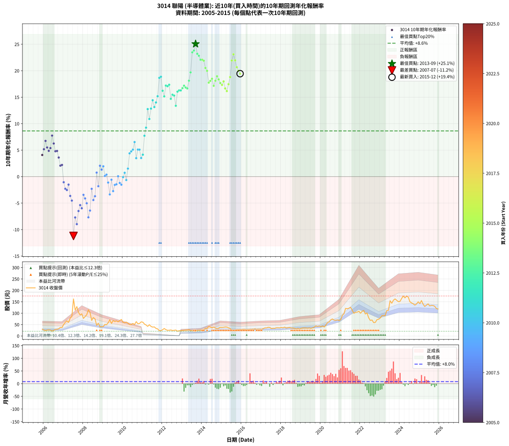

# 3014 聯陽 - 本益比與未來報酬率分析

!!! info "報告資訊"
    - **股票代號**: 3014
    - **公司名稱**: 聯陽
    - **產業別**: 半導體業
    - **分析期間**: 2006-2015 (120 個數據點)
    - **資料來源**: Type 12 (ShowMonthlyK_ChartFlow) 月收盤價與本益比
    - **報酬率口徑**: 含現金股利 (簡化: 年度合計，假設每年7/1入帳)
    - **報告生成時間**: 2026-01-06 22:48:40 CST

## 📈 視覺化圖表

### 圖表1: 本益比 vs 未來報酬率關係

*圖表1：3014 聯陽 本益比與10年期未來報酬率關係 (2006-2015)*

### 圖表2: 歷年買入時點的10年期實際報酬率

*圖表2：3014 聯陽 歷年買入時點的10年期實際報酬率 (2006-2015)*

## 📍 買點訊號說明

本報告提供兩種買點提示訊號（顯示於圖表2的股價子圖中）：

### ▲ 小綠色三角形（回測驗證）
- **計算方式**: 使用全部歷史資料計算本益比第25百分位數
- **用途**: 事後驗證，顯示歷史上哪些時點確實為低估區
- **限制**: 當下無法判斷，僅供回測參考
- **特性**: 後見之明（Look-Ahead Bias）

### ▲ 小橘色三角形（即時訊號）
- **計算方式**: 使用截至當月的過去5年資料計算本益比第25百分位數
- **用途**: 實際投資決策，當時即可判斷
- **優勢**: 可操作性強，符合實務需求
- **特性**: 無後見之明，滾動窗口計算

!!! tip "如何使用兩種訊號"
    - **綠色▲** 幫助理解歷史估值機會，驗證策略有效性
    - **橘色▲** 可作為實際買進參考，但仍需搭配基本面分析
    - 兩種訊號重疊時，表示即時判斷與事後驗證一致，信心度較高
    - 僅有綠色▲時，表示當時無法判斷（需要未來資料才能確認）
    - 僅有橘色▲時，表示即時判斷為買點，但事後可能不是最佳時機

## 📊 估值分析摘要

| 指標 | 數值 |
|:---:|:---:|
| **目前本益比** (2015-12) | **13.07 倍** |
| **歷史平均本益比** | 25.21 倍 |
| **估值水準** | 🟢 相對低估 |
| **預期10年年化報酬率** | **+7.35%** |
| **歷史平均報酬率** | +8.66% |
| **相關係數 (R²)** | 0.0005 |
| **趨勢線斜率** | 0.0056 |

!!! abstract "核心洞察"
    目前本益比顯著低於歷史平均，預期未來報酬率可能較高

    根據歷史數據回測，3014 聯陽 在目前本益比 **13.1倍** 的估值水準下，
    預期未來10年年化報酬率約為 **+7.3%**。

    **重要提醒**: 本分析基於歷史數據統計，實際報酬率會受到公司基本面變化、產業趨勢、
    總體經濟環境等多重因素影響。R² = 0.00 表示本益比可解釋約 0.1% 的報酬率變異。

## 📈 歷史估值統計

### 最佳買點 (最高報酬率)

| 項目 | 數值 |
|:---:|:---:|
| 起始時間 | 2013-09 |
| 當時本益比 | 17.55 倍 |
| 起始價格 | 20.8 元 |
| 10年後價格 | 157.0 元 |
| **10年年化報酬率** | **+25.06%** |

### 最差買點 (最低報酬率)

| 項目 | 數值 |
|:---:|:---:|
| 起始時間 | 2007-07 |
| 當時本益比 | 43.15 倍 |
| 起始價格 | 162.5 元 |
| 10年後價格 | 32.7 元 |
| **10年年化報酬率** | **-11.20%** |

## 🎯 投資啟示

### 本益比與報酬率關係

趨勢線方程式: **y = 0.0056x + 7.2732**

!!! info "弱相關或正相關"
    本益比與未來報酬率相關性較弱。這可能表示該股票的報酬率更多受到
    公司成長性、產業趨勢等因素影響，而非估值水準。**需綜合考量多項指標**。

### 估值區間建議

基於歷史數據分析:

- **🟢 低估區** (P/E < 20.2): 預期報酬率較高，可考慮增加持股
- **🟡 合理區** (P/E 20.2-30.3): 預期報酬率符合長期趨勢，正常持有
- **🔴 高估區** (P/E > 30.3): 預期報酬率較低，可考慮減碼或觀望

!!! danger "風險提示"
    - 過去表現不代表未來結果
    - 本分析假設公司基本面無重大結構性變化
    - 產業環境劇變可能使歷史規律失效
    - 應結合公司財報、產業趨勢、總體經濟等多重因素綜合判斷

!!! success "長期投資觀點"
    歷史數據顯示，在合理或低估的估值水準買入並長期持有，
    往往能獲得較佳的投資報酬。**耐心等待好價格**是價值投資的核心原則。

## 📊 數據品質

- **資料來源**: GoodInfo.tw Type 12 (ShowMonthlyK_ChartFlow)
- **資料頻率**: 月度收盤價與本益比
- **回測期間**: 2006-2015
- **數據點數量**: 120 個 (每個點代表一次10年期回測)

### 計算方法說明

1. **10年期年化報酬率**:
   - 對每個歷史時點，計算其後10年的實際投資報酬率
   - 期末價值(不含股利): 期末價格
   - 期末價值(含現金股利): 期末價格 + 持有期間內的現金股利合計 (簡化: 年度合計，假設每年7/1入帳)
   - 公式: 年化報酬率 = [(期末價值/期初價格)^(1/年數) - 1] × 100%

2. **本益比 (P/E Ratio)**:
   - 使用當時的月收盤價與EPS計算
   - 資料來源: Type 12 月度河流圖本益比數據

3. **趨勢線 (Linear Regression)**:
   - 使用最小平方法擬合線性趨勢線
   - R²值衡量本益比對報酬率的解釋能力

---

*本報告由 Stock Analysis System v1.9.0 自動生成*
*數據更新時間: 2026-01-06 22:48:40 CST*

## 📋 月度回測明細表

（每一列對應時間線圖中的一個買入點；可用來對照 SVG 圖上的每個點。）

| 買入月份 | 賣出月份 | 回測期限_年 | 實際持有年數 | 買入本益比_倍 | 買入收盤價_元 | 賣出收盤價_元 | 現金股利合計_元 | 總報酬率_pct | 年化報酬率_pct |
| --- | --- | --- | --- | --- | --- | --- | --- | --- | --- |
| 2006-01 | 2016-01 | 10 | 9.999 | 11.40 | 26.10 | 27.65 | 15.57 | +65.60 | +5.17 |
| 2006-02 | 2016-02 | 10 | 9.999 | 10.35 | 23.70 | 29.95 | 15.57 | +92.08 | +6.75 |
| 2006-03 | 2016-03 | 10 | 10.001 | 11.31 | 25.90 | 28.70 | 15.57 | +70.93 | +5.51 |
| 2006-04 | 2016-04 | 10 | 10.001 | 11.75 | 26.90 | 27.70 | 15.57 | +60.86 | +4.87 |
| 2006-05 | 2016-05 | 10 | 10.001 | 11.38 | 26.05 | 28.45 | 15.57 | +68.99 | +5.39 |
| 2006-06 | 2016-06 | 10 | 10.001 | 9.21 | 21.10 | 28.95 | 15.57 | +111.00 | +7.75 |
| 2006-07 | 2016-07 | 10 | 10.001 | 10.85 | 24.85 | 29.70 | 15.88 | +83.44 | +6.25 |
| 2006-08 | 2016-08 | 10 | 10.001 | 12.49 | 28.60 | 29.80 | 15.88 | +59.74 | +4.79 |
| 2006-09 | 2016-09 | 10 | 10.001 | 12.75 | 29.20 | 31.00 | 15.88 | +60.57 | +4.85 |
| 2006-10 | 2016-10 | 10 | 10.001 | 13.84 | 31.70 | 29.30 | 15.88 | +42.54 | +3.61 |
| 2006-11 | 2016-11 | 10 | 10.001 | 16.46 | 37.70 | 30.40 | 15.88 | +22.77 | +2.07 |
| 2006-12 | 2016-12 | 10 | 10.001 | 16.16 | 37.00 | 30.15 | 15.88 | +24.42 | +2.21 |
| 2007-01 | 2017-01 | 10 | 10.001 | 20.23 | 50.60 | 29.60 | 15.88 | -10.11 | -1.06 |
| 2007-02 | 2017-02 | 10 | 10.001 | 22.24 | 60.30 | 31.95 | 15.88 | -20.67 | -2.29 |
| 2007-03 | 2017-03 | 10 | 10.001 | 22.65 | 66.20 | 35.35 | 15.88 | -22.61 | -2.53 |
| 2007-04 | 2017-04 | 10 | 10.001 | 19.02 | 59.60 | 35.30 | 15.88 | -14.12 | -1.51 |
| 2007-05 | 2017-05 | 10 | 10.001 | 23.41 | 78.30 | 38.10 | 15.88 | -31.05 | -3.65 |
| 2007-06 | 2017-06 | 10 | 10.001 | 23.91 | 85.00 | 37.60 | 15.88 | -37.08 | -4.53 |
| 2007-07 | 2017-07 | 10 | 10.001 | 43.15 | 162.50 | 32.70 | 16.82 | -69.53 | -11.20 |
| 2007-08 | 2017-08 | 10 | 10.001 | 28.42 | 113.00 | 33.80 | 16.82 | -55.20 | -7.72 |
| 2007-09 | 2017-09 | 10 | 10.001 | 30.81 | 129.00 | 33.55 | 16.82 | -60.95 | -8.97 |
| 2007-10 | 2017-10 | 10 | 10.001 | 23.53 | 103.50 | 36.05 | 16.82 | -48.92 | -6.50 |
| 2007-11 | 2017-11 | 10 | 10.001 | 20.00 | 92.20 | 36.20 | 16.82 | -42.49 | -5.38 |
| 2007-12 | 2017-12 | 10 | 10.001 | 20.12 | 97.00 | 35.55 | 16.82 | -46.01 | -5.98 |
| 2008-01 | 2018-01 | 10 | 10.001 | 16.38 | 77.00 | 37.45 | 16.82 | -29.52 | -3.44 |
| 2008-02 | 2018-03 | 10 | 10.081 | 18.56 | 85.00 | 38.80 | 16.82 | -34.56 | -4.12 |
| 2008-03 | 2018-03 | 10 | 9.999 | 20.90 | 93.20 | 38.80 | 16.82 | -40.32 | -5.03 |
| 2008-04 | 2018-04 | 10 | 9.999 | 26.50 | 115.00 | 34.85 | 16.82 | -55.07 | -7.69 |
| 2008-05 | 2018-05 | 10 | 9.999 | 24.41 | 103.00 | 36.30 | 16.82 | -48.43 | -6.41 |
| 2008-06 | 2018-06 | 10 | 9.999 | 16.63 | 68.20 | 37.20 | 16.82 | -20.79 | -2.30 |
| 2008-07 | 2018-07 | 10 | 9.999 | 20.33 | 80.90 | 35.15 | 16.33 | -36.36 | -4.42 |
| 2008-08 | 2018-08 | 10 | 9.999 | 19.43 | 75.00 | 35.10 | 16.33 | -31.42 | -3.70 |
| 2008-09 | 2018-09 | 10 | 9.999 | 12.43 | 46.50 | 33.80 | 16.33 | +7.81 | +0.76 |
| 2008-10 | 2018-10 | 10 | 9.999 | 15.47 | 56.00 | 30.30 | 16.33 | -16.73 | -1.81 |
| 2008-11 | 2018-11 | 10 | 9.999 | 11.51 | 40.30 | 33.05 | 16.33 | +22.54 | +2.05 |
| 2008-12 | 2018-12 | 10 | 9.999 | 12.13 | 41.00 | 30.40 | 16.33 | +13.98 | +1.32 |
| 2009-01 | 2019-01 | 10 | 9.999 | 12.42 | 41.00 | 33.40 | 16.33 | +21.30 | +1.95 |
| 2009-02 | 2019-02 | 10 | 9.999 | 15.79 | 50.90 | 35.25 | 16.33 | +1.34 | +0.13 |
| 2009-03 | 2019-03 | 10 | 9.999 | 15.74 | 49.50 | 35.05 | 16.33 | +3.80 | +0.37 |
| 2009-04 | 2019-04 | 10 | 9.999 | 18.75 | 57.50 | 35.05 | 16.33 | -10.64 | -1.12 |
| 2009-05 | 2019-05 | 10 | 9.999 | 23.76 | 71.00 | 34.10 | 16.33 | -28.97 | -3.36 |
| 2009-06 | 2019-06 | 10 | 9.999 | 18.80 | 54.70 | 35.25 | 16.33 | -5.70 | -0.59 |
| 2009-07 | 2019-07 | 10 | 9.999 | 23.91 | 67.70 | 33.25 | 18.03 | -24.25 | -2.74 |
| 2009-08 | 2019-08 | 10 | 9.999 | 22.92 | 63.10 | 35.85 | 18.03 | -14.61 | -1.57 |
| 2009-09 | 2019-09 | 10 | 9.999 | 24.71 | 66.10 | 39.10 | 18.03 | -13.57 | -1.45 |
| 2009-10 | 2019-10 | 10 | 9.999 | 23.88 | 62.00 | 44.40 | 18.03 | +0.70 | +0.07 |
| 2009-11 | 2019-11 | 10 | 9.999 | 26.76 | 67.40 | 41.70 | 18.03 | -11.38 | -1.20 |
| 2009-12 | 2019-12 | 10 | 9.999 | 29.71 | 72.50 | 44.15 | 18.03 | -14.23 | -1.52 |
| 2010-01 | 2020-01 | 10 | 9.999 | 25.19 | 59.50 | 40.90 | 18.03 | -0.95 | -0.10 |
| 2010-02 | 2020-02 | 10 | 9.999 | 25.30 | 57.80 | 44.10 | 18.03 | +7.50 | +0.73 |
| 2010-03 | 2020-03 | 10 | 10.001 | 27.63 | 61.00 | 39.15 | 18.03 | -6.26 | -0.64 |
| 2010-04 | 2020-04 | 10 | 10.001 | 26.34 | 56.10 | 47.15 | 18.03 | +16.19 | +1.51 |
| 2010-05 | 2020-05 | 10 | 10.001 | 24.41 | 50.10 | 59.00 | 18.03 | +53.76 | +4.40 |
| 2010-06 | 2020-06 | 10 | 10.001 | 25.32 | 50.00 | 61.60 | 18.03 | +59.27 | +4.76 |
| 2010-07 | 2020-07 | 10 | 10.001 | 28.99 | 55.00 | 71.10 | 19.33 | +64.42 | +5.10 |
| 2010-08 | 2020-08 | 10 | 10.001 | 27.47 | 50.00 | 74.80 | 19.33 | +88.27 | +6.53 |
| 2010-09 | 2020-09 | 10 | 10.001 | 36.15 | 63.00 | 69.40 | 19.33 | +40.85 | +3.48 |
| 2010-10 | 2020-10 | 10 | 10.001 | 32.19 | 53.60 | 68.90 | 19.33 | +64.61 | +5.11 |
| 2010-11 | 2020-11 | 10 | 10.001 | 34.46 | 54.70 | 70.60 | 19.33 | +64.41 | +5.10 |
| 2010-12 | 2020-12 | 10 | 10.001 | 40.99 | 61.90 | 68.10 | 19.33 | +41.25 | +3.51 |
| 2011-01 | 2021-01 | 10 | 10.001 | 134.90 | 60.60 | 71.60 | 19.33 | +50.05 | +4.14 |
| 2011-02 | 2021-02 | 10 | 10.001 |  | 52.30 | 90.70 | 19.33 | +110.39 | +7.72 |
| 2011-03 | 2021-03 | 10 | 10.001 |  | 48.15 | 97.30 | 19.33 | +142.23 | +9.25 |
| 2011-04 | 2021-04 | 10 | 10.001 |  | 42.25 | 121.00 | 19.33 | +232.15 | +12.75 |
| 2011-05 | 2021-05 | 10 | 10.001 |  | 49.40 | 119.50 | 19.33 | +181.04 | +10.88 |
| 2011-06 | 2021-06 | 10 | 10.001 |  | 42.05 | 121.50 | 19.33 | +234.92 | +12.85 |
| 2011-07 | 2021-07 | 10 | 10.001 |  | 38.95 | 126.00 | 23.83 | +284.68 | +14.42 |
| 2011-08 | 2021-08 | 10 | 10.001 |  | 39.80 | 113.00 | 23.83 | +243.80 | +13.14 |
| 2011-09 | 2021-09 | 10 | 10.001 |  | 33.25 | 99.50 | 23.83 | +270.93 | +14.00 |
| 2011-10 | 2021-10 | 10 | 10.001 |  | 31.10 | 104.00 | 23.83 | +311.04 | +15.18 |
| 2011-11 | 2021-11 | 10 | 10.001 |  | 23.20 | 104.50 | 23.83 | +453.16 | +18.65 |
| 2011-12 | 2021-12 | 10 | 10.001 |  | 23.50 | 108.50 | 23.83 | +463.12 | +18.86 |
| 2012-01 | 2022-01 | 10 | 10.001 |  | 27.50 | 99.80 | 23.83 | +349.57 | +16.22 |
| 2012-02 | 2022-03 | 10 | 10.081 |  | 32.75 | 112.00 | 23.83 | +314.76 | +15.16 |
| 2012-03 | 2022-03 | 10 | 9.999 |  | 27.80 | 112.00 | 23.83 | +388.61 | +17.19 |
| 2012-04 | 2022-04 | 10 | 9.999 |  | 24.85 | 96.40 | 23.83 | +383.84 | +17.08 |
| 2012-05 | 2022-05 | 10 | 9.999 |  | 25.20 | 101.00 | 23.83 | +395.37 | +17.36 |
| 2012-06 | 2022-06 | 10 | 9.999 |  | 26.30 | 79.70 | 23.83 | +293.66 | +14.69 |
| 2012-07 | 2022-07 | 10 | 9.999 |  | 23.95 | 68.10 | 32.83 | +321.43 | +15.47 |
| 2012-08 | 2022-08 | 10 | 9.999 |  | 24.80 | 70.20 | 32.83 | +315.46 | +15.31 |
| 2012-09 | 2022-09 | 10 | 9.999 |  | 26.05 | 58.60 | 32.83 | +250.99 | +13.38 |
| 2012-10 | 2022-10 | 10 | 9.999 |  | 20.85 | 59.50 | 32.83 | +342.84 | +16.05 |
| 2012-11 | 2022-11 | 10 | 9.999 | 420.00 | 23.10 | 71.60 | 32.83 | +352.09 | +16.29 |
| 2012-12 | 2022-12 | 10 | 9.999 | 21.76 | 23.50 | 73.30 | 32.83 | +351.63 | +16.28 |
| 2013-01 | 2023-01 | 10 | 9.999 | 21.85 | 23.85 | 79.00 | 32.83 | +368.90 | +16.71 |
| 2013-02 | 2023-02 | 10 | 9.999 | 22.61 | 24.95 | 88.90 | 32.83 | +387.91 | +17.18 |
| 2013-03 | 2023-03 | 10 | 9.999 | 23.23 | 25.90 | 89.80 | 32.83 | +373.49 | +16.83 |
| 2013-04 | 2023-04 | 10 | 9.999 | 23.08 | 26.00 | 88.50 | 32.83 | +366.67 | +16.66 |
| 2013-05 | 2023-05 | 10 | 9.999 | 24.07 | 27.40 | 112.00 | 32.83 | +428.59 | +18.12 |
| 2013-06 | 2023-06 | 10 | 9.999 | 20.96 | 24.10 | 112.50 | 32.83 | +503.04 | +19.69 |
| 2013-07 | 2023-07 | 10 | 9.999 | 20.10 | 23.35 | 154.50 | 37.63 | +722.82 | +23.46 |
| 2013-08 | 2023-08 | 10 | 9.999 | 18.24 | 21.40 | 143.50 | 37.63 | +746.40 | +23.81 |
| 2013-09 | 2023-09 | 10 | 9.999 | 17.55 | 20.80 | 157.00 | 37.63 | +835.72 | +25.06 |
| 2013-10 | 2023-10 | 10 | 9.999 | 20.77 | 24.85 | 162.50 | 37.63 | +705.35 | +23.20 |
| 2013-11 | 2023-11 | 10 | 9.999 | 20.57 | 24.85 | 156.50 | 37.63 | +681.20 | +22.83 |
| 2013-12 | 2023-12 | 10 | 9.999 | 20.98 | 25.60 | 150.50 | 37.63 | +634.88 | +22.08 |
| 2014-01 | 2024-01 | 10 | 9.999 | 19.57 | 25.80 | 152.00 | 37.63 | +635.00 | +22.08 |
| 2014-02 | 2024-02 | 10 | 9.999 | 19.76 | 28.00 | 165.00 | 37.63 | +623.68 | +21.89 |
| 2014-03 | 2024-03 | 10 | 10.001 | 21.75 | 32.95 | 175.50 | 37.63 | +546.83 | +20.52 |
| 2014-04 | 2024-04 | 10 | 10.001 | 20.52 | 33.10 | 167.00 | 37.63 | +518.21 | +19.98 |
| 2014-05 | 2024-05 | 10 | 10.001 | 24.25 | 41.50 | 175.00 | 37.63 | +412.36 | +17.75 |
| 2014-06 | 2024-06 | 10 | 10.001 | 21.82 | 39.50 | 170.50 | 37.63 | +426.91 | +18.08 |
| 2014-07 | 2024-07 | 10 | 10.001 | 18.68 | 35.65 | 150.00 | 44.44 | +445.41 | +18.48 |
| 2014-08 | 2024-08 | 10 | 10.001 | 19.39 | 38.90 | 145.00 | 44.44 | +386.98 | +17.15 |
| 2014-09 | 2024-09 | 10 | 10.001 | 16.67 | 35.10 | 141.00 | 44.44 | +428.31 | +18.11 |
| 2014-10 | 2024-10 | 10 | 10.001 | 14.39 | 31.70 | 135.50 | 44.44 | +467.62 | +18.96 |
| 2014-11 | 2024-11 | 10 | 10.001 | 14.88 | 34.25 | 140.50 | 44.44 | +439.96 | +18.37 |
| 2014-12 | 2024-12 | 10 | 10.001 | 15.92 | 38.20 | 150.00 | 44.44 | +409.00 | +17.67 |
| 2015-01 | 2025-01 | 10 | 10.001 | 15.84 | 37.75 | 142.00 | 44.44 | +393.87 | +17.31 |
| 2015-02 | 2025-02 | 10 | 10.001 | 16.16 | 38.25 | 155.50 | 44.44 | +422.71 | +17.98 |
| 2015-03 | 2025-03 | 10 | 10.001 | 16.77 | 39.40 | 139.50 | 44.44 | +366.85 | +16.66 |
| 2015-04 | 2025-04 | 10 | 10.001 | 16.67 | 38.90 | 129.50 | 44.44 | +347.14 | +16.15 |
| 2015-05 | 2025-05 | 10 | 10.001 | 15.50 | 35.90 | 135.00 | 44.44 | +399.82 | +17.46 |
| 2015-06 | 2025-06 | 10 | 10.001 | 14.39 | 33.10 | 141.00 | 44.44 | +460.23 | +18.80 |
| 2015-07 | 2025-07 | 10 | 10.001 | 11.06 | 25.25 | 132.00 | 51.44 | +626.48 | +21.93 |
| 2015-08 | 2025-08 | 10 | 10.001 | 10.24 | 23.20 | 134.00 | 51.44 | +699.29 | +23.10 |
| 2015-09 | 2025-09 | 10 | 10.001 | 11.29 | 25.40 | 133.50 | 51.44 | +628.09 | +21.96 |
| 2015-10 | 2025-10 | 10 | 10.001 | 12.45 | 27.80 | 130.50 | 51.44 | +554.45 | +20.66 |
| 2015-11 | 2025-11 | 10 | 10.001 | 12.52 | 27.75 | 120.50 | 51.44 | +519.59 | +20.01 |
| 2015-12 | 2025-12 | 10 | 10.001 | 13.07 | 28.75 | 115.00 | 51.44 | +478.91 | +19.19 |
