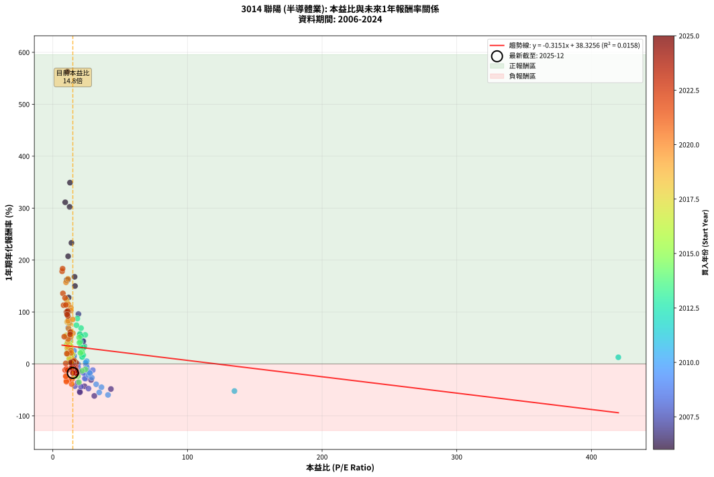
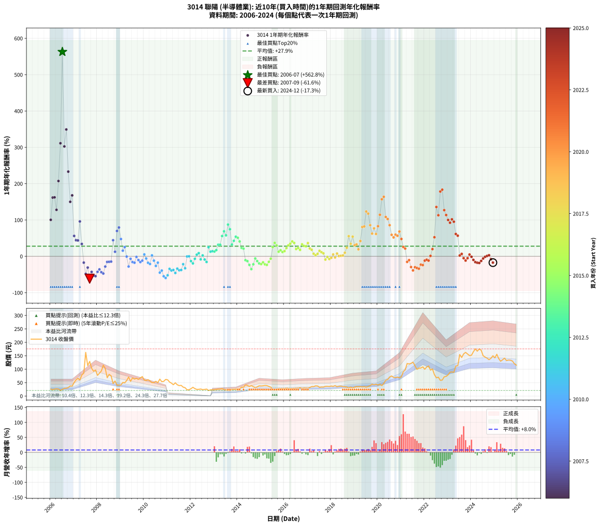

# 3014 聯陽 - 本益比與未來報酬率分析

!!! info "報告資訊"
    - **股票代號**: 3014
    - **公司名稱**: 聯陽
    - **產業別**: 半導體業
    - **分析期間**: 2006-2024 (228 個數據點)
    - **資料來源**: Type 12 (ShowMonthlyK_ChartFlow) 月收盤價與本益比
    - **報酬率口徑**: 含現金股利 (簡化: 年度合計，假設每年7/1入帳)
    - **報告生成時間**: 2026-01-04 08:18:54 CST

## 📈 視覺化圖表

### 圖表1: 本益比 vs 未來報酬率關係

*圖表1：3014 聯陽 本益比與1年期未來報酬率關係 (2006-2024)*

### 圖表2: 歷年買入時點的1年期實際報酬率

*圖表2：3014 聯陽 歷年買入時點的1年期實際報酬率 (2006-2024)*

## 📍 買點訊號說明

本報告提供兩種買點提示訊號（顯示於圖表2的股價子圖中）：

### ▲ 小綠色三角形（回測驗證）
- **計算方式**: 使用全部歷史資料計算本益比第25百分位數
- **用途**: 事後驗證，顯示歷史上哪些時點確實為低估區
- **限制**: 當下無法判斷，僅供回測參考
- **特性**: 後見之明（Look-Ahead Bias）

### ▲ 小橘色三角形（即時訊號）
- **計算方式**: 使用截至當月的過去5年資料計算本益比第25百分位數
- **用途**: 實際投資決策，當時即可判斷
- **優勢**: 可操作性強，符合實務需求
- **特性**: 無後見之明，滾動窗口計算

!!! tip "如何使用兩種訊號"
    - **綠色▲** 幫助理解歷史估值機會，驗證策略有效性
    - **橘色▲** 可作為實際買進參考，但仍需搭配基本面分析
    - 兩種訊號重疊時，表示即時判斷與事後驗證一致，信心度較高
    - 僅有綠色▲時，表示當時無法判斷（需要未來資料才能確認）
    - 僅有橘色▲時，表示即時判斷為買點，但事後可能不是最佳時機

## 📊 估值分析摘要

| 指標 | 數值 |
|:---:|:---:|
| **目前本益比** (2024-12) | **14.85 倍** |
| **歷史平均本益比** | 18.70 倍 |
| **估值水準** | 🟢 相對低估 |
| **預期1年年化報酬率** | **+33.65%** |
| **歷史平均報酬率** | +27.90% |
| **相關係數 (R²)** | 0.0158 |
| **趨勢線斜率** | -0.3151 |

!!! abstract "核心洞察"
    目前本益比顯著低於歷史平均，預期未來報酬率可能較高

    根據歷史數據回測，3014 聯陽 在目前本益比 **14.8倍** 的估值水準下，
    預期未來1年年化報酬率約為 **+33.6%**。

    **重要提醒**: 本分析基於歷史數據統計，實際報酬率會受到公司基本面變化、產業趨勢、
    總體經濟環境等多重因素影響。R² = 0.02 表示本益比可解釋約 1.6% 的報酬率變異。

## 📈 歷史估值統計

### 最佳買點 (最高報酬率)

| 項目 | 數值 |
|:---:|:---:|
| 起始時間 | 2006-07 |
| 當時本益比 | 10.85 倍 |
| 起始價格 | 24.9 元 |
| 1年後價格 | 162.5 元 |
| **1年年化報酬率** | **+562.83%** |

### 最差買點 (最低報酬率)

| 項目 | 數值 |
|:---:|:---:|
| 起始時間 | 2007-09 |
| 當時本益比 | 30.81 倍 |
| 起始價格 | 129.0 元 |
| 1年後價格 | 46.5 元 |
| **1年年化報酬率** | **-61.56%** |

## 🎯 投資啟示

### 本益比與報酬率關係

趨勢線方程式: **y = -0.3151x + 38.3256**

!!! note "負相關"
    本益比與未來報酬率呈現負相關。較低的本益比通常帶來較高的未來報酬率，
    但相關性不算非常強。**估值仍是重要參考指標之一**。

### 估值區間建議

基於歷史數據分析:

- **🟢 低估區** (P/E < 15.0): 預期報酬率較高，可考慮增加持股
- **🟡 合理區** (P/E 15.0-22.4): 預期報酬率符合長期趨勢，正常持有
- **🔴 高估區** (P/E > 22.4): 預期報酬率較低，可考慮減碼或觀望

!!! danger "風險提示"
    - 過去表現不代表未來結果
    - 本分析假設公司基本面無重大結構性變化
    - 產業環境劇變可能使歷史規律失效
    - 應結合公司財報、產業趨勢、總體經濟等多重因素綜合判斷

!!! success "長期投資觀點"
    歷史數據顯示，在合理或低估的估值水準買入並長期持有，
    往往能獲得較佳的投資報酬。**耐心等待好價格**是價值投資的核心原則。

## 📊 數據品質

- **資料來源**: GoodInfo.tw Type 12 (ShowMonthlyK_ChartFlow)
- **資料頻率**: 月度收盤價與本益比
- **回測期間**: 2006-2024
- **數據點數量**: 228 個 (每個點代表一次1年期回測)

### 計算方法說明

1. **1年期年化報酬率**:
   - 對每個歷史時點，計算其後1年的實際投資報酬率
   - 期末價值(不含股利): 期末價格
   - 期末價值(含現金股利): 期末價格 + 持有期間內的現金股利合計 (簡化: 年度合計，假設每年7/1入帳)
   - 公式: 年化報酬率 = [(期末價值/期初價格)^(1/年數) - 1] × 100%

2. **本益比 (P/E Ratio)**:
   - 使用當時的月收盤價與EPS計算
   - 資料來源: Type 12 月度河流圖本益比數據

3. **趨勢線 (Linear Regression)**:
   - 使用最小平方法擬合線性趨勢線
   - R²值衡量本益比對報酬率的解釋能力

---

*本報告由 Stock Analysis System v1.9.0 自動生成*
*數據更新時間: 2026-01-04 08:18:54 CST*

## 📋 月度回測明細表

（每一列對應時間線圖中的一個買入點；可用來對照 SVG 圖上的每個點。）

| 買入月份 | 賣出月份 | 回測期限_年 | 實際持有年數 | 買入本益比_倍 | 買入收盤價_元 | 賣出收盤價_元 | 現金股利合計_元 | 總報酬率_pct | 年化報酬率_pct |
| --- | --- | --- | --- | --- | --- | --- | --- | --- | --- |
| 2006-01 | 2007-01 | 1 | 0.999 | 11.40 | 26.10 | 50.60 | 1.69 | +100.33 | +100.43 |
| 2006-02 | 2007-02 | 1 | 0.999 | 10.35 | 23.70 | 60.30 | 1.69 | +161.55 | +161.72 |
| 2006-03 | 2007-03 | 1 | 0.999 | 11.31 | 25.90 | 66.20 | 1.69 | +162.11 | +162.29 |
| 2006-04 | 2007-04 | 1 | 0.999 | 11.75 | 26.90 | 59.60 | 1.69 | +127.83 | +127.96 |
| 2006-05 | 2007-05 | 1 | 0.999 | 11.38 | 26.05 | 78.30 | 1.69 | +207.05 | +207.29 |
| 2006-06 | 2007-06 | 1 | 0.999 | 9.21 | 21.10 | 85.00 | 1.69 | +310.84 | +311.24 |
| 2006-07 | 2007-07 | 1 | 0.999 | 10.85 | 24.85 | 162.50 | 2.00 | +561.97 | +562.83 |
| 2006-08 | 2007-08 | 1 | 0.999 | 12.49 | 28.60 | 113.00 | 2.00 | +302.10 | +302.48 |
| 2006-09 | 2007-09 | 1 | 0.999 | 12.75 | 29.20 | 129.00 | 2.00 | +348.63 | +349.09 |
| 2006-10 | 2007-10 | 1 | 0.999 | 13.84 | 31.70 | 103.50 | 2.00 | +232.81 | +233.08 |
| 2006-11 | 2007-11 | 1 | 0.999 | 16.46 | 37.70 | 92.20 | 2.00 | +149.87 | +150.02 |
| 2006-12 | 2007-12 | 1 | 0.999 | 16.16 | 37.00 | 97.00 | 2.00 | +167.57 | +167.75 |
| 2007-01 | 2008-01 | 1 | 0.999 | 20.23 | 50.60 | 77.00 | 2.00 | +56.13 | +56.17 |
| 2007-02 | 2008-02 | 1 | 0.999 | 22.24 | 60.30 | 85.00 | 2.00 | +44.28 | +44.31 |
| 2007-03 | 2008-03 | 1 | 1.002 | 22.65 | 66.20 | 93.20 | 2.00 | +43.81 | +43.70 |
| 2007-04 | 2008-04 | 1 | 1.002 | 19.02 | 59.60 | 115.00 | 2.00 | +96.31 | +96.04 |
| 2007-05 | 2008-05 | 1 | 1.002 | 23.41 | 78.30 | 103.00 | 2.00 | +34.10 | +34.02 |
| 2007-06 | 2008-06 | 1 | 1.002 | 23.91 | 85.00 | 68.20 | 2.00 | -17.41 | -17.38 |
| 2007-07 | 2008-07 | 1 | 1.002 | 43.15 | 162.50 | 80.90 | 2.99 | -48.38 | -48.31 |
| 2007-08 | 2008-08 | 1 | 1.002 | 28.42 | 113.00 | 75.00 | 2.99 | -30.98 | -30.93 |
| 2007-09 | 2008-09 | 1 | 1.002 | 30.81 | 129.00 | 46.50 | 2.99 | -61.64 | -61.56 |
| 2007-10 | 2008-10 | 1 | 1.002 | 23.53 | 103.50 | 56.00 | 2.99 | -43.01 | -42.94 |
| 2007-11 | 2008-11 | 1 | 1.002 | 20.00 | 92.20 | 40.30 | 2.99 | -53.05 | -52.98 |
| 2007-12 | 2008-12 | 1 | 1.002 | 20.12 | 97.00 | 41.00 | 2.99 | -54.65 | -54.58 |
| 2008-01 | 2009-01 | 1 | 1.002 | 16.38 | 77.00 | 41.00 | 2.99 | -42.87 | -42.81 |
| 2008-02 | 2009-03 | 1 | 1.081 | 18.56 | 85.00 | 49.50 | 2.99 | -38.25 | -35.97 |
| 2008-03 | 2009-03 | 1 | 0.999 | 20.90 | 93.20 | 49.50 | 2.99 | -43.68 | -43.70 |
| 2008-04 | 2009-04 | 1 | 0.999 | 26.50 | 115.00 | 57.50 | 2.99 | -47.40 | -47.42 |
| 2008-05 | 2009-05 | 1 | 0.999 | 24.41 | 103.00 | 71.00 | 2.99 | -28.17 | -28.18 |
| 2008-06 | 2009-06 | 1 | 0.999 | 16.63 | 68.20 | 54.70 | 2.99 | -15.41 | -15.42 |
| 2008-07 | 2009-07 | 1 | 0.999 | 20.33 | 80.90 | 67.70 | 1.00 | -15.08 | -15.09 |
| 2008-08 | 2009-08 | 1 | 0.999 | 19.43 | 75.00 | 63.10 | 1.00 | -14.53 | -14.54 |
| 2008-09 | 2009-09 | 1 | 0.999 | 12.43 | 46.50 | 66.10 | 1.00 | +44.30 | +44.34 |
| 2008-10 | 2009-10 | 1 | 0.999 | 15.47 | 56.00 | 62.00 | 1.00 | +12.50 | +12.51 |
| 2008-11 | 2009-11 | 1 | 0.999 | 11.51 | 40.30 | 67.40 | 1.00 | +69.73 | +69.79 |
| 2008-12 | 2009-12 | 1 | 0.999 | 12.13 | 41.00 | 72.50 | 1.00 | +79.27 | +79.34 |
| 2009-01 | 2010-01 | 1 | 0.999 | 12.42 | 41.00 | 59.50 | 1.00 | +47.56 | +47.60 |
| 2009-02 | 2010-02 | 1 | 0.999 | 15.79 | 50.90 | 57.80 | 1.00 | +15.52 | +15.53 |
| 2009-03 | 2010-03 | 1 | 0.999 | 15.74 | 49.50 | 61.00 | 1.00 | +25.25 | +25.27 |
| 2009-04 | 2010-04 | 1 | 0.999 | 18.75 | 57.50 | 56.10 | 1.00 | -0.70 | -0.70 |
| 2009-05 | 2010-05 | 1 | 0.999 | 23.76 | 71.00 | 50.10 | 1.00 | -28.03 | -28.04 |
| 2009-06 | 2010-06 | 1 | 0.999 | 18.80 | 54.70 | 50.00 | 1.00 | -6.76 | -6.77 |
| 2009-07 | 2010-07 | 1 | 0.999 | 23.91 | 67.70 | 55.00 | 2.00 | -15.81 | -15.81 |
| 2009-08 | 2010-08 | 1 | 0.999 | 22.92 | 63.10 | 50.00 | 2.00 | -17.59 | -17.60 |
| 2009-09 | 2010-09 | 1 | 0.999 | 24.71 | 66.10 | 63.00 | 2.00 | -1.66 | -1.67 |
| 2009-10 | 2010-10 | 1 | 0.999 | 23.88 | 62.00 | 53.60 | 2.00 | -10.32 | -10.33 |
| 2009-11 | 2010-11 | 1 | 0.999 | 26.76 | 67.40 | 54.70 | 2.00 | -15.88 | -15.89 |
| 2009-12 | 2010-12 | 1 | 0.999 | 29.71 | 72.50 | 61.90 | 2.00 | -11.86 | -11.87 |
| 2010-01 | 2011-01 | 1 | 0.999 | 25.19 | 59.50 | 60.60 | 2.00 | +5.21 | +5.21 |
| 2010-02 | 2011-02 | 1 | 0.999 | 25.30 | 57.80 | 52.30 | 2.00 | -6.06 | -6.06 |
| 2010-03 | 2011-03 | 1 | 0.999 | 27.63 | 61.00 | 48.15 | 2.00 | -17.79 | -17.80 |
| 2010-04 | 2011-04 | 1 | 0.999 | 26.34 | 56.10 | 42.25 | 2.00 | -21.12 | -21.14 |
| 2010-05 | 2011-05 | 1 | 0.999 | 24.41 | 50.10 | 49.40 | 2.00 | +2.59 | +2.60 |
| 2010-06 | 2011-06 | 1 | 0.999 | 25.32 | 50.00 | 42.05 | 2.00 | -11.90 | -11.91 |
| 2010-07 | 2011-07 | 1 | 0.999 | 28.99 | 55.00 | 38.95 | 1.50 | -26.45 | -26.47 |
| 2010-08 | 2011-08 | 1 | 0.999 | 27.47 | 50.00 | 39.80 | 1.50 | -17.40 | -17.41 |
| 2010-09 | 2011-09 | 1 | 0.999 | 36.15 | 63.00 | 33.25 | 1.50 | -44.84 | -44.86 |
| 2010-10 | 2011-10 | 1 | 0.999 | 32.19 | 53.60 | 31.10 | 1.50 | -39.18 | -39.20 |
| 2010-11 | 2011-11 | 1 | 0.999 | 34.46 | 54.70 | 23.20 | 1.50 | -54.84 | -54.87 |
| 2010-12 | 2011-12 | 1 | 0.999 | 40.99 | 61.90 | 23.50 | 1.50 | -59.61 | -59.64 |
| 2011-01 | 2012-01 | 1 | 0.999 | 134.90 | 60.60 | 27.50 | 1.50 | -52.15 | -52.17 |
| 2011-02 | 2012-02 | 1 | 0.999 |  | 52.30 | 32.75 | 1.50 | -34.51 | -34.53 |
| 2011-03 | 2012-03 | 1 | 1.002 |  | 48.15 | 27.80 | 1.50 | -39.15 | -39.09 |
| 2011-04 | 2012-04 | 1 | 1.002 |  | 42.25 | 24.85 | 1.50 | -37.63 | -37.57 |
| 2011-05 | 2012-05 | 1 | 1.002 |  | 49.40 | 25.20 | 1.50 | -45.95 | -45.88 |
| 2011-06 | 2012-06 | 1 | 1.002 |  | 42.05 | 26.30 | 1.50 | -33.89 | -33.83 |
| 2011-07 | 2012-07 | 1 | 1.002 |  | 38.95 | 23.95 | 0.00 | -38.51 | -38.45 |
| 2011-08 | 2012-08 | 1 | 1.002 |  | 39.80 | 24.80 | 0.00 | -37.69 | -37.63 |
| 2011-09 | 2012-09 | 1 | 1.002 |  | 33.25 | 26.05 | 0.00 | -21.65 | -21.61 |
| 2011-10 | 2012-10 | 1 | 1.002 |  | 31.10 | 20.85 | 0.00 | -32.96 | -32.90 |
| 2011-11 | 2012-11 | 1 | 1.002 |  | 23.20 | 23.10 | 0.00 | -0.43 | -0.43 |
| 2011-12 | 2012-12 | 1 | 1.002 |  | 23.50 | 23.50 | 0.00 | +0.00 | +0.00 |
| 2012-01 | 2013-01 | 1 | 1.002 |  | 27.50 | 23.85 | 0.00 | -13.27 | -13.25 |
| 2012-02 | 2013-03 | 1 | 1.081 |  | 32.75 | 25.90 | 0.00 | -20.92 | -19.51 |
| 2012-03 | 2013-03 | 1 | 0.999 |  | 27.80 | 25.90 | 0.00 | -6.83 | -6.84 |
| 2012-04 | 2013-04 | 1 | 0.999 |  | 24.85 | 26.00 | 0.00 | +4.63 | +4.63 |
| 2012-05 | 2013-05 | 1 | 0.999 |  | 25.20 | 27.40 | 0.00 | +8.73 | +8.74 |
| 2012-06 | 2013-06 | 1 | 0.999 |  | 26.30 | 24.10 | 0.00 | -8.37 | -8.37 |
| 2012-07 | 2013-07 | 1 | 0.999 |  | 23.95 | 23.35 | 1.20 | +2.52 | +2.52 |
| 2012-08 | 2013-08 | 1 | 0.999 |  | 24.80 | 21.40 | 1.20 | -8.85 | -8.86 |
| 2012-09 | 2013-09 | 1 | 0.999 |  | 26.05 | 20.80 | 1.20 | -15.53 | -15.54 |
| 2012-10 | 2013-10 | 1 | 0.999 |  | 20.85 | 24.85 | 1.20 | +24.96 | +24.98 |
| 2012-11 | 2013-11 | 1 | 0.999 | 420.00 | 23.10 | 24.85 | 1.20 | +12.79 | +12.80 |
| 2012-12 | 2013-12 | 1 | 0.999 | 21.76 | 23.50 | 25.60 | 1.20 | +14.06 | +14.07 |
| 2013-01 | 2014-01 | 1 | 0.999 | 21.85 | 23.85 | 25.80 | 1.20 | +13.22 | +13.23 |
| 2013-02 | 2014-02 | 1 | 0.999 | 22.61 | 24.95 | 28.00 | 1.20 | +17.05 | +17.06 |
| 2013-03 | 2014-03 | 1 | 0.999 | 23.23 | 25.90 | 32.95 | 1.20 | +31.87 | +31.89 |
| 2013-04 | 2014-04 | 1 | 0.999 | 23.08 | 26.00 | 33.10 | 1.20 | +31.94 | +31.96 |
| 2013-05 | 2014-05 | 1 | 0.999 | 24.07 | 27.40 | 41.50 | 1.20 | +55.85 | +55.90 |
| 2013-06 | 2014-06 | 1 | 0.999 | 20.96 | 24.10 | 39.50 | 1.20 | +68.90 | +68.96 |
| 2013-07 | 2014-07 | 1 | 0.999 | 20.10 | 23.35 | 35.65 | 1.19 | +57.78 | +57.83 |
| 2013-08 | 2014-08 | 1 | 0.999 | 18.24 | 21.40 | 38.90 | 1.19 | +87.35 | +87.43 |
| 2013-09 | 2014-09 | 1 | 0.999 | 17.55 | 20.80 | 35.10 | 1.19 | +74.48 | +74.55 |
| 2013-10 | 2014-10 | 1 | 0.999 | 20.77 | 24.85 | 31.70 | 1.19 | +32.36 | +32.39 |
| 2013-11 | 2014-11 | 1 | 0.999 | 20.57 | 24.85 | 34.25 | 1.19 | +42.62 | +42.66 |
| 2013-12 | 2014-12 | 1 | 0.999 | 20.98 | 25.60 | 38.20 | 1.19 | +53.88 | +53.92 |
| 2014-01 | 2015-01 | 1 | 0.999 | 19.57 | 25.80 | 37.75 | 1.19 | +50.94 | +50.98 |
| 2014-02 | 2015-02 | 1 | 0.999 | 19.76 | 28.00 | 38.25 | 1.19 | +40.86 | +40.90 |
| 2014-03 | 2015-03 | 1 | 0.999 | 21.75 | 32.95 | 39.40 | 1.19 | +23.19 | +23.21 |
| 2014-04 | 2015-04 | 1 | 0.999 | 20.52 | 33.10 | 38.90 | 1.19 | +21.12 | +21.14 |
| 2014-05 | 2015-05 | 1 | 0.999 | 24.25 | 41.50 | 35.90 | 1.19 | -10.62 | -10.63 |
| 2014-06 | 2015-06 | 1 | 0.999 | 21.82 | 39.50 | 33.10 | 1.19 | -13.18 | -13.19 |
| 2014-07 | 2015-07 | 1 | 0.999 | 18.68 | 35.65 | 25.25 | 2.00 | -23.56 | -23.57 |
| 2014-08 | 2015-08 | 1 | 0.999 | 19.39 | 38.90 | 23.20 | 2.00 | -35.22 | -35.24 |
| 2014-09 | 2015-09 | 1 | 0.999 | 16.67 | 35.10 | 25.40 | 2.00 | -21.93 | -21.95 |
| 2014-10 | 2015-10 | 1 | 0.999 | 14.39 | 31.70 | 27.80 | 2.00 | -5.99 | -5.99 |
| 2014-11 | 2015-11 | 1 | 0.999 | 14.88 | 34.25 | 27.75 | 2.00 | -13.14 | -13.14 |
| 2014-12 | 2015-12 | 1 | 0.999 | 15.92 | 38.20 | 28.75 | 2.00 | -19.50 | -19.51 |
| 2015-01 | 2016-01 | 1 | 0.999 | 15.84 | 37.75 | 27.65 | 2.00 | -21.45 | -21.47 |
| 2015-02 | 2016-02 | 1 | 0.999 | 16.16 | 38.25 | 29.95 | 2.00 | -16.47 | -16.48 |
| 2015-03 | 2016-03 | 1 | 1.002 | 16.77 | 39.40 | 28.70 | 2.00 | -22.08 | -22.04 |
| 2015-04 | 2016-04 | 1 | 1.002 | 16.67 | 38.90 | 27.70 | 2.00 | -23.65 | -23.61 |
| 2015-05 | 2016-05 | 1 | 1.002 | 15.50 | 35.90 | 28.45 | 2.00 | -15.18 | -15.15 |
| 2015-06 | 2016-06 | 1 | 1.002 | 14.39 | 33.10 | 28.95 | 2.00 | -6.49 | -6.48 |
| 2015-07 | 2016-07 | 1 | 1.002 | 11.06 | 25.25 | 29.70 | 2.00 | +25.54 | +25.49 |
| 2015-08 | 2016-08 | 1 | 1.002 | 10.24 | 23.20 | 29.80 | 2.00 | +37.07 | +36.98 |
| 2015-09 | 2016-09 | 1 | 1.002 | 11.29 | 25.40 | 31.00 | 2.00 | +29.92 | +29.85 |
| 2015-10 | 2016-10 | 1 | 1.002 | 12.45 | 27.80 | 29.30 | 2.00 | +12.59 | +12.56 |
| 2015-11 | 2016-11 | 1 | 1.002 | 12.52 | 27.75 | 30.40 | 2.00 | +16.76 | +16.72 |
| 2015-12 | 2016-12 | 1 | 1.002 | 13.07 | 28.75 | 30.15 | 2.00 | +11.83 | +11.80 |
| 2016-01 | 2017-01 | 1 | 1.002 | 12.48 | 27.65 | 29.60 | 2.00 | +14.29 | +14.25 |
| 2016-02 | 2017-03 | 1 | 1.081 | 13.43 | 29.95 | 35.35 | 2.00 | +24.71 | +22.65 |
| 2016-03 | 2017-03 | 1 | 0.999 | 12.78 | 28.70 | 35.35 | 2.00 | +30.14 | +30.16 |
| 2016-04 | 2017-04 | 1 | 0.999 | 12.26 | 27.70 | 35.30 | 2.00 | +34.66 | +34.68 |
| 2016-05 | 2017-05 | 1 | 0.999 | 12.51 | 28.45 | 38.10 | 2.00 | +40.95 | +40.98 |
| 2016-06 | 2017-06 | 1 | 0.999 | 12.64 | 28.95 | 37.60 | 2.00 | +36.79 | +36.82 |
| 2016-07 | 2017-07 | 1 | 0.999 | 12.89 | 29.70 | 32.70 | 2.94 | +19.98 | +20.00 |
| 2016-08 | 2017-08 | 1 | 0.999 | 12.84 | 29.80 | 33.80 | 2.94 | +23.27 | +23.29 |
| 2016-09 | 2017-09 | 1 | 0.999 | 13.28 | 31.00 | 33.55 | 2.94 | +17.69 | +17.71 |
| 2016-10 | 2017-10 | 1 | 0.999 | 12.47 | 29.30 | 36.05 | 2.94 | +33.05 | +33.08 |
| 2016-11 | 2017-11 | 1 | 0.999 | 12.85 | 30.40 | 36.20 | 2.94 | +28.73 | +28.76 |
| 2016-12 | 2017-12 | 1 | 0.999 | 12.67 | 30.15 | 35.55 | 2.94 | +27.65 | +27.67 |
| 2017-01 | 2018-01 | 1 | 0.999 | 12.40 | 29.60 | 37.45 | 2.94 | +36.44 | +36.46 |
| 2017-02 | 2018-02 | 1 | 0.999 | 13.34 | 31.95 | 35.90 | 2.94 | +21.55 | +21.57 |
| 2017-03 | 2018-03 | 1 | 0.999 | 14.71 | 35.35 | 38.80 | 2.94 | +18.06 | +18.08 |
| 2017-04 | 2018-04 | 1 | 0.999 | 14.65 | 35.30 | 34.85 | 2.94 | +7.04 | +7.04 |
| 2017-05 | 2018-05 | 1 | 0.999 | 15.76 | 38.10 | 36.30 | 2.94 | +2.98 | +2.98 |
| 2017-06 | 2018-06 | 1 | 0.999 | 15.51 | 37.60 | 37.20 | 2.94 | +6.74 | +6.75 |
| 2017-07 | 2018-07 | 1 | 0.999 | 13.44 | 32.70 | 35.15 | 2.50 | +15.14 | +15.15 |
| 2017-08 | 2018-08 | 1 | 0.999 | 13.85 | 33.80 | 35.10 | 2.50 | +11.25 | +11.25 |
| 2017-09 | 2018-09 | 1 | 0.999 | 13.71 | 33.55 | 33.80 | 2.50 | +8.20 | +8.21 |
| 2017-10 | 2018-10 | 1 | 0.999 | 14.68 | 36.05 | 30.30 | 2.50 | -9.01 | -9.02 |
| 2017-11 | 2018-11 | 1 | 0.999 | 14.70 | 36.20 | 33.05 | 2.50 | -1.79 | -1.79 |
| 2017-12 | 2018-12 | 1 | 0.999 | 14.39 | 35.55 | 30.40 | 2.50 | -7.45 | -7.46 |
| 2018-01 | 2019-01 | 1 | 0.999 | 14.86 | 37.45 | 33.40 | 2.50 | -4.14 | -4.14 |
| 2018-02 | 2019-02 | 1 | 0.999 | 13.96 | 35.90 | 35.25 | 2.50 | +5.16 | +5.16 |
| 2018-03 | 2019-03 | 1 | 0.999 | 14.80 | 38.80 | 35.05 | 2.50 | -3.22 | -3.22 |
| 2018-04 | 2019-04 | 1 | 0.999 | 13.04 | 34.85 | 35.05 | 2.50 | +7.75 | +7.76 |
| 2018-05 | 2019-05 | 1 | 0.999 | 13.33 | 36.30 | 34.10 | 2.50 | +0.83 | +0.83 |
| 2018-06 | 2019-06 | 1 | 0.999 | 13.41 | 37.20 | 35.25 | 2.50 | +1.48 | +1.48 |
| 2018-07 | 2019-07 | 1 | 0.999 | 12.44 | 35.15 | 33.25 | 2.70 | +2.28 | +2.28 |
| 2018-08 | 2019-08 | 1 | 0.999 | 12.20 | 35.10 | 35.85 | 2.70 | +9.83 | +9.84 |
| 2018-09 | 2019-09 | 1 | 0.999 | 11.55 | 33.80 | 39.10 | 2.70 | +23.67 | +23.69 |
| 2018-10 | 2019-10 | 1 | 0.999 | 10.17 | 30.30 | 44.40 | 2.70 | +55.45 | +55.49 |
| 2018-11 | 2019-11 | 1 | 0.999 | 10.91 | 33.05 | 41.70 | 2.70 | +34.34 | +34.37 |
| 2018-12 | 2019-12 | 1 | 0.999 | 9.87 | 30.40 | 44.15 | 2.70 | +54.11 | +54.16 |
| 2019-01 | 2020-01 | 1 | 0.999 | 10.76 | 33.40 | 40.90 | 2.70 | +30.54 | +30.56 |
| 2019-02 | 2020-02 | 1 | 0.999 | 11.26 | 35.25 | 44.10 | 2.70 | +32.77 | +32.79 |
| 2019-03 | 2020-03 | 1 | 1.002 | 11.11 | 35.05 | 39.15 | 2.70 | +19.40 | +19.36 |
| 2019-04 | 2020-04 | 1 | 1.002 | 11.02 | 35.05 | 47.15 | 2.70 | +42.23 | +42.12 |
| 2019-05 | 2020-05 | 1 | 1.002 | 10.64 | 34.10 | 59.00 | 2.70 | +80.94 | +80.72 |
| 2019-06 | 2020-06 | 1 | 1.002 | 10.91 | 35.25 | 61.60 | 2.70 | +82.41 | +82.19 |
| 2019-07 | 2020-07 | 1 | 1.002 | 10.22 | 33.25 | 71.10 | 3.30 | +123.76 | +123.39 |
| 2019-08 | 2020-08 | 1 | 1.002 | 10.93 | 35.85 | 74.80 | 3.30 | +117.85 | +117.50 |
| 2019-09 | 2020-09 | 1 | 1.002 | 11.83 | 39.10 | 69.40 | 3.30 | +85.93 | +85.70 |
| 2019-10 | 2020-10 | 1 | 1.002 | 13.33 | 44.40 | 68.90 | 3.30 | +62.61 | +62.45 |
| 2019-11 | 2020-11 | 1 | 1.002 | 12.43 | 41.70 | 70.60 | 3.30 | +77.22 | +77.01 |
| 2019-12 | 2020-12 | 1 | 1.002 | 13.06 | 44.15 | 68.10 | 3.30 | +61.72 | +61.56 |
| 2020-01 | 2021-01 | 1 | 1.002 | 11.41 | 40.90 | 71.60 | 3.30 | +83.13 | +82.90 |
| 2020-02 | 2021-03 | 1 | 1.081 | 11.64 | 44.10 | 97.30 | 3.30 | +128.12 | +114.38 |
| 2020-03 | 2021-03 | 1 | 0.999 | 9.81 | 39.15 | 97.30 | 3.30 | +156.96 | +157.13 |
| 2020-04 | 2021-04 | 1 | 0.999 | 11.24 | 47.15 | 121.00 | 3.30 | +163.63 | +163.80 |
| 2020-05 | 2021-05 | 1 | 0.999 | 13.41 | 59.00 | 119.50 | 3.30 | +108.14 | +108.24 |
| 2020-06 | 2021-06 | 1 | 0.999 | 13.38 | 61.60 | 121.50 | 3.30 | +102.60 | +102.70 |
| 2020-07 | 2021-07 | 1 | 0.999 | 14.78 | 71.10 | 126.00 | 6.00 | +85.65 | +85.73 |
| 2020-08 | 2021-08 | 1 | 0.999 | 14.92 | 74.80 | 113.00 | 6.00 | +59.09 | +59.14 |
| 2020-09 | 2021-09 | 1 | 0.999 | 13.30 | 69.40 | 99.50 | 6.00 | +52.02 | +52.06 |
| 2020-10 | 2021-10 | 1 | 0.999 | 12.71 | 68.90 | 104.00 | 6.00 | +59.65 | +59.70 |
| 2020-11 | 2021-11 | 1 | 0.999 | 12.55 | 70.60 | 104.50 | 6.00 | +56.52 | +56.56 |
| 2020-12 | 2021-12 | 1 | 0.999 | 11.68 | 68.10 | 108.50 | 6.00 | +68.14 | +68.19 |
| 2021-01 | 2022-01 | 1 | 0.999 | 11.40 | 71.60 | 99.80 | 6.00 | +47.77 | +47.80 |
| 2021-02 | 2022-02 | 1 | 0.999 | 13.48 | 90.70 | 108.00 | 6.00 | +25.69 | +25.71 |
| 2021-03 | 2022-03 | 1 | 0.999 | 13.56 | 97.30 | 112.00 | 6.00 | +21.27 | +21.29 |
| 2021-04 | 2022-04 | 1 | 0.999 | 15.87 | 121.00 | 96.40 | 6.00 | -15.37 | -15.38 |
| 2021-05 | 2022-05 | 1 | 0.999 | 14.80 | 119.50 | 101.00 | 6.00 | -10.46 | -10.47 |
| 2021-06 | 2022-06 | 1 | 0.999 | 14.26 | 121.50 | 79.70 | 6.00 | -29.47 | -29.48 |
| 2021-07 | 2022-07 | 1 | 0.999 | 14.05 | 126.00 | 68.10 | 9.00 | -38.81 | -38.83 |
| 2021-08 | 2022-08 | 1 | 0.999 | 12.00 | 113.00 | 70.20 | 9.00 | -29.91 | -29.93 |
| 2021-09 | 2022-09 | 1 | 0.999 | 10.09 | 99.50 | 58.60 | 9.00 | -32.06 | -32.08 |
| 2021-10 | 2022-10 | 1 | 0.999 | 10.08 | 104.00 | 59.50 | 9.00 | -34.13 | -34.15 |
| 2021-11 | 2022-11 | 1 | 0.999 | 9.71 | 104.50 | 71.60 | 9.00 | -22.87 | -22.88 |
| 2021-12 | 2022-12 | 1 | 0.999 | 9.68 | 108.50 | 73.30 | 9.00 | -24.15 | -24.16 |
| 2022-01 | 2023-01 | 1 | 0.999 | 9.15 | 99.80 | 79.00 | 9.00 | -11.82 | -11.83 |
| 2022-02 | 2023-02 | 1 | 0.999 | 10.19 | 108.00 | 88.90 | 9.00 | -9.35 | -9.36 |
| 2022-03 | 2023-03 | 1 | 0.999 | 10.88 | 112.00 | 89.80 | 9.00 | -11.79 | -11.79 |
| 2022-04 | 2023-04 | 1 | 0.999 | 9.65 | 96.40 | 88.50 | 9.00 | +1.14 | +1.14 |
| 2022-05 | 2023-05 | 1 | 0.999 | 10.42 | 101.00 | 112.00 | 9.00 | +19.80 | +19.82 |
| 2022-06 | 2023-06 | 1 | 0.999 | 8.49 | 79.70 | 112.50 | 9.00 | +52.45 | +52.49 |
| 2022-07 | 2023-07 | 1 | 0.999 | 7.50 | 68.10 | 154.50 | 6.00 | +135.68 | +135.82 |
| 2022-08 | 2023-08 | 1 | 0.999 | 8.00 | 70.20 | 143.50 | 6.00 | +112.96 | +113.07 |
| 2022-09 | 2023-09 | 1 | 0.999 | 6.92 | 58.60 | 157.00 | 6.00 | +178.16 | +178.35 |
| 2022-10 | 2023-10 | 1 | 0.999 | 7.28 | 59.50 | 162.50 | 6.00 | +183.19 | +183.40 |
| 2022-11 | 2023-11 | 1 | 0.999 | 9.10 | 71.60 | 156.50 | 6.00 | +126.96 | +127.08 |
| 2022-12 | 2023-12 | 1 | 0.999 | 9.70 | 73.30 | 150.50 | 6.00 | +113.51 | +113.62 |
| 2023-01 | 2024-01 | 1 | 0.999 | 10.19 | 79.00 | 152.00 | 6.00 | +100.00 | +100.09 |
| 2023-02 | 2024-02 | 1 | 0.999 | 11.19 | 88.90 | 165.00 | 6.00 | +92.35 | +92.44 |
| 2023-03 | 2024-03 | 1 | 1.002 | 11.04 | 89.80 | 175.50 | 6.00 | +102.12 | +101.82 |
| 2023-04 | 2024-04 | 1 | 1.002 | 10.63 | 88.50 | 167.00 | 6.00 | +95.48 | +95.21 |
| 2023-05 | 2024-05 | 1 | 1.002 | 13.15 | 112.00 | 175.00 | 6.00 | +61.61 | +61.45 |
| 2023-06 | 2024-06 | 1 | 1.002 | 12.92 | 112.50 | 170.50 | 6.00 | +56.89 | +56.74 |
| 2023-07 | 2024-07 | 1 | 1.002 | 17.36 | 154.50 | 150.00 | 8.00 | +2.27 | +2.26 |
| 2023-08 | 2024-08 | 1 | 1.002 | 15.78 | 143.50 | 145.00 | 8.00 | +6.62 | +6.61 |
| 2023-09 | 2024-09 | 1 | 1.002 | 16.91 | 157.00 | 141.00 | 8.00 | -5.10 | -5.09 |
| 2023-10 | 2024-10 | 1 | 1.002 | 17.15 | 162.50 | 135.50 | 8.00 | -11.69 | -11.67 |
| 2023-11 | 2024-11 | 1 | 1.002 | 16.19 | 156.50 | 140.50 | 8.00 | -5.11 | -5.10 |
| 2023-12 | 2024-12 | 1 | 1.002 | 15.26 | 150.50 | 150.00 | 8.00 | +4.98 | +4.97 |
| 2024-01 | 2025-01 | 1 | 1.002 | 15.38 | 152.00 | 142.00 | 8.00 | -1.32 | -1.31 |
| 2024-02 | 2025-03 | 1 | 1.081 | 16.67 | 165.00 | 139.50 | 8.00 | -10.61 | -9.85 |
| 2024-03 | 2025-03 | 1 | 0.999 | 17.69 | 175.50 | 139.50 | 8.00 | -15.95 | -15.96 |
| 2024-04 | 2025-04 | 1 | 0.999 | 16.80 | 167.00 | 129.50 | 8.00 | -17.66 | -17.68 |
| 2024-05 | 2025-05 | 1 | 0.999 | 17.57 | 175.00 | 135.00 | 8.00 | -18.29 | -18.30 |
| 2024-06 | 2025-06 | 1 | 0.999 | 17.08 | 170.50 | 141.00 | 8.00 | -12.61 | -12.62 |
| 2024-07 | 2025-07 | 1 | 0.999 | 15.00 | 150.00 | 132.00 | 9.00 | -6.00 | -6.00 |
| 2024-08 | 2025-08 | 1 | 0.999 | 14.47 | 145.00 | 134.00 | 9.00 | -1.38 | -1.38 |
| 2024-09 | 2025-09 | 1 | 0.999 | 14.04 | 141.00 | 133.50 | 9.00 | +1.06 | +1.06 |
| 2024-10 | 2025-10 | 1 | 0.999 | 13.47 | 135.50 | 130.50 | 9.00 | +2.95 | +2.95 |
| 2024-11 | 2025-11 | 1 | 0.999 | 13.94 | 140.50 | 120.50 | 9.00 | -7.83 | -7.83 |
| 2024-12 | 2025-12 | 1 | 0.999 | 14.85 | 150.00 | 115.00 | 9.00 | -17.33 | -17.34 |
