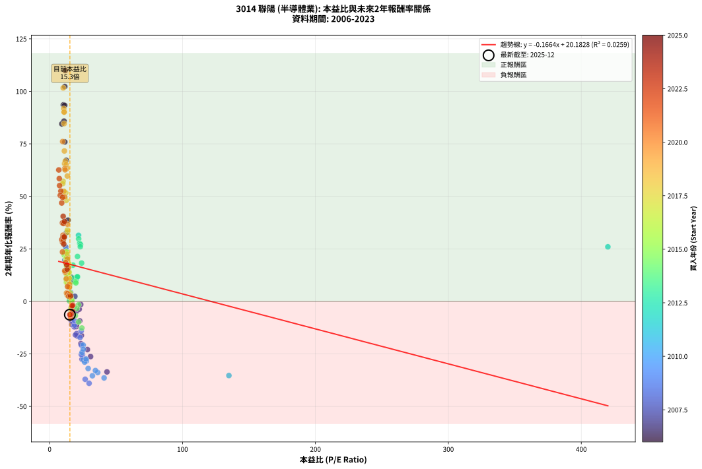
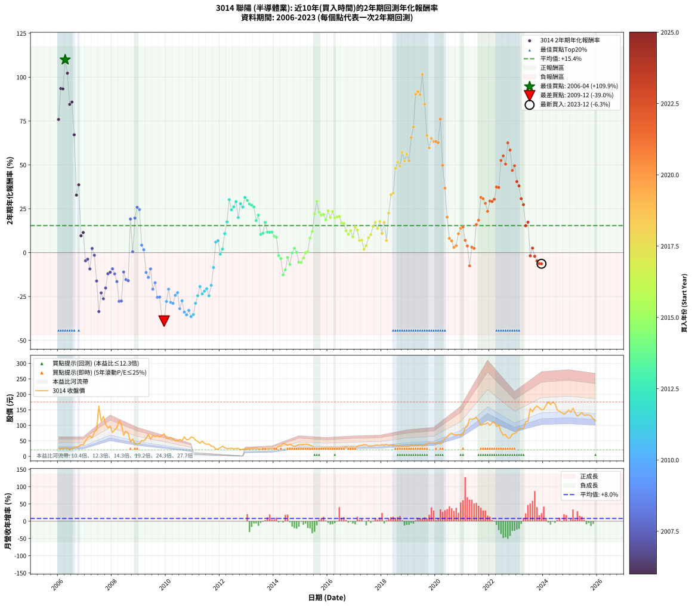

# 3014 聯陽 - 本益比與未來報酬率分析

!!! info "報告資訊"
    - **股票代號**: 3014
    - **公司名稱**: 聯陽
    - **產業別**: 半導體業
    - **分析期間**: 2006-2023 (216 個數據點)
    - **資料來源**: Type 12 (ShowMonthlyK_ChartFlow) 月收盤價與本益比
    - **報酬率口徑**: 含現金股利 (簡化: 年度合計，假設每年7/1入帳)
    - **報告生成時間**: 2026-01-10 22:45:50 CST

## 📈 視覺化圖表

### 圖表1: 本益比 vs 未來報酬率關係

*圖表1：3014 聯陽 本益比與2年期未來報酬率關係 (2006-2023)*

### 圖表2: 歷年買入時點的2年期實際報酬率

*圖表2：3014 聯陽 歷年買入時點的2年期實際報酬率 (2006-2023)*

## 📍 買點訊號說明

本報告提供兩種買點提示訊號（顯示於圖表2的股價子圖中）：

### ▲ 小綠色三角形（回測驗證）
- **計算方式**: 使用全部歷史資料計算本益比第25百分位數
- **用途**: 事後驗證，顯示歷史上哪些時點確實為低估區
- **限制**: 當下無法判斷，僅供回測參考
- **特性**: 後見之明（Look-Ahead Bias）

### ▲ 小橘色三角形（即時訊號）
- **計算方式**: 使用截至當月的過去5年資料計算本益比第25百分位數
- **用途**: 實際投資決策，當時即可判斷
- **優勢**: 可操作性強，符合實務需求
- **特性**: 無後見之明，滾動窗口計算

!!! tip "如何使用兩種訊號"
    - **綠色▲** 幫助理解歷史估值機會，驗證策略有效性
    - **橘色▲** 可作為實際買進參考，但仍需搭配基本面分析
    - 兩種訊號重疊時，表示即時判斷與事後驗證一致，信心度較高
    - 僅有綠色▲時，表示當時無法判斷（需要未來資料才能確認）
    - 僅有橘色▲時，表示即時判斷為買點，但事後可能不是最佳時機

## 📊 估值分析摘要

| 指標 | 數值 |
|:---:|:---:|
| **目前本益比** (2023-12) | **15.26 倍** |
| **歷史平均本益比** | 18.89 倍 |
| **估值水準** | 🟡 合理範圍 |
| **預期2年年化報酬率** | **+17.64%** |
| **歷史平均報酬率** | +15.43% |
| **相關係數 (R²)** | 0.0259 |
| **趨勢線斜率** | -0.1664 |

!!! abstract "核心洞察"
    目前本益比接近歷史平均，預期報酬率符合長期趨勢

    根據歷史數據回測，3014 聯陽 在目前本益比 **15.3倍** 的估值水準下，
    預期未來2年年化報酬率約為 **+17.6%**。

    **重要提醒**: 本分析基於歷史數據統計，實際報酬率會受到公司基本面變化、產業趨勢、
    總體經濟環境等多重因素影響。R² = 0.03 表示本益比可解釋約 2.6% 的報酬率變異。

## 📈 歷史估值統計

### 最佳買點 (最高報酬率)

| 項目 | 數值 |
|:---:|:---:|
| 起始時間 | 2006-04 |
| 當時本益比 | 11.75 倍 |
| 起始價格 | 26.9 元 |
| 2年後價格 | 115.0 元 |
| **2年年化報酬率** | **+109.94%** |

### 最差買點 (最低報酬率)

| 項目 | 數值 |
|:---:|:---:|
| 起始時間 | 2009-12 |
| 當時本益比 | 29.71 倍 |
| 起始價格 | 72.5 元 |
| 2年後價格 | 23.5 元 |
| **2年年化報酬率** | **-38.99%** |

## 🎯 投資啟示

### 本益比與報酬率關係

趨勢線方程式: **y = -0.1664x + 20.1828**

!!! note "負相關"
    本益比與未來報酬率呈現負相關。較低的本益比通常帶來較高的未來報酬率，
    但相關性不算非常強。**估值仍是重要參考指標之一**。

### 估值區間建議

基於歷史數據分析:

- **🟢 低估區** (P/E < 15.1): 預期報酬率較高，可考慮增加持股
- **🟡 合理區** (P/E 15.1-22.7): 預期報酬率符合長期趨勢，正常持有
- **🔴 高估區** (P/E > 22.7): 預期報酬率較低，可考慮減碼或觀望

!!! danger "風險提示"
    - 過去表現不代表未來結果
    - 本分析假設公司基本面無重大結構性變化
    - 產業環境劇變可能使歷史規律失效
    - 應結合公司財報、產業趨勢、總體經濟等多重因素綜合判斷

!!! success "長期投資觀點"
    歷史數據顯示，在合理或低估的估值水準買入並長期持有，
    往往能獲得較佳的投資報酬。**耐心等待好價格**是價值投資的核心原則。

## 📊 數據品質

- **資料來源**: GoodInfo.tw Type 12 (ShowMonthlyK_ChartFlow)
- **資料頻率**: 月度收盤價與本益比
- **回測期間**: 2006-2023
- **數據點數量**: 216 個 (每個點代表一次2年期回測)

### 計算方法說明

1. **2年期年化報酬率**:
   - 對每個歷史時點，計算其後2年的實際投資報酬率
   - 期末價值(不含股利): 期末價格
   - 期末價值(含現金股利): 期末價格 + 持有期間內的現金股利合計 (簡化: 年度合計，假設每年7/1入帳)
   - 公式: 年化報酬率 = [(期末價值/期初價格)^(1/年數) - 1] × 100%

2. **本益比 (P/E Ratio)**:
   - 使用當時的月收盤價與EPS計算
   - 資料來源: Type 12 月度河流圖本益比數據

3. **趨勢線 (Linear Regression)**:
   - 使用最小平方法擬合線性趨勢線
   - R²值衡量本益比對報酬率的解釋能力

---

*本報告由 Stock Analysis System v1.9.0 自動生成*
*數據更新時間: 2026-01-10 22:45:50 CST*

## 📋 月度回測明細表

（每一列對應時間線圖中的一個買入點；可用來對照 SVG 圖上的每個點。）

| 買入月份 | 賣出月份 | 回測期限_年 | 實際持有年數 | 買入本益比_倍 | 買入收盤價_元 | 賣出收盤價_元 | 現金股利合計_元 | 總報酬率_pct | 年化報酬率_pct |
| --- | --- | --- | --- | --- | --- | --- | --- | --- | --- |
| 2006-01 | 2008-01 | 2 | 1.999 | 11.40 | 26.10 | 77.00 | 3.69 | +209.15 | +75.89 |
| 2006-02 | 2008-02 | 2 | 1.999 | 10.35 | 23.70 | 85.00 | 3.69 | +274.21 | +93.53 |
| 2006-03 | 2008-03 | 2 | 2.001 | 11.31 | 25.90 | 93.20 | 3.69 | +274.08 | +93.32 |
| 2006-04 | 2008-04 | 2 | 2.001 | 11.75 | 26.90 | 115.00 | 3.69 | +341.22 | +109.94 |
| 2006-05 | 2008-05 | 2 | 2.001 | 11.38 | 26.05 | 103.00 | 3.69 | +309.55 | +102.28 |
| 2006-06 | 2008-06 | 2 | 2.001 | 9.21 | 21.10 | 68.20 | 3.69 | +240.70 | +84.50 |
| 2006-07 | 2008-07 | 2 | 2.001 | 10.85 | 24.85 | 80.90 | 4.99 | +245.63 | +85.83 |
| 2006-08 | 2008-08 | 2 | 2.001 | 12.49 | 28.60 | 75.00 | 4.99 | +179.68 | +67.18 |
| 2006-09 | 2008-09 | 2 | 2.001 | 12.75 | 29.20 | 46.50 | 4.99 | +76.33 | +32.76 |
| 2006-10 | 2008-10 | 2 | 2.001 | 13.84 | 31.70 | 56.00 | 4.99 | +92.39 | +38.67 |
| 2006-11 | 2008-11 | 2 | 2.001 | 16.46 | 37.70 | 40.30 | 4.99 | +20.13 | +9.60 |
| 2006-12 | 2008-12 | 2 | 2.001 | 16.16 | 37.00 | 41.00 | 4.99 | +24.29 | +11.48 |
| 2007-01 | 2009-01 | 2 | 2.001 | 20.23 | 50.60 | 41.00 | 4.99 | -9.11 | -4.66 |
| 2007-02 | 2009-02 | 2 | 2.001 | 22.24 | 60.30 | 50.90 | 4.99 | -7.32 | -3.73 |
| 2007-03 | 2009-03 | 2 | 2.001 | 22.65 | 66.20 | 49.50 | 4.99 | -17.69 | -9.27 |
| 2007-04 | 2009-04 | 2 | 2.001 | 19.02 | 59.60 | 57.50 | 4.99 | +4.85 | +2.39 |
| 2007-05 | 2009-05 | 2 | 2.001 | 23.41 | 78.30 | 71.00 | 4.99 | -2.95 | -1.49 |
| 2007-06 | 2009-06 | 2 | 2.001 | 23.91 | 85.00 | 54.70 | 4.99 | -29.78 | -16.19 |
| 2007-07 | 2009-07 | 2 | 2.001 | 43.15 | 162.50 | 67.70 | 3.99 | -55.88 | -33.56 |
| 2007-08 | 2009-08 | 2 | 2.001 | 28.42 | 113.00 | 63.10 | 3.99 | -40.63 | -22.93 |
| 2007-09 | 2009-09 | 2 | 2.001 | 30.81 | 129.00 | 66.10 | 3.99 | -45.67 | -26.27 |
| 2007-10 | 2009-10 | 2 | 2.001 | 23.53 | 103.50 | 62.00 | 3.99 | -36.24 | -20.14 |
| 2007-11 | 2009-11 | 2 | 2.001 | 20.00 | 92.20 | 67.40 | 3.99 | -22.57 | -12.00 |
| 2007-12 | 2009-12 | 2 | 2.001 | 20.12 | 97.00 | 72.50 | 3.99 | -21.15 | -11.19 |
| 2008-01 | 2010-01 | 2 | 2.001 | 16.38 | 77.00 | 59.50 | 3.99 | -17.55 | -9.19 |
| 2008-02 | 2010-03 | 2 | 2.081 | 18.56 | 85.00 | 61.00 | 3.99 | -23.54 | -12.10 |
| 2008-03 | 2010-03 | 2 | 1.999 | 20.90 | 93.20 | 61.00 | 3.99 | -30.27 | -16.51 |
| 2008-04 | 2010-04 | 2 | 1.999 | 26.50 | 115.00 | 56.10 | 3.99 | -47.75 | -27.73 |
| 2008-05 | 2010-05 | 2 | 1.999 | 24.41 | 103.00 | 50.10 | 3.99 | -47.49 | -27.55 |
| 2008-06 | 2010-06 | 2 | 1.999 | 16.63 | 68.20 | 50.00 | 3.99 | -20.84 | -11.03 |
| 2008-07 | 2010-07 | 2 | 1.999 | 20.33 | 80.90 | 55.00 | 3.00 | -28.31 | -15.34 |
| 2008-08 | 2010-08 | 2 | 1.999 | 19.43 | 75.00 | 50.00 | 3.00 | -29.33 | -15.95 |
| 2008-09 | 2010-09 | 2 | 1.999 | 12.43 | 46.50 | 63.00 | 3.00 | +41.94 | +19.15 |
| 2008-10 | 2010-10 | 2 | 1.999 | 15.47 | 56.00 | 53.60 | 3.00 | +1.07 | +0.53 |
| 2008-11 | 2010-11 | 2 | 1.999 | 11.51 | 40.30 | 54.70 | 3.00 | +43.18 | +19.67 |
| 2008-12 | 2010-12 | 2 | 1.999 | 12.13 | 41.00 | 61.90 | 3.00 | +58.29 | +25.83 |
| 2009-01 | 2011-01 | 2 | 1.999 | 12.42 | 41.00 | 60.60 | 3.00 | +55.12 | +24.57 |
| 2009-02 | 2011-02 | 2 | 1.999 | 15.79 | 50.90 | 52.30 | 3.00 | +8.64 | +4.24 |
| 2009-03 | 2011-03 | 2 | 1.999 | 15.74 | 49.50 | 48.15 | 3.00 | +3.33 | +1.65 |
| 2009-04 | 2011-04 | 2 | 1.999 | 18.75 | 57.50 | 42.25 | 3.00 | -21.30 | -11.30 |
| 2009-05 | 2011-05 | 2 | 1.999 | 23.76 | 71.00 | 49.40 | 3.00 | -26.20 | -14.10 |
| 2009-06 | 2011-06 | 2 | 1.999 | 18.80 | 54.70 | 42.05 | 3.00 | -17.64 | -9.25 |
| 2009-07 | 2011-07 | 2 | 1.999 | 23.91 | 67.70 | 38.95 | 3.50 | -37.30 | -20.83 |
| 2009-08 | 2011-08 | 2 | 1.999 | 22.92 | 63.10 | 39.80 | 3.50 | -31.38 | -17.17 |
| 2009-09 | 2011-09 | 2 | 1.999 | 24.71 | 66.10 | 33.25 | 3.50 | -44.40 | -25.45 |
| 2009-10 | 2011-10 | 2 | 1.999 | 23.88 | 62.00 | 31.10 | 3.50 | -44.19 | -25.31 |
| 2009-11 | 2011-11 | 2 | 1.999 | 26.76 | 67.40 | 23.20 | 3.50 | -60.39 | -37.08 |
| 2009-12 | 2011-12 | 2 | 1.999 | 29.71 | 72.50 | 23.50 | 3.50 | -62.76 | -38.99 |
| 2010-01 | 2012-01 | 2 | 1.999 | 25.19 | 59.50 | 27.50 | 3.50 | -47.90 | -27.84 |
| 2010-02 | 2012-02 | 2 | 1.999 | 25.30 | 57.80 | 32.75 | 3.50 | -37.28 | -20.82 |
| 2010-03 | 2012-03 | 2 | 2.001 | 27.63 | 61.00 | 27.80 | 3.50 | -48.69 | -28.35 |
| 2010-04 | 2012-04 | 2 | 2.001 | 26.34 | 56.10 | 24.85 | 3.50 | -49.47 | -28.90 |
| 2010-05 | 2012-05 | 2 | 2.001 | 24.41 | 50.10 | 25.20 | 3.50 | -42.71 | -24.30 |
| 2010-06 | 2012-06 | 2 | 2.001 | 25.32 | 50.00 | 26.30 | 3.50 | -40.40 | -22.79 |
| 2010-07 | 2012-07 | 2 | 2.001 | 28.99 | 55.00 | 23.95 | 1.50 | -53.73 | -31.96 |
| 2010-08 | 2012-08 | 2 | 2.001 | 27.47 | 50.00 | 24.80 | 1.50 | -47.40 | -27.46 |
| 2010-09 | 2012-09 | 2 | 2.001 | 36.15 | 63.00 | 26.05 | 1.50 | -56.27 | -33.85 |
| 2010-10 | 2012-10 | 2 | 2.001 | 32.19 | 53.60 | 20.85 | 1.50 | -58.30 | -35.41 |
| 2010-11 | 2012-11 | 2 | 2.001 | 34.46 | 54.70 | 23.10 | 1.50 | -55.03 | -32.92 |
| 2010-12 | 2012-12 | 2 | 2.001 | 40.99 | 61.90 | 23.50 | 1.50 | -59.61 | -36.43 |
| 2011-01 | 2013-01 | 2 | 2.001 | 134.90 | 60.60 | 23.85 | 1.50 | -58.17 | -35.30 |
| 2011-02 | 2013-02 | 2 | 2.001 |  | 52.30 | 24.95 | 1.50 | -49.43 | -28.87 |
| 2011-03 | 2013-03 | 2 | 2.001 |  | 48.15 | 25.90 | 1.50 | -43.09 | -24.55 |
| 2011-04 | 2013-04 | 2 | 2.001 |  | 42.25 | 26.00 | 1.50 | -34.91 | -19.31 |
| 2011-05 | 2013-05 | 2 | 2.001 |  | 49.40 | 27.40 | 1.50 | -41.50 | -23.50 |
| 2011-06 | 2013-06 | 2 | 2.001 |  | 42.05 | 24.10 | 1.50 | -39.12 | -21.96 |
| 2011-07 | 2013-07 | 2 | 2.001 |  | 38.95 | 23.35 | 1.20 | -36.96 | -20.59 |
| 2011-08 | 2013-08 | 2 | 2.001 |  | 39.80 | 21.40 | 1.20 | -43.21 | -24.62 |
| 2011-09 | 2013-09 | 2 | 2.001 |  | 33.25 | 20.80 | 1.20 | -33.82 | -18.64 |
| 2011-10 | 2013-10 | 2 | 2.001 |  | 31.10 | 24.85 | 1.20 | -16.23 | -8.47 |
| 2011-11 | 2013-11 | 2 | 2.001 |  | 23.20 | 24.85 | 1.20 | +12.30 | +5.97 |
| 2011-12 | 2013-12 | 2 | 2.001 |  | 23.50 | 25.60 | 1.20 | +14.06 | +6.79 |
| 2012-01 | 2014-01 | 2 | 2.001 |  | 27.50 | 25.80 | 1.20 | -1.80 | -0.91 |
| 2012-02 | 2014-03 | 2 | 2.081 |  | 32.75 | 32.95 | 1.20 | +4.29 | +2.04 |
| 2012-03 | 2014-03 | 2 | 1.999 |  | 27.80 | 32.95 | 1.20 | +22.86 | +10.85 |
| 2012-04 | 2014-04 | 2 | 1.999 |  | 24.85 | 33.10 | 1.20 | +38.04 | +17.51 |
| 2012-05 | 2014-05 | 2 | 1.999 |  | 25.20 | 41.50 | 1.20 | +69.46 | +30.20 |
| 2012-06 | 2014-06 | 2 | 1.999 |  | 26.30 | 39.50 | 1.20 | +54.77 | +24.42 |
| 2012-07 | 2014-07 | 2 | 1.999 |  | 23.95 | 35.65 | 2.40 | +58.86 | +26.06 |
| 2012-08 | 2014-08 | 2 | 1.999 |  | 24.80 | 38.90 | 2.40 | +66.52 | +29.06 |
| 2012-09 | 2014-09 | 2 | 1.999 |  | 26.05 | 35.10 | 2.40 | +43.94 | +19.99 |
| 2012-10 | 2014-10 | 2 | 1.999 |  | 20.85 | 31.70 | 2.40 | +63.53 | +27.90 |
| 2012-11 | 2014-11 | 2 | 1.999 | 420.00 | 23.10 | 34.25 | 2.40 | +58.64 | +25.97 |
| 2012-12 | 2014-12 | 2 | 1.999 | 21.76 | 23.50 | 38.20 | 2.40 | +72.75 | +31.46 |
| 2013-01 | 2015-01 | 2 | 1.999 | 21.85 | 23.85 | 37.75 | 2.40 | +68.33 | +29.76 |
| 2013-02 | 2015-02 | 2 | 1.999 | 22.61 | 24.95 | 38.25 | 2.40 | +62.91 | +27.66 |
| 2013-03 | 2015-03 | 2 | 1.999 | 23.23 | 25.90 | 39.40 | 2.40 | +61.37 | +27.05 |
| 2013-04 | 2015-04 | 2 | 1.999 | 23.08 | 26.00 | 38.90 | 2.40 | +58.83 | +26.05 |
| 2013-05 | 2015-05 | 2 | 1.999 | 24.07 | 27.40 | 35.90 | 2.40 | +39.77 | +18.24 |
| 2013-06 | 2015-06 | 2 | 1.999 | 20.96 | 24.10 | 33.10 | 2.40 | +47.29 | +21.38 |
| 2013-07 | 2015-07 | 2 | 1.999 | 20.10 | 23.35 | 25.25 | 3.19 | +21.81 | +10.38 |
| 2013-08 | 2015-08 | 2 | 1.999 | 18.24 | 21.40 | 23.20 | 3.19 | +23.33 | +11.06 |
| 2013-09 | 2015-09 | 2 | 1.999 | 17.55 | 20.80 | 25.40 | 3.19 | +37.47 | +17.26 |
| 2013-10 | 2015-10 | 2 | 1.999 | 20.77 | 24.85 | 27.80 | 3.19 | +24.72 | +11.69 |
| 2013-11 | 2015-11 | 2 | 1.999 | 20.57 | 24.85 | 27.75 | 3.19 | +24.52 | +11.60 |
| 2013-12 | 2015-12 | 2 | 1.999 | 20.98 | 25.60 | 28.75 | 3.19 | +24.78 | +11.71 |
| 2014-01 | 2016-01 | 2 | 1.999 | 19.57 | 25.80 | 27.65 | 3.19 | +19.55 | +9.34 |
| 2014-02 | 2016-02 | 2 | 1.999 | 19.76 | 28.00 | 29.95 | 3.19 | +18.37 | +8.80 |
| 2014-03 | 2016-03 | 2 | 2.001 | 21.75 | 32.95 | 28.70 | 3.19 | -3.21 | -1.62 |
| 2014-04 | 2016-04 | 2 | 2.001 | 20.52 | 33.10 | 27.70 | 3.19 | -6.67 | -3.39 |
| 2014-05 | 2016-05 | 2 | 2.001 | 24.25 | 41.50 | 28.45 | 3.19 | -23.75 | -12.67 |
| 2014-06 | 2016-06 | 2 | 2.001 | 21.82 | 39.50 | 28.95 | 3.19 | -18.63 | -9.79 |
| 2014-07 | 2016-07 | 2 | 2.001 | 18.68 | 35.65 | 29.70 | 4.00 | -5.47 | -2.77 |
| 2014-08 | 2016-08 | 2 | 2.001 | 19.39 | 38.90 | 29.80 | 4.00 | -13.11 | -6.78 |
| 2014-09 | 2016-09 | 2 | 2.001 | 16.67 | 35.10 | 31.00 | 4.00 | -0.28 | -0.14 |
| 2014-10 | 2016-10 | 2 | 2.001 | 14.39 | 31.70 | 29.30 | 4.00 | +5.05 | +2.49 |
| 2014-11 | 2016-11 | 2 | 2.001 | 14.88 | 34.25 | 30.40 | 4.00 | +0.44 | +0.22 |
| 2014-12 | 2016-12 | 2 | 2.001 | 15.92 | 38.20 | 30.15 | 4.00 | -10.60 | -5.44 |
| 2015-01 | 2017-01 | 2 | 2.001 | 15.84 | 37.75 | 29.60 | 4.00 | -10.99 | -5.65 |
| 2015-02 | 2017-02 | 2 | 2.001 | 16.16 | 38.25 | 31.95 | 4.00 | -6.01 | -3.05 |
| 2015-03 | 2017-03 | 2 | 2.001 | 16.77 | 39.40 | 35.35 | 4.00 | -0.12 | -0.06 |
| 2015-04 | 2017-04 | 2 | 2.001 | 16.67 | 38.90 | 35.30 | 4.00 | +1.03 | +0.51 |
| 2015-05 | 2017-05 | 2 | 2.001 | 15.50 | 35.90 | 38.10 | 4.00 | +17.27 | +8.29 |
| 2015-06 | 2017-06 | 2 | 2.001 | 14.39 | 33.10 | 37.60 | 4.00 | +25.68 | +12.10 |
| 2015-07 | 2017-07 | 2 | 2.001 | 11.06 | 25.25 | 32.70 | 4.94 | +49.05 | +22.07 |
| 2015-08 | 2017-08 | 2 | 2.001 | 10.24 | 23.20 | 33.80 | 4.94 | +66.96 | +29.19 |
| 2015-09 | 2017-09 | 2 | 2.001 | 11.29 | 25.40 | 33.55 | 4.94 | +51.52 | +23.07 |
| 2015-10 | 2017-10 | 2 | 2.001 | 12.45 | 27.80 | 36.05 | 4.94 | +47.43 | +21.40 |
| 2015-11 | 2017-11 | 2 | 2.001 | 12.52 | 27.75 | 36.20 | 4.94 | +48.23 | +21.74 |
| 2015-12 | 2017-12 | 2 | 2.001 | 13.07 | 28.75 | 35.55 | 4.94 | +40.82 | +18.65 |
| 2016-01 | 2018-01 | 2 | 2.001 | 12.48 | 27.65 | 37.45 | 4.94 | +53.29 | +23.79 |
| 2016-02 | 2018-03 | 2 | 2.081 | 13.43 | 29.95 | 38.80 | 4.94 | +46.03 | +19.96 |
| 2016-03 | 2018-03 | 2 | 1.999 | 12.78 | 28.70 | 38.80 | 4.94 | +52.39 | +23.46 |
| 2016-04 | 2018-04 | 2 | 1.999 | 12.26 | 27.70 | 34.85 | 4.94 | +43.63 | +19.86 |
| 2016-05 | 2018-05 | 2 | 1.999 | 12.51 | 28.45 | 36.30 | 4.94 | +44.94 | +20.41 |
| 2016-06 | 2018-06 | 2 | 1.999 | 12.64 | 28.95 | 37.20 | 4.94 | +45.54 | +20.66 |
| 2016-07 | 2018-07 | 2 | 1.999 | 12.89 | 29.70 | 35.15 | 5.44 | +36.65 | +16.91 |
| 2016-08 | 2018-08 | 2 | 1.999 | 12.84 | 29.80 | 35.10 | 5.44 | +36.03 | +16.64 |
| 2016-09 | 2018-09 | 2 | 1.999 | 13.28 | 31.00 | 33.80 | 5.44 | +26.57 | +12.51 |
| 2016-10 | 2018-10 | 2 | 1.999 | 12.47 | 29.30 | 30.30 | 5.44 | +21.97 | +10.45 |
| 2016-11 | 2018-11 | 2 | 1.999 | 12.85 | 30.40 | 33.05 | 5.44 | +26.60 | +12.53 |
| 2016-12 | 2018-12 | 2 | 1.999 | 12.67 | 30.15 | 30.40 | 5.44 | +18.86 | +9.03 |
| 2017-01 | 2019-01 | 2 | 1.999 | 12.40 | 29.60 | 33.40 | 5.44 | +31.20 | +14.55 |
| 2017-02 | 2019-02 | 2 | 1.999 | 13.34 | 31.95 | 35.25 | 5.44 | +27.34 | +12.86 |
| 2017-03 | 2019-03 | 2 | 1.999 | 14.71 | 35.35 | 35.05 | 5.44 | +14.53 | +7.02 |
| 2017-04 | 2019-04 | 2 | 1.999 | 14.65 | 35.30 | 35.05 | 5.44 | +14.69 | +7.10 |
| 2017-05 | 2019-05 | 2 | 1.999 | 15.76 | 38.10 | 34.10 | 5.44 | +3.77 | +1.87 |
| 2017-06 | 2019-06 | 2 | 1.999 | 15.51 | 37.60 | 35.25 | 5.44 | +8.21 | +4.03 |
| 2017-07 | 2019-07 | 2 | 1.999 | 13.44 | 32.70 | 33.25 | 5.20 | +17.59 | +8.44 |
| 2017-08 | 2019-08 | 2 | 1.999 | 13.85 | 33.80 | 35.85 | 5.20 | +21.45 | +10.21 |
| 2017-09 | 2019-09 | 2 | 1.999 | 13.71 | 33.55 | 39.10 | 5.20 | +32.04 | +14.92 |
| 2017-10 | 2019-10 | 2 | 1.999 | 14.68 | 36.05 | 44.40 | 5.20 | +37.59 | +17.31 |
| 2017-11 | 2019-11 | 2 | 1.999 | 14.70 | 36.20 | 41.70 | 5.20 | +29.56 | +13.83 |
| 2017-12 | 2019-12 | 2 | 1.999 | 14.39 | 35.55 | 44.15 | 5.20 | +38.82 | +17.84 |
| 2018-01 | 2020-01 | 2 | 1.999 | 14.86 | 37.45 | 40.90 | 5.20 | +23.10 | +10.96 |
| 2018-02 | 2020-02 | 2 | 1.999 | 13.96 | 35.90 | 44.10 | 5.20 | +37.33 | +17.20 |
| 2018-03 | 2020-03 | 2 | 2.001 | 14.80 | 38.80 | 39.15 | 5.20 | +14.31 | +6.91 |
| 2018-04 | 2020-04 | 2 | 2.001 | 13.04 | 34.85 | 47.15 | 5.20 | +50.22 | +22.55 |
| 2018-05 | 2020-05 | 2 | 2.001 | 13.33 | 36.30 | 59.00 | 5.20 | +76.86 | +32.96 |
| 2018-06 | 2020-06 | 2 | 2.001 | 13.41 | 37.20 | 61.60 | 5.20 | +79.57 | +33.98 |
| 2018-07 | 2020-07 | 2 | 2.001 | 12.44 | 35.15 | 71.10 | 6.00 | +119.35 | +48.06 |
| 2018-08 | 2020-08 | 2 | 2.001 | 12.20 | 35.10 | 74.80 | 6.00 | +130.20 | +51.68 |
| 2018-09 | 2020-09 | 2 | 2.001 | 11.55 | 33.80 | 69.40 | 6.00 | +123.08 | +49.32 |
| 2018-10 | 2020-10 | 2 | 2.001 | 10.17 | 30.30 | 68.90 | 6.00 | +147.19 | +57.18 |
| 2018-11 | 2020-11 | 2 | 2.001 | 10.91 | 33.05 | 70.60 | 6.00 | +131.77 | +52.20 |
| 2018-12 | 2020-12 | 2 | 2.001 | 9.87 | 30.40 | 68.10 | 6.00 | +143.75 | +56.08 |
| 2019-01 | 2021-01 | 2 | 2.001 | 10.76 | 33.40 | 71.60 | 6.00 | +132.34 | +52.38 |
| 2019-02 | 2021-02 | 2 | 2.001 | 11.26 | 35.25 | 90.70 | 6.00 | +174.33 | +65.57 |
| 2019-03 | 2021-03 | 2 | 2.001 | 11.11 | 35.05 | 97.30 | 6.00 | +194.72 | +71.61 |
| 2019-04 | 2021-04 | 2 | 2.001 | 11.02 | 35.05 | 121.00 | 6.00 | +262.34 | +90.27 |
| 2019-05 | 2021-05 | 2 | 2.001 | 10.64 | 34.10 | 119.50 | 6.00 | +268.04 | +91.76 |
| 2019-06 | 2021-06 | 2 | 2.001 | 10.91 | 35.25 | 121.50 | 6.00 | +261.70 | +90.10 |
| 2019-07 | 2021-07 | 2 | 2.001 | 10.22 | 33.25 | 126.00 | 9.30 | +306.92 | +101.63 |
| 2019-08 | 2021-08 | 2 | 2.001 | 10.93 | 35.85 | 113.00 | 9.30 | +241.14 | +84.62 |
| 2019-09 | 2021-09 | 2 | 2.001 | 11.83 | 39.10 | 99.50 | 9.30 | +178.26 | +66.75 |
| 2019-10 | 2021-10 | 2 | 2.001 | 13.33 | 44.40 | 104.00 | 9.30 | +155.18 | +59.69 |
| 2019-11 | 2021-11 | 2 | 2.001 | 12.43 | 41.70 | 104.50 | 9.30 | +172.90 | +65.14 |
| 2019-12 | 2021-12 | 2 | 2.001 | 13.06 | 44.15 | 108.50 | 9.30 | +166.82 | +63.29 |
| 2020-01 | 2022-01 | 2 | 2.001 | 11.41 | 40.90 | 99.80 | 9.30 | +166.75 | +63.27 |
| 2020-02 | 2022-03 | 2 | 2.081 | 11.64 | 44.10 | 112.00 | 9.30 | +175.06 | +62.62 |
| 2020-03 | 2022-03 | 2 | 1.999 | 9.81 | 39.15 | 112.00 | 9.30 | +209.83 | +76.09 |
| 2020-04 | 2022-04 | 2 | 1.999 | 11.24 | 47.15 | 96.40 | 9.30 | +124.18 | +49.77 |
| 2020-05 | 2022-05 | 2 | 1.999 | 13.41 | 59.00 | 101.00 | 9.30 | +86.95 | +36.76 |
| 2020-06 | 2022-06 | 2 | 1.999 | 13.38 | 61.60 | 79.70 | 9.30 | +44.48 | +20.22 |
| 2020-07 | 2022-07 | 2 | 1.999 | 14.78 | 71.10 | 68.10 | 15.00 | +16.88 | +8.12 |
| 2020-08 | 2022-08 | 2 | 1.999 | 14.92 | 74.80 | 70.20 | 15.00 | +13.90 | +6.73 |
| 2020-09 | 2022-09 | 2 | 1.999 | 13.30 | 69.40 | 58.60 | 15.00 | +6.05 | +2.98 |
| 2020-10 | 2022-10 | 2 | 1.999 | 12.71 | 68.90 | 59.50 | 15.00 | +8.13 | +3.99 |
| 2020-11 | 2022-11 | 2 | 1.999 | 12.55 | 70.60 | 71.60 | 15.00 | +22.66 | +10.76 |
| 2020-12 | 2022-12 | 2 | 1.999 | 11.68 | 68.10 | 73.30 | 15.00 | +29.66 | +13.88 |
| 2021-01 | 2023-01 | 2 | 1.999 | 11.40 | 71.60 | 79.00 | 15.00 | +31.28 | +14.59 |
| 2021-02 | 2023-02 | 2 | 1.999 | 13.48 | 90.70 | 88.90 | 15.00 | +14.55 | +7.03 |
| 2021-03 | 2023-03 | 2 | 1.999 | 13.56 | 97.30 | 89.80 | 15.00 | +7.71 | +3.79 |
| 2021-04 | 2023-04 | 2 | 1.999 | 15.87 | 121.00 | 88.50 | 15.00 | -14.46 | -7.52 |
| 2021-05 | 2023-05 | 2 | 1.999 | 14.80 | 119.50 | 112.00 | 15.00 | +6.28 | +3.09 |
| 2021-06 | 2023-06 | 2 | 1.999 | 14.26 | 121.50 | 112.50 | 15.00 | +4.94 | +2.44 |
| 2021-07 | 2023-07 | 2 | 1.999 | 14.05 | 126.00 | 154.50 | 15.00 | +34.52 | +16.00 |
| 2021-08 | 2023-08 | 2 | 1.999 | 12.00 | 113.00 | 143.50 | 15.00 | +40.27 | +18.45 |
| 2021-09 | 2023-09 | 2 | 1.999 | 10.09 | 99.50 | 157.00 | 15.00 | +72.86 | +31.50 |
| 2021-10 | 2023-10 | 2 | 1.999 | 10.08 | 104.00 | 162.50 | 15.00 | +70.67 | +30.67 |
| 2021-11 | 2023-11 | 2 | 1.999 | 9.71 | 104.50 | 156.50 | 15.00 | +64.11 | +28.13 |
| 2021-12 | 2023-12 | 2 | 1.999 | 9.68 | 108.50 | 150.50 | 15.00 | +52.53 | +23.52 |
| 2022-01 | 2024-01 | 2 | 1.999 | 9.15 | 99.80 | 152.00 | 15.00 | +67.33 | +29.38 |
| 2022-02 | 2024-02 | 2 | 1.999 | 10.19 | 108.00 | 165.00 | 15.00 | +66.67 | +29.12 |
| 2022-03 | 2024-03 | 2 | 2.001 | 10.88 | 112.00 | 175.50 | 15.00 | +70.09 | +30.39 |
| 2022-04 | 2024-04 | 2 | 2.001 | 9.65 | 96.40 | 167.00 | 15.00 | +88.80 | +37.37 |
| 2022-05 | 2024-05 | 2 | 2.001 | 10.42 | 101.00 | 175.00 | 15.00 | +88.12 | +37.13 |
| 2022-06 | 2024-06 | 2 | 2.001 | 8.49 | 79.70 | 170.50 | 15.00 | +132.75 | +52.52 |
| 2022-07 | 2024-07 | 2 | 2.001 | 7.50 | 68.10 | 150.00 | 14.00 | +140.82 | +55.14 |
| 2022-08 | 2024-08 | 2 | 2.001 | 8.00 | 70.20 | 145.00 | 14.00 | +126.50 | +50.46 |
| 2022-09 | 2024-09 | 2 | 2.001 | 6.92 | 58.60 | 141.00 | 14.00 | +164.51 | +62.58 |
| 2022-10 | 2024-10 | 2 | 2.001 | 7.28 | 59.50 | 135.50 | 14.00 | +151.26 | +58.46 |
| 2022-11 | 2024-11 | 2 | 2.001 | 9.10 | 71.60 | 140.50 | 14.00 | +115.78 | +46.86 |
| 2022-12 | 2024-12 | 2 | 2.001 | 9.70 | 73.30 | 150.00 | 14.00 | +123.74 | +49.54 |
| 2023-01 | 2025-01 | 2 | 2.001 | 10.19 | 79.00 | 142.00 | 14.00 | +97.47 | +40.49 |
| 2023-02 | 2025-02 | 2 | 2.001 | 11.19 | 88.90 | 155.50 | 14.00 | +90.66 | +38.05 |
| 2023-03 | 2025-03 | 2 | 2.001 | 11.04 | 89.80 | 139.50 | 14.00 | +70.94 | +30.72 |
| 2023-04 | 2025-04 | 2 | 2.001 | 10.63 | 88.50 | 129.50 | 14.00 | +62.15 | +27.32 |
| 2023-05 | 2025-05 | 2 | 2.001 | 13.15 | 112.00 | 135.00 | 14.00 | +33.04 | +15.33 |
| 2023-06 | 2025-06 | 2 | 2.001 | 12.92 | 112.50 | 141.00 | 14.00 | +37.78 | +17.37 |
| 2023-07 | 2025-07 | 2 | 2.001 | 17.36 | 154.50 | 132.00 | 17.00 | -3.56 | -1.79 |
| 2023-08 | 2025-08 | 2 | 2.001 | 15.78 | 143.50 | 134.00 | 17.00 | +5.23 | +2.58 |
| 2023-09 | 2025-09 | 2 | 2.001 | 16.91 | 157.00 | 133.50 | 17.00 | -4.14 | -2.09 |
| 2023-10 | 2025-10 | 2 | 2.001 | 17.15 | 162.50 | 130.50 | 17.00 | -9.23 | -4.72 |
| 2023-11 | 2025-11 | 2 | 2.001 | 16.19 | 156.50 | 120.50 | 17.00 | -12.14 | -6.26 |
| 2023-12 | 2025-12 | 2 | 2.001 | 15.26 | 150.50 | 115.00 | 17.00 | -12.29 | -6.34 |
