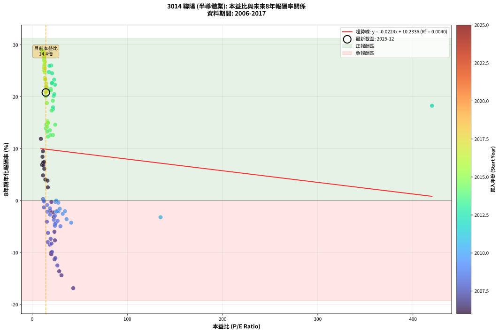

# 3014 聯陽 - 本益比與未來報酬率分析

!!! info "報告資訊"
    - **股票代號**: 3014
    - **公司名稱**: 聯陽
    - **產業別**: 半導體業
    - **分析期間**: 2006-2017 (144 個數據點)
    - **資料來源**: Type 12 (ShowMonthlyK_ChartFlow) 月收盤價與本益比
    - **報酬率口徑**: 含現金股利 (簡化: 年度合計，假設每年7/1入帳)
    - **報告生成時間**: 2026-01-06 00:50:20 CST

## 📈 視覺化圖表

### 圖表1: 本益比 vs 未來報酬率關係

*圖表1：3014 聯陽 本益比與8年期未來報酬率關係 (2006-2017)*

### 圖表2: 歷年買入時點的8年期實際報酬率

*圖表2：3014 聯陽 歷年買入時點的8年期實際報酬率 (2006-2017)*

## 📍 買點訊號說明

本報告提供兩種買點提示訊號（顯示於圖表2的股價子圖中）：

### ▲ 小綠色三角形（回測驗證）
- **計算方式**: 使用全部歷史資料計算本益比第25百分位數
- **用途**: 事後驗證，顯示歷史上哪些時點確實為低估區
- **限制**: 當下無法判斷，僅供回測參考
- **特性**: 後見之明（Look-Ahead Bias）

### ▲ 小橘色三角形（即時訊號）
- **計算方式**: 使用截至當月的過去5年資料計算本益比第25百分位數
- **用途**: 實際投資決策，當時即可判斷
- **優勢**: 可操作性強，符合實務需求
- **特性**: 無後見之明，滾動窗口計算

!!! tip "如何使用兩種訊號"
    - **綠色▲** 幫助理解歷史估值機會，驗證策略有效性
    - **橘色▲** 可作為實際買進參考，但仍需搭配基本面分析
    - 兩種訊號重疊時，表示即時判斷與事後驗證一致，信心度較高
    - 僅有綠色▲時，表示當時無法判斷（需要未來資料才能確認）
    - 僅有橘色▲時，表示即時判斷為買點，但事後可能不是最佳時機

## 📊 估值分析摘要

| 指標 | 數值 |
|:---:|:---:|
| **目前本益比** (2017-12) | **14.39 倍** |
| **歷史平均本益比** | 22.93 倍 |
| **估值水準** | 🟢 相對低估 |
| **預期8年年化報酬率** | **+9.91%** |
| **歷史平均報酬率** | +9.58% |
| **相關係數 (R²)** | 0.0040 |
| **趨勢線斜率** | -0.0224 |

!!! abstract "核心洞察"
    目前本益比顯著低於歷史平均，預期未來報酬率可能較高

    根據歷史數據回測，3014 聯陽 在目前本益比 **14.4倍** 的估值水準下，
    預期未來8年年化報酬率約為 **+9.9%**。

    **重要提醒**: 本分析基於歷史數據統計，實際報酬率會受到公司基本面變化、產業趨勢、
    總體經濟環境等多重因素影響。R² = 0.00 表示本益比可解釋約 0.4% 的報酬率變異。

## 📈 歷史估值統計

### 最佳買點 (最高報酬率)

| 項目 | 數值 |
|:---:|:---:|
| 起始時間 | 2015-08 |
| 當時本益比 | 10.24 倍 |
| 起始價格 | 23.2 元 |
| 8年後價格 | 143.5 元 |
| **8年年化報酬率** | **+29.00%** |

### 最差買點 (最低報酬率)

| 項目 | 數值 |
|:---:|:---:|
| 起始時間 | 2007-07 |
| 當時本益比 | 43.15 倍 |
| 起始價格 | 162.5 元 |
| 8年後價格 | 25.2 元 |
| **8年年化報酬率** | **-16.85%** |

## 🎯 投資啟示

### 本益比與報酬率關係

趨勢線方程式: **y = -0.0224x + 10.2336**

!!! note "負相關"
    本益比與未來報酬率呈現負相關。較低的本益比通常帶來較高的未來報酬率，
    但相關性不算非常強。**估值仍是重要參考指標之一**。

### 估值區間建議

基於歷史數據分析:

- **🟢 低估區** (P/E < 18.3): 預期報酬率較高，可考慮增加持股
- **🟡 合理區** (P/E 18.3-27.5): 預期報酬率符合長期趨勢，正常持有
- **🔴 高估區** (P/E > 27.5): 預期報酬率較低，可考慮減碼或觀望

!!! danger "風險提示"
    - 過去表現不代表未來結果
    - 本分析假設公司基本面無重大結構性變化
    - 產業環境劇變可能使歷史規律失效
    - 應結合公司財報、產業趨勢、總體經濟等多重因素綜合判斷

!!! success "長期投資觀點"
    歷史數據顯示，在合理或低估的估值水準買入並長期持有，
    往往能獲得較佳的投資報酬。**耐心等待好價格**是價值投資的核心原則。

## 📊 數據品質

- **資料來源**: GoodInfo.tw Type 12 (ShowMonthlyK_ChartFlow)
- **資料頻率**: 月度收盤價與本益比
- **回測期間**: 2006-2017
- **數據點數量**: 144 個 (每個點代表一次8年期回測)

### 計算方法說明

1. **8年期年化報酬率**:
   - 對每個歷史時點，計算其後8年的實際投資報酬率
   - 期末價值(不含股利): 期末價格
   - 期末價值(含現金股利): 期末價格 + 持有期間內的現金股利合計 (簡化: 年度合計，假設每年7/1入帳)
   - 公式: 年化報酬率 = [(期末價值/期初價格)^(1/年數) - 1] × 100%

2. **本益比 (P/E Ratio)**:
   - 使用當時的月收盤價與EPS計算
   - 資料來源: Type 12 月度河流圖本益比數據

3. **趨勢線 (Linear Regression)**:
   - 使用最小平方法擬合線性趨勢線
   - R²值衡量本益比對報酬率的解釋能力

---

*本報告由 Stock Analysis System v1.9.0 自動生成*
*數據更新時間: 2026-01-06 00:50:20 CST*

## 📋 月度回測明細表

（每一列對應時間線圖中的一個買入點；可用來對照 SVG 圖上的每個點。）

| 買入月份 | 賣出月份 | 回測期限_年 | 實際持有年數 | 買入本益比_倍 | 買入收盤價_元 | 賣出收盤價_元 | 現金股利合計_元 | 總報酬率_pct | 年化報酬率_pct |
| --- | --- | --- | --- | --- | --- | --- | --- | --- | --- |
| 2006-01 | 2014-01 | 8 | 8.000 | 11.40 | 26.10 | 25.80 | 12.38 | +46.28 | +4.87 |
| 2006-02 | 2014-02 | 8 | 8.000 | 10.35 | 23.70 | 28.00 | 12.38 | +70.38 | +6.89 |
| 2006-03 | 2014-03 | 8 | 8.000 | 11.31 | 25.90 | 32.95 | 12.38 | +75.02 | +7.25 |
| 2006-04 | 2014-04 | 8 | 8.000 | 11.75 | 26.90 | 33.10 | 12.38 | +69.07 | +6.78 |
| 2006-05 | 2014-05 | 8 | 8.000 | 11.38 | 26.05 | 41.50 | 12.38 | +106.83 | +9.51 |
| 2006-06 | 2014-06 | 8 | 8.000 | 9.21 | 21.10 | 39.50 | 12.38 | +145.87 | +11.90 |
| 2006-07 | 2014-07 | 8 | 8.000 | 10.85 | 24.85 | 35.65 | 11.88 | +91.28 | +8.45 |
| 2006-08 | 2014-08 | 8 | 8.000 | 12.49 | 28.60 | 38.90 | 11.88 | +77.57 | +7.44 |
| 2006-09 | 2014-09 | 8 | 8.000 | 12.75 | 29.20 | 35.10 | 11.88 | +60.90 | +6.13 |
| 2006-10 | 2014-10 | 8 | 8.000 | 13.84 | 31.70 | 31.70 | 11.88 | +37.49 | +4.06 |
| 2006-11 | 2014-11 | 8 | 8.000 | 16.46 | 37.70 | 34.25 | 11.88 | +22.37 | +2.56 |
| 2006-12 | 2014-12 | 8 | 8.000 | 16.16 | 37.00 | 38.20 | 11.88 | +35.36 | +3.86 |
| 2007-01 | 2015-01 | 8 | 8.000 | 20.23 | 50.60 | 37.75 | 11.88 | -1.91 | -0.24 |
| 2007-02 | 2015-02 | 8 | 8.000 | 22.24 | 60.30 | 38.25 | 11.88 | -16.86 | -2.28 |
| 2007-03 | 2015-03 | 8 | 8.000 | 22.65 | 66.20 | 39.40 | 11.88 | -22.53 | -3.14 |
| 2007-04 | 2015-04 | 8 | 8.000 | 19.02 | 59.60 | 38.90 | 11.88 | -14.79 | -1.98 |
| 2007-05 | 2015-05 | 8 | 8.000 | 23.41 | 78.30 | 35.90 | 11.88 | -38.97 | -5.99 |
| 2007-06 | 2015-06 | 8 | 8.000 | 23.91 | 85.00 | 33.10 | 11.88 | -47.08 | -7.65 |
| 2007-07 | 2015-07 | 8 | 8.000 | 43.15 | 162.50 | 25.25 | 11.88 | -77.15 | -16.85 |
| 2007-08 | 2015-08 | 8 | 8.000 | 28.42 | 113.00 | 23.20 | 11.88 | -68.95 | -13.60 |
| 2007-09 | 2015-09 | 8 | 8.000 | 30.81 | 129.00 | 25.40 | 11.88 | -71.10 | -14.37 |
| 2007-10 | 2015-10 | 8 | 8.000 | 23.53 | 103.50 | 27.80 | 11.88 | -61.66 | -11.29 |
| 2007-11 | 2015-11 | 8 | 8.000 | 20.00 | 92.20 | 27.75 | 11.88 | -57.01 | -10.02 |
| 2007-12 | 2015-12 | 8 | 8.000 | 20.12 | 97.00 | 28.75 | 11.88 | -58.11 | -10.31 |
| 2008-01 | 2016-01 | 8 | 8.000 | 16.38 | 77.00 | 27.65 | 11.88 | -48.66 | -8.00 |
| 2008-02 | 2016-02 | 8 | 8.000 | 18.56 | 85.00 | 29.95 | 11.88 | -50.78 | -8.48 |
| 2008-03 | 2016-03 | 8 | 8.000 | 20.90 | 93.20 | 28.70 | 11.88 | -56.45 | -9.87 |
| 2008-04 | 2016-04 | 8 | 8.000 | 26.50 | 115.00 | 27.70 | 11.88 | -65.58 | -12.48 |
| 2008-05 | 2016-05 | 8 | 8.000 | 24.41 | 103.00 | 28.45 | 11.88 | -60.84 | -11.06 |
| 2008-06 | 2016-06 | 8 | 8.000 | 16.63 | 68.20 | 28.95 | 11.88 | -40.12 | -6.21 |
| 2008-07 | 2016-07 | 8 | 8.000 | 20.33 | 80.90 | 29.70 | 10.90 | -49.82 | -8.26 |
| 2008-08 | 2016-08 | 8 | 8.000 | 19.43 | 75.00 | 29.80 | 10.90 | -45.74 | -7.36 |
| 2008-09 | 2016-09 | 8 | 8.000 | 12.43 | 46.50 | 31.00 | 10.90 | -9.90 | -1.29 |
| 2008-10 | 2016-10 | 8 | 8.000 | 15.47 | 56.00 | 29.30 | 10.90 | -28.22 | -4.06 |
| 2008-11 | 2016-11 | 8 | 8.000 | 11.51 | 40.30 | 30.40 | 10.90 | +2.47 | +0.31 |
| 2008-12 | 2016-12 | 8 | 8.000 | 12.13 | 41.00 | 30.15 | 10.90 | +0.11 | +0.01 |
| 2009-01 | 2017-01 | 8 | 8.000 | 12.42 | 41.00 | 29.60 | 10.90 | -1.23 | -0.15 |
| 2009-02 | 2017-02 | 8 | 8.000 | 15.79 | 50.90 | 31.95 | 10.90 | -15.82 | -2.13 |
| 2009-03 | 2017-03 | 8 | 8.000 | 15.74 | 49.50 | 35.35 | 10.90 | -6.57 | -0.85 |
| 2009-04 | 2017-04 | 8 | 8.000 | 18.75 | 57.50 | 35.30 | 10.90 | -19.66 | -2.70 |
| 2009-05 | 2017-05 | 8 | 8.000 | 23.76 | 71.00 | 38.10 | 10.90 | -30.99 | -4.53 |
| 2009-06 | 2017-06 | 8 | 8.000 | 18.80 | 54.70 | 37.60 | 10.90 | -11.34 | -1.49 |
| 2009-07 | 2017-07 | 8 | 8.000 | 23.91 | 67.70 | 32.70 | 12.83 | -32.74 | -4.84 |
| 2009-08 | 2017-08 | 8 | 8.000 | 22.92 | 63.10 | 33.80 | 12.83 | -26.10 | -3.71 |
| 2009-09 | 2017-09 | 8 | 8.000 | 24.71 | 66.10 | 33.55 | 12.83 | -29.83 | -4.33 |
| 2009-10 | 2017-10 | 8 | 8.000 | 23.88 | 62.00 | 36.05 | 12.83 | -21.16 | -2.93 |
| 2009-11 | 2017-11 | 8 | 8.000 | 26.76 | 67.40 | 36.20 | 12.83 | -27.25 | -3.90 |
| 2009-12 | 2017-12 | 8 | 8.000 | 29.71 | 72.50 | 35.55 | 12.83 | -33.27 | -4.93 |
| 2010-01 | 2018-01 | 8 | 8.000 | 25.19 | 59.50 | 37.45 | 12.83 | -15.49 | -2.08 |
| 2010-02 | 2018-02 | 8 | 8.000 | 25.30 | 57.80 | 35.90 | 12.83 | -15.69 | -2.11 |
| 2010-03 | 2018-03 | 8 | 8.000 | 27.63 | 61.00 | 38.80 | 12.83 | -15.36 | -2.06 |
| 2010-04 | 2018-04 | 8 | 8.000 | 26.34 | 56.10 | 34.85 | 12.83 | -15.01 | -2.01 |
| 2010-05 | 2018-05 | 8 | 8.000 | 24.41 | 50.10 | 36.30 | 12.83 | -1.93 | -0.24 |
| 2010-06 | 2018-06 | 8 | 8.000 | 25.32 | 50.00 | 37.20 | 12.83 | +0.06 | +0.01 |
| 2010-07 | 2018-07 | 8 | 8.000 | 28.99 | 55.00 | 35.15 | 13.33 | -11.85 | -1.56 |
| 2010-08 | 2018-08 | 8 | 8.000 | 27.47 | 50.00 | 35.10 | 13.33 | -3.13 | -0.40 |
| 2010-09 | 2018-09 | 8 | 8.000 | 36.15 | 63.00 | 33.80 | 13.33 | -25.19 | -3.56 |
| 2010-10 | 2018-10 | 8 | 8.000 | 32.19 | 53.60 | 30.30 | 13.33 | -18.60 | -2.54 |
| 2010-11 | 2018-11 | 8 | 8.000 | 34.46 | 54.70 | 33.05 | 13.33 | -15.20 | -2.04 |
| 2010-12 | 2018-12 | 8 | 8.000 | 40.99 | 61.90 | 30.40 | 13.33 | -29.35 | -4.25 |
| 2011-01 | 2019-01 | 8 | 8.000 | 134.90 | 60.60 | 33.40 | 13.33 | -22.88 | -3.20 |
| 2011-02 | 2019-02 | 8 | 8.000 |  | 52.30 | 35.25 | 13.33 | -7.11 | -0.92 |
| 2011-03 | 2019-03 | 8 | 8.000 |  | 48.15 | 35.05 | 13.33 | +0.48 | +0.06 |
| 2011-04 | 2019-04 | 8 | 8.000 |  | 42.25 | 35.05 | 13.33 | +14.52 | +1.71 |
| 2011-05 | 2019-05 | 8 | 8.000 |  | 49.40 | 34.10 | 13.33 | -3.98 | -0.51 |
| 2011-06 | 2019-06 | 8 | 8.000 |  | 42.05 | 35.25 | 13.33 | +15.54 | +1.82 |
| 2011-07 | 2019-07 | 8 | 8.000 |  | 38.95 | 33.25 | 14.53 | +22.68 | +2.59 |
| 2011-08 | 2019-08 | 8 | 8.000 |  | 39.80 | 35.85 | 14.53 | +26.59 | +2.99 |
| 2011-09 | 2019-09 | 8 | 8.000 |  | 33.25 | 39.10 | 14.53 | +61.30 | +6.16 |
| 2011-10 | 2019-10 | 8 | 8.000 |  | 31.10 | 44.40 | 14.53 | +89.50 | +8.32 |
| 2011-11 | 2019-11 | 8 | 8.000 |  | 23.20 | 41.70 | 14.53 | +142.38 | +11.70 |
| 2011-12 | 2019-12 | 8 | 8.000 |  | 23.50 | 44.15 | 14.53 | +149.71 | +12.12 |
| 2012-01 | 2020-01 | 8 | 8.000 |  | 27.50 | 40.90 | 14.53 | +101.57 | +9.16 |
| 2012-02 | 2020-02 | 8 | 8.000 |  | 32.75 | 44.10 | 14.53 | +79.03 | +7.55 |
| 2012-03 | 2020-03 | 8 | 8.000 |  | 27.80 | 39.15 | 14.53 | +93.10 | +8.57 |
| 2012-04 | 2020-04 | 8 | 8.000 |  | 24.85 | 47.15 | 14.53 | +148.22 | +12.04 |
| 2012-05 | 2020-05 | 8 | 8.000 |  | 25.20 | 59.00 | 14.53 | +191.80 | +14.32 |
| 2012-06 | 2020-06 | 8 | 8.000 |  | 26.30 | 61.60 | 14.53 | +189.48 | +14.21 |
| 2012-07 | 2020-07 | 8 | 8.000 |  | 23.95 | 71.10 | 17.83 | +271.33 | +17.82 |
| 2012-08 | 2020-08 | 8 | 8.000 |  | 24.80 | 74.80 | 17.83 | +273.52 | +17.91 |
| 2012-09 | 2020-09 | 8 | 8.000 |  | 26.05 | 69.40 | 17.83 | +234.87 | +16.31 |
| 2012-10 | 2020-10 | 8 | 8.000 |  | 20.85 | 68.90 | 17.83 | +315.99 | +19.50 |
| 2012-11 | 2020-11 | 8 | 8.000 | 420.00 | 23.10 | 70.60 | 17.83 | +282.83 | +18.27 |
| 2012-12 | 2020-12 | 8 | 8.000 | 21.76 | 23.50 | 68.10 | 17.83 | +265.67 | +17.59 |
| 2013-01 | 2021-01 | 8 | 8.000 | 21.85 | 23.85 | 71.60 | 17.83 | +274.98 | +17.96 |
| 2013-02 | 2021-02 | 8 | 8.000 | 22.61 | 24.95 | 90.70 | 17.83 | +335.00 | +20.17 |
| 2013-03 | 2021-03 | 8 | 8.000 | 23.23 | 25.90 | 97.30 | 17.83 | +344.53 | +20.50 |
| 2013-04 | 2021-04 | 8 | 8.000 | 23.08 | 26.00 | 121.00 | 17.83 | +433.97 | +23.29 |
| 2013-05 | 2021-05 | 8 | 8.000 | 24.07 | 27.40 | 119.50 | 17.83 | +401.22 | +22.32 |
| 2013-06 | 2021-06 | 8 | 8.000 | 20.96 | 24.10 | 121.50 | 17.83 | +478.15 | +24.52 |
| 2013-07 | 2021-07 | 8 | 8.000 | 20.10 | 23.35 | 126.00 | 22.63 | +536.53 | +26.03 |
| 2013-08 | 2021-08 | 8 | 8.000 | 18.24 | 21.40 | 113.00 | 22.63 | +533.78 | +25.96 |
| 2013-09 | 2021-09 | 8 | 8.000 | 17.55 | 20.80 | 99.50 | 22.63 | +487.16 | +24.77 |
| 2013-10 | 2021-10 | 8 | 8.000 | 20.77 | 24.85 | 104.00 | 22.63 | +409.57 | +22.57 |
| 2013-11 | 2021-11 | 8 | 8.000 | 20.57 | 24.85 | 104.50 | 22.63 | +411.59 | +22.64 |
| 2013-12 | 2021-12 | 8 | 8.000 | 20.98 | 25.60 | 108.50 | 22.63 | +412.22 | +22.65 |
| 2014-01 | 2022-01 | 8 | 8.000 | 19.57 | 25.80 | 99.80 | 22.63 | +374.53 | +21.49 |
| 2014-02 | 2022-02 | 8 | 8.000 | 19.76 | 28.00 | 108.00 | 22.63 | +366.53 | +21.23 |
| 2014-03 | 2022-03 | 8 | 8.000 | 21.75 | 32.95 | 112.00 | 22.63 | +308.59 | +19.24 |
| 2014-04 | 2022-04 | 8 | 8.000 | 20.52 | 33.10 | 96.40 | 22.63 | +259.60 | +17.35 |
| 2014-05 | 2022-05 | 8 | 8.000 | 24.25 | 41.50 | 101.00 | 22.63 | +197.90 | +14.62 |
| 2014-06 | 2022-06 | 8 | 8.000 | 21.82 | 39.50 | 79.70 | 22.63 | +159.06 | +12.64 |
| 2014-07 | 2022-07 | 8 | 8.000 | 18.68 | 35.65 | 68.10 | 30.44 | +176.40 | +13.55 |
| 2014-08 | 2022-08 | 8 | 8.000 | 19.39 | 38.90 | 70.20 | 30.44 | +158.71 | +12.62 |
| 2014-09 | 2022-09 | 8 | 8.000 | 16.67 | 35.10 | 58.60 | 30.44 | +153.67 | +12.34 |
| 2014-10 | 2022-10 | 8 | 8.000 | 14.39 | 31.70 | 59.50 | 30.44 | +183.71 | +13.92 |
| 2014-11 | 2022-11 | 8 | 8.000 | 14.88 | 34.25 | 71.60 | 30.44 | +197.92 | +14.62 |
| 2014-12 | 2022-12 | 8 | 8.000 | 15.92 | 38.20 | 73.30 | 30.44 | +171.56 | +13.30 |
| 2015-01 | 2023-01 | 8 | 8.000 | 15.84 | 37.75 | 79.00 | 30.44 | +189.90 | +14.23 |
| 2015-02 | 2023-02 | 8 | 8.000 | 16.16 | 38.25 | 88.90 | 30.44 | +211.99 | +15.28 |
| 2015-03 | 2023-03 | 8 | 8.000 | 16.77 | 39.40 | 89.80 | 30.44 | +205.17 | +14.97 |
| 2015-04 | 2023-04 | 8 | 8.000 | 16.67 | 38.90 | 88.50 | 30.44 | +205.75 | +14.99 |
| 2015-05 | 2023-05 | 8 | 8.000 | 15.50 | 35.90 | 112.00 | 30.44 | +296.76 | +18.80 |
| 2015-06 | 2023-06 | 8 | 8.000 | 14.39 | 33.10 | 112.50 | 30.44 | +331.83 | +20.06 |
| 2015-07 | 2023-07 | 8 | 8.000 | 11.06 | 25.25 | 154.50 | 34.44 | +648.26 | +28.60 |
| 2015-08 | 2023-08 | 8 | 8.000 | 10.24 | 23.20 | 143.50 | 34.44 | +666.97 | +29.00 |
| 2015-09 | 2023-09 | 8 | 8.000 | 11.29 | 25.40 | 157.00 | 34.44 | +653.69 | +28.72 |
| 2015-10 | 2023-10 | 8 | 8.000 | 12.45 | 27.80 | 162.50 | 34.44 | +608.40 | +27.73 |
| 2015-11 | 2023-11 | 8 | 8.000 | 12.52 | 27.75 | 156.50 | 34.44 | +588.06 | +27.26 |
| 2015-12 | 2023-12 | 8 | 8.000 | 13.07 | 28.75 | 150.50 | 34.44 | +543.26 | +26.20 |
| 2016-01 | 2024-01 | 8 | 8.000 | 12.48 | 27.65 | 152.00 | 34.44 | +574.27 | +26.94 |
| 2016-02 | 2024-02 | 8 | 8.000 | 13.43 | 29.95 | 165.00 | 34.44 | +565.90 | +26.74 |
| 2016-03 | 2024-03 | 8 | 8.000 | 12.78 | 28.70 | 175.50 | 34.44 | +631.48 | +28.24 |
| 2016-04 | 2024-04 | 8 | 8.000 | 12.26 | 27.70 | 167.00 | 34.44 | +627.21 | +28.15 |
| 2016-05 | 2024-05 | 8 | 8.000 | 12.51 | 28.45 | 175.00 | 34.44 | +636.15 | +28.34 |
| 2016-06 | 2024-06 | 8 | 8.000 | 12.64 | 28.95 | 170.50 | 34.44 | +607.90 | +27.72 |
| 2016-07 | 2024-07 | 8 | 8.000 | 12.89 | 29.70 | 150.00 | 40.44 | +541.20 | +26.15 |
| 2016-08 | 2024-08 | 8 | 8.000 | 12.84 | 29.80 | 145.00 | 40.44 | +522.27 | +25.67 |
| 2016-09 | 2024-09 | 8 | 8.000 | 13.28 | 31.00 | 141.00 | 40.44 | +485.28 | +24.72 |
| 2016-10 | 2024-10 | 8 | 8.000 | 12.47 | 29.30 | 135.50 | 40.44 | +500.46 | +25.12 |
| 2016-11 | 2024-11 | 8 | 8.000 | 12.85 | 30.40 | 140.50 | 40.44 | +495.18 | +24.98 |
| 2016-12 | 2024-12 | 8 | 8.000 | 12.67 | 30.15 | 150.00 | 40.44 | +531.63 | +25.91 |
| 2017-01 | 2025-01 | 8 | 8.000 | 12.40 | 29.60 | 142.00 | 40.44 | +516.34 | +25.52 |
| 2017-02 | 2025-02 | 8 | 8.000 | 13.34 | 31.95 | 155.50 | 40.44 | +513.26 | +25.45 |
| 2017-03 | 2025-03 | 8 | 8.000 | 14.71 | 35.35 | 139.50 | 40.44 | +409.01 | +22.56 |
| 2017-04 | 2025-04 | 8 | 8.000 | 14.65 | 35.30 | 129.50 | 40.44 | +381.41 | +21.71 |
| 2017-05 | 2025-05 | 8 | 8.000 | 15.76 | 38.10 | 135.00 | 40.44 | +360.46 | +21.03 |
| 2017-06 | 2025-06 | 8 | 8.000 | 15.51 | 37.60 | 141.00 | 40.44 | +382.54 | +21.74 |
| 2017-07 | 2025-07 | 8 | 8.000 | 13.44 | 32.70 | 132.00 | 46.50 | +445.87 | +23.63 |
| 2017-08 | 2025-08 | 8 | 8.000 | 13.85 | 33.80 | 134.00 | 46.50 | +434.03 | +23.29 |
| 2017-09 | 2025-09 | 8 | 8.000 | 13.71 | 33.55 | 133.50 | 46.50 | +436.52 | +23.37 |
| 2017-10 | 2025-10 | 8 | 8.000 | 14.68 | 36.05 | 130.50 | 46.50 | +390.99 | +22.01 |
| 2017-11 | 2025-11 | 8 | 8.000 | 14.70 | 36.20 | 120.50 | 46.50 | +361.33 | +21.06 |
| 2017-12 | 2025-12 | 8 | 8.000 | 14.39 | 35.55 | 115.00 | 46.50 | +354.29 | +20.83 |
