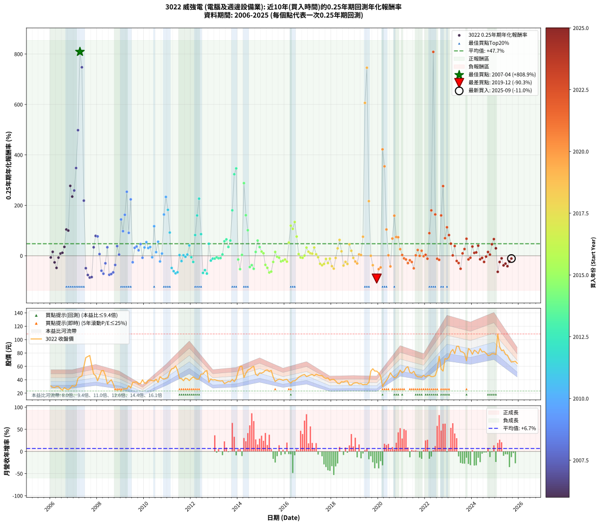

# 3022 威強電 - 本益比與未來報酬率分析

!!! info "報告資訊"
    - **股票代號**: 3022
    - **公司名稱**: 威強電
    - **產業別**: 電腦及週邊設備業
    - **分析期間**: 2006-2025 (237 個數據點)
    - **資料來源**: Type 12 (ShowMonthlyK_ChartFlow) 月收盤價與本益比
    - **報酬率口徑**: 含現金股利 (簡化: 年度合計，假設每年7/1入帳)
    - **報告生成時間**: 2026-01-04 08:26:44 CST

## 📈 視覺化圖表

### 圖表1: 本益比 vs 未來報酬率關係

*圖表1：3022 威強電 本益比與0.25年期未來報酬率關係 (2006-2025)*

### 圖表2: 歷年買入時點的0.25年期實際報酬率

*圖表2：3022 威強電 歷年買入時點的0.25年期實際報酬率 (2006-2025)*

## 📍 買點訊號說明

本報告提供兩種買點提示訊號（顯示於圖表2的股價子圖中）：

### ▲ 小綠色三角形（回測驗證）
- **計算方式**: 使用全部歷史資料計算本益比第25百分位數
- **用途**: 事後驗證，顯示歷史上哪些時點確實為低估區
- **限制**: 當下無法判斷，僅供回測參考
- **特性**: 後見之明（Look-Ahead Bias）

### ▲ 小橘色三角形（即時訊號）
- **計算方式**: 使用截至當月的過去5年資料計算本益比第25百分位數
- **用途**: 實際投資決策，當時即可判斷
- **優勢**: 可操作性強，符合實務需求
- **特性**: 無後見之明，滾動窗口計算

!!! tip "如何使用兩種訊號"
    - **綠色▲** 幫助理解歷史估值機會，驗證策略有效性
    - **橘色▲** 可作為實際買進參考，但仍需搭配基本面分析
    - 兩種訊號重疊時，表示即時判斷與事後驗證一致，信心度較高
    - 僅有綠色▲時，表示當時無法判斷（需要未來資料才能確認）
    - 僅有橘色▲時，表示即時判斷為買點，但事後可能不是最佳時機

## 📊 估值分析摘要

| 指標 | 數值 |
|:---:|:---:|
| **目前本益比** (2025-09) | **10.57 倍** |
| **歷史平均本益比** | 11.19 倍 |
| **估值水準** | 🟡 合理範圍 |
| **預期0.25年年化報酬率** | **+55.16%** |
| **歷史平均報酬率** | +47.75% |
| **相關係數 (R²)** | 0.0528 |
| **趨勢線斜率** | -11.8788 |

!!! abstract "核心洞察"
    目前本益比接近歷史平均，預期報酬率符合長期趨勢

    根據歷史數據回測，3022 威強電 在目前本益比 **10.6倍** 的估值水準下，
    預期未來0.25年年化報酬率約為 **+55.2%**。

    **重要提醒**: 本分析基於歷史數據統計，實際報酬率會受到公司基本面變化、產業趨勢、
    總體經濟環境等多重因素影響。R² = 0.05 表示本益比可解釋約 5.3% 的報酬率變異。

## 📈 歷史估值統計

### 最佳買點 (最高報酬率)

| 項目 | 數值 |
|:---:|:---:|
| 起始時間 | 2007-04 |
| 當時本益比 | 12.37 倍 |
| 起始價格 | 44.2 元 |
| 0.25年後價格 | 73.1 元 |
| **0.25年年化報酬率** | **+808.88%** |

### 最差買點 (最低報酬率)

| 項目 | 數值 |
|:---:|:---:|
| 起始時間 | 2019-12 |
| 當時本益比 | 18.76 倍 |
| 起始價格 | 52.9 元 |
| 0.25年後價格 | 29.6 元 |
| **0.25年年化報酬率** | **-90.28%** |

## 🎯 投資啟示

### 本益比與報酬率關係

趨勢線方程式: **y = -11.8788x + 180.7171**

!!! warning "強負相關"
    本益比與未來報酬率呈現強負相關。在高本益比時期買入，未來報酬率顯著較低；
    在低本益比時期買入，未來報酬率顯著較高。**估值紀律至關重要**。

### 估值區間建議

基於歷史數據分析:

- **🟢 低估區** (P/E < 9.0): 預期報酬率較高，可考慮增加持股
- **🟡 合理區** (P/E 9.0-13.4): 預期報酬率符合長期趨勢，正常持有
- **🔴 高估區** (P/E > 13.4): 預期報酬率較低，可考慮減碼或觀望

!!! danger "風險提示"
    - 過去表現不代表未來結果
    - 本分析假設公司基本面無重大結構性變化
    - 產業環境劇變可能使歷史規律失效
    - 應結合公司財報、產業趨勢、總體經濟等多重因素綜合判斷

!!! success "長期投資觀點"
    歷史數據顯示，在合理或低估的估值水準買入並長期持有，
    往往能獲得較佳的投資報酬。**耐心等待好價格**是價值投資的核心原則。

## 📊 數據品質

- **資料來源**: GoodInfo.tw Type 12 (ShowMonthlyK_ChartFlow)
- **資料頻率**: 月度收盤價與本益比
- **回測期間**: 2006-2025
- **數據點數量**: 237 個 (每個點代表一次0.25年期回測)

### 計算方法說明

1. **0.25年期年化報酬率**:
   - 對每個歷史時點，計算其後0.25年的實際投資報酬率
   - 期末價值(不含股利): 期末價格
   - 期末價值(含現金股利): 期末價格 + 持有期間內的現金股利合計 (簡化: 年度合計，假設每年7/1入帳)
   - 公式: 年化報酬率 = [(期末價值/期初價格)^(1/年數) - 1] × 100%

2. **本益比 (P/E Ratio)**:
   - 使用當時的月收盤價與EPS計算
   - 資料來源: Type 12 月度河流圖本益比數據

3. **趨勢線 (Linear Regression)**:
   - 使用最小平方法擬合線性趨勢線
   - R²值衡量本益比對報酬率的解釋能力

---

*本報告由 Stock Analysis System v1.9.0 自動生成*
*數據更新時間: 2026-01-04 08:26:44 CST*

## 📋 月度回測明細表

（每一列對應時間線圖中的一個買入點；可用來對照 SVG 圖上的每個點。）

| 買入月份 | 賣出月份 | 回測期限_年 | 實際持有年數 | 買入本益比_倍 | 買入收盤價_元 | 賣出收盤價_元 | 現金股利合計_元 | 總報酬率_pct | 年化報酬率_pct |
| --- | --- | --- | --- | --- | --- | --- | --- | --- | --- |
| 2006-01 | 2006-05 | 0.25 | 0.329 | 8.97 | 30.60 | 29.90 | 0.00 | -2.29 | -6.80 |
| 2006-02 | 2006-05 | 0.25 | 0.246 | 8.46 | 28.85 | 29.90 | 0.00 | +3.64 | +15.61 |
| 2006-03 | 2006-07 | 0.25 | 0.334 | 8.28 | 28.25 | 24.50 | 1.02 | -9.65 | -26.19 |
| 2006-04 | 2006-07 | 0.25 | 0.249 | 8.81 | 30.05 | 24.50 | 1.02 | -15.06 | -48.06 |
| 2006-05 | 2006-08 | 0.25 | 0.252 | 8.77 | 29.90 | 28.30 | 1.02 | -1.92 | -7.42 |
| 2006-06 | 2006-09 | 0.25 | 0.252 | 7.82 | 26.65 | 26.20 | 1.02 | +2.16 | +8.84 |
| 2006-07 | 2006-10 | 0.25 | 0.252 | 7.18 | 24.50 | 25.20 | 0.00 | +2.86 | +11.83 |
| 2006-08 | 2006-12 | 0.25 | 0.334 | 8.30 | 28.30 | 31.30 | 0.00 | +10.60 | +35.21 |
| 2006-09 | 2006-12 | 0.25 | 0.249 | 7.68 | 26.20 | 31.30 | 0.00 | +19.47 | +104.19 |
| 2006-10 | 2007-01 | 0.25 | 0.252 | 7.39 | 25.20 | 30.00 | 0.00 | +19.05 | +99.81 |
| 2006-11 | 2007-03 | 0.25 | 0.329 | 7.99 | 27.25 | 42.15 | 0.00 | +54.68 | +277.21 |
| 2006-12 | 2007-03 | 0.25 | 0.246 | 9.18 | 31.30 | 42.15 | 0.00 | +34.66 | +234.62 |
| 2007-01 | 2007-05 | 0.25 | 0.329 | 8.69 | 30.00 | 45.65 | 0.00 | +52.17 | +258.87 |
| 2007-02 | 2007-05 | 0.25 | 0.246 | 9.04 | 31.55 | 45.65 | 0.00 | +44.69 | +347.84 |
| 2007-03 | 2007-07 | 0.25 | 0.334 | 11.93 | 42.15 | 73.10 | 3.50 | +81.73 | +498.00 |
| 2007-04 | 2007-07 | 0.25 | 0.249 | 12.37 | 44.20 | 73.10 | 3.50 | +73.30 | +808.88 |
| 2007-05 | 2007-08 | 0.25 | 0.252 | 12.63 | 45.65 | 74.70 | 3.50 | +71.30 | +747.38 |
| 2007-06 | 2007-09 | 0.25 | 0.252 | 16.31 | 59.60 | 76.30 | 3.50 | +33.89 | +218.59 |
| 2007-07 | 2007-10 | 0.25 | 0.252 | 19.78 | 73.10 | 61.60 | 0.00 | -15.73 | -49.32 |
| 2007-08 | 2007-12 | 0.25 | 0.334 | 19.99 | 74.70 | 46.20 | 0.00 | -38.15 | -76.27 |
| 2007-09 | 2007-12 | 0.25 | 0.249 | 20.20 | 76.30 | 46.20 | 0.00 | -39.45 | -86.65 |
| 2007-10 | 2008-01 | 0.25 | 0.252 | 16.13 | 61.60 | 38.50 | 0.00 | -37.50 | -84.53 |
| 2007-11 | 2008-03 | 0.25 | 0.331 | 12.57 | 48.50 | 53.40 | 0.00 | +10.10 | +33.71 |
| 2007-12 | 2008-03 | 0.25 | 0.249 | 11.85 | 46.20 | 53.40 | 0.00 | +15.58 | +78.84 |
| 2008-01 | 2008-05 | 0.25 | 0.331 | 10.00 | 38.50 | 46.50 | 0.00 | +20.78 | +76.81 |
| 2008-02 | 2008-05 | 0.25 | 0.249 | 12.04 | 45.75 | 46.50 | 0.00 | +1.64 | +6.74 |
| 2008-03 | 2008-07 | 0.25 | 0.334 | 14.25 | 53.40 | 37.00 | 2.53 | -25.98 | -59.37 |
| 2008-04 | 2008-07 | 0.25 | 0.249 | 14.58 | 53.90 | 37.00 | 2.53 | -26.66 | -71.20 |
| 2008-05 | 2008-08 | 0.25 | 0.252 | 12.75 | 46.50 | 40.00 | 2.53 | -8.54 | -29.85 |
| 2008-06 | 2008-09 | 0.25 | 0.252 | 9.44 | 33.95 | 34.00 | 2.53 | +7.59 | +33.72 |
| 2008-07 | 2008-10 | 0.25 | 0.252 | 10.44 | 37.00 | 26.00 | 0.00 | -29.73 | -75.36 |
| 2008-08 | 2008-12 | 0.25 | 0.334 | 11.45 | 40.00 | 26.00 | 0.00 | -35.00 | -72.46 |
| 2008-09 | 2008-12 | 0.25 | 0.249 | 9.88 | 34.00 | 26.00 | 0.00 | -23.53 | -65.93 |
| 2008-10 | 2009-01 | 0.25 | 0.252 | 7.67 | 26.00 | 23.20 | 0.00 | -10.77 | -36.39 |
| 2008-11 | 2009-03 | 0.25 | 0.329 | 7.08 | 23.65 | 26.30 | 0.00 | +11.21 | +38.16 |
| 2008-12 | 2009-03 | 0.25 | 0.246 | 7.90 | 26.00 | 26.30 | 0.00 | +1.15 | +4.77 |
| 2009-01 | 2009-05 | 0.25 | 0.329 | 7.29 | 23.20 | 31.10 | 0.00 | +34.05 | +144.00 |
| 2009-02 | 2009-05 | 0.25 | 0.246 | 8.55 | 26.30 | 31.10 | 0.00 | +18.25 | +97.45 |
| 2009-03 | 2009-07 | 0.25 | 0.334 | 8.86 | 26.30 | 36.10 | 0.20 | +38.03 | +162.46 |
| 2009-04 | 2009-07 | 0.25 | 0.249 | 9.25 | 26.50 | 36.10 | 0.20 | +36.99 | +253.68 |
| 2009-05 | 2009-08 | 0.25 | 0.252 | 11.28 | 31.10 | 36.40 | 0.20 | +17.69 | +90.93 |
| 2009-06 | 2009-09 | 0.25 | 0.252 | 10.42 | 27.60 | 36.90 | 0.20 | +34.43 | +223.68 |
| 2009-07 | 2009-10 | 0.25 | 0.252 | 14.19 | 36.10 | 33.50 | 0.00 | -7.20 | -25.68 |
| 2009-08 | 2009-12 | 0.25 | 0.334 | 14.94 | 36.40 | 39.90 | 0.00 | +9.62 | +31.63 |
| 2009-09 | 2009-12 | 0.25 | 0.249 | 15.84 | 36.90 | 39.90 | 0.00 | +8.13 | +36.85 |
| 2009-10 | 2010-01 | 0.25 | 0.252 | 15.07 | 33.50 | 35.20 | 0.00 | +5.07 | +21.72 |
| 2009-11 | 2010-03 | 0.25 | 0.329 | 16.30 | 34.50 | 39.10 | 0.00 | +13.33 | +46.37 |
| 2009-12 | 2010-03 | 0.25 | 0.246 | 19.85 | 39.90 | 39.10 | 0.00 | -2.01 | -7.89 |
| 2010-01 | 2010-05 | 0.25 | 0.329 | 16.24 | 35.20 | 38.65 | 0.00 | +9.80 | +32.92 |
| 2010-02 | 2010-05 | 0.25 | 0.246 | 14.95 | 34.75 | 38.65 | 0.00 | +11.22 | +53.98 |
| 2010-03 | 2010-07 | 0.25 | 0.334 | 15.75 | 39.10 | 40.80 | 1.96 | +9.36 | +30.72 |
| 2010-04 | 2010-07 | 0.25 | 0.249 | 15.04 | 39.70 | 40.80 | 1.96 | +7.71 | +34.72 |
| 2010-05 | 2010-08 | 0.25 | 0.252 | 13.82 | 38.65 | 36.10 | 1.96 | -1.53 | -5.92 |
| 2010-06 | 2010-09 | 0.25 | 0.252 | 12.96 | 38.30 | 44.60 | 1.96 | +21.57 | +117.13 |
| 2010-07 | 2010-10 | 0.25 | 0.252 | 13.11 | 40.80 | 42.20 | 0.00 | +3.43 | +14.33 |
| 2010-08 | 2010-12 | 0.25 | 0.334 | 11.04 | 36.10 | 41.85 | 0.00 | +15.93 | +55.66 |
| 2010-09 | 2010-12 | 0.25 | 0.249 | 13.01 | 44.60 | 41.85 | 0.00 | -6.17 | -22.54 |
| 2010-10 | 2011-01 | 0.25 | 0.252 | 11.77 | 42.20 | 43.10 | 0.00 | +2.13 | +8.74 |
| 2010-11 | 2011-03 | 0.25 | 0.329 | 10.94 | 40.95 | 56.30 | 0.00 | +37.48 | +163.52 |
| 2010-12 | 2011-03 | 0.25 | 0.246 | 10.73 | 41.85 | 56.30 | 0.00 | +34.53 | +233.25 |
| 2011-01 | 2011-05 | 0.25 | 0.329 | 10.56 | 43.10 | 60.60 | 0.00 | +40.60 | +182.14 |
| 2011-02 | 2011-05 | 0.25 | 0.246 | 12.11 | 51.60 | 60.60 | 0.00 | +17.44 | +92.03 |
| 2011-03 | 2011-07 | 0.25 | 0.334 | 12.67 | 56.30 | 42.15 | 3.00 | -19.80 | -48.35 |
| 2011-04 | 2011-07 | 0.25 | 0.249 | 12.35 | 57.10 | 42.15 | 3.00 | -20.92 | -61.03 |
| 2011-05 | 2011-08 | 0.25 | 0.252 | 12.61 | 60.60 | 41.90 | 3.00 | -25.90 | -69.59 |
| 2011-06 | 2011-09 | 0.25 | 0.252 | 10.87 | 54.20 | 38.50 | 3.00 | -23.43 | -65.35 |
| 2011-07 | 2011-10 | 0.25 | 0.252 | 8.16 | 42.15 | 42.45 | 0.00 | +0.71 | +2.86 |
| 2011-08 | 2011-12 | 0.25 | 0.334 | 7.84 | 41.90 | 38.70 | 0.00 | -7.64 | -21.17 |
| 2011-09 | 2011-12 | 0.25 | 0.249 | 6.97 | 38.50 | 38.70 | 0.00 | +0.52 | +2.10 |
| 2011-10 | 2012-01 | 0.25 | 0.252 | 7.44 | 42.45 | 42.00 | 0.00 | -1.06 | -4.14 |
| 2011-11 | 2012-03 | 0.25 | 0.331 | 7.05 | 41.50 | 42.15 | 0.00 | +1.57 | +4.80 |
| 2011-12 | 2012-03 | 0.25 | 0.249 | 6.38 | 38.70 | 42.15 | 0.00 | +8.91 | +40.88 |
| 2012-01 | 2012-05 | 0.25 | 0.331 | 7.18 | 42.00 | 41.20 | 0.00 | -1.90 | -5.64 |
| 2012-02 | 2012-05 | 0.25 | 0.249 | 7.85 | 44.20 | 41.20 | 0.00 | -6.79 | -24.58 |
| 2012-03 | 2012-07 | 0.25 | 0.334 | 7.80 | 42.15 | 48.50 | 3.00 | +22.18 | +82.18 |
| 2012-04 | 2012-07 | 0.25 | 0.249 | 7.83 | 40.60 | 48.50 | 3.00 | +26.85 | +159.74 |
| 2012-05 | 2012-08 | 0.25 | 0.252 | 8.30 | 41.20 | 52.50 | 3.00 | +34.71 | +226.37 |
| 2012-06 | 2012-09 | 0.25 | 0.252 | 10.25 | 48.60 | 53.80 | 3.00 | +16.87 | +85.71 |
| 2012-07 | 2012-10 | 0.25 | 0.252 | 10.72 | 48.50 | 36.35 | 0.00 | -25.05 | -68.17 |
| 2012-08 | 2012-12 | 0.25 | 0.334 | 12.21 | 52.50 | 39.65 | 0.00 | -24.48 | -56.85 |
| 2012-09 | 2012-12 | 0.25 | 0.249 | 13.19 | 53.80 | 39.65 | 0.00 | -26.30 | -70.62 |
| 2012-10 | 2013-01 | 0.25 | 0.252 | 9.42 | 36.35 | 40.10 | 0.00 | +10.32 | +47.67 |
| 2012-11 | 2013-03 | 0.25 | 0.329 | 11.35 | 41.30 | 38.50 | 0.00 | -6.78 | -19.24 |
| 2012-12 | 2013-03 | 0.25 | 0.246 | 11.60 | 39.65 | 38.50 | 0.00 | -2.90 | -11.26 |
| 2013-01 | 2013-05 | 0.25 | 0.329 | 11.68 | 40.10 | 38.55 | 0.00 | -3.87 | -11.31 |
| 2013-02 | 2013-05 | 0.25 | 0.246 | 11.35 | 39.15 | 38.55 | 0.00 | -1.53 | -6.08 |
| 2013-03 | 2013-07 | 0.25 | 0.334 | 11.10 | 38.50 | 35.70 | 1.50 | -3.38 | -9.77 |
| 2013-04 | 2013-07 | 0.25 | 0.249 | 10.93 | 38.10 | 35.70 | 1.50 | -2.36 | -9.15 |
| 2013-05 | 2013-08 | 0.25 | 0.252 | 11.01 | 38.55 | 37.55 | 1.50 | +1.30 | +5.25 |
| 2013-06 | 2013-09 | 0.25 | 0.252 | 9.73 | 34.25 | 36.90 | 1.50 | +12.12 | +57.47 |
| 2013-07 | 2013-10 | 0.25 | 0.252 | 10.10 | 35.70 | 40.50 | 0.00 | +13.45 | +65.01 |
| 2013-08 | 2013-12 | 0.25 | 0.334 | 10.57 | 37.55 | 41.50 | 0.00 | +10.52 | +34.91 |
| 2013-09 | 2013-12 | 0.25 | 0.249 | 10.34 | 36.90 | 41.50 | 0.00 | +12.47 | +60.25 |
| 2013-10 | 2014-01 | 0.25 | 0.252 | 11.29 | 40.50 | 52.50 | 0.00 | +29.63 | +180.19 |
| 2013-11 | 2014-03 | 0.25 | 0.329 | 10.37 | 37.35 | 60.00 | 0.00 | +60.64 | +323.24 |
| 2013-12 | 2014-03 | 0.25 | 0.246 | 11.46 | 41.50 | 60.00 | 0.00 | +44.58 | +346.43 |
| 2014-01 | 2014-05 | 0.25 | 0.329 | 14.21 | 52.50 | 49.80 | 0.00 | -5.14 | -14.85 |
| 2014-02 | 2014-05 | 0.25 | 0.246 | 15.92 | 60.00 | 49.80 | 0.00 | -17.00 | -53.05 |
| 2014-03 | 2014-07 | 0.25 | 0.334 | 15.61 | 60.00 | 55.90 | 4.80 | +1.17 | +3.53 |
| 2014-04 | 2014-07 | 0.25 | 0.249 | 11.06 | 43.30 | 55.90 | 4.80 | +40.18 | +287.99 |
| 2014-05 | 2014-08 | 0.25 | 0.252 | 12.48 | 49.80 | 58.60 | 4.80 | +27.31 | +160.80 |
| 2014-06 | 2014-09 | 0.25 | 0.252 | 13.41 | 54.50 | 60.20 | 4.80 | +19.27 | +101.27 |
| 2014-07 | 2014-10 | 0.25 | 0.252 | 13.51 | 55.90 | 48.15 | 0.00 | -13.86 | -44.71 |
| 2014-08 | 2014-12 | 0.25 | 0.334 | 13.91 | 58.60 | 50.20 | 0.00 | -14.33 | -37.07 |
| 2014-09 | 2014-12 | 0.25 | 0.249 | 14.04 | 60.20 | 50.20 | 0.00 | -16.61 | -51.77 |
| 2014-10 | 2015-01 | 0.25 | 0.252 | 11.04 | 48.15 | 49.90 | 0.00 | +3.63 | +15.23 |
| 2014-11 | 2015-03 | 0.25 | 0.329 | 10.43 | 46.25 | 54.00 | 0.00 | +16.76 | +60.25 |
| 2014-12 | 2015-03 | 0.25 | 0.246 | 11.13 | 50.20 | 54.00 | 0.00 | +7.57 | +34.46 |
| 2015-01 | 2015-05 | 0.25 | 0.329 | 11.26 | 49.90 | 52.50 | 0.00 | +5.21 | +16.72 |
| 2015-02 | 2015-05 | 0.25 | 0.246 | 11.79 | 51.30 | 52.50 | 0.00 | +2.34 | +9.84 |
| 2015-03 | 2015-07 | 0.25 | 0.334 | 12.65 | 54.00 | 44.00 | 2.50 | -13.89 | -36.09 |
| 2015-04 | 2015-07 | 0.25 | 0.249 | 13.05 | 54.70 | 44.00 | 2.50 | -14.99 | -47.89 |
| 2015-05 | 2015-08 | 0.25 | 0.252 | 12.77 | 52.50 | 37.40 | 2.50 | -24.00 | -66.36 |
| 2015-06 | 2015-09 | 0.25 | 0.252 | 13.40 | 54.00 | 39.60 | 2.50 | -22.04 | -62.78 |
| 2015-07 | 2015-10 | 0.25 | 0.252 | 11.14 | 44.00 | 41.00 | 0.00 | -6.82 | -24.45 |
| 2015-08 | 2015-12 | 0.25 | 0.334 | 9.66 | 37.40 | 39.20 | 0.00 | +4.81 | +15.11 |
| 2015-09 | 2015-12 | 0.25 | 0.249 | 10.45 | 39.60 | 39.20 | 0.00 | -1.01 | -3.99 |
| 2015-10 | 2016-01 | 0.25 | 0.252 | 11.05 | 41.00 | 40.20 | 0.00 | -1.95 | -7.52 |
| 2015-11 | 2016-03 | 0.25 | 0.331 | 11.13 | 40.40 | 37.15 | 0.00 | -8.04 | -22.37 |
| 2015-12 | 2016-03 | 0.25 | 0.249 | 11.04 | 39.20 | 37.15 | 0.00 | -5.23 | -19.39 |
| 2016-01 | 2016-05 | 0.25 | 0.331 | 11.16 | 40.20 | 38.10 | 0.00 | -5.22 | -14.95 |
| 2016-02 | 2016-05 | 0.25 | 0.249 | 11.15 | 40.70 | 38.10 | 0.00 | -6.39 | -23.28 |
| 2016-03 | 2016-07 | 0.25 | 0.334 | 10.03 | 37.15 | 40.75 | 2.00 | +15.07 | +52.25 |
| 2016-04 | 2016-07 | 0.25 | 0.249 | 9.37 | 35.15 | 40.75 | 2.00 | +21.62 | +119.39 |
| 2016-05 | 2016-08 | 0.25 | 0.252 | 10.02 | 38.10 | 43.75 | 2.00 | +20.08 | +106.77 |
| 2016-06 | 2016-09 | 0.25 | 0.252 | 9.95 | 38.35 | 45.50 | 2.00 | +23.86 | +133.85 |
| 2016-07 | 2016-10 | 0.25 | 0.252 | 10.43 | 40.75 | 47.00 | 0.00 | +15.34 | +76.21 |
| 2016-08 | 2016-12 | 0.25 | 0.334 | 11.06 | 43.75 | 44.70 | 0.00 | +2.17 | +6.64 |
| 2016-09 | 2016-12 | 0.25 | 0.249 | 11.35 | 45.50 | 44.70 | 0.00 | -1.76 | -6.87 |
| 2016-10 | 2017-01 | 0.25 | 0.252 | 11.58 | 47.00 | 46.00 | 0.00 | -2.13 | -8.18 |
| 2016-11 | 2017-03 | 0.25 | 0.329 | 11.63 | 47.80 | 47.90 | 0.00 | +0.21 | +0.64 |
| 2016-12 | 2017-03 | 0.25 | 0.246 | 10.75 | 44.70 | 47.90 | 0.00 | +7.16 | +32.39 |
| 2017-01 | 2017-05 | 0.25 | 0.329 | 11.36 | 46.00 | 48.30 | 0.00 | +5.00 | +16.01 |
| 2017-02 | 2017-05 | 0.25 | 0.246 | 11.99 | 47.20 | 48.30 | 0.00 | +2.33 | +9.80 |
| 2017-03 | 2017-07 | 0.25 | 0.334 | 12.52 | 47.90 | 46.20 | 3.00 | +2.71 | +8.35 |
| 2017-04 | 2017-07 | 0.25 | 0.249 | 12.35 | 45.85 | 46.20 | 3.00 | +7.31 | +32.72 |
| 2017-05 | 2017-08 | 0.25 | 0.252 | 13.41 | 48.30 | 46.00 | 3.00 | +1.45 | +5.88 |
| 2017-06 | 2017-09 | 0.25 | 0.252 | 13.47 | 47.00 | 43.30 | 3.00 | -1.49 | -5.78 |
| 2017-07 | 2017-10 | 0.25 | 0.252 | 13.68 | 46.20 | 41.95 | 0.00 | -9.20 | -31.83 |
| 2017-08 | 2017-12 | 0.25 | 0.334 | 14.08 | 46.00 | 39.30 | 0.00 | -14.57 | -37.58 |
| 2017-09 | 2017-12 | 0.25 | 0.249 | 13.72 | 43.30 | 39.30 | 0.00 | -9.24 | -32.23 |
| 2017-10 | 2018-01 | 0.25 | 0.252 | 13.78 | 41.95 | 40.55 | 0.00 | -3.34 | -12.61 |
| 2017-11 | 2018-03 | 0.25 | 0.329 | 14.57 | 42.70 | 38.15 | 0.00 | -10.66 | -29.03 |
| 2017-12 | 2018-03 | 0.25 | 0.246 | 13.94 | 39.30 | 38.15 | 0.00 | -2.93 | -11.35 |
| 2018-01 | 2018-05 | 0.25 | 0.329 | 14.36 | 40.55 | 34.05 | 0.00 | -16.03 | -41.24 |
| 2018-02 | 2018-05 | 0.25 | 0.246 | 14.35 | 40.60 | 34.05 | 0.00 | -16.13 | -51.03 |
| 2018-03 | 2018-07 | 0.25 | 0.334 | 13.47 | 38.15 | 36.50 | 0.50 | -3.01 | -8.76 |
| 2018-04 | 2018-07 | 0.25 | 0.249 | 12.23 | 34.70 | 36.50 | 0.50 | +6.63 | +29.38 |
| 2018-05 | 2018-08 | 0.25 | 0.252 | 11.99 | 34.05 | 38.00 | 0.50 | +13.07 | +62.85 |
| 2018-06 | 2018-09 | 0.25 | 0.252 | 13.06 | 37.15 | 38.20 | 0.50 | +4.17 | +17.62 |
| 2018-07 | 2018-10 | 0.25 | 0.252 | 12.81 | 36.50 | 32.25 | 0.00 | -11.64 | -38.83 |
| 2018-08 | 2018-12 | 0.25 | 0.334 | 13.32 | 38.00 | 34.65 | 0.00 | -8.82 | -24.14 |
| 2018-09 | 2018-12 | 0.25 | 0.249 | 13.37 | 38.20 | 34.65 | 0.00 | -9.29 | -32.40 |
| 2018-10 | 2019-01 | 0.25 | 0.252 | 11.27 | 32.25 | 35.45 | 0.00 | +9.92 | +45.59 |
| 2018-11 | 2019-03 | 0.25 | 0.329 | 11.15 | 31.95 | 33.90 | 0.00 | +6.10 | +19.76 |
| 2018-12 | 2019-03 | 0.25 | 0.246 | 12.07 | 34.65 | 33.90 | 0.00 | -2.16 | -8.50 |
| 2019-01 | 2019-05 | 0.25 | 0.329 | 12.37 | 35.45 | 32.55 | 0.00 | -8.18 | -22.88 |
| 2019-02 | 2019-05 | 0.25 | 0.246 | 12.44 | 35.60 | 32.55 | 0.00 | -8.57 | -30.48 |
| 2019-03 | 2019-07 | 0.25 | 0.334 | 11.86 | 33.90 | 33.00 | 1.50 | +1.77 | +5.39 |
| 2019-04 | 2019-07 | 0.25 | 0.249 | 12.00 | 34.25 | 33.00 | 1.50 | +0.73 | +2.96 |
| 2019-05 | 2019-08 | 0.25 | 0.252 | 11.42 | 32.55 | 36.00 | 1.50 | +15.21 | +75.42 |
| 2019-06 | 2019-09 | 0.25 | 0.252 | 11.69 | 33.25 | 52.90 | 1.50 | +63.61 | +606.05 |
| 2019-07 | 2019-10 | 0.25 | 0.252 | 11.62 | 33.00 | 56.50 | 0.00 | +71.21 | +745.59 |
| 2019-08 | 2019-12 | 0.25 | 0.334 | 12.69 | 36.00 | 52.90 | 0.00 | +46.94 | +216.54 |
| 2019-09 | 2019-12 | 0.25 | 0.249 | 18.68 | 52.90 | 52.90 | 0.00 | +0.00 | +0.00 |
| 2019-10 | 2020-01 | 0.25 | 0.252 | 19.98 | 56.50 | 50.20 | 0.00 | -11.15 | -37.46 |
| 2019-11 | 2020-03 | 0.25 | 0.331 | 18.77 | 53.00 | 29.60 | 0.00 | -44.15 | -82.77 |
| 2019-12 | 2020-03 | 0.25 | 0.249 | 18.76 | 52.90 | 29.60 | 0.00 | -44.05 | -90.28 |
| 2020-01 | 2020-05 | 0.25 | 0.331 | 16.43 | 50.20 | 39.10 | 0.00 | -22.11 | -52.97 |
| 2020-02 | 2020-05 | 0.25 | 0.249 | 13.88 | 45.65 | 39.10 | 0.00 | -14.35 | -46.29 |
| 2020-03 | 2020-07 | 0.25 | 0.334 | 8.40 | 29.60 | 50.40 | 1.00 | +73.66 | +421.97 |
| 2020-04 | 2020-07 | 0.25 | 0.249 | 9.38 | 35.25 | 50.40 | 1.00 | +45.83 | +354.57 |
| 2020-05 | 2020-08 | 0.25 | 0.252 | 9.79 | 39.10 | 45.80 | 1.00 | +19.70 | +104.22 |
| 2020-06 | 2020-09 | 0.25 | 0.252 | 10.35 | 43.80 | 43.00 | 1.00 | +0.47 | +1.86 |
| 2020-07 | 2020-10 | 0.25 | 0.252 | 11.29 | 50.40 | 43.90 | 0.00 | -12.90 | -42.20 |
| 2020-08 | 2020-12 | 0.25 | 0.334 | 9.74 | 45.80 | 54.50 | 0.00 | +19.00 | +68.32 |
| 2020-09 | 2020-12 | 0.25 | 0.249 | 8.71 | 43.00 | 54.50 | 0.00 | +26.74 | +158.90 |
| 2020-10 | 2021-01 | 0.25 | 0.252 | 8.49 | 43.90 | 50.50 | 0.00 | +15.03 | +74.38 |
| 2020-11 | 2021-03 | 0.25 | 0.329 | 8.91 | 48.15 | 57.70 | 0.00 | +19.83 | +73.45 |
| 2020-12 | 2021-03 | 0.25 | 0.246 | 9.66 | 54.50 | 57.70 | 0.00 | +5.87 | +26.06 |
| 2021-01 | 2021-05 | 0.25 | 0.329 | 9.05 | 50.50 | 51.00 | 0.00 | +0.99 | +3.04 |
| 2021-02 | 2021-05 | 0.25 | 0.246 | 9.50 | 52.40 | 51.00 | 0.00 | -2.67 | -10.41 |
| 2021-03 | 2021-07 | 0.25 | 0.334 | 10.58 | 57.70 | 52.70 | 2.00 | -5.20 | -14.77 |
| 2021-04 | 2021-07 | 0.25 | 0.249 | 11.05 | 59.60 | 52.70 | 2.00 | -8.22 | -29.13 |
| 2021-05 | 2021-08 | 0.25 | 0.252 | 9.57 | 51.00 | 46.55 | 2.00 | -4.80 | -17.75 |
| 2021-06 | 2021-09 | 0.25 | 0.252 | 9.47 | 49.90 | 44.45 | 2.00 | -6.91 | -24.76 |
| 2021-07 | 2021-10 | 0.25 | 0.252 | 10.12 | 52.70 | 44.30 | 0.00 | -15.94 | -49.81 |
| 2021-08 | 2021-12 | 0.25 | 0.334 | 9.04 | 46.55 | 46.80 | 0.00 | +0.54 | +1.62 |
| 2021-09 | 2021-12 | 0.25 | 0.249 | 8.74 | 44.45 | 46.80 | 0.00 | +5.29 | +22.97 |
| 2021-10 | 2022-01 | 0.25 | 0.252 | 8.82 | 44.30 | 44.25 | 0.00 | -0.11 | -0.45 |
| 2021-11 | 2022-03 | 0.25 | 0.329 | 8.85 | 43.90 | 46.60 | 0.00 | +6.15 | +19.92 |
| 2021-12 | 2022-03 | 0.25 | 0.246 | 9.55 | 46.80 | 46.60 | 0.00 | -0.43 | -1.72 |
| 2022-01 | 2022-05 | 0.25 | 0.329 | 8.52 | 44.25 | 44.80 | 0.00 | +1.24 | +3.83 |
| 2022-02 | 2022-05 | 0.25 | 0.246 | 8.41 | 46.20 | 44.80 | 0.00 | -3.03 | -11.74 |
| 2022-03 | 2022-07 | 0.25 | 0.334 | 8.05 | 46.60 | 54.70 | 3.00 | +23.82 | +89.58 |
| 2022-04 | 2022-07 | 0.25 | 0.249 | 7.34 | 44.65 | 54.70 | 3.00 | +29.23 | +179.86 |
| 2022-05 | 2022-08 | 0.25 | 0.252 | 7.02 | 44.80 | 75.10 | 3.00 | +74.33 | +808.40 |
| 2022-06 | 2022-09 | 0.25 | 0.252 | 6.90 | 46.05 | 55.80 | 3.00 | +27.69 | +163.89 |
| 2022-07 | 2022-10 | 0.25 | 0.252 | 7.85 | 54.70 | 53.00 | 0.00 | -3.11 | -11.78 |
| 2022-08 | 2022-12 | 0.25 | 0.334 | 10.33 | 75.10 | 70.80 | 0.00 | -5.73 | -16.18 |
| 2022-09 | 2022-12 | 0.25 | 0.249 | 7.38 | 55.80 | 70.80 | 0.00 | +26.88 | +160.03 |
| 2022-10 | 2023-01 | 0.25 | 0.252 | 6.74 | 53.00 | 74.00 | 0.00 | +39.62 | +276.26 |
| 2022-11 | 2023-03 | 0.25 | 0.329 | 8.79 | 71.70 | 85.30 | 0.00 | +18.97 | +69.66 |
| 2022-12 | 2023-03 | 0.25 | 0.246 | 8.38 | 70.80 | 85.30 | 0.00 | +20.48 | +113.00 |
| 2023-01 | 2023-05 | 0.25 | 0.329 | 8.81 | 74.00 | 90.10 | 0.00 | +21.76 | +82.06 |
| 2023-02 | 2023-05 | 0.25 | 0.246 | 9.80 | 81.80 | 90.10 | 0.00 | +10.15 | +48.02 |
| 2023-03 | 2023-07 | 0.25 | 0.334 | 10.28 | 85.30 | 82.20 | 3.50 | +0.47 | +1.41 |
| 2023-04 | 2023-07 | 0.25 | 0.249 | 9.58 | 79.00 | 82.20 | 3.50 | +8.48 | +38.64 |
| 2023-05 | 2023-08 | 0.25 | 0.252 | 11.00 | 90.10 | 81.50 | 3.50 | -5.66 | -20.65 |
| 2023-06 | 2023-09 | 0.25 | 0.252 | 11.07 | 90.10 | 79.20 | 3.50 | -8.21 | -28.84 |
| 2023-07 | 2023-10 | 0.25 | 0.252 | 10.16 | 82.20 | 68.50 | 0.00 | -16.67 | -51.51 |
| 2023-08 | 2023-12 | 0.25 | 0.334 | 10.14 | 81.50 | 84.00 | 0.00 | +3.07 | +9.47 |
| 2023-09 | 2023-12 | 0.25 | 0.249 | 9.92 | 79.20 | 84.00 | 0.00 | +6.06 | +26.64 |
| 2023-10 | 2024-01 | 0.25 | 0.252 | 8.63 | 68.50 | 78.00 | 0.00 | +13.87 | +67.47 |
| 2023-11 | 2024-03 | 0.25 | 0.331 | 11.00 | 86.70 | 82.30 | 0.00 | -5.07 | -14.55 |
| 2023-12 | 2024-03 | 0.25 | 0.249 | 10.73 | 84.00 | 82.30 | 0.00 | -2.02 | -7.88 |
| 2024-01 | 2024-05 | 0.25 | 0.331 | 9.87 | 78.00 | 86.50 | 0.00 | +10.90 | +36.65 |
| 2024-02 | 2024-05 | 0.25 | 0.249 | 10.55 | 84.20 | 86.50 | 0.00 | +2.73 | +11.42 |
| 2024-03 | 2024-07 | 0.25 | 0.334 | 10.22 | 82.30 | 82.30 | 3.50 | +4.25 | +13.28 |
| 2024-04 | 2024-07 | 0.25 | 0.249 | 9.71 | 78.90 | 82.30 | 3.50 | +8.75 | +40.00 |
| 2024-05 | 2024-08 | 0.25 | 0.252 | 10.55 | 86.50 | 79.80 | 3.50 | -3.70 | -13.90 |
| 2024-06 | 2024-09 | 0.25 | 0.252 | 9.85 | 81.50 | 76.20 | 3.50 | -2.21 | -8.48 |
| 2024-07 | 2024-10 | 0.25 | 0.252 | 9.86 | 82.30 | 76.70 | 0.00 | -6.80 | -24.40 |
| 2024-08 | 2024-12 | 0.25 | 0.334 | 9.47 | 79.80 | 78.90 | 0.00 | -1.13 | -3.34 |
| 2024-09 | 2024-12 | 0.25 | 0.249 | 8.97 | 76.20 | 78.90 | 0.00 | +3.54 | +15.00 |
| 2024-10 | 2025-01 | 0.25 | 0.252 | 8.95 | 76.70 | 77.60 | 0.00 | +1.17 | +4.74 |
| 2024-11 | 2025-03 | 0.25 | 0.329 | 9.14 | 79.00 | 89.40 | 0.00 | +13.16 | +45.71 |
| 2024-12 | 2025-03 | 0.25 | 0.246 | 9.05 | 78.90 | 89.40 | 0.00 | +13.31 | +66.04 |
| 2025-01 | 2025-05 | 0.25 | 0.329 | 9.18 | 77.60 | 84.50 | 0.00 | +8.89 | +29.60 |
| 2025-02 | 2025-05 | 0.25 | 0.246 | 13.27 | 108.50 | 84.50 | 0.00 | -22.12 | -63.74 |
| 2025-03 | 2025-07 | 0.25 | 0.334 | 11.31 | 89.40 | 76.80 | 4.50 | -9.06 | -24.75 |
| 2025-04 | 2025-07 | 0.25 | 0.249 | 10.93 | 83.50 | 76.80 | 4.50 | -2.63 | -10.16 |
| 2025-05 | 2025-08 | 0.25 | 0.252 | 11.47 | 84.50 | 70.40 | 4.50 | -11.36 | -38.05 |
| 2025-06 | 2025-09 | 0.25 | 0.252 | 10.98 | 77.90 | 66.40 | 4.50 | -8.99 | -31.19 |
| 2025-07 | 2025-10 | 0.25 | 0.252 | 11.25 | 76.80 | 67.10 | 0.00 | -12.63 | -41.49 |
| 2025-08 | 2025-12 | 0.25 | 0.334 | 10.74 | 70.40 | 64.50 | 0.00 | -8.38 | -23.05 |
| 2025-09 | 2025-12 | 0.25 | 0.249 | 10.57 | 66.40 | 64.50 | 0.00 | -2.86 | -11.00 |
