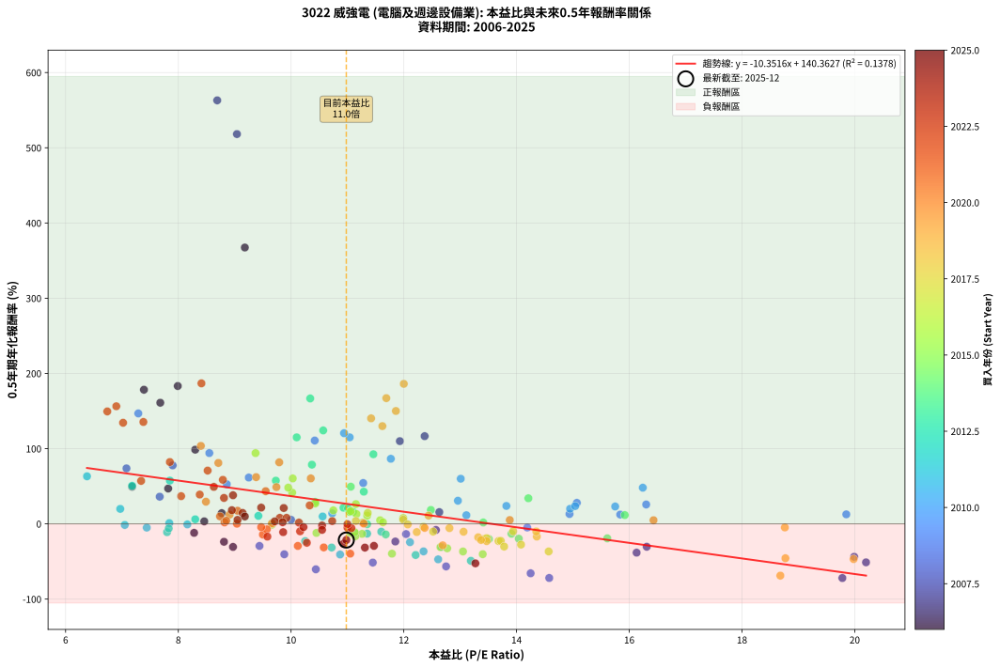
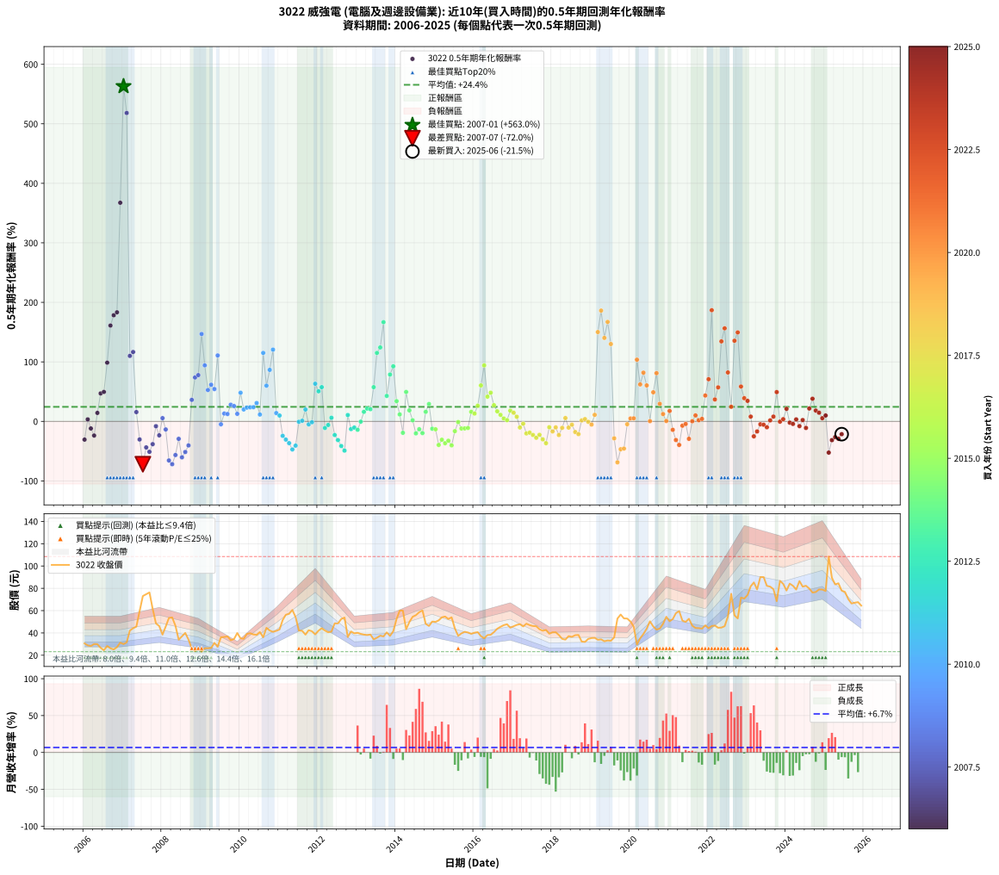

# 3022 威強電 - 本益比與未來報酬率分析

!!! info "報告資訊"
    - **股票代號**: 3022
    - **公司名稱**: 威強電
    - **產業別**: 電腦及週邊設備業
    - **分析期間**: 2006-2025 (234 個數據點)
    - **資料來源**: Type 12 (ShowMonthlyK_ChartFlow) 月收盤價與本益比
    - **報酬率口徑**: 含現金股利 (簡化: 年度合計，假設每年7/1入帳)
    - **報告生成時間**: 2026-01-13 13:36:16 CST

## 📈 視覺化圖表

### 圖表1: 本益比 vs 未來報酬率關係

*圖表1：3022 威強電 本益比與0.5年期未來報酬率關係 (2006-2025)*

### 圖表2: 歷年買入時點的0.5年期實際報酬率

*圖表2：3022 威強電 歷年買入時點的0.5年期實際報酬率 (2006-2025)*

## 📍 買點訊號說明

本報告提供兩種買點提示訊號（顯示於圖表2的股價子圖中）：

### ▲ 小綠色三角形（回測驗證）
- **計算方式**: 使用全部歷史資料計算本益比第25百分位數
- **用途**: 事後驗證，顯示歷史上哪些時點確實為低估區
- **限制**: 當下無法判斷，僅供回測參考
- **特性**: 後見之明（Look-Ahead Bias）

### ▲ 小橘色三角形（即時訊號）
- **計算方式**: 使用截至當月的過去5年資料計算本益比第25百分位數
- **用途**: 實際投資決策，當時即可判斷
- **優勢**: 可操作性強，符合實務需求
- **特性**: 無後見之明，滾動窗口計算

!!! tip "如何使用兩種訊號"
    - **綠色▲** 幫助理解歷史估值機會，驗證策略有效性
    - **橘色▲** 可作為實際買進參考，但仍需搭配基本面分析
    - 兩種訊號重疊時，表示即時判斷與事後驗證一致，信心度較高
    - 僅有綠色▲時，表示當時無法判斷（需要未來資料才能確認）
    - 僅有橘色▲時，表示即時判斷為買點，但事後可能不是最佳時機

## 📊 估值分析摘要

| 指標 | 數值 |
|:---:|:---:|
| **目前本益比** (2025-06) | **10.98 倍** |
| **歷史平均本益比** | 11.20 倍 |
| **估值水準** | 🟡 合理範圍 |
| **預期0.5年年化報酬率** | **+26.70%** |
| **歷史平均報酬率** | +24.44% |
| **相關係數 (R²)** | 0.1378 |
| **趨勢線斜率** | -10.3516 |

!!! abstract "核心洞察"
    目前本益比接近歷史平均，預期報酬率符合長期趨勢

    根據歷史數據回測，3022 威強電 在目前本益比 **11.0倍** 的估值水準下，
    預期未來0.5年年化報酬率約為 **+26.7%**。

    **重要提醒**: 本分析基於歷史數據統計，實際報酬率會受到公司基本面變化、產業趨勢、
    總體經濟環境等多重因素影響。R² = 0.14 表示本益比可解釋約 13.8% 的報酬率變異。

## 📈 歷史估值統計

### 最佳買點 (最高報酬率)

| 項目 | 數值 |
|:---:|:---:|
| 起始時間 | 2007-01 |
| 當時本益比 | 8.69 倍 |
| 起始價格 | 30.0 元 |
| 0.5年後價格 | 73.1 元 |
| **0.5年年化報酬率** | **+563.02%** |

### 最差買點 (最低報酬率)

| 項目 | 數值 |
|:---:|:---:|
| 起始時間 | 2007-07 |
| 當時本益比 | 19.78 倍 |
| 起始價格 | 73.1 元 |
| 0.5年後價格 | 38.5 元 |
| **0.5年年化報酬率** | **-71.99%** |

## 🎯 投資啟示

### 本益比與報酬率關係

趨勢線方程式: **y = -10.3516x + 140.3627**

!!! warning "強負相關"
    本益比與未來報酬率呈現強負相關。在高本益比時期買入，未來報酬率顯著較低；
    在低本益比時期買入，未來報酬率顯著較高。**估值紀律至關重要**。

### 估值區間建議

基於歷史數據分析:

- **🟢 低估區** (P/E < 9.0): 預期報酬率較高，可考慮增加持股
- **🟡 合理區** (P/E 9.0-13.4): 預期報酬率符合長期趨勢，正常持有
- **🔴 高估區** (P/E > 13.4): 預期報酬率較低，可考慮減碼或觀望

!!! danger "風險提示"
    - 過去表現不代表未來結果
    - 本分析假設公司基本面無重大結構性變化
    - 產業環境劇變可能使歷史規律失效
    - 應結合公司財報、產業趨勢、總體經濟等多重因素綜合判斷

!!! success "長期投資觀點"
    歷史數據顯示，在合理或低估的估值水準買入並長期持有，
    往往能獲得較佳的投資報酬。**耐心等待好價格**是價值投資的核心原則。

## 📊 數據品質

- **資料來源**: GoodInfo.tw Type 12 (ShowMonthlyK_ChartFlow)
- **資料頻率**: 月度收盤價與本益比
- **回測期間**: 2006-2025
- **數據點數量**: 234 個 (每個點代表一次0.5年期回測)

### 計算方法說明

1. **0.5年期年化報酬率**:
   - 對每個歷史時點，計算其後0.5年的實際投資報酬率
   - 期末價值(不含股利): 期末價格
   - 期末價值(含現金股利): 期末價格 + 持有期間內的現金股利合計 (簡化: 年度合計，假設每年7/1入帳)
   - 公式: 年化報酬率 = [(期末價值/期初價格)^(1/年數) - 1] × 100%

2. **本益比 (P/E Ratio)**:
   - 使用當時的月收盤價與EPS計算
   - 資料來源: Type 12 月度河流圖本益比數據

3. **趨勢線 (Linear Regression)**:
   - 使用最小平方法擬合線性趨勢線
   - R²值衡量本益比對報酬率的解釋能力

---

*本報告由 Stock Analysis System v1.9.0 自動生成*
*數據更新時間: 2026-01-13 13:36:16 CST*

## 📋 月度回測明細表

（每一列對應時間線圖中的一個買入點；可用來對照 SVG 圖上的每個點。）

| 買入月份 | 賣出月份 | 回測期限_年 | 實際持有年數 | 買入本益比_倍 | 買入收盤價_元 | 賣出收盤價_元 | 現金股利合計_元 | 總報酬率_pct | 年化報酬率_pct |
| --- | --- | --- | --- | --- | --- | --- | --- | --- | --- |
| 2006-01 | 2006-07 | 0.5 | 0.496 | 8.97 | 30.60 | 24.50 | 1.02 | -16.58 | -30.65 |
| 2006-02 | 2006-08 | 0.5 | 0.498 | 8.46 | 28.85 | 28.30 | 1.02 | +1.65 | +3.33 |
| 2006-03 | 2006-10 | 0.5 | 0.586 | 8.28 | 28.25 | 25.20 | 1.02 | -7.17 | -11.92 |
| 2006-04 | 2006-10 | 0.5 | 0.501 | 8.81 | 30.05 | 25.20 | 1.02 | -12.73 | -23.79 |
| 2006-05 | 2006-12 | 0.5 | 0.586 | 8.77 | 29.90 | 31.30 | 1.02 | +8.11 | +14.24 |
| 2006-06 | 2006-12 | 0.5 | 0.501 | 7.82 | 26.65 | 31.30 | 1.02 | +21.29 | +47.01 |
| 2006-07 | 2007-01 | 0.5 | 0.504 | 7.18 | 24.50 | 30.00 | 0.00 | +22.45 | +49.48 |
| 2006-08 | 2007-03 | 0.5 | 0.580 | 8.30 | 28.30 | 42.15 | 0.00 | +48.94 | +98.64 |
| 2006-09 | 2007-03 | 0.5 | 0.496 | 7.68 | 26.20 | 42.15 | 0.00 | +60.88 | +161.04 |
| 2006-10 | 2007-05 | 0.5 | 0.580 | 7.39 | 25.20 | 45.65 | 0.00 | +81.15 | +178.34 |
| 2006-11 | 2007-05 | 0.5 | 0.496 | 7.99 | 27.25 | 45.65 | 0.00 | +67.52 | +183.25 |
| 2006-12 | 2007-07 | 0.5 | 0.580 | 9.18 | 31.30 | 73.10 | 3.50 | +144.73 | +367.36 |
| 2007-01 | 2007-07 | 0.5 | 0.496 | 8.69 | 30.00 | 73.10 | 3.50 | +155.33 | +563.02 |
| 2007-02 | 2007-08 | 0.5 | 0.498 | 9.04 | 31.55 | 74.70 | 3.50 | +147.86 | +518.19 |
| 2007-03 | 2007-10 | 0.5 | 0.586 | 11.93 | 42.15 | 61.60 | 3.50 | +54.45 | +110.00 |
| 2007-04 | 2007-10 | 0.5 | 0.501 | 12.37 | 44.20 | 61.60 | 3.50 | +47.29 | +116.58 |
| 2007-05 | 2007-12 | 0.5 | 0.586 | 12.63 | 45.65 | 46.20 | 3.50 | +8.87 | +15.61 |
| 2007-06 | 2007-12 | 0.5 | 0.501 | 16.31 | 59.60 | 46.20 | 3.50 | -16.61 | -30.41 |
| 2007-07 | 2008-01 | 0.5 | 0.504 | 19.78 | 73.10 | 38.50 | 0.00 | -47.33 | -71.99 |
| 2007-08 | 2008-03 | 0.5 | 0.583 | 19.99 | 74.70 | 53.40 | 0.00 | -28.51 | -43.76 |
| 2007-09 | 2008-03 | 0.5 | 0.498 | 20.20 | 76.30 | 53.40 | 0.00 | -30.01 | -51.14 |
| 2007-10 | 2008-05 | 0.5 | 0.583 | 16.13 | 61.60 | 46.50 | 0.00 | -24.51 | -38.26 |
| 2007-11 | 2008-05 | 0.5 | 0.498 | 12.57 | 48.50 | 46.50 | 0.00 | -4.12 | -8.10 |
| 2007-12 | 2008-07 | 0.5 | 0.583 | 11.85 | 46.20 | 37.00 | 2.53 | -14.44 | -23.47 |
| 2008-01 | 2008-07 | 0.5 | 0.498 | 10.00 | 38.50 | 37.00 | 2.53 | +2.67 | +5.43 |
| 2008-02 | 2008-08 | 0.5 | 0.501 | 12.04 | 45.75 | 40.00 | 2.53 | -7.04 | -13.56 |
| 2008-03 | 2008-10 | 0.5 | 0.586 | 14.25 | 53.40 | 26.00 | 2.53 | -46.58 | -65.70 |
| 2008-04 | 2008-10 | 0.5 | 0.501 | 14.58 | 53.90 | 26.00 | 2.53 | -47.07 | -71.91 |
| 2008-05 | 2008-12 | 0.5 | 0.586 | 12.75 | 46.50 | 26.00 | 2.53 | -38.65 | -56.56 |
| 2008-06 | 2008-12 | 0.5 | 0.501 | 9.44 | 33.95 | 26.00 | 2.53 | -15.97 | -29.34 |
| 2008-07 | 2009-01 | 0.5 | 0.504 | 10.44 | 37.00 | 23.20 | 0.00 | -37.30 | -60.41 |
| 2008-08 | 2009-03 | 0.5 | 0.580 | 11.45 | 40.00 | 26.30 | 0.00 | -34.25 | -51.44 |
| 2008-09 | 2009-03 | 0.5 | 0.496 | 9.88 | 34.00 | 26.30 | 0.00 | -22.65 | -40.44 |
| 2008-10 | 2009-05 | 0.5 | 0.580 | 7.67 | 26.00 | 31.10 | 0.00 | +19.62 | +36.15 |
| 2008-11 | 2009-05 | 0.5 | 0.496 | 7.08 | 23.65 | 31.10 | 0.00 | +31.50 | +73.78 |
| 2008-12 | 2009-07 | 0.5 | 0.580 | 7.90 | 26.00 | 36.10 | 0.20 | +39.62 | +77.72 |
| 2009-01 | 2009-07 | 0.5 | 0.496 | 7.29 | 23.20 | 36.10 | 0.20 | +56.47 | +146.82 |
| 2009-02 | 2009-08 | 0.5 | 0.498 | 8.55 | 26.30 | 36.40 | 0.20 | +39.17 | +94.13 |
| 2009-03 | 2009-10 | 0.5 | 0.586 | 8.86 | 26.30 | 33.50 | 0.20 | +28.14 | +52.69 |
| 2009-04 | 2009-10 | 0.5 | 0.501 | 9.25 | 26.50 | 33.50 | 0.20 | +27.18 | +61.58 |
| 2009-05 | 2009-12 | 0.5 | 0.586 | 11.28 | 31.10 | 39.90 | 0.20 | +28.95 | +54.33 |
| 2009-06 | 2009-12 | 0.5 | 0.501 | 10.42 | 27.60 | 39.90 | 0.20 | +45.30 | +110.79 |
| 2009-07 | 2010-01 | 0.5 | 0.504 | 14.19 | 36.10 | 35.20 | 0.00 | -2.49 | -4.89 |
| 2009-08 | 2010-03 | 0.5 | 0.580 | 14.94 | 36.40 | 39.10 | 0.00 | +7.42 | +13.12 |
| 2009-09 | 2010-03 | 0.5 | 0.496 | 15.84 | 36.90 | 39.10 | 0.00 | +5.96 | +12.40 |
| 2009-10 | 2010-05 | 0.5 | 0.580 | 15.07 | 33.50 | 38.65 | 0.00 | +15.37 | +27.94 |
| 2009-11 | 2010-05 | 0.5 | 0.496 | 16.30 | 34.50 | 38.65 | 0.00 | +12.03 | +25.76 |
| 2009-12 | 2010-07 | 0.5 | 0.580 | 19.85 | 39.90 | 40.80 | 1.96 | +7.17 | +12.67 |
| 2010-01 | 2010-07 | 0.5 | 0.496 | 16.24 | 35.20 | 40.80 | 1.96 | +21.48 | +48.08 |
| 2010-02 | 2010-08 | 0.5 | 0.498 | 14.95 | 34.75 | 36.10 | 1.96 | +9.53 | +20.03 |
| 2010-03 | 2010-10 | 0.5 | 0.586 | 15.75 | 39.10 | 42.20 | 1.96 | +12.94 | +23.09 |
| 2010-04 | 2010-10 | 0.5 | 0.501 | 15.04 | 39.70 | 42.20 | 1.96 | +11.23 | +23.68 |
| 2010-05 | 2010-12 | 0.5 | 0.586 | 13.82 | 38.65 | 41.85 | 1.96 | +13.35 | +23.85 |
| 2010-06 | 2010-12 | 0.5 | 0.501 | 12.96 | 38.30 | 41.85 | 1.96 | +14.39 | +30.77 |
| 2010-07 | 2011-01 | 0.5 | 0.504 | 13.11 | 40.80 | 43.10 | 0.00 | +5.64 | +11.50 |
| 2010-08 | 2011-03 | 0.5 | 0.580 | 11.04 | 36.10 | 56.30 | 0.00 | +55.96 | +115.04 |
| 2010-09 | 2011-03 | 0.5 | 0.496 | 13.01 | 44.60 | 56.30 | 0.00 | +26.23 | +60.02 |
| 2010-10 | 2011-05 | 0.5 | 0.580 | 11.77 | 42.20 | 60.60 | 0.00 | +43.60 | +86.54 |
| 2010-11 | 2011-05 | 0.5 | 0.496 | 10.94 | 40.95 | 60.60 | 0.00 | +47.99 | +120.54 |
| 2010-12 | 2011-07 | 0.5 | 0.580 | 10.73 | 41.85 | 42.15 | 3.00 | +7.89 | +13.98 |
| 2011-01 | 2011-07 | 0.5 | 0.496 | 10.56 | 43.10 | 42.15 | 3.00 | +4.76 | +9.84 |
| 2011-02 | 2011-08 | 0.5 | 0.498 | 12.11 | 51.60 | 41.90 | 3.00 | -12.98 | -24.35 |
| 2011-03 | 2011-10 | 0.5 | 0.586 | 12.67 | 56.30 | 42.45 | 3.00 | -19.27 | -30.60 |
| 2011-04 | 2011-10 | 0.5 | 0.501 | 12.35 | 57.10 | 42.45 | 3.00 | -20.40 | -36.58 |
| 2011-05 | 2011-12 | 0.5 | 0.586 | 12.61 | 60.60 | 38.70 | 3.00 | -31.18 | -47.16 |
| 2011-06 | 2011-12 | 0.5 | 0.501 | 10.87 | 54.20 | 38.70 | 3.00 | -23.06 | -40.74 |
| 2011-07 | 2012-01 | 0.5 | 0.504 | 8.16 | 42.15 | 42.00 | 0.00 | -0.36 | -0.71 |
| 2011-08 | 2012-03 | 0.5 | 0.583 | 7.84 | 41.90 | 42.15 | 0.00 | +0.60 | +1.03 |
| 2011-09 | 2012-03 | 0.5 | 0.498 | 6.97 | 38.50 | 42.15 | 0.00 | +9.48 | +19.93 |
| 2011-10 | 2012-05 | 0.5 | 0.583 | 7.44 | 42.45 | 41.20 | 0.00 | -2.94 | -5.00 |
| 2011-11 | 2012-05 | 0.5 | 0.498 | 7.05 | 41.50 | 41.20 | 0.00 | -0.72 | -1.45 |
| 2011-12 | 2012-07 | 0.5 | 0.583 | 6.38 | 38.70 | 48.50 | 3.00 | +33.07 | +63.23 |
| 2012-01 | 2012-07 | 0.5 | 0.498 | 7.18 | 42.00 | 48.50 | 3.00 | +22.62 | +50.57 |
| 2012-02 | 2012-08 | 0.5 | 0.501 | 7.85 | 44.20 | 52.50 | 3.00 | +25.57 | +57.52 |
| 2012-03 | 2012-10 | 0.5 | 0.586 | 7.80 | 42.15 | 36.35 | 3.00 | -6.64 | -11.07 |
| 2012-04 | 2012-10 | 0.5 | 0.501 | 7.83 | 40.60 | 36.35 | 3.00 | -3.08 | -6.05 |
| 2012-05 | 2012-12 | 0.5 | 0.586 | 8.30 | 41.20 | 39.65 | 3.00 | +3.52 | +6.08 |
| 2012-06 | 2012-12 | 0.5 | 0.501 | 10.25 | 48.60 | 39.65 | 3.00 | -12.24 | -22.95 |
| 2012-07 | 2013-01 | 0.5 | 0.504 | 10.72 | 48.50 | 40.10 | 0.00 | -17.32 | -31.44 |
| 2012-08 | 2013-03 | 0.5 | 0.580 | 12.21 | 52.50 | 38.50 | 0.00 | -26.67 | -41.40 |
| 2012-09 | 2013-03 | 0.5 | 0.496 | 13.19 | 53.80 | 38.50 | 0.00 | -28.44 | -49.10 |
| 2012-10 | 2013-05 | 0.5 | 0.580 | 9.42 | 36.35 | 38.55 | 0.00 | +6.05 | +10.65 |
| 2012-11 | 2013-05 | 0.5 | 0.496 | 11.35 | 41.30 | 38.55 | 0.00 | -6.66 | -12.98 |
| 2012-12 | 2013-07 | 0.5 | 0.580 | 11.60 | 39.65 | 35.70 | 1.50 | -6.18 | -10.41 |
| 2013-01 | 2013-07 | 0.5 | 0.496 | 11.68 | 40.10 | 35.70 | 1.50 | -7.23 | -14.06 |
| 2013-02 | 2013-08 | 0.5 | 0.498 | 11.35 | 39.15 | 37.55 | 1.50 | -0.26 | -0.51 |
| 2013-03 | 2013-10 | 0.5 | 0.586 | 11.10 | 38.50 | 40.50 | 1.50 | +9.09 | +16.01 |
| 2013-04 | 2013-10 | 0.5 | 0.501 | 10.93 | 38.10 | 40.50 | 1.50 | +10.24 | +21.47 |
| 2013-05 | 2013-12 | 0.5 | 0.586 | 11.01 | 38.55 | 41.50 | 1.50 | +11.54 | +20.50 |
| 2013-06 | 2013-12 | 0.5 | 0.501 | 9.73 | 34.25 | 41.50 | 1.50 | +25.55 | +57.47 |
| 2013-07 | 2014-01 | 0.5 | 0.504 | 10.10 | 35.70 | 52.50 | 0.00 | +47.06 | +115.02 |
| 2013-08 | 2014-03 | 0.5 | 0.580 | 10.57 | 37.55 | 60.00 | 0.00 | +59.79 | +124.22 |
| 2013-09 | 2014-03 | 0.5 | 0.496 | 10.34 | 36.90 | 60.00 | 0.00 | +62.60 | +166.71 |
| 2013-10 | 2014-05 | 0.5 | 0.580 | 11.29 | 40.50 | 49.80 | 0.00 | +22.96 | +42.78 |
| 2013-11 | 2014-05 | 0.5 | 0.496 | 10.37 | 37.35 | 49.80 | 0.00 | +33.33 | +78.70 |
| 2013-12 | 2014-07 | 0.5 | 0.580 | 11.46 | 41.50 | 55.90 | 4.80 | +46.27 | +92.54 |
| 2014-01 | 2014-07 | 0.5 | 0.496 | 14.21 | 52.50 | 55.90 | 4.80 | +15.62 | +34.03 |
| 2014-02 | 2014-08 | 0.5 | 0.498 | 15.92 | 60.00 | 58.60 | 4.80 | +5.67 | +11.70 |
| 2014-03 | 2014-10 | 0.5 | 0.586 | 15.61 | 60.00 | 48.15 | 4.80 | -11.75 | -19.21 |
| 2014-04 | 2014-10 | 0.5 | 0.501 | 11.06 | 43.30 | 48.15 | 4.80 | +22.29 | +49.42 |
| 2014-05 | 2014-12 | 0.5 | 0.586 | 12.48 | 49.80 | 50.20 | 4.80 | +10.44 | +18.47 |
| 2014-06 | 2014-12 | 0.5 | 0.501 | 13.41 | 54.50 | 50.20 | 4.80 | +0.92 | +1.84 |
| 2014-07 | 2015-01 | 0.5 | 0.504 | 13.51 | 55.90 | 49.90 | 0.00 | -10.73 | -20.18 |
| 2014-08 | 2015-03 | 0.5 | 0.580 | 13.91 | 58.60 | 54.00 | 0.00 | -7.85 | -13.14 |
| 2014-09 | 2015-03 | 0.5 | 0.496 | 14.04 | 60.20 | 54.00 | 0.00 | -10.30 | -19.69 |
| 2014-10 | 2015-05 | 0.5 | 0.580 | 11.04 | 48.15 | 52.50 | 0.00 | +9.03 | +16.07 |
| 2014-11 | 2015-05 | 0.5 | 0.496 | 10.43 | 46.25 | 52.50 | 0.00 | +13.51 | +29.15 |
| 2014-12 | 2015-07 | 0.5 | 0.580 | 11.13 | 50.20 | 44.00 | 2.50 | -7.37 | -12.36 |
| 2015-01 | 2015-07 | 0.5 | 0.496 | 11.26 | 49.90 | 44.00 | 2.50 | -6.81 | -13.27 |
| 2015-02 | 2015-08 | 0.5 | 0.498 | 11.79 | 51.30 | 37.40 | 2.50 | -22.22 | -39.61 |
| 2015-03 | 2015-10 | 0.5 | 0.586 | 12.65 | 54.00 | 41.00 | 2.50 | -19.44 | -30.86 |
| 2015-04 | 2015-10 | 0.5 | 0.501 | 13.05 | 54.70 | 41.00 | 2.50 | -20.48 | -36.70 |
| 2015-05 | 2015-12 | 0.5 | 0.586 | 12.77 | 52.50 | 39.20 | 2.50 | -20.57 | -32.50 |
| 2015-06 | 2015-12 | 0.5 | 0.501 | 13.40 | 54.00 | 39.20 | 2.50 | -22.78 | -40.30 |
| 2015-07 | 2016-01 | 0.5 | 0.504 | 11.14 | 44.00 | 40.20 | 0.00 | -8.64 | -16.41 |
| 2015-08 | 2016-03 | 0.5 | 0.583 | 9.66 | 37.40 | 37.15 | 0.00 | -0.67 | -1.14 |
| 2015-09 | 2016-03 | 0.5 | 0.498 | 10.45 | 39.60 | 37.15 | 0.00 | -6.19 | -12.03 |
| 2015-10 | 2016-05 | 0.5 | 0.583 | 11.05 | 41.00 | 38.10 | 0.00 | -7.07 | -11.82 |
| 2015-11 | 2016-05 | 0.5 | 0.498 | 11.13 | 40.40 | 38.10 | 0.00 | -5.69 | -11.10 |
| 2015-12 | 2016-07 | 0.5 | 0.583 | 11.04 | 39.20 | 40.75 | 2.00 | +9.06 | +16.03 |
| 2016-01 | 2016-07 | 0.5 | 0.498 | 11.16 | 40.20 | 40.75 | 2.00 | +6.34 | +13.14 |
| 2016-02 | 2016-08 | 0.5 | 0.501 | 11.15 | 40.70 | 43.75 | 2.00 | +12.41 | +26.29 |
| 2016-03 | 2016-10 | 0.5 | 0.586 | 10.03 | 37.15 | 47.00 | 2.00 | +31.90 | +60.41 |
| 2016-04 | 2016-10 | 0.5 | 0.501 | 9.37 | 35.15 | 47.00 | 2.00 | +39.40 | +94.07 |
| 2016-05 | 2016-12 | 0.5 | 0.586 | 10.02 | 38.10 | 44.70 | 2.00 | +22.57 | +41.54 |
| 2016-06 | 2016-12 | 0.5 | 0.501 | 9.95 | 38.35 | 44.70 | 2.00 | +21.77 | +48.17 |
| 2016-07 | 2017-01 | 0.5 | 0.504 | 10.43 | 40.75 | 46.00 | 0.00 | +12.88 | +27.20 |
| 2016-08 | 2017-03 | 0.5 | 0.580 | 11.06 | 43.75 | 47.90 | 0.00 | +9.49 | +16.90 |
| 2016-09 | 2017-03 | 0.5 | 0.496 | 11.35 | 45.50 | 47.90 | 0.00 | +5.27 | +10.93 |
| 2016-10 | 2017-05 | 0.5 | 0.580 | 11.58 | 47.00 | 48.30 | 0.00 | +2.77 | +4.81 |
| 2016-11 | 2017-05 | 0.5 | 0.496 | 11.63 | 47.80 | 48.30 | 0.00 | +1.05 | +2.12 |
| 2016-12 | 2017-07 | 0.5 | 0.580 | 10.75 | 44.70 | 46.20 | 3.00 | +10.07 | +17.97 |
| 2017-01 | 2017-07 | 0.5 | 0.496 | 11.36 | 46.00 | 46.20 | 3.00 | +6.96 | +14.54 |
| 2017-02 | 2017-08 | 0.5 | 0.498 | 11.99 | 47.20 | 46.00 | 3.00 | +3.81 | +7.80 |
| 2017-03 | 2017-10 | 0.5 | 0.586 | 12.52 | 47.90 | 41.95 | 3.00 | -6.16 | -10.28 |
| 2017-04 | 2017-10 | 0.5 | 0.501 | 12.35 | 45.85 | 41.95 | 3.00 | -1.96 | -3.88 |
| 2017-05 | 2017-12 | 0.5 | 0.586 | 13.41 | 48.30 | 39.30 | 3.00 | -12.42 | -20.26 |
| 2017-06 | 2017-12 | 0.5 | 0.501 | 13.47 | 47.00 | 39.30 | 3.00 | -10.00 | -18.97 |
| 2017-07 | 2018-01 | 0.5 | 0.504 | 13.68 | 46.20 | 40.55 | 0.00 | -12.23 | -22.81 |
| 2017-08 | 2018-03 | 0.5 | 0.580 | 14.08 | 46.00 | 38.15 | 0.00 | -17.07 | -27.56 |
| 2017-09 | 2018-03 | 0.5 | 0.496 | 13.72 | 43.30 | 38.15 | 0.00 | -11.89 | -22.55 |
| 2017-10 | 2018-05 | 0.5 | 0.580 | 13.78 | 41.95 | 34.05 | 0.00 | -18.83 | -30.20 |
| 2017-11 | 2018-05 | 0.5 | 0.496 | 14.57 | 42.70 | 34.05 | 0.00 | -20.26 | -36.67 |
| 2017-12 | 2018-07 | 0.5 | 0.580 | 13.94 | 39.30 | 36.50 | 0.50 | -5.85 | -9.87 |
| 2018-01 | 2018-07 | 0.5 | 0.496 | 14.36 | 40.55 | 36.50 | 0.50 | -8.75 | -16.88 |
| 2018-02 | 2018-08 | 0.5 | 0.498 | 14.35 | 40.60 | 38.00 | 0.50 | -5.17 | -10.11 |
| 2018-03 | 2018-10 | 0.5 | 0.586 | 13.47 | 38.15 | 32.25 | 0.50 | -14.15 | -22.93 |
| 2018-04 | 2018-10 | 0.5 | 0.501 | 12.23 | 34.70 | 32.25 | 0.50 | -5.62 | -10.90 |
| 2018-05 | 2018-12 | 0.5 | 0.586 | 11.99 | 34.05 | 34.65 | 0.50 | +3.23 | +5.58 |
| 2018-06 | 2018-12 | 0.5 | 0.501 | 13.06 | 37.15 | 34.65 | 0.50 | -5.38 | -10.46 |
| 2018-07 | 2019-01 | 0.5 | 0.504 | 12.81 | 36.50 | 35.45 | 0.00 | -2.88 | -5.63 |
| 2018-08 | 2019-03 | 0.5 | 0.580 | 13.32 | 38.00 | 33.90 | 0.00 | -10.79 | -17.86 |
| 2018-09 | 2019-03 | 0.5 | 0.496 | 13.37 | 38.20 | 33.90 | 0.00 | -11.26 | -21.41 |
| 2018-10 | 2019-05 | 0.5 | 0.580 | 11.27 | 32.25 | 32.55 | 0.00 | +0.93 | +1.61 |
| 2018-11 | 2019-05 | 0.5 | 0.496 | 11.15 | 31.95 | 32.55 | 0.00 | +1.88 | +3.83 |
| 2018-12 | 2019-07 | 0.5 | 0.580 | 12.07 | 34.65 | 33.00 | 1.50 | -0.43 | -0.74 |
| 2019-01 | 2019-07 | 0.5 | 0.496 | 12.37 | 35.45 | 33.00 | 1.50 | -2.68 | -5.33 |
| 2019-02 | 2019-08 | 0.5 | 0.498 | 12.44 | 35.60 | 36.00 | 1.50 | +5.34 | +11.00 |
| 2019-03 | 2019-10 | 0.5 | 0.586 | 11.86 | 33.90 | 56.50 | 1.50 | +71.09 | +150.07 |
| 2019-04 | 2019-10 | 0.5 | 0.501 | 12.00 | 34.25 | 56.50 | 1.50 | +69.34 | +186.15 |
| 2019-05 | 2019-12 | 0.5 | 0.586 | 11.42 | 32.55 | 52.90 | 1.50 | +67.13 | +140.27 |
| 2019-06 | 2019-12 | 0.5 | 0.501 | 11.69 | 33.25 | 52.90 | 1.50 | +63.61 | +167.14 |
| 2019-07 | 2020-01 | 0.5 | 0.504 | 11.62 | 33.00 | 50.20 | 0.00 | +52.12 | +129.96 |
| 2019-08 | 2020-03 | 0.5 | 0.583 | 12.69 | 36.00 | 29.60 | 0.00 | -17.78 | -28.51 |
| 2019-09 | 2020-03 | 0.5 | 0.498 | 18.68 | 52.90 | 29.60 | 0.00 | -44.05 | -68.82 |
| 2019-10 | 2020-05 | 0.5 | 0.583 | 19.98 | 56.50 | 39.10 | 0.00 | -30.80 | -46.81 |
| 2019-11 | 2020-05 | 0.5 | 0.498 | 18.77 | 53.00 | 39.10 | 0.00 | -26.23 | -45.69 |
| 2019-12 | 2020-07 | 0.5 | 0.583 | 18.76 | 52.90 | 50.40 | 1.00 | -2.83 | -4.80 |
| 2020-01 | 2020-07 | 0.5 | 0.498 | 16.43 | 50.20 | 50.40 | 1.00 | +2.40 | +4.87 |
| 2020-02 | 2020-08 | 0.5 | 0.501 | 13.88 | 45.65 | 45.80 | 1.00 | +2.53 | +5.11 |
| 2020-03 | 2020-10 | 0.5 | 0.586 | 8.40 | 29.60 | 43.90 | 1.00 | +51.70 | +103.66 |
| 2020-04 | 2020-10 | 0.5 | 0.501 | 9.38 | 35.25 | 43.90 | 1.00 | +27.39 | +62.11 |
| 2020-05 | 2020-12 | 0.5 | 0.586 | 9.79 | 39.10 | 54.50 | 1.00 | +41.95 | +81.84 |
| 2020-06 | 2020-12 | 0.5 | 0.501 | 10.35 | 43.80 | 54.50 | 1.00 | +26.72 | +60.43 |
| 2020-07 | 2021-01 | 0.5 | 0.504 | 11.29 | 50.40 | 50.50 | 0.00 | +0.20 | +0.39 |
| 2020-08 | 2021-03 | 0.5 | 0.580 | 9.74 | 45.80 | 57.70 | 0.00 | +25.98 | +48.88 |
| 2020-09 | 2021-03 | 0.5 | 0.496 | 8.71 | 43.00 | 57.70 | 0.00 | +34.19 | +81.01 |
| 2020-10 | 2021-05 | 0.5 | 0.580 | 8.49 | 43.90 | 51.00 | 0.00 | +16.17 | +29.47 |
| 2020-11 | 2021-05 | 0.5 | 0.496 | 8.91 | 48.15 | 51.00 | 0.00 | +5.92 | +12.30 |
| 2020-12 | 2021-07 | 0.5 | 0.580 | 9.66 | 54.50 | 52.70 | 2.00 | +0.37 | +0.63 |
| 2021-01 | 2021-07 | 0.5 | 0.496 | 9.05 | 50.50 | 52.70 | 2.00 | +8.32 | +17.49 |
| 2021-02 | 2021-08 | 0.5 | 0.498 | 9.50 | 52.40 | 46.55 | 2.00 | -7.35 | -14.20 |
| 2021-03 | 2021-10 | 0.5 | 0.586 | 10.58 | 57.70 | 44.30 | 2.00 | -19.76 | -31.32 |
| 2021-04 | 2021-10 | 0.5 | 0.501 | 11.05 | 59.60 | 44.30 | 2.00 | -22.32 | -39.59 |
| 2021-05 | 2021-12 | 0.5 | 0.586 | 9.57 | 51.00 | 46.80 | 2.00 | -4.31 | -7.25 |
| 2021-06 | 2021-12 | 0.5 | 0.501 | 9.47 | 49.90 | 46.80 | 2.00 | -2.20 | -4.35 |
| 2021-07 | 2022-01 | 0.5 | 0.504 | 10.12 | 52.70 | 44.25 | 0.00 | -16.03 | -29.31 |
| 2021-08 | 2022-03 | 0.5 | 0.580 | 9.04 | 46.55 | 46.60 | 0.00 | +0.11 | +0.19 |
| 2021-09 | 2022-03 | 0.5 | 0.496 | 8.74 | 44.45 | 46.60 | 0.00 | +4.84 | +10.00 |
| 2021-10 | 2022-05 | 0.5 | 0.580 | 8.82 | 44.30 | 44.80 | 0.00 | +1.13 | +1.95 |
| 2021-11 | 2022-05 | 0.5 | 0.496 | 8.85 | 43.90 | 44.80 | 0.00 | +2.05 | +4.18 |
| 2021-12 | 2022-07 | 0.5 | 0.580 | 9.55 | 46.80 | 54.70 | 3.00 | +23.29 | +43.44 |
| 2022-01 | 2022-07 | 0.5 | 0.496 | 8.52 | 44.25 | 54.70 | 3.00 | +30.40 | +70.84 |
| 2022-02 | 2022-08 | 0.5 | 0.498 | 8.41 | 46.20 | 75.10 | 3.00 | +69.05 | +186.80 |
| 2022-03 | 2022-10 | 0.5 | 0.586 | 8.05 | 46.60 | 53.00 | 3.00 | +20.17 | +36.84 |
| 2022-04 | 2022-10 | 0.5 | 0.501 | 7.34 | 44.65 | 53.00 | 3.00 | +25.42 | +57.16 |
| 2022-05 | 2022-12 | 0.5 | 0.586 | 7.02 | 44.80 | 70.80 | 3.00 | +64.73 | +134.42 |
| 2022-06 | 2022-12 | 0.5 | 0.501 | 6.90 | 46.05 | 70.80 | 3.00 | +60.26 | +156.34 |
| 2022-07 | 2023-01 | 0.5 | 0.504 | 7.85 | 54.70 | 74.00 | 0.00 | +35.28 | +82.19 |
| 2022-08 | 2023-03 | 0.5 | 0.580 | 10.33 | 75.10 | 85.30 | 0.00 | +13.58 | +24.53 |
| 2022-09 | 2023-03 | 0.5 | 0.496 | 7.38 | 55.80 | 85.30 | 0.00 | +52.87 | +135.47 |
| 2022-10 | 2023-05 | 0.5 | 0.580 | 6.74 | 53.00 | 90.10 | 0.00 | +70.00 | +149.48 |
| 2022-11 | 2023-05 | 0.5 | 0.496 | 8.79 | 71.70 | 90.10 | 0.00 | +25.66 | +58.56 |
| 2022-12 | 2023-07 | 0.5 | 0.580 | 8.38 | 70.80 | 82.20 | 3.50 | +21.05 | +38.97 |
| 2023-01 | 2023-07 | 0.5 | 0.496 | 8.81 | 74.00 | 82.20 | 3.50 | +15.81 | +34.48 |
| 2023-02 | 2023-08 | 0.5 | 0.498 | 9.80 | 81.80 | 81.50 | 3.50 | +3.91 | +8.01 |
| 2023-03 | 2023-10 | 0.5 | 0.586 | 10.28 | 85.30 | 68.50 | 3.50 | -15.59 | -25.12 |
| 2023-04 | 2023-10 | 0.5 | 0.501 | 9.58 | 79.00 | 68.50 | 3.50 | -8.86 | -16.90 |
| 2023-05 | 2023-12 | 0.5 | 0.586 | 11.00 | 90.10 | 84.00 | 3.50 | -2.89 | -4.87 |
| 2023-06 | 2023-12 | 0.5 | 0.501 | 11.07 | 90.10 | 84.00 | 3.50 | -2.89 | -5.68 |
| 2023-07 | 2024-01 | 0.5 | 0.504 | 10.16 | 82.20 | 78.00 | 0.00 | -5.11 | -9.89 |
| 2023-08 | 2024-03 | 0.5 | 0.583 | 10.14 | 81.50 | 82.30 | 0.00 | +0.98 | +1.69 |
| 2023-09 | 2024-03 | 0.5 | 0.498 | 9.92 | 79.20 | 82.30 | 0.00 | +3.91 | +8.01 |
| 2023-10 | 2024-05 | 0.5 | 0.583 | 8.63 | 68.50 | 86.50 | 0.00 | +26.28 | +49.19 |
| 2023-11 | 2024-05 | 0.5 | 0.498 | 11.00 | 86.70 | 86.50 | 0.00 | -0.23 | -0.46 |
| 2023-12 | 2024-07 | 0.5 | 0.583 | 10.73 | 84.00 | 82.30 | 3.50 | +2.14 | +3.70 |
| 2024-01 | 2024-07 | 0.5 | 0.498 | 9.87 | 78.00 | 82.30 | 3.50 | +10.00 | +21.08 |
| 2024-02 | 2024-08 | 0.5 | 0.501 | 10.55 | 84.20 | 79.80 | 3.50 | -1.07 | -2.12 |
| 2024-03 | 2024-10 | 0.5 | 0.586 | 10.22 | 82.30 | 76.70 | 3.50 | -2.55 | -4.32 |
| 2024-04 | 2024-10 | 0.5 | 0.501 | 9.71 | 78.90 | 76.70 | 3.50 | +1.65 | +3.32 |
| 2024-05 | 2024-12 | 0.5 | 0.586 | 10.55 | 86.50 | 78.90 | 3.50 | -4.74 | -7.95 |
| 2024-06 | 2024-12 | 0.5 | 0.501 | 9.85 | 81.50 | 78.90 | 3.50 | +1.10 | +2.22 |
| 2024-07 | 2025-01 | 0.5 | 0.504 | 9.86 | 82.30 | 77.60 | 0.00 | -5.71 | -11.02 |
| 2024-08 | 2025-03 | 0.5 | 0.580 | 9.47 | 79.80 | 89.40 | 0.00 | +12.03 | +21.62 |
| 2024-09 | 2025-03 | 0.5 | 0.496 | 8.97 | 76.20 | 89.40 | 0.00 | +17.32 | +38.04 |
| 2024-10 | 2025-05 | 0.5 | 0.580 | 8.95 | 76.70 | 84.50 | 0.00 | +10.17 | +18.16 |
| 2024-11 | 2025-05 | 0.5 | 0.496 | 9.14 | 79.00 | 84.50 | 0.00 | +6.96 | +14.55 |
| 2024-12 | 2025-07 | 0.5 | 0.580 | 9.05 | 78.90 | 76.80 | 4.50 | +3.04 | +5.30 |
| 2025-01 | 2025-07 | 0.5 | 0.496 | 9.18 | 77.60 | 76.80 | 4.50 | +4.77 | +9.86 |
| 2025-02 | 2025-08 | 0.5 | 0.498 | 13.27 | 108.50 | 70.40 | 4.50 | -30.97 | -52.47 |
| 2025-03 | 2025-10 | 0.5 | 0.586 | 11.31 | 89.40 | 67.10 | 4.50 | -19.91 | -31.54 |
| 2025-04 | 2025-10 | 0.5 | 0.501 | 10.93 | 83.50 | 67.10 | 4.50 | -14.25 | -26.43 |
| 2025-05 | 2025-12 | 0.5 | 0.586 | 11.47 | 84.50 | 64.50 | 4.50 | -18.34 | -29.24 |
| 2025-06 | 2025-12 | 0.5 | 0.501 | 10.98 | 77.90 | 64.50 | 4.50 | -11.42 | -21.51 |
