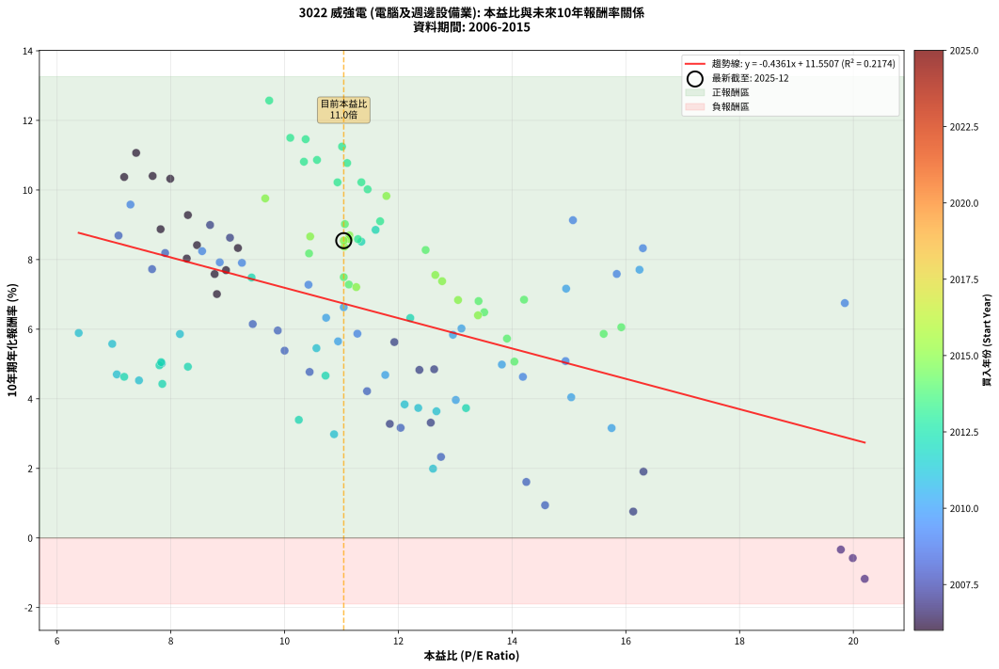
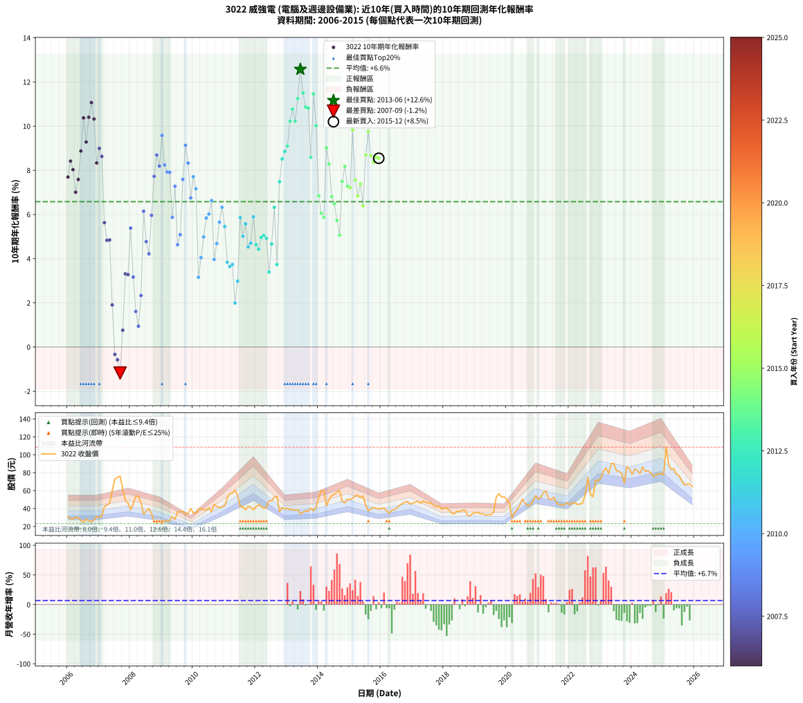

# 3022 威強電 - 本益比與未來報酬率分析

!!! info "報告資訊"
    - **股票代號**: 3022
    - **公司名稱**: 威強電
    - **產業別**: 電腦及週邊設備業
    - **分析期間**: 2006-2015 (120 個數據點)
    - **資料來源**: Type 12 (ShowMonthlyK_ChartFlow) 月收盤價與本益比
    - **報酬率口徑**: 含現金股利 (簡化: 年度合計，假設每年7/1入帳)
    - **報告生成時間**: 2026-01-07 18:49:51 CST

## 📈 視覺化圖表

### 圖表1: 本益比 vs 未來報酬率關係

*圖表1：3022 威強電 本益比與10年期未來報酬率關係 (2006-2015)*

### 圖表2: 歷年買入時點的10年期實際報酬率

*圖表2：3022 威強電 歷年買入時點的10年期實際報酬率 (2006-2015)*

## 📍 買點訊號說明

本報告提供兩種買點提示訊號（顯示於圖表2的股價子圖中）：

### ▲ 小綠色三角形（回測驗證）
- **計算方式**: 使用全部歷史資料計算本益比第25百分位數
- **用途**: 事後驗證，顯示歷史上哪些時點確實為低估區
- **限制**: 當下無法判斷，僅供回測參考
- **特性**: 後見之明（Look-Ahead Bias）

### ▲ 小橘色三角形（即時訊號）
- **計算方式**: 使用截至當月的過去5年資料計算本益比第25百分位數
- **用途**: 實際投資決策，當時即可判斷
- **優勢**: 可操作性強，符合實務需求
- **特性**: 無後見之明，滾動窗口計算

!!! tip "如何使用兩種訊號"
    - **綠色▲** 幫助理解歷史估值機會，驗證策略有效性
    - **橘色▲** 可作為實際買進參考，但仍需搭配基本面分析
    - 兩種訊號重疊時，表示即時判斷與事後驗證一致，信心度較高
    - 僅有綠色▲時，表示當時無法判斷（需要未來資料才能確認）
    - 僅有橘色▲時，表示即時判斷為買點，但事後可能不是最佳時機

## 📊 估值分析摘要

| 指標 | 數值 |
|:---:|:---:|
| **目前本益比** (2015-12) | **11.04 倍** |
| **歷史平均本益比** | 11.40 倍 |
| **估值水準** | 🟡 合理範圍 |
| **預期10年年化報酬率** | **+6.74%** |
| **歷史平均報酬率** | +6.58% |
| **相關係數 (R²)** | 0.2174 |
| **趨勢線斜率** | -0.4361 |

!!! abstract "核心洞察"
    目前本益比接近歷史平均，預期報酬率符合長期趨勢

    根據歷史數據回測，3022 威強電 在目前本益比 **11.0倍** 的估值水準下，
    預期未來10年年化報酬率約為 **+6.7%**。

    **重要提醒**: 本分析基於歷史數據統計，實際報酬率會受到公司基本面變化、產業趨勢、
    總體經濟環境等多重因素影響。R² = 0.22 表示本益比可解釋約 21.7% 的報酬率變異。

## 📈 歷史估值統計

### 最佳買點 (最高報酬率)

| 項目 | 數值 |
|:---:|:---:|
| 起始時間 | 2013-06 |
| 當時本益比 | 9.73 倍 |
| 起始價格 | 34.2 元 |
| 10年後價格 | 90.1 元 |
| **10年年化報酬率** | **+12.57%** |

### 最差買點 (最低報酬率)

| 項目 | 數值 |
|:---:|:---:|
| 起始時間 | 2007-09 |
| 當時本益比 | 20.20 倍 |
| 起始價格 | 76.3 元 |
| 10年後價格 | 43.3 元 |
| **10年年化報酬率** | **-1.18%** |

## 🎯 投資啟示

### 本益比與報酬率關係

趨勢線方程式: **y = -0.4361x + 11.5507**

!!! note "負相關"
    本益比與未來報酬率呈現負相關。較低的本益比通常帶來較高的未來報酬率，
    但相關性不算非常強。**估值仍是重要參考指標之一**。

### 估值區間建議

基於歷史數據分析:

- **🟢 低估區** (P/E < 9.1): 預期報酬率較高，可考慮增加持股
- **🟡 合理區** (P/E 9.1-13.7): 預期報酬率符合長期趨勢，正常持有
- **🔴 高估區** (P/E > 13.7): 預期報酬率較低，可考慮減碼或觀望

!!! danger "風險提示"
    - 過去表現不代表未來結果
    - 本分析假設公司基本面無重大結構性變化
    - 產業環境劇變可能使歷史規律失效
    - 應結合公司財報、產業趨勢、總體經濟等多重因素綜合判斷

!!! success "長期投資觀點"
    歷史數據顯示，在合理或低估的估值水準買入並長期持有，
    往往能獲得較佳的投資報酬。**耐心等待好價格**是價值投資的核心原則。

## 📊 數據品質

- **資料來源**: GoodInfo.tw Type 12 (ShowMonthlyK_ChartFlow)
- **資料頻率**: 月度收盤價與本益比
- **回測期間**: 2006-2015
- **數據點數量**: 120 個 (每個點代表一次10年期回測)

### 計算方法說明

1. **10年期年化報酬率**:
   - 對每個歷史時點，計算其後10年的實際投資報酬率
   - 期末價值(不含股利): 期末價格
   - 期末價值(含現金股利): 期末價格 + 持有期間內的現金股利合計 (簡化: 年度合計，假設每年7/1入帳)
   - 公式: 年化報酬率 = [(期末價值/期初價格)^(1/年數) - 1] × 100%

2. **本益比 (P/E Ratio)**:
   - 使用當時的月收盤價與EPS計算
   - 資料來源: Type 12 月度河流圖本益比數據

3. **趨勢線 (Linear Regression)**:
   - 使用最小平方法擬合線性趨勢線
   - R²值衡量本益比對報酬率的解釋能力

---

*本報告由 Stock Analysis System v1.9.0 自動生成*
*數據更新時間: 2026-01-07 18:49:51 CST*

## 📋 月度回測明細表

（每一列對應時間線圖中的一個買入點；可用來對照 SVG 圖上的每個點。）

| 買入月份 | 賣出月份 | 回測期限_年 | 實際持有年數 | 買入本益比_倍 | 買入收盤價_元 | 賣出收盤價_元 | 現金股利合計_元 | 總報酬率_pct | 年化報酬率_pct |
| --- | --- | --- | --- | --- | --- | --- | --- | --- | --- |
| 2006-01 | 2016-01 | 10 | 9.999 | 8.97 | 30.60 | 40.20 | 24.02 | +109.86 | +7.70 |
| 2006-02 | 2016-02 | 10 | 9.999 | 8.46 | 28.85 | 40.70 | 24.02 | +124.32 | +8.42 |
| 2006-03 | 2016-03 | 10 | 10.001 | 8.28 | 28.25 | 37.15 | 24.02 | +116.52 | +8.03 |
| 2006-04 | 2016-04 | 10 | 10.001 | 8.81 | 30.05 | 35.15 | 24.02 | +96.90 | +7.01 |
| 2006-05 | 2016-05 | 10 | 10.001 | 8.77 | 29.90 | 38.10 | 24.02 | +107.75 | +7.58 |
| 2006-06 | 2016-06 | 10 | 10.001 | 7.82 | 26.65 | 38.35 | 24.02 | +134.02 | +8.87 |
| 2006-07 | 2016-07 | 10 | 10.001 | 7.18 | 24.50 | 40.75 | 24.99 | +168.33 | +10.37 |
| 2006-08 | 2016-08 | 10 | 10.001 | 8.30 | 28.30 | 43.75 | 24.99 | +142.90 | +9.28 |
| 2006-09 | 2016-09 | 10 | 10.001 | 7.68 | 26.20 | 45.50 | 24.99 | +169.05 | +10.40 |
| 2006-10 | 2016-10 | 10 | 10.001 | 7.39 | 25.20 | 47.00 | 24.99 | +185.68 | +11.07 |
| 2006-11 | 2016-11 | 10 | 10.001 | 7.99 | 27.25 | 47.80 | 24.99 | +167.13 | +10.32 |
| 2006-12 | 2016-12 | 10 | 10.001 | 9.18 | 31.30 | 44.70 | 24.99 | +122.66 | +8.33 |
| 2007-01 | 2017-01 | 10 | 10.001 | 8.69 | 30.00 | 46.00 | 24.99 | +136.64 | +8.99 |
| 2007-02 | 2017-02 | 10 | 10.001 | 9.04 | 31.55 | 47.20 | 24.99 | +128.82 | +8.63 |
| 2007-03 | 2017-03 | 10 | 10.001 | 11.93 | 42.15 | 47.90 | 24.99 | +72.93 | +5.63 |
| 2007-04 | 2017-04 | 10 | 10.001 | 12.37 | 44.20 | 45.85 | 24.99 | +60.28 | +4.83 |
| 2007-05 | 2017-05 | 10 | 10.001 | 12.63 | 45.65 | 48.30 | 24.99 | +60.55 | +4.85 |
| 2007-06 | 2017-06 | 10 | 10.001 | 16.31 | 59.60 | 47.00 | 24.99 | +20.79 | +1.91 |
| 2007-07 | 2017-07 | 10 | 10.001 | 19.78 | 73.10 | 46.20 | 24.49 | -3.29 | -0.33 |
| 2007-08 | 2017-08 | 10 | 10.001 | 19.99 | 74.70 | 46.00 | 24.49 | -5.63 | -0.58 |
| 2007-09 | 2017-09 | 10 | 10.001 | 20.20 | 76.30 | 43.30 | 24.49 | -11.15 | -1.18 |
| 2007-10 | 2017-10 | 10 | 10.001 | 16.13 | 61.60 | 41.95 | 24.49 | +7.86 | +0.76 |
| 2007-11 | 2017-11 | 10 | 10.001 | 12.57 | 48.50 | 42.70 | 24.49 | +38.54 | +3.31 |
| 2007-12 | 2017-12 | 10 | 10.001 | 11.85 | 46.20 | 39.30 | 24.49 | +38.08 | +3.28 |
| 2008-01 | 2018-01 | 10 | 10.001 | 10.00 | 38.50 | 40.55 | 24.49 | +68.94 | +5.38 |
| 2008-02 | 2018-03 | 10 | 10.081 | 12.04 | 45.75 | 38.15 | 24.49 | +36.92 | +3.17 |
| 2008-03 | 2018-03 | 10 | 9.999 | 14.25 | 53.40 | 38.15 | 24.49 | +17.31 | +1.61 |
| 2008-04 | 2018-04 | 10 | 9.999 | 14.58 | 53.90 | 34.70 | 24.49 | +9.82 | +0.94 |
| 2008-05 | 2018-05 | 10 | 9.999 | 12.75 | 46.50 | 34.05 | 24.49 | +25.90 | +2.33 |
| 2008-06 | 2018-06 | 10 | 9.999 | 9.44 | 33.95 | 37.15 | 24.49 | +81.57 | +6.15 |
| 2008-07 | 2018-07 | 10 | 9.999 | 10.44 | 37.00 | 36.50 | 22.46 | +59.36 | +4.77 |
| 2008-08 | 2018-08 | 10 | 9.999 | 11.45 | 40.00 | 38.00 | 22.46 | +51.16 | +4.22 |
| 2008-09 | 2018-09 | 10 | 9.999 | 9.88 | 34.00 | 38.20 | 22.46 | +78.42 | +5.96 |
| 2008-10 | 2018-10 | 10 | 9.999 | 7.67 | 26.00 | 32.25 | 22.46 | +110.44 | +7.73 |
| 2008-11 | 2018-11 | 10 | 9.999 | 7.08 | 23.65 | 31.95 | 22.46 | +130.08 | +8.69 |
| 2008-12 | 2018-12 | 10 | 9.999 | 7.90 | 26.00 | 34.65 | 22.46 | +119.67 | +8.19 |
| 2009-01 | 2019-01 | 10 | 9.999 | 7.29 | 23.20 | 35.45 | 22.46 | +149.63 | +9.58 |
| 2009-02 | 2019-02 | 10 | 9.999 | 8.55 | 26.30 | 35.60 | 22.46 | +120.78 | +8.24 |
| 2009-03 | 2019-03 | 10 | 9.999 | 8.86 | 26.30 | 33.90 | 22.46 | +114.31 | +7.92 |
| 2009-04 | 2019-04 | 10 | 9.999 | 9.25 | 26.50 | 34.25 | 22.46 | +114.02 | +7.91 |
| 2009-05 | 2019-05 | 10 | 9.999 | 11.28 | 31.10 | 32.55 | 22.46 | +76.89 | +5.87 |
| 2009-06 | 2019-06 | 10 | 9.999 | 10.42 | 27.60 | 33.25 | 22.46 | +101.86 | +7.28 |
| 2009-07 | 2019-07 | 10 | 9.999 | 14.19 | 36.10 | 33.00 | 23.76 | +57.24 | +4.63 |
| 2009-08 | 2019-08 | 10 | 9.999 | 14.94 | 36.40 | 36.00 | 23.76 | +64.18 | +5.08 |
| 2009-09 | 2019-09 | 10 | 9.999 | 15.84 | 36.90 | 52.90 | 23.76 | +107.76 | +7.59 |
| 2009-10 | 2019-10 | 10 | 9.999 | 15.07 | 33.50 | 56.50 | 23.76 | +139.59 | +9.13 |
| 2009-11 | 2019-11 | 10 | 9.999 | 16.30 | 34.50 | 53.00 | 23.76 | +122.50 | +8.33 |
| 2009-12 | 2019-12 | 10 | 9.999 | 19.85 | 39.90 | 52.90 | 23.76 | +92.14 | +6.75 |
| 2010-01 | 2020-01 | 10 | 9.999 | 16.24 | 35.20 | 50.20 | 23.76 | +110.12 | +7.71 |
| 2010-02 | 2020-02 | 10 | 9.999 | 14.95 | 34.75 | 45.65 | 23.76 | +99.75 | +7.16 |
| 2010-03 | 2020-03 | 10 | 10.001 | 15.75 | 39.10 | 29.60 | 23.76 | +36.48 | +3.16 |
| 2010-04 | 2020-04 | 10 | 10.001 | 15.04 | 39.70 | 35.25 | 23.76 | +48.64 | +4.04 |
| 2010-05 | 2020-05 | 10 | 10.001 | 13.82 | 38.65 | 39.10 | 23.76 | +62.64 | +4.98 |
| 2010-06 | 2020-06 | 10 | 10.001 | 12.96 | 38.30 | 43.80 | 23.76 | +76.40 | +5.84 |
| 2010-07 | 2020-07 | 10 | 10.001 | 13.11 | 40.80 | 50.40 | 22.81 | +79.43 | +6.02 |
| 2010-08 | 2020-08 | 10 | 10.001 | 11.04 | 36.10 | 45.80 | 22.81 | +90.04 | +6.63 |
| 2010-09 | 2020-09 | 10 | 10.001 | 13.01 | 44.60 | 43.00 | 22.81 | +47.55 | +3.97 |
| 2010-10 | 2020-10 | 10 | 10.001 | 11.77 | 42.20 | 43.90 | 22.81 | +58.07 | +4.68 |
| 2010-11 | 2020-11 | 10 | 10.001 | 10.94 | 40.95 | 48.15 | 22.81 | +73.27 | +5.65 |
| 2010-12 | 2020-12 | 10 | 10.001 | 10.73 | 41.85 | 54.50 | 22.81 | +84.72 | +6.33 |
| 2011-01 | 2021-01 | 10 | 10.001 | 10.56 | 43.10 | 50.50 | 22.81 | +70.08 | +5.45 |
| 2011-02 | 2021-02 | 10 | 10.001 | 12.11 | 51.60 | 52.40 | 22.81 | +45.75 | +3.84 |
| 2011-03 | 2021-03 | 10 | 10.001 | 12.67 | 56.30 | 57.70 | 22.81 | +42.99 | +3.64 |
| 2011-04 | 2021-04 | 10 | 10.001 | 12.35 | 57.10 | 59.60 | 22.81 | +44.32 | +3.74 |
| 2011-05 | 2021-05 | 10 | 10.001 | 12.61 | 60.60 | 51.00 | 22.81 | +21.79 | +1.99 |
| 2011-06 | 2021-06 | 10 | 10.001 | 10.87 | 54.20 | 49.90 | 22.81 | +34.14 | +2.98 |
| 2011-07 | 2021-07 | 10 | 10.001 | 8.16 | 42.15 | 52.70 | 21.80 | +76.76 | +5.86 |
| 2011-08 | 2021-08 | 10 | 10.001 | 7.84 | 41.90 | 46.55 | 21.80 | +63.14 | +5.02 |
| 2011-09 | 2021-09 | 10 | 10.001 | 6.97 | 38.50 | 44.45 | 21.80 | +72.09 | +5.58 |
| 2011-10 | 2021-10 | 10 | 10.001 | 7.44 | 42.45 | 44.30 | 21.80 | +55.72 | +4.53 |
| 2011-11 | 2021-11 | 10 | 10.001 | 7.05 | 41.50 | 43.90 | 21.80 | +58.32 | +4.70 |
| 2011-12 | 2021-12 | 10 | 10.001 | 6.38 | 38.70 | 46.80 | 21.80 | +77.27 | +5.89 |
| 2012-01 | 2022-01 | 10 | 10.001 | 7.18 | 42.00 | 44.25 | 21.80 | +57.27 | +4.63 |
| 2012-02 | 2022-03 | 10 | 10.081 | 7.85 | 44.20 | 46.60 | 21.80 | +54.76 | +4.43 |
| 2012-03 | 2022-03 | 10 | 9.999 | 7.80 | 42.15 | 46.60 | 21.80 | +62.29 | +4.96 |
| 2012-04 | 2022-04 | 10 | 9.999 | 7.83 | 40.60 | 44.65 | 21.80 | +63.68 | +5.05 |
| 2012-05 | 2022-05 | 10 | 9.999 | 8.30 | 41.20 | 44.80 | 21.80 | +61.66 | +4.92 |
| 2012-06 | 2022-06 | 10 | 9.999 | 10.25 | 48.60 | 46.05 | 21.80 | +39.62 | +3.39 |
| 2012-07 | 2022-07 | 10 | 9.999 | 10.72 | 48.50 | 54.70 | 21.80 | +57.74 | +4.66 |
| 2012-08 | 2022-08 | 10 | 9.999 | 12.21 | 52.50 | 75.10 | 21.80 | +84.58 | +6.32 |
| 2012-09 | 2022-09 | 10 | 9.999 | 13.19 | 53.80 | 55.80 | 21.80 | +44.25 | +3.73 |
| 2012-10 | 2022-10 | 10 | 9.999 | 9.42 | 36.35 | 53.00 | 21.80 | +105.79 | +7.48 |
| 2012-11 | 2022-11 | 10 | 9.999 | 11.35 | 41.30 | 71.70 | 21.80 | +126.40 | +8.52 |
| 2012-12 | 2022-12 | 10 | 9.999 | 11.60 | 39.65 | 70.80 | 21.80 | +133.55 | +8.85 |
| 2013-01 | 2023-01 | 10 | 9.999 | 11.68 | 40.10 | 74.00 | 21.80 | +138.91 | +9.10 |
| 2013-02 | 2023-02 | 10 | 9.999 | 11.35 | 39.15 | 81.80 | 21.80 | +164.63 | +10.22 |
| 2013-03 | 2023-03 | 10 | 9.999 | 11.10 | 38.50 | 85.30 | 21.80 | +178.19 | +10.77 |
| 2013-04 | 2023-04 | 10 | 9.999 | 10.93 | 38.10 | 79.00 | 21.80 | +164.58 | +10.22 |
| 2013-05 | 2023-05 | 10 | 9.999 | 11.01 | 38.55 | 90.10 | 21.80 | +190.28 | +11.25 |
| 2013-06 | 2023-06 | 10 | 9.999 | 9.73 | 34.25 | 90.10 | 21.80 | +226.73 | +12.57 |
| 2013-07 | 2023-07 | 10 | 9.999 | 10.10 | 35.70 | 82.20 | 23.80 | +196.93 | +11.50 |
| 2013-08 | 2023-08 | 10 | 9.999 | 10.57 | 37.55 | 81.50 | 23.80 | +180.44 | +10.86 |
| 2013-09 | 2023-09 | 10 | 9.999 | 10.34 | 36.90 | 79.20 | 23.80 | +179.14 | +10.81 |
| 2013-10 | 2023-10 | 10 | 9.999 | 11.29 | 40.50 | 68.50 | 23.80 | +127.91 | +8.59 |
| 2013-11 | 2023-11 | 10 | 9.999 | 10.37 | 37.35 | 86.70 | 23.80 | +195.86 | +11.46 |
| 2013-12 | 2023-12 | 10 | 9.999 | 11.46 | 41.50 | 84.00 | 23.80 | +159.77 | +10.02 |
| 2014-01 | 2024-01 | 10 | 9.999 | 14.21 | 52.50 | 78.00 | 23.80 | +93.91 | +6.85 |
| 2014-02 | 2024-02 | 10 | 9.999 | 15.92 | 60.00 | 84.20 | 23.80 | +80.01 | +6.06 |
| 2014-03 | 2024-03 | 10 | 10.001 | 15.61 | 60.00 | 82.30 | 23.80 | +76.84 | +5.87 |
| 2014-04 | 2024-04 | 10 | 10.001 | 11.06 | 43.30 | 78.90 | 23.80 | +137.19 | +9.02 |
| 2014-05 | 2024-05 | 10 | 10.001 | 12.48 | 49.80 | 86.50 | 23.80 | +121.49 | +8.28 |
| 2014-06 | 2024-06 | 10 | 10.001 | 13.41 | 54.50 | 81.50 | 23.80 | +93.22 | +6.81 |
| 2014-07 | 2024-07 | 10 | 10.001 | 13.51 | 55.90 | 82.30 | 22.50 | +87.48 | +6.49 |
| 2014-08 | 2024-08 | 10 | 10.001 | 13.91 | 58.60 | 79.80 | 22.50 | +74.58 | +5.73 |
| 2014-09 | 2024-09 | 10 | 10.001 | 14.04 | 60.20 | 76.20 | 22.50 | +63.96 | +5.07 |
| 2014-10 | 2024-10 | 10 | 10.001 | 11.04 | 48.15 | 76.70 | 22.50 | +106.03 | +7.50 |
| 2014-11 | 2024-11 | 10 | 10.001 | 10.43 | 46.25 | 79.00 | 22.50 | +119.47 | +8.18 |
| 2014-12 | 2024-12 | 10 | 10.001 | 11.13 | 50.20 | 78.90 | 22.50 | +102.00 | +7.28 |
| 2015-01 | 2025-01 | 10 | 10.001 | 11.26 | 49.90 | 77.60 | 22.50 | +100.61 | +7.21 |
| 2015-02 | 2025-02 | 10 | 10.001 | 11.79 | 51.30 | 108.50 | 22.50 | +155.37 | +9.83 |
| 2015-03 | 2025-03 | 10 | 10.001 | 12.65 | 54.00 | 89.40 | 22.50 | +107.23 | +7.56 |
| 2015-04 | 2025-04 | 10 | 10.001 | 13.05 | 54.70 | 83.50 | 22.50 | +93.79 | +6.84 |
| 2015-05 | 2025-05 | 10 | 10.001 | 12.77 | 52.50 | 84.50 | 22.50 | +103.82 | +7.38 |
| 2015-06 | 2025-06 | 10 | 10.001 | 13.40 | 54.00 | 77.90 | 22.50 | +85.93 | +6.40 |
| 2015-07 | 2025-07 | 10 | 10.001 | 11.14 | 44.00 | 76.80 | 24.50 | +130.24 | +8.70 |
| 2015-08 | 2025-08 | 10 | 10.001 | 9.66 | 37.40 | 70.40 | 24.50 | +153.75 | +9.76 |
| 2015-09 | 2025-09 | 10 | 10.001 | 10.45 | 39.60 | 66.40 | 24.50 | +129.56 | +8.66 |
| 2015-10 | 2025-10 | 10 | 10.001 | 11.05 | 41.00 | 67.10 | 24.50 | +123.42 | +8.37 |
| 2015-11 | 2025-11 | 10 | 10.001 | 11.13 | 40.40 | 67.60 | 24.50 | +127.98 | +8.59 |
| 2015-12 | 2025-12 | 10 | 10.001 | 11.04 | 39.20 | 64.50 | 24.50 | +127.05 | +8.54 |
