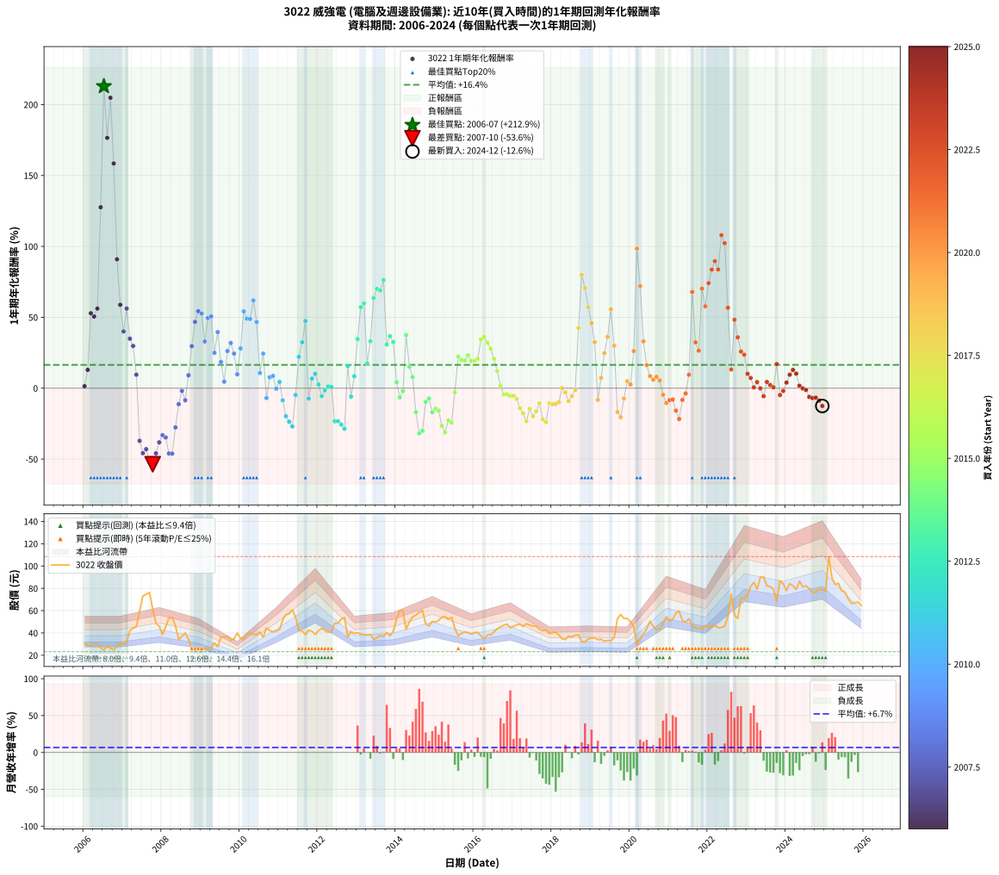

# 3022 威強電 - 本益比與未來報酬率分析

!!! info "報告資訊"
    - **股票代號**: 3022
    - **公司名稱**: 威強電
    - **產業別**: 電腦及週邊設備業
    - **分析期間**: 2006-2024 (228 個數據點)
    - **資料來源**: Type 12 (ShowMonthlyK_ChartFlow) 月收盤價與本益比
    - **報酬率口徑**: 含現金股利 (簡化: 年度合計，假設每年7/1入帳)
    - **報告生成時間**: 2026-01-09 20:56:37 CST

## 📈 視覺化圖表

### 圖表1: 本益比 vs 未來報酬率關係

*圖表1：3022 威強電 本益比與1年期未來報酬率關係 (2006-2024)*

### 圖表2: 歷年買入時點的1年期實際報酬率

*圖表2：3022 威強電 歷年買入時點的1年期實際報酬率 (2006-2024)*

## 📍 買點訊號說明

本報告提供兩種買點提示訊號（顯示於圖表2的股價子圖中）：

### ▲ 小綠色三角形（回測驗證）
- **計算方式**: 使用全部歷史資料計算本益比第25百分位數
- **用途**: 事後驗證，顯示歷史上哪些時點確實為低估區
- **限制**: 當下無法判斷，僅供回測參考
- **特性**: 後見之明（Look-Ahead Bias）

### ▲ 小橘色三角形（即時訊號）
- **計算方式**: 使用截至當月的過去5年資料計算本益比第25百分位數
- **用途**: 實際投資決策，當時即可判斷
- **優勢**: 可操作性強，符合實務需求
- **特性**: 無後見之明，滾動窗口計算

!!! tip "如何使用兩種訊號"
    - **綠色▲** 幫助理解歷史估值機會，驗證策略有效性
    - **橘色▲** 可作為實際買進參考，但仍需搭配基本面分析
    - 兩種訊號重疊時，表示即時判斷與事後驗證一致，信心度較高
    - 僅有綠色▲時，表示當時無法判斷（需要未來資料才能確認）
    - 僅有橘色▲時，表示即時判斷為買點，但事後可能不是最佳時機

## 📊 估值分析摘要

| 指標 | 數值 |
|:---:|:---:|
| **目前本益比** (2024-12) | **9.05 倍** |
| **歷史平均本益比** | 11.20 倍 |
| **估值水準** | 🟡 合理範圍 |
| **預期1年年化報酬率** | **+30.75%** |
| **歷史平均報酬率** | +16.43% |
| **相關係數 (R²)** | 0.2086 |
| **趨勢線斜率** | -6.6623 |

!!! abstract "核心洞察"
    目前本益比接近歷史平均，預期報酬率符合長期趨勢

    根據歷史數據回測，3022 威強電 在目前本益比 **9.1倍** 的估值水準下，
    預期未來1年年化報酬率約為 **+30.7%**。

    **重要提醒**: 本分析基於歷史數據統計，實際報酬率會受到公司基本面變化、產業趨勢、
    總體經濟環境等多重因素影響。R² = 0.21 表示本益比可解釋約 20.9% 的報酬率變異。

## 📈 歷史估值統計

### 最佳買點 (最高報酬率)

| 項目 | 數值 |
|:---:|:---:|
| 起始時間 | 2006-07 |
| 當時本益比 | 7.18 倍 |
| 起始價格 | 24.5 元 |
| 1年後價格 | 73.1 元 |
| **1年年化報酬率** | **+212.90%** |

### 最差買點 (最低報酬率)

| 項目 | 數值 |
|:---:|:---:|
| 起始時間 | 2007-10 |
| 當時本益比 | 16.13 倍 |
| 起始價格 | 61.6 元 |
| 1年後價格 | 26.0 元 |
| **1年年化報酬率** | **-53.62%** |

## 🎯 投資啟示

### 本益比與報酬率關係

趨勢線方程式: **y = -6.6623x + 91.0412**

!!! warning "強負相關"
    本益比與未來報酬率呈現強負相關。在高本益比時期買入，未來報酬率顯著較低；
    在低本益比時期買入，未來報酬率顯著較高。**估值紀律至關重要**。

### 估值區間建議

基於歷史數據分析:

- **🟢 低估區** (P/E < 9.0): 預期報酬率較高，可考慮增加持股
- **🟡 合理區** (P/E 9.0-13.4): 預期報酬率符合長期趨勢，正常持有
- **🔴 高估區** (P/E > 13.4): 預期報酬率較低，可考慮減碼或觀望

!!! danger "風險提示"
    - 過去表現不代表未來結果
    - 本分析假設公司基本面無重大結構性變化
    - 產業環境劇變可能使歷史規律失效
    - 應結合公司財報、產業趨勢、總體經濟等多重因素綜合判斷

!!! success "長期投資觀點"
    歷史數據顯示，在合理或低估的估值水準買入並長期持有，
    往往能獲得較佳的投資報酬。**耐心等待好價格**是價值投資的核心原則。

## 📊 數據品質

- **資料來源**: GoodInfo.tw Type 12 (ShowMonthlyK_ChartFlow)
- **資料頻率**: 月度收盤價與本益比
- **回測期間**: 2006-2024
- **數據點數量**: 228 個 (每個點代表一次1年期回測)

### 計算方法說明

1. **1年期年化報酬率**:
   - 對每個歷史時點，計算其後1年的實際投資報酬率
   - 期末價值(不含股利): 期末價格
   - 期末價值(含現金股利): 期末價格 + 持有期間內的現金股利合計 (簡化: 年度合計，假設每年7/1入帳)
   - 公式: 年化報酬率 = [(期末價值/期初價格)^(1/年數) - 1] × 100%

2. **本益比 (P/E Ratio)**:
   - 使用當時的月收盤價與EPS計算
   - 資料來源: Type 12 月度河流圖本益比數據

3. **趨勢線 (Linear Regression)**:
   - 使用最小平方法擬合線性趨勢線
   - R²值衡量本益比對報酬率的解釋能力

---

*本報告由 Stock Analysis System v1.9.0 自動生成*
*數據更新時間: 2026-01-09 20:56:37 CST*

## 📋 月度回測明細表

（每一列對應時間線圖中的一個買入點；可用來對照 SVG 圖上的每個點。）

| 買入月份 | 賣出月份 | 回測期限_年 | 實際持有年數 | 買入本益比_倍 | 買入收盤價_元 | 賣出收盤價_元 | 現金股利合計_元 | 總報酬率_pct | 年化報酬率_pct |
| --- | --- | --- | --- | --- | --- | --- | --- | --- | --- |
| 2006-01 | 2007-01 | 1 | 0.999 | 8.97 | 30.60 | 30.00 | 1.02 | +1.39 | +1.39 |
| 2006-02 | 2007-02 | 1 | 0.999 | 8.46 | 28.85 | 31.55 | 1.02 | +12.91 | +12.92 |
| 2006-03 | 2007-03 | 1 | 0.999 | 8.28 | 28.25 | 42.15 | 1.02 | +52.83 | +52.88 |
| 2006-04 | 2007-04 | 1 | 0.999 | 8.81 | 30.05 | 44.20 | 1.02 | +50.50 | +50.54 |
| 2006-05 | 2007-05 | 1 | 0.999 | 8.77 | 29.90 | 45.65 | 1.02 | +56.10 | +56.15 |
| 2006-06 | 2007-06 | 1 | 0.999 | 7.82 | 26.65 | 59.60 | 1.02 | +127.49 | +127.61 |
| 2006-07 | 2007-07 | 1 | 0.999 | 7.18 | 24.50 | 73.10 | 3.50 | +212.65 | +212.90 |
| 2006-08 | 2007-08 | 1 | 0.999 | 8.30 | 28.30 | 74.70 | 3.50 | +176.33 | +176.52 |
| 2006-09 | 2007-09 | 1 | 0.999 | 7.68 | 26.20 | 76.30 | 3.50 | +204.58 | +204.81 |
| 2006-10 | 2007-10 | 1 | 0.999 | 7.39 | 25.20 | 61.60 | 3.50 | +158.33 | +158.50 |
| 2006-11 | 2007-11 | 1 | 0.999 | 7.99 | 27.25 | 48.50 | 3.50 | +90.83 | +90.91 |
| 2006-12 | 2007-12 | 1 | 0.999 | 9.18 | 31.30 | 46.20 | 3.50 | +58.79 | +58.84 |
| 2007-01 | 2008-01 | 1 | 0.999 | 8.69 | 30.00 | 38.50 | 3.50 | +40.00 | +40.03 |
| 2007-02 | 2008-02 | 1 | 0.999 | 9.04 | 31.55 | 45.75 | 3.50 | +56.10 | +56.15 |
| 2007-03 | 2008-03 | 1 | 1.002 | 11.93 | 42.15 | 53.40 | 3.50 | +34.99 | +34.91 |
| 2007-04 | 2008-04 | 1 | 1.002 | 12.37 | 44.20 | 53.90 | 3.50 | +29.86 | +29.79 |
| 2007-05 | 2008-05 | 1 | 1.002 | 12.63 | 45.65 | 46.50 | 3.50 | +9.53 | +9.51 |
| 2007-06 | 2008-06 | 1 | 1.002 | 16.31 | 59.60 | 33.95 | 3.50 | -37.16 | -37.10 |
| 2007-07 | 2008-07 | 1 | 1.002 | 19.78 | 73.10 | 37.00 | 2.53 | -45.93 | -45.86 |
| 2007-08 | 2008-08 | 1 | 1.002 | 19.99 | 74.70 | 40.00 | 2.53 | -43.07 | -43.00 |
| 2007-09 | 2008-09 | 1 | 1.002 | 20.20 | 76.30 | 34.00 | 2.53 | -52.13 | -52.05 |
| 2007-10 | 2008-10 | 1 | 1.002 | 16.13 | 61.60 | 26.00 | 2.53 | -53.69 | -53.62 |
| 2007-11 | 2008-11 | 1 | 1.002 | 12.57 | 48.50 | 23.65 | 2.53 | -46.02 | -45.96 |
| 2007-12 | 2008-12 | 1 | 1.002 | 11.85 | 46.20 | 26.00 | 2.53 | -38.25 | -38.19 |
| 2008-01 | 2009-01 | 1 | 1.002 | 10.00 | 38.50 | 23.20 | 2.53 | -33.17 | -33.12 |
| 2008-02 | 2009-03 | 1 | 1.081 | 12.04 | 45.75 | 26.30 | 2.53 | -36.99 | -34.76 |
| 2008-03 | 2009-03 | 1 | 0.999 | 14.25 | 53.40 | 26.30 | 2.53 | -46.01 | -46.04 |
| 2008-04 | 2009-04 | 1 | 0.999 | 14.58 | 53.90 | 26.50 | 2.53 | -46.14 | -46.17 |
| 2008-05 | 2009-05 | 1 | 0.999 | 12.75 | 46.50 | 31.10 | 2.53 | -27.68 | -27.70 |
| 2008-06 | 2009-06 | 1 | 0.999 | 9.44 | 33.95 | 27.60 | 2.53 | -11.26 | -11.26 |
| 2008-07 | 2009-07 | 1 | 0.999 | 10.44 | 37.00 | 36.10 | 0.20 | -1.89 | -1.89 |
| 2008-08 | 2009-08 | 1 | 0.999 | 11.45 | 40.00 | 36.40 | 0.20 | -8.50 | -8.50 |
| 2008-09 | 2009-09 | 1 | 0.999 | 9.88 | 34.00 | 36.90 | 0.20 | +9.12 | +9.13 |
| 2008-10 | 2009-10 | 1 | 0.999 | 7.67 | 26.00 | 33.50 | 0.20 | +29.62 | +29.65 |
| 2008-11 | 2009-11 | 1 | 0.999 | 7.08 | 23.65 | 34.50 | 0.20 | +46.73 | +46.77 |
| 2008-12 | 2009-12 | 1 | 0.999 | 7.90 | 26.00 | 39.90 | 0.20 | +54.24 | +54.28 |
| 2009-01 | 2010-01 | 1 | 0.999 | 7.29 | 23.20 | 35.20 | 0.20 | +52.59 | +52.64 |
| 2009-02 | 2010-02 | 1 | 0.999 | 8.55 | 26.30 | 34.75 | 0.20 | +32.90 | +32.92 |
| 2009-03 | 2010-03 | 1 | 0.999 | 8.86 | 26.30 | 39.10 | 0.20 | +49.44 | +49.48 |
| 2009-04 | 2010-04 | 1 | 0.999 | 9.25 | 26.50 | 39.70 | 0.20 | +50.57 | +50.62 |
| 2009-05 | 2010-05 | 1 | 0.999 | 11.28 | 31.10 | 38.65 | 0.20 | +24.93 | +24.95 |
| 2009-06 | 2010-06 | 1 | 0.999 | 10.42 | 27.60 | 38.30 | 0.20 | +39.50 | +39.53 |
| 2009-07 | 2010-07 | 1 | 0.999 | 14.19 | 36.10 | 40.80 | 1.96 | +18.45 | +18.46 |
| 2009-08 | 2010-08 | 1 | 0.999 | 14.94 | 36.40 | 36.10 | 1.96 | +4.56 | +4.56 |
| 2009-09 | 2010-09 | 1 | 0.999 | 15.84 | 36.90 | 44.60 | 1.96 | +26.18 | +26.20 |
| 2009-10 | 2010-10 | 1 | 0.999 | 15.07 | 33.50 | 42.20 | 1.96 | +31.82 | +31.85 |
| 2009-11 | 2010-11 | 1 | 0.999 | 16.30 | 34.50 | 40.95 | 1.96 | +24.38 | +24.40 |
| 2009-12 | 2010-12 | 1 | 0.999 | 19.85 | 39.90 | 41.85 | 1.96 | +9.80 | +9.81 |
| 2010-01 | 2011-01 | 1 | 0.999 | 16.24 | 35.20 | 43.10 | 1.96 | +28.01 | +28.03 |
| 2010-02 | 2011-02 | 1 | 0.999 | 14.95 | 34.75 | 51.60 | 1.96 | +54.13 | +54.18 |
| 2010-03 | 2011-03 | 1 | 0.999 | 15.75 | 39.10 | 56.30 | 1.96 | +49.00 | +49.04 |
| 2010-04 | 2011-04 | 1 | 0.999 | 15.04 | 39.70 | 57.10 | 1.96 | +48.77 | +48.81 |
| 2010-05 | 2011-05 | 1 | 0.999 | 13.82 | 38.65 | 60.60 | 1.96 | +61.86 | +61.92 |
| 2010-06 | 2011-06 | 1 | 0.999 | 12.96 | 38.30 | 54.20 | 1.96 | +46.63 | +46.67 |
| 2010-07 | 2011-07 | 1 | 0.999 | 13.11 | 40.80 | 42.15 | 3.00 | +10.67 | +10.67 |
| 2010-08 | 2011-08 | 1 | 0.999 | 11.04 | 36.10 | 41.90 | 3.00 | +24.38 | +24.40 |
| 2010-09 | 2011-09 | 1 | 0.999 | 13.01 | 44.60 | 38.50 | 3.00 | -6.95 | -6.95 |
| 2010-10 | 2011-10 | 1 | 0.999 | 11.77 | 42.20 | 42.45 | 3.00 | +7.71 | +7.71 |
| 2010-11 | 2011-11 | 1 | 0.999 | 10.94 | 40.95 | 41.50 | 3.00 | +8.67 | +8.68 |
| 2010-12 | 2011-12 | 1 | 0.999 | 10.73 | 41.85 | 38.70 | 3.00 | -0.35 | -0.35 |
| 2011-01 | 2012-01 | 1 | 0.999 | 10.56 | 43.10 | 42.00 | 3.00 | +4.41 | +4.42 |
| 2011-02 | 2012-02 | 1 | 0.999 | 12.11 | 51.60 | 44.20 | 3.00 | -8.52 | -8.53 |
| 2011-03 | 2012-03 | 1 | 1.002 | 12.67 | 56.30 | 42.15 | 3.00 | -19.80 | -19.76 |
| 2011-04 | 2012-04 | 1 | 1.002 | 12.35 | 57.10 | 40.60 | 3.00 | -23.64 | -23.60 |
| 2011-05 | 2012-05 | 1 | 1.002 | 12.61 | 60.60 | 41.20 | 3.00 | -27.06 | -27.01 |
| 2011-06 | 2012-06 | 1 | 1.002 | 10.87 | 54.20 | 48.60 | 3.00 | -4.79 | -4.78 |
| 2011-07 | 2012-07 | 1 | 1.002 | 8.16 | 42.15 | 48.50 | 3.00 | +22.18 | +22.13 |
| 2011-08 | 2012-08 | 1 | 1.002 | 7.84 | 41.90 | 52.50 | 3.00 | +32.46 | +32.38 |
| 2011-09 | 2012-09 | 1 | 1.002 | 6.97 | 38.50 | 53.80 | 3.00 | +47.53 | +47.41 |
| 2011-10 | 2012-10 | 1 | 1.002 | 7.44 | 42.45 | 36.35 | 3.00 | -7.30 | -7.29 |
| 2011-11 | 2012-11 | 1 | 1.002 | 7.05 | 41.50 | 41.30 | 3.00 | +6.75 | +6.73 |
| 2011-12 | 2012-12 | 1 | 1.002 | 6.38 | 38.70 | 39.65 | 3.00 | +10.21 | +10.18 |
| 2012-01 | 2013-01 | 1 | 1.002 | 7.18 | 42.00 | 40.10 | 3.00 | +2.62 | +2.61 |
| 2012-02 | 2013-03 | 1 | 1.081 | 7.85 | 44.20 | 38.50 | 3.00 | -6.11 | -5.66 |
| 2012-03 | 2013-03 | 1 | 0.999 | 7.80 | 42.15 | 38.50 | 3.00 | -1.54 | -1.54 |
| 2012-04 | 2013-04 | 1 | 0.999 | 7.83 | 40.60 | 38.10 | 3.00 | +1.23 | +1.23 |
| 2012-05 | 2013-05 | 1 | 0.999 | 8.30 | 41.20 | 38.55 | 3.00 | +0.85 | +0.85 |
| 2012-06 | 2013-06 | 1 | 0.999 | 10.25 | 48.60 | 34.25 | 3.00 | -23.35 | -23.37 |
| 2012-07 | 2013-07 | 1 | 0.999 | 10.72 | 48.50 | 35.70 | 1.50 | -23.30 | -23.31 |
| 2012-08 | 2013-08 | 1 | 0.999 | 12.21 | 52.50 | 37.55 | 1.50 | -25.62 | -25.63 |
| 2012-09 | 2013-09 | 1 | 0.999 | 13.19 | 53.80 | 36.90 | 1.50 | -28.62 | -28.64 |
| 2012-10 | 2013-10 | 1 | 0.999 | 9.42 | 36.35 | 40.50 | 1.50 | +15.54 | +15.55 |
| 2012-11 | 2013-11 | 1 | 0.999 | 11.35 | 41.30 | 37.35 | 1.50 | -5.93 | -5.94 |
| 2012-12 | 2013-12 | 1 | 0.999 | 11.60 | 39.65 | 41.50 | 1.50 | +8.45 | +8.45 |
| 2013-01 | 2014-01 | 1 | 0.999 | 11.68 | 40.10 | 52.50 | 1.50 | +34.66 | +34.69 |
| 2013-02 | 2014-02 | 1 | 0.999 | 11.35 | 39.15 | 60.00 | 1.50 | +57.09 | +57.14 |
| 2013-03 | 2014-03 | 1 | 0.999 | 11.10 | 38.50 | 60.00 | 1.50 | +59.74 | +59.79 |
| 2013-04 | 2014-04 | 1 | 0.999 | 10.93 | 38.10 | 43.30 | 1.50 | +17.59 | +17.60 |
| 2013-05 | 2014-05 | 1 | 0.999 | 11.01 | 38.55 | 49.80 | 1.50 | +33.07 | +33.10 |
| 2013-06 | 2014-06 | 1 | 0.999 | 9.73 | 34.25 | 54.50 | 1.50 | +63.50 | +63.56 |
| 2013-07 | 2014-07 | 1 | 0.999 | 10.10 | 35.70 | 55.90 | 4.80 | +70.03 | +70.09 |
| 2013-08 | 2014-08 | 1 | 0.999 | 10.57 | 37.55 | 58.60 | 4.80 | +68.84 | +68.90 |
| 2013-09 | 2014-09 | 1 | 0.999 | 10.34 | 36.90 | 60.20 | 4.80 | +76.15 | +76.22 |
| 2013-10 | 2014-10 | 1 | 0.999 | 11.29 | 40.50 | 48.15 | 4.80 | +30.74 | +30.76 |
| 2013-11 | 2014-11 | 1 | 0.999 | 10.37 | 37.35 | 46.25 | 4.80 | +36.68 | +36.71 |
| 2013-12 | 2014-12 | 1 | 0.999 | 11.46 | 41.50 | 50.20 | 4.80 | +32.53 | +32.56 |
| 2014-01 | 2015-01 | 1 | 0.999 | 14.21 | 52.50 | 49.90 | 4.80 | +4.19 | +4.19 |
| 2014-02 | 2015-02 | 1 | 0.999 | 15.92 | 60.00 | 51.30 | 4.80 | -6.50 | -6.50 |
| 2014-03 | 2015-03 | 1 | 0.999 | 15.61 | 60.00 | 54.00 | 4.80 | -2.00 | -2.00 |
| 2014-04 | 2015-04 | 1 | 0.999 | 11.06 | 43.30 | 54.70 | 4.80 | +37.41 | +37.44 |
| 2014-05 | 2015-05 | 1 | 0.999 | 12.48 | 49.80 | 52.50 | 4.80 | +15.06 | +15.07 |
| 2014-06 | 2015-06 | 1 | 0.999 | 13.41 | 54.50 | 54.00 | 4.80 | +7.89 | +7.90 |
| 2014-07 | 2015-07 | 1 | 0.999 | 13.51 | 55.90 | 44.00 | 2.50 | -16.82 | -16.83 |
| 2014-08 | 2015-08 | 1 | 0.999 | 13.91 | 58.60 | 37.40 | 2.50 | -31.91 | -31.93 |
| 2014-09 | 2015-09 | 1 | 0.999 | 14.04 | 60.20 | 39.60 | 2.50 | -30.07 | -30.08 |
| 2014-10 | 2015-10 | 1 | 0.999 | 11.04 | 48.15 | 41.00 | 2.50 | -9.66 | -9.66 |
| 2014-11 | 2015-11 | 1 | 0.999 | 10.43 | 46.25 | 40.40 | 2.50 | -7.24 | -7.25 |
| 2014-12 | 2015-12 | 1 | 0.999 | 11.13 | 50.20 | 39.20 | 2.50 | -16.93 | -16.94 |
| 2015-01 | 2016-01 | 1 | 0.999 | 11.26 | 49.90 | 40.20 | 2.50 | -14.43 | -14.44 |
| 2015-02 | 2016-02 | 1 | 0.999 | 11.79 | 51.30 | 40.70 | 2.50 | -15.79 | -15.80 |
| 2015-03 | 2016-03 | 1 | 1.002 | 12.65 | 54.00 | 37.15 | 2.50 | -26.57 | -26.53 |
| 2015-04 | 2016-04 | 1 | 1.002 | 13.05 | 54.70 | 35.15 | 2.50 | -31.17 | -31.12 |
| 2015-05 | 2016-05 | 1 | 1.002 | 12.77 | 52.50 | 38.10 | 2.50 | -22.67 | -22.63 |
| 2015-06 | 2016-06 | 1 | 1.002 | 13.40 | 54.00 | 38.35 | 2.50 | -24.35 | -24.31 |
| 2015-07 | 2016-07 | 1 | 1.002 | 11.14 | 44.00 | 40.75 | 2.00 | -2.84 | -2.84 |
| 2015-08 | 2016-08 | 1 | 1.002 | 9.66 | 37.40 | 43.75 | 2.00 | +22.33 | +22.28 |
| 2015-09 | 2016-09 | 1 | 1.002 | 10.45 | 39.60 | 45.50 | 2.00 | +19.95 | +19.90 |
| 2015-10 | 2016-10 | 1 | 1.002 | 11.05 | 41.00 | 47.00 | 2.00 | +19.51 | +19.47 |
| 2015-11 | 2016-11 | 1 | 1.002 | 11.13 | 40.40 | 47.80 | 2.00 | +23.27 | +23.21 |
| 2015-12 | 2016-12 | 1 | 1.002 | 11.04 | 39.20 | 44.70 | 2.00 | +19.13 | +19.09 |
| 2016-01 | 2017-01 | 1 | 1.002 | 11.16 | 40.20 | 46.00 | 2.00 | +19.40 | +19.36 |
| 2016-02 | 2017-03 | 1 | 1.081 | 11.15 | 40.70 | 47.90 | 2.00 | +22.60 | +20.74 |
| 2016-03 | 2017-03 | 1 | 0.999 | 10.03 | 37.15 | 47.90 | 2.00 | +34.32 | +34.35 |
| 2016-04 | 2017-04 | 1 | 0.999 | 9.37 | 35.15 | 45.85 | 2.00 | +36.13 | +36.16 |
| 2016-05 | 2017-05 | 1 | 0.999 | 10.02 | 38.10 | 48.30 | 2.00 | +32.02 | +32.05 |
| 2016-06 | 2017-06 | 1 | 0.999 | 9.95 | 38.35 | 47.00 | 2.00 | +27.77 | +27.79 |
| 2016-07 | 2017-07 | 1 | 0.999 | 10.43 | 40.75 | 46.20 | 3.00 | +20.74 | +20.75 |
| 2016-08 | 2017-08 | 1 | 0.999 | 11.06 | 43.75 | 46.00 | 3.00 | +12.00 | +12.01 |
| 2016-09 | 2017-09 | 1 | 0.999 | 11.35 | 45.50 | 43.30 | 3.00 | +1.76 | +1.76 |
| 2016-10 | 2017-10 | 1 | 0.999 | 11.58 | 47.00 | 41.95 | 3.00 | -4.36 | -4.36 |
| 2016-11 | 2017-11 | 1 | 0.999 | 11.63 | 47.80 | 42.70 | 3.00 | -4.39 | -4.40 |
| 2016-12 | 2017-12 | 1 | 0.999 | 10.75 | 44.70 | 39.30 | 3.00 | -5.37 | -5.37 |
| 2017-01 | 2018-01 | 1 | 0.999 | 11.36 | 46.00 | 40.55 | 3.00 | -5.33 | -5.33 |
| 2017-02 | 2018-02 | 1 | 0.999 | 11.99 | 47.20 | 40.60 | 3.00 | -7.63 | -7.63 |
| 2017-03 | 2018-03 | 1 | 0.999 | 12.52 | 47.90 | 38.15 | 3.00 | -14.09 | -14.10 |
| 2017-04 | 2018-04 | 1 | 0.999 | 12.35 | 45.85 | 34.70 | 3.00 | -17.78 | -17.79 |
| 2017-05 | 2018-05 | 1 | 0.999 | 13.41 | 48.30 | 34.05 | 3.00 | -23.29 | -23.31 |
| 2017-06 | 2018-06 | 1 | 0.999 | 13.47 | 47.00 | 37.15 | 3.00 | -14.57 | -14.58 |
| 2017-07 | 2018-07 | 1 | 0.999 | 13.68 | 46.20 | 36.50 | 0.50 | -19.91 | -19.93 |
| 2017-08 | 2018-08 | 1 | 0.999 | 14.08 | 46.00 | 38.00 | 0.50 | -16.30 | -16.31 |
| 2017-09 | 2018-09 | 1 | 0.999 | 13.72 | 43.30 | 38.20 | 0.50 | -10.62 | -10.63 |
| 2017-10 | 2018-10 | 1 | 0.999 | 13.78 | 41.95 | 32.25 | 0.50 | -21.93 | -21.94 |
| 2017-11 | 2018-11 | 1 | 0.999 | 14.57 | 42.70 | 31.95 | 0.50 | -24.00 | -24.02 |
| 2017-12 | 2018-12 | 1 | 0.999 | 13.94 | 39.30 | 34.65 | 0.50 | -10.56 | -10.57 |
| 2018-01 | 2019-01 | 1 | 0.999 | 14.36 | 40.55 | 35.45 | 0.50 | -11.34 | -11.35 |
| 2018-02 | 2019-02 | 1 | 0.999 | 14.35 | 40.60 | 35.60 | 0.50 | -11.08 | -11.09 |
| 2018-03 | 2019-03 | 1 | 0.999 | 13.47 | 38.15 | 33.90 | 0.50 | -9.83 | -9.84 |
| 2018-04 | 2019-04 | 1 | 0.999 | 12.23 | 34.70 | 34.25 | 0.50 | +0.14 | +0.14 |
| 2018-05 | 2019-05 | 1 | 0.999 | 11.99 | 34.05 | 32.55 | 0.50 | -2.94 | -2.94 |
| 2018-06 | 2019-06 | 1 | 0.999 | 13.06 | 37.15 | 33.25 | 0.50 | -9.15 | -9.16 |
| 2018-07 | 2019-07 | 1 | 0.999 | 12.81 | 36.50 | 33.00 | 1.50 | -5.48 | -5.48 |
| 2018-08 | 2019-08 | 1 | 0.999 | 13.32 | 38.00 | 36.00 | 1.50 | -1.32 | -1.32 |
| 2018-09 | 2019-09 | 1 | 0.999 | 13.37 | 38.20 | 52.90 | 1.50 | +42.41 | +42.44 |
| 2018-10 | 2019-10 | 1 | 0.999 | 11.27 | 32.25 | 56.50 | 1.50 | +79.84 | +79.92 |
| 2018-11 | 2019-11 | 1 | 0.999 | 11.15 | 31.95 | 53.00 | 1.50 | +70.58 | +70.64 |
| 2018-12 | 2019-12 | 1 | 0.999 | 12.07 | 34.65 | 52.90 | 1.50 | +57.00 | +57.05 |
| 2019-01 | 2020-01 | 1 | 0.999 | 12.37 | 35.45 | 50.20 | 1.50 | +45.84 | +45.88 |
| 2019-02 | 2020-02 | 1 | 0.999 | 12.44 | 35.60 | 45.65 | 1.50 | +32.44 | +32.47 |
| 2019-03 | 2020-03 | 1 | 1.002 | 11.86 | 33.90 | 29.60 | 1.50 | -8.26 | -8.24 |
| 2019-04 | 2020-04 | 1 | 1.002 | 12.00 | 34.25 | 35.25 | 1.50 | +7.30 | +7.28 |
| 2019-05 | 2020-05 | 1 | 1.002 | 11.42 | 32.55 | 39.10 | 1.50 | +24.73 | +24.67 |
| 2019-06 | 2020-06 | 1 | 1.002 | 11.69 | 33.25 | 43.80 | 1.50 | +36.24 | +36.15 |
| 2019-07 | 2020-07 | 1 | 1.002 | 11.62 | 33.00 | 50.40 | 1.00 | +55.77 | +55.63 |
| 2019-08 | 2020-08 | 1 | 1.002 | 12.69 | 36.00 | 45.80 | 1.00 | +30.01 | +29.94 |
| 2019-09 | 2020-09 | 1 | 1.002 | 18.68 | 52.90 | 43.00 | 1.00 | -16.82 | -16.79 |
| 2019-10 | 2020-10 | 1 | 1.002 | 19.98 | 56.50 | 43.90 | 1.00 | -20.52 | -20.49 |
| 2019-11 | 2020-11 | 1 | 1.002 | 18.77 | 53.00 | 48.15 | 1.00 | -7.26 | -7.24 |
| 2019-12 | 2020-12 | 1 | 1.002 | 18.76 | 52.90 | 54.50 | 1.00 | +4.92 | +4.91 |
| 2020-01 | 2021-01 | 1 | 1.002 | 16.43 | 50.20 | 50.50 | 1.00 | +2.60 | +2.59 |
| 2020-02 | 2021-03 | 1 | 1.081 | 13.88 | 45.65 | 57.70 | 1.00 | +28.60 | +26.18 |
| 2020-03 | 2021-03 | 1 | 0.999 | 8.40 | 29.60 | 57.70 | 1.00 | +98.32 | +98.42 |
| 2020-04 | 2021-04 | 1 | 0.999 | 9.38 | 35.25 | 59.60 | 1.00 | +71.93 | +71.99 |
| 2020-05 | 2021-05 | 1 | 0.999 | 9.79 | 39.10 | 51.00 | 1.00 | +33.00 | +33.03 |
| 2020-06 | 2021-06 | 1 | 0.999 | 10.35 | 43.80 | 49.90 | 1.00 | +16.22 | +16.23 |
| 2020-07 | 2021-07 | 1 | 0.999 | 11.29 | 50.40 | 52.70 | 2.00 | +8.53 | +8.54 |
| 2020-08 | 2021-08 | 1 | 0.999 | 9.74 | 45.80 | 46.55 | 2.00 | +6.00 | +6.01 |
| 2020-09 | 2021-09 | 1 | 0.999 | 8.71 | 43.00 | 44.45 | 2.00 | +8.02 | +8.03 |
| 2020-10 | 2021-10 | 1 | 0.999 | 8.49 | 43.90 | 44.30 | 2.00 | +5.47 | +5.47 |
| 2020-11 | 2021-11 | 1 | 0.999 | 8.91 | 48.15 | 43.90 | 2.00 | -4.67 | -4.68 |
| 2020-12 | 2021-12 | 1 | 0.999 | 9.66 | 54.50 | 46.80 | 2.00 | -10.46 | -10.47 |
| 2021-01 | 2022-01 | 1 | 0.999 | 9.05 | 50.50 | 44.25 | 2.00 | -8.42 | -8.42 |
| 2021-02 | 2022-02 | 1 | 0.999 | 9.50 | 52.40 | 46.20 | 2.00 | -8.02 | -8.02 |
| 2021-03 | 2022-03 | 1 | 0.999 | 10.58 | 57.70 | 46.60 | 2.00 | -15.77 | -15.78 |
| 2021-04 | 2022-04 | 1 | 0.999 | 11.05 | 59.60 | 44.65 | 2.00 | -21.73 | -21.74 |
| 2021-05 | 2022-05 | 1 | 0.999 | 9.57 | 51.00 | 44.80 | 2.00 | -8.24 | -8.24 |
| 2021-06 | 2022-06 | 1 | 0.999 | 9.47 | 49.90 | 46.05 | 2.00 | -3.71 | -3.71 |
| 2021-07 | 2022-07 | 1 | 0.999 | 10.12 | 52.70 | 54.70 | 3.00 | +9.49 | +9.49 |
| 2021-08 | 2022-08 | 1 | 0.999 | 9.04 | 46.55 | 75.10 | 3.00 | +67.78 | +67.84 |
| 2021-09 | 2022-09 | 1 | 0.999 | 8.74 | 44.45 | 55.80 | 3.00 | +32.28 | +32.31 |
| 2021-10 | 2022-10 | 1 | 0.999 | 8.82 | 44.30 | 53.00 | 3.00 | +26.41 | +26.43 |
| 2021-11 | 2022-11 | 1 | 0.999 | 8.85 | 43.90 | 71.70 | 3.00 | +70.16 | +70.22 |
| 2021-12 | 2022-12 | 1 | 0.999 | 9.55 | 46.80 | 70.80 | 3.00 | +57.69 | +57.74 |
| 2022-01 | 2023-01 | 1 | 0.999 | 8.52 | 44.25 | 74.00 | 3.00 | +74.01 | +74.08 |
| 2022-02 | 2023-02 | 1 | 0.999 | 8.41 | 46.20 | 81.80 | 3.00 | +83.55 | +83.63 |
| 2022-03 | 2023-03 | 1 | 0.999 | 8.05 | 46.60 | 85.30 | 3.00 | +89.48 | +89.57 |
| 2022-04 | 2023-04 | 1 | 0.999 | 7.34 | 44.65 | 79.00 | 3.00 | +83.65 | +83.73 |
| 2022-05 | 2023-05 | 1 | 0.999 | 7.02 | 44.80 | 90.10 | 3.00 | +107.81 | +107.92 |
| 2022-06 | 2023-06 | 1 | 0.999 | 6.90 | 46.05 | 90.10 | 3.00 | +102.17 | +102.27 |
| 2022-07 | 2023-07 | 1 | 0.999 | 7.85 | 54.70 | 82.20 | 3.50 | +56.67 | +56.72 |
| 2022-08 | 2023-08 | 1 | 0.999 | 10.33 | 75.10 | 81.50 | 3.50 | +13.18 | +13.19 |
| 2022-09 | 2023-09 | 1 | 0.999 | 7.38 | 55.80 | 79.20 | 3.50 | +48.21 | +48.25 |
| 2022-10 | 2023-10 | 1 | 0.999 | 6.74 | 53.00 | 68.50 | 3.50 | +35.85 | +35.88 |
| 2022-11 | 2023-11 | 1 | 0.999 | 8.79 | 71.70 | 86.70 | 3.50 | +25.80 | +25.82 |
| 2022-12 | 2023-12 | 1 | 0.999 | 8.38 | 70.80 | 84.00 | 3.50 | +23.59 | +23.61 |
| 2023-01 | 2024-01 | 1 | 0.999 | 8.81 | 74.00 | 78.00 | 3.50 | +10.14 | +10.14 |
| 2023-02 | 2024-02 | 1 | 0.999 | 9.80 | 81.80 | 84.20 | 3.50 | +7.21 | +7.22 |
| 2023-03 | 2024-03 | 1 | 1.002 | 10.28 | 85.30 | 82.30 | 3.50 | +0.59 | +0.58 |
| 2023-04 | 2024-04 | 1 | 1.002 | 9.58 | 79.00 | 78.90 | 3.50 | +4.30 | +4.29 |
| 2023-05 | 2024-05 | 1 | 1.002 | 11.00 | 90.10 | 86.50 | 3.50 | -0.11 | -0.11 |
| 2023-06 | 2024-06 | 1 | 1.002 | 11.07 | 90.10 | 81.50 | 3.50 | -5.66 | -5.65 |
| 2023-07 | 2024-07 | 1 | 1.002 | 10.16 | 82.20 | 82.30 | 3.50 | +4.38 | +4.37 |
| 2023-08 | 2024-08 | 1 | 1.002 | 10.14 | 81.50 | 79.80 | 3.50 | +2.21 | +2.20 |
| 2023-09 | 2024-09 | 1 | 1.002 | 9.92 | 79.20 | 76.20 | 3.50 | +0.63 | +0.63 |
| 2023-10 | 2024-10 | 1 | 1.002 | 8.63 | 68.50 | 76.70 | 3.50 | +17.08 | +17.04 |
| 2023-11 | 2024-11 | 1 | 1.002 | 11.00 | 86.70 | 79.00 | 3.50 | -4.84 | -4.83 |
| 2023-12 | 2024-12 | 1 | 1.002 | 10.73 | 84.00 | 78.90 | 3.50 | -1.90 | -1.90 |
| 2024-01 | 2025-01 | 1 | 1.002 | 9.87 | 78.00 | 77.60 | 3.50 | +3.97 | +3.97 |
| 2024-02 | 2025-03 | 1 | 1.081 | 10.55 | 84.20 | 89.40 | 3.50 | +10.33 | +9.52 |
| 2024-03 | 2025-03 | 1 | 0.999 | 10.22 | 82.30 | 89.40 | 3.50 | +12.88 | +12.89 |
| 2024-04 | 2025-04 | 1 | 0.999 | 9.71 | 78.90 | 83.50 | 3.50 | +10.27 | +10.27 |
| 2024-05 | 2025-05 | 1 | 0.999 | 10.55 | 86.50 | 84.50 | 3.50 | +1.73 | +1.74 |
| 2024-06 | 2025-06 | 1 | 0.999 | 9.85 | 81.50 | 77.90 | 3.50 | -0.12 | -0.12 |
| 2024-07 | 2025-07 | 1 | 0.999 | 9.86 | 82.30 | 76.80 | 4.50 | -1.22 | -1.22 |
| 2024-08 | 2025-08 | 1 | 0.999 | 9.47 | 79.80 | 70.40 | 4.50 | -6.14 | -6.14 |
| 2024-09 | 2025-09 | 1 | 0.999 | 8.97 | 76.20 | 66.40 | 4.50 | -6.96 | -6.96 |
| 2024-10 | 2025-10 | 1 | 0.999 | 8.95 | 76.70 | 67.10 | 4.50 | -6.65 | -6.65 |
| 2024-11 | 2025-11 | 1 | 0.999 | 9.14 | 79.00 | 67.60 | 4.50 | -8.73 | -8.74 |
| 2024-12 | 2025-12 | 1 | 0.999 | 9.05 | 78.90 | 64.50 | 4.50 | -12.55 | -12.56 |
