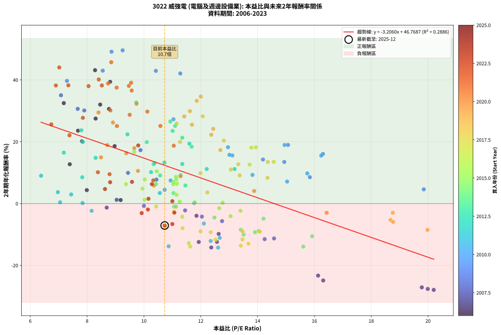
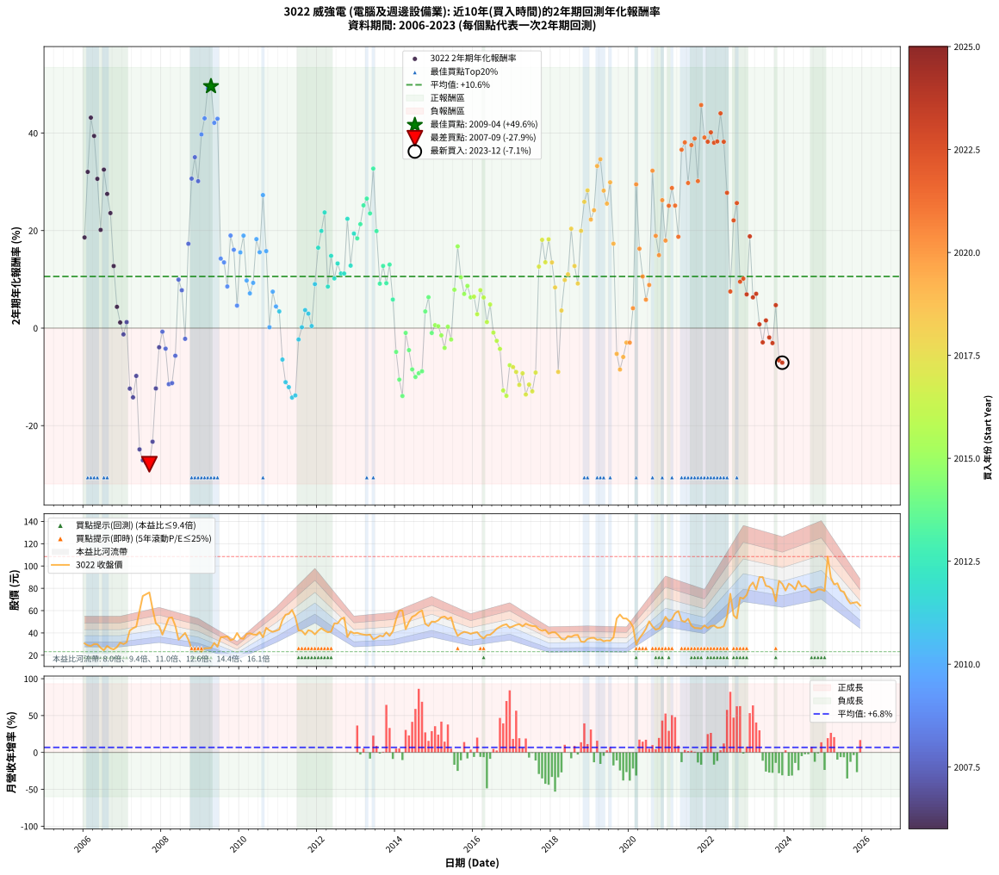

# 3022 威強電 - 本益比與未來報酬率分析

!!! info "報告資訊"
    - **股票代號**: 3022
    - **公司名稱**: 威強電
    - **產業別**: 電腦及週邊設備業
    - **分析期間**: 2006-2023 (216 個數據點)
    - **資料來源**: Type 12 (ShowMonthlyK_ChartFlow) 月收盤價與本益比
    - **報酬率口徑**: 含現金股利 (簡化: 年度合計，假設每年7/1入帳)
    - **報告生成時間**: 2026-01-12 21:00:44 CST

## 📈 視覺化圖表

### 圖表1: 本益比 vs 未來報酬率關係

*圖表1：3022 威強電 本益比與2年期未來報酬率關係 (2006-2023)*

### 圖表2: 歷年買入時點的2年期實際報酬率

*圖表2：3022 威強電 歷年買入時點的2年期實際報酬率 (2006-2023)*

## 📍 買點訊號說明

本報告提供兩種買點提示訊號（顯示於圖表2的股價子圖中）：

### ▲ 小綠色三角形（回測驗證）
- **計算方式**: 使用全部歷史資料計算本益比第25百分位數
- **用途**: 事後驗證，顯示歷史上哪些時點確實為低估區
- **限制**: 當下無法判斷，僅供回測參考
- **特性**: 後見之明（Look-Ahead Bias）

### ▲ 小橘色三角形（即時訊號）
- **計算方式**: 使用截至當月的過去5年資料計算本益比第25百分位數
- **用途**: 實際投資決策，當時即可判斷
- **優勢**: 可操作性強，符合實務需求
- **特性**: 無後見之明，滾動窗口計算

!!! tip "如何使用兩種訊號"
    - **綠色▲** 幫助理解歷史估值機會，驗證策略有效性
    - **橘色▲** 可作為實際買進參考，但仍需搭配基本面分析
    - 兩種訊號重疊時，表示即時判斷與事後驗證一致，信心度較高
    - 僅有綠色▲時，表示當時無法判斷（需要未來資料才能確認）
    - 僅有橘色▲時，表示即時判斷為買點，但事後可能不是最佳時機

## 📊 估值分析摘要

| 指標 | 數值 |
|:---:|:---:|
| **目前本益比** (2023-12) | **10.73 倍** |
| **歷史平均本益比** | 11.28 倍 |
| **估值水準** | 🟡 合理範圍 |
| **預期2年年化報酬率** | **+12.37%** |
| **歷史平均報酬率** | +10.60% |
| **相關係數 (R²)** | 0.2886 |
| **趨勢線斜率** | -3.2060 |

!!! abstract "核心洞察"
    目前本益比接近歷史平均，預期報酬率符合長期趨勢

    根據歷史數據回測，3022 威強電 在目前本益比 **10.7倍** 的估值水準下，
    預期未來2年年化報酬率約為 **+12.4%**。

    **重要提醒**: 本分析基於歷史數據統計，實際報酬率會受到公司基本面變化、產業趨勢、
    總體經濟環境等多重因素影響。R² = 0.29 表示本益比可解釋約 28.9% 的報酬率變異。

## 📈 歷史估值統計

### 最佳買點 (最高報酬率)

| 項目 | 數值 |
|:---:|:---:|
| 起始時間 | 2009-04 |
| 當時本益比 | 9.25 倍 |
| 起始價格 | 26.5 元 |
| 2年後價格 | 57.1 元 |
| **2年年化報酬率** | **+49.58%** |

### 最差買點 (最低報酬率)

| 項目 | 數值 |
|:---:|:---:|
| 起始時間 | 2007-09 |
| 當時本益比 | 20.20 倍 |
| 起始價格 | 76.3 元 |
| 2年後價格 | 36.9 元 |
| **2年年化報酬率** | **-27.91%** |

## 🎯 投資啟示

### 本益比與報酬率關係

趨勢線方程式: **y = -3.2060x + 46.7687**

!!! warning "強負相關"
    本益比與未來報酬率呈現強負相關。在高本益比時期買入，未來報酬率顯著較低；
    在低本益比時期買入，未來報酬率顯著較高。**估值紀律至關重要**。

### 估值區間建議

基於歷史數據分析:

- **🟢 低估區** (P/E < 9.0): 預期報酬率較高，可考慮增加持股
- **🟡 合理區** (P/E 9.0-13.5): 預期報酬率符合長期趨勢，正常持有
- **🔴 高估區** (P/E > 13.5): 預期報酬率較低，可考慮減碼或觀望

!!! danger "風險提示"
    - 過去表現不代表未來結果
    - 本分析假設公司基本面無重大結構性變化
    - 產業環境劇變可能使歷史規律失效
    - 應結合公司財報、產業趨勢、總體經濟等多重因素綜合判斷

!!! success "長期投資觀點"
    歷史數據顯示，在合理或低估的估值水準買入並長期持有，
    往往能獲得較佳的投資報酬。**耐心等待好價格**是價值投資的核心原則。

## 📊 數據品質

- **資料來源**: GoodInfo.tw Type 12 (ShowMonthlyK_ChartFlow)
- **資料頻率**: 月度收盤價與本益比
- **回測期間**: 2006-2023
- **數據點數量**: 216 個 (每個點代表一次2年期回測)

### 計算方法說明

1. **2年期年化報酬率**:
   - 對每個歷史時點，計算其後2年的實際投資報酬率
   - 期末價值(不含股利): 期末價格
   - 期末價值(含現金股利): 期末價格 + 持有期間內的現金股利合計 (簡化: 年度合計，假設每年7/1入帳)
   - 公式: 年化報酬率 = [(期末價值/期初價格)^(1/年數) - 1] × 100%

2. **本益比 (P/E Ratio)**:
   - 使用當時的月收盤價與EPS計算
   - 資料來源: Type 12 月度河流圖本益比數據

3. **趨勢線 (Linear Regression)**:
   - 使用最小平方法擬合線性趨勢線
   - R²值衡量本益比對報酬率的解釋能力

---

*本報告由 Stock Analysis System v1.9.0 自動生成*
*數據更新時間: 2026-01-12 21:00:44 CST*

## 📋 月度回測明細表

（每一列對應時間線圖中的一個買入點；可用來對照 SVG 圖上的每個點。）

| 買入月份 | 賣出月份 | 回測期限_年 | 實際持有年數 | 買入本益比_倍 | 買入收盤價_元 | 賣出收盤價_元 | 現金股利合計_元 | 總報酬率_pct | 年化報酬率_pct |
| --- | --- | --- | --- | --- | --- | --- | --- | --- | --- |
| 2006-01 | 2008-01 | 2 | 1.999 | 8.97 | 30.60 | 38.50 | 4.53 | +40.60 | +18.59 |
| 2006-02 | 2008-02 | 2 | 1.999 | 8.46 | 28.85 | 45.75 | 4.53 | +74.26 | +32.03 |
| 2006-03 | 2008-03 | 2 | 2.001 | 8.28 | 28.25 | 53.40 | 4.53 | +105.04 | +43.16 |
| 2006-04 | 2008-04 | 2 | 2.001 | 8.81 | 30.05 | 53.90 | 4.53 | +94.43 | +39.41 |
| 2006-05 | 2008-05 | 2 | 2.001 | 8.77 | 29.90 | 46.50 | 4.53 | +70.65 | +30.61 |
| 2006-06 | 2008-06 | 2 | 2.001 | 7.82 | 26.65 | 33.95 | 4.53 | +44.37 | +20.14 |
| 2006-07 | 2008-07 | 2 | 2.001 | 7.18 | 24.50 | 37.00 | 6.03 | +75.62 | +32.50 |
| 2006-08 | 2008-08 | 2 | 2.001 | 8.30 | 28.30 | 40.00 | 6.03 | +62.64 | +27.51 |
| 2006-09 | 2008-09 | 2 | 2.001 | 7.68 | 26.20 | 34.00 | 6.03 | +52.78 | +23.59 |
| 2006-10 | 2008-10 | 2 | 2.001 | 7.39 | 25.20 | 26.00 | 6.03 | +27.10 | +12.73 |
| 2006-11 | 2008-11 | 2 | 2.001 | 7.99 | 27.25 | 23.65 | 6.03 | +8.91 | +4.36 |
| 2006-12 | 2008-12 | 2 | 2.001 | 9.18 | 31.30 | 26.00 | 6.03 | +2.33 | +1.16 |
| 2007-01 | 2009-01 | 2 | 2.001 | 8.69 | 30.00 | 23.20 | 6.03 | -2.57 | -1.29 |
| 2007-02 | 2009-02 | 2 | 2.001 | 9.04 | 31.55 | 26.30 | 6.03 | +2.47 | +1.22 |
| 2007-03 | 2009-03 | 2 | 2.001 | 11.93 | 42.15 | 26.30 | 6.03 | -23.30 | -12.41 |
| 2007-04 | 2009-04 | 2 | 2.001 | 12.37 | 44.20 | 26.50 | 6.03 | -26.41 | -14.20 |
| 2007-05 | 2009-05 | 2 | 2.001 | 12.63 | 45.65 | 31.10 | 6.03 | -18.67 | -9.81 |
| 2007-06 | 2009-06 | 2 | 2.001 | 16.31 | 59.60 | 27.60 | 6.03 | -43.58 | -24.87 |
| 2007-07 | 2009-07 | 2 | 2.001 | 19.78 | 73.10 | 36.10 | 2.73 | -46.88 | -27.10 |
| 2007-08 | 2009-08 | 2 | 2.001 | 19.99 | 74.70 | 36.40 | 2.73 | -47.62 | -27.61 |
| 2007-09 | 2009-09 | 2 | 2.001 | 20.20 | 76.30 | 36.90 | 2.73 | -48.06 | -27.91 |
| 2007-10 | 2009-10 | 2 | 2.001 | 16.13 | 61.60 | 33.50 | 2.73 | -41.19 | -23.30 |
| 2007-11 | 2009-11 | 2 | 2.001 | 12.57 | 48.50 | 34.50 | 2.73 | -23.24 | -12.38 |
| 2007-12 | 2009-12 | 2 | 2.001 | 11.85 | 46.20 | 39.90 | 2.73 | -7.73 | -3.94 |
| 2008-01 | 2010-01 | 2 | 2.001 | 10.00 | 38.50 | 35.20 | 2.73 | -1.48 | -0.74 |
| 2008-02 | 2010-03 | 2 | 2.081 | 12.04 | 45.75 | 39.10 | 2.73 | -8.57 | -4.21 |
| 2008-03 | 2010-03 | 2 | 1.999 | 14.25 | 53.40 | 39.10 | 2.73 | -21.67 | -11.50 |
| 2008-04 | 2010-04 | 2 | 1.999 | 14.58 | 53.90 | 39.70 | 2.73 | -21.28 | -11.28 |
| 2008-05 | 2010-05 | 2 | 1.999 | 12.75 | 46.50 | 38.65 | 2.73 | -11.01 | -5.67 |
| 2008-06 | 2010-06 | 2 | 1.999 | 9.44 | 33.95 | 38.30 | 2.73 | +20.85 | +9.94 |
| 2008-07 | 2010-07 | 2 | 1.999 | 10.44 | 37.00 | 40.80 | 2.16 | +16.11 | +7.76 |
| 2008-08 | 2010-08 | 2 | 1.999 | 11.45 | 40.00 | 36.10 | 2.16 | -4.34 | -2.20 |
| 2008-09 | 2010-09 | 2 | 1.999 | 9.88 | 34.00 | 44.60 | 2.16 | +37.54 | +17.29 |
| 2008-10 | 2010-10 | 2 | 1.999 | 7.67 | 26.00 | 42.20 | 2.16 | +70.62 | +30.65 |
| 2008-11 | 2010-11 | 2 | 1.999 | 7.08 | 23.65 | 40.95 | 2.16 | +82.29 | +35.04 |
| 2008-12 | 2010-12 | 2 | 1.999 | 7.90 | 26.00 | 41.85 | 2.16 | +69.28 | +30.13 |
| 2009-01 | 2011-01 | 2 | 1.999 | 7.29 | 23.20 | 43.10 | 2.16 | +95.09 | +39.71 |
| 2009-02 | 2011-02 | 2 | 1.999 | 8.55 | 26.30 | 51.60 | 2.16 | +104.42 | +43.01 |
| 2009-03 | 2011-03 | 2 | 1.999 | 8.86 | 26.30 | 56.30 | 2.16 | +122.29 | +49.13 |
| 2009-04 | 2011-04 | 2 | 1.999 | 9.25 | 26.50 | 57.10 | 2.16 | +123.63 | +49.58 |
| 2009-05 | 2011-05 | 2 | 1.999 | 11.28 | 31.10 | 60.60 | 2.16 | +101.81 | +42.09 |
| 2009-06 | 2011-06 | 2 | 1.999 | 10.42 | 27.60 | 54.20 | 2.16 | +104.21 | +42.94 |
| 2009-07 | 2011-07 | 2 | 1.999 | 14.19 | 36.10 | 42.15 | 4.96 | +30.50 | +14.25 |
| 2009-08 | 2011-08 | 2 | 1.999 | 14.94 | 36.40 | 41.90 | 4.96 | +28.74 | +13.47 |
| 2009-09 | 2011-09 | 2 | 1.999 | 15.84 | 36.90 | 38.50 | 4.96 | +17.78 | +8.53 |
| 2009-10 | 2011-10 | 2 | 1.999 | 15.07 | 33.50 | 42.45 | 4.96 | +41.53 | +18.98 |
| 2009-11 | 2011-11 | 2 | 1.999 | 16.30 | 34.50 | 41.50 | 4.96 | +34.67 | +16.06 |
| 2009-12 | 2011-12 | 2 | 1.999 | 19.85 | 39.90 | 38.70 | 4.96 | +9.43 | +4.61 |
| 2010-01 | 2012-01 | 2 | 1.999 | 16.24 | 35.20 | 42.00 | 4.96 | +33.41 | +15.52 |
| 2010-02 | 2012-02 | 2 | 1.999 | 14.95 | 34.75 | 44.20 | 4.96 | +41.47 | +18.96 |
| 2010-03 | 2012-03 | 2 | 2.001 | 15.75 | 39.10 | 42.15 | 4.96 | +20.49 | +9.76 |
| 2010-04 | 2012-04 | 2 | 2.001 | 15.04 | 39.70 | 40.60 | 4.96 | +14.77 | +7.12 |
| 2010-05 | 2012-05 | 2 | 2.001 | 13.82 | 38.65 | 41.20 | 4.96 | +19.44 | +9.28 |
| 2010-06 | 2012-06 | 2 | 2.001 | 12.96 | 38.30 | 48.60 | 4.96 | +39.85 | +18.24 |
| 2010-07 | 2012-07 | 2 | 2.001 | 13.11 | 40.80 | 48.50 | 6.00 | +33.58 | +15.57 |
| 2010-08 | 2012-08 | 2 | 2.001 | 11.04 | 36.10 | 52.50 | 6.00 | +62.06 | +27.28 |
| 2010-09 | 2012-09 | 2 | 2.001 | 13.01 | 44.60 | 53.80 | 6.00 | +34.09 | +15.78 |
| 2010-10 | 2012-10 | 2 | 2.001 | 11.77 | 42.20 | 36.35 | 6.00 | +0.36 | +0.18 |
| 2010-11 | 2012-11 | 2 | 2.001 | 10.94 | 40.95 | 41.30 | 6.00 | +15.51 | +7.47 |
| 2010-12 | 2012-12 | 2 | 2.001 | 10.73 | 41.85 | 39.65 | 6.00 | +9.08 | +4.44 |
| 2011-01 | 2013-01 | 2 | 2.001 | 10.56 | 43.10 | 40.10 | 6.00 | +6.97 | +3.42 |
| 2011-02 | 2013-02 | 2 | 2.001 | 12.11 | 51.60 | 39.15 | 6.00 | -12.50 | -6.45 |
| 2011-03 | 2013-03 | 2 | 2.001 | 12.67 | 56.30 | 38.50 | 6.00 | -20.96 | -11.09 |
| 2011-04 | 2013-04 | 2 | 2.001 | 12.35 | 57.10 | 38.10 | 6.00 | -22.76 | -12.11 |
| 2011-05 | 2013-05 | 2 | 2.001 | 12.61 | 60.60 | 38.55 | 6.00 | -26.48 | -14.25 |
| 2011-06 | 2013-06 | 2 | 2.001 | 10.87 | 54.20 | 34.25 | 6.00 | -25.73 | -13.81 |
| 2011-07 | 2013-07 | 2 | 2.001 | 8.16 | 42.15 | 35.70 | 4.50 | -4.63 | -2.34 |
| 2011-08 | 2013-08 | 2 | 2.001 | 7.84 | 41.90 | 37.55 | 4.50 | +0.36 | +0.18 |
| 2011-09 | 2013-09 | 2 | 2.001 | 6.97 | 38.50 | 36.90 | 4.50 | +7.53 | +3.70 |
| 2011-10 | 2013-10 | 2 | 2.001 | 7.44 | 42.45 | 40.50 | 4.50 | +6.01 | +2.96 |
| 2011-11 | 2013-11 | 2 | 2.001 | 7.05 | 41.50 | 37.35 | 4.50 | +0.84 | +0.42 |
| 2011-12 | 2013-12 | 2 | 2.001 | 6.38 | 38.70 | 41.50 | 4.50 | +18.86 | +9.02 |
| 2012-01 | 2014-01 | 2 | 2.001 | 7.18 | 42.00 | 52.50 | 4.50 | +35.71 | +16.48 |
| 2012-02 | 2014-03 | 2 | 2.081 | 7.85 | 44.20 | 60.00 | 4.50 | +45.93 | +19.92 |
| 2012-03 | 2014-03 | 2 | 1.999 | 7.80 | 42.15 | 60.00 | 4.50 | +53.02 | +23.72 |
| 2012-04 | 2014-04 | 2 | 1.999 | 7.83 | 40.60 | 43.30 | 4.50 | +17.73 | +8.51 |
| 2012-05 | 2014-05 | 2 | 1.999 | 8.30 | 41.20 | 49.80 | 4.50 | +31.80 | +14.81 |
| 2012-06 | 2014-06 | 2 | 1.999 | 10.25 | 48.60 | 54.50 | 4.50 | +21.40 | +10.19 |
| 2012-07 | 2014-07 | 2 | 1.999 | 10.72 | 48.50 | 55.90 | 6.30 | +28.25 | +13.26 |
| 2012-08 | 2014-08 | 2 | 1.999 | 12.21 | 52.50 | 58.60 | 6.30 | +23.62 | +11.19 |
| 2012-09 | 2014-09 | 2 | 1.999 | 13.19 | 53.80 | 60.20 | 6.30 | +23.61 | +11.19 |
| 2012-10 | 2014-10 | 2 | 1.999 | 9.42 | 36.35 | 48.15 | 6.30 | +49.79 | +22.41 |
| 2012-11 | 2014-11 | 2 | 1.999 | 11.35 | 41.30 | 46.25 | 6.30 | +27.24 | +12.81 |
| 2012-12 | 2014-12 | 2 | 1.999 | 11.60 | 39.65 | 50.20 | 6.30 | +42.50 | +19.39 |
| 2013-01 | 2015-01 | 2 | 1.999 | 11.68 | 40.10 | 49.90 | 6.30 | +40.15 | +18.40 |
| 2013-02 | 2015-02 | 2 | 1.999 | 11.35 | 39.15 | 51.30 | 6.30 | +47.13 | +21.31 |
| 2013-03 | 2015-03 | 2 | 1.999 | 11.10 | 38.50 | 54.00 | 6.30 | +56.62 | +25.17 |
| 2013-04 | 2015-04 | 2 | 1.999 | 10.93 | 38.10 | 54.70 | 6.30 | +60.10 | +26.55 |
| 2013-05 | 2015-05 | 2 | 1.999 | 11.01 | 38.55 | 52.50 | 6.30 | +52.53 | +23.52 |
| 2013-06 | 2015-06 | 2 | 1.999 | 9.73 | 34.25 | 54.00 | 6.30 | +76.06 | +32.71 |
| 2013-07 | 2015-07 | 2 | 1.999 | 10.10 | 35.70 | 44.00 | 7.30 | +43.70 | +19.89 |
| 2013-08 | 2015-08 | 2 | 1.999 | 10.57 | 37.55 | 37.40 | 7.30 | +19.04 | +9.11 |
| 2013-09 | 2015-09 | 2 | 1.999 | 10.34 | 36.90 | 39.60 | 7.30 | +27.10 | +12.75 |
| 2013-10 | 2015-10 | 2 | 1.999 | 11.29 | 40.50 | 41.00 | 7.30 | +19.26 | +9.21 |
| 2013-11 | 2015-11 | 2 | 1.999 | 10.37 | 37.35 | 40.40 | 7.30 | +27.71 | +13.02 |
| 2013-12 | 2015-12 | 2 | 1.999 | 11.46 | 41.50 | 39.20 | 7.30 | +12.05 | +5.86 |
| 2014-01 | 2016-01 | 2 | 1.999 | 14.21 | 52.50 | 40.20 | 7.30 | -9.52 | -4.88 |
| 2014-02 | 2016-02 | 2 | 1.999 | 15.92 | 60.00 | 40.70 | 7.30 | -20.00 | -10.56 |
| 2014-03 | 2016-03 | 2 | 2.001 | 15.61 | 60.00 | 37.15 | 7.30 | -25.92 | -13.92 |
| 2014-04 | 2016-04 | 2 | 2.001 | 11.06 | 43.30 | 35.15 | 7.30 | -1.96 | -0.99 |
| 2014-05 | 2016-05 | 2 | 2.001 | 12.48 | 49.80 | 38.10 | 7.30 | -8.84 | -4.52 |
| 2014-06 | 2016-06 | 2 | 2.001 | 13.41 | 54.50 | 38.35 | 7.30 | -16.24 | -8.47 |
| 2014-07 | 2016-07 | 2 | 2.001 | 13.51 | 55.90 | 40.75 | 4.50 | -19.05 | -10.02 |
| 2014-08 | 2016-08 | 2 | 2.001 | 13.91 | 58.60 | 43.75 | 4.50 | -17.66 | -9.25 |
| 2014-09 | 2016-09 | 2 | 2.001 | 14.04 | 60.20 | 45.50 | 4.50 | -16.94 | -8.86 |
| 2014-10 | 2016-10 | 2 | 2.001 | 11.04 | 48.15 | 47.00 | 4.50 | +6.96 | +3.42 |
| 2014-11 | 2016-11 | 2 | 2.001 | 10.43 | 46.25 | 47.80 | 4.50 | +13.08 | +6.34 |
| 2014-12 | 2016-12 | 2 | 2.001 | 11.13 | 50.20 | 44.70 | 4.50 | -1.99 | -1.00 |
| 2015-01 | 2017-01 | 2 | 2.001 | 11.26 | 49.90 | 46.00 | 4.50 | +1.20 | +0.60 |
| 2015-02 | 2017-02 | 2 | 2.001 | 11.79 | 51.30 | 47.20 | 4.50 | +0.78 | +0.39 |
| 2015-03 | 2017-03 | 2 | 2.001 | 12.65 | 54.00 | 47.90 | 4.50 | -2.96 | -1.49 |
| 2015-04 | 2017-04 | 2 | 2.001 | 13.05 | 54.70 | 45.85 | 4.50 | -7.95 | -4.06 |
| 2015-05 | 2017-05 | 2 | 2.001 | 12.77 | 52.50 | 48.30 | 4.50 | +0.57 | +0.29 |
| 2015-06 | 2017-06 | 2 | 2.001 | 13.40 | 54.00 | 47.00 | 4.50 | -4.63 | -2.34 |
| 2015-07 | 2017-07 | 2 | 2.001 | 11.14 | 44.00 | 46.20 | 5.00 | +16.36 | +7.87 |
| 2015-08 | 2017-08 | 2 | 2.001 | 9.66 | 37.40 | 46.00 | 5.00 | +36.36 | +16.76 |
| 2015-09 | 2017-09 | 2 | 2.001 | 10.45 | 39.60 | 43.30 | 5.00 | +21.97 | +10.43 |
| 2015-10 | 2017-10 | 2 | 2.001 | 11.05 | 41.00 | 41.95 | 5.00 | +14.51 | +7.01 |
| 2015-11 | 2017-11 | 2 | 2.001 | 11.13 | 40.40 | 42.70 | 5.00 | +18.07 | +8.65 |
| 2015-12 | 2017-12 | 2 | 2.001 | 11.04 | 39.20 | 39.30 | 5.00 | +13.01 | +6.30 |
| 2016-01 | 2018-01 | 2 | 2.001 | 11.16 | 40.20 | 40.55 | 5.00 | +13.31 | +6.44 |
| 2016-02 | 2018-03 | 2 | 2.081 | 11.15 | 40.70 | 38.15 | 5.00 | +6.02 | +2.85 |
| 2016-03 | 2018-03 | 2 | 1.999 | 10.03 | 37.15 | 38.15 | 5.00 | +16.15 | +7.78 |
| 2016-04 | 2018-04 | 2 | 1.999 | 9.37 | 35.15 | 34.70 | 5.00 | +12.94 | +6.28 |
| 2016-05 | 2018-05 | 2 | 1.999 | 10.02 | 38.10 | 34.05 | 5.00 | +2.49 | +1.24 |
| 2016-06 | 2018-06 | 2 | 1.999 | 9.95 | 38.35 | 37.15 | 5.00 | +9.91 | +4.84 |
| 2016-07 | 2018-07 | 2 | 1.999 | 10.43 | 40.75 | 36.50 | 3.50 | -1.84 | -0.93 |
| 2016-08 | 2018-08 | 2 | 1.999 | 11.06 | 43.75 | 38.00 | 3.50 | -5.14 | -2.61 |
| 2016-09 | 2018-09 | 2 | 1.999 | 11.35 | 45.50 | 38.20 | 3.50 | -8.35 | -4.27 |
| 2016-10 | 2018-10 | 2 | 1.999 | 11.58 | 47.00 | 32.25 | 3.50 | -23.94 | -12.79 |
| 2016-11 | 2018-11 | 2 | 1.999 | 11.63 | 47.80 | 31.95 | 3.50 | -25.84 | -13.89 |
| 2016-12 | 2018-12 | 2 | 1.999 | 10.75 | 44.70 | 34.65 | 3.50 | -14.65 | -7.62 |
| 2017-01 | 2019-01 | 2 | 1.999 | 11.36 | 46.00 | 35.45 | 3.50 | -15.33 | -7.99 |
| 2017-02 | 2019-02 | 2 | 1.999 | 11.99 | 47.20 | 35.60 | 3.50 | -17.16 | -8.99 |
| 2017-03 | 2019-03 | 2 | 1.999 | 12.52 | 47.90 | 33.90 | 3.50 | -21.92 | -11.64 |
| 2017-04 | 2019-04 | 2 | 1.999 | 12.35 | 45.85 | 34.25 | 3.50 | -17.67 | -9.27 |
| 2017-05 | 2019-05 | 2 | 1.999 | 13.41 | 48.30 | 32.55 | 3.50 | -25.36 | -13.62 |
| 2017-06 | 2019-06 | 2 | 1.999 | 13.47 | 47.00 | 33.25 | 3.50 | -21.81 | -11.58 |
| 2017-07 | 2019-07 | 2 | 1.999 | 13.68 | 46.20 | 33.00 | 2.00 | -24.24 | -12.97 |
| 2017-08 | 2019-08 | 2 | 1.999 | 14.08 | 46.00 | 36.00 | 2.00 | -17.39 | -9.12 |
| 2017-09 | 2019-09 | 2 | 1.999 | 13.72 | 43.30 | 52.90 | 2.00 | +26.79 | +12.61 |
| 2017-10 | 2019-10 | 2 | 1.999 | 13.78 | 41.95 | 56.50 | 2.00 | +39.45 | +18.10 |
| 2017-11 | 2019-11 | 2 | 1.999 | 14.57 | 42.70 | 53.00 | 2.00 | +28.81 | +13.50 |
| 2017-12 | 2019-12 | 2 | 1.999 | 13.94 | 39.30 | 52.90 | 2.00 | +39.69 | +18.21 |
| 2018-01 | 2020-01 | 2 | 1.999 | 14.36 | 40.55 | 50.20 | 2.00 | +28.73 | +13.47 |
| 2018-02 | 2020-02 | 2 | 1.999 | 14.35 | 40.60 | 45.65 | 2.00 | +17.36 | +8.34 |
| 2018-03 | 2020-03 | 2 | 2.001 | 13.47 | 38.15 | 29.60 | 2.00 | -17.17 | -8.98 |
| 2018-04 | 2020-04 | 2 | 2.001 | 12.23 | 34.70 | 35.25 | 2.00 | +7.35 | +3.61 |
| 2018-05 | 2020-05 | 2 | 2.001 | 11.99 | 34.05 | 39.10 | 2.00 | +20.70 | +9.86 |
| 2018-06 | 2020-06 | 2 | 2.001 | 13.06 | 37.15 | 43.80 | 2.00 | +23.28 | +11.03 |
| 2018-07 | 2020-07 | 2 | 2.001 | 12.81 | 36.50 | 50.40 | 2.50 | +44.94 | +20.38 |
| 2018-08 | 2020-08 | 2 | 2.001 | 13.32 | 38.00 | 45.80 | 2.50 | +27.12 | +12.74 |
| 2018-09 | 2020-09 | 2 | 2.001 | 13.37 | 38.20 | 43.00 | 2.50 | +19.12 | +9.14 |
| 2018-10 | 2020-10 | 2 | 2.001 | 11.27 | 32.25 | 43.90 | 2.50 | +43.89 | +19.94 |
| 2018-11 | 2020-11 | 2 | 2.001 | 11.15 | 31.95 | 48.15 | 2.50 | +58.54 | +25.89 |
| 2018-12 | 2020-12 | 2 | 2.001 | 12.07 | 34.65 | 54.50 | 2.50 | +64.51 | +28.24 |
| 2019-01 | 2021-01 | 2 | 2.001 | 12.37 | 35.45 | 50.50 | 2.50 | +49.52 | +22.26 |
| 2019-02 | 2021-02 | 2 | 2.001 | 12.44 | 35.60 | 52.40 | 2.50 | +54.22 | +24.17 |
| 2019-03 | 2021-03 | 2 | 2.001 | 11.86 | 33.90 | 57.70 | 2.50 | +77.59 | +33.24 |
| 2019-04 | 2021-04 | 2 | 2.001 | 12.00 | 34.25 | 59.60 | 2.50 | +81.33 | +34.63 |
| 2019-05 | 2021-05 | 2 | 2.001 | 11.42 | 32.55 | 51.00 | 2.50 | +64.37 | +28.19 |
| 2019-06 | 2021-06 | 2 | 2.001 | 11.69 | 33.25 | 49.90 | 2.50 | +57.61 | +25.52 |
| 2019-07 | 2021-07 | 2 | 2.001 | 11.62 | 33.00 | 52.70 | 3.00 | +68.80 | +29.90 |
| 2019-08 | 2021-08 | 2 | 2.001 | 12.69 | 36.00 | 46.55 | 3.00 | +37.65 | +17.31 |
| 2019-09 | 2021-09 | 2 | 2.001 | 18.68 | 52.90 | 44.45 | 3.00 | -10.29 | -5.28 |
| 2019-10 | 2021-10 | 2 | 2.001 | 19.98 | 56.50 | 44.30 | 3.00 | -16.28 | -8.49 |
| 2019-11 | 2021-11 | 2 | 2.001 | 18.77 | 53.00 | 43.90 | 3.00 | -11.50 | -5.92 |
| 2019-12 | 2021-12 | 2 | 2.001 | 18.76 | 52.90 | 46.80 | 3.00 | -5.85 | -2.97 |
| 2020-01 | 2022-01 | 2 | 2.001 | 16.43 | 50.20 | 44.25 | 3.00 | -5.87 | -2.98 |
| 2020-02 | 2022-03 | 2 | 2.081 | 13.88 | 45.65 | 46.60 | 3.00 | +8.66 | +4.07 |
| 2020-03 | 2022-03 | 2 | 1.999 | 8.40 | 29.60 | 46.60 | 3.00 | +67.58 | +29.48 |
| 2020-04 | 2022-04 | 2 | 1.999 | 9.38 | 35.25 | 44.65 | 3.00 | +35.19 | +16.28 |
| 2020-05 | 2022-05 | 2 | 1.999 | 9.79 | 39.10 | 44.80 | 3.00 | +22.26 | +10.58 |
| 2020-06 | 2022-06 | 2 | 1.999 | 10.35 | 43.80 | 46.05 | 3.00 | +12.00 | +5.83 |
| 2020-07 | 2022-07 | 2 | 1.999 | 11.29 | 50.40 | 54.70 | 5.00 | +18.45 | +8.84 |
| 2020-08 | 2022-08 | 2 | 1.999 | 9.74 | 45.80 | 75.10 | 5.00 | +74.89 | +32.27 |
| 2020-09 | 2022-09 | 2 | 1.999 | 8.71 | 43.00 | 55.80 | 5.00 | +41.40 | +18.92 |
| 2020-10 | 2022-10 | 2 | 1.999 | 8.49 | 43.90 | 53.00 | 5.00 | +32.12 | +14.95 |
| 2020-11 | 2022-11 | 2 | 1.999 | 8.91 | 48.15 | 71.70 | 5.00 | +59.29 | +26.23 |
| 2020-12 | 2022-12 | 2 | 1.999 | 9.66 | 54.50 | 70.80 | 5.00 | +39.08 | +17.95 |
| 2021-01 | 2023-01 | 2 | 1.999 | 9.05 | 50.50 | 74.00 | 5.00 | +56.44 | +25.09 |
| 2021-02 | 2023-02 | 2 | 1.999 | 9.50 | 52.40 | 81.80 | 5.00 | +65.65 | +28.73 |
| 2021-03 | 2023-03 | 2 | 1.999 | 10.58 | 57.70 | 85.30 | 5.00 | +56.50 | +25.12 |
| 2021-04 | 2023-04 | 2 | 1.999 | 11.05 | 59.60 | 79.00 | 5.00 | +40.94 | +18.73 |
| 2021-05 | 2023-05 | 2 | 1.999 | 9.57 | 51.00 | 90.10 | 5.00 | +86.47 | +36.58 |
| 2021-06 | 2023-06 | 2 | 1.999 | 9.47 | 49.90 | 90.10 | 5.00 | +90.58 | +38.08 |
| 2021-07 | 2023-07 | 2 | 1.999 | 10.12 | 52.70 | 82.20 | 6.50 | +68.31 | +29.76 |
| 2021-08 | 2023-08 | 2 | 1.999 | 9.04 | 46.55 | 81.50 | 6.50 | +89.04 | +37.52 |
| 2021-09 | 2023-09 | 2 | 1.999 | 8.74 | 44.45 | 79.20 | 6.50 | +92.80 | +38.88 |
| 2021-10 | 2023-10 | 2 | 1.999 | 8.82 | 44.30 | 68.50 | 6.50 | +69.30 | +30.14 |
| 2021-11 | 2023-11 | 2 | 1.999 | 8.85 | 43.90 | 86.70 | 6.50 | +112.30 | +45.74 |
| 2021-12 | 2023-12 | 2 | 1.999 | 9.55 | 46.80 | 84.00 | 6.50 | +93.38 | +39.09 |
| 2022-01 | 2024-01 | 2 | 1.999 | 8.52 | 44.25 | 78.00 | 6.50 | +90.96 | +38.22 |
| 2022-02 | 2024-02 | 2 | 1.999 | 8.41 | 46.20 | 84.20 | 6.50 | +96.32 | +40.15 |
| 2022-03 | 2024-03 | 2 | 2.001 | 8.05 | 46.60 | 82.30 | 6.50 | +90.56 | +38.01 |
| 2022-04 | 2024-04 | 2 | 2.001 | 7.34 | 44.65 | 78.90 | 6.50 | +91.27 | +38.27 |
| 2022-05 | 2024-05 | 2 | 2.001 | 7.02 | 44.80 | 86.50 | 6.50 | +107.59 | +44.04 |
| 2022-06 | 2024-06 | 2 | 2.001 | 6.90 | 46.05 | 81.50 | 6.50 | +91.10 | +38.21 |
| 2022-07 | 2024-07 | 2 | 2.001 | 7.85 | 54.70 | 82.30 | 7.00 | +63.25 | +27.75 |
| 2022-08 | 2024-08 | 2 | 2.001 | 10.33 | 75.10 | 79.80 | 7.00 | +15.58 | +7.50 |
| 2022-09 | 2024-09 | 2 | 2.001 | 7.38 | 55.80 | 76.20 | 7.00 | +49.10 | +22.09 |
| 2022-10 | 2024-10 | 2 | 2.001 | 6.74 | 53.00 | 76.70 | 7.00 | +57.92 | +25.65 |
| 2022-11 | 2024-11 | 2 | 2.001 | 8.79 | 71.70 | 79.00 | 7.00 | +19.94 | +9.51 |
| 2022-12 | 2024-12 | 2 | 2.001 | 8.38 | 70.80 | 78.90 | 7.00 | +21.33 | +10.14 |
| 2023-01 | 2025-01 | 2 | 2.001 | 8.81 | 74.00 | 77.60 | 7.00 | +14.32 | +6.92 |
| 2023-02 | 2025-02 | 2 | 2.001 | 9.80 | 81.80 | 108.50 | 7.00 | +41.20 | +18.81 |
| 2023-03 | 2025-03 | 2 | 2.001 | 10.28 | 85.30 | 89.40 | 7.00 | +13.01 | +6.30 |
| 2023-04 | 2025-04 | 2 | 2.001 | 9.58 | 79.00 | 83.50 | 7.00 | +14.56 | +7.03 |
| 2023-05 | 2025-05 | 2 | 2.001 | 11.00 | 90.10 | 84.50 | 7.00 | +1.55 | +0.77 |
| 2023-06 | 2025-06 | 2 | 2.001 | 11.07 | 90.10 | 77.90 | 7.00 | -5.77 | -2.93 |
| 2023-07 | 2025-07 | 2 | 2.001 | 10.16 | 82.20 | 76.80 | 8.00 | +3.16 | +1.57 |
| 2023-08 | 2025-08 | 2 | 2.001 | 10.14 | 81.50 | 70.40 | 8.00 | -3.80 | -1.92 |
| 2023-09 | 2025-09 | 2 | 2.001 | 9.92 | 79.20 | 66.40 | 8.00 | -6.06 | -3.08 |
| 2023-10 | 2025-10 | 2 | 2.001 | 8.63 | 68.50 | 67.10 | 8.00 | +9.64 | +4.70 |
| 2023-11 | 2025-11 | 2 | 2.001 | 11.00 | 86.70 | 67.60 | 8.00 | -12.80 | -6.62 |
| 2023-12 | 2025-12 | 2 | 2.001 | 10.73 | 84.00 | 64.50 | 8.00 | -13.69 | -7.09 |
