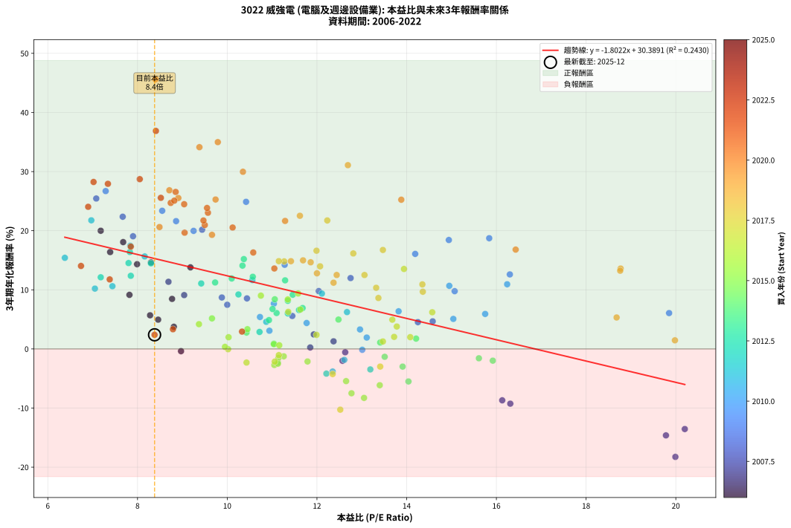
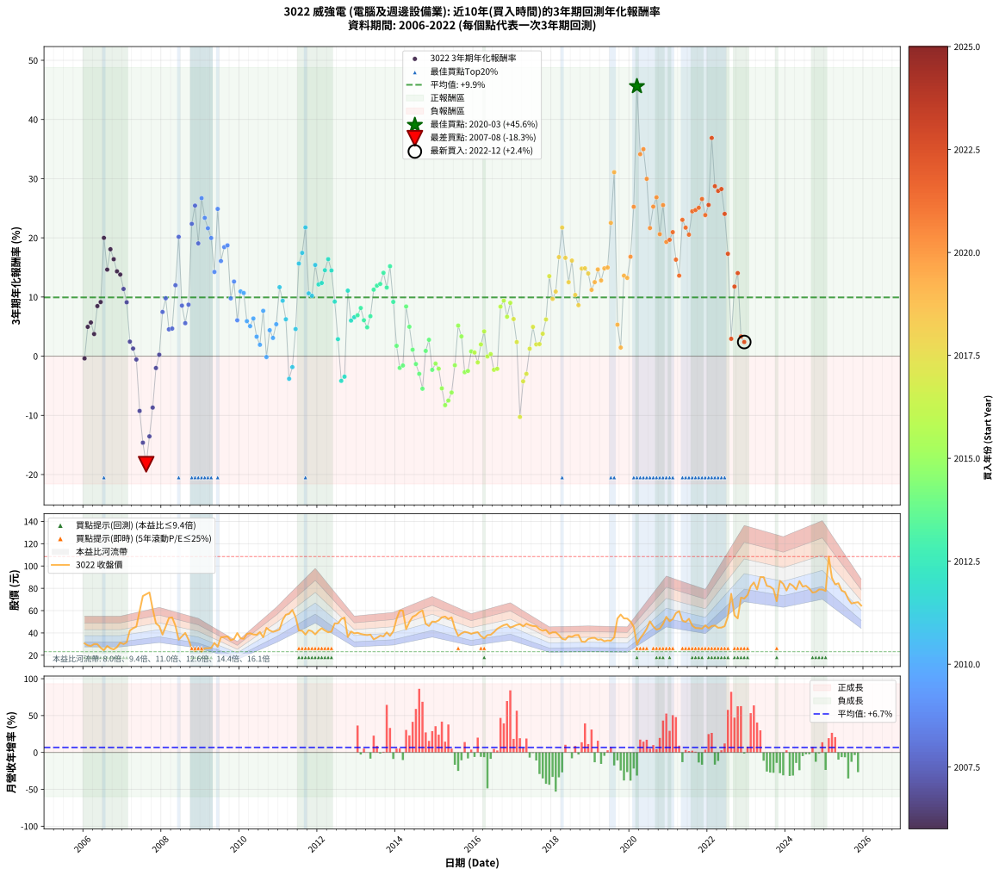

# 3022 威強電 - 本益比與未來報酬率分析

!!! info "報告資訊"
    - **股票代號**: 3022
    - **公司名稱**: 威強電
    - **產業別**: 電腦及週邊設備業
    - **分析期間**: 2006-2022 (204 個數據點)
    - **資料來源**: Type 12 (ShowMonthlyK_ChartFlow) 月收盤價與本益比
    - **報酬率口徑**: 含現金股利 (簡化: 年度合計，假設每年7/1入帳)
    - **報告生成時間**: 2026-01-06 22:49:04 CST

## 📈 視覺化圖表

### 圖表1: 本益比 vs 未來報酬率關係

*圖表1：3022 威強電 本益比與3年期未來報酬率關係 (2006-2022)*

### 圖表2: 歷年買入時點的3年期實際報酬率

*圖表2：3022 威強電 歷年買入時點的3年期實際報酬率 (2006-2022)*

## 📍 買點訊號說明

本報告提供兩種買點提示訊號（顯示於圖表2的股價子圖中）：

### ▲ 小綠色三角形（回測驗證）
- **計算方式**: 使用全部歷史資料計算本益比第25百分位數
- **用途**: 事後驗證，顯示歷史上哪些時點確實為低估區
- **限制**: 當下無法判斷，僅供回測參考
- **特性**: 後見之明（Look-Ahead Bias）

### ▲ 小橘色三角形（即時訊號）
- **計算方式**: 使用截至當月的過去5年資料計算本益比第25百分位數
- **用途**: 實際投資決策，當時即可判斷
- **優勢**: 可操作性強，符合實務需求
- **特性**: 無後見之明，滾動窗口計算

!!! tip "如何使用兩種訊號"
    - **綠色▲** 幫助理解歷史估值機會，驗證策略有效性
    - **橘色▲** 可作為實際買進參考，但仍需搭配基本面分析
    - 兩種訊號重疊時，表示即時判斷與事後驗證一致，信心度較高
    - 僅有綠色▲時，表示當時無法判斷（需要未來資料才能確認）
    - 僅有橘色▲時，表示即時判斷為買點，但事後可能不是最佳時機

## 📊 估值分析摘要

| 指標 | 數值 |
|:---:|:---:|
| **目前本益比** (2022-12) | **8.38 倍** |
| **歷史平均本益比** | 11.35 倍 |
| **估值水準** | 🟢 相對低估 |
| **預期3年年化報酬率** | **+15.29%** |
| **歷史平均報酬率** | +9.93% |
| **相關係數 (R²)** | 0.2430 |
| **趨勢線斜率** | -1.8022 |

!!! abstract "核心洞察"
    目前本益比顯著低於歷史平均，預期未來報酬率可能較高

    根據歷史數據回測，3022 威強電 在目前本益比 **8.4倍** 的估值水準下，
    預期未來3年年化報酬率約為 **+15.3%**。

    **重要提醒**: 本分析基於歷史數據統計，實際報酬率會受到公司基本面變化、產業趨勢、
    總體經濟環境等多重因素影響。R² = 0.24 表示本益比可解釋約 24.3% 的報酬率變異。

## 📈 歷史估值統計

### 最佳買點 (最高報酬率)

| 項目 | 數值 |
|:---:|:---:|
| 起始時間 | 2020-03 |
| 當時本益比 | 8.40 倍 |
| 起始價格 | 29.6 元 |
| 3年後價格 | 85.3 元 |
| **3年年化報酬率** | **+45.61%** |

### 最差買點 (最低報酬率)

| 項目 | 數值 |
|:---:|:---:|
| 起始時間 | 2007-08 |
| 當時本益比 | 19.99 倍 |
| 起始價格 | 74.7 元 |
| 3年後價格 | 36.1 元 |
| **3年年化報酬率** | **-18.26%** |

## 🎯 投資啟示

### 本益比與報酬率關係

趨勢線方程式: **y = -1.8022x + 30.3891**

!!! warning "強負相關"
    本益比與未來報酬率呈現強負相關。在高本益比時期買入，未來報酬率顯著較低；
    在低本益比時期買入，未來報酬率顯著較高。**估值紀律至關重要**。

### 估值區間建議

基於歷史數據分析:

- **🟢 低估區** (P/E < 9.1): 預期報酬率較高，可考慮增加持股
- **🟡 合理區** (P/E 9.1-13.6): 預期報酬率符合長期趨勢，正常持有
- **🔴 高估區** (P/E > 13.6): 預期報酬率較低，可考慮減碼或觀望

!!! danger "風險提示"
    - 過去表現不代表未來結果
    - 本分析假設公司基本面無重大結構性變化
    - 產業環境劇變可能使歷史規律失效
    - 應結合公司財報、產業趨勢、總體經濟等多重因素綜合判斷

!!! success "長期投資觀點"
    歷史數據顯示，在合理或低估的估值水準買入並長期持有，
    往往能獲得較佳的投資報酬。**耐心等待好價格**是價值投資的核心原則。

## 📊 數據品質

- **資料來源**: GoodInfo.tw Type 12 (ShowMonthlyK_ChartFlow)
- **資料頻率**: 月度收盤價與本益比
- **回測期間**: 2006-2022
- **數據點數量**: 204 個 (每個點代表一次3年期回測)

### 計算方法說明

1. **3年期年化報酬率**:
   - 對每個歷史時點，計算其後3年的實際投資報酬率
   - 期末價值(不含股利): 期末價格
   - 期末價值(含現金股利): 期末價格 + 持有期間內的現金股利合計 (簡化: 年度合計，假設每年7/1入帳)
   - 公式: 年化報酬率 = [(期末價值/期初價格)^(1/年數) - 1] × 100%

2. **本益比 (P/E Ratio)**:
   - 使用當時的月收盤價與EPS計算
   - 資料來源: Type 12 月度河流圖本益比數據

3. **趨勢線 (Linear Regression)**:
   - 使用最小平方法擬合線性趨勢線
   - R²值衡量本益比對報酬率的解釋能力

---

*本報告由 Stock Analysis System v1.9.0 自動生成*
*數據更新時間: 2026-01-06 22:49:04 CST*

## 📋 月度回測明細表

（每一列對應時間線圖中的一個買入點；可用來對照 SVG 圖上的每個點。）

| 買入月份 | 賣出月份 | 回測期限_年 | 實際持有年數 | 買入本益比_倍 | 買入收盤價_元 | 賣出收盤價_元 | 現金股利合計_元 | 總報酬率_pct | 年化報酬率_pct |
| --- | --- | --- | --- | --- | --- | --- | --- | --- | --- |
| 2006-01 | 2009-01 | 3 | 3.001 | 8.97 | 30.60 | 23.20 | 7.05 | -1.13 | -0.38 |
| 2006-02 | 2009-02 | 3 | 3.001 | 8.46 | 28.85 | 26.30 | 7.05 | +15.61 | +4.95 |
| 2006-03 | 2009-03 | 3 | 3.001 | 8.28 | 28.25 | 26.30 | 7.05 | +18.06 | +5.69 |
| 2006-04 | 2009-04 | 3 | 3.001 | 8.81 | 30.05 | 26.50 | 7.05 | +11.66 | +3.74 |
| 2006-05 | 2009-05 | 3 | 3.001 | 8.77 | 29.90 | 31.10 | 7.05 | +27.60 | +8.46 |
| 2006-06 | 2009-06 | 3 | 3.001 | 7.82 | 26.65 | 27.60 | 7.05 | +30.03 | +9.15 |
| 2006-07 | 2009-07 | 3 | 3.001 | 7.18 | 24.50 | 36.10 | 6.23 | +72.78 | +19.99 |
| 2006-08 | 2009-08 | 3 | 3.001 | 8.30 | 28.30 | 36.40 | 6.23 | +50.64 | +14.63 |
| 2006-09 | 2009-09 | 3 | 3.001 | 7.68 | 26.20 | 36.90 | 6.23 | +64.62 | +18.07 |
| 2006-10 | 2009-10 | 3 | 3.001 | 7.39 | 25.20 | 33.50 | 6.23 | +57.66 | +16.38 |
| 2006-11 | 2009-11 | 3 | 3.001 | 7.99 | 27.25 | 34.50 | 6.23 | +49.47 | +14.33 |
| 2006-12 | 2009-12 | 3 | 3.001 | 9.18 | 31.30 | 39.90 | 6.23 | +47.38 | +13.80 |
| 2007-01 | 2010-01 | 3 | 3.001 | 8.69 | 30.00 | 35.20 | 6.23 | +38.10 | +11.36 |
| 2007-02 | 2010-02 | 3 | 3.001 | 9.04 | 31.55 | 34.75 | 6.23 | +29.89 | +9.11 |
| 2007-03 | 2010-03 | 3 | 3.001 | 11.93 | 42.15 | 39.10 | 6.23 | +7.54 | +2.45 |
| 2007-04 | 2010-04 | 3 | 3.001 | 12.37 | 44.20 | 39.70 | 6.23 | +3.91 | +1.29 |
| 2007-05 | 2010-05 | 3 | 3.001 | 12.63 | 45.65 | 38.65 | 6.23 | -1.69 | -0.57 |
| 2007-06 | 2010-06 | 3 | 3.001 | 16.31 | 59.60 | 38.30 | 6.23 | -25.29 | -9.26 |
| 2007-07 | 2010-07 | 3 | 3.001 | 19.78 | 73.10 | 40.80 | 4.69 | -37.77 | -14.62 |
| 2007-08 | 2010-08 | 3 | 3.001 | 19.99 | 74.70 | 36.10 | 4.69 | -45.39 | -18.26 |
| 2007-09 | 2010-09 | 3 | 3.001 | 20.20 | 76.30 | 44.60 | 4.69 | -35.40 | -13.55 |
| 2007-10 | 2010-10 | 3 | 3.001 | 16.13 | 61.60 | 42.20 | 4.69 | -23.88 | -8.69 |
| 2007-11 | 2010-11 | 3 | 3.001 | 12.57 | 48.50 | 40.95 | 4.69 | -5.90 | -2.01 |
| 2007-12 | 2010-12 | 3 | 3.001 | 11.85 | 46.20 | 41.85 | 4.69 | +0.74 | +0.24 |
| 2008-01 | 2011-01 | 3 | 3.001 | 10.00 | 38.50 | 43.10 | 4.69 | +24.13 | +7.47 |
| 2008-02 | 2011-03 | 3 | 3.080 | 12.04 | 45.75 | 56.30 | 4.69 | +33.31 | +9.78 |
| 2008-03 | 2011-03 | 3 | 2.998 | 14.25 | 53.40 | 56.30 | 4.69 | +14.21 | +4.53 |
| 2008-04 | 2011-04 | 3 | 2.998 | 14.58 | 53.90 | 57.10 | 4.69 | +14.64 | +4.66 |
| 2008-05 | 2011-05 | 3 | 2.998 | 12.75 | 46.50 | 60.60 | 4.69 | +40.41 | +11.99 |
| 2008-06 | 2011-06 | 3 | 2.998 | 9.44 | 33.95 | 54.20 | 4.69 | +73.46 | +20.17 |
| 2008-07 | 2011-07 | 3 | 2.998 | 10.44 | 37.00 | 42.15 | 5.16 | +27.88 | +8.55 |
| 2008-08 | 2011-08 | 3 | 2.998 | 11.45 | 40.00 | 41.90 | 5.16 | +17.66 | +5.57 |
| 2008-09 | 2011-09 | 3 | 2.998 | 9.88 | 34.00 | 38.50 | 5.16 | +28.42 | +8.70 |
| 2008-10 | 2011-10 | 3 | 2.998 | 7.67 | 26.00 | 42.45 | 5.16 | +83.13 | +22.36 |
| 2008-11 | 2011-11 | 3 | 2.998 | 7.08 | 23.65 | 41.50 | 5.16 | +97.31 | +25.44 |
| 2008-12 | 2011-12 | 3 | 2.998 | 7.90 | 26.00 | 38.70 | 5.16 | +68.71 | +19.06 |
| 2009-01 | 2012-01 | 3 | 2.998 | 7.29 | 23.20 | 42.00 | 5.16 | +103.29 | +26.70 |
| 2009-02 | 2012-02 | 3 | 2.998 | 8.55 | 26.30 | 44.20 | 5.16 | +87.70 | +23.37 |
| 2009-03 | 2012-03 | 3 | 3.001 | 8.86 | 26.30 | 42.15 | 5.16 | +79.90 | +21.62 |
| 2009-04 | 2012-04 | 3 | 3.001 | 9.25 | 26.50 | 40.60 | 5.16 | +72.69 | +19.97 |
| 2009-05 | 2012-05 | 3 | 3.001 | 11.28 | 31.10 | 41.20 | 5.16 | +49.08 | +14.23 |
| 2009-06 | 2012-06 | 3 | 3.001 | 10.42 | 27.60 | 48.60 | 5.16 | +94.80 | +24.88 |
| 2009-07 | 2012-07 | 3 | 3.001 | 14.19 | 36.10 | 48.50 | 7.96 | +56.40 | +16.07 |
| 2009-08 | 2012-08 | 3 | 3.001 | 14.94 | 36.40 | 52.50 | 7.96 | +66.10 | +18.43 |
| 2009-09 | 2012-09 | 3 | 3.001 | 15.84 | 36.90 | 53.80 | 7.96 | +67.38 | +18.73 |
| 2009-10 | 2012-10 | 3 | 3.001 | 15.07 | 33.50 | 36.35 | 7.96 | +32.27 | +9.77 |
| 2009-11 | 2012-11 | 3 | 3.001 | 16.30 | 34.50 | 41.30 | 7.96 | +42.79 | +12.60 |
| 2009-12 | 2012-12 | 3 | 3.001 | 19.85 | 39.90 | 39.65 | 7.96 | +19.33 | +6.07 |
| 2010-01 | 2013-01 | 3 | 3.001 | 16.24 | 35.20 | 40.10 | 7.96 | +36.54 | +10.94 |
| 2010-02 | 2013-02 | 3 | 3.001 | 14.95 | 34.75 | 39.15 | 7.96 | +35.57 | +10.67 |
| 2010-03 | 2013-03 | 3 | 3.001 | 15.75 | 39.10 | 38.50 | 7.96 | +18.83 | +5.92 |
| 2010-04 | 2013-04 | 3 | 3.001 | 15.04 | 39.70 | 38.10 | 7.96 | +16.03 | +5.08 |
| 2010-05 | 2013-05 | 3 | 3.001 | 13.82 | 38.65 | 38.55 | 7.96 | +20.34 | +6.37 |
| 2010-06 | 2013-06 | 3 | 3.001 | 12.96 | 38.30 | 34.25 | 7.96 | +10.21 | +3.29 |
| 2010-07 | 2013-07 | 3 | 3.001 | 13.11 | 40.80 | 35.70 | 7.50 | +5.89 | +1.92 |
| 2010-08 | 2013-08 | 3 | 3.001 | 11.04 | 36.10 | 37.55 | 7.50 | +24.80 | +7.66 |
| 2010-09 | 2013-09 | 3 | 3.001 | 13.01 | 44.60 | 36.90 | 7.50 | -0.44 | -0.15 |
| 2010-10 | 2013-10 | 3 | 3.001 | 11.77 | 42.20 | 40.50 | 7.50 | +13.75 | +4.39 |
| 2010-11 | 2013-11 | 3 | 3.001 | 10.94 | 40.95 | 37.35 | 7.50 | +9.53 | +3.08 |
| 2010-12 | 2013-12 | 3 | 3.001 | 10.73 | 41.85 | 41.50 | 7.50 | +17.09 | +5.40 |
| 2011-01 | 2014-01 | 3 | 3.001 | 10.56 | 43.10 | 52.50 | 7.50 | +39.22 | +11.66 |
| 2011-02 | 2014-02 | 3 | 3.001 | 12.11 | 51.60 | 60.00 | 7.50 | +30.82 | +9.37 |
| 2011-03 | 2014-03 | 3 | 3.001 | 12.67 | 56.30 | 60.00 | 7.50 | +19.90 | +6.23 |
| 2011-04 | 2014-04 | 3 | 3.001 | 12.35 | 57.10 | 43.30 | 7.50 | -11.03 | -3.82 |
| 2011-05 | 2014-05 | 3 | 3.001 | 12.61 | 60.60 | 49.80 | 7.50 | -5.44 | -1.85 |
| 2011-06 | 2014-06 | 3 | 3.001 | 10.87 | 54.20 | 54.50 | 7.50 | +14.39 | +4.58 |
| 2011-07 | 2014-07 | 3 | 3.001 | 8.16 | 42.15 | 55.90 | 9.30 | +54.69 | +15.65 |
| 2011-08 | 2014-08 | 3 | 3.001 | 7.84 | 41.90 | 58.60 | 9.30 | +62.05 | +17.45 |
| 2011-09 | 2014-09 | 3 | 3.001 | 6.97 | 38.50 | 60.20 | 9.30 | +80.52 | +21.76 |
| 2011-10 | 2014-10 | 3 | 3.001 | 7.44 | 42.45 | 48.15 | 9.30 | +35.34 | +10.61 |
| 2011-11 | 2014-11 | 3 | 3.001 | 7.05 | 41.50 | 46.25 | 9.30 | +33.86 | +10.21 |
| 2011-12 | 2014-12 | 3 | 3.001 | 6.38 | 38.70 | 50.20 | 9.30 | +53.75 | +15.41 |
| 2012-01 | 2015-01 | 3 | 3.001 | 7.18 | 42.00 | 49.90 | 9.30 | +40.95 | +12.12 |
| 2012-02 | 2015-03 | 3 | 3.080 | 7.85 | 44.20 | 54.00 | 9.30 | +43.21 | +12.37 |
| 2012-03 | 2015-03 | 3 | 2.998 | 7.80 | 42.15 | 54.00 | 9.30 | +50.18 | +14.53 |
| 2012-04 | 2015-04 | 3 | 2.998 | 7.83 | 40.60 | 54.70 | 9.30 | +57.64 | +16.39 |
| 2012-05 | 2015-05 | 3 | 2.998 | 8.30 | 41.20 | 52.50 | 9.30 | +50.00 | +14.48 |
| 2012-06 | 2015-06 | 3 | 2.998 | 10.25 | 48.60 | 54.00 | 9.30 | +30.25 | +9.21 |
| 2012-07 | 2015-07 | 3 | 2.998 | 10.72 | 48.50 | 44.00 | 8.80 | +8.87 | +2.87 |
| 2012-08 | 2015-08 | 3 | 2.998 | 12.21 | 52.50 | 37.40 | 8.80 | -12.00 | -4.17 |
| 2012-09 | 2015-09 | 3 | 2.998 | 13.19 | 53.80 | 39.60 | 8.80 | -10.04 | -3.47 |
| 2012-10 | 2015-10 | 3 | 2.998 | 9.42 | 36.35 | 41.00 | 8.80 | +37.00 | +11.07 |
| 2012-11 | 2015-11 | 3 | 2.998 | 11.35 | 41.30 | 40.40 | 8.80 | +19.13 | +6.01 |
| 2012-12 | 2015-12 | 3 | 2.998 | 11.60 | 39.65 | 39.20 | 8.80 | +21.06 | +6.58 |
| 2013-01 | 2016-01 | 3 | 2.998 | 11.68 | 40.10 | 40.20 | 8.80 | +22.19 | +6.91 |
| 2013-02 | 2016-02 | 3 | 2.998 | 11.35 | 39.15 | 40.70 | 8.80 | +26.44 | +8.14 |
| 2013-03 | 2016-03 | 3 | 3.001 | 11.10 | 38.50 | 37.15 | 8.80 | +19.35 | +6.07 |
| 2013-04 | 2016-04 | 3 | 3.001 | 10.93 | 38.10 | 35.15 | 8.80 | +15.35 | +4.88 |
| 2013-05 | 2016-05 | 3 | 3.001 | 11.01 | 38.55 | 38.10 | 8.80 | +21.66 | +6.75 |
| 2013-06 | 2016-06 | 3 | 3.001 | 9.73 | 34.25 | 38.35 | 8.80 | +37.66 | +11.24 |
| 2013-07 | 2016-07 | 3 | 3.001 | 10.10 | 35.70 | 40.75 | 9.30 | +40.20 | +11.92 |
| 2013-08 | 2016-08 | 3 | 3.001 | 10.57 | 37.55 | 43.75 | 9.30 | +41.28 | +12.21 |
| 2013-09 | 2016-09 | 3 | 3.001 | 10.34 | 36.90 | 45.50 | 9.30 | +48.51 | +14.09 |
| 2013-10 | 2016-10 | 3 | 3.001 | 11.29 | 40.50 | 47.00 | 9.30 | +39.01 | +11.60 |
| 2013-11 | 2016-11 | 3 | 3.001 | 10.37 | 37.35 | 47.80 | 9.30 | +52.88 | +15.20 |
| 2013-12 | 2016-12 | 3 | 3.001 | 11.46 | 41.50 | 44.70 | 9.30 | +30.12 | +9.17 |
| 2014-01 | 2017-01 | 3 | 3.001 | 14.21 | 52.50 | 46.00 | 9.30 | +5.33 | +1.75 |
| 2014-02 | 2017-02 | 3 | 3.001 | 15.92 | 60.00 | 47.20 | 9.30 | -5.83 | -1.98 |
| 2014-03 | 2017-03 | 3 | 3.001 | 15.61 | 60.00 | 47.90 | 9.30 | -4.67 | -1.58 |
| 2014-04 | 2017-04 | 3 | 3.001 | 11.06 | 43.30 | 45.85 | 9.30 | +27.37 | +8.40 |
| 2014-05 | 2017-05 | 3 | 3.001 | 12.48 | 49.80 | 48.30 | 9.30 | +15.66 | +4.97 |
| 2014-06 | 2017-06 | 3 | 3.001 | 13.41 | 54.50 | 47.00 | 9.30 | +3.30 | +1.09 |
| 2014-07 | 2017-07 | 3 | 3.001 | 13.51 | 55.90 | 46.20 | 7.50 | -3.94 | -1.33 |
| 2014-08 | 2017-08 | 3 | 3.001 | 13.91 | 58.60 | 46.00 | 7.50 | -8.70 | -2.99 |
| 2014-09 | 2017-09 | 3 | 3.001 | 14.04 | 60.20 | 43.30 | 7.50 | -15.61 | -5.50 |
| 2014-10 | 2017-10 | 3 | 3.001 | 11.04 | 48.15 | 41.95 | 7.50 | +2.70 | +0.89 |
| 2014-11 | 2017-11 | 3 | 3.001 | 10.43 | 46.25 | 42.70 | 7.50 | +8.54 | +2.77 |
| 2014-12 | 2017-12 | 3 | 3.001 | 11.13 | 50.20 | 39.30 | 7.50 | -6.77 | -2.31 |
| 2015-01 | 2018-01 | 3 | 3.001 | 11.26 | 49.90 | 40.55 | 7.50 | -3.71 | -1.25 |
| 2015-02 | 2018-02 | 3 | 3.001 | 11.79 | 51.30 | 40.60 | 7.50 | -6.24 | -2.12 |
| 2015-03 | 2018-03 | 3 | 3.001 | 12.65 | 54.00 | 38.15 | 7.50 | -15.46 | -5.44 |
| 2015-04 | 2018-04 | 3 | 3.001 | 13.05 | 54.70 | 34.70 | 7.50 | -22.85 | -8.28 |
| 2015-05 | 2018-05 | 3 | 3.001 | 12.77 | 52.50 | 34.05 | 7.50 | -20.86 | -7.50 |
| 2015-06 | 2018-06 | 3 | 3.001 | 13.40 | 54.00 | 37.15 | 7.50 | -17.31 | -6.14 |
| 2015-07 | 2018-07 | 3 | 3.001 | 11.14 | 44.00 | 36.50 | 5.50 | -4.55 | -1.54 |
| 2015-08 | 2018-08 | 3 | 3.001 | 9.66 | 37.40 | 38.00 | 5.50 | +16.31 | +5.16 |
| 2015-09 | 2018-09 | 3 | 3.001 | 10.45 | 39.60 | 38.20 | 5.50 | +10.35 | +3.34 |
| 2015-10 | 2018-10 | 3 | 3.001 | 11.05 | 41.00 | 32.25 | 5.50 | -7.93 | -2.71 |
| 2015-11 | 2018-11 | 3 | 3.001 | 11.13 | 40.40 | 31.95 | 5.50 | -7.30 | -2.50 |
| 2015-12 | 2018-12 | 3 | 3.001 | 11.04 | 39.20 | 34.65 | 5.50 | +2.42 | +0.80 |
| 2016-01 | 2019-01 | 3 | 3.001 | 11.16 | 40.20 | 35.45 | 5.50 | +1.87 | +0.62 |
| 2016-02 | 2019-03 | 3 | 3.080 | 11.15 | 40.70 | 33.90 | 5.50 | -3.19 | -1.05 |
| 2016-03 | 2019-03 | 3 | 2.998 | 10.03 | 37.15 | 33.90 | 5.50 | +6.06 | +1.98 |
| 2016-04 | 2019-04 | 3 | 2.998 | 9.37 | 35.15 | 34.25 | 5.50 | +13.09 | +4.19 |
| 2016-05 | 2019-05 | 3 | 2.998 | 10.02 | 38.10 | 32.55 | 5.50 | -0.13 | -0.04 |
| 2016-06 | 2019-06 | 3 | 2.998 | 9.95 | 38.35 | 33.25 | 5.50 | +1.04 | +0.35 |
| 2016-07 | 2019-07 | 3 | 2.998 | 10.43 | 40.75 | 33.00 | 5.00 | -6.75 | -2.30 |
| 2016-08 | 2019-08 | 3 | 2.998 | 11.06 | 43.75 | 36.00 | 5.00 | -6.29 | -2.14 |
| 2016-09 | 2019-09 | 3 | 2.998 | 11.35 | 45.50 | 52.90 | 5.00 | +27.25 | +8.37 |
| 2016-10 | 2019-10 | 3 | 2.998 | 11.58 | 47.00 | 56.50 | 5.00 | +30.85 | +9.38 |
| 2016-11 | 2019-11 | 3 | 2.998 | 11.63 | 47.80 | 53.00 | 5.00 | +21.34 | +6.66 |
| 2016-12 | 2019-12 | 3 | 2.998 | 10.75 | 44.70 | 52.90 | 5.00 | +29.53 | +9.01 |
| 2017-01 | 2020-01 | 3 | 2.998 | 11.36 | 46.00 | 50.20 | 5.00 | +20.00 | +6.27 |
| 2017-02 | 2020-02 | 3 | 2.998 | 11.99 | 47.20 | 45.65 | 5.00 | +7.31 | +2.38 |
| 2017-03 | 2020-03 | 3 | 3.001 | 12.52 | 47.90 | 29.60 | 5.00 | -27.77 | -10.27 |
| 2017-04 | 2020-04 | 3 | 3.001 | 12.35 | 45.85 | 35.25 | 5.00 | -12.21 | -4.25 |
| 2017-05 | 2020-05 | 3 | 3.001 | 13.41 | 48.30 | 39.10 | 5.00 | -8.70 | -2.99 |
| 2017-06 | 2020-06 | 3 | 3.001 | 13.47 | 47.00 | 43.80 | 5.00 | +3.83 | +1.26 |
| 2017-07 | 2020-07 | 3 | 3.001 | 13.68 | 46.20 | 50.40 | 3.00 | +15.59 | +4.95 |
| 2017-08 | 2020-08 | 3 | 3.001 | 14.08 | 46.00 | 45.80 | 3.00 | +6.10 | +1.99 |
| 2017-09 | 2020-09 | 3 | 3.001 | 13.72 | 43.30 | 43.00 | 3.00 | +6.24 | +2.04 |
| 2017-10 | 2020-10 | 3 | 3.001 | 13.78 | 41.95 | 43.90 | 3.00 | +11.81 | +3.79 |
| 2017-11 | 2020-11 | 3 | 3.001 | 14.57 | 42.70 | 48.15 | 3.00 | +19.80 | +6.20 |
| 2017-12 | 2020-12 | 3 | 3.001 | 13.94 | 39.30 | 54.50 | 3.00 | +46.32 | +13.52 |
| 2018-01 | 2021-01 | 3 | 3.001 | 14.36 | 40.55 | 50.50 | 3.00 | +31.95 | +9.68 |
| 2018-02 | 2021-02 | 3 | 3.001 | 14.35 | 40.60 | 52.40 | 3.00 | +36.46 | +10.92 |
| 2018-03 | 2021-03 | 3 | 3.001 | 13.47 | 38.15 | 57.70 | 3.00 | +59.12 | +16.74 |
| 2018-04 | 2021-04 | 3 | 3.001 | 12.23 | 34.70 | 59.60 | 3.00 | +80.41 | +21.73 |
| 2018-05 | 2021-05 | 3 | 3.001 | 11.99 | 34.05 | 51.00 | 3.00 | +58.60 | +16.61 |
| 2018-06 | 2021-06 | 3 | 3.001 | 13.06 | 37.15 | 49.90 | 3.00 | +42.41 | +12.50 |
| 2018-07 | 2021-07 | 3 | 3.001 | 12.81 | 36.50 | 52.70 | 4.50 | +56.72 | +16.15 |
| 2018-08 | 2021-08 | 3 | 3.001 | 13.32 | 38.00 | 46.55 | 4.50 | +34.35 | +10.34 |
| 2018-09 | 2021-09 | 3 | 3.001 | 13.37 | 38.20 | 44.45 | 4.50 | +28.15 | +8.62 |
| 2018-10 | 2021-10 | 3 | 3.001 | 11.27 | 32.25 | 44.30 | 4.50 | +51.33 | +14.81 |
| 2018-11 | 2021-11 | 3 | 3.001 | 11.15 | 31.95 | 43.90 | 4.50 | +51.50 | +14.85 |
| 2018-12 | 2021-12 | 3 | 3.001 | 12.07 | 34.65 | 46.80 | 4.50 | +48.06 | +13.97 |
| 2019-01 | 2022-01 | 3 | 3.001 | 12.37 | 35.45 | 44.25 | 4.50 | +37.53 | +11.20 |
| 2019-02 | 2022-02 | 3 | 3.001 | 12.44 | 35.60 | 46.20 | 4.50 | +42.43 | +12.51 |
| 2019-03 | 2022-03 | 3 | 3.001 | 11.86 | 33.90 | 46.60 | 4.50 | +50.75 | +14.66 |
| 2019-04 | 2022-04 | 3 | 3.001 | 12.00 | 34.25 | 44.65 | 4.50 | +43.52 | +12.79 |
| 2019-05 | 2022-05 | 3 | 3.001 | 11.42 | 32.55 | 44.80 | 4.50 | +51.47 | +14.84 |
| 2019-06 | 2022-06 | 3 | 3.001 | 11.69 | 33.25 | 46.05 | 4.50 | +52.04 | +14.98 |
| 2019-07 | 2022-07 | 3 | 3.001 | 11.62 | 33.00 | 54.70 | 6.00 | +83.95 | +22.52 |
| 2019-08 | 2022-08 | 3 | 3.001 | 12.69 | 36.00 | 75.10 | 6.00 | +125.29 | +31.09 |
| 2019-09 | 2022-09 | 3 | 3.001 | 18.68 | 52.90 | 55.80 | 6.00 | +16.83 | +5.32 |
| 2019-10 | 2022-10 | 3 | 3.001 | 19.98 | 56.50 | 53.00 | 6.00 | +4.43 | +1.46 |
| 2019-11 | 2022-11 | 3 | 3.001 | 18.77 | 53.00 | 71.70 | 6.00 | +46.61 | +13.60 |
| 2019-12 | 2022-12 | 3 | 3.001 | 18.76 | 52.90 | 70.80 | 6.00 | +45.19 | +13.23 |
| 2020-01 | 2023-01 | 3 | 3.001 | 16.43 | 50.20 | 74.00 | 6.00 | +59.37 | +16.80 |
| 2020-02 | 2023-03 | 3 | 3.080 | 13.88 | 45.65 | 85.30 | 6.00 | +100.01 | +25.24 |
| 2020-03 | 2023-03 | 3 | 2.998 | 8.40 | 29.60 | 85.30 | 6.00 | +208.46 | +45.61 |
| 2020-04 | 2023-04 | 3 | 2.998 | 9.38 | 35.25 | 79.00 | 6.00 | +141.15 | +34.13 |
| 2020-05 | 2023-05 | 3 | 2.998 | 9.79 | 39.10 | 90.10 | 6.00 | +145.79 | +34.98 |
| 2020-06 | 2023-06 | 3 | 2.998 | 10.35 | 43.80 | 90.10 | 6.00 | +119.42 | +29.97 |
| 2020-07 | 2023-07 | 3 | 2.998 | 11.29 | 50.40 | 82.20 | 8.50 | +79.96 | +21.65 |
| 2020-08 | 2023-08 | 3 | 2.998 | 9.74 | 45.80 | 81.50 | 8.50 | +96.51 | +25.27 |
| 2020-09 | 2023-09 | 3 | 2.998 | 8.71 | 43.00 | 79.20 | 8.50 | +103.95 | +26.84 |
| 2020-10 | 2023-10 | 3 | 2.998 | 8.49 | 43.90 | 68.50 | 8.50 | +75.40 | +20.61 |
| 2020-11 | 2023-11 | 3 | 2.998 | 8.91 | 48.15 | 86.70 | 8.50 | +97.72 | +25.53 |
| 2020-12 | 2023-12 | 3 | 2.998 | 9.66 | 54.50 | 84.00 | 8.50 | +69.72 | +19.30 |
| 2021-01 | 2024-01 | 3 | 2.998 | 9.05 | 50.50 | 78.00 | 8.50 | +71.29 | +19.66 |
| 2021-02 | 2024-02 | 3 | 2.998 | 9.50 | 52.40 | 84.20 | 8.50 | +76.91 | +20.96 |
| 2021-03 | 2024-03 | 3 | 3.001 | 10.58 | 57.70 | 82.30 | 8.50 | +57.37 | +16.31 |
| 2021-04 | 2024-04 | 3 | 3.001 | 11.05 | 59.60 | 78.90 | 8.50 | +46.64 | +13.61 |
| 2021-05 | 2024-05 | 3 | 3.001 | 9.57 | 51.00 | 86.50 | 8.50 | +86.27 | +23.04 |
| 2021-06 | 2024-06 | 3 | 3.001 | 9.47 | 49.90 | 81.50 | 8.50 | +80.36 | +21.72 |
| 2021-07 | 2024-07 | 3 | 3.001 | 10.12 | 52.70 | 82.30 | 10.00 | +75.14 | +20.53 |
| 2021-08 | 2024-08 | 3 | 3.001 | 9.04 | 46.55 | 79.80 | 10.00 | +92.91 | +24.48 |
| 2021-09 | 2024-09 | 3 | 3.001 | 8.74 | 44.45 | 76.20 | 10.00 | +93.93 | +24.70 |
| 2021-10 | 2024-10 | 3 | 3.001 | 8.82 | 44.30 | 76.70 | 10.00 | +95.71 | +25.08 |
| 2021-11 | 2024-11 | 3 | 3.001 | 8.85 | 43.90 | 79.00 | 10.00 | +102.73 | +26.56 |
| 2021-12 | 2024-12 | 3 | 3.001 | 9.55 | 46.80 | 78.90 | 10.00 | +89.96 | +23.84 |
| 2022-01 | 2025-01 | 3 | 3.001 | 8.52 | 44.25 | 77.60 | 10.00 | +97.97 | +25.56 |
| 2022-02 | 2025-02 | 3 | 3.001 | 8.41 | 46.20 | 108.50 | 10.00 | +156.49 | +36.88 |
| 2022-03 | 2025-03 | 3 | 3.001 | 8.05 | 46.60 | 89.40 | 10.00 | +113.30 | +28.72 |
| 2022-04 | 2025-04 | 3 | 3.001 | 7.34 | 44.65 | 83.50 | 10.00 | +109.41 | +27.93 |
| 2022-05 | 2025-05 | 3 | 3.001 | 7.02 | 44.80 | 84.50 | 10.00 | +110.94 | +28.24 |
| 2022-06 | 2025-06 | 3 | 3.001 | 6.90 | 46.05 | 77.90 | 10.00 | +90.88 | +24.04 |
| 2022-07 | 2025-07 | 3 | 3.001 | 7.85 | 54.70 | 76.80 | 11.50 | +61.43 | +17.30 |
| 2022-08 | 2025-08 | 3 | 3.001 | 10.33 | 75.10 | 70.40 | 11.50 | +9.05 | +2.93 |
| 2022-09 | 2025-09 | 3 | 3.001 | 7.38 | 55.80 | 66.40 | 11.50 | +39.61 | +11.76 |
| 2022-10 | 2025-10 | 3 | 3.001 | 6.74 | 53.00 | 67.10 | 11.50 | +48.30 | +14.03 |
| 2022-11 | 2025-11 | 3 | 3.001 | 8.79 | 71.70 | 67.60 | 11.50 | +10.32 | +3.33 |
| 2022-12 | 2025-12 | 3 | 3.001 | 8.38 | 70.80 | 64.50 | 11.50 | +7.34 | +2.39 |
