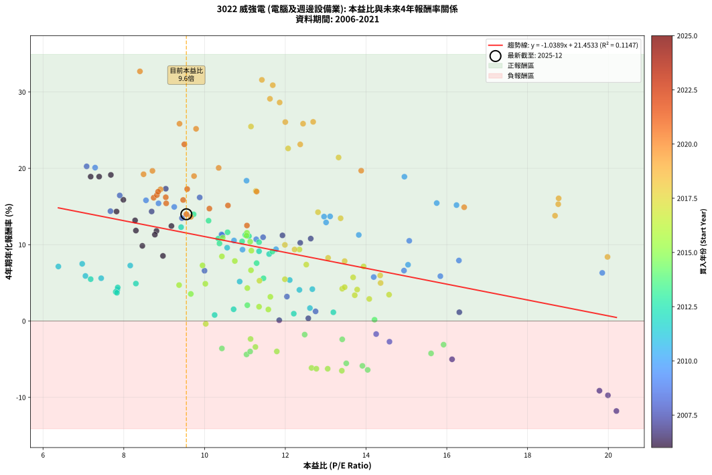
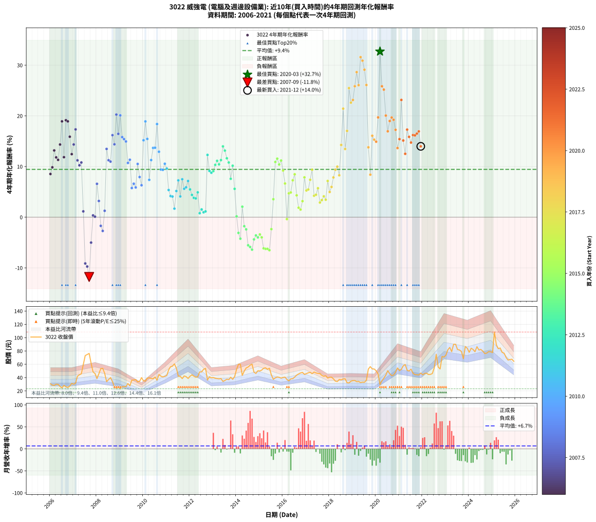

# 3022 威強電 - 本益比與未來報酬率分析

!!! info "報告資訊"
    - **股票代號**: 3022
    - **公司名稱**: 威強電
    - **產業別**: 電腦及週邊設備業
    - **分析期間**: 2006-2021 (192 個數據點)
    - **資料來源**: Type 12 (ShowMonthlyK_ChartFlow) 月收盤價與本益比
    - **報酬率口徑**: 含現金股利 (簡化: 年度合計，假設每年7/1入帳)
    - **報告生成時間**: 2026-01-06 22:49:08 CST

## 📈 視覺化圖表

### 圖表1: 本益比 vs 未來報酬率關係

*圖表1：3022 威強電 本益比與4年期未來報酬率關係 (2006-2021)*

### 圖表2: 歷年買入時點的4年期實際報酬率

*圖表2：3022 威強電 歷年買入時點的4年期實際報酬率 (2006-2021)*

## 📍 買點訊號說明

本報告提供兩種買點提示訊號（顯示於圖表2的股價子圖中）：

### ▲ 小綠色三角形（回測驗證）
- **計算方式**: 使用全部歷史資料計算本益比第25百分位數
- **用途**: 事後驗證，顯示歷史上哪些時點確實為低估區
- **限制**: 當下無法判斷，僅供回測參考
- **特性**: 後見之明（Look-Ahead Bias）

### ▲ 小橘色三角形（即時訊號）
- **計算方式**: 使用截至當月的過去5年資料計算本益比第25百分位數
- **用途**: 實際投資決策，當時即可判斷
- **優勢**: 可操作性強，符合實務需求
- **特性**: 無後見之明，滾動窗口計算

!!! tip "如何使用兩種訊號"
    - **綠色▲** 幫助理解歷史估值機會，驗證策略有效性
    - **橘色▲** 可作為實際買進參考，但仍需搭配基本面分析
    - 兩種訊號重疊時，表示即時判斷與事後驗證一致，信心度較高
    - 僅有綠色▲時，表示當時無法判斷（需要未來資料才能確認）
    - 僅有橘色▲時，表示即時判斷為買點，但事後可能不是最佳時機

## 📊 估值分析摘要

| 指標 | 數值 |
|:---:|:---:|
| **目前本益比** (2021-12) | **9.55 倍** |
| **歷史平均本益比** | 11.56 倍 |
| **估值水準** | 🟡 合理範圍 |
| **預期4年年化報酬率** | **+11.53%** |
| **歷史平均報酬率** | +9.44% |
| **相關係數 (R²)** | 0.1147 |
| **趨勢線斜率** | -1.0389 |

!!! abstract "核心洞察"
    目前本益比接近歷史平均，預期報酬率符合長期趨勢

    根據歷史數據回測，3022 威強電 在目前本益比 **9.6倍** 的估值水準下，
    預期未來4年年化報酬率約為 **+11.5%**。

    **重要提醒**: 本分析基於歷史數據統計，實際報酬率會受到公司基本面變化、產業趨勢、
    總體經濟環境等多重因素影響。R² = 0.11 表示本益比可解釋約 11.5% 的報酬率變異。

## 📈 歷史估值統計

### 最佳買點 (最高報酬率)

| 項目 | 數值 |
|:---:|:---:|
| 起始時間 | 2020-03 |
| 當時本益比 | 8.40 倍 |
| 起始價格 | 29.6 元 |
| 4年後價格 | 82.3 元 |
| **4年年化報酬率** | **+32.71%** |

### 最差買點 (最低報酬率)

| 項目 | 數值 |
|:---:|:---:|
| 起始時間 | 2007-09 |
| 當時本益比 | 20.20 倍 |
| 起始價格 | 76.3 元 |
| 4年後價格 | 38.5 元 |
| **4年年化報酬率** | **-11.79%** |

## 🎯 投資啟示

### 本益比與報酬率關係

趨勢線方程式: **y = -1.0389x + 21.4533**

!!! warning "強負相關"
    本益比與未來報酬率呈現強負相關。在高本益比時期買入，未來報酬率顯著較低；
    在低本益比時期買入，未來報酬率顯著較高。**估值紀律至關重要**。

### 估值區間建議

基於歷史數據分析:

- **🟢 低估區** (P/E < 9.3): 預期報酬率較高，可考慮增加持股
- **🟡 合理區** (P/E 9.3-13.9): 預期報酬率符合長期趨勢，正常持有
- **🔴 高估區** (P/E > 13.9): 預期報酬率較低，可考慮減碼或觀望

!!! danger "風險提示"
    - 過去表現不代表未來結果
    - 本分析假設公司基本面無重大結構性變化
    - 產業環境劇變可能使歷史規律失效
    - 應結合公司財報、產業趨勢、總體經濟等多重因素綜合判斷

!!! success "長期投資觀點"
    歷史數據顯示，在合理或低估的估值水準買入並長期持有，
    往往能獲得較佳的投資報酬。**耐心等待好價格**是價值投資的核心原則。

## 📊 數據品質

- **資料來源**: GoodInfo.tw Type 12 (ShowMonthlyK_ChartFlow)
- **資料頻率**: 月度收盤價與本益比
- **回測期間**: 2006-2021
- **數據點數量**: 192 個 (每個點代表一次4年期回測)

### 計算方法說明

1. **4年期年化報酬率**:
   - 對每個歷史時點，計算其後4年的實際投資報酬率
   - 期末價值(不含股利): 期末價格
   - 期末價值(含現金股利): 期末價格 + 持有期間內的現金股利合計 (簡化: 年度合計，假設每年7/1入帳)
   - 公式: 年化報酬率 = [(期末價值/期初價格)^(1/年數) - 1] × 100%

2. **本益比 (P/E Ratio)**:
   - 使用當時的月收盤價與EPS計算
   - 資料來源: Type 12 月度河流圖本益比數據

3. **趨勢線 (Linear Regression)**:
   - 使用最小平方法擬合線性趨勢線
   - R²值衡量本益比對報酬率的解釋能力

---

*本報告由 Stock Analysis System v1.9.0 自動生成*
*數據更新時間: 2026-01-06 22:49:08 CST*

## 📋 月度回測明細表

（每一列對應時間線圖中的一個買入點；可用來對照 SVG 圖上的每個點。）

| 買入月份 | 賣出月份 | 回測期限_年 | 實際持有年數 | 買入本益比_倍 | 買入收盤價_元 | 賣出收盤價_元 | 現金股利合計_元 | 總報酬率_pct | 年化報酬率_pct |
| --- | --- | --- | --- | --- | --- | --- | --- | --- | --- |
| 2006-01 | 2010-01 | 4 | 4.000 | 8.97 | 30.60 | 35.20 | 7.26 | +38.74 | +8.53 |
| 2006-02 | 2010-02 | 4 | 4.000 | 8.46 | 28.85 | 34.75 | 7.26 | +45.60 | +9.85 |
| 2006-03 | 2010-03 | 4 | 4.000 | 8.28 | 28.25 | 39.10 | 7.26 | +64.09 | +13.18 |
| 2006-04 | 2010-04 | 4 | 4.000 | 8.81 | 30.05 | 39.70 | 7.26 | +56.26 | +11.80 |
| 2006-05 | 2010-05 | 4 | 4.000 | 8.77 | 29.90 | 38.65 | 7.26 | +53.53 | +11.31 |
| 2006-06 | 2010-06 | 4 | 4.000 | 7.82 | 26.65 | 38.30 | 7.26 | +70.94 | +14.34 |
| 2006-07 | 2010-07 | 4 | 4.000 | 7.18 | 24.50 | 40.80 | 8.19 | +99.96 | +18.91 |
| 2006-08 | 2010-08 | 4 | 4.000 | 8.30 | 28.30 | 36.10 | 8.19 | +56.50 | +11.85 |
| 2006-09 | 2010-09 | 4 | 4.000 | 7.68 | 26.20 | 44.60 | 8.19 | +101.49 | +19.14 |
| 2006-10 | 2010-10 | 4 | 4.000 | 7.39 | 25.20 | 42.20 | 8.19 | +99.96 | +18.91 |
| 2006-11 | 2010-11 | 4 | 4.000 | 7.99 | 27.25 | 40.95 | 8.19 | +80.33 | +15.88 |
| 2006-12 | 2010-12 | 4 | 4.000 | 9.18 | 31.30 | 41.85 | 8.19 | +59.87 | +12.45 |
| 2007-01 | 2011-01 | 4 | 4.000 | 8.69 | 30.00 | 43.10 | 8.19 | +70.97 | +14.35 |
| 2007-02 | 2011-02 | 4 | 4.000 | 9.04 | 31.55 | 51.60 | 8.19 | +89.51 | +17.33 |
| 2007-03 | 2011-03 | 4 | 4.000 | 11.93 | 42.15 | 56.30 | 8.19 | +53.00 | +11.22 |
| 2007-04 | 2011-04 | 4 | 4.000 | 12.37 | 44.20 | 57.10 | 8.19 | +47.71 | +10.24 |
| 2007-05 | 2011-05 | 4 | 4.000 | 12.63 | 45.65 | 60.60 | 8.19 | +50.69 | +10.80 |
| 2007-06 | 2011-06 | 4 | 4.000 | 16.31 | 59.60 | 54.20 | 8.19 | +4.68 | +1.15 |
| 2007-07 | 2011-07 | 4 | 4.000 | 19.78 | 73.10 | 42.15 | 7.69 | -31.82 | -9.13 |
| 2007-08 | 2011-08 | 4 | 4.000 | 19.99 | 74.70 | 41.90 | 7.69 | -33.61 | -9.73 |
| 2007-09 | 2011-09 | 4 | 4.000 | 20.20 | 76.30 | 38.50 | 7.69 | -39.46 | -11.79 |
| 2007-10 | 2011-10 | 4 | 4.000 | 16.13 | 61.60 | 42.45 | 7.69 | -18.60 | -5.01 |
| 2007-11 | 2011-11 | 4 | 4.000 | 12.57 | 48.50 | 41.50 | 7.69 | +1.43 | +0.35 |
| 2007-12 | 2011-12 | 4 | 4.000 | 11.85 | 46.20 | 38.70 | 7.69 | +0.42 | +0.10 |
| 2008-01 | 2012-01 | 4 | 4.000 | 10.00 | 38.50 | 42.00 | 7.69 | +29.07 | +6.59 |
| 2008-02 | 2012-02 | 4 | 4.000 | 12.04 | 45.75 | 44.20 | 7.69 | +13.43 | +3.20 |
| 2008-03 | 2012-03 | 4 | 4.000 | 14.25 | 53.40 | 42.15 | 7.69 | -6.66 | -1.71 |
| 2008-04 | 2012-04 | 4 | 4.000 | 14.58 | 53.90 | 40.60 | 7.69 | -10.40 | -2.71 |
| 2008-05 | 2012-05 | 4 | 4.000 | 12.75 | 46.50 | 41.20 | 7.69 | +5.14 | +1.26 |
| 2008-06 | 2012-06 | 4 | 4.000 | 9.44 | 33.95 | 48.60 | 7.69 | +65.81 | +13.48 |
| 2008-07 | 2012-07 | 4 | 4.000 | 10.44 | 37.00 | 48.50 | 8.16 | +53.15 | +11.24 |
| 2008-08 | 2012-08 | 4 | 4.000 | 11.45 | 40.00 | 52.50 | 8.16 | +51.66 | +10.97 |
| 2008-09 | 2012-09 | 4 | 4.000 | 9.88 | 34.00 | 53.80 | 8.16 | +82.25 | +16.19 |
| 2008-10 | 2012-10 | 4 | 4.000 | 7.67 | 26.00 | 36.35 | 8.16 | +71.21 | +14.39 |
| 2008-11 | 2012-11 | 4 | 4.000 | 7.08 | 23.65 | 41.30 | 8.16 | +109.15 | +20.26 |
| 2008-12 | 2012-12 | 4 | 4.000 | 7.90 | 26.00 | 39.65 | 8.16 | +83.90 | +16.45 |
| 2009-01 | 2013-01 | 4 | 4.000 | 7.29 | 23.20 | 40.10 | 8.16 | +108.03 | +20.10 |
| 2009-02 | 2013-02 | 4 | 4.000 | 8.55 | 26.30 | 39.15 | 8.16 | +79.90 | +15.81 |
| 2009-03 | 2013-03 | 4 | 4.000 | 8.86 | 26.30 | 38.50 | 8.16 | +77.43 | +15.41 |
| 2009-04 | 2013-04 | 4 | 4.000 | 9.25 | 26.50 | 38.10 | 8.16 | +74.58 | +14.95 |
| 2009-05 | 2013-05 | 4 | 4.000 | 11.28 | 31.10 | 38.55 | 8.16 | +50.21 | +10.71 |
| 2009-06 | 2013-06 | 4 | 4.000 | 10.42 | 27.60 | 34.25 | 8.16 | +53.67 | +11.34 |
| 2009-07 | 2013-07 | 4 | 4.000 | 14.19 | 36.10 | 35.70 | 9.46 | +25.10 | +5.76 |
| 2009-08 | 2013-08 | 4 | 4.000 | 14.94 | 36.40 | 37.55 | 9.46 | +29.15 | +6.60 |
| 2009-09 | 2013-09 | 4 | 4.000 | 15.84 | 36.90 | 36.90 | 9.46 | +25.64 | +5.87 |
| 2009-10 | 2013-10 | 4 | 4.000 | 15.07 | 33.50 | 40.50 | 9.46 | +49.14 | +10.51 |
| 2009-11 | 2013-11 | 4 | 4.000 | 16.30 | 34.50 | 37.35 | 9.46 | +35.69 | +7.93 |
| 2009-12 | 2013-12 | 4 | 4.000 | 19.85 | 39.90 | 41.50 | 9.46 | +27.72 | +6.31 |
| 2010-01 | 2014-01 | 4 | 4.000 | 16.24 | 35.20 | 52.50 | 9.46 | +76.03 | +15.18 |
| 2010-02 | 2014-02 | 4 | 4.000 | 14.95 | 34.75 | 60.00 | 9.46 | +99.89 | +18.90 |
| 2010-03 | 2014-03 | 4 | 4.000 | 15.75 | 39.10 | 60.00 | 9.46 | +77.65 | +15.45 |
| 2010-04 | 2014-04 | 4 | 4.000 | 15.04 | 39.70 | 43.30 | 9.46 | +32.90 | +7.37 |
| 2010-05 | 2014-05 | 4 | 4.000 | 13.82 | 38.65 | 49.80 | 9.46 | +53.33 | +11.28 |
| 2010-06 | 2014-06 | 4 | 4.000 | 12.96 | 38.30 | 54.50 | 9.46 | +67.00 | +13.68 |
| 2010-07 | 2014-07 | 4 | 4.000 | 13.11 | 40.80 | 55.90 | 12.30 | +67.16 | +13.71 |
| 2010-08 | 2014-08 | 4 | 4.000 | 11.04 | 36.10 | 58.60 | 12.30 | +96.40 | +18.38 |
| 2010-09 | 2014-09 | 4 | 4.000 | 13.01 | 44.60 | 60.20 | 12.30 | +62.56 | +12.92 |
| 2010-10 | 2014-10 | 4 | 4.000 | 11.77 | 42.20 | 48.15 | 12.30 | +43.25 | +9.40 |
| 2010-11 | 2014-11 | 4 | 4.000 | 10.94 | 40.95 | 46.25 | 12.30 | +42.98 | +9.35 |
| 2010-12 | 2014-12 | 4 | 4.000 | 10.73 | 41.85 | 50.20 | 12.30 | +49.35 | +10.55 |
| 2011-01 | 2015-01 | 4 | 4.000 | 10.56 | 43.10 | 49.90 | 12.30 | +44.32 | +9.61 |
| 2011-02 | 2015-02 | 4 | 4.000 | 12.11 | 51.60 | 51.30 | 12.30 | +23.26 | +5.37 |
| 2011-03 | 2015-03 | 4 | 4.000 | 12.67 | 56.30 | 54.00 | 12.30 | +17.77 | +4.17 |
| 2011-04 | 2015-04 | 4 | 4.000 | 12.35 | 57.10 | 54.70 | 12.30 | +17.34 | +4.08 |
| 2011-05 | 2015-05 | 4 | 4.000 | 12.61 | 60.60 | 52.50 | 12.30 | +6.93 | +1.69 |
| 2011-06 | 2015-06 | 4 | 4.000 | 10.87 | 54.20 | 54.00 | 12.30 | +22.33 | +5.17 |
| 2011-07 | 2015-07 | 4 | 4.000 | 8.16 | 42.15 | 44.00 | 11.80 | +32.38 | +7.27 |
| 2011-08 | 2015-08 | 4 | 4.000 | 7.84 | 41.90 | 37.40 | 11.80 | +17.42 | +4.10 |
| 2011-09 | 2015-09 | 4 | 4.000 | 6.97 | 38.50 | 39.60 | 11.80 | +33.51 | +7.49 |
| 2011-10 | 2015-10 | 4 | 4.000 | 7.44 | 42.45 | 41.00 | 11.80 | +24.38 | +5.61 |
| 2011-11 | 2015-11 | 4 | 4.000 | 7.05 | 41.50 | 40.40 | 11.80 | +25.78 | +5.90 |
| 2011-12 | 2015-12 | 4 | 4.000 | 6.38 | 38.70 | 39.20 | 11.80 | +31.78 | +7.14 |
| 2012-01 | 2016-01 | 4 | 4.000 | 7.18 | 42.00 | 40.20 | 11.80 | +23.81 | +5.48 |
| 2012-02 | 2016-02 | 4 | 4.000 | 7.85 | 44.20 | 40.70 | 11.80 | +18.78 | +4.40 |
| 2012-03 | 2016-03 | 4 | 4.000 | 7.80 | 42.15 | 37.15 | 11.80 | +16.13 | +3.81 |
| 2012-04 | 2016-04 | 4 | 4.000 | 7.83 | 40.60 | 35.15 | 11.80 | +15.64 | +3.70 |
| 2012-05 | 2016-05 | 4 | 4.000 | 8.30 | 41.20 | 38.10 | 11.80 | +21.12 | +4.91 |
| 2012-06 | 2016-06 | 4 | 4.000 | 10.25 | 48.60 | 38.35 | 11.80 | +3.19 | +0.79 |
| 2012-07 | 2016-07 | 4 | 4.000 | 10.72 | 48.50 | 40.75 | 10.80 | +6.29 | +1.54 |
| 2012-08 | 2016-08 | 4 | 4.000 | 12.21 | 52.50 | 43.75 | 10.80 | +3.90 | +0.96 |
| 2012-09 | 2016-09 | 4 | 4.000 | 13.19 | 53.80 | 45.50 | 10.80 | +4.65 | +1.14 |
| 2012-10 | 2016-10 | 4 | 4.000 | 9.42 | 36.35 | 47.00 | 10.80 | +59.01 | +12.29 |
| 2012-11 | 2016-11 | 4 | 4.000 | 11.35 | 41.30 | 47.80 | 10.80 | +41.89 | +9.14 |
| 2012-12 | 2016-12 | 4 | 4.000 | 11.60 | 39.65 | 44.70 | 10.80 | +39.97 | +8.77 |
| 2013-01 | 2017-01 | 4 | 4.000 | 11.68 | 40.10 | 46.00 | 10.80 | +41.65 | +9.09 |
| 2013-02 | 2017-02 | 4 | 4.000 | 11.35 | 39.15 | 47.20 | 10.80 | +48.15 | +10.33 |
| 2013-03 | 2017-03 | 4 | 4.000 | 11.10 | 38.50 | 47.90 | 10.80 | +52.47 | +11.12 |
| 2013-04 | 2017-04 | 4 | 4.000 | 10.93 | 38.10 | 45.85 | 10.80 | +48.69 | +10.43 |
| 2013-05 | 2017-05 | 4 | 4.000 | 11.01 | 38.55 | 48.30 | 10.80 | +53.31 | +11.27 |
| 2013-06 | 2017-06 | 4 | 4.000 | 9.73 | 34.25 | 47.00 | 10.80 | +68.76 | +13.98 |
| 2013-07 | 2017-07 | 4 | 4.000 | 10.10 | 35.70 | 46.20 | 12.30 | +63.87 | +13.14 |
| 2013-08 | 2017-08 | 4 | 4.000 | 10.57 | 37.55 | 46.00 | 12.30 | +55.26 | +11.63 |
| 2013-09 | 2017-09 | 4 | 4.000 | 10.34 | 36.90 | 43.30 | 12.30 | +50.68 | +10.79 |
| 2013-10 | 2017-10 | 4 | 4.000 | 11.29 | 40.50 | 41.95 | 12.30 | +33.95 | +7.58 |
| 2013-11 | 2017-11 | 4 | 4.000 | 10.37 | 37.35 | 42.70 | 12.30 | +47.26 | +10.16 |
| 2013-12 | 2017-12 | 4 | 4.000 | 11.46 | 41.50 | 39.30 | 12.30 | +24.34 | +5.60 |
| 2014-01 | 2018-01 | 4 | 4.000 | 14.21 | 52.50 | 40.55 | 12.30 | +0.67 | +0.17 |
| 2014-02 | 2018-02 | 4 | 4.000 | 15.92 | 60.00 | 40.60 | 12.30 | -11.83 | -3.10 |
| 2014-03 | 2018-03 | 4 | 4.000 | 15.61 | 60.00 | 38.15 | 12.30 | -15.92 | -4.24 |
| 2014-04 | 2018-04 | 4 | 4.000 | 11.06 | 43.30 | 34.70 | 12.30 | +8.55 | +2.07 |
| 2014-05 | 2018-05 | 4 | 4.000 | 12.48 | 49.80 | 34.05 | 12.30 | -6.93 | -1.78 |
| 2014-06 | 2018-06 | 4 | 4.000 | 13.41 | 54.50 | 37.15 | 12.30 | -9.27 | -2.40 |
| 2014-07 | 2018-07 | 4 | 4.000 | 13.51 | 55.90 | 36.50 | 8.00 | -20.39 | -5.54 |
| 2014-08 | 2018-08 | 4 | 4.000 | 13.91 | 58.60 | 38.00 | 8.00 | -21.50 | -5.87 |
| 2014-09 | 2018-09 | 4 | 4.000 | 14.04 | 60.20 | 38.20 | 8.00 | -23.26 | -6.40 |
| 2014-10 | 2018-10 | 4 | 4.000 | 11.04 | 48.15 | 32.25 | 8.00 | -16.41 | -4.38 |
| 2014-11 | 2018-11 | 4 | 4.000 | 10.43 | 46.25 | 31.95 | 8.00 | -13.62 | -3.59 |
| 2014-12 | 2018-12 | 4 | 4.000 | 11.13 | 50.20 | 34.65 | 8.00 | -15.04 | -3.99 |
| 2015-01 | 2019-01 | 4 | 4.000 | 11.26 | 49.90 | 35.45 | 8.00 | -12.93 | -3.40 |
| 2015-02 | 2019-02 | 4 | 4.000 | 11.79 | 51.30 | 35.60 | 8.00 | -15.01 | -3.98 |
| 2015-03 | 2019-03 | 4 | 4.000 | 12.65 | 54.00 | 33.90 | 8.00 | -22.41 | -6.15 |
| 2015-04 | 2019-04 | 4 | 4.000 | 13.05 | 54.70 | 34.25 | 8.00 | -22.76 | -6.25 |
| 2015-05 | 2019-05 | 4 | 4.000 | 12.77 | 52.50 | 32.55 | 8.00 | -22.76 | -6.25 |
| 2015-06 | 2019-06 | 4 | 4.000 | 13.40 | 54.00 | 33.25 | 8.00 | -23.61 | -6.51 |
| 2015-07 | 2019-07 | 4 | 4.000 | 11.14 | 44.00 | 33.00 | 7.00 | -9.09 | -2.35 |
| 2015-08 | 2019-08 | 4 | 4.000 | 9.66 | 37.40 | 36.00 | 7.00 | +14.97 | +3.55 |
| 2015-09 | 2019-09 | 4 | 4.000 | 10.45 | 39.60 | 52.90 | 7.00 | +51.26 | +10.90 |
| 2015-10 | 2019-10 | 4 | 4.000 | 11.05 | 41.00 | 56.50 | 7.00 | +54.88 | +11.56 |
| 2015-11 | 2019-11 | 4 | 4.000 | 11.13 | 40.40 | 53.00 | 7.00 | +48.51 | +10.39 |
| 2015-12 | 2019-12 | 4 | 4.000 | 11.04 | 39.20 | 52.90 | 7.00 | +52.81 | +11.18 |
| 2016-01 | 2020-01 | 4 | 4.000 | 11.16 | 40.20 | 50.20 | 7.00 | +42.29 | +9.22 |
| 2016-02 | 2020-02 | 4 | 4.000 | 11.15 | 40.70 | 45.65 | 7.00 | +29.36 | +6.65 |
| 2016-03 | 2020-03 | 4 | 4.000 | 10.03 | 37.15 | 29.60 | 7.00 | -1.48 | -0.37 |
| 2016-04 | 2020-04 | 4 | 4.000 | 9.37 | 35.15 | 35.25 | 7.00 | +20.20 | +4.71 |
| 2016-05 | 2020-05 | 4 | 4.000 | 10.02 | 38.10 | 39.10 | 7.00 | +21.00 | +4.88 |
| 2016-06 | 2020-06 | 4 | 4.000 | 9.95 | 38.35 | 43.80 | 7.00 | +32.46 | +7.28 |
| 2016-07 | 2020-07 | 4 | 4.000 | 10.43 | 40.75 | 50.40 | 6.00 | +38.41 | +8.47 |
| 2016-08 | 2020-08 | 4 | 4.000 | 11.06 | 43.75 | 45.80 | 6.00 | +18.41 | +4.31 |
| 2016-09 | 2020-09 | 4 | 4.000 | 11.35 | 45.50 | 43.00 | 6.00 | +7.70 | +1.87 |
| 2016-10 | 2020-10 | 4 | 4.000 | 11.58 | 47.00 | 43.90 | 6.00 | +6.18 | +1.51 |
| 2016-11 | 2020-11 | 4 | 4.000 | 11.63 | 47.80 | 48.15 | 6.00 | +13.29 | +3.17 |
| 2016-12 | 2020-12 | 4 | 4.000 | 10.75 | 44.70 | 54.50 | 6.00 | +35.36 | +7.86 |
| 2017-01 | 2021-01 | 4 | 4.000 | 11.36 | 46.00 | 50.50 | 6.00 | +22.83 | +5.28 |
| 2017-02 | 2021-02 | 4 | 4.000 | 11.99 | 47.20 | 52.40 | 6.00 | +23.74 | +5.47 |
| 2017-03 | 2021-03 | 4 | 4.000 | 12.52 | 47.90 | 57.70 | 6.00 | +32.99 | +7.39 |
| 2017-04 | 2021-04 | 4 | 4.000 | 12.35 | 45.85 | 59.60 | 6.00 | +43.08 | +9.37 |
| 2017-05 | 2021-05 | 4 | 4.000 | 13.41 | 48.30 | 51.00 | 6.00 | +18.02 | +4.23 |
| 2017-06 | 2021-06 | 4 | 4.000 | 13.47 | 47.00 | 49.90 | 6.00 | +18.94 | +4.43 |
| 2017-07 | 2021-07 | 4 | 4.000 | 13.68 | 46.20 | 52.70 | 5.00 | +24.90 | +5.72 |
| 2017-08 | 2021-08 | 4 | 4.000 | 14.08 | 46.00 | 46.55 | 5.00 | +12.07 | +2.89 |
| 2017-09 | 2021-09 | 4 | 4.000 | 13.72 | 43.30 | 44.45 | 5.00 | +14.21 | +3.38 |
| 2017-10 | 2021-10 | 4 | 4.000 | 13.78 | 41.95 | 44.30 | 5.00 | +17.53 | +4.12 |
| 2017-11 | 2021-11 | 4 | 4.000 | 14.57 | 42.70 | 43.90 | 5.00 | +14.53 | +3.45 |
| 2017-12 | 2021-12 | 4 | 4.000 | 13.94 | 39.30 | 46.80 | 5.00 | +31.82 | +7.15 |
| 2018-01 | 2022-01 | 4 | 4.000 | 14.36 | 40.55 | 44.25 | 5.00 | +21.46 | +4.98 |
| 2018-02 | 2022-02 | 4 | 4.000 | 14.35 | 40.60 | 46.20 | 5.00 | +26.12 | +5.97 |
| 2018-03 | 2022-03 | 4 | 4.000 | 13.47 | 38.15 | 46.60 | 5.00 | +35.27 | +7.84 |
| 2018-04 | 2022-04 | 4 | 4.000 | 12.23 | 34.70 | 44.65 | 5.00 | +43.10 | +9.37 |
| 2018-05 | 2022-05 | 4 | 4.000 | 11.99 | 34.05 | 44.80 | 5.00 | +46.27 | +9.97 |
| 2018-06 | 2022-06 | 4 | 4.000 | 13.06 | 37.15 | 46.05 | 5.00 | +37.43 | +8.27 |
| 2018-07 | 2022-07 | 4 | 4.000 | 12.81 | 36.50 | 54.70 | 7.50 | +70.42 | +14.26 |
| 2018-08 | 2022-08 | 4 | 4.000 | 13.32 | 38.00 | 75.10 | 7.50 | +117.38 | +21.42 |
| 2018-09 | 2022-09 | 4 | 4.000 | 13.37 | 38.20 | 55.80 | 7.50 | +65.72 | +13.46 |
| 2018-10 | 2022-10 | 4 | 4.000 | 11.27 | 32.25 | 53.00 | 7.50 | +87.61 | +17.03 |
| 2018-11 | 2022-11 | 4 | 4.000 | 11.15 | 31.95 | 71.70 | 7.50 | +147.90 | +25.48 |
| 2018-12 | 2022-12 | 4 | 4.000 | 12.07 | 34.65 | 70.80 | 7.50 | +125.99 | +22.61 |
| 2019-01 | 2023-01 | 4 | 4.000 | 12.37 | 35.45 | 74.00 | 7.50 | +129.91 | +23.14 |
| 2019-02 | 2023-02 | 4 | 4.000 | 12.44 | 35.60 | 81.80 | 7.50 | +150.85 | +25.85 |
| 2019-03 | 2023-03 | 4 | 4.000 | 11.86 | 33.90 | 85.30 | 7.50 | +173.76 | +28.63 |
| 2019-04 | 2023-04 | 4 | 4.000 | 12.00 | 34.25 | 79.00 | 7.50 | +152.57 | +26.06 |
| 2019-05 | 2023-05 | 4 | 4.000 | 11.42 | 32.55 | 90.10 | 7.50 | +199.86 | +31.59 |
| 2019-06 | 2023-06 | 4 | 4.000 | 11.69 | 33.25 | 90.10 | 7.50 | +193.55 | +30.89 |
| 2019-07 | 2023-07 | 4 | 4.000 | 11.62 | 33.00 | 82.20 | 9.50 | +177.89 | +29.11 |
| 2019-08 | 2023-08 | 4 | 4.000 | 12.69 | 36.00 | 81.50 | 9.50 | +152.79 | +26.09 |
| 2019-09 | 2023-09 | 4 | 4.000 | 18.68 | 52.90 | 79.20 | 9.50 | +67.68 | +13.79 |
| 2019-10 | 2023-10 | 4 | 4.000 | 19.98 | 56.50 | 68.50 | 9.50 | +38.06 | +8.40 |
| 2019-11 | 2023-11 | 4 | 4.000 | 18.77 | 53.00 | 86.70 | 9.50 | +81.52 | +16.07 |
| 2019-12 | 2023-12 | 4 | 4.000 | 18.76 | 52.90 | 84.00 | 9.50 | +76.76 | +15.30 |
| 2020-01 | 2024-01 | 4 | 4.000 | 16.43 | 50.20 | 78.00 | 9.50 | +74.31 | +14.90 |
| 2020-02 | 2024-02 | 4 | 4.000 | 13.88 | 45.65 | 84.20 | 9.50 | +105.27 | +19.70 |
| 2020-03 | 2024-03 | 4 | 4.000 | 8.40 | 29.60 | 82.30 | 9.50 | +210.15 | +32.71 |
| 2020-04 | 2024-04 | 4 | 4.000 | 9.38 | 35.25 | 78.90 | 9.50 | +150.79 | +25.84 |
| 2020-05 | 2024-05 | 4 | 4.000 | 9.79 | 39.10 | 86.50 | 9.50 | +145.53 | +25.18 |
| 2020-06 | 2024-06 | 4 | 4.000 | 10.35 | 43.80 | 81.50 | 9.50 | +107.77 | +20.06 |
| 2020-07 | 2024-07 | 4 | 4.000 | 11.29 | 50.40 | 82.30 | 12.00 | +87.10 | +16.96 |
| 2020-08 | 2024-08 | 4 | 4.000 | 9.74 | 45.80 | 79.80 | 12.00 | +100.44 | +18.99 |
| 2020-09 | 2024-09 | 4 | 4.000 | 8.71 | 43.00 | 76.20 | 12.00 | +105.12 | +19.67 |
| 2020-10 | 2024-10 | 4 | 4.000 | 8.49 | 43.90 | 76.70 | 12.00 | +102.05 | +19.22 |
| 2020-11 | 2024-11 | 4 | 4.000 | 8.91 | 48.15 | 79.00 | 12.00 | +88.99 | +17.25 |
| 2020-12 | 2024-12 | 4 | 4.000 | 9.66 | 54.50 | 78.90 | 12.00 | +66.79 | +13.64 |
| 2021-01 | 2025-01 | 4 | 4.000 | 9.05 | 50.50 | 77.60 | 12.00 | +77.43 | +15.41 |
| 2021-02 | 2025-02 | 4 | 4.000 | 9.50 | 52.40 | 108.50 | 12.00 | +129.96 | +23.14 |
| 2021-03 | 2025-03 | 4 | 4.000 | 10.58 | 57.70 | 89.40 | 12.00 | +75.74 | +15.14 |
| 2021-04 | 2025-04 | 4 | 4.000 | 11.05 | 59.60 | 83.50 | 12.00 | +60.23 | +12.51 |
| 2021-05 | 2025-05 | 4 | 4.000 | 9.57 | 51.00 | 84.50 | 12.00 | +89.22 | +17.28 |
| 2021-06 | 2025-06 | 4 | 4.000 | 9.47 | 49.90 | 77.90 | 12.00 | +80.16 | +15.86 |
| 2021-07 | 2025-07 | 4 | 4.000 | 10.12 | 52.70 | 76.80 | 14.50 | +73.24 | +14.73 |
| 2021-08 | 2025-08 | 4 | 4.000 | 9.04 | 46.55 | 70.40 | 14.50 | +82.38 | +16.21 |
| 2021-09 | 2025-09 | 4 | 4.000 | 8.74 | 44.45 | 66.40 | 14.50 | +82.00 | +16.15 |
| 2021-10 | 2025-10 | 4 | 4.000 | 8.82 | 44.30 | 67.10 | 14.50 | +84.20 | +16.50 |
| 2021-11 | 2025-11 | 4 | 4.000 | 8.85 | 43.90 | 67.60 | 14.50 | +87.02 | +16.94 |
| 2021-12 | 2025-12 | 4 | 4.000 | 9.55 | 46.80 | 64.50 | 14.50 | +68.80 | +13.98 |
