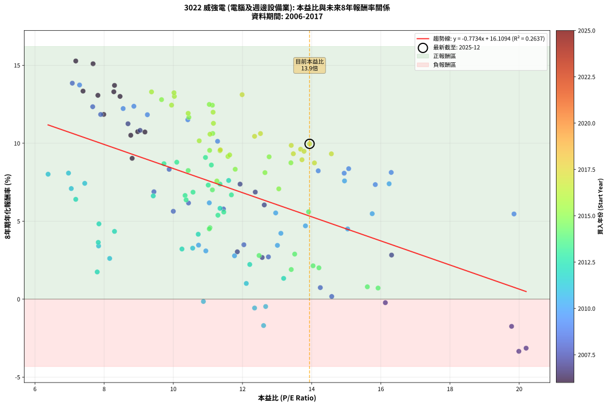
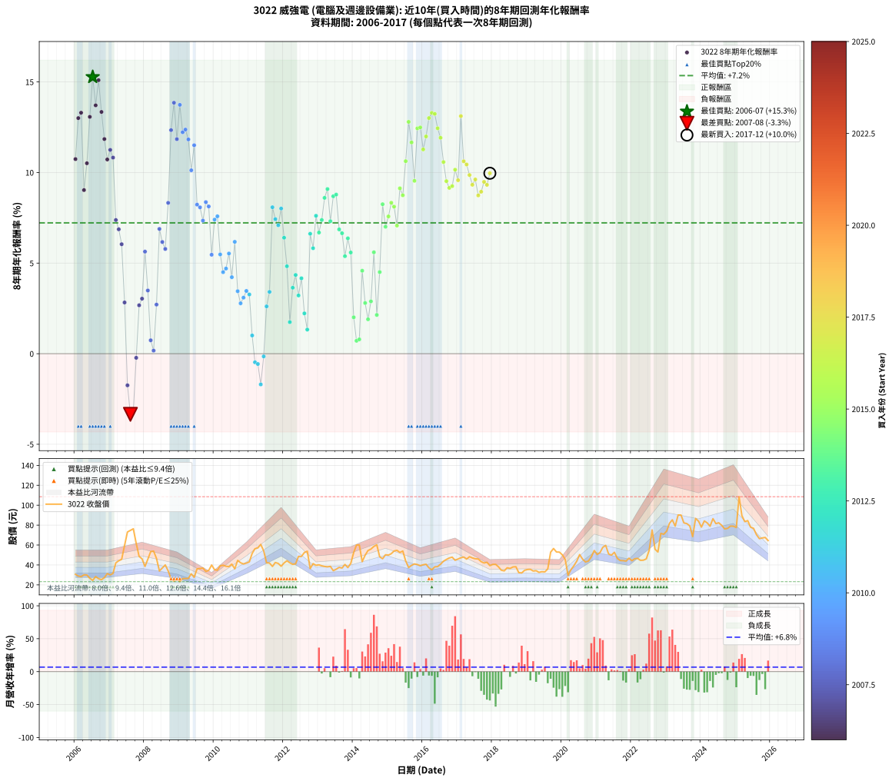

# 3022 威強電 - 本益比與未來報酬率分析

!!! info "報告資訊"
    - **股票代號**: 3022
    - **公司名稱**: 威強電
    - **產業別**: 電腦及週邊設備業
    - **分析期間**: 2006-2017 (144 個數據點)
    - **資料來源**: Type 12 (ShowMonthlyK_ChartFlow) 月收盤價與本益比
    - **報酬率口徑**: 含現金股利 (簡化: 年度合計，假設每年7/1入帳)
    - **報告生成時間**: 2026-01-10 18:47:49 CST

## 📈 視覺化圖表

### 圖表1: 本益比 vs 未來報酬率關係

*圖表1：3022 威強電 本益比與8年期未來報酬率關係 (2006-2017)*

### 圖表2: 歷年買入時點的8年期實際報酬率

*圖表2：3022 威強電 歷年買入時點的8年期實際報酬率 (2006-2017)*

## 📍 買點訊號說明

本報告提供兩種買點提示訊號（顯示於圖表2的股價子圖中）：

### ▲ 小綠色三角形（回測驗證）
- **計算方式**: 使用全部歷史資料計算本益比第25百分位數
- **用途**: 事後驗證，顯示歷史上哪些時點確實為低估區
- **限制**: 當下無法判斷，僅供回測參考
- **特性**: 後見之明（Look-Ahead Bias）

### ▲ 小橘色三角形（即時訊號）
- **計算方式**: 使用截至當月的過去5年資料計算本益比第25百分位數
- **用途**: 實際投資決策，當時即可判斷
- **優勢**: 可操作性強，符合實務需求
- **特性**: 無後見之明，滾動窗口計算

!!! tip "如何使用兩種訊號"
    - **綠色▲** 幫助理解歷史估值機會，驗證策略有效性
    - **橘色▲** 可作為實際買進參考，但仍需搭配基本面分析
    - 兩種訊號重疊時，表示即時判斷與事後驗證一致，信心度較高
    - 僅有綠色▲時，表示當時無法判斷（需要未來資料才能確認）
    - 僅有橘色▲時，表示即時判斷為買點，但事後可能不是最佳時機

## 📊 估值分析摘要

| 指標 | 數值 |
|:---:|:---:|
| **目前本益比** (2017-12) | **13.94 倍** |
| **歷史平均本益比** | 11.49 倍 |
| **估值水準** | 🔴 相對高估 |
| **預期8年年化報酬率** | **+5.33%** |
| **歷史平均報酬率** | +7.22% |
| **相關係數 (R²)** | 0.2637 |
| **趨勢線斜率** | -0.7734 |

!!! abstract "核心洞察"
    目前本益比顯著高於歷史平均，預期未來報酬率可能較低

    根據歷史數據回測，3022 威強電 在目前本益比 **13.9倍** 的估值水準下，
    預期未來8年年化報酬率約為 **+5.3%**。

    **重要提醒**: 本分析基於歷史數據統計，實際報酬率會受到公司基本面變化、產業趨勢、
    總體經濟環境等多重因素影響。R² = 0.26 表示本益比可解釋約 26.4% 的報酬率變異。

## 📈 歷史估值統計

### 最佳買點 (最高報酬率)

| 項目 | 數值 |
|:---:|:---:|
| 起始時間 | 2006-07 |
| 當時本益比 | 7.18 倍 |
| 起始價格 | 24.5 元 |
| 8年後價格 | 55.9 元 |
| **8年年化報酬率** | **+15.28%** |

### 最差買點 (最低報酬率)

| 項目 | 數值 |
|:---:|:---:|
| 起始時間 | 2007-08 |
| 當時本益比 | 19.99 倍 |
| 起始價格 | 74.7 元 |
| 8年後價格 | 37.4 元 |
| **8年年化報酬率** | **-3.35%** |

## 🎯 投資啟示

### 本益比與報酬率關係

趨勢線方程式: **y = -0.7734x + 16.1094**

!!! warning "強負相關"
    本益比與未來報酬率呈現強負相關。在高本益比時期買入，未來報酬率顯著較低；
    在低本益比時期買入，未來報酬率顯著較高。**估值紀律至關重要**。

### 估值區間建議

基於歷史數據分析:

- **🟢 低估區** (P/E < 9.2): 預期報酬率較高，可考慮增加持股
- **🟡 合理區** (P/E 9.2-13.8): 預期報酬率符合長期趨勢，正常持有
- **🔴 高估區** (P/E > 13.8): 預期報酬率較低，可考慮減碼或觀望

!!! danger "風險提示"
    - 過去表現不代表未來結果
    - 本分析假設公司基本面無重大結構性變化
    - 產業環境劇變可能使歷史規律失效
    - 應結合公司財報、產業趨勢、總體經濟等多重因素綜合判斷

!!! success "長期投資觀點"
    歷史數據顯示，在合理或低估的估值水準買入並長期持有，
    往往能獲得較佳的投資報酬。**耐心等待好價格**是價值投資的核心原則。

## 📊 數據品質

- **資料來源**: GoodInfo.tw Type 12 (ShowMonthlyK_ChartFlow)
- **資料頻率**: 月度收盤價與本益比
- **回測期間**: 2006-2017
- **數據點數量**: 144 個 (每個點代表一次8年期回測)

### 計算方法說明

1. **8年期年化報酬率**:
   - 對每個歷史時點，計算其後8年的實際投資報酬率
   - 期末價值(不含股利): 期末價格
   - 期末價值(含現金股利): 期末價格 + 持有期間內的現金股利合計 (簡化: 年度合計，假設每年7/1入帳)
   - 公式: 年化報酬率 = [(期末價值/期初價格)^(1/年數) - 1] × 100%

2. **本益比 (P/E Ratio)**:
   - 使用當時的月收盤價與EPS計算
   - 資料來源: Type 12 月度河流圖本益比數據

3. **趨勢線 (Linear Regression)**:
   - 使用最小平方法擬合線性趨勢線
   - R²值衡量本益比對報酬率的解釋能力

---

*本報告由 Stock Analysis System v1.9.0 自動生成*
*數據更新時間: 2026-01-10 18:47:49 CST*

## 📋 月度回測明細表

（每一列對應時間線圖中的一個買入點；可用來對照 SVG 圖上的每個點。）

| 買入月份 | 賣出月份 | 回測期限_年 | 實際持有年數 | 買入本益比_倍 | 買入收盤價_元 | 賣出收盤價_元 | 現金股利合計_元 | 總報酬率_pct | 年化報酬率_pct |
| --- | --- | --- | --- | --- | --- | --- | --- | --- | --- |
| 2006-01 | 2014-01 | 8 | 8.000 | 8.97 | 30.60 | 52.50 | 16.72 | +126.20 | +10.74 |
| 2006-02 | 2014-02 | 8 | 8.000 | 8.46 | 28.85 | 60.00 | 16.72 | +165.92 | +13.00 |
| 2006-03 | 2014-03 | 8 | 8.000 | 8.28 | 28.25 | 60.00 | 16.72 | +171.56 | +13.30 |
| 2006-04 | 2014-04 | 8 | 8.000 | 8.81 | 30.05 | 43.30 | 16.72 | +99.72 | +9.03 |
| 2006-05 | 2014-05 | 8 | 8.000 | 8.77 | 29.90 | 49.80 | 16.72 | +122.46 | +10.51 |
| 2006-06 | 2014-06 | 8 | 8.000 | 7.82 | 26.65 | 54.50 | 16.72 | +167.23 | +13.07 |
| 2006-07 | 2014-07 | 8 | 8.000 | 7.18 | 24.50 | 55.90 | 20.49 | +211.80 | +15.28 |
| 2006-08 | 2014-08 | 8 | 8.000 | 8.30 | 28.30 | 58.60 | 20.49 | +179.48 | +13.71 |
| 2006-09 | 2014-09 | 8 | 8.000 | 7.68 | 26.20 | 60.20 | 20.49 | +207.98 | +15.10 |
| 2006-10 | 2014-10 | 8 | 8.000 | 7.39 | 25.20 | 48.15 | 20.49 | +172.39 | +13.34 |
| 2006-11 | 2014-11 | 8 | 8.000 | 7.99 | 27.25 | 46.25 | 20.49 | +144.92 | +11.85 |
| 2006-12 | 2014-12 | 8 | 8.000 | 9.18 | 31.30 | 50.20 | 20.49 | +125.85 | +10.72 |
| 2007-01 | 2015-01 | 8 | 8.000 | 8.69 | 30.00 | 49.90 | 20.49 | +134.64 | +11.25 |
| 2007-02 | 2015-02 | 8 | 8.000 | 9.04 | 31.55 | 51.30 | 20.49 | +127.55 | +10.82 |
| 2007-03 | 2015-03 | 8 | 8.000 | 11.93 | 42.15 | 54.00 | 20.49 | +76.73 | +7.38 |
| 2007-04 | 2015-04 | 8 | 8.000 | 12.37 | 44.20 | 54.70 | 20.49 | +70.12 | +6.87 |
| 2007-05 | 2015-05 | 8 | 8.000 | 12.63 | 45.65 | 52.50 | 20.49 | +59.89 | +6.04 |
| 2007-06 | 2015-06 | 8 | 8.000 | 16.31 | 59.60 | 54.00 | 20.49 | +24.99 | +2.83 |
| 2007-07 | 2015-07 | 8 | 8.000 | 19.78 | 73.10 | 44.00 | 19.49 | -13.14 | -1.75 |
| 2007-08 | 2015-08 | 8 | 8.000 | 19.99 | 74.70 | 37.40 | 19.49 | -23.84 | -3.35 |
| 2007-09 | 2015-09 | 8 | 8.000 | 20.20 | 76.30 | 39.60 | 19.49 | -22.55 | -3.14 |
| 2007-10 | 2015-10 | 8 | 8.000 | 16.13 | 61.60 | 41.00 | 19.49 | -1.80 | -0.23 |
| 2007-11 | 2015-11 | 8 | 8.000 | 12.57 | 48.50 | 40.40 | 19.49 | +23.49 | +2.67 |
| 2007-12 | 2015-12 | 8 | 8.000 | 11.85 | 46.20 | 39.20 | 19.49 | +27.04 | +3.04 |
| 2008-01 | 2016-01 | 8 | 8.000 | 10.00 | 38.50 | 40.20 | 19.49 | +55.04 | +5.63 |
| 2008-02 | 2016-02 | 8 | 8.000 | 12.04 | 45.75 | 40.70 | 19.49 | +31.57 | +3.49 |
| 2008-03 | 2016-03 | 8 | 8.000 | 14.25 | 53.40 | 37.15 | 19.49 | +6.07 | +0.74 |
| 2008-04 | 2016-04 | 8 | 8.000 | 14.58 | 53.90 | 35.15 | 19.49 | +1.38 | +0.17 |
| 2008-05 | 2016-05 | 8 | 8.000 | 12.75 | 46.50 | 38.10 | 19.49 | +23.85 | +2.71 |
| 2008-06 | 2016-06 | 8 | 8.000 | 9.44 | 33.95 | 38.35 | 19.49 | +70.37 | +6.89 |
| 2008-07 | 2016-07 | 8 | 8.000 | 10.44 | 37.00 | 40.75 | 18.96 | +61.39 | +6.17 |
| 2008-08 | 2016-08 | 8 | 8.000 | 11.45 | 40.00 | 43.75 | 18.96 | +56.78 | +5.78 |
| 2008-09 | 2016-09 | 8 | 8.000 | 9.88 | 34.00 | 45.50 | 18.96 | +89.60 | +8.33 |
| 2008-10 | 2016-10 | 8 | 8.000 | 7.67 | 26.00 | 47.00 | 18.96 | +153.71 | +12.34 |
| 2008-11 | 2016-11 | 8 | 8.000 | 7.08 | 23.65 | 47.80 | 18.96 | +182.30 | +13.85 |
| 2008-12 | 2016-12 | 8 | 8.000 | 7.90 | 26.00 | 44.70 | 18.96 | +144.86 | +11.84 |
| 2009-01 | 2017-01 | 8 | 8.000 | 7.29 | 23.20 | 46.00 | 18.96 | +180.02 | +13.74 |
| 2009-02 | 2017-02 | 8 | 8.000 | 8.55 | 26.30 | 47.20 | 18.96 | +151.57 | +12.22 |
| 2009-03 | 2017-03 | 8 | 8.000 | 8.86 | 26.30 | 47.90 | 18.96 | +154.24 | +12.37 |
| 2009-04 | 2017-04 | 8 | 8.000 | 9.25 | 26.50 | 45.85 | 18.96 | +144.58 | +11.83 |
| 2009-05 | 2017-05 | 8 | 8.000 | 11.28 | 31.10 | 48.30 | 18.96 | +116.28 | +10.12 |
| 2009-06 | 2017-06 | 8 | 8.000 | 10.42 | 27.60 | 47.00 | 18.96 | +139.00 | +11.51 |
| 2009-07 | 2017-07 | 8 | 8.000 | 14.19 | 36.10 | 46.20 | 21.76 | +88.26 | +8.23 |
| 2009-08 | 2017-08 | 8 | 8.000 | 14.94 | 36.40 | 46.00 | 21.76 | +86.16 | +8.08 |
| 2009-09 | 2017-09 | 8 | 8.000 | 15.84 | 36.90 | 43.30 | 21.76 | +76.32 | +7.35 |
| 2009-10 | 2017-10 | 8 | 8.000 | 15.07 | 33.50 | 41.95 | 21.76 | +90.19 | +8.37 |
| 2009-11 | 2017-11 | 8 | 8.000 | 16.30 | 34.50 | 42.70 | 21.76 | +86.85 | +8.13 |
| 2009-12 | 2017-12 | 8 | 8.000 | 19.85 | 39.90 | 39.30 | 21.76 | +53.04 | +5.46 |
| 2010-01 | 2018-01 | 8 | 8.000 | 16.24 | 35.20 | 40.55 | 21.76 | +77.02 | +7.40 |
| 2010-02 | 2018-02 | 8 | 8.000 | 14.95 | 34.75 | 40.60 | 21.76 | +79.46 | +7.58 |
| 2010-03 | 2018-03 | 8 | 8.000 | 15.75 | 39.10 | 38.15 | 21.76 | +53.23 | +5.48 |
| 2010-04 | 2018-04 | 8 | 8.000 | 15.04 | 39.70 | 34.70 | 21.76 | +42.22 | +4.50 |
| 2010-05 | 2018-05 | 8 | 8.000 | 13.82 | 38.65 | 34.05 | 21.76 | +44.40 | +4.70 |
| 2010-06 | 2018-06 | 8 | 8.000 | 12.96 | 38.30 | 37.15 | 21.76 | +53.82 | +5.53 |
| 2010-07 | 2018-07 | 8 | 8.000 | 13.11 | 40.80 | 36.50 | 20.30 | +39.22 | +4.22 |
| 2010-08 | 2018-08 | 8 | 8.000 | 11.04 | 36.10 | 38.00 | 20.30 | +61.50 | +6.17 |
| 2010-09 | 2018-09 | 8 | 8.000 | 13.01 | 44.60 | 38.20 | 20.30 | +31.17 | +3.45 |
| 2010-10 | 2018-10 | 8 | 8.000 | 11.77 | 42.20 | 32.25 | 20.30 | +24.53 | +2.78 |
| 2010-11 | 2018-11 | 8 | 8.000 | 10.94 | 40.95 | 31.95 | 20.30 | +27.60 | +3.09 |
| 2010-12 | 2018-12 | 8 | 8.000 | 10.73 | 41.85 | 34.65 | 20.30 | +31.31 | +3.46 |
| 2011-01 | 2019-01 | 8 | 8.000 | 10.56 | 43.10 | 35.45 | 20.30 | +29.35 | +3.27 |
| 2011-02 | 2019-02 | 8 | 8.000 | 12.11 | 51.60 | 35.60 | 20.30 | +8.34 | +1.01 |
| 2011-03 | 2019-03 | 8 | 8.000 | 12.67 | 56.30 | 33.90 | 20.30 | -3.73 | -0.47 |
| 2011-04 | 2019-04 | 8 | 8.000 | 12.35 | 57.10 | 34.25 | 20.30 | -4.46 | -0.57 |
| 2011-05 | 2019-05 | 8 | 8.000 | 12.61 | 60.60 | 32.55 | 20.30 | -12.79 | -1.70 |
| 2011-06 | 2019-06 | 8 | 8.000 | 10.87 | 54.20 | 33.25 | 20.30 | -1.20 | -0.15 |
| 2011-07 | 2019-07 | 8 | 8.000 | 8.16 | 42.15 | 33.00 | 18.80 | +22.89 | +2.61 |
| 2011-08 | 2019-08 | 8 | 8.000 | 7.84 | 41.90 | 36.00 | 18.80 | +30.79 | +3.41 |
| 2011-09 | 2019-09 | 8 | 8.000 | 6.97 | 38.50 | 52.90 | 18.80 | +86.23 | +8.08 |
| 2011-10 | 2019-10 | 8 | 8.000 | 7.44 | 42.45 | 56.50 | 18.80 | +77.39 | +7.43 |
| 2011-11 | 2019-11 | 8 | 8.000 | 7.05 | 41.50 | 53.00 | 18.80 | +73.01 | +7.09 |
| 2011-12 | 2019-12 | 8 | 8.000 | 6.38 | 38.70 | 52.90 | 18.80 | +85.27 | +8.01 |
| 2012-01 | 2020-01 | 8 | 8.000 | 7.18 | 42.00 | 50.20 | 18.80 | +64.29 | +6.40 |
| 2012-02 | 2020-02 | 8 | 8.000 | 7.85 | 44.20 | 45.65 | 18.80 | +45.81 | +4.83 |
| 2012-03 | 2020-03 | 8 | 8.000 | 7.80 | 42.15 | 29.60 | 18.80 | +14.83 | +1.74 |
| 2012-04 | 2020-04 | 8 | 8.000 | 7.83 | 40.60 | 35.25 | 18.80 | +33.13 | +3.64 |
| 2012-05 | 2020-05 | 8 | 8.000 | 8.30 | 41.20 | 39.10 | 18.80 | +40.53 | +4.35 |
| 2012-06 | 2020-06 | 8 | 8.000 | 10.25 | 48.60 | 43.80 | 18.80 | +28.81 | +3.21 |
| 2012-07 | 2020-07 | 8 | 8.000 | 10.72 | 48.50 | 50.40 | 16.80 | +38.56 | +4.16 |
| 2012-08 | 2020-08 | 8 | 8.000 | 12.21 | 52.50 | 45.80 | 16.80 | +19.25 | +2.22 |
| 2012-09 | 2020-09 | 8 | 8.000 | 13.19 | 53.80 | 43.00 | 16.80 | +11.16 | +1.33 |
| 2012-10 | 2020-10 | 8 | 8.000 | 9.42 | 36.35 | 43.90 | 16.80 | +67.00 | +6.62 |
| 2012-11 | 2020-11 | 8 | 8.000 | 11.35 | 41.30 | 48.15 | 16.80 | +57.27 | +5.82 |
| 2012-12 | 2020-12 | 8 | 8.000 | 11.60 | 39.65 | 54.50 | 16.80 | +79.83 | +7.61 |
| 2013-01 | 2021-01 | 8 | 8.000 | 11.68 | 40.10 | 50.50 | 16.80 | +67.84 | +6.69 |
| 2013-02 | 2021-02 | 8 | 8.000 | 11.35 | 39.15 | 52.40 | 16.80 | +76.77 | +7.38 |
| 2013-03 | 2021-03 | 8 | 8.000 | 11.10 | 38.50 | 57.70 | 16.80 | +93.52 | +8.60 |
| 2013-04 | 2021-04 | 8 | 8.000 | 10.93 | 38.10 | 59.60 | 16.80 | +100.54 | +9.09 |
| 2013-05 | 2021-05 | 8 | 8.000 | 11.01 | 38.55 | 51.00 | 16.80 | +75.89 | +7.31 |
| 2013-06 | 2021-06 | 8 | 8.000 | 9.73 | 34.25 | 49.90 | 16.80 | +94.76 | +8.69 |
| 2013-07 | 2021-07 | 8 | 8.000 | 10.10 | 35.70 | 52.70 | 17.30 | +96.09 | +8.78 |
| 2013-08 | 2021-08 | 8 | 8.000 | 10.57 | 37.55 | 46.55 | 17.30 | +70.05 | +6.86 |
| 2013-09 | 2021-09 | 8 | 8.000 | 10.34 | 36.90 | 44.45 | 17.30 | +67.36 | +6.65 |
| 2013-10 | 2021-10 | 8 | 8.000 | 11.29 | 40.50 | 44.30 | 17.30 | +52.11 | +5.38 |
| 2013-11 | 2021-11 | 8 | 8.000 | 10.37 | 37.35 | 43.90 | 17.30 | +63.87 | +6.37 |
| 2013-12 | 2021-12 | 8 | 8.000 | 11.46 | 41.50 | 46.80 | 17.30 | +54.47 | +5.59 |
| 2014-01 | 2022-01 | 8 | 8.000 | 14.21 | 52.50 | 44.25 | 17.30 | +17.25 | +2.01 |
| 2014-02 | 2022-02 | 8 | 8.000 | 15.92 | 60.00 | 46.20 | 17.30 | +5.84 | +0.71 |
| 2014-03 | 2022-03 | 8 | 8.000 | 15.61 | 60.00 | 46.60 | 17.30 | +6.51 | +0.79 |
| 2014-04 | 2022-04 | 8 | 8.000 | 11.06 | 43.30 | 44.65 | 17.30 | +43.08 | +4.58 |
| 2014-05 | 2022-05 | 8 | 8.000 | 12.48 | 49.80 | 44.80 | 17.30 | +24.71 | +2.80 |
| 2014-06 | 2022-06 | 8 | 8.000 | 13.41 | 54.50 | 46.05 | 17.30 | +16.25 | +1.90 |
| 2014-07 | 2022-07 | 8 | 8.000 | 13.51 | 55.90 | 54.70 | 15.50 | +25.59 | +2.89 |
| 2014-08 | 2022-08 | 8 | 8.000 | 13.91 | 58.60 | 75.10 | 15.50 | +54.61 | +5.60 |
| 2014-09 | 2022-09 | 8 | 8.000 | 14.04 | 60.20 | 55.80 | 15.50 | +18.45 | +2.14 |
| 2014-10 | 2022-10 | 8 | 8.000 | 11.04 | 48.15 | 53.00 | 15.50 | +42.27 | +4.51 |
| 2014-11 | 2022-11 | 8 | 8.000 | 10.43 | 46.25 | 71.70 | 15.50 | +88.55 | +8.25 |
| 2014-12 | 2022-12 | 8 | 8.000 | 11.13 | 50.20 | 70.80 | 15.50 | +71.92 | +7.01 |
| 2015-01 | 2023-01 | 8 | 8.000 | 11.26 | 49.90 | 74.00 | 15.50 | +79.37 | +7.58 |
| 2015-02 | 2023-02 | 8 | 8.000 | 11.79 | 51.30 | 81.80 | 15.50 | +89.68 | +8.33 |
| 2015-03 | 2023-03 | 8 | 8.000 | 12.65 | 54.00 | 85.30 | 15.50 | +86.67 | +8.11 |
| 2015-04 | 2023-04 | 8 | 8.000 | 13.05 | 54.70 | 79.00 | 15.50 | +72.77 | +7.07 |
| 2015-05 | 2023-05 | 8 | 8.000 | 12.77 | 52.50 | 90.10 | 15.50 | +101.15 | +9.13 |
| 2015-06 | 2023-06 | 8 | 8.000 | 13.40 | 54.00 | 90.10 | 15.50 | +95.56 | +8.75 |
| 2015-07 | 2023-07 | 8 | 8.000 | 11.14 | 44.00 | 82.20 | 16.50 | +124.33 | +10.63 |
| 2015-08 | 2023-08 | 8 | 8.000 | 9.66 | 37.40 | 81.50 | 16.50 | +162.04 | +12.80 |
| 2015-09 | 2023-09 | 8 | 8.000 | 10.45 | 39.60 | 79.20 | 16.50 | +141.68 | +11.66 |
| 2015-10 | 2023-10 | 8 | 8.000 | 11.05 | 41.00 | 68.50 | 16.50 | +107.33 | +9.54 |
| 2015-11 | 2023-11 | 8 | 8.000 | 11.13 | 40.40 | 86.70 | 16.50 | +155.46 | +12.44 |
| 2015-12 | 2023-12 | 8 | 8.000 | 11.04 | 39.20 | 84.00 | 16.50 | +156.39 | +12.49 |
| 2016-01 | 2024-01 | 8 | 8.000 | 11.16 | 40.20 | 78.00 | 16.50 | +135.08 | +11.28 |
| 2016-02 | 2024-02 | 8 | 8.000 | 11.15 | 40.70 | 84.20 | 16.50 | +147.43 | +11.99 |
| 2016-03 | 2024-03 | 8 | 8.000 | 10.03 | 37.15 | 82.30 | 16.50 | +165.96 | +13.01 |
| 2016-04 | 2024-04 | 8 | 8.000 | 9.37 | 35.15 | 78.90 | 16.50 | +171.42 | +13.29 |
| 2016-05 | 2024-05 | 8 | 8.000 | 10.02 | 38.10 | 86.50 | 16.50 | +170.35 | +13.24 |
| 2016-06 | 2024-06 | 8 | 8.000 | 9.95 | 38.35 | 81.50 | 16.50 | +155.55 | +12.44 |
| 2016-07 | 2024-07 | 8 | 8.000 | 10.43 | 40.75 | 82.30 | 18.00 | +146.14 | +11.92 |
| 2016-08 | 2024-08 | 8 | 8.000 | 11.06 | 43.75 | 79.80 | 18.00 | +123.55 | +10.58 |
| 2016-09 | 2024-09 | 8 | 8.000 | 11.35 | 45.50 | 76.20 | 18.00 | +107.04 | +9.52 |
| 2016-10 | 2024-10 | 8 | 8.000 | 11.58 | 47.00 | 76.70 | 18.00 | +101.50 | +9.15 |
| 2016-11 | 2024-11 | 8 | 8.000 | 11.63 | 47.80 | 79.00 | 18.00 | +102.94 | +9.25 |
| 2016-12 | 2024-12 | 8 | 8.000 | 10.75 | 44.70 | 78.90 | 18.00 | +116.79 | +10.16 |
| 2017-01 | 2025-01 | 8 | 8.000 | 11.36 | 46.00 | 77.60 | 18.00 | +107.83 | +9.58 |
| 2017-02 | 2025-02 | 8 | 8.000 | 11.99 | 47.20 | 108.50 | 18.00 | +168.02 | +13.12 |
| 2017-03 | 2025-03 | 8 | 8.000 | 12.52 | 47.90 | 89.40 | 18.00 | +124.23 | +10.62 |
| 2017-04 | 2025-04 | 8 | 8.000 | 12.35 | 45.85 | 83.50 | 18.00 | +121.38 | +10.44 |
| 2017-05 | 2025-05 | 8 | 8.000 | 13.41 | 48.30 | 84.50 | 18.00 | +112.22 | +9.86 |
| 2017-06 | 2025-06 | 8 | 8.000 | 13.47 | 47.00 | 77.90 | 18.00 | +104.05 | +9.32 |
| 2017-07 | 2025-07 | 8 | 8.000 | 13.68 | 46.20 | 76.80 | 19.50 | +108.45 | +9.62 |
| 2017-08 | 2025-08 | 8 | 8.000 | 14.08 | 46.00 | 70.40 | 19.50 | +95.44 | +8.74 |
| 2017-09 | 2025-09 | 8 | 8.000 | 13.72 | 43.30 | 66.40 | 19.50 | +98.39 | +8.94 |
| 2017-10 | 2025-10 | 8 | 8.000 | 13.78 | 41.95 | 67.10 | 19.50 | +106.45 | +9.48 |
| 2017-11 | 2025-11 | 8 | 8.000 | 14.57 | 42.70 | 67.60 | 19.50 | +103.99 | +9.32 |
| 2017-12 | 2025-12 | 8 | 8.000 | 13.94 | 39.30 | 64.50 | 19.50 | +113.75 | +9.96 |
