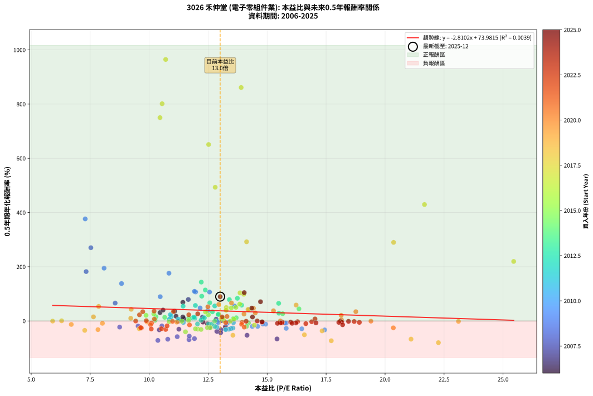
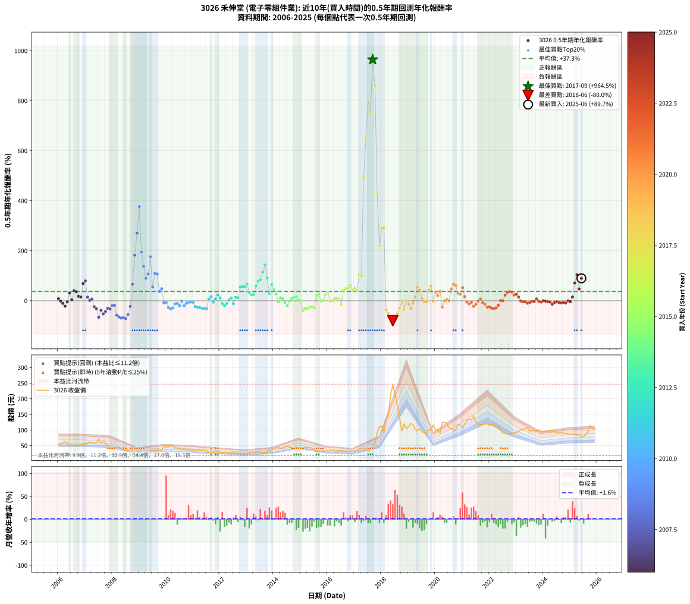

# 3026 禾伸堂 - 本益比與未來報酬率分析

!!! info "報告資訊"
    - **股票代號**: 3026
    - **公司名稱**: 禾伸堂
    - **產業別**: 電子零組件業
    - **分析期間**: 2006-2025 (234 個數據點)
    - **資料來源**: Type 12 (ShowMonthlyK_ChartFlow) 月收盤價與本益比
    - **報酬率口徑**: 含現金股利 (簡化: 年度合計，假設每年7/1入帳)
    - **報告生成時間**: 2026-01-10 22:47:11 CST

## 📈 視覺化圖表

### 圖表1: 本益比 vs 未來報酬率關係

*圖表1：3026 禾伸堂 本益比與0.5年期未來報酬率關係 (2006-2025)*

### 圖表2: 歷年買入時點的0.5年期實際報酬率

*圖表2：3026 禾伸堂 歷年買入時點的0.5年期實際報酬率 (2006-2025)*

## 📍 買點訊號說明

本報告提供兩種買點提示訊號（顯示於圖表2的股價子圖中）：

### ▲ 小綠色三角形（回測驗證）
- **計算方式**: 使用全部歷史資料計算本益比第25百分位數
- **用途**: 事後驗證，顯示歷史上哪些時點確實為低估區
- **限制**: 當下無法判斷，僅供回測參考
- **特性**: 後見之明（Look-Ahead Bias）

### ▲ 小橘色三角形（即時訊號）
- **計算方式**: 使用截至當月的過去5年資料計算本益比第25百分位數
- **用途**: 實際投資決策，當時即可判斷
- **優勢**: 可操作性強，符合實務需求
- **特性**: 無後見之明，滾動窗口計算

!!! tip "如何使用兩種訊號"
    - **綠色▲** 幫助理解歷史估值機會，驗證策略有效性
    - **橘色▲** 可作為實際買進參考，但仍需搭配基本面分析
    - 兩種訊號重疊時，表示即時判斷與事後驗證一致，信心度較高
    - 僅有綠色▲時，表示當時無法判斷（需要未來資料才能確認）
    - 僅有橘色▲時，表示即時判斷為買點，但事後可能不是最佳時機

## 📊 估值分析摘要

| 指標 | 數值 |
|:---:|:---:|
| **目前本益比** (2025-06) | **13.01 倍** |
| **歷史平均本益比** | 13.05 倍 |
| **估值水準** | 🟡 合理範圍 |
| **預期0.5年年化報酬率** | **+37.42%** |
| **歷史平均報酬率** | +37.32% |
| **相關係數 (R²)** | 0.0039 |
| **趨勢線斜率** | -2.8102 |

!!! abstract "核心洞察"
    目前本益比接近歷史平均，預期報酬率符合長期趨勢

    根據歷史數據回測，3026 禾伸堂 在目前本益比 **13.0倍** 的估值水準下，
    預期未來0.5年年化報酬率約為 **+37.4%**。

    **重要提醒**: 本分析基於歷史數據統計，實際報酬率會受到公司基本面變化、產業趨勢、
    總體經濟環境等多重因素影響。R² = 0.00 表示本益比可解釋約 0.4% 的報酬率變異。

## 📈 歷史估值統計

### 最佳買點 (最高報酬率)

| 項目 | 數值 |
|:---:|:---:|
| 起始時間 | 2017-09 |
| 當時本益比 | 10.70 倍 |
| 起始價格 | 41.4 元 |
| 0.5年後價格 | 133.5 元 |
| **0.5年年化報酬率** | **+964.51%** |

### 最差買點 (最低報酬率)

| 項目 | 數值 |
|:---:|:---:|
| 起始時間 | 2018-06 |
| 當時本益比 | 22.26 倍 |
| 起始價格 | 245.0 元 |
| 0.5年後價格 | 104.0 元 |
| **0.5年年化報酬率** | **-80.03%** |

## 🎯 投資啟示

### 本益比與報酬率關係

趨勢線方程式: **y = -2.8102x + 73.9815**

!!! warning "強負相關"
    本益比與未來報酬率呈現強負相關。在高本益比時期買入，未來報酬率顯著較低；
    在低本益比時期買入，未來報酬率顯著較高。**估值紀律至關重要**。

### 估值區間建議

基於歷史數據分析:

- **🟢 低估區** (P/E < 10.4): 預期報酬率較高，可考慮增加持股
- **🟡 合理區** (P/E 10.4-15.7): 預期報酬率符合長期趨勢，正常持有
- **🔴 高估區** (P/E > 15.7): 預期報酬率較低，可考慮減碼或觀望

!!! danger "風險提示"
    - 過去表現不代表未來結果
    - 本分析假設公司基本面無重大結構性變化
    - 產業環境劇變可能使歷史規律失效
    - 應結合公司財報、產業趨勢、總體經濟等多重因素綜合判斷

!!! success "長期投資觀點"
    歷史數據顯示，在合理或低估的估值水準買入並長期持有，
    往往能獲得較佳的投資報酬。**耐心等待好價格**是價值投資的核心原則。

## 📊 數據品質

- **資料來源**: GoodInfo.tw Type 12 (ShowMonthlyK_ChartFlow)
- **資料頻率**: 月度收盤價與本益比
- **回測期間**: 2006-2025
- **數據點數量**: 234 個 (每個點代表一次0.5年期回測)

### 計算方法說明

1. **0.5年期年化報酬率**:
   - 對每個歷史時點，計算其後0.5年的實際投資報酬率
   - 期末價值(不含股利): 期末價格
   - 期末價值(含現金股利): 期末價格 + 持有期間內的現金股利合計 (簡化: 年度合計，假設每年7/1入帳)
   - 公式: 年化報酬率 = [(期末價值/期初價格)^(1/年數) - 1] × 100%

2. **本益比 (P/E Ratio)**:
   - 使用當時的月收盤價與EPS計算
   - 資料來源: Type 12 月度河流圖本益比數據

3. **趨勢線 (Linear Regression)**:
   - 使用最小平方法擬合線性趨勢線
   - R²值衡量本益比對報酬率的解釋能力

---

*本報告由 Stock Analysis System v1.9.0 自動生成*
*數據更新時間: 2026-01-10 22:47:11 CST*

## 📋 月度回測明細表

（每一列對應時間線圖中的一個買入點；可用來對照 SVG 圖上的每個點。）

| 買入月份 | 賣出月份 | 回測期限_年 | 實際持有年數 | 買入本益比_倍 | 買入收盤價_元 | 賣出收盤價_元 | 現金股利合計_元 | 總報酬率_pct | 年化報酬率_pct |
| --- | --- | --- | --- | --- | --- | --- | --- | --- | --- |
| 2006-01 | 2006-07 | 0.5 | 0.496 | 11.48 | 54.40 | 54.00 | 2.55 | +3.94 | +8.12 |
| 2006-02 | 2006-08 | 0.5 | 0.498 | 11.22 | 53.20 | 50.20 | 2.55 | -0.85 | -1.71 |
| 2006-03 | 2006-10 | 0.5 | 0.586 | 12.47 | 59.10 | 52.80 | 2.55 | -6.35 | -10.60 |
| 2006-04 | 2006-10 | 0.5 | 0.501 | 13.23 | 62.70 | 52.80 | 2.55 | -11.73 | -22.04 |
| 2006-05 | 2006-12 | 0.5 | 0.586 | 12.28 | 58.20 | 54.20 | 2.55 | -2.50 | -4.23 |
| 2006-06 | 2006-12 | 0.5 | 0.501 | 10.46 | 49.60 | 54.20 | 2.55 | +14.41 | +30.82 |
| 2006-07 | 2007-01 | 0.5 | 0.504 | 11.39 | 54.00 | 55.00 | 0.00 | +1.85 | +3.71 |
| 2006-08 | 2007-03 | 0.5 | 0.580 | 10.59 | 50.20 | 61.10 | 0.00 | +21.71 | +40.29 |
| 2006-09 | 2007-03 | 0.5 | 0.496 | 11.08 | 52.50 | 61.10 | 0.00 | +16.38 | +35.81 |
| 2006-10 | 2007-05 | 0.5 | 0.580 | 11.14 | 52.80 | 58.00 | 0.00 | +9.85 | +17.57 |
| 2006-11 | 2007-05 | 0.5 | 0.496 | 11.43 | 54.20 | 58.00 | 0.00 | +7.01 | +14.65 |
| 2006-12 | 2007-07 | 0.5 | 0.580 | 11.43 | 54.20 | 70.50 | 2.94 | +35.50 | +68.78 |
| 2007-01 | 2007-07 | 0.5 | 0.496 | 11.66 | 55.00 | 70.50 | 2.94 | +33.53 | +79.23 |
| 2007-02 | 2007-08 | 0.5 | 0.498 | 12.26 | 57.50 | 58.50 | 2.94 | +6.86 | +14.23 |
| 2007-03 | 2007-10 | 0.5 | 0.586 | 13.09 | 61.10 | 58.60 | 2.94 | +0.72 | +1.24 |
| 2007-04 | 2007-10 | 0.5 | 0.501 | 12.84 | 59.60 | 58.60 | 2.94 | +3.26 | +6.61 |
| 2007-05 | 2007-12 | 0.5 | 0.586 | 12.56 | 58.00 | 46.40 | 2.94 | -14.93 | -24.11 |
| 2007-06 | 2007-12 | 0.5 | 0.501 | 13.04 | 59.90 | 46.40 | 2.94 | -17.63 | -32.09 |
| 2007-07 | 2008-01 | 0.5 | 0.504 | 15.42 | 70.50 | 40.80 | 0.00 | -42.13 | -66.23 |
| 2007-08 | 2008-03 | 0.5 | 0.583 | 12.87 | 58.50 | 44.10 | 0.00 | -24.62 | -38.40 |
| 2007-09 | 2008-03 | 0.5 | 0.498 | 14.15 | 64.00 | 44.10 | 0.00 | -31.09 | -52.64 |
| 2007-10 | 2008-05 | 0.5 | 0.583 | 13.03 | 58.60 | 42.10 | 0.00 | -28.16 | -43.28 |
| 2007-11 | 2008-05 | 0.5 | 0.498 | 11.26 | 50.40 | 42.10 | 0.00 | -16.47 | -30.31 |
| 2007-12 | 2008-07 | 0.5 | 0.583 | 10.43 | 46.40 | 33.80 | 2.98 | -20.73 | -32.87 |
| 2008-01 | 2008-07 | 0.5 | 0.498 | 9.53 | 40.80 | 33.80 | 2.98 | -9.86 | -18.80 |
| 2008-02 | 2008-08 | 0.5 | 0.501 | 10.54 | 43.30 | 36.15 | 2.98 | -9.63 | -18.30 |
| 2008-03 | 2008-10 | 0.5 | 0.586 | 11.19 | 44.10 | 23.55 | 2.98 | -39.84 | -58.00 |
| 2008-04 | 2008-10 | 0.5 | 0.501 | 11.92 | 44.95 | 23.55 | 2.98 | -40.98 | -65.09 |
| 2008-05 | 2008-12 | 0.5 | 0.586 | 11.69 | 42.10 | 18.15 | 2.98 | -49.81 | -69.17 |
| 2008-06 | 2008-12 | 0.5 | 0.501 | 10.79 | 37.00 | 18.15 | 2.98 | -42.89 | -67.31 |
| 2008-07 | 2009-01 | 0.5 | 0.504 | 10.37 | 33.80 | 17.90 | 0.00 | -47.04 | -71.69 |
| 2008-08 | 2009-03 | 0.5 | 0.580 | 11.70 | 36.15 | 22.50 | 0.00 | -37.76 | -55.82 |
| 2008-09 | 2009-03 | 0.5 | 0.496 | 8.75 | 25.55 | 22.50 | 0.00 | -11.94 | -22.63 |
| 2008-10 | 2009-05 | 0.5 | 0.580 | 8.56 | 23.55 | 31.60 | 0.00 | +34.18 | +65.96 |
| 2008-11 | 2009-05 | 0.5 | 0.496 | 7.33 | 18.90 | 31.60 | 0.00 | +67.20 | +182.14 |
| 2008-12 | 2009-07 | 0.5 | 0.580 | 7.53 | 18.15 | 37.20 | 1.60 | +113.77 | +270.23 |
| 2009-01 | 2009-07 | 0.5 | 0.496 | 7.29 | 17.90 | 37.20 | 1.60 | +116.76 | +376.42 |
| 2009-02 | 2009-08 | 0.5 | 0.498 | 8.09 | 20.25 | 33.10 | 1.60 | +71.36 | +194.72 |
| 2009-03 | 2009-10 | 0.5 | 0.586 | 8.83 | 22.50 | 35.80 | 1.60 | +66.22 | +138.05 |
| 2009-04 | 2009-10 | 0.5 | 0.501 | 10.47 | 27.15 | 35.80 | 1.60 | +37.75 | +89.51 |
| 2009-05 | 2009-12 | 0.5 | 0.586 | 11.97 | 31.60 | 46.80 | 1.60 | +53.16 | +107.03 |
| 2009-06 | 2009-12 | 0.5 | 0.501 | 10.84 | 29.10 | 46.80 | 1.60 | +66.32 | +176.06 |
| 2009-07 | 2010-01 | 0.5 | 0.504 | 13.62 | 37.20 | 46.40 | 0.00 | +24.73 | +55.07 |
| 2009-08 | 2010-03 | 0.5 | 0.580 | 11.92 | 33.10 | 50.80 | 0.00 | +53.47 | +109.18 |
| 2009-09 | 2010-03 | 0.5 | 0.496 | 12.56 | 35.45 | 50.80 | 0.00 | +43.30 | +106.68 |
| 2009-10 | 2010-05 | 0.5 | 0.580 | 12.48 | 35.80 | 43.05 | 0.00 | +20.25 | +37.40 |
| 2009-11 | 2010-05 | 0.5 | 0.496 | 12.16 | 35.45 | 43.05 | 0.00 | +21.44 | +47.99 |
| 2009-12 | 2010-07 | 0.5 | 0.580 | 15.81 | 46.80 | 41.60 | 3.00 | -4.70 | -7.96 |
| 2010-01 | 2010-07 | 0.5 | 0.496 | 15.76 | 46.40 | 41.60 | 3.00 | -3.88 | -7.67 |
| 2010-02 | 2010-08 | 0.5 | 0.498 | 15.81 | 46.30 | 36.50 | 3.00 | -14.69 | -27.30 |
| 2010-03 | 2010-10 | 0.5 | 0.586 | 17.44 | 50.80 | 37.20 | 3.00 | -20.87 | -32.93 |
| 2010-04 | 2010-10 | 0.5 | 0.501 | 16.47 | 47.70 | 37.20 | 3.00 | -15.72 | -28.92 |
| 2010-05 | 2010-12 | 0.5 | 0.586 | 14.94 | 43.05 | 37.00 | 3.00 | -7.08 | -11.79 |
| 2010-06 | 2010-12 | 0.5 | 0.501 | 14.82 | 42.45 | 37.00 | 3.00 | -5.77 | -11.19 |
| 2010-07 | 2011-01 | 0.5 | 0.504 | 14.60 | 41.60 | 37.15 | 0.00 | -10.70 | -20.11 |
| 2010-08 | 2011-03 | 0.5 | 0.580 | 12.88 | 36.50 | 36.20 | 0.00 | -0.82 | -1.41 |
| 2010-09 | 2011-03 | 0.5 | 0.496 | 14.37 | 40.50 | 36.20 | 0.00 | -10.62 | -20.27 |
| 2010-10 | 2011-05 | 0.5 | 0.580 | 13.28 | 37.20 | 34.90 | 0.00 | -6.18 | -10.41 |
| 2010-11 | 2011-05 | 0.5 | 0.496 | 12.92 | 36.00 | 34.90 | 0.00 | -3.06 | -6.07 |
| 2010-12 | 2011-07 | 0.5 | 0.580 | 13.36 | 37.00 | 33.65 | 2.31 | -2.82 | -4.81 |
| 2011-01 | 2011-07 | 0.5 | 0.496 | 13.57 | 37.15 | 33.65 | 2.31 | -3.21 | -6.38 |
| 2011-02 | 2011-08 | 0.5 | 0.498 | 12.87 | 34.80 | 28.20 | 2.31 | -12.34 | -23.23 |
| 2011-03 | 2011-10 | 0.5 | 0.586 | 13.55 | 36.20 | 28.00 | 2.31 | -16.28 | -26.16 |
| 2011-04 | 2011-10 | 0.5 | 0.501 | 13.48 | 35.60 | 28.00 | 2.31 | -14.87 | -27.48 |
| 2011-05 | 2011-12 | 0.5 | 0.586 | 13.38 | 34.90 | 25.95 | 2.31 | -19.04 | -30.26 |
| 2011-06 | 2011-12 | 0.5 | 0.501 | 13.26 | 34.15 | 25.95 | 2.31 | -17.26 | -31.49 |
| 2011-07 | 2012-01 | 0.5 | 0.504 | 13.24 | 33.65 | 27.80 | 0.00 | -17.38 | -31.55 |
| 2011-08 | 2012-03 | 0.5 | 0.583 | 11.24 | 28.20 | 29.20 | 0.00 | +3.55 | +6.16 |
| 2011-09 | 2012-03 | 0.5 | 0.498 | 10.94 | 27.10 | 29.20 | 0.00 | +7.75 | +16.16 |
| 2011-10 | 2012-05 | 0.5 | 0.583 | 11.45 | 28.00 | 27.10 | 0.00 | -3.21 | -5.45 |
| 2011-11 | 2012-05 | 0.5 | 0.498 | 10.86 | 26.20 | 27.10 | 0.00 | +3.44 | +7.01 |
| 2011-12 | 2012-07 | 0.5 | 0.583 | 10.90 | 25.95 | 27.30 | 2.00 | +12.91 | +23.15 |
| 2012-01 | 2012-07 | 0.5 | 0.498 | 11.84 | 27.80 | 27.30 | 2.00 | +5.40 | +11.12 |
| 2012-02 | 2012-08 | 0.5 | 0.501 | 12.52 | 29.00 | 25.30 | 2.00 | -5.86 | -11.36 |
| 2012-03 | 2012-10 | 0.5 | 0.586 | 12.78 | 29.20 | 23.60 | 2.00 | -12.33 | -20.11 |
| 2012-04 | 2012-10 | 0.5 | 0.501 | 12.05 | 27.15 | 23.60 | 2.00 | -5.71 | -11.07 |
| 2012-05 | 2012-12 | 0.5 | 0.586 | 12.20 | 27.10 | 25.55 | 2.00 | +1.66 | +2.85 |
| 2012-06 | 2012-12 | 0.5 | 0.501 | 11.94 | 26.15 | 25.55 | 2.00 | +5.35 | +10.97 |
| 2012-07 | 2013-01 | 0.5 | 0.504 | 12.65 | 27.30 | 25.60 | 0.00 | -6.23 | -11.98 |
| 2012-08 | 2013-03 | 0.5 | 0.580 | 11.90 | 25.30 | 27.30 | 0.00 | +7.91 | +14.01 |
| 2012-09 | 2013-03 | 0.5 | 0.496 | 12.34 | 25.85 | 27.30 | 0.00 | +5.61 | +11.64 |
| 2012-10 | 2013-05 | 0.5 | 0.580 | 11.44 | 23.60 | 30.40 | 0.00 | +28.81 | +54.69 |
| 2012-11 | 2013-05 | 0.5 | 0.496 | 11.96 | 24.30 | 30.40 | 0.00 | +25.10 | +57.14 |
| 2012-12 | 2013-07 | 0.5 | 0.580 | 12.78 | 25.55 | 31.00 | 2.00 | +29.16 | +55.40 |
| 2013-01 | 2013-07 | 0.5 | 0.496 | 12.57 | 25.60 | 31.00 | 2.00 | +28.91 | +66.93 |
| 2013-02 | 2013-08 | 0.5 | 0.498 | 12.68 | 26.30 | 28.40 | 2.00 | +15.59 | +33.74 |
| 2013-03 | 2013-10 | 0.5 | 0.586 | 12.94 | 27.30 | 28.95 | 2.00 | +13.37 | +23.88 |
| 2013-04 | 2013-10 | 0.5 | 0.501 | 12.93 | 27.75 | 28.95 | 2.00 | +11.53 | +24.34 |
| 2013-05 | 2013-12 | 0.5 | 0.586 | 13.92 | 30.40 | 37.80 | 2.00 | +30.92 | +58.38 |
| 2013-06 | 2013-12 | 0.5 | 0.501 | 13.40 | 29.75 | 37.80 | 2.00 | +33.78 | +78.76 |
| 2013-07 | 2014-01 | 0.5 | 0.504 | 13.74 | 31.00 | 42.10 | 0.00 | +35.81 | +83.59 |
| 2013-08 | 2014-03 | 0.5 | 0.580 | 12.38 | 28.40 | 44.20 | 0.00 | +55.63 | +114.28 |
| 2013-09 | 2014-03 | 0.5 | 0.496 | 12.21 | 28.45 | 44.20 | 0.00 | +55.36 | +143.29 |
| 2013-10 | 2014-05 | 0.5 | 0.580 | 12.23 | 28.95 | 42.20 | 0.00 | +45.77 | +91.41 |
| 2013-11 | 2014-05 | 0.5 | 0.496 | 15.50 | 37.25 | 42.20 | 0.00 | +13.29 | +28.63 |
| 2013-12 | 2014-07 | 0.5 | 0.580 | 15.49 | 37.80 | 47.75 | 2.80 | +33.73 | +65.00 |
| 2014-01 | 2014-07 | 0.5 | 0.496 | 16.35 | 42.10 | 47.75 | 2.80 | +20.07 | +44.65 |
| 2014-02 | 2014-08 | 0.5 | 0.498 | 15.66 | 42.40 | 44.90 | 2.80 | +12.50 | +26.66 |
| 2014-03 | 2014-10 | 0.5 | 0.586 | 15.55 | 44.20 | 40.30 | 2.80 | -2.49 | -4.21 |
| 2014-04 | 2014-10 | 0.5 | 0.501 | 13.69 | 40.75 | 40.30 | 2.80 | +5.77 | +11.84 |
| 2014-05 | 2014-12 | 0.5 | 0.586 | 13.57 | 42.20 | 41.50 | 2.80 | +4.98 | +8.64 |
| 2014-06 | 2014-12 | 0.5 | 0.501 | 14.21 | 46.10 | 41.50 | 2.80 | -3.90 | -7.64 |
| 2014-07 | 2015-01 | 0.5 | 0.504 | 14.13 | 47.75 | 42.70 | 0.00 | -10.58 | -19.90 |
| 2014-08 | 2015-03 | 0.5 | 0.580 | 12.78 | 44.90 | 44.70 | 0.00 | -0.45 | -0.77 |
| 2014-09 | 2015-03 | 0.5 | 0.496 | 11.68 | 42.60 | 44.70 | 0.00 | +4.93 | +10.20 |
| 2014-10 | 2015-05 | 0.5 | 0.580 | 10.66 | 40.30 | 43.35 | 0.00 | +7.57 | +13.39 |
| 2014-11 | 2015-05 | 0.5 | 0.496 | 10.29 | 40.30 | 43.35 | 0.00 | +7.57 | +15.86 |
| 2014-12 | 2015-07 | 0.5 | 0.580 | 10.25 | 41.50 | 38.80 | 3.29 | +1.42 | +2.46 |
| 2015-01 | 2015-07 | 0.5 | 0.496 | 10.85 | 42.70 | 38.80 | 3.29 | -1.43 | -2.86 |
| 2015-02 | 2015-08 | 0.5 | 0.498 | 11.54 | 44.10 | 30.90 | 3.29 | -22.47 | -40.00 |
| 2015-03 | 2015-10 | 0.5 | 0.586 | 12.06 | 44.70 | 33.00 | 3.29 | -18.81 | -29.93 |
| 2015-04 | 2015-10 | 0.5 | 0.501 | 12.20 | 43.80 | 33.00 | 3.29 | -17.15 | -31.30 |
| 2015-05 | 2015-12 | 0.5 | 0.586 | 12.47 | 43.35 | 33.40 | 3.29 | -15.36 | -24.78 |
| 2015-06 | 2015-12 | 0.5 | 0.501 | 12.59 | 42.30 | 33.40 | 3.29 | -13.26 | -24.72 |
| 2015-07 | 2016-01 | 0.5 | 0.504 | 11.96 | 38.80 | 32.65 | 0.00 | -15.85 | -29.01 |
| 2015-08 | 2016-03 | 0.5 | 0.583 | 9.87 | 30.90 | 34.50 | 0.00 | +11.65 | +20.80 |
| 2015-09 | 2016-03 | 0.5 | 0.498 | 10.20 | 30.75 | 34.50 | 0.00 | +12.20 | +25.98 |
| 2015-10 | 2016-05 | 0.5 | 0.583 | 11.38 | 33.00 | 32.80 | 0.00 | -0.61 | -1.04 |
| 2015-11 | 2016-05 | 0.5 | 0.498 | 11.67 | 32.50 | 32.80 | 0.00 | +0.92 | +1.86 |
| 2015-12 | 2016-07 | 0.5 | 0.583 | 12.51 | 33.40 | 35.15 | 2.50 | +12.72 | +22.80 |
| 2016-01 | 2016-07 | 0.5 | 0.498 | 12.39 | 32.65 | 35.15 | 2.50 | +15.31 | +33.10 |
| 2016-02 | 2016-08 | 0.5 | 0.501 | 13.18 | 34.30 | 31.80 | 2.50 | +0.00 | +0.00 |
| 2016-03 | 2016-10 | 0.5 | 0.586 | 13.44 | 34.50 | 31.85 | 2.50 | -0.43 | -0.74 |
| 2016-04 | 2016-10 | 0.5 | 0.501 | 13.07 | 33.10 | 31.85 | 2.50 | +3.78 | +7.68 |
| 2016-05 | 2016-12 | 0.5 | 0.586 | 13.12 | 32.80 | 32.15 | 2.50 | +5.64 | +9.82 |
| 2016-06 | 2016-12 | 0.5 | 0.501 | 13.59 | 33.50 | 32.15 | 2.50 | +3.43 | +6.97 |
| 2016-07 | 2017-01 | 0.5 | 0.504 | 14.46 | 35.15 | 32.35 | 0.00 | -7.97 | -15.19 |
| 2016-08 | 2017-03 | 0.5 | 0.580 | 13.27 | 31.80 | 38.70 | 0.00 | +21.70 | +40.26 |
| 2016-09 | 2017-03 | 0.5 | 0.496 | 13.48 | 31.85 | 38.70 | 0.00 | +21.51 | +48.16 |
| 2016-10 | 2017-05 | 0.5 | 0.580 | 13.68 | 31.85 | 40.35 | 0.00 | +26.69 | +50.31 |
| 2016-11 | 2017-05 | 0.5 | 0.496 | 13.84 | 31.75 | 40.35 | 0.00 | +27.09 | +62.21 |
| 2016-12 | 2017-07 | 0.5 | 0.580 | 14.23 | 32.15 | 37.00 | 2.50 | +22.86 | +42.58 |
| 2017-01 | 2017-07 | 0.5 | 0.496 | 13.27 | 32.35 | 37.00 | 2.50 | +22.10 | +49.62 |
| 2017-02 | 2017-08 | 0.5 | 0.498 | 13.26 | 34.70 | 38.55 | 2.50 | +18.30 | +40.11 |
| 2017-03 | 2017-10 | 0.5 | 0.586 | 13.85 | 38.70 | 56.20 | 2.50 | +51.68 | +103.61 |
| 2017-04 | 2017-10 | 0.5 | 0.501 | 14.01 | 41.65 | 56.20 | 2.50 | +40.94 | +98.35 |
| 2017-05 | 2017-12 | 0.5 | 0.586 | 12.80 | 40.35 | 112.00 | 2.50 | +183.77 | +493.07 |
| 2017-06 | 2017-12 | 0.5 | 0.501 | 12.52 | 41.70 | 112.00 | 2.50 | +174.58 | +650.83 |
| 2017-07 | 2018-01 | 0.5 | 0.504 | 10.55 | 37.00 | 112.00 | 0.00 | +202.70 | +801.25 |
| 2017-08 | 2018-03 | 0.5 | 0.580 | 10.46 | 38.55 | 133.50 | 0.00 | +246.30 | +750.00 |
| 2017-09 | 2018-03 | 0.5 | 0.496 | 10.70 | 41.35 | 133.50 | 0.00 | +222.85 | +964.51 |
| 2017-10 | 2018-05 | 0.5 | 0.580 | 13.90 | 56.20 | 209.00 | 0.00 | +271.89 | +861.05 |
| 2017-11 | 2018-05 | 0.5 | 0.496 | 21.67 | 91.50 | 209.00 | 0.00 | +128.42 | +429.53 |
| 2017-12 | 2018-07 | 0.5 | 0.580 | 25.45 | 112.00 | 214.50 | 5.30 | +96.25 | +219.50 |
| 2018-01 | 2018-07 | 0.5 | 0.496 | 20.36 | 112.00 | 214.50 | 5.30 | +96.25 | +289.83 |
| 2018-02 | 2018-08 | 0.5 | 0.498 | 14.13 | 93.30 | 179.00 | 5.30 | +97.53 | +292.03 |
| 2018-03 | 2018-10 | 0.5 | 0.586 | 17.33 | 133.50 | 96.90 | 5.30 | -23.45 | -36.62 |
| 2018-04 | 2018-10 | 0.5 | 0.501 | 16.58 | 146.00 | 96.90 | 5.30 | -30.00 | -50.93 |
| 2018-05 | 2018-12 | 0.5 | 0.586 | 21.10 | 209.00 | 104.00 | 5.30 | -47.70 | -66.93 |
| 2018-06 | 2018-12 | 0.5 | 0.501 | 22.26 | 245.00 | 104.00 | 5.30 | -55.39 | -80.03 |
| 2018-07 | 2019-01 | 0.5 | 0.504 | 17.72 | 214.50 | 111.00 | 0.00 | -48.25 | -72.96 |
| 2018-08 | 2019-03 | 0.5 | 0.580 | 13.55 | 179.00 | 116.00 | 0.00 | -35.20 | -52.64 |
| 2018-09 | 2019-03 | 0.5 | 0.496 | 9.58 | 137.00 | 116.00 | 0.00 | -15.33 | -28.52 |
| 2018-10 | 2019-05 | 0.5 | 0.580 | 6.29 | 96.90 | 97.20 | 0.00 | +0.31 | +0.53 |
| 2018-11 | 2019-05 | 0.5 | 0.496 | 7.27 | 120.00 | 97.20 | 0.00 | -19.00 | -34.64 |
| 2018-12 | 2019-07 | 0.5 | 0.580 | 5.91 | 104.00 | 94.70 | 9.00 | -0.29 | -0.50 |
| 2019-01 | 2019-07 | 0.5 | 0.496 | 6.70 | 111.00 | 94.70 | 9.00 | -6.58 | -12.83 |
| 2019-02 | 2019-08 | 0.5 | 0.498 | 7.83 | 121.50 | 91.30 | 9.00 | -17.45 | -31.94 |
| 2019-03 | 2019-10 | 0.5 | 0.586 | 8.02 | 116.00 | 101.00 | 9.00 | -5.17 | -8.67 |
| 2019-04 | 2019-10 | 0.5 | 0.501 | 7.64 | 102.50 | 101.00 | 9.00 | +7.32 | +15.14 |
| 2019-05 | 2019-12 | 0.5 | 0.586 | 7.86 | 97.20 | 116.00 | 9.00 | +28.60 | +53.62 |
| 2019-06 | 2019-12 | 0.5 | 0.501 | 9.24 | 104.50 | 116.00 | 9.00 | +19.62 | +42.98 |
| 2019-07 | 2020-01 | 0.5 | 0.504 | 9.22 | 94.70 | 99.30 | 0.00 | +4.86 | +9.87 |
| 2019-08 | 2020-03 | 0.5 | 0.583 | 9.91 | 91.30 | 89.20 | 0.00 | -2.30 | -3.91 |
| 2019-09 | 2020-03 | 0.5 | 0.498 | 11.17 | 91.20 | 89.20 | 0.00 | -2.19 | -4.35 |
| 2019-10 | 2020-05 | 0.5 | 0.583 | 14.19 | 101.00 | 124.00 | 0.00 | +22.77 | +42.16 |
| 2019-11 | 2020-05 | 0.5 | 0.498 | 16.23 | 98.50 | 124.00 | 0.00 | +25.89 | +58.73 |
| 2019-12 | 2020-07 | 0.5 | 0.583 | 23.11 | 116.00 | 108.00 | 7.00 | -0.86 | -1.47 |
| 2020-01 | 2020-07 | 0.5 | 0.498 | 18.76 | 99.30 | 108.00 | 7.00 | +15.81 | +34.26 |
| 2020-02 | 2020-08 | 0.5 | 0.501 | 18.14 | 101.00 | 104.00 | 7.00 | +9.90 | +20.74 |
| 2020-03 | 2020-10 | 0.5 | 0.586 | 15.27 | 89.20 | 100.50 | 7.00 | +20.52 | +37.51 |
| 2020-04 | 2020-10 | 0.5 | 0.501 | 20.35 | 124.50 | 100.50 | 7.00 | -13.65 | -25.40 |
| 2020-05 | 2020-12 | 0.5 | 0.586 | 19.40 | 124.00 | 116.50 | 7.00 | -0.40 | -0.69 |
| 2020-06 | 2020-12 | 0.5 | 0.501 | 18.15 | 121.00 | 116.50 | 7.00 | +2.07 | +4.17 |
| 2020-07 | 2021-01 | 0.5 | 0.504 | 15.56 | 108.00 | 108.00 | 0.00 | +0.00 | +0.00 |
| 2020-08 | 2021-03 | 0.5 | 0.580 | 14.42 | 104.00 | 130.00 | 0.00 | +25.00 | +46.88 |
| 2020-09 | 2021-03 | 0.5 | 0.496 | 13.49 | 101.00 | 130.00 | 0.00 | +28.71 | +66.42 |
| 2020-10 | 2021-05 | 0.5 | 0.580 | 12.95 | 100.50 | 132.50 | 0.00 | +31.84 | +61.00 |
| 2020-11 | 2021-05 | 0.5 | 0.496 | 14.50 | 116.50 | 132.50 | 0.00 | +13.73 | +29.65 |
| 2020-12 | 2021-07 | 0.5 | 0.580 | 14.02 | 116.50 | 125.00 | 8.00 | +14.16 | +25.63 |
| 2021-01 | 2021-07 | 0.5 | 0.496 | 12.49 | 108.00 | 125.00 | 8.00 | +23.15 | +52.22 |
| 2021-02 | 2021-08 | 0.5 | 0.498 | 13.30 | 119.50 | 121.00 | 8.00 | +7.95 | +16.59 |
| 2021-03 | 2021-10 | 0.5 | 0.586 | 13.94 | 130.00 | 118.00 | 8.00 | -3.08 | -5.19 |
| 2021-04 | 2021-10 | 0.5 | 0.501 | 13.92 | 134.50 | 118.00 | 8.00 | -6.32 | -12.22 |
| 2021-05 | 2021-12 | 0.5 | 0.586 | 13.25 | 132.50 | 119.50 | 8.00 | -3.77 | -6.35 |
| 2021-06 | 2021-12 | 0.5 | 0.501 | 14.03 | 145.00 | 119.50 | 8.00 | -12.07 | -22.64 |
| 2021-07 | 2022-01 | 0.5 | 0.504 | 11.71 | 125.00 | 115.50 | 0.00 | -7.60 | -14.52 |
| 2021-08 | 2022-03 | 0.5 | 0.580 | 10.99 | 121.00 | 120.00 | 0.00 | -0.83 | -1.42 |
| 2021-09 | 2022-03 | 0.5 | 0.496 | 10.22 | 116.00 | 120.00 | 0.00 | +3.45 | +7.08 |
| 2021-10 | 2022-05 | 0.5 | 0.580 | 10.10 | 118.00 | 112.50 | 0.00 | -4.66 | -7.89 |
| 2021-11 | 2022-05 | 0.5 | 0.496 | 10.06 | 121.00 | 112.50 | 0.00 | -7.02 | -13.67 |
| 2021-12 | 2022-07 | 0.5 | 0.580 | 9.67 | 119.50 | 91.40 | 9.00 | -15.98 | -25.92 |
| 2022-01 | 2022-07 | 0.5 | 0.496 | 9.64 | 115.50 | 91.40 | 9.00 | -13.07 | -24.63 |
| 2022-02 | 2022-08 | 0.5 | 0.498 | 10.09 | 117.00 | 89.30 | 9.00 | -15.98 | -29.50 |
| 2022-03 | 2022-10 | 0.5 | 0.586 | 10.70 | 120.00 | 87.30 | 9.00 | -19.75 | -31.31 |
| 2022-04 | 2022-10 | 0.5 | 0.501 | 10.52 | 114.00 | 87.30 | 9.00 | -15.53 | -28.59 |
| 2022-05 | 2022-12 | 0.5 | 0.586 | 10.76 | 112.50 | 91.00 | 9.00 | -11.11 | -18.21 |
| 2022-06 | 2022-12 | 0.5 | 0.501 | 9.88 | 99.50 | 91.00 | 9.00 | +0.50 | +1.01 |
| 2022-07 | 2023-01 | 0.5 | 0.504 | 9.43 | 91.40 | 91.30 | 0.00 | -0.11 | -0.22 |
| 2022-08 | 2023-03 | 0.5 | 0.580 | 9.59 | 89.30 | 100.50 | 0.00 | +12.54 | +22.58 |
| 2022-09 | 2023-03 | 0.5 | 0.496 | 9.73 | 86.90 | 100.50 | 0.00 | +15.65 | +34.10 |
| 2022-10 | 2023-05 | 0.5 | 0.580 | 10.21 | 87.30 | 104.50 | 0.00 | +19.70 | +36.32 |
| 2022-11 | 2023-05 | 0.5 | 0.496 | 11.03 | 90.10 | 104.50 | 0.00 | +15.98 | +34.88 |
| 2022-12 | 2023-07 | 0.5 | 0.580 | 11.68 | 91.00 | 97.50 | 5.00 | +12.64 | +22.76 |
| 2023-01 | 2023-07 | 0.5 | 0.496 | 12.06 | 91.30 | 97.50 | 5.00 | +12.27 | +26.30 |
| 2023-02 | 2023-08 | 0.5 | 0.498 | 13.09 | 96.20 | 98.00 | 5.00 | +7.07 | +14.69 |
| 2023-03 | 2023-10 | 0.5 | 0.586 | 14.11 | 100.50 | 94.90 | 5.00 | -0.60 | -1.02 |
| 2023-04 | 2023-10 | 0.5 | 0.501 | 14.78 | 102.00 | 94.90 | 5.00 | -2.06 | -4.07 |
| 2023-05 | 2023-12 | 0.5 | 0.586 | 15.64 | 104.50 | 97.00 | 5.00 | -2.39 | -4.05 |
| 2023-06 | 2023-12 | 0.5 | 0.501 | 16.64 | 107.50 | 97.00 | 5.00 | -5.12 | -9.95 |
| 2023-07 | 2024-01 | 0.5 | 0.504 | 15.63 | 97.50 | 94.00 | 0.00 | -3.59 | -7.00 |
| 2023-08 | 2024-03 | 0.5 | 0.583 | 16.29 | 98.00 | 96.50 | 0.00 | -1.53 | -2.61 |
| 2023-09 | 2024-03 | 0.5 | 0.498 | 16.89 | 97.90 | 96.50 | 0.00 | -1.43 | -2.85 |
| 2023-10 | 2024-05 | 0.5 | 0.583 | 17.03 | 94.90 | 99.00 | 0.00 | +4.32 | +7.52 |
| 2023-11 | 2024-05 | 0.5 | 0.498 | 18.69 | 100.00 | 99.00 | 0.00 | -1.00 | -2.00 |
| 2023-12 | 2024-07 | 0.5 | 0.583 | 18.91 | 97.00 | 89.00 | 5.00 | -3.09 | -5.24 |
| 2024-01 | 2024-07 | 0.5 | 0.498 | 18.11 | 94.00 | 89.00 | 5.00 | +0.00 | +0.00 |
| 2024-02 | 2024-08 | 0.5 | 0.501 | 18.45 | 96.90 | 91.20 | 5.00 | -0.72 | -1.44 |
| 2024-03 | 2024-10 | 0.5 | 0.586 | 18.16 | 96.50 | 89.40 | 5.00 | -2.18 | -3.69 |
| 2024-04 | 2024-10 | 0.5 | 0.501 | 18.04 | 97.00 | 89.40 | 5.00 | -2.68 | -5.28 |
| 2024-05 | 2024-12 | 0.5 | 0.586 | 18.20 | 99.00 | 85.60 | 5.00 | -8.48 | -14.04 |
| 2024-06 | 2024-12 | 0.5 | 0.501 | 17.07 | 93.90 | 85.60 | 5.00 | -3.51 | -6.89 |
| 2024-07 | 2025-01 | 0.5 | 0.504 | 16.00 | 89.00 | 87.10 | 0.00 | -2.13 | -4.19 |
| 2024-08 | 2025-03 | 0.5 | 0.580 | 16.22 | 91.20 | 87.30 | 0.00 | -4.28 | -7.25 |
| 2024-09 | 2025-03 | 0.5 | 0.496 | 16.06 | 91.30 | 87.30 | 0.00 | -4.38 | -8.64 |
| 2024-10 | 2025-05 | 0.5 | 0.580 | 15.56 | 89.40 | 85.70 | 0.00 | -4.14 | -7.02 |
| 2024-11 | 2025-05 | 0.5 | 0.496 | 15.44 | 89.70 | 85.70 | 0.00 | -4.46 | -8.79 |
| 2024-12 | 2025-07 | 0.5 | 0.580 | 14.58 | 85.60 | 80.10 | 5.50 | +0.00 | +0.00 |
| 2025-01 | 2025-07 | 0.5 | 0.496 | 14.79 | 87.10 | 80.10 | 5.50 | -1.72 | -3.44 |
| 2025-02 | 2025-08 | 0.5 | 0.498 | 14.38 | 85.00 | 85.50 | 5.50 | +7.06 | +14.67 |
| 2025-03 | 2025-10 | 0.5 | 0.586 | 14.72 | 87.30 | 114.00 | 5.50 | +36.88 | +70.89 |
| 2025-04 | 2025-10 | 0.5 | 0.501 | 14.03 | 83.50 | 114.00 | 5.50 | +43.11 | +104.51 |
| 2025-05 | 2025-12 | 0.5 | 0.586 | 14.35 | 85.70 | 102.00 | 5.50 | +25.44 | +47.23 |
| 2025-06 | 2025-12 | 0.5 | 0.501 | 13.01 | 78.00 | 102.00 | 5.50 | +37.82 | +89.70 |
