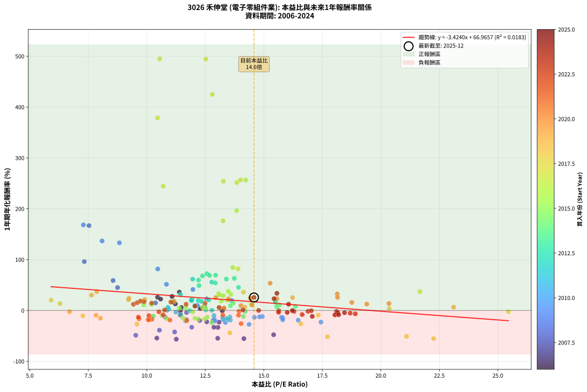

# 3026 禾伸堂 - 本益比與未來報酬率分析

!!! info "報告資訊"
    - **股票代號**: 3026
    - **公司名稱**: 禾伸堂
    - **產業別**: 電子零組件業
    - **分析期間**: 2006-2024 (228 個數據點)
    - **資料來源**: Type 12 (ShowMonthlyK_ChartFlow) 月收盤價與本益比
    - **報酬率口徑**: 含現金股利 (簡化: 年度合計，假設每年7/1入帳)
    - **報告生成時間**: 2026-01-10 20:56:06 CST

## 📈 視覺化圖表

### 圖表1: 本益比 vs 未來報酬率關係

*圖表1：3026 禾伸堂 本益比與1年期未來報酬率關係 (2006-2024)*

### 圖表2: 歷年買入時點的1年期實際報酬率

*圖表2：3026 禾伸堂 歷年買入時點的1年期實際報酬率 (2006-2024)*

## 📍 買點訊號說明

本報告提供兩種買點提示訊號（顯示於圖表2的股價子圖中）：

### ▲ 小綠色三角形（回測驗證）
- **計算方式**: 使用全部歷史資料計算本益比第25百分位數
- **用途**: 事後驗證，顯示歷史上哪些時點確實為低估區
- **限制**: 當下無法判斷，僅供回測參考
- **特性**: 後見之明（Look-Ahead Bias）

### ▲ 小橘色三角形（即時訊號）
- **計算方式**: 使用截至當月的過去5年資料計算本益比第25百分位數
- **用途**: 實際投資決策，當時即可判斷
- **優勢**: 可操作性強，符合實務需求
- **特性**: 無後見之明，滾動窗口計算

!!! tip "如何使用兩種訊號"
    - **綠色▲** 幫助理解歷史估值機會，驗證策略有效性
    - **橘色▲** 可作為實際買進參考，但仍需搭配基本面分析
    - 兩種訊號重疊時，表示即時判斷與事後驗證一致，信心度較高
    - 僅有綠色▲時，表示當時無法判斷（需要未來資料才能確認）
    - 僅有橘色▲時，表示即時判斷為買點，但事後可能不是最佳時機

## 📊 估值分析摘要

| 指標 | 數值 |
|:---:|:---:|
| **目前本益比** (2024-12) | **14.58 倍** |
| **歷史平均本益比** | 13.02 倍 |
| **估值水準** | 🟡 合理範圍 |
| **預期1年年化報酬率** | **+17.04%** |
| **歷史平均報酬率** | +22.40% |
| **相關係數 (R²)** | 0.0183 |
| **趨勢線斜率** | -3.4240 |

!!! abstract "核心洞察"
    目前本益比接近歷史平均，預期報酬率符合長期趨勢

    根據歷史數據回測，3026 禾伸堂 在目前本益比 **14.6倍** 的估值水準下，
    預期未來1年年化報酬率約為 **+17.0%**。

    **重要提醒**: 本分析基於歷史數據統計，實際報酬率會受到公司基本面變化、產業趨勢、
    總體經濟環境等多重因素影響。R² = 0.02 表示本益比可解釋約 1.8% 的報酬率變異。

## 📈 歷史估值統計

### 最佳買點 (最高報酬率)

| 項目 | 數值 |
|:---:|:---:|
| 起始時間 | 2017-07 |
| 當時本益比 | 10.55 倍 |
| 起始價格 | 37.0 元 |
| 1年後價格 | 214.5 元 |
| **1年年化報酬率** | **+494.78%** |

### 最差買點 (最低報酬率)

| 項目 | 數值 |
|:---:|:---:|
| 起始時間 | 2007-11 |
| 當時本益比 | 11.26 倍 |
| 起始價格 | 50.4 元 |
| 1年後價格 | 18.9 元 |
| **1年年化報酬率** | **-56.51%** |

## 🎯 投資啟示

### 本益比與報酬率關係

趨勢線方程式: **y = -3.4240x + 66.9657**

!!! warning "強負相關"
    本益比與未來報酬率呈現強負相關。在高本益比時期買入，未來報酬率顯著較低；
    在低本益比時期買入，未來報酬率顯著較高。**估值紀律至關重要**。

### 估值區間建議

基於歷史數據分析:

- **🟢 低估區** (P/E < 10.4): 預期報酬率較高，可考慮增加持股
- **🟡 合理區** (P/E 10.4-15.6): 預期報酬率符合長期趨勢，正常持有
- **🔴 高估區** (P/E > 15.6): 預期報酬率較低，可考慮減碼或觀望

!!! danger "風險提示"
    - 過去表現不代表未來結果
    - 本分析假設公司基本面無重大結構性變化
    - 產業環境劇變可能使歷史規律失效
    - 應結合公司財報、產業趨勢、總體經濟等多重因素綜合判斷

!!! success "長期投資觀點"
    歷史數據顯示，在合理或低估的估值水準買入並長期持有，
    往往能獲得較佳的投資報酬。**耐心等待好價格**是價值投資的核心原則。

## 📊 數據品質

- **資料來源**: GoodInfo.tw Type 12 (ShowMonthlyK_ChartFlow)
- **資料頻率**: 月度收盤價與本益比
- **回測期間**: 2006-2024
- **數據點數量**: 228 個 (每個點代表一次1年期回測)

### 計算方法說明

1. **1年期年化報酬率**:
   - 對每個歷史時點，計算其後1年的實際投資報酬率
   - 期末價值(不含股利): 期末價格
   - 期末價值(含現金股利): 期末價格 + 持有期間內的現金股利合計 (簡化: 年度合計，假設每年7/1入帳)
   - 公式: 年化報酬率 = [(期末價值/期初價格)^(1/年數) - 1] × 100%

2. **本益比 (P/E Ratio)**:
   - 使用當時的月收盤價與EPS計算
   - 資料來源: Type 12 月度河流圖本益比數據

3. **趨勢線 (Linear Regression)**:
   - 使用最小平方法擬合線性趨勢線
   - R²值衡量本益比對報酬率的解釋能力

---

*本報告由 Stock Analysis System v1.9.0 自動生成*
*數據更新時間: 2026-01-10 20:56:06 CST*

## 📋 月度回測明細表

（每一列對應時間線圖中的一個買入點；可用來對照 SVG 圖上的每個點。）

| 買入月份 | 賣出月份 | 回測期限_年 | 實際持有年數 | 買入本益比_倍 | 買入收盤價_元 | 賣出收盤價_元 | 現金股利合計_元 | 總報酬率_pct | 年化報酬率_pct |
| --- | --- | --- | --- | --- | --- | --- | --- | --- | --- |
| 2006-01 | 2007-01 | 1 | 0.999 | 11.48 | 54.40 | 55.00 | 2.55 | +5.78 | +5.79 |
| 2006-02 | 2007-02 | 1 | 0.999 | 11.22 | 53.20 | 57.50 | 2.55 | +12.87 | +12.88 |
| 2006-03 | 2007-03 | 1 | 0.999 | 12.47 | 59.10 | 61.10 | 2.55 | +7.69 | +7.70 |
| 2006-04 | 2007-04 | 1 | 0.999 | 13.23 | 62.70 | 59.60 | 2.55 | -0.88 | -0.88 |
| 2006-05 | 2007-05 | 1 | 0.999 | 12.28 | 58.20 | 58.00 | 2.55 | +4.03 | +4.03 |
| 2006-06 | 2007-06 | 1 | 0.999 | 10.46 | 49.60 | 59.90 | 2.55 | +25.90 | +25.92 |
| 2006-07 | 2007-07 | 1 | 0.999 | 11.39 | 54.00 | 70.50 | 2.94 | +36.00 | +36.03 |
| 2006-08 | 2007-08 | 1 | 0.999 | 10.59 | 50.20 | 58.50 | 2.94 | +22.39 | +22.41 |
| 2006-09 | 2007-09 | 1 | 0.999 | 11.08 | 52.50 | 64.00 | 2.94 | +27.51 | +27.53 |
| 2006-10 | 2007-10 | 1 | 0.999 | 11.14 | 52.80 | 58.60 | 2.94 | +16.56 | +16.57 |
| 2006-11 | 2007-11 | 1 | 0.999 | 11.43 | 54.20 | 50.40 | 2.94 | -1.58 | -1.58 |
| 2006-12 | 2007-12 | 1 | 0.999 | 11.43 | 54.20 | 46.40 | 2.94 | -8.96 | -8.97 |
| 2007-01 | 2008-01 | 1 | 0.999 | 11.66 | 55.00 | 40.80 | 2.94 | -20.47 | -20.48 |
| 2007-02 | 2008-02 | 1 | 0.999 | 12.26 | 57.50 | 43.30 | 2.94 | -19.58 | -19.59 |
| 2007-03 | 2008-03 | 1 | 1.002 | 13.09 | 61.10 | 44.10 | 2.94 | -23.01 | -22.97 |
| 2007-04 | 2008-04 | 1 | 1.002 | 12.84 | 59.60 | 44.95 | 2.94 | -19.64 | -19.61 |
| 2007-05 | 2008-05 | 1 | 1.002 | 12.56 | 58.00 | 42.10 | 2.94 | -22.34 | -22.30 |
| 2007-06 | 2008-06 | 1 | 1.002 | 13.04 | 59.90 | 37.00 | 2.94 | -33.32 | -33.26 |
| 2007-07 | 2008-07 | 1 | 1.002 | 15.42 | 70.50 | 33.80 | 2.98 | -47.83 | -47.76 |
| 2007-08 | 2008-08 | 1 | 1.002 | 12.87 | 58.50 | 36.15 | 2.98 | -33.11 | -33.06 |
| 2007-09 | 2008-09 | 1 | 1.002 | 14.15 | 64.00 | 25.55 | 2.98 | -55.42 | -55.35 |
| 2007-10 | 2008-10 | 1 | 1.002 | 13.03 | 58.60 | 23.55 | 2.98 | -54.73 | -54.66 |
| 2007-11 | 2008-11 | 1 | 1.002 | 11.26 | 50.40 | 18.90 | 2.98 | -56.59 | -56.51 |
| 2007-12 | 2008-12 | 1 | 1.002 | 10.43 | 46.40 | 18.15 | 2.98 | -54.46 | -54.39 |
| 2008-01 | 2009-01 | 1 | 1.002 | 9.53 | 40.80 | 17.90 | 2.98 | -48.83 | -48.76 |
| 2008-02 | 2009-03 | 1 | 1.081 | 10.54 | 43.30 | 22.50 | 2.98 | -41.16 | -38.76 |
| 2008-03 | 2009-03 | 1 | 0.999 | 11.19 | 44.10 | 22.50 | 2.98 | -42.22 | -42.25 |
| 2008-04 | 2009-04 | 1 | 0.999 | 11.92 | 44.95 | 27.15 | 2.98 | -32.97 | -32.99 |
| 2008-05 | 2009-05 | 1 | 0.999 | 11.69 | 42.10 | 31.60 | 2.98 | -17.86 | -17.88 |
| 2008-06 | 2009-06 | 1 | 0.999 | 10.79 | 37.00 | 29.10 | 2.98 | -13.30 | -13.31 |
| 2008-07 | 2009-07 | 1 | 0.999 | 10.37 | 33.80 | 37.20 | 1.60 | +14.79 | +14.80 |
| 2008-08 | 2009-08 | 1 | 0.999 | 11.70 | 36.15 | 33.10 | 1.60 | -4.01 | -4.01 |
| 2008-09 | 2009-09 | 1 | 0.999 | 8.75 | 25.55 | 35.45 | 1.60 | +45.01 | +45.05 |
| 2008-10 | 2009-10 | 1 | 0.999 | 8.56 | 23.55 | 35.80 | 1.60 | +58.81 | +58.86 |
| 2008-11 | 2009-11 | 1 | 0.999 | 7.33 | 18.90 | 35.45 | 1.60 | +96.03 | +96.12 |
| 2008-12 | 2009-12 | 1 | 0.999 | 7.53 | 18.15 | 46.80 | 1.60 | +166.67 | +166.85 |
| 2009-01 | 2010-01 | 1 | 0.999 | 7.29 | 17.90 | 46.40 | 1.60 | +168.16 | +168.34 |
| 2009-02 | 2010-02 | 1 | 0.999 | 8.09 | 20.25 | 46.30 | 1.60 | +136.54 | +136.68 |
| 2009-03 | 2010-03 | 1 | 0.999 | 8.83 | 22.50 | 50.80 | 1.60 | +132.89 | +133.02 |
| 2009-04 | 2010-04 | 1 | 0.999 | 10.47 | 27.15 | 47.70 | 1.60 | +81.58 | +81.66 |
| 2009-05 | 2010-05 | 1 | 0.999 | 11.97 | 31.60 | 43.05 | 1.60 | +41.30 | +41.33 |
| 2009-06 | 2010-06 | 1 | 0.999 | 10.84 | 29.10 | 42.45 | 1.60 | +51.37 | +51.42 |
| 2009-07 | 2010-07 | 1 | 0.999 | 13.62 | 37.20 | 41.60 | 3.00 | +19.89 | +19.91 |
| 2009-08 | 2010-08 | 1 | 0.999 | 11.92 | 33.10 | 36.50 | 3.00 | +19.34 | +19.35 |
| 2009-09 | 2010-09 | 1 | 0.999 | 12.56 | 35.45 | 40.50 | 3.00 | +22.71 | +22.73 |
| 2009-10 | 2010-10 | 1 | 0.999 | 12.48 | 35.80 | 37.20 | 3.00 | +12.29 | +12.30 |
| 2009-11 | 2010-11 | 1 | 0.999 | 12.16 | 35.45 | 36.00 | 3.00 | +10.01 | +10.02 |
| 2009-12 | 2010-12 | 1 | 0.999 | 15.81 | 46.80 | 37.00 | 3.00 | -14.53 | -14.54 |
| 2010-01 | 2011-01 | 1 | 0.999 | 15.76 | 46.40 | 37.15 | 3.00 | -13.47 | -13.48 |
| 2010-02 | 2011-02 | 1 | 0.999 | 15.81 | 46.30 | 34.80 | 3.00 | -18.36 | -18.37 |
| 2010-03 | 2011-03 | 1 | 0.999 | 17.44 | 50.80 | 36.20 | 3.00 | -22.83 | -22.85 |
| 2010-04 | 2011-04 | 1 | 0.999 | 16.47 | 47.70 | 35.60 | 3.00 | -19.08 | -19.09 |
| 2010-05 | 2011-05 | 1 | 0.999 | 14.94 | 43.05 | 34.90 | 3.00 | -11.96 | -11.97 |
| 2010-06 | 2011-06 | 1 | 0.999 | 14.82 | 42.45 | 34.15 | 3.00 | -12.49 | -12.49 |
| 2010-07 | 2011-07 | 1 | 0.999 | 14.60 | 41.60 | 33.65 | 2.31 | -13.57 | -13.58 |
| 2010-08 | 2011-08 | 1 | 0.999 | 12.88 | 36.50 | 28.20 | 2.31 | -16.42 | -16.43 |
| 2010-09 | 2011-09 | 1 | 0.999 | 14.37 | 40.50 | 27.10 | 2.31 | -27.39 | -27.41 |
| 2010-10 | 2011-10 | 1 | 0.999 | 13.28 | 37.20 | 28.00 | 2.31 | -18.53 | -18.54 |
| 2010-11 | 2011-11 | 1 | 0.999 | 12.92 | 36.00 | 26.20 | 2.31 | -20.82 | -20.83 |
| 2010-12 | 2011-12 | 1 | 0.999 | 13.36 | 37.00 | 25.95 | 2.31 | -23.63 | -23.65 |
| 2011-01 | 2012-01 | 1 | 0.999 | 13.57 | 37.15 | 27.80 | 2.31 | -18.96 | -18.97 |
| 2011-02 | 2012-02 | 1 | 0.999 | 12.87 | 34.80 | 29.00 | 2.31 | -10.04 | -10.05 |
| 2011-03 | 2012-03 | 1 | 1.002 | 13.55 | 36.20 | 29.20 | 2.31 | -12.97 | -12.94 |
| 2011-04 | 2012-04 | 1 | 1.002 | 13.48 | 35.60 | 27.15 | 2.31 | -17.26 | -17.23 |
| 2011-05 | 2012-05 | 1 | 1.002 | 13.38 | 34.90 | 27.10 | 2.31 | -15.74 | -15.71 |
| 2011-06 | 2012-06 | 1 | 1.002 | 13.26 | 34.15 | 26.15 | 2.31 | -16.67 | -16.64 |
| 2011-07 | 2012-07 | 1 | 1.002 | 13.24 | 33.65 | 27.30 | 2.00 | -12.93 | -12.90 |
| 2011-08 | 2012-08 | 1 | 1.002 | 11.24 | 28.20 | 25.30 | 2.00 | -3.19 | -3.19 |
| 2011-09 | 2012-09 | 1 | 1.002 | 10.94 | 27.10 | 25.85 | 2.00 | +2.77 | +2.76 |
| 2011-10 | 2012-10 | 1 | 1.002 | 11.45 | 28.00 | 23.60 | 2.00 | -8.57 | -8.55 |
| 2011-11 | 2012-11 | 1 | 1.002 | 10.86 | 26.20 | 24.30 | 2.00 | +0.38 | +0.38 |
| 2011-12 | 2012-12 | 1 | 1.002 | 10.90 | 25.95 | 25.55 | 2.00 | +6.17 | +6.15 |
| 2012-01 | 2013-01 | 1 | 1.002 | 11.84 | 27.80 | 25.60 | 2.00 | -0.72 | -0.72 |
| 2012-02 | 2013-03 | 1 | 1.081 | 12.52 | 29.00 | 27.30 | 2.00 | +1.03 | +0.96 |
| 2012-03 | 2013-03 | 1 | 0.999 | 12.78 | 29.20 | 27.30 | 2.00 | +0.34 | +0.34 |
| 2012-04 | 2013-04 | 1 | 0.999 | 12.05 | 27.15 | 27.75 | 2.00 | +9.58 | +9.58 |
| 2012-05 | 2013-05 | 1 | 0.999 | 12.20 | 27.10 | 30.40 | 2.00 | +19.56 | +19.57 |
| 2012-06 | 2013-06 | 1 | 0.999 | 11.94 | 26.15 | 29.75 | 2.00 | +21.41 | +21.43 |
| 2012-07 | 2013-07 | 1 | 0.999 | 12.65 | 27.30 | 31.00 | 2.00 | +20.88 | +20.89 |
| 2012-08 | 2013-08 | 1 | 0.999 | 11.90 | 25.30 | 28.40 | 2.00 | +20.16 | +20.17 |
| 2012-09 | 2013-09 | 1 | 0.999 | 12.34 | 25.85 | 28.45 | 2.00 | +17.79 | +17.81 |
| 2012-10 | 2013-10 | 1 | 0.999 | 11.44 | 23.60 | 28.95 | 2.00 | +31.14 | +31.17 |
| 2012-11 | 2013-11 | 1 | 0.999 | 11.96 | 24.30 | 37.25 | 2.00 | +61.52 | +61.58 |
| 2012-12 | 2013-12 | 1 | 0.999 | 12.78 | 25.55 | 37.80 | 2.00 | +55.77 | +55.82 |
| 2013-01 | 2014-01 | 1 | 0.999 | 12.57 | 25.60 | 42.10 | 2.00 | +72.27 | +72.33 |
| 2013-02 | 2014-02 | 1 | 0.999 | 12.68 | 26.30 | 42.40 | 2.00 | +68.82 | +68.88 |
| 2013-03 | 2014-03 | 1 | 0.999 | 12.94 | 27.30 | 44.20 | 2.00 | +69.23 | +69.29 |
| 2013-04 | 2014-04 | 1 | 0.999 | 12.93 | 27.75 | 40.75 | 2.00 | +54.05 | +54.10 |
| 2013-05 | 2014-05 | 1 | 0.999 | 13.92 | 30.40 | 42.20 | 2.00 | +45.39 | +45.43 |
| 2013-06 | 2014-06 | 1 | 0.999 | 13.40 | 29.75 | 46.10 | 2.00 | +61.68 | +61.73 |
| 2013-07 | 2014-07 | 1 | 0.999 | 13.74 | 31.00 | 47.75 | 2.80 | +63.06 | +63.12 |
| 2013-08 | 2014-08 | 1 | 0.999 | 12.38 | 28.40 | 44.90 | 2.80 | +67.96 | +68.02 |
| 2013-09 | 2014-09 | 1 | 0.999 | 12.21 | 28.45 | 42.60 | 2.80 | +59.58 | +59.63 |
| 2013-10 | 2014-10 | 1 | 0.999 | 12.23 | 28.95 | 40.30 | 2.80 | +48.88 | +48.92 |
| 2013-11 | 2014-11 | 1 | 0.999 | 15.50 | 37.25 | 40.30 | 2.80 | +15.70 | +15.72 |
| 2013-12 | 2014-12 | 1 | 0.999 | 15.49 | 37.80 | 41.50 | 2.80 | +17.20 | +17.21 |
| 2014-01 | 2015-01 | 1 | 0.999 | 16.35 | 42.10 | 42.70 | 2.80 | +8.08 | +8.08 |
| 2014-02 | 2015-02 | 1 | 0.999 | 15.66 | 42.40 | 44.10 | 2.80 | +10.61 | +10.62 |
| 2014-03 | 2015-03 | 1 | 0.999 | 15.55 | 44.20 | 44.70 | 2.80 | +7.47 | +7.47 |
| 2014-04 | 2015-04 | 1 | 0.999 | 13.69 | 40.75 | 43.80 | 2.80 | +14.36 | +14.37 |
| 2014-05 | 2015-05 | 1 | 0.999 | 13.57 | 42.20 | 43.35 | 2.80 | +9.36 | +9.37 |
| 2014-06 | 2015-06 | 1 | 0.999 | 14.21 | 46.10 | 42.30 | 2.80 | -2.17 | -2.17 |
| 2014-07 | 2015-07 | 1 | 0.999 | 14.13 | 47.75 | 38.80 | 3.29 | -11.85 | -11.86 |
| 2014-08 | 2015-08 | 1 | 0.999 | 12.78 | 44.90 | 30.90 | 3.29 | -23.85 | -23.87 |
| 2014-09 | 2015-09 | 1 | 0.999 | 11.68 | 42.60 | 30.75 | 3.29 | -20.09 | -20.11 |
| 2014-10 | 2015-10 | 1 | 0.999 | 10.66 | 40.30 | 33.00 | 3.29 | -9.95 | -9.96 |
| 2014-11 | 2015-11 | 1 | 0.999 | 10.29 | 40.30 | 32.50 | 3.29 | -11.19 | -11.20 |
| 2014-12 | 2015-12 | 1 | 0.999 | 10.25 | 41.50 | 33.40 | 3.29 | -11.59 | -11.60 |
| 2015-01 | 2016-01 | 1 | 0.999 | 10.85 | 42.70 | 32.65 | 3.29 | -15.83 | -15.84 |
| 2015-02 | 2016-02 | 1 | 0.999 | 11.54 | 44.10 | 34.30 | 3.29 | -14.76 | -14.77 |
| 2015-03 | 2016-03 | 1 | 1.002 | 12.06 | 44.70 | 34.50 | 3.29 | -15.46 | -15.43 |
| 2015-04 | 2016-04 | 1 | 1.002 | 12.20 | 43.80 | 33.10 | 3.29 | -16.92 | -16.89 |
| 2015-05 | 2016-05 | 1 | 1.002 | 12.47 | 43.35 | 32.80 | 3.29 | -16.75 | -16.72 |
| 2015-06 | 2016-06 | 1 | 1.002 | 12.59 | 42.30 | 33.50 | 3.29 | -13.03 | -13.00 |
| 2015-07 | 2016-07 | 1 | 1.002 | 11.96 | 38.80 | 35.15 | 2.50 | -2.96 | -2.96 |
| 2015-08 | 2016-08 | 1 | 1.002 | 9.87 | 30.90 | 31.80 | 2.50 | +11.00 | +10.98 |
| 2015-09 | 2016-09 | 1 | 1.002 | 10.20 | 30.75 | 31.85 | 2.50 | +11.71 | +11.68 |
| 2015-10 | 2016-10 | 1 | 1.002 | 11.38 | 33.00 | 31.85 | 2.50 | +4.09 | +4.08 |
| 2015-11 | 2016-11 | 1 | 1.002 | 11.67 | 32.50 | 31.75 | 2.50 | +5.38 | +5.37 |
| 2015-12 | 2016-12 | 1 | 1.002 | 12.51 | 33.40 | 32.15 | 2.50 | +3.74 | +3.73 |
| 2016-01 | 2017-01 | 1 | 1.002 | 12.39 | 32.65 | 32.35 | 2.50 | +6.74 | +6.72 |
| 2016-02 | 2017-03 | 1 | 1.081 | 13.18 | 34.30 | 38.70 | 2.50 | +20.12 | +18.47 |
| 2016-03 | 2017-03 | 1 | 0.999 | 13.44 | 34.50 | 38.70 | 2.50 | +19.42 | +19.43 |
| 2016-04 | 2017-04 | 1 | 0.999 | 13.07 | 33.10 | 41.65 | 2.50 | +33.38 | +33.41 |
| 2016-05 | 2017-05 | 1 | 0.999 | 13.12 | 32.80 | 40.35 | 2.50 | +30.64 | +30.66 |
| 2016-06 | 2017-06 | 1 | 0.999 | 13.59 | 33.50 | 41.70 | 2.50 | +31.94 | +31.97 |
| 2016-07 | 2017-07 | 1 | 0.999 | 14.46 | 35.15 | 37.00 | 2.50 | +12.38 | +12.38 |
| 2016-08 | 2017-08 | 1 | 0.999 | 13.27 | 31.80 | 38.55 | 2.50 | +29.09 | +29.11 |
| 2016-09 | 2017-09 | 1 | 0.999 | 13.48 | 31.85 | 41.35 | 2.50 | +37.68 | +37.71 |
| 2016-10 | 2017-10 | 1 | 0.999 | 13.68 | 31.85 | 56.20 | 2.50 | +84.30 | +84.38 |
| 2016-11 | 2017-11 | 1 | 0.999 | 13.84 | 31.75 | 91.50 | 2.50 | +196.06 | +196.28 |
| 2016-12 | 2017-12 | 1 | 0.999 | 14.23 | 32.15 | 112.00 | 2.50 | +256.14 | +256.45 |
| 2017-01 | 2018-01 | 1 | 0.999 | 13.27 | 32.35 | 112.00 | 2.50 | +253.94 | +254.25 |
| 2017-02 | 2018-02 | 1 | 0.999 | 13.26 | 34.70 | 93.30 | 2.50 | +176.08 | +176.27 |
| 2017-03 | 2018-03 | 1 | 0.999 | 13.85 | 38.70 | 133.50 | 2.50 | +251.42 | +251.72 |
| 2017-04 | 2018-04 | 1 | 0.999 | 14.01 | 41.65 | 146.00 | 2.50 | +256.54 | +256.85 |
| 2017-05 | 2018-05 | 1 | 0.999 | 12.80 | 40.35 | 209.00 | 2.50 | +424.16 | +424.76 |
| 2017-06 | 2018-06 | 1 | 0.999 | 12.52 | 41.70 | 245.00 | 2.50 | +493.53 | +494.25 |
| 2017-07 | 2018-07 | 1 | 0.999 | 10.55 | 37.00 | 214.50 | 5.30 | +494.05 | +494.78 |
| 2017-08 | 2018-08 | 1 | 0.999 | 10.46 | 38.55 | 179.00 | 5.30 | +378.08 | +378.59 |
| 2017-09 | 2018-09 | 1 | 0.999 | 10.70 | 41.35 | 137.00 | 5.30 | +244.14 | +244.43 |
| 2017-10 | 2018-10 | 1 | 0.999 | 13.90 | 56.20 | 96.90 | 5.30 | +81.85 | +81.93 |
| 2017-11 | 2018-11 | 1 | 0.999 | 21.67 | 91.50 | 120.00 | 5.30 | +36.94 | +36.97 |
| 2017-12 | 2018-12 | 1 | 0.999 | 25.45 | 112.00 | 104.00 | 5.30 | -2.41 | -2.41 |
| 2018-01 | 2019-01 | 1 | 0.999 | 20.36 | 112.00 | 111.00 | 5.30 | +3.84 | +3.84 |
| 2018-02 | 2019-02 | 1 | 0.999 | 14.13 | 93.30 | 121.50 | 5.30 | +35.91 | +35.93 |
| 2018-03 | 2019-03 | 1 | 0.999 | 17.33 | 133.50 | 116.00 | 5.30 | -9.14 | -9.14 |
| 2018-04 | 2019-04 | 1 | 0.999 | 16.58 | 146.00 | 102.50 | 5.30 | -26.16 | -26.18 |
| 2018-05 | 2019-05 | 1 | 0.999 | 21.10 | 209.00 | 97.20 | 5.30 | -50.96 | -50.98 |
| 2018-06 | 2019-06 | 1 | 0.999 | 22.26 | 245.00 | 104.50 | 5.30 | -55.18 | -55.21 |
| 2018-07 | 2019-07 | 1 | 0.999 | 17.72 | 214.50 | 94.70 | 9.00 | -51.66 | -51.68 |
| 2018-08 | 2019-08 | 1 | 0.999 | 13.55 | 179.00 | 91.30 | 9.00 | -43.97 | -43.99 |
| 2018-09 | 2019-09 | 1 | 0.999 | 9.58 | 137.00 | 91.20 | 9.00 | -26.86 | -26.88 |
| 2018-10 | 2019-10 | 1 | 0.999 | 6.29 | 96.90 | 101.00 | 9.00 | +13.52 | +13.53 |
| 2018-11 | 2019-11 | 1 | 0.999 | 7.27 | 120.00 | 98.50 | 9.00 | -10.42 | -10.42 |
| 2018-12 | 2019-12 | 1 | 0.999 | 5.91 | 104.00 | 116.00 | 9.00 | +20.19 | +20.21 |
| 2019-01 | 2020-01 | 1 | 0.999 | 6.70 | 111.00 | 99.30 | 9.00 | -2.43 | -2.43 |
| 2019-02 | 2020-02 | 1 | 0.999 | 7.83 | 121.50 | 101.00 | 9.00 | -9.47 | -9.47 |
| 2019-03 | 2020-03 | 1 | 1.002 | 8.02 | 116.00 | 89.20 | 9.00 | -15.34 | -15.32 |
| 2019-04 | 2020-04 | 1 | 1.002 | 7.64 | 102.50 | 124.50 | 9.00 | +30.24 | +30.17 |
| 2019-05 | 2020-05 | 1 | 1.002 | 7.86 | 97.20 | 124.00 | 9.00 | +36.83 | +36.74 |
| 2019-06 | 2020-06 | 1 | 1.002 | 9.24 | 104.50 | 121.00 | 9.00 | +24.40 | +24.35 |
| 2019-07 | 2020-07 | 1 | 1.002 | 9.22 | 94.70 | 108.00 | 7.00 | +21.44 | +21.39 |
| 2019-08 | 2020-08 | 1 | 1.002 | 9.91 | 91.30 | 104.00 | 7.00 | +21.58 | +21.53 |
| 2019-09 | 2020-09 | 1 | 1.002 | 11.17 | 91.20 | 101.00 | 7.00 | +18.42 | +18.38 |
| 2019-10 | 2020-10 | 1 | 1.002 | 14.19 | 101.00 | 100.50 | 7.00 | +6.44 | +6.42 |
| 2019-11 | 2020-11 | 1 | 1.002 | 16.23 | 98.50 | 116.50 | 7.00 | +25.38 | +25.32 |
| 2019-12 | 2020-12 | 1 | 1.002 | 23.11 | 116.00 | 116.50 | 7.00 | +6.47 | +6.45 |
| 2020-01 | 2021-01 | 1 | 1.002 | 18.76 | 99.30 | 108.00 | 7.00 | +15.81 | +15.78 |
| 2020-02 | 2021-03 | 1 | 1.081 | 18.14 | 101.00 | 130.00 | 7.00 | +35.64 | +32.56 |
| 2020-03 | 2021-03 | 1 | 0.999 | 15.27 | 89.20 | 130.00 | 7.00 | +53.59 | +53.63 |
| 2020-04 | 2021-04 | 1 | 0.999 | 20.35 | 124.50 | 134.50 | 7.00 | +13.65 | +13.66 |
| 2020-05 | 2021-05 | 1 | 0.999 | 19.40 | 124.00 | 132.50 | 7.00 | +12.50 | +12.51 |
| 2020-06 | 2021-06 | 1 | 0.999 | 18.15 | 121.00 | 145.00 | 7.00 | +25.62 | +25.64 |
| 2020-07 | 2021-07 | 1 | 0.999 | 15.56 | 108.00 | 125.00 | 8.00 | +23.15 | +23.17 |
| 2020-08 | 2021-08 | 1 | 0.999 | 14.42 | 104.00 | 121.00 | 8.00 | +24.04 | +24.06 |
| 2020-09 | 2021-09 | 1 | 0.999 | 13.49 | 101.00 | 116.00 | 8.00 | +22.77 | +22.79 |
| 2020-10 | 2021-10 | 1 | 0.999 | 12.95 | 100.50 | 118.00 | 8.00 | +25.37 | +25.39 |
| 2020-11 | 2021-11 | 1 | 0.999 | 14.50 | 116.50 | 121.00 | 8.00 | +10.73 | +10.74 |
| 2020-12 | 2021-12 | 1 | 0.999 | 14.02 | 116.50 | 119.50 | 8.00 | +9.44 | +9.45 |
| 2021-01 | 2022-01 | 1 | 0.999 | 12.49 | 108.00 | 115.50 | 8.00 | +14.35 | +14.36 |
| 2021-02 | 2022-02 | 1 | 0.999 | 13.30 | 119.50 | 117.00 | 8.00 | +4.60 | +4.61 |
| 2021-03 | 2022-03 | 1 | 0.999 | 13.94 | 130.00 | 120.00 | 8.00 | -1.54 | -1.54 |
| 2021-04 | 2022-04 | 1 | 0.999 | 13.92 | 134.50 | 114.00 | 8.00 | -9.29 | -9.30 |
| 2021-05 | 2022-05 | 1 | 0.999 | 13.25 | 132.50 | 112.50 | 8.00 | -9.06 | -9.06 |
| 2021-06 | 2022-06 | 1 | 0.999 | 14.03 | 145.00 | 99.50 | 8.00 | -25.86 | -25.88 |
| 2021-07 | 2022-07 | 1 | 0.999 | 11.71 | 125.00 | 91.40 | 9.00 | -19.68 | -19.69 |
| 2021-08 | 2022-08 | 1 | 0.999 | 10.99 | 121.00 | 89.30 | 9.00 | -18.76 | -18.77 |
| 2021-09 | 2022-09 | 1 | 0.999 | 10.22 | 116.00 | 86.90 | 9.00 | -17.33 | -17.34 |
| 2021-10 | 2022-10 | 1 | 0.999 | 10.10 | 118.00 | 87.30 | 9.00 | -18.39 | -18.40 |
| 2021-11 | 2022-11 | 1 | 0.999 | 10.06 | 121.00 | 90.10 | 9.00 | -18.10 | -18.11 |
| 2021-12 | 2022-12 | 1 | 0.999 | 9.67 | 119.50 | 91.00 | 9.00 | -16.32 | -16.33 |
| 2022-01 | 2023-01 | 1 | 0.999 | 9.64 | 115.50 | 91.30 | 9.00 | -13.16 | -13.17 |
| 2022-02 | 2023-02 | 1 | 0.999 | 10.09 | 117.00 | 96.20 | 9.00 | -10.09 | -10.09 |
| 2022-03 | 2023-03 | 1 | 0.999 | 10.70 | 120.00 | 100.50 | 9.00 | -8.75 | -8.76 |
| 2022-04 | 2023-04 | 1 | 0.999 | 10.52 | 114.00 | 102.00 | 9.00 | -2.63 | -2.63 |
| 2022-05 | 2023-05 | 1 | 0.999 | 10.76 | 112.50 | 104.50 | 9.00 | +0.89 | +0.89 |
| 2022-06 | 2023-06 | 1 | 0.999 | 9.88 | 99.50 | 107.50 | 9.00 | +17.09 | +17.10 |
| 2022-07 | 2023-07 | 1 | 0.999 | 9.43 | 91.40 | 97.50 | 5.00 | +12.14 | +12.15 |
| 2022-08 | 2023-08 | 1 | 0.999 | 9.59 | 89.30 | 98.00 | 5.00 | +15.34 | +15.35 |
| 2022-09 | 2023-09 | 1 | 0.999 | 9.73 | 86.90 | 97.90 | 5.00 | +18.41 | +18.43 |
| 2022-10 | 2023-10 | 1 | 0.999 | 10.21 | 87.30 | 94.90 | 5.00 | +14.43 | +14.44 |
| 2022-11 | 2023-11 | 1 | 0.999 | 11.03 | 90.10 | 100.00 | 5.00 | +16.54 | +16.55 |
| 2022-12 | 2023-12 | 1 | 0.999 | 11.68 | 91.00 | 97.00 | 5.00 | +12.09 | +12.10 |
| 2023-01 | 2024-01 | 1 | 0.999 | 12.06 | 91.30 | 94.00 | 5.00 | +8.43 | +8.44 |
| 2023-02 | 2024-02 | 1 | 0.999 | 13.09 | 96.20 | 96.90 | 5.00 | +5.93 | +5.93 |
| 2023-03 | 2024-03 | 1 | 1.002 | 14.11 | 100.50 | 96.50 | 5.00 | +1.00 | +0.99 |
| 2023-04 | 2024-04 | 1 | 1.002 | 14.78 | 102.00 | 97.00 | 5.00 | +0.00 | +0.00 |
| 2023-05 | 2024-05 | 1 | 1.002 | 15.64 | 104.50 | 99.00 | 5.00 | -0.48 | -0.48 |
| 2023-06 | 2024-06 | 1 | 1.002 | 16.64 | 107.50 | 93.90 | 5.00 | -8.00 | -7.98 |
| 2023-07 | 2024-07 | 1 | 1.002 | 15.63 | 97.50 | 89.00 | 5.00 | -3.59 | -3.58 |
| 2023-08 | 2024-08 | 1 | 1.002 | 16.29 | 98.00 | 91.20 | 5.00 | -1.84 | -1.83 |
| 2023-09 | 2024-09 | 1 | 1.002 | 16.89 | 97.90 | 91.30 | 5.00 | -1.63 | -1.63 |
| 2023-10 | 2024-10 | 1 | 1.002 | 17.03 | 94.90 | 89.40 | 5.00 | -0.53 | -0.53 |
| 2023-11 | 2024-11 | 1 | 1.002 | 18.69 | 100.00 | 89.70 | 5.00 | -5.30 | -5.29 |
| 2023-12 | 2024-12 | 1 | 1.002 | 18.91 | 97.00 | 85.60 | 5.00 | -6.60 | -6.58 |
| 2024-01 | 2025-01 | 1 | 1.002 | 18.11 | 94.00 | 87.10 | 5.00 | -2.02 | -2.02 |
| 2024-02 | 2025-03 | 1 | 1.081 | 18.45 | 96.90 | 87.30 | 5.00 | -4.75 | -4.40 |
| 2024-03 | 2025-03 | 1 | 0.999 | 18.16 | 96.50 | 87.30 | 5.00 | -4.35 | -4.36 |
| 2024-04 | 2025-04 | 1 | 0.999 | 18.04 | 97.00 | 83.50 | 5.00 | -8.76 | -8.77 |
| 2024-05 | 2025-05 | 1 | 0.999 | 18.20 | 99.00 | 85.70 | 5.00 | -8.38 | -8.39 |
| 2024-06 | 2025-06 | 1 | 0.999 | 17.07 | 93.90 | 78.00 | 5.00 | -11.61 | -11.62 |
| 2024-07 | 2025-07 | 1 | 0.999 | 16.00 | 89.00 | 80.10 | 5.50 | -3.82 | -3.82 |
| 2024-08 | 2025-08 | 1 | 0.999 | 16.22 | 91.20 | 85.50 | 5.50 | -0.22 | -0.22 |
| 2024-09 | 2025-09 | 1 | 0.999 | 16.06 | 91.30 | 97.00 | 5.50 | +12.27 | +12.28 |
| 2024-10 | 2025-10 | 1 | 0.999 | 15.56 | 89.40 | 114.00 | 5.50 | +33.67 | +33.70 |
| 2024-11 | 2025-11 | 1 | 0.999 | 15.44 | 89.70 | 105.00 | 5.50 | +23.19 | +23.21 |
| 2024-12 | 2025-12 | 1 | 0.999 | 14.58 | 85.60 | 102.00 | 5.50 | +25.58 | +25.60 |
