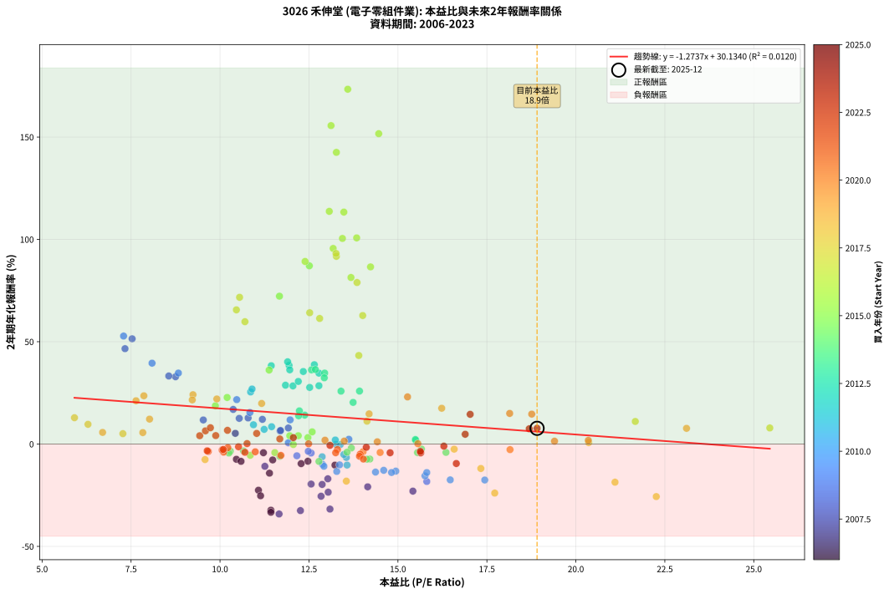

# 3026 禾伸堂 - 本益比與未來報酬率分析

!!! info "報告資訊"
    - **股票代號**: 3026
    - **公司名稱**: 禾伸堂
    - **產業別**: 電子零組件業
    - **分析期間**: 2006-2023 (216 個數據點)
    - **資料來源**: Type 12 (ShowMonthlyK_ChartFlow) 月收盤價與本益比
    - **報酬率口徑**: 含現金股利 (簡化: 年度合計，假設每年7/1入帳)
    - **報告生成時間**: 2026-01-04 08:19:00 CST

## 📈 視覺化圖表

### 圖表1: 本益比 vs 未來報酬率關係

*圖表1：3026 禾伸堂 本益比與2年期未來報酬率關係 (2006-2023)*

### 圖表2: 歷年買入時點的2年期實際報酬率

*圖表2：3026 禾伸堂 歷年買入時點的2年期實際報酬率 (2006-2023)*

## 📍 買點訊號說明

本報告提供兩種買點提示訊號（顯示於圖表2的股價子圖中）：

### ▲ 小綠色三角形（回測驗證）
- **計算方式**: 使用全部歷史資料計算本益比第25百分位數
- **用途**: 事後驗證，顯示歷史上哪些時點確實為低估區
- **限制**: 當下無法判斷，僅供回測參考
- **特性**: 後見之明（Look-Ahead Bias）

### ▲ 小橘色三角形（即時訊號）
- **計算方式**: 使用截至當月的過去5年資料計算本益比第25百分位數
- **用途**: 實際投資決策，當時即可判斷
- **優勢**: 可操作性強，符合實務需求
- **特性**: 無後見之明，滾動窗口計算

!!! tip "如何使用兩種訊號"
    - **綠色▲** 幫助理解歷史估值機會，驗證策略有效性
    - **橘色▲** 可作為實際買進參考，但仍需搭配基本面分析
    - 兩種訊號重疊時，表示即時判斷與事後驗證一致，信心度較高
    - 僅有綠色▲時，表示當時無法判斷（需要未來資料才能確認）
    - 僅有橘色▲時，表示即時判斷為買點，但事後可能不是最佳時機

## 📊 估值分析摘要

| 指標 | 數值 |
|:---:|:---:|
| **目前本益比** (2023-12) | **18.91 倍** |
| **歷史平均本益比** | 12.80 倍 |
| **估值水準** | 🔴 相對高估 |
| **預期2年年化報酬率** | **+6.05%** |
| **歷史平均報酬率** | +13.82% |
| **相關係數 (R²)** | 0.0120 |
| **趨勢線斜率** | -1.2737 |

!!! abstract "核心洞察"
    目前本益比顯著高於歷史平均，預期未來報酬率可能較低

    根據歷史數據回測，3026 禾伸堂 在目前本益比 **18.9倍** 的估值水準下，
    預期未來2年年化報酬率約為 **+6.0%**。

    **重要提醒**: 本分析基於歷史數據統計，實際報酬率會受到公司基本面變化、產業趨勢、
    總體經濟環境等多重因素影響。R² = 0.01 表示本益比可解釋約 1.2% 的報酬率變異。

## 📈 歷史估值統計

### 最佳買點 (最高報酬率)

| 項目 | 數值 |
|:---:|:---:|
| 起始時間 | 2016-06 |
| 當時本益比 | 13.59 倍 |
| 起始價格 | 33.5 元 |
| 2年後價格 | 245.0 元 |
| **2年年化報酬率** | **+173.37%** |

### 最差買點 (最低報酬率)

| 項目 | 數值 |
|:---:|:---:|
| 起始時間 | 2007-01 |
| 當時本益比 | 11.66 倍 |
| 起始價格 | 55.0 元 |
| 2年後價格 | 17.9 元 |
| **2年年化報酬率** | **-34.17%** |

## 🎯 投資啟示

### 本益比與報酬率關係

趨勢線方程式: **y = -1.2737x + 30.1340**

!!! warning "強負相關"
    本益比與未來報酬率呈現強負相關。在高本益比時期買入，未來報酬率顯著較低；
    在低本益比時期買入，未來報酬率顯著較高。**估值紀律至關重要**。

### 估值區間建議

基於歷史數據分析:

- **🟢 低估區** (P/E < 10.2): 預期報酬率較高，可考慮增加持股
- **🟡 合理區** (P/E 10.2-15.4): 預期報酬率符合長期趨勢，正常持有
- **🔴 高估區** (P/E > 15.4): 預期報酬率較低，可考慮減碼或觀望

!!! danger "風險提示"
    - 過去表現不代表未來結果
    - 本分析假設公司基本面無重大結構性變化
    - 產業環境劇變可能使歷史規律失效
    - 應結合公司財報、產業趨勢、總體經濟等多重因素綜合判斷

!!! success "長期投資觀點"
    歷史數據顯示，在合理或低估的估值水準買入並長期持有，
    往往能獲得較佳的投資報酬。**耐心等待好價格**是價值投資的核心原則。

## 📊 數據品質

- **資料來源**: GoodInfo.tw Type 12 (ShowMonthlyK_ChartFlow)
- **資料頻率**: 月度收盤價與本益比
- **回測期間**: 2006-2023
- **數據點數量**: 216 個 (每個點代表一次2年期回測)

### 計算方法說明

1. **2年期年化報酬率**:
   - 對每個歷史時點，計算其後2年的實際投資報酬率
   - 期末價值(不含股利): 期末價格
   - 期末價值(含現金股利): 期末價格 + 持有期間內的現金股利合計 (簡化: 年度合計，假設每年7/1入帳)
   - 公式: 年化報酬率 = [(期末價值/期初價格)^(1/年數) - 1] × 100%

2. **本益比 (P/E Ratio)**:
   - 使用當時的月收盤價與EPS計算
   - 資料來源: Type 12 月度河流圖本益比數據

3. **趨勢線 (Linear Regression)**:
   - 使用最小平方法擬合線性趨勢線
   - R²值衡量本益比對報酬率的解釋能力

---

*本報告由 Stock Analysis System v1.9.0 自動生成*
*數據更新時間: 2026-01-04 08:19:00 CST*

## 📋 月度回測明細表

（每一列對應時間線圖中的一個買入點；可用來對照 SVG 圖上的每個點。）

| 買入月份 | 賣出月份 | 回測期限_年 | 實際持有年數 | 買入本益比_倍 | 買入收盤價_元 | 賣出收盤價_元 | 現金股利合計_元 | 總報酬率_pct | 年化報酬率_pct |
| --- | --- | --- | --- | --- | --- | --- | --- | --- | --- |
| 2006-01 | 2008-01 | 2 | 1.999 | 11.48 | 54.40 | 40.80 | 5.49 | -14.91 | -7.76 |
| 2006-02 | 2008-02 | 2 | 1.999 | 11.22 | 53.20 | 43.30 | 5.49 | -8.29 | -4.24 |
| 2006-03 | 2008-03 | 2 | 2.001 | 12.47 | 59.10 | 44.10 | 5.49 | -16.09 | -8.39 |
| 2006-04 | 2008-04 | 2 | 2.001 | 13.23 | 62.70 | 44.95 | 5.49 | -19.56 | -10.30 |
| 2006-05 | 2008-05 | 2 | 2.001 | 12.28 | 58.20 | 42.10 | 5.49 | -18.23 | -9.57 |
| 2006-06 | 2008-06 | 2 | 2.001 | 10.46 | 49.60 | 37.00 | 5.49 | -14.34 | -7.44 |
| 2006-07 | 2008-07 | 2 | 2.001 | 11.39 | 54.00 | 33.80 | 5.92 | -26.44 | -14.23 |
| 2006-08 | 2008-08 | 2 | 2.001 | 10.59 | 50.20 | 36.15 | 5.92 | -16.19 | -8.45 |
| 2006-09 | 2008-09 | 2 | 2.001 | 11.08 | 52.50 | 25.55 | 5.92 | -40.06 | -22.56 |
| 2006-10 | 2008-10 | 2 | 2.001 | 11.14 | 52.80 | 23.55 | 5.92 | -44.18 | -25.27 |
| 2006-11 | 2008-11 | 2 | 2.001 | 11.43 | 54.20 | 18.90 | 5.92 | -54.20 | -32.31 |
| 2006-12 | 2008-12 | 2 | 2.001 | 11.43 | 54.20 | 18.15 | 5.92 | -55.59 | -33.34 |
| 2007-01 | 2009-01 | 2 | 2.001 | 11.66 | 55.00 | 17.90 | 5.92 | -56.69 | -34.17 |
| 2007-02 | 2009-02 | 2 | 2.001 | 12.26 | 57.50 | 20.25 | 5.92 | -54.49 | -32.52 |
| 2007-03 | 2009-03 | 2 | 2.001 | 13.09 | 61.10 | 22.50 | 5.92 | -53.48 | -31.78 |
| 2007-04 | 2009-04 | 2 | 2.001 | 12.84 | 59.60 | 27.15 | 5.92 | -44.51 | -25.49 |
| 2007-05 | 2009-05 | 2 | 2.001 | 12.56 | 58.00 | 31.60 | 5.92 | -35.31 | -19.56 |
| 2007-06 | 2009-06 | 2 | 2.001 | 13.04 | 59.90 | 29.10 | 5.92 | -41.53 | -23.52 |
| 2007-07 | 2009-07 | 2 | 2.001 | 15.42 | 70.50 | 37.20 | 4.58 | -40.74 | -23.01 |
| 2007-08 | 2009-08 | 2 | 2.001 | 12.87 | 58.50 | 33.10 | 4.58 | -35.59 | -19.73 |
| 2007-09 | 2009-09 | 2 | 2.001 | 14.15 | 64.00 | 35.45 | 4.58 | -37.45 | -20.90 |
| 2007-10 | 2009-10 | 2 | 2.001 | 13.03 | 58.60 | 35.80 | 4.58 | -31.09 | -16.98 |
| 2007-11 | 2009-11 | 2 | 2.001 | 11.26 | 50.40 | 35.45 | 4.58 | -20.58 | -10.87 |
| 2007-12 | 2009-12 | 2 | 2.001 | 10.43 | 46.40 | 46.80 | 4.58 | +10.73 | +5.22 |
| 2008-01 | 2010-01 | 2 | 2.001 | 9.53 | 40.80 | 46.40 | 4.58 | +24.95 | +11.77 |
| 2008-02 | 2010-03 | 2 | 2.081 | 10.54 | 43.30 | 50.80 | 4.58 | +27.90 | +12.55 |
| 2008-03 | 2010-03 | 2 | 1.999 | 11.19 | 44.10 | 50.80 | 4.58 | +25.58 | +12.07 |
| 2008-04 | 2010-04 | 2 | 1.999 | 11.92 | 44.95 | 47.70 | 4.58 | +16.30 | +7.85 |
| 2008-05 | 2010-05 | 2 | 1.999 | 11.69 | 42.10 | 43.05 | 4.58 | +13.13 | +6.37 |
| 2008-06 | 2010-06 | 2 | 1.999 | 10.79 | 37.00 | 42.45 | 4.58 | +27.11 | +12.75 |
| 2008-07 | 2010-07 | 2 | 1.999 | 10.37 | 33.80 | 41.60 | 4.60 | +36.69 | +16.93 |
| 2008-08 | 2010-08 | 2 | 1.999 | 11.70 | 36.15 | 36.50 | 4.60 | +13.69 | +6.63 |
| 2008-09 | 2010-09 | 2 | 1.999 | 8.75 | 25.55 | 40.50 | 4.60 | +76.52 | +32.89 |
| 2008-10 | 2010-10 | 2 | 1.999 | 8.56 | 23.55 | 37.20 | 4.60 | +77.49 | +33.25 |
| 2008-11 | 2010-11 | 2 | 1.999 | 7.33 | 18.90 | 36.00 | 4.60 | +114.81 | +46.60 |
| 2008-12 | 2010-12 | 2 | 1.999 | 7.53 | 18.15 | 37.00 | 4.60 | +129.20 | +51.44 |
| 2009-01 | 2011-01 | 2 | 1.999 | 7.29 | 17.90 | 37.15 | 4.60 | +133.24 | +52.77 |
| 2009-02 | 2011-02 | 2 | 1.999 | 8.09 | 20.25 | 34.80 | 4.60 | +94.57 | +39.52 |
| 2009-03 | 2011-03 | 2 | 1.999 | 8.83 | 22.50 | 36.20 | 4.60 | +81.33 | +34.69 |
| 2009-04 | 2011-04 | 2 | 1.999 | 10.47 | 27.15 | 35.60 | 4.60 | +48.07 | +21.70 |
| 2009-05 | 2011-05 | 2 | 1.999 | 11.97 | 31.60 | 34.90 | 4.60 | +25.00 | +11.81 |
| 2009-06 | 2011-06 | 2 | 1.999 | 10.84 | 29.10 | 34.15 | 4.60 | +33.16 | +15.41 |
| 2009-07 | 2011-07 | 2 | 1.999 | 13.62 | 37.20 | 33.65 | 5.31 | +4.72 | +2.33 |
| 2009-08 | 2011-08 | 2 | 1.999 | 11.92 | 33.10 | 28.20 | 5.31 | +1.23 | +0.61 |
| 2009-09 | 2011-09 | 2 | 1.999 | 12.56 | 35.45 | 27.10 | 5.31 | -8.59 | -4.39 |
| 2009-10 | 2011-10 | 2 | 1.999 | 12.48 | 35.80 | 28.00 | 5.31 | -6.97 | -3.55 |
| 2009-11 | 2011-11 | 2 | 1.999 | 12.16 | 35.45 | 26.20 | 5.31 | -11.13 | -5.73 |
| 2009-12 | 2011-12 | 2 | 1.999 | 15.81 | 46.80 | 25.95 | 5.31 | -33.21 | -18.29 |
| 2010-01 | 2012-01 | 2 | 1.999 | 15.76 | 46.40 | 27.80 | 5.31 | -28.65 | -15.54 |
| 2010-02 | 2012-02 | 2 | 1.999 | 15.81 | 46.30 | 29.00 | 5.31 | -25.90 | -13.93 |
| 2010-03 | 2012-03 | 2 | 2.001 | 17.44 | 50.80 | 29.20 | 5.31 | -32.07 | -17.57 |
| 2010-04 | 2012-04 | 2 | 2.001 | 16.47 | 47.70 | 27.15 | 5.31 | -31.96 | -17.50 |
| 2010-05 | 2012-05 | 2 | 2.001 | 14.94 | 43.05 | 27.10 | 5.31 | -24.72 | -13.23 |
| 2010-06 | 2012-06 | 2 | 2.001 | 14.82 | 42.45 | 26.15 | 5.31 | -25.90 | -13.91 |
| 2010-07 | 2012-07 | 2 | 2.001 | 14.60 | 41.60 | 27.30 | 4.31 | -24.02 | -12.83 |
| 2010-08 | 2012-08 | 2 | 2.001 | 12.88 | 36.50 | 25.30 | 4.31 | -18.89 | -9.93 |
| 2010-09 | 2012-09 | 2 | 2.001 | 14.37 | 40.50 | 25.85 | 4.31 | -25.54 | -13.70 |
| 2010-10 | 2012-10 | 2 | 2.001 | 13.28 | 37.20 | 23.60 | 4.31 | -24.98 | -13.38 |
| 2010-11 | 2012-11 | 2 | 2.001 | 12.92 | 36.00 | 24.30 | 4.31 | -20.54 | -10.85 |
| 2010-12 | 2012-12 | 2 | 2.001 | 13.36 | 37.00 | 25.55 | 4.31 | -19.31 | -10.16 |
| 2011-01 | 2013-01 | 2 | 2.001 | 13.57 | 37.15 | 25.60 | 4.31 | -19.50 | -10.27 |
| 2011-02 | 2013-02 | 2 | 2.001 | 12.87 | 34.80 | 26.30 | 4.31 | -12.05 | -6.22 |
| 2011-03 | 2013-03 | 2 | 2.001 | 13.55 | 36.20 | 27.30 | 4.31 | -12.69 | -6.56 |
| 2011-04 | 2013-04 | 2 | 2.001 | 13.48 | 35.60 | 27.75 | 4.31 | -9.96 | -5.10 |
| 2011-05 | 2013-05 | 2 | 2.001 | 13.38 | 34.90 | 30.40 | 4.31 | -0.56 | -0.28 |
| 2011-06 | 2013-06 | 2 | 2.001 | 13.26 | 34.15 | 29.75 | 4.31 | -0.28 | -0.14 |
| 2011-07 | 2013-07 | 2 | 2.001 | 13.24 | 33.65 | 31.00 | 4.00 | +4.01 | +1.98 |
| 2011-08 | 2013-08 | 2 | 2.001 | 11.24 | 28.20 | 28.40 | 4.00 | +14.89 | +7.18 |
| 2011-09 | 2013-09 | 2 | 2.001 | 10.94 | 27.10 | 28.45 | 4.00 | +19.74 | +9.42 |
| 2011-10 | 2013-10 | 2 | 2.001 | 11.45 | 28.00 | 28.95 | 4.00 | +17.68 | +8.47 |
| 2011-11 | 2013-11 | 2 | 2.001 | 10.86 | 26.20 | 37.25 | 4.00 | +57.44 | +25.46 |
| 2011-12 | 2013-12 | 2 | 2.001 | 10.90 | 25.95 | 37.80 | 4.00 | +61.08 | +26.90 |
| 2012-01 | 2014-01 | 2 | 2.001 | 11.84 | 27.80 | 42.10 | 4.00 | +65.83 | +28.75 |
| 2012-02 | 2014-03 | 2 | 2.081 | 12.52 | 29.00 | 44.20 | 4.00 | +66.21 | +27.66 |
| 2012-03 | 2014-03 | 2 | 1.999 | 12.78 | 29.20 | 44.20 | 4.00 | +65.07 | +28.50 |
| 2012-04 | 2014-04 | 2 | 1.999 | 12.05 | 27.15 | 40.75 | 4.00 | +64.83 | +28.41 |
| 2012-05 | 2014-05 | 2 | 1.999 | 12.20 | 27.10 | 42.20 | 4.00 | +70.48 | +30.59 |
| 2012-06 | 2014-06 | 2 | 1.999 | 11.94 | 26.15 | 46.10 | 4.00 | +91.59 | +38.45 |
| 2012-07 | 2014-07 | 2 | 1.999 | 12.65 | 27.30 | 47.75 | 4.80 | +92.49 | +38.77 |
| 2012-08 | 2014-08 | 2 | 1.999 | 11.90 | 25.30 | 44.90 | 4.80 | +96.44 | +40.19 |
| 2012-09 | 2014-09 | 2 | 1.999 | 12.34 | 25.85 | 42.60 | 4.80 | +83.37 | +35.44 |
| 2012-10 | 2014-10 | 2 | 1.999 | 11.44 | 23.60 | 40.30 | 4.80 | +91.10 | +38.27 |
| 2012-11 | 2014-11 | 2 | 1.999 | 11.96 | 24.30 | 40.30 | 4.80 | +85.60 | +36.26 |
| 2012-12 | 2014-12 | 2 | 1.999 | 12.78 | 25.55 | 41.50 | 4.80 | +81.21 | +34.64 |
| 2013-01 | 2015-01 | 2 | 1.999 | 12.57 | 25.60 | 42.70 | 4.80 | +85.55 | +36.24 |
| 2013-02 | 2015-02 | 2 | 1.999 | 12.68 | 26.30 | 44.10 | 4.80 | +85.93 | +36.39 |
| 2013-03 | 2015-03 | 2 | 1.999 | 12.94 | 27.30 | 44.70 | 4.80 | +81.32 | +34.68 |
| 2013-04 | 2015-04 | 2 | 1.999 | 12.93 | 27.75 | 43.80 | 4.80 | +75.14 | +32.36 |
| 2013-05 | 2015-05 | 2 | 1.999 | 13.92 | 30.40 | 43.35 | 4.80 | +58.39 | +25.87 |
| 2013-06 | 2015-06 | 2 | 1.999 | 13.40 | 29.75 | 42.30 | 4.80 | +58.32 | +25.84 |
| 2013-07 | 2015-07 | 2 | 1.999 | 13.74 | 31.00 | 38.80 | 6.09 | +44.81 | +20.35 |
| 2013-08 | 2015-08 | 2 | 1.999 | 12.38 | 28.40 | 30.90 | 6.09 | +30.25 | +14.14 |
| 2013-09 | 2015-09 | 2 | 1.999 | 12.21 | 28.45 | 30.75 | 6.09 | +29.49 | +13.80 |
| 2013-10 | 2015-10 | 2 | 1.999 | 12.23 | 28.95 | 33.00 | 6.09 | +35.03 | +16.21 |
| 2013-11 | 2015-11 | 2 | 1.999 | 15.50 | 37.25 | 32.50 | 6.09 | +3.60 | +1.78 |
| 2013-12 | 2015-12 | 2 | 1.999 | 15.49 | 37.80 | 33.40 | 6.09 | +4.47 | +2.21 |
| 2014-01 | 2016-01 | 2 | 1.999 | 16.35 | 42.10 | 32.65 | 6.09 | -7.98 | -4.08 |
| 2014-02 | 2016-02 | 2 | 1.999 | 15.66 | 42.40 | 34.30 | 6.09 | -4.74 | -2.40 |
| 2014-03 | 2016-03 | 2 | 2.001 | 15.55 | 44.20 | 34.50 | 6.09 | -8.17 | -4.17 |
| 2014-04 | 2016-04 | 2 | 2.001 | 13.69 | 40.75 | 33.10 | 6.09 | -3.83 | -1.93 |
| 2014-05 | 2016-05 | 2 | 2.001 | 13.57 | 42.20 | 32.80 | 6.09 | -7.84 | -4.00 |
| 2014-06 | 2016-06 | 2 | 2.001 | 14.21 | 46.10 | 33.50 | 6.09 | -14.12 | -7.32 |
| 2014-07 | 2016-07 | 2 | 2.001 | 14.13 | 47.75 | 35.15 | 5.79 | -14.26 | -7.40 |
| 2014-08 | 2016-08 | 2 | 2.001 | 12.78 | 44.90 | 31.80 | 5.79 | -16.28 | -8.50 |
| 2014-09 | 2016-09 | 2 | 2.001 | 11.68 | 42.60 | 31.85 | 5.79 | -11.64 | -6.00 |
| 2014-10 | 2016-10 | 2 | 2.001 | 10.66 | 40.30 | 31.85 | 5.79 | -6.60 | -3.35 |
| 2014-11 | 2016-11 | 2 | 2.001 | 10.29 | 40.30 | 31.75 | 5.79 | -6.85 | -3.48 |
| 2014-12 | 2016-12 | 2 | 2.001 | 10.25 | 41.50 | 32.15 | 5.79 | -8.58 | -4.38 |
| 2015-01 | 2017-01 | 2 | 2.001 | 10.85 | 42.70 | 32.35 | 5.79 | -10.68 | -5.49 |
| 2015-02 | 2017-02 | 2 | 2.001 | 11.54 | 44.10 | 34.70 | 5.79 | -8.19 | -4.18 |
| 2015-03 | 2017-03 | 2 | 2.001 | 12.06 | 44.70 | 38.70 | 5.79 | -0.47 | -0.24 |
| 2015-04 | 2017-04 | 2 | 2.001 | 12.20 | 43.80 | 41.65 | 5.79 | +8.31 | +4.07 |
| 2015-05 | 2017-05 | 2 | 2.001 | 12.47 | 43.35 | 40.35 | 5.79 | +6.44 | +3.17 |
| 2015-06 | 2017-06 | 2 | 2.001 | 12.59 | 42.30 | 41.70 | 5.79 | +12.27 | +5.95 |
| 2015-07 | 2017-07 | 2 | 2.001 | 11.96 | 38.80 | 37.00 | 5.00 | +8.25 | +4.04 |
| 2015-08 | 2017-08 | 2 | 2.001 | 9.87 | 30.90 | 38.55 | 5.00 | +40.94 | +18.70 |
| 2015-09 | 2017-09 | 2 | 2.001 | 10.20 | 30.75 | 41.35 | 5.00 | +50.73 | +22.76 |
| 2015-10 | 2017-10 | 2 | 2.001 | 11.38 | 33.00 | 56.20 | 5.00 | +85.45 | +36.15 |
| 2015-11 | 2017-11 | 2 | 2.001 | 11.67 | 32.50 | 91.50 | 5.00 | +196.92 | +72.25 |
| 2015-12 | 2017-12 | 2 | 2.001 | 12.51 | 33.40 | 112.00 | 5.00 | +250.30 | +87.08 |
| 2016-01 | 2018-01 | 2 | 2.001 | 12.39 | 32.65 | 112.00 | 5.00 | +258.35 | +89.22 |
| 2016-02 | 2018-03 | 2 | 2.081 | 13.18 | 34.30 | 133.50 | 5.00 | +303.79 | +95.58 |
| 2016-03 | 2018-03 | 2 | 1.999 | 13.44 | 34.50 | 133.50 | 5.00 | +301.45 | +100.46 |
| 2016-04 | 2018-04 | 2 | 1.999 | 13.07 | 33.10 | 146.00 | 5.00 | +356.19 | +113.70 |
| 2016-05 | 2018-05 | 2 | 1.999 | 13.12 | 32.80 | 209.00 | 5.00 | +552.44 | +155.59 |
| 2016-06 | 2018-06 | 2 | 1.999 | 13.59 | 33.50 | 245.00 | 5.00 | +646.27 | +173.37 |
| 2016-07 | 2018-07 | 2 | 1.999 | 14.46 | 35.15 | 214.50 | 7.80 | +532.43 | +151.64 |
| 2016-08 | 2018-08 | 2 | 1.999 | 13.27 | 31.80 | 179.00 | 7.80 | +487.42 | +142.51 |
| 2016-09 | 2018-09 | 2 | 1.999 | 13.48 | 31.85 | 137.00 | 7.80 | +354.63 | +113.33 |
| 2016-10 | 2018-10 | 2 | 1.999 | 13.68 | 31.85 | 96.90 | 7.80 | +228.73 | +81.38 |
| 2016-11 | 2018-11 | 2 | 1.999 | 13.84 | 31.75 | 120.00 | 7.80 | +302.52 | +100.72 |
| 2016-12 | 2018-12 | 2 | 1.999 | 14.23 | 32.15 | 104.00 | 7.80 | +247.74 | +86.56 |
| 2017-01 | 2019-01 | 2 | 1.999 | 13.27 | 32.35 | 111.00 | 7.80 | +267.23 | +91.72 |
| 2017-02 | 2019-02 | 2 | 1.999 | 13.26 | 34.70 | 121.50 | 7.80 | +272.62 | +93.12 |
| 2017-03 | 2019-03 | 2 | 1.999 | 13.85 | 38.70 | 116.00 | 7.80 | +219.90 | +78.93 |
| 2017-04 | 2019-04 | 2 | 1.999 | 14.01 | 41.65 | 102.50 | 7.80 | +164.83 | +62.79 |
| 2017-05 | 2019-05 | 2 | 1.999 | 12.80 | 40.35 | 97.20 | 7.80 | +160.22 | +61.37 |
| 2017-06 | 2019-06 | 2 | 1.999 | 12.52 | 41.70 | 104.50 | 7.80 | +169.30 | +64.16 |
| 2017-07 | 2019-07 | 2 | 1.999 | 10.55 | 37.00 | 94.70 | 14.30 | +194.59 | +71.70 |
| 2017-08 | 2019-08 | 2 | 1.999 | 10.46 | 38.55 | 91.30 | 14.30 | +173.93 | +65.57 |
| 2017-09 | 2019-09 | 2 | 1.999 | 10.70 | 41.35 | 91.20 | 14.30 | +155.14 | +59.78 |
| 2017-10 | 2019-10 | 2 | 1.999 | 13.90 | 56.20 | 101.00 | 14.30 | +105.16 | +43.27 |
| 2017-11 | 2019-11 | 2 | 1.999 | 21.67 | 91.50 | 98.50 | 14.30 | +23.28 | +11.04 |
| 2017-12 | 2019-12 | 2 | 1.999 | 25.45 | 112.00 | 116.00 | 14.30 | +16.34 | +7.87 |
| 2018-01 | 2020-01 | 2 | 1.999 | 20.36 | 112.00 | 99.30 | 14.30 | +1.43 | +0.71 |
| 2018-02 | 2020-02 | 2 | 1.999 | 14.13 | 93.30 | 101.00 | 14.30 | +23.58 | +11.17 |
| 2018-03 | 2020-03 | 2 | 2.001 | 17.33 | 133.50 | 89.20 | 14.30 | -22.47 | -11.94 |
| 2018-04 | 2020-04 | 2 | 2.001 | 16.58 | 146.00 | 124.50 | 14.30 | -4.93 | -2.50 |
| 2018-05 | 2020-05 | 2 | 2.001 | 21.10 | 209.00 | 124.00 | 14.30 | -33.83 | -18.64 |
| 2018-06 | 2020-06 | 2 | 2.001 | 22.26 | 245.00 | 121.00 | 14.30 | -44.78 | -25.67 |
| 2018-07 | 2020-07 | 2 | 2.001 | 17.72 | 214.50 | 108.00 | 16.00 | -42.19 | -23.95 |
| 2018-08 | 2020-08 | 2 | 2.001 | 13.55 | 179.00 | 104.00 | 16.00 | -32.96 | -18.11 |
| 2018-09 | 2020-09 | 2 | 2.001 | 9.58 | 137.00 | 101.00 | 16.00 | -14.60 | -7.58 |
| 2018-10 | 2020-10 | 2 | 2.001 | 6.29 | 96.90 | 100.50 | 16.00 | +20.23 | +9.64 |
| 2018-11 | 2020-11 | 2 | 2.001 | 7.27 | 120.00 | 116.50 | 16.00 | +10.42 | +5.08 |
| 2018-12 | 2020-12 | 2 | 2.001 | 5.91 | 104.00 | 116.50 | 16.00 | +27.40 | +12.86 |
| 2019-01 | 2021-01 | 2 | 2.001 | 6.70 | 111.00 | 108.00 | 16.00 | +11.71 | +5.69 |
| 2019-02 | 2021-02 | 2 | 2.001 | 7.83 | 121.50 | 119.50 | 16.00 | +11.52 | +5.60 |
| 2019-03 | 2021-03 | 2 | 2.001 | 8.02 | 116.00 | 130.00 | 16.00 | +25.86 | +12.18 |
| 2019-04 | 2021-04 | 2 | 2.001 | 7.64 | 102.50 | 134.50 | 16.00 | +46.83 | +21.16 |
| 2019-05 | 2021-05 | 2 | 2.001 | 7.86 | 97.20 | 132.50 | 16.00 | +52.78 | +23.59 |
| 2019-06 | 2021-06 | 2 | 2.001 | 9.24 | 104.50 | 145.00 | 16.00 | +54.07 | +24.11 |
| 2019-07 | 2021-07 | 2 | 2.001 | 9.22 | 94.70 | 125.00 | 15.00 | +47.84 | +21.57 |
| 2019-08 | 2021-08 | 2 | 2.001 | 9.91 | 91.30 | 121.00 | 15.00 | +48.96 | +22.03 |
| 2019-09 | 2021-09 | 2 | 2.001 | 11.17 | 91.20 | 116.00 | 15.00 | +43.64 | +19.84 |
| 2019-10 | 2021-10 | 2 | 2.001 | 14.19 | 101.00 | 118.00 | 15.00 | +31.68 | +14.74 |
| 2019-11 | 2021-11 | 2 | 2.001 | 16.23 | 98.50 | 121.00 | 15.00 | +38.07 | +17.49 |
| 2019-12 | 2021-12 | 2 | 2.001 | 23.11 | 116.00 | 119.50 | 15.00 | +15.95 | +7.67 |
| 2020-01 | 2022-01 | 2 | 2.001 | 18.76 | 99.30 | 115.50 | 15.00 | +31.42 | +14.63 |
| 2020-02 | 2022-03 | 2 | 2.081 | 18.14 | 101.00 | 120.00 | 15.00 | +33.66 | +14.96 |
| 2020-03 | 2022-03 | 2 | 1.999 | 15.27 | 89.20 | 120.00 | 15.00 | +51.35 | +23.04 |
| 2020-04 | 2022-04 | 2 | 1.999 | 20.35 | 124.50 | 114.00 | 15.00 | +3.61 | +1.79 |
| 2020-05 | 2022-05 | 2 | 1.999 | 19.40 | 124.00 | 112.50 | 15.00 | +2.82 | +1.40 |
| 2020-06 | 2022-06 | 2 | 1.999 | 18.15 | 121.00 | 99.50 | 15.00 | -5.37 | -2.72 |
| 2020-07 | 2022-07 | 2 | 1.999 | 15.56 | 108.00 | 91.40 | 17.00 | +0.37 | +0.19 |
| 2020-08 | 2022-08 | 2 | 1.999 | 14.42 | 104.00 | 89.30 | 17.00 | +2.21 | +1.10 |
| 2020-09 | 2022-09 | 2 | 1.999 | 13.49 | 101.00 | 86.90 | 17.00 | +2.87 | +1.43 |
| 2020-10 | 2022-10 | 2 | 1.999 | 12.95 | 100.50 | 87.30 | 17.00 | +3.78 | +1.87 |
| 2020-11 | 2022-11 | 2 | 1.999 | 14.50 | 116.50 | 90.10 | 17.00 | -8.07 | -4.12 |
| 2020-12 | 2022-12 | 2 | 1.999 | 14.02 | 116.50 | 91.00 | 17.00 | -7.30 | -3.72 |
| 2021-01 | 2023-01 | 2 | 1.999 | 12.49 | 108.00 | 91.30 | 17.00 | +0.28 | +0.14 |
| 2021-02 | 2023-02 | 2 | 1.999 | 13.30 | 119.50 | 96.20 | 17.00 | -5.27 | -2.67 |
| 2021-03 | 2023-03 | 2 | 1.999 | 13.94 | 130.00 | 100.50 | 17.00 | -9.62 | -4.93 |
| 2021-04 | 2023-04 | 2 | 1.999 | 13.92 | 134.50 | 102.00 | 17.00 | -11.52 | -5.94 |
| 2021-05 | 2023-05 | 2 | 1.999 | 13.25 | 132.50 | 104.50 | 17.00 | -8.30 | -4.24 |
| 2021-06 | 2023-06 | 2 | 1.999 | 14.03 | 145.00 | 107.50 | 17.00 | -14.14 | -7.34 |
| 2021-07 | 2023-07 | 2 | 1.999 | 11.71 | 125.00 | 97.50 | 14.00 | -10.80 | -5.56 |
| 2021-08 | 2023-08 | 2 | 1.999 | 10.99 | 121.00 | 98.00 | 14.00 | -7.44 | -3.79 |
| 2021-09 | 2023-09 | 2 | 1.999 | 10.22 | 116.00 | 97.90 | 14.00 | -3.53 | -1.78 |
| 2021-10 | 2023-10 | 2 | 1.999 | 10.10 | 118.00 | 94.90 | 14.00 | -7.71 | -3.94 |
| 2021-11 | 2023-11 | 2 | 1.999 | 10.06 | 121.00 | 100.00 | 14.00 | -5.79 | -2.94 |
| 2021-12 | 2023-12 | 2 | 1.999 | 9.67 | 119.50 | 97.00 | 14.00 | -7.11 | -3.62 |
| 2022-01 | 2024-01 | 2 | 1.999 | 9.64 | 115.50 | 94.00 | 14.00 | -6.49 | -3.30 |
| 2022-02 | 2024-02 | 2 | 1.999 | 10.09 | 117.00 | 96.90 | 14.00 | -5.21 | -2.64 |
| 2022-03 | 2024-03 | 2 | 2.001 | 10.70 | 120.00 | 96.50 | 14.00 | -7.92 | -4.04 |
| 2022-04 | 2024-04 | 2 | 2.001 | 10.52 | 114.00 | 97.00 | 14.00 | -2.63 | -1.32 |
| 2022-05 | 2024-05 | 2 | 2.001 | 10.76 | 112.50 | 99.00 | 14.00 | +0.44 | +0.22 |
| 2022-06 | 2024-06 | 2 | 2.001 | 9.88 | 99.50 | 93.90 | 14.00 | +8.44 | +4.13 |
| 2022-07 | 2024-07 | 2 | 2.001 | 9.43 | 91.40 | 89.00 | 10.00 | +8.32 | +4.07 |
| 2022-08 | 2024-08 | 2 | 2.001 | 9.59 | 89.30 | 91.20 | 10.00 | +13.33 | +6.45 |
| 2022-09 | 2024-09 | 2 | 2.001 | 9.73 | 86.90 | 91.30 | 10.00 | +16.57 | +7.96 |
| 2022-10 | 2024-10 | 2 | 2.001 | 10.21 | 87.30 | 89.40 | 10.00 | +13.86 | +6.70 |
| 2022-11 | 2024-11 | 2 | 2.001 | 11.03 | 90.10 | 89.70 | 10.00 | +10.65 | +5.19 |
| 2022-12 | 2024-12 | 2 | 2.001 | 11.68 | 91.00 | 85.60 | 10.00 | +5.05 | +2.49 |
| 2023-01 | 2025-01 | 2 | 2.001 | 12.06 | 91.30 | 87.10 | 10.00 | +6.35 | +3.13 |
| 2023-02 | 2025-02 | 2 | 2.001 | 13.09 | 96.20 | 85.00 | 10.00 | -1.25 | -0.63 |
| 2023-03 | 2025-03 | 2 | 2.001 | 14.11 | 100.50 | 87.30 | 10.00 | -3.18 | -1.60 |
| 2023-04 | 2025-04 | 2 | 2.001 | 14.78 | 102.00 | 83.50 | 10.00 | -8.33 | -4.25 |
| 2023-05 | 2025-05 | 2 | 2.001 | 15.64 | 104.50 | 85.70 | 10.00 | -8.42 | -4.30 |
| 2023-06 | 2025-06 | 2 | 2.001 | 16.64 | 107.50 | 78.00 | 10.00 | -18.14 | -9.52 |
| 2023-07 | 2025-07 | 2 | 2.001 | 15.63 | 97.50 | 80.10 | 10.50 | -7.08 | -3.60 |
| 2023-08 | 2025-08 | 2 | 2.001 | 16.29 | 98.00 | 85.50 | 10.50 | -2.04 | -1.02 |
| 2023-09 | 2025-09 | 2 | 2.001 | 16.89 | 97.90 | 97.00 | 10.50 | +9.81 | +4.78 |
| 2023-10 | 2025-10 | 2 | 2.001 | 17.03 | 94.90 | 114.00 | 10.50 | +31.19 | +14.53 |
| 2023-11 | 2025-11 | 2 | 2.001 | 18.69 | 100.00 | 105.00 | 10.50 | +15.50 | +7.47 |
| 2023-12 | 2025-12 | 2 | 2.001 | 18.91 | 97.00 | 102.00 | 10.50 | +15.98 | +7.69 |
