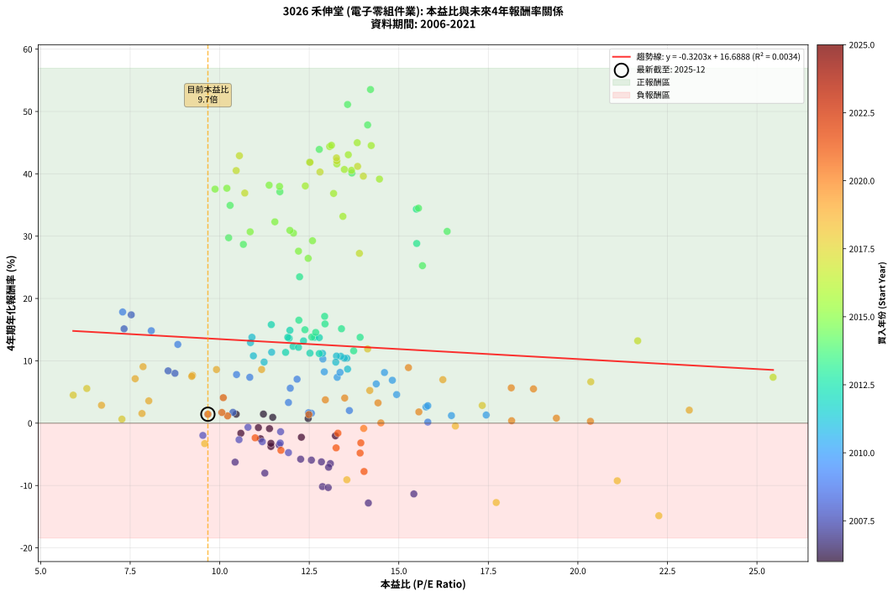
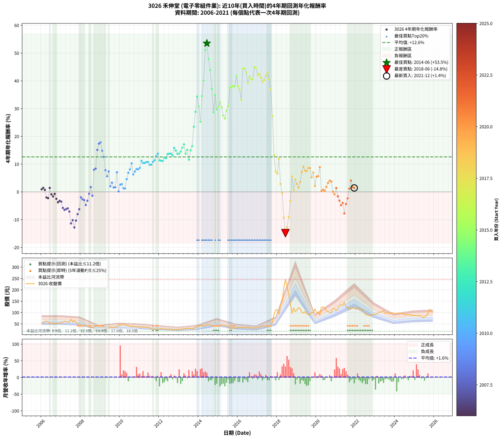

# 3026 禾伸堂 - 本益比與未來報酬率分析

!!! info "報告資訊"
    - **股票代號**: 3026
    - **公司名稱**: 禾伸堂
    - **產業別**: 電子零組件業
    - **分析期間**: 2006-2021 (192 個數據點)
    - **資料來源**: Type 12 (ShowMonthlyK_ChartFlow) 月收盤價與本益比
    - **報酬率口徑**: 含現金股利 (簡化: 年度合計，假設每年7/1入帳)
    - **報告生成時間**: 2026-01-22 23:12:17 CST

## 📈 視覺化圖表

### 圖表1: 本益比 vs 未來報酬率關係

*圖表1：3026 禾伸堂 本益比與4年期未來報酬率關係 (2006-2021)*

### 圖表2: 歷年買入時點的4年期實際報酬率

*圖表2：3026 禾伸堂 歷年買入時點的4年期實際報酬率 (2006-2021)*

## 📍 買點訊號說明

本報告提供兩種買點提示訊號（顯示於圖表2的股價子圖中）：

### ▲ 小綠色三角形（回測驗證）
- **計算方式**: 使用全部歷史資料計算本益比第25百分位數
- **用途**: 事後驗證，顯示歷史上哪些時點確實為低估區
- **限制**: 當下無法判斷，僅供回測參考
- **特性**: 後見之明（Look-Ahead Bias）

### ▲ 小橘色三角形（即時訊號）
- **計算方式**: 使用截至當月的過去5年資料計算本益比第25百分位數
- **用途**: 實際投資決策，當時即可判斷
- **優勢**: 可操作性強，符合實務需求
- **特性**: 無後見之明，滾動窗口計算

!!! tip "如何使用兩種訊號"
    - **綠色▲** 幫助理解歷史估值機會，驗證策略有效性
    - **橘色▲** 可作為實際買進參考，但仍需搭配基本面分析
    - 兩種訊號重疊時，表示即時判斷與事後驗證一致，信心度較高
    - 僅有綠色▲時，表示當時無法判斷（需要未來資料才能確認）
    - 僅有橘色▲時，表示即時判斷為買點，但事後可能不是最佳時機

## 📊 估值分析摘要

| 指標 | 數值 |
|:---:|:---:|
| **目前本益比** (2021-12) | **9.67 倍** |
| **歷史平均本益比** | 12.77 倍 |
| **估值水準** | 🟢 相對低估 |
| **預期4年年化報酬率** | **+13.59%** |
| **歷史平均報酬率** | +12.60% |
| **相關係數 (R²)** | 0.0034 |
| **趨勢線斜率** | -0.3203 |

!!! abstract "核心洞察"
    目前本益比顯著低於歷史平均，預期未來報酬率可能較高

    根據歷史數據回測，3026 禾伸堂 在目前本益比 **9.7倍** 的估值水準下，
    預期未來4年年化報酬率約為 **+13.6%**。

    **重要提醒**: 本分析基於歷史數據統計，實際報酬率會受到公司基本面變化、產業趨勢、
    總體經濟環境等多重因素影響。R² = 0.00 表示本益比可解釋約 0.3% 的報酬率變異。

## 📈 歷史估值統計

### 最佳買點 (最高報酬率)

| 項目 | 數值 |
|:---:|:---:|
| 起始時間 | 2014-06 |
| 當時本益比 | 14.21 倍 |
| 起始價格 | 46.1 元 |
| 4年後價格 | 245.0 元 |
| **4年年化報酬率** | **+53.52%** |

### 最差買點 (最低報酬率)

| 項目 | 數值 |
|:---:|:---:|
| 起始時間 | 2018-06 |
| 當時本益比 | 22.26 倍 |
| 起始價格 | 245.0 元 |
| 4年後價格 | 99.5 元 |
| **4年年化報酬率** | **-14.85%** |

## 🎯 投資啟示

### 本益比與報酬率關係

趨勢線方程式: **y = -0.3203x + 16.6888**

!!! note "負相關"
    本益比與未來報酬率呈現負相關。較低的本益比通常帶來較高的未來報酬率，
    但相關性不算非常強。**估值仍是重要參考指標之一**。

### 估值區間建議

基於歷史數據分析:

- **🟢 低估區** (P/E < 10.2): 預期報酬率較高，可考慮增加持股
- **🟡 合理區** (P/E 10.2-15.3): 預期報酬率符合長期趨勢，正常持有
- **🔴 高估區** (P/E > 15.3): 預期報酬率較低，可考慮減碼或觀望

!!! danger "風險提示"
    - 過去表現不代表未來結果
    - 本分析假設公司基本面無重大結構性變化
    - 產業環境劇變可能使歷史規律失效
    - 應結合公司財報、產業趨勢、總體經濟等多重因素綜合判斷

!!! success "長期投資觀點"
    歷史數據顯示，在合理或低估的估值水準買入並長期持有，
    往往能獲得較佳的投資報酬。**耐心等待好價格**是價值投資的核心原則。

## 📊 數據品質

- **資料來源**: GoodInfo.tw Type 12 (ShowMonthlyK_ChartFlow)
- **資料頻率**: 月度收盤價與本益比
- **回測期間**: 2006-2021
- **數據點數量**: 192 個 (每個點代表一次4年期回測)

### 計算方法說明

1. **4年期年化報酬率**:
   - 對每個歷史時點，計算其後4年的實際投資報酬率
   - 期末價值(不含股利): 期末價格
   - 期末價值(含現金股利): 期末價格 + 持有期間內的現金股利合計 (簡化: 年度合計，假設每年7/1入帳)
   - 公式: 年化報酬率 = [(期末價值/期初價格)^(1/年數) - 1] × 100%

2. **本益比 (P/E Ratio)**:
   - 使用當時的月收盤價與EPS計算
   - 資料來源: Type 12 月度河流圖本益比數據

3. **趨勢線 (Linear Regression)**:
   - 使用最小平方法擬合線性趨勢線
   - R²值衡量本益比對報酬率的解釋能力

---

*本報告由 Stock Analysis System v1.9.0 自動生成*
*數據更新時間: 2026-01-22 23:12:17 CST*

## 📋 月度回測明細表

（每一列對應時間線圖中的一個買入點；可用來對照 SVG 圖上的每個點。）

| 買入月份 | 賣出月份 | 回測期限_年 | 實際持有年數 | 買入本益比_倍 | 買入收盤價_元 | 賣出收盤價_元 | 現金股利合計_元 | 總報酬率_pct | 年化報酬率_pct |
| --- | --- | --- | --- | --- | --- | --- | --- | --- | --- |
| 2006-01 | 2010-01 | 4 | 4.000 | 11.48 | 54.40 | 46.40 | 10.07 | +3.80 | +0.94 |
| 2006-02 | 2010-02 | 4 | 4.000 | 11.22 | 53.20 | 46.30 | 10.07 | +5.95 | +1.46 |
| 2006-03 | 2010-03 | 4 | 4.000 | 12.47 | 59.10 | 50.80 | 10.07 | +2.99 | +0.74 |
| 2006-04 | 2010-04 | 4 | 4.000 | 13.23 | 62.70 | 47.70 | 10.07 | -7.87 | -2.03 |
| 2006-05 | 2010-05 | 4 | 4.000 | 12.28 | 58.20 | 43.05 | 10.07 | -8.73 | -2.26 |
| 2006-06 | 2010-06 | 4 | 4.000 | 10.46 | 49.60 | 42.45 | 10.07 | +5.88 | +1.44 |
| 2006-07 | 2010-07 | 4 | 4.000 | 11.39 | 54.00 | 41.60 | 10.52 | -3.48 | -0.88 |
| 2006-08 | 2010-08 | 4 | 4.000 | 10.59 | 50.20 | 36.50 | 10.52 | -6.33 | -1.62 |
| 2006-09 | 2010-09 | 4 | 4.000 | 11.08 | 52.50 | 40.50 | 10.52 | -2.82 | -0.71 |
| 2006-10 | 2010-10 | 4 | 4.000 | 11.14 | 52.80 | 37.20 | 10.52 | -9.62 | -2.50 |
| 2006-11 | 2010-11 | 4 | 4.000 | 11.43 | 54.20 | 36.00 | 10.52 | -14.17 | -3.75 |
| 2006-12 | 2010-12 | 4 | 4.000 | 11.43 | 54.20 | 37.00 | 10.52 | -12.32 | -3.23 |
| 2007-01 | 2011-01 | 4 | 4.000 | 11.66 | 55.00 | 37.15 | 10.52 | -13.33 | -3.51 |
| 2007-02 | 2011-02 | 4 | 4.000 | 12.26 | 57.50 | 34.80 | 10.52 | -21.18 | -5.78 |
| 2007-03 | 2011-03 | 4 | 4.000 | 13.09 | 61.10 | 36.20 | 10.52 | -23.53 | -6.49 |
| 2007-04 | 2011-04 | 4 | 4.000 | 12.84 | 59.60 | 35.60 | 10.52 | -22.62 | -6.21 |
| 2007-05 | 2011-05 | 4 | 4.000 | 12.56 | 58.00 | 34.90 | 10.52 | -21.69 | -5.93 |
| 2007-06 | 2011-06 | 4 | 4.000 | 13.04 | 59.90 | 34.15 | 10.52 | -25.42 | -7.07 |
| 2007-07 | 2011-07 | 4 | 4.000 | 15.42 | 70.50 | 33.65 | 9.89 | -38.25 | -11.35 |
| 2007-08 | 2011-08 | 4 | 4.000 | 12.87 | 58.50 | 28.20 | 9.89 | -34.90 | -10.17 |
| 2007-09 | 2011-09 | 4 | 4.000 | 14.15 | 64.00 | 27.10 | 9.89 | -42.21 | -12.81 |
| 2007-10 | 2011-10 | 4 | 4.000 | 13.03 | 58.60 | 28.00 | 9.89 | -35.35 | -10.33 |
| 2007-11 | 2011-11 | 4 | 4.000 | 11.26 | 50.40 | 26.20 | 9.89 | -28.40 | -8.01 |
| 2007-12 | 2011-12 | 4 | 4.000 | 10.43 | 46.40 | 25.95 | 9.89 | -22.77 | -6.26 |
| 2008-01 | 2012-01 | 4 | 4.000 | 9.53 | 40.80 | 27.80 | 9.89 | -7.63 | -1.97 |
| 2008-02 | 2012-02 | 4 | 4.000 | 10.54 | 43.30 | 29.00 | 9.89 | -10.20 | -2.65 |
| 2008-03 | 2012-03 | 4 | 4.000 | 11.19 | 44.10 | 29.20 | 9.89 | -11.37 | -2.97 |
| 2008-04 | 2012-04 | 4 | 4.000 | 11.92 | 44.95 | 27.15 | 9.89 | -17.61 | -4.73 |
| 2008-05 | 2012-05 | 4 | 4.000 | 11.69 | 42.10 | 27.10 | 9.89 | -12.15 | -3.19 |
| 2008-06 | 2012-06 | 4 | 4.000 | 10.79 | 37.00 | 26.15 | 9.89 | -2.61 | -0.66 |
| 2008-07 | 2012-07 | 4 | 4.000 | 10.37 | 33.80 | 27.30 | 8.91 | +7.12 | +1.73 |
| 2008-08 | 2012-08 | 4 | 4.000 | 11.70 | 36.15 | 25.30 | 8.91 | -5.38 | -1.37 |
| 2008-09 | 2012-09 | 4 | 4.000 | 8.75 | 25.55 | 25.85 | 8.91 | +36.03 | +8.00 |
| 2008-10 | 2012-10 | 4 | 4.000 | 8.56 | 23.55 | 23.60 | 8.91 | +38.03 | +8.39 |
| 2008-11 | 2012-11 | 4 | 4.000 | 7.33 | 18.90 | 24.30 | 8.91 | +75.69 | +15.13 |
| 2008-12 | 2012-12 | 4 | 4.000 | 7.53 | 18.15 | 25.55 | 8.91 | +89.84 | +17.38 |
| 2009-01 | 2013-01 | 4 | 4.000 | 7.29 | 17.90 | 25.60 | 8.91 | +92.77 | +17.83 |
| 2009-02 | 2013-02 | 4 | 4.000 | 8.09 | 20.25 | 26.30 | 8.91 | +73.86 | +14.83 |
| 2009-03 | 2013-03 | 4 | 4.000 | 8.83 | 22.50 | 27.30 | 8.91 | +60.92 | +12.63 |
| 2009-04 | 2013-04 | 4 | 4.000 | 10.47 | 27.15 | 27.75 | 8.91 | +35.01 | +7.79 |
| 2009-05 | 2013-05 | 4 | 4.000 | 11.97 | 31.60 | 30.40 | 8.91 | +24.39 | +5.61 |
| 2009-06 | 2013-06 | 4 | 4.000 | 10.84 | 29.10 | 29.75 | 8.91 | +32.84 | +7.36 |
| 2009-07 | 2013-07 | 4 | 4.000 | 13.62 | 37.20 | 31.00 | 9.31 | +8.35 | +2.03 |
| 2009-08 | 2013-08 | 4 | 4.000 | 11.92 | 33.10 | 28.40 | 9.31 | +13.92 | +3.31 |
| 2009-09 | 2013-09 | 4 | 4.000 | 12.56 | 35.45 | 28.45 | 9.31 | +6.50 | +1.59 |
| 2009-10 | 2013-10 | 4 | 4.000 | 12.48 | 35.80 | 28.95 | 9.31 | +6.86 | +1.67 |
| 2009-11 | 2013-11 | 4 | 4.000 | 12.16 | 35.45 | 37.25 | 9.31 | +31.33 | +7.05 |
| 2009-12 | 2013-12 | 4 | 4.000 | 15.81 | 46.80 | 37.80 | 9.31 | +0.65 | +0.16 |
| 2010-01 | 2014-01 | 4 | 4.000 | 15.76 | 46.40 | 42.10 | 9.31 | +10.79 | +2.59 |
| 2010-02 | 2014-02 | 4 | 4.000 | 15.81 | 46.30 | 42.40 | 9.31 | +11.68 | +2.80 |
| 2010-03 | 2014-03 | 4 | 4.000 | 17.44 | 50.80 | 44.20 | 9.31 | +5.33 | +1.31 |
| 2010-04 | 2014-04 | 4 | 4.000 | 16.47 | 47.70 | 40.75 | 9.31 | +4.94 | +1.21 |
| 2010-05 | 2014-05 | 4 | 4.000 | 14.94 | 43.05 | 42.20 | 9.31 | +19.64 | +4.59 |
| 2010-06 | 2014-06 | 4 | 4.000 | 14.82 | 42.45 | 46.10 | 9.31 | +30.52 | +6.89 |
| 2010-07 | 2014-07 | 4 | 4.000 | 14.60 | 41.60 | 47.75 | 9.11 | +36.67 | +8.12 |
| 2010-08 | 2014-08 | 4 | 4.000 | 12.88 | 36.50 | 44.90 | 9.11 | +47.96 | +10.29 |
| 2010-09 | 2014-09 | 4 | 4.000 | 14.37 | 40.50 | 42.60 | 9.11 | +27.67 | +6.30 |
| 2010-10 | 2014-10 | 4 | 4.000 | 13.28 | 37.20 | 40.30 | 9.11 | +32.81 | +7.35 |
| 2010-11 | 2014-11 | 4 | 4.000 | 12.92 | 36.00 | 40.30 | 9.11 | +37.24 | +8.24 |
| 2010-12 | 2014-12 | 4 | 4.000 | 13.36 | 37.00 | 41.50 | 9.11 | +36.77 | +8.14 |
| 2011-01 | 2015-01 | 4 | 4.000 | 13.57 | 37.15 | 42.70 | 9.11 | +39.45 | +8.67 |
| 2011-02 | 2015-02 | 4 | 4.000 | 12.87 | 34.80 | 44.10 | 9.11 | +52.89 | +11.20 |
| 2011-03 | 2015-03 | 4 | 4.000 | 13.55 | 36.20 | 44.70 | 9.11 | +48.64 | +10.42 |
| 2011-04 | 2015-04 | 4 | 4.000 | 13.48 | 35.60 | 43.80 | 9.11 | +48.61 | +10.41 |
| 2011-05 | 2015-05 | 4 | 4.000 | 13.38 | 34.90 | 43.35 | 9.11 | +50.30 | +10.72 |
| 2011-06 | 2015-06 | 4 | 4.000 | 13.26 | 34.15 | 42.30 | 9.11 | +50.53 | +10.77 |
| 2011-07 | 2015-07 | 4 | 4.000 | 13.24 | 33.65 | 38.80 | 10.09 | +45.29 | +9.79 |
| 2011-08 | 2015-08 | 4 | 4.000 | 11.24 | 28.20 | 30.90 | 10.09 | +45.35 | +9.80 |
| 2011-09 | 2015-09 | 4 | 4.000 | 10.94 | 27.10 | 30.75 | 10.09 | +50.70 | +10.80 |
| 2011-10 | 2015-10 | 4 | 4.000 | 11.45 | 28.00 | 33.00 | 10.09 | +53.89 | +11.38 |
| 2011-11 | 2015-11 | 4 | 4.000 | 10.86 | 26.20 | 32.50 | 10.09 | +62.56 | +12.91 |
| 2011-12 | 2015-12 | 4 | 4.000 | 10.90 | 25.95 | 33.40 | 10.09 | +67.59 | +13.78 |
| 2012-01 | 2016-01 | 4 | 4.000 | 11.84 | 27.80 | 32.65 | 10.09 | +53.74 | +11.35 |
| 2012-02 | 2016-02 | 4 | 4.000 | 12.52 | 29.00 | 34.30 | 10.09 | +53.07 | +11.23 |
| 2012-03 | 2016-03 | 4 | 4.000 | 12.78 | 29.20 | 34.50 | 10.09 | +52.71 | +11.16 |
| 2012-04 | 2016-04 | 4 | 4.000 | 12.05 | 27.15 | 33.10 | 10.09 | +59.08 | +12.31 |
| 2012-05 | 2016-05 | 4 | 4.000 | 12.20 | 27.10 | 32.80 | 10.09 | +58.27 | +12.16 |
| 2012-06 | 2016-06 | 4 | 4.000 | 11.94 | 26.15 | 33.50 | 10.09 | +66.69 | +13.63 |
| 2012-07 | 2016-07 | 4 | 4.000 | 12.65 | 27.30 | 35.15 | 10.59 | +67.55 | +13.77 |
| 2012-08 | 2016-08 | 4 | 4.000 | 11.90 | 25.30 | 31.80 | 10.59 | +67.55 | +13.77 |
| 2012-09 | 2016-09 | 4 | 4.000 | 12.34 | 25.85 | 31.85 | 10.59 | +64.18 | +13.20 |
| 2012-10 | 2016-10 | 4 | 4.000 | 11.44 | 23.60 | 31.85 | 10.59 | +79.83 | +15.80 |
| 2012-11 | 2016-11 | 4 | 4.000 | 11.96 | 24.30 | 31.75 | 10.59 | +74.24 | +14.89 |
| 2012-12 | 2016-12 | 4 | 4.000 | 12.78 | 25.55 | 32.15 | 10.59 | +67.28 | +13.73 |
| 2013-01 | 2017-01 | 4 | 4.000 | 12.57 | 25.60 | 32.35 | 10.59 | +67.73 | +13.80 |
| 2013-02 | 2017-02 | 4 | 4.000 | 12.68 | 26.30 | 34.70 | 10.59 | +72.21 | +14.55 |
| 2013-03 | 2017-03 | 4 | 4.000 | 12.94 | 27.30 | 38.70 | 10.59 | +80.55 | +15.92 |
| 2013-04 | 2017-04 | 4 | 4.000 | 12.93 | 27.75 | 41.65 | 10.59 | +88.25 | +17.13 |
| 2013-05 | 2017-05 | 4 | 4.000 | 13.92 | 30.40 | 40.35 | 10.59 | +67.57 | +13.77 |
| 2013-06 | 2017-06 | 4 | 4.000 | 13.40 | 29.75 | 41.70 | 10.59 | +75.76 | +15.14 |
| 2013-07 | 2017-07 | 4 | 4.000 | 13.74 | 31.00 | 37.00 | 11.09 | +55.13 | +11.60 |
| 2013-08 | 2017-08 | 4 | 4.000 | 12.38 | 28.40 | 38.55 | 11.09 | +74.79 | +14.98 |
| 2013-09 | 2017-09 | 4 | 4.000 | 12.21 | 28.45 | 41.35 | 11.09 | +84.32 | +16.52 |
| 2013-10 | 2017-10 | 4 | 4.000 | 12.23 | 28.95 | 56.20 | 11.09 | +132.44 | +23.47 |
| 2013-11 | 2017-11 | 4 | 4.000 | 15.50 | 37.25 | 91.50 | 11.09 | +175.41 | +28.82 |
| 2013-12 | 2017-12 | 4 | 4.000 | 15.49 | 37.80 | 112.00 | 11.09 | +225.63 | +34.33 |
| 2014-01 | 2018-01 | 4 | 4.000 | 16.35 | 42.10 | 112.00 | 11.09 | +192.38 | +30.76 |
| 2014-02 | 2018-02 | 4 | 4.000 | 15.66 | 42.40 | 93.30 | 11.09 | +146.20 | +25.26 |
| 2014-03 | 2018-03 | 4 | 4.000 | 15.55 | 44.20 | 133.50 | 11.09 | +227.13 | +34.49 |
| 2014-04 | 2018-04 | 4 | 4.000 | 13.69 | 40.75 | 146.00 | 11.09 | +285.50 | +40.12 |
| 2014-05 | 2018-05 | 4 | 4.000 | 13.57 | 42.20 | 209.00 | 11.09 | +421.54 | +51.12 |
| 2014-06 | 2018-06 | 4 | 4.000 | 14.21 | 46.10 | 245.00 | 11.09 | +455.51 | +53.52 |
| 2014-07 | 2018-07 | 4 | 4.000 | 14.13 | 47.75 | 214.50 | 13.59 | +377.68 | +47.84 |
| 2014-08 | 2018-08 | 4 | 4.000 | 12.78 | 44.90 | 179.00 | 13.59 | +328.93 | +43.91 |
| 2014-09 | 2018-09 | 4 | 4.000 | 11.68 | 42.60 | 137.00 | 13.59 | +253.50 | +37.12 |
| 2014-10 | 2018-10 | 4 | 4.000 | 10.66 | 40.30 | 96.90 | 13.59 | +174.17 | +28.68 |
| 2014-11 | 2018-11 | 4 | 4.000 | 10.29 | 40.30 | 120.00 | 13.59 | +231.49 | +34.93 |
| 2014-12 | 2018-12 | 4 | 4.000 | 10.25 | 41.50 | 104.00 | 13.59 | +183.35 | +29.74 |
| 2015-01 | 2019-01 | 4 | 4.000 | 10.85 | 42.70 | 111.00 | 13.59 | +191.78 | +30.70 |
| 2015-02 | 2019-02 | 4 | 4.000 | 11.54 | 44.10 | 121.50 | 13.59 | +206.33 | +32.30 |
| 2015-03 | 2019-03 | 4 | 4.000 | 12.06 | 44.70 | 116.00 | 13.59 | +189.91 | +30.49 |
| 2015-04 | 2019-04 | 4 | 4.000 | 12.20 | 43.80 | 102.50 | 13.59 | +165.05 | +27.59 |
| 2015-05 | 2019-05 | 4 | 4.000 | 12.47 | 43.35 | 97.20 | 13.59 | +155.57 | +26.44 |
| 2015-06 | 2019-06 | 4 | 4.000 | 12.59 | 42.30 | 104.50 | 13.59 | +179.17 | +29.26 |
| 2015-07 | 2019-07 | 4 | 4.000 | 11.96 | 38.80 | 94.70 | 19.30 | +193.81 | +30.92 |
| 2015-08 | 2019-08 | 4 | 4.000 | 9.87 | 30.90 | 91.30 | 19.30 | +257.93 | +37.55 |
| 2015-09 | 2019-09 | 4 | 4.000 | 10.20 | 30.75 | 91.20 | 19.30 | +259.35 | +37.68 |
| 2015-10 | 2019-10 | 4 | 4.000 | 11.38 | 33.00 | 101.00 | 19.30 | +264.55 | +38.18 |
| 2015-11 | 2019-11 | 4 | 4.000 | 11.67 | 32.50 | 98.50 | 19.30 | +262.46 | +37.98 |
| 2015-12 | 2019-12 | 4 | 4.000 | 12.51 | 33.40 | 116.00 | 19.30 | +305.09 | +41.87 |
| 2016-01 | 2020-01 | 4 | 4.000 | 12.39 | 32.65 | 99.30 | 19.30 | +263.25 | +38.05 |
| 2016-02 | 2020-02 | 4 | 4.000 | 13.18 | 34.30 | 101.00 | 19.30 | +250.73 | +36.85 |
| 2016-03 | 2020-03 | 4 | 4.000 | 13.44 | 34.50 | 89.20 | 19.30 | +214.49 | +33.17 |
| 2016-04 | 2020-04 | 4 | 4.000 | 13.07 | 33.10 | 124.50 | 19.30 | +334.44 | +44.37 |
| 2016-05 | 2020-05 | 4 | 4.000 | 13.12 | 32.80 | 124.00 | 19.30 | +336.89 | +44.57 |
| 2016-06 | 2020-06 | 4 | 4.000 | 13.59 | 33.50 | 121.00 | 19.30 | +318.81 | +43.06 |
| 2016-07 | 2020-07 | 4 | 4.000 | 14.46 | 35.15 | 108.00 | 23.80 | +274.96 | +39.15 |
| 2016-08 | 2020-08 | 4 | 4.000 | 13.27 | 31.80 | 104.00 | 23.80 | +301.89 | +41.59 |
| 2016-09 | 2020-09 | 4 | 4.000 | 13.48 | 31.85 | 101.00 | 23.80 | +291.84 | +40.69 |
| 2016-10 | 2020-10 | 4 | 4.000 | 13.68 | 31.85 | 100.50 | 23.80 | +290.27 | +40.55 |
| 2016-11 | 2020-11 | 4 | 4.000 | 13.84 | 31.75 | 116.50 | 23.80 | +341.89 | +44.99 |
| 2016-12 | 2020-12 | 4 | 4.000 | 14.23 | 32.15 | 116.50 | 23.80 | +336.39 | +44.53 |
| 2017-01 | 2021-01 | 4 | 4.000 | 13.27 | 32.35 | 108.00 | 23.80 | +307.42 | +42.07 |
| 2017-02 | 2021-02 | 4 | 4.000 | 13.26 | 34.70 | 119.50 | 23.80 | +312.97 | +42.55 |
| 2017-03 | 2021-03 | 4 | 4.000 | 13.85 | 38.70 | 130.00 | 23.80 | +297.42 | +41.19 |
| 2017-04 | 2021-04 | 4 | 4.000 | 14.01 | 41.65 | 134.50 | 23.80 | +280.07 | +39.63 |
| 2017-05 | 2021-05 | 4 | 4.000 | 12.80 | 40.35 | 132.50 | 23.80 | +287.36 | +40.29 |
| 2017-06 | 2021-06 | 4 | 4.000 | 12.52 | 41.70 | 145.00 | 23.80 | +304.80 | +41.84 |
| 2017-07 | 2021-07 | 4 | 4.000 | 10.55 | 37.00 | 125.00 | 29.30 | +317.03 | +42.90 |
| 2017-08 | 2021-08 | 4 | 4.000 | 10.46 | 38.55 | 121.00 | 29.30 | +289.88 | +40.52 |
| 2017-09 | 2021-09 | 4 | 4.000 | 10.70 | 41.35 | 116.00 | 29.30 | +251.39 | +36.91 |
| 2017-10 | 2021-10 | 4 | 4.000 | 13.90 | 56.20 | 118.00 | 29.30 | +162.10 | +27.24 |
| 2017-11 | 2021-11 | 4 | 4.000 | 21.67 | 91.50 | 121.00 | 29.30 | +64.26 | +13.21 |
| 2017-12 | 2021-12 | 4 | 4.000 | 25.45 | 112.00 | 119.50 | 29.30 | +32.86 | +7.36 |
| 2018-01 | 2022-01 | 4 | 4.000 | 20.36 | 112.00 | 115.50 | 29.30 | +29.29 | +6.63 |
| 2018-02 | 2022-02 | 4 | 4.000 | 14.13 | 93.30 | 117.00 | 29.30 | +56.81 | +11.90 |
| 2018-03 | 2022-03 | 4 | 4.000 | 17.33 | 133.50 | 120.00 | 29.30 | +11.84 | +2.84 |
| 2018-04 | 2022-04 | 4 | 4.000 | 16.58 | 146.00 | 114.00 | 29.30 | -1.85 | -0.47 |
| 2018-05 | 2022-05 | 4 | 4.000 | 21.10 | 209.00 | 112.50 | 29.30 | -32.15 | -9.24 |
| 2018-06 | 2022-06 | 4 | 4.000 | 22.26 | 245.00 | 99.50 | 29.30 | -47.43 | -14.85 |
| 2018-07 | 2022-07 | 4 | 4.000 | 17.72 | 214.50 | 91.40 | 33.00 | -42.00 | -12.73 |
| 2018-08 | 2022-08 | 4 | 4.000 | 13.55 | 179.00 | 89.30 | 33.00 | -31.68 | -9.08 |
| 2018-09 | 2022-09 | 4 | 4.000 | 9.58 | 137.00 | 86.90 | 33.00 | -12.48 | -3.28 |
| 2018-10 | 2022-10 | 4 | 4.000 | 6.29 | 96.90 | 87.30 | 33.00 | +24.15 | +5.56 |
| 2018-11 | 2022-11 | 4 | 4.000 | 7.27 | 120.00 | 90.10 | 33.00 | +2.58 | +0.64 |
| 2018-12 | 2022-12 | 4 | 4.000 | 5.91 | 104.00 | 91.00 | 33.00 | +19.23 | +4.50 |
| 2019-01 | 2023-01 | 4 | 4.000 | 6.70 | 111.00 | 91.30 | 33.00 | +11.98 | +2.87 |
| 2019-02 | 2023-02 | 4 | 4.000 | 7.83 | 121.50 | 96.20 | 33.00 | +6.34 | +1.55 |
| 2019-03 | 2023-03 | 4 | 4.000 | 8.02 | 116.00 | 100.50 | 33.00 | +15.09 | +3.58 |
| 2019-04 | 2023-04 | 4 | 4.000 | 7.64 | 102.50 | 102.00 | 33.00 | +31.71 | +7.13 |
| 2019-05 | 2023-05 | 4 | 4.000 | 7.86 | 97.20 | 104.50 | 33.00 | +41.46 | +9.06 |
| 2019-06 | 2023-06 | 4 | 4.000 | 9.24 | 104.50 | 107.50 | 33.00 | +34.45 | +7.68 |
| 2019-07 | 2023-07 | 4 | 4.000 | 9.22 | 94.70 | 97.50 | 29.00 | +33.58 | +7.51 |
| 2019-08 | 2023-08 | 4 | 4.000 | 9.91 | 91.30 | 98.00 | 29.00 | +39.10 | +8.60 |
| 2019-09 | 2023-09 | 4 | 4.000 | 11.17 | 91.20 | 97.90 | 29.00 | +39.14 | +8.61 |
| 2019-10 | 2023-10 | 4 | 4.000 | 14.19 | 101.00 | 94.90 | 29.00 | +22.67 | +5.24 |
| 2019-11 | 2023-11 | 4 | 4.000 | 16.23 | 98.50 | 100.00 | 29.00 | +30.96 | +6.98 |
| 2019-12 | 2023-12 | 4 | 4.000 | 23.11 | 116.00 | 97.00 | 29.00 | +8.62 | +2.09 |
| 2020-01 | 2024-01 | 4 | 4.000 | 18.76 | 99.30 | 94.00 | 29.00 | +23.87 | +5.50 |
| 2020-02 | 2024-02 | 4 | 4.000 | 18.14 | 101.00 | 96.90 | 29.00 | +24.65 | +5.66 |
| 2020-03 | 2024-03 | 4 | 4.000 | 15.27 | 89.20 | 96.50 | 29.00 | +40.70 | +8.91 |
| 2020-04 | 2024-04 | 4 | 4.000 | 20.35 | 124.50 | 97.00 | 29.00 | +1.20 | +0.30 |
| 2020-05 | 2024-05 | 4 | 4.000 | 19.40 | 124.00 | 99.00 | 29.00 | +3.23 | +0.80 |
| 2020-06 | 2024-06 | 4 | 4.000 | 18.15 | 121.00 | 93.90 | 29.00 | +1.57 | +0.39 |
| 2020-07 | 2024-07 | 4 | 4.000 | 15.56 | 108.00 | 89.00 | 27.00 | +7.41 | +1.80 |
| 2020-08 | 2024-08 | 4 | 4.000 | 14.42 | 104.00 | 91.20 | 27.00 | +13.65 | +3.25 |
| 2020-09 | 2024-09 | 4 | 4.000 | 13.49 | 101.00 | 91.30 | 27.00 | +17.13 | +4.03 |
| 2020-10 | 2024-10 | 4 | 4.000 | 12.95 | 100.50 | 89.40 | 27.00 | +15.82 | +3.74 |
| 2020-11 | 2024-11 | 4 | 4.000 | 14.50 | 116.50 | 89.70 | 27.00 | +0.17 | +0.04 |
| 2020-12 | 2024-12 | 4 | 4.000 | 14.02 | 116.50 | 85.60 | 27.00 | -3.35 | -0.85 |
| 2021-01 | 2025-01 | 4 | 4.000 | 12.49 | 108.00 | 87.10 | 27.00 | +5.65 | +1.38 |
| 2021-02 | 2025-02 | 4 | 4.000 | 13.30 | 119.50 | 85.00 | 27.00 | -6.28 | -1.61 |
| 2021-03 | 2025-03 | 4 | 4.000 | 13.94 | 130.00 | 87.30 | 27.00 | -12.08 | -3.17 |
| 2021-04 | 2025-04 | 4 | 4.000 | 13.92 | 134.50 | 83.50 | 27.00 | -17.84 | -4.79 |
| 2021-05 | 2025-05 | 4 | 4.000 | 13.25 | 132.50 | 85.70 | 27.00 | -14.94 | -3.97 |
| 2021-06 | 2025-06 | 4 | 4.000 | 14.03 | 145.00 | 78.00 | 27.00 | -27.59 | -7.75 |
| 2021-07 | 2025-07 | 4 | 4.000 | 11.71 | 125.00 | 80.10 | 24.50 | -16.32 | -4.36 |
| 2021-08 | 2025-08 | 4 | 4.000 | 10.99 | 121.00 | 85.50 | 24.50 | -9.09 | -2.35 |
| 2021-09 | 2025-09 | 4 | 4.000 | 10.22 | 116.00 | 97.00 | 24.50 | +4.74 | +1.16 |
| 2021-10 | 2025-10 | 4 | 4.000 | 10.10 | 118.00 | 114.00 | 24.50 | +17.37 | +4.09 |
| 2021-11 | 2025-11 | 4 | 4.000 | 10.06 | 121.00 | 105.00 | 24.50 | +7.02 | +1.71 |
| 2021-12 | 2025-12 | 4 | 4.000 | 9.67 | 119.50 | 102.00 | 24.50 | +5.86 | +1.43 |
