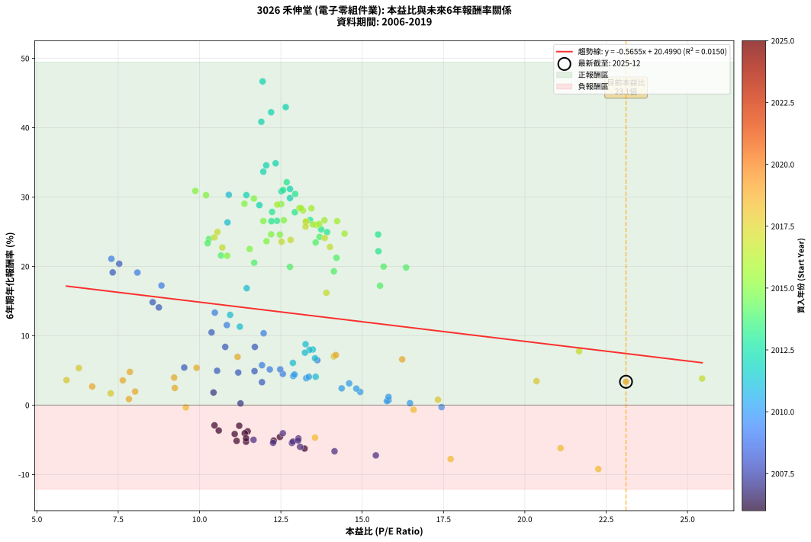
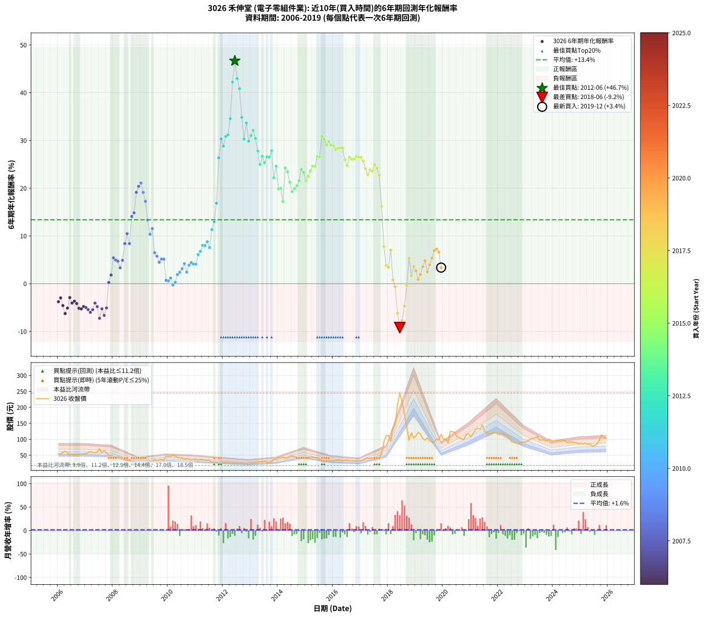

# 3026 禾伸堂 - 本益比與未來報酬率分析

!!! info "報告資訊"
    - **股票代號**: 3026
    - **公司名稱**: 禾伸堂
    - **產業別**: 電子零組件業
    - **分析期間**: 2006-2019 (168 個數據點)
    - **資料來源**: Type 12 (ShowMonthlyK_ChartFlow) 月收盤價與本益比
    - **報酬率口徑**: 含現金股利 (簡化: 年度合計，假設每年7/1入帳)
    - **報告生成時間**: 2026-01-13 00:53:09 CST

## 📈 視覺化圖表

### 圖表1: 本益比 vs 未來報酬率關係

*圖表1：3026 禾伸堂 本益比與6年期未來報酬率關係 (2006-2019)*

### 圖表2: 歷年買入時點的6年期實際報酬率

*圖表2：3026 禾伸堂 歷年買入時點的6年期實際報酬率 (2006-2019)*

## 📍 買點訊號說明

本報告提供兩種買點提示訊號（顯示於圖表2的股價子圖中）：

### ▲ 小綠色三角形（回測驗證）
- **計算方式**: 使用全部歷史資料計算本益比第25百分位數
- **用途**: 事後驗證，顯示歷史上哪些時點確實為低估區
- **限制**: 當下無法判斷，僅供回測參考
- **特性**: 後見之明（Look-Ahead Bias）

### ▲ 小橘色三角形（即時訊號）
- **計算方式**: 使用截至當月的過去5年資料計算本益比第25百分位數
- **用途**: 實際投資決策，當時即可判斷
- **優勢**: 可操作性強，符合實務需求
- **特性**: 無後見之明，滾動窗口計算

!!! tip "如何使用兩種訊號"
    - **綠色▲** 幫助理解歷史估值機會，驗證策略有效性
    - **橘色▲** 可作為實際買進參考，但仍需搭配基本面分析
    - 兩種訊號重疊時，表示即時判斷與事後驗證一致，信心度較高
    - 僅有綠色▲時，表示當時無法判斷（需要未來資料才能確認）
    - 僅有橘色▲時，表示即時判斷為買點，但事後可能不是最佳時機

## 📊 估值分析摘要

| 指標 | 數值 |
|:---:|:---:|
| **目前本益比** (2019-12) | **23.11 倍** |
| **歷史平均本益比** | 12.58 倍 |
| **估值水準** | 🔴 相對高估 |
| **預期6年年化報酬率** | **+7.43%** |
| **歷史平均報酬率** | +13.38% |
| **相關係數 (R²)** | 0.0150 |
| **趨勢線斜率** | -0.5655 |

!!! abstract "核心洞察"
    目前本益比顯著高於歷史平均，預期未來報酬率可能較低

    根據歷史數據回測，3026 禾伸堂 在目前本益比 **23.1倍** 的估值水準下，
    預期未來6年年化報酬率約為 **+7.4%**。

    **重要提醒**: 本分析基於歷史數據統計，實際報酬率會受到公司基本面變化、產業趨勢、
    總體經濟環境等多重因素影響。R² = 0.02 表示本益比可解釋約 1.5% 的報酬率變異。

## 📈 歷史估值統計

### 最佳買點 (最高報酬率)

| 項目 | 數值 |
|:---:|:---:|
| 起始時間 | 2012-06 |
| 當時本益比 | 11.94 倍 |
| 起始價格 | 26.1 元 |
| 6年後價格 | 245.0 元 |
| **6年年化報酬率** | **+46.66%** |

### 最差買點 (最低報酬率)

| 項目 | 數值 |
|:---:|:---:|
| 起始時間 | 2018-06 |
| 當時本益比 | 22.26 倍 |
| 起始價格 | 245.0 元 |
| 6年後價格 | 93.9 元 |
| **6年年化報酬率** | **-9.21%** |

## 🎯 投資啟示

### 本益比與報酬率關係

趨勢線方程式: **y = -0.5655x + 20.4990**

!!! warning "強負相關"
    本益比與未來報酬率呈現強負相關。在高本益比時期買入，未來報酬率顯著較低；
    在低本益比時期買入，未來報酬率顯著較高。**估值紀律至關重要**。

### 估值區間建議

基於歷史數據分析:

- **🟢 低估區** (P/E < 10.1): 預期報酬率較高，可考慮增加持股
- **🟡 合理區** (P/E 10.1-15.1): 預期報酬率符合長期趨勢，正常持有
- **🔴 高估區** (P/E > 15.1): 預期報酬率較低，可考慮減碼或觀望

!!! danger "風險提示"
    - 過去表現不代表未來結果
    - 本分析假設公司基本面無重大結構性變化
    - 產業環境劇變可能使歷史規律失效
    - 應結合公司財報、產業趨勢、總體經濟等多重因素綜合判斷

!!! success "長期投資觀點"
    歷史數據顯示，在合理或低估的估值水準買入並長期持有，
    往往能獲得較佳的投資報酬。**耐心等待好價格**是價值投資的核心原則。

## 📊 數據品質

- **資料來源**: GoodInfo.tw Type 12 (ShowMonthlyK_ChartFlow)
- **資料頻率**: 月度收盤價與本益比
- **回測期間**: 2006-2019
- **數據點數量**: 168 個 (每個點代表一次6年期回測)

### 計算方法說明

1. **6年期年化報酬率**:
   - 對每個歷史時點，計算其後6年的實際投資報酬率
   - 期末價值(不含股利): 期末價格
   - 期末價值(含現金股利): 期末價格 + 持有期間內的現金股利合計 (簡化: 年度合計，假設每年7/1入帳)
   - 公式: 年化報酬率 = [(期末價值/期初價格)^(1/年數) - 1] × 100%

2. **本益比 (P/E Ratio)**:
   - 使用當時的月收盤價與EPS計算
   - 資料來源: Type 12 月度河流圖本益比數據

3. **趨勢線 (Linear Regression)**:
   - 使用最小平方法擬合線性趨勢線
   - R²值衡量本益比對報酬率的解釋能力

---

*本報告由 Stock Analysis System v1.9.0 自動生成*
*數據更新時間: 2026-01-13 00:53:09 CST*

## 📋 月度回測明細表

（每一列對應時間線圖中的一個買入點；可用來對照 SVG 圖上的每個點。）

| 買入月份 | 賣出月份 | 回測期限_年 | 實際持有年數 | 買入本益比_倍 | 買入收盤價_元 | 賣出收盤價_元 | 現金股利合計_元 | 總報酬率_pct | 年化報酬率_pct |
| --- | --- | --- | --- | --- | --- | --- | --- | --- | --- |
| 2006-01 | 2012-01 | 6 | 5.999 | 11.48 | 54.40 | 27.80 | 15.37 | -20.64 | -3.78 |
| 2006-02 | 2012-02 | 6 | 5.999 | 11.22 | 53.20 | 29.00 | 15.37 | -16.59 | -2.98 |
| 2006-03 | 2012-03 | 6 | 6.001 | 12.47 | 59.10 | 29.20 | 15.37 | -24.58 | -4.59 |
| 2006-04 | 2012-04 | 6 | 6.001 | 13.23 | 62.70 | 27.15 | 15.37 | -32.18 | -6.27 |
| 2006-05 | 2012-05 | 6 | 6.001 | 12.28 | 58.20 | 27.10 | 15.37 | -27.02 | -5.11 |
| 2006-06 | 2012-06 | 6 | 6.001 | 10.46 | 49.60 | 26.15 | 15.37 | -16.28 | -2.92 |
| 2006-07 | 2012-07 | 6 | 6.001 | 11.39 | 54.00 | 27.30 | 14.83 | -21.99 | -4.05 |
| 2006-08 | 2012-08 | 6 | 6.001 | 10.59 | 50.20 | 25.30 | 14.83 | -20.07 | -3.66 |
| 2006-09 | 2012-09 | 6 | 6.001 | 11.08 | 52.50 | 25.85 | 14.83 | -22.52 | -4.16 |
| 2006-10 | 2012-10 | 6 | 6.001 | 11.14 | 52.80 | 23.60 | 14.83 | -27.22 | -5.16 |
| 2006-11 | 2012-11 | 6 | 6.001 | 11.43 | 54.20 | 24.30 | 14.83 | -27.81 | -5.29 |
| 2006-12 | 2012-12 | 6 | 6.001 | 11.43 | 54.20 | 25.55 | 14.83 | -25.50 | -4.79 |
| 2007-01 | 2013-01 | 6 | 6.001 | 11.66 | 55.00 | 25.60 | 14.83 | -26.50 | -5.00 |
| 2007-02 | 2013-02 | 6 | 6.001 | 12.26 | 57.50 | 26.30 | 14.83 | -28.47 | -5.43 |
| 2007-03 | 2013-03 | 6 | 6.001 | 13.09 | 61.10 | 27.30 | 14.83 | -31.05 | -6.01 |
| 2007-04 | 2013-04 | 6 | 6.001 | 12.84 | 59.60 | 27.75 | 14.83 | -28.56 | -5.45 |
| 2007-05 | 2013-05 | 6 | 6.001 | 12.56 | 58.00 | 30.40 | 14.83 | -22.02 | -4.06 |
| 2007-06 | 2013-06 | 6 | 6.001 | 13.04 | 59.90 | 29.75 | 14.83 | -25.58 | -4.80 |
| 2007-07 | 2013-07 | 6 | 6.001 | 15.42 | 70.50 | 31.00 | 13.89 | -36.33 | -7.25 |
| 2007-08 | 2013-08 | 6 | 6.001 | 12.87 | 58.50 | 28.40 | 13.89 | -27.72 | -5.27 |
| 2007-09 | 2013-09 | 6 | 6.001 | 14.15 | 64.00 | 28.45 | 13.89 | -33.85 | -6.65 |
| 2007-10 | 2013-10 | 6 | 6.001 | 13.03 | 58.60 | 28.95 | 13.89 | -26.90 | -5.09 |
| 2007-11 | 2013-11 | 6 | 6.001 | 11.26 | 50.40 | 37.25 | 13.89 | +1.46 | +0.24 |
| 2007-12 | 2013-12 | 6 | 6.001 | 10.43 | 46.40 | 37.80 | 13.89 | +11.39 | +1.81 |
| 2008-01 | 2014-01 | 6 | 6.001 | 9.53 | 40.80 | 42.10 | 13.89 | +37.22 | +5.41 |
| 2008-02 | 2014-03 | 6 | 6.081 | 10.54 | 43.30 | 44.20 | 13.89 | +34.15 | +4.95 |
| 2008-03 | 2014-03 | 6 | 5.999 | 11.19 | 44.10 | 44.20 | 13.89 | +31.71 | +4.70 |
| 2008-04 | 2014-04 | 6 | 5.999 | 11.92 | 44.95 | 40.75 | 13.89 | +21.55 | +3.31 |
| 2008-05 | 2014-05 | 6 | 5.999 | 11.69 | 42.10 | 42.20 | 13.89 | +33.22 | +4.90 |
| 2008-06 | 2014-06 | 6 | 5.999 | 10.79 | 37.00 | 46.10 | 13.89 | +62.12 | +8.39 |
| 2008-07 | 2014-07 | 6 | 5.999 | 10.37 | 33.80 | 47.75 | 13.71 | +81.82 | +10.48 |
| 2008-08 | 2014-08 | 6 | 5.999 | 11.70 | 36.15 | 44.90 | 13.71 | +62.12 | +8.39 |
| 2008-09 | 2014-09 | 6 | 5.999 | 8.75 | 25.55 | 42.60 | 13.71 | +120.38 | +14.08 |
| 2008-10 | 2014-10 | 6 | 5.999 | 8.56 | 23.55 | 40.30 | 13.71 | +129.32 | +14.84 |
| 2008-11 | 2014-11 | 6 | 5.999 | 7.33 | 18.90 | 40.30 | 13.71 | +185.75 | +19.13 |
| 2008-12 | 2014-12 | 6 | 5.999 | 7.53 | 18.15 | 41.50 | 13.71 | +204.17 | +20.38 |
| 2009-01 | 2015-01 | 6 | 5.999 | 7.29 | 17.90 | 42.70 | 13.71 | +215.12 | +21.09 |
| 2009-02 | 2015-02 | 6 | 5.999 | 8.09 | 20.25 | 44.10 | 13.71 | +185.46 | +19.11 |
| 2009-03 | 2015-03 | 6 | 5.999 | 8.83 | 22.50 | 44.70 | 13.71 | +159.58 | +17.24 |
| 2009-04 | 2015-04 | 6 | 5.999 | 10.47 | 27.15 | 43.80 | 13.71 | +111.81 | +13.33 |
| 2009-05 | 2015-05 | 6 | 5.999 | 11.97 | 31.60 | 43.35 | 13.71 | +80.56 | +10.35 |
| 2009-06 | 2015-06 | 6 | 5.999 | 10.84 | 29.10 | 42.30 | 13.71 | +92.46 | +11.53 |
| 2009-07 | 2015-07 | 6 | 5.999 | 13.62 | 37.20 | 38.80 | 15.40 | +45.69 | +6.47 |
| 2009-08 | 2015-08 | 6 | 5.999 | 11.92 | 33.10 | 30.90 | 15.40 | +39.87 | +5.75 |
| 2009-09 | 2015-09 | 6 | 5.999 | 12.56 | 35.45 | 30.75 | 15.40 | +30.17 | +4.49 |
| 2009-10 | 2015-10 | 6 | 5.999 | 12.48 | 35.80 | 33.00 | 15.40 | +35.18 | +5.15 |
| 2009-11 | 2015-11 | 6 | 5.999 | 12.16 | 35.45 | 32.50 | 15.40 | +35.11 | +5.14 |
| 2009-12 | 2015-12 | 6 | 5.999 | 15.81 | 46.80 | 33.40 | 15.40 | +4.26 | +0.70 |
| 2010-01 | 2016-01 | 6 | 5.999 | 15.76 | 46.40 | 32.65 | 15.40 | +3.55 | +0.58 |
| 2010-02 | 2016-02 | 6 | 5.999 | 15.81 | 46.30 | 34.30 | 15.40 | +7.33 | +1.19 |
| 2010-03 | 2016-03 | 6 | 6.001 | 17.44 | 50.80 | 34.50 | 15.40 | -1.78 | -0.30 |
| 2010-04 | 2016-04 | 6 | 6.001 | 16.47 | 47.70 | 33.10 | 15.40 | +1.67 | +0.28 |
| 2010-05 | 2016-05 | 6 | 6.001 | 14.94 | 43.05 | 32.80 | 15.40 | +11.95 | +1.90 |
| 2010-06 | 2016-06 | 6 | 6.001 | 14.82 | 42.45 | 33.50 | 15.40 | +15.18 | +2.38 |
| 2010-07 | 2016-07 | 6 | 6.001 | 14.60 | 41.60 | 35.15 | 14.90 | +20.30 | +3.13 |
| 2010-08 | 2016-08 | 6 | 6.001 | 12.88 | 36.50 | 31.80 | 14.90 | +27.93 | +4.19 |
| 2010-09 | 2016-09 | 6 | 6.001 | 14.37 | 40.50 | 31.85 | 14.90 | +15.42 | +2.42 |
| 2010-10 | 2016-10 | 6 | 6.001 | 13.28 | 37.20 | 31.85 | 14.90 | +25.66 | +3.88 |
| 2010-11 | 2016-11 | 6 | 6.001 | 12.92 | 36.00 | 31.75 | 14.90 | +29.57 | +4.41 |
| 2010-12 | 2016-12 | 6 | 6.001 | 13.36 | 37.00 | 32.15 | 14.90 | +27.15 | +4.08 |
| 2011-01 | 2017-01 | 6 | 6.001 | 13.57 | 37.15 | 32.35 | 14.90 | +27.18 | +4.09 |
| 2011-02 | 2017-02 | 6 | 6.001 | 12.87 | 34.80 | 34.70 | 14.90 | +42.52 | +6.08 |
| 2011-03 | 2017-03 | 6 | 6.001 | 13.55 | 36.20 | 38.70 | 14.90 | +48.06 | +6.76 |
| 2011-04 | 2017-04 | 6 | 6.001 | 13.48 | 35.60 | 41.65 | 14.90 | +58.84 | +8.02 |
| 2011-05 | 2017-05 | 6 | 6.001 | 13.38 | 34.90 | 40.35 | 14.90 | +58.30 | +7.95 |
| 2011-06 | 2017-06 | 6 | 6.001 | 13.26 | 34.15 | 41.70 | 14.90 | +65.73 | +8.78 |
| 2011-07 | 2017-07 | 6 | 6.001 | 13.24 | 33.65 | 37.00 | 15.09 | +54.80 | +7.55 |
| 2011-08 | 2017-08 | 6 | 6.001 | 11.24 | 28.20 | 38.55 | 15.09 | +90.21 | +11.31 |
| 2011-09 | 2017-09 | 6 | 6.001 | 10.94 | 27.10 | 41.35 | 15.09 | +108.27 | +13.00 |
| 2011-10 | 2017-10 | 6 | 6.001 | 11.45 | 28.00 | 56.20 | 15.09 | +154.61 | +16.85 |
| 2011-11 | 2017-11 | 6 | 6.001 | 10.86 | 26.20 | 91.50 | 15.09 | +306.83 | +26.34 |
| 2011-12 | 2017-12 | 6 | 6.001 | 10.90 | 25.95 | 112.00 | 15.09 | +389.75 | +30.31 |
| 2012-01 | 2018-01 | 6 | 6.001 | 11.84 | 27.80 | 112.00 | 15.09 | +357.16 | +28.82 |
| 2012-02 | 2018-03 | 6 | 6.081 | 12.52 | 29.00 | 133.50 | 15.09 | +412.38 | +30.83 |
| 2012-03 | 2018-03 | 6 | 5.999 | 12.78 | 29.20 | 133.50 | 15.09 | +408.87 | +31.16 |
| 2012-04 | 2018-04 | 6 | 5.999 | 12.05 | 27.15 | 146.00 | 15.09 | +493.33 | +34.56 |
| 2012-05 | 2018-05 | 6 | 5.999 | 12.20 | 27.10 | 209.00 | 15.09 | +726.90 | +42.21 |
| 2012-06 | 2018-06 | 6 | 5.999 | 11.94 | 26.15 | 245.00 | 15.09 | +894.61 | +46.66 |
| 2012-07 | 2018-07 | 6 | 5.999 | 12.65 | 27.30 | 214.50 | 18.39 | +753.08 | +42.96 |
| 2012-08 | 2018-08 | 6 | 5.999 | 11.90 | 25.30 | 179.00 | 18.39 | +680.20 | +40.84 |
| 2012-09 | 2018-09 | 6 | 5.999 | 12.34 | 25.85 | 137.00 | 18.39 | +501.12 | +34.85 |
| 2012-10 | 2018-10 | 6 | 5.999 | 11.44 | 23.60 | 96.90 | 18.39 | +388.52 | +30.27 |
| 2012-11 | 2018-11 | 6 | 5.999 | 11.96 | 24.30 | 120.00 | 18.39 | +469.51 | +33.64 |
| 2012-12 | 2018-12 | 6 | 5.999 | 12.78 | 25.55 | 104.00 | 18.39 | +379.02 | +29.84 |
| 2013-01 | 2019-01 | 6 | 5.999 | 12.57 | 25.60 | 111.00 | 18.39 | +405.43 | +31.01 |
| 2013-02 | 2019-02 | 6 | 5.999 | 12.68 | 26.30 | 121.50 | 18.39 | +431.90 | +32.13 |
| 2013-03 | 2019-03 | 6 | 5.999 | 12.94 | 27.30 | 116.00 | 18.39 | +392.27 | +30.43 |
| 2013-04 | 2019-04 | 6 | 5.999 | 12.93 | 27.75 | 102.50 | 18.39 | +335.64 | +27.80 |
| 2013-05 | 2019-05 | 6 | 5.999 | 13.92 | 30.40 | 97.20 | 18.39 | +280.23 | +24.94 |
| 2013-06 | 2019-06 | 6 | 5.999 | 13.40 | 29.75 | 104.50 | 18.39 | +313.08 | +26.68 |
| 2013-07 | 2019-07 | 6 | 5.999 | 13.74 | 31.00 | 94.70 | 25.39 | +287.39 | +25.33 |
| 2013-08 | 2019-08 | 6 | 5.999 | 12.38 | 28.40 | 91.30 | 25.39 | +310.88 | +26.56 |
| 2013-09 | 2019-09 | 6 | 5.999 | 12.21 | 28.45 | 91.20 | 25.39 | +309.81 | +26.51 |
| 2013-10 | 2019-10 | 6 | 5.999 | 12.23 | 28.95 | 101.00 | 25.39 | +336.58 | +27.85 |
| 2013-11 | 2019-11 | 6 | 5.999 | 15.50 | 37.25 | 98.50 | 25.39 | +232.59 | +22.18 |
| 2013-12 | 2019-12 | 6 | 5.999 | 15.49 | 37.80 | 116.00 | 25.39 | +274.05 | +24.60 |
| 2014-01 | 2020-01 | 6 | 5.999 | 16.35 | 42.10 | 99.30 | 25.39 | +196.18 | +19.84 |
| 2014-02 | 2020-02 | 6 | 5.999 | 15.66 | 42.40 | 101.00 | 25.39 | +198.09 | +19.97 |
| 2014-03 | 2020-03 | 6 | 6.001 | 15.55 | 44.20 | 89.20 | 25.39 | +159.25 | +17.20 |
| 2014-04 | 2020-04 | 6 | 6.001 | 13.69 | 40.75 | 124.50 | 25.39 | +267.83 | +24.24 |
| 2014-05 | 2020-05 | 6 | 6.001 | 13.57 | 42.20 | 124.00 | 25.39 | +254.00 | +23.45 |
| 2014-06 | 2020-06 | 6 | 6.001 | 14.21 | 46.10 | 121.00 | 25.39 | +217.55 | +21.23 |
| 2014-07 | 2020-07 | 6 | 6.001 | 14.13 | 47.75 | 108.00 | 29.59 | +188.15 | +19.28 |
| 2014-08 | 2020-08 | 6 | 6.001 | 12.78 | 44.90 | 104.00 | 29.59 | +197.53 | +19.92 |
| 2014-09 | 2020-09 | 6 | 6.001 | 11.68 | 42.60 | 101.00 | 29.59 | +206.55 | +20.52 |
| 2014-10 | 2020-10 | 6 | 6.001 | 10.66 | 40.30 | 100.50 | 29.59 | +222.80 | +21.56 |
| 2014-11 | 2020-11 | 6 | 6.001 | 10.29 | 40.30 | 116.50 | 29.59 | +262.51 | +23.94 |
| 2014-12 | 2020-12 | 6 | 6.001 | 10.25 | 41.50 | 116.50 | 29.59 | +252.02 | +23.33 |
| 2015-01 | 2021-01 | 6 | 6.001 | 10.85 | 42.70 | 108.00 | 29.59 | +222.22 | +21.53 |
| 2015-02 | 2021-02 | 6 | 6.001 | 11.54 | 44.10 | 119.50 | 29.59 | +238.07 | +22.50 |
| 2015-03 | 2021-03 | 6 | 6.001 | 12.06 | 44.70 | 130.00 | 29.59 | +257.02 | +23.62 |
| 2015-04 | 2021-04 | 6 | 6.001 | 12.20 | 43.80 | 134.50 | 29.59 | +274.63 | +24.62 |
| 2015-05 | 2021-05 | 6 | 6.001 | 12.47 | 43.35 | 132.50 | 29.59 | +273.91 | +24.58 |
| 2015-06 | 2021-06 | 6 | 6.001 | 12.59 | 42.30 | 145.00 | 29.59 | +312.74 | +26.65 |
| 2015-07 | 2021-07 | 6 | 6.001 | 11.96 | 38.80 | 125.00 | 34.30 | +310.57 | +26.53 |
| 2015-08 | 2021-08 | 6 | 6.001 | 9.87 | 30.90 | 121.00 | 34.30 | +402.59 | +30.87 |
| 2015-09 | 2021-09 | 6 | 6.001 | 10.20 | 30.75 | 116.00 | 34.30 | +388.78 | +30.26 |
| 2015-10 | 2021-10 | 6 | 6.001 | 11.38 | 33.00 | 118.00 | 34.30 | +361.52 | +29.02 |
| 2015-11 | 2021-11 | 6 | 6.001 | 11.67 | 32.50 | 121.00 | 34.30 | +377.85 | +29.77 |
| 2015-12 | 2021-12 | 6 | 6.001 | 12.51 | 33.40 | 119.50 | 34.30 | +360.48 | +28.98 |
| 2016-01 | 2022-01 | 6 | 6.001 | 12.39 | 32.65 | 115.50 | 34.30 | +358.81 | +28.90 |
| 2016-02 | 2022-03 | 6 | 6.081 | 13.18 | 34.30 | 120.00 | 34.30 | +349.85 | +28.06 |
| 2016-03 | 2022-03 | 6 | 5.999 | 13.44 | 34.50 | 120.00 | 34.30 | +347.25 | +28.37 |
| 2016-04 | 2022-04 | 6 | 5.999 | 13.07 | 33.10 | 114.00 | 34.30 | +348.04 | +28.40 |
| 2016-05 | 2022-05 | 6 | 5.999 | 13.12 | 32.80 | 112.50 | 34.30 | +347.56 | +28.38 |
| 2016-06 | 2022-06 | 6 | 5.999 | 13.59 | 33.50 | 99.50 | 34.30 | +299.40 | +25.97 |
| 2016-07 | 2022-07 | 6 | 5.999 | 14.46 | 35.15 | 91.40 | 40.80 | +276.10 | +24.71 |
| 2016-08 | 2022-08 | 6 | 5.999 | 13.27 | 31.80 | 89.30 | 40.80 | +309.12 | +26.47 |
| 2016-09 | 2022-09 | 6 | 5.999 | 13.48 | 31.85 | 86.90 | 40.80 | +300.94 | +26.05 |
| 2016-10 | 2022-10 | 6 | 5.999 | 13.68 | 31.85 | 87.30 | 40.80 | +302.20 | +26.11 |
| 2016-11 | 2022-11 | 6 | 5.999 | 13.84 | 31.75 | 90.10 | 40.80 | +312.28 | +26.64 |
| 2016-12 | 2022-12 | 6 | 5.999 | 14.23 | 32.15 | 91.00 | 40.80 | +309.95 | +26.52 |
| 2017-01 | 2023-01 | 6 | 5.999 | 13.27 | 32.35 | 91.30 | 40.80 | +308.35 | +26.43 |
| 2017-02 | 2023-02 | 6 | 5.999 | 13.26 | 34.70 | 96.20 | 40.80 | +294.81 | +25.72 |
| 2017-03 | 2023-03 | 6 | 5.999 | 13.85 | 38.70 | 100.50 | 40.80 | +265.12 | +24.10 |
| 2017-04 | 2023-04 | 6 | 5.999 | 14.01 | 41.65 | 102.00 | 40.80 | +242.86 | +22.80 |
| 2017-05 | 2023-05 | 6 | 5.999 | 12.80 | 40.35 | 104.50 | 40.80 | +260.10 | +23.81 |
| 2017-06 | 2023-06 | 6 | 5.999 | 12.52 | 41.70 | 107.50 | 40.80 | +255.64 | +23.55 |
| 2017-07 | 2023-07 | 6 | 5.999 | 10.55 | 37.00 | 97.50 | 43.30 | +280.54 | +24.96 |
| 2017-08 | 2023-08 | 6 | 5.999 | 10.46 | 38.55 | 98.00 | 43.30 | +266.54 | +24.18 |
| 2017-09 | 2023-09 | 6 | 5.999 | 10.70 | 41.35 | 97.90 | 43.30 | +241.48 | +22.72 |
| 2017-10 | 2023-10 | 6 | 5.999 | 13.90 | 56.20 | 94.90 | 43.30 | +145.91 | +16.18 |
| 2017-11 | 2023-11 | 6 | 5.999 | 21.67 | 91.50 | 100.00 | 43.30 | +56.61 | +7.77 |
| 2017-12 | 2023-12 | 6 | 5.999 | 25.45 | 112.00 | 97.00 | 43.30 | +25.27 | +3.83 |
| 2018-01 | 2024-01 | 6 | 5.999 | 20.36 | 112.00 | 94.00 | 43.30 | +22.59 | +3.45 |
| 2018-02 | 2024-02 | 6 | 5.999 | 14.13 | 93.30 | 96.90 | 43.30 | +50.27 | +7.02 |
| 2018-03 | 2024-03 | 6 | 6.001 | 17.33 | 133.50 | 96.50 | 43.30 | +4.72 | +0.77 |
| 2018-04 | 2024-04 | 6 | 6.001 | 16.58 | 146.00 | 97.00 | 43.30 | -3.90 | -0.66 |
| 2018-05 | 2024-05 | 6 | 6.001 | 21.10 | 209.00 | 99.00 | 43.30 | -31.91 | -6.20 |
| 2018-06 | 2024-06 | 6 | 6.001 | 22.26 | 245.00 | 93.90 | 43.30 | -44.00 | -9.21 |
| 2018-07 | 2024-07 | 6 | 6.001 | 17.72 | 214.50 | 89.00 | 43.00 | -38.46 | -7.77 |
| 2018-08 | 2024-08 | 6 | 6.001 | 13.55 | 179.00 | 91.20 | 43.00 | -25.03 | -4.69 |
| 2018-09 | 2024-09 | 6 | 6.001 | 9.58 | 137.00 | 91.30 | 43.00 | -1.97 | -0.33 |
| 2018-10 | 2024-10 | 6 | 6.001 | 6.29 | 96.90 | 89.40 | 43.00 | +36.64 | +5.34 |
| 2018-11 | 2024-11 | 6 | 6.001 | 7.27 | 120.00 | 89.70 | 43.00 | +10.58 | +1.69 |
| 2018-12 | 2024-12 | 6 | 6.001 | 5.91 | 104.00 | 85.60 | 43.00 | +23.65 | +3.60 |
| 2019-01 | 2025-01 | 6 | 6.001 | 6.70 | 111.00 | 87.10 | 43.00 | +17.21 | +2.68 |
| 2019-02 | 2025-02 | 6 | 6.001 | 7.83 | 121.50 | 85.00 | 43.00 | +5.35 | +0.87 |
| 2019-03 | 2025-03 | 6 | 6.001 | 8.02 | 116.00 | 87.30 | 43.00 | +12.33 | +1.96 |
| 2019-04 | 2025-04 | 6 | 6.001 | 7.64 | 102.50 | 83.50 | 43.00 | +23.41 | +3.57 |
| 2019-05 | 2025-05 | 6 | 6.001 | 7.86 | 97.20 | 85.70 | 43.00 | +32.41 | +4.79 |
| 2019-06 | 2025-06 | 6 | 6.001 | 9.24 | 104.50 | 78.00 | 43.00 | +15.79 | +2.47 |
| 2019-07 | 2025-07 | 6 | 6.001 | 9.22 | 94.70 | 80.10 | 39.50 | +26.29 | +3.97 |
| 2019-08 | 2025-08 | 6 | 6.001 | 9.91 | 91.30 | 85.50 | 39.50 | +36.91 | +5.37 |
| 2019-09 | 2025-09 | 6 | 6.001 | 11.17 | 91.20 | 97.00 | 39.50 | +49.67 | +6.95 |
| 2019-10 | 2025-10 | 6 | 6.001 | 14.19 | 101.00 | 114.00 | 39.50 | +51.98 | +7.22 |
| 2019-11 | 2025-11 | 6 | 6.001 | 16.23 | 98.50 | 105.00 | 39.50 | +46.70 | +6.59 |
| 2019-12 | 2025-12 | 6 | 6.001 | 23.11 | 116.00 | 102.00 | 39.50 | +21.98 | +3.37 |
