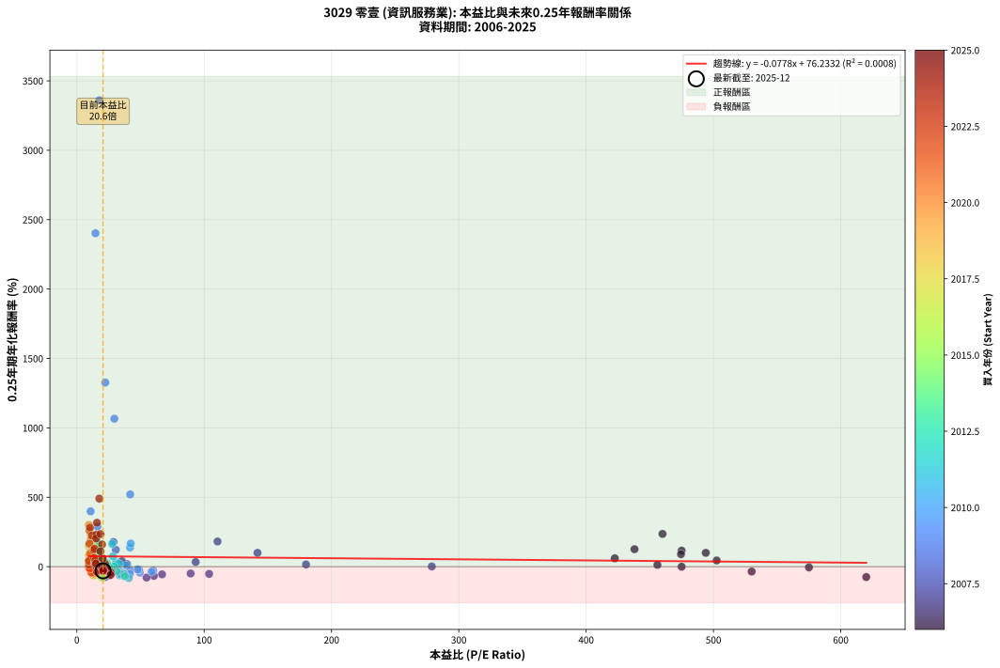
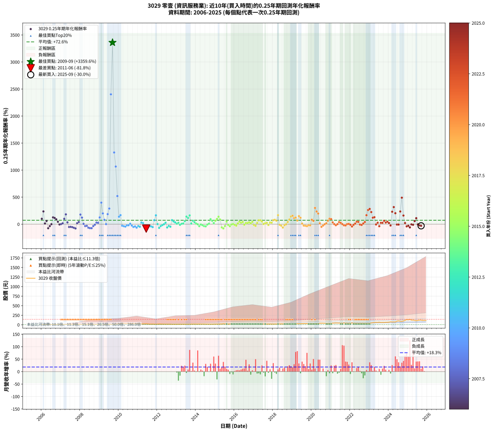

# 3029 零壹 - 本益比與未來報酬率分析

!!! info "報告資訊"
    - **股票代號**: 3029
    - **公司名稱**: 零壹
    - **產業別**: 資訊服務業
    - **分析期間**: 2006-2025 (237 個數據點)
    - **資料來源**: Type 12 (ShowMonthlyK_ChartFlow) 月收盤價與本益比
    - **報酬率口徑**: 含現金股利 (簡化: 年度合計，假設每年7/1入帳)
    - **報告生成時間**: 2026-01-11 18:47:56 CST

## 📈 視覺化圖表

### 圖表1: 本益比 vs 未來報酬率關係

*圖表1：3029 零壹 本益比與0.25年期未來報酬率關係 (2006-2025)*

### 圖表2: 歷年買入時點的0.25年期實際報酬率

*圖表2：3029 零壹 歷年買入時點的0.25年期實際報酬率 (2006-2025)*

## 📍 買點訊號說明

本報告提供兩種買點提示訊號（顯示於圖表2的股價子圖中）：

### ▲ 小綠色三角形（回測驗證）
- **計算方式**: 使用全部歷史資料計算本益比第25百分位數
- **用途**: 事後驗證，顯示歷史上哪些時點確實為低估區
- **限制**: 當下無法判斷，僅供回測參考
- **特性**: 後見之明（Look-Ahead Bias）

### ▲ 小橘色三角形（即時訊號）
- **計算方式**: 使用截至當月的過去5年資料計算本益比第25百分位數
- **用途**: 實際投資決策，當時即可判斷
- **優勢**: 可操作性強，符合實務需求
- **特性**: 無後見之明，滾動窗口計算

!!! tip "如何使用兩種訊號"
    - **綠色▲** 幫助理解歷史估值機會，驗證策略有效性
    - **橘色▲** 可作為實際買進參考，但仍需搭配基本面分析
    - 兩種訊號重疊時，表示即時判斷與事後驗證一致，信心度較高
    - 僅有綠色▲時，表示當時無法判斷（需要未來資料才能確認）
    - 僅有橘色▲時，表示即時判斷為買點，但事後可能不是最佳時機

## 📊 估值分析摘要

| 指標 | 數值 |
|:---:|:---:|
| **目前本益比** (2025-09) | **20.58 倍** |
| **歷史平均本益比** | 46.29 倍 |
| **估值水準** | 🟢 相對低估 |
| **預期0.25年年化報酬率** | **+74.63%** |
| **歷史平均報酬率** | +72.63% |
| **相關係數 (R²)** | 0.0008 |
| **趨勢線斜率** | -0.0778 |

!!! abstract "核心洞察"
    目前本益比顯著低於歷史平均，預期未來報酬率可能較高

    根據歷史數據回測，3029 零壹 在目前本益比 **20.6倍** 的估值水準下，
    預期未來0.25年年化報酬率約為 **+74.6%**。

    **重要提醒**: 本分析基於歷史數據統計，實際報酬率會受到公司基本面變化、產業趨勢、
    總體經濟環境等多重因素影響。R² = 0.00 表示本益比可解釋約 0.1% 的報酬率變異。

## 📈 歷史估值統計

### 最佳買點 (最高報酬率)

| 項目 | 數值 |
|:---:|:---:|
| 起始時間 | 2009-09 |
| 當時本益比 | 17.63 倍 |
| 起始價格 | 10.1 元 |
| 0.25年後價格 | 24.3 元 |
| **0.25年年化報酬率** | **+3359.62%** |

### 最差買點 (最低報酬率)

| 項目 | 數值 |
|:---:|:---:|
| 起始時間 | 2011-06 |
| 當時本益比 | 40.82 倍 |
| 起始價格 | 27.4 元 |
| 0.25年後價格 | 17.1 元 |
| **0.25年年化報酬率** | **-81.83%** |

## 🎯 投資啟示

### 本益比與報酬率關係

趨勢線方程式: **y = -0.0778x + 76.2332**

!!! note "負相關"
    本益比與未來報酬率呈現負相關。較低的本益比通常帶來較高的未來報酬率，
    但相關性不算非常強。**估值仍是重要參考指標之一**。

### 估值區間建議

基於歷史數據分析:

- **🟢 低估區** (P/E < 37.0): 預期報酬率較高，可考慮增加持股
- **🟡 合理區** (P/E 37.0-55.5): 預期報酬率符合長期趨勢，正常持有
- **🔴 高估區** (P/E > 55.5): 預期報酬率較低，可考慮減碼或觀望

!!! danger "風險提示"
    - 過去表現不代表未來結果
    - 本分析假設公司基本面無重大結構性變化
    - 產業環境劇變可能使歷史規律失效
    - 應結合公司財報、產業趨勢、總體經濟等多重因素綜合判斷

!!! success "長期投資觀點"
    歷史數據顯示，在合理或低估的估值水準買入並長期持有，
    往往能獲得較佳的投資報酬。**耐心等待好價格**是價值投資的核心原則。

## 📊 數據品質

- **資料來源**: GoodInfo.tw Type 12 (ShowMonthlyK_ChartFlow)
- **資料頻率**: 月度收盤價與本益比
- **回測期間**: 2006-2025
- **數據點數量**: 237 個 (每個點代表一次0.25年期回測)

### 計算方法說明

1. **0.25年期年化報酬率**:
   - 對每個歷史時點，計算其後0.25年的實際投資報酬率
   - 期末價值(不含股利): 期末價格
   - 期末價值(含現金股利): 期末價格 + 持有期間內的現金股利合計 (簡化: 年度合計，假設每年7/1入帳)
   - 公式: 年化報酬率 = [(期末價值/期初價格)^(1/年數) - 1] × 100%

2. **本益比 (P/E Ratio)**:
   - 使用當時的月收盤價與EPS計算
   - 資料來源: Type 12 月度河流圖本益比數據

3. **趨勢線 (Linear Regression)**:
   - 使用最小平方法擬合線性趨勢線
   - R²值衡量本益比對報酬率的解釋能力

---

*本報告由 Stock Analysis System v1.9.0 自動生成*
*數據更新時間: 2026-01-11 18:47:56 CST*

## 📋 月度回測明細表

（每一列對應時間線圖中的一個買入點；可用來對照 SVG 圖上的每個點。）

| 買入月份 | 賣出月份 | 回測期限_年 | 實際持有年數 | 買入本益比_倍 | 買入收盤價_元 | 賣出收盤價_元 | 現金股利合計_元 | 總報酬率_pct | 年化報酬率_pct |
| --- | --- | --- | --- | --- | --- | --- | --- | --- | --- |
| 2006-01 | 2006-05 | 0.25 | 0.329 | 494.00 | 9.88 | 12.40 | 0.00 | +25.51 | +99.67 |
| 2006-02 | 2006-05 | 0.25 | 0.246 | 460.00 | 9.20 | 12.40 | 0.00 | +34.78 | +235.81 |
| 2006-03 | 2006-07 | 0.25 | 0.334 | 456.00 | 9.12 | 9.50 | 0.00 | +4.17 | +13.00 |
| 2006-04 | 2006-07 | 0.25 | 0.249 | 422.50 | 8.45 | 9.50 | 0.00 | +12.43 | +60.02 |
| 2006-05 | 2006-08 | 0.25 | 0.252 | 620.00 | 12.40 | 8.76 | 0.00 | -29.35 | -74.83 |
| 2006-06 | 2006-09 | 0.25 | 0.252 | 530.00 | 10.60 | 9.50 | 0.00 | -10.38 | -35.27 |
| 2006-07 | 2006-10 | 0.25 | 0.252 | 475.00 | 9.50 | 9.49 | 0.00 | -0.11 | -0.42 |
| 2006-08 | 2006-12 | 0.25 | 0.334 | 438.00 | 8.76 | 11.50 | 0.00 | +31.28 | +125.87 |
| 2006-09 | 2006-12 | 0.25 | 0.249 | 475.00 | 9.50 | 11.50 | 0.00 | +21.05 | +115.30 |
| 2006-10 | 2007-01 | 0.25 | 0.252 | 474.50 | 9.49 | 11.15 | 0.00 | +17.49 | +89.65 |
| 2006-11 | 2007-03 | 0.25 | 0.329 | 502.50 | 10.05 | 11.35 | 0.00 | +12.94 | +44.81 |
| 2006-12 | 2007-03 | 0.25 | 0.246 | 575.00 | 11.50 | 11.35 | 0.00 | -1.30 | -5.19 |
| 2007-01 | 2007-05 | 0.25 | 0.329 | 278.80 | 11.15 | 11.20 | 0.00 | +0.45 | +1.37 |
| 2007-02 | 2007-05 | 0.25 | 0.246 | 180.00 | 10.80 | 11.20 | 0.00 | +3.70 | +15.90 |
| 2007-03 | 2007-07 | 0.25 | 0.334 | 141.90 | 11.35 | 14.30 | 0.00 | +25.99 | +99.71 |
| 2007-04 | 2007-07 | 0.25 | 0.249 | 110.50 | 11.05 | 14.30 | 0.00 | +29.41 | +181.47 |
| 2007-05 | 2007-08 | 0.25 | 0.252 | 93.33 | 11.20 | 12.05 | 0.00 | +7.59 | +33.70 |
| 2007-06 | 2007-09 | 0.25 | 0.252 | 103.90 | 14.55 | 12.10 | 0.00 | -16.84 | -51.91 |
| 2007-07 | 2007-10 | 0.25 | 0.252 | 89.38 | 14.30 | 12.05 | 0.00 | -15.73 | -49.32 |
| 2007-08 | 2007-12 | 0.25 | 0.334 | 66.94 | 12.05 | 9.20 | 0.00 | -23.65 | -55.42 |
| 2007-09 | 2007-12 | 0.25 | 0.249 | 60.50 | 12.10 | 9.20 | 0.00 | -23.97 | -66.71 |
| 2007-10 | 2008-01 | 0.25 | 0.252 | 54.77 | 12.05 | 8.16 | 0.00 | -32.28 | -78.72 |
| 2007-11 | 2008-03 | 0.25 | 0.331 | 39.42 | 9.46 | 10.00 | 0.00 | +5.71 | +18.24 |
| 2007-12 | 2008-03 | 0.25 | 0.249 | 35.38 | 9.20 | 10.00 | 0.00 | +8.70 | +39.75 |
| 2008-01 | 2008-05 | 0.25 | 0.331 | 28.80 | 8.16 | 11.45 | 0.00 | +40.32 | +178.02 |
| 2008-02 | 2008-05 | 0.25 | 0.249 | 30.62 | 9.39 | 11.45 | 0.00 | +21.94 | +121.69 |
| 2008-03 | 2008-07 | 0.25 | 0.334 | 30.30 | 10.00 | 9.60 | 0.60 | +2.00 | +6.11 |
| 2008-04 | 2008-07 | 0.25 | 0.249 | 32.12 | 11.35 | 9.60 | 0.60 | -10.13 | -34.87 |
| 2008-05 | 2008-08 | 0.25 | 0.252 | 30.40 | 11.45 | 9.85 | 0.60 | -8.73 | -30.43 |
| 2008-06 | 2008-09 | 0.25 | 0.252 | 24.78 | 9.91 | 7.00 | 0.60 | -23.31 | -65.13 |
| 2008-07 | 2008-10 | 0.25 | 0.252 | 22.68 | 9.60 | 6.90 | 0.00 | -28.12 | -73.05 |
| 2008-08 | 2008-12 | 0.25 | 0.334 | 22.05 | 9.85 | 6.30 | 0.00 | -36.04 | -73.76 |
| 2008-09 | 2008-12 | 0.25 | 0.249 | 14.89 | 7.00 | 6.30 | 0.00 | -10.00 | -34.48 |
| 2008-10 | 2009-01 | 0.25 | 0.252 | 13.99 | 6.90 | 6.73 | 0.00 | -2.46 | -9.43 |
| 2008-11 | 2009-03 | 0.25 | 0.329 | 11.81 | 6.10 | 6.65 | 0.00 | +9.02 | +30.05 |
| 2008-12 | 2009-03 | 0.25 | 0.246 | 11.67 | 6.30 | 6.65 | 0.00 | +5.56 | +24.54 |
| 2009-01 | 2009-05 | 0.25 | 0.329 | 12.39 | 6.73 | 8.78 | 0.00 | +30.46 | +124.64 |
| 2009-02 | 2009-05 | 0.25 | 0.246 | 10.81 | 5.91 | 8.78 | 0.00 | +48.56 | +398.49 |
| 2009-03 | 2009-07 | 0.25 | 0.334 | 12.09 | 6.65 | 9.09 | 0.50 | +44.24 | +199.42 |
| 2009-04 | 2009-07 | 0.25 | 0.249 | 14.96 | 8.28 | 9.09 | 0.50 | +15.85 | +80.46 |
| 2009-05 | 2009-08 | 0.25 | 0.252 | 15.77 | 8.78 | 8.29 | 0.50 | +0.14 | +0.54 |
| 2009-06 | 2009-09 | 0.25 | 0.252 | 14.46 | 8.10 | 10.05 | 0.50 | +30.27 | +185.74 |
| 2009-07 | 2009-10 | 0.25 | 0.252 | 16.14 | 9.09 | 12.80 | 0.00 | +40.81 | +289.17 |
| 2009-08 | 2009-12 | 0.25 | 0.334 | 14.63 | 8.29 | 24.30 | 0.00 | +193.12 | +2401.98 |
| 2009-09 | 2009-12 | 0.25 | 0.249 | 17.63 | 10.05 | 24.30 | 0.00 | +141.79 | +3359.62 |
| 2009-10 | 2010-01 | 0.25 | 0.252 | 22.33 | 12.80 | 25.00 | 0.00 | +95.31 | +1326.36 |
| 2009-11 | 2010-03 | 0.25 | 0.329 | 29.48 | 17.00 | 38.10 | 0.00 | +124.12 | +1066.17 |
| 2009-12 | 2010-03 | 0.25 | 0.246 | 41.90 | 24.30 | 38.10 | 0.00 | +56.79 | +520.40 |
| 2010-01 | 2010-05 | 0.25 | 0.329 | 41.78 | 25.00 | 33.25 | 0.00 | +33.00 | +138.22 |
| 2010-02 | 2010-05 | 0.25 | 0.246 | 42.32 | 26.10 | 33.25 | 0.00 | +27.39 | +167.14 |
| 2010-03 | 2010-07 | 0.25 | 0.334 | 60.00 | 38.10 | 33.70 | 0.50 | -10.24 | -27.62 |
| 2010-04 | 2010-07 | 0.25 | 0.249 | 58.70 | 38.35 | 33.70 | 0.50 | -10.82 | -36.85 |
| 2010-05 | 2010-08 | 0.25 | 0.252 | 49.50 | 33.25 | 28.25 | 0.50 | -13.53 | -43.86 |
| 2010-06 | 2010-09 | 0.25 | 0.252 | 48.77 | 33.65 | 31.20 | 0.50 | -5.79 | -21.10 |
| 2010-07 | 2010-10 | 0.25 | 0.252 | 47.58 | 33.70 | 31.85 | 0.00 | -5.49 | -20.08 |
| 2010-08 | 2010-12 | 0.25 | 0.334 | 38.88 | 28.25 | 29.05 | 0.00 | +2.83 | +8.72 |
| 2010-09 | 2010-12 | 0.25 | 0.249 | 41.88 | 31.20 | 29.05 | 0.00 | -6.89 | -24.92 |
| 2010-10 | 2011-01 | 0.25 | 0.252 | 41.72 | 31.85 | 26.60 | 0.00 | -16.48 | -51.09 |
| 2010-11 | 2011-03 | 0.25 | 0.329 | 34.41 | 26.90 | 22.60 | 0.00 | -15.99 | -41.15 |
| 2010-12 | 2011-03 | 0.25 | 0.246 | 36.31 | 29.05 | 22.60 | 0.00 | -22.20 | -63.90 |
| 2011-01 | 2011-05 | 0.25 | 0.329 | 34.18 | 26.60 | 23.20 | 0.00 | -12.78 | -34.05 |
| 2011-02 | 2011-05 | 0.25 | 0.246 | 36.01 | 27.25 | 23.20 | 0.00 | -14.86 | -47.95 |
| 2011-03 | 2011-07 | 0.25 | 0.334 | 30.75 | 22.60 | 24.05 | 0.70 | +9.51 | +31.27 |
| 2011-04 | 2011-07 | 0.25 | 0.249 | 33.15 | 23.65 | 24.05 | 0.70 | +4.65 | +20.02 |
| 2011-05 | 2011-08 | 0.25 | 0.252 | 33.54 | 23.20 | 17.50 | 0.70 | -21.55 | -61.85 |
| 2011-06 | 2011-09 | 0.25 | 0.252 | 40.82 | 27.35 | 17.10 | 0.70 | -34.92 | -81.83 |
| 2011-07 | 2011-10 | 0.25 | 0.252 | 37.10 | 24.05 | 20.05 | 0.00 | -16.63 | -51.43 |
| 2011-08 | 2011-12 | 0.25 | 0.334 | 27.93 | 17.50 | 15.00 | 0.00 | -14.29 | -36.97 |
| 2011-09 | 2011-12 | 0.25 | 0.249 | 28.26 | 17.10 | 15.00 | 0.00 | -12.28 | -40.90 |
| 2011-10 | 2012-01 | 0.25 | 0.252 | 34.37 | 20.05 | 16.50 | 0.00 | -17.71 | -53.87 |
| 2011-11 | 2012-03 | 0.25 | 0.331 | 28.31 | 15.90 | 19.10 | 0.00 | +20.13 | +73.94 |
| 2011-12 | 2012-03 | 0.25 | 0.249 | 27.78 | 15.00 | 19.10 | 0.00 | +27.33 | +163.76 |
| 2012-01 | 2012-05 | 0.25 | 0.331 | 29.28 | 16.50 | 16.60 | 0.00 | +0.61 | +1.84 |
| 2012-02 | 2012-05 | 0.25 | 0.249 | 37.73 | 22.15 | 16.60 | 0.00 | -25.06 | -68.58 |
| 2012-03 | 2012-07 | 0.25 | 0.334 | 31.28 | 19.10 | 15.90 | 0.70 | -13.09 | -34.29 |
| 2012-04 | 2012-07 | 0.25 | 0.249 | 27.44 | 17.40 | 15.90 | 0.70 | -4.60 | -17.21 |
| 2012-05 | 2012-08 | 0.25 | 0.252 | 25.24 | 16.60 | 15.85 | 0.70 | -0.30 | -1.19 |
| 2012-06 | 2012-09 | 0.25 | 0.252 | 23.56 | 16.05 | 16.35 | 0.70 | +6.23 | +27.12 |
| 2012-07 | 2012-10 | 0.25 | 0.252 | 22.56 | 15.90 | 12.55 | 0.00 | -21.07 | -60.91 |
| 2012-08 | 2012-12 | 0.25 | 0.334 | 21.76 | 15.85 | 13.95 | 0.00 | -11.99 | -31.77 |
| 2012-09 | 2012-12 | 0.25 | 0.249 | 21.74 | 16.35 | 13.95 | 0.00 | -14.68 | -47.12 |
| 2012-10 | 2013-01 | 0.25 | 0.252 | 16.18 | 12.55 | 14.45 | 0.00 | +15.14 | +75.01 |
| 2012-11 | 2013-03 | 0.25 | 0.329 | 16.40 | 13.10 | 14.95 | 0.00 | +14.12 | +49.49 |
| 2012-12 | 2013-03 | 0.25 | 0.246 | 16.96 | 13.95 | 14.95 | 0.00 | +7.17 | +32.44 |
| 2013-01 | 2013-05 | 0.25 | 0.329 | 17.48 | 14.45 | 14.85 | 0.00 | +2.77 | +8.67 |
| 2013-02 | 2013-05 | 0.25 | 0.246 | 16.86 | 14.00 | 14.85 | 0.00 | +6.07 | +27.02 |
| 2013-03 | 2013-07 | 0.25 | 0.334 | 17.92 | 14.95 | 13.55 | 0.80 | -4.01 | -11.54 |
| 2013-04 | 2013-07 | 0.25 | 0.249 | 16.82 | 14.10 | 13.55 | 0.80 | +1.77 | +7.31 |
| 2013-05 | 2013-08 | 0.25 | 0.252 | 17.63 | 14.85 | 14.50 | 0.80 | +3.03 | +12.58 |
| 2013-06 | 2013-09 | 0.25 | 0.252 | 16.37 | 13.85 | 14.70 | 0.80 | +11.91 | +56.34 |
| 2013-07 | 2013-10 | 0.25 | 0.252 | 15.94 | 13.55 | 16.90 | 0.00 | +24.72 | +140.39 |
| 2013-08 | 2013-12 | 0.25 | 0.334 | 16.98 | 14.50 | 18.70 | 0.00 | +28.97 | +114.16 |
| 2013-09 | 2013-12 | 0.25 | 0.249 | 17.13 | 14.70 | 18.70 | 0.00 | +27.21 | +162.74 |
| 2013-10 | 2014-01 | 0.25 | 0.252 | 19.60 | 16.90 | 17.40 | 0.00 | +2.96 | +12.27 |
| 2013-11 | 2014-03 | 0.25 | 0.329 | 19.80 | 17.15 | 20.20 | 0.00 | +17.78 | +64.58 |
| 2013-12 | 2014-03 | 0.25 | 0.246 | 21.49 | 18.70 | 20.20 | 0.00 | +8.02 | +36.77 |
| 2014-01 | 2014-05 | 0.25 | 0.329 | 19.42 | 17.40 | 18.05 | 0.00 | +3.74 | +11.81 |
| 2014-02 | 2014-05 | 0.25 | 0.246 | 19.69 | 18.15 | 18.05 | 0.00 | -0.55 | -2.22 |
| 2014-03 | 2014-07 | 0.25 | 0.334 | 21.32 | 20.20 | 16.50 | 0.85 | -14.11 | -36.58 |
| 2014-04 | 2014-07 | 0.25 | 0.249 | 18.08 | 17.60 | 16.50 | 0.85 | -1.42 | -5.58 |
| 2014-05 | 2014-08 | 0.25 | 0.252 | 18.07 | 18.05 | 16.30 | 0.85 | -4.99 | -18.38 |
| 2014-06 | 2014-09 | 0.25 | 0.252 | 17.85 | 18.30 | 15.55 | 0.85 | -10.38 | -35.29 |
| 2014-07 | 2014-10 | 0.25 | 0.252 | 15.70 | 16.50 | 14.50 | 0.00 | -12.12 | -40.13 |
| 2014-08 | 2014-12 | 0.25 | 0.334 | 15.14 | 16.30 | 15.90 | 0.00 | -2.45 | -7.17 |
| 2014-09 | 2014-12 | 0.25 | 0.249 | 14.10 | 15.55 | 15.90 | 0.00 | +2.25 | +9.35 |
| 2014-10 | 2015-01 | 0.25 | 0.252 | 12.85 | 14.50 | 17.10 | 0.00 | +17.93 | +92.47 |
| 2014-11 | 2015-03 | 0.25 | 0.329 | 12.26 | 14.15 | 16.60 | 0.00 | +17.31 | +62.59 |
| 2014-12 | 2015-03 | 0.25 | 0.246 | 13.47 | 15.90 | 16.60 | 0.00 | +4.40 | +19.11 |
| 2015-01 | 2015-05 | 0.25 | 0.329 | 14.03 | 17.10 | 20.10 | 0.00 | +17.54 | +63.56 |
| 2015-02 | 2015-05 | 0.25 | 0.246 | 13.51 | 17.00 | 20.10 | 0.00 | +18.24 | +97.35 |
| 2015-03 | 2015-07 | 0.25 | 0.334 | 12.79 | 16.60 | 21.80 | 0.41 | +33.78 | +138.98 |
| 2015-04 | 2015-07 | 0.25 | 0.249 | 14.25 | 19.05 | 21.80 | 0.41 | +16.57 | +85.05 |
| 2015-05 | 2015-08 | 0.25 | 0.252 | 14.61 | 20.10 | 15.65 | 0.41 | -20.11 | -59.00 |
| 2015-06 | 2015-09 | 0.25 | 0.252 | 19.68 | 27.85 | 18.45 | 0.41 | -32.29 | -78.74 |
| 2015-07 | 2015-10 | 0.25 | 0.252 | 14.99 | 21.80 | 19.65 | 0.00 | -9.86 | -33.78 |
| 2015-08 | 2015-12 | 0.25 | 0.334 | 10.48 | 15.65 | 17.85 | 0.00 | +14.06 | +48.26 |
| 2015-09 | 2015-12 | 0.25 | 0.249 | 12.04 | 18.45 | 17.85 | 0.00 | -3.25 | -12.43 |
| 2015-10 | 2016-01 | 0.25 | 0.252 | 12.50 | 19.65 | 17.40 | 0.00 | -11.45 | -38.29 |
| 2015-11 | 2016-03 | 0.25 | 0.331 | 11.33 | 18.25 | 17.95 | 0.00 | -1.64 | -4.88 |
| 2015-12 | 2016-03 | 0.25 | 0.249 | 10.82 | 17.85 | 17.95 | 0.00 | +0.56 | +2.27 |
| 2016-01 | 2016-05 | 0.25 | 0.331 | 10.44 | 17.40 | 16.70 | 0.00 | -4.02 | -11.66 |
| 2016-02 | 2016-05 | 0.25 | 0.249 | 10.72 | 18.05 | 16.70 | 0.00 | -7.48 | -26.80 |
| 2016-03 | 2016-07 | 0.25 | 0.334 | 10.56 | 17.95 | 17.70 | 1.00 | +4.18 | +13.04 |
| 2016-04 | 2016-07 | 0.25 | 0.249 | 9.90 | 17.00 | 17.70 | 1.00 | +10.00 | +46.60 |
| 2016-05 | 2016-08 | 0.25 | 0.252 | 9.63 | 16.70 | 16.75 | 1.00 | +6.29 | +27.39 |
| 2016-06 | 2016-09 | 0.25 | 0.252 | 9.46 | 16.55 | 17.05 | 1.00 | +9.06 | +41.12 |
| 2016-07 | 2016-10 | 0.25 | 0.252 | 10.02 | 17.70 | 17.25 | 0.00 | -2.54 | -9.72 |
| 2016-08 | 2016-12 | 0.25 | 0.334 | 9.39 | 16.75 | 17.90 | 0.00 | +6.87 | +21.99 |
| 2016-09 | 2016-12 | 0.25 | 0.249 | 9.47 | 17.05 | 17.90 | 0.00 | +4.99 | +21.56 |
| 2016-10 | 2017-01 | 0.25 | 0.252 | 9.50 | 17.25 | 18.60 | 0.00 | +7.83 | +34.87 |
| 2016-11 | 2017-03 | 0.25 | 0.329 | 10.15 | 18.60 | 19.60 | 0.00 | +5.38 | +17.28 |
| 2016-12 | 2017-03 | 0.25 | 0.246 | 9.68 | 17.90 | 19.60 | 0.00 | +9.50 | +44.51 |
| 2017-01 | 2017-05 | 0.25 | 0.329 | 10.16 | 18.60 | 17.60 | 0.00 | -5.38 | -15.48 |
| 2017-02 | 2017-05 | 0.25 | 0.246 | 10.66 | 19.30 | 17.60 | 0.00 | -8.81 | -31.22 |
| 2017-03 | 2017-07 | 0.25 | 0.334 | 10.95 | 19.60 | 19.75 | 1.20 | +6.89 | +22.07 |
| 2017-04 | 2017-07 | 0.25 | 0.249 | 10.34 | 18.30 | 19.75 | 1.20 | +14.48 | +72.08 |
| 2017-05 | 2017-08 | 0.25 | 0.252 | 10.06 | 17.60 | 19.00 | 1.20 | +14.77 | +72.81 |
| 2017-06 | 2017-09 | 0.25 | 0.252 | 10.52 | 18.20 | 18.95 | 1.20 | +10.71 | +49.79 |
| 2017-07 | 2017-10 | 0.25 | 0.252 | 11.55 | 19.75 | 19.95 | 0.00 | +1.01 | +4.08 |
| 2017-08 | 2017-12 | 0.25 | 0.334 | 11.24 | 19.00 | 20.05 | 0.00 | +5.53 | +17.47 |
| 2017-09 | 2017-12 | 0.25 | 0.249 | 11.35 | 18.95 | 20.05 | 0.00 | +5.80 | +25.42 |
| 2017-10 | 2018-01 | 0.25 | 0.252 | 12.09 | 19.95 | 19.15 | 0.00 | -4.01 | -15.00 |
| 2017-11 | 2018-03 | 0.25 | 0.329 | 11.96 | 19.50 | 21.30 | 0.00 | +9.23 | +30.83 |
| 2017-12 | 2018-03 | 0.25 | 0.246 | 12.45 | 20.05 | 21.30 | 0.00 | +6.23 | +27.82 |
| 2018-01 | 2018-05 | 0.25 | 0.329 | 11.62 | 19.15 | 23.00 | 0.00 | +20.10 | +74.65 |
| 2018-02 | 2018-05 | 0.25 | 0.246 | 11.78 | 19.85 | 23.00 | 0.00 | +15.87 | +81.80 |
| 2018-03 | 2018-07 | 0.25 | 0.334 | 12.37 | 21.30 | 23.85 | 1.30 | +18.08 | +64.45 |
| 2018-04 | 2018-07 | 0.25 | 0.249 | 11.19 | 19.70 | 23.85 | 1.30 | +27.66 | +166.53 |
| 2018-05 | 2018-08 | 0.25 | 0.252 | 12.80 | 23.00 | 21.00 | 1.30 | -3.04 | -11.55 |
| 2018-06 | 2018-09 | 0.25 | 0.252 | 12.45 | 22.85 | 19.75 | 1.30 | -7.88 | -27.80 |
| 2018-07 | 2018-10 | 0.25 | 0.252 | 12.74 | 23.85 | 18.65 | 0.00 | -21.80 | -62.33 |
| 2018-08 | 2018-12 | 0.25 | 0.334 | 10.99 | 21.00 | 19.65 | 0.00 | -6.43 | -18.04 |
| 2018-09 | 2018-12 | 0.25 | 0.249 | 10.14 | 19.75 | 19.65 | 0.00 | -0.51 | -2.02 |
| 2018-10 | 2019-01 | 0.25 | 0.252 | 9.40 | 18.65 | 20.30 | 0.00 | +8.85 | +40.01 |
| 2018-11 | 2019-03 | 0.25 | 0.329 | 9.86 | 19.95 | 24.45 | 0.00 | +22.56 | +85.73 |
| 2018-12 | 2019-03 | 0.25 | 0.246 | 9.54 | 19.65 | 24.45 | 0.00 | +24.43 | +142.77 |
| 2019-01 | 2019-05 | 0.25 | 0.329 | 9.55 | 20.30 | 27.65 | 0.00 | +36.21 | +156.13 |
| 2019-02 | 2019-05 | 0.25 | 0.246 | 10.49 | 23.00 | 27.65 | 0.00 | +20.22 | +111.12 |
| 2019-03 | 2019-07 | 0.25 | 0.334 | 10.83 | 24.45 | 30.45 | 1.50 | +30.66 | +122.71 |
| 2019-04 | 2019-07 | 0.25 | 0.249 | 12.09 | 28.10 | 30.45 | 1.50 | +13.69 | +67.36 |
| 2019-05 | 2019-08 | 0.25 | 0.252 | 11.57 | 27.65 | 33.30 | 1.50 | +25.85 | +149.12 |
| 2019-06 | 2019-09 | 0.25 | 0.252 | 11.49 | 28.20 | 32.85 | 1.50 | +21.80 | +118.78 |
| 2019-07 | 2019-10 | 0.25 | 0.252 | 12.08 | 30.45 | 31.30 | 0.00 | +2.79 | +11.55 |
| 2019-08 | 2019-12 | 0.25 | 0.334 | 12.87 | 33.30 | 30.15 | 0.00 | -9.46 | -25.73 |
| 2019-09 | 2019-12 | 0.25 | 0.249 | 12.38 | 32.85 | 30.15 | 0.00 | -8.22 | -29.12 |
| 2019-10 | 2020-01 | 0.25 | 0.252 | 11.51 | 31.30 | 28.00 | 0.00 | -10.54 | -35.75 |
| 2019-11 | 2020-03 | 0.25 | 0.331 | 10.90 | 30.35 | 28.35 | 0.00 | -6.59 | -18.60 |
| 2019-12 | 2020-03 | 0.25 | 0.249 | 10.58 | 30.15 | 28.35 | 0.00 | -5.97 | -21.89 |
| 2020-01 | 2020-05 | 0.25 | 0.331 | 9.63 | 28.00 | 34.20 | 0.00 | +22.14 | +82.90 |
| 2020-02 | 2020-05 | 0.25 | 0.249 | 10.25 | 30.40 | 34.20 | 0.00 | +12.50 | +60.44 |
| 2020-03 | 2020-07 | 0.25 | 0.334 | 9.37 | 28.35 | 43.05 | 2.01 | +58.94 | +300.38 |
| 2020-04 | 2020-07 | 0.25 | 0.249 | 10.82 | 33.35 | 43.05 | 2.01 | +35.11 | +234.64 |
| 2020-05 | 2020-08 | 0.25 | 0.252 | 10.89 | 34.20 | 42.95 | 2.01 | +31.46 | +196.24 |
| 2020-06 | 2020-09 | 0.25 | 0.252 | 12.38 | 39.60 | 39.15 | 2.01 | +3.94 | +16.58 |
| 2020-07 | 2020-10 | 0.25 | 0.252 | 13.21 | 43.05 | 36.30 | 0.00 | -15.68 | -49.19 |
| 2020-08 | 2020-12 | 0.25 | 0.334 | 12.95 | 42.95 | 39.05 | 0.00 | -9.08 | -24.80 |
| 2020-09 | 2020-12 | 0.25 | 0.249 | 11.60 | 39.15 | 39.05 | 0.00 | -0.26 | -1.02 |
| 2020-10 | 2021-01 | 0.25 | 0.252 | 10.57 | 36.30 | 37.70 | 0.00 | +3.86 | +16.21 |
| 2020-11 | 2021-03 | 0.25 | 0.329 | 11.28 | 39.40 | 46.40 | 0.00 | +17.77 | +64.50 |
| 2020-12 | 2021-03 | 0.25 | 0.246 | 11.00 | 39.05 | 46.40 | 0.00 | +18.82 | +101.35 |
| 2021-01 | 2021-05 | 0.25 | 0.329 | 10.45 | 37.70 | 46.80 | 0.00 | +24.14 | +93.12 |
| 2021-02 | 2021-05 | 0.25 | 0.246 | 11.90 | 43.60 | 46.80 | 0.00 | +7.34 | +33.30 |
| 2021-03 | 2021-07 | 0.25 | 0.334 | 12.46 | 46.40 | 43.55 | 3.00 | +0.33 | +0.98 |
| 2021-04 | 2021-07 | 0.25 | 0.249 | 12.98 | 49.05 | 43.55 | 3.00 | -5.09 | -18.93 |
| 2021-05 | 2021-08 | 0.25 | 0.252 | 12.20 | 46.80 | 43.85 | 3.00 | +0.11 | +0.43 |
| 2021-06 | 2021-09 | 0.25 | 0.252 | 11.73 | 45.70 | 46.60 | 3.00 | +8.54 | +38.43 |
| 2021-07 | 2021-10 | 0.25 | 0.252 | 11.02 | 43.55 | 46.10 | 0.00 | +5.86 | +25.35 |
| 2021-08 | 2021-12 | 0.25 | 0.334 | 10.94 | 43.85 | 44.00 | 0.00 | +0.34 | +1.03 |
| 2021-09 | 2021-12 | 0.25 | 0.249 | 11.46 | 46.60 | 44.00 | 0.00 | -5.58 | -20.58 |
| 2021-10 | 2022-01 | 0.25 | 0.252 | 11.18 | 46.10 | 43.10 | 0.00 | -6.51 | -23.44 |
| 2021-11 | 2022-03 | 0.25 | 0.329 | 10.60 | 44.35 | 44.55 | 0.00 | +0.45 | +1.38 |
| 2021-12 | 2022-03 | 0.25 | 0.246 | 10.38 | 44.00 | 44.55 | 0.00 | +1.25 | +5.17 |
| 2022-01 | 2022-05 | 0.25 | 0.329 | 10.21 | 43.10 | 41.65 | 0.00 | -3.36 | -9.89 |
| 2022-02 | 2022-05 | 0.25 | 0.246 | 11.36 | 47.75 | 41.65 | 0.00 | -12.77 | -42.57 |
| 2022-03 | 2022-07 | 0.25 | 0.334 | 10.64 | 44.55 | 39.20 | 3.60 | -3.92 | -11.29 |
| 2022-04 | 2022-07 | 0.25 | 0.249 | 9.99 | 41.65 | 39.20 | 3.60 | +2.77 | +11.58 |
| 2022-05 | 2022-08 | 0.25 | 0.252 | 10.03 | 41.65 | 42.20 | 3.60 | +9.97 | +45.84 |
| 2022-06 | 2022-09 | 0.25 | 0.252 | 9.41 | 38.90 | 38.95 | 3.60 | +9.39 | +42.81 |
| 2022-07 | 2022-10 | 0.25 | 0.252 | 9.52 | 39.20 | 38.45 | 0.00 | -1.91 | -7.38 |
| 2022-08 | 2022-12 | 0.25 | 0.334 | 10.29 | 42.20 | 40.15 | 0.00 | -4.86 | -13.85 |
| 2022-09 | 2022-12 | 0.25 | 0.249 | 9.54 | 38.95 | 40.15 | 0.00 | +3.08 | +12.95 |
| 2022-10 | 2023-01 | 0.25 | 0.252 | 9.46 | 38.45 | 41.85 | 0.00 | +8.84 | +39.99 |
| 2022-11 | 2023-03 | 0.25 | 0.329 | 9.87 | 39.95 | 55.10 | 0.00 | +37.92 | +166.08 |
| 2022-12 | 2023-03 | 0.25 | 0.246 | 9.96 | 40.15 | 55.10 | 0.00 | +37.24 | +261.31 |
| 2023-01 | 2023-05 | 0.25 | 0.329 | 10.28 | 41.85 | 65.00 | 0.00 | +55.32 | +281.96 |
| 2023-02 | 2023-05 | 0.25 | 0.246 | 11.84 | 48.65 | 65.00 | 0.00 | +33.61 | +224.09 |
| 2023-03 | 2023-07 | 0.25 | 0.334 | 13.29 | 55.10 | 68.10 | 3.60 | +30.12 | +119.97 |
| 2023-04 | 2023-07 | 0.25 | 0.249 | 13.93 | 58.30 | 68.10 | 3.60 | +22.98 | +129.40 |
| 2023-05 | 2023-08 | 0.25 | 0.252 | 15.38 | 65.00 | 60.60 | 3.60 | -1.23 | -4.81 |
| 2023-06 | 2023-09 | 0.25 | 0.252 | 14.44 | 61.60 | 61.90 | 3.60 | +6.33 | +27.58 |
| 2023-07 | 2023-10 | 0.25 | 0.252 | 15.82 | 68.10 | 60.50 | 0.00 | -11.16 | -37.49 |
| 2023-08 | 2023-12 | 0.25 | 0.334 | 13.95 | 60.60 | 65.40 | 0.00 | +7.92 | +25.64 |
| 2023-09 | 2023-12 | 0.25 | 0.249 | 14.12 | 61.90 | 65.40 | 0.00 | +5.65 | +24.70 |
| 2023-10 | 2024-01 | 0.25 | 0.252 | 13.68 | 60.50 | 68.40 | 0.00 | +13.06 | +62.78 |
| 2023-11 | 2024-03 | 0.25 | 0.331 | 14.75 | 65.80 | 71.80 | 0.00 | +9.12 | +30.14 |
| 2023-12 | 2024-03 | 0.25 | 0.249 | 14.53 | 65.40 | 71.80 | 0.00 | +9.79 | +45.46 |
| 2024-01 | 2024-05 | 0.25 | 0.331 | 15.00 | 68.40 | 73.00 | 0.00 | +6.73 | +21.71 |
| 2024-02 | 2024-05 | 0.25 | 0.249 | 16.93 | 78.20 | 73.00 | 0.00 | -6.65 | -24.13 |
| 2024-03 | 2024-07 | 0.25 | 0.334 | 15.34 | 71.80 | 103.00 | 4.00 | +49.03 | +230.15 |
| 2024-04 | 2024-07 | 0.25 | 0.249 | 15.82 | 75.00 | 103.00 | 4.00 | +42.67 | +316.30 |
| 2024-05 | 2024-08 | 0.25 | 0.252 | 15.21 | 73.00 | 92.50 | 4.00 | +32.19 | +202.83 |
| 2024-06 | 2024-09 | 0.25 | 0.252 | 19.51 | 94.80 | 89.00 | 4.00 | -1.90 | -7.33 |
| 2024-07 | 2024-10 | 0.25 | 0.252 | 20.93 | 103.00 | 101.00 | 0.00 | -1.94 | -7.49 |
| 2024-08 | 2024-12 | 0.25 | 0.334 | 18.57 | 92.50 | 138.50 | 0.00 | +49.73 | +234.85 |
| 2024-09 | 2024-12 | 0.25 | 0.249 | 17.66 | 89.00 | 138.50 | 0.00 | +55.62 | +490.03 |
| 2024-10 | 2025-01 | 0.25 | 0.252 | 19.80 | 101.00 | 128.50 | 0.00 | +27.23 | +160.14 |
| 2024-11 | 2025-03 | 0.25 | 0.329 | 22.19 | 114.50 | 122.00 | 0.00 | +6.55 | +21.30 |
| 2024-12 | 2025-03 | 0.25 | 0.246 | 26.53 | 138.50 | 122.00 | 0.00 | -11.91 | -40.24 |
| 2025-01 | 2025-05 | 0.25 | 0.329 | 24.21 | 128.50 | 114.50 | 0.00 | -10.89 | -29.61 |
| 2025-02 | 2025-05 | 0.25 | 0.246 | 26.51 | 143.00 | 114.50 | 0.00 | -19.93 | -59.43 |
| 2025-03 | 2025-07 | 0.25 | 0.334 | 22.26 | 122.00 | 115.50 | 5.00 | -1.23 | -3.64 |
| 2025-04 | 2025-07 | 0.25 | 0.249 | 22.28 | 124.00 | 115.50 | 5.00 | -2.82 | -10.86 |
| 2025-05 | 2025-08 | 0.25 | 0.252 | 20.25 | 114.50 | 123.50 | 5.00 | +12.23 | +58.09 |
| 2025-06 | 2025-09 | 0.25 | 0.252 | 18.55 | 106.50 | 123.50 | 5.00 | +20.66 | +110.75 |
| 2025-07 | 2025-10 | 0.25 | 0.252 | 19.82 | 115.50 | 114.50 | 0.00 | -0.87 | -3.39 |
| 2025-08 | 2025-12 | 0.25 | 0.334 | 20.89 | 123.50 | 113.00 | 0.00 | -8.50 | -23.36 |
| 2025-09 | 2025-12 | 0.25 | 0.249 | 20.58 | 123.50 | 113.00 | 0.00 | -8.50 | -30.00 |
