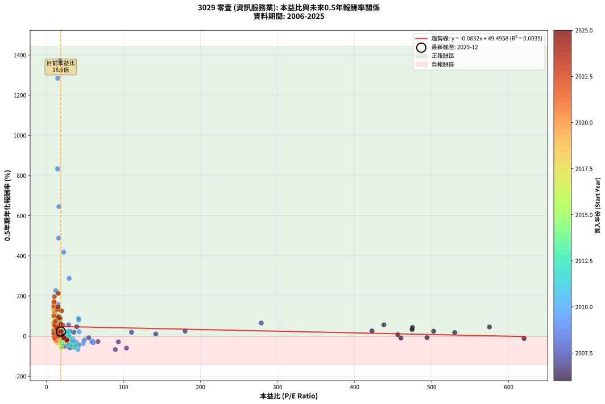
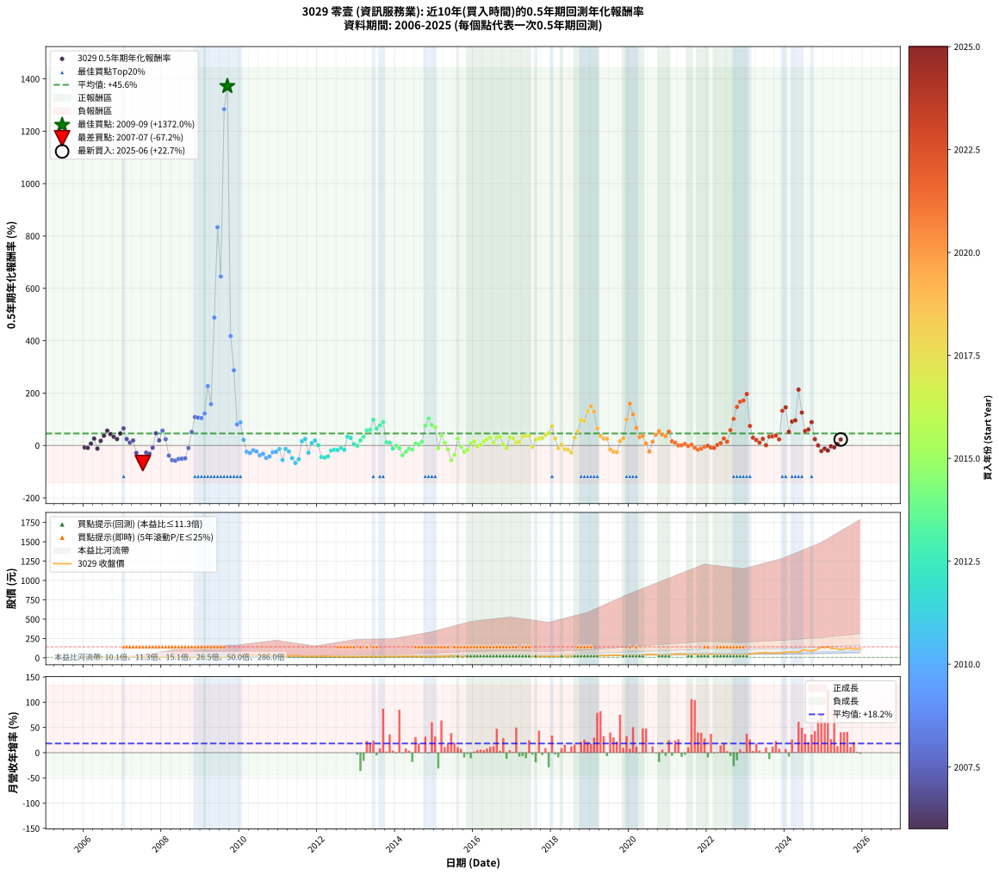

# 3029 零壹 - 本益比與未來報酬率分析

!!! info "報告資訊"
    - **股票代號**: 3029
    - **公司名稱**: 零壹
    - **產業別**: 資訊服務業
    - **分析期間**: 2005-2025 (235 個數據點)
    - **資料來源**: Type 12 (ShowMonthlyK_ChartFlow) 月收盤價與本益比
    - **報酬率口徑**: 含現金股利 (簡化: 年度合計，假設每年7/1入帳)
    - **報告生成時間**: 2025-12-23 12:15:20 CST

## 📈 視覺化圖表

### 圖表1: 本益比 vs 未來報酬率關係

*圖表1：3029 零壹 本益比與0.5年期未來報酬率關係 (2005-2025)*

### 圖表2: 歷年買入時點的0.5年期實際報酬率

*圖表2：3029 零壹 歷年買入時點的0.5年期實際報酬率 (2005-2025)*

## 📍 買點訊號說明

本報告提供兩種買點提示訊號（顯示於圖表2的股價子圖中）：

### ▲ 小綠色三角形（回測驗證）
- **計算方式**: 使用全部歷史資料計算本益比第25百分位數
- **用途**: 事後驗證，顯示歷史上哪些時點確實為低估區
- **限制**: 當下無法判斷，僅供回測參考
- **特性**: 後見之明（Look-Ahead Bias）

### ▲ 小橘色三角形（即時訊號）
- **計算方式**: 使用截至當月的過去5年資料計算本益比第25百分位數
- **用途**: 實際投資決策，當時即可判斷
- **優勢**: 可操作性強，符合實務需求
- **特性**: 無後見之明，滾動窗口計算

!!! tip "如何使用兩種訊號"
    - **綠色▲** 幫助理解歷史估值機會，驗證策略有效性
    - **橘色▲** 可作為實際買進參考，但仍需搭配基本面分析
    - 兩種訊號重疊時，表示即時判斷與事後驗證一致，信心度較高
    - 僅有綠色▲時，表示當時無法判斷（需要未來資料才能確認）
    - 僅有橘色▲時，表示即時判斷為買點，但事後可能不是最佳時機

## 📊 估值分析摘要

| 指標 | 數值 |
|:---:|:---:|
| **目前本益比** (2025-06) | **18.55 倍** |
| **歷史平均本益比** | 27.93 倍 |
| **估值水準** | 🟢 相對低估 |
| **預期0.5年年化報酬率** | **+47.21%** |
| **歷史平均報酬率** | +45.44% |
| **相關係數 (R²)** | 0.0035 |
| **趨勢線斜率** | -0.1881 |

!!! abstract "核心洞察"
    目前本益比顯著低於歷史平均，預期未來報酬率可能較高

    根據歷史數據回測，3029 零壹 在目前本益比 **18.6倍** 的估值水準下，
    預期未來0.5年年化報酬率約為 **+47.2%**。

    **重要提醒**: 本分析基於歷史數據統計，實際報酬率會受到公司基本面變化、產業趨勢、
    總體經濟環境等多重因素影響。R² = 0.00 表示本益比可解釋約 0.4% 的報酬率變異。

## 📈 歷史估值統計

### 最佳買點 (最高報酬率)

| 項目 | 數值 |
|:---:|:---:|
| 起始時間 | 2009-09 |
| 當時本益比 | 17.63 倍 |
| 起始價格 | 10.1 元 |
| 0.5年後價格 | 38.1 元 |
| **0.5年年化報酬率** | **+1372.01%** |

### 最差買點 (最低報酬率)

| 項目 | 數值 |
|:---:|:---:|
| 起始時間 | 2007-07 |
| 當時本益比 | 89.38 倍 |
| 起始價格 | 14.3 元 |
| 0.5年後價格 | 8.2 元 |
| **0.5年年化報酬率** | **-67.16%** |

## 🎯 投資啟示

### 本益比與報酬率關係

趨勢線方程式: **y = -0.1881x + 50.6982**

!!! note "負相關"
    本益比與未來報酬率呈現負相關。較低的本益比通常帶來較高的未來報酬率，
    但相關性不算非常強。**估值仍是重要參考指標之一**。

### 估值區間建議

基於歷史數據分析:

- **🟢 低估區** (P/E < 22.3): 預期報酬率較高，可考慮增加持股
- **🟡 合理區** (P/E 22.3-33.5): 預期報酬率符合長期趨勢，正常持有
- **🔴 高估區** (P/E > 33.5): 預期報酬率較低，可考慮減碼或觀望

!!! danger "風險提示"
    - 過去表現不代表未來結果
    - 本分析假設公司基本面無重大結構性變化
    - 產業環境劇變可能使歷史規律失效
    - 應結合公司財報、產業趨勢、總體經濟等多重因素綜合判斷

!!! success "長期投資觀點"
    歷史數據顯示，在合理或低估的估值水準買入並長期持有，
    往往能獲得較佳的投資報酬。**耐心等待好價格**是價值投資的核心原則。

## 📊 數據品質

- **資料來源**: GoodInfo.tw Type 12 (ShowMonthlyK_ChartFlow)
- **資料頻率**: 月度收盤價與本益比
- **回測期間**: 2005-2025
- **數據點數量**: 235 個 (每個點代表一次0.5年期回測)

### 計算方法說明

1. **0.5年期年化報酬率**:
   - 對每個歷史時點，計算其後0.5年的實際投資報酬率
   - 期末價值(不含股利): 期末價格
   - 期末價值(含現金股利): 期末價格 + 持有期間內的現金股利合計 (簡化: 年度合計，假設每年7/1入帳)
   - 公式: 年化報酬率 = [(期末價值/期初價格)^(1/年數) - 1] × 100%

2. **本益比 (P/E Ratio)**:
   - 使用當時的月收盤價與EPS計算
   - 資料來源: Type 12 月度河流圖本益比數據

3. **趨勢線 (Linear Regression)**:
   - 使用最小平方法擬合線性趨勢線
   - R²值衡量本益比對報酬率的解釋能力

---

*本報告由 Stock Analysis System v1.9.0 自動生成*
*數據更新時間: 2025-12-23 12:15:20 CST*

## 📋 月度回測明細表

（每一列對應時間線圖中的一個買入點；可用來對照 SVG 圖上的每個點。）

| 買入月份 | 賣出月份 | 回測期限_年 | 實際持有年數 | 買入本益比_倍 | 買入收盤價_元 | 賣出收盤價_元 | 現金股利合計_元 | 總報酬率_pct | 年化報酬率_pct |
| --- | --- | --- | --- | --- | --- | --- | --- | --- | --- |
| 2005-12 | 2006-07 | 0.5 | 0.580 | 36.79 | 10.30 | 9.50 | 0.00 | -7.77 | -13.00 |
| 2006-01 | 2006-07 | 0.5 | 0.496 | 38.25 | 9.88 | 9.50 | 0.00 | -3.85 | -7.61 |
| 2006-02 | 2006-08 | 0.5 | 0.498 | 38.87 | 9.20 | 8.76 | 0.00 | -4.78 | -9.37 |
| 2006-03 | 2006-10 | 0.5 | 0.586 | 42.42 | 9.12 | 9.49 | 0.00 | +4.06 | +7.02 |
| 2006-04 | 2006-10 | 0.5 | 0.501 | 43.71 | 8.45 | 9.49 | 0.00 | +12.31 | +26.07 |
| 2006-05 | 2006-12 | 0.5 | 0.586 | 72.23 | 12.40 | 11.50 | 0.00 | -7.26 | -12.07 |
| 2006-06 | 2006-12 | 0.5 | 0.501 | 70.67 | 10.60 | 11.50 | 0.00 | +8.49 | +17.66 |
| 2006-07 | 2007-01 | 0.5 | 0.504 | 74.03 | 9.50 | 11.15 | 0.00 | +17.37 | +37.42 |
| 2006-08 | 2007-03 | 0.5 | 0.580 | 82.12 | 8.76 | 11.35 | 0.00 | +29.57 | +56.25 |
| 2006-09 | 2007-03 | 0.5 | 0.496 | 111.80 | 9.50 | 11.35 | 0.00 | +19.47 | +43.20 |
| 2006-10 | 2007-05 | 0.5 | 0.580 | 149.80 | 9.49 | 11.20 | 0.00 | +18.02 | +33.03 |
| 2006-11 | 2007-05 | 0.5 | 0.496 | 241.20 | 10.05 | 11.20 | 0.00 | +11.44 | +24.44 |
| 2006-12 | 2007-07 | 0.5 | 0.580 | 575.00 | 11.50 | 14.30 | 0.00 | +24.35 | +45.56 |
| 2007-01 | 2007-07 | 0.5 | 0.496 | 278.80 | 11.15 | 14.30 | 0.00 | +28.25 | +65.22 |
| 2007-02 | 2007-08 | 0.5 | 0.498 | 180.00 | 10.80 | 12.05 | 0.00 | +11.57 | +24.58 |
| 2007-03 | 2007-10 | 0.5 | 0.586 | 141.90 | 11.35 | 12.05 | 0.00 | +6.17 | +10.75 |
| 2007-04 | 2007-10 | 0.5 | 0.501 | 110.50 | 11.05 | 12.05 | 0.00 | +9.05 | +18.88 |
| 2007-05 | 2007-12 | 0.5 | 0.586 | 93.33 | 11.20 | 9.20 | 0.00 | -17.86 | -28.52 |
| 2007-06 | 2007-12 | 0.5 | 0.501 | 103.90 | 14.55 | 9.20 | 0.00 | -36.77 | -59.94 |
| 2007-07 | 2008-01 | 0.5 | 0.504 | 89.38 | 14.30 | 8.16 | 0.00 | -42.94 | -67.16 |
| 2007-08 | 2008-03 | 0.5 | 0.583 | 66.94 | 12.05 | 10.00 | 0.00 | -17.01 | -27.37 |
| 2007-09 | 2008-03 | 0.5 | 0.498 | 60.50 | 12.10 | 10.00 | 0.00 | -17.36 | -31.79 |
| 2007-10 | 2008-05 | 0.5 | 0.583 | 54.77 | 12.05 | 11.45 | 0.00 | -4.98 | -8.39 |
| 2007-11 | 2008-05 | 0.5 | 0.498 | 39.42 | 9.46 | 11.45 | 0.00 | +21.04 | +46.69 |
| 2007-12 | 2008-07 | 0.5 | 0.583 | 35.38 | 9.20 | 9.60 | 0.60 | +10.87 | +19.36 |
| 2008-01 | 2008-07 | 0.5 | 0.498 | 28.80 | 8.16 | 9.60 | 0.60 | +25.00 | +56.49 |
| 2008-02 | 2008-08 | 0.5 | 0.501 | 30.62 | 9.39 | 9.85 | 0.60 | +11.29 | +23.80 |
| 2008-03 | 2008-10 | 0.5 | 0.586 | 30.30 | 10.00 | 6.90 | 0.60 | -25.00 | -38.80 |
| 2008-04 | 2008-10 | 0.5 | 0.501 | 32.12 | 11.35 | 6.90 | 0.60 | -33.92 | -56.26 |
| 2008-05 | 2008-12 | 0.5 | 0.586 | 30.40 | 11.45 | 6.30 | 0.60 | -39.74 | -57.87 |
| 2008-06 | 2008-12 | 0.5 | 0.501 | 24.78 | 9.91 | 6.30 | 0.60 | -30.37 | -51.45 |
| 2008-07 | 2009-01 | 0.5 | 0.504 | 22.68 | 9.60 | 6.73 | 0.00 | -29.90 | -50.59 |
| 2008-08 | 2009-03 | 0.5 | 0.580 | 22.05 | 9.85 | 6.65 | 0.00 | -32.49 | -49.18 |
| 2008-09 | 2009-03 | 0.5 | 0.496 | 14.89 | 7.00 | 6.65 | 0.00 | -5.00 | -9.83 |
| 2008-10 | 2009-05 | 0.5 | 0.580 | 13.99 | 6.90 | 8.78 | 0.00 | +27.25 | +51.46 |
| 2008-11 | 2009-05 | 0.5 | 0.496 | 11.81 | 6.10 | 8.78 | 0.00 | +43.93 | +108.53 |
| 2008-12 | 2009-07 | 0.5 | 0.580 | 11.67 | 6.30 | 9.09 | 0.50 | +52.25 | +106.32 |
| 2009-01 | 2009-07 | 0.5 | 0.496 | 12.39 | 6.73 | 9.09 | 0.50 | +42.53 | +104.43 |
| 2009-02 | 2009-08 | 0.5 | 0.498 | 10.81 | 5.91 | 8.29 | 0.50 | +48.76 | +121.91 |
| 2009-03 | 2009-10 | 0.5 | 0.586 | 12.09 | 6.65 | 12.80 | 0.50 | +100.03 | +226.51 |
| 2009-04 | 2009-10 | 0.5 | 0.501 | 14.96 | 8.28 | 12.80 | 0.50 | +60.65 | +157.59 |
| 2009-05 | 2009-12 | 0.5 | 0.586 | 15.77 | 8.78 | 24.30 | 0.50 | +182.48 | +488.49 |
| 2009-06 | 2009-12 | 0.5 | 0.501 | 14.46 | 8.10 | 24.30 | 0.50 | +206.20 | +833.28 |
| 2009-07 | 2010-01 | 0.5 | 0.504 | 16.14 | 9.09 | 25.00 | 0.00 | +175.03 | +645.05 |
| 2009-08 | 2010-03 | 0.5 | 0.580 | 14.63 | 8.29 | 38.10 | 0.00 | +359.59 | +1284.15 |
| 2009-09 | 2010-03 | 0.5 | 0.496 | 17.63 | 10.05 | 38.10 | 0.00 | +279.10 | +1372.01 |
| 2009-10 | 2010-05 | 0.5 | 0.580 | 22.33 | 12.80 | 33.25 | 0.00 | +159.77 | +417.93 |
| 2009-11 | 2010-05 | 0.5 | 0.496 | 29.48 | 17.00 | 33.25 | 0.00 | +95.59 | +287.18 |
| 2009-12 | 2010-07 | 0.5 | 0.580 | 41.90 | 24.30 | 33.70 | 0.50 | +40.74 | +80.18 |
| 2010-01 | 2010-07 | 0.5 | 0.496 | 41.78 | 25.00 | 33.70 | 0.50 | +36.80 | +88.20 |
| 2010-02 | 2010-08 | 0.5 | 0.498 | 42.32 | 26.10 | 28.25 | 0.50 | +10.15 | +21.42 |
| 2010-03 | 2010-10 | 0.5 | 0.586 | 60.00 | 38.10 | 31.85 | 0.50 | -15.09 | -24.36 |
| 2010-04 | 2010-10 | 0.5 | 0.501 | 58.70 | 38.35 | 31.85 | 0.50 | -15.65 | -28.79 |
| 2010-05 | 2010-12 | 0.5 | 0.586 | 49.50 | 33.25 | 29.05 | 0.50 | -11.13 | -18.24 |
| 2010-06 | 2010-12 | 0.5 | 0.501 | 48.77 | 33.65 | 29.05 | 0.50 | -12.18 | -22.84 |
| 2010-07 | 2011-01 | 0.5 | 0.504 | 47.58 | 33.70 | 26.60 | 0.00 | -21.07 | -37.48 |
| 2010-08 | 2011-03 | 0.5 | 0.580 | 38.88 | 28.25 | 22.60 | 0.00 | -20.00 | -31.92 |
| 2010-09 | 2011-03 | 0.5 | 0.496 | 41.88 | 31.20 | 22.60 | 0.00 | -27.56 | -47.83 |
| 2010-10 | 2011-05 | 0.5 | 0.580 | 41.72 | 31.85 | 23.20 | 0.00 | -27.16 | -42.07 |
| 2010-11 | 2011-05 | 0.5 | 0.496 | 34.41 | 26.90 | 23.20 | 0.00 | -13.75 | -25.81 |
| 2010-12 | 2011-07 | 0.5 | 0.580 | 36.31 | 29.05 | 24.05 | 0.70 | -14.80 | -24.12 |
| 2011-01 | 2011-07 | 0.5 | 0.496 | 34.18 | 26.60 | 24.05 | 0.70 | -6.95 | -13.54 |
| 2011-02 | 2011-08 | 0.5 | 0.498 | 36.01 | 27.25 | 17.50 | 0.70 | -33.21 | -55.52 |
| 2011-03 | 2011-10 | 0.5 | 0.586 | 30.75 | 22.60 | 20.05 | 0.70 | -8.19 | -13.56 |
| 2011-04 | 2011-10 | 0.5 | 0.501 | 33.15 | 23.65 | 20.05 | 0.70 | -12.26 | -22.98 |
| 2011-05 | 2011-12 | 0.5 | 0.586 | 33.54 | 23.20 | 15.00 | 0.70 | -32.33 | -48.65 |
| 2011-06 | 2011-12 | 0.5 | 0.501 | 40.82 | 27.35 | 15.00 | 0.70 | -42.60 | -66.97 |
| 2011-07 | 2012-01 | 0.5 | 0.504 | 37.10 | 24.05 | 16.50 | 0.00 | -31.39 | -52.66 |
| 2011-08 | 2012-03 | 0.5 | 0.583 | 27.93 | 17.50 | 19.10 | 0.00 | +9.14 | +16.19 |
| 2011-09 | 2012-03 | 0.5 | 0.498 | 28.26 | 17.10 | 19.10 | 0.00 | +11.70 | +24.85 |
| 2011-10 | 2012-05 | 0.5 | 0.583 | 34.37 | 20.05 | 16.60 | 0.00 | -17.21 | -27.66 |
| 2011-11 | 2012-05 | 0.5 | 0.498 | 28.31 | 15.90 | 16.60 | 0.00 | +4.40 | +9.03 |
| 2011-12 | 2012-07 | 0.5 | 0.583 | 27.78 | 15.00 | 15.90 | 0.70 | +10.67 | +18.98 |
| 2012-01 | 2012-07 | 0.5 | 0.498 | 29.28 | 16.50 | 15.90 | 0.70 | +0.61 | +1.22 |
| 2012-02 | 2012-08 | 0.5 | 0.501 | 37.73 | 22.15 | 15.85 | 0.70 | -25.28 | -44.11 |
| 2012-03 | 2012-10 | 0.5 | 0.586 | 31.28 | 19.10 | 12.55 | 0.70 | -30.63 | -46.43 |
| 2012-04 | 2012-10 | 0.5 | 0.501 | 27.44 | 17.40 | 12.55 | 0.70 | -23.85 | -41.95 |
| 2012-05 | 2012-12 | 0.5 | 0.586 | 25.24 | 16.60 | 13.95 | 0.70 | -11.75 | -19.21 |
| 2012-06 | 2012-12 | 0.5 | 0.501 | 23.56 | 16.05 | 13.95 | 0.70 | -8.72 | -16.65 |
| 2012-07 | 2013-01 | 0.5 | 0.504 | 22.56 | 15.90 | 14.45 | 0.00 | -9.12 | -17.29 |
| 2012-08 | 2013-03 | 0.5 | 0.580 | 21.76 | 15.85 | 14.95 | 0.00 | -5.68 | -9.58 |
| 2012-09 | 2013-03 | 0.5 | 0.496 | 21.74 | 16.35 | 14.95 | 0.00 | -8.56 | -16.53 |
| 2012-10 | 2013-05 | 0.5 | 0.580 | 16.18 | 12.55 | 14.85 | 0.00 | +18.33 | +33.63 |
| 2012-11 | 2013-05 | 0.5 | 0.496 | 16.40 | 13.10 | 14.85 | 0.00 | +13.36 | +28.79 |
| 2012-12 | 2013-07 | 0.5 | 0.580 | 16.96 | 13.95 | 13.55 | 0.80 | +2.87 | +4.99 |
| 2013-01 | 2013-07 | 0.5 | 0.496 | 17.48 | 14.45 | 13.55 | 0.80 | -0.69 | -1.39 |
| 2013-02 | 2013-08 | 0.5 | 0.498 | 16.86 | 14.00 | 14.50 | 0.80 | +9.29 | +19.51 |
| 2013-03 | 2013-10 | 0.5 | 0.586 | 17.92 | 14.95 | 16.90 | 0.80 | +18.39 | +33.40 |
| 2013-04 | 2013-10 | 0.5 | 0.501 | 16.82 | 14.10 | 16.90 | 0.80 | +25.53 | +57.44 |
| 2013-05 | 2013-12 | 0.5 | 0.586 | 17.63 | 14.85 | 18.70 | 0.80 | +31.31 | +59.19 |
| 2013-06 | 2013-12 | 0.5 | 0.501 | 16.37 | 13.85 | 18.70 | 0.80 | +40.79 | +97.95 |
| 2013-07 | 2014-01 | 0.5 | 0.504 | 15.94 | 13.55 | 17.40 | 0.00 | +28.41 | +64.28 |
| 2013-08 | 2014-03 | 0.5 | 0.580 | 16.98 | 14.50 | 20.20 | 0.00 | +39.31 | +77.04 |
| 2013-09 | 2014-03 | 0.5 | 0.496 | 17.13 | 14.70 | 20.20 | 0.00 | +37.41 | +89.91 |
| 2013-10 | 2014-05 | 0.5 | 0.580 | 19.60 | 16.90 | 18.05 | 0.00 | +6.80 | +12.01 |
| 2013-11 | 2014-05 | 0.5 | 0.496 | 19.80 | 17.15 | 18.05 | 0.00 | +5.25 | +10.87 |
| 2013-12 | 2014-07 | 0.5 | 0.580 | 21.49 | 18.70 | 16.50 | 0.85 | -7.22 | -12.11 |
| 2014-01 | 2014-07 | 0.5 | 0.496 | 19.42 | 17.40 | 16.50 | 0.85 | -0.29 | -0.58 |
| 2014-02 | 2014-08 | 0.5 | 0.498 | 19.69 | 18.15 | 16.30 | 0.85 | -5.51 | -10.75 |
| 2014-03 | 2014-10 | 0.5 | 0.586 | 21.32 | 20.20 | 14.50 | 0.85 | -24.01 | -37.41 |
| 2014-04 | 2014-10 | 0.5 | 0.501 | 18.08 | 17.60 | 14.50 | 0.85 | -12.78 | -23.89 |
| 2014-05 | 2014-12 | 0.5 | 0.586 | 18.07 | 18.05 | 15.90 | 0.85 | -7.20 | -11.98 |
| 2014-06 | 2014-12 | 0.5 | 0.501 | 17.85 | 18.30 | 15.90 | 0.85 | -8.47 | -16.19 |
| 2014-07 | 2015-01 | 0.5 | 0.504 | 15.70 | 16.50 | 17.10 | 0.00 | +3.64 | +7.35 |
| 2014-08 | 2015-03 | 0.5 | 0.580 | 15.14 | 16.30 | 16.60 | 0.00 | +1.84 | +3.19 |
| 2014-09 | 2015-03 | 0.5 | 0.496 | 14.10 | 15.55 | 16.60 | 0.00 | +6.75 | +14.09 |
| 2014-10 | 2015-05 | 0.5 | 0.580 | 12.85 | 14.50 | 20.10 | 0.00 | +38.62 | +75.53 |
| 2014-11 | 2015-05 | 0.5 | 0.496 | 12.26 | 14.15 | 20.10 | 0.00 | +42.05 | +103.06 |
| 2014-12 | 2015-07 | 0.5 | 0.580 | 13.47 | 15.90 | 21.80 | 0.41 | +39.67 | +77.82 |
| 2015-01 | 2015-07 | 0.5 | 0.496 | 14.03 | 17.10 | 21.80 | 0.41 | +29.87 | +69.44 |
| 2015-02 | 2015-08 | 0.5 | 0.498 | 13.51 | 17.00 | 15.65 | 0.41 | -5.55 | -10.82 |
| 2015-03 | 2015-10 | 0.5 | 0.586 | 12.79 | 16.60 | 19.65 | 0.41 | +20.83 | +38.11 |
| 2015-04 | 2015-10 | 0.5 | 0.501 | 14.25 | 19.05 | 19.65 | 0.41 | +5.29 | +10.83 |
| 2015-05 | 2015-12 | 0.5 | 0.586 | 14.61 | 20.10 | 17.85 | 0.41 | -9.17 | -15.14 |
| 2015-06 | 2015-12 | 0.5 | 0.501 | 19.68 | 27.85 | 17.85 | 0.41 | -34.45 | -56.95 |
| 2015-07 | 2016-01 | 0.5 | 0.504 | 14.99 | 21.80 | 17.40 | 0.00 | -20.18 | -36.08 |
| 2015-08 | 2016-03 | 0.5 | 0.583 | 10.48 | 15.65 | 17.95 | 0.00 | +14.70 | +26.51 |
| 2015-09 | 2016-03 | 0.5 | 0.498 | 12.04 | 18.45 | 17.95 | 0.00 | -2.71 | -5.36 |
| 2015-10 | 2016-05 | 0.5 | 0.583 | 12.50 | 19.65 | 16.70 | 0.00 | -15.01 | -24.34 |
| 2015-11 | 2016-05 | 0.5 | 0.498 | 11.33 | 18.25 | 16.70 | 0.00 | -8.49 | -16.32 |
| 2015-12 | 2016-07 | 0.5 | 0.583 | 10.82 | 17.85 | 17.70 | 1.00 | +4.76 | +8.30 |
| 2016-01 | 2016-07 | 0.5 | 0.498 | 10.44 | 17.40 | 17.70 | 1.00 | +7.47 | +15.56 |
| 2016-02 | 2016-08 | 0.5 | 0.501 | 10.72 | 18.05 | 16.75 | 1.00 | -1.66 | -3.29 |
| 2016-03 | 2016-10 | 0.5 | 0.586 | 10.56 | 17.95 | 17.25 | 1.00 | +1.67 | +2.87 |
| 2016-04 | 2016-10 | 0.5 | 0.501 | 9.90 | 17.00 | 17.25 | 1.00 | +7.35 | +15.21 |
| 2016-05 | 2016-12 | 0.5 | 0.586 | 9.63 | 16.70 | 17.90 | 1.00 | +13.17 | +23.52 |
| 2016-06 | 2016-12 | 0.5 | 0.501 | 9.46 | 16.55 | 17.90 | 1.00 | +14.20 | +30.34 |
| 2016-07 | 2017-01 | 0.5 | 0.504 | 10.02 | 17.70 | 18.60 | 0.00 | +5.08 | +10.35 |
| 2016-08 | 2017-03 | 0.5 | 0.580 | 9.39 | 16.75 | 19.60 | 0.00 | +17.01 | +31.09 |
| 2016-09 | 2017-03 | 0.5 | 0.496 | 9.47 | 17.05 | 19.60 | 0.00 | +14.96 | +32.48 |
| 2016-10 | 2017-05 | 0.5 | 0.580 | 9.50 | 17.25 | 17.60 | 0.00 | +2.03 | +3.52 |
| 2016-11 | 2017-05 | 0.5 | 0.496 | 10.15 | 18.60 | 17.60 | 0.00 | -5.38 | -10.55 |
| 2016-12 | 2017-07 | 0.5 | 0.580 | 9.68 | 17.90 | 19.75 | 1.20 | +17.04 | +31.14 |
| 2017-01 | 2017-07 | 0.5 | 0.496 | 10.16 | 18.60 | 19.75 | 1.20 | +12.63 | +27.14 |
| 2017-02 | 2017-08 | 0.5 | 0.498 | 10.66 | 19.30 | 19.00 | 1.20 | +4.66 | +9.58 |
| 2017-03 | 2017-10 | 0.5 | 0.586 | 10.95 | 19.60 | 19.95 | 1.20 | +7.91 | +13.87 |
| 2017-04 | 2017-10 | 0.5 | 0.501 | 10.34 | 18.30 | 19.95 | 1.20 | +15.57 | +33.49 |
| 2017-05 | 2017-12 | 0.5 | 0.586 | 10.06 | 17.60 | 20.05 | 1.20 | +20.74 | +37.94 |
| 2017-06 | 2017-12 | 0.5 | 0.501 | 10.52 | 18.20 | 20.05 | 1.20 | +16.76 | +36.24 |
| 2017-07 | 2018-01 | 0.5 | 0.504 | 11.55 | 19.75 | 19.15 | 0.00 | -3.04 | -5.94 |
| 2017-08 | 2018-03 | 0.5 | 0.580 | 11.24 | 19.00 | 21.30 | 0.00 | +12.11 | +21.76 |
| 2017-09 | 2018-03 | 0.5 | 0.496 | 11.35 | 18.95 | 21.30 | 0.00 | +12.40 | +26.61 |
| 2017-10 | 2018-05 | 0.5 | 0.580 | 12.09 | 19.95 | 23.00 | 0.00 | +15.29 | +27.78 |
| 2017-11 | 2018-05 | 0.5 | 0.496 | 11.96 | 19.50 | 23.00 | 0.00 | +17.95 | +39.53 |
| 2017-12 | 2018-07 | 0.5 | 0.580 | 12.45 | 20.05 | 23.85 | 1.30 | +25.44 | +47.77 |
| 2018-01 | 2018-07 | 0.5 | 0.496 | 11.62 | 19.15 | 23.85 | 1.30 | +31.33 | +73.33 |
| 2018-02 | 2018-08 | 0.5 | 0.498 | 11.78 | 19.85 | 21.00 | 1.30 | +12.34 | +26.31 |
| 2018-03 | 2018-10 | 0.5 | 0.586 | 12.37 | 21.30 | 18.65 | 1.30 | -6.34 | -10.57 |
| 2018-04 | 2018-10 | 0.5 | 0.501 | 11.19 | 19.70 | 18.65 | 1.30 | +1.27 | +2.55 |
| 2018-05 | 2018-12 | 0.5 | 0.586 | 12.80 | 23.00 | 19.65 | 1.30 | -8.91 | -14.73 |
| 2018-06 | 2018-12 | 0.5 | 0.501 | 12.45 | 22.85 | 19.65 | 1.30 | -8.32 | -15.91 |
| 2018-07 | 2019-01 | 0.5 | 0.504 | 12.74 | 23.85 | 20.30 | 0.00 | -14.88 | -27.38 |
| 2018-08 | 2019-03 | 0.5 | 0.580 | 10.99 | 21.00 | 24.45 | 0.00 | +16.43 | +29.96 |
| 2018-09 | 2019-03 | 0.5 | 0.496 | 10.14 | 19.75 | 24.45 | 0.00 | +23.80 | +53.85 |
| 2018-10 | 2019-05 | 0.5 | 0.580 | 9.40 | 18.65 | 27.65 | 0.00 | +48.26 | +97.08 |
| 2018-11 | 2019-05 | 0.5 | 0.496 | 9.86 | 19.95 | 27.65 | 0.00 | +38.60 | +93.22 |
| 2018-12 | 2019-07 | 0.5 | 0.580 | 9.54 | 19.65 | 30.45 | 1.50 | +62.58 | +131.02 |
| 2019-01 | 2019-07 | 0.5 | 0.496 | 9.55 | 20.30 | 30.45 | 1.50 | +57.37 | +149.69 |
| 2019-02 | 2019-08 | 0.5 | 0.498 | 10.49 | 23.00 | 33.30 | 1.50 | +51.29 | +129.54 |
| 2019-03 | 2019-10 | 0.5 | 0.586 | 10.83 | 24.45 | 31.30 | 1.50 | +34.14 | +65.09 |
| 2019-04 | 2019-10 | 0.5 | 0.501 | 12.09 | 28.10 | 31.30 | 1.50 | +16.72 | +36.14 |
| 2019-05 | 2019-12 | 0.5 | 0.586 | 11.57 | 27.65 | 30.15 | 1.50 | +14.46 | +25.92 |
| 2019-06 | 2019-12 | 0.5 | 0.501 | 11.49 | 28.20 | 30.15 | 1.50 | +12.22 | +25.88 |
| 2019-07 | 2020-01 | 0.5 | 0.504 | 12.08 | 30.45 | 28.00 | 0.00 | -8.05 | -15.34 |
| 2019-08 | 2020-03 | 0.5 | 0.583 | 12.87 | 33.30 | 28.35 | 0.00 | -14.86 | -24.12 |
| 2019-09 | 2020-03 | 0.5 | 0.498 | 12.38 | 32.85 | 28.35 | 0.00 | -13.70 | -25.60 |
| 2019-10 | 2020-05 | 0.5 | 0.583 | 11.51 | 31.30 | 34.20 | 0.00 | +9.27 | +16.41 |
| 2019-11 | 2020-05 | 0.5 | 0.498 | 10.90 | 30.35 | 34.20 | 0.00 | +12.69 | +27.08 |
| 2019-12 | 2020-07 | 0.5 | 0.583 | 10.58 | 30.15 | 43.05 | 2.01 | +49.45 | +99.18 |
| 2020-01 | 2020-07 | 0.5 | 0.498 | 9.63 | 28.00 | 43.05 | 2.01 | +60.93 | +159.83 |
| 2020-02 | 2020-08 | 0.5 | 0.501 | 10.25 | 30.40 | 42.95 | 2.01 | +47.89 | +118.38 |
| 2020-03 | 2020-10 | 0.5 | 0.586 | 9.37 | 28.35 | 36.30 | 2.01 | +35.13 | +67.18 |
| 2020-04 | 2020-10 | 0.5 | 0.501 | 10.82 | 33.35 | 36.30 | 2.01 | +14.87 | +31.88 |
| 2020-05 | 2020-12 | 0.5 | 0.586 | 10.89 | 34.20 | 39.05 | 2.01 | +20.06 | +36.62 |
| 2020-06 | 2020-12 | 0.5 | 0.501 | 12.38 | 39.60 | 39.05 | 2.01 | +3.69 | +7.49 |
| 2020-07 | 2021-01 | 0.5 | 0.504 | 13.21 | 43.05 | 37.70 | 0.00 | -12.43 | -23.16 |
| 2020-08 | 2021-03 | 0.5 | 0.580 | 12.95 | 42.95 | 46.40 | 0.00 | +8.03 | +14.24 |
| 2020-09 | 2021-03 | 0.5 | 0.496 | 11.60 | 39.15 | 46.40 | 0.00 | +18.52 | +40.90 |
| 2020-10 | 2021-05 | 0.5 | 0.580 | 10.57 | 36.30 | 46.80 | 0.00 | +28.93 | +54.92 |
| 2020-11 | 2021-05 | 0.5 | 0.496 | 11.28 | 39.40 | 46.80 | 0.00 | +18.78 | +41.53 |
| 2020-12 | 2021-07 | 0.5 | 0.580 | 11.00 | 39.05 | 43.55 | 3.00 | +19.21 | +35.35 |
| 2021-01 | 2021-07 | 0.5 | 0.496 | 10.45 | 37.70 | 43.55 | 3.00 | +23.48 | +53.05 |
| 2021-02 | 2021-08 | 0.5 | 0.498 | 11.90 | 43.60 | 43.85 | 3.00 | +7.46 | +15.53 |
| 2021-03 | 2021-10 | 0.5 | 0.586 | 12.46 | 46.40 | 46.10 | 3.00 | +5.82 | +10.14 |
| 2021-04 | 2021-10 | 0.5 | 0.501 | 12.98 | 49.05 | 46.10 | 3.00 | +0.10 | +0.21 |
| 2021-05 | 2021-12 | 0.5 | 0.586 | 12.20 | 46.80 | 44.00 | 3.00 | +0.43 | +0.73 |
| 2021-06 | 2021-12 | 0.5 | 0.501 | 11.73 | 45.70 | 44.00 | 3.00 | +2.85 | +5.76 |
| 2021-07 | 2022-01 | 0.5 | 0.504 | 11.02 | 43.55 | 43.10 | 0.00 | -1.03 | -2.04 |
| 2021-08 | 2022-03 | 0.5 | 0.580 | 10.94 | 43.85 | 44.55 | 0.00 | +1.60 | +2.77 |
| 2021-09 | 2022-03 | 0.5 | 0.496 | 11.46 | 46.60 | 44.55 | 0.00 | -4.40 | -8.68 |
| 2021-10 | 2022-05 | 0.5 | 0.580 | 11.18 | 46.10 | 41.65 | 0.00 | -9.65 | -16.05 |
| 2021-11 | 2022-05 | 0.5 | 0.496 | 10.60 | 44.35 | 41.65 | 0.00 | -6.09 | -11.90 |
| 2021-12 | 2022-07 | 0.5 | 0.580 | 10.38 | 44.00 | 39.20 | 3.60 | -2.72 | -4.64 |
| 2022-01 | 2022-07 | 0.5 | 0.496 | 10.21 | 43.10 | 39.20 | 3.60 | -0.69 | -1.39 |
| 2022-02 | 2022-08 | 0.5 | 0.498 | 11.36 | 47.75 | 42.20 | 3.60 | -4.08 | -8.02 |
| 2022-03 | 2022-10 | 0.5 | 0.586 | 10.64 | 44.55 | 38.45 | 3.60 | -5.60 | -9.38 |
| 2022-04 | 2022-10 | 0.5 | 0.501 | 9.99 | 41.65 | 38.45 | 3.60 | +0.97 | +1.94 |
| 2022-05 | 2022-12 | 0.5 | 0.586 | 10.03 | 41.65 | 40.15 | 3.60 | +5.05 | +8.77 |
| 2022-06 | 2022-12 | 0.5 | 0.501 | 9.41 | 38.90 | 40.15 | 3.60 | +12.48 | +26.45 |
| 2022-07 | 2023-01 | 0.5 | 0.504 | 9.52 | 39.20 | 41.85 | 0.00 | +6.76 | +13.87 |
| 2022-08 | 2023-03 | 0.5 | 0.580 | 10.29 | 42.20 | 55.10 | 0.00 | +30.57 | +58.33 |
| 2022-09 | 2023-03 | 0.5 | 0.496 | 9.54 | 38.95 | 55.10 | 0.00 | +41.46 | +101.37 |
| 2022-10 | 2023-05 | 0.5 | 0.580 | 9.46 | 38.45 | 65.00 | 0.00 | +69.05 | +147.08 |
| 2022-11 | 2023-05 | 0.5 | 0.496 | 9.87 | 39.95 | 65.00 | 0.00 | +62.70 | +167.05 |
| 2022-12 | 2023-07 | 0.5 | 0.580 | 9.96 | 40.15 | 68.10 | 3.60 | +78.58 | +171.55 |
| 2023-01 | 2023-07 | 0.5 | 0.496 | 10.28 | 41.85 | 68.10 | 3.60 | +71.32 | +196.36 |
| 2023-02 | 2023-08 | 0.5 | 0.498 | 11.84 | 48.65 | 60.60 | 3.60 | +31.96 | +74.46 |
| 2023-03 | 2023-10 | 0.5 | 0.586 | 13.29 | 55.10 | 60.50 | 3.60 | +16.33 | +29.46 |
| 2023-04 | 2023-10 | 0.5 | 0.501 | 13.93 | 58.30 | 60.50 | 3.60 | +9.95 | +20.83 |
| 2023-05 | 2023-12 | 0.5 | 0.586 | 15.38 | 65.00 | 65.40 | 3.60 | +6.15 | +10.72 |
| 2023-06 | 2023-12 | 0.5 | 0.501 | 14.44 | 61.60 | 65.40 | 3.60 | +12.01 | +25.40 |
| 2023-07 | 2024-01 | 0.5 | 0.504 | 15.82 | 68.10 | 68.40 | 0.00 | +0.44 | +0.88 |
| 2023-08 | 2024-03 | 0.5 | 0.583 | 13.95 | 60.60 | 71.80 | 0.00 | +18.48 | +33.75 |
| 2023-09 | 2024-03 | 0.5 | 0.498 | 14.12 | 61.90 | 71.80 | 0.00 | +15.99 | +34.68 |
| 2023-10 | 2024-05 | 0.5 | 0.583 | 13.68 | 60.50 | 73.00 | 0.00 | +20.66 | +38.00 |
| 2023-11 | 2024-05 | 0.5 | 0.498 | 14.75 | 65.80 | 73.00 | 0.00 | +10.94 | +23.17 |
| 2023-12 | 2024-07 | 0.5 | 0.583 | 14.53 | 65.40 | 103.00 | 4.00 | +63.61 | +132.61 |
| 2024-01 | 2024-07 | 0.5 | 0.498 | 15.00 | 68.40 | 103.00 | 4.00 | +56.43 | +145.47 |
| 2024-02 | 2024-08 | 0.5 | 0.501 | 16.93 | 78.20 | 92.50 | 4.00 | +23.40 | +52.15 |
| 2024-03 | 2024-10 | 0.5 | 0.586 | 15.34 | 71.80 | 101.00 | 4.00 | +46.24 | +91.31 |
| 2024-04 | 2024-10 | 0.5 | 0.501 | 15.82 | 75.00 | 101.00 | 4.00 | +40.00 | +95.73 |
| 2024-05 | 2024-12 | 0.5 | 0.586 | 15.21 | 73.00 | 138.50 | 4.00 | +95.21 | +213.19 |
| 2024-06 | 2024-12 | 0.5 | 0.501 | 19.51 | 94.80 | 138.50 | 4.00 | +50.32 | +125.57 |
| 2024-07 | 2025-01 | 0.5 | 0.504 | 20.93 | 103.00 | 128.50 | 0.00 | +24.76 | +55.13 |
| 2024-08 | 2025-03 | 0.5 | 0.580 | 18.57 | 92.50 | 122.00 | 0.00 | +31.89 | +61.11 |
| 2024-09 | 2025-03 | 0.5 | 0.496 | 17.66 | 89.00 | 122.00 | 0.00 | +37.08 | +88.97 |
| 2024-10 | 2025-05 | 0.5 | 0.580 | 19.80 | 101.00 | 114.50 | 0.00 | +13.37 | +24.13 |
| 2024-11 | 2025-05 | 0.5 | 0.496 | 22.19 | 114.50 | 114.50 | 0.00 | +0.00 | +0.00 |
| 2024-12 | 2025-07 | 0.5 | 0.580 | 26.53 | 138.50 | 115.50 | 5.00 | -13.00 | -21.33 |
| 2025-01 | 2025-07 | 0.5 | 0.496 | 24.21 | 128.50 | 115.50 | 5.00 | -6.23 | -12.17 |
| 2025-02 | 2025-08 | 0.5 | 0.498 | 26.51 | 143.00 | 123.50 | 5.00 | -10.14 | -19.31 |
| 2025-03 | 2025-10 | 0.5 | 0.586 | 22.26 | 122.00 | 114.50 | 5.00 | -2.05 | -3.47 |
| 2025-04 | 2025-10 | 0.5 | 0.501 | 22.28 | 124.00 | 114.50 | 5.00 | -3.63 | -7.11 |
| 2025-05 | 2025-12 | 0.5 | 0.586 | 20.25 | 114.50 | 118.00 | 5.00 | +7.42 | +13.00 |
| 2025-06 | 2025-12 | 0.5 | 0.501 | 18.55 | 106.50 | 118.00 | 5.00 | +15.49 | +33.31 |
