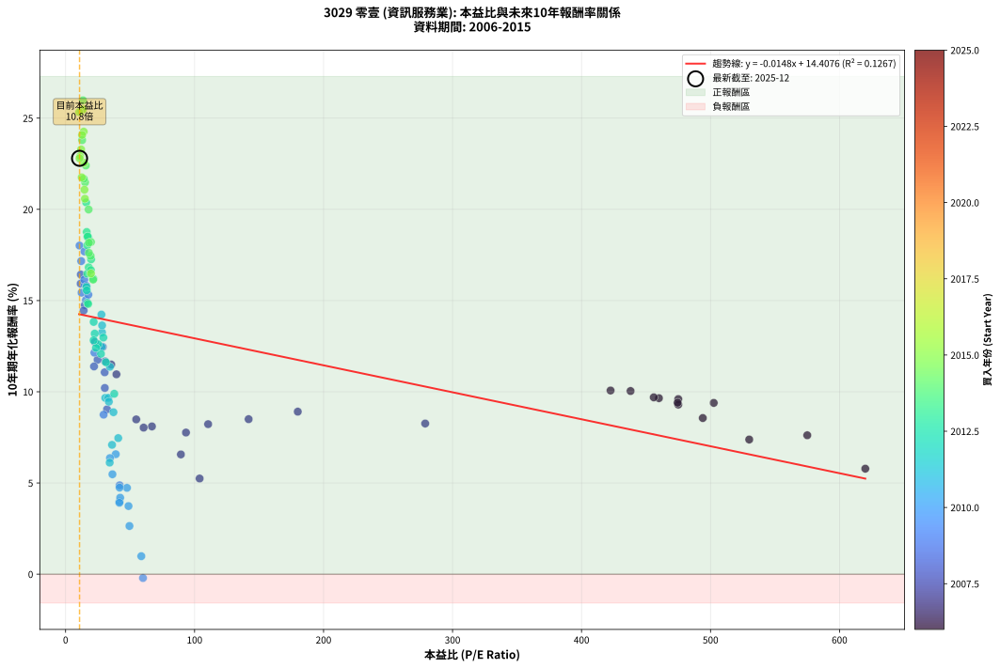
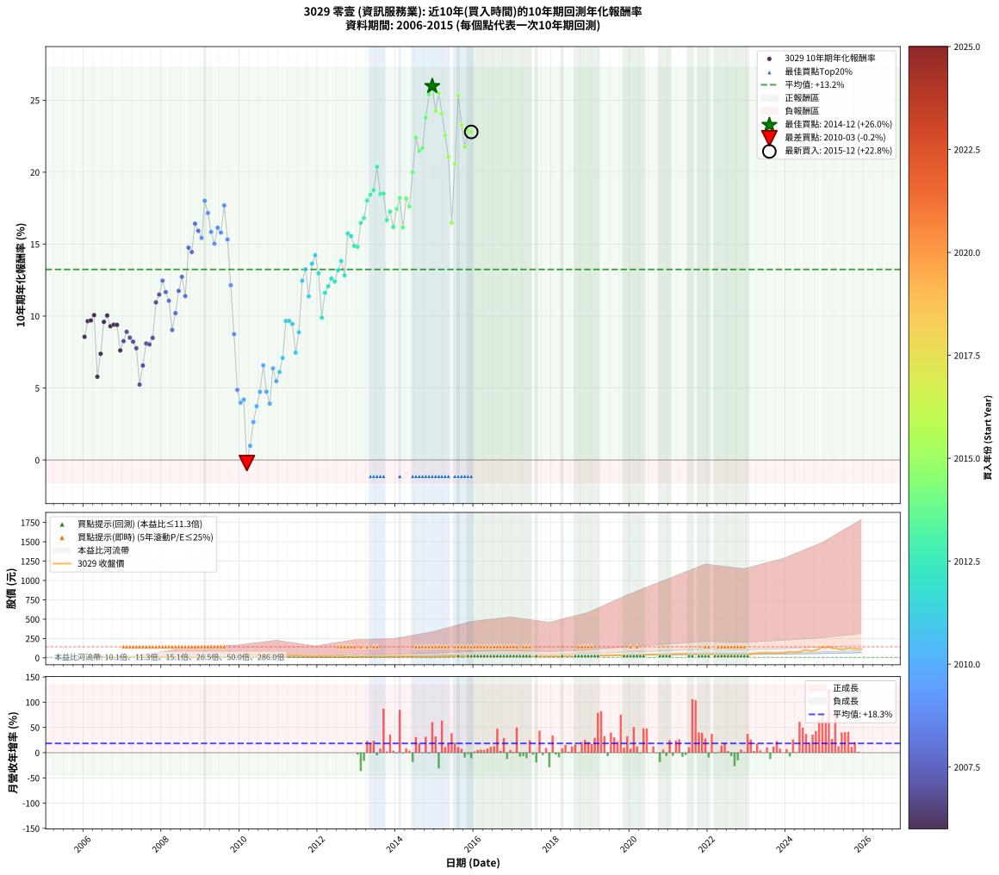

# 3029 零壹 - 本益比與未來報酬率分析

!!! info "報告資訊"
    - **股票代號**: 3029
    - **公司名稱**: 零壹
    - **產業別**: 資訊服務業
    - **分析期間**: 2006-2015 (120 個數據點)
    - **資料來源**: Type 12 (ShowMonthlyK_ChartFlow) 月收盤價與本益比
    - **報酬率口徑**: 含現金股利 (簡化: 年度合計，假設每年7/1入帳)
    - **報告生成時間**: 2026-01-06 22:50:50 CST

## 📈 視覺化圖表

### 圖表1: 本益比 vs 未來報酬率關係

*圖表1：3029 零壹 本益比與10年期未來報酬率關係 (2006-2015)*

### 圖表2: 歷年買入時點的10年期實際報酬率

*圖表2：3029 零壹 歷年買入時點的10年期實際報酬率 (2006-2015)*

## 📍 買點訊號說明

本報告提供兩種買點提示訊號（顯示於圖表2的股價子圖中）：

### ▲ 小綠色三角形（回測驗證）
- **計算方式**: 使用全部歷史資料計算本益比第25百分位數
- **用途**: 事後驗證，顯示歷史上哪些時點確實為低估區
- **限制**: 當下無法判斷，僅供回測參考
- **特性**: 後見之明（Look-Ahead Bias）

### ▲ 小橘色三角形（即時訊號）
- **計算方式**: 使用截至當月的過去5年資料計算本益比第25百分位數
- **用途**: 實際投資決策，當時即可判斷
- **優勢**: 可操作性強，符合實務需求
- **特性**: 無後見之明，滾動窗口計算

!!! tip "如何使用兩種訊號"
    - **綠色▲** 幫助理解歷史估值機會，驗證策略有效性
    - **橘色▲** 可作為實際買進參考，但仍需搭配基本面分析
    - 兩種訊號重疊時，表示即時判斷與事後驗證一致，信心度較高
    - 僅有綠色▲時，表示當時無法判斷（需要未來資料才能確認）
    - 僅有橘色▲時，表示即時判斷為買點，但事後可能不是最佳時機

## 📊 估值分析摘要

| 指標 | 數值 |
|:---:|:---:|
| **目前本益比** (2015-12) | **10.82 倍** |
| **歷史平均本益比** | 78.93 倍 |
| **估值水準** | 🟢 相對低估 |
| **預期10年年化報酬率** | **+14.25%** |
| **歷史平均報酬率** | +13.24% |
| **相關係數 (R²)** | 0.1267 |
| **趨勢線斜率** | -0.0148 |

!!! abstract "核心洞察"
    目前本益比顯著低於歷史平均，預期未來報酬率可能較高

    根據歷史數據回測，3029 零壹 在目前本益比 **10.8倍** 的估值水準下，
    預期未來10年年化報酬率約為 **+14.2%**。

    **重要提醒**: 本分析基於歷史數據統計，實際報酬率會受到公司基本面變化、產業趨勢、
    總體經濟環境等多重因素影響。R² = 0.13 表示本益比可解釋約 12.7% 的報酬率變異。

## 📈 歷史估值統計

### 最佳買點 (最高報酬率)

| 項目 | 數值 |
|:---:|:---:|
| 起始時間 | 2014-12 |
| 當時本益比 | 13.47 倍 |
| 起始價格 | 15.9 元 |
| 10年後價格 | 138.5 元 |
| **10年年化報酬率** | **+25.98%** |

### 最差買點 (最低報酬率)

| 項目 | 數值 |
|:---:|:---:|
| 起始時間 | 2010-03 |
| 當時本益比 | 60.00 倍 |
| 起始價格 | 38.1 元 |
| 10年後價格 | 28.4 元 |
| **10年年化報酬率** | **-0.21%** |

## 🎯 投資啟示

### 本益比與報酬率關係

趨勢線方程式: **y = -0.0148x + 14.4076**

!!! note "負相關"
    本益比與未來報酬率呈現負相關。較低的本益比通常帶來較高的未來報酬率，
    但相關性不算非常強。**估值仍是重要參考指標之一**。

### 估值區間建議

基於歷史數據分析:

- **🟢 低估區** (P/E < 63.1): 預期報酬率較高，可考慮增加持股
- **🟡 合理區** (P/E 63.1-94.7): 預期報酬率符合長期趨勢，正常持有
- **🔴 高估區** (P/E > 94.7): 預期報酬率較低，可考慮減碼或觀望

!!! danger "風險提示"
    - 過去表現不代表未來結果
    - 本分析假設公司基本面無重大結構性變化
    - 產業環境劇變可能使歷史規律失效
    - 應結合公司財報、產業趨勢、總體經濟等多重因素綜合判斷

!!! success "長期投資觀點"
    歷史數據顯示，在合理或低估的估值水準買入並長期持有，
    往往能獲得較佳的投資報酬。**耐心等待好價格**是價值投資的核心原則。

## 📊 數據品質

- **資料來源**: GoodInfo.tw Type 12 (ShowMonthlyK_ChartFlow)
- **資料頻率**: 月度收盤價與本益比
- **回測期間**: 2006-2015
- **數據點數量**: 120 個 (每個點代表一次10年期回測)

### 計算方法說明

1. **10年期年化報酬率**:
   - 對每個歷史時點，計算其後10年的實際投資報酬率
   - 期末價值(不含股利): 期末價格
   - 期末價值(含現金股利): 期末價格 + 持有期間內的現金股利合計 (簡化: 年度合計，假設每年7/1入帳)
   - 公式: 年化報酬率 = [(期末價值/期初價格)^(1/年數) - 1] × 100%

2. **本益比 (P/E Ratio)**:
   - 使用當時的月收盤價與EPS計算
   - 資料來源: Type 12 月度河流圖本益比數據

3. **趨勢線 (Linear Regression)**:
   - 使用最小平方法擬合線性趨勢線
   - R²值衡量本益比對報酬率的解釋能力

---

*本報告由 Stock Analysis System v1.9.0 自動生成*
*數據更新時間: 2026-01-06 22:50:50 CST*

## 📋 月度回測明細表

（每一列對應時間線圖中的一個買入點；可用來對照 SVG 圖上的每個點。）

| 買入月份 | 賣出月份 | 回測期限_年 | 實際持有年數 | 買入本益比_倍 | 買入收盤價_元 | 賣出收盤價_元 | 現金股利合計_元 | 總報酬率_pct | 年化報酬率_pct |
| --- | --- | --- | --- | --- | --- | --- | --- | --- | --- |
| 2006-01 | 2016-01 | 10 | 9.999 | 494.00 | 9.88 | 17.40 | 5.06 | +127.32 | +8.56 |
| 2006-02 | 2016-02 | 10 | 9.999 | 460.00 | 9.20 | 18.05 | 5.06 | +151.18 | +9.65 |
| 2006-03 | 2016-03 | 10 | 10.001 | 456.00 | 9.12 | 17.95 | 5.06 | +152.29 | +9.69 |
| 2006-04 | 2016-04 | 10 | 10.001 | 422.50 | 8.45 | 17.00 | 5.06 | +161.05 | +10.07 |
| 2006-05 | 2016-05 | 10 | 10.001 | 620.00 | 12.40 | 16.70 | 5.06 | +75.48 | +5.78 |
| 2006-06 | 2016-06 | 10 | 10.001 | 530.00 | 10.60 | 16.55 | 5.06 | +103.86 | +7.38 |
| 2006-07 | 2016-07 | 10 | 10.001 | 475.00 | 9.50 | 17.70 | 6.06 | +150.09 | +9.60 |
| 2006-08 | 2016-08 | 10 | 10.001 | 438.00 | 8.76 | 16.75 | 6.06 | +160.38 | +10.04 |
| 2006-09 | 2016-09 | 10 | 10.001 | 475.00 | 9.50 | 17.05 | 6.06 | +143.25 | +9.30 |
| 2006-10 | 2016-10 | 10 | 10.001 | 474.50 | 9.49 | 17.25 | 6.06 | +145.62 | +9.40 |
| 2006-11 | 2016-11 | 10 | 10.001 | 502.50 | 10.05 | 18.60 | 6.06 | +145.36 | +9.39 |
| 2006-12 | 2016-12 | 10 | 10.001 | 575.00 | 11.50 | 17.90 | 6.06 | +108.34 | +7.61 |
| 2007-01 | 2017-01 | 10 | 10.001 | 278.80 | 11.15 | 18.60 | 6.06 | +121.16 | +8.26 |
| 2007-02 | 2017-02 | 10 | 10.001 | 180.00 | 10.80 | 19.30 | 6.06 | +134.81 | +8.91 |
| 2007-03 | 2017-03 | 10 | 10.001 | 141.90 | 11.35 | 19.60 | 6.06 | +126.07 | +8.50 |
| 2007-04 | 2017-04 | 10 | 10.001 | 110.50 | 11.05 | 18.30 | 6.06 | +120.44 | +8.22 |
| 2007-05 | 2017-05 | 10 | 10.001 | 93.33 | 11.20 | 17.60 | 6.06 | +111.24 | +7.76 |
| 2007-06 | 2017-06 | 10 | 10.001 | 103.90 | 14.55 | 18.20 | 6.06 | +66.73 | +5.24 |
| 2007-07 | 2017-07 | 10 | 10.001 | 89.38 | 14.30 | 19.75 | 7.26 | +88.87 | +6.56 |
| 2007-08 | 2017-08 | 10 | 10.001 | 66.94 | 12.05 | 19.00 | 7.26 | +117.92 | +8.10 |
| 2007-09 | 2017-09 | 10 | 10.001 | 60.50 | 12.10 | 18.95 | 7.26 | +116.60 | +8.03 |
| 2007-10 | 2017-10 | 10 | 10.001 | 54.77 | 12.05 | 19.95 | 7.26 | +125.80 | +8.48 |
| 2007-11 | 2017-11 | 10 | 10.001 | 39.42 | 9.46 | 19.50 | 7.26 | +182.86 | +10.96 |
| 2007-12 | 2017-12 | 10 | 10.001 | 35.38 | 9.20 | 20.05 | 7.26 | +196.84 | +11.49 |
| 2008-01 | 2018-01 | 10 | 10.001 | 28.80 | 8.16 | 19.15 | 7.26 | +223.64 | +12.46 |
| 2008-02 | 2018-03 | 10 | 10.081 | 30.62 | 9.39 | 21.30 | 7.26 | +204.14 | +11.67 |
| 2008-03 | 2018-03 | 10 | 9.999 | 30.30 | 10.00 | 21.30 | 7.26 | +185.59 | +11.07 |
| 2008-04 | 2018-04 | 10 | 9.999 | 32.12 | 11.35 | 19.70 | 7.26 | +137.52 | +9.04 |
| 2008-05 | 2018-05 | 10 | 9.999 | 30.40 | 11.45 | 23.00 | 7.26 | +164.27 | +10.21 |
| 2008-06 | 2018-06 | 10 | 9.999 | 24.78 | 9.91 | 22.85 | 7.26 | +203.82 | +11.76 |
| 2008-07 | 2018-07 | 10 | 9.999 | 22.68 | 9.60 | 23.85 | 7.96 | +231.34 | +12.73 |
| 2008-08 | 2018-08 | 10 | 9.999 | 22.05 | 9.85 | 21.00 | 7.96 | +194.00 | +11.39 |
| 2008-09 | 2018-09 | 10 | 9.999 | 14.89 | 7.00 | 19.75 | 7.96 | +295.84 | +14.75 |
| 2008-10 | 2018-10 | 10 | 9.999 | 13.99 | 6.90 | 18.65 | 7.96 | +285.64 | +14.45 |
| 2008-11 | 2018-11 | 10 | 9.999 | 11.81 | 6.10 | 19.95 | 7.96 | +357.52 | +16.43 |
| 2008-12 | 2018-12 | 10 | 9.999 | 11.67 | 6.30 | 19.65 | 7.96 | +338.24 | +15.93 |
| 2009-01 | 2019-01 | 10 | 9.999 | 12.39 | 6.73 | 20.30 | 7.96 | +319.90 | +15.43 |
| 2009-02 | 2019-02 | 10 | 9.999 | 10.81 | 5.91 | 23.00 | 7.96 | +423.84 | +18.01 |
| 2009-03 | 2019-03 | 10 | 9.999 | 12.09 | 6.65 | 24.45 | 7.96 | +387.35 | +17.16 |
| 2009-04 | 2019-04 | 10 | 9.999 | 14.96 | 8.28 | 28.10 | 7.96 | +335.50 | +15.85 |
| 2009-05 | 2019-05 | 10 | 9.999 | 15.77 | 8.78 | 27.65 | 7.96 | +305.57 | +15.03 |
| 2009-06 | 2019-06 | 10 | 9.999 | 14.46 | 8.10 | 28.20 | 7.96 | +346.41 | +16.14 |
| 2009-07 | 2019-07 | 10 | 9.999 | 16.14 | 9.09 | 30.45 | 8.95 | +333.49 | +15.80 |
| 2009-08 | 2019-08 | 10 | 9.999 | 14.63 | 8.29 | 33.30 | 8.95 | +409.70 | +17.69 |
| 2009-09 | 2019-09 | 10 | 9.999 | 17.63 | 10.05 | 32.85 | 8.95 | +315.96 | +15.32 |
| 2009-10 | 2019-10 | 10 | 9.999 | 22.33 | 12.80 | 31.30 | 8.95 | +214.48 | +12.14 |
| 2009-11 | 2019-11 | 10 | 9.999 | 29.48 | 17.00 | 30.35 | 8.95 | +131.20 | +8.74 |
| 2009-12 | 2019-12 | 10 | 9.999 | 41.90 | 24.30 | 30.15 | 8.95 | +60.92 | +4.87 |
| 2010-01 | 2020-01 | 10 | 9.999 | 41.78 | 25.00 | 28.00 | 8.95 | +47.82 | +3.99 |
| 2010-02 | 2020-02 | 10 | 9.999 | 42.32 | 26.10 | 30.40 | 8.95 | +50.78 | +4.19 |
| 2010-03 | 2020-03 | 10 | 10.001 | 60.00 | 38.10 | 28.35 | 8.95 | -2.09 | -0.21 |
| 2010-04 | 2020-04 | 10 | 10.001 | 58.70 | 38.35 | 33.35 | 8.95 | +10.31 | +0.99 |
| 2010-05 | 2020-05 | 10 | 10.001 | 49.50 | 33.25 | 34.20 | 8.95 | +29.79 | +2.64 |
| 2010-06 | 2020-06 | 10 | 10.001 | 48.77 | 33.65 | 39.60 | 8.95 | +44.29 | +3.73 |
| 2010-07 | 2020-07 | 10 | 10.001 | 47.58 | 33.70 | 43.05 | 10.46 | +58.80 | +4.73 |
| 2010-08 | 2020-08 | 10 | 10.001 | 38.88 | 28.25 | 42.95 | 10.46 | +89.08 | +6.58 |
| 2010-09 | 2020-09 | 10 | 10.001 | 41.88 | 31.20 | 39.15 | 10.46 | +59.02 | +4.75 |
| 2010-10 | 2020-10 | 10 | 10.001 | 41.72 | 31.85 | 36.30 | 10.46 | +46.83 | +3.91 |
| 2010-11 | 2020-11 | 10 | 10.001 | 34.41 | 26.90 | 39.40 | 10.46 | +85.37 | +6.37 |
| 2010-12 | 2020-12 | 10 | 10.001 | 36.31 | 29.05 | 39.05 | 10.46 | +70.44 | +5.48 |
| 2011-01 | 2021-01 | 10 | 10.001 | 34.18 | 26.60 | 37.70 | 10.46 | +81.07 | +6.12 |
| 2011-02 | 2021-02 | 10 | 10.001 | 36.01 | 27.25 | 43.60 | 10.46 | +98.40 | +7.09 |
| 2011-03 | 2021-03 | 10 | 10.001 | 30.75 | 22.60 | 46.40 | 10.46 | +151.61 | +9.66 |
| 2011-04 | 2021-04 | 10 | 10.001 | 33.15 | 23.65 | 49.05 | 10.46 | +151.64 | +9.67 |
| 2011-05 | 2021-05 | 10 | 10.001 | 33.54 | 23.20 | 46.80 | 10.46 | +146.83 | +9.45 |
| 2011-06 | 2021-06 | 10 | 10.001 | 40.82 | 27.35 | 45.70 | 10.46 | +105.35 | +7.46 |
| 2011-07 | 2021-07 | 10 | 10.001 | 37.10 | 24.05 | 43.55 | 12.76 | +134.16 | +8.88 |
| 2011-08 | 2021-08 | 10 | 10.001 | 27.93 | 17.50 | 43.85 | 12.76 | +223.51 | +12.46 |
| 2011-09 | 2021-09 | 10 | 10.001 | 28.26 | 17.10 | 46.60 | 12.76 | +247.16 | +13.25 |
| 2011-10 | 2021-10 | 10 | 10.001 | 34.37 | 20.05 | 46.10 | 12.76 | +193.59 | +11.37 |
| 2011-11 | 2021-11 | 10 | 10.001 | 28.31 | 15.90 | 44.35 | 12.76 | +259.21 | +13.64 |
| 2011-12 | 2021-12 | 10 | 10.001 | 27.78 | 15.00 | 44.00 | 12.76 | +278.43 | +14.23 |
| 2012-01 | 2022-01 | 10 | 10.001 | 29.28 | 16.50 | 43.10 | 12.76 | +238.58 | +12.97 |
| 2012-02 | 2022-03 | 10 | 10.081 | 37.73 | 22.15 | 44.55 | 12.76 | +158.76 | +9.89 |
| 2012-03 | 2022-03 | 10 | 9.999 | 31.28 | 19.10 | 44.55 | 12.76 | +200.08 | +11.62 |
| 2012-04 | 2022-04 | 10 | 9.999 | 27.44 | 17.40 | 41.65 | 12.76 | +212.73 | +12.08 |
| 2012-05 | 2022-05 | 10 | 9.999 | 25.24 | 16.60 | 41.65 | 12.76 | +227.80 | +12.61 |
| 2012-06 | 2022-06 | 10 | 9.999 | 23.56 | 16.05 | 38.90 | 12.76 | +221.90 | +12.40 |
| 2012-07 | 2022-07 | 10 | 9.999 | 22.56 | 15.90 | 39.20 | 15.67 | +245.08 | +13.19 |
| 2012-08 | 2022-08 | 10 | 9.999 | 21.76 | 15.85 | 42.20 | 15.67 | +265.10 | +13.83 |
| 2012-09 | 2022-09 | 10 | 9.999 | 21.74 | 16.35 | 38.95 | 15.67 | +234.06 | +12.82 |
| 2012-10 | 2022-10 | 10 | 9.999 | 16.18 | 12.55 | 38.45 | 15.67 | +331.22 | +15.74 |
| 2012-11 | 2022-11 | 10 | 9.999 | 16.40 | 13.10 | 39.95 | 15.67 | +324.56 | +15.56 |
| 2012-12 | 2022-12 | 10 | 9.999 | 16.96 | 13.95 | 40.15 | 15.67 | +300.13 | +14.88 |
| 2013-01 | 2023-01 | 10 | 9.999 | 17.48 | 14.45 | 41.85 | 15.67 | +298.05 | +14.82 |
| 2013-02 | 2023-02 | 10 | 9.999 | 16.86 | 14.00 | 48.65 | 15.67 | +359.41 | +16.47 |
| 2013-03 | 2023-03 | 10 | 9.999 | 17.92 | 14.95 | 55.10 | 15.67 | +373.36 | +16.82 |
| 2013-04 | 2023-04 | 10 | 9.999 | 16.82 | 14.10 | 58.30 | 15.67 | +424.60 | +18.03 |
| 2013-05 | 2023-05 | 10 | 9.999 | 17.63 | 14.85 | 65.00 | 15.67 | +443.22 | +18.44 |
| 2013-06 | 2023-06 | 10 | 9.999 | 16.37 | 13.85 | 61.60 | 15.67 | +457.89 | +18.76 |
| 2013-07 | 2023-07 | 10 | 9.999 | 15.94 | 13.55 | 68.10 | 18.47 | +538.86 | +20.38 |
| 2013-08 | 2023-08 | 10 | 9.999 | 16.98 | 14.50 | 60.60 | 18.47 | +445.28 | +18.49 |
| 2013-09 | 2023-09 | 10 | 9.999 | 17.13 | 14.70 | 61.90 | 18.47 | +446.71 | +18.52 |
| 2013-10 | 2023-10 | 10 | 9.999 | 19.60 | 16.90 | 60.50 | 18.47 | +367.25 | +16.67 |
| 2013-11 | 2023-11 | 10 | 9.999 | 19.80 | 17.15 | 65.80 | 18.47 | +391.35 | +17.26 |
| 2013-12 | 2023-12 | 10 | 9.999 | 21.49 | 18.70 | 65.40 | 18.47 | +348.48 | +16.19 |
| 2014-01 | 2024-01 | 10 | 9.999 | 19.42 | 17.40 | 68.40 | 18.47 | +399.23 | +17.45 |
| 2014-02 | 2024-02 | 10 | 9.999 | 19.69 | 18.15 | 78.20 | 18.47 | +432.60 | +18.21 |
| 2014-03 | 2024-03 | 10 | 10.001 | 21.32 | 20.20 | 71.80 | 18.47 | +346.86 | +16.15 |
| 2014-04 | 2024-04 | 10 | 10.001 | 18.08 | 17.60 | 75.00 | 18.47 | +431.06 | +18.17 |
| 2014-05 | 2024-05 | 10 | 10.001 | 18.07 | 18.05 | 73.00 | 18.47 | +406.74 | +17.62 |
| 2014-06 | 2024-06 | 10 | 10.001 | 17.85 | 18.30 | 94.80 | 18.47 | +518.94 | +19.99 |
| 2014-07 | 2024-07 | 10 | 10.001 | 15.70 | 16.50 | 103.00 | 21.62 | +655.25 | +22.40 |
| 2014-08 | 2024-08 | 10 | 10.001 | 15.14 | 16.30 | 92.50 | 21.62 | +600.10 | +21.48 |
| 2014-09 | 2024-09 | 10 | 10.001 | 14.10 | 15.55 | 89.00 | 21.62 | +611.36 | +21.67 |
| 2014-10 | 2024-10 | 10 | 10.001 | 12.85 | 14.50 | 101.00 | 21.62 | +745.63 | +23.80 |
| 2014-11 | 2024-11 | 10 | 10.001 | 12.26 | 14.15 | 114.50 | 21.62 | +861.95 | +25.40 |
| 2014-12 | 2024-12 | 10 | 10.001 | 13.47 | 15.90 | 138.50 | 21.62 | +907.02 | +25.98 |
| 2015-01 | 2025-01 | 10 | 10.001 | 14.03 | 17.10 | 128.50 | 21.62 | +777.87 | +24.26 |
| 2015-02 | 2025-02 | 10 | 10.001 | 13.51 | 17.00 | 143.00 | 21.62 | +868.33 | +25.48 |
| 2015-03 | 2025-03 | 10 | 10.001 | 12.79 | 16.60 | 122.00 | 21.62 | +765.16 | +24.08 |
| 2015-04 | 2025-04 | 10 | 10.001 | 14.25 | 19.05 | 124.00 | 21.62 | +664.39 | +22.55 |
| 2015-05 | 2025-05 | 10 | 10.001 | 14.61 | 20.10 | 114.50 | 21.62 | +577.19 | +21.08 |
| 2015-06 | 2025-06 | 10 | 10.001 | 19.68 | 27.85 | 106.50 | 21.62 | +360.02 | +16.48 |
| 2015-07 | 2025-07 | 10 | 10.001 | 14.99 | 21.80 | 115.50 | 26.21 | +550.04 | +20.58 |
| 2015-08 | 2025-08 | 10 | 10.001 | 10.48 | 15.65 | 123.50 | 26.21 | +856.61 | +25.33 |
| 2015-09 | 2025-09 | 10 | 10.001 | 12.04 | 18.45 | 123.50 | 26.21 | +711.43 | +23.29 |
| 2015-10 | 2025-10 | 10 | 10.001 | 12.50 | 19.65 | 114.50 | 26.21 | +616.08 | +21.75 |
| 2015-11 | 2025-11 | 10 | 10.001 | 11.33 | 18.25 | 117.50 | 26.21 | +687.45 | +22.92 |
| 2015-12 | 2025-12 | 10 | 10.001 | 10.82 | 17.85 | 113.00 | 26.21 | +679.88 | +22.80 |
