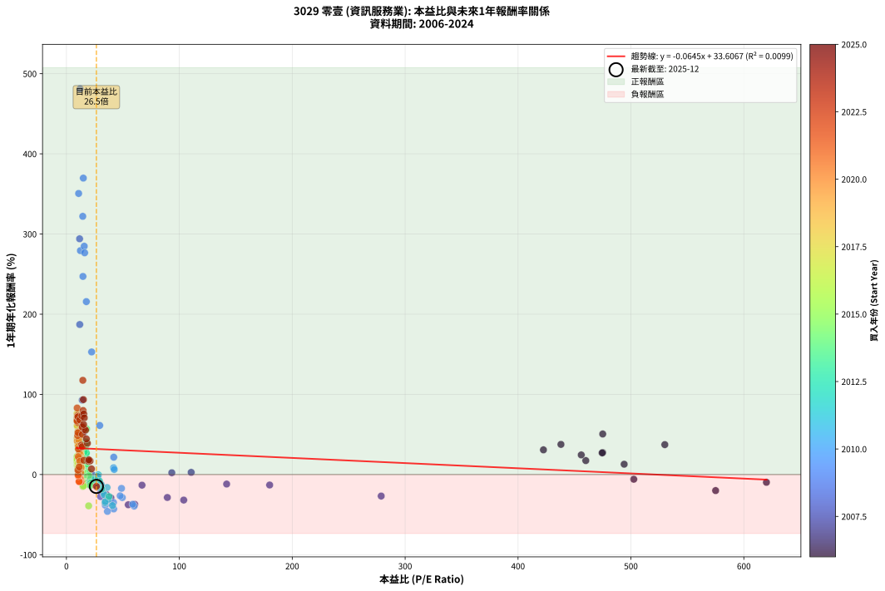
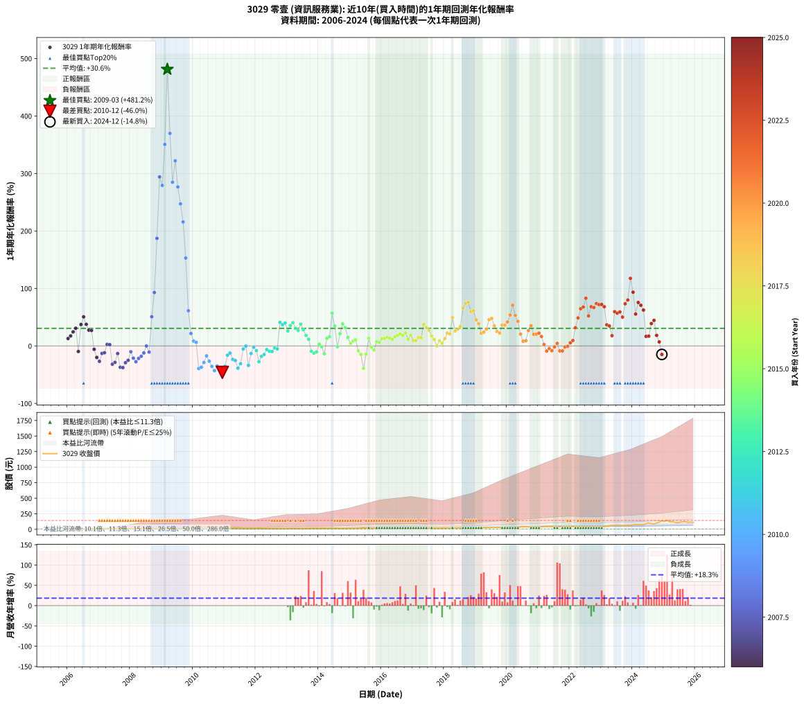

# 3029 零壹 - 本益比與未來報酬率分析

!!! info "報告資訊"
    - **股票代號**: 3029
    - **公司名稱**: 零壹
    - **產業別**: 資訊服務業
    - **分析期間**: 2006-2024 (228 個數據點)
    - **資料來源**: Type 12 (ShowMonthlyK_ChartFlow) 月收盤價與本益比
    - **報酬率口徑**: 含現金股利 (簡化: 年度合計，假設每年7/1入帳)
    - **報告生成時間**: 2026-01-11 18:48:04 CST

## 📈 視覺化圖表

### 圖表1: 本益比 vs 未來報酬率關係

*圖表1：3029 零壹 本益比與1年期未來報酬率關係 (2006-2024)*

### 圖表2: 歷年買入時點的1年期實際報酬率

*圖表2：3029 零壹 歷年買入時點的1年期實際報酬率 (2006-2024)*

## 📍 買點訊號說明

本報告提供兩種買點提示訊號（顯示於圖表2的股價子圖中）：

### ▲ 小綠色三角形（回測驗證）
- **計算方式**: 使用全部歷史資料計算本益比第25百分位數
- **用途**: 事後驗證，顯示歷史上哪些時點確實為低估區
- **限制**: 當下無法判斷，僅供回測參考
- **特性**: 後見之明（Look-Ahead Bias）

### ▲ 小橘色三角形（即時訊號）
- **計算方式**: 使用截至當月的過去5年資料計算本益比第25百分位數
- **用途**: 實際投資決策，當時即可判斷
- **優勢**: 可操作性強，符合實務需求
- **特性**: 無後見之明，滾動窗口計算

!!! tip "如何使用兩種訊號"
    - **綠色▲** 幫助理解歷史估值機會，驗證策略有效性
    - **橘色▲** 可作為實際買進參考，但仍需搭配基本面分析
    - 兩種訊號重疊時，表示即時判斷與事後驗證一致，信心度較高
    - 僅有綠色▲時，表示當時無法判斷（需要未來資料才能確認）
    - 僅有橘色▲時，表示即時判斷為買點，但事後可能不是最佳時機

## 📊 估值分析摘要

| 指標 | 數值 |
|:---:|:---:|
| **目前本益比** (2024-12) | **26.53 倍** |
| **歷史平均本益比** | 47.26 倍 |
| **估值水準** | 🟢 相對低估 |
| **預期1年年化報酬率** | **+31.90%** |
| **歷史平均報酬率** | +30.56% |
| **相關係數 (R²)** | 0.0099 |
| **趨勢線斜率** | -0.0645 |

!!! abstract "核心洞察"
    目前本益比顯著低於歷史平均，預期未來報酬率可能較高

    根據歷史數據回測，3029 零壹 在目前本益比 **26.5倍** 的估值水準下，
    預期未來1年年化報酬率約為 **+31.9%**。

    **重要提醒**: 本分析基於歷史數據統計，實際報酬率會受到公司基本面變化、產業趨勢、
    總體經濟環境等多重因素影響。R² = 0.01 表示本益比可解釋約 1.0% 的報酬率變異。

## 📈 歷史估值統計

### 最佳買點 (最高報酬率)

| 項目 | 數值 |
|:---:|:---:|
| 起始時間 | 2009-03 |
| 當時本益比 | 12.09 倍 |
| 起始價格 | 6.7 元 |
| 1年後價格 | 38.1 元 |
| **1年年化報酬率** | **+481.18%** |

### 最差買點 (最低報酬率)

| 項目 | 數值 |
|:---:|:---:|
| 起始時間 | 2010-12 |
| 當時本益比 | 36.31 倍 |
| 起始價格 | 29.1 元 |
| 1年後價格 | 15.0 元 |
| **1年年化報酬率** | **-45.98%** |

## 🎯 投資啟示

### 本益比與報酬率關係

趨勢線方程式: **y = -0.0645x + 33.6067**

!!! note "負相關"
    本益比與未來報酬率呈現負相關。較低的本益比通常帶來較高的未來報酬率，
    但相關性不算非常強。**估值仍是重要參考指標之一**。

### 估值區間建議

基於歷史數據分析:

- **🟢 低估區** (P/E < 37.8): 預期報酬率較高，可考慮增加持股
- **🟡 合理區** (P/E 37.8-56.7): 預期報酬率符合長期趨勢，正常持有
- **🔴 高估區** (P/E > 56.7): 預期報酬率較低，可考慮減碼或觀望

!!! danger "風險提示"
    - 過去表現不代表未來結果
    - 本分析假設公司基本面無重大結構性變化
    - 產業環境劇變可能使歷史規律失效
    - 應結合公司財報、產業趨勢、總體經濟等多重因素綜合判斷

!!! success "長期投資觀點"
    歷史數據顯示，在合理或低估的估值水準買入並長期持有，
    往往能獲得較佳的投資報酬。**耐心等待好價格**是價值投資的核心原則。

## 📊 數據品質

- **資料來源**: GoodInfo.tw Type 12 (ShowMonthlyK_ChartFlow)
- **資料頻率**: 月度收盤價與本益比
- **回測期間**: 2006-2024
- **數據點數量**: 228 個 (每個點代表一次1年期回測)

### 計算方法說明

1. **1年期年化報酬率**:
   - 對每個歷史時點，計算其後1年的實際投資報酬率
   - 期末價值(不含股利): 期末價格
   - 期末價值(含現金股利): 期末價格 + 持有期間內的現金股利合計 (簡化: 年度合計，假設每年7/1入帳)
   - 公式: 年化報酬率 = [(期末價值/期初價格)^(1/年數) - 1] × 100%

2. **本益比 (P/E Ratio)**:
   - 使用當時的月收盤價與EPS計算
   - 資料來源: Type 12 月度河流圖本益比數據

3. **趨勢線 (Linear Regression)**:
   - 使用最小平方法擬合線性趨勢線
   - R²值衡量本益比對報酬率的解釋能力

---

*本報告由 Stock Analysis System v1.9.0 自動生成*
*數據更新時間: 2026-01-11 18:48:04 CST*

## 📋 月度回測明細表

（每一列對應時間線圖中的一個買入點；可用來對照 SVG 圖上的每個點。）

| 買入月份 | 賣出月份 | 回測期限_年 | 實際持有年數 | 買入本益比_倍 | 買入收盤價_元 | 賣出收盤價_元 | 現金股利合計_元 | 總報酬率_pct | 年化報酬率_pct |
| --- | --- | --- | --- | --- | --- | --- | --- | --- | --- |
| 2006-01 | 2007-01 | 1 | 0.999 | 494.00 | 9.88 | 11.15 | 0.00 | +12.85 | +12.86 |
| 2006-02 | 2007-02 | 1 | 0.999 | 460.00 | 9.20 | 10.80 | 0.00 | +17.39 | +17.40 |
| 2006-03 | 2007-03 | 1 | 0.999 | 456.00 | 9.12 | 11.35 | 0.00 | +24.45 | +24.47 |
| 2006-04 | 2007-04 | 1 | 0.999 | 422.50 | 8.45 | 11.05 | 0.00 | +30.77 | +30.79 |
| 2006-05 | 2007-05 | 1 | 0.999 | 620.00 | 12.40 | 11.20 | 0.00 | -9.68 | -9.68 |
| 2006-06 | 2007-06 | 1 | 0.999 | 530.00 | 10.60 | 14.55 | 0.00 | +37.26 | +37.29 |
| 2006-07 | 2007-07 | 1 | 0.999 | 475.00 | 9.50 | 14.30 | 0.00 | +50.53 | +50.57 |
| 2006-08 | 2007-08 | 1 | 0.999 | 438.00 | 8.76 | 12.05 | 0.00 | +37.56 | +37.59 |
| 2006-09 | 2007-09 | 1 | 0.999 | 475.00 | 9.50 | 12.10 | 0.00 | +27.37 | +27.39 |
| 2006-10 | 2007-10 | 1 | 0.999 | 474.50 | 9.49 | 12.05 | 0.00 | +26.98 | +27.00 |
| 2006-11 | 2007-11 | 1 | 0.999 | 502.50 | 10.05 | 9.46 | 0.00 | -5.87 | -5.87 |
| 2006-12 | 2007-12 | 1 | 0.999 | 575.00 | 11.50 | 9.20 | 0.00 | -20.00 | -20.01 |
| 2007-01 | 2008-01 | 1 | 0.999 | 278.80 | 11.15 | 8.16 | 0.00 | -26.82 | -26.83 |
| 2007-02 | 2008-02 | 1 | 0.999 | 180.00 | 10.80 | 9.39 | 0.00 | -13.06 | -13.06 |
| 2007-03 | 2008-03 | 1 | 1.002 | 141.90 | 11.35 | 10.00 | 0.00 | -11.89 | -11.87 |
| 2007-04 | 2008-04 | 1 | 1.002 | 110.50 | 11.05 | 11.35 | 0.00 | +2.71 | +2.71 |
| 2007-05 | 2008-05 | 1 | 1.002 | 93.33 | 11.20 | 11.45 | 0.00 | +2.23 | +2.23 |
| 2007-06 | 2008-06 | 1 | 1.002 | 103.90 | 14.55 | 9.91 | 0.00 | -31.89 | -31.84 |
| 2007-07 | 2008-07 | 1 | 1.002 | 89.38 | 14.30 | 9.60 | 0.60 | -28.67 | -28.62 |
| 2007-08 | 2008-08 | 1 | 1.002 | 66.94 | 12.05 | 9.85 | 0.60 | -13.28 | -13.25 |
| 2007-09 | 2008-09 | 1 | 1.002 | 60.50 | 12.10 | 7.00 | 0.60 | -37.19 | -37.13 |
| 2007-10 | 2008-10 | 1 | 1.002 | 54.77 | 12.05 | 6.90 | 0.60 | -37.76 | -37.70 |
| 2007-11 | 2008-11 | 1 | 1.002 | 39.42 | 9.46 | 6.10 | 0.60 | -29.18 | -29.13 |
| 2007-12 | 2008-12 | 1 | 1.002 | 35.38 | 9.20 | 6.30 | 0.60 | -25.00 | -24.96 |
| 2008-01 | 2009-01 | 1 | 1.002 | 28.80 | 8.16 | 6.73 | 0.60 | -10.17 | -10.15 |
| 2008-02 | 2009-03 | 1 | 1.081 | 30.62 | 9.39 | 6.65 | 0.60 | -22.79 | -21.27 |
| 2008-03 | 2009-03 | 1 | 0.999 | 30.30 | 10.00 | 6.65 | 0.60 | -27.50 | -27.52 |
| 2008-04 | 2009-04 | 1 | 0.999 | 32.12 | 11.35 | 8.28 | 0.60 | -21.76 | -21.78 |
| 2008-05 | 2009-05 | 1 | 0.999 | 30.40 | 11.45 | 8.78 | 0.60 | -18.08 | -18.09 |
| 2008-06 | 2009-06 | 1 | 0.999 | 24.78 | 9.91 | 8.10 | 0.60 | -12.21 | -12.22 |
| 2008-07 | 2009-07 | 1 | 0.999 | 22.68 | 9.60 | 9.09 | 0.50 | -0.08 | -0.08 |
| 2008-08 | 2009-08 | 1 | 0.999 | 22.05 | 9.85 | 8.29 | 0.50 | -10.74 | -10.75 |
| 2008-09 | 2009-09 | 1 | 0.999 | 14.89 | 7.00 | 10.05 | 0.50 | +50.74 | +50.79 |
| 2008-10 | 2009-10 | 1 | 0.999 | 13.99 | 6.90 | 12.80 | 0.50 | +92.78 | +92.87 |
| 2008-11 | 2009-11 | 1 | 0.999 | 11.81 | 6.10 | 17.00 | 0.50 | +186.92 | +187.13 |
| 2008-12 | 2009-12 | 1 | 0.999 | 11.67 | 6.30 | 24.30 | 0.50 | +293.68 | +294.05 |
| 2009-01 | 2010-01 | 1 | 0.999 | 12.39 | 6.73 | 25.00 | 0.50 | +278.93 | +279.28 |
| 2009-02 | 2010-02 | 1 | 0.999 | 10.81 | 5.91 | 26.10 | 0.50 | +350.12 | +350.58 |
| 2009-03 | 2010-03 | 1 | 0.999 | 12.09 | 6.65 | 38.10 | 0.50 | +480.48 | +481.18 |
| 2009-04 | 2010-04 | 1 | 0.999 | 14.96 | 8.28 | 38.35 | 0.50 | +369.23 | +369.72 |
| 2009-05 | 2010-05 | 1 | 0.999 | 15.77 | 8.78 | 33.25 | 0.50 | +284.42 | +284.77 |
| 2009-06 | 2010-06 | 1 | 0.999 | 14.46 | 8.10 | 33.65 | 0.50 | +321.63 | +322.05 |
| 2009-07 | 2010-07 | 1 | 0.999 | 16.14 | 9.09 | 33.70 | 0.50 | +276.24 | +276.58 |
| 2009-08 | 2010-08 | 1 | 0.999 | 14.63 | 8.29 | 28.25 | 0.50 | +246.80 | +247.10 |
| 2009-09 | 2010-09 | 1 | 0.999 | 17.63 | 10.05 | 31.20 | 0.50 | +215.42 | +215.67 |
| 2009-10 | 2010-10 | 1 | 0.999 | 22.33 | 12.80 | 31.85 | 0.50 | +152.73 | +152.89 |
| 2009-11 | 2010-11 | 1 | 0.999 | 29.48 | 17.00 | 26.90 | 0.50 | +61.18 | +61.23 |
| 2009-12 | 2010-12 | 1 | 0.999 | 41.90 | 24.30 | 29.05 | 0.50 | +21.60 | +21.62 |
| 2010-01 | 2011-01 | 1 | 0.999 | 41.78 | 25.00 | 26.60 | 0.50 | +8.40 | +8.41 |
| 2010-02 | 2011-02 | 1 | 0.999 | 42.32 | 26.10 | 27.25 | 0.50 | +6.32 | +6.33 |
| 2010-03 | 2011-03 | 1 | 0.999 | 60.00 | 38.10 | 22.60 | 0.50 | -39.37 | -39.39 |
| 2010-04 | 2011-04 | 1 | 0.999 | 58.70 | 38.35 | 23.65 | 0.50 | -37.03 | -37.05 |
| 2010-05 | 2011-05 | 1 | 0.999 | 49.50 | 33.25 | 23.20 | 0.50 | -28.72 | -28.74 |
| 2010-06 | 2011-06 | 1 | 0.999 | 48.77 | 33.65 | 27.35 | 0.50 | -17.24 | -17.25 |
| 2010-07 | 2011-07 | 1 | 0.999 | 47.58 | 33.70 | 24.05 | 0.70 | -26.56 | -26.57 |
| 2010-08 | 2011-08 | 1 | 0.999 | 38.88 | 28.25 | 17.50 | 0.70 | -35.58 | -35.59 |
| 2010-09 | 2011-09 | 1 | 0.999 | 41.88 | 31.20 | 17.10 | 0.70 | -42.95 | -42.97 |
| 2010-10 | 2011-10 | 1 | 0.999 | 41.72 | 31.85 | 20.05 | 0.70 | -34.85 | -34.87 |
| 2010-11 | 2011-11 | 1 | 0.999 | 34.41 | 26.90 | 15.90 | 0.70 | -38.29 | -38.31 |
| 2010-12 | 2011-12 | 1 | 0.999 | 36.31 | 29.05 | 15.00 | 0.70 | -45.96 | -45.98 |
| 2011-01 | 2012-01 | 1 | 0.999 | 34.18 | 26.60 | 16.50 | 0.70 | -35.34 | -35.36 |
| 2011-02 | 2012-02 | 1 | 0.999 | 36.01 | 27.25 | 22.15 | 0.70 | -16.15 | -16.16 |
| 2011-03 | 2012-03 | 1 | 1.002 | 30.75 | 22.60 | 19.10 | 0.70 | -12.39 | -12.37 |
| 2011-04 | 2012-04 | 1 | 1.002 | 33.15 | 23.65 | 17.40 | 0.70 | -23.47 | -23.43 |
| 2011-05 | 2012-05 | 1 | 1.002 | 33.54 | 23.20 | 16.60 | 0.70 | -25.43 | -25.39 |
| 2011-06 | 2012-06 | 1 | 1.002 | 40.82 | 27.35 | 16.05 | 0.70 | -38.76 | -38.70 |
| 2011-07 | 2012-07 | 1 | 1.002 | 37.10 | 24.05 | 15.90 | 0.70 | -30.98 | -30.92 |
| 2011-08 | 2012-08 | 1 | 1.002 | 27.93 | 17.50 | 15.85 | 0.70 | -5.43 | -5.42 |
| 2011-09 | 2012-09 | 1 | 1.002 | 28.26 | 17.10 | 16.35 | 0.70 | -0.29 | -0.29 |
| 2011-10 | 2012-10 | 1 | 1.002 | 34.37 | 20.05 | 12.55 | 0.70 | -33.92 | -33.86 |
| 2011-11 | 2012-11 | 1 | 1.002 | 28.31 | 15.90 | 13.10 | 0.70 | -13.21 | -13.18 |
| 2011-12 | 2012-12 | 1 | 1.002 | 27.78 | 15.00 | 13.95 | 0.70 | -2.33 | -2.33 |
| 2012-01 | 2013-01 | 1 | 1.002 | 29.28 | 16.50 | 14.45 | 0.70 | -8.18 | -8.17 |
| 2012-02 | 2013-03 | 1 | 1.081 | 37.73 | 22.15 | 14.95 | 0.70 | -29.35 | -27.47 |
| 2012-03 | 2013-03 | 1 | 0.999 | 31.28 | 19.10 | 14.95 | 0.70 | -18.06 | -18.07 |
| 2012-04 | 2013-04 | 1 | 0.999 | 27.44 | 17.40 | 14.10 | 0.70 | -14.94 | -14.95 |
| 2012-05 | 2013-05 | 1 | 0.999 | 25.24 | 16.60 | 14.85 | 0.70 | -6.33 | -6.33 |
| 2012-06 | 2013-06 | 1 | 0.999 | 23.56 | 16.05 | 13.85 | 0.70 | -9.35 | -9.35 |
| 2012-07 | 2013-07 | 1 | 0.999 | 22.56 | 15.90 | 13.55 | 0.80 | -9.75 | -9.75 |
| 2012-08 | 2013-08 | 1 | 0.999 | 21.76 | 15.85 | 14.50 | 0.80 | -3.47 | -3.47 |
| 2012-09 | 2013-09 | 1 | 0.999 | 21.74 | 16.35 | 14.70 | 0.80 | -5.20 | -5.20 |
| 2012-10 | 2013-10 | 1 | 0.999 | 16.18 | 12.55 | 16.90 | 0.80 | +41.04 | +41.07 |
| 2012-11 | 2013-11 | 1 | 0.999 | 16.40 | 13.10 | 17.15 | 0.80 | +37.02 | +37.05 |
| 2012-12 | 2013-12 | 1 | 0.999 | 16.96 | 13.95 | 18.70 | 0.80 | +39.78 | +39.82 |
| 2013-01 | 2014-01 | 1 | 0.999 | 17.48 | 14.45 | 17.40 | 0.80 | +25.95 | +25.97 |
| 2013-02 | 2014-02 | 1 | 0.999 | 16.86 | 14.00 | 18.15 | 0.80 | +35.36 | +35.39 |
| 2013-03 | 2014-03 | 1 | 0.999 | 17.92 | 14.95 | 20.20 | 0.80 | +40.47 | +40.50 |
| 2013-04 | 2014-04 | 1 | 0.999 | 16.82 | 14.10 | 17.60 | 0.80 | +30.50 | +30.52 |
| 2013-05 | 2014-05 | 1 | 0.999 | 17.63 | 14.85 | 18.05 | 0.80 | +26.94 | +26.96 |
| 2013-06 | 2014-06 | 1 | 0.999 | 16.37 | 13.85 | 18.30 | 0.80 | +37.91 | +37.94 |
| 2013-07 | 2014-07 | 1 | 0.999 | 15.94 | 13.55 | 16.50 | 0.85 | +28.04 | +28.07 |
| 2013-08 | 2014-08 | 1 | 0.999 | 16.98 | 14.50 | 16.30 | 0.85 | +18.28 | +18.29 |
| 2013-09 | 2014-09 | 1 | 0.999 | 17.13 | 14.70 | 15.55 | 0.85 | +11.56 | +11.57 |
| 2013-10 | 2014-10 | 1 | 0.999 | 19.60 | 16.90 | 14.50 | 0.85 | -9.17 | -9.18 |
| 2013-11 | 2014-11 | 1 | 0.999 | 19.80 | 17.15 | 14.15 | 0.85 | -12.54 | -12.54 |
| 2013-12 | 2014-12 | 1 | 0.999 | 21.49 | 18.70 | 15.90 | 0.85 | -10.43 | -10.43 |
| 2014-01 | 2015-01 | 1 | 0.999 | 19.42 | 17.40 | 17.10 | 0.85 | +3.16 | +3.16 |
| 2014-02 | 2015-02 | 1 | 0.999 | 19.69 | 18.15 | 17.00 | 0.85 | -1.65 | -1.65 |
| 2014-03 | 2015-03 | 1 | 0.999 | 21.32 | 20.20 | 16.60 | 0.85 | -13.61 | -13.62 |
| 2014-04 | 2015-04 | 1 | 0.999 | 18.08 | 17.60 | 19.05 | 0.85 | +13.07 | +13.08 |
| 2014-05 | 2015-05 | 1 | 0.999 | 18.07 | 18.05 | 20.10 | 0.85 | +16.07 | +16.08 |
| 2014-06 | 2015-06 | 1 | 0.999 | 17.85 | 18.30 | 27.85 | 0.85 | +56.83 | +56.88 |
| 2014-07 | 2015-07 | 1 | 0.999 | 15.70 | 16.50 | 21.80 | 0.41 | +34.59 | +34.62 |
| 2014-08 | 2015-08 | 1 | 0.999 | 15.14 | 16.30 | 15.65 | 0.41 | -1.49 | -1.49 |
| 2014-09 | 2015-09 | 1 | 0.999 | 14.10 | 15.55 | 18.45 | 0.41 | +21.27 | +21.28 |
| 2014-10 | 2015-10 | 1 | 0.999 | 12.85 | 14.50 | 19.65 | 0.41 | +38.32 | +38.35 |
| 2014-11 | 2015-11 | 1 | 0.999 | 12.26 | 14.15 | 18.25 | 0.41 | +31.85 | +31.88 |
| 2014-12 | 2015-12 | 1 | 0.999 | 13.47 | 15.90 | 17.85 | 0.41 | +14.82 | +14.83 |
| 2015-01 | 2016-01 | 1 | 0.999 | 14.03 | 17.10 | 17.40 | 0.41 | +4.13 | +4.14 |
| 2015-02 | 2016-02 | 1 | 0.999 | 13.51 | 17.00 | 18.05 | 0.41 | +8.57 | +8.58 |
| 2015-03 | 2016-03 | 1 | 1.002 | 12.79 | 16.60 | 17.95 | 0.41 | +10.58 | +10.56 |
| 2015-04 | 2016-04 | 1 | 1.002 | 14.25 | 19.05 | 17.00 | 0.41 | -8.62 | -8.61 |
| 2015-05 | 2016-05 | 1 | 1.002 | 14.61 | 20.10 | 16.70 | 0.41 | -14.89 | -14.86 |
| 2015-06 | 2016-06 | 1 | 1.002 | 19.68 | 27.85 | 16.55 | 0.41 | -39.11 | -39.05 |
| 2015-07 | 2016-07 | 1 | 1.002 | 14.99 | 21.80 | 17.70 | 1.00 | -14.22 | -14.19 |
| 2015-08 | 2016-08 | 1 | 1.002 | 10.48 | 15.65 | 16.75 | 1.00 | +13.42 | +13.39 |
| 2015-09 | 2016-09 | 1 | 1.002 | 12.04 | 18.45 | 17.05 | 1.00 | -2.17 | -2.16 |
| 2015-10 | 2016-10 | 1 | 1.002 | 12.50 | 19.65 | 17.25 | 1.00 | -7.12 | -7.11 |
| 2015-11 | 2016-11 | 1 | 1.002 | 11.33 | 18.25 | 18.60 | 1.00 | +7.40 | +7.38 |
| 2015-12 | 2016-12 | 1 | 1.002 | 10.82 | 17.85 | 17.90 | 1.00 | +5.88 | +5.87 |
| 2016-01 | 2017-01 | 1 | 1.002 | 10.44 | 17.40 | 18.60 | 1.00 | +12.64 | +12.62 |
| 2016-02 | 2017-03 | 1 | 1.081 | 10.72 | 18.05 | 19.60 | 1.00 | +14.13 | +13.00 |
| 2016-03 | 2017-03 | 1 | 0.999 | 10.56 | 17.95 | 19.60 | 1.00 | +14.76 | +14.77 |
| 2016-04 | 2017-04 | 1 | 0.999 | 9.90 | 17.00 | 18.30 | 1.00 | +13.53 | +13.54 |
| 2016-05 | 2017-05 | 1 | 0.999 | 9.63 | 16.70 | 17.60 | 1.00 | +11.38 | +11.39 |
| 2016-06 | 2017-06 | 1 | 0.999 | 9.46 | 16.55 | 18.20 | 1.00 | +16.01 | +16.02 |
| 2016-07 | 2017-07 | 1 | 0.999 | 10.02 | 17.70 | 19.75 | 1.20 | +18.36 | +18.38 |
| 2016-08 | 2017-08 | 1 | 0.999 | 9.39 | 16.75 | 19.00 | 1.20 | +20.60 | +20.61 |
| 2016-09 | 2017-09 | 1 | 0.999 | 9.47 | 17.05 | 18.95 | 1.20 | +18.18 | +18.20 |
| 2016-10 | 2017-10 | 1 | 0.999 | 9.50 | 17.25 | 19.95 | 1.20 | +22.61 | +22.63 |
| 2016-11 | 2017-11 | 1 | 0.999 | 10.15 | 18.60 | 19.50 | 1.20 | +11.29 | +11.30 |
| 2016-12 | 2017-12 | 1 | 0.999 | 9.68 | 17.90 | 20.05 | 1.20 | +18.72 | +18.73 |
| 2017-01 | 2018-01 | 1 | 0.999 | 10.16 | 18.60 | 19.15 | 1.20 | +9.41 | +9.42 |
| 2017-02 | 2018-02 | 1 | 0.999 | 10.66 | 19.30 | 19.85 | 1.20 | +9.07 | +9.07 |
| 2017-03 | 2018-03 | 1 | 0.999 | 10.95 | 19.60 | 21.30 | 1.20 | +14.80 | +14.81 |
| 2017-04 | 2018-04 | 1 | 0.999 | 10.34 | 18.30 | 19.70 | 1.20 | +14.21 | +14.22 |
| 2017-05 | 2018-05 | 1 | 0.999 | 10.06 | 17.60 | 23.00 | 1.20 | +37.50 | +37.53 |
| 2017-06 | 2018-06 | 1 | 0.999 | 10.52 | 18.20 | 22.85 | 1.20 | +32.14 | +32.17 |
| 2017-07 | 2018-07 | 1 | 0.999 | 11.55 | 19.75 | 23.85 | 1.30 | +27.34 | +27.36 |
| 2017-08 | 2018-08 | 1 | 0.999 | 11.24 | 19.00 | 21.00 | 1.30 | +17.37 | +17.38 |
| 2017-09 | 2018-09 | 1 | 0.999 | 11.35 | 18.95 | 19.75 | 1.30 | +11.08 | +11.09 |
| 2017-10 | 2018-10 | 1 | 0.999 | 12.09 | 19.95 | 18.65 | 1.30 | +0.00 | +0.00 |
| 2017-11 | 2018-11 | 1 | 0.999 | 11.96 | 19.50 | 19.95 | 1.30 | +8.97 | +8.98 |
| 2017-12 | 2018-12 | 1 | 0.999 | 12.45 | 20.05 | 19.65 | 1.30 | +4.49 | +4.49 |
| 2018-01 | 2019-01 | 1 | 0.999 | 11.62 | 19.15 | 20.30 | 1.30 | +12.79 | +12.80 |
| 2018-02 | 2019-02 | 1 | 0.999 | 11.78 | 19.85 | 23.00 | 1.30 | +22.42 | +22.44 |
| 2018-03 | 2019-03 | 1 | 0.999 | 12.37 | 21.30 | 24.45 | 1.30 | +20.89 | +20.91 |
| 2018-04 | 2019-04 | 1 | 0.999 | 11.19 | 19.70 | 28.10 | 1.30 | +49.24 | +49.28 |
| 2018-05 | 2019-05 | 1 | 0.999 | 12.80 | 23.00 | 27.65 | 1.30 | +25.87 | +25.89 |
| 2018-06 | 2019-06 | 1 | 0.999 | 12.45 | 22.85 | 28.20 | 1.30 | +29.10 | +29.13 |
| 2018-07 | 2019-07 | 1 | 0.999 | 12.74 | 23.85 | 30.45 | 1.50 | +33.95 | +33.98 |
| 2018-08 | 2019-08 | 1 | 0.999 | 10.99 | 21.00 | 33.30 | 1.50 | +65.70 | +65.76 |
| 2018-09 | 2019-09 | 1 | 0.999 | 10.14 | 19.75 | 32.85 | 1.50 | +73.91 | +73.97 |
| 2018-10 | 2019-10 | 1 | 0.999 | 9.40 | 18.65 | 31.30 | 1.50 | +75.86 | +75.92 |
| 2018-11 | 2019-11 | 1 | 0.999 | 9.86 | 19.95 | 30.35 | 1.50 | +59.63 | +59.69 |
| 2018-12 | 2019-12 | 1 | 0.999 | 9.54 | 19.65 | 30.15 | 1.50 | +61.05 | +61.11 |
| 2019-01 | 2020-01 | 1 | 0.999 | 9.55 | 20.30 | 28.00 | 1.50 | +45.31 | +45.34 |
| 2019-02 | 2020-02 | 1 | 0.999 | 10.49 | 23.00 | 30.40 | 1.50 | +38.68 | +38.71 |
| 2019-03 | 2020-03 | 1 | 1.002 | 10.83 | 24.45 | 28.35 | 1.50 | +22.07 | +22.02 |
| 2019-04 | 2020-04 | 1 | 1.002 | 12.09 | 28.10 | 33.35 | 1.50 | +24.01 | +23.96 |
| 2019-05 | 2020-05 | 1 | 1.002 | 11.57 | 27.65 | 34.20 | 1.50 | +29.10 | +29.04 |
| 2019-06 | 2020-06 | 1 | 1.002 | 11.49 | 28.20 | 39.60 | 1.50 | +45.73 | +45.62 |
| 2019-07 | 2020-07 | 1 | 1.002 | 12.08 | 30.45 | 43.05 | 2.01 | +47.98 | +47.86 |
| 2019-08 | 2020-08 | 1 | 1.002 | 12.87 | 33.30 | 42.95 | 2.01 | +35.02 | +34.93 |
| 2019-09 | 2020-09 | 1 | 1.002 | 12.38 | 32.85 | 39.15 | 2.01 | +25.30 | +25.24 |
| 2019-10 | 2020-10 | 1 | 1.002 | 11.51 | 31.30 | 36.30 | 2.01 | +22.40 | +22.35 |
| 2019-11 | 2020-11 | 1 | 1.002 | 10.90 | 30.35 | 39.40 | 2.01 | +36.44 | +36.35 |
| 2019-12 | 2020-12 | 1 | 1.002 | 10.58 | 30.15 | 39.05 | 2.01 | +36.19 | +36.10 |
| 2020-01 | 2021-01 | 1 | 1.002 | 9.63 | 28.00 | 37.70 | 2.01 | +41.82 | +41.72 |
| 2020-02 | 2021-03 | 1 | 1.081 | 10.25 | 30.40 | 46.40 | 2.01 | +59.24 | +53.76 |
| 2020-03 | 2021-03 | 1 | 0.999 | 9.37 | 28.35 | 46.40 | 2.01 | +70.76 | +70.82 |
| 2020-04 | 2021-04 | 1 | 0.999 | 10.82 | 33.35 | 49.05 | 2.01 | +53.10 | +53.15 |
| 2020-05 | 2021-05 | 1 | 0.999 | 10.89 | 34.20 | 46.80 | 2.01 | +42.72 | +42.75 |
| 2020-06 | 2021-06 | 1 | 0.999 | 12.38 | 39.60 | 45.70 | 2.01 | +20.48 | +20.50 |
| 2020-07 | 2021-07 | 1 | 0.999 | 13.21 | 43.05 | 43.55 | 3.00 | +8.13 | +8.14 |
| 2020-08 | 2021-08 | 1 | 0.999 | 12.95 | 42.95 | 43.85 | 3.00 | +9.08 | +9.09 |
| 2020-09 | 2021-09 | 1 | 0.999 | 11.60 | 39.15 | 46.60 | 3.00 | +26.69 | +26.72 |
| 2020-10 | 2021-10 | 1 | 0.999 | 10.57 | 36.30 | 46.10 | 3.00 | +35.26 | +35.29 |
| 2020-11 | 2021-11 | 1 | 0.999 | 11.28 | 39.40 | 44.35 | 3.00 | +20.18 | +20.20 |
| 2020-12 | 2021-12 | 1 | 0.999 | 11.00 | 39.05 | 44.00 | 3.00 | +20.36 | +20.38 |
| 2021-01 | 2022-01 | 1 | 0.999 | 10.45 | 37.70 | 43.10 | 3.00 | +22.28 | +22.30 |
| 2021-02 | 2022-02 | 1 | 0.999 | 11.90 | 43.60 | 47.75 | 3.00 | +16.40 | +16.41 |
| 2021-03 | 2022-03 | 1 | 0.999 | 12.46 | 46.40 | 44.55 | 3.00 | +2.48 | +2.48 |
| 2021-04 | 2022-04 | 1 | 0.999 | 12.98 | 49.05 | 41.65 | 3.00 | -8.97 | -8.97 |
| 2021-05 | 2022-05 | 1 | 0.999 | 12.20 | 46.80 | 41.65 | 3.00 | -4.59 | -4.59 |
| 2021-06 | 2022-06 | 1 | 0.999 | 11.73 | 45.70 | 38.90 | 3.00 | -8.31 | -8.32 |
| 2021-07 | 2022-07 | 1 | 0.999 | 11.02 | 43.55 | 39.20 | 3.60 | -1.72 | -1.72 |
| 2021-08 | 2022-08 | 1 | 0.999 | 10.94 | 43.85 | 42.20 | 3.60 | +4.45 | +4.46 |
| 2021-09 | 2022-09 | 1 | 0.999 | 11.46 | 46.60 | 38.95 | 3.60 | -8.68 | -8.69 |
| 2021-10 | 2022-10 | 1 | 0.999 | 11.18 | 46.10 | 38.45 | 3.60 | -8.78 | -8.78 |
| 2021-11 | 2022-11 | 1 | 0.999 | 10.60 | 44.35 | 39.95 | 3.60 | -1.80 | -1.80 |
| 2021-12 | 2022-12 | 1 | 0.999 | 10.38 | 44.00 | 40.15 | 3.60 | -0.56 | -0.56 |
| 2022-01 | 2023-01 | 1 | 0.999 | 10.21 | 43.10 | 41.85 | 3.60 | +5.46 | +5.46 |
| 2022-02 | 2023-02 | 1 | 0.999 | 11.36 | 47.75 | 48.65 | 3.60 | +9.43 | +9.44 |
| 2022-03 | 2023-03 | 1 | 0.999 | 10.64 | 44.55 | 55.10 | 3.60 | +31.77 | +31.79 |
| 2022-04 | 2023-04 | 1 | 0.999 | 9.99 | 41.65 | 58.30 | 3.60 | +48.63 | +48.67 |
| 2022-05 | 2023-05 | 1 | 0.999 | 10.03 | 41.65 | 65.00 | 3.60 | +64.71 | +64.77 |
| 2022-06 | 2023-06 | 1 | 0.999 | 9.41 | 38.90 | 61.60 | 3.60 | +67.62 | +67.68 |
| 2022-07 | 2023-07 | 1 | 0.999 | 9.52 | 39.20 | 68.10 | 3.60 | +82.90 | +82.98 |
| 2022-08 | 2023-08 | 1 | 0.999 | 10.29 | 42.20 | 60.60 | 3.60 | +52.13 | +52.17 |
| 2022-09 | 2023-09 | 1 | 0.999 | 9.54 | 38.95 | 61.90 | 3.60 | +68.16 | +68.22 |
| 2022-10 | 2023-10 | 1 | 0.999 | 9.46 | 38.45 | 60.50 | 3.60 | +66.70 | +66.76 |
| 2022-11 | 2023-11 | 1 | 0.999 | 9.87 | 39.95 | 65.80 | 3.60 | +73.71 | +73.78 |
| 2022-12 | 2023-12 | 1 | 0.999 | 9.96 | 40.15 | 65.40 | 3.60 | +71.85 | +71.91 |
| 2023-01 | 2024-01 | 1 | 0.999 | 10.28 | 41.85 | 68.40 | 3.60 | +72.04 | +72.10 |
| 2023-02 | 2024-02 | 1 | 0.999 | 11.84 | 48.65 | 78.20 | 3.60 | +68.14 | +68.20 |
| 2023-03 | 2024-03 | 1 | 1.002 | 13.29 | 55.10 | 71.80 | 3.60 | +36.84 | +36.75 |
| 2023-04 | 2024-04 | 1 | 1.002 | 13.93 | 58.30 | 75.00 | 3.60 | +34.82 | +34.73 |
| 2023-05 | 2024-05 | 1 | 1.002 | 15.38 | 65.00 | 73.00 | 3.60 | +17.84 | +17.80 |
| 2023-06 | 2024-06 | 1 | 1.002 | 14.44 | 61.60 | 94.80 | 3.60 | +59.74 | +59.58 |
| 2023-07 | 2024-07 | 1 | 1.002 | 15.82 | 68.10 | 103.00 | 4.00 | +57.12 | +56.98 |
| 2023-08 | 2024-08 | 1 | 1.002 | 13.95 | 60.60 | 92.50 | 4.00 | +59.24 | +59.09 |
| 2023-09 | 2024-09 | 1 | 1.002 | 14.12 | 61.90 | 89.00 | 4.00 | +50.24 | +50.12 |
| 2023-10 | 2024-10 | 1 | 1.002 | 13.68 | 60.50 | 101.00 | 4.00 | +73.55 | +73.36 |
| 2023-11 | 2024-11 | 1 | 1.002 | 14.75 | 65.80 | 114.50 | 4.00 | +80.09 | +79.87 |
| 2023-12 | 2024-12 | 1 | 1.002 | 14.53 | 65.40 | 138.50 | 4.00 | +117.89 | +117.54 |
| 2024-01 | 2025-01 | 1 | 1.002 | 15.00 | 68.40 | 128.50 | 4.00 | +93.71 | +93.45 |
| 2024-02 | 2025-03 | 1 | 1.081 | 16.93 | 78.20 | 122.00 | 4.00 | +61.13 | +55.44 |
| 2024-03 | 2025-03 | 1 | 0.999 | 15.34 | 71.80 | 122.00 | 4.00 | +75.49 | +75.56 |
| 2024-04 | 2025-04 | 1 | 0.999 | 15.82 | 75.00 | 124.00 | 4.00 | +70.67 | +70.73 |
| 2024-05 | 2025-05 | 1 | 0.999 | 15.21 | 73.00 | 114.50 | 4.00 | +62.33 | +62.38 |
| 2024-06 | 2025-06 | 1 | 0.999 | 19.51 | 94.80 | 106.50 | 4.00 | +16.56 | +16.57 |
| 2024-07 | 2025-07 | 1 | 0.999 | 20.93 | 103.00 | 115.50 | 5.00 | +16.99 | +17.00 |
| 2024-08 | 2025-08 | 1 | 0.999 | 18.57 | 92.50 | 123.50 | 5.00 | +38.92 | +38.95 |
| 2024-09 | 2025-09 | 1 | 0.999 | 17.66 | 89.00 | 123.50 | 5.00 | +44.38 | +44.42 |
| 2024-10 | 2025-10 | 1 | 0.999 | 19.80 | 101.00 | 114.50 | 5.00 | +18.32 | +18.33 |
| 2024-11 | 2025-11 | 1 | 0.999 | 22.19 | 114.50 | 117.50 | 5.00 | +6.99 | +6.99 |
| 2024-12 | 2025-12 | 1 | 0.999 | 26.53 | 138.50 | 113.00 | 5.00 | -14.80 | -14.81 |
