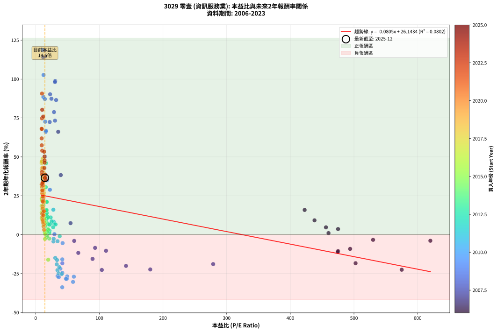
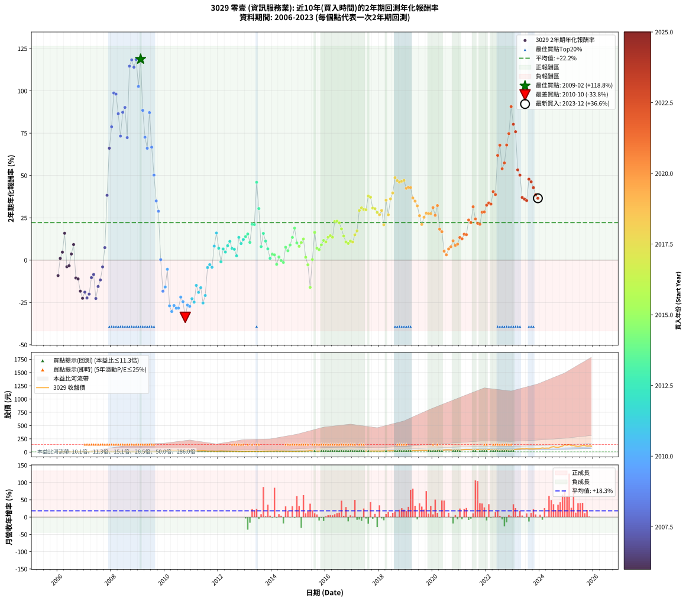

# 3029 零壹 - 本益比與未來報酬率分析

!!! info "報告資訊"
    - **股票代號**: 3029
    - **公司名稱**: 零壹
    - **產業別**: 資訊服務業
    - **分析期間**: 2006-2023 (216 個數據點)
    - **資料來源**: Type 12 (ShowMonthlyK_ChartFlow) 月收盤價與本益比
    - **報酬率口徑**: 含現金股利 (簡化: 年度合計，假設每年7/1入帳)
    - **報告生成時間**: 2026-01-10 18:48:56 CST

## 📈 視覺化圖表

### 圖表1: 本益比 vs 未來報酬率關係

*圖表1：3029 零壹 本益比與2年期未來報酬率關係 (2006-2023)*

### 圖表2: 歷年買入時點的2年期實際報酬率

*圖表2：3029 零壹 歷年買入時點的2年期實際報酬率 (2006-2023)*

## 📍 買點訊號說明

本報告提供兩種買點提示訊號（顯示於圖表2的股價子圖中）：

### ▲ 小綠色三角形（回測驗證）
- **計算方式**: 使用全部歷史資料計算本益比第25百分位數
- **用途**: 事後驗證，顯示歷史上哪些時點確實為低估區
- **限制**: 當下無法判斷，僅供回測參考
- **特性**: 後見之明（Look-Ahead Bias）

### ▲ 小橘色三角形（即時訊號）
- **計算方式**: 使用截至當月的過去5年資料計算本益比第25百分位數
- **用途**: 實際投資決策，當時即可判斷
- **優勢**: 可操作性強，符合實務需求
- **特性**: 無後見之明，滾動窗口計算

!!! tip "如何使用兩種訊號"
    - **綠色▲** 幫助理解歷史估值機會，驗證策略有效性
    - **橘色▲** 可作為實際買進參考，但仍需搭配基本面分析
    - 兩種訊號重疊時，表示即時判斷與事後驗證一致，信心度較高
    - 僅有綠色▲時，表示當時無法判斷（需要未來資料才能確認）
    - 僅有橘色▲時，表示即時判斷為買點，但事後可能不是最佳時機

## 📊 估值分析摘要

| 指標 | 數值 |
|:---:|:---:|
| **目前本益比** (2023-12) | **14.53 倍** |
| **歷史平均本益比** | 48.85 倍 |
| **估值水準** | 🟢 相對低估 |
| **預期2年年化報酬率** | **+24.97%** |
| **歷史平均報酬率** | +22.21% |
| **相關係數 (R²)** | 0.0802 |
| **趨勢線斜率** | -0.0805 |

!!! abstract "核心洞察"
    目前本益比顯著低於歷史平均，預期未來報酬率可能較高

    根據歷史數據回測，3029 零壹 在目前本益比 **14.5倍** 的估值水準下，
    預期未來2年年化報酬率約為 **+25.0%**。

    **重要提醒**: 本分析基於歷史數據統計，實際報酬率會受到公司基本面變化、產業趨勢、
    總體經濟環境等多重因素影響。R² = 0.08 表示本益比可解釋約 8.0% 的報酬率變異。

## 📈 歷史估值統計

### 最佳買點 (最高報酬率)

| 項目 | 數值 |
|:---:|:---:|
| 起始時間 | 2009-02 |
| 當時本益比 | 10.81 倍 |
| 起始價格 | 5.9 元 |
| 2年後價格 | 27.2 元 |
| **2年年化報酬率** | **+118.76%** |

### 最差買點 (最低報酬率)

| 項目 | 數值 |
|:---:|:---:|
| 起始時間 | 2010-10 |
| 當時本益比 | 41.72 倍 |
| 起始價格 | 31.9 元 |
| 2年後價格 | 12.6 元 |
| **2年年化報酬率** | **-33.80%** |

## 🎯 投資啟示

### 本益比與報酬率關係

趨勢線方程式: **y = -0.0805x + 26.1434**

!!! note "負相關"
    本益比與未來報酬率呈現負相關。較低的本益比通常帶來較高的未來報酬率，
    但相關性不算非常強。**估值仍是重要參考指標之一**。

### 估值區間建議

基於歷史數據分析:

- **🟢 低估區** (P/E < 39.1): 預期報酬率較高，可考慮增加持股
- **🟡 合理區** (P/E 39.1-58.6): 預期報酬率符合長期趨勢，正常持有
- **🔴 高估區** (P/E > 58.6): 預期報酬率較低，可考慮減碼或觀望

!!! danger "風險提示"
    - 過去表現不代表未來結果
    - 本分析假設公司基本面無重大結構性變化
    - 產業環境劇變可能使歷史規律失效
    - 應結合公司財報、產業趨勢、總體經濟等多重因素綜合判斷

!!! success "長期投資觀點"
    歷史數據顯示，在合理或低估的估值水準買入並長期持有，
    往往能獲得較佳的投資報酬。**耐心等待好價格**是價值投資的核心原則。

## 📊 數據品質

- **資料來源**: GoodInfo.tw Type 12 (ShowMonthlyK_ChartFlow)
- **資料頻率**: 月度收盤價與本益比
- **回測期間**: 2006-2023
- **數據點數量**: 216 個 (每個點代表一次2年期回測)

### 計算方法說明

1. **2年期年化報酬率**:
   - 對每個歷史時點，計算其後2年的實際投資報酬率
   - 期末價值(不含股利): 期末價格
   - 期末價值(含現金股利): 期末價格 + 持有期間內的現金股利合計 (簡化: 年度合計，假設每年7/1入帳)
   - 公式: 年化報酬率 = [(期末價值/期初價格)^(1/年數) - 1] × 100%

2. **本益比 (P/E Ratio)**:
   - 使用當時的月收盤價與EPS計算
   - 資料來源: Type 12 月度河流圖本益比數據

3. **趨勢線 (Linear Regression)**:
   - 使用最小平方法擬合線性趨勢線
   - R²值衡量本益比對報酬率的解釋能力

---

*本報告由 Stock Analysis System v1.9.0 自動生成*
*數據更新時間: 2026-01-10 18:48:56 CST*

## 📋 月度回測明細表

（每一列對應時間線圖中的一個買入點；可用來對照 SVG 圖上的每個點。）

| 買入月份 | 賣出月份 | 回測期限_年 | 實際持有年數 | 買入本益比_倍 | 買入收盤價_元 | 賣出收盤價_元 | 現金股利合計_元 | 總報酬率_pct | 年化報酬率_pct |
| --- | --- | --- | --- | --- | --- | --- | --- | --- | --- |
| 2006-01 | 2008-01 | 2 | 1.999 | 494.00 | 9.88 | 8.16 | 0.00 | -17.41 | -9.13 |
| 2006-02 | 2008-02 | 2 | 1.999 | 460.00 | 9.20 | 9.39 | 0.00 | +2.07 | +1.03 |
| 2006-03 | 2008-03 | 2 | 2.001 | 456.00 | 9.12 | 10.00 | 0.00 | +9.65 | +4.71 |
| 2006-04 | 2008-04 | 2 | 2.001 | 422.50 | 8.45 | 11.35 | 0.00 | +34.32 | +15.88 |
| 2006-05 | 2008-05 | 2 | 2.001 | 620.00 | 12.40 | 11.45 | 0.00 | -7.66 | -3.90 |
| 2006-06 | 2008-06 | 2 | 2.001 | 530.00 | 10.60 | 9.91 | 0.00 | -6.51 | -3.31 |
| 2006-07 | 2008-07 | 2 | 2.001 | 475.00 | 9.50 | 9.60 | 0.60 | +7.37 | +3.62 |
| 2006-08 | 2008-08 | 2 | 2.001 | 438.00 | 8.76 | 9.85 | 0.60 | +19.29 | +9.21 |
| 2006-09 | 2008-09 | 2 | 2.001 | 475.00 | 9.50 | 7.00 | 0.60 | -20.00 | -10.55 |
| 2006-10 | 2008-10 | 2 | 2.001 | 474.50 | 9.49 | 6.90 | 0.60 | -20.97 | -11.09 |
| 2006-11 | 2008-11 | 2 | 2.001 | 502.50 | 10.05 | 6.10 | 0.60 | -33.33 | -18.34 |
| 2006-12 | 2008-12 | 2 | 2.001 | 575.00 | 11.50 | 6.30 | 0.60 | -40.00 | -22.53 |
| 2007-01 | 2009-01 | 2 | 2.001 | 278.80 | 11.15 | 6.73 | 0.60 | -34.26 | -18.91 |
| 2007-02 | 2009-02 | 2 | 2.001 | 180.00 | 10.80 | 5.91 | 0.60 | -39.72 | -22.35 |
| 2007-03 | 2009-03 | 2 | 2.001 | 141.90 | 11.35 | 6.65 | 0.60 | -36.12 | -20.06 |
| 2007-04 | 2009-04 | 2 | 2.001 | 110.50 | 11.05 | 8.28 | 0.60 | -19.64 | -10.35 |
| 2007-05 | 2009-05 | 2 | 2.001 | 93.33 | 11.20 | 8.78 | 0.60 | -16.25 | -8.48 |
| 2007-06 | 2009-06 | 2 | 2.001 | 103.90 | 14.55 | 8.10 | 0.60 | -40.21 | -22.66 |
| 2007-07 | 2009-07 | 2 | 2.001 | 89.38 | 14.30 | 9.09 | 1.10 | -28.73 | -15.57 |
| 2007-08 | 2009-08 | 2 | 2.001 | 66.94 | 12.05 | 8.29 | 1.10 | -22.06 | -11.71 |
| 2007-09 | 2009-09 | 2 | 2.001 | 60.50 | 12.10 | 10.05 | 1.10 | -7.83 | -3.99 |
| 2007-10 | 2009-10 | 2 | 2.001 | 54.77 | 12.05 | 12.80 | 1.10 | +15.37 | +7.40 |
| 2007-11 | 2009-11 | 2 | 2.001 | 39.42 | 9.46 | 17.00 | 1.10 | +91.35 | +38.30 |
| 2007-12 | 2009-12 | 2 | 2.001 | 35.38 | 9.20 | 24.30 | 1.10 | +176.11 | +66.11 |
| 2008-01 | 2010-01 | 2 | 2.001 | 28.80 | 8.16 | 25.00 | 1.10 | +219.88 | +78.78 |
| 2008-02 | 2010-03 | 2 | 2.081 | 30.62 | 9.39 | 38.10 | 1.10 | +317.49 | +98.74 |
| 2008-03 | 2010-03 | 2 | 1.999 | 30.30 | 10.00 | 38.10 | 1.10 | +292.02 | +98.09 |
| 2008-04 | 2010-04 | 2 | 1.999 | 32.12 | 11.35 | 38.35 | 1.10 | +247.59 | +86.52 |
| 2008-05 | 2010-05 | 2 | 1.999 | 30.40 | 11.45 | 33.25 | 1.10 | +200.02 | +73.28 |
| 2008-06 | 2010-06 | 2 | 1.999 | 24.78 | 9.91 | 33.65 | 1.10 | +250.68 | +87.34 |
| 2008-07 | 2010-07 | 2 | 1.999 | 22.68 | 9.60 | 33.70 | 1.00 | +261.48 | +90.21 |
| 2008-08 | 2010-08 | 2 | 1.999 | 22.05 | 9.85 | 28.25 | 1.00 | +196.97 | +72.39 |
| 2008-09 | 2010-09 | 2 | 1.999 | 14.89 | 7.00 | 31.20 | 1.00 | +360.03 | +114.59 |
| 2008-10 | 2010-10 | 2 | 1.999 | 13.99 | 6.90 | 31.85 | 1.00 | +376.12 | +118.32 |
| 2008-11 | 2010-11 | 2 | 1.999 | 11.81 | 6.10 | 26.90 | 1.00 | +357.41 | +113.98 |
| 2008-12 | 2010-12 | 2 | 1.999 | 11.67 | 6.30 | 29.05 | 1.00 | +377.02 | +118.52 |
| 2009-01 | 2011-01 | 2 | 1.999 | 12.39 | 6.73 | 26.60 | 1.00 | +310.13 | +102.62 |
| 2009-02 | 2011-02 | 2 | 1.999 | 10.81 | 5.91 | 27.25 | 1.00 | +378.04 | +118.76 |
| 2009-03 | 2011-03 | 2 | 1.999 | 12.09 | 6.65 | 22.60 | 1.00 | +254.92 | +88.47 |
| 2009-04 | 2011-04 | 2 | 1.999 | 14.96 | 8.28 | 23.65 | 1.00 | +197.73 | +72.61 |
| 2009-05 | 2011-05 | 2 | 1.999 | 15.77 | 8.78 | 23.20 | 1.00 | +175.65 | +66.08 |
| 2009-06 | 2011-06 | 2 | 1.999 | 14.46 | 8.10 | 27.35 | 1.00 | +250.02 | +87.17 |
| 2009-07 | 2011-07 | 2 | 1.999 | 16.14 | 9.09 | 24.05 | 1.20 | +177.78 | +66.72 |
| 2009-08 | 2011-08 | 2 | 1.999 | 14.63 | 8.29 | 17.50 | 1.20 | +125.57 | +50.23 |
| 2009-09 | 2011-09 | 2 | 1.999 | 17.63 | 10.05 | 17.10 | 1.20 | +82.09 | +34.97 |
| 2009-10 | 2011-10 | 2 | 1.999 | 22.33 | 12.80 | 20.05 | 1.20 | +66.02 | +28.87 |
| 2009-11 | 2011-11 | 2 | 1.999 | 29.48 | 17.00 | 15.90 | 1.20 | +0.59 | +0.29 |
| 2009-12 | 2011-12 | 2 | 1.999 | 41.90 | 24.30 | 15.00 | 1.20 | -33.33 | -18.36 |
| 2010-01 | 2012-01 | 2 | 1.999 | 41.78 | 25.00 | 16.50 | 1.20 | -29.20 | -15.87 |
| 2010-02 | 2012-02 | 2 | 1.999 | 42.32 | 26.10 | 22.15 | 1.20 | -10.54 | -5.42 |
| 2010-03 | 2012-03 | 2 | 2.001 | 60.00 | 38.10 | 19.10 | 1.20 | -46.72 | -26.99 |
| 2010-04 | 2012-04 | 2 | 2.001 | 58.70 | 38.35 | 17.40 | 1.20 | -51.50 | -30.34 |
| 2010-05 | 2012-05 | 2 | 2.001 | 49.50 | 33.25 | 16.60 | 1.20 | -46.47 | -26.82 |
| 2010-06 | 2012-06 | 2 | 2.001 | 48.77 | 33.65 | 16.05 | 1.20 | -48.74 | -28.39 |
| 2010-07 | 2012-07 | 2 | 2.001 | 47.58 | 33.70 | 15.90 | 1.40 | -48.66 | -28.33 |
| 2010-08 | 2012-08 | 2 | 2.001 | 38.88 | 28.25 | 15.85 | 1.40 | -38.94 | -21.84 |
| 2010-09 | 2012-09 | 2 | 2.001 | 41.88 | 31.20 | 16.35 | 1.40 | -43.11 | -24.56 |
| 2010-10 | 2012-10 | 2 | 2.001 | 41.72 | 31.85 | 12.55 | 1.40 | -56.20 | -33.80 |
| 2010-11 | 2012-11 | 2 | 2.001 | 34.41 | 26.90 | 13.10 | 1.40 | -46.10 | -26.57 |
| 2010-12 | 2012-12 | 2 | 2.001 | 36.31 | 29.05 | 13.95 | 1.40 | -47.16 | -27.29 |
| 2011-01 | 2013-01 | 2 | 2.001 | 34.18 | 26.60 | 14.45 | 1.40 | -40.41 | -22.79 |
| 2011-02 | 2013-02 | 2 | 2.001 | 36.01 | 27.25 | 14.00 | 1.40 | -43.49 | -24.81 |
| 2011-03 | 2013-03 | 2 | 2.001 | 30.75 | 22.60 | 14.95 | 1.40 | -27.65 | -14.93 |
| 2011-04 | 2013-04 | 2 | 2.001 | 33.15 | 23.65 | 14.10 | 1.40 | -34.46 | -19.03 |
| 2011-05 | 2013-05 | 2 | 2.001 | 33.54 | 23.20 | 14.85 | 1.40 | -29.96 | -16.30 |
| 2011-06 | 2013-06 | 2 | 2.001 | 40.82 | 27.35 | 13.85 | 1.40 | -44.24 | -25.31 |
| 2011-07 | 2013-07 | 2 | 2.001 | 37.10 | 24.05 | 13.55 | 1.50 | -37.42 | -20.88 |
| 2011-08 | 2013-08 | 2 | 2.001 | 27.93 | 17.50 | 14.50 | 1.50 | -8.57 | -4.38 |
| 2011-09 | 2013-09 | 2 | 2.001 | 28.26 | 17.10 | 14.70 | 1.50 | -5.26 | -2.67 |
| 2011-10 | 2013-10 | 2 | 2.001 | 34.37 | 20.05 | 16.90 | 1.50 | -8.23 | -4.20 |
| 2011-11 | 2013-11 | 2 | 2.001 | 28.31 | 15.90 | 17.15 | 1.50 | +17.30 | +8.30 |
| 2011-12 | 2013-12 | 2 | 2.001 | 27.78 | 15.00 | 18.70 | 1.50 | +34.67 | +16.03 |
| 2012-01 | 2014-01 | 2 | 2.001 | 29.28 | 16.50 | 17.40 | 1.50 | +14.55 | +7.02 |
| 2012-02 | 2014-03 | 2 | 2.081 | 37.73 | 22.15 | 20.20 | 1.50 | -2.03 | -0.98 |
| 2012-03 | 2014-03 | 2 | 1.999 | 31.28 | 19.10 | 20.20 | 1.50 | +13.61 | +6.59 |
| 2012-04 | 2014-04 | 2 | 1.999 | 27.44 | 17.40 | 17.60 | 1.50 | +9.77 | +4.77 |
| 2012-05 | 2014-05 | 2 | 1.999 | 25.24 | 16.60 | 18.05 | 1.50 | +17.77 | +8.53 |
| 2012-06 | 2014-06 | 2 | 1.999 | 23.56 | 16.05 | 18.30 | 1.50 | +23.36 | +11.08 |
| 2012-07 | 2014-07 | 2 | 1.999 | 22.56 | 15.90 | 16.50 | 1.65 | +14.15 | +6.85 |
| 2012-08 | 2014-08 | 2 | 1.999 | 21.76 | 15.85 | 16.30 | 1.65 | +13.25 | +6.42 |
| 2012-09 | 2014-09 | 2 | 1.999 | 21.74 | 16.35 | 15.55 | 1.65 | +5.20 | +2.57 |
| 2012-10 | 2014-10 | 2 | 1.999 | 16.18 | 12.55 | 14.50 | 1.65 | +28.69 | +13.45 |
| 2012-11 | 2014-11 | 2 | 1.999 | 16.40 | 13.10 | 14.15 | 1.65 | +20.61 | +9.83 |
| 2012-12 | 2014-12 | 2 | 1.999 | 16.96 | 13.95 | 15.90 | 1.65 | +25.81 | +12.17 |
| 2013-01 | 2015-01 | 2 | 1.999 | 17.48 | 14.45 | 17.10 | 1.65 | +29.76 | +13.92 |
| 2013-02 | 2015-02 | 2 | 1.999 | 16.86 | 14.00 | 17.00 | 1.65 | +33.21 | +15.43 |
| 2013-03 | 2015-03 | 2 | 1.999 | 17.92 | 14.95 | 16.60 | 1.65 | +22.07 | +10.49 |
| 2013-04 | 2015-04 | 2 | 1.999 | 16.82 | 14.10 | 19.05 | 1.65 | +46.81 | +21.18 |
| 2013-05 | 2015-05 | 2 | 1.999 | 17.63 | 14.85 | 20.10 | 1.65 | +46.46 | +21.04 |
| 2013-06 | 2015-06 | 2 | 1.999 | 16.37 | 13.85 | 27.85 | 1.65 | +113.00 | +45.98 |
| 2013-07 | 2015-07 | 2 | 1.999 | 15.94 | 13.55 | 21.80 | 1.26 | +70.16 | +30.47 |
| 2013-08 | 2015-08 | 2 | 1.999 | 16.98 | 14.50 | 15.65 | 1.26 | +16.60 | +7.99 |
| 2013-09 | 2015-09 | 2 | 1.999 | 17.13 | 14.70 | 18.45 | 1.26 | +34.06 | +15.80 |
| 2013-10 | 2015-10 | 2 | 1.999 | 19.60 | 16.90 | 19.65 | 1.26 | +23.71 | +11.23 |
| 2013-11 | 2015-11 | 2 | 1.999 | 19.80 | 17.15 | 18.25 | 1.26 | +13.74 | +6.66 |
| 2013-12 | 2015-12 | 2 | 1.999 | 21.49 | 18.70 | 17.85 | 1.26 | +2.18 | +1.08 |
| 2014-01 | 2016-01 | 2 | 1.999 | 19.42 | 17.40 | 17.40 | 1.26 | +7.22 | +3.55 |
| 2014-02 | 2016-02 | 2 | 1.999 | 19.69 | 18.15 | 18.05 | 1.26 | +6.37 | +3.14 |
| 2014-03 | 2016-03 | 2 | 2.001 | 21.32 | 20.20 | 17.95 | 1.26 | -4.92 | -2.49 |
| 2014-04 | 2016-04 | 2 | 2.001 | 18.08 | 17.60 | 17.00 | 1.26 | +3.73 | +1.85 |
| 2014-05 | 2016-05 | 2 | 2.001 | 18.07 | 18.05 | 16.70 | 1.26 | -0.52 | -0.26 |
| 2014-06 | 2016-06 | 2 | 2.001 | 17.85 | 18.30 | 16.55 | 1.26 | -2.69 | -1.36 |
| 2014-07 | 2016-07 | 2 | 2.001 | 15.70 | 16.50 | 17.70 | 1.41 | +15.80 | +7.61 |
| 2014-08 | 2016-08 | 2 | 2.001 | 15.14 | 16.30 | 16.75 | 1.41 | +11.39 | +5.54 |
| 2014-09 | 2016-09 | 2 | 2.001 | 14.10 | 15.55 | 17.05 | 1.41 | +18.69 | +8.94 |
| 2014-10 | 2016-10 | 2 | 2.001 | 12.85 | 14.50 | 17.25 | 1.41 | +28.67 | +13.42 |
| 2014-11 | 2016-11 | 2 | 2.001 | 12.26 | 14.15 | 18.60 | 1.41 | +41.39 | +18.89 |
| 2014-12 | 2016-12 | 2 | 2.001 | 13.47 | 15.90 | 17.90 | 1.41 | +21.43 | +10.19 |
| 2015-01 | 2017-01 | 2 | 2.001 | 14.03 | 17.10 | 18.60 | 1.41 | +17.00 | +8.16 |
| 2015-02 | 2017-02 | 2 | 2.001 | 13.51 | 17.00 | 19.30 | 1.41 | +21.81 | +10.36 |
| 2015-03 | 2017-03 | 2 | 2.001 | 12.79 | 16.60 | 19.60 | 1.41 | +26.55 | +12.48 |
| 2015-04 | 2017-04 | 2 | 2.001 | 14.25 | 19.05 | 18.30 | 1.41 | +3.45 | +1.71 |
| 2015-05 | 2017-05 | 2 | 2.001 | 14.61 | 20.10 | 17.60 | 1.41 | -5.44 | -2.76 |
| 2015-06 | 2017-06 | 2 | 2.001 | 19.68 | 27.85 | 18.20 | 1.41 | -29.60 | -16.08 |
| 2015-07 | 2017-07 | 2 | 2.001 | 14.99 | 21.80 | 19.75 | 2.20 | +0.69 | +0.34 |
| 2015-08 | 2017-08 | 2 | 2.001 | 10.48 | 15.65 | 19.00 | 2.20 | +35.46 | +16.38 |
| 2015-09 | 2017-09 | 2 | 2.001 | 12.04 | 18.45 | 18.95 | 2.20 | +14.63 | +7.06 |
| 2015-10 | 2017-10 | 2 | 2.001 | 12.50 | 19.65 | 19.95 | 2.20 | +12.72 | +6.17 |
| 2015-11 | 2017-11 | 2 | 2.001 | 11.33 | 18.25 | 19.50 | 2.20 | +18.90 | +9.04 |
| 2015-12 | 2017-12 | 2 | 2.001 | 10.82 | 17.85 | 20.05 | 2.20 | +24.65 | +11.64 |
| 2016-01 | 2018-01 | 2 | 2.001 | 10.44 | 17.40 | 19.15 | 2.20 | +22.70 | +10.76 |
| 2016-02 | 2018-03 | 2 | 2.081 | 10.72 | 18.05 | 21.30 | 2.20 | +30.19 | +13.52 |
| 2016-03 | 2018-03 | 2 | 1.999 | 10.56 | 17.95 | 21.30 | 2.20 | +30.92 | +14.43 |
| 2016-04 | 2018-04 | 2 | 1.999 | 9.90 | 17.00 | 19.70 | 2.20 | +28.82 | +13.51 |
| 2016-05 | 2018-05 | 2 | 1.999 | 9.63 | 16.70 | 23.00 | 2.20 | +50.90 | +22.86 |
| 2016-06 | 2018-06 | 2 | 1.999 | 9.46 | 16.55 | 22.85 | 2.20 | +51.36 | +23.05 |
| 2016-07 | 2018-07 | 2 | 1.999 | 10.02 | 17.70 | 23.85 | 2.50 | +48.87 | +22.03 |
| 2016-08 | 2018-08 | 2 | 1.999 | 9.39 | 16.75 | 21.00 | 2.50 | +40.30 | +18.46 |
| 2016-09 | 2018-09 | 2 | 1.999 | 9.47 | 17.05 | 19.75 | 2.50 | +30.50 | +14.25 |
| 2016-10 | 2018-10 | 2 | 1.999 | 9.50 | 17.25 | 18.65 | 2.50 | +22.61 | +10.74 |
| 2016-11 | 2018-11 | 2 | 1.999 | 10.15 | 18.60 | 19.95 | 2.50 | +20.70 | +9.87 |
| 2016-12 | 2018-12 | 2 | 1.999 | 9.68 | 17.90 | 19.65 | 2.50 | +23.74 | +11.25 |
| 2017-01 | 2019-01 | 2 | 1.999 | 10.16 | 18.60 | 20.30 | 2.50 | +22.58 | +10.72 |
| 2017-02 | 2019-02 | 2 | 1.999 | 10.66 | 19.30 | 23.00 | 2.50 | +32.12 | +14.96 |
| 2017-03 | 2019-03 | 2 | 1.999 | 10.95 | 19.60 | 24.45 | 2.50 | +37.50 | +17.27 |
| 2017-04 | 2019-04 | 2 | 1.999 | 10.34 | 18.30 | 28.10 | 2.50 | +67.21 | +29.33 |
| 2017-05 | 2019-05 | 2 | 1.999 | 10.06 | 17.60 | 27.65 | 2.50 | +71.31 | +30.91 |
| 2017-06 | 2019-06 | 2 | 1.999 | 10.52 | 18.20 | 28.20 | 2.50 | +68.68 | +29.90 |
| 2017-07 | 2019-07 | 2 | 1.999 | 11.55 | 19.75 | 30.45 | 2.80 | +68.34 | +29.77 |
| 2017-08 | 2019-08 | 2 | 1.999 | 11.24 | 19.00 | 33.30 | 2.80 | +89.98 | +37.87 |
| 2017-09 | 2019-09 | 2 | 1.999 | 11.35 | 18.95 | 32.85 | 2.80 | +88.11 | +37.18 |
| 2017-10 | 2019-10 | 2 | 1.999 | 12.09 | 19.95 | 31.30 | 2.80 | +70.91 | +30.76 |
| 2017-11 | 2019-11 | 2 | 1.999 | 11.96 | 19.50 | 30.35 | 2.80 | +69.98 | +30.40 |
| 2017-12 | 2019-12 | 2 | 1.999 | 12.45 | 20.05 | 30.15 | 2.80 | +64.32 | +28.21 |
| 2018-01 | 2020-01 | 2 | 1.999 | 11.62 | 19.15 | 28.00 | 2.80 | +60.82 | +26.84 |
| 2018-02 | 2020-02 | 2 | 1.999 | 11.78 | 19.85 | 30.40 | 2.80 | +67.24 | +29.34 |
| 2018-03 | 2020-03 | 2 | 2.001 | 12.37 | 21.30 | 28.35 | 2.80 | +46.23 | +20.91 |
| 2018-04 | 2020-04 | 2 | 2.001 | 11.19 | 19.70 | 33.35 | 2.80 | +83.49 | +35.43 |
| 2018-05 | 2020-05 | 2 | 2.001 | 12.80 | 23.00 | 34.20 | 2.80 | +60.86 | +26.81 |
| 2018-06 | 2020-06 | 2 | 2.001 | 12.45 | 22.85 | 39.60 | 2.80 | +85.54 | +36.19 |
| 2018-07 | 2020-07 | 2 | 2.001 | 12.74 | 23.85 | 43.05 | 3.51 | +95.21 | +39.68 |
| 2018-08 | 2020-08 | 2 | 2.001 | 10.99 | 21.00 | 42.95 | 3.51 | +121.22 | +48.70 |
| 2018-09 | 2020-09 | 2 | 2.001 | 10.14 | 19.75 | 39.15 | 3.51 | +115.98 | +46.93 |
| 2018-10 | 2020-10 | 2 | 2.001 | 9.40 | 18.65 | 36.30 | 3.51 | +113.44 | +46.06 |
| 2018-11 | 2020-11 | 2 | 2.001 | 9.86 | 19.95 | 39.40 | 3.51 | +115.07 | +46.62 |
| 2018-12 | 2020-12 | 2 | 2.001 | 9.54 | 19.65 | 39.05 | 3.51 | +116.58 | +47.13 |
| 2019-01 | 2021-01 | 2 | 2.001 | 9.55 | 20.30 | 37.70 | 3.51 | +102.99 | +42.44 |
| 2019-02 | 2021-02 | 2 | 2.001 | 10.49 | 23.00 | 43.60 | 3.51 | +104.81 | +43.08 |
| 2019-03 | 2021-03 | 2 | 2.001 | 10.83 | 24.45 | 46.40 | 3.51 | +104.12 | +42.84 |
| 2019-04 | 2021-04 | 2 | 2.001 | 12.09 | 28.10 | 49.05 | 3.51 | +87.04 | +36.73 |
| 2019-05 | 2021-05 | 2 | 2.001 | 11.57 | 27.65 | 46.80 | 3.51 | +81.94 | +34.86 |
| 2019-06 | 2021-06 | 2 | 2.001 | 11.49 | 28.20 | 45.70 | 3.51 | +74.49 | +32.07 |
| 2019-07 | 2021-07 | 2 | 2.001 | 12.08 | 30.45 | 43.55 | 5.01 | +59.48 | +26.26 |
| 2019-08 | 2021-08 | 2 | 2.001 | 12.87 | 33.30 | 43.85 | 5.01 | +46.73 | +21.12 |
| 2019-09 | 2021-09 | 2 | 2.001 | 12.38 | 32.85 | 46.60 | 5.01 | +57.11 | +25.32 |
| 2019-10 | 2021-10 | 2 | 2.001 | 11.51 | 31.30 | 46.10 | 5.01 | +63.29 | +27.77 |
| 2019-11 | 2021-11 | 2 | 2.001 | 10.90 | 30.35 | 44.35 | 5.01 | +62.64 | +27.51 |
| 2019-12 | 2021-12 | 2 | 2.001 | 10.58 | 30.15 | 44.00 | 5.01 | +62.56 | +27.48 |
| 2020-01 | 2022-01 | 2 | 2.001 | 9.63 | 28.00 | 43.10 | 5.01 | +71.83 | +31.06 |
| 2020-02 | 2022-03 | 2 | 2.081 | 10.25 | 30.40 | 44.55 | 5.01 | +63.03 | +26.48 |
| 2020-03 | 2022-03 | 2 | 1.999 | 9.37 | 28.35 | 44.55 | 5.01 | +74.82 | +32.24 |
| 2020-04 | 2022-04 | 2 | 1.999 | 10.82 | 33.35 | 41.65 | 5.01 | +39.91 | +18.30 |
| 2020-05 | 2022-05 | 2 | 1.999 | 10.89 | 34.20 | 41.65 | 5.01 | +36.44 | +16.82 |
| 2020-06 | 2022-06 | 2 | 1.999 | 12.38 | 39.60 | 38.90 | 5.01 | +10.89 | +5.31 |
| 2020-07 | 2022-07 | 2 | 1.999 | 13.21 | 43.05 | 39.20 | 6.60 | +6.40 | +3.15 |
| 2020-08 | 2022-08 | 2 | 1.999 | 12.95 | 42.95 | 42.20 | 6.60 | +13.63 | +6.60 |
| 2020-09 | 2022-09 | 2 | 1.999 | 11.60 | 39.15 | 38.95 | 6.60 | +16.36 | +7.87 |
| 2020-10 | 2022-10 | 2 | 1.999 | 10.57 | 36.30 | 38.45 | 6.60 | +24.12 | +11.42 |
| 2020-11 | 2022-11 | 2 | 1.999 | 11.28 | 39.40 | 39.95 | 6.60 | +18.16 | +8.71 |
| 2020-12 | 2022-12 | 2 | 1.999 | 11.00 | 39.05 | 40.15 | 6.60 | +19.73 | +9.43 |
| 2021-01 | 2023-01 | 2 | 1.999 | 10.45 | 37.70 | 41.85 | 6.60 | +28.53 | +13.38 |
| 2021-02 | 2023-02 | 2 | 1.999 | 11.90 | 43.60 | 48.65 | 6.60 | +26.73 | +12.58 |
| 2021-03 | 2023-03 | 2 | 1.999 | 12.46 | 46.40 | 55.10 | 6.60 | +32.98 | +15.33 |
| 2021-04 | 2023-04 | 2 | 1.999 | 12.98 | 49.05 | 58.30 | 6.60 | +32.32 | +15.04 |
| 2021-05 | 2023-05 | 2 | 1.999 | 12.20 | 46.80 | 65.00 | 6.60 | +53.00 | +23.71 |
| 2021-06 | 2023-06 | 2 | 1.999 | 11.73 | 45.70 | 61.60 | 6.60 | +49.24 | +22.18 |
| 2021-07 | 2023-07 | 2 | 1.999 | 11.02 | 43.55 | 68.10 | 7.20 | +72.91 | +31.52 |
| 2021-08 | 2023-08 | 2 | 1.999 | 10.94 | 43.85 | 60.60 | 7.20 | +54.62 | +24.36 |
| 2021-09 | 2023-09 | 2 | 1.999 | 11.46 | 46.60 | 61.90 | 7.20 | +48.29 | +21.79 |
| 2021-10 | 2023-10 | 2 | 1.999 | 11.18 | 46.10 | 60.50 | 7.20 | +46.86 | +21.20 |
| 2021-11 | 2023-11 | 2 | 1.999 | 10.60 | 44.35 | 65.80 | 7.20 | +64.60 | +28.32 |
| 2021-12 | 2023-12 | 2 | 1.999 | 10.38 | 44.00 | 65.40 | 7.20 | +65.00 | +28.48 |
| 2022-01 | 2024-01 | 2 | 1.999 | 10.21 | 43.10 | 68.40 | 7.20 | +75.41 | +32.47 |
| 2022-02 | 2024-02 | 2 | 1.999 | 11.36 | 47.75 | 78.20 | 7.20 | +78.85 | +33.76 |
| 2022-03 | 2024-03 | 2 | 2.001 | 10.64 | 44.55 | 71.80 | 7.20 | +77.33 | +33.14 |
| 2022-04 | 2024-04 | 2 | 2.001 | 9.99 | 41.65 | 75.00 | 7.20 | +97.36 | +40.45 |
| 2022-05 | 2024-05 | 2 | 2.001 | 10.03 | 41.65 | 73.00 | 7.20 | +92.56 | +38.73 |
| 2022-06 | 2024-06 | 2 | 2.001 | 9.41 | 38.90 | 94.80 | 7.20 | +162.21 | +61.88 |
| 2022-07 | 2024-07 | 2 | 2.001 | 9.52 | 39.20 | 103.00 | 7.60 | +182.14 | +67.91 |
| 2022-08 | 2024-08 | 2 | 2.001 | 10.29 | 42.20 | 92.50 | 7.60 | +137.20 | +53.97 |
| 2022-09 | 2024-09 | 2 | 2.001 | 9.54 | 38.95 | 89.00 | 7.60 | +148.01 | +57.43 |
| 2022-10 | 2024-10 | 2 | 2.001 | 9.46 | 38.45 | 101.00 | 7.60 | +182.44 | +68.00 |
| 2022-11 | 2024-11 | 2 | 2.001 | 9.87 | 39.95 | 114.50 | 7.60 | +205.63 | +74.76 |
| 2022-12 | 2024-12 | 2 | 2.001 | 9.96 | 40.15 | 138.50 | 7.60 | +263.88 | +90.67 |
| 2023-01 | 2025-01 | 2 | 2.001 | 10.28 | 41.85 | 128.50 | 7.60 | +225.20 | +80.26 |
| 2023-02 | 2025-02 | 2 | 2.001 | 11.84 | 48.65 | 143.00 | 7.60 | +209.55 | +75.87 |
| 2023-03 | 2025-03 | 2 | 2.001 | 13.29 | 55.10 | 122.00 | 7.60 | +135.21 | +53.32 |
| 2023-04 | 2025-04 | 2 | 2.001 | 13.93 | 58.30 | 124.00 | 7.60 | +125.73 | +50.20 |
| 2023-05 | 2025-05 | 2 | 2.001 | 15.38 | 65.00 | 114.50 | 7.60 | +87.84 | +37.03 |
| 2023-06 | 2025-06 | 2 | 2.001 | 14.44 | 61.60 | 106.50 | 7.60 | +85.22 | +36.07 |
| 2023-07 | 2025-07 | 2 | 2.001 | 15.82 | 68.10 | 115.50 | 9.00 | +82.82 | +35.18 |
| 2023-08 | 2025-08 | 2 | 2.001 | 13.95 | 60.60 | 123.50 | 9.00 | +118.65 | +47.83 |
| 2023-09 | 2025-09 | 2 | 2.001 | 14.12 | 61.90 | 123.50 | 9.00 | +114.05 | +46.27 |
| 2023-10 | 2025-10 | 2 | 2.001 | 13.68 | 60.50 | 114.50 | 9.00 | +104.13 | +42.84 |
| 2023-11 | 2025-11 | 2 | 2.001 | 14.75 | 65.80 | 117.50 | 9.00 | +92.25 | +38.62 |
| 2023-12 | 2025-12 | 2 | 2.001 | 14.53 | 65.40 | 113.00 | 9.00 | +86.54 | +36.55 |
