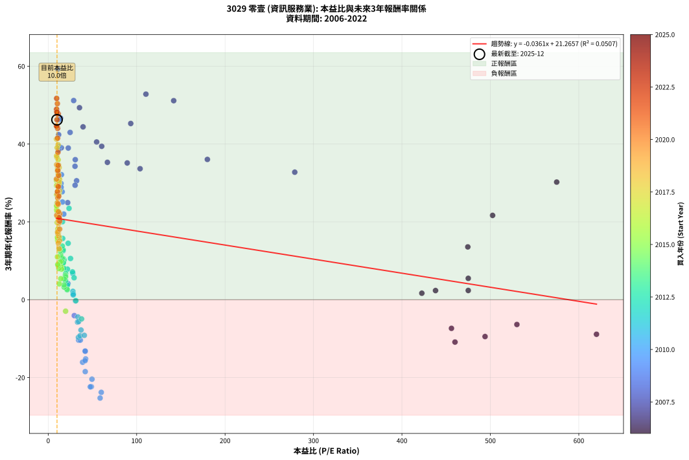
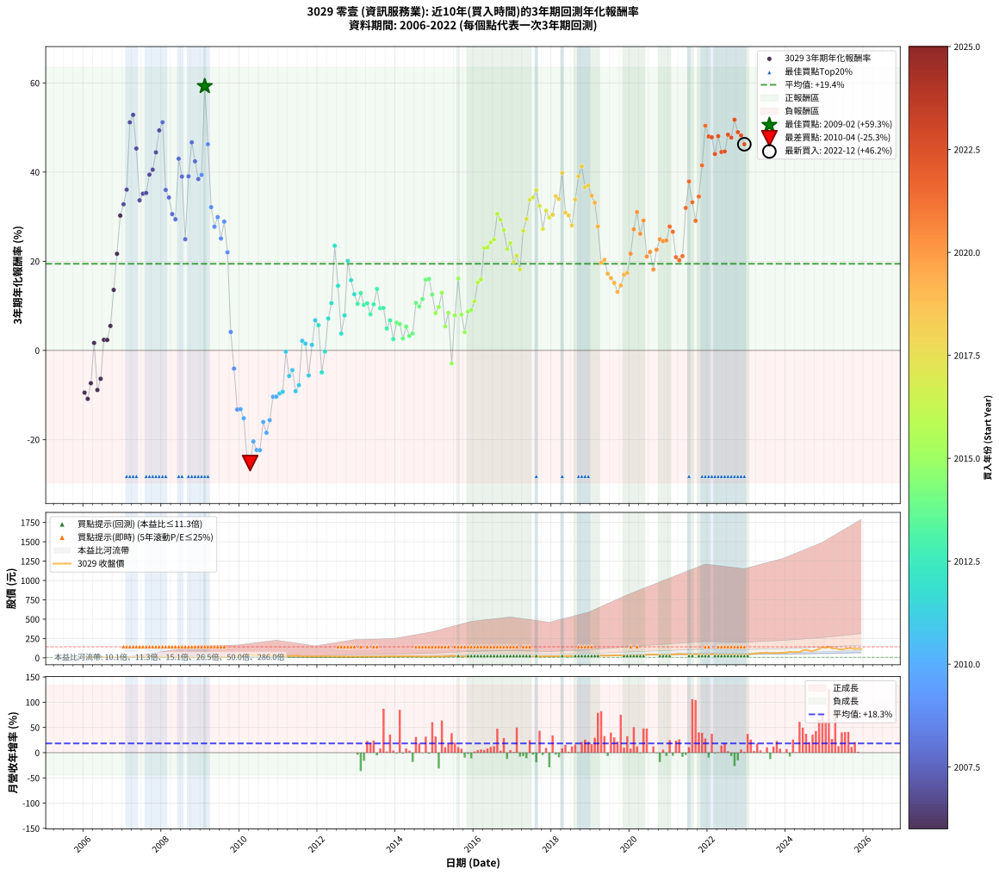

# 3029 零壹 - 本益比與未來報酬率分析

!!! info "報告資訊"
    - **股票代號**: 3029
    - **公司名稱**: 零壹
    - **產業別**: 資訊服務業
    - **分析期間**: 2006-2022 (204 個數據點)
    - **資料來源**: Type 12 (ShowMonthlyK_ChartFlow) 月收盤價與本益比
    - **報酬率口徑**: 含現金股利 (簡化: 年度合計，假設每年7/1入帳)
    - **報告生成時間**: 2026-01-12 21:02:15 CST

## 📈 視覺化圖表

### 圖表1: 本益比 vs 未來報酬率關係

*圖表1：3029 零壹 本益比與3年期未來報酬率關係 (2006-2022)*

### 圖表2: 歷年買入時點的3年期實際報酬率

*圖表2：3029 零壹 歷年買入時點的3年期實際報酬率 (2006-2022)*

## 📍 買點訊號說明

本報告提供兩種買點提示訊號（顯示於圖表2的股價子圖中）：

### ▲ 小綠色三角形（回測驗證）
- **計算方式**: 使用全部歷史資料計算本益比第25百分位數
- **用途**: 事後驗證，顯示歷史上哪些時點確實為低估區
- **限制**: 當下無法判斷，僅供回測參考
- **特性**: 後見之明（Look-Ahead Bias）

### ▲ 小橘色三角形（即時訊號）
- **計算方式**: 使用截至當月的過去5年資料計算本益比第25百分位數
- **用途**: 實際投資決策，當時即可判斷
- **優勢**: 可操作性強，符合實務需求
- **特性**: 無後見之明，滾動窗口計算

!!! tip "如何使用兩種訊號"
    - **綠色▲** 幫助理解歷史估值機會，驗證策略有效性
    - **橘色▲** 可作為實際買進參考，但仍需搭配基本面分析
    - 兩種訊號重疊時，表示即時判斷與事後驗證一致，信心度較高
    - 僅有綠色▲時，表示當時無法判斷（需要未來資料才能確認）
    - 僅有橘色▲時，表示即時判斷為買點，但事後可能不是最佳時機

## 📊 估值分析摘要

| 指標 | 數值 |
|:---:|:---:|
| **目前本益比** (2022-12) | **9.96 倍** |
| **歷史平均本益比** | 50.91 倍 |
| **估值水準** | 🟢 相對低估 |
| **預期3年年化報酬率** | **+20.91%** |
| **歷史平均報酬率** | +19.43% |
| **相關係數 (R²)** | 0.0507 |
| **趨勢線斜率** | -0.0361 |

!!! abstract "核心洞察"
    目前本益比顯著低於歷史平均，預期未來報酬率可能較高

    根據歷史數據回測，3029 零壹 在目前本益比 **10.0倍** 的估值水準下，
    預期未來3年年化報酬率約為 **+20.9%**。

    **重要提醒**: 本分析基於歷史數據統計，實際報酬率會受到公司基本面變化、產業趨勢、
    總體經濟環境等多重因素影響。R² = 0.05 表示本益比可解釋約 5.1% 的報酬率變異。

## 📈 歷史估值統計

### 最佳買點 (最高報酬率)

| 項目 | 數值 |
|:---:|:---:|
| 起始時間 | 2009-02 |
| 當時本益比 | 10.81 倍 |
| 起始價格 | 5.9 元 |
| 3年後價格 | 22.1 元 |
| **3年年化報酬率** | **+59.26%** |

### 最差買點 (最低報酬率)

| 項目 | 數值 |
|:---:|:---:|
| 起始時間 | 2010-04 |
| 當時本益比 | 58.70 倍 |
| 起始價格 | 38.4 元 |
| 3年後價格 | 14.1 元 |
| **3年年化報酬率** | **-25.27%** |

## 🎯 投資啟示

### 本益比與報酬率關係

趨勢線方程式: **y = -0.0361x + 21.2657**

!!! note "負相關"
    本益比與未來報酬率呈現負相關。較低的本益比通常帶來較高的未來報酬率，
    但相關性不算非常強。**估值仍是重要參考指標之一**。

### 估值區間建議

基於歷史數據分析:

- **🟢 低估區** (P/E < 40.7): 預期報酬率較高，可考慮增加持股
- **🟡 合理區** (P/E 40.7-61.1): 預期報酬率符合長期趨勢，正常持有
- **🔴 高估區** (P/E > 61.1): 預期報酬率較低，可考慮減碼或觀望

!!! danger "風險提示"
    - 過去表現不代表未來結果
    - 本分析假設公司基本面無重大結構性變化
    - 產業環境劇變可能使歷史規律失效
    - 應結合公司財報、產業趨勢、總體經濟等多重因素綜合判斷

!!! success "長期投資觀點"
    歷史數據顯示，在合理或低估的估值水準買入並長期持有，
    往往能獲得較佳的投資報酬。**耐心等待好價格**是價值投資的核心原則。

## 📊 數據品質

- **資料來源**: GoodInfo.tw Type 12 (ShowMonthlyK_ChartFlow)
- **資料頻率**: 月度收盤價與本益比
- **回測期間**: 2006-2022
- **數據點數量**: 204 個 (每個點代表一次3年期回測)

### 計算方法說明

1. **3年期年化報酬率**:
   - 對每個歷史時點，計算其後3年的實際投資報酬率
   - 期末價值(不含股利): 期末價格
   - 期末價值(含現金股利): 期末價格 + 持有期間內的現金股利合計 (簡化: 年度合計，假設每年7/1入帳)
   - 公式: 年化報酬率 = [(期末價值/期初價格)^(1/年數) - 1] × 100%

2. **本益比 (P/E Ratio)**:
   - 使用當時的月收盤價與EPS計算
   - 資料來源: Type 12 月度河流圖本益比數據

3. **趨勢線 (Linear Regression)**:
   - 使用最小平方法擬合線性趨勢線
   - R²值衡量本益比對報酬率的解釋能力

---

*本報告由 Stock Analysis System v1.9.0 自動生成*
*數據更新時間: 2026-01-12 21:02:15 CST*

## 📋 月度回測明細表

（每一列對應時間線圖中的一個買入點；可用來對照 SVG 圖上的每個點。）

| 買入月份 | 賣出月份 | 回測期限_年 | 實際持有年數 | 買入本益比_倍 | 買入收盤價_元 | 賣出收盤價_元 | 現金股利合計_元 | 總報酬率_pct | 年化報酬率_pct |
| --- | --- | --- | --- | --- | --- | --- | --- | --- | --- |
| 2006-01 | 2009-01 | 3 | 3.001 | 494.00 | 9.88 | 6.73 | 0.60 | -25.81 | -9.47 |
| 2006-02 | 2009-02 | 3 | 3.001 | 460.00 | 9.20 | 5.91 | 0.60 | -29.24 | -10.89 |
| 2006-03 | 2009-03 | 3 | 3.001 | 456.00 | 9.12 | 6.65 | 0.60 | -20.50 | -7.36 |
| 2006-04 | 2009-04 | 3 | 3.001 | 422.50 | 8.45 | 8.28 | 0.60 | +5.09 | +1.67 |
| 2006-05 | 2009-05 | 3 | 3.001 | 620.00 | 12.40 | 8.78 | 0.60 | -24.35 | -8.88 |
| 2006-06 | 2009-06 | 3 | 3.001 | 530.00 | 10.60 | 8.10 | 0.60 | -17.92 | -6.37 |
| 2006-07 | 2009-07 | 3 | 3.001 | 475.00 | 9.50 | 9.09 | 1.10 | +7.28 | +2.37 |
| 2006-08 | 2009-08 | 3 | 3.001 | 438.00 | 8.76 | 8.29 | 1.10 | +7.21 | +2.35 |
| 2006-09 | 2009-09 | 3 | 3.001 | 475.00 | 9.50 | 10.05 | 1.10 | +17.39 | +5.49 |
| 2006-10 | 2009-10 | 3 | 3.001 | 474.50 | 9.49 | 12.80 | 1.10 | +46.49 | +13.57 |
| 2006-11 | 2009-11 | 3 | 3.001 | 502.50 | 10.05 | 17.00 | 1.10 | +80.12 | +21.67 |
| 2006-12 | 2009-12 | 3 | 3.001 | 575.00 | 11.50 | 24.30 | 1.10 | +120.89 | +30.23 |
| 2007-01 | 2010-01 | 3 | 3.001 | 278.80 | 11.15 | 25.00 | 1.10 | +134.10 | +32.77 |
| 2007-02 | 2010-02 | 3 | 3.001 | 180.00 | 10.80 | 26.10 | 1.10 | +151.87 | +36.05 |
| 2007-03 | 2010-03 | 3 | 3.001 | 141.90 | 11.35 | 38.10 | 1.10 | +245.39 | +51.15 |
| 2007-04 | 2010-04 | 3 | 3.001 | 110.50 | 11.05 | 38.35 | 1.10 | +257.03 | +52.82 |
| 2007-05 | 2010-05 | 3 | 3.001 | 93.33 | 11.20 | 33.25 | 1.10 | +206.71 | +45.28 |
| 2007-06 | 2010-06 | 3 | 3.001 | 103.90 | 14.55 | 33.65 | 1.10 | +138.85 | +33.66 |
| 2007-07 | 2010-07 | 3 | 3.001 | 89.38 | 14.30 | 33.70 | 1.60 | +146.87 | +35.14 |
| 2007-08 | 2010-08 | 3 | 3.001 | 66.94 | 12.05 | 28.25 | 1.60 | +147.73 | +35.30 |
| 2007-09 | 2010-09 | 3 | 3.001 | 60.50 | 12.10 | 31.20 | 1.60 | +171.09 | +39.42 |
| 2007-10 | 2010-10 | 3 | 3.001 | 54.77 | 12.05 | 31.85 | 1.60 | +177.61 | +40.53 |
| 2007-11 | 2010-11 | 3 | 3.001 | 39.42 | 9.46 | 26.90 | 1.60 | +201.29 | +44.42 |
| 2007-12 | 2010-12 | 3 | 3.001 | 35.38 | 9.20 | 29.05 | 1.60 | +233.17 | +49.34 |
| 2008-01 | 2011-01 | 3 | 3.001 | 28.80 | 8.16 | 26.60 | 1.60 | +245.61 | +51.18 |
| 2008-02 | 2011-03 | 3 | 3.080 | 30.62 | 9.39 | 22.60 | 1.60 | +157.74 | +35.99 |
| 2008-03 | 2011-03 | 3 | 2.998 | 30.30 | 10.00 | 22.60 | 1.60 | +142.02 | +34.29 |
| 2008-04 | 2011-04 | 3 | 2.998 | 32.12 | 11.35 | 23.65 | 1.60 | +122.48 | +30.57 |
| 2008-05 | 2011-05 | 3 | 2.998 | 30.40 | 11.45 | 23.20 | 1.60 | +116.61 | +29.41 |
| 2008-06 | 2011-06 | 3 | 2.998 | 24.78 | 9.91 | 27.35 | 1.60 | +192.15 | +42.99 |
| 2008-07 | 2011-07 | 3 | 2.998 | 22.68 | 9.60 | 24.05 | 1.70 | +168.25 | +38.98 |
| 2008-08 | 2011-08 | 3 | 2.998 | 22.05 | 9.85 | 17.50 | 1.70 | +94.94 | +24.94 |
| 2008-09 | 2011-09 | 3 | 2.998 | 14.89 | 7.00 | 17.10 | 1.70 | +168.60 | +39.04 |
| 2008-10 | 2011-10 | 3 | 2.998 | 13.99 | 6.90 | 20.05 | 1.70 | +215.25 | +46.67 |
| 2008-11 | 2011-11 | 3 | 2.998 | 11.81 | 6.10 | 15.90 | 1.70 | +188.56 | +42.40 |
| 2008-12 | 2011-12 | 3 | 2.998 | 11.67 | 6.30 | 15.00 | 1.70 | +165.11 | +38.43 |
| 2009-01 | 2012-01 | 3 | 2.998 | 12.39 | 6.73 | 16.50 | 1.70 | +170.46 | +39.36 |
| 2009-02 | 2012-02 | 3 | 2.998 | 10.81 | 5.91 | 22.15 | 1.70 | +303.59 | +59.26 |
| 2009-03 | 2012-03 | 3 | 3.001 | 12.09 | 6.65 | 19.10 | 1.70 | +212.81 | +46.24 |
| 2009-04 | 2012-04 | 3 | 3.001 | 14.96 | 8.28 | 17.40 | 1.70 | +130.70 | +32.13 |
| 2009-05 | 2012-05 | 3 | 3.001 | 15.77 | 8.78 | 16.60 | 1.70 | +108.45 | +27.74 |
| 2009-06 | 2012-06 | 3 | 3.001 | 14.46 | 8.10 | 16.05 | 1.70 | +119.16 | +29.89 |
| 2009-07 | 2012-07 | 3 | 3.001 | 16.14 | 9.09 | 15.90 | 1.90 | +95.82 | +25.10 |
| 2009-08 | 2012-08 | 3 | 3.001 | 14.63 | 8.29 | 15.85 | 1.90 | +114.11 | +28.88 |
| 2009-09 | 2012-09 | 3 | 3.001 | 17.63 | 10.05 | 16.35 | 1.90 | +81.59 | +22.00 |
| 2009-10 | 2012-10 | 3 | 3.001 | 22.33 | 12.80 | 12.55 | 1.90 | +12.89 | +4.12 |
| 2009-11 | 2012-11 | 3 | 3.001 | 29.48 | 17.00 | 13.10 | 1.90 | -11.76 | -4.09 |
| 2009-12 | 2012-12 | 3 | 3.001 | 41.90 | 24.30 | 13.95 | 1.90 | -34.77 | -13.27 |
| 2010-01 | 2013-01 | 3 | 3.001 | 41.78 | 25.00 | 14.45 | 1.90 | -34.60 | -13.20 |
| 2010-02 | 2013-02 | 3 | 3.001 | 42.32 | 26.10 | 14.00 | 1.90 | -39.08 | -15.22 |
| 2010-03 | 2013-03 | 3 | 3.001 | 60.00 | 38.10 | 14.95 | 1.90 | -55.77 | -23.81 |
| 2010-04 | 2013-04 | 3 | 3.001 | 58.70 | 38.35 | 14.10 | 1.90 | -58.28 | -25.27 |
| 2010-05 | 2013-05 | 3 | 3.001 | 49.50 | 33.25 | 14.85 | 1.90 | -49.62 | -20.43 |
| 2010-06 | 2013-06 | 3 | 3.001 | 48.77 | 33.65 | 13.85 | 1.90 | -53.19 | -22.35 |
| 2010-07 | 2013-07 | 3 | 3.001 | 47.58 | 33.70 | 13.55 | 2.20 | -53.26 | -22.39 |
| 2010-08 | 2013-08 | 3 | 3.001 | 38.88 | 28.25 | 14.50 | 2.20 | -40.88 | -16.07 |
| 2010-09 | 2013-09 | 3 | 3.001 | 41.88 | 31.20 | 14.70 | 2.20 | -45.83 | -18.48 |
| 2010-10 | 2013-10 | 3 | 3.001 | 41.72 | 31.85 | 16.90 | 2.20 | -40.03 | -15.67 |
| 2010-11 | 2013-11 | 3 | 3.001 | 34.41 | 26.90 | 17.15 | 2.20 | -28.07 | -10.40 |
| 2010-12 | 2013-12 | 3 | 3.001 | 36.31 | 29.05 | 18.70 | 2.20 | -28.06 | -10.39 |
| 2011-01 | 2014-01 | 3 | 3.001 | 34.18 | 26.60 | 17.40 | 2.20 | -26.32 | -9.68 |
| 2011-02 | 2014-02 | 3 | 3.001 | 36.01 | 27.25 | 18.15 | 2.20 | -25.32 | -9.27 |
| 2011-03 | 2014-03 | 3 | 3.001 | 30.75 | 22.60 | 20.20 | 2.20 | -0.88 | -0.30 |
| 2011-04 | 2014-04 | 3 | 3.001 | 33.15 | 23.65 | 17.60 | 2.20 | -16.28 | -5.75 |
| 2011-05 | 2014-05 | 3 | 3.001 | 33.54 | 23.20 | 18.05 | 2.20 | -12.72 | -4.43 |
| 2011-06 | 2014-06 | 3 | 3.001 | 40.82 | 27.35 | 18.30 | 2.20 | -25.05 | -9.16 |
| 2011-07 | 2014-07 | 3 | 3.001 | 37.10 | 24.05 | 16.50 | 2.35 | -21.62 | -7.80 |
| 2011-08 | 2014-08 | 3 | 3.001 | 27.93 | 17.50 | 16.30 | 2.35 | +6.57 | +2.14 |
| 2011-09 | 2014-09 | 3 | 3.001 | 28.26 | 17.10 | 15.55 | 2.35 | +4.68 | +1.54 |
| 2011-10 | 2014-10 | 3 | 3.001 | 34.37 | 20.05 | 14.50 | 2.35 | -15.96 | -5.63 |
| 2011-11 | 2014-11 | 3 | 3.001 | 28.31 | 15.90 | 14.15 | 2.35 | +3.77 | +1.24 |
| 2011-12 | 2014-12 | 3 | 3.001 | 27.78 | 15.00 | 15.90 | 2.35 | +21.67 | +6.75 |
| 2012-01 | 2015-01 | 3 | 3.001 | 29.28 | 16.50 | 17.10 | 2.35 | +17.88 | +5.63 |
| 2012-02 | 2015-03 | 3 | 3.080 | 37.73 | 22.15 | 16.60 | 2.35 | -14.45 | -4.94 |
| 2012-03 | 2015-03 | 3 | 2.998 | 31.28 | 19.10 | 16.60 | 2.35 | -0.79 | -0.26 |
| 2012-04 | 2015-04 | 3 | 2.998 | 27.44 | 17.40 | 19.05 | 2.35 | +22.99 | +7.15 |
| 2012-05 | 2015-05 | 3 | 2.998 | 25.24 | 16.60 | 20.10 | 2.35 | +35.24 | +10.59 |
| 2012-06 | 2015-06 | 3 | 2.998 | 23.56 | 16.05 | 27.85 | 2.35 | +88.16 | +23.47 |
| 2012-07 | 2015-07 | 3 | 2.998 | 22.56 | 15.90 | 21.80 | 2.06 | +50.04 | +14.49 |
| 2012-08 | 2015-08 | 3 | 2.998 | 21.76 | 15.85 | 15.65 | 2.06 | +11.72 | +3.76 |
| 2012-09 | 2015-09 | 3 | 2.998 | 21.74 | 16.35 | 18.45 | 2.06 | +25.43 | +7.85 |
| 2012-10 | 2015-10 | 3 | 2.998 | 16.18 | 12.55 | 19.65 | 2.06 | +72.96 | +20.05 |
| 2012-11 | 2015-11 | 3 | 2.998 | 16.40 | 13.10 | 18.25 | 2.06 | +55.02 | +15.74 |
| 2012-12 | 2015-12 | 3 | 2.998 | 16.96 | 13.95 | 17.85 | 2.06 | +42.70 | +12.59 |
| 2013-01 | 2016-01 | 3 | 2.998 | 17.48 | 14.45 | 17.40 | 2.06 | +34.65 | +10.43 |
| 2013-02 | 2016-02 | 3 | 2.998 | 16.86 | 14.00 | 18.05 | 2.06 | +43.62 | +12.83 |
| 2013-03 | 2016-03 | 3 | 3.001 | 17.92 | 14.95 | 17.95 | 2.06 | +33.83 | +10.20 |
| 2013-04 | 2016-04 | 3 | 3.001 | 16.82 | 14.10 | 17.00 | 2.06 | +35.16 | +10.56 |
| 2013-05 | 2016-05 | 3 | 3.001 | 17.63 | 14.85 | 16.70 | 2.06 | +26.31 | +8.09 |
| 2013-06 | 2016-06 | 3 | 3.001 | 16.37 | 13.85 | 16.55 | 2.06 | +34.35 | +10.34 |
| 2013-07 | 2016-07 | 3 | 3.001 | 15.94 | 13.55 | 17.70 | 2.26 | +47.28 | +13.77 |
| 2013-08 | 2016-08 | 3 | 3.001 | 16.98 | 14.50 | 16.75 | 2.26 | +31.08 | +9.44 |
| 2013-09 | 2016-09 | 3 | 3.001 | 17.13 | 14.70 | 17.05 | 2.26 | +31.34 | +9.51 |
| 2013-10 | 2016-10 | 3 | 3.001 | 19.60 | 16.90 | 17.25 | 2.26 | +15.43 | +4.90 |
| 2013-11 | 2016-11 | 3 | 3.001 | 19.80 | 17.15 | 18.60 | 2.26 | +21.62 | +6.74 |
| 2013-12 | 2016-12 | 3 | 3.001 | 21.49 | 18.70 | 17.90 | 2.26 | +7.79 | +2.53 |
| 2014-01 | 2017-01 | 3 | 3.001 | 19.42 | 17.40 | 18.60 | 2.26 | +19.87 | +6.23 |
| 2014-02 | 2017-02 | 3 | 3.001 | 19.69 | 18.15 | 19.30 | 2.26 | +18.77 | +5.90 |
| 2014-03 | 2017-03 | 3 | 3.001 | 21.32 | 20.20 | 19.60 | 2.26 | +8.20 | +2.66 |
| 2014-04 | 2017-04 | 3 | 3.001 | 18.08 | 17.60 | 18.30 | 2.26 | +16.80 | +5.31 |
| 2014-05 | 2017-05 | 3 | 3.001 | 18.07 | 18.05 | 17.60 | 2.26 | +10.01 | +3.23 |
| 2014-06 | 2017-06 | 3 | 3.001 | 17.85 | 18.30 | 18.20 | 2.26 | +11.79 | +3.78 |
| 2014-07 | 2017-07 | 3 | 3.001 | 15.70 | 16.50 | 19.75 | 2.61 | +35.50 | +10.65 |
| 2014-08 | 2017-08 | 3 | 3.001 | 15.14 | 16.30 | 19.00 | 2.61 | +32.56 | +9.85 |
| 2014-09 | 2017-09 | 3 | 3.001 | 14.10 | 15.55 | 18.95 | 2.61 | +38.63 | +11.50 |
| 2014-10 | 2017-10 | 3 | 3.001 | 12.85 | 14.50 | 19.95 | 2.61 | +55.57 | +15.87 |
| 2014-11 | 2017-11 | 3 | 3.001 | 12.26 | 14.15 | 19.50 | 2.61 | +56.23 | +16.03 |
| 2014-12 | 2017-12 | 3 | 3.001 | 13.47 | 15.90 | 20.05 | 2.61 | +42.50 | +12.53 |
| 2015-01 | 2018-01 | 3 | 3.001 | 14.03 | 17.10 | 19.15 | 2.61 | +27.23 | +8.36 |
| 2015-02 | 2018-02 | 3 | 3.001 | 13.51 | 17.00 | 19.85 | 2.61 | +32.10 | +9.72 |
| 2015-03 | 2018-03 | 3 | 3.001 | 12.79 | 16.60 | 21.30 | 2.61 | +44.02 | +12.93 |
| 2015-04 | 2018-04 | 3 | 3.001 | 14.25 | 19.05 | 19.70 | 2.61 | +17.10 | +5.40 |
| 2015-05 | 2018-05 | 3 | 3.001 | 14.61 | 20.10 | 23.00 | 2.61 | +27.40 | +8.40 |
| 2015-06 | 2018-06 | 3 | 3.001 | 19.68 | 27.85 | 22.85 | 2.61 | -8.59 | -2.95 |
| 2015-07 | 2018-07 | 3 | 3.001 | 14.99 | 21.80 | 23.85 | 3.50 | +25.46 | +7.85 |
| 2015-08 | 2018-08 | 3 | 3.001 | 10.48 | 15.65 | 21.00 | 3.50 | +56.55 | +16.11 |
| 2015-09 | 2018-09 | 3 | 3.001 | 12.04 | 18.45 | 19.75 | 3.50 | +26.02 | +8.01 |
| 2015-10 | 2018-10 | 3 | 3.001 | 12.50 | 19.65 | 18.65 | 3.50 | +12.72 | +4.07 |
| 2015-11 | 2018-11 | 3 | 3.001 | 11.33 | 18.25 | 19.95 | 3.50 | +28.49 | +8.71 |
| 2015-12 | 2018-12 | 3 | 3.001 | 10.82 | 17.85 | 19.65 | 3.50 | +29.69 | +9.05 |
| 2016-01 | 2019-01 | 3 | 3.001 | 10.44 | 17.40 | 20.30 | 3.50 | +36.78 | +11.00 |
| 2016-02 | 2019-03 | 3 | 3.080 | 10.72 | 18.05 | 24.45 | 3.50 | +54.85 | +15.25 |
| 2016-03 | 2019-03 | 3 | 2.998 | 10.56 | 17.95 | 24.45 | 3.50 | +55.71 | +15.92 |
| 2016-04 | 2019-04 | 3 | 2.998 | 9.90 | 17.00 | 28.10 | 3.50 | +85.88 | +22.97 |
| 2016-05 | 2019-05 | 3 | 2.998 | 9.63 | 16.70 | 27.65 | 3.50 | +86.53 | +23.11 |
| 2016-06 | 2019-06 | 3 | 2.998 | 9.46 | 16.55 | 28.20 | 3.50 | +91.54 | +24.21 |
| 2016-07 | 2019-07 | 3 | 2.998 | 10.02 | 17.70 | 30.45 | 4.00 | +94.62 | +24.87 |
| 2016-08 | 2019-08 | 3 | 2.998 | 9.39 | 16.75 | 33.30 | 4.00 | +122.67 | +30.61 |
| 2016-09 | 2019-09 | 3 | 2.998 | 9.47 | 17.05 | 32.85 | 4.00 | +116.11 | +29.31 |
| 2016-10 | 2019-10 | 3 | 2.998 | 9.50 | 17.25 | 31.30 | 4.00 | +104.62 | +26.98 |
| 2016-11 | 2019-11 | 3 | 2.998 | 10.15 | 18.60 | 30.35 | 4.00 | +84.66 | +22.70 |
| 2016-12 | 2019-12 | 3 | 2.998 | 9.68 | 17.90 | 30.15 | 4.00 | +90.77 | +24.04 |
| 2017-01 | 2020-01 | 3 | 2.998 | 10.16 | 18.60 | 28.00 | 4.00 | +72.03 | +19.84 |
| 2017-02 | 2020-02 | 3 | 2.998 | 10.66 | 19.30 | 30.40 | 4.00 | +78.22 | +21.26 |
| 2017-03 | 2020-03 | 3 | 3.001 | 10.95 | 19.60 | 28.35 | 4.00 | +65.04 | +18.17 |
| 2017-04 | 2020-04 | 3 | 3.001 | 10.34 | 18.30 | 33.35 | 4.00 | +104.08 | +26.84 |
| 2017-05 | 2020-05 | 3 | 3.001 | 10.06 | 17.60 | 34.20 | 4.00 | +117.03 | +29.46 |
| 2017-06 | 2020-06 | 3 | 3.001 | 10.52 | 18.20 | 39.60 | 4.00 | +139.54 | +33.79 |
| 2017-07 | 2020-07 | 3 | 3.001 | 11.55 | 19.75 | 43.05 | 4.81 | +142.31 | +34.31 |
| 2017-08 | 2020-08 | 3 | 3.001 | 11.24 | 19.00 | 42.95 | 4.81 | +151.35 | +35.96 |
| 2017-09 | 2020-09 | 3 | 3.001 | 11.35 | 18.95 | 39.15 | 4.81 | +131.96 | +32.37 |
| 2017-10 | 2020-10 | 3 | 3.001 | 12.09 | 19.95 | 36.30 | 4.81 | +106.05 | +27.24 |
| 2017-11 | 2020-11 | 3 | 3.001 | 11.96 | 19.50 | 39.40 | 4.81 | +126.70 | +31.36 |
| 2017-12 | 2020-12 | 3 | 3.001 | 12.45 | 20.05 | 39.05 | 4.81 | +118.74 | +29.80 |
| 2018-01 | 2021-01 | 3 | 3.001 | 11.62 | 19.15 | 37.70 | 4.81 | +121.97 | +30.44 |
| 2018-02 | 2021-02 | 3 | 3.001 | 11.78 | 19.85 | 43.60 | 4.81 | +143.86 | +34.59 |
| 2018-03 | 2021-03 | 3 | 3.001 | 12.37 | 21.30 | 46.40 | 4.81 | +140.41 | +33.95 |
| 2018-04 | 2021-04 | 3 | 3.001 | 11.19 | 19.70 | 49.05 | 4.81 | +173.39 | +39.82 |
| 2018-05 | 2021-05 | 3 | 3.001 | 12.80 | 23.00 | 46.80 | 4.81 | +124.38 | +30.91 |
| 2018-06 | 2021-06 | 3 | 3.001 | 12.45 | 22.85 | 45.70 | 4.81 | +121.04 | +30.26 |
| 2018-07 | 2021-07 | 3 | 3.001 | 12.74 | 23.85 | 43.55 | 6.51 | +109.89 | +28.03 |
| 2018-08 | 2021-08 | 3 | 3.001 | 10.99 | 21.00 | 43.85 | 6.51 | +139.80 | +33.84 |
| 2018-09 | 2021-09 | 3 | 3.001 | 10.14 | 19.75 | 46.60 | 6.51 | +168.90 | +39.05 |
| 2018-10 | 2021-10 | 3 | 3.001 | 9.40 | 18.65 | 46.10 | 6.51 | +182.08 | +41.28 |
| 2018-11 | 2021-11 | 3 | 3.001 | 9.86 | 19.95 | 44.35 | 6.51 | +154.93 | +36.60 |
| 2018-12 | 2021-12 | 3 | 3.001 | 9.54 | 19.65 | 44.00 | 6.51 | +157.04 | +36.97 |
| 2019-01 | 2022-01 | 3 | 3.001 | 9.55 | 20.30 | 43.10 | 6.51 | +144.37 | +34.69 |
| 2019-02 | 2022-02 | 3 | 3.001 | 10.49 | 23.00 | 47.75 | 6.51 | +135.90 | +33.11 |
| 2019-03 | 2022-03 | 3 | 3.001 | 10.83 | 24.45 | 44.55 | 6.51 | +108.83 | +27.81 |
| 2019-04 | 2022-04 | 3 | 3.001 | 12.09 | 28.10 | 41.65 | 6.51 | +71.38 | +19.67 |
| 2019-05 | 2022-05 | 3 | 3.001 | 11.57 | 27.65 | 41.65 | 6.51 | +74.17 | +20.31 |
| 2019-06 | 2022-06 | 3 | 3.001 | 11.49 | 28.20 | 38.90 | 6.51 | +61.02 | +17.20 |
| 2019-07 | 2022-07 | 3 | 3.001 | 12.08 | 30.45 | 39.20 | 8.61 | +57.02 | +16.23 |
| 2019-08 | 2022-08 | 3 | 3.001 | 12.87 | 33.30 | 42.20 | 8.61 | +52.59 | +15.12 |
| 2019-09 | 2022-09 | 3 | 3.001 | 12.38 | 32.85 | 38.95 | 8.61 | +44.79 | +13.13 |
| 2019-10 | 2022-10 | 3 | 3.001 | 11.51 | 31.30 | 38.45 | 8.61 | +50.36 | +14.56 |
| 2019-11 | 2022-11 | 3 | 3.001 | 10.90 | 30.35 | 39.95 | 8.61 | +60.01 | +16.96 |
| 2019-12 | 2022-12 | 3 | 3.001 | 10.58 | 30.15 | 40.15 | 8.61 | +61.74 | +17.38 |
| 2020-01 | 2023-01 | 3 | 3.001 | 9.63 | 28.00 | 41.85 | 8.61 | +80.23 | +21.69 |
| 2020-02 | 2023-03 | 3 | 3.080 | 10.25 | 30.40 | 55.10 | 8.61 | +109.59 | +27.16 |
| 2020-03 | 2023-03 | 3 | 2.998 | 9.37 | 28.35 | 55.10 | 8.61 | +124.74 | +31.01 |
| 2020-04 | 2023-04 | 3 | 2.998 | 10.82 | 33.35 | 58.30 | 8.61 | +100.64 | +26.15 |
| 2020-05 | 2023-05 | 3 | 2.998 | 10.89 | 34.20 | 65.00 | 8.61 | +115.25 | +29.14 |
| 2020-06 | 2023-06 | 3 | 2.998 | 12.38 | 39.60 | 61.60 | 8.61 | +77.31 | +21.05 |
| 2020-07 | 2023-07 | 3 | 2.998 | 13.21 | 43.05 | 68.10 | 10.20 | +81.89 | +22.08 |
| 2020-08 | 2023-08 | 3 | 2.998 | 12.95 | 42.95 | 60.60 | 10.20 | +64.85 | +18.14 |
| 2020-09 | 2023-09 | 3 | 2.998 | 11.60 | 39.15 | 61.90 | 10.20 | +84.17 | +22.59 |
| 2020-10 | 2023-10 | 3 | 2.998 | 10.57 | 36.30 | 60.50 | 10.20 | +94.77 | +24.90 |
| 2020-11 | 2023-11 | 3 | 2.998 | 11.28 | 39.40 | 65.80 | 10.20 | +92.90 | +24.50 |
| 2020-12 | 2023-12 | 3 | 2.998 | 11.00 | 39.05 | 65.40 | 10.20 | +93.60 | +24.65 |
| 2021-01 | 2024-01 | 3 | 2.998 | 10.45 | 37.70 | 68.40 | 10.20 | +108.49 | +27.77 |
| 2021-02 | 2024-02 | 3 | 2.998 | 11.90 | 43.60 | 78.20 | 10.20 | +102.76 | +26.59 |
| 2021-03 | 2024-03 | 3 | 3.001 | 12.46 | 46.40 | 71.80 | 10.20 | +76.73 | +20.90 |
| 2021-04 | 2024-04 | 3 | 3.001 | 12.98 | 49.05 | 75.00 | 10.20 | +73.70 | +20.20 |
| 2021-05 | 2024-05 | 3 | 3.001 | 12.20 | 46.80 | 73.00 | 10.20 | +77.78 | +21.14 |
| 2021-06 | 2024-06 | 3 | 3.001 | 11.73 | 45.70 | 94.80 | 10.20 | +129.76 | +31.95 |
| 2021-07 | 2024-07 | 3 | 3.001 | 11.02 | 43.55 | 103.00 | 11.20 | +162.23 | +37.89 |
| 2021-08 | 2024-08 | 3 | 3.001 | 10.94 | 43.85 | 92.50 | 11.20 | +136.49 | +33.22 |
| 2021-09 | 2024-09 | 3 | 3.001 | 11.46 | 46.60 | 89.00 | 11.20 | +115.02 | +29.06 |
| 2021-10 | 2024-10 | 3 | 3.001 | 11.18 | 46.10 | 101.00 | 11.20 | +143.39 | +34.50 |
| 2021-11 | 2024-11 | 3 | 3.001 | 10.60 | 44.35 | 114.50 | 11.20 | +183.43 | +41.51 |
| 2021-12 | 2024-12 | 3 | 3.001 | 10.38 | 44.00 | 138.50 | 11.20 | +240.23 | +50.39 |
| 2022-01 | 2025-01 | 3 | 3.001 | 10.21 | 43.10 | 128.50 | 11.20 | +224.13 | +47.98 |
| 2022-02 | 2025-02 | 3 | 3.001 | 11.36 | 47.75 | 143.00 | 11.20 | +222.93 | +47.80 |
| 2022-03 | 2025-03 | 3 | 3.001 | 10.64 | 44.55 | 122.00 | 11.20 | +198.99 | +44.05 |
| 2022-04 | 2025-04 | 3 | 3.001 | 9.99 | 41.65 | 124.00 | 11.20 | +224.61 | +48.05 |
| 2022-05 | 2025-05 | 3 | 3.001 | 10.03 | 41.65 | 114.50 | 11.20 | +201.80 | +44.50 |
| 2022-06 | 2025-06 | 3 | 3.001 | 9.41 | 38.90 | 106.50 | 11.20 | +202.57 | +44.62 |
| 2022-07 | 2025-07 | 3 | 3.001 | 9.52 | 39.20 | 115.50 | 12.60 | +226.78 | +48.38 |
| 2022-08 | 2025-08 | 3 | 3.001 | 10.29 | 42.20 | 123.50 | 12.60 | +222.51 | +47.73 |
| 2022-09 | 2025-09 | 3 | 3.001 | 9.54 | 38.95 | 123.50 | 12.60 | +249.42 | +51.73 |
| 2022-10 | 2025-10 | 3 | 3.001 | 9.46 | 38.45 | 114.50 | 12.60 | +230.55 | +48.95 |
| 2022-11 | 2025-11 | 3 | 3.001 | 9.87 | 39.95 | 117.50 | 12.60 | +225.65 | +48.21 |
| 2022-12 | 2025-12 | 3 | 3.001 | 9.96 | 40.15 | 113.00 | 12.60 | +212.82 | +46.24 |
