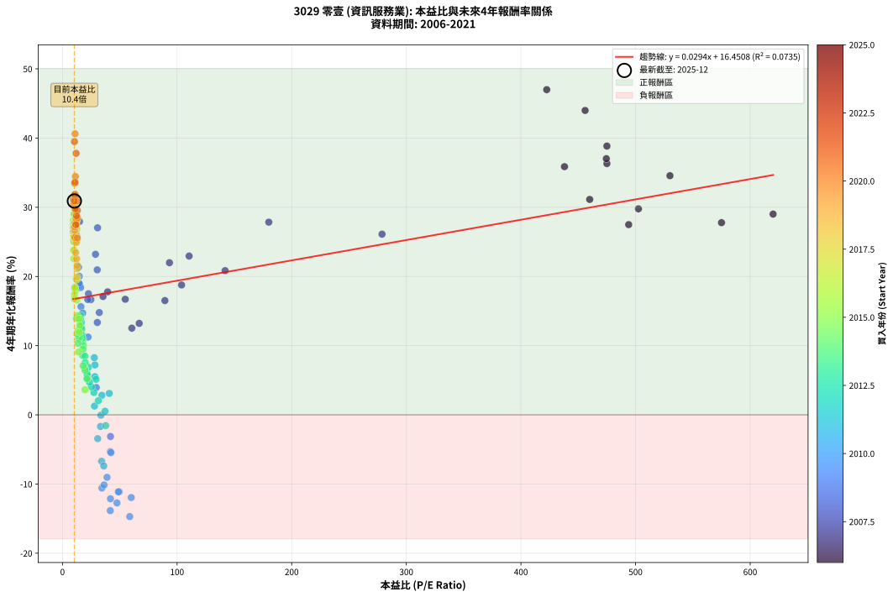
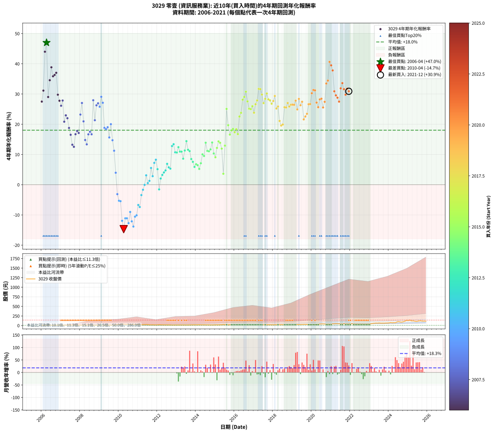

# 3029 零壹 - 本益比與未來報酬率分析

!!! info "報告資訊"
    - **股票代號**: 3029
    - **公司名稱**: 零壹
    - **產業別**: 資訊服務業
    - **分析期間**: 2006-2021 (192 個數據點)
    - **資料來源**: Type 12 (ShowMonthlyK_ChartFlow) 月收盤價與本益比
    - **報酬率口徑**: 含現金股利 (簡化: 年度合計，假設每年7/1入帳)
    - **報告生成時間**: 2026-01-10 22:48:13 CST

## 📈 視覺化圖表

### 圖表1: 本益比 vs 未來報酬率關係

*圖表1：3029 零壹 本益比與4年期未來報酬率關係 (2006-2021)*

### 圖表2: 歷年買入時點的4年期實際報酬率

*圖表2：3029 零壹 歷年買入時點的4年期實際報酬率 (2006-2021)*

## 📍 買點訊號說明

本報告提供兩種買點提示訊號（顯示於圖表2的股價子圖中）：

### ▲ 小綠色三角形（回測驗證）
- **計算方式**: 使用全部歷史資料計算本益比第25百分位數
- **用途**: 事後驗證，顯示歷史上哪些時點確實為低估區
- **限制**: 當下無法判斷，僅供回測參考
- **特性**: 後見之明（Look-Ahead Bias）

### ▲ 小橘色三角形（即時訊號）
- **計算方式**: 使用截至當月的過去5年資料計算本益比第25百分位數
- **用途**: 實際投資決策，當時即可判斷
- **優勢**: 可操作性強，符合實務需求
- **特性**: 無後見之明，滾動窗口計算

!!! tip "如何使用兩種訊號"
    - **綠色▲** 幫助理解歷史估值機會，驗證策略有效性
    - **橘色▲** 可作為實際買進參考，但仍需搭配基本面分析
    - 兩種訊號重疊時，表示即時判斷與事後驗證一致，信心度較高
    - 僅有綠色▲時，表示當時無法判斷（需要未來資料才能確認）
    - 僅有橘色▲時，表示即時判斷為買點，但事後可能不是最佳時機

## 📊 估值分析摘要

| 指標 | 數值 |
|:---:|:---:|
| **目前本益比** (2021-12) | **10.38 倍** |
| **歷史平均本益比** | 53.47 倍 |
| **估值水準** | 🟢 相對低估 |
| **預期4年年化報酬率** | **+16.76%** |
| **歷史平均報酬率** | +18.02% |
| **相關係數 (R²)** | 0.0735 |
| **趨勢線斜率** | 0.0294 |

!!! abstract "核心洞察"
    目前本益比顯著低於歷史平均，預期未來報酬率可能較高

    根據歷史數據回測，3029 零壹 在目前本益比 **10.4倍** 的估值水準下，
    預期未來4年年化報酬率約為 **+16.8%**。

    **重要提醒**: 本分析基於歷史數據統計，實際報酬率會受到公司基本面變化、產業趨勢、
    總體經濟環境等多重因素影響。R² = 0.07 表示本益比可解釋約 7.3% 的報酬率變異。

## 📈 歷史估值統計

### 最佳買點 (最高報酬率)

| 項目 | 數值 |
|:---:|:---:|
| 起始時間 | 2006-04 |
| 當時本益比 | 422.50 倍 |
| 起始價格 | 8.4 元 |
| 4年後價格 | 38.4 元 |
| **4年年化報酬率** | **+47.00%** |

### 最差買點 (最低報酬率)

| 項目 | 數值 |
|:---:|:---:|
| 起始時間 | 2010-04 |
| 當時本益比 | 58.70 倍 |
| 起始價格 | 38.4 元 |
| 4年後價格 | 17.6 元 |
| **4年年化報酬率** | **-14.70%** |

## 🎯 投資啟示

### 本益比與報酬率關係

趨勢線方程式: **y = 0.0294x + 16.4508**

!!! info "弱相關或正相關"
    本益比與未來報酬率相關性較弱。這可能表示該股票的報酬率更多受到
    公司成長性、產業趨勢等因素影響，而非估值水準。**需綜合考量多項指標**。

### 估值區間建議

基於歷史數據分析:

- **🟢 低估區** (P/E < 42.8): 預期報酬率較高，可考慮增加持股
- **🟡 合理區** (P/E 42.8-64.2): 預期報酬率符合長期趨勢，正常持有
- **🔴 高估區** (P/E > 64.2): 預期報酬率較低，可考慮減碼或觀望

!!! danger "風險提示"
    - 過去表現不代表未來結果
    - 本分析假設公司基本面無重大結構性變化
    - 產業環境劇變可能使歷史規律失效
    - 應結合公司財報、產業趨勢、總體經濟等多重因素綜合判斷

!!! success "長期投資觀點"
    歷史數據顯示，在合理或低估的估值水準買入並長期持有，
    往往能獲得較佳的投資報酬。**耐心等待好價格**是價值投資的核心原則。

## 📊 數據品質

- **資料來源**: GoodInfo.tw Type 12 (ShowMonthlyK_ChartFlow)
- **資料頻率**: 月度收盤價與本益比
- **回測期間**: 2006-2021
- **數據點數量**: 192 個 (每個點代表一次4年期回測)

### 計算方法說明

1. **4年期年化報酬率**:
   - 對每個歷史時點，計算其後4年的實際投資報酬率
   - 期末價值(不含股利): 期末價格
   - 期末價值(含現金股利): 期末價格 + 持有期間內的現金股利合計 (簡化: 年度合計，假設每年7/1入帳)
   - 公式: 年化報酬率 = [(期末價值/期初價格)^(1/年數) - 1] × 100%

2. **本益比 (P/E Ratio)**:
   - 使用當時的月收盤價與EPS計算
   - 資料來源: Type 12 月度河流圖本益比數據

3. **趨勢線 (Linear Regression)**:
   - 使用最小平方法擬合線性趨勢線
   - R²值衡量本益比對報酬率的解釋能力

---

*本報告由 Stock Analysis System v1.9.0 自動生成*
*數據更新時間: 2026-01-10 22:48:13 CST*

## 📋 月度回測明細表

（每一列對應時間線圖中的一個買入點；可用來對照 SVG 圖上的每個點。）

| 買入月份 | 賣出月份 | 回測期限_年 | 實際持有年數 | 買入本益比_倍 | 買入收盤價_元 | 賣出收盤價_元 | 現金股利合計_元 | 總報酬率_pct | 年化報酬率_pct |
| --- | --- | --- | --- | --- | --- | --- | --- | --- | --- |
| 2006-01 | 2010-01 | 4 | 4.000 | 494.00 | 9.88 | 25.00 | 1.10 | +164.19 | +27.49 |
| 2006-02 | 2010-02 | 4 | 4.000 | 460.00 | 9.20 | 26.10 | 1.10 | +195.67 | +31.13 |
| 2006-03 | 2010-03 | 4 | 4.000 | 456.00 | 9.12 | 38.10 | 1.10 | +329.85 | +43.99 |
| 2006-04 | 2010-04 | 4 | 4.000 | 422.50 | 8.45 | 38.35 | 1.10 | +366.89 | +47.00 |
| 2006-05 | 2010-05 | 4 | 4.000 | 620.00 | 12.40 | 33.25 | 1.10 | +177.03 | +29.01 |
| 2006-06 | 2010-06 | 4 | 4.000 | 530.00 | 10.60 | 33.65 | 1.10 | +227.85 | +34.56 |
| 2006-07 | 2010-07 | 4 | 4.000 | 475.00 | 9.50 | 33.70 | 1.60 | +271.60 | +38.84 |
| 2006-08 | 2010-08 | 4 | 4.000 | 438.00 | 8.76 | 28.25 | 1.60 | +240.78 | +35.87 |
| 2006-09 | 2010-09 | 4 | 4.000 | 475.00 | 9.50 | 31.20 | 1.60 | +245.28 | +36.32 |
| 2006-10 | 2010-10 | 4 | 4.000 | 474.50 | 9.49 | 31.85 | 1.60 | +252.50 | +37.02 |
| 2006-11 | 2010-11 | 4 | 4.000 | 502.50 | 10.05 | 26.90 | 1.60 | +183.60 | +29.77 |
| 2006-12 | 2010-12 | 4 | 4.000 | 575.00 | 11.50 | 29.05 | 1.60 | +166.54 | +27.77 |
| 2007-01 | 2011-01 | 4 | 4.000 | 278.80 | 11.15 | 26.60 | 1.60 | +152.93 | +26.11 |
| 2007-02 | 2011-02 | 4 | 4.000 | 180.00 | 10.80 | 27.25 | 1.60 | +167.15 | +27.85 |
| 2007-03 | 2011-03 | 4 | 4.000 | 141.90 | 11.35 | 22.60 | 1.60 | +113.23 | +20.84 |
| 2007-04 | 2011-04 | 4 | 4.000 | 110.50 | 11.05 | 23.65 | 1.60 | +128.52 | +22.95 |
| 2007-05 | 2011-05 | 4 | 4.000 | 93.33 | 11.20 | 23.20 | 1.60 | +121.45 | +21.99 |
| 2007-06 | 2011-06 | 4 | 4.000 | 103.90 | 14.55 | 27.35 | 1.60 | +98.98 | +18.77 |
| 2007-07 | 2011-07 | 4 | 4.000 | 89.38 | 14.30 | 24.05 | 2.30 | +84.28 | +16.51 |
| 2007-08 | 2011-08 | 4 | 4.000 | 66.94 | 12.05 | 17.50 | 2.30 | +64.33 | +13.22 |
| 2007-09 | 2011-09 | 4 | 4.000 | 60.50 | 12.10 | 17.10 | 2.30 | +60.35 | +12.53 |
| 2007-10 | 2011-10 | 4 | 4.000 | 54.77 | 12.05 | 20.05 | 2.30 | +85.49 | +16.70 |
| 2007-11 | 2011-11 | 4 | 4.000 | 39.42 | 9.46 | 15.90 | 2.30 | +92.41 | +17.78 |
| 2007-12 | 2011-12 | 4 | 4.000 | 35.38 | 9.20 | 15.00 | 2.30 | +88.07 | +17.11 |
| 2008-01 | 2012-01 | 4 | 4.000 | 28.80 | 8.16 | 16.50 | 2.30 | +130.42 | +23.21 |
| 2008-02 | 2012-02 | 4 | 4.000 | 30.62 | 9.39 | 22.15 | 2.30 | +160.40 | +27.03 |
| 2008-03 | 2012-03 | 4 | 4.000 | 30.30 | 10.00 | 19.10 | 2.30 | +114.02 | +20.95 |
| 2008-04 | 2012-04 | 4 | 4.000 | 32.12 | 11.35 | 17.40 | 2.30 | +73.59 | +14.78 |
| 2008-05 | 2012-05 | 4 | 4.000 | 30.40 | 11.45 | 16.60 | 2.30 | +65.08 | +13.35 |
| 2008-06 | 2012-06 | 4 | 4.000 | 24.78 | 9.91 | 16.05 | 2.30 | +85.19 | +16.65 |
| 2008-07 | 2012-07 | 4 | 4.000 | 22.68 | 9.60 | 15.90 | 2.40 | +90.65 | +17.51 |
| 2008-08 | 2012-08 | 4 | 4.000 | 22.05 | 9.85 | 15.85 | 2.40 | +85.30 | +16.67 |
| 2008-09 | 2012-09 | 4 | 4.000 | 14.89 | 7.00 | 16.35 | 2.40 | +167.89 | +27.93 |
| 2008-10 | 2012-10 | 4 | 4.000 | 13.99 | 6.90 | 12.55 | 2.40 | +116.70 | +21.33 |
| 2008-11 | 2012-11 | 4 | 4.000 | 11.81 | 6.10 | 13.10 | 2.40 | +154.13 | +26.26 |
| 2008-12 | 2012-12 | 4 | 4.000 | 11.67 | 6.30 | 13.95 | 2.40 | +159.56 | +26.93 |
| 2009-01 | 2013-01 | 4 | 4.000 | 12.39 | 6.73 | 14.45 | 2.40 | +150.40 | +25.79 |
| 2009-02 | 2013-02 | 4 | 4.000 | 10.81 | 5.91 | 14.00 | 2.40 | +177.53 | +29.07 |
| 2009-03 | 2013-03 | 4 | 4.000 | 12.09 | 6.65 | 14.95 | 2.40 | +160.93 | +27.10 |
| 2009-04 | 2013-04 | 4 | 4.000 | 14.96 | 8.28 | 14.10 | 2.40 | +99.30 | +18.82 |
| 2009-05 | 2013-05 | 4 | 4.000 | 15.77 | 8.78 | 14.85 | 2.40 | +96.49 | +18.40 |
| 2009-06 | 2013-06 | 4 | 4.000 | 14.46 | 8.10 | 13.85 | 2.40 | +100.64 | +19.02 |
| 2009-07 | 2013-07 | 4 | 4.000 | 16.14 | 9.09 | 13.55 | 2.70 | +78.77 | +15.63 |
| 2009-08 | 2013-08 | 4 | 4.000 | 14.63 | 8.29 | 14.50 | 2.70 | +107.48 | +20.02 |
| 2009-09 | 2013-09 | 4 | 4.000 | 17.63 | 10.05 | 14.70 | 2.70 | +73.13 | +14.71 |
| 2009-10 | 2013-10 | 4 | 4.000 | 22.33 | 12.80 | 16.90 | 2.70 | +53.12 | +11.24 |
| 2009-11 | 2013-11 | 4 | 4.000 | 29.48 | 17.00 | 17.15 | 2.70 | +16.76 | +3.95 |
| 2009-12 | 2013-12 | 4 | 4.000 | 41.90 | 24.30 | 18.70 | 2.70 | -11.93 | -3.13 |
| 2010-01 | 2014-01 | 4 | 4.000 | 41.78 | 25.00 | 17.40 | 2.70 | -19.60 | -5.31 |
| 2010-02 | 2014-02 | 4 | 4.000 | 42.32 | 26.10 | 18.15 | 2.70 | -20.11 | -5.46 |
| 2010-03 | 2014-03 | 4 | 4.000 | 60.00 | 38.10 | 20.20 | 2.70 | -39.90 | -11.95 |
| 2010-04 | 2014-04 | 4 | 4.000 | 58.70 | 38.35 | 17.60 | 2.70 | -47.07 | -14.70 |
| 2010-05 | 2014-05 | 4 | 4.000 | 49.50 | 33.25 | 18.05 | 2.70 | -37.59 | -11.12 |
| 2010-06 | 2014-06 | 4 | 4.000 | 48.77 | 33.65 | 18.30 | 2.70 | -37.59 | -11.12 |
| 2010-07 | 2014-07 | 4 | 4.000 | 47.58 | 33.70 | 16.50 | 3.05 | -41.99 | -12.73 |
| 2010-08 | 2014-08 | 4 | 4.000 | 38.88 | 28.25 | 16.30 | 3.05 | -31.50 | -9.03 |
| 2010-09 | 2014-09 | 4 | 4.000 | 41.88 | 31.20 | 15.55 | 3.05 | -40.38 | -12.13 |
| 2010-10 | 2014-10 | 4 | 4.000 | 41.72 | 31.85 | 14.50 | 3.05 | -44.90 | -13.84 |
| 2010-11 | 2014-11 | 4 | 4.000 | 34.41 | 26.90 | 14.15 | 3.05 | -36.06 | -10.58 |
| 2010-12 | 2014-12 | 4 | 4.000 | 36.31 | 29.05 | 15.90 | 3.05 | -34.77 | -10.13 |
| 2011-01 | 2015-01 | 4 | 4.000 | 34.18 | 26.60 | 17.10 | 3.05 | -24.25 | -6.71 |
| 2011-02 | 2015-02 | 4 | 4.000 | 36.01 | 27.25 | 17.00 | 3.05 | -26.42 | -7.38 |
| 2011-03 | 2015-03 | 4 | 4.000 | 30.75 | 22.60 | 16.60 | 3.05 | -13.05 | -3.44 |
| 2011-04 | 2015-04 | 4 | 4.000 | 33.15 | 23.65 | 19.05 | 3.05 | -6.55 | -1.68 |
| 2011-05 | 2015-05 | 4 | 4.000 | 33.54 | 23.20 | 20.10 | 3.05 | -0.22 | -0.05 |
| 2011-06 | 2015-06 | 4 | 4.000 | 40.82 | 27.35 | 27.85 | 3.05 | +12.98 | +3.10 |
| 2011-07 | 2015-07 | 4 | 4.000 | 37.10 | 24.05 | 21.80 | 2.76 | +2.11 | +0.52 |
| 2011-08 | 2015-08 | 4 | 4.000 | 27.93 | 17.50 | 15.65 | 2.76 | +5.18 | +1.27 |
| 2011-09 | 2015-09 | 4 | 4.000 | 28.26 | 17.10 | 18.45 | 2.76 | +24.02 | +5.53 |
| 2011-10 | 2015-10 | 4 | 4.000 | 34.37 | 20.05 | 19.65 | 2.76 | +11.76 | +2.82 |
| 2011-11 | 2015-11 | 4 | 4.000 | 28.31 | 15.90 | 18.25 | 2.76 | +32.12 | +7.21 |
| 2011-12 | 2015-12 | 4 | 4.000 | 27.78 | 15.00 | 17.85 | 2.76 | +37.38 | +8.26 |
| 2012-01 | 2016-01 | 4 | 4.000 | 29.28 | 16.50 | 17.40 | 2.76 | +22.16 | +5.13 |
| 2012-02 | 2016-02 | 4 | 4.000 | 37.73 | 22.15 | 18.05 | 2.76 | -6.06 | -1.55 |
| 2012-03 | 2016-03 | 4 | 4.000 | 31.28 | 19.10 | 17.95 | 2.76 | +8.41 | +2.04 |
| 2012-04 | 2016-04 | 4 | 4.000 | 27.44 | 17.40 | 17.00 | 2.76 | +13.55 | +3.23 |
| 2012-05 | 2016-05 | 4 | 4.000 | 25.24 | 16.60 | 16.70 | 2.76 | +17.21 | +4.05 |
| 2012-06 | 2016-06 | 4 | 4.000 | 23.56 | 16.05 | 16.55 | 2.76 | +20.29 | +4.73 |
| 2012-07 | 2016-07 | 4 | 4.000 | 22.56 | 15.90 | 17.70 | 3.06 | +30.55 | +6.89 |
| 2012-08 | 2016-08 | 4 | 4.000 | 21.76 | 15.85 | 16.75 | 3.06 | +24.97 | +5.73 |
| 2012-09 | 2016-09 | 4 | 4.000 | 21.74 | 16.35 | 17.05 | 3.06 | +22.98 | +5.31 |
| 2012-10 | 2016-10 | 4 | 4.000 | 16.18 | 12.55 | 17.25 | 3.06 | +61.81 | +12.78 |
| 2012-11 | 2016-11 | 4 | 4.000 | 16.40 | 13.10 | 18.60 | 3.06 | +65.32 | +13.39 |
| 2012-12 | 2016-12 | 4 | 4.000 | 16.96 | 13.95 | 17.90 | 3.06 | +50.23 | +10.71 |
| 2013-01 | 2017-01 | 4 | 4.000 | 17.48 | 14.45 | 18.60 | 3.06 | +49.88 | +10.65 |
| 2013-02 | 2017-02 | 4 | 4.000 | 16.86 | 14.00 | 19.30 | 3.06 | +59.69 | +12.41 |
| 2013-03 | 2017-03 | 4 | 4.000 | 17.92 | 14.95 | 19.60 | 3.06 | +51.55 | +10.95 |
| 2013-04 | 2017-04 | 4 | 4.000 | 16.82 | 14.10 | 18.30 | 3.06 | +51.47 | +10.94 |
| 2013-05 | 2017-05 | 4 | 4.000 | 17.63 | 14.85 | 17.60 | 3.06 | +39.10 | +8.60 |
| 2013-06 | 2017-06 | 4 | 4.000 | 16.37 | 13.85 | 18.20 | 3.06 | +53.48 | +11.30 |
| 2013-07 | 2017-07 | 4 | 4.000 | 15.94 | 13.55 | 19.75 | 3.46 | +71.27 | +14.40 |
| 2013-08 | 2017-08 | 4 | 4.000 | 16.98 | 14.50 | 19.00 | 3.46 | +54.88 | +11.56 |
| 2013-09 | 2017-09 | 4 | 4.000 | 17.13 | 14.70 | 18.95 | 3.46 | +52.43 | +11.11 |
| 2013-10 | 2017-10 | 4 | 4.000 | 19.60 | 16.90 | 19.95 | 3.46 | +38.50 | +8.48 |
| 2013-11 | 2017-11 | 4 | 4.000 | 19.80 | 17.15 | 19.50 | 3.46 | +33.86 | +7.56 |
| 2013-12 | 2017-12 | 4 | 4.000 | 21.49 | 18.70 | 20.05 | 3.46 | +25.71 | +5.89 |
| 2014-01 | 2018-01 | 4 | 4.000 | 19.42 | 17.40 | 19.15 | 3.46 | +29.93 | +6.76 |
| 2014-02 | 2018-02 | 4 | 4.000 | 19.69 | 18.15 | 19.85 | 3.46 | +28.41 | +6.45 |
| 2014-03 | 2018-03 | 4 | 4.000 | 21.32 | 20.20 | 21.30 | 3.46 | +22.56 | +5.22 |
| 2014-04 | 2018-04 | 4 | 4.000 | 18.08 | 17.60 | 19.70 | 3.46 | +31.57 | +7.10 |
| 2014-05 | 2018-05 | 4 | 4.000 | 18.07 | 18.05 | 23.00 | 3.46 | +46.58 | +10.03 |
| 2014-06 | 2018-06 | 4 | 4.000 | 17.85 | 18.30 | 22.85 | 3.46 | +43.75 | +9.50 |
| 2014-07 | 2018-07 | 4 | 4.000 | 15.70 | 16.50 | 23.85 | 3.91 | +68.22 | +13.89 |
| 2014-08 | 2018-08 | 4 | 4.000 | 15.14 | 16.30 | 21.00 | 3.91 | +52.80 | +11.18 |
| 2014-09 | 2018-09 | 4 | 4.000 | 14.10 | 15.55 | 19.75 | 3.91 | +52.14 | +11.06 |
| 2014-10 | 2018-10 | 4 | 4.000 | 12.85 | 14.50 | 18.65 | 3.91 | +55.57 | +11.68 |
| 2014-11 | 2018-11 | 4 | 4.000 | 12.26 | 14.15 | 19.95 | 3.91 | +68.60 | +13.95 |
| 2014-12 | 2018-12 | 4 | 4.000 | 13.47 | 15.90 | 19.65 | 3.91 | +48.16 | +10.33 |
| 2015-01 | 2019-01 | 4 | 4.000 | 14.03 | 17.10 | 20.30 | 3.91 | +41.56 | +9.08 |
| 2015-02 | 2019-02 | 4 | 4.000 | 13.51 | 17.00 | 23.00 | 3.91 | +58.28 | +12.16 |
| 2015-03 | 2019-03 | 4 | 4.000 | 12.79 | 16.60 | 24.45 | 3.91 | +70.83 | +14.32 |
| 2015-04 | 2019-04 | 4 | 4.000 | 14.25 | 19.05 | 28.10 | 3.91 | +68.02 | +13.85 |
| 2015-05 | 2019-05 | 4 | 4.000 | 14.61 | 20.10 | 27.65 | 3.91 | +57.00 | +11.94 |
| 2015-06 | 2019-06 | 4 | 4.000 | 19.68 | 27.85 | 28.20 | 3.91 | +15.29 | +3.62 |
| 2015-07 | 2019-07 | 4 | 4.000 | 14.99 | 21.80 | 30.45 | 5.00 | +62.60 | +12.92 |
| 2015-08 | 2019-08 | 4 | 4.000 | 10.48 | 15.65 | 33.30 | 5.00 | +144.71 | +25.07 |
| 2015-09 | 2019-09 | 4 | 4.000 | 12.04 | 18.45 | 32.85 | 5.00 | +105.13 | +19.68 |
| 2015-10 | 2019-10 | 4 | 4.000 | 12.50 | 19.65 | 31.30 | 5.00 | +84.72 | +16.58 |
| 2015-11 | 2019-11 | 4 | 4.000 | 11.33 | 18.25 | 30.35 | 5.00 | +93.68 | +17.97 |
| 2015-12 | 2019-12 | 4 | 4.000 | 10.82 | 17.85 | 30.15 | 5.00 | +96.90 | +18.46 |
| 2016-01 | 2020-01 | 4 | 4.000 | 10.44 | 17.40 | 28.00 | 5.00 | +89.64 | +17.35 |
| 2016-02 | 2020-02 | 4 | 4.000 | 10.72 | 18.05 | 30.40 | 5.00 | +96.11 | +18.34 |
| 2016-03 | 2020-03 | 4 | 4.000 | 10.56 | 17.95 | 28.35 | 5.00 | +85.78 | +16.75 |
| 2016-04 | 2020-04 | 4 | 4.000 | 9.90 | 17.00 | 33.35 | 5.00 | +125.57 | +22.55 |
| 2016-05 | 2020-05 | 4 | 4.000 | 9.63 | 16.70 | 34.20 | 5.00 | +134.71 | +23.78 |
| 2016-06 | 2020-06 | 4 | 4.000 | 9.46 | 16.55 | 39.60 | 5.00 | +169.47 | +28.12 |
| 2016-07 | 2020-07 | 4 | 4.000 | 10.02 | 17.70 | 43.05 | 6.01 | +177.16 | +29.03 |
| 2016-08 | 2020-08 | 4 | 4.000 | 9.39 | 16.75 | 42.95 | 6.01 | +192.28 | +30.75 |
| 2016-09 | 2020-09 | 4 | 4.000 | 9.47 | 17.05 | 39.15 | 6.01 | +164.85 | +27.57 |
| 2016-10 | 2020-10 | 4 | 4.000 | 9.50 | 17.25 | 36.30 | 6.01 | +145.26 | +25.14 |
| 2016-11 | 2020-11 | 4 | 4.000 | 10.15 | 18.60 | 39.40 | 6.01 | +144.12 | +25.00 |
| 2016-12 | 2020-12 | 4 | 4.000 | 9.68 | 17.90 | 39.05 | 6.01 | +151.72 | +25.96 |
| 2017-01 | 2021-01 | 4 | 4.000 | 10.16 | 18.60 | 37.70 | 6.01 | +134.98 | +23.81 |
| 2017-02 | 2021-02 | 4 | 4.000 | 10.66 | 19.30 | 43.60 | 6.01 | +157.03 | +26.62 |
| 2017-03 | 2021-03 | 4 | 4.000 | 10.95 | 19.60 | 46.40 | 6.01 | +167.38 | +27.87 |
| 2017-04 | 2021-04 | 4 | 4.000 | 10.34 | 18.30 | 49.05 | 6.01 | +200.86 | +31.70 |
| 2017-05 | 2021-05 | 4 | 4.000 | 10.06 | 17.60 | 46.80 | 6.01 | +200.04 | +31.61 |
| 2017-06 | 2021-06 | 4 | 4.000 | 10.52 | 18.20 | 45.70 | 6.01 | +184.10 | +29.83 |
| 2017-07 | 2021-07 | 4 | 4.000 | 11.55 | 19.75 | 43.55 | 7.81 | +160.04 | +26.99 |
| 2017-08 | 2021-08 | 4 | 4.000 | 11.24 | 19.00 | 43.85 | 7.81 | +171.88 | +28.41 |
| 2017-09 | 2021-09 | 4 | 4.000 | 11.35 | 18.95 | 46.60 | 7.81 | +187.11 | +30.17 |
| 2017-10 | 2021-10 | 4 | 4.000 | 12.09 | 19.95 | 46.10 | 7.81 | +170.22 | +28.21 |
| 2017-11 | 2021-11 | 4 | 4.000 | 11.96 | 19.50 | 44.35 | 7.81 | +167.48 | +27.89 |
| 2017-12 | 2021-12 | 4 | 4.000 | 12.45 | 20.05 | 44.00 | 7.81 | +158.39 | +26.79 |
| 2018-01 | 2022-01 | 4 | 4.000 | 11.62 | 19.15 | 43.10 | 7.81 | +165.84 | +27.69 |
| 2018-02 | 2022-02 | 4 | 4.000 | 11.78 | 19.85 | 47.75 | 7.81 | +179.89 | +29.34 |
| 2018-03 | 2022-03 | 4 | 4.000 | 12.37 | 21.30 | 44.55 | 7.81 | +145.81 | +25.21 |
| 2018-04 | 2022-04 | 4 | 4.000 | 11.19 | 19.70 | 41.65 | 7.81 | +151.06 | +25.88 |
| 2018-05 | 2022-05 | 4 | 4.000 | 12.80 | 23.00 | 41.65 | 7.81 | +115.03 | +21.10 |
| 2018-06 | 2022-06 | 4 | 4.000 | 12.45 | 22.85 | 38.90 | 7.81 | +104.41 | +19.57 |
| 2018-07 | 2022-07 | 4 | 4.000 | 12.74 | 23.85 | 39.20 | 10.11 | +106.75 | +19.91 |
| 2018-08 | 2022-08 | 4 | 4.000 | 10.99 | 21.00 | 42.20 | 10.11 | +149.10 | +25.63 |
| 2018-09 | 2022-09 | 4 | 4.000 | 10.14 | 19.75 | 38.95 | 10.11 | +148.41 | +25.54 |
| 2018-10 | 2022-10 | 4 | 4.000 | 9.40 | 18.65 | 38.45 | 10.11 | +160.38 | +27.03 |
| 2018-11 | 2022-11 | 4 | 4.000 | 9.86 | 19.95 | 39.95 | 10.11 | +150.93 | +25.86 |
| 2018-12 | 2022-12 | 4 | 4.000 | 9.54 | 19.65 | 40.15 | 10.11 | +155.78 | +26.46 |
| 2019-01 | 2023-01 | 4 | 4.000 | 9.55 | 20.30 | 41.85 | 10.11 | +155.97 | +26.49 |
| 2019-02 | 2023-02 | 4 | 4.000 | 10.49 | 23.00 | 48.65 | 10.11 | +155.48 | +26.43 |
| 2019-03 | 2023-03 | 4 | 4.000 | 10.83 | 24.45 | 55.10 | 10.11 | +166.71 | +27.79 |
| 2019-04 | 2023-04 | 4 | 4.000 | 12.09 | 28.10 | 58.30 | 10.11 | +143.46 | +24.91 |
| 2019-05 | 2023-05 | 4 | 4.000 | 11.57 | 27.65 | 65.00 | 10.11 | +171.65 | +28.38 |
| 2019-06 | 2023-06 | 4 | 4.000 | 11.49 | 28.20 | 61.60 | 10.11 | +154.29 | +26.28 |
| 2019-07 | 2023-07 | 4 | 4.000 | 12.08 | 30.45 | 68.10 | 12.21 | +163.75 | +27.44 |
| 2019-08 | 2023-08 | 4 | 4.000 | 12.87 | 33.30 | 60.60 | 12.21 | +118.65 | +21.60 |
| 2019-09 | 2023-09 | 4 | 4.000 | 12.38 | 32.85 | 61.90 | 12.21 | +125.61 | +22.56 |
| 2019-10 | 2023-10 | 4 | 4.000 | 11.51 | 31.30 | 60.50 | 12.21 | +132.31 | +23.46 |
| 2019-11 | 2023-11 | 4 | 4.000 | 10.90 | 30.35 | 65.80 | 12.21 | +157.04 | +26.62 |
| 2019-12 | 2023-12 | 4 | 4.000 | 10.58 | 30.15 | 65.40 | 12.21 | +157.42 | +26.67 |
| 2020-01 | 2024-01 | 4 | 4.000 | 9.63 | 28.00 | 68.40 | 12.21 | +187.90 | +30.26 |
| 2020-02 | 2024-02 | 4 | 4.000 | 10.25 | 30.40 | 78.20 | 12.21 | +197.41 | +31.32 |
| 2020-03 | 2024-03 | 4 | 4.000 | 9.37 | 28.35 | 71.80 | 12.21 | +196.34 | +31.20 |
| 2020-04 | 2024-04 | 4 | 4.000 | 10.82 | 33.35 | 75.00 | 12.21 | +161.51 | +27.17 |
| 2020-05 | 2024-05 | 4 | 4.000 | 10.89 | 34.20 | 73.00 | 12.21 | +149.16 | +25.64 |
| 2020-06 | 2024-06 | 4 | 4.000 | 12.38 | 39.60 | 94.80 | 12.21 | +170.23 | +28.21 |
| 2020-07 | 2024-07 | 4 | 4.000 | 13.21 | 43.05 | 103.00 | 14.20 | +172.25 | +28.45 |
| 2020-08 | 2024-08 | 4 | 4.000 | 12.95 | 42.95 | 92.50 | 14.20 | +148.43 | +25.55 |
| 2020-09 | 2024-09 | 4 | 4.000 | 11.60 | 39.15 | 89.00 | 14.20 | +163.61 | +27.42 |
| 2020-10 | 2024-10 | 4 | 4.000 | 10.57 | 36.30 | 101.00 | 14.20 | +217.36 | +33.47 |
| 2020-11 | 2024-11 | 4 | 4.000 | 11.28 | 39.40 | 114.50 | 14.20 | +226.65 | +34.44 |
| 2020-12 | 2024-12 | 4 | 4.000 | 11.00 | 39.05 | 138.50 | 14.20 | +291.04 | +40.62 |
| 2021-01 | 2025-01 | 4 | 4.000 | 10.45 | 37.70 | 128.50 | 14.20 | +278.52 | +39.48 |
| 2021-02 | 2025-02 | 4 | 4.000 | 11.90 | 43.60 | 143.00 | 14.20 | +260.56 | +37.80 |
| 2021-03 | 2025-03 | 4 | 4.000 | 12.46 | 46.40 | 122.00 | 14.20 | +193.54 | +30.89 |
| 2021-04 | 2025-04 | 4 | 4.000 | 12.98 | 49.05 | 124.00 | 14.20 | +181.76 | +29.56 |
| 2021-05 | 2025-05 | 4 | 4.000 | 12.20 | 46.80 | 114.50 | 14.20 | +175.00 | +28.78 |
| 2021-06 | 2025-06 | 4 | 4.000 | 11.73 | 45.70 | 106.50 | 14.20 | +164.12 | +27.48 |
| 2021-07 | 2025-07 | 4 | 4.000 | 11.02 | 43.55 | 115.50 | 16.20 | +202.41 | +31.87 |
| 2021-08 | 2025-08 | 4 | 4.000 | 10.94 | 43.85 | 123.50 | 16.20 | +218.59 | +33.60 |
| 2021-09 | 2025-09 | 4 | 4.000 | 11.46 | 46.60 | 123.50 | 16.20 | +199.79 | +31.58 |
| 2021-10 | 2025-10 | 4 | 4.000 | 11.18 | 46.10 | 114.50 | 16.20 | +183.52 | +29.76 |
| 2021-11 | 2025-11 | 4 | 4.000 | 10.60 | 44.35 | 117.50 | 16.20 | +201.47 | +31.77 |
| 2021-12 | 2025-12 | 4 | 4.000 | 10.38 | 44.00 | 113.00 | 16.20 | +193.64 | +30.90 |
