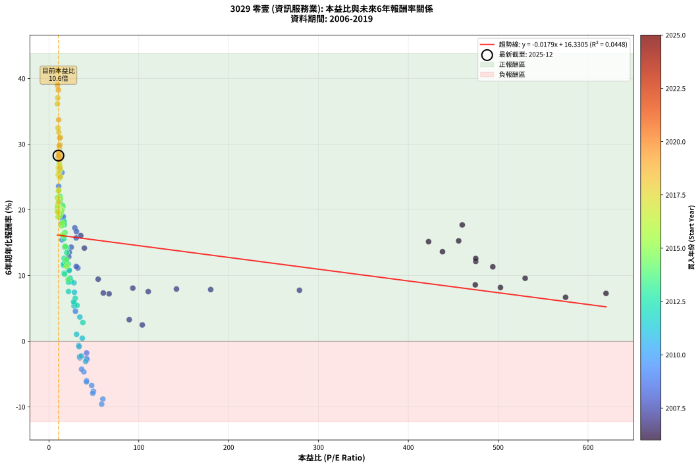
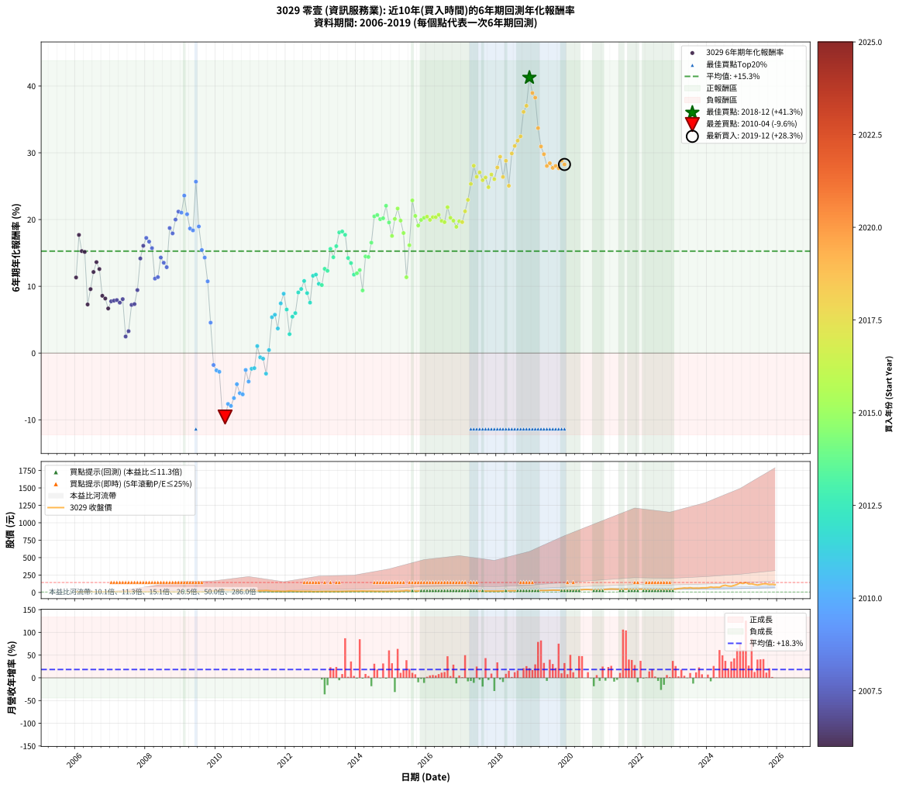

# 3029 零壹 - 本益比與未來報酬率分析

!!! info "報告資訊"
    - **股票代號**: 3029
    - **公司名稱**: 零壹
    - **產業別**: 資訊服務業
    - **分析期間**: 2006-2019 (168 個數據點)
    - **資料來源**: Type 12 (ShowMonthlyK_ChartFlow) 月收盤價與本益比
    - **報酬率口徑**: 含現金股利 (簡化: 年度合計，假設每年7/1入帳)
    - **報告生成時間**: 2026-01-05 00:50:16 CST

## 📈 視覺化圖表

### 圖表1: 本益比 vs 未來報酬率關係

*圖表1：3029 零壹 本益比與6年期未來報酬率關係 (2006-2019)*

### 圖表2: 歷年買入時點的6年期實際報酬率

*圖表2：3029 零壹 歷年買入時點的6年期實際報酬率 (2006-2019)*

## 📍 買點訊號說明

本報告提供兩種買點提示訊號（顯示於圖表2的股價子圖中）：

### ▲ 小綠色三角形（回測驗證）
- **計算方式**: 使用全部歷史資料計算本益比第25百分位數
- **用途**: 事後驗證，顯示歷史上哪些時點確實為低估區
- **限制**: 當下無法判斷，僅供回測參考
- **特性**: 後見之明（Look-Ahead Bias）

### ▲ 小橘色三角形（即時訊號）
- **計算方式**: 使用截至當月的過去5年資料計算本益比第25百分位數
- **用途**: 實際投資決策，當時即可判斷
- **優勢**: 可操作性強，符合實務需求
- **特性**: 無後見之明，滾動窗口計算

!!! tip "如何使用兩種訊號"
    - **綠色▲** 幫助理解歷史估值機會，驗證策略有效性
    - **橘色▲** 可作為實際買進參考，但仍需搭配基本面分析
    - 兩種訊號重疊時，表示即時判斷與事後驗證一致，信心度較高
    - 僅有綠色▲時，表示當時無法判斷（需要未來資料才能確認）
    - 僅有橘色▲時，表示即時判斷為買點，但事後可能不是最佳時機

## 📊 估值分析摘要

| 指標 | 數值 |
|:---:|:---:|
| **目前本益比** (2019-12) | **10.58 倍** |
| **歷史平均本益比** | 59.49 倍 |
| **估值水準** | 🟢 相對低估 |
| **預期6年年化報酬率** | **+16.14%** |
| **歷史平均報酬率** | +15.27% |
| **相關係數 (R²)** | 0.0448 |
| **趨勢線斜率** | -0.0179 |

!!! abstract "核心洞察"
    目前本益比顯著低於歷史平均，預期未來報酬率可能較高

    根據歷史數據回測，3029 零壹 在目前本益比 **10.6倍** 的估值水準下，
    預期未來6年年化報酬率約為 **+16.1%**。

    **重要提醒**: 本分析基於歷史數據統計，實際報酬率會受到公司基本面變化、產業趨勢、
    總體經濟環境等多重因素影響。R² = 0.04 表示本益比可解釋約 4.5% 的報酬率變異。

## 📈 歷史估值統計

### 最佳買點 (最高報酬率)

| 項目 | 數值 |
|:---:|:---:|
| 起始時間 | 2018-12 |
| 當時本益比 | 9.54 倍 |
| 起始價格 | 19.6 元 |
| 6年後價格 | 138.5 元 |
| **6年年化報酬率** | **+41.26%** |

### 最差買點 (最低報酬率)

| 項目 | 數值 |
|:---:|:---:|
| 起始時間 | 2010-04 |
| 當時本益比 | 58.70 倍 |
| 起始價格 | 38.4 元 |
| 6年後價格 | 17.0 元 |
| **6年年化報酬率** | **-9.58%** |

## 🎯 投資啟示

### 本益比與報酬率關係

趨勢線方程式: **y = -0.0179x + 16.3305**

!!! note "負相關"
    本益比與未來報酬率呈現負相關。較低的本益比通常帶來較高的未來報酬率，
    但相關性不算非常強。**估值仍是重要參考指標之一**。

### 估值區間建議

基於歷史數據分析:

- **🟢 低估區** (P/E < 47.6): 預期報酬率較高，可考慮增加持股
- **🟡 合理區** (P/E 47.6-71.4): 預期報酬率符合長期趨勢，正常持有
- **🔴 高估區** (P/E > 71.4): 預期報酬率較低，可考慮減碼或觀望

!!! danger "風險提示"
    - 過去表現不代表未來結果
    - 本分析假設公司基本面無重大結構性變化
    - 產業環境劇變可能使歷史規律失效
    - 應結合公司財報、產業趨勢、總體經濟等多重因素綜合判斷

!!! success "長期投資觀點"
    歷史數據顯示，在合理或低估的估值水準買入並長期持有，
    往往能獲得較佳的投資報酬。**耐心等待好價格**是價值投資的核心原則。

## 📊 數據品質

- **資料來源**: GoodInfo.tw Type 12 (ShowMonthlyK_ChartFlow)
- **資料頻率**: 月度收盤價與本益比
- **回測期間**: 2006-2019
- **數據點數量**: 168 個 (每個點代表一次6年期回測)

### 計算方法說明

1. **6年期年化報酬率**:
   - 對每個歷史時點，計算其後6年的實際投資報酬率
   - 期末價值(不含股利): 期末價格
   - 期末價值(含現金股利): 期末價格 + 持有期間內的現金股利合計 (簡化: 年度合計，假設每年7/1入帳)
   - 公式: 年化報酬率 = [(期末價值/期初價格)^(1/年數) - 1] × 100%

2. **本益比 (P/E Ratio)**:
   - 使用當時的月收盤價與EPS計算
   - 資料來源: Type 12 月度河流圖本益比數據

3. **趨勢線 (Linear Regression)**:
   - 使用最小平方法擬合線性趨勢線
   - R²值衡量本益比對報酬率的解釋能力

---

*本報告由 Stock Analysis System v1.9.0 自動生成*
*數據更新時間: 2026-01-05 00:50:16 CST*

## 📋 月度回測明細表

（每一列對應時間線圖中的一個買入點；可用來對照 SVG 圖上的每個點。）

| 買入月份 | 賣出月份 | 回測期限_年 | 實際持有年數 | 買入本益比_倍 | 買入收盤價_元 | 賣出收盤價_元 | 現金股利合計_元 | 總報酬率_pct | 年化報酬率_pct |
| --- | --- | --- | --- | --- | --- | --- | --- | --- | --- |
| 2006-01 | 2012-01 | 6 | 5.999 | 494.00 | 9.88 | 16.50 | 2.30 | +90.30 | +11.32 |
| 2006-02 | 2012-02 | 6 | 5.999 | 460.00 | 9.20 | 22.15 | 2.30 | +165.78 | +17.70 |
| 2006-03 | 2012-03 | 6 | 6.001 | 456.00 | 9.12 | 19.10 | 2.30 | +134.67 | +15.27 |
| 2006-04 | 2012-04 | 6 | 6.001 | 422.50 | 8.45 | 17.40 | 2.30 | +133.16 | +15.15 |
| 2006-05 | 2012-05 | 6 | 6.001 | 620.00 | 12.40 | 16.60 | 2.30 | +52.44 | +7.28 |
| 2006-06 | 2012-06 | 6 | 6.001 | 530.00 | 10.60 | 16.05 | 2.30 | +73.13 | +9.58 |
| 2006-07 | 2012-07 | 6 | 6.001 | 475.00 | 9.50 | 15.90 | 3.00 | +98.97 | +12.15 |
| 2006-08 | 2012-08 | 6 | 6.001 | 438.00 | 8.76 | 15.85 | 3.00 | +115.21 | +13.62 |
| 2006-09 | 2012-09 | 6 | 6.001 | 475.00 | 9.50 | 16.35 | 3.00 | +103.71 | +12.59 |
| 2006-10 | 2012-10 | 6 | 6.001 | 474.50 | 9.49 | 12.55 | 3.00 | +63.88 | +8.58 |
| 2006-11 | 2012-11 | 6 | 6.001 | 502.50 | 10.05 | 13.10 | 3.00 | +60.22 | +8.17 |
| 2006-12 | 2012-12 | 6 | 6.001 | 575.00 | 11.50 | 13.95 | 3.00 | +47.41 | +6.68 |
| 2007-01 | 2013-01 | 6 | 6.001 | 278.80 | 11.15 | 14.45 | 3.00 | +56.52 | +7.75 |
| 2007-02 | 2013-02 | 6 | 6.001 | 180.00 | 10.80 | 14.00 | 3.00 | +57.43 | +7.85 |
| 2007-03 | 2013-03 | 6 | 6.001 | 141.90 | 11.35 | 14.95 | 3.00 | +58.17 | +7.94 |
| 2007-04 | 2013-04 | 6 | 6.001 | 110.50 | 11.05 | 14.10 | 3.00 | +54.77 | +7.55 |
| 2007-05 | 2013-05 | 6 | 6.001 | 93.33 | 11.20 | 14.85 | 3.00 | +59.39 | +8.08 |
| 2007-06 | 2013-06 | 6 | 6.001 | 103.90 | 14.55 | 13.85 | 3.00 | +15.82 | +2.48 |
| 2007-07 | 2013-07 | 6 | 6.001 | 89.38 | 14.30 | 13.55 | 3.80 | +21.34 | +3.28 |
| 2007-08 | 2013-08 | 6 | 6.001 | 66.94 | 12.05 | 14.50 | 3.80 | +51.88 | +7.21 |
| 2007-09 | 2013-09 | 6 | 6.001 | 60.50 | 12.10 | 14.70 | 3.80 | +52.91 | +7.33 |
| 2007-10 | 2013-10 | 6 | 6.001 | 54.77 | 12.05 | 16.90 | 3.80 | +71.80 | +9.44 |
| 2007-11 | 2013-11 | 6 | 6.001 | 39.42 | 9.46 | 17.15 | 3.80 | +121.48 | +14.17 |
| 2007-12 | 2013-12 | 6 | 6.001 | 35.38 | 9.20 | 18.70 | 3.80 | +144.59 | +16.07 |
| 2008-01 | 2014-01 | 6 | 6.001 | 28.80 | 8.16 | 17.40 | 3.80 | +159.83 | +17.25 |
| 2008-02 | 2014-03 | 6 | 6.081 | 30.62 | 9.39 | 20.20 | 3.80 | +155.61 | +16.69 |
| 2008-03 | 2014-03 | 6 | 5.999 | 30.30 | 10.00 | 20.20 | 3.80 | +140.02 | +15.71 |
| 2008-04 | 2014-04 | 6 | 5.999 | 32.12 | 11.35 | 17.60 | 3.80 | +88.56 | +11.15 |
| 2008-05 | 2014-05 | 6 | 5.999 | 30.40 | 11.45 | 18.05 | 3.80 | +90.85 | +11.38 |
| 2008-06 | 2014-06 | 6 | 5.999 | 24.78 | 9.91 | 18.30 | 3.80 | +123.03 | +14.31 |
| 2008-07 | 2014-07 | 6 | 5.999 | 22.68 | 9.60 | 16.50 | 4.05 | +114.08 | +13.53 |
| 2008-08 | 2014-08 | 6 | 5.999 | 22.05 | 9.85 | 16.30 | 4.05 | +106.62 | +12.86 |
| 2008-09 | 2014-09 | 6 | 5.999 | 14.89 | 7.00 | 15.55 | 4.05 | +180.03 | +18.73 |
| 2008-10 | 2014-10 | 6 | 5.999 | 13.99 | 6.90 | 14.50 | 4.05 | +168.87 | +17.93 |
| 2008-11 | 2014-11 | 6 | 5.999 | 11.81 | 6.10 | 14.15 | 4.05 | +198.39 | +19.99 |
| 2008-12 | 2014-12 | 6 | 5.999 | 11.67 | 6.30 | 15.90 | 4.05 | +216.70 | +21.19 |
| 2009-01 | 2015-01 | 6 | 5.999 | 12.39 | 6.73 | 17.10 | 4.05 | +214.29 | +21.03 |
| 2009-02 | 2015-02 | 6 | 5.999 | 10.81 | 5.91 | 17.00 | 4.05 | +256.21 | +23.59 |
| 2009-03 | 2015-03 | 6 | 5.999 | 12.09 | 6.65 | 16.60 | 4.05 | +210.56 | +20.79 |
| 2009-04 | 2015-04 | 6 | 5.999 | 14.96 | 8.28 | 19.05 | 4.05 | +179.01 | +18.66 |
| 2009-05 | 2015-05 | 6 | 5.999 | 15.77 | 8.78 | 20.10 | 4.05 | +175.08 | +18.37 |
| 2009-06 | 2015-06 | 6 | 5.999 | 14.46 | 8.10 | 27.85 | 4.05 | +293.85 | +25.67 |
| 2009-07 | 2015-07 | 6 | 5.999 | 16.14 | 9.09 | 21.80 | 3.96 | +183.36 | +18.96 |
| 2009-08 | 2015-08 | 6 | 5.999 | 14.63 | 8.29 | 15.65 | 3.96 | +136.51 | +15.43 |
| 2009-09 | 2015-09 | 6 | 5.999 | 17.63 | 10.05 | 18.45 | 3.96 | +122.96 | +14.30 |
| 2009-10 | 2015-10 | 6 | 5.999 | 22.33 | 12.80 | 19.65 | 3.96 | +84.43 | +10.74 |
| 2009-11 | 2015-11 | 6 | 5.999 | 29.48 | 17.00 | 18.25 | 3.96 | +30.63 | +4.55 |
| 2009-12 | 2015-12 | 6 | 5.999 | 41.90 | 24.30 | 17.85 | 3.96 | -10.26 | -1.79 |
| 2010-01 | 2016-01 | 6 | 5.999 | 41.78 | 25.00 | 17.40 | 3.96 | -14.57 | -2.59 |
| 2010-02 | 2016-02 | 6 | 5.999 | 42.32 | 26.10 | 18.05 | 3.96 | -15.68 | -2.80 |
| 2010-03 | 2016-03 | 6 | 6.001 | 60.00 | 38.10 | 17.95 | 3.96 | -42.50 | -8.81 |
| 2010-04 | 2016-04 | 6 | 6.001 | 58.70 | 38.35 | 17.00 | 3.96 | -45.35 | -9.58 |
| 2010-05 | 2016-05 | 6 | 6.001 | 49.50 | 33.25 | 16.70 | 3.96 | -37.87 | -7.63 |
| 2010-06 | 2016-06 | 6 | 6.001 | 48.77 | 33.65 | 16.55 | 3.96 | -39.06 | -7.92 |
| 2010-07 | 2016-07 | 6 | 6.001 | 47.58 | 33.70 | 17.70 | 4.46 | -34.25 | -6.75 |
| 2010-08 | 2016-08 | 6 | 6.001 | 38.88 | 28.25 | 16.75 | 4.46 | -24.93 | -4.67 |
| 2010-09 | 2016-09 | 6 | 6.001 | 41.88 | 31.20 | 17.05 | 4.46 | -31.07 | -6.01 |
| 2010-10 | 2016-10 | 6 | 6.001 | 41.72 | 31.85 | 17.25 | 4.46 | -31.85 | -6.19 |
| 2010-11 | 2016-11 | 6 | 6.001 | 34.41 | 26.90 | 18.60 | 4.46 | -14.29 | -2.54 |
| 2010-12 | 2016-12 | 6 | 6.001 | 36.31 | 29.05 | 17.90 | 4.46 | -23.04 | -4.27 |
| 2011-01 | 2017-01 | 6 | 6.001 | 34.18 | 26.60 | 18.60 | 4.46 | -13.32 | -2.35 |
| 2011-02 | 2017-02 | 6 | 6.001 | 36.01 | 27.25 | 19.30 | 4.46 | -12.82 | -2.26 |
| 2011-03 | 2017-03 | 6 | 6.001 | 30.75 | 22.60 | 19.60 | 4.46 | +6.45 | +1.05 |
| 2011-04 | 2017-04 | 6 | 6.001 | 33.15 | 23.65 | 18.30 | 4.46 | -3.78 | -0.64 |
| 2011-05 | 2017-05 | 6 | 6.001 | 33.54 | 23.20 | 17.60 | 4.46 | -4.93 | -0.84 |
| 2011-06 | 2017-06 | 6 | 6.001 | 40.82 | 27.35 | 18.20 | 4.46 | -17.16 | -3.09 |
| 2011-07 | 2017-07 | 6 | 6.001 | 37.10 | 24.05 | 19.75 | 4.96 | +2.73 | +0.45 |
| 2011-08 | 2017-08 | 6 | 6.001 | 27.93 | 17.50 | 19.00 | 4.96 | +36.90 | +5.37 |
| 2011-09 | 2017-09 | 6 | 6.001 | 28.26 | 17.10 | 18.95 | 4.96 | +39.81 | +5.74 |
| 2011-10 | 2017-10 | 6 | 6.001 | 34.37 | 20.05 | 19.95 | 4.96 | +24.22 | +3.68 |
| 2011-11 | 2017-11 | 6 | 6.001 | 28.31 | 15.90 | 19.50 | 4.96 | +53.82 | +7.44 |
| 2011-12 | 2017-12 | 6 | 6.001 | 27.78 | 15.00 | 20.05 | 4.96 | +66.71 | +8.89 |
| 2012-01 | 2018-01 | 6 | 6.001 | 29.28 | 16.50 | 19.15 | 4.96 | +46.10 | +6.52 |
| 2012-02 | 2018-03 | 6 | 6.081 | 37.73 | 22.15 | 21.30 | 4.96 | +18.54 | +2.84 |
| 2012-03 | 2018-03 | 6 | 5.999 | 31.28 | 19.10 | 21.30 | 4.96 | +37.47 | +5.45 |
| 2012-04 | 2018-04 | 6 | 5.999 | 27.44 | 17.40 | 19.70 | 4.96 | +41.71 | +5.98 |
| 2012-05 | 2018-05 | 6 | 5.999 | 25.24 | 16.60 | 23.00 | 4.96 | +68.42 | +9.08 |
| 2012-06 | 2018-06 | 6 | 5.999 | 23.56 | 16.05 | 22.85 | 4.96 | +73.25 | +9.59 |
| 2012-07 | 2018-07 | 6 | 5.999 | 22.56 | 15.90 | 23.85 | 5.56 | +84.95 | +10.79 |
| 2012-08 | 2018-08 | 6 | 5.999 | 21.76 | 15.85 | 21.00 | 5.56 | +67.55 | +8.99 |
| 2012-09 | 2018-09 | 6 | 5.999 | 21.74 | 16.35 | 19.75 | 5.56 | +54.78 | +7.55 |
| 2012-10 | 2018-10 | 6 | 5.999 | 16.18 | 12.55 | 18.65 | 5.56 | +92.88 | +11.57 |
| 2012-11 | 2018-11 | 6 | 5.999 | 16.40 | 13.10 | 19.95 | 5.56 | +94.71 | +11.75 |
| 2012-12 | 2018-12 | 6 | 5.999 | 16.96 | 13.95 | 19.65 | 5.56 | +80.70 | +10.37 |
| 2013-01 | 2019-01 | 6 | 5.999 | 17.48 | 14.45 | 20.30 | 5.56 | +78.94 | +10.19 |
| 2013-02 | 2019-02 | 6 | 5.999 | 16.86 | 14.00 | 23.00 | 5.56 | +103.98 | +12.62 |
| 2013-03 | 2019-03 | 6 | 5.999 | 17.92 | 14.95 | 24.45 | 5.56 | +100.72 | +12.32 |
| 2013-04 | 2019-04 | 6 | 5.999 | 16.82 | 14.10 | 28.10 | 5.56 | +138.70 | +15.61 |
| 2013-05 | 2019-05 | 6 | 5.999 | 17.63 | 14.85 | 27.65 | 5.56 | +123.62 | +14.36 |
| 2013-06 | 2019-06 | 6 | 5.999 | 16.37 | 13.85 | 28.20 | 5.56 | +143.73 | +16.01 |
| 2013-07 | 2019-07 | 6 | 5.999 | 15.94 | 13.55 | 30.45 | 6.25 | +170.88 | +18.07 |
| 2013-08 | 2019-08 | 6 | 5.999 | 16.98 | 14.50 | 33.30 | 6.25 | +172.79 | +18.21 |
| 2013-09 | 2019-09 | 6 | 5.999 | 17.13 | 14.70 | 32.85 | 6.25 | +166.01 | +17.72 |
| 2013-10 | 2019-10 | 6 | 5.999 | 19.60 | 16.90 | 31.30 | 6.25 | +122.21 | +14.24 |
| 2013-11 | 2019-11 | 6 | 5.999 | 19.80 | 17.15 | 30.35 | 6.25 | +113.43 | +13.47 |
| 2013-12 | 2019-12 | 6 | 5.999 | 21.49 | 18.70 | 30.15 | 6.25 | +94.67 | +11.75 |
| 2014-01 | 2020-01 | 6 | 5.999 | 19.42 | 17.40 | 28.00 | 6.25 | +96.86 | +11.95 |
| 2014-02 | 2020-02 | 6 | 5.999 | 19.69 | 18.15 | 30.40 | 6.25 | +101.95 | +12.43 |
| 2014-03 | 2020-03 | 6 | 6.001 | 21.32 | 20.20 | 28.35 | 6.25 | +71.31 | +9.38 |
| 2014-04 | 2020-04 | 6 | 6.001 | 18.08 | 17.60 | 33.35 | 6.25 | +125.02 | +14.47 |
| 2014-05 | 2020-05 | 6 | 6.001 | 18.07 | 18.05 | 34.20 | 6.25 | +124.12 | +14.39 |
| 2014-06 | 2020-06 | 6 | 6.001 | 17.85 | 18.30 | 39.60 | 6.25 | +150.57 | +16.54 |
| 2014-07 | 2020-07 | 6 | 6.001 | 15.70 | 16.50 | 43.05 | 7.41 | +205.84 | +20.48 |
| 2014-08 | 2020-08 | 6 | 6.001 | 15.14 | 16.30 | 42.95 | 7.41 | +208.98 | +20.68 |
| 2014-09 | 2020-09 | 6 | 6.001 | 14.10 | 15.55 | 39.15 | 7.41 | +199.45 | +20.05 |
| 2014-10 | 2020-10 | 6 | 6.001 | 12.85 | 14.50 | 36.30 | 7.41 | +201.48 | +20.19 |
| 2014-11 | 2020-11 | 6 | 6.001 | 12.26 | 14.15 | 39.40 | 7.41 | +230.84 | +22.06 |
| 2014-12 | 2020-12 | 6 | 6.001 | 13.47 | 15.90 | 39.05 | 7.41 | +192.23 | +19.56 |
| 2015-01 | 2021-01 | 6 | 6.001 | 14.03 | 17.10 | 37.70 | 7.41 | +163.82 | +17.54 |
| 2015-02 | 2021-02 | 6 | 6.001 | 13.51 | 17.00 | 43.60 | 7.41 | +200.08 | +20.09 |
| 2015-03 | 2021-03 | 6 | 6.001 | 12.79 | 16.60 | 46.40 | 7.41 | +224.18 | +21.65 |
| 2015-04 | 2021-04 | 6 | 6.001 | 14.25 | 19.05 | 49.05 | 7.41 | +196.40 | +19.85 |
| 2015-05 | 2021-05 | 6 | 6.001 | 14.61 | 20.10 | 46.80 | 7.41 | +169.72 | +17.98 |
| 2015-06 | 2021-06 | 6 | 6.001 | 19.68 | 27.85 | 45.70 | 7.41 | +90.71 | +11.36 |
| 2015-07 | 2021-07 | 6 | 6.001 | 14.99 | 21.80 | 43.55 | 10.01 | +145.68 | +16.16 |
| 2015-08 | 2021-08 | 6 | 6.001 | 10.48 | 15.65 | 43.85 | 10.01 | +244.14 | +22.87 |
| 2015-09 | 2021-09 | 6 | 6.001 | 12.04 | 18.45 | 46.60 | 10.01 | +206.82 | +20.54 |
| 2015-10 | 2021-10 | 6 | 6.001 | 12.50 | 19.65 | 46.10 | 10.01 | +185.54 | +19.10 |
| 2015-11 | 2021-11 | 6 | 6.001 | 11.33 | 18.25 | 44.35 | 10.01 | +197.85 | +19.94 |
| 2015-12 | 2021-12 | 6 | 6.001 | 10.82 | 17.85 | 44.00 | 10.01 | +202.57 | +20.26 |
| 2016-01 | 2022-01 | 6 | 6.001 | 10.44 | 17.40 | 43.10 | 10.01 | +205.22 | +20.43 |
| 2016-02 | 2022-03 | 6 | 6.081 | 10.72 | 18.05 | 44.55 | 10.01 | +202.26 | +19.95 |
| 2016-03 | 2022-03 | 6 | 5.999 | 10.56 | 17.95 | 44.55 | 10.01 | +203.94 | +20.36 |
| 2016-04 | 2022-04 | 6 | 5.999 | 9.90 | 17.00 | 41.65 | 10.01 | +203.87 | +20.36 |
| 2016-05 | 2022-05 | 6 | 5.999 | 9.63 | 16.70 | 41.65 | 10.01 | +209.33 | +20.71 |
| 2016-06 | 2022-06 | 6 | 5.999 | 9.46 | 16.55 | 38.90 | 10.01 | +195.52 | +19.80 |
| 2016-07 | 2022-07 | 6 | 5.999 | 10.02 | 17.70 | 39.20 | 12.61 | +192.72 | +19.61 |
| 2016-08 | 2022-08 | 6 | 5.999 | 9.39 | 16.75 | 42.20 | 12.61 | +227.23 | +21.85 |
| 2016-09 | 2022-09 | 6 | 5.999 | 9.47 | 17.05 | 38.95 | 12.61 | +202.41 | +20.26 |
| 2016-10 | 2022-10 | 6 | 5.999 | 9.50 | 17.25 | 38.45 | 12.61 | +196.01 | +19.83 |
| 2016-11 | 2022-11 | 6 | 5.999 | 10.15 | 18.60 | 39.95 | 12.61 | +182.59 | +18.91 |
| 2016-12 | 2022-12 | 6 | 5.999 | 9.68 | 17.90 | 40.15 | 12.61 | +194.75 | +19.75 |
| 2017-01 | 2023-01 | 6 | 5.999 | 10.16 | 18.60 | 41.85 | 12.61 | +192.80 | +19.61 |
| 2017-02 | 2023-02 | 6 | 5.999 | 10.66 | 19.30 | 48.65 | 12.61 | +217.41 | +21.23 |
| 2017-03 | 2023-03 | 6 | 5.999 | 10.95 | 19.60 | 55.10 | 12.61 | +245.46 | +22.96 |
| 2017-04 | 2023-04 | 6 | 5.999 | 10.34 | 18.30 | 58.30 | 12.61 | +287.49 | +25.33 |
| 2017-05 | 2023-05 | 6 | 5.999 | 10.06 | 17.60 | 65.00 | 12.61 | +340.97 | +28.06 |
| 2017-06 | 2023-06 | 6 | 5.999 | 10.52 | 18.20 | 61.60 | 12.61 | +307.75 | +26.40 |
| 2017-07 | 2023-07 | 6 | 5.999 | 11.55 | 19.75 | 68.10 | 15.01 | +320.81 | +27.07 |
| 2017-08 | 2023-08 | 6 | 5.999 | 11.24 | 19.00 | 60.60 | 15.01 | +297.94 | +25.89 |
| 2017-09 | 2023-09 | 6 | 5.999 | 11.35 | 18.95 | 61.90 | 15.01 | +305.85 | +26.30 |
| 2017-10 | 2023-10 | 6 | 5.999 | 12.09 | 19.95 | 60.50 | 15.01 | +278.49 | +24.84 |
| 2017-11 | 2023-11 | 6 | 5.999 | 11.96 | 19.50 | 65.80 | 15.01 | +314.41 | +26.74 |
| 2017-12 | 2023-12 | 6 | 5.999 | 12.45 | 20.05 | 65.40 | 15.01 | +301.04 | +26.05 |
| 2018-01 | 2024-01 | 6 | 5.999 | 11.62 | 19.15 | 68.40 | 15.01 | +335.56 | +27.80 |
| 2018-02 | 2024-02 | 6 | 5.999 | 11.78 | 19.85 | 78.20 | 15.01 | +369.57 | +29.41 |
| 2018-03 | 2024-03 | 6 | 6.001 | 12.37 | 21.30 | 71.80 | 15.01 | +307.55 | +26.38 |
| 2018-04 | 2024-04 | 6 | 6.001 | 11.19 | 19.70 | 75.00 | 15.01 | +356.90 | +28.81 |
| 2018-05 | 2024-05 | 6 | 6.001 | 12.80 | 23.00 | 73.00 | 15.01 | +282.65 | +25.06 |
| 2018-06 | 2024-06 | 6 | 6.001 | 12.45 | 22.85 | 94.80 | 15.01 | +380.56 | +29.90 |
| 2018-07 | 2024-07 | 6 | 6.001 | 12.74 | 23.85 | 103.00 | 17.71 | +406.12 | +31.02 |
| 2018-08 | 2024-08 | 6 | 6.001 | 10.99 | 21.00 | 92.50 | 17.71 | +424.80 | +31.82 |
| 2018-09 | 2024-09 | 6 | 6.001 | 10.14 | 19.75 | 89.00 | 17.71 | +440.30 | +32.46 |
| 2018-10 | 2024-10 | 6 | 6.001 | 9.40 | 18.65 | 101.00 | 17.71 | +536.51 | +36.12 |
| 2018-11 | 2024-11 | 6 | 6.001 | 9.86 | 19.95 | 114.50 | 17.71 | +562.70 | +37.04 |
| 2018-12 | 2024-12 | 6 | 6.001 | 9.54 | 19.65 | 138.50 | 17.71 | +694.96 | +41.26 |
| 2019-01 | 2025-01 | 6 | 6.001 | 9.55 | 20.30 | 128.50 | 17.71 | +620.24 | +38.96 |
| 2019-02 | 2025-02 | 6 | 6.001 | 10.49 | 23.00 | 143.00 | 17.71 | +598.73 | +38.26 |
| 2019-03 | 2025-03 | 6 | 6.001 | 10.83 | 24.45 | 122.00 | 17.71 | +471.41 | +33.70 |
| 2019-04 | 2025-04 | 6 | 6.001 | 12.09 | 28.10 | 124.00 | 17.71 | +404.30 | +30.94 |
| 2019-05 | 2025-05 | 6 | 6.001 | 11.57 | 27.65 | 114.50 | 17.71 | +378.15 | +29.79 |
| 2019-06 | 2025-06 | 6 | 6.001 | 11.49 | 28.20 | 106.50 | 17.71 | +340.46 | +28.02 |
| 2019-07 | 2025-07 | 6 | 6.001 | 12.08 | 30.45 | 115.50 | 21.21 | +348.97 | +28.43 |
| 2019-08 | 2025-08 | 6 | 6.001 | 12.87 | 33.30 | 123.50 | 21.21 | +334.57 | +27.74 |
| 2019-09 | 2025-09 | 6 | 6.001 | 12.38 | 32.85 | 123.50 | 21.21 | +340.52 | +28.03 |
| 2019-10 | 2025-10 | 6 | 6.001 | 11.51 | 31.30 | 114.50 | 21.21 | +333.58 | +27.69 |
| 2019-11 | 2025-11 | 6 | 6.001 | 10.90 | 30.35 | 117.50 | 21.21 | +357.04 | +28.82 |
| 2019-12 | 2025-12 | 6 | 6.001 | 10.58 | 30.15 | 113.00 | 21.21 | +345.15 | +28.25 |
