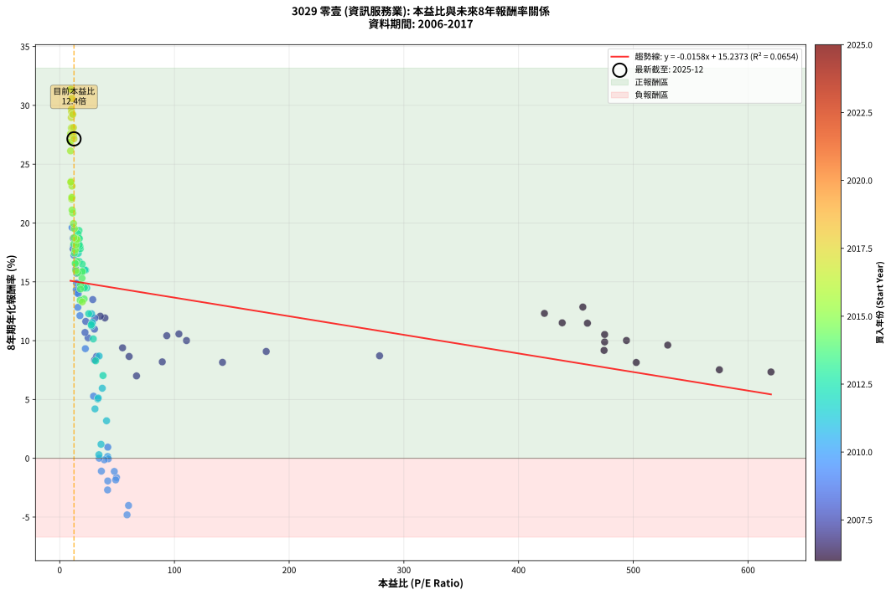
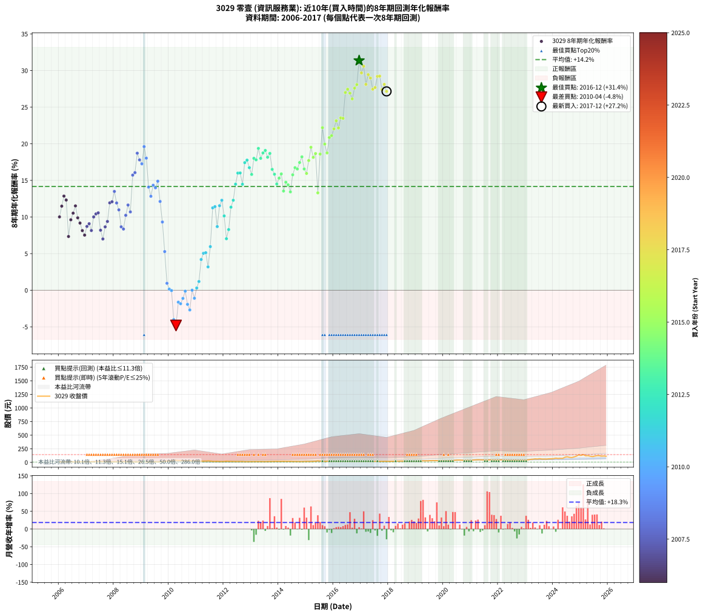

# 3029 零壹 - 本益比與未來報酬率分析

!!! info "報告資訊"
    - **股票代號**: 3029
    - **公司名稱**: 零壹
    - **產業別**: 資訊服務業
    - **分析期間**: 2006-2017 (144 個數據點)
    - **資料來源**: Type 12 (ShowMonthlyK_ChartFlow) 月收盤價與本益比
    - **報酬率口徑**: 含現金股利 (簡化: 年度合計，假設每年7/1入帳)
    - **報告生成時間**: 2026-01-07 18:51:15 CST

## 📈 視覺化圖表

### 圖表1: 本益比 vs 未來報酬率關係

*圖表1：3029 零壹 本益比與8年期未來報酬率關係 (2006-2017)*

### 圖表2: 歷年買入時點的8年期實際報酬率

*圖表2：3029 零壹 歷年買入時點的8年期實際報酬率 (2006-2017)*

## 📍 買點訊號說明

本報告提供兩種買點提示訊號（顯示於圖表2的股價子圖中）：

### ▲ 小綠色三角形（回測驗證）
- **計算方式**: 使用全部歷史資料計算本益比第25百分位數
- **用途**: 事後驗證，顯示歷史上哪些時點確實為低估區
- **限制**: 當下無法判斷，僅供回測參考
- **特性**: 後見之明（Look-Ahead Bias）

### ▲ 小橘色三角形（即時訊號）
- **計算方式**: 使用截至當月的過去5年資料計算本益比第25百分位數
- **用途**: 實際投資決策，當時即可判斷
- **優勢**: 可操作性強，符合實務需求
- **特性**: 無後見之明，滾動窗口計算

!!! tip "如何使用兩種訊號"
    - **綠色▲** 幫助理解歷史估值機會，驗證策略有效性
    - **橘色▲** 可作為實際買進參考，但仍需搭配基本面分析
    - 兩種訊號重疊時，表示即時判斷與事後驗證一致，信心度較高
    - 僅有綠色▲時，表示當時無法判斷（需要未來資料才能確認）
    - 僅有橘色▲時，表示即時判斷為買點，但事後可能不是最佳時機

## 📊 估值分析摘要

| 指標 | 數值 |
|:---:|:---:|
| **目前本益比** (2017-12) | **12.45 倍** |
| **歷史平均本益比** | 67.52 倍 |
| **估值水準** | 🟢 相對低估 |
| **預期8年年化報酬率** | **+15.04%** |
| **歷史平均報酬率** | +14.17% |
| **相關係數 (R²)** | 0.0654 |
| **趨勢線斜率** | -0.0158 |

!!! abstract "核心洞察"
    目前本益比顯著低於歷史平均，預期未來報酬率可能較高

    根據歷史數據回測，3029 零壹 在目前本益比 **12.4倍** 的估值水準下，
    預期未來8年年化報酬率約為 **+15.0%**。

    **重要提醒**: 本分析基於歷史數據統計，實際報酬率會受到公司基本面變化、產業趨勢、
    總體經濟環境等多重因素影響。R² = 0.07 表示本益比可解釋約 6.5% 的報酬率變異。

## 📈 歷史估值統計

### 最佳買點 (最高報酬率)

| 項目 | 數值 |
|:---:|:---:|
| 起始時間 | 2016-12 |
| 當時本益比 | 9.68 倍 |
| 起始價格 | 17.9 元 |
| 8年後價格 | 138.5 元 |
| **8年年化報酬率** | **+31.36%** |

### 最差買點 (最低報酬率)

| 項目 | 數值 |
|:---:|:---:|
| 起始時間 | 2010-04 |
| 當時本益比 | 58.70 倍 |
| 起始價格 | 38.4 元 |
| 8年後價格 | 19.7 元 |
| **8年年化報酬率** | **-4.81%** |

## 🎯 投資啟示

### 本益比與報酬率關係

趨勢線方程式: **y = -0.0158x + 15.2373**

!!! note "負相關"
    本益比與未來報酬率呈現負相關。較低的本益比通常帶來較高的未來報酬率，
    但相關性不算非常強。**估值仍是重要參考指標之一**。

### 估值區間建議

基於歷史數據分析:

- **🟢 低估區** (P/E < 54.0): 預期報酬率較高，可考慮增加持股
- **🟡 合理區** (P/E 54.0-81.0): 預期報酬率符合長期趨勢，正常持有
- **🔴 高估區** (P/E > 81.0): 預期報酬率較低，可考慮減碼或觀望

!!! danger "風險提示"
    - 過去表現不代表未來結果
    - 本分析假設公司基本面無重大結構性變化
    - 產業環境劇變可能使歷史規律失效
    - 應結合公司財報、產業趨勢、總體經濟等多重因素綜合判斷

!!! success "長期投資觀點"
    歷史數據顯示，在合理或低估的估值水準買入並長期持有，
    往往能獲得較佳的投資報酬。**耐心等待好價格**是價值投資的核心原則。

## 📊 數據品質

- **資料來源**: GoodInfo.tw Type 12 (ShowMonthlyK_ChartFlow)
- **資料頻率**: 月度收盤價與本益比
- **回測期間**: 2006-2017
- **數據點數量**: 144 個 (每個點代表一次8年期回測)

### 計算方法說明

1. **8年期年化報酬率**:
   - 對每個歷史時點，計算其後8年的實際投資報酬率
   - 期末價值(不含股利): 期末價格
   - 期末價值(含現金股利): 期末價格 + 持有期間內的現金股利合計 (簡化: 年度合計，假設每年7/1入帳)
   - 公式: 年化報酬率 = [(期末價值/期初價格)^(1/年數) - 1] × 100%

2. **本益比 (P/E Ratio)**:
   - 使用當時的月收盤價與EPS計算
   - 資料來源: Type 12 月度河流圖本益比數據

3. **趨勢線 (Linear Regression)**:
   - 使用最小平方法擬合線性趨勢線
   - R²值衡量本益比對報酬率的解釋能力

---

*本報告由 Stock Analysis System v1.9.0 自動生成*
*數據更新時間: 2026-01-07 18:51:15 CST*

## 📋 月度回測明細表

（每一列對應時間線圖中的一個買入點；可用來對照 SVG 圖上的每個點。）

| 買入月份 | 賣出月份 | 回測期限_年 | 實際持有年數 | 買入本益比_倍 | 買入收盤價_元 | 賣出收盤價_元 | 現金股利合計_元 | 總報酬率_pct | 年化報酬率_pct |
| --- | --- | --- | --- | --- | --- | --- | --- | --- | --- |
| 2006-01 | 2014-01 | 8 | 8.000 | 494.00 | 9.88 | 17.40 | 3.80 | +114.60 | +10.02 |
| 2006-02 | 2014-02 | 8 | 8.000 | 460.00 | 9.20 | 18.15 | 3.80 | +138.61 | +11.48 |
| 2006-03 | 2014-03 | 8 | 8.000 | 456.00 | 9.12 | 20.20 | 3.80 | +163.18 | +12.86 |
| 2006-04 | 2014-04 | 8 | 8.000 | 422.50 | 8.45 | 17.60 | 3.80 | +153.28 | +12.32 |
| 2006-05 | 2014-05 | 8 | 8.000 | 620.00 | 12.40 | 18.05 | 3.80 | +76.23 | +7.34 |
| 2006-06 | 2014-06 | 8 | 8.000 | 530.00 | 10.60 | 18.30 | 3.80 | +108.51 | +9.62 |
| 2006-07 | 2014-07 | 8 | 8.000 | 475.00 | 9.50 | 16.50 | 4.65 | +122.65 | +10.52 |
| 2006-08 | 2014-08 | 8 | 8.000 | 438.00 | 8.76 | 16.30 | 4.65 | +139.18 | +11.52 |
| 2006-09 | 2014-09 | 8 | 8.000 | 475.00 | 9.50 | 15.55 | 4.65 | +112.65 | +9.89 |
| 2006-10 | 2014-10 | 8 | 8.000 | 474.50 | 9.49 | 14.50 | 4.65 | +101.81 | +9.17 |
| 2006-11 | 2014-11 | 8 | 8.000 | 502.50 | 10.05 | 14.15 | 4.65 | +87.08 | +8.14 |
| 2006-12 | 2014-12 | 8 | 8.000 | 575.00 | 11.50 | 15.90 | 4.65 | +78.71 | +7.53 |
| 2007-01 | 2015-01 | 8 | 8.000 | 278.80 | 11.15 | 17.10 | 4.65 | +95.09 | +8.71 |
| 2007-02 | 2015-02 | 8 | 8.000 | 180.00 | 10.80 | 17.00 | 4.65 | +100.48 | +9.08 |
| 2007-03 | 2015-03 | 8 | 8.000 | 141.90 | 11.35 | 16.60 | 4.65 | +87.24 | +8.16 |
| 2007-04 | 2015-04 | 8 | 8.000 | 110.50 | 11.05 | 19.05 | 4.65 | +114.50 | +10.01 |
| 2007-05 | 2015-05 | 8 | 8.000 | 93.33 | 11.20 | 20.10 | 4.65 | +121.00 | +10.42 |
| 2007-06 | 2015-06 | 8 | 8.000 | 103.90 | 14.55 | 27.85 | 4.65 | +123.38 | +10.57 |
| 2007-07 | 2015-07 | 8 | 8.000 | 89.38 | 14.30 | 21.80 | 5.06 | +87.83 | +8.20 |
| 2007-08 | 2015-08 | 8 | 8.000 | 66.94 | 12.05 | 15.65 | 5.06 | +71.86 | +7.00 |
| 2007-09 | 2015-09 | 8 | 8.000 | 60.50 | 12.10 | 18.45 | 5.06 | +94.29 | +8.66 |
| 2007-10 | 2015-10 | 8 | 8.000 | 54.77 | 12.05 | 19.65 | 5.06 | +105.05 | +9.39 |
| 2007-11 | 2015-11 | 8 | 8.000 | 39.42 | 9.46 | 18.25 | 5.06 | +146.40 | +11.93 |
| 2007-12 | 2015-12 | 8 | 8.000 | 35.38 | 9.20 | 17.85 | 5.06 | +149.01 | +12.08 |
| 2008-01 | 2016-01 | 8 | 8.000 | 28.80 | 8.16 | 17.40 | 5.06 | +175.23 | +13.49 |
| 2008-02 | 2016-02 | 8 | 8.000 | 30.62 | 9.39 | 18.05 | 5.06 | +146.10 | +11.92 |
| 2008-03 | 2016-03 | 8 | 8.000 | 30.30 | 10.00 | 17.95 | 5.06 | +130.09 | +10.98 |
| 2008-04 | 2016-04 | 8 | 8.000 | 32.12 | 11.35 | 17.00 | 5.06 | +94.35 | +8.66 |
| 2008-05 | 2016-05 | 8 | 8.000 | 30.40 | 11.45 | 16.70 | 5.06 | +90.03 | +8.36 |
| 2008-06 | 2016-06 | 8 | 8.000 | 24.78 | 9.91 | 16.55 | 5.06 | +118.05 | +10.24 |
| 2008-07 | 2016-07 | 8 | 8.000 | 22.68 | 9.60 | 17.70 | 5.46 | +141.24 | +11.64 |
| 2008-08 | 2016-08 | 8 | 8.000 | 22.05 | 9.85 | 16.75 | 5.46 | +125.47 | +10.70 |
| 2008-09 | 2016-09 | 8 | 8.000 | 14.89 | 7.00 | 17.05 | 5.46 | +221.56 | +15.72 |
| 2008-10 | 2016-10 | 8 | 8.000 | 13.99 | 6.90 | 17.25 | 5.46 | +229.12 | +16.06 |
| 2008-11 | 2016-11 | 8 | 8.000 | 11.81 | 6.10 | 18.60 | 5.46 | +294.41 | +18.71 |
| 2008-12 | 2016-12 | 8 | 8.000 | 11.67 | 6.30 | 17.90 | 5.46 | +270.78 | +17.80 |
| 2009-01 | 2017-01 | 8 | 8.000 | 12.39 | 6.73 | 18.60 | 5.46 | +257.49 | +17.26 |
| 2009-02 | 2017-02 | 8 | 8.000 | 10.81 | 5.91 | 19.30 | 5.46 | +318.93 | +19.61 |
| 2009-03 | 2017-03 | 8 | 8.000 | 12.09 | 6.65 | 19.60 | 5.46 | +276.83 | +18.04 |
| 2009-04 | 2017-04 | 8 | 8.000 | 14.96 | 8.28 | 18.30 | 5.46 | +186.94 | +14.08 |
| 2009-05 | 2017-05 | 8 | 8.000 | 15.77 | 8.78 | 17.60 | 5.46 | +162.63 | +12.83 |
| 2009-06 | 2017-06 | 8 | 8.000 | 14.46 | 8.10 | 18.20 | 5.46 | +192.09 | +14.34 |
| 2009-07 | 2017-07 | 8 | 8.000 | 16.14 | 9.09 | 19.75 | 6.16 | +185.01 | +13.99 |
| 2009-08 | 2017-08 | 8 | 8.000 | 14.63 | 8.29 | 19.00 | 6.16 | +203.46 | +14.88 |
| 2009-09 | 2017-09 | 8 | 8.000 | 17.63 | 10.05 | 18.95 | 6.16 | +149.82 | +12.13 |
| 2009-10 | 2017-10 | 8 | 8.000 | 22.33 | 12.80 | 19.95 | 6.16 | +103.96 | +9.32 |
| 2009-11 | 2017-11 | 8 | 8.000 | 29.48 | 17.00 | 19.50 | 6.16 | +50.92 | +5.28 |
| 2009-12 | 2017-12 | 8 | 8.000 | 41.90 | 24.30 | 20.05 | 6.16 | +7.85 | +0.95 |
| 2010-01 | 2018-01 | 8 | 8.000 | 41.78 | 25.00 | 19.15 | 6.16 | +1.23 | +0.15 |
| 2010-02 | 2018-02 | 8 | 8.000 | 42.32 | 26.10 | 19.85 | 6.16 | -0.36 | -0.04 |
| 2010-03 | 2018-03 | 8 | 8.000 | 60.00 | 38.10 | 21.30 | 6.16 | -27.93 | -4.01 |
| 2010-04 | 2018-04 | 8 | 8.000 | 58.70 | 38.35 | 19.70 | 6.16 | -32.58 | -4.81 |
| 2010-05 | 2018-05 | 8 | 8.000 | 49.50 | 33.25 | 23.00 | 6.16 | -12.31 | -1.63 |
| 2010-06 | 2018-06 | 8 | 8.000 | 48.77 | 33.65 | 22.85 | 6.16 | -13.80 | -1.84 |
| 2010-07 | 2018-07 | 8 | 8.000 | 47.58 | 33.70 | 23.85 | 6.96 | -8.58 | -1.12 |
| 2010-08 | 2018-08 | 8 | 8.000 | 38.88 | 28.25 | 21.00 | 6.96 | -1.04 | -0.13 |
| 2010-09 | 2018-09 | 8 | 8.000 | 41.88 | 31.20 | 19.75 | 6.96 | -14.40 | -1.92 |
| 2010-10 | 2018-10 | 8 | 8.000 | 41.72 | 31.85 | 18.65 | 6.96 | -19.60 | -2.69 |
| 2010-11 | 2018-11 | 8 | 8.000 | 34.41 | 26.90 | 19.95 | 6.96 | +0.03 | +0.00 |
| 2010-12 | 2018-12 | 8 | 8.000 | 36.31 | 29.05 | 19.65 | 6.96 | -8.41 | -1.09 |
| 2011-01 | 2019-01 | 8 | 8.000 | 34.18 | 26.60 | 20.30 | 6.96 | +2.47 | +0.31 |
| 2011-02 | 2019-02 | 8 | 8.000 | 36.01 | 27.25 | 23.00 | 6.96 | +9.93 | +1.19 |
| 2011-03 | 2019-03 | 8 | 8.000 | 30.75 | 22.60 | 24.45 | 6.96 | +38.97 | +4.20 |
| 2011-04 | 2019-04 | 8 | 8.000 | 33.15 | 23.65 | 28.10 | 6.96 | +48.23 | +5.04 |
| 2011-05 | 2019-05 | 8 | 8.000 | 33.54 | 23.20 | 27.65 | 6.96 | +49.17 | +5.13 |
| 2011-06 | 2019-06 | 8 | 8.000 | 40.82 | 27.35 | 28.20 | 6.96 | +28.54 | +3.19 |
| 2011-07 | 2019-07 | 8 | 8.000 | 37.10 | 24.05 | 30.45 | 7.75 | +58.85 | +5.96 |
| 2011-08 | 2019-08 | 8 | 8.000 | 27.93 | 17.50 | 33.30 | 7.75 | +134.59 | +11.25 |
| 2011-09 | 2019-09 | 8 | 8.000 | 28.26 | 17.10 | 32.85 | 7.75 | +137.45 | +11.42 |
| 2011-10 | 2019-10 | 8 | 8.000 | 34.37 | 20.05 | 31.30 | 7.75 | +94.78 | +8.69 |
| 2011-11 | 2019-11 | 8 | 8.000 | 28.31 | 15.90 | 30.35 | 7.75 | +139.65 | +11.54 |
| 2011-12 | 2019-12 | 8 | 8.000 | 27.78 | 15.00 | 30.15 | 7.75 | +152.69 | +12.29 |
| 2012-01 | 2020-01 | 8 | 8.000 | 29.28 | 16.50 | 28.00 | 7.75 | +116.69 | +10.15 |
| 2012-02 | 2020-02 | 8 | 8.000 | 37.73 | 22.15 | 30.40 | 7.75 | +72.25 | +7.03 |
| 2012-03 | 2020-03 | 8 | 8.000 | 31.28 | 19.10 | 28.35 | 7.75 | +89.03 | +8.28 |
| 2012-04 | 2020-04 | 8 | 8.000 | 27.44 | 17.40 | 33.35 | 7.75 | +136.23 | +11.34 |
| 2012-05 | 2020-05 | 8 | 8.000 | 25.24 | 16.60 | 34.20 | 7.75 | +152.73 | +12.29 |
| 2012-06 | 2020-06 | 8 | 8.000 | 23.56 | 16.05 | 39.60 | 7.75 | +195.04 | +14.48 |
| 2012-07 | 2020-07 | 8 | 8.000 | 22.56 | 15.90 | 43.05 | 9.06 | +227.76 | +16.00 |
| 2012-08 | 2020-08 | 8 | 8.000 | 21.76 | 15.85 | 42.95 | 9.06 | +228.16 | +16.01 |
| 2012-09 | 2020-09 | 8 | 8.000 | 21.74 | 16.35 | 39.15 | 9.06 | +194.89 | +14.47 |
| 2012-10 | 2020-10 | 8 | 8.000 | 16.18 | 12.55 | 36.30 | 9.06 | +261.47 | +17.42 |
| 2012-11 | 2020-11 | 8 | 8.000 | 16.40 | 13.10 | 39.40 | 9.06 | +269.95 | +17.77 |
| 2012-12 | 2020-12 | 8 | 8.000 | 16.96 | 13.95 | 39.05 | 9.06 | +244.90 | +16.74 |
| 2013-01 | 2021-01 | 8 | 8.000 | 17.48 | 14.45 | 37.70 | 9.06 | +223.63 | +15.81 |
| 2013-02 | 2021-02 | 8 | 8.000 | 16.86 | 14.00 | 43.60 | 9.06 | +276.17 | +18.01 |
| 2013-03 | 2021-03 | 8 | 8.000 | 17.92 | 14.95 | 46.40 | 9.06 | +271.00 | +17.81 |
| 2013-04 | 2021-04 | 8 | 8.000 | 16.82 | 14.10 | 49.05 | 9.06 | +312.16 | +19.37 |
| 2013-05 | 2021-05 | 8 | 8.000 | 17.63 | 14.85 | 46.80 | 9.06 | +276.19 | +18.01 |
| 2013-06 | 2021-06 | 8 | 8.000 | 16.37 | 13.85 | 45.70 | 9.06 | +295.41 | +18.75 |
| 2013-07 | 2021-07 | 8 | 8.000 | 15.94 | 13.55 | 43.55 | 11.27 | +304.54 | +19.09 |
| 2013-08 | 2021-08 | 8 | 8.000 | 16.98 | 14.50 | 43.85 | 11.27 | +280.10 | +18.16 |
| 2013-09 | 2021-09 | 8 | 8.000 | 17.13 | 14.70 | 46.60 | 11.27 | +293.64 | +18.68 |
| 2013-10 | 2021-10 | 8 | 8.000 | 19.60 | 16.90 | 46.10 | 11.27 | +239.44 | +16.51 |
| 2013-11 | 2021-11 | 8 | 8.000 | 19.80 | 17.15 | 44.35 | 11.27 | +224.29 | +15.84 |
| 2013-12 | 2021-12 | 8 | 8.000 | 21.49 | 18.70 | 44.00 | 11.27 | +195.53 | +14.51 |
| 2014-01 | 2022-01 | 8 | 8.000 | 19.42 | 17.40 | 43.10 | 11.27 | +212.44 | +15.30 |
| 2014-02 | 2022-02 | 8 | 8.000 | 19.69 | 18.15 | 47.75 | 11.27 | +225.15 | +15.88 |
| 2014-03 | 2022-03 | 8 | 8.000 | 21.32 | 20.20 | 44.55 | 11.27 | +176.31 | +13.55 |
| 2014-04 | 2022-04 | 8 | 8.000 | 18.08 | 17.60 | 41.65 | 11.27 | +200.65 | +14.75 |
| 2014-05 | 2022-05 | 8 | 8.000 | 18.07 | 18.05 | 41.65 | 11.27 | +193.16 | +14.39 |
| 2014-06 | 2022-06 | 8 | 8.000 | 17.85 | 18.30 | 38.90 | 11.27 | +174.13 | +13.43 |
| 2014-07 | 2022-07 | 8 | 8.000 | 15.70 | 16.50 | 39.20 | 14.02 | +222.53 | +15.76 |
| 2014-08 | 2022-08 | 8 | 8.000 | 15.14 | 16.30 | 42.20 | 14.02 | +244.90 | +16.74 |
| 2014-09 | 2022-09 | 8 | 8.000 | 14.10 | 15.55 | 38.95 | 14.02 | +240.63 | +16.56 |
| 2014-10 | 2022-10 | 8 | 8.000 | 12.85 | 14.50 | 38.45 | 14.02 | +261.85 | +17.44 |
| 2014-11 | 2022-11 | 8 | 8.000 | 12.26 | 14.15 | 39.95 | 14.02 | +281.40 | +18.21 |
| 2014-12 | 2022-12 | 8 | 8.000 | 13.47 | 15.90 | 40.15 | 14.02 | +240.68 | +16.56 |
| 2015-01 | 2023-01 | 8 | 8.000 | 14.03 | 17.10 | 41.85 | 14.02 | +226.71 | +15.95 |
| 2015-02 | 2023-02 | 8 | 8.000 | 13.51 | 17.00 | 48.65 | 14.02 | +268.64 | +17.71 |
| 2015-03 | 2023-03 | 8 | 8.000 | 12.79 | 16.60 | 55.10 | 14.02 | +316.37 | +19.52 |
| 2015-04 | 2023-04 | 8 | 8.000 | 14.25 | 19.05 | 58.30 | 14.02 | +279.62 | +18.15 |
| 2015-05 | 2023-05 | 8 | 8.000 | 14.61 | 20.10 | 65.00 | 14.02 | +293.12 | +18.66 |
| 2015-06 | 2023-06 | 8 | 8.000 | 19.68 | 27.85 | 61.60 | 14.02 | +171.52 | +13.30 |
| 2015-07 | 2023-07 | 8 | 8.000 | 14.99 | 21.80 | 68.10 | 17.21 | +291.33 | +18.60 |
| 2015-08 | 2023-08 | 8 | 8.000 | 10.48 | 15.65 | 60.60 | 17.21 | +397.18 | +22.20 |
| 2015-09 | 2023-09 | 8 | 8.000 | 12.04 | 18.45 | 61.90 | 17.21 | +328.78 | +19.96 |
| 2015-10 | 2023-10 | 8 | 8.000 | 12.50 | 19.65 | 60.50 | 17.21 | +295.47 | +18.75 |
| 2015-11 | 2023-11 | 8 | 8.000 | 11.33 | 18.25 | 65.80 | 17.21 | +354.84 | +20.85 |
| 2015-12 | 2023-12 | 8 | 8.000 | 10.82 | 17.85 | 65.40 | 17.21 | +362.80 | +21.11 |
| 2016-01 | 2024-01 | 8 | 8.000 | 10.44 | 17.40 | 68.40 | 17.21 | +392.01 | +22.04 |
| 2016-02 | 2024-02 | 8 | 8.000 | 10.72 | 18.05 | 78.20 | 17.21 | +428.58 | +23.14 |
| 2016-03 | 2024-03 | 8 | 8.000 | 10.56 | 17.95 | 71.80 | 17.21 | +395.87 | +22.16 |
| 2016-04 | 2024-04 | 8 | 8.000 | 9.90 | 17.00 | 75.00 | 17.21 | +442.41 | +23.54 |
| 2016-05 | 2024-05 | 8 | 8.000 | 9.63 | 16.70 | 73.00 | 17.21 | +440.17 | +23.47 |
| 2016-06 | 2024-06 | 8 | 8.000 | 9.46 | 16.55 | 94.80 | 17.21 | +576.79 | +27.00 |
| 2016-07 | 2024-07 | 8 | 8.000 | 10.02 | 17.70 | 103.00 | 20.21 | +596.10 | +27.45 |
| 2016-08 | 2024-08 | 8 | 8.000 | 9.39 | 16.75 | 92.50 | 20.21 | +572.89 | +26.91 |
| 2016-09 | 2024-09 | 8 | 8.000 | 9.47 | 17.05 | 89.00 | 20.21 | +540.52 | +26.13 |
| 2016-10 | 2024-10 | 8 | 8.000 | 9.50 | 17.25 | 101.00 | 20.21 | +602.66 | +27.60 |
| 2016-11 | 2024-11 | 8 | 8.000 | 10.15 | 18.60 | 114.50 | 20.21 | +624.24 | +28.08 |
| 2016-12 | 2024-12 | 8 | 8.000 | 9.68 | 17.90 | 138.50 | 20.21 | +786.64 | +31.36 |
| 2017-01 | 2025-01 | 8 | 8.000 | 10.16 | 18.60 | 128.50 | 20.21 | +699.51 | +29.67 |
| 2017-02 | 2025-02 | 8 | 8.000 | 10.66 | 19.30 | 143.00 | 20.21 | +745.64 | +30.59 |
| 2017-03 | 2025-03 | 8 | 8.000 | 10.95 | 19.60 | 122.00 | 20.21 | +625.56 | +28.11 |
| 2017-04 | 2025-04 | 8 | 8.000 | 10.34 | 18.30 | 124.00 | 20.21 | +688.03 | +29.44 |
| 2017-05 | 2025-05 | 8 | 8.000 | 10.06 | 17.60 | 114.50 | 20.21 | +665.39 | +28.97 |
| 2017-06 | 2025-06 | 8 | 8.000 | 10.52 | 18.20 | 106.50 | 20.21 | +596.20 | +27.45 |
| 2017-07 | 2025-07 | 8 | 8.000 | 11.55 | 19.75 | 115.50 | 24.01 | +606.37 | +27.68 |
| 2017-08 | 2025-08 | 8 | 8.000 | 11.24 | 19.00 | 123.50 | 24.01 | +676.36 | +29.20 |
| 2017-09 | 2025-09 | 8 | 8.000 | 11.35 | 18.95 | 123.50 | 24.01 | +678.41 | +29.24 |
| 2017-10 | 2025-10 | 8 | 8.000 | 12.09 | 19.95 | 114.50 | 24.01 | +594.28 | +27.41 |
| 2017-11 | 2025-11 | 8 | 8.000 | 11.96 | 19.50 | 117.50 | 24.01 | +625.69 | +28.11 |
| 2017-12 | 2025-12 | 8 | 8.000 | 12.45 | 20.05 | 113.00 | 24.01 | +583.34 | +27.15 |
