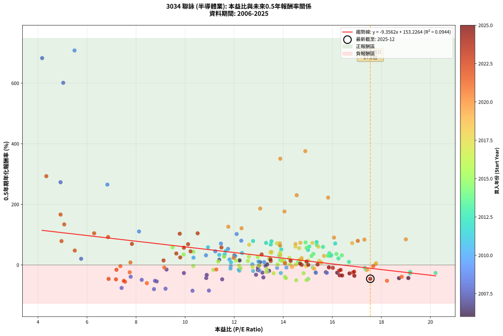
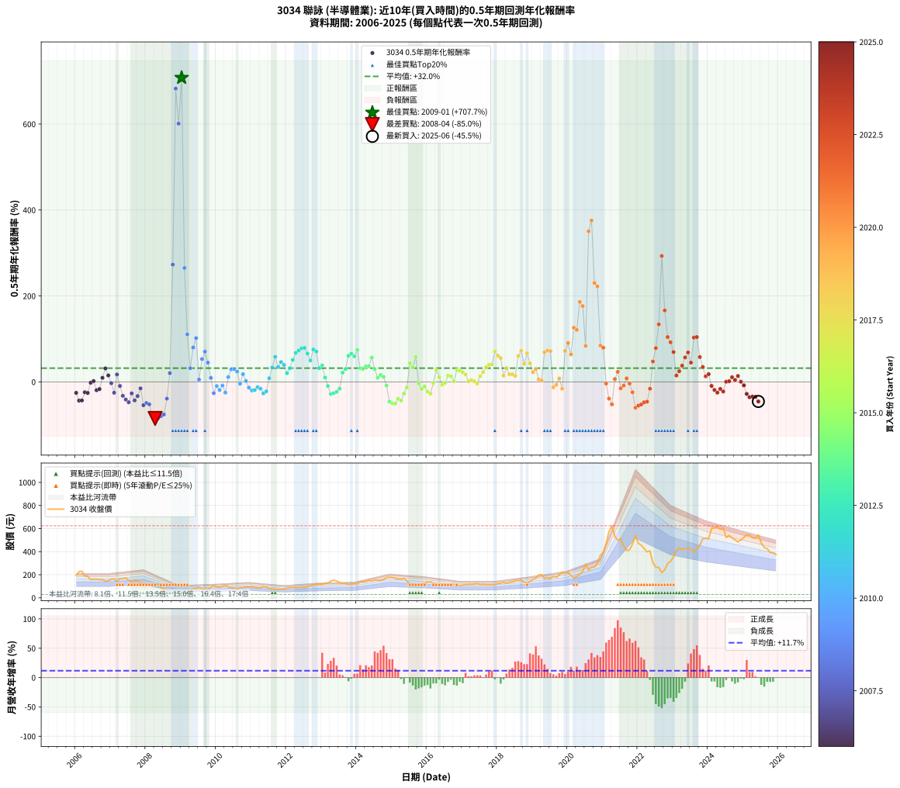

# 3034 聯詠 - 本益比與未來報酬率分析

!!! info "報告資訊"
    - **股票代號**: 3034
    - **公司名稱**: 聯詠
    - **產業別**: 半導體業
    - **分析期間**: 2006-2025 (234 個數據點)
    - **資料來源**: Type 12 (ShowMonthlyK_ChartFlow) 月收盤價與本益比
    - **報酬率口徑**: 含現金股利 (簡化: 年度合計，假設每年7/1入帳)
    - **報告生成時間**: 2026-01-04 08:26:59 CST

## 📈 視覺化圖表

### 圖表1: 本益比 vs 未來報酬率關係

*圖表1：3034 聯詠 本益比與0.5年期未來報酬率關係 (2006-2025)*

### 圖表2: 歷年買入時點的0.5年期實際報酬率

*圖表2：3034 聯詠 歷年買入時點的0.5年期實際報酬率 (2006-2025)*

## 📍 買點訊號說明

本報告提供兩種買點提示訊號（顯示於圖表2的股價子圖中）：

### ▲ 小綠色三角形（回測驗證）
- **計算方式**: 使用全部歷史資料計算本益比第25百分位數
- **用途**: 事後驗證，顯示歷史上哪些時點確實為低估區
- **限制**: 當下無法判斷，僅供回測參考
- **特性**: 後見之明（Look-Ahead Bias）

### ▲ 小橘色三角形（即時訊號）
- **計算方式**: 使用截至當月的過去5年資料計算本益比第25百分位數
- **用途**: 實際投資決策，當時即可判斷
- **優勢**: 可操作性強，符合實務需求
- **特性**: 無後見之明，滾動窗口計算

!!! tip "如何使用兩種訊號"
    - **綠色▲** 幫助理解歷史估值機會，驗證策略有效性
    - **橘色▲** 可作為實際買進參考，但仍需搭配基本面分析
    - 兩種訊號重疊時，表示即時判斷與事後驗證一致，信心度較高
    - 僅有綠色▲時，表示當時無法判斷（需要未來資料才能確認）
    - 僅有橘色▲時，表示即時判斷為買點，但事後可能不是最佳時機

## 📊 估值分析摘要

| 指標 | 數值 |
|:---:|:---:|
| **目前本益比** (2025-06) | **17.55 倍** |
| **歷史平均本益比** | 12.96 倍 |
| **估值水準** | 🔴 相對高估 |
| **預期0.5年年化報酬率** | **-10.98%** |
| **歷史平均報酬率** | +31.96% |
| **相關係數 (R²)** | 0.0944 |
| **趨勢線斜率** | -9.3562 |

!!! abstract "核心洞察"
    目前本益比顯著高於歷史平均，預期未來報酬率可能較低

    根據歷史數據回測，3034 聯詠 在目前本益比 **17.6倍** 的估值水準下，
    預期未來0.5年年化報酬率約為 **-11.0%**。

    **重要提醒**: 本分析基於歷史數據統計，實際報酬率會受到公司基本面變化、產業趨勢、
    總體經濟環境等多重因素影響。R² = 0.09 表示本益比可解釋約 9.4% 的報酬率變異。

## 📈 歷史估值統計

### 最佳買點 (最高報酬率)

| 項目 | 數值 |
|:---:|:---:|
| 起始時間 | 2009-01 |
| 當時本益比 | 5.49 倍 |
| 起始價格 | 34.2 元 |
| 0.5年後價格 | 91.8 元 |
| **0.5年年化報酬率** | **+707.74%** |

### 最差買點 (最低報酬率)

| 項目 | 數值 |
|:---:|:---:|
| 起始時間 | 2008-04 |
| 當時本益比 | 10.30 倍 |
| 起始價格 | 117.5 元 |
| 0.5年後價格 | 36.8 元 |
| **0.5年年化報酬率** | **-85.04%** |

## 🎯 投資啟示

### 本益比與報酬率關係

趨勢線方程式: **y = -9.3562x + 153.2264**

!!! warning "強負相關"
    本益比與未來報酬率呈現強負相關。在高本益比時期買入，未來報酬率顯著較低；
    在低本益比時期買入，未來報酬率顯著較高。**估值紀律至關重要**。

### 估值區間建議

基於歷史數據分析:

- **🟢 低估區** (P/E < 10.4): 預期報酬率較高，可考慮增加持股
- **🟡 合理區** (P/E 10.4-15.6): 預期報酬率符合長期趨勢，正常持有
- **🔴 高估區** (P/E > 15.6): 預期報酬率較低，可考慮減碼或觀望

!!! danger "風險提示"
    - 過去表現不代表未來結果
    - 本分析假設公司基本面無重大結構性變化
    - 產業環境劇變可能使歷史規律失效
    - 應結合公司財報、產業趨勢、總體經濟等多重因素綜合判斷

!!! success "長期投資觀點"
    歷史數據顯示，在合理或低估的估值水準買入並長期持有，
    往往能獲得較佳的投資報酬。**耐心等待好價格**是價值投資的核心原則。

## 📊 數據品質

- **資料來源**: GoodInfo.tw Type 12 (ShowMonthlyK_ChartFlow)
- **資料頻率**: 月度收盤價與本益比
- **回測期間**: 2006-2025
- **數據點數量**: 234 個 (每個點代表一次0.5年期回測)

### 計算方法說明

1. **0.5年期年化報酬率**:
   - 對每個歷史時點，計算其後0.5年的實際投資報酬率
   - 期末價值(不含股利): 期末價格
   - 期末價值(含現金股利): 期末價格 + 持有期間內的現金股利合計 (簡化: 年度合計，假設每年7/1入帳)
   - 公式: 年化報酬率 = [(期末價值/期初價格)^(1/年數) - 1] × 100%

2. **本益比 (P/E Ratio)**:
   - 使用當時的月收盤價與EPS計算
   - 資料來源: Type 12 月度河流圖本益比數據

3. **趨勢線 (Linear Regression)**:
   - 使用最小平方法擬合線性趨勢線
   - R²值衡量本益比對報酬率的解釋能力

---

*本報告由 Stock Analysis System v1.9.0 自動生成*
*數據更新時間: 2026-01-04 08:26:59 CST*

## 📋 月度回測明細表

（每一列對應時間線圖中的一個買入點；可用來對照 SVG 圖上的每個點。）

| 買入月份 | 賣出月份 | 回測期限_年 | 實際持有年數 | 買入本益比_倍 | 買入收盤價_元 | 賣出收盤價_元 | 現金股利合計_元 | 總報酬率_pct | 年化報酬率_pct |
| --- | --- | --- | --- | --- | --- | --- | --- | --- | --- |
| 2006-01 | 2006-07 | 0.5 | 0.496 | 16.20 | 195.50 | 161.00 | 7.99 | -13.56 | -25.47 |
| 2006-02 | 2006-08 | 0.5 | 0.498 | 18.72 | 226.00 | 162.00 | 7.99 | -24.78 | -43.53 |
| 2006-03 | 2006-10 | 0.5 | 0.586 | 19.10 | 230.50 | 157.50 | 7.99 | -28.20 | -43.19 |
| 2006-04 | 2006-10 | 0.5 | 0.501 | 15.74 | 190.00 | 157.50 | 7.99 | -12.90 | -24.09 |
| 2006-05 | 2006-12 | 0.5 | 0.586 | 15.33 | 185.00 | 147.50 | 7.99 | -15.95 | -25.66 |
| 2006-06 | 2006-12 | 0.5 | 0.501 | 13.01 | 157.00 | 147.50 | 7.99 | -0.96 | -1.91 |
| 2006-07 | 2007-01 | 0.5 | 0.504 | 13.34 | 161.00 | 162.50 | 0.00 | +0.93 | +1.86 |
| 2006-08 | 2007-03 | 0.5 | 0.580 | 13.42 | 162.00 | 143.00 | 0.00 | -11.73 | -19.34 |
| 2006-09 | 2007-03 | 0.5 | 0.496 | 12.97 | 156.50 | 143.00 | 0.00 | -8.63 | -16.64 |
| 2006-10 | 2007-05 | 0.5 | 0.580 | 13.05 | 157.50 | 166.00 | 0.00 | +5.40 | +9.48 |
| 2006-11 | 2007-05 | 0.5 | 0.496 | 12.01 | 145.00 | 166.00 | 0.00 | +14.48 | +31.38 |
| 2006-12 | 2007-07 | 0.5 | 0.580 | 12.22 | 147.50 | 152.00 | 8.00 | +8.47 | +15.04 |
| 2007-01 | 2007-07 | 0.5 | 0.496 | 13.28 | 162.50 | 152.00 | 8.00 | -1.54 | -3.08 |
| 2007-02 | 2007-08 | 0.5 | 0.498 | 13.15 | 163.00 | 133.00 | 8.00 | -13.50 | -25.25 |
| 2007-03 | 2007-10 | 0.5 | 0.586 | 11.39 | 143.00 | 149.00 | 8.00 | +9.79 | +17.28 |
| 2007-04 | 2007-10 | 0.5 | 0.501 | 12.97 | 165.00 | 149.00 | 8.00 | -4.85 | -9.44 |
| 2007-05 | 2007-12 | 0.5 | 0.586 | 12.89 | 166.00 | 124.00 | 8.00 | -20.48 | -32.37 |
| 2007-06 | 2007-12 | 0.5 | 0.501 | 13.19 | 172.00 | 124.00 | 8.00 | -23.26 | -41.04 |
| 2007-07 | 2008-01 | 0.5 | 0.504 | 11.51 | 152.00 | 110.00 | 0.00 | -27.63 | -47.37 |
| 2007-08 | 2008-03 | 0.5 | 0.583 | 9.95 | 133.00 | 111.00 | 0.00 | -16.54 | -26.66 |
| 2007-09 | 2008-03 | 0.5 | 0.498 | 10.86 | 147.00 | 111.00 | 0.00 | -24.49 | -43.09 |
| 2007-10 | 2008-05 | 0.5 | 0.583 | 10.88 | 149.00 | 118.00 | 0.00 | -20.81 | -32.97 |
| 2007-11 | 2008-05 | 0.5 | 0.498 | 9.24 | 128.00 | 118.00 | 0.00 | -7.81 | -15.06 |
| 2007-12 | 2008-07 | 0.5 | 0.583 | 8.84 | 124.00 | 70.00 | 8.56 | -36.65 | -54.28 |
| 2008-01 | 2008-07 | 0.5 | 0.498 | 8.23 | 110.00 | 70.00 | 8.56 | -28.58 | -49.11 |
| 2008-02 | 2008-08 | 0.5 | 0.501 | 8.77 | 111.50 | 68.40 | 8.56 | -30.98 | -52.29 |
| 2008-03 | 2008-10 | 0.5 | 0.586 | 9.20 | 111.00 | 36.80 | 8.56 | -59.14 | -78.29 |
| 2008-04 | 2008-10 | 0.5 | 0.501 | 10.30 | 117.50 | 36.80 | 8.56 | -61.40 | -85.04 |
| 2008-05 | 2008-12 | 0.5 | 0.586 | 10.97 | 118.00 | 31.10 | 8.56 | -66.39 | -84.45 |
| 2008-06 | 2008-12 | 0.5 | 0.501 | 8.73 | 88.20 | 31.10 | 8.56 | -55.03 | -79.71 |
| 2008-07 | 2009-01 | 0.5 | 0.504 | 7.41 | 70.00 | 34.20 | 0.00 | -51.14 | -75.87 |
| 2008-08 | 2009-03 | 0.5 | 0.580 | 7.78 | 68.40 | 51.40 | 0.00 | -24.85 | -38.88 |
| 2008-09 | 2009-03 | 0.5 | 0.496 | 5.76 | 46.90 | 51.40 | 0.00 | +9.59 | +20.31 |
| 2008-10 | 2009-05 | 0.5 | 0.580 | 4.92 | 36.80 | 79.00 | 0.00 | +114.67 | +272.92 |
| 2008-11 | 2009-05 | 0.5 | 0.496 | 4.17 | 28.50 | 79.00 | 0.00 | +177.19 | +682.56 |
| 2008-12 | 2009-07 | 0.5 | 0.580 | 5.03 | 31.10 | 91.80 | 4.50 | +209.65 | +600.97 |
| 2009-01 | 2009-07 | 0.5 | 0.496 | 5.49 | 34.20 | 91.80 | 4.50 | +181.58 | +707.74 |
| 2009-02 | 2009-08 | 0.5 | 0.498 | 6.83 | 42.90 | 77.30 | 4.50 | +90.68 | +265.19 |
| 2009-03 | 2009-10 | 0.5 | 0.586 | 8.12 | 51.40 | 75.00 | 4.50 | +54.67 | +110.51 |
| 2009-04 | 2009-10 | 0.5 | 0.501 | 10.85 | 69.20 | 75.00 | 4.50 | +14.88 | +31.91 |
| 2009-05 | 2009-12 | 0.5 | 0.586 | 12.29 | 79.00 | 107.00 | 4.50 | +41.14 | +80.06 |
| 2009-06 | 2009-12 | 0.5 | 0.501 | 12.10 | 78.40 | 107.00 | 4.50 | +42.22 | +101.97 |
| 2009-07 | 2010-01 | 0.5 | 0.504 | 14.06 | 91.80 | 94.30 | 0.00 | +2.72 | +5.48 |
| 2009-08 | 2010-03 | 0.5 | 0.580 | 11.75 | 77.30 | 99.00 | 0.00 | +28.07 | +53.16 |
| 2009-09 | 2010-03 | 0.5 | 0.496 | 11.46 | 76.00 | 99.00 | 0.00 | +30.26 | +70.49 |
| 2009-10 | 2010-05 | 0.5 | 0.580 | 11.23 | 75.00 | 93.00 | 0.00 | +24.00 | +44.86 |
| 2009-11 | 2010-05 | 0.5 | 0.496 | 13.22 | 89.00 | 93.00 | 0.00 | +4.49 | +9.28 |
| 2009-12 | 2010-07 | 0.5 | 0.580 | 15.78 | 107.00 | 84.70 | 5.00 | -16.17 | -26.20 |
| 2010-01 | 2010-07 | 0.5 | 0.496 | 13.75 | 94.30 | 84.70 | 5.00 | -4.88 | -9.60 |
| 2010-02 | 2010-08 | 0.5 | 0.498 | 13.03 | 90.30 | 76.40 | 5.00 | -9.86 | -18.80 |
| 2010-03 | 2010-10 | 0.5 | 0.586 | 14.13 | 99.00 | 89.00 | 5.00 | -5.05 | -8.47 |
| 2010-04 | 2010-10 | 0.5 | 0.501 | 15.32 | 108.50 | 89.00 | 5.00 | -13.36 | -24.90 |
| 2010-05 | 2010-12 | 0.5 | 0.586 | 12.99 | 93.00 | 94.00 | 5.00 | +6.45 | +11.26 |
| 2010-06 | 2010-12 | 0.5 | 0.501 | 12.04 | 87.10 | 94.00 | 5.00 | +13.66 | +29.12 |
| 2010-07 | 2011-01 | 0.5 | 0.504 | 11.59 | 84.70 | 96.60 | 0.00 | +14.05 | +29.82 |
| 2010-08 | 2011-03 | 0.5 | 0.580 | 10.34 | 76.40 | 86.60 | 0.00 | +13.35 | +24.10 |
| 2010-09 | 2011-03 | 0.5 | 0.496 | 11.86 | 88.50 | 86.60 | 0.00 | -2.15 | -4.29 |
| 2010-10 | 2011-05 | 0.5 | 0.580 | 11.81 | 89.00 | 98.00 | 0.00 | +10.11 | +18.05 |
| 2010-11 | 2011-05 | 0.5 | 0.496 | 12.74 | 97.00 | 98.00 | 0.00 | +1.03 | +2.09 |
| 2010-12 | 2011-07 | 0.5 | 0.580 | 12.22 | 94.00 | 80.70 | 5.80 | -7.98 | -13.35 |
| 2011-01 | 2011-07 | 0.5 | 0.496 | 12.77 | 96.60 | 80.70 | 5.80 | -10.46 | -19.98 |
| 2011-02 | 2011-08 | 0.5 | 0.498 | 12.21 | 90.80 | 76.00 | 5.80 | -9.91 | -18.90 |
| 2011-03 | 2011-10 | 0.5 | 0.586 | 11.85 | 86.60 | 74.50 | 5.80 | -7.28 | -12.10 |
| 2011-04 | 2011-10 | 0.5 | 0.501 | 12.19 | 87.50 | 74.50 | 5.80 | -8.23 | -15.75 |
| 2011-05 | 2011-12 | 0.5 | 0.586 | 13.90 | 98.00 | 75.90 | 5.80 | -16.63 | -26.69 |
| 2011-06 | 2011-12 | 0.5 | 0.501 | 13.36 | 92.50 | 75.90 | 5.80 | -11.68 | -21.95 |
| 2011-07 | 2012-01 | 0.5 | 0.504 | 11.87 | 80.70 | 84.10 | 0.00 | +4.21 | +8.54 |
| 2011-08 | 2012-03 | 0.5 | 0.583 | 11.39 | 76.00 | 89.90 | 0.00 | +18.29 | +33.38 |
| 2011-09 | 2012-03 | 0.5 | 0.498 | 10.93 | 71.50 | 89.90 | 0.00 | +25.73 | +58.34 |
| 2011-10 | 2012-05 | 0.5 | 0.583 | 11.61 | 74.50 | 88.60 | 0.00 | +18.93 | +34.61 |
| 2011-11 | 2012-05 | 0.5 | 0.498 | 11.66 | 73.30 | 88.60 | 0.00 | +20.87 | +46.29 |
| 2011-12 | 2012-07 | 0.5 | 0.583 | 12.32 | 75.90 | 87.60 | 4.60 | +21.47 | +39.60 |
| 2012-01 | 2012-07 | 0.5 | 0.498 | 13.43 | 84.10 | 87.60 | 4.60 | +9.63 | +20.26 |
| 2012-02 | 2012-08 | 0.5 | 0.501 | 13.84 | 88.00 | 96.50 | 4.60 | +14.89 | +31.91 |
| 2012-03 | 2012-10 | 0.5 | 0.586 | 13.92 | 89.90 | 110.00 | 4.60 | +27.47 | +51.33 |
| 2012-04 | 2012-10 | 0.5 | 0.501 | 13.49 | 88.50 | 110.00 | 4.60 | +29.49 | +67.50 |
| 2012-05 | 2012-12 | 0.5 | 0.586 | 13.30 | 88.60 | 117.50 | 4.60 | +37.81 | +72.87 |
| 2012-06 | 2012-12 | 0.5 | 0.501 | 13.52 | 91.40 | 117.50 | 4.60 | +33.59 | +78.24 |
| 2012-07 | 2013-01 | 0.5 | 0.504 | 12.77 | 87.60 | 117.50 | 0.00 | +34.13 | +79.13 |
| 2012-08 | 2013-03 | 0.5 | 0.580 | 13.86 | 96.50 | 129.50 | 0.00 | +34.20 | +65.99 |
| 2012-09 | 2013-03 | 0.5 | 0.496 | 15.01 | 106.00 | 129.50 | 0.00 | +22.17 | +49.79 |
| 2012-10 | 2013-05 | 0.5 | 0.580 | 15.36 | 110.00 | 152.50 | 0.00 | +38.64 | +75.56 |
| 2012-11 | 2013-05 | 0.5 | 0.496 | 16.12 | 117.00 | 152.50 | 0.00 | +30.34 | +70.70 |
| 2012-12 | 2013-07 | 0.5 | 0.580 | 15.96 | 117.50 | 132.50 | 5.59 | +17.53 | +32.08 |
| 2013-01 | 2013-07 | 0.5 | 0.496 | 15.88 | 117.50 | 132.50 | 5.59 | +17.53 | +38.52 |
| 2013-02 | 2013-08 | 0.5 | 0.498 | 16.68 | 124.00 | 124.50 | 5.59 | +4.91 | +10.11 |
| 2013-03 | 2013-10 | 0.5 | 0.586 | 17.33 | 129.50 | 116.50 | 5.59 | -5.72 | -9.56 |
| 2013-04 | 2013-10 | 0.5 | 0.501 | 19.17 | 144.00 | 116.50 | 5.59 | -15.21 | -28.06 |
| 2013-05 | 2013-12 | 0.5 | 0.586 | 20.21 | 152.50 | 122.00 | 5.59 | -16.33 | -26.24 |
| 2013-06 | 2013-12 | 0.5 | 0.501 | 19.18 | 145.50 | 122.00 | 5.59 | -12.31 | -23.06 |
| 2013-07 | 2014-01 | 0.5 | 0.504 | 17.38 | 132.50 | 121.50 | 0.00 | -8.30 | -15.81 |
| 2013-08 | 2014-03 | 0.5 | 0.580 | 16.25 | 124.50 | 139.50 | 0.00 | +12.05 | +21.65 |
| 2013-09 | 2014-03 | 0.5 | 0.496 | 15.91 | 122.50 | 139.50 | 0.00 | +13.88 | +29.98 |
| 2013-10 | 2014-05 | 0.5 | 0.580 | 15.06 | 116.50 | 153.50 | 0.00 | +31.76 | +60.83 |
| 2013-11 | 2014-05 | 0.5 | 0.496 | 15.37 | 119.50 | 153.50 | 0.00 | +28.45 | +65.74 |
| 2013-12 | 2014-07 | 0.5 | 0.580 | 15.62 | 122.00 | 154.00 | 6.00 | +31.15 | +59.55 |
| 2014-01 | 2014-07 | 0.5 | 0.496 | 14.91 | 121.50 | 154.00 | 6.00 | +31.69 | +74.27 |
| 2014-02 | 2014-08 | 0.5 | 0.498 | 16.39 | 139.00 | 153.50 | 6.00 | +14.75 | +31.80 |
| 2014-03 | 2014-10 | 0.5 | 0.586 | 15.82 | 139.50 | 157.00 | 6.00 | +16.85 | +30.44 |
| 2014-04 | 2014-10 | 0.5 | 0.501 | 15.23 | 139.50 | 157.00 | 6.00 | +16.85 | +36.44 |
| 2014-05 | 2014-12 | 0.5 | 0.586 | 16.17 | 153.50 | 178.00 | 6.00 | +19.87 | +36.25 |
| 2014-06 | 2014-12 | 0.5 | 0.501 | 14.95 | 147.00 | 178.00 | 6.00 | +25.17 | +56.53 |
| 2014-07 | 2015-01 | 0.5 | 0.504 | 15.15 | 154.00 | 175.50 | 0.00 | +13.96 | +29.62 |
| 2014-08 | 2015-03 | 0.5 | 0.580 | 14.61 | 153.50 | 162.00 | 0.00 | +5.54 | +9.73 |
| 2014-09 | 2015-03 | 0.5 | 0.496 | 13.88 | 150.50 | 162.00 | 0.00 | +7.64 | +16.02 |
| 2014-10 | 2015-05 | 0.5 | 0.580 | 14.05 | 157.00 | 167.50 | 0.00 | +6.69 | +11.80 |
| 2014-11 | 2015-05 | 0.5 | 0.496 | 15.20 | 175.00 | 167.50 | 0.00 | -4.29 | -8.46 |
| 2014-12 | 2015-07 | 0.5 | 0.580 | 15.02 | 178.00 | 114.50 | 10.00 | -30.06 | -45.98 |
| 2015-01 | 2015-07 | 0.5 | 0.496 | 14.95 | 175.50 | 114.50 | 10.00 | -29.06 | -49.98 |
| 2015-02 | 2015-08 | 0.5 | 0.498 | 14.53 | 169.00 | 109.00 | 10.00 | -29.59 | -50.54 |
| 2015-03 | 2015-10 | 0.5 | 0.586 | 14.07 | 162.00 | 111.00 | 10.00 | -25.31 | -39.23 |
| 2015-04 | 2015-10 | 0.5 | 0.501 | 14.11 | 161.00 | 111.00 | 10.00 | -24.84 | -43.45 |
| 2015-05 | 2015-12 | 0.5 | 0.586 | 14.83 | 167.50 | 129.00 | 10.00 | -17.01 | -27.26 |
| 2015-06 | 2015-12 | 0.5 | 0.501 | 13.32 | 149.00 | 129.00 | 10.00 | -6.71 | -12.95 |
| 2015-07 | 2016-01 | 0.5 | 0.504 | 10.34 | 114.50 | 137.50 | 0.00 | +20.09 | +43.82 |
| 2015-08 | 2016-03 | 0.5 | 0.583 | 9.94 | 109.00 | 129.50 | 0.00 | +18.81 | +34.38 |
| 2015-09 | 2016-03 | 0.5 | 0.498 | 9.49 | 103.00 | 129.50 | 0.00 | +25.73 | +58.32 |
| 2015-10 | 2016-05 | 0.5 | 0.583 | 10.33 | 111.00 | 108.50 | 0.00 | -2.25 | -3.83 |
| 2015-11 | 2016-05 | 0.5 | 0.498 | 11.15 | 118.50 | 108.50 | 0.00 | -8.44 | -16.22 |
| 2015-12 | 2016-07 | 0.5 | 0.583 | 12.26 | 129.00 | 112.00 | 9.00 | -6.20 | -10.40 |
| 2016-01 | 2016-07 | 0.5 | 0.498 | 13.31 | 137.50 | 112.00 | 9.00 | -12.00 | -22.63 |
| 2016-02 | 2016-08 | 0.5 | 0.501 | 13.61 | 138.00 | 108.50 | 9.00 | -14.86 | -27.46 |
| 2016-03 | 2016-10 | 0.5 | 0.586 | 13.02 | 129.50 | 118.50 | 9.00 | -1.54 | -2.62 |
| 2016-04 | 2016-10 | 0.5 | 0.501 | 11.59 | 113.00 | 118.50 | 9.00 | +12.83 | +27.25 |
| 2016-05 | 2016-12 | 0.5 | 0.586 | 11.35 | 108.50 | 106.50 | 9.00 | +6.45 | +11.26 |
| 2016-06 | 2016-12 | 0.5 | 0.501 | 12.75 | 119.50 | 106.50 | 9.00 | -3.35 | -6.57 |
| 2016-07 | 2017-01 | 0.5 | 0.504 | 12.20 | 112.00 | 110.50 | 0.00 | -1.34 | -2.64 |
| 2016-08 | 2017-03 | 0.5 | 0.580 | 12.07 | 108.50 | 117.50 | 0.00 | +8.29 | +14.72 |
| 2016-09 | 2017-03 | 0.5 | 0.496 | 12.56 | 110.50 | 117.50 | 0.00 | +6.33 | +13.20 |
| 2016-10 | 2017-05 | 0.5 | 0.580 | 13.77 | 118.50 | 119.50 | 0.00 | +0.84 | +1.46 |
| 2016-11 | 2017-05 | 0.5 | 0.496 | 12.60 | 106.00 | 119.50 | 0.00 | +12.74 | +27.37 |
| 2016-12 | 2017-07 | 0.5 | 0.580 | 12.96 | 106.50 | 115.00 | 7.00 | +14.55 | +26.38 |
| 2017-01 | 2017-07 | 0.5 | 0.496 | 13.44 | 110.50 | 115.00 | 7.00 | +10.41 | +22.11 |
| 2017-02 | 2017-08 | 0.5 | 0.498 | 13.98 | 115.00 | 117.50 | 7.00 | +8.26 | +17.27 |
| 2017-03 | 2017-10 | 0.5 | 0.586 | 14.28 | 117.50 | 111.50 | 7.00 | +0.85 | +1.46 |
| 2017-04 | 2017-10 | 0.5 | 0.501 | 14.09 | 116.00 | 111.50 | 7.00 | +2.16 | +4.35 |
| 2017-05 | 2017-12 | 0.5 | 0.586 | 14.51 | 119.50 | 113.50 | 7.00 | +0.84 | +1.43 |
| 2017-06 | 2017-12 | 0.5 | 0.501 | 14.93 | 123.00 | 113.50 | 7.00 | -2.03 | -4.02 |
| 2017-07 | 2018-01 | 0.5 | 0.504 | 13.95 | 115.00 | 122.50 | 0.00 | +6.52 | +13.36 |
| 2017-08 | 2018-03 | 0.5 | 0.580 | 14.25 | 117.50 | 132.50 | 0.00 | +12.77 | +23.00 |
| 2017-09 | 2018-03 | 0.5 | 0.496 | 13.88 | 114.50 | 132.50 | 0.00 | +15.72 | +34.26 |
| 2017-10 | 2018-05 | 0.5 | 0.580 | 13.51 | 111.50 | 135.50 | 0.00 | +21.52 | +39.92 |
| 2017-11 | 2018-05 | 0.5 | 0.496 | 13.87 | 114.50 | 135.50 | 0.00 | +18.34 | +40.47 |
| 2017-12 | 2018-07 | 0.5 | 0.580 | 13.74 | 113.50 | 148.00 | 7.10 | +36.65 | +71.26 |
| 2018-01 | 2018-07 | 0.5 | 0.496 | 14.50 | 122.50 | 148.00 | 7.10 | +26.61 | +60.99 |
| 2018-02 | 2018-08 | 0.5 | 0.498 | 14.65 | 126.50 | 150.50 | 7.10 | +24.58 | +55.45 |
| 2018-03 | 2018-10 | 0.5 | 0.586 | 15.02 | 132.50 | 136.50 | 7.10 | +8.38 | +14.72 |
| 2018-04 | 2018-10 | 0.5 | 0.501 | 13.88 | 125.00 | 136.50 | 7.10 | +14.88 | +31.90 |
| 2018-05 | 2018-12 | 0.5 | 0.586 | 14.74 | 135.50 | 142.00 | 7.10 | +10.04 | +17.73 |
| 2018-06 | 2018-12 | 0.5 | 0.501 | 14.66 | 137.50 | 142.00 | 7.10 | +8.44 | +17.55 |
| 2018-07 | 2019-01 | 0.5 | 0.504 | 15.47 | 148.00 | 158.00 | 0.00 | +6.76 | +13.86 |
| 2018-08 | 2019-03 | 0.5 | 0.580 | 15.43 | 150.50 | 198.00 | 0.00 | +31.56 | +60.41 |
| 2018-09 | 2019-03 | 0.5 | 0.496 | 15.19 | 151.00 | 198.00 | 0.00 | +31.13 | +72.78 |
| 2018-10 | 2019-05 | 0.5 | 0.580 | 13.48 | 136.50 | 167.50 | 0.00 | +22.71 | +42.28 |
| 2018-11 | 2019-05 | 0.5 | 0.496 | 12.61 | 130.00 | 167.50 | 0.00 | +28.85 | +66.77 |
| 2018-12 | 2019-07 | 0.5 | 0.580 | 13.52 | 142.00 | 166.00 | 8.80 | +23.10 | +43.05 |
| 2019-01 | 2019-07 | 0.5 | 0.496 | 14.75 | 158.00 | 166.00 | 8.80 | +10.63 | +22.62 |
| 2019-02 | 2019-08 | 0.5 | 0.498 | 15.66 | 171.00 | 186.00 | 8.80 | +13.92 | +29.89 |
| 2019-03 | 2019-10 | 0.5 | 0.586 | 17.79 | 198.00 | 196.00 | 8.80 | +3.43 | +5.93 |
| 2019-04 | 2019-10 | 0.5 | 0.501 | 17.76 | 201.50 | 196.00 | 8.80 | +1.64 | +3.30 |
| 2019-05 | 2019-12 | 0.5 | 0.586 | 14.50 | 167.50 | 219.00 | 8.80 | +36.00 | +69.01 |
| 2019-06 | 2019-12 | 0.5 | 0.501 | 14.70 | 173.00 | 219.00 | 8.80 | +31.68 | +73.19 |
| 2019-07 | 2020-01 | 0.5 | 0.504 | 13.86 | 166.00 | 218.00 | 0.00 | +31.33 | +71.76 |
| 2019-08 | 2020-03 | 0.5 | 0.583 | 15.26 | 186.00 | 172.00 | 0.00 | -7.53 | -12.56 |
| 2019-09 | 2020-03 | 0.5 | 0.498 | 14.36 | 178.00 | 172.00 | 0.00 | -3.37 | -6.65 |
| 2019-10 | 2020-05 | 0.5 | 0.583 | 15.55 | 196.00 | 205.00 | 0.00 | +4.59 | +8.00 |
| 2019-11 | 2020-05 | 0.5 | 0.498 | 17.43 | 223.50 | 205.00 | 0.00 | -8.28 | -15.92 |
| 2019-12 | 2020-07 | 0.5 | 0.583 | 16.81 | 219.00 | 290.00 | 10.50 | +37.21 | +72.03 |
| 2020-01 | 2020-07 | 0.5 | 0.498 | 16.07 | 218.00 | 290.00 | 10.50 | +37.84 | +90.43 |
| 2020-02 | 2020-08 | 0.5 | 0.501 | 13.87 | 195.50 | 240.00 | 10.50 | +28.13 | +64.01 |
| 2020-03 | 2020-10 | 0.5 | 0.586 | 11.76 | 172.00 | 267.00 | 10.50 | +61.34 | +126.23 |
| 2020-04 | 2020-10 | 0.5 | 0.501 | 12.30 | 186.50 | 267.00 | 10.50 | +48.79 | +121.03 |
| 2020-05 | 2020-12 | 0.5 | 0.586 | 13.06 | 205.00 | 369.00 | 10.50 | +85.12 | +186.08 |
| 2020-06 | 2020-12 | 0.5 | 0.501 | 14.05 | 228.00 | 369.00 | 10.50 | +66.45 | +176.47 |
| 2020-07 | 2021-01 | 0.5 | 0.504 | 17.31 | 290.00 | 394.00 | 0.00 | +35.86 | +83.74 |
| 2020-08 | 2021-03 | 0.5 | 0.580 | 13.88 | 240.00 | 575.00 | 0.00 | +139.58 | +350.56 |
| 2020-09 | 2021-03 | 0.5 | 0.496 | 14.90 | 265.50 | 575.00 | 0.00 | +116.57 | +375.59 |
| 2020-10 | 2021-05 | 0.5 | 0.580 | 14.55 | 267.00 | 534.00 | 0.00 | +100.00 | +230.09 |
| 2020-11 | 2021-05 | 0.5 | 0.496 | 15.83 | 299.00 | 534.00 | 0.00 | +78.60 | +222.30 |
| 2020-12 | 2021-07 | 0.5 | 0.580 | 19.00 | 369.00 | 511.00 | 15.60 | +42.71 | +84.55 |
| 2021-01 | 2021-07 | 0.5 | 0.496 | 17.04 | 394.00 | 511.00 | 15.60 | +33.65 | +79.57 |
| 2021-02 | 2021-08 | 0.5 | 0.498 | 17.67 | 474.00 | 449.00 | 15.60 | -1.98 | -3.94 |
| 2021-03 | 2021-10 | 0.5 | 0.586 | 18.83 | 575.00 | 415.50 | 15.60 | -25.03 | -38.84 |
| 2021-04 | 2021-10 | 0.5 | 0.501 | 18.23 | 624.00 | 415.50 | 15.60 | -30.91 | -52.20 |
| 2021-05 | 2021-12 | 0.5 | 0.586 | 14.07 | 534.00 | 539.00 | 15.60 | +3.86 | +6.67 |
| 2021-06 | 2021-12 | 0.5 | 0.501 | 11.98 | 499.00 | 539.00 | 15.60 | +11.14 | +23.47 |
| 2021-07 | 2022-01 | 0.5 | 0.504 | 11.27 | 511.00 | 471.00 | 0.00 | -7.83 | -14.94 |
| 2021-08 | 2022-03 | 0.5 | 0.580 | 9.15 | 449.00 | 426.50 | 0.00 | -5.01 | -8.48 |
| 2021-09 | 2022-03 | 0.5 | 0.496 | 7.77 | 410.00 | 426.50 | 0.00 | +4.02 | +8.29 |
| 2021-10 | 2022-05 | 0.5 | 0.580 | 7.36 | 415.50 | 406.00 | 0.00 | -2.29 | -3.91 |
| 2021-11 | 2022-05 | 0.5 | 0.496 | 7.74 | 465.50 | 406.00 | 0.00 | -12.78 | -24.12 |
| 2021-12 | 2022-07 | 0.5 | 0.580 | 8.44 | 539.00 | 265.00 | 51.50 | -41.28 | -60.04 |
| 2022-01 | 2022-07 | 0.5 | 0.496 | 7.55 | 471.00 | 265.00 | 51.50 | -32.80 | -55.17 |
| 2022-02 | 2022-08 | 0.5 | 0.498 | 7.50 | 456.50 | 263.50 | 51.50 | -31.00 | -52.51 |
| 2022-03 | 2022-10 | 0.5 | 0.586 | 7.18 | 426.50 | 241.00 | 51.50 | -31.42 | -47.47 |
| 2022-04 | 2022-10 | 0.5 | 0.501 | 6.88 | 398.50 | 241.00 | 51.50 | -26.60 | -46.06 |
| 2022-05 | 2022-12 | 0.5 | 0.586 | 7.20 | 406.00 | 315.50 | 51.50 | -9.61 | -15.83 |
| 2022-06 | 2022-12 | 0.5 | 0.501 | 5.50 | 302.00 | 315.50 | 51.50 | +21.52 | +47.56 |
| 2022-07 | 2023-01 | 0.5 | 0.504 | 4.96 | 265.00 | 355.00 | 0.00 | +33.96 | +78.68 |
| 2022-08 | 2023-03 | 0.5 | 0.580 | 5.07 | 263.50 | 431.50 | 0.00 | +63.76 | +133.91 |
| 2022-09 | 2023-03 | 0.5 | 0.496 | 4.34 | 219.00 | 431.50 | 0.00 | +97.03 | +292.97 |
| 2022-10 | 2023-05 | 0.5 | 0.580 | 4.92 | 241.00 | 425.50 | 0.00 | +76.56 | +166.29 |
| 2022-11 | 2023-05 | 0.5 | 0.496 | 6.29 | 298.50 | 425.50 | 0.00 | +42.55 | +104.49 |
| 2022-12 | 2023-07 | 0.5 | 0.580 | 6.86 | 315.50 | 424.00 | 37.00 | +46.12 | +92.20 |
| 2023-01 | 2023-07 | 0.5 | 0.496 | 7.83 | 355.00 | 424.00 | 37.00 | +29.86 | +69.43 |
| 2023-02 | 2023-08 | 0.5 | 0.498 | 9.12 | 407.50 | 399.50 | 37.00 | +7.12 | +14.79 |
| 2023-03 | 2023-10 | 0.5 | 0.586 | 9.80 | 431.50 | 454.50 | 37.00 | +13.90 | +24.88 |
| 2023-04 | 2023-10 | 0.5 | 0.501 | 9.64 | 418.50 | 454.50 | 37.00 | +17.44 | +37.84 |
| 2023-05 | 2023-12 | 0.5 | 0.586 | 9.95 | 425.50 | 517.00 | 37.00 | +30.20 | +56.90 |
| 2023-06 | 2023-12 | 0.5 | 0.501 | 10.12 | 426.50 | 517.00 | 37.00 | +29.89 | +68.55 |
| 2023-07 | 2024-01 | 0.5 | 0.504 | 10.22 | 424.00 | 511.00 | 0.00 | +20.52 | +44.84 |
| 2023-08 | 2024-03 | 0.5 | 0.583 | 9.78 | 399.50 | 604.00 | 0.00 | +51.19 | +103.16 |
| 2023-09 | 2024-03 | 0.5 | 0.498 | 10.51 | 423.00 | 604.00 | 0.00 | +42.79 | +104.39 |
| 2023-10 | 2024-05 | 0.5 | 0.583 | 11.48 | 454.50 | 593.00 | 0.00 | +30.47 | +57.80 |
| 2023-11 | 2024-05 | 0.5 | 0.498 | 13.12 | 511.00 | 593.00 | 0.00 | +16.05 | +34.81 |
| 2023-12 | 2024-07 | 0.5 | 0.583 | 13.49 | 517.00 | 523.00 | 32.00 | +7.35 | +12.93 |
| 2024-01 | 2024-07 | 0.5 | 0.498 | 13.48 | 511.00 | 523.00 | 32.00 | +8.61 | +18.03 |
| 2024-02 | 2024-08 | 0.5 | 0.501 | 16.02 | 601.00 | 540.00 | 32.00 | -4.83 | -9.40 |
| 2024-03 | 2024-10 | 0.5 | 0.586 | 16.28 | 604.00 | 503.00 | 32.00 | -11.42 | -18.70 |
| 2024-04 | 2024-10 | 0.5 | 0.501 | 16.84 | 618.00 | 503.00 | 32.00 | -13.43 | -25.01 |
| 2024-05 | 2024-12 | 0.5 | 0.586 | 16.34 | 593.00 | 502.00 | 32.00 | -9.95 | -16.38 |
| 2024-06 | 2024-12 | 0.5 | 0.501 | 16.89 | 606.00 | 502.00 | 32.00 | -11.88 | -22.31 |
| 2024-07 | 2025-01 | 0.5 | 0.504 | 14.75 | 523.00 | 524.00 | 0.00 | +0.19 | +0.38 |
| 2024-08 | 2025-03 | 0.5 | 0.580 | 15.40 | 540.00 | 545.00 | 0.00 | +0.93 | +1.60 |
| 2024-09 | 2025-03 | 0.5 | 0.496 | 14.95 | 518.00 | 545.00 | 0.00 | +5.21 | +10.80 |
| 2024-10 | 2025-05 | 0.5 | 0.580 | 14.69 | 503.00 | 516.00 | 0.00 | +2.58 | +4.49 |
| 2024-11 | 2025-05 | 0.5 | 0.496 | 14.30 | 484.00 | 516.00 | 0.00 | +6.61 | +13.79 |
| 2024-12 | 2025-07 | 0.5 | 0.580 | 15.02 | 502.00 | 475.00 | 28.00 | +0.20 | +0.34 |
| 2025-01 | 2025-07 | 0.5 | 0.496 | 15.86 | 524.00 | 475.00 | 28.00 | -4.01 | -7.92 |
| 2025-02 | 2025-08 | 0.5 | 0.498 | 16.70 | 545.00 | 435.00 | 28.00 | -15.05 | -27.91 |
| 2025-03 | 2025-10 | 0.5 | 0.586 | 16.90 | 545.00 | 393.00 | 28.00 | -22.75 | -35.64 |
| 2025-04 | 2025-10 | 0.5 | 0.501 | 16.30 | 519.00 | 393.00 | 28.00 | -18.88 | -34.14 |
| 2025-05 | 2025-12 | 0.5 | 0.586 | 16.40 | 516.00 | 374.00 | 28.00 | -22.09 | -34.70 |
| 2025-06 | 2025-12 | 0.5 | 0.501 | 17.55 | 545.00 | 374.00 | 28.00 | -26.24 | -45.52 |
