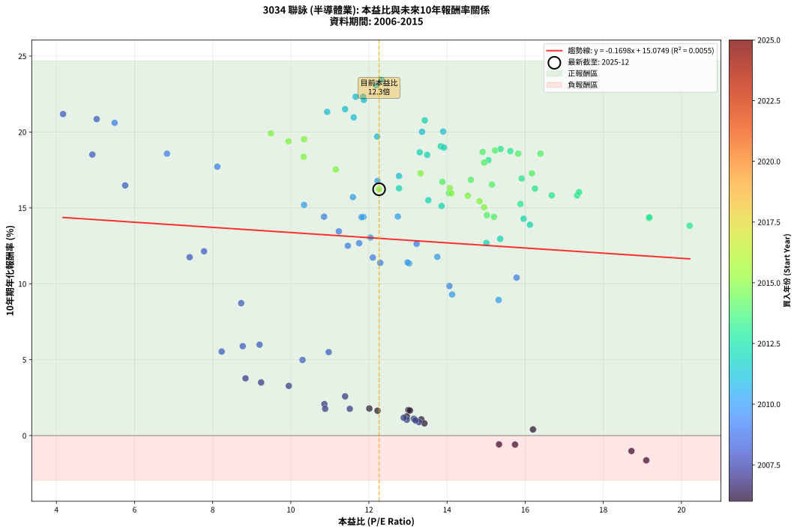
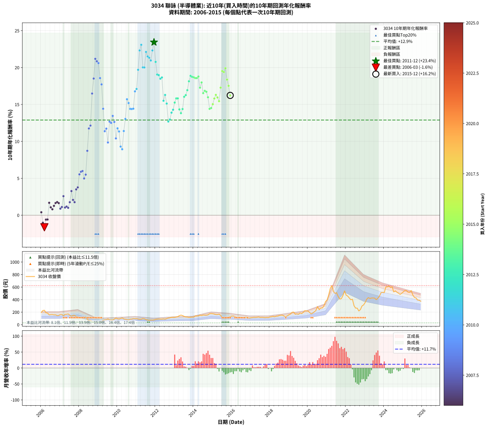

# 3034 聯詠 - 本益比與未來報酬率分析

!!! info "報告資訊"
    - **股票代號**: 3034
    - **公司名稱**: 聯詠
    - **產業別**: 半導體業
    - **分析期間**: 2006-2015 (120 個數據點)
    - **資料來源**: Type 12 (ShowMonthlyK_ChartFlow) 月收盤價與本益比
    - **報酬率口徑**: 含現金股利 (簡化: 年度合計，假設每年7/1入帳)
    - **報告生成時間**: 2026-01-13 13:38:56 CST

## 📈 視覺化圖表

### 圖表1: 本益比 vs 未來報酬率關係

*圖表1：3034 聯詠 本益比與10年期未來報酬率關係 (2006-2015)*

### 圖表2: 歷年買入時點的10年期實際報酬率

*圖表2：3034 聯詠 歷年買入時點的10年期實際報酬率 (2006-2015)*

## 📍 買點訊號說明

本報告提供兩種買點提示訊號（顯示於圖表2的股價子圖中）：

### ▲ 小綠色三角形（回測驗證）
- **計算方式**: 使用全部歷史資料計算本益比第25百分位數
- **用途**: 事後驗證，顯示歷史上哪些時點確實為低估區
- **限制**: 當下無法判斷，僅供回測參考
- **特性**: 後見之明（Look-Ahead Bias）

### ▲ 小橘色三角形（即時訊號）
- **計算方式**: 使用截至當月的過去5年資料計算本益比第25百分位數
- **用途**: 實際投資決策，當時即可判斷
- **優勢**: 可操作性強，符合實務需求
- **特性**: 無後見之明，滾動窗口計算

!!! tip "如何使用兩種訊號"
    - **綠色▲** 幫助理解歷史估值機會，驗證策略有效性
    - **橘色▲** 可作為實際買進參考，但仍需搭配基本面分析
    - 兩種訊號重疊時，表示即時判斷與事後驗證一致，信心度較高
    - 僅有綠色▲時，表示當時無法判斷（需要未來資料才能確認）
    - 僅有橘色▲時，表示即時判斷為買點，但事後可能不是最佳時機

## 📊 估值分析摘要

| 指標 | 數值 |
|:---:|:---:|
| **目前本益比** (2015-12) | **12.26 倍** |
| **歷史平均本益比** | 12.84 倍 |
| **估值水準** | 🟡 合理範圍 |
| **預期10年年化報酬率** | **+12.99%** |
| **歷史平均報酬率** | +12.89% |
| **相關係數 (R²)** | 0.0055 |
| **趨勢線斜率** | -0.1698 |

!!! abstract "核心洞察"
    目前本益比接近歷史平均，預期報酬率符合長期趨勢

    根據歷史數據回測，3034 聯詠 在目前本益比 **12.3倍** 的估值水準下，
    預期未來10年年化報酬率約為 **+13.0%**。

    **重要提醒**: 本分析基於歷史數據統計，實際報酬率會受到公司基本面變化、產業趨勢、
    總體經濟環境等多重因素影響。R² = 0.01 表示本益比可解釋約 0.6% 的報酬率變異。

## 📈 歷史估值統計

### 最佳買點 (最高報酬率)

| 項目 | 數值 |
|:---:|:---:|
| 起始時間 | 2011-12 |
| 當時本益比 | 12.32 倍 |
| 起始價格 | 75.9 元 |
| 10年後價格 | 539.0 元 |
| **10年年化報酬率** | **+23.43%** |

### 最差買點 (最低報酬率)

| 項目 | 數值 |
|:---:|:---:|
| 起始時間 | 2006-03 |
| 當時本益比 | 19.10 倍 |
| 起始價格 | 230.5 元 |
| 10年後價格 | 129.5 元 |
| **10年年化報酬率** | **-1.63%** |

## 🎯 投資啟示

### 本益比與報酬率關係

趨勢線方程式: **y = -0.1698x + 15.0749**

!!! note "負相關"
    本益比與未來報酬率呈現負相關。較低的本益比通常帶來較高的未來報酬率，
    但相關性不算非常強。**估值仍是重要參考指標之一**。

### 估值區間建議

基於歷史數據分析:

- **🟢 低估區** (P/E < 10.3): 預期報酬率較高，可考慮增加持股
- **🟡 合理區** (P/E 10.3-15.4): 預期報酬率符合長期趨勢，正常持有
- **🔴 高估區** (P/E > 15.4): 預期報酬率較低，可考慮減碼或觀望

!!! danger "風險提示"
    - 過去表現不代表未來結果
    - 本分析假設公司基本面無重大結構性變化
    - 產業環境劇變可能使歷史規律失效
    - 應結合公司財報、產業趨勢、總體經濟等多重因素綜合判斷

!!! success "長期投資觀點"
    歷史數據顯示，在合理或低估的估值水準買入並長期持有，
    往往能獲得較佳的投資報酬。**耐心等待好價格**是價值投資的核心原則。

## 📊 數據品質

- **資料來源**: GoodInfo.tw Type 12 (ShowMonthlyK_ChartFlow)
- **資料頻率**: 月度收盤價與本益比
- **回測期間**: 2006-2015
- **數據點數量**: 120 個 (每個點代表一次10年期回測)

### 計算方法說明

1. **10年期年化報酬率**:
   - 對每個歷史時點，計算其後10年的實際投資報酬率
   - 期末價值(不含股利): 期末價格
   - 期末價值(含現金股利): 期末價格 + 持有期間內的現金股利合計 (簡化: 年度合計，假設每年7/1入帳)
   - 公式: 年化報酬率 = [(期末價值/期初價格)^(1/年數) - 1] × 100%

2. **本益比 (P/E Ratio)**:
   - 使用當時的月收盤價與EPS計算
   - 資料來源: Type 12 月度河流圖本益比數據

3. **趨勢線 (Linear Regression)**:
   - 使用最小平方法擬合線性趨勢線
   - R²值衡量本益比對報酬率的解釋能力

---

*本報告由 Stock Analysis System v1.9.0 自動生成*
*數據更新時間: 2026-01-13 13:38:56 CST*

## 📋 月度回測明細表

（每一列對應時間線圖中的一個買入點；可用來對照 SVG 圖上的每個點。）

| 買入月份 | 賣出月份 | 回測期限_年 | 實際持有年數 | 買入本益比_倍 | 買入收盤價_元 | 賣出收盤價_元 | 現金股利合計_元 | 總報酬率_pct | 年化報酬率_pct |
| --- | --- | --- | --- | --- | --- | --- | --- | --- | --- |
| 2006-01 | 2016-01 | 10 | 9.999 | 16.20 | 195.50 | 137.50 | 66.04 | +4.11 | +0.40 |
| 2006-02 | 2016-02 | 10 | 9.999 | 18.72 | 226.00 | 138.00 | 66.04 | -9.72 | -1.02 |
| 2006-03 | 2016-03 | 10 | 10.001 | 19.10 | 230.50 | 129.50 | 66.04 | -15.17 | -1.63 |
| 2006-04 | 2016-04 | 10 | 10.001 | 15.74 | 190.00 | 113.00 | 66.04 | -5.77 | -0.59 |
| 2006-05 | 2016-05 | 10 | 10.001 | 15.33 | 185.00 | 108.50 | 66.04 | -5.65 | -0.58 |
| 2006-06 | 2016-06 | 10 | 10.001 | 13.01 | 157.00 | 119.50 | 66.04 | +18.18 | +1.68 |
| 2006-07 | 2016-07 | 10 | 10.001 | 13.34 | 161.00 | 112.00 | 67.05 | +11.21 | +1.07 |
| 2006-08 | 2016-08 | 10 | 10.001 | 13.42 | 162.00 | 108.50 | 67.05 | +8.36 | +0.81 |
| 2006-09 | 2016-09 | 10 | 10.001 | 12.97 | 156.50 | 110.50 | 67.05 | +13.45 | +1.27 |
| 2006-10 | 2016-10 | 10 | 10.001 | 13.05 | 157.50 | 118.50 | 67.05 | +17.81 | +1.65 |
| 2006-11 | 2016-11 | 10 | 10.001 | 12.01 | 145.00 | 106.00 | 67.05 | +19.34 | +1.78 |
| 2006-12 | 2016-12 | 10 | 10.001 | 12.22 | 147.50 | 106.50 | 67.05 | +17.66 | +1.64 |
| 2007-01 | 2017-01 | 10 | 10.001 | 13.28 | 162.50 | 110.50 | 67.05 | +9.26 | +0.89 |
| 2007-02 | 2017-02 | 10 | 10.001 | 13.15 | 163.00 | 115.00 | 67.05 | +11.69 | +1.11 |
| 2007-03 | 2017-03 | 10 | 10.001 | 11.39 | 143.00 | 117.50 | 67.05 | +29.05 | +2.58 |
| 2007-04 | 2017-04 | 10 | 10.001 | 12.97 | 165.00 | 116.00 | 67.05 | +10.94 | +1.04 |
| 2007-05 | 2017-05 | 10 | 10.001 | 12.89 | 166.00 | 119.50 | 67.05 | +12.38 | +1.17 |
| 2007-06 | 2017-06 | 10 | 10.001 | 13.19 | 172.00 | 123.00 | 67.05 | +10.49 | +1.00 |
| 2007-07 | 2017-07 | 10 | 10.001 | 11.51 | 152.00 | 115.00 | 66.05 | +19.11 | +1.76 |
| 2007-08 | 2017-08 | 10 | 10.001 | 9.95 | 133.00 | 117.50 | 66.05 | +38.01 | +3.27 |
| 2007-09 | 2017-09 | 10 | 10.001 | 10.86 | 147.00 | 114.50 | 66.05 | +22.82 | +2.08 |
| 2007-10 | 2017-10 | 10 | 10.001 | 10.88 | 149.00 | 111.50 | 66.05 | +19.16 | +1.77 |
| 2007-11 | 2017-11 | 10 | 10.001 | 9.24 | 128.00 | 114.50 | 66.05 | +41.05 | +3.50 |
| 2007-12 | 2017-12 | 10 | 10.001 | 8.84 | 124.00 | 113.50 | 66.05 | +44.80 | +3.77 |
| 2008-01 | 2018-01 | 10 | 10.001 | 8.23 | 110.00 | 122.50 | 66.05 | +71.41 | +5.54 |
| 2008-02 | 2018-03 | 10 | 10.081 | 8.77 | 111.50 | 132.50 | 66.05 | +78.07 | +5.89 |
| 2008-03 | 2018-03 | 10 | 9.999 | 9.20 | 111.00 | 132.50 | 66.05 | +78.87 | +5.99 |
| 2008-04 | 2018-04 | 10 | 9.999 | 10.30 | 117.50 | 125.00 | 66.05 | +62.59 | +4.98 |
| 2008-05 | 2018-05 | 10 | 9.999 | 10.97 | 118.00 | 135.50 | 66.05 | +70.80 | +5.50 |
| 2008-06 | 2018-06 | 10 | 9.999 | 8.73 | 88.20 | 137.50 | 66.05 | +130.78 | +8.72 |
| 2008-07 | 2018-07 | 10 | 9.999 | 7.41 | 70.00 | 148.00 | 64.59 | +203.70 | +11.75 |
| 2008-08 | 2018-08 | 10 | 9.999 | 7.78 | 68.40 | 150.50 | 64.59 | +214.46 | +12.14 |
| 2008-09 | 2018-09 | 10 | 9.999 | 5.76 | 46.90 | 151.00 | 64.59 | +359.68 | +16.48 |
| 2008-10 | 2018-10 | 10 | 9.999 | 4.92 | 36.80 | 136.50 | 64.59 | +446.44 | +18.51 |
| 2008-11 | 2018-11 | 10 | 9.999 | 4.17 | 28.50 | 130.00 | 64.59 | +582.77 | +21.18 |
| 2008-12 | 2018-12 | 10 | 9.999 | 5.03 | 31.10 | 142.00 | 64.59 | +564.27 | +20.85 |
| 2009-01 | 2019-01 | 10 | 9.999 | 5.49 | 34.20 | 158.00 | 64.59 | +550.85 | +20.60 |
| 2009-02 | 2019-02 | 10 | 9.999 | 6.83 | 42.90 | 171.00 | 64.59 | +449.16 | +18.57 |
| 2009-03 | 2019-03 | 10 | 9.999 | 8.12 | 51.40 | 198.00 | 64.59 | +410.87 | +17.72 |
| 2009-04 | 2019-04 | 10 | 9.999 | 10.85 | 69.20 | 201.50 | 64.59 | +284.52 | +14.42 |
| 2009-05 | 2019-05 | 10 | 9.999 | 12.29 | 79.00 | 167.50 | 64.59 | +193.78 | +11.38 |
| 2009-06 | 2019-06 | 10 | 9.999 | 12.10 | 78.40 | 173.00 | 64.59 | +203.05 | +11.73 |
| 2009-07 | 2019-07 | 10 | 9.999 | 14.06 | 91.80 | 166.00 | 68.89 | +155.87 | +9.85 |
| 2009-08 | 2019-08 | 10 | 9.999 | 11.75 | 77.30 | 186.00 | 68.89 | +229.74 | +12.67 |
| 2009-09 | 2019-09 | 10 | 9.999 | 11.46 | 76.00 | 178.00 | 68.89 | +224.85 | +12.51 |
| 2009-10 | 2019-10 | 10 | 9.999 | 11.23 | 75.00 | 196.00 | 68.89 | +253.19 | +13.45 |
| 2009-11 | 2019-11 | 10 | 9.999 | 13.22 | 89.00 | 223.50 | 68.89 | +228.53 | +12.63 |
| 2009-12 | 2019-12 | 10 | 9.999 | 15.78 | 107.00 | 219.00 | 68.89 | +169.06 | +10.41 |
| 2010-01 | 2020-01 | 10 | 9.999 | 13.75 | 94.30 | 218.00 | 68.89 | +204.23 | +11.77 |
| 2010-02 | 2020-02 | 10 | 9.999 | 13.03 | 90.30 | 195.50 | 68.89 | +192.79 | +11.34 |
| 2010-03 | 2020-03 | 10 | 10.001 | 14.13 | 99.00 | 172.00 | 68.89 | +143.32 | +9.30 |
| 2010-04 | 2020-04 | 10 | 10.001 | 15.32 | 108.50 | 186.50 | 68.89 | +135.38 | +8.94 |
| 2010-05 | 2020-05 | 10 | 10.001 | 12.99 | 93.00 | 205.00 | 68.89 | +194.50 | +11.40 |
| 2010-06 | 2020-06 | 10 | 10.001 | 12.04 | 87.10 | 228.00 | 68.89 | +240.86 | +13.04 |
| 2010-07 | 2020-07 | 10 | 10.001 | 11.59 | 84.70 | 290.00 | 74.39 | +330.21 | +15.71 |
| 2010-08 | 2020-08 | 10 | 10.001 | 10.34 | 76.40 | 240.00 | 74.39 | +311.51 | +15.19 |
| 2010-09 | 2020-09 | 10 | 10.001 | 11.86 | 88.50 | 265.50 | 74.39 | +284.06 | +14.40 |
| 2010-10 | 2020-10 | 10 | 10.001 | 11.81 | 89.00 | 267.00 | 74.39 | +283.58 | +14.39 |
| 2010-11 | 2020-11 | 10 | 10.001 | 12.74 | 97.00 | 299.00 | 74.39 | +284.94 | +14.43 |
| 2010-12 | 2020-12 | 10 | 10.001 | 12.22 | 94.00 | 369.00 | 74.39 | +371.69 | +16.78 |
| 2011-01 | 2021-01 | 10 | 10.001 | 12.77 | 96.60 | 394.00 | 74.39 | +384.88 | +17.10 |
| 2011-02 | 2021-02 | 10 | 10.001 | 12.21 | 90.80 | 474.00 | 74.39 | +503.95 | +19.70 |
| 2011-03 | 2021-03 | 10 | 10.001 | 11.85 | 86.60 | 575.00 | 74.39 | +649.87 | +22.32 |
| 2011-04 | 2021-04 | 10 | 10.001 | 12.19 | 87.50 | 624.00 | 74.39 | +698.16 | +23.08 |
| 2011-05 | 2021-05 | 10 | 10.001 | 13.90 | 98.00 | 534.00 | 74.39 | +520.81 | +20.03 |
| 2011-06 | 2021-06 | 10 | 10.001 | 13.36 | 92.50 | 499.00 | 74.39 | +519.88 | +20.01 |
| 2011-07 | 2021-07 | 10 | 10.001 | 11.87 | 80.70 | 511.00 | 84.19 | +637.54 | +22.11 |
| 2011-08 | 2021-08 | 10 | 10.001 | 11.39 | 76.00 | 449.00 | 84.19 | +601.57 | +21.51 |
| 2011-09 | 2021-09 | 10 | 10.001 | 10.93 | 71.50 | 410.00 | 84.19 | +591.18 | +21.32 |
| 2011-10 | 2021-10 | 10 | 10.001 | 11.61 | 74.50 | 415.50 | 84.19 | +570.73 | +20.96 |
| 2011-11 | 2021-11 | 10 | 10.001 | 11.66 | 73.30 | 465.50 | 84.19 | +649.92 | +22.32 |
| 2011-12 | 2021-12 | 10 | 10.001 | 12.32 | 75.90 | 539.00 | 84.19 | +721.07 | +23.43 |
| 2012-01 | 2022-01 | 10 | 10.001 | 13.43 | 84.10 | 471.00 | 84.19 | +560.16 | +20.77 |
| 2012-02 | 2022-03 | 10 | 10.081 | 13.84 | 88.00 | 426.50 | 84.19 | +480.33 | +19.06 |
| 2012-03 | 2022-03 | 10 | 9.999 | 13.92 | 89.90 | 426.50 | 84.19 | +468.07 | +18.97 |
| 2012-04 | 2022-04 | 10 | 9.999 | 13.49 | 88.50 | 398.50 | 84.19 | +445.41 | +18.49 |
| 2012-05 | 2022-05 | 10 | 9.999 | 13.30 | 88.60 | 406.00 | 84.19 | +453.26 | +18.66 |
| 2012-06 | 2022-06 | 10 | 9.999 | 13.52 | 91.40 | 302.00 | 84.19 | +322.53 | +15.50 |
| 2012-07 | 2022-07 | 10 | 9.999 | 12.77 | 87.60 | 265.00 | 131.09 | +352.16 | +16.29 |
| 2012-08 | 2022-08 | 10 | 9.999 | 13.86 | 96.50 | 263.50 | 131.09 | +308.90 | +15.13 |
| 2012-09 | 2022-09 | 10 | 9.999 | 15.01 | 106.00 | 219.00 | 131.09 | +230.28 | +12.69 |
| 2012-10 | 2022-10 | 10 | 9.999 | 15.36 | 110.00 | 241.00 | 131.09 | +238.27 | +12.96 |
| 2012-11 | 2022-11 | 10 | 9.999 | 16.12 | 117.00 | 298.50 | 131.09 | +267.17 | +13.89 |
| 2012-12 | 2022-12 | 10 | 9.999 | 15.96 | 117.50 | 315.50 | 131.09 | +280.08 | +14.29 |
| 2013-01 | 2023-01 | 10 | 9.999 | 15.88 | 117.50 | 355.00 | 131.09 | +313.70 | +15.26 |
| 2013-02 | 2023-02 | 10 | 9.999 | 16.68 | 124.00 | 407.50 | 131.09 | +334.35 | +15.82 |
| 2013-03 | 2023-03 | 10 | 9.999 | 17.33 | 129.50 | 431.50 | 131.09 | +334.43 | +15.82 |
| 2013-04 | 2023-04 | 10 | 9.999 | 19.17 | 144.00 | 418.50 | 131.09 | +281.66 | +14.33 |
| 2013-05 | 2023-05 | 10 | 9.999 | 20.21 | 152.50 | 425.50 | 131.09 | +264.98 | +13.82 |
| 2013-06 | 2023-06 | 10 | 9.999 | 19.18 | 145.50 | 426.50 | 131.09 | +283.23 | +14.38 |
| 2013-07 | 2023-07 | 10 | 9.999 | 17.38 | 132.50 | 424.00 | 162.50 | +342.64 | +16.04 |
| 2013-08 | 2023-08 | 10 | 9.999 | 16.25 | 124.50 | 399.50 | 162.50 | +351.41 | +16.27 |
| 2013-09 | 2023-09 | 10 | 9.999 | 15.91 | 122.50 | 423.00 | 162.50 | +377.96 | +16.94 |
| 2013-10 | 2023-10 | 10 | 9.999 | 15.06 | 116.50 | 454.50 | 162.50 | +429.61 | +18.14 |
| 2013-11 | 2023-11 | 10 | 9.999 | 15.37 | 119.50 | 511.00 | 162.50 | +463.60 | +18.88 |
| 2013-12 | 2023-12 | 10 | 9.999 | 15.62 | 122.00 | 517.00 | 162.50 | +456.97 | +18.74 |
| 2014-01 | 2024-01 | 10 | 9.999 | 14.91 | 121.50 | 511.00 | 162.50 | +454.32 | +18.68 |
| 2014-02 | 2024-02 | 10 | 9.999 | 16.39 | 139.00 | 601.00 | 162.50 | +449.28 | +18.57 |
| 2014-03 | 2024-03 | 10 | 10.001 | 15.82 | 139.50 | 604.00 | 162.50 | +449.46 | +18.57 |
| 2014-04 | 2024-04 | 10 | 10.001 | 15.23 | 139.50 | 618.00 | 162.50 | +459.50 | +18.79 |
| 2014-05 | 2024-05 | 10 | 10.001 | 16.17 | 153.50 | 593.00 | 162.50 | +392.18 | +17.27 |
| 2014-06 | 2024-06 | 10 | 10.001 | 14.95 | 147.00 | 606.00 | 162.50 | +422.79 | +17.98 |
| 2014-07 | 2024-07 | 10 | 10.001 | 15.15 | 154.00 | 523.00 | 188.50 | +362.01 | +16.53 |
| 2014-08 | 2024-08 | 10 | 10.001 | 14.61 | 153.50 | 540.00 | 188.50 | +374.59 | +16.85 |
| 2014-09 | 2024-09 | 10 | 10.001 | 13.88 | 150.50 | 518.00 | 188.50 | +369.44 | +16.72 |
| 2014-10 | 2024-10 | 10 | 10.001 | 14.05 | 157.00 | 503.00 | 188.50 | +340.45 | +15.98 |
| 2014-11 | 2024-11 | 10 | 10.001 | 15.20 | 175.00 | 484.00 | 188.50 | +284.29 | +14.41 |
| 2014-12 | 2024-12 | 10 | 10.001 | 15.02 | 178.00 | 502.00 | 188.50 | +287.92 | +14.52 |
| 2015-01 | 2025-01 | 10 | 10.001 | 14.95 | 175.50 | 524.00 | 188.50 | +305.98 | +15.04 |
| 2015-02 | 2025-02 | 10 | 10.001 | 14.53 | 169.00 | 545.00 | 188.50 | +334.02 | +15.81 |
| 2015-03 | 2025-03 | 10 | 10.001 | 14.07 | 162.00 | 545.00 | 188.50 | +352.78 | +16.30 |
| 2015-04 | 2025-04 | 10 | 10.001 | 14.11 | 161.00 | 519.00 | 188.50 | +339.44 | +15.95 |
| 2015-05 | 2025-05 | 10 | 10.001 | 14.83 | 167.50 | 516.00 | 188.50 | +320.60 | +15.45 |
| 2015-06 | 2025-06 | 10 | 10.001 | 13.32 | 149.00 | 545.00 | 188.50 | +392.28 | +17.28 |
| 2015-07 | 2025-07 | 10 | 10.001 | 10.34 | 114.50 | 475.00 | 206.50 | +495.20 | +19.52 |
| 2015-08 | 2025-08 | 10 | 10.001 | 9.94 | 109.00 | 435.00 | 206.50 | +488.53 | +19.39 |
| 2015-09 | 2025-09 | 10 | 10.001 | 9.49 | 103.00 | 426.50 | 206.50 | +514.56 | +19.91 |
| 2015-10 | 2025-10 | 10 | 10.001 | 10.33 | 111.00 | 393.00 | 206.50 | +440.09 | +18.37 |
| 2015-11 | 2025-11 | 10 | 10.001 | 11.15 | 118.50 | 389.50 | 206.50 | +402.95 | +17.53 |
| 2015-12 | 2025-12 | 10 | 10.001 | 12.26 | 129.00 | 374.00 | 206.50 | +350.00 | +16.23 |
