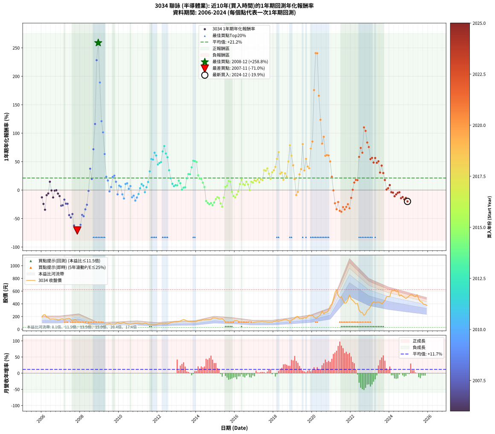

# 3034 聯詠 - 本益比與未來報酬率分析

!!! info "報告資訊"
    - **股票代號**: 3034
    - **公司名稱**: 聯詠
    - **產業別**: 半導體業
    - **分析期間**: 2005-2024 (229 個數據點)
    - **資料來源**: Type 12 (ShowMonthlyK_ChartFlow) 月收盤價與本益比
    - **報酬率口徑**: 含現金股利 (簡化: 年度合計，假設每年7/1入帳)
    - **報告生成時間**: 2025-12-23 12:16:09 CST

## 📈 視覺化圖表

### 圖表1: 本益比 vs 未來報酬率關係

*圖表1：3034 聯詠 本益比與1年期未來報酬率關係 (2005-2024)*

### 圖表2: 歷年買入時點的1年期實際報酬率

*圖表2：3034 聯詠 歷年買入時點的1年期實際報酬率 (2005-2024)*

## 📍 買點訊號說明

本報告提供兩種買點提示訊號（顯示於圖表2的股價子圖中）：

### ▲ 小綠色三角形（回測驗證）
- **計算方式**: 使用全部歷史資料計算本益比第25百分位數
- **用途**: 事後驗證，顯示歷史上哪些時點確實為低估區
- **限制**: 當下無法判斷，僅供回測參考
- **特性**: 後見之明（Look-Ahead Bias）

### ▲ 小橘色三角形（即時訊號）
- **計算方式**: 使用截至當月的過去5年資料計算本益比第25百分位數
- **用途**: 實際投資決策，當時即可判斷
- **優勢**: 可操作性強，符合實務需求
- **特性**: 無後見之明，滾動窗口計算

!!! tip "如何使用兩種訊號"
    - **綠色▲** 幫助理解歷史估值機會，驗證策略有效性
    - **橘色▲** 可作為實際買進參考，但仍需搭配基本面分析
    - 兩種訊號重疊時，表示即時判斷與事後驗證一致，信心度較高
    - 僅有綠色▲時，表示當時無法判斷（需要未來資料才能確認）
    - 僅有橘色▲時，表示即時判斷為買點，但事後可能不是最佳時機

## 📊 估值分析摘要

| 指標 | 數值 |
|:---:|:---:|
| **目前本益比** (2024-12) | **15.02 倍** |
| **歷史平均本益比** | 12.87 倍 |
| **估值水準** | 🟡 合理範圍 |
| **預期1年年化報酬率** | **+12.76%** |
| **歷史平均報酬率** | +21.07% |
| **相關係數 (R²)** | 0.0607 |
| **趨勢線斜率** | -3.8702 |

!!! abstract "核心洞察"
    目前本益比接近歷史平均，預期報酬率符合長期趨勢

    根據歷史數據回測，3034 聯詠 在目前本益比 **15.0倍** 的估值水準下，
    預期未來1年年化報酬率約為 **+12.8%**。

    **重要提醒**: 本分析基於歷史數據統計，實際報酬率會受到公司基本面變化、產業趨勢、
    總體經濟環境等多重因素影響。R² = 0.06 表示本益比可解釋約 6.1% 的報酬率變異。

## 📈 歷史估值統計

### 最佳買點 (最高報酬率)

| 項目 | 數值 |
|:---:|:---:|
| 起始時間 | 2008-12 |
| 當時本益比 | 5.03 倍 |
| 起始價格 | 31.1 元 |
| 1年後價格 | 107.0 元 |
| **1年年化報酬率** | **+258.83%** |

### 最差買點 (最低報酬率)

| 項目 | 數值 |
|:---:|:---:|
| 起始時間 | 2007-11 |
| 當時本益比 | 9.24 倍 |
| 起始價格 | 128.0 元 |
| 1年後價格 | 28.5 元 |
| **1年年化報酬率** | **-70.97%** |

## 🎯 投資啟示

### 本益比與報酬率關係

趨勢線方程式: **y = -3.8702x + 70.8910**

!!! warning "強負相關"
    本益比與未來報酬率呈現強負相關。在高本益比時期買入，未來報酬率顯著較低；
    在低本益比時期買入，未來報酬率顯著較高。**估值紀律至關重要**。

### 估值區間建議

基於歷史數據分析:

- **🟢 低估區** (P/E < 10.3): 預期報酬率較高，可考慮增加持股
- **🟡 合理區** (P/E 10.3-15.4): 預期報酬率符合長期趨勢，正常持有
- **🔴 高估區** (P/E > 15.4): 預期報酬率較低，可考慮減碼或觀望

!!! danger "風險提示"
    - 過去表現不代表未來結果
    - 本分析假設公司基本面無重大結構性變化
    - 產業環境劇變可能使歷史規律失效
    - 應結合公司財報、產業趨勢、總體經濟等多重因素綜合判斷

!!! success "長期投資觀點"
    歷史數據顯示，在合理或低估的估值水準買入並長期持有，
    往往能獲得較佳的投資報酬。**耐心等待好價格**是價值投資的核心原則。

## 📊 數據品質

- **資料來源**: GoodInfo.tw Type 12 (ShowMonthlyK_ChartFlow)
- **資料頻率**: 月度收盤價與本益比
- **回測期間**: 2005-2024
- **數據點數量**: 229 個 (每個點代表一次1年期回測)

### 計算方法說明

1. **1年期年化報酬率**:
   - 對每個歷史時點，計算其後1年的實際投資報酬率
   - 期末價值(不含股利): 期末價格
   - 期末價值(含現金股利): 期末價格 + 持有期間內的現金股利合計 (簡化: 年度合計，假設每年7/1入帳)
   - 公式: 年化報酬率 = [(期末價值/期初價格)^(1/年數) - 1] × 100%

2. **本益比 (P/E Ratio)**:
   - 使用當時的月收盤價與EPS計算
   - 資料來源: Type 12 月度河流圖本益比數據

3. **趨勢線 (Linear Regression)**:
   - 使用最小平方法擬合線性趨勢線
   - R²值衡量本益比對報酬率的解釋能力

---

*本報告由 Stock Analysis System v1.9.0 自動生成*
*數據更新時間: 2025-12-23 12:16:09 CST*

## 📋 月度回測明細表

（每一列對應時間線圖中的一個買入點；可用來對照 SVG 圖上的每個點。）

| 買入月份 | 賣出月份 | 回測期限_年 | 實際持有年數 | 買入本益比_倍 | 買入收盤價_元 | 賣出收盤價_元 | 現金股利合計_元 | 總報酬率_pct | 年化報酬率_pct |
| --- | --- | --- | --- | --- | --- | --- | --- | --- | --- |
| 2005-12 | 2006-12 | 1 | 0.999 | 15.81 | 193.00 | 147.50 | 7.99 | -19.43 | -19.45 |
| 2006-01 | 2007-01 | 1 | 0.999 | 16.03 | 195.50 | 162.50 | 7.99 | -12.79 | -12.80 |
| 2006-02 | 2007-02 | 1 | 0.999 | 18.54 | 226.00 | 163.00 | 7.99 | -24.34 | -24.35 |
| 2006-03 | 2007-03 | 1 | 0.999 | 18.93 | 230.50 | 143.00 | 7.99 | -34.49 | -34.51 |
| 2006-04 | 2007-04 | 1 | 0.999 | 15.62 | 190.00 | 165.00 | 7.99 | -8.95 | -8.96 |
| 2006-05 | 2007-05 | 1 | 0.999 | 15.22 | 185.00 | 166.00 | 7.99 | -5.95 | -5.95 |
| 2006-06 | 2007-06 | 1 | 0.999 | 12.93 | 157.00 | 172.00 | 7.99 | +14.64 | +14.66 |
| 2006-07 | 2007-07 | 1 | 0.999 | 13.27 | 161.00 | 152.00 | 8.00 | -0.62 | -0.62 |
| 2006-08 | 2007-08 | 1 | 0.999 | 13.37 | 162.00 | 133.00 | 8.00 | -12.96 | -12.97 |
| 2006-09 | 2007-09 | 1 | 0.999 | 12.93 | 156.50 | 147.00 | 8.00 | -0.96 | -0.96 |
| 2006-10 | 2007-10 | 1 | 0.999 | 13.02 | 157.50 | 149.00 | 8.00 | -0.32 | -0.32 |
| 2006-11 | 2007-11 | 1 | 0.999 | 12.00 | 145.00 | 128.00 | 8.00 | -6.21 | -6.21 |
| 2006-12 | 2007-12 | 1 | 0.999 | 12.22 | 147.50 | 124.00 | 8.00 | -10.51 | -10.52 |
| 2007-01 | 2008-01 | 1 | 0.999 | 13.28 | 162.50 | 110.00 | 8.00 | -27.39 | -27.40 |
| 2007-02 | 2008-02 | 1 | 0.999 | 13.15 | 163.00 | 111.50 | 8.00 | -26.69 | -26.70 |
| 2007-03 | 2008-03 | 1 | 1.002 | 11.39 | 143.00 | 111.00 | 8.00 | -16.78 | -16.75 |
| 2007-04 | 2008-04 | 1 | 1.002 | 12.97 | 165.00 | 117.50 | 8.00 | -23.94 | -23.90 |
| 2007-05 | 2008-05 | 1 | 1.002 | 12.89 | 166.00 | 118.00 | 8.00 | -24.10 | -24.05 |
| 2007-06 | 2008-06 | 1 | 1.002 | 13.19 | 172.00 | 88.20 | 8.00 | -44.07 | -44.00 |
| 2007-07 | 2008-07 | 1 | 1.002 | 11.51 | 152.00 | 70.00 | 8.56 | -48.32 | -48.25 |
| 2007-08 | 2008-08 | 1 | 1.002 | 9.95 | 133.00 | 68.40 | 8.56 | -42.14 | -42.07 |
| 2007-09 | 2008-09 | 1 | 1.002 | 10.86 | 147.00 | 46.90 | 8.56 | -62.27 | -62.20 |
| 2007-10 | 2008-10 | 1 | 1.002 | 10.88 | 149.00 | 36.80 | 8.56 | -69.56 | -69.48 |
| 2007-11 | 2008-11 | 1 | 1.002 | 9.24 | 128.00 | 28.50 | 8.56 | -71.05 | -70.97 |
| 2007-12 | 2008-12 | 1 | 1.002 | 8.84 | 124.00 | 31.10 | 8.56 | -68.02 | -67.94 |
| 2008-01 | 2009-01 | 1 | 1.002 | 8.23 | 110.00 | 34.20 | 8.56 | -61.13 | -61.05 |
| 2008-02 | 2009-03 | 1 | 1.081 | 8.77 | 111.50 | 51.40 | 8.56 | -46.22 | -43.65 |
| 2008-03 | 2009-03 | 1 | 0.999 | 9.20 | 111.00 | 51.40 | 8.56 | -45.98 | -46.00 |
| 2008-04 | 2009-04 | 1 | 0.999 | 10.30 | 117.50 | 69.20 | 8.56 | -33.82 | -33.84 |
| 2008-05 | 2009-05 | 1 | 0.999 | 10.97 | 118.00 | 79.00 | 8.56 | -25.80 | -25.81 |
| 2008-06 | 2009-06 | 1 | 0.999 | 8.73 | 88.20 | 78.40 | 8.56 | -1.41 | -1.41 |
| 2008-07 | 2009-07 | 1 | 0.999 | 7.41 | 70.00 | 91.80 | 4.50 | +37.57 | +37.60 |
| 2008-08 | 2009-08 | 1 | 0.999 | 7.78 | 68.40 | 77.30 | 4.50 | +19.59 | +19.61 |
| 2008-09 | 2009-09 | 1 | 0.999 | 5.76 | 46.90 | 76.00 | 4.50 | +71.64 | +71.71 |
| 2008-10 | 2009-10 | 1 | 0.999 | 4.92 | 36.80 | 75.00 | 4.50 | +116.03 | +116.15 |
| 2008-11 | 2009-11 | 1 | 0.999 | 4.17 | 28.50 | 89.00 | 4.50 | +228.07 | +228.34 |
| 2008-12 | 2009-12 | 1 | 0.999 | 5.03 | 31.10 | 107.00 | 4.50 | +258.52 | +258.83 |
| 2009-01 | 2010-01 | 1 | 0.999 | 5.49 | 34.20 | 94.30 | 4.50 | +188.89 | +189.10 |
| 2009-02 | 2010-02 | 1 | 0.999 | 6.83 | 42.90 | 90.30 | 4.50 | +120.98 | +121.10 |
| 2009-03 | 2010-03 | 1 | 0.999 | 8.12 | 51.40 | 99.00 | 4.50 | +101.36 | +101.46 |
| 2009-04 | 2010-04 | 1 | 0.999 | 10.85 | 69.20 | 108.50 | 4.50 | +63.29 | +63.35 |
| 2009-05 | 2010-05 | 1 | 0.999 | 12.29 | 79.00 | 93.00 | 4.50 | +23.42 | +23.44 |
| 2009-06 | 2010-06 | 1 | 0.999 | 12.10 | 78.40 | 87.10 | 4.50 | +16.84 | +16.85 |
| 2009-07 | 2010-07 | 1 | 0.999 | 14.06 | 91.80 | 84.70 | 5.00 | -2.29 | -2.29 |
| 2009-08 | 2010-08 | 1 | 0.999 | 11.75 | 77.30 | 76.40 | 5.00 | +5.30 | +5.31 |
| 2009-09 | 2010-09 | 1 | 0.999 | 11.46 | 76.00 | 88.50 | 5.00 | +23.02 | +23.04 |
| 2009-10 | 2010-10 | 1 | 0.999 | 11.23 | 75.00 | 89.00 | 5.00 | +25.33 | +25.35 |
| 2009-11 | 2010-11 | 1 | 0.999 | 13.22 | 89.00 | 97.00 | 5.00 | +14.61 | +14.62 |
| 2009-12 | 2010-12 | 1 | 0.999 | 15.78 | 107.00 | 94.00 | 5.00 | -7.48 | -7.48 |
| 2010-01 | 2011-01 | 1 | 0.999 | 13.75 | 94.30 | 96.60 | 5.00 | +7.74 | +7.75 |
| 2010-02 | 2011-02 | 1 | 0.999 | 13.03 | 90.30 | 90.80 | 5.00 | +6.09 | +6.09 |
| 2010-03 | 2011-03 | 1 | 0.999 | 14.13 | 99.00 | 86.60 | 5.00 | -7.48 | -7.48 |
| 2010-04 | 2011-04 | 1 | 0.999 | 15.32 | 108.50 | 87.50 | 5.00 | -14.75 | -14.76 |
| 2010-05 | 2011-05 | 1 | 0.999 | 12.99 | 93.00 | 98.00 | 5.00 | +10.75 | +10.76 |
| 2010-06 | 2011-06 | 1 | 0.999 | 12.04 | 87.10 | 92.50 | 5.00 | +11.94 | +11.95 |
| 2010-07 | 2011-07 | 1 | 0.999 | 11.59 | 84.70 | 80.70 | 5.80 | +2.12 | +2.12 |
| 2010-08 | 2011-08 | 1 | 0.999 | 10.34 | 76.40 | 76.00 | 5.80 | +7.07 | +7.07 |
| 2010-09 | 2011-09 | 1 | 0.999 | 11.86 | 88.50 | 71.50 | 5.80 | -12.66 | -12.67 |
| 2010-10 | 2011-10 | 1 | 0.999 | 11.81 | 89.00 | 74.50 | 5.80 | -9.78 | -9.78 |
| 2010-11 | 2011-11 | 1 | 0.999 | 12.74 | 97.00 | 73.30 | 5.80 | -18.46 | -18.47 |
| 2010-12 | 2011-12 | 1 | 0.999 | 12.22 | 94.00 | 75.90 | 5.80 | -13.09 | -13.10 |
| 2011-01 | 2012-01 | 1 | 0.999 | 12.77 | 96.60 | 84.10 | 5.80 | -6.94 | -6.94 |
| 2011-02 | 2012-02 | 1 | 0.999 | 12.21 | 90.80 | 88.00 | 5.80 | +3.30 | +3.30 |
| 2011-03 | 2012-03 | 1 | 1.002 | 11.85 | 86.60 | 89.90 | 5.80 | +10.51 | +10.48 |
| 2011-04 | 2012-04 | 1 | 1.002 | 12.19 | 87.50 | 88.50 | 5.80 | +7.77 | +7.75 |
| 2011-05 | 2012-05 | 1 | 1.002 | 13.90 | 98.00 | 88.60 | 5.80 | -3.68 | -3.67 |
| 2011-06 | 2012-06 | 1 | 1.002 | 13.36 | 92.50 | 91.40 | 5.80 | +5.08 | +5.07 |
| 2011-07 | 2012-07 | 1 | 1.002 | 11.87 | 80.70 | 87.60 | 4.60 | +14.25 | +14.22 |
| 2011-08 | 2012-08 | 1 | 1.002 | 11.39 | 76.00 | 96.50 | 4.60 | +33.03 | +32.95 |
| 2011-09 | 2012-09 | 1 | 1.002 | 10.93 | 71.50 | 106.00 | 4.60 | +54.68 | +54.55 |
| 2011-10 | 2012-10 | 1 | 1.002 | 11.61 | 74.50 | 110.00 | 4.60 | +53.82 | +53.69 |
| 2011-11 | 2012-11 | 1 | 1.002 | 11.66 | 73.30 | 117.00 | 4.60 | +65.89 | +65.72 |
| 2011-12 | 2012-12 | 1 | 1.002 | 12.32 | 75.90 | 117.50 | 4.60 | +60.87 | +60.71 |
| 2012-01 | 2013-01 | 1 | 1.002 | 13.43 | 84.10 | 117.50 | 4.60 | +45.18 | +45.07 |
| 2012-02 | 2013-03 | 1 | 1.081 | 13.84 | 88.00 | 129.50 | 4.60 | +52.39 | +47.63 |
| 2012-03 | 2013-03 | 1 | 0.999 | 13.92 | 89.90 | 129.50 | 4.60 | +49.16 | +49.21 |
| 2012-04 | 2013-04 | 1 | 0.999 | 13.49 | 88.50 | 144.00 | 4.60 | +67.91 | +67.97 |
| 2012-05 | 2013-05 | 1 | 0.999 | 13.30 | 88.60 | 152.50 | 4.60 | +77.31 | +77.38 |
| 2012-06 | 2013-06 | 1 | 0.999 | 13.52 | 91.40 | 145.50 | 4.60 | +64.22 | +64.28 |
| 2012-07 | 2013-07 | 1 | 0.999 | 12.77 | 87.60 | 132.50 | 5.59 | +57.64 | +57.69 |
| 2012-08 | 2013-08 | 1 | 0.999 | 13.86 | 96.50 | 124.50 | 5.59 | +34.81 | +34.84 |
| 2012-09 | 2013-09 | 1 | 0.999 | 15.01 | 106.00 | 122.50 | 5.59 | +20.84 | +20.86 |
| 2012-10 | 2013-10 | 1 | 0.999 | 15.36 | 110.00 | 116.50 | 5.59 | +10.99 | +11.00 |
| 2012-11 | 2013-11 | 1 | 0.999 | 16.12 | 117.00 | 119.50 | 5.59 | +6.92 | +6.92 |
| 2012-12 | 2013-12 | 1 | 0.999 | 15.96 | 117.50 | 122.00 | 5.59 | +8.59 | +8.60 |
| 2013-01 | 2014-01 | 1 | 0.999 | 15.88 | 117.50 | 121.50 | 5.59 | +8.16 | +8.17 |
| 2013-02 | 2014-02 | 1 | 0.999 | 16.68 | 124.00 | 139.00 | 5.59 | +16.61 | +16.62 |
| 2013-03 | 2014-03 | 1 | 0.999 | 17.33 | 129.50 | 139.50 | 5.59 | +12.04 | +12.05 |
| 2013-04 | 2014-04 | 1 | 0.999 | 19.17 | 144.00 | 139.50 | 5.59 | +0.76 | +0.76 |
| 2013-05 | 2014-05 | 1 | 0.999 | 20.21 | 152.50 | 153.50 | 5.59 | +4.32 | +4.33 |
| 2013-06 | 2014-06 | 1 | 0.999 | 19.18 | 145.50 | 147.00 | 5.59 | +4.87 | +4.88 |
| 2013-07 | 2014-07 | 1 | 0.999 | 17.38 | 132.50 | 154.00 | 6.00 | +20.75 | +20.77 |
| 2013-08 | 2014-08 | 1 | 0.999 | 16.25 | 124.50 | 153.50 | 6.00 | +28.11 | +28.13 |
| 2013-09 | 2014-09 | 1 | 0.999 | 15.91 | 122.50 | 150.50 | 6.00 | +27.76 | +27.78 |
| 2013-10 | 2014-10 | 1 | 0.999 | 15.06 | 116.50 | 157.00 | 6.00 | +39.91 | +39.95 |
| 2013-11 | 2014-11 | 1 | 0.999 | 15.37 | 119.50 | 175.00 | 6.00 | +51.46 | +51.51 |
| 2013-12 | 2014-12 | 1 | 0.999 | 15.62 | 122.00 | 178.00 | 6.00 | +50.82 | +50.86 |
| 2014-01 | 2015-01 | 1 | 0.999 | 14.91 | 121.50 | 175.50 | 6.00 | +49.38 | +49.42 |
| 2014-02 | 2015-02 | 1 | 0.999 | 16.39 | 139.00 | 169.00 | 6.00 | +25.90 | +25.92 |
| 2014-03 | 2015-03 | 1 | 0.999 | 15.82 | 139.50 | 162.00 | 6.00 | +20.43 | +20.45 |
| 2014-04 | 2015-04 | 1 | 0.999 | 15.23 | 139.50 | 161.00 | 6.00 | +19.71 | +19.73 |
| 2014-05 | 2015-05 | 1 | 0.999 | 16.17 | 153.50 | 167.50 | 6.00 | +13.03 | +13.04 |
| 2014-06 | 2015-06 | 1 | 0.999 | 14.95 | 147.00 | 149.00 | 6.00 | +5.44 | +5.45 |
| 2014-07 | 2015-07 | 1 | 0.999 | 15.15 | 154.00 | 114.50 | 10.00 | -19.16 | -19.17 |
| 2014-08 | 2015-08 | 1 | 0.999 | 14.61 | 153.50 | 109.00 | 10.00 | -22.48 | -22.49 |
| 2014-09 | 2015-09 | 1 | 0.999 | 13.88 | 150.50 | 103.00 | 10.00 | -24.92 | -24.93 |
| 2014-10 | 2015-10 | 1 | 0.999 | 14.05 | 157.00 | 111.00 | 10.00 | -22.93 | -22.94 |
| 2014-11 | 2015-11 | 1 | 0.999 | 15.20 | 175.00 | 118.50 | 10.00 | -26.57 | -26.59 |
| 2014-12 | 2015-12 | 1 | 0.999 | 15.02 | 178.00 | 129.00 | 10.00 | -21.91 | -21.92 |
| 2015-01 | 2016-01 | 1 | 0.999 | 14.95 | 175.50 | 137.50 | 10.00 | -15.95 | -15.96 |
| 2015-02 | 2016-02 | 1 | 0.999 | 14.53 | 169.00 | 138.00 | 10.00 | -12.43 | -12.43 |
| 2015-03 | 2016-03 | 1 | 1.002 | 14.07 | 162.00 | 129.50 | 10.00 | -13.89 | -13.86 |
| 2015-04 | 2016-04 | 1 | 1.002 | 14.11 | 161.00 | 113.00 | 10.00 | -23.60 | -23.56 |
| 2015-05 | 2016-05 | 1 | 1.002 | 14.83 | 167.50 | 108.50 | 10.00 | -29.25 | -29.20 |
| 2015-06 | 2016-06 | 1 | 1.002 | 13.32 | 149.00 | 119.50 | 10.00 | -13.09 | -13.06 |
| 2015-07 | 2016-07 | 1 | 1.002 | 10.34 | 114.50 | 112.00 | 9.00 | +5.68 | +5.66 |
| 2015-08 | 2016-08 | 1 | 1.002 | 9.94 | 109.00 | 108.50 | 9.00 | +7.80 | +7.78 |
| 2015-09 | 2016-09 | 1 | 1.002 | 9.49 | 103.00 | 110.50 | 9.00 | +16.02 | +15.98 |
| 2015-10 | 2016-10 | 1 | 1.002 | 10.33 | 111.00 | 118.50 | 9.00 | +14.86 | +14.83 |
| 2015-11 | 2016-11 | 1 | 1.002 | 11.15 | 118.50 | 106.00 | 9.00 | -2.95 | -2.95 |
| 2015-12 | 2016-12 | 1 | 1.002 | 12.26 | 129.00 | 106.50 | 9.00 | -10.47 | -10.44 |
| 2016-01 | 2017-01 | 1 | 1.002 | 13.31 | 137.50 | 110.50 | 9.00 | -13.09 | -13.07 |
| 2016-02 | 2017-03 | 1 | 1.081 | 13.61 | 138.00 | 117.50 | 9.00 | -8.33 | -7.73 |
| 2016-03 | 2017-03 | 1 | 0.999 | 13.02 | 129.50 | 117.50 | 9.00 | -2.32 | -2.32 |
| 2016-04 | 2017-04 | 1 | 0.999 | 11.59 | 113.00 | 116.00 | 9.00 | +10.62 | +10.63 |
| 2016-05 | 2017-05 | 1 | 0.999 | 11.35 | 108.50 | 119.50 | 9.00 | +18.43 | +18.45 |
| 2016-06 | 2017-06 | 1 | 0.999 | 12.75 | 119.50 | 123.00 | 9.00 | +10.46 | +10.47 |
| 2016-07 | 2017-07 | 1 | 0.999 | 12.20 | 112.00 | 115.00 | 7.00 | +8.93 | +8.93 |
| 2016-08 | 2017-08 | 1 | 0.999 | 12.07 | 108.50 | 117.50 | 7.00 | +14.75 | +14.76 |
| 2016-09 | 2017-09 | 1 | 0.999 | 12.56 | 110.50 | 114.50 | 7.00 | +9.95 | +9.96 |
| 2016-10 | 2017-10 | 1 | 0.999 | 13.77 | 118.50 | 111.50 | 7.00 | +0.00 | +0.00 |
| 2016-11 | 2017-11 | 1 | 0.999 | 12.60 | 106.00 | 114.50 | 7.00 | +14.62 | +14.63 |
| 2016-12 | 2017-12 | 1 | 0.999 | 12.96 | 106.50 | 113.50 | 7.00 | +13.15 | +13.16 |
| 2017-01 | 2018-01 | 1 | 0.999 | 13.44 | 110.50 | 122.50 | 7.00 | +17.19 | +17.21 |
| 2017-02 | 2018-02 | 1 | 0.999 | 13.98 | 115.00 | 126.50 | 7.00 | +16.09 | +16.10 |
| 2017-03 | 2018-03 | 1 | 0.999 | 14.28 | 117.50 | 132.50 | 7.00 | +18.72 | +18.74 |
| 2017-04 | 2018-04 | 1 | 0.999 | 14.09 | 116.00 | 125.00 | 7.00 | +13.79 | +13.80 |
| 2017-05 | 2018-05 | 1 | 0.999 | 14.51 | 119.50 | 135.50 | 7.00 | +19.25 | +19.26 |
| 2017-06 | 2018-06 | 1 | 0.999 | 14.93 | 123.00 | 137.50 | 7.00 | +17.48 | +17.49 |
| 2017-07 | 2018-07 | 1 | 0.999 | 13.95 | 115.00 | 148.00 | 7.10 | +34.87 | +34.90 |
| 2017-08 | 2018-08 | 1 | 0.999 | 14.25 | 117.50 | 150.50 | 7.10 | +34.13 | +34.15 |
| 2017-09 | 2018-09 | 1 | 0.999 | 13.88 | 114.50 | 151.00 | 7.10 | +38.08 | +38.11 |
| 2017-10 | 2018-10 | 1 | 0.999 | 13.51 | 111.50 | 136.50 | 7.10 | +28.79 | +28.81 |
| 2017-11 | 2018-11 | 1 | 0.999 | 13.87 | 114.50 | 130.00 | 7.10 | +19.74 | +19.75 |
| 2017-12 | 2018-12 | 1 | 0.999 | 13.74 | 113.50 | 142.00 | 7.10 | +31.37 | +31.39 |
| 2018-01 | 2019-01 | 1 | 0.999 | 14.50 | 122.50 | 158.00 | 7.10 | +34.78 | +34.80 |
| 2018-02 | 2019-02 | 1 | 0.999 | 14.65 | 126.50 | 171.00 | 7.10 | +40.79 | +40.82 |
| 2018-03 | 2019-03 | 1 | 0.999 | 15.02 | 132.50 | 198.00 | 7.10 | +54.79 | +54.84 |
| 2018-04 | 2019-04 | 1 | 0.999 | 13.88 | 125.00 | 201.50 | 7.10 | +66.88 | +66.94 |
| 2018-05 | 2019-05 | 1 | 0.999 | 14.74 | 135.50 | 167.50 | 7.10 | +28.86 | +28.88 |
| 2018-06 | 2019-06 | 1 | 0.999 | 14.66 | 137.50 | 173.00 | 7.10 | +30.98 | +31.01 |
| 2018-07 | 2019-07 | 1 | 0.999 | 15.47 | 148.00 | 166.00 | 8.80 | +18.11 | +18.12 |
| 2018-08 | 2019-08 | 1 | 0.999 | 15.43 | 150.50 | 186.00 | 8.80 | +29.44 | +29.46 |
| 2018-09 | 2019-09 | 1 | 0.999 | 15.19 | 151.00 | 178.00 | 8.80 | +23.71 | +23.73 |
| 2018-10 | 2019-10 | 1 | 0.999 | 13.48 | 136.50 | 196.00 | 8.80 | +50.04 | +50.08 |
| 2018-11 | 2019-11 | 1 | 0.999 | 12.61 | 130.00 | 223.50 | 8.80 | +78.69 | +78.76 |
| 2018-12 | 2019-12 | 1 | 0.999 | 13.52 | 142.00 | 219.00 | 8.80 | +60.42 | +60.47 |
| 2019-01 | 2020-01 | 1 | 0.999 | 14.75 | 158.00 | 218.00 | 8.80 | +43.54 | +43.58 |
| 2019-02 | 2020-02 | 1 | 0.999 | 15.66 | 171.00 | 195.50 | 8.80 | +19.47 | +19.49 |
| 2019-03 | 2020-03 | 1 | 1.002 | 17.79 | 198.00 | 172.00 | 8.80 | -8.69 | -8.67 |
| 2019-04 | 2020-04 | 1 | 1.002 | 17.76 | 201.50 | 186.50 | 8.80 | -3.08 | -3.07 |
| 2019-05 | 2020-05 | 1 | 1.002 | 14.50 | 167.50 | 205.00 | 8.80 | +27.64 | +27.58 |
| 2019-06 | 2020-06 | 1 | 1.002 | 14.70 | 173.00 | 228.00 | 8.80 | +36.88 | +36.79 |
| 2019-07 | 2020-07 | 1 | 1.002 | 13.86 | 166.00 | 290.00 | 10.50 | +81.02 | +80.80 |
| 2019-08 | 2020-08 | 1 | 1.002 | 15.26 | 186.00 | 240.00 | 10.50 | +34.68 | +34.60 |
| 2019-09 | 2020-09 | 1 | 1.002 | 14.36 | 178.00 | 265.50 | 10.50 | +55.06 | +54.92 |
| 2019-10 | 2020-10 | 1 | 1.002 | 15.55 | 196.00 | 267.00 | 10.50 | +41.58 | +41.48 |
| 2019-11 | 2020-11 | 1 | 1.002 | 17.43 | 223.50 | 299.00 | 10.50 | +38.48 | +38.39 |
| 2019-12 | 2020-12 | 1 | 1.002 | 16.81 | 219.00 | 369.00 | 10.50 | +73.29 | +73.09 |
| 2020-01 | 2021-01 | 1 | 1.002 | 16.07 | 218.00 | 394.00 | 10.50 | +85.55 | +85.32 |
| 2020-02 | 2021-03 | 1 | 1.081 | 13.87 | 195.50 | 575.00 | 10.50 | +199.49 | +175.74 |
| 2020-03 | 2021-03 | 1 | 0.999 | 11.76 | 172.00 | 575.00 | 10.50 | +240.41 | +240.69 |
| 2020-04 | 2021-04 | 1 | 0.999 | 12.30 | 186.50 | 624.00 | 10.50 | +240.21 | +240.50 |
| 2020-05 | 2021-05 | 1 | 0.999 | 13.06 | 205.00 | 534.00 | 10.50 | +165.61 | +165.79 |
| 2020-06 | 2021-06 | 1 | 0.999 | 14.05 | 228.00 | 499.00 | 10.50 | +123.46 | +123.59 |
| 2020-07 | 2021-07 | 1 | 0.999 | 17.31 | 290.00 | 511.00 | 15.60 | +81.59 | +81.66 |
| 2020-08 | 2021-08 | 1 | 0.999 | 13.88 | 240.00 | 449.00 | 15.60 | +93.58 | +93.67 |
| 2020-09 | 2021-09 | 1 | 0.999 | 14.90 | 265.50 | 410.00 | 15.60 | +60.30 | +60.35 |
| 2020-10 | 2021-10 | 1 | 0.999 | 14.55 | 267.00 | 415.50 | 15.60 | +61.46 | +61.51 |
| 2020-11 | 2021-11 | 1 | 0.999 | 15.83 | 299.00 | 465.50 | 15.60 | +60.90 | +60.96 |
| 2020-12 | 2021-12 | 1 | 0.999 | 19.00 | 369.00 | 539.00 | 15.60 | +50.30 | +50.34 |
| 2021-01 | 2022-01 | 1 | 0.999 | 17.04 | 394.00 | 471.00 | 15.60 | +23.50 | +23.52 |
| 2021-02 | 2022-02 | 1 | 0.999 | 17.67 | 474.00 | 456.50 | 15.60 | -0.40 | -0.40 |
| 2021-03 | 2022-03 | 1 | 0.999 | 18.83 | 575.00 | 426.50 | 15.60 | -23.11 | -23.13 |
| 2021-04 | 2022-04 | 1 | 0.999 | 18.23 | 624.00 | 398.50 | 15.60 | -33.64 | -33.66 |
| 2021-05 | 2022-05 | 1 | 0.999 | 14.07 | 534.00 | 406.00 | 15.60 | -21.05 | -21.06 |
| 2021-06 | 2022-06 | 1 | 0.999 | 11.98 | 499.00 | 302.00 | 15.60 | -36.35 | -36.37 |
| 2021-07 | 2022-07 | 1 | 0.999 | 11.27 | 511.00 | 265.00 | 51.50 | -38.06 | -38.08 |
| 2021-08 | 2022-08 | 1 | 0.999 | 9.15 | 449.00 | 263.50 | 51.50 | -29.84 | -29.86 |
| 2021-09 | 2022-09 | 1 | 0.999 | 7.77 | 410.00 | 219.00 | 51.50 | -34.02 | -34.04 |
| 2021-10 | 2022-10 | 1 | 0.999 | 7.36 | 415.50 | 241.00 | 51.50 | -29.60 | -29.62 |
| 2021-11 | 2022-11 | 1 | 0.999 | 7.74 | 465.50 | 298.50 | 51.50 | -24.81 | -24.83 |
| 2021-12 | 2022-12 | 1 | 0.999 | 8.44 | 539.00 | 315.50 | 51.50 | -31.91 | -31.93 |
| 2022-01 | 2023-01 | 1 | 0.999 | 7.55 | 471.00 | 355.00 | 51.50 | -13.69 | -13.70 |
| 2022-02 | 2023-02 | 1 | 0.999 | 7.50 | 456.50 | 407.50 | 51.50 | +0.55 | +0.55 |
| 2022-03 | 2023-03 | 1 | 0.999 | 7.18 | 426.50 | 431.50 | 51.50 | +13.25 | +13.26 |
| 2022-04 | 2023-04 | 1 | 0.999 | 6.88 | 398.50 | 418.50 | 51.50 | +17.94 | +17.96 |
| 2022-05 | 2023-05 | 1 | 0.999 | 7.20 | 406.00 | 425.50 | 51.50 | +17.49 | +17.50 |
| 2022-06 | 2023-06 | 1 | 0.999 | 5.50 | 302.00 | 426.50 | 51.50 | +58.28 | +58.33 |
| 2022-07 | 2023-07 | 1 | 0.999 | 4.96 | 265.00 | 424.00 | 37.00 | +73.96 | +74.03 |
| 2022-08 | 2023-08 | 1 | 0.999 | 5.07 | 263.50 | 399.50 | 37.00 | +65.65 | +65.71 |
| 2022-09 | 2023-09 | 1 | 0.999 | 4.34 | 219.00 | 423.00 | 37.00 | +110.05 | +110.15 |
| 2022-10 | 2023-10 | 1 | 0.999 | 4.92 | 241.00 | 454.50 | 37.00 | +103.94 | +104.04 |
| 2022-11 | 2023-11 | 1 | 0.999 | 6.29 | 298.50 | 511.00 | 37.00 | +83.58 | +83.66 |
| 2022-12 | 2023-12 | 1 | 0.999 | 6.86 | 315.50 | 517.00 | 37.00 | +75.59 | +75.66 |
| 2023-01 | 2024-01 | 1 | 0.999 | 7.83 | 355.00 | 511.00 | 37.00 | +54.37 | +54.41 |
| 2023-02 | 2024-02 | 1 | 0.999 | 9.12 | 407.50 | 601.00 | 37.00 | +56.56 | +56.61 |
| 2023-03 | 2024-03 | 1 | 1.002 | 9.80 | 431.50 | 604.00 | 37.00 | +48.55 | +48.43 |
| 2023-04 | 2024-04 | 1 | 1.002 | 9.64 | 418.50 | 618.00 | 37.00 | +56.51 | +56.37 |
| 2023-05 | 2024-05 | 1 | 1.002 | 9.95 | 425.50 | 593.00 | 37.00 | +48.06 | +47.94 |
| 2023-06 | 2024-06 | 1 | 1.002 | 10.12 | 426.50 | 606.00 | 37.00 | +50.76 | +50.64 |
| 2023-07 | 2024-07 | 1 | 1.002 | 10.22 | 424.00 | 523.00 | 32.00 | +30.90 | +30.82 |
| 2023-08 | 2024-08 | 1 | 1.002 | 9.78 | 399.50 | 540.00 | 32.00 | +43.18 | +43.07 |
| 2023-09 | 2024-09 | 1 | 1.002 | 10.51 | 423.00 | 518.00 | 32.00 | +30.02 | +29.95 |
| 2023-10 | 2024-10 | 1 | 1.002 | 11.48 | 454.50 | 503.00 | 32.00 | +17.71 | +17.67 |
| 2023-11 | 2024-11 | 1 | 1.002 | 13.12 | 511.00 | 484.00 | 32.00 | +0.98 | +0.98 |
| 2023-12 | 2024-12 | 1 | 1.002 | 13.49 | 517.00 | 502.00 | 32.00 | +3.29 | +3.28 |
| 2024-01 | 2025-01 | 1 | 1.002 | 13.48 | 511.00 | 524.00 | 32.00 | +8.81 | +8.79 |
| 2024-02 | 2025-03 | 1 | 1.081 | 16.02 | 601.00 | 545.00 | 32.00 | -3.99 | -3.70 |
| 2024-03 | 2025-03 | 1 | 0.999 | 16.28 | 604.00 | 545.00 | 32.00 | -4.47 | -4.47 |
| 2024-04 | 2025-04 | 1 | 0.999 | 16.84 | 618.00 | 519.00 | 32.00 | -10.84 | -10.85 |
| 2024-05 | 2025-05 | 1 | 0.999 | 16.34 | 593.00 | 516.00 | 32.00 | -7.59 | -7.59 |
| 2024-06 | 2025-06 | 1 | 0.999 | 16.89 | 606.00 | 545.00 | 32.00 | -4.79 | -4.79 |
| 2024-07 | 2025-07 | 1 | 0.999 | 14.75 | 523.00 | 475.00 | 28.00 | -3.82 | -3.83 |
| 2024-08 | 2025-08 | 1 | 0.999 | 15.40 | 540.00 | 435.00 | 28.00 | -14.26 | -14.27 |
| 2024-09 | 2025-09 | 1 | 0.999 | 14.95 | 518.00 | 426.50 | 28.00 | -12.26 | -12.27 |
| 2024-10 | 2025-10 | 1 | 0.999 | 14.69 | 503.00 | 393.00 | 28.00 | -16.30 | -16.31 |
| 2024-11 | 2025-11 | 1 | 0.999 | 14.30 | 484.00 | 389.50 | 28.00 | -13.74 | -13.75 |
| 2024-12 | 2025-12 | 1 | 0.999 | 15.02 | 502.00 | 398.00 | 28.00 | -15.14 | -15.15 |
