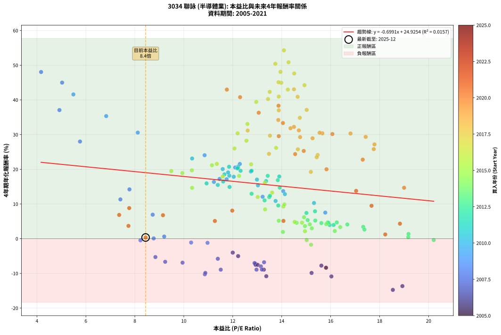
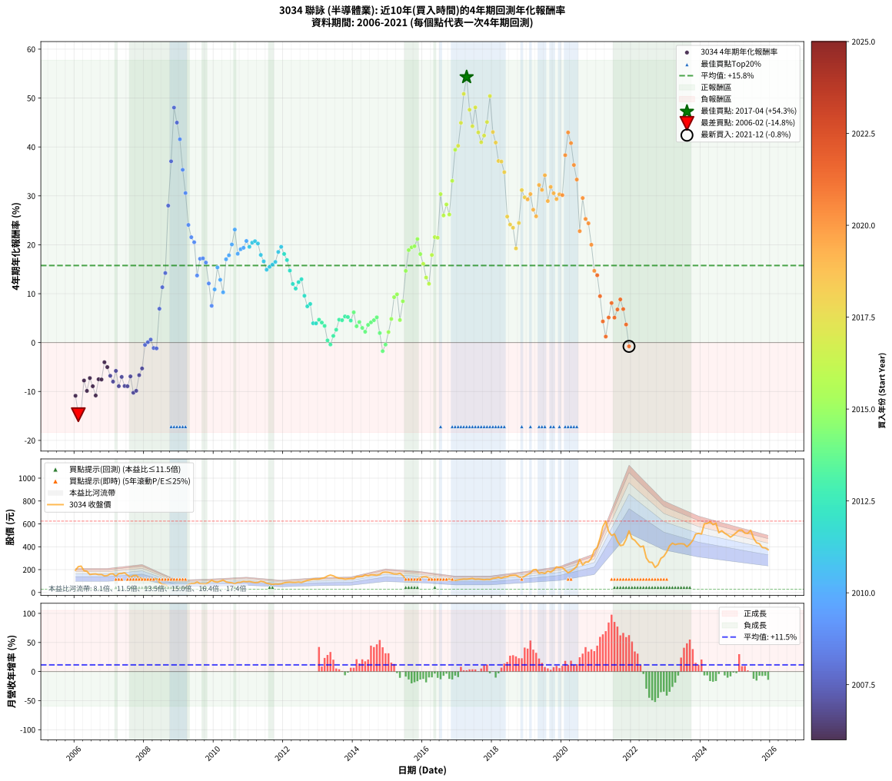

# 3034 聯詠 - 本益比與未來報酬率分析

!!! info "報告資訊"
    - **股票代號**: 3034
    - **公司名稱**: 聯詠
    - **產業別**: 半導體業
    - **分析期間**: 2006-2021 (192 個數據點)
    - **資料來源**: Type 12 (ShowMonthlyK_ChartFlow) 月收盤價與本益比
    - **報酬率口徑**: 含現金股利 (簡化: 年度合計，假設每年7/1入帳)
    - **報告生成時間**: 2026-01-11 18:48:55 CST

## 📈 視覺化圖表

### 圖表1: 本益比 vs 未來報酬率關係

*圖表1：3034 聯詠 本益比與4年期未來報酬率關係 (2006-2021)*

### 圖表2: 歷年買入時點的4年期實際報酬率

*圖表2：3034 聯詠 歷年買入時點的4年期實際報酬率 (2006-2021)*

## 📍 買點訊號說明

本報告提供兩種買點提示訊號（顯示於圖表2的股價子圖中）：

### ▲ 小綠色三角形（回測驗證）
- **計算方式**: 使用全部歷史資料計算本益比第25百分位數
- **用途**: 事後驗證，顯示歷史上哪些時點確實為低估區
- **限制**: 當下無法判斷，僅供回測參考
- **特性**: 後見之明（Look-Ahead Bias）

### ▲ 小橘色三角形（即時訊號）
- **計算方式**: 使用截至當月的過去5年資料計算本益比第25百分位數
- **用途**: 實際投資決策，當時即可判斷
- **優勢**: 可操作性強，符合實務需求
- **特性**: 無後見之明，滾動窗口計算

!!! tip "如何使用兩種訊號"
    - **綠色▲** 幫助理解歷史估值機會，驗證策略有效性
    - **橘色▲** 可作為實際買進參考，但仍需搭配基本面分析
    - 兩種訊號重疊時，表示即時判斷與事後驗證一致，信心度較高
    - 僅有綠色▲時，表示當時無法判斷（需要未來資料才能確認）
    - 僅有橘色▲時，表示即時判斷為買點，但事後可能不是最佳時機

## 📊 估值分析摘要

| 指標 | 數值 |
|:---:|:---:|
| **目前本益比** (2021-12) | **8.44 倍** |
| **歷史平均本益比** | 13.28 倍 |
| **估值水準** | 🟢 相對低估 |
| **預期4年年化報酬率** | **+19.02%** |
| **歷史平均報酬率** | +15.76% |
| **相關係數 (R²)** | 0.0147 |
| **趨勢線斜率** | -0.6743 |

!!! abstract "核心洞察"
    目前本益比顯著低於歷史平均，預期未來報酬率可能較高

    根據歷史數據回測，3034 聯詠 在目前本益比 **8.4倍** 的估值水準下，
    預期未來4年年化報酬率約為 **+19.0%**。

    **重要提醒**: 本分析基於歷史數據統計，實際報酬率會受到公司基本面變化、產業趨勢、
    總體經濟環境等多重因素影響。R² = 0.01 表示本益比可解釋約 1.5% 的報酬率變異。

## 📈 歷史估值統計

### 最佳買點 (最高報酬率)

| 項目 | 數值 |
|:---:|:---:|
| 起始時間 | 2017-04 |
| 當時本益比 | 14.09 倍 |
| 起始價格 | 116.0 元 |
| 4年後價格 | 624.0 元 |
| **4年年化報酬率** | **+54.29%** |

### 最差買點 (最低報酬率)

| 項目 | 數值 |
|:---:|:---:|
| 起始時間 | 2006-02 |
| 當時本益比 | 18.72 倍 |
| 起始價格 | 226.0 元 |
| 4年後價格 | 90.3 元 |
| **4年年化報酬率** | **-14.75%** |

## 🎯 投資啟示

### 本益比與報酬率關係

趨勢線方程式: **y = -0.6743x + 24.7102**

!!! warning "強負相關"
    本益比與未來報酬率呈現強負相關。在高本益比時期買入，未來報酬率顯著較低；
    在低本益比時期買入，未來報酬率顯著較高。**估值紀律至關重要**。

### 估值區間建議

基於歷史數據分析:

- **🟢 低估區** (P/E < 10.6): 預期報酬率較高，可考慮增加持股
- **🟡 合理區** (P/E 10.6-15.9): 預期報酬率符合長期趨勢，正常持有
- **🔴 高估區** (P/E > 15.9): 預期報酬率較低，可考慮減碼或觀望

!!! danger "風險提示"
    - 過去表現不代表未來結果
    - 本分析假設公司基本面無重大結構性變化
    - 產業環境劇變可能使歷史規律失效
    - 應結合公司財報、產業趨勢、總體經濟等多重因素綜合判斷

!!! success "長期投資觀點"
    歷史數據顯示，在合理或低估的估值水準買入並長期持有，
    往往能獲得較佳的投資報酬。**耐心等待好價格**是價值投資的核心原則。

## 📊 數據品質

- **資料來源**: GoodInfo.tw Type 12 (ShowMonthlyK_ChartFlow)
- **資料頻率**: 月度收盤價與本益比
- **回測期間**: 2006-2021
- **數據點數量**: 192 個 (每個點代表一次4年期回測)

### 計算方法說明

1. **4年期年化報酬率**:
   - 對每個歷史時點，計算其後4年的實際投資報酬率
   - 期末價值(不含股利): 期末價格
   - 期末價值(含現金股利): 期末價格 + 持有期間內的現金股利合計 (簡化: 年度合計，假設每年7/1入帳)
   - 公式: 年化報酬率 = [(期末價值/期初價格)^(1/年數) - 1] × 100%

2. **本益比 (P/E Ratio)**:
   - 使用當時的月收盤價與EPS計算
   - 資料來源: Type 12 月度河流圖本益比數據

3. **趨勢線 (Linear Regression)**:
   - 使用最小平方法擬合線性趨勢線
   - R²值衡量本益比對報酬率的解釋能力

---

*本報告由 Stock Analysis System v1.9.0 自動生成*
*數據更新時間: 2026-01-11 18:48:55 CST*

## 📋 月度回測明細表

（每一列對應時間線圖中的一個買入點；可用來對照 SVG 圖上的每個點。）

| 買入月份 | 賣出月份 | 回測期限_年 | 實際持有年數 | 買入本益比_倍 | 買入收盤價_元 | 賣出收盤價_元 | 現金股利合計_元 | 總報酬率_pct | 年化報酬率_pct |
| --- | --- | --- | --- | --- | --- | --- | --- | --- | --- |
| 2006-01 | 2010-01 | 4 | 4.000 | 16.20 | 195.50 | 94.30 | 29.05 | -36.90 | -10.88 |
| 2006-02 | 2010-02 | 4 | 4.000 | 18.72 | 226.00 | 90.30 | 29.05 | -47.19 | -14.75 |
| 2006-03 | 2010-03 | 4 | 4.000 | 19.10 | 230.50 | 99.00 | 29.05 | -44.45 | -13.67 |
| 2006-04 | 2010-04 | 4 | 4.000 | 15.74 | 190.00 | 108.50 | 29.05 | -27.60 | -7.76 |
| 2006-05 | 2010-05 | 4 | 4.000 | 15.33 | 185.00 | 93.00 | 29.05 | -34.03 | -9.88 |
| 2006-06 | 2010-06 | 4 | 4.000 | 13.01 | 157.00 | 87.10 | 29.05 | -26.02 | -7.26 |
| 2006-07 | 2010-07 | 4 | 4.000 | 13.34 | 161.00 | 84.70 | 26.06 | -31.21 | -8.93 |
| 2006-08 | 2010-08 | 4 | 4.000 | 13.42 | 162.00 | 76.40 | 26.06 | -36.75 | -10.82 |
| 2006-09 | 2010-09 | 4 | 4.000 | 12.97 | 156.50 | 88.50 | 26.06 | -26.80 | -7.50 |
| 2006-10 | 2010-10 | 4 | 4.000 | 13.05 | 157.50 | 89.00 | 26.06 | -26.95 | -7.55 |
| 2006-11 | 2010-11 | 4 | 4.000 | 12.01 | 145.00 | 97.00 | 26.06 | -15.13 | -4.02 |
| 2006-12 | 2010-12 | 4 | 4.000 | 12.22 | 147.50 | 94.00 | 26.06 | -18.60 | -5.02 |
| 2007-01 | 2011-01 | 4 | 4.000 | 13.28 | 162.50 | 96.60 | 26.06 | -24.52 | -6.79 |
| 2007-02 | 2011-02 | 4 | 4.000 | 13.15 | 163.00 | 90.80 | 26.06 | -28.31 | -7.98 |
| 2007-03 | 2011-03 | 4 | 4.000 | 11.39 | 143.00 | 86.60 | 26.06 | -21.22 | -5.79 |
| 2007-04 | 2011-04 | 4 | 4.000 | 12.97 | 165.00 | 87.50 | 26.06 | -31.18 | -8.92 |
| 2007-05 | 2011-05 | 4 | 4.000 | 12.89 | 166.00 | 98.00 | 26.06 | -25.27 | -7.02 |
| 2007-06 | 2011-06 | 4 | 4.000 | 13.19 | 172.00 | 92.50 | 26.06 | -31.07 | -8.88 |
| 2007-07 | 2011-07 | 4 | 4.000 | 11.51 | 152.00 | 80.70 | 23.86 | -31.21 | -8.93 |
| 2007-08 | 2011-08 | 4 | 4.000 | 9.95 | 133.00 | 76.00 | 23.86 | -24.92 | -6.91 |
| 2007-09 | 2011-09 | 4 | 4.000 | 10.86 | 147.00 | 71.50 | 23.86 | -35.13 | -10.26 |
| 2007-10 | 2011-10 | 4 | 4.000 | 10.88 | 149.00 | 74.50 | 23.86 | -33.99 | -9.86 |
| 2007-11 | 2011-11 | 4 | 4.000 | 9.24 | 128.00 | 73.30 | 23.86 | -24.10 | -6.66 |
| 2007-12 | 2011-12 | 4 | 4.000 | 8.84 | 124.00 | 75.90 | 23.86 | -19.55 | -5.29 |
| 2008-01 | 2012-01 | 4 | 4.000 | 8.23 | 110.00 | 84.10 | 23.86 | -1.86 | -0.47 |
| 2008-02 | 2012-02 | 4 | 4.000 | 8.77 | 111.50 | 88.00 | 23.86 | +0.32 | +0.08 |
| 2008-03 | 2012-03 | 4 | 4.000 | 9.20 | 111.00 | 89.90 | 23.86 | +2.48 | +0.62 |
| 2008-04 | 2012-04 | 4 | 4.000 | 10.30 | 117.50 | 88.50 | 23.86 | -4.38 | -1.11 |
| 2008-05 | 2012-05 | 4 | 4.000 | 10.97 | 118.00 | 88.60 | 23.86 | -4.70 | -1.20 |
| 2008-06 | 2012-06 | 4 | 4.000 | 8.73 | 88.20 | 91.40 | 23.86 | +30.68 | +6.92 |
| 2008-07 | 2012-07 | 4 | 4.000 | 7.41 | 70.00 | 87.60 | 19.90 | +53.57 | +11.32 |
| 2008-08 | 2012-08 | 4 | 4.000 | 7.78 | 68.40 | 96.50 | 19.90 | +70.17 | +14.21 |
| 2008-09 | 2012-09 | 4 | 4.000 | 5.76 | 46.90 | 106.00 | 19.90 | +168.43 | +28.00 |
| 2008-10 | 2012-10 | 4 | 4.000 | 4.92 | 36.80 | 110.00 | 19.90 | +252.98 | +37.07 |
| 2008-11 | 2012-11 | 4 | 4.000 | 4.17 | 28.50 | 117.00 | 19.90 | +380.34 | +48.04 |
| 2008-12 | 2012-12 | 4 | 4.000 | 5.03 | 31.10 | 117.50 | 19.90 | +341.79 | +44.98 |
| 2009-01 | 2013-01 | 4 | 4.000 | 5.49 | 34.20 | 117.50 | 19.90 | +301.74 | +41.58 |
| 2009-02 | 2013-02 | 4 | 4.000 | 6.83 | 42.90 | 124.00 | 19.90 | +235.42 | +35.33 |
| 2009-03 | 2013-03 | 4 | 4.000 | 8.12 | 51.40 | 129.50 | 19.90 | +190.65 | +30.57 |
| 2009-04 | 2013-04 | 4 | 4.000 | 10.85 | 69.20 | 144.00 | 19.90 | +136.84 | +24.06 |
| 2009-05 | 2013-05 | 4 | 4.000 | 12.29 | 79.00 | 152.50 | 19.90 | +118.22 | +21.54 |
| 2009-06 | 2013-06 | 4 | 4.000 | 12.10 | 78.40 | 145.50 | 19.90 | +110.96 | +20.52 |
| 2009-07 | 2013-07 | 4 | 4.000 | 14.06 | 91.80 | 132.50 | 20.99 | +67.20 | +13.71 |
| 2009-08 | 2013-08 | 4 | 4.000 | 11.75 | 77.30 | 124.50 | 20.99 | +88.21 | +17.13 |
| 2009-09 | 2013-09 | 4 | 4.000 | 11.46 | 76.00 | 122.50 | 20.99 | +88.80 | +17.22 |
| 2009-10 | 2013-10 | 4 | 4.000 | 11.23 | 75.00 | 116.50 | 20.99 | +83.32 | +16.36 |
| 2009-11 | 2013-11 | 4 | 4.000 | 13.22 | 89.00 | 119.50 | 20.99 | +57.85 | +12.09 |
| 2009-12 | 2013-12 | 4 | 4.000 | 15.78 | 107.00 | 122.00 | 20.99 | +33.63 | +7.52 |
| 2010-01 | 2014-01 | 4 | 4.000 | 13.75 | 94.30 | 121.50 | 20.99 | +51.10 | +10.87 |
| 2010-02 | 2014-02 | 4 | 4.000 | 13.03 | 90.30 | 139.00 | 20.99 | +77.17 | +15.37 |
| 2010-03 | 2014-03 | 4 | 4.000 | 14.13 | 99.00 | 139.50 | 20.99 | +62.11 | +12.84 |
| 2010-04 | 2014-04 | 4 | 4.000 | 15.32 | 108.50 | 139.50 | 20.99 | +47.92 | +10.28 |
| 2010-05 | 2014-05 | 4 | 4.000 | 12.99 | 93.00 | 153.50 | 20.99 | +87.62 | +17.04 |
| 2010-06 | 2014-06 | 4 | 4.000 | 12.04 | 87.10 | 147.00 | 20.99 | +92.87 | +17.85 |
| 2010-07 | 2014-07 | 4 | 4.000 | 11.59 | 84.70 | 154.00 | 21.99 | +107.78 | +20.06 |
| 2010-08 | 2014-08 | 4 | 4.000 | 10.34 | 76.40 | 153.50 | 21.99 | +129.70 | +23.11 |
| 2010-09 | 2014-09 | 4 | 4.000 | 11.86 | 88.50 | 150.50 | 21.99 | +94.90 | +18.16 |
| 2010-10 | 2014-10 | 4 | 4.000 | 11.81 | 89.00 | 157.00 | 21.99 | +101.11 | +19.09 |
| 2010-11 | 2014-11 | 4 | 4.000 | 12.74 | 97.00 | 175.00 | 21.99 | +103.08 | +19.38 |
| 2010-12 | 2014-12 | 4 | 4.000 | 12.22 | 94.00 | 178.00 | 21.99 | +112.76 | +20.77 |
| 2011-01 | 2015-01 | 4 | 4.000 | 12.77 | 96.60 | 175.50 | 21.99 | +104.44 | +19.58 |
| 2011-02 | 2015-02 | 4 | 4.000 | 12.21 | 90.80 | 169.00 | 21.99 | +110.34 | +20.43 |
| 2011-03 | 2015-03 | 4 | 4.000 | 11.85 | 86.60 | 162.00 | 21.99 | +112.46 | +20.73 |
| 2011-04 | 2015-04 | 4 | 4.000 | 12.19 | 87.50 | 161.00 | 21.99 | +109.13 | +20.26 |
| 2011-05 | 2015-05 | 4 | 4.000 | 13.90 | 98.00 | 167.50 | 21.99 | +93.36 | +17.92 |
| 2011-06 | 2015-06 | 4 | 4.000 | 13.36 | 92.50 | 149.00 | 21.99 | +84.85 | +16.60 |
| 2011-07 | 2015-07 | 4 | 4.000 | 11.87 | 80.70 | 114.50 | 26.19 | +74.34 | +14.91 |
| 2011-08 | 2015-08 | 4 | 4.000 | 11.39 | 76.00 | 109.00 | 26.19 | +77.88 | +15.49 |
| 2011-09 | 2015-09 | 4 | 4.000 | 10.93 | 71.50 | 103.00 | 26.19 | +80.69 | +15.94 |
| 2011-10 | 2015-10 | 4 | 4.000 | 11.61 | 74.50 | 111.00 | 26.19 | +84.15 | +16.49 |
| 2011-11 | 2015-11 | 4 | 4.000 | 11.66 | 73.30 | 118.50 | 26.19 | +97.40 | +18.53 |
| 2011-12 | 2015-12 | 4 | 4.000 | 12.32 | 75.90 | 129.00 | 26.19 | +104.47 | +19.58 |
| 2012-01 | 2016-01 | 4 | 4.000 | 13.43 | 84.10 | 137.50 | 26.19 | +94.64 | +18.12 |
| 2012-02 | 2016-02 | 4 | 4.000 | 13.84 | 88.00 | 138.00 | 26.19 | +86.58 | +16.87 |
| 2012-03 | 2016-03 | 4 | 4.000 | 13.92 | 89.90 | 129.50 | 26.19 | +73.18 | +14.72 |
| 2012-04 | 2016-04 | 4 | 4.000 | 13.49 | 88.50 | 113.00 | 26.19 | +57.28 | +11.99 |
| 2012-05 | 2016-05 | 4 | 4.000 | 13.30 | 88.60 | 108.50 | 26.19 | +52.02 | +11.04 |
| 2012-06 | 2016-06 | 4 | 4.000 | 13.52 | 91.40 | 119.50 | 26.19 | +59.40 | +12.36 |
| 2012-07 | 2016-07 | 4 | 4.000 | 12.77 | 87.60 | 112.00 | 30.59 | +62.78 | +12.95 |
| 2012-08 | 2016-08 | 4 | 4.000 | 13.86 | 96.50 | 108.50 | 30.59 | +44.14 | +9.57 |
| 2012-09 | 2016-09 | 4 | 4.000 | 15.01 | 106.00 | 110.50 | 30.59 | +33.11 | +7.41 |
| 2012-10 | 2016-10 | 4 | 4.000 | 15.36 | 110.00 | 118.50 | 30.59 | +35.54 | +7.90 |
| 2012-11 | 2016-11 | 4 | 4.000 | 16.12 | 117.00 | 106.00 | 30.59 | +16.75 | +3.95 |
| 2012-12 | 2016-12 | 4 | 4.000 | 15.96 | 117.50 | 106.50 | 30.59 | +16.67 | +3.93 |
| 2013-01 | 2017-01 | 4 | 4.000 | 15.88 | 117.50 | 110.50 | 30.59 | +20.08 | +4.68 |
| 2013-02 | 2017-02 | 4 | 4.000 | 16.68 | 124.00 | 115.00 | 30.59 | +17.41 | +4.09 |
| 2013-03 | 2017-03 | 4 | 4.000 | 17.33 | 129.50 | 117.50 | 30.59 | +14.36 | +3.41 |
| 2013-04 | 2017-04 | 4 | 4.000 | 19.17 | 144.00 | 116.00 | 30.59 | +1.80 | +0.45 |
| 2013-05 | 2017-05 | 4 | 4.000 | 20.21 | 152.50 | 119.50 | 30.59 | -1.58 | -0.40 |
| 2013-06 | 2017-06 | 4 | 4.000 | 19.18 | 145.50 | 123.00 | 30.59 | +5.56 | +1.36 |
| 2013-07 | 2017-07 | 4 | 4.000 | 17.38 | 132.50 | 115.00 | 32.00 | +10.94 | +2.63 |
| 2013-08 | 2017-08 | 4 | 4.000 | 16.25 | 124.50 | 117.50 | 32.00 | +20.08 | +4.68 |
| 2013-09 | 2017-09 | 4 | 4.000 | 15.91 | 122.50 | 114.50 | 32.00 | +19.59 | +4.57 |
| 2013-10 | 2017-10 | 4 | 4.000 | 15.06 | 116.50 | 111.50 | 32.00 | +23.18 | +5.35 |
| 2013-11 | 2017-11 | 4 | 4.000 | 15.37 | 119.50 | 114.50 | 32.00 | +22.59 | +5.22 |
| 2013-12 | 2017-12 | 4 | 4.000 | 15.62 | 122.00 | 113.50 | 32.00 | +19.26 | +4.50 |
| 2014-01 | 2018-01 | 4 | 4.000 | 14.91 | 121.50 | 122.50 | 32.00 | +27.16 | +6.19 |
| 2014-02 | 2018-02 | 4 | 4.000 | 16.39 | 139.00 | 126.50 | 32.00 | +14.03 | +3.34 |
| 2014-03 | 2018-03 | 4 | 4.000 | 15.82 | 139.50 | 132.50 | 32.00 | +17.92 | +4.21 |
| 2014-04 | 2018-04 | 4 | 4.000 | 15.23 | 139.50 | 125.00 | 32.00 | +12.54 | +3.00 |
| 2014-05 | 2018-05 | 4 | 4.000 | 16.17 | 153.50 | 135.50 | 32.00 | +9.12 | +2.21 |
| 2014-06 | 2018-06 | 4 | 4.000 | 14.95 | 147.00 | 137.50 | 32.00 | +15.31 | +3.62 |
| 2014-07 | 2018-07 | 4 | 4.000 | 15.15 | 154.00 | 148.00 | 33.10 | +17.60 | +4.14 |
| 2014-08 | 2018-08 | 4 | 4.000 | 14.61 | 153.50 | 150.50 | 33.10 | +19.61 | +4.58 |
| 2014-09 | 2018-09 | 4 | 4.000 | 13.88 | 150.50 | 151.00 | 33.10 | +22.33 | +5.17 |
| 2014-10 | 2018-10 | 4 | 4.000 | 14.05 | 157.00 | 136.50 | 33.10 | +8.03 | +1.95 |
| 2014-11 | 2018-11 | 4 | 4.000 | 15.20 | 175.00 | 130.00 | 33.10 | -6.80 | -1.75 |
| 2014-12 | 2018-12 | 4 | 4.000 | 15.02 | 178.00 | 142.00 | 33.10 | -1.63 | -0.41 |
| 2015-01 | 2019-01 | 4 | 4.000 | 14.95 | 175.50 | 158.00 | 33.10 | +8.89 | +2.15 |
| 2015-02 | 2019-02 | 4 | 4.000 | 14.53 | 169.00 | 171.00 | 33.10 | +20.77 | +4.83 |
| 2015-03 | 2019-03 | 4 | 4.000 | 14.07 | 162.00 | 198.00 | 33.10 | +42.65 | +9.29 |
| 2015-04 | 2019-04 | 4 | 4.000 | 14.11 | 161.00 | 201.50 | 33.10 | +45.71 | +9.87 |
| 2015-05 | 2019-05 | 4 | 4.000 | 14.83 | 167.50 | 167.50 | 33.10 | +19.76 | +4.61 |
| 2015-06 | 2019-06 | 4 | 4.000 | 13.32 | 149.00 | 173.00 | 33.10 | +38.32 | +8.45 |
| 2015-07 | 2019-07 | 4 | 4.000 | 10.34 | 114.50 | 166.00 | 31.90 | +72.84 | +14.66 |
| 2015-08 | 2019-08 | 4 | 4.000 | 9.94 | 109.00 | 186.00 | 31.90 | +99.91 | +18.91 |
| 2015-09 | 2019-09 | 4 | 4.000 | 9.49 | 103.00 | 178.00 | 31.90 | +103.79 | +19.48 |
| 2015-10 | 2019-10 | 4 | 4.000 | 10.33 | 111.00 | 196.00 | 31.90 | +105.32 | +19.70 |
| 2015-11 | 2019-11 | 4 | 4.000 | 11.15 | 118.50 | 223.50 | 31.90 | +115.53 | +21.16 |
| 2015-12 | 2019-12 | 4 | 4.000 | 12.26 | 129.00 | 219.00 | 31.90 | +94.50 | +18.09 |
| 2016-01 | 2020-01 | 4 | 4.000 | 13.31 | 137.50 | 218.00 | 31.90 | +81.75 | +16.11 |
| 2016-02 | 2020-02 | 4 | 4.000 | 13.61 | 138.00 | 195.50 | 31.90 | +64.78 | +13.30 |
| 2016-03 | 2020-03 | 4 | 4.000 | 13.02 | 129.50 | 172.00 | 31.90 | +57.45 | +12.02 |
| 2016-04 | 2020-04 | 4 | 4.000 | 11.59 | 113.00 | 186.50 | 31.90 | +93.27 | +17.91 |
| 2016-05 | 2020-05 | 4 | 4.000 | 11.35 | 108.50 | 205.00 | 31.90 | +118.34 | +21.56 |
| 2016-06 | 2020-06 | 4 | 4.000 | 12.75 | 119.50 | 228.00 | 31.90 | +117.49 | +21.44 |
| 2016-07 | 2020-07 | 4 | 4.000 | 12.20 | 112.00 | 290.00 | 33.40 | +188.75 | +30.36 |
| 2016-08 | 2020-08 | 4 | 4.000 | 12.07 | 108.50 | 240.00 | 33.40 | +151.98 | +25.99 |
| 2016-09 | 2020-09 | 4 | 4.000 | 12.56 | 110.50 | 265.50 | 33.40 | +170.50 | +28.25 |
| 2016-10 | 2020-10 | 4 | 4.000 | 13.77 | 118.50 | 267.00 | 33.40 | +153.50 | +26.18 |
| 2016-11 | 2020-11 | 4 | 4.000 | 12.60 | 106.00 | 299.00 | 33.40 | +213.58 | +33.07 |
| 2016-12 | 2020-12 | 4 | 4.000 | 12.96 | 106.50 | 369.00 | 33.40 | +277.84 | +39.42 |
| 2017-01 | 2021-01 | 4 | 4.000 | 13.44 | 110.50 | 394.00 | 33.40 | +286.79 | +40.24 |
| 2017-02 | 2021-02 | 4 | 4.000 | 13.98 | 115.00 | 474.00 | 33.40 | +341.22 | +44.93 |
| 2017-03 | 2021-03 | 4 | 4.000 | 14.28 | 117.50 | 575.00 | 33.40 | +417.79 | +50.85 |
| 2017-04 | 2021-04 | 4 | 4.000 | 14.09 | 116.00 | 624.00 | 33.40 | +466.72 | +54.29 |
| 2017-05 | 2021-05 | 4 | 4.000 | 14.51 | 119.50 | 534.00 | 33.40 | +374.81 | +47.61 |
| 2017-06 | 2021-06 | 4 | 4.000 | 14.93 | 123.00 | 499.00 | 33.40 | +332.85 | +44.24 |
| 2017-07 | 2021-07 | 4 | 4.000 | 13.95 | 115.00 | 511.00 | 42.00 | +380.87 | +48.08 |
| 2017-08 | 2021-08 | 4 | 4.000 | 14.25 | 117.50 | 449.00 | 42.00 | +317.87 | +42.98 |
| 2017-09 | 2021-09 | 4 | 4.000 | 13.88 | 114.50 | 410.00 | 42.00 | +294.76 | +40.96 |
| 2017-10 | 2021-10 | 4 | 4.000 | 13.51 | 111.50 | 415.50 | 42.00 | +310.31 | +42.32 |
| 2017-11 | 2021-11 | 4 | 4.000 | 13.87 | 114.50 | 465.50 | 42.00 | +343.23 | +45.10 |
| 2017-12 | 2021-12 | 4 | 4.000 | 13.74 | 113.50 | 539.00 | 42.00 | +411.89 | +50.42 |
| 2018-01 | 2022-01 | 4 | 4.000 | 14.50 | 122.50 | 471.00 | 42.00 | +318.78 | +43.05 |
| 2018-02 | 2022-02 | 4 | 4.000 | 14.65 | 126.50 | 456.50 | 42.00 | +294.07 | +40.89 |
| 2018-03 | 2022-03 | 4 | 4.000 | 15.02 | 132.50 | 426.50 | 42.00 | +253.58 | +37.13 |
| 2018-04 | 2022-04 | 4 | 4.000 | 13.88 | 125.00 | 398.50 | 42.00 | +252.40 | +37.01 |
| 2018-05 | 2022-05 | 4 | 4.000 | 14.74 | 135.50 | 406.00 | 42.00 | +230.63 | +34.84 |
| 2018-06 | 2022-06 | 4 | 4.000 | 14.66 | 137.50 | 302.00 | 42.00 | +150.18 | +25.77 |
| 2018-07 | 2022-07 | 4 | 4.000 | 15.47 | 148.00 | 265.00 | 86.40 | +137.43 | +24.13 |
| 2018-08 | 2022-08 | 4 | 4.000 | 15.43 | 150.50 | 263.50 | 86.40 | +132.49 | +23.48 |
| 2018-09 | 2022-09 | 4 | 4.000 | 15.19 | 151.00 | 219.00 | 86.40 | +102.25 | +19.25 |
| 2018-10 | 2022-10 | 4 | 4.000 | 13.48 | 136.50 | 241.00 | 86.40 | +139.85 | +24.45 |
| 2018-11 | 2022-11 | 4 | 4.000 | 12.61 | 130.00 | 298.50 | 86.40 | +196.08 | +31.18 |
| 2018-12 | 2022-12 | 4 | 4.000 | 13.52 | 142.00 | 315.50 | 86.40 | +183.03 | +29.71 |
| 2019-01 | 2023-01 | 4 | 4.000 | 14.75 | 158.00 | 355.00 | 86.40 | +179.37 | +29.28 |
| 2019-02 | 2023-02 | 4 | 4.000 | 15.66 | 171.00 | 407.50 | 86.40 | +188.83 | +30.36 |
| 2019-03 | 2023-03 | 4 | 4.000 | 17.79 | 198.00 | 431.50 | 86.40 | +161.57 | +27.17 |
| 2019-04 | 2023-04 | 4 | 4.000 | 17.76 | 201.50 | 418.50 | 86.40 | +150.57 | +25.82 |
| 2019-05 | 2023-05 | 4 | 4.000 | 14.50 | 167.50 | 425.50 | 86.40 | +205.61 | +32.22 |
| 2019-06 | 2023-06 | 4 | 4.000 | 14.70 | 173.00 | 426.50 | 86.40 | +196.47 | +31.22 |
| 2019-07 | 2023-07 | 4 | 4.000 | 13.86 | 166.00 | 424.00 | 114.60 | +224.46 | +34.21 |
| 2019-08 | 2023-08 | 4 | 4.000 | 15.26 | 186.00 | 399.50 | 114.60 | +176.40 | +28.94 |
| 2019-09 | 2023-09 | 4 | 4.000 | 14.36 | 178.00 | 423.00 | 114.60 | +202.02 | +31.83 |
| 2019-10 | 2023-10 | 4 | 4.000 | 15.55 | 196.00 | 454.50 | 114.60 | +190.36 | +30.54 |
| 2019-11 | 2023-11 | 4 | 4.000 | 17.43 | 223.50 | 511.00 | 114.60 | +179.91 | +29.35 |
| 2019-12 | 2023-12 | 4 | 4.000 | 16.81 | 219.00 | 517.00 | 114.60 | +188.40 | +30.32 |
| 2020-01 | 2024-01 | 4 | 4.000 | 16.07 | 218.00 | 511.00 | 114.60 | +186.97 | +30.15 |
| 2020-02 | 2024-02 | 4 | 4.000 | 13.87 | 195.50 | 601.00 | 114.60 | +266.04 | +38.32 |
| 2020-03 | 2024-03 | 4 | 4.000 | 11.76 | 172.00 | 604.00 | 114.60 | +317.79 | +42.97 |
| 2020-04 | 2024-04 | 4 | 4.000 | 12.30 | 186.50 | 618.00 | 114.60 | +292.82 | +40.78 |
| 2020-05 | 2024-05 | 4 | 4.000 | 13.06 | 205.00 | 593.00 | 114.60 | +245.17 | +36.30 |
| 2020-06 | 2024-06 | 4 | 4.000 | 14.05 | 228.00 | 606.00 | 114.60 | +216.05 | +33.33 |
| 2020-07 | 2024-07 | 4 | 4.000 | 17.31 | 290.00 | 523.00 | 136.10 | +127.28 | +22.78 |
| 2020-08 | 2024-08 | 4 | 4.000 | 13.88 | 240.00 | 540.00 | 136.10 | +181.71 | +29.55 |
| 2020-09 | 2024-09 | 4 | 4.000 | 14.90 | 265.50 | 518.00 | 136.10 | +146.37 | +25.28 |
| 2020-10 | 2024-10 | 4 | 4.000 | 14.55 | 267.00 | 503.00 | 136.10 | +139.36 | +24.38 |
| 2020-11 | 2024-11 | 4 | 4.000 | 15.83 | 299.00 | 484.00 | 136.10 | +107.39 | +20.00 |
| 2020-12 | 2024-12 | 4 | 4.000 | 19.00 | 369.00 | 502.00 | 136.10 | +72.93 | +14.67 |
| 2021-01 | 2025-01 | 4 | 4.000 | 17.04 | 394.00 | 524.00 | 136.10 | +67.54 | +13.77 |
| 2021-02 | 2025-02 | 4 | 4.000 | 17.67 | 474.00 | 545.00 | 136.10 | +43.69 | +9.49 |
| 2021-03 | 2025-03 | 4 | 4.000 | 18.83 | 575.00 | 545.00 | 136.10 | +18.45 | +4.32 |
| 2021-04 | 2025-04 | 4 | 4.000 | 18.23 | 624.00 | 519.00 | 136.10 | +4.98 | +1.22 |
| 2021-05 | 2025-05 | 4 | 4.000 | 14.07 | 534.00 | 516.00 | 136.10 | +22.12 | +5.12 |
| 2021-06 | 2025-06 | 4 | 4.000 | 11.98 | 499.00 | 545.00 | 136.10 | +36.49 | +8.09 |
| 2021-07 | 2025-07 | 4 | 4.000 | 11.27 | 511.00 | 475.00 | 148.50 | +22.02 | +5.10 |
| 2021-08 | 2025-08 | 4 | 4.000 | 9.15 | 449.00 | 435.00 | 148.50 | +29.96 | +6.77 |
| 2021-09 | 2025-09 | 4 | 4.000 | 7.77 | 410.00 | 426.50 | 148.50 | +40.24 | +8.82 |
| 2021-10 | 2025-10 | 4 | 4.000 | 7.36 | 415.50 | 393.00 | 148.50 | +30.32 | +6.85 |
| 2021-11 | 2025-11 | 4 | 4.000 | 7.74 | 465.50 | 389.50 | 148.50 | +15.57 | +3.68 |
| 2021-12 | 2025-12 | 4 | 4.000 | 8.44 | 539.00 | 374.00 | 148.50 | -3.06 | -0.77 |
