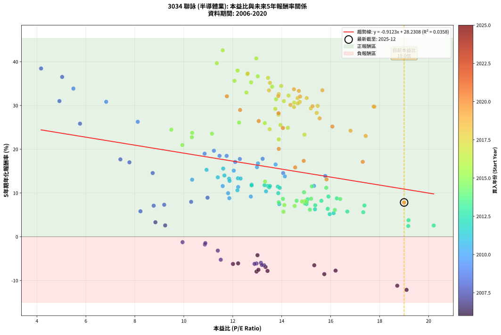
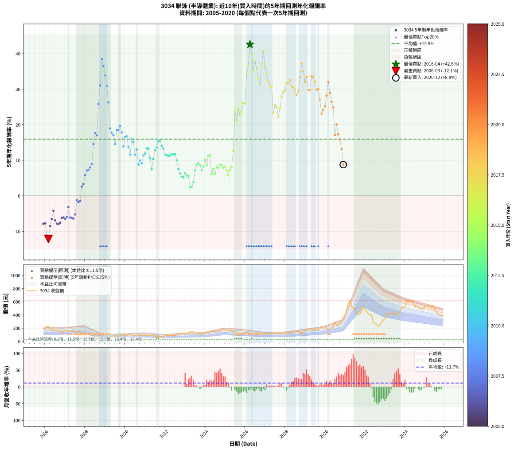

# 3034 聯詠 - 本益比與未來報酬率分析

!!! info "報告資訊"
    - **股票代號**: 3034
    - **公司名稱**: 聯詠
    - **產業別**: 半導體業
    - **分析期間**: 2006-2020 (180 個數據點)
    - **資料來源**: Type 12 (ShowMonthlyK_ChartFlow) 月收盤價與本益比
    - **報酬率口徑**: 含現金股利 (簡化: 年度合計，假設每年7/1入帳)
    - **報告生成時間**: 2026-01-11 20:59:44 CST

## 📈 視覺化圖表

### 圖表1: 本益比 vs 未來報酬率關係

*圖表1：3034 聯詠 本益比與5年期未來報酬率關係 (2006-2020)*

### 圖表2: 歷年買入時點的5年期實際報酬率

*圖表2：3034 聯詠 歷年買入時點的5年期實際報酬率 (2006-2020)*

## 📍 買點訊號說明

本報告提供兩種買點提示訊號（顯示於圖表2的股價子圖中）：

### ▲ 小綠色三角形（回測驗證）
- **計算方式**: 使用全部歷史資料計算本益比第25百分位數
- **用途**: 事後驗證，顯示歷史上哪些時點確實為低估區
- **限制**: 當下無法判斷，僅供回測參考
- **特性**: 後見之明（Look-Ahead Bias）

### ▲ 小橘色三角形（即時訊號）
- **計算方式**: 使用截至當月的過去5年資料計算本益比第25百分位數
- **用途**: 實際投資決策，當時即可判斷
- **優勢**: 可操作性強，符合實務需求
- **特性**: 無後見之明，滾動窗口計算

!!! tip "如何使用兩種訊號"
    - **綠色▲** 幫助理解歷史估值機會，驗證策略有效性
    - **橘色▲** 可作為實際買進參考，但仍需搭配基本面分析
    - 兩種訊號重疊時，表示即時判斷與事後驗證一致，信心度較高
    - 僅有綠色▲時，表示當時無法判斷（需要未來資料才能確認）
    - 僅有橘色▲時，表示即時判斷為買點，但事後可能不是最佳時機

## 📊 估值分析摘要

| 指標 | 數值 |
|:---:|:---:|
| **目前本益比** (2020-12) | **19.00 倍** |
| **歷史平均本益比** | 13.33 倍 |
| **估值水準** | 🔴 相對高估 |
| **預期5年年化報酬率** | **+10.90%** |
| **歷史平均報酬率** | +16.07% |
| **相關係數 (R²)** | 0.0358 |
| **趨勢線斜率** | -0.9123 |

!!! abstract "核心洞察"
    目前本益比顯著高於歷史平均，預期未來報酬率可能較低

    根據歷史數據回測，3034 聯詠 在目前本益比 **19.0倍** 的估值水準下，
    預期未來5年年化報酬率約為 **+10.9%**。

    **重要提醒**: 本分析基於歷史數據統計，實際報酬率會受到公司基本面變化、產業趨勢、
    總體經濟環境等多重因素影響。R² = 0.04 表示本益比可解釋約 3.6% 的報酬率變異。

## 📈 歷史估值統計

### 最佳買點 (最高報酬率)

| 項目 | 數值 |
|:---:|:---:|
| 起始時間 | 2016-04 |
| 當時本益比 | 11.59 倍 |
| 起始價格 | 113.0 元 |
| 5年後價格 | 624.0 元 |
| **5年年化報酬率** | **+42.61%** |

### 最差買點 (最低報酬率)

| 項目 | 數值 |
|:---:|:---:|
| 起始時間 | 2006-03 |
| 當時本益比 | 19.10 倍 |
| 起始價格 | 230.5 元 |
| 5年後價格 | 86.6 元 |
| **5年年化報酬率** | **-12.15%** |

## 🎯 投資啟示

### 本益比與報酬率關係

趨勢線方程式: **y = -0.9123x + 28.2308**

!!! warning "強負相關"
    本益比與未來報酬率呈現強負相關。在高本益比時期買入，未來報酬率顯著較低；
    在低本益比時期買入，未來報酬率顯著較高。**估值紀律至關重要**。

### 估值區間建議

基於歷史數據分析:

- **🟢 低估區** (P/E < 10.7): 預期報酬率較高，可考慮增加持股
- **🟡 合理區** (P/E 10.7-16.0): 預期報酬率符合長期趨勢，正常持有
- **🔴 高估區** (P/E > 16.0): 預期報酬率較低，可考慮減碼或觀望

!!! danger "風險提示"
    - 過去表現不代表未來結果
    - 本分析假設公司基本面無重大結構性變化
    - 產業環境劇變可能使歷史規律失效
    - 應結合公司財報、產業趨勢、總體經濟等多重因素綜合判斷

!!! success "長期投資觀點"
    歷史數據顯示，在合理或低估的估值水準買入並長期持有，
    往往能獲得較佳的投資報酬。**耐心等待好價格**是價值投資的核心原則。

## 📊 數據品質

- **資料來源**: GoodInfo.tw Type 12 (ShowMonthlyK_ChartFlow)
- **資料頻率**: 月度收盤價與本益比
- **回測期間**: 2006-2020
- **數據點數量**: 180 個 (每個點代表一次5年期回測)

### 計算方法說明

1. **5年期年化報酬率**:
   - 對每個歷史時點，計算其後5年的實際投資報酬率
   - 期末價值(不含股利): 期末價格
   - 期末價值(含現金股利): 期末價格 + 持有期間內的現金股利合計 (簡化: 年度合計，假設每年7/1入帳)
   - 公式: 年化報酬率 = [(期末價值/期初價格)^(1/年數) - 1] × 100%

2. **本益比 (P/E Ratio)**:
   - 使用當時的月收盤價與EPS計算
   - 資料來源: Type 12 月度河流圖本益比數據

3. **趨勢線 (Linear Regression)**:
   - 使用最小平方法擬合線性趨勢線
   - R²值衡量本益比對報酬率的解釋能力

---

*本報告由 Stock Analysis System v1.9.0 自動生成*
*數據更新時間: 2026-01-11 20:59:44 CST*

## 📋 月度回測明細表

（每一列對應時間線圖中的一個買入點；可用來對照 SVG 圖上的每個點。）

| 買入月份 | 賣出月份 | 回測期限_年 | 實際持有年數 | 買入本益比_倍 | 買入收盤價_元 | 賣出收盤價_元 | 現金股利合計_元 | 總報酬率_pct | 年化報酬率_pct |
| --- | --- | --- | --- | --- | --- | --- | --- | --- | --- |
| 2006-01 | 2011-01 | 5 | 4.999 | 16.20 | 195.50 | 96.60 | 34.05 | -33.17 | -7.75 |
| 2006-02 | 2011-02 | 5 | 4.999 | 18.72 | 226.00 | 90.80 | 34.05 | -44.76 | -11.19 |
| 2006-03 | 2011-03 | 5 | 4.999 | 19.10 | 230.50 | 86.60 | 34.05 | -47.66 | -12.15 |
| 2006-04 | 2011-04 | 5 | 4.999 | 15.74 | 190.00 | 87.50 | 34.05 | -36.03 | -8.55 |
| 2006-05 | 2011-05 | 5 | 4.999 | 15.33 | 185.00 | 98.00 | 34.05 | -28.62 | -6.52 |
| 2006-06 | 2011-06 | 5 | 4.999 | 13.01 | 157.00 | 92.50 | 34.05 | -19.39 | -4.22 |
| 2006-07 | 2011-07 | 5 | 4.999 | 13.34 | 161.00 | 80.70 | 31.86 | -30.09 | -6.91 |
| 2006-08 | 2011-08 | 5 | 4.999 | 13.42 | 162.00 | 76.00 | 31.86 | -33.42 | -7.81 |
| 2006-09 | 2011-09 | 5 | 4.999 | 12.97 | 156.50 | 71.50 | 31.86 | -33.96 | -7.96 |
| 2006-10 | 2011-10 | 5 | 4.999 | 13.05 | 157.50 | 74.50 | 31.86 | -32.47 | -7.55 |
| 2006-11 | 2011-11 | 5 | 4.999 | 12.01 | 145.00 | 73.30 | 31.86 | -27.48 | -6.22 |
| 2006-12 | 2011-12 | 5 | 4.999 | 12.22 | 147.50 | 75.90 | 31.86 | -26.95 | -6.09 |
| 2007-01 | 2012-01 | 5 | 4.999 | 13.28 | 162.50 | 84.10 | 31.86 | -28.64 | -6.53 |
| 2007-02 | 2012-02 | 5 | 4.999 | 13.15 | 163.00 | 88.00 | 31.86 | -26.47 | -5.96 |
| 2007-03 | 2012-03 | 5 | 5.002 | 11.39 | 143.00 | 89.90 | 31.86 | -14.86 | -3.16 |
| 2007-04 | 2012-04 | 5 | 5.002 | 12.97 | 165.00 | 88.50 | 31.86 | -27.06 | -6.11 |
| 2007-05 | 2012-05 | 5 | 5.002 | 12.89 | 166.00 | 88.60 | 31.86 | -27.44 | -6.21 |
| 2007-06 | 2012-06 | 5 | 5.002 | 13.19 | 172.00 | 91.40 | 31.86 | -28.34 | -6.44 |
| 2007-07 | 2012-07 | 5 | 5.002 | 11.51 | 152.00 | 87.60 | 28.46 | -23.65 | -5.25 |
| 2007-08 | 2012-08 | 5 | 5.002 | 9.95 | 133.00 | 96.50 | 28.46 | -6.05 | -1.24 |
| 2007-09 | 2012-09 | 5 | 5.002 | 10.86 | 147.00 | 106.00 | 28.46 | -8.53 | -1.77 |
| 2007-10 | 2012-10 | 5 | 5.002 | 10.88 | 149.00 | 110.00 | 28.46 | -7.08 | -1.46 |
| 2007-11 | 2012-11 | 5 | 5.002 | 9.24 | 128.00 | 117.00 | 28.46 | +13.64 | +2.59 |
| 2007-12 | 2012-12 | 5 | 5.002 | 8.84 | 124.00 | 117.50 | 28.46 | +17.71 | +3.31 |
| 2008-01 | 2013-01 | 5 | 5.002 | 8.23 | 110.00 | 117.50 | 28.46 | +32.69 | +5.82 |
| 2008-02 | 2013-03 | 5 | 5.081 | 8.77 | 111.50 | 129.50 | 28.46 | +41.66 | +7.09 |
| 2008-03 | 2013-03 | 5 | 4.999 | 9.20 | 111.00 | 129.50 | 28.46 | +42.30 | +7.31 |
| 2008-04 | 2013-04 | 5 | 4.999 | 10.30 | 117.50 | 144.00 | 28.46 | +46.77 | +7.98 |
| 2008-05 | 2013-05 | 5 | 4.999 | 10.97 | 118.00 | 152.50 | 28.46 | +53.35 | +8.93 |
| 2008-06 | 2013-06 | 5 | 4.999 | 8.73 | 88.20 | 145.50 | 28.46 | +97.23 | +14.55 |
| 2008-07 | 2013-07 | 5 | 4.999 | 7.41 | 70.00 | 132.50 | 25.49 | +125.70 | +17.68 |
| 2008-08 | 2013-08 | 5 | 4.999 | 7.78 | 68.40 | 124.50 | 25.49 | +119.28 | +17.01 |
| 2008-09 | 2013-09 | 5 | 4.999 | 5.76 | 46.90 | 122.50 | 25.49 | +215.54 | +25.84 |
| 2008-10 | 2013-10 | 5 | 4.999 | 4.92 | 36.80 | 116.50 | 25.49 | +285.84 | +31.01 |
| 2008-11 | 2013-11 | 5 | 4.999 | 4.17 | 28.50 | 119.50 | 25.49 | +408.73 | +38.46 |
| 2008-12 | 2013-12 | 5 | 4.999 | 5.03 | 31.10 | 122.00 | 25.49 | +374.24 | +36.53 |
| 2009-01 | 2014-01 | 5 | 4.999 | 5.49 | 34.20 | 121.50 | 25.49 | +329.79 | +33.87 |
| 2009-02 | 2014-02 | 5 | 4.999 | 6.83 | 42.90 | 139.00 | 25.49 | +283.42 | +30.84 |
| 2009-03 | 2014-03 | 5 | 4.999 | 8.12 | 51.40 | 139.50 | 25.49 | +220.99 | +26.27 |
| 2009-04 | 2014-04 | 5 | 4.999 | 10.85 | 69.20 | 139.50 | 25.49 | +138.42 | +18.98 |
| 2009-05 | 2014-05 | 5 | 4.999 | 12.29 | 79.00 | 153.50 | 25.49 | +126.57 | +17.77 |
| 2009-06 | 2014-06 | 5 | 4.999 | 12.10 | 78.40 | 147.00 | 25.49 | +120.01 | +17.08 |
| 2009-07 | 2014-07 | 5 | 4.999 | 14.06 | 91.80 | 154.00 | 26.99 | +97.16 | +14.54 |
| 2009-08 | 2014-08 | 5 | 4.999 | 11.75 | 77.30 | 153.50 | 26.99 | +133.49 | +18.49 |
| 2009-09 | 2014-09 | 5 | 4.999 | 11.46 | 76.00 | 150.50 | 26.99 | +133.54 | +18.49 |
| 2009-10 | 2014-10 | 5 | 4.999 | 11.23 | 75.00 | 157.00 | 26.99 | +145.32 | +19.66 |
| 2009-11 | 2014-11 | 5 | 4.999 | 13.22 | 89.00 | 175.00 | 26.99 | +126.95 | +17.81 |
| 2009-12 | 2014-12 | 5 | 4.999 | 15.78 | 107.00 | 178.00 | 26.99 | +91.58 | +13.89 |
| 2010-01 | 2015-01 | 5 | 4.999 | 13.75 | 94.30 | 175.50 | 26.99 | +114.73 | +16.52 |
| 2010-02 | 2015-02 | 5 | 4.999 | 13.03 | 90.30 | 169.00 | 26.99 | +117.04 | +16.77 |
| 2010-03 | 2015-03 | 5 | 4.999 | 14.13 | 99.00 | 162.00 | 26.99 | +90.90 | +13.81 |
| 2010-04 | 2015-04 | 5 | 4.999 | 15.32 | 108.50 | 161.00 | 26.99 | +73.26 | +11.62 |
| 2010-05 | 2015-05 | 5 | 4.999 | 12.99 | 93.00 | 167.50 | 26.99 | +109.13 | +15.90 |
| 2010-06 | 2015-06 | 5 | 4.999 | 12.04 | 87.10 | 149.00 | 26.99 | +102.05 | +15.11 |
| 2010-07 | 2015-07 | 5 | 4.999 | 11.59 | 84.70 | 114.50 | 31.99 | +72.95 | +11.58 |
| 2010-08 | 2015-08 | 5 | 4.999 | 10.34 | 76.40 | 109.00 | 31.99 | +84.54 | +13.04 |
| 2010-09 | 2015-09 | 5 | 4.999 | 11.86 | 88.50 | 103.00 | 31.99 | +52.53 | +8.81 |
| 2010-10 | 2015-10 | 5 | 4.999 | 11.81 | 89.00 | 111.00 | 31.99 | +60.66 | +9.95 |
| 2010-11 | 2015-11 | 5 | 4.999 | 12.74 | 97.00 | 118.50 | 31.99 | +55.14 | +9.18 |
| 2010-12 | 2015-12 | 5 | 4.999 | 12.22 | 94.00 | 129.00 | 31.99 | +71.27 | +11.36 |
| 2011-01 | 2016-01 | 5 | 4.999 | 12.77 | 96.60 | 137.50 | 31.99 | +75.46 | +11.90 |
| 2011-02 | 2016-02 | 5 | 4.999 | 12.21 | 90.80 | 138.00 | 31.99 | +87.21 | +13.36 |
| 2011-03 | 2016-03 | 5 | 5.002 | 11.85 | 86.60 | 129.50 | 31.99 | +86.48 | +13.27 |
| 2011-04 | 2016-04 | 5 | 5.002 | 12.19 | 87.50 | 113.00 | 31.99 | +65.70 | +10.62 |
| 2011-05 | 2016-05 | 5 | 5.002 | 13.90 | 98.00 | 108.50 | 31.99 | +43.36 | +7.47 |
| 2011-06 | 2016-06 | 5 | 5.002 | 13.36 | 92.50 | 119.50 | 31.99 | +63.77 | +10.36 |
| 2011-07 | 2016-07 | 5 | 5.002 | 11.87 | 80.70 | 112.00 | 35.19 | +82.39 | +12.77 |
| 2011-08 | 2016-08 | 5 | 5.002 | 11.39 | 76.00 | 108.50 | 35.19 | +89.07 | +13.58 |
| 2011-09 | 2016-09 | 5 | 5.002 | 10.93 | 71.50 | 110.50 | 35.19 | +103.77 | +15.29 |
| 2011-10 | 2016-10 | 5 | 5.002 | 11.61 | 74.50 | 118.50 | 35.19 | +106.30 | +15.58 |
| 2011-11 | 2016-11 | 5 | 5.002 | 11.66 | 73.30 | 106.00 | 35.19 | +92.62 | +14.00 |
| 2011-12 | 2016-12 | 5 | 5.002 | 12.32 | 75.90 | 106.50 | 35.19 | +86.68 | +13.29 |
| 2012-01 | 2017-01 | 5 | 5.002 | 13.43 | 84.10 | 110.50 | 35.19 | +73.24 | +11.61 |
| 2012-02 | 2017-03 | 5 | 5.081 | 13.84 | 88.00 | 117.50 | 35.19 | +73.51 | +11.45 |
| 2012-03 | 2017-03 | 5 | 4.999 | 13.92 | 89.90 | 117.50 | 35.19 | +69.85 | +11.18 |
| 2012-04 | 2017-04 | 5 | 4.999 | 13.49 | 88.50 | 116.00 | 35.19 | +70.84 | +11.31 |
| 2012-05 | 2017-05 | 5 | 4.999 | 13.30 | 88.60 | 119.50 | 35.19 | +74.60 | +11.79 |
| 2012-06 | 2017-06 | 5 | 4.999 | 13.52 | 91.40 | 123.00 | 35.19 | +73.08 | +11.60 |
| 2012-07 | 2017-07 | 5 | 4.999 | 12.77 | 87.60 | 115.00 | 37.59 | +74.19 | +11.74 |
| 2012-08 | 2017-08 | 5 | 4.999 | 13.86 | 96.50 | 117.50 | 37.59 | +60.72 | +9.96 |
| 2012-09 | 2017-09 | 5 | 4.999 | 15.01 | 106.00 | 114.50 | 37.59 | +43.48 | +7.49 |
| 2012-10 | 2017-10 | 5 | 4.999 | 15.36 | 110.00 | 111.50 | 37.59 | +35.54 | +6.27 |
| 2012-11 | 2017-11 | 5 | 4.999 | 16.12 | 117.00 | 114.50 | 37.59 | +29.99 | +5.39 |
| 2012-12 | 2017-12 | 5 | 4.999 | 15.96 | 117.50 | 113.50 | 37.59 | +28.59 | +5.16 |
| 2013-01 | 2018-01 | 5 | 4.999 | 15.88 | 117.50 | 122.50 | 37.59 | +36.25 | +6.38 |
| 2013-02 | 2018-02 | 5 | 4.999 | 16.68 | 124.00 | 126.50 | 37.59 | +32.33 | +5.76 |
| 2013-03 | 2018-03 | 5 | 4.999 | 17.33 | 129.50 | 132.50 | 37.59 | +31.35 | +5.61 |
| 2013-04 | 2018-04 | 5 | 4.999 | 19.17 | 144.00 | 125.00 | 37.59 | +12.91 | +2.46 |
| 2013-05 | 2018-05 | 5 | 4.999 | 20.21 | 152.50 | 135.50 | 37.59 | +13.50 | +2.57 |
| 2013-06 | 2018-06 | 5 | 4.999 | 19.18 | 145.50 | 137.50 | 37.59 | +20.34 | +3.77 |
| 2013-07 | 2018-07 | 5 | 4.999 | 17.38 | 132.50 | 148.00 | 39.10 | +41.21 | +7.15 |
| 2013-08 | 2018-08 | 5 | 4.999 | 16.25 | 124.50 | 150.50 | 39.10 | +52.29 | +8.78 |
| 2013-09 | 2018-09 | 5 | 4.999 | 15.91 | 122.50 | 151.00 | 39.10 | +55.18 | +9.19 |
| 2013-10 | 2018-10 | 5 | 4.999 | 15.06 | 116.50 | 136.50 | 39.10 | +50.73 | +8.55 |
| 2013-11 | 2018-11 | 5 | 4.999 | 15.37 | 119.50 | 130.00 | 39.10 | +41.51 | +7.19 |
| 2013-12 | 2018-12 | 5 | 4.999 | 15.62 | 122.00 | 142.00 | 39.10 | +48.44 | +8.22 |
| 2014-01 | 2019-01 | 5 | 4.999 | 14.91 | 121.50 | 158.00 | 39.10 | +62.22 | +10.16 |
| 2014-02 | 2019-02 | 5 | 4.999 | 16.39 | 139.00 | 171.00 | 39.10 | +51.15 | +8.61 |
| 2014-03 | 2019-03 | 5 | 4.999 | 15.82 | 139.50 | 198.00 | 39.10 | +69.96 | +11.19 |
| 2014-04 | 2019-04 | 5 | 4.999 | 15.23 | 139.50 | 201.50 | 39.10 | +72.47 | +11.52 |
| 2014-05 | 2019-05 | 5 | 4.999 | 16.17 | 153.50 | 167.50 | 39.10 | +34.59 | +6.12 |
| 2014-06 | 2019-06 | 5 | 4.999 | 14.95 | 147.00 | 173.00 | 39.10 | +44.29 | +7.61 |
| 2014-07 | 2019-07 | 5 | 4.999 | 15.15 | 154.00 | 166.00 | 41.90 | +35.00 | +6.19 |
| 2014-08 | 2019-08 | 5 | 4.999 | 14.61 | 153.50 | 186.00 | 41.90 | +48.47 | +8.23 |
| 2014-09 | 2019-09 | 5 | 4.999 | 13.88 | 150.50 | 178.00 | 41.90 | +46.11 | +7.88 |
| 2014-10 | 2019-10 | 5 | 4.999 | 14.05 | 157.00 | 196.00 | 41.90 | +51.53 | +8.67 |
| 2014-11 | 2019-11 | 5 | 4.999 | 15.20 | 175.00 | 223.50 | 41.90 | +51.66 | +8.69 |
| 2014-12 | 2019-12 | 5 | 4.999 | 15.02 | 178.00 | 219.00 | 41.90 | +46.57 | +7.95 |
| 2015-01 | 2020-01 | 5 | 4.999 | 14.95 | 175.50 | 218.00 | 41.90 | +48.09 | +8.17 |
| 2015-02 | 2020-02 | 5 | 4.999 | 14.53 | 169.00 | 195.50 | 41.90 | +40.47 | +7.03 |
| 2015-03 | 2020-03 | 5 | 5.002 | 14.07 | 162.00 | 172.00 | 41.90 | +32.04 | +5.71 |
| 2015-04 | 2020-04 | 5 | 5.002 | 14.11 | 161.00 | 186.50 | 41.90 | +41.86 | +7.24 |
| 2015-05 | 2020-05 | 5 | 5.002 | 14.83 | 167.50 | 205.00 | 41.90 | +47.40 | +8.07 |
| 2015-06 | 2020-06 | 5 | 5.002 | 13.32 | 149.00 | 228.00 | 41.90 | +81.14 | +12.61 |
| 2015-07 | 2020-07 | 5 | 5.002 | 10.34 | 114.50 | 290.00 | 42.40 | +190.31 | +23.75 |
| 2015-08 | 2020-08 | 5 | 5.002 | 9.94 | 109.00 | 240.00 | 42.40 | +159.08 | +20.96 |
| 2015-09 | 2020-09 | 5 | 5.002 | 9.49 | 103.00 | 265.50 | 42.40 | +198.93 | +24.47 |
| 2015-10 | 2020-10 | 5 | 5.002 | 10.33 | 111.00 | 267.00 | 42.40 | +178.74 | +22.74 |
| 2015-11 | 2020-11 | 5 | 5.002 | 11.15 | 118.50 | 299.00 | 42.40 | +188.10 | +23.56 |
| 2015-12 | 2020-12 | 5 | 5.002 | 12.26 | 129.00 | 369.00 | 42.40 | +218.91 | +26.09 |
| 2016-01 | 2021-01 | 5 | 5.002 | 13.31 | 137.50 | 394.00 | 42.40 | +217.38 | +25.97 |
| 2016-02 | 2021-03 | 5 | 5.081 | 13.61 | 138.00 | 575.00 | 42.40 | +347.39 | +34.29 |
| 2016-03 | 2021-03 | 5 | 4.999 | 13.02 | 129.50 | 575.00 | 42.40 | +376.76 | +36.67 |
| 2016-04 | 2021-04 | 5 | 4.999 | 11.59 | 113.00 | 624.00 | 42.40 | +489.73 | +42.61 |
| 2016-05 | 2021-05 | 5 | 4.999 | 11.35 | 108.50 | 534.00 | 42.40 | +431.24 | +39.66 |
| 2016-06 | 2021-06 | 5 | 4.999 | 12.75 | 119.50 | 499.00 | 42.40 | +353.05 | +35.28 |
| 2016-07 | 2021-07 | 5 | 4.999 | 12.20 | 112.00 | 511.00 | 49.00 | +400.00 | +37.98 |
| 2016-08 | 2021-08 | 5 | 4.999 | 12.07 | 108.50 | 449.00 | 49.00 | +358.99 | +35.64 |
| 2016-09 | 2021-09 | 5 | 4.999 | 12.56 | 110.50 | 410.00 | 49.00 | +315.38 | +32.96 |
| 2016-10 | 2021-10 | 5 | 4.999 | 13.77 | 118.50 | 415.50 | 49.00 | +291.98 | +31.42 |
| 2016-11 | 2021-11 | 5 | 4.999 | 12.60 | 106.00 | 465.50 | 49.00 | +385.38 | +37.16 |
| 2016-12 | 2021-12 | 5 | 4.999 | 12.96 | 106.50 | 539.00 | 49.00 | +452.11 | +40.74 |
| 2017-01 | 2022-01 | 5 | 4.999 | 13.44 | 110.50 | 471.00 | 49.00 | +370.59 | +36.32 |
| 2017-02 | 2022-02 | 5 | 4.999 | 13.98 | 115.00 | 456.50 | 49.00 | +339.57 | +34.47 |
| 2017-03 | 2022-03 | 5 | 4.999 | 14.28 | 117.50 | 426.50 | 49.00 | +304.68 | +32.26 |
| 2017-04 | 2022-04 | 5 | 4.999 | 14.09 | 116.00 | 398.50 | 49.00 | +285.78 | +31.00 |
| 2017-05 | 2022-05 | 5 | 4.999 | 14.51 | 119.50 | 406.00 | 49.00 | +280.75 | +30.66 |
| 2017-06 | 2022-06 | 5 | 4.999 | 14.93 | 123.00 | 302.00 | 49.00 | +185.37 | +23.34 |
| 2017-07 | 2022-07 | 5 | 4.999 | 13.95 | 115.00 | 265.00 | 93.50 | +211.74 | +25.54 |
| 2017-08 | 2022-08 | 5 | 4.999 | 14.25 | 117.50 | 263.50 | 93.50 | +203.83 | +24.89 |
| 2017-09 | 2022-09 | 5 | 4.999 | 13.88 | 114.50 | 219.00 | 93.50 | +172.93 | +22.24 |
| 2017-10 | 2022-10 | 5 | 4.999 | 13.51 | 111.50 | 241.00 | 93.50 | +200.00 | +24.58 |
| 2017-11 | 2022-11 | 5 | 4.999 | 13.87 | 114.50 | 298.50 | 93.50 | +242.36 | +27.91 |
| 2017-12 | 2022-12 | 5 | 4.999 | 13.74 | 113.50 | 315.50 | 93.50 | +260.35 | +29.23 |
| 2018-01 | 2023-01 | 5 | 4.999 | 14.50 | 122.50 | 355.00 | 93.50 | +266.12 | +29.64 |
| 2018-02 | 2023-02 | 5 | 4.999 | 14.65 | 126.50 | 407.50 | 93.50 | +296.05 | +31.69 |
| 2018-03 | 2023-03 | 5 | 4.999 | 15.02 | 132.50 | 431.50 | 93.50 | +296.23 | +31.71 |
| 2018-04 | 2023-04 | 5 | 4.999 | 13.88 | 125.00 | 418.50 | 93.50 | +309.60 | +32.58 |
| 2018-05 | 2023-05 | 5 | 4.999 | 14.74 | 135.50 | 425.50 | 93.50 | +283.03 | +30.82 |
| 2018-06 | 2023-06 | 5 | 4.999 | 14.66 | 137.50 | 426.50 | 93.50 | +278.18 | +30.48 |
| 2018-07 | 2023-07 | 5 | 4.999 | 15.47 | 148.00 | 424.00 | 123.40 | +269.86 | +29.90 |
| 2018-08 | 2023-08 | 5 | 4.999 | 15.43 | 150.50 | 399.50 | 123.40 | +247.44 | +28.29 |
| 2018-09 | 2023-09 | 5 | 4.999 | 15.19 | 151.00 | 423.00 | 123.40 | +261.85 | +29.34 |
| 2018-10 | 2023-10 | 5 | 4.999 | 13.48 | 136.50 | 454.50 | 123.40 | +323.37 | +33.46 |
| 2018-11 | 2023-11 | 5 | 4.999 | 12.61 | 130.00 | 511.00 | 123.40 | +388.00 | +37.31 |
| 2018-12 | 2023-12 | 5 | 4.999 | 13.52 | 142.00 | 517.00 | 123.40 | +350.99 | +35.16 |
| 2019-01 | 2024-01 | 5 | 4.999 | 14.75 | 158.00 | 511.00 | 123.40 | +301.52 | +32.06 |
| 2019-02 | 2024-02 | 5 | 4.999 | 15.66 | 171.00 | 601.00 | 123.40 | +323.63 | +33.48 |
| 2019-03 | 2024-03 | 5 | 5.002 | 17.79 | 198.00 | 604.00 | 123.40 | +267.37 | +29.71 |
| 2019-04 | 2024-04 | 5 | 5.002 | 17.76 | 201.50 | 618.00 | 123.40 | +267.94 | +29.75 |
| 2019-05 | 2024-05 | 5 | 5.002 | 14.50 | 167.50 | 593.00 | 123.40 | +327.70 | +33.71 |
| 2019-06 | 2024-06 | 5 | 5.002 | 14.70 | 173.00 | 606.00 | 123.40 | +321.62 | +33.33 |
| 2019-07 | 2024-07 | 5 | 5.002 | 13.86 | 166.00 | 523.00 | 146.60 | +303.37 | +32.16 |
| 2019-08 | 2024-08 | 5 | 5.002 | 15.26 | 186.00 | 540.00 | 146.60 | +269.14 | +29.83 |
| 2019-09 | 2024-09 | 5 | 5.002 | 14.36 | 178.00 | 518.00 | 146.60 | +273.37 | +30.13 |
| 2019-10 | 2024-10 | 5 | 5.002 | 15.55 | 196.00 | 503.00 | 146.60 | +231.43 | +27.07 |
| 2019-11 | 2024-11 | 5 | 5.002 | 17.43 | 223.50 | 484.00 | 146.60 | +182.15 | +23.04 |
| 2019-12 | 2024-12 | 5 | 5.002 | 16.81 | 219.00 | 502.00 | 146.60 | +196.16 | +24.24 |
| 2020-01 | 2025-01 | 5 | 5.002 | 16.07 | 218.00 | 524.00 | 146.60 | +207.61 | +25.19 |
| 2020-02 | 2025-03 | 5 | 5.081 | 13.87 | 195.50 | 545.00 | 146.60 | +253.76 | +28.23 |
| 2020-03 | 2025-03 | 5 | 4.999 | 11.76 | 172.00 | 545.00 | 146.60 | +302.09 | +32.09 |
| 2020-04 | 2025-04 | 5 | 4.999 | 12.30 | 186.50 | 519.00 | 146.60 | +256.89 | +28.98 |
| 2020-05 | 2025-05 | 5 | 4.999 | 13.06 | 205.00 | 516.00 | 146.60 | +223.22 | +26.45 |
| 2020-06 | 2025-06 | 5 | 4.999 | 14.05 | 228.00 | 545.00 | 146.60 | +203.33 | +24.85 |
| 2020-07 | 2025-07 | 5 | 4.999 | 17.31 | 290.00 | 475.00 | 164.10 | +120.38 | +17.12 |
| 2020-08 | 2025-08 | 5 | 4.999 | 13.88 | 240.00 | 435.00 | 164.10 | +149.62 | +20.08 |
| 2020-09 | 2025-09 | 5 | 4.999 | 14.90 | 265.50 | 426.50 | 164.10 | +122.45 | +17.34 |
| 2020-10 | 2025-10 | 5 | 4.999 | 14.55 | 267.00 | 393.00 | 164.10 | +108.65 | +15.85 |
| 2020-11 | 2025-11 | 5 | 4.999 | 15.83 | 299.00 | 389.50 | 164.10 | +85.15 | +13.11 |
| 2020-12 | 2025-12 | 5 | 4.999 | 19.00 | 369.00 | 374.00 | 164.10 | +45.83 | +7.84 |
