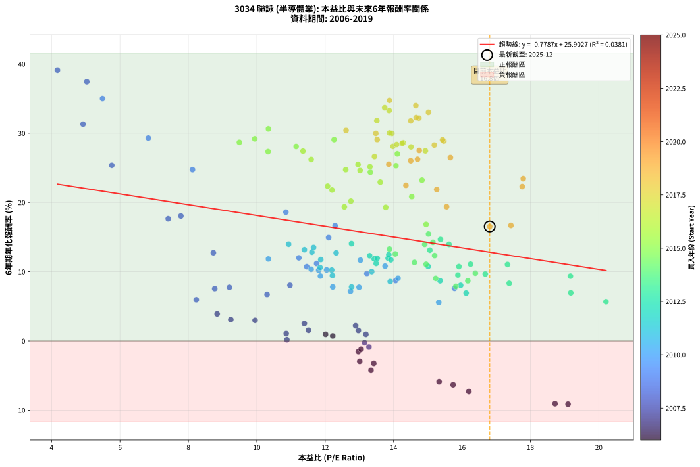
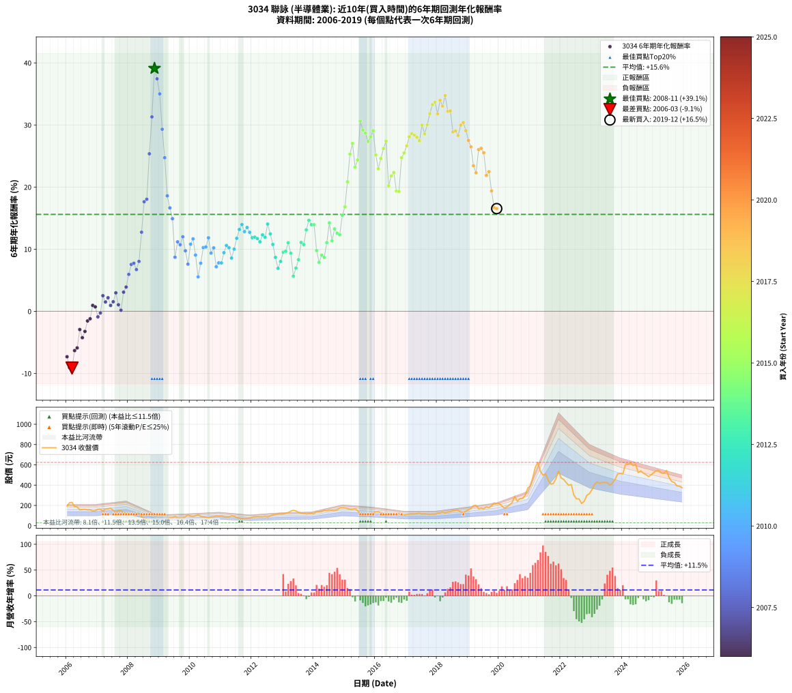

# 3034 聯詠 - 本益比與未來報酬率分析

!!! info "報告資訊"
    - **股票代號**: 3034
    - **公司名稱**: 聯詠
    - **產業別**: 半導體業
    - **分析期間**: 2006-2019 (168 個數據點)
    - **資料來源**: Type 12 (ShowMonthlyK_ChartFlow) 月收盤價與本益比
    - **報酬率口徑**: 含現金股利 (簡化: 年度合計，假設每年7/1入帳)
    - **報告生成時間**: 2026-01-11 20:59:48 CST

## 📈 視覺化圖表

### 圖表1: 本益比 vs 未來報酬率關係

*圖表1：3034 聯詠 本益比與6年期未來報酬率關係 (2006-2019)*

### 圖表2: 歷年買入時點的6年期實際報酬率

*圖表2：3034 聯詠 歷年買入時點的6年期實際報酬率 (2006-2019)*

## 📍 買點訊號說明

本報告提供兩種買點提示訊號（顯示於圖表2的股價子圖中）：

### ▲ 小綠色三角形（回測驗證）
- **計算方式**: 使用全部歷史資料計算本益比第25百分位數
- **用途**: 事後驗證，顯示歷史上哪些時點確實為低估區
- **限制**: 當下無法判斷，僅供回測參考
- **特性**: 後見之明（Look-Ahead Bias）

### ▲ 小橘色三角形（即時訊號）
- **計算方式**: 使用截至當月的過去5年資料計算本益比第25百分位數
- **用途**: 實際投資決策，當時即可判斷
- **優勢**: 可操作性強，符合實務需求
- **特性**: 無後見之明，滾動窗口計算

!!! tip "如何使用兩種訊號"
    - **綠色▲** 幫助理解歷史估值機會，驗證策略有效性
    - **橘色▲** 可作為實際買進參考，但仍需搭配基本面分析
    - 兩種訊號重疊時，表示即時判斷與事後驗證一致，信心度較高
    - 僅有綠色▲時，表示當時無法判斷（需要未來資料才能確認）
    - 僅有橘色▲時，表示即時判斷為買點，但事後可能不是最佳時機

## 📊 估值分析摘要

| 指標 | 數值 |
|:---:|:---:|
| **目前本益比** (2019-12) | **16.81 倍** |
| **歷史平均本益比** | 13.23 倍 |
| **估值水準** | 🔴 相對高估 |
| **預期6年年化報酬率** | **+12.81%** |
| **歷史平均報酬率** | +15.60% |
| **相關係數 (R²)** | 0.0381 |
| **趨勢線斜率** | -0.7787 |

!!! abstract "核心洞察"
    目前本益比顯著高於歷史平均，預期未來報酬率可能較低

    根據歷史數據回測，3034 聯詠 在目前本益比 **16.8倍** 的估值水準下，
    預期未來6年年化報酬率約為 **+12.8%**。

    **重要提醒**: 本分析基於歷史數據統計，實際報酬率會受到公司基本面變化、產業趨勢、
    總體經濟環境等多重因素影響。R² = 0.04 表示本益比可解釋約 3.8% 的報酬率變異。

## 📈 歷史估值統計

### 最佳買點 (最高報酬率)

| 項目 | 數值 |
|:---:|:---:|
| 起始時間 | 2008-11 |
| 當時本益比 | 4.17 倍 |
| 起始價格 | 28.5 元 |
| 6年後價格 | 175.0 元 |
| **6年年化報酬率** | **+39.12%** |

### 最差買點 (最低報酬率)

| 項目 | 數值 |
|:---:|:---:|
| 起始時間 | 2006-03 |
| 當時本益比 | 19.10 倍 |
| 起始價格 | 230.5 元 |
| 6年後價格 | 89.9 元 |
| **6年年化報酬率** | **-9.13%** |

## 🎯 投資啟示

### 本益比與報酬率關係

趨勢線方程式: **y = -0.7787x + 25.9027**

!!! warning "強負相關"
    本益比與未來報酬率呈現強負相關。在高本益比時期買入，未來報酬率顯著較低；
    在低本益比時期買入，未來報酬率顯著較高。**估值紀律至關重要**。

### 估值區間建議

基於歷史數據分析:

- **🟢 低估區** (P/E < 10.6): 預期報酬率較高，可考慮增加持股
- **🟡 合理區** (P/E 10.6-15.9): 預期報酬率符合長期趨勢，正常持有
- **🔴 高估區** (P/E > 15.9): 預期報酬率較低，可考慮減碼或觀望

!!! danger "風險提示"
    - 過去表現不代表未來結果
    - 本分析假設公司基本面無重大結構性變化
    - 產業環境劇變可能使歷史規律失效
    - 應結合公司財報、產業趨勢、總體經濟等多重因素綜合判斷

!!! success "長期投資觀點"
    歷史數據顯示，在合理或低估的估值水準買入並長期持有，
    往往能獲得較佳的投資報酬。**耐心等待好價格**是價值投資的核心原則。

## 📊 數據品質

- **資料來源**: GoodInfo.tw Type 12 (ShowMonthlyK_ChartFlow)
- **資料頻率**: 月度收盤價與本益比
- **回測期間**: 2006-2019
- **數據點數量**: 168 個 (每個點代表一次6年期回測)

### 計算方法說明

1. **6年期年化報酬率**:
   - 對每個歷史時點，計算其後6年的實際投資報酬率
   - 期末價值(不含股利): 期末價格
   - 期末價值(含現金股利): 期末價格 + 持有期間內的現金股利合計 (簡化: 年度合計，假設每年7/1入帳)
   - 公式: 年化報酬率 = [(期末價值/期初價格)^(1/年數) - 1] × 100%

2. **本益比 (P/E Ratio)**:
   - 使用當時的月收盤價與EPS計算
   - 資料來源: Type 12 月度河流圖本益比數據

3. **趨勢線 (Linear Regression)**:
   - 使用最小平方法擬合線性趨勢線
   - R²值衡量本益比對報酬率的解釋能力

---

*本報告由 Stock Analysis System v1.9.0 自動生成*
*數據更新時間: 2026-01-11 20:59:48 CST*

## 📋 月度回測明細表

（每一列對應時間線圖中的一個買入點；可用來對照 SVG 圖上的每個點。）

| 買入月份 | 賣出月份 | 回測期限_年 | 實際持有年數 | 買入本益比_倍 | 買入收盤價_元 | 賣出收盤價_元 | 現金股利合計_元 | 總報酬率_pct | 年化報酬率_pct |
| --- | --- | --- | --- | --- | --- | --- | --- | --- | --- |
| 2006-01 | 2012-01 | 6 | 5.999 | 16.20 | 195.50 | 84.10 | 39.85 | -36.60 | -7.32 |
| 2006-02 | 2012-02 | 6 | 5.999 | 18.72 | 226.00 | 88.00 | 39.85 | -43.43 | -9.06 |
| 2006-03 | 2012-03 | 6 | 6.001 | 19.10 | 230.50 | 89.90 | 39.85 | -43.71 | -9.13 |
| 2006-04 | 2012-04 | 6 | 6.001 | 15.74 | 190.00 | 88.50 | 39.85 | -32.45 | -6.33 |
| 2006-05 | 2012-05 | 6 | 6.001 | 15.33 | 185.00 | 88.60 | 39.85 | -30.57 | -5.90 |
| 2006-06 | 2012-06 | 6 | 6.001 | 13.01 | 157.00 | 91.40 | 39.85 | -16.40 | -2.94 |
| 2006-07 | 2012-07 | 6 | 6.001 | 13.34 | 161.00 | 87.60 | 36.45 | -22.95 | -4.25 |
| 2006-08 | 2012-08 | 6 | 6.001 | 13.42 | 162.00 | 96.50 | 36.45 | -17.93 | -3.24 |
| 2006-09 | 2012-09 | 6 | 6.001 | 12.97 | 156.50 | 106.00 | 36.45 | -8.97 | -1.55 |
| 2006-10 | 2012-10 | 6 | 6.001 | 13.05 | 157.50 | 110.00 | 36.45 | -7.01 | -1.20 |
| 2006-11 | 2012-11 | 6 | 6.001 | 12.01 | 145.00 | 117.00 | 36.45 | +5.83 | +0.95 |
| 2006-12 | 2012-12 | 6 | 6.001 | 12.22 | 147.50 | 117.50 | 36.45 | +4.38 | +0.72 |
| 2007-01 | 2013-01 | 6 | 6.001 | 13.28 | 162.50 | 117.50 | 36.45 | -5.26 | -0.90 |
| 2007-02 | 2013-02 | 6 | 6.001 | 13.15 | 163.00 | 124.00 | 36.45 | -1.56 | -0.26 |
| 2007-03 | 2013-03 | 6 | 6.001 | 11.39 | 143.00 | 129.50 | 36.45 | +16.05 | +2.51 |
| 2007-04 | 2013-04 | 6 | 6.001 | 12.97 | 165.00 | 144.00 | 36.45 | +9.37 | +1.50 |
| 2007-05 | 2013-05 | 6 | 6.001 | 12.89 | 166.00 | 152.50 | 36.45 | +13.83 | +2.18 |
| 2007-06 | 2013-06 | 6 | 6.001 | 13.19 | 172.00 | 145.50 | 36.45 | +5.79 | +0.94 |
| 2007-07 | 2013-07 | 6 | 6.001 | 11.51 | 152.00 | 132.50 | 34.05 | +9.57 | +1.53 |
| 2007-08 | 2013-08 | 6 | 6.001 | 9.95 | 133.00 | 124.50 | 34.05 | +19.21 | +2.97 |
| 2007-09 | 2013-09 | 6 | 6.001 | 10.86 | 147.00 | 122.50 | 34.05 | +6.50 | +1.05 |
| 2007-10 | 2013-10 | 6 | 6.001 | 10.88 | 149.00 | 116.50 | 34.05 | +1.04 | +0.17 |
| 2007-11 | 2013-11 | 6 | 6.001 | 9.24 | 128.00 | 119.50 | 34.05 | +19.96 | +3.08 |
| 2007-12 | 2013-12 | 6 | 6.001 | 8.84 | 124.00 | 122.00 | 34.05 | +25.85 | +3.90 |
| 2008-01 | 2014-01 | 6 | 6.001 | 8.23 | 110.00 | 121.50 | 34.05 | +41.41 | +5.94 |
| 2008-02 | 2014-03 | 6 | 6.081 | 8.77 | 111.50 | 139.50 | 34.05 | +55.65 | +7.55 |
| 2008-03 | 2014-03 | 6 | 5.999 | 9.20 | 111.00 | 139.50 | 34.05 | +56.35 | +7.74 |
| 2008-04 | 2014-04 | 6 | 5.999 | 10.30 | 117.50 | 139.50 | 34.05 | +47.70 | +6.72 |
| 2008-05 | 2014-05 | 6 | 5.999 | 10.97 | 118.00 | 153.50 | 34.05 | +58.94 | +8.03 |
| 2008-06 | 2014-06 | 6 | 5.999 | 8.73 | 88.20 | 147.00 | 34.05 | +105.27 | +12.74 |
| 2008-07 | 2014-07 | 6 | 5.999 | 7.41 | 70.00 | 154.00 | 31.49 | +164.98 | +17.64 |
| 2008-08 | 2014-08 | 6 | 5.999 | 7.78 | 68.40 | 153.50 | 31.49 | +170.45 | +18.04 |
| 2008-09 | 2014-09 | 6 | 5.999 | 5.76 | 46.90 | 150.50 | 31.49 | +288.04 | +25.36 |
| 2008-10 | 2014-10 | 6 | 5.999 | 4.92 | 36.80 | 157.00 | 31.49 | +412.20 | +31.30 |
| 2008-11 | 2014-11 | 6 | 5.999 | 4.17 | 28.50 | 175.00 | 31.49 | +624.52 | +39.12 |
| 2008-12 | 2014-12 | 6 | 5.999 | 5.03 | 31.10 | 178.00 | 31.49 | +573.60 | +37.44 |
| 2009-01 | 2015-01 | 6 | 5.999 | 5.49 | 34.20 | 175.50 | 31.49 | +505.23 | +35.01 |
| 2009-02 | 2015-02 | 6 | 5.999 | 6.83 | 42.90 | 169.00 | 31.49 | +367.34 | +29.31 |
| 2009-03 | 2015-03 | 6 | 5.999 | 8.12 | 51.40 | 162.00 | 31.49 | +276.44 | +24.73 |
| 2009-04 | 2015-04 | 6 | 5.999 | 10.85 | 69.20 | 161.00 | 31.49 | +178.16 | +18.60 |
| 2009-05 | 2015-05 | 6 | 5.999 | 12.29 | 79.00 | 167.50 | 31.49 | +151.88 | +16.65 |
| 2009-06 | 2015-06 | 6 | 5.999 | 12.10 | 78.40 | 149.00 | 31.49 | +130.22 | +14.91 |
| 2009-07 | 2015-07 | 6 | 5.999 | 14.06 | 91.80 | 114.50 | 36.99 | +65.02 | +8.71 |
| 2009-08 | 2015-08 | 6 | 5.999 | 11.75 | 77.30 | 109.00 | 36.99 | +88.86 | +11.18 |
| 2009-09 | 2015-09 | 6 | 5.999 | 11.46 | 76.00 | 103.00 | 36.99 | +84.20 | +10.72 |
| 2009-10 | 2015-10 | 6 | 5.999 | 11.23 | 75.00 | 111.00 | 36.99 | +97.32 | +12.00 |
| 2009-11 | 2015-11 | 6 | 5.999 | 13.22 | 89.00 | 118.50 | 36.99 | +74.71 | +9.75 |
| 2009-12 | 2015-12 | 6 | 5.999 | 15.78 | 107.00 | 129.00 | 36.99 | +55.13 | +7.59 |
| 2010-01 | 2016-01 | 6 | 5.999 | 13.75 | 94.30 | 137.50 | 36.99 | +85.04 | +10.80 |
| 2010-02 | 2016-02 | 6 | 5.999 | 13.03 | 90.30 | 138.00 | 36.99 | +93.79 | +11.66 |
| 2010-03 | 2016-03 | 6 | 6.001 | 14.13 | 99.00 | 129.50 | 36.99 | +68.17 | +9.05 |
| 2010-04 | 2016-04 | 6 | 6.001 | 15.32 | 108.50 | 113.00 | 36.99 | +38.24 | +5.54 |
| 2010-05 | 2016-05 | 6 | 6.001 | 12.99 | 93.00 | 108.50 | 36.99 | +56.44 | +7.74 |
| 2010-06 | 2016-06 | 6 | 6.001 | 12.04 | 87.10 | 119.50 | 36.99 | +79.67 | +10.26 |
| 2010-07 | 2016-07 | 6 | 6.001 | 11.59 | 84.70 | 112.00 | 40.99 | +80.63 | +10.35 |
| 2010-08 | 2016-08 | 6 | 6.001 | 10.34 | 76.40 | 108.50 | 40.99 | +95.67 | +11.83 |
| 2010-09 | 2016-09 | 6 | 6.001 | 11.86 | 88.50 | 110.50 | 40.99 | +71.18 | +9.37 |
| 2010-10 | 2016-10 | 6 | 6.001 | 11.81 | 89.00 | 118.50 | 40.99 | +79.20 | +10.21 |
| 2010-11 | 2016-11 | 6 | 6.001 | 12.74 | 97.00 | 106.00 | 40.99 | +51.54 | +7.17 |
| 2010-12 | 2016-12 | 6 | 6.001 | 12.22 | 94.00 | 106.50 | 40.99 | +56.90 | +7.79 |
| 2011-01 | 2017-01 | 6 | 6.001 | 12.77 | 96.60 | 110.50 | 40.99 | +56.82 | +7.79 |
| 2011-02 | 2017-02 | 6 | 6.001 | 12.21 | 90.80 | 115.00 | 40.99 | +71.80 | +9.44 |
| 2011-03 | 2017-03 | 6 | 6.001 | 11.85 | 86.60 | 117.50 | 40.99 | +83.01 | +10.60 |
| 2011-04 | 2017-04 | 6 | 6.001 | 12.19 | 87.50 | 116.00 | 40.99 | +79.42 | +10.23 |
| 2011-05 | 2017-05 | 6 | 6.001 | 13.90 | 98.00 | 119.50 | 40.99 | +63.77 | +8.57 |
| 2011-06 | 2017-06 | 6 | 6.001 | 13.36 | 92.50 | 123.00 | 40.99 | +77.29 | +10.01 |
| 2011-07 | 2017-07 | 6 | 6.001 | 11.87 | 80.70 | 115.00 | 42.19 | +94.79 | +11.75 |
| 2011-08 | 2017-08 | 6 | 6.001 | 11.39 | 76.00 | 117.50 | 42.19 | +110.12 | +13.17 |
| 2011-09 | 2017-09 | 6 | 6.001 | 10.93 | 71.50 | 114.50 | 42.19 | +119.15 | +13.97 |
| 2011-10 | 2017-10 | 6 | 6.001 | 11.61 | 74.50 | 111.50 | 42.19 | +106.30 | +12.82 |
| 2011-11 | 2017-11 | 6 | 6.001 | 11.66 | 73.30 | 114.50 | 42.19 | +113.77 | +13.50 |
| 2011-12 | 2017-12 | 6 | 6.001 | 12.32 | 75.90 | 113.50 | 42.19 | +105.13 | +12.72 |
| 2012-01 | 2018-01 | 6 | 6.001 | 13.43 | 84.10 | 122.50 | 42.19 | +95.83 | +11.85 |
| 2012-02 | 2018-03 | 6 | 6.081 | 13.84 | 88.00 | 132.50 | 42.19 | +98.51 | +11.94 |
| 2012-03 | 2018-03 | 6 | 5.999 | 13.92 | 89.90 | 132.50 | 42.19 | +94.32 | +11.71 |
| 2012-04 | 2018-04 | 6 | 5.999 | 13.49 | 88.50 | 125.00 | 42.19 | +88.92 | +11.19 |
| 2012-05 | 2018-05 | 6 | 5.999 | 13.30 | 88.60 | 135.50 | 42.19 | +100.56 | +12.30 |
| 2012-06 | 2018-06 | 6 | 5.999 | 13.52 | 91.40 | 137.50 | 42.19 | +96.60 | +11.93 |
| 2012-07 | 2018-07 | 6 | 5.999 | 12.77 | 87.60 | 148.00 | 44.69 | +119.97 | +14.04 |
| 2012-08 | 2018-08 | 6 | 5.999 | 13.86 | 96.50 | 150.50 | 44.69 | +102.27 | +12.46 |
| 2012-09 | 2018-09 | 6 | 5.999 | 15.01 | 106.00 | 151.00 | 44.69 | +84.62 | +10.76 |
| 2012-10 | 2018-10 | 6 | 5.999 | 15.36 | 110.00 | 136.50 | 44.69 | +64.72 | +8.68 |
| 2012-11 | 2018-11 | 6 | 5.999 | 16.12 | 117.00 | 130.00 | 44.69 | +49.31 | +6.91 |
| 2012-12 | 2018-12 | 6 | 5.999 | 15.96 | 117.50 | 142.00 | 44.69 | +58.89 | +8.02 |
| 2013-01 | 2019-01 | 6 | 5.999 | 15.88 | 117.50 | 158.00 | 44.69 | +72.50 | +9.52 |
| 2013-02 | 2019-02 | 6 | 5.999 | 16.68 | 124.00 | 171.00 | 44.69 | +73.95 | +9.67 |
| 2013-03 | 2019-03 | 6 | 5.999 | 17.33 | 129.50 | 198.00 | 44.69 | +87.41 | +11.04 |
| 2013-04 | 2019-04 | 6 | 5.999 | 19.17 | 144.00 | 201.50 | 44.69 | +70.97 | +9.35 |
| 2013-05 | 2019-05 | 6 | 5.999 | 20.21 | 152.50 | 167.50 | 44.69 | +39.14 | +5.66 |
| 2013-06 | 2019-06 | 6 | 5.999 | 19.18 | 145.50 | 173.00 | 44.69 | +49.62 | +6.95 |
| 2013-07 | 2019-07 | 6 | 5.999 | 17.38 | 132.50 | 166.00 | 47.90 | +61.43 | +8.31 |
| 2013-08 | 2019-08 | 6 | 5.999 | 16.25 | 124.50 | 186.00 | 47.90 | +87.87 | +11.08 |
| 2013-09 | 2019-09 | 6 | 5.999 | 15.91 | 122.50 | 178.00 | 47.90 | +84.41 | +10.74 |
| 2013-10 | 2019-10 | 6 | 5.999 | 15.06 | 116.50 | 196.00 | 47.90 | +109.36 | +13.11 |
| 2013-11 | 2019-11 | 6 | 5.999 | 15.37 | 119.50 | 223.50 | 47.90 | +127.11 | +14.65 |
| 2013-12 | 2019-12 | 6 | 5.999 | 15.62 | 122.00 | 219.00 | 47.90 | +118.77 | +13.94 |
| 2014-01 | 2020-01 | 6 | 5.999 | 14.91 | 121.50 | 218.00 | 47.90 | +118.85 | +13.95 |
| 2014-02 | 2020-02 | 6 | 5.999 | 16.39 | 139.00 | 195.50 | 47.90 | +75.11 | +9.79 |
| 2014-03 | 2020-03 | 6 | 6.001 | 15.82 | 139.50 | 172.00 | 47.90 | +57.63 | +7.88 |
| 2014-04 | 2020-04 | 6 | 6.001 | 15.23 | 139.50 | 186.50 | 47.90 | +68.03 | +9.03 |
| 2014-05 | 2020-05 | 6 | 6.001 | 16.17 | 153.50 | 205.00 | 47.90 | +64.76 | +8.68 |
| 2014-06 | 2020-06 | 6 | 6.001 | 14.95 | 147.00 | 228.00 | 47.90 | +87.69 | +11.06 |
| 2014-07 | 2020-07 | 6 | 6.001 | 15.15 | 154.00 | 290.00 | 52.40 | +122.34 | +14.24 |
| 2014-08 | 2020-08 | 6 | 6.001 | 14.61 | 153.50 | 240.00 | 52.40 | +90.49 | +11.34 |
| 2014-09 | 2020-09 | 6 | 6.001 | 13.88 | 150.50 | 265.50 | 52.40 | +111.23 | +13.27 |
| 2014-10 | 2020-10 | 6 | 6.001 | 14.05 | 157.00 | 267.00 | 52.40 | +103.44 | +12.56 |
| 2014-11 | 2020-11 | 6 | 6.001 | 15.20 | 175.00 | 299.00 | 52.40 | +100.80 | +12.32 |
| 2014-12 | 2020-12 | 6 | 6.001 | 15.02 | 178.00 | 369.00 | 52.40 | +136.74 | +15.44 |
| 2015-01 | 2021-01 | 6 | 6.001 | 14.95 | 175.50 | 394.00 | 52.40 | +154.36 | +16.83 |
| 2015-02 | 2021-02 | 6 | 6.001 | 14.53 | 169.00 | 474.00 | 52.40 | +211.48 | +20.84 |
| 2015-03 | 2021-03 | 6 | 6.001 | 14.07 | 162.00 | 575.00 | 52.40 | +287.28 | +25.31 |
| 2015-04 | 2021-04 | 6 | 6.001 | 14.11 | 161.00 | 624.00 | 52.40 | +320.12 | +27.02 |
| 2015-05 | 2021-05 | 6 | 6.001 | 14.83 | 167.50 | 534.00 | 52.40 | +250.09 | +23.22 |
| 2015-06 | 2021-06 | 6 | 6.001 | 13.32 | 149.00 | 499.00 | 52.40 | +270.07 | +24.36 |
| 2015-07 | 2021-07 | 6 | 6.001 | 10.34 | 114.50 | 511.00 | 58.00 | +396.94 | +30.62 |
| 2015-08 | 2021-08 | 6 | 6.001 | 9.94 | 109.00 | 449.00 | 58.00 | +365.14 | +29.19 |
| 2015-09 | 2021-09 | 6 | 6.001 | 9.49 | 103.00 | 410.00 | 58.00 | +354.37 | +28.69 |
| 2015-10 | 2021-10 | 6 | 6.001 | 10.33 | 111.00 | 415.50 | 58.00 | +326.58 | +27.34 |
| 2015-11 | 2021-11 | 6 | 6.001 | 11.15 | 118.50 | 465.50 | 58.00 | +341.77 | +28.09 |
| 2015-12 | 2021-12 | 6 | 6.001 | 12.26 | 129.00 | 539.00 | 58.00 | +362.79 | +29.08 |
| 2016-01 | 2022-01 | 6 | 6.001 | 13.31 | 137.50 | 471.00 | 58.00 | +284.73 | +25.17 |
| 2016-02 | 2022-03 | 6 | 6.081 | 13.61 | 138.00 | 426.50 | 58.00 | +251.09 | +22.94 |
| 2016-03 | 2022-03 | 6 | 5.999 | 13.02 | 129.50 | 426.50 | 58.00 | +274.13 | +24.60 |
| 2016-04 | 2022-04 | 6 | 5.999 | 11.59 | 113.00 | 398.50 | 58.00 | +303.98 | +26.21 |
| 2016-05 | 2022-05 | 6 | 5.999 | 11.35 | 108.50 | 406.00 | 58.00 | +327.65 | +27.41 |
| 2016-06 | 2022-06 | 6 | 5.999 | 12.75 | 119.50 | 302.00 | 58.00 | +201.26 | +20.18 |
| 2016-07 | 2022-07 | 6 | 5.999 | 12.20 | 112.00 | 265.00 | 100.50 | +226.34 | +21.80 |
| 2016-08 | 2022-08 | 6 | 5.999 | 12.07 | 108.50 | 263.50 | 100.50 | +235.48 | +22.36 |
| 2016-09 | 2022-09 | 6 | 5.999 | 12.56 | 110.50 | 219.00 | 100.50 | +189.14 | +19.36 |
| 2016-10 | 2022-10 | 6 | 5.999 | 13.77 | 118.50 | 241.00 | 100.50 | +188.19 | +19.30 |
| 2016-11 | 2022-11 | 6 | 5.999 | 12.60 | 106.00 | 298.50 | 100.50 | +276.42 | +24.73 |
| 2016-12 | 2022-12 | 6 | 5.999 | 12.96 | 106.50 | 315.50 | 100.50 | +290.61 | +25.50 |
| 2017-01 | 2023-01 | 6 | 5.999 | 13.44 | 110.50 | 355.00 | 100.50 | +312.22 | +26.63 |
| 2017-02 | 2023-02 | 6 | 5.999 | 13.98 | 115.00 | 407.50 | 100.50 | +341.74 | +28.10 |
| 2017-03 | 2023-03 | 6 | 5.999 | 14.28 | 117.50 | 431.50 | 100.50 | +352.77 | +28.63 |
| 2017-04 | 2023-04 | 6 | 5.999 | 14.09 | 116.00 | 418.50 | 100.50 | +347.41 | +28.37 |
| 2017-05 | 2023-05 | 6 | 5.999 | 14.51 | 119.50 | 425.50 | 100.50 | +340.17 | +28.02 |
| 2017-06 | 2023-06 | 6 | 5.999 | 14.93 | 123.00 | 426.50 | 100.50 | +328.46 | +27.45 |
| 2017-07 | 2023-07 | 6 | 5.999 | 13.95 | 115.00 | 424.00 | 130.50 | +382.17 | +29.99 |
| 2017-08 | 2023-08 | 6 | 5.999 | 14.25 | 117.50 | 399.50 | 130.50 | +351.06 | +28.55 |
| 2017-09 | 2023-09 | 6 | 5.999 | 13.88 | 114.50 | 423.00 | 130.50 | +383.41 | +30.04 |
| 2017-10 | 2023-10 | 6 | 5.999 | 13.51 | 111.50 | 454.50 | 130.50 | +424.66 | +31.83 |
| 2017-11 | 2023-11 | 6 | 5.999 | 13.87 | 114.50 | 511.00 | 130.50 | +460.26 | +33.28 |
| 2017-12 | 2023-12 | 6 | 5.999 | 13.74 | 113.50 | 517.00 | 130.50 | +470.48 | +33.68 |
| 2018-01 | 2024-01 | 6 | 5.999 | 14.50 | 122.50 | 511.00 | 130.50 | +423.67 | +31.79 |
| 2018-02 | 2024-02 | 6 | 5.999 | 14.65 | 126.50 | 601.00 | 130.50 | +478.26 | +33.98 |
| 2018-03 | 2024-03 | 6 | 6.001 | 15.02 | 132.50 | 604.00 | 130.50 | +454.34 | +33.03 |
| 2018-04 | 2024-04 | 6 | 6.001 | 13.88 | 125.00 | 618.00 | 130.50 | +498.80 | +34.75 |
| 2018-05 | 2024-05 | 6 | 6.001 | 14.74 | 135.50 | 593.00 | 130.50 | +433.95 | +32.20 |
| 2018-06 | 2024-06 | 6 | 6.001 | 14.66 | 137.50 | 606.00 | 130.50 | +435.64 | +32.27 |
| 2018-07 | 2024-07 | 6 | 6.001 | 15.47 | 148.00 | 523.00 | 155.40 | +358.38 | +28.88 |
| 2018-08 | 2024-08 | 6 | 6.001 | 15.43 | 150.50 | 540.00 | 155.40 | +362.06 | +29.05 |
| 2018-09 | 2024-09 | 6 | 6.001 | 15.19 | 151.00 | 518.00 | 155.40 | +345.96 | +28.29 |
| 2018-10 | 2024-10 | 6 | 6.001 | 13.48 | 136.50 | 503.00 | 155.40 | +382.34 | +29.98 |
| 2018-11 | 2024-11 | 6 | 6.001 | 12.61 | 130.00 | 484.00 | 155.40 | +391.85 | +30.40 |
| 2018-12 | 2024-12 | 6 | 6.001 | 13.52 | 142.00 | 502.00 | 155.40 | +362.96 | +29.09 |
| 2019-01 | 2025-01 | 6 | 6.001 | 14.75 | 158.00 | 524.00 | 155.40 | +330.00 | +27.51 |
| 2019-02 | 2025-02 | 6 | 6.001 | 15.66 | 171.00 | 545.00 | 155.40 | +309.59 | +26.48 |
| 2019-03 | 2025-03 | 6 | 6.001 | 17.79 | 198.00 | 545.00 | 155.40 | +253.74 | +23.43 |
| 2019-04 | 2025-04 | 6 | 6.001 | 17.76 | 201.50 | 519.00 | 155.40 | +234.69 | +22.30 |
| 2019-05 | 2025-05 | 6 | 6.001 | 14.50 | 167.50 | 516.00 | 155.40 | +300.84 | +26.03 |
| 2019-06 | 2025-06 | 6 | 6.001 | 14.70 | 173.00 | 545.00 | 155.40 | +304.86 | +26.24 |
| 2019-07 | 2025-07 | 6 | 6.001 | 13.86 | 166.00 | 475.00 | 174.60 | +291.33 | +25.53 |
| 2019-08 | 2025-08 | 6 | 6.001 | 15.26 | 186.00 | 435.00 | 174.60 | +227.74 | +21.87 |
| 2019-09 | 2025-09 | 6 | 6.001 | 14.36 | 178.00 | 426.50 | 174.60 | +237.70 | +22.48 |
| 2019-10 | 2025-10 | 6 | 6.001 | 15.55 | 196.00 | 393.00 | 174.60 | +189.59 | +19.38 |
| 2019-11 | 2025-11 | 6 | 6.001 | 17.43 | 223.50 | 389.50 | 174.60 | +152.39 | +16.68 |
| 2019-12 | 2025-12 | 6 | 6.001 | 16.81 | 219.00 | 374.00 | 174.60 | +150.50 | +16.53 |
