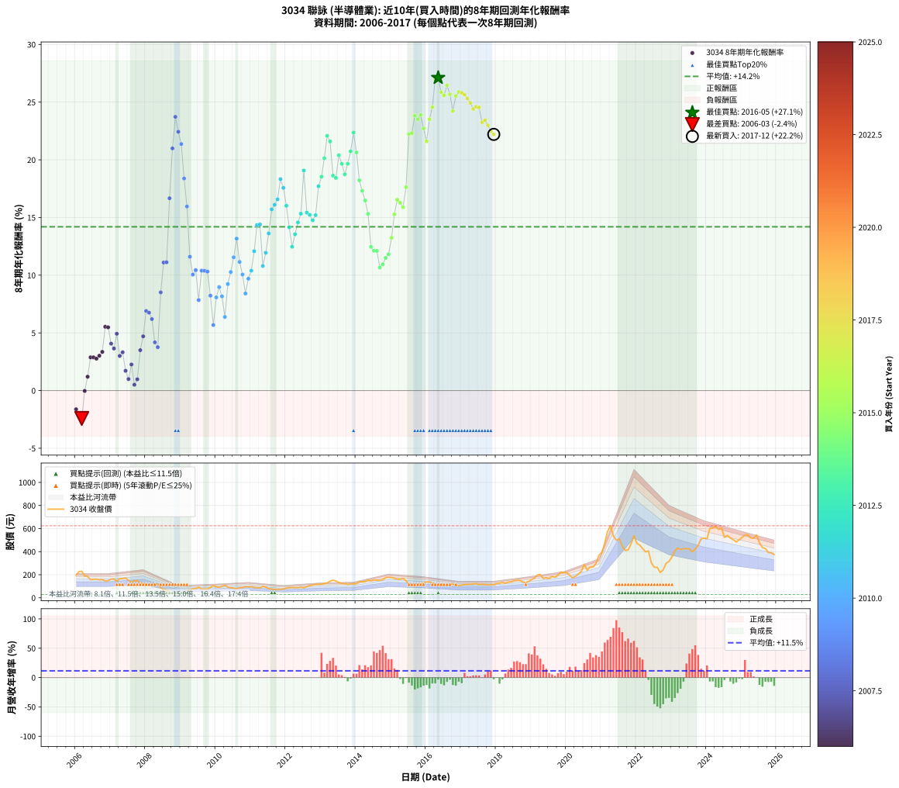

# 3034 聯詠 - 本益比與未來報酬率分析

!!! info "報告資訊"
    - **股票代號**: 3034
    - **公司名稱**: 聯詠
    - **產業別**: 半導體業
    - **分析期間**: 2006-2017 (144 個數據點)
    - **資料來源**: Type 12 (ShowMonthlyK_ChartFlow) 月收盤價與本益比
    - **報酬率口徑**: 含現金股利 (簡化: 年度合計，假設每年7/1入帳)
    - **報告生成時間**: 2026-01-06 18:50:44 CST

## 📈 視覺化圖表

### 圖表1: 本益比 vs 未來報酬率關係

*圖表1：3034 聯詠 本益比與8年期未來報酬率關係 (2006-2017)*

### 圖表2: 歷年買入時點的8年期實際報酬率

*圖表2：3034 聯詠 歷年買入時點的8年期實際報酬率 (2006-2017)*

## 📍 買點訊號說明

本報告提供兩種買點提示訊號（顯示於圖表2的股價子圖中）：

### ▲ 小綠色三角形（回測驗證）
- **計算方式**: 使用全部歷史資料計算本益比第25百分位數
- **用途**: 事後驗證，顯示歷史上哪些時點確實為低估區
- **限制**: 當下無法判斷，僅供回測參考
- **特性**: 後見之明（Look-Ahead Bias）

### ▲ 小橘色三角形（即時訊號）
- **計算方式**: 使用截至當月的過去5年資料計算本益比第25百分位數
- **用途**: 實際投資決策，當時即可判斷
- **優勢**: 可操作性強，符合實務需求
- **特性**: 無後見之明，滾動窗口計算

!!! tip "如何使用兩種訊號"
    - **綠色▲** 幫助理解歷史估值機會，驗證策略有效性
    - **橘色▲** 可作為實際買進參考，但仍需搭配基本面分析
    - 兩種訊號重疊時，表示即時判斷與事後驗證一致，信心度較高
    - 僅有綠色▲時，表示當時無法判斷（需要未來資料才能確認）
    - 僅有橘色▲時，表示即時判斷為買點，但事後可能不是最佳時機

## 📊 估值分析摘要

| 指標 | 數值 |
|:---:|:---:|
| **目前本益比** (2017-12) | **13.74 倍** |
| **歷史平均本益比** | 12.92 倍 |
| **估值水準** | 🟡 合理範圍 |
| **預期8年年化報酬率** | **+14.21%** |
| **歷史平均報酬率** | +14.20% |
| **相關係數 (R²)** | 0.0000 |
| **趨勢線斜率** | 0.0146 |

!!! abstract "核心洞察"
    目前本益比接近歷史平均，預期報酬率符合長期趨勢

    根據歷史數據回測，3034 聯詠 在目前本益比 **13.7倍** 的估值水準下，
    預期未來8年年化報酬率約為 **+14.2%**。

    **重要提醒**: 本分析基於歷史數據統計，實際報酬率會受到公司基本面變化、產業趨勢、
    總體經濟環境等多重因素影響。R² = 0.00 表示本益比可解釋約 0.0% 的報酬率變異。

## 📈 歷史估值統計

### 最佳買點 (最高報酬率)

| 項目 | 數值 |
|:---:|:---:|
| 起始時間 | 2016-05 |
| 當時本益比 | 11.35 倍 |
| 起始價格 | 108.5 元 |
| 8年後價格 | 593.0 元 |
| **8年年化報酬率** | **+27.11%** |

### 最差買點 (最低報酬率)

| 項目 | 數值 |
|:---:|:---:|
| 起始時間 | 2006-03 |
| 當時本益比 | 19.10 倍 |
| 起始價格 | 230.5 元 |
| 8年後價格 | 139.5 元 |
| **8年年化報酬率** | **-2.42%** |

## 🎯 投資啟示

### 本益比與報酬率關係

趨勢線方程式: **y = 0.0146x + 14.0082**

!!! info "弱相關或正相關"
    本益比與未來報酬率相關性較弱。這可能表示該股票的報酬率更多受到
    公司成長性、產業趨勢等因素影響，而非估值水準。**需綜合考量多項指標**。

### 估值區間建議

基於歷史數據分析:

- **🟢 低估區** (P/E < 10.3): 預期報酬率較高，可考慮增加持股
- **🟡 合理區** (P/E 10.3-15.5): 預期報酬率符合長期趨勢，正常持有
- **🔴 高估區** (P/E > 15.5): 預期報酬率較低，可考慮減碼或觀望

!!! danger "風險提示"
    - 過去表現不代表未來結果
    - 本分析假設公司基本面無重大結構性變化
    - 產業環境劇變可能使歷史規律失效
    - 應結合公司財報、產業趨勢、總體經濟等多重因素綜合判斷

!!! success "長期投資觀點"
    歷史數據顯示，在合理或低估的估值水準買入並長期持有，
    往往能獲得較佳的投資報酬。**耐心等待好價格**是價值投資的核心原則。

## 📊 數據品質

- **資料來源**: GoodInfo.tw Type 12 (ShowMonthlyK_ChartFlow)
- **資料頻率**: 月度收盤價與本益比
- **回測期間**: 2006-2017
- **數據點數量**: 144 個 (每個點代表一次8年期回測)

### 計算方法說明

1. **8年期年化報酬率**:
   - 對每個歷史時點，計算其後8年的實際投資報酬率
   - 期末價值(不含股利): 期末價格
   - 期末價值(含現金股利): 期末價格 + 持有期間內的現金股利合計 (簡化: 年度合計，假設每年7/1入帳)
   - 公式: 年化報酬率 = [(期末價值/期初價格)^(1/年數) - 1] × 100%

2. **本益比 (P/E Ratio)**:
   - 使用當時的月收盤價與EPS計算
   - 資料來源: Type 12 月度河流圖本益比數據

3. **趨勢線 (Linear Regression)**:
   - 使用最小平方法擬合線性趨勢線
   - R²值衡量本益比對報酬率的解釋能力

---

*本報告由 Stock Analysis System v1.9.0 自動生成*
*數據更新時間: 2026-01-06 18:50:44 CST*

## 📋 月度回測明細表

（每一列對應時間線圖中的一個買入點；可用來對照 SVG 圖上的每個點。）

| 買入月份 | 賣出月份 | 回測期限_年 | 實際持有年數 | 買入本益比_倍 | 買入收盤價_元 | 賣出收盤價_元 | 現金股利合計_元 | 總報酬率_pct | 年化報酬率_pct |
| --- | --- | --- | --- | --- | --- | --- | --- | --- | --- |
| 2006-01 | 2014-01 | 8 | 8.000 | 16.20 | 195.50 | 121.50 | 50.04 | -12.26 | -1.62 |
| 2006-02 | 2014-02 | 8 | 8.000 | 18.72 | 226.00 | 139.00 | 50.04 | -16.35 | -2.21 |
| 2006-03 | 2014-03 | 8 | 8.000 | 19.10 | 230.50 | 139.50 | 50.04 | -17.77 | -2.42 |
| 2006-04 | 2014-04 | 8 | 8.000 | 15.74 | 190.00 | 139.50 | 50.04 | -0.24 | -0.03 |
| 2006-05 | 2014-05 | 8 | 8.000 | 15.33 | 185.00 | 153.50 | 50.04 | +10.02 | +1.20 |
| 2006-06 | 2014-06 | 8 | 8.000 | 13.01 | 157.00 | 147.00 | 50.04 | +25.50 | +2.88 |
| 2006-07 | 2014-07 | 8 | 8.000 | 13.34 | 161.00 | 154.00 | 48.05 | +25.50 | +2.88 |
| 2006-08 | 2014-08 | 8 | 8.000 | 13.42 | 162.00 | 153.50 | 48.05 | +24.41 | +2.77 |
| 2006-09 | 2014-09 | 8 | 8.000 | 12.97 | 156.50 | 150.50 | 48.05 | +26.87 | +3.02 |
| 2006-10 | 2014-10 | 8 | 8.000 | 13.05 | 157.50 | 157.00 | 48.05 | +30.19 | +3.35 |
| 2006-11 | 2014-11 | 8 | 8.000 | 12.01 | 145.00 | 175.00 | 48.05 | +53.83 | +5.53 |
| 2006-12 | 2014-12 | 8 | 8.000 | 12.22 | 147.50 | 178.00 | 48.05 | +53.25 | +5.48 |
| 2007-01 | 2015-01 | 8 | 8.000 | 13.28 | 162.50 | 175.50 | 48.05 | +37.57 | +4.07 |
| 2007-02 | 2015-02 | 8 | 8.000 | 13.15 | 163.00 | 169.00 | 48.05 | +33.16 | +3.64 |
| 2007-03 | 2015-03 | 8 | 8.000 | 11.39 | 143.00 | 162.00 | 48.05 | +46.89 | +4.92 |
| 2007-04 | 2015-04 | 8 | 8.000 | 12.97 | 165.00 | 161.00 | 48.05 | +26.70 | +3.00 |
| 2007-05 | 2015-05 | 8 | 8.000 | 12.89 | 166.00 | 167.50 | 48.05 | +29.85 | +3.32 |
| 2007-06 | 2015-06 | 8 | 8.000 | 13.19 | 172.00 | 149.00 | 48.05 | +14.56 | +1.71 |
| 2007-07 | 2015-07 | 8 | 8.000 | 11.51 | 152.00 | 114.50 | 50.05 | +8.26 | +1.00 |
| 2007-08 | 2015-08 | 8 | 8.000 | 9.95 | 133.00 | 109.00 | 50.05 | +19.59 | +2.26 |
| 2007-09 | 2015-09 | 8 | 8.000 | 10.86 | 147.00 | 103.00 | 50.05 | +4.11 | +0.51 |
| 2007-10 | 2015-10 | 8 | 8.000 | 10.88 | 149.00 | 111.00 | 50.05 | +8.09 | +0.98 |
| 2007-11 | 2015-11 | 8 | 8.000 | 9.24 | 128.00 | 118.50 | 50.05 | +31.68 | +3.50 |
| 2007-12 | 2015-12 | 8 | 8.000 | 8.84 | 124.00 | 129.00 | 50.05 | +44.39 | +4.70 |
| 2008-01 | 2016-01 | 8 | 8.000 | 8.23 | 110.00 | 137.50 | 50.05 | +70.50 | +6.90 |
| 2008-02 | 2016-02 | 8 | 8.000 | 8.77 | 111.50 | 138.00 | 50.05 | +68.65 | +6.75 |
| 2008-03 | 2016-03 | 8 | 8.000 | 9.20 | 111.00 | 129.50 | 50.05 | +61.76 | +6.20 |
| 2008-04 | 2016-04 | 8 | 8.000 | 10.30 | 117.50 | 113.00 | 50.05 | +38.77 | +4.18 |
| 2008-05 | 2016-05 | 8 | 8.000 | 10.97 | 118.00 | 108.50 | 50.05 | +34.36 | +3.76 |
| 2008-06 | 2016-06 | 8 | 8.000 | 8.73 | 88.20 | 119.50 | 50.05 | +92.23 | +8.51 |
| 2008-07 | 2016-07 | 8 | 8.000 | 7.41 | 70.00 | 112.00 | 50.49 | +132.13 | +11.10 |
| 2008-08 | 2016-08 | 8 | 8.000 | 7.78 | 68.40 | 108.50 | 50.49 | +132.44 | +11.12 |
| 2008-09 | 2016-09 | 8 | 8.000 | 5.76 | 46.90 | 110.50 | 50.49 | +243.26 | +16.67 |
| 2008-10 | 2016-10 | 8 | 8.000 | 4.92 | 36.80 | 118.50 | 50.49 | +359.21 | +20.99 |
| 2008-11 | 2016-11 | 8 | 8.000 | 4.17 | 28.50 | 106.00 | 50.49 | +449.08 | +23.72 |
| 2008-12 | 2016-12 | 8 | 8.000 | 5.03 | 31.10 | 106.50 | 50.49 | +404.79 | +22.43 |
| 2009-01 | 2017-01 | 8 | 8.000 | 5.49 | 34.20 | 110.50 | 50.49 | +370.73 | +21.37 |
| 2009-02 | 2017-02 | 8 | 8.000 | 6.83 | 42.90 | 115.00 | 50.49 | +285.76 | +18.38 |
| 2009-03 | 2017-03 | 8 | 8.000 | 8.12 | 51.40 | 117.50 | 50.49 | +226.83 | +15.96 |
| 2009-04 | 2017-04 | 8 | 8.000 | 10.85 | 69.20 | 116.00 | 50.49 | +140.59 | +11.60 |
| 2009-05 | 2017-05 | 8 | 8.000 | 12.29 | 79.00 | 119.50 | 50.49 | +115.18 | +10.05 |
| 2009-06 | 2017-06 | 8 | 8.000 | 12.10 | 78.40 | 123.00 | 50.49 | +121.29 | +10.44 |
| 2009-07 | 2017-07 | 8 | 8.000 | 14.06 | 91.80 | 115.00 | 52.99 | +82.99 | +7.85 |
| 2009-08 | 2017-08 | 8 | 8.000 | 11.75 | 77.30 | 117.50 | 52.99 | +120.55 | +10.39 |
| 2009-09 | 2017-09 | 8 | 8.000 | 11.46 | 76.00 | 114.50 | 52.99 | +120.38 | +10.38 |
| 2009-10 | 2017-10 | 8 | 8.000 | 11.23 | 75.00 | 111.50 | 52.99 | +119.32 | +10.31 |
| 2009-11 | 2017-11 | 8 | 8.000 | 13.22 | 89.00 | 114.50 | 52.99 | +88.19 | +8.22 |
| 2009-12 | 2017-12 | 8 | 8.000 | 15.78 | 107.00 | 113.50 | 52.99 | +55.60 | +5.68 |
| 2010-01 | 2018-01 | 8 | 8.000 | 13.75 | 94.30 | 122.50 | 52.99 | +86.10 | +8.07 |
| 2010-02 | 2018-02 | 8 | 8.000 | 13.03 | 90.30 | 126.50 | 52.99 | +98.77 | +8.97 |
| 2010-03 | 2018-03 | 8 | 8.000 | 14.13 | 99.00 | 132.50 | 52.99 | +87.36 | +8.16 |
| 2010-04 | 2018-04 | 8 | 8.000 | 15.32 | 108.50 | 125.00 | 52.99 | +64.05 | +6.38 |
| 2010-05 | 2018-05 | 8 | 8.000 | 12.99 | 93.00 | 135.50 | 52.99 | +102.68 | +9.23 |
| 2010-06 | 2018-06 | 8 | 8.000 | 12.04 | 87.10 | 137.50 | 52.99 | +118.70 | +10.28 |
| 2010-07 | 2018-07 | 8 | 8.000 | 11.59 | 84.70 | 148.00 | 55.09 | +139.78 | +11.55 |
| 2010-08 | 2018-08 | 8 | 8.000 | 10.34 | 76.40 | 150.50 | 55.09 | +169.10 | +13.17 |
| 2010-09 | 2018-09 | 8 | 8.000 | 11.86 | 88.50 | 151.00 | 55.09 | +132.87 | +11.14 |
| 2010-10 | 2018-10 | 8 | 8.000 | 11.81 | 89.00 | 136.50 | 55.09 | +115.27 | +10.06 |
| 2010-11 | 2018-11 | 8 | 8.000 | 12.74 | 97.00 | 130.00 | 55.09 | +90.81 | +8.41 |
| 2010-12 | 2018-12 | 8 | 8.000 | 12.22 | 94.00 | 142.00 | 55.09 | +109.67 | +9.70 |
| 2011-01 | 2019-01 | 8 | 8.000 | 12.77 | 96.60 | 158.00 | 55.09 | +120.59 | +10.39 |
| 2011-02 | 2019-02 | 8 | 8.000 | 12.21 | 90.80 | 171.00 | 55.09 | +149.00 | +12.08 |
| 2011-03 | 2019-03 | 8 | 8.000 | 11.85 | 86.60 | 198.00 | 55.09 | +192.25 | +14.35 |
| 2011-04 | 2019-04 | 8 | 8.000 | 12.19 | 87.50 | 201.50 | 55.09 | +193.25 | +14.39 |
| 2011-05 | 2019-05 | 8 | 8.000 | 13.90 | 98.00 | 167.50 | 55.09 | +127.13 | +10.80 |
| 2011-06 | 2019-06 | 8 | 8.000 | 13.36 | 92.50 | 173.00 | 55.09 | +146.58 | +11.94 |
| 2011-07 | 2019-07 | 8 | 8.000 | 11.87 | 80.70 | 166.00 | 58.09 | +177.69 | +13.62 |
| 2011-08 | 2019-08 | 8 | 8.000 | 11.39 | 76.00 | 186.00 | 58.09 | +221.17 | +15.70 |
| 2011-09 | 2019-09 | 8 | 8.000 | 10.93 | 71.50 | 178.00 | 58.09 | +230.20 | +16.10 |
| 2011-10 | 2019-10 | 8 | 8.000 | 11.61 | 74.50 | 196.00 | 58.09 | +241.06 | +16.57 |
| 2011-11 | 2019-11 | 8 | 8.000 | 11.66 | 73.30 | 223.50 | 58.09 | +284.16 | +18.32 |
| 2011-12 | 2019-12 | 8 | 8.000 | 12.32 | 75.90 | 219.00 | 58.09 | +265.08 | +17.57 |
| 2012-01 | 2020-01 | 8 | 8.000 | 13.43 | 84.10 | 218.00 | 58.09 | +228.29 | +16.02 |
| 2012-02 | 2020-02 | 8 | 8.000 | 13.84 | 88.00 | 195.50 | 58.09 | +188.17 | +14.14 |
| 2012-03 | 2020-03 | 8 | 8.000 | 13.92 | 89.90 | 172.00 | 58.09 | +155.94 | +12.47 |
| 2012-04 | 2020-04 | 8 | 8.000 | 13.49 | 88.50 | 186.50 | 58.09 | +176.38 | +13.55 |
| 2012-05 | 2020-05 | 8 | 8.000 | 13.30 | 88.60 | 205.00 | 58.09 | +196.94 | +14.57 |
| 2012-06 | 2020-06 | 8 | 8.000 | 13.52 | 91.40 | 228.00 | 58.09 | +213.01 | +15.33 |
| 2012-07 | 2020-07 | 8 | 8.000 | 12.77 | 87.60 | 290.00 | 63.99 | +304.10 | +19.07 |
| 2012-08 | 2020-08 | 8 | 8.000 | 13.86 | 96.50 | 240.00 | 63.99 | +215.02 | +15.42 |
| 2012-09 | 2020-09 | 8 | 8.000 | 15.01 | 106.00 | 265.50 | 63.99 | +210.84 | +15.23 |
| 2012-10 | 2020-10 | 8 | 8.000 | 15.36 | 110.00 | 267.00 | 63.99 | +200.90 | +14.76 |
| 2012-11 | 2020-11 | 8 | 8.000 | 16.12 | 117.00 | 299.00 | 63.99 | +210.25 | +15.20 |
| 2012-12 | 2020-12 | 8 | 8.000 | 15.96 | 117.50 | 369.00 | 63.99 | +268.50 | +17.71 |
| 2013-01 | 2021-01 | 8 | 8.000 | 15.88 | 117.50 | 394.00 | 63.99 | +289.78 | +18.54 |
| 2013-02 | 2021-02 | 8 | 8.000 | 16.68 | 124.00 | 474.00 | 63.99 | +333.87 | +20.13 |
| 2013-03 | 2021-03 | 8 | 8.000 | 17.33 | 129.50 | 575.00 | 63.99 | +393.43 | +22.08 |
| 2013-04 | 2021-04 | 8 | 8.000 | 19.17 | 144.00 | 624.00 | 63.99 | +377.77 | +21.59 |
| 2013-05 | 2021-05 | 8 | 8.000 | 20.21 | 152.50 | 534.00 | 63.99 | +292.13 | +18.63 |
| 2013-06 | 2021-06 | 8 | 8.000 | 19.18 | 145.50 | 499.00 | 63.99 | +286.94 | +18.43 |
| 2013-07 | 2021-07 | 8 | 8.000 | 17.38 | 132.50 | 511.00 | 74.00 | +341.51 | +20.40 |
| 2013-08 | 2021-08 | 8 | 8.000 | 16.25 | 124.50 | 449.00 | 74.00 | +320.08 | +19.65 |
| 2013-09 | 2021-09 | 8 | 8.000 | 15.91 | 122.50 | 410.00 | 74.00 | +295.10 | +18.74 |
| 2013-10 | 2021-10 | 8 | 8.000 | 15.06 | 116.50 | 415.50 | 74.00 | +320.17 | +19.65 |
| 2013-11 | 2021-11 | 8 | 8.000 | 15.37 | 119.50 | 465.50 | 74.00 | +351.46 | +20.73 |
| 2013-12 | 2021-12 | 8 | 8.000 | 15.62 | 122.00 | 539.00 | 74.00 | +402.46 | +22.36 |
| 2014-01 | 2022-01 | 8 | 8.000 | 14.91 | 121.50 | 471.00 | 74.00 | +348.56 | +20.64 |
| 2014-02 | 2022-02 | 8 | 8.000 | 16.39 | 139.00 | 456.50 | 74.00 | +281.65 | +18.22 |
| 2014-03 | 2022-03 | 8 | 8.000 | 15.82 | 139.50 | 426.50 | 74.00 | +258.78 | +17.32 |
| 2014-04 | 2022-04 | 8 | 8.000 | 15.23 | 139.50 | 398.50 | 74.00 | +238.71 | +16.47 |
| 2014-05 | 2022-05 | 8 | 8.000 | 16.17 | 153.50 | 406.00 | 74.00 | +212.70 | +15.32 |
| 2014-06 | 2022-06 | 8 | 8.000 | 14.95 | 147.00 | 302.00 | 74.00 | +155.78 | +12.46 |
| 2014-07 | 2022-07 | 8 | 8.000 | 15.15 | 154.00 | 265.00 | 119.50 | +149.68 | +12.12 |
| 2014-08 | 2022-08 | 8 | 8.000 | 14.61 | 153.50 | 263.50 | 119.50 | +149.51 | +12.11 |
| 2014-09 | 2022-09 | 8 | 8.000 | 13.88 | 150.50 | 219.00 | 119.50 | +124.92 | +10.66 |
| 2014-10 | 2022-10 | 8 | 8.000 | 14.05 | 157.00 | 241.00 | 119.50 | +129.62 | +10.95 |
| 2014-11 | 2022-11 | 8 | 8.000 | 15.20 | 175.00 | 298.50 | 119.50 | +138.86 | +11.50 |
| 2014-12 | 2022-12 | 8 | 8.000 | 15.02 | 178.00 | 315.50 | 119.50 | +144.38 | +11.82 |
| 2015-01 | 2023-01 | 8 | 8.000 | 14.95 | 175.50 | 355.00 | 119.50 | +170.37 | +13.24 |
| 2015-02 | 2023-02 | 8 | 8.000 | 14.53 | 169.00 | 407.50 | 119.50 | +211.83 | +15.28 |
| 2015-03 | 2023-03 | 8 | 8.000 | 14.07 | 162.00 | 431.50 | 119.50 | +240.12 | +16.53 |
| 2015-04 | 2023-04 | 8 | 8.000 | 14.11 | 161.00 | 418.50 | 119.50 | +234.16 | +16.28 |
| 2015-05 | 2023-05 | 8 | 8.000 | 14.83 | 167.50 | 425.50 | 119.50 | +225.37 | +15.89 |
| 2015-06 | 2023-06 | 8 | 8.000 | 13.32 | 149.00 | 426.50 | 119.50 | +266.44 | +17.63 |
| 2015-07 | 2023-07 | 8 | 8.000 | 10.34 | 114.50 | 424.00 | 146.50 | +398.25 | +22.23 |
| 2015-08 | 2023-08 | 8 | 8.000 | 9.94 | 109.00 | 399.50 | 146.50 | +400.92 | +22.31 |
| 2015-09 | 2023-09 | 8 | 8.000 | 9.49 | 103.00 | 423.00 | 146.50 | +452.91 | +23.83 |
| 2015-10 | 2023-10 | 8 | 8.000 | 10.33 | 111.00 | 454.50 | 146.50 | +441.44 | +23.51 |
| 2015-11 | 2023-11 | 8 | 8.000 | 11.15 | 118.50 | 511.00 | 146.50 | +454.85 | +23.89 |
| 2015-12 | 2023-12 | 8 | 8.000 | 12.26 | 129.00 | 517.00 | 146.50 | +414.34 | +22.72 |
| 2016-01 | 2024-01 | 8 | 8.000 | 13.31 | 137.50 | 511.00 | 146.50 | +378.18 | +21.60 |
| 2016-02 | 2024-02 | 8 | 8.000 | 13.61 | 138.00 | 601.00 | 146.50 | +441.67 | +23.51 |
| 2016-03 | 2024-03 | 8 | 8.000 | 13.02 | 129.50 | 604.00 | 146.50 | +479.54 | +24.56 |
| 2016-04 | 2024-04 | 8 | 8.000 | 11.59 | 113.00 | 618.00 | 146.50 | +576.55 | +27.00 |
| 2016-05 | 2024-05 | 8 | 8.000 | 11.35 | 108.50 | 593.00 | 146.50 | +581.57 | +27.11 |
| 2016-06 | 2024-06 | 8 | 8.000 | 12.75 | 119.50 | 606.00 | 146.50 | +529.71 | +25.86 |
| 2016-07 | 2024-07 | 8 | 8.000 | 12.20 | 112.00 | 523.00 | 169.50 | +518.30 | +25.57 |
| 2016-08 | 2024-08 | 8 | 8.000 | 12.07 | 108.50 | 540.00 | 169.50 | +553.92 | +26.46 |
| 2016-09 | 2024-09 | 8 | 8.000 | 12.56 | 110.50 | 518.00 | 169.50 | +522.17 | +25.67 |
| 2016-10 | 2024-10 | 8 | 8.000 | 13.77 | 118.50 | 503.00 | 169.50 | +467.51 | +24.24 |
| 2016-11 | 2024-11 | 8 | 8.000 | 12.60 | 106.00 | 484.00 | 169.50 | +516.51 | +25.53 |
| 2016-12 | 2024-12 | 8 | 8.000 | 12.96 | 106.50 | 502.00 | 169.50 | +530.52 | +25.88 |
| 2017-01 | 2025-01 | 8 | 8.000 | 13.44 | 110.50 | 524.00 | 169.50 | +527.60 | +25.81 |
| 2017-02 | 2025-02 | 8 | 8.000 | 13.98 | 115.00 | 545.00 | 169.50 | +521.30 | +25.65 |
| 2017-03 | 2025-03 | 8 | 8.000 | 14.28 | 117.50 | 545.00 | 169.50 | +508.09 | +25.31 |
| 2017-04 | 2025-04 | 8 | 8.000 | 14.09 | 116.00 | 519.00 | 169.50 | +493.53 | +24.93 |
| 2017-05 | 2025-05 | 8 | 8.000 | 14.51 | 119.50 | 516.00 | 169.50 | +473.64 | +24.40 |
| 2017-06 | 2025-06 | 8 | 8.000 | 14.93 | 123.00 | 545.00 | 169.50 | +480.89 | +24.60 |
| 2017-07 | 2025-07 | 8 | 8.000 | 13.95 | 115.00 | 475.00 | 190.50 | +478.70 | +24.54 |
| 2017-08 | 2025-08 | 8 | 8.000 | 14.25 | 117.50 | 435.00 | 190.50 | +432.34 | +23.25 |
| 2017-09 | 2025-09 | 8 | 8.000 | 13.88 | 114.50 | 426.50 | 190.50 | +438.86 | +23.43 |
| 2017-10 | 2025-10 | 8 | 8.000 | 13.51 | 111.50 | 393.00 | 190.50 | +423.32 | +22.98 |
| 2017-11 | 2025-11 | 8 | 8.000 | 13.87 | 114.50 | 389.50 | 190.50 | +406.55 | +22.48 |
| 2017-12 | 2025-12 | 8 | 8.000 | 13.74 | 113.50 | 374.00 | 190.50 | +397.36 | +22.20 |
