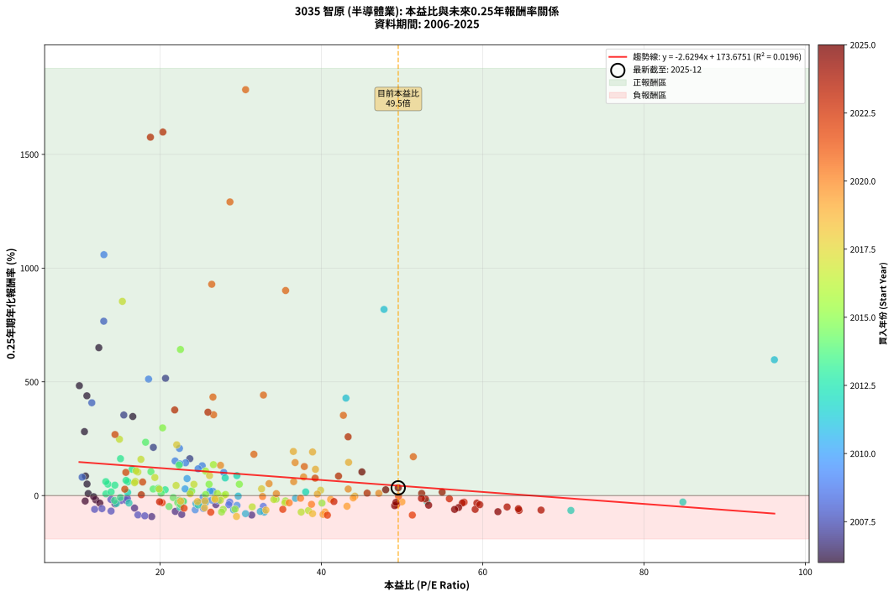
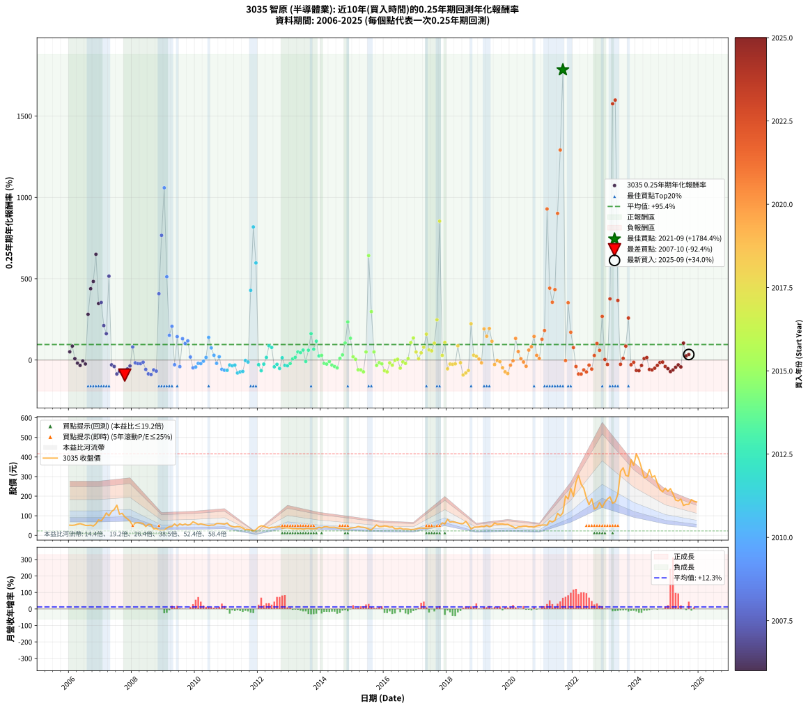

# 3035 智原 - 本益比與未來報酬率分析

!!! info "報告資訊"
    - **股票代號**: 3035
    - **公司名稱**: 智原
    - **產業別**: 半導體業
    - **分析期間**: 2006-2025 (237 個數據點)
    - **資料來源**: Type 12 (ShowMonthlyK_ChartFlow) 月收盤價與本益比
    - **報酬率口徑**: 含現金股利 (簡化: 年度合計，假設每年7/1入帳)
    - **報告生成時間**: 2026-01-10 18:50:10 CST

## 📈 視覺化圖表

### 圖表1: 本益比 vs 未來報酬率關係

*圖表1：3035 智原 本益比與0.25年期未來報酬率關係 (2006-2025)*

### 圖表2: 歷年買入時點的0.25年期實際報酬率

*圖表2：3035 智原 歷年買入時點的0.25年期實際報酬率 (2006-2025)*

## 📍 買點訊號說明

本報告提供兩種買點提示訊號（顯示於圖表2的股價子圖中）：

### ▲ 小綠色三角形（回測驗證）
- **計算方式**: 使用全部歷史資料計算本益比第25百分位數
- **用途**: 事後驗證，顯示歷史上哪些時點確實為低估區
- **限制**: 當下無法判斷，僅供回測參考
- **特性**: 後見之明（Look-Ahead Bias）

### ▲ 小橘色三角形（即時訊號）
- **計算方式**: 使用截至當月的過去5年資料計算本益比第25百分位數
- **用途**: 實際投資決策，當時即可判斷
- **優勢**: 可操作性強，符合實務需求
- **特性**: 無後見之明，滾動窗口計算

!!! tip "如何使用兩種訊號"
    - **綠色▲** 幫助理解歷史估值機會，驗證策略有效性
    - **橘色▲** 可作為實際買進參考，但仍需搭配基本面分析
    - 兩種訊號重疊時，表示即時判斷與事後驗證一致，信心度較高
    - 僅有綠色▲時，表示當時無法判斷（需要未來資料才能確認）
    - 僅有橘色▲時，表示即時判斷為買點，但事後可能不是最佳時機

## 📊 估值分析摘要

| 指標 | 數值 |
|:---:|:---:|
| **目前本益比** (2025-09) | **49.53 倍** |
| **歷史平均本益比** | 29.76 倍 |
| **估值水準** | 🔴 相對高估 |
| **預期0.25年年化報酬率** | **+43.44%** |
| **歷史平均報酬率** | +95.41% |
| **相關係數 (R²)** | 0.0196 |
| **趨勢線斜率** | -2.6294 |

!!! abstract "核心洞察"
    目前本益比顯著高於歷史平均，預期未來報酬率可能較低

    根據歷史數據回測，3035 智原 在目前本益比 **49.5倍** 的估值水準下，
    預期未來0.25年年化報酬率約為 **+43.4%**。

    **重要提醒**: 本分析基於歷史數據統計，實際報酬率會受到公司基本面變化、產業趨勢、
    總體經濟環境等多重因素影響。R² = 0.02 表示本益比可解釋約 2.0% 的報酬率變異。

## 📈 歷史估值統計

### 最佳買點 (最高報酬率)

| 項目 | 數值 |
|:---:|:---:|
| 起始時間 | 2021-09 |
| 當時本益比 | 30.61 倍 |
| 起始價格 | 115.0 元 |
| 0.25年後價格 | 239.0 元 |
| **0.25年年化報酬率** | **+1784.36%** |

### 最差買點 (最低報酬率)

| 項目 | 數值 |
|:---:|:---:|
| 起始時間 | 2007-10 |
| 當時本益比 | 18.97 倍 |
| 起始價格 | 94.5 元 |
| 0.25年後價格 | 49.4 元 |
| **0.25年年化報酬率** | **-92.39%** |

## 🎯 投資啟示

### 本益比與報酬率關係

趨勢線方程式: **y = -2.6294x + 173.6751**

!!! warning "強負相關"
    本益比與未來報酬率呈現強負相關。在高本益比時期買入，未來報酬率顯著較低；
    在低本益比時期買入，未來報酬率顯著較高。**估值紀律至關重要**。

### 估值區間建議

基於歷史數據分析:

- **🟢 低估區** (P/E < 23.8): 預期報酬率較高，可考慮增加持股
- **🟡 合理區** (P/E 23.8-35.7): 預期報酬率符合長期趨勢，正常持有
- **🔴 高估區** (P/E > 35.7): 預期報酬率較低，可考慮減碼或觀望

!!! danger "風險提示"
    - 過去表現不代表未來結果
    - 本分析假設公司基本面無重大結構性變化
    - 產業環境劇變可能使歷史規律失效
    - 應結合公司財報、產業趨勢、總體經濟等多重因素綜合判斷

!!! success "長期投資觀點"
    歷史數據顯示，在合理或低估的估值水準買入並長期持有，
    往往能獲得較佳的投資報酬。**耐心等待好價格**是價值投資的核心原則。

## 📊 數據品質

- **資料來源**: GoodInfo.tw Type 12 (ShowMonthlyK_ChartFlow)
- **資料頻率**: 月度收盤價與本益比
- **回測期間**: 2006-2025
- **數據點數量**: 237 個 (每個點代表一次0.25年期回測)

### 計算方法說明

1. **0.25年期年化報酬率**:
   - 對每個歷史時點，計算其後0.25年的實際投資報酬率
   - 期末價值(不含股利): 期末價格
   - 期末價值(含現金股利): 期末價格 + 持有期間內的現金股利合計 (簡化: 年度合計，假設每年7/1入帳)
   - 公式: 年化報酬率 = [(期末價值/期初價格)^(1/年數) - 1] × 100%

2. **本益比 (P/E Ratio)**:
   - 使用當時的月收盤價與EPS計算
   - 資料來源: Type 12 月度河流圖本益比數據

3. **趨勢線 (Linear Regression)**:
   - 使用最小平方法擬合線性趨勢線
   - R²值衡量本益比對報酬率的解釋能力

---

*本報告由 Stock Analysis System v1.9.0 自動生成*
*數據更新時間: 2026-01-10 18:50:10 CST*

## 📋 月度回測明細表

（每一列對應時間線圖中的一個買入點；可用來對照 SVG 圖上的每個點。）

| 買入月份 | 賣出月份 | 回測期限_年 | 實際持有年數 | 買入本益比_倍 | 買入收盤價_元 | 賣出收盤價_元 | 現金股利合計_元 | 總報酬率_pct | 年化報酬率_pct |
| --- | --- | --- | --- | --- | --- | --- | --- | --- | --- |
| 2006-01 | 2006-05 | 0.25 | 0.329 | 10.95 | 51.90 | 59.40 | 0.00 | +14.45 | +50.81 |
| 2006-02 | 2006-05 | 0.25 | 0.246 | 10.76 | 51.00 | 59.40 | 0.00 | +16.47 | +85.66 |
| 2006-03 | 2006-07 | 0.25 | 0.334 | 11.10 | 52.60 | 50.80 | 3.30 | +2.85 | +8.78 |
| 2006-04 | 2006-07 | 0.25 | 0.249 | 12.03 | 57.00 | 50.80 | 3.30 | -5.09 | -18.91 |
| 2006-05 | 2006-08 | 0.25 | 0.252 | 12.53 | 59.40 | 50.40 | 3.30 | -9.60 | -33.00 |
| 2006-06 | 2006-09 | 0.25 | 0.252 | 11.77 | 55.80 | 51.80 | 3.30 | -1.25 | -4.89 |
| 2006-07 | 2006-10 | 0.25 | 0.252 | 10.72 | 50.80 | 47.40 | 0.00 | -6.69 | -24.04 |
| 2006-08 | 2006-12 | 0.25 | 0.334 | 10.63 | 50.40 | 78.80 | 0.00 | +56.35 | +281.15 |
| 2006-09 | 2006-12 | 0.25 | 0.249 | 10.93 | 51.80 | 78.80 | 0.00 | +52.12 | +438.63 |
| 2006-10 | 2007-01 | 0.25 | 0.252 | 10.00 | 47.40 | 73.90 | 0.00 | +55.91 | +483.04 |
| 2006-11 | 2007-03 | 0.25 | 0.329 | 12.41 | 58.80 | 114.00 | 0.00 | +93.88 | +650.17 |
| 2006-12 | 2007-03 | 0.25 | 0.246 | 16.62 | 78.80 | 114.00 | 0.00 | +44.67 | +347.58 |
| 2007-01 | 2007-05 | 0.25 | 0.329 | 15.51 | 73.90 | 121.50 | 0.00 | +64.41 | +354.20 |
| 2007-02 | 2007-05 | 0.25 | 0.246 | 19.17 | 91.80 | 121.50 | 0.00 | +32.35 | +211.91 |
| 2007-03 | 2007-07 | 0.25 | 0.334 | 23.69 | 114.00 | 154.00 | 3.27 | +37.96 | +162.05 |
| 2007-04 | 2007-07 | 0.25 | 0.249 | 20.68 | 100.00 | 154.00 | 3.27 | +57.27 | +515.61 |
| 2007-05 | 2007-08 | 0.25 | 0.252 | 25.00 | 121.50 | 108.00 | 3.27 | -8.42 | -29.47 |
| 2007-06 | 2007-09 | 0.25 | 0.252 | 26.92 | 131.50 | 112.50 | 3.27 | -11.96 | -39.69 |
| 2007-07 | 2007-10 | 0.25 | 0.252 | 31.37 | 154.00 | 94.50 | 0.00 | -38.64 | -85.61 |
| 2007-08 | 2007-12 | 0.25 | 0.334 | 21.89 | 108.00 | 72.50 | 0.00 | -32.87 | -69.67 |
| 2007-09 | 2007-12 | 0.25 | 0.249 | 22.69 | 112.50 | 72.50 | 0.00 | -35.56 | -82.86 |
| 2007-10 | 2008-01 | 0.25 | 0.252 | 18.97 | 94.50 | 49.40 | 0.00 | -47.72 | -92.39 |
| 2007-11 | 2008-03 | 0.25 | 0.331 | 16.84 | 84.30 | 64.80 | 0.00 | -23.13 | -54.80 |
| 2007-12 | 2008-03 | 0.25 | 0.249 | 14.41 | 72.50 | 64.80 | 0.00 | -10.62 | -36.28 |
| 2008-01 | 2008-05 | 0.25 | 0.331 | 10.34 | 49.40 | 60.10 | 0.00 | +21.66 | +80.73 |
| 2008-02 | 2008-05 | 0.25 | 0.249 | 13.92 | 63.00 | 60.10 | 0.00 | -4.60 | -17.23 |
| 2008-03 | 2008-07 | 0.25 | 0.334 | 15.17 | 64.80 | 56.30 | 3.49 | -7.73 | -21.40 |
| 2008-04 | 2008-07 | 0.25 | 0.249 | 15.82 | 63.60 | 56.30 | 3.49 | -5.99 | -21.95 |
| 2008-05 | 2008-08 | 0.25 | 0.252 | 15.95 | 60.10 | 54.50 | 3.49 | -3.51 | -13.22 |
| 2008-06 | 2008-09 | 0.25 | 0.252 | 12.80 | 45.00 | 32.80 | 3.49 | -19.35 | -57.43 |
| 2008-07 | 2008-10 | 0.25 | 0.252 | 17.26 | 56.30 | 34.90 | 0.00 | -38.01 | -85.02 |
| 2008-08 | 2008-12 | 0.25 | 0.334 | 18.11 | 54.50 | 26.05 | 0.00 | -52.20 | -89.03 |
| 2008-09 | 2008-12 | 0.25 | 0.249 | 11.89 | 32.80 | 26.05 | 0.00 | -20.58 | -60.34 |
| 2008-10 | 2009-01 | 0.25 | 0.252 | 13.93 | 34.90 | 26.20 | 0.00 | -24.93 | -67.96 |
| 2008-11 | 2009-03 | 0.25 | 0.329 | 11.54 | 26.00 | 44.35 | 0.00 | +70.58 | +408.05 |
| 2008-12 | 2009-03 | 0.25 | 0.246 | 13.02 | 26.05 | 44.35 | 0.00 | +70.25 | +766.61 |
| 2009-01 | 2009-05 | 0.25 | 0.329 | 13.04 | 26.20 | 58.60 | 0.00 | +123.66 | +1059.00 |
| 2009-02 | 2009-05 | 0.25 | 0.246 | 18.58 | 37.50 | 58.60 | 0.00 | +56.27 | +512.03 |
| 2009-03 | 2009-07 | 0.25 | 0.334 | 21.87 | 44.35 | 58.90 | 1.49 | +36.18 | +152.04 |
| 2009-04 | 2009-07 | 0.25 | 0.249 | 22.41 | 45.65 | 58.90 | 1.49 | +32.30 | +207.53 |
| 2009-05 | 2009-08 | 0.25 | 0.252 | 28.64 | 58.60 | 52.30 | 1.49 | -8.20 | -28.80 |
| 2009-06 | 2009-09 | 0.25 | 0.252 | 23.16 | 47.60 | 58.10 | 1.49 | +25.20 | +144.04 |
| 2009-07 | 2009-10 | 0.25 | 0.252 | 28.53 | 58.90 | 51.70 | 0.00 | -12.22 | -40.41 |
| 2009-08 | 2009-12 | 0.25 | 0.334 | 25.23 | 52.30 | 69.20 | 0.00 | +32.31 | +131.24 |
| 2009-09 | 2009-12 | 0.25 | 0.249 | 27.90 | 58.10 | 69.20 | 0.00 | +19.10 | +101.73 |
| 2009-10 | 2010-01 | 0.25 | 0.252 | 24.72 | 51.70 | 62.90 | 0.00 | +21.66 | +117.82 |
| 2009-11 | 2010-03 | 0.25 | 0.329 | 26.56 | 55.80 | 59.00 | 0.00 | +5.73 | +18.50 |
| 2009-12 | 2010-03 | 0.25 | 0.246 | 32.80 | 69.20 | 59.00 | 0.00 | -14.74 | -47.65 |
| 2010-01 | 2010-05 | 0.25 | 0.329 | 29.54 | 62.90 | 52.30 | 0.00 | -16.85 | -42.98 |
| 2010-02 | 2010-05 | 0.25 | 0.246 | 25.74 | 55.30 | 52.30 | 0.00 | -5.42 | -20.26 |
| 2010-03 | 2010-07 | 0.25 | 0.334 | 27.22 | 59.00 | 52.40 | 2.00 | -7.80 | -21.58 |
| 2010-04 | 2010-07 | 0.25 | 0.249 | 25.34 | 55.40 | 52.40 | 2.00 | -1.81 | -7.06 |
| 2010-05 | 2010-08 | 0.25 | 0.252 | 23.71 | 52.30 | 52.30 | 2.00 | +3.82 | +16.05 |
| 2010-06 | 2010-09 | 0.25 | 0.252 | 22.47 | 50.00 | 60.30 | 2.00 | +24.60 | +139.42 |
| 2010-07 | 2010-10 | 0.25 | 0.252 | 23.35 | 52.40 | 60.30 | 0.00 | +15.08 | +74.63 |
| 2010-08 | 2010-12 | 0.25 | 0.334 | 23.11 | 52.30 | 57.00 | 0.00 | +8.99 | +29.39 |
| 2010-09 | 2010-12 | 0.25 | 0.249 | 26.42 | 60.30 | 57.00 | 0.00 | -5.47 | -20.22 |
| 2010-10 | 2011-01 | 0.25 | 0.252 | 26.20 | 60.30 | 63.20 | 0.00 | +4.81 | +20.50 |
| 2010-11 | 2011-03 | 0.25 | 0.329 | 25.38 | 58.90 | 44.75 | 0.00 | -24.02 | -56.67 |
| 2010-12 | 2011-03 | 0.25 | 0.246 | 24.36 | 57.00 | 44.75 | 0.00 | -21.49 | -62.54 |
| 2011-01 | 2011-05 | 0.25 | 0.329 | 29.12 | 63.20 | 45.60 | 0.00 | -27.85 | -62.97 |
| 2011-02 | 2011-05 | 0.25 | 0.246 | 24.93 | 49.85 | 45.60 | 0.00 | -8.53 | -30.35 |
| 2011-03 | 2011-07 | 0.25 | 0.334 | 24.45 | 44.75 | 37.30 | 1.50 | -13.31 | -34.79 |
| 2011-04 | 2011-07 | 0.25 | 0.249 | 25.63 | 42.55 | 37.30 | 1.50 | -8.82 | -30.98 |
| 2011-05 | 2011-08 | 0.25 | 0.252 | 30.60 | 45.60 | 29.10 | 1.50 | -32.91 | -79.49 |
| 2011-06 | 2011-09 | 0.25 | 0.252 | 32.92 | 43.45 | 29.80 | 1.50 | -27.97 | -72.82 |
| 2011-07 | 2011-10 | 0.25 | 0.252 | 32.43 | 37.30 | 27.55 | 0.00 | -26.14 | -69.97 |
| 2011-08 | 2011-12 | 0.25 | 0.334 | 29.69 | 29.10 | 28.85 | 0.00 | -0.86 | -2.55 |
| 2011-09 | 2011-12 | 0.25 | 0.249 | 36.79 | 29.80 | 28.85 | 0.00 | -3.19 | -12.19 |
| 2011-10 | 2012-01 | 0.25 | 0.252 | 43.05 | 27.55 | 41.90 | 0.00 | +52.09 | +428.36 |
| 2011-11 | 2012-03 | 0.25 | 0.331 | 47.77 | 22.45 | 46.80 | 0.00 | +108.46 | +818.38 |
| 2011-12 | 2012-03 | 0.25 | 0.249 | 96.17 | 28.85 | 46.80 | 0.00 | +62.22 | +597.09 |
| 2012-01 | 2012-05 | 0.25 | 0.331 | 84.82 | 41.90 | 37.50 | 0.00 | -10.50 | -28.46 |
| 2012-02 | 2012-05 | 0.25 | 0.249 | 70.94 | 48.80 | 37.50 | 0.00 | -23.16 | -65.26 |
| 2012-03 | 2012-07 | 0.25 | 0.334 | 53.07 | 46.80 | 41.00 | 1.50 | -9.19 | -25.08 |
| 2012-04 | 2012-07 | 0.25 | 0.249 | 38.06 | 40.95 | 41.00 | 1.50 | +3.78 | +16.05 |
| 2012-05 | 2012-08 | 0.25 | 0.252 | 29.53 | 37.50 | 42.45 | 1.50 | +17.19 | +87.73 |
| 2012-06 | 2012-09 | 0.25 | 0.252 | 28.08 | 41.10 | 46.00 | 1.50 | +15.56 | +77.59 |
| 2012-07 | 2012-10 | 0.25 | 0.252 | 24.73 | 41.00 | 35.80 | 0.00 | -12.68 | -41.63 |
| 2012-08 | 2012-12 | 0.25 | 0.334 | 22.92 | 42.45 | 38.35 | 0.00 | -9.66 | -26.22 |
| 2012-09 | 2012-12 | 0.25 | 0.249 | 22.49 | 46.00 | 38.35 | 0.00 | -16.63 | -51.81 |
| 2012-10 | 2013-01 | 0.25 | 0.252 | 15.98 | 35.80 | 37.00 | 0.00 | +3.35 | +13.98 |
| 2012-11 | 2013-03 | 0.25 | 0.329 | 16.15 | 39.30 | 34.50 | 0.00 | -12.21 | -32.73 |
| 2012-12 | 2013-03 | 0.25 | 0.246 | 14.59 | 38.35 | 34.50 | 0.00 | -10.04 | -34.91 |
| 2013-01 | 2013-05 | 0.25 | 0.329 | 14.36 | 37.00 | 34.20 | 0.00 | -7.57 | -21.30 |
| 2013-02 | 2013-05 | 0.25 | 0.246 | 13.30 | 33.60 | 34.20 | 0.00 | +1.79 | +7.45 |
| 2013-03 | 2013-07 | 0.25 | 0.334 | 13.94 | 34.50 | 34.30 | 2.00 | +5.21 | +16.44 |
| 2013-04 | 2013-07 | 0.25 | 0.249 | 13.53 | 32.80 | 34.30 | 2.00 | +10.67 | +50.21 |
| 2013-05 | 2013-08 | 0.25 | 0.252 | 14.40 | 34.20 | 35.60 | 2.00 | +9.94 | +45.67 |
| 2013-06 | 2013-09 | 0.25 | 0.252 | 13.28 | 30.85 | 32.80 | 2.00 | +12.80 | +61.32 |
| 2013-07 | 2013-10 | 0.25 | 0.252 | 15.09 | 34.30 | 33.50 | 0.00 | -2.33 | -8.94 |
| 2013-08 | 2013-12 | 0.25 | 0.334 | 16.02 | 35.60 | 41.70 | 0.00 | +17.13 | +60.56 |
| 2013-09 | 2013-12 | 0.25 | 0.249 | 15.10 | 32.80 | 41.70 | 0.00 | +27.13 | +162.11 |
| 2013-10 | 2014-01 | 0.25 | 0.252 | 15.79 | 33.50 | 38.10 | 0.00 | +13.73 | +66.67 |
| 2013-11 | 2014-03 | 0.25 | 0.329 | 16.54 | 34.25 | 44.10 | 0.00 | +28.76 | +115.84 |
| 2013-12 | 2014-03 | 0.25 | 0.246 | 20.64 | 41.70 | 44.10 | 0.00 | +5.76 | +25.50 |
| 2014-01 | 2014-05 | 0.25 | 0.329 | 19.15 | 38.10 | 41.40 | 0.00 | +8.66 | +28.77 |
| 2014-02 | 2014-05 | 0.25 | 0.246 | 22.37 | 43.80 | 41.40 | 0.00 | -5.48 | -20.44 |
| 2014-03 | 2014-07 | 0.25 | 0.334 | 22.88 | 44.10 | 38.10 | 2.00 | -9.08 | -24.80 |
| 2014-04 | 2014-07 | 0.25 | 0.249 | 21.64 | 41.05 | 38.10 | 2.00 | -2.32 | -9.01 |
| 2014-05 | 2014-08 | 0.25 | 0.252 | 22.19 | 41.40 | 35.70 | 2.00 | -8.95 | -31.07 |
| 2014-06 | 2014-09 | 0.25 | 0.252 | 22.56 | 41.40 | 34.45 | 2.00 | -11.97 | -39.71 |
| 2014-07 | 2014-10 | 0.25 | 0.252 | 21.12 | 38.10 | 32.30 | 0.00 | -15.22 | -48.09 |
| 2014-08 | 2014-12 | 0.25 | 0.334 | 20.13 | 35.70 | 36.90 | 0.00 | +3.36 | +10.40 |
| 2014-09 | 2014-12 | 0.25 | 0.249 | 19.77 | 34.45 | 36.90 | 0.00 | +7.11 | +31.75 |
| 2014-10 | 2015-01 | 0.25 | 0.252 | 18.87 | 32.30 | 38.70 | 0.00 | +19.81 | +104.97 |
| 2014-11 | 2015-03 | 0.25 | 0.329 | 18.21 | 30.60 | 45.50 | 0.00 | +48.69 | +234.51 |
| 2014-12 | 2015-03 | 0.25 | 0.246 | 22.36 | 36.90 | 45.50 | 0.00 | +23.31 | +134.02 |
| 2015-01 | 2015-05 | 0.25 | 0.329 | 23.93 | 38.70 | 41.10 | 0.00 | +6.20 | +20.10 |
| 2015-02 | 2015-05 | 0.25 | 0.246 | 25.65 | 40.65 | 41.10 | 0.00 | +1.11 | +4.57 |
| 2015-03 | 2015-07 | 0.25 | 0.334 | 29.31 | 45.50 | 32.05 | 1.52 | -26.22 | -59.77 |
| 2015-04 | 2015-07 | 0.25 | 0.249 | 27.83 | 42.30 | 32.05 | 1.52 | -20.64 | -60.47 |
| 2015-05 | 2015-08 | 0.25 | 0.252 | 27.63 | 41.10 | 28.25 | 1.52 | -27.57 | -72.21 |
| 2015-06 | 2015-09 | 0.25 | 0.252 | 26.08 | 37.95 | 40.50 | 1.52 | +10.72 | +49.82 |
| 2015-07 | 2015-10 | 0.25 | 0.252 | 22.53 | 32.05 | 53.10 | 0.00 | +65.68 | +642.18 |
| 2015-08 | 2015-12 | 0.25 | 0.334 | 20.32 | 28.25 | 44.80 | 0.00 | +58.58 | +297.69 |
| 2015-09 | 2015-12 | 0.25 | 0.249 | 29.83 | 40.50 | 44.80 | 0.00 | +10.62 | +49.93 |
| 2015-10 | 2016-01 | 0.25 | 0.252 | 40.08 | 53.10 | 48.00 | 0.00 | -9.60 | -33.03 |
| 2015-11 | 2016-03 | 0.25 | 0.331 | 34.39 | 44.45 | 41.95 | 0.00 | -5.62 | -16.03 |
| 2015-12 | 2016-03 | 0.25 | 0.249 | 35.56 | 44.80 | 41.95 | 0.00 | -6.36 | -23.19 |
| 2016-01 | 2016-05 | 0.25 | 0.331 | 38.40 | 48.00 | 33.70 | 0.00 | -29.79 | -65.62 |
| 2016-02 | 2016-05 | 0.25 | 0.249 | 37.50 | 46.50 | 33.70 | 0.00 | -27.53 | -72.53 |
| 2016-03 | 2016-07 | 0.25 | 0.334 | 34.11 | 41.95 | 37.40 | 2.00 | -6.08 | -17.12 |
| 2016-04 | 2016-07 | 0.25 | 0.249 | 35.49 | 43.30 | 37.40 | 2.00 | -9.01 | -31.53 |
| 2016-05 | 2016-08 | 0.25 | 0.252 | 27.85 | 33.70 | 31.60 | 2.00 | -0.30 | -1.17 |
| 2016-06 | 2016-09 | 0.25 | 0.252 | 28.12 | 33.75 | 32.15 | 2.00 | +1.19 | +4.79 |
| 2016-07 | 2016-10 | 0.25 | 0.252 | 31.43 | 37.40 | 31.45 | 0.00 | -15.91 | -49.74 |
| 2016-08 | 2016-12 | 0.25 | 0.334 | 26.78 | 31.60 | 30.35 | 0.00 | -3.96 | -11.38 |
| 2016-09 | 2016-12 | 0.25 | 0.249 | 27.48 | 32.15 | 30.35 | 0.00 | -5.60 | -20.65 |
| 2016-10 | 2017-01 | 0.25 | 0.252 | 27.11 | 31.45 | 32.15 | 0.00 | +2.23 | +9.13 |
| 2016-11 | 2017-03 | 0.25 | 0.329 | 25.65 | 29.50 | 37.50 | 0.00 | +27.12 | +107.58 |
| 2016-12 | 2017-03 | 0.25 | 0.246 | 26.62 | 30.35 | 37.50 | 0.00 | +23.56 | +135.97 |
| 2017-01 | 2017-05 | 0.25 | 0.329 | 24.20 | 32.15 | 36.70 | 0.00 | +14.15 | +49.61 |
| 2017-02 | 2017-05 | 0.25 | 0.246 | 23.74 | 36.00 | 36.70 | 0.00 | +1.94 | +8.13 |
| 2017-03 | 2017-07 | 0.25 | 0.334 | 21.99 | 37.50 | 41.40 | 1.00 | +13.07 | +44.44 |
| 2017-04 | 2017-07 | 0.25 | 0.249 | 19.36 | 36.65 | 41.40 | 1.00 | +15.69 | +79.49 |
| 2017-05 | 2017-08 | 0.25 | 0.252 | 17.63 | 36.70 | 45.65 | 1.00 | +27.11 | +159.20 |
| 2017-06 | 2017-09 | 0.25 | 0.252 | 16.94 | 38.45 | 42.45 | 1.00 | +13.00 | +62.48 |
| 2017-07 | 2017-10 | 0.25 | 0.252 | 16.84 | 41.40 | 46.35 | 0.00 | +11.96 | +56.58 |
| 2017-08 | 2017-12 | 0.25 | 0.334 | 17.25 | 45.65 | 57.90 | 0.00 | +26.83 | +103.74 |
| 2017-09 | 2017-12 | 0.25 | 0.249 | 14.97 | 42.45 | 57.90 | 0.00 | +36.40 | +247.58 |
| 2017-10 | 2018-01 | 0.25 | 0.252 | 15.33 | 46.35 | 81.80 | 0.00 | +76.48 | +853.76 |
| 2017-11 | 2018-03 | 0.25 | 0.329 | 19.90 | 63.90 | 69.40 | 0.00 | +8.61 | +28.57 |
| 2017-12 | 2018-03 | 0.25 | 0.246 | 17.03 | 57.90 | 69.40 | 0.00 | +19.86 | +108.60 |
| 2018-01 | 2018-05 | 0.25 | 0.329 | 25.52 | 81.80 | 63.40 | 0.00 | -22.49 | -53.96 |
| 2018-02 | 2018-05 | 0.25 | 0.246 | 22.56 | 67.90 | 63.40 | 0.00 | -6.63 | -24.29 |
| 2018-03 | 2018-07 | 0.25 | 0.334 | 24.65 | 69.40 | 60.00 | 2.70 | -9.65 | -26.21 |
| 2018-04 | 2018-07 | 0.25 | 0.249 | 25.57 | 67.00 | 60.00 | 2.70 | -6.42 | -23.37 |
| 2018-05 | 2018-08 | 0.25 | 0.252 | 26.14 | 63.40 | 71.60 | 2.70 | +17.19 | +87.73 |
| 2018-06 | 2018-09 | 0.25 | 0.252 | 26.82 | 59.80 | 54.50 | 2.70 | -4.35 | -16.18 |
| 2018-07 | 2018-10 | 0.25 | 0.252 | 29.48 | 60.00 | 32.00 | 0.00 | -46.67 | -91.76 |
| 2018-08 | 2018-12 | 0.25 | 0.334 | 38.91 | 71.60 | 42.30 | 0.00 | -40.92 | -79.31 |
| 2018-09 | 2018-12 | 0.25 | 0.249 | 33.13 | 54.50 | 42.30 | 0.00 | -22.39 | -63.84 |
| 2018-10 | 2019-01 | 0.25 | 0.252 | 22.07 | 32.00 | 43.00 | 0.00 | +34.38 | +223.18 |
| 2018-11 | 2019-03 | 0.25 | 0.329 | 32.59 | 40.90 | 44.55 | 0.00 | +8.92 | +29.72 |
| 2018-12 | 2019-03 | 0.25 | 0.246 | 39.91 | 42.30 | 44.55 | 0.00 | +5.32 | +23.41 |
| 2019-01 | 2019-05 | 0.25 | 0.329 | 39.51 | 43.00 | 43.90 | 0.00 | +2.09 | +6.51 |
| 2019-02 | 2019-05 | 0.25 | 0.246 | 41.15 | 45.95 | 43.90 | 0.00 | -4.46 | -16.91 |
| 2019-03 | 2019-07 | 0.25 | 0.334 | 38.91 | 44.55 | 62.90 | 0.80 | +42.99 | +191.69 |
| 2019-04 | 2019-07 | 0.25 | 0.249 | 43.38 | 50.90 | 62.90 | 0.80 | +25.15 | +146.05 |
| 2019-05 | 2019-08 | 0.25 | 0.252 | 36.53 | 43.90 | 56.80 | 0.80 | +31.21 | +193.97 |
| 2019-06 | 2019-09 | 0.25 | 0.252 | 39.27 | 48.30 | 57.80 | 0.80 | +21.33 | +115.42 |
| 2019-07 | 2019-10 | 0.25 | 0.252 | 49.99 | 62.90 | 58.00 | 0.00 | -7.79 | -27.53 |
| 2019-08 | 2019-12 | 0.25 | 0.334 | 44.15 | 56.80 | 56.30 | 0.00 | -0.88 | -2.61 |
| 2019-09 | 2019-12 | 0.25 | 0.249 | 43.95 | 57.80 | 56.30 | 0.00 | -2.60 | -10.02 |
| 2019-10 | 2020-01 | 0.25 | 0.252 | 43.18 | 58.00 | 49.45 | 0.00 | -14.74 | -46.91 |
| 2019-11 | 2020-03 | 0.25 | 0.331 | 40.46 | 55.50 | 36.30 | 0.00 | -34.59 | -72.24 |
| 2019-12 | 2020-03 | 0.25 | 0.249 | 40.21 | 56.30 | 36.30 | 0.00 | -35.52 | -82.82 |
| 2020-01 | 2020-05 | 0.25 | 0.331 | 36.01 | 49.45 | 43.60 | 0.00 | -11.83 | -31.62 |
| 2020-02 | 2020-05 | 0.25 | 0.249 | 32.71 | 44.05 | 43.60 | 0.00 | -1.02 | -4.04 |
| 2020-03 | 2020-07 | 0.25 | 0.334 | 27.50 | 36.30 | 47.05 | 1.10 | +32.64 | +132.98 |
| 2020-04 | 2020-07 | 0.25 | 0.249 | 33.52 | 43.35 | 47.05 | 1.10 | +11.07 | +52.42 |
| 2020-05 | 2020-08 | 0.25 | 0.252 | 34.42 | 43.60 | 43.40 | 1.10 | +2.06 | +8.45 |
| 2020-06 | 2020-09 | 0.25 | 0.252 | 37.42 | 46.40 | 43.85 | 1.10 | -3.12 | -11.84 |
| 2020-07 | 2020-10 | 0.25 | 0.252 | 38.78 | 47.05 | 41.65 | 0.00 | -11.48 | -38.37 |
| 2020-08 | 2020-12 | 0.25 | 0.334 | 36.57 | 43.40 | 50.90 | 0.00 | +17.28 | +61.16 |
| 2020-09 | 2020-12 | 0.25 | 0.249 | 37.80 | 43.85 | 50.90 | 0.00 | +16.08 | +81.92 |
| 2020-10 | 2021-01 | 0.25 | 0.252 | 36.75 | 41.65 | 52.20 | 0.00 | +25.33 | +145.07 |
| 2020-11 | 2021-03 | 0.25 | 0.329 | 43.33 | 47.95 | 52.10 | 0.00 | +8.65 | +28.74 |
| 2020-12 | 2021-03 | 0.25 | 0.246 | 47.13 | 50.90 | 52.10 | 0.00 | +2.36 | +9.92 |
| 2021-01 | 2021-05 | 0.25 | 0.329 | 37.89 | 52.20 | 68.40 | 0.00 | +31.03 | +127.66 |
| 2021-02 | 2021-05 | 0.25 | 0.246 | 31.64 | 53.00 | 68.40 | 0.00 | +29.06 | +181.57 |
| 2021-03 | 2021-07 | 0.25 | 0.334 | 26.41 | 52.10 | 112.50 | 1.00 | +117.85 | +928.95 |
| 2021-04 | 2021-07 | 0.25 | 0.249 | 32.82 | 74.50 | 112.50 | 1.00 | +52.35 | +441.84 |
| 2021-05 | 2021-08 | 0.25 | 0.252 | 26.64 | 68.40 | 99.20 | 1.00 | +46.49 | +355.29 |
| 2021-06 | 2021-09 | 0.25 | 0.252 | 26.56 | 76.10 | 115.00 | 1.00 | +52.43 | +433.12 |
| 2021-07 | 2021-10 | 0.25 | 0.252 | 35.57 | 112.50 | 201.00 | 0.00 | +78.67 | +901.48 |
| 2021-08 | 2021-12 | 0.25 | 0.334 | 28.67 | 99.20 | 239.00 | 0.00 | +140.93 | +1290.95 |
| 2021-09 | 2021-12 | 0.25 | 0.249 | 30.61 | 115.00 | 239.00 | 0.00 | +107.83 | +1784.36 |
| 2021-10 | 2022-01 | 0.25 | 0.252 | 49.57 | 201.00 | 199.50 | 0.00 | -0.75 | -2.93 |
| 2021-11 | 2022-03 | 0.25 | 0.329 | 42.73 | 186.00 | 305.50 | 0.00 | +64.25 | +352.82 |
| 2021-12 | 2022-03 | 0.25 | 0.246 | 51.40 | 239.00 | 305.50 | 0.00 | +27.82 | +170.81 |
| 2022-01 | 2022-05 | 0.25 | 0.329 | 39.23 | 199.50 | 240.50 | 0.00 | +20.55 | +76.63 |
| 2022-02 | 2022-05 | 0.25 | 0.246 | 49.35 | 272.50 | 240.50 | 0.00 | -11.74 | -39.77 |
| 2022-03 | 2022-07 | 0.25 | 0.334 | 51.28 | 305.50 | 156.00 | 3.30 | -47.86 | -85.77 |
| 2022-04 | 2022-07 | 0.25 | 0.249 | 40.75 | 260.50 | 156.00 | 3.30 | -38.85 | -86.11 |
| 2022-05 | 2022-08 | 0.25 | 0.252 | 35.22 | 240.50 | 187.00 | 3.30 | -20.87 | -60.52 |
| 2022-06 | 2022-09 | 0.25 | 0.252 | 26.29 | 191.00 | 134.00 | 3.30 | -28.12 | -73.03 |
| 2022-07 | 2022-10 | 0.25 | 0.252 | 20.26 | 156.00 | 142.00 | 0.00 | -8.97 | -31.15 |
| 2022-08 | 2022-12 | 0.25 | 0.334 | 22.98 | 187.00 | 142.50 | 0.00 | -23.80 | -55.68 |
| 2022-09 | 2022-12 | 0.25 | 0.249 | 15.63 | 134.00 | 142.50 | 0.00 | +6.34 | +28.00 |
| 2022-10 | 2023-01 | 0.25 | 0.252 | 15.76 | 142.00 | 169.50 | 0.00 | +19.37 | +101.94 |
| 2022-11 | 2023-03 | 0.25 | 0.329 | 17.84 | 168.50 | 196.50 | 0.00 | +16.62 | +59.66 |
| 2022-12 | 2023-03 | 0.25 | 0.246 | 14.42 | 142.50 | 196.50 | 0.00 | +37.89 | +268.41 |
| 2023-01 | 2023-05 | 0.25 | 0.329 | 17.68 | 169.50 | 171.50 | 0.00 | +1.18 | +3.63 |
| 2023-02 | 2023-05 | 0.25 | 0.246 | 19.95 | 185.50 | 171.50 | 0.00 | -7.55 | -27.27 |
| 2023-03 | 2023-07 | 0.25 | 0.334 | 21.82 | 196.50 | 326.00 | 5.00 | +68.45 | +376.44 |
| 2023-04 | 2023-07 | 0.25 | 0.249 | 18.81 | 164.00 | 326.00 | 5.00 | +101.83 | +1575.43 |
| 2023-05 | 2023-08 | 0.25 | 0.252 | 20.35 | 171.50 | 345.00 | 5.00 | +104.08 | +1598.07 |
| 2023-06 | 2023-09 | 0.25 | 0.252 | 25.94 | 211.00 | 306.00 | 5.00 | +47.39 | +366.53 |
| 2023-07 | 2023-10 | 0.25 | 0.252 | 41.56 | 326.00 | 302.00 | 0.00 | -7.36 | -26.18 |
| 2023-08 | 2023-12 | 0.25 | 0.334 | 45.68 | 345.00 | 357.00 | 0.00 | +3.48 | +10.78 |
| 2023-09 | 2023-12 | 0.25 | 0.249 | 42.13 | 306.00 | 357.00 | 0.00 | +16.67 | +85.66 |
| 2023-10 | 2024-01 | 0.25 | 0.252 | 43.32 | 302.00 | 416.50 | 0.00 | +37.91 | +258.31 |
| 2023-11 | 2024-03 | 0.25 | 0.331 | 57.70 | 385.50 | 344.00 | 0.00 | -10.77 | -29.09 |
| 2023-12 | 2024-03 | 0.25 | 0.249 | 55.87 | 357.00 | 344.00 | 0.00 | -3.64 | -13.83 |
| 2024-01 | 2024-05 | 0.25 | 0.331 | 67.24 | 416.50 | 297.50 | 0.00 | -28.57 | -63.78 |
| 2024-02 | 2024-05 | 0.25 | 0.249 | 64.52 | 387.00 | 297.50 | 0.00 | -23.13 | -65.20 |
| 2024-03 | 2024-07 | 0.25 | 0.334 | 59.28 | 344.00 | 296.50 | 4.29 | -12.56 | -33.09 |
| 2024-04 | 2024-07 | 0.25 | 0.249 | 52.44 | 294.00 | 296.50 | 4.29 | +2.31 | +9.60 |
| 2024-05 | 2024-08 | 0.25 | 0.252 | 54.98 | 297.50 | 304.00 | 4.29 | +3.63 | +15.20 |
| 2024-06 | 2024-09 | 0.25 | 0.252 | 64.43 | 336.00 | 266.00 | 4.29 | -19.56 | -57.85 |
| 2024-07 | 2024-10 | 0.25 | 0.252 | 59.07 | 296.50 | 234.50 | 0.00 | -20.91 | -60.60 |
| 2024-08 | 2024-12 | 0.25 | 0.334 | 63.03 | 304.00 | 241.00 | 0.00 | -20.72 | -50.11 |
| 2024-09 | 2024-12 | 0.25 | 0.249 | 57.48 | 266.00 | 241.00 | 0.00 | -9.40 | -32.71 |
| 2024-10 | 2025-01 | 0.25 | 0.252 | 52.91 | 234.50 | 225.00 | 0.00 | -4.05 | -15.14 |
| 2024-11 | 2025-03 | 0.25 | 0.329 | 52.41 | 222.00 | 212.50 | 0.00 | -4.28 | -12.46 |
| 2024-12 | 2025-03 | 0.25 | 0.246 | 59.65 | 241.00 | 212.50 | 0.00 | -11.83 | -40.00 |
| 2025-01 | 2025-05 | 0.25 | 0.329 | 57.01 | 225.00 | 176.00 | 0.00 | -21.78 | -52.65 |
| 2025-02 | 2025-05 | 0.25 | 0.246 | 61.89 | 238.50 | 176.00 | 0.00 | -26.21 | -70.87 |
| 2025-03 | 2025-07 | 0.25 | 0.334 | 56.52 | 212.50 | 152.50 | 3.00 | -26.82 | -60.74 |
| 2025-04 | 2025-07 | 0.25 | 0.249 | 49.09 | 180.00 | 152.50 | 3.00 | -13.61 | -44.41 |
| 2025-05 | 2025-08 | 0.25 | 0.252 | 49.25 | 176.00 | 158.00 | 3.00 | -8.52 | -29.79 |
| 2025-06 | 2025-09 | 0.25 | 0.252 | 53.30 | 185.50 | 158.50 | 3.00 | -12.94 | -42.31 |
| 2025-07 | 2025-10 | 0.25 | 0.252 | 45.03 | 152.50 | 182.50 | 0.00 | +19.67 | +104.00 |
| 2025-08 | 2025-12 | 0.25 | 0.334 | 47.98 | 158.00 | 170.50 | 0.00 | +7.91 | +25.60 |
| 2025-09 | 2025-12 | 0.25 | 0.249 | 49.53 | 158.50 | 170.50 | 0.00 | +7.57 | +34.03 |
