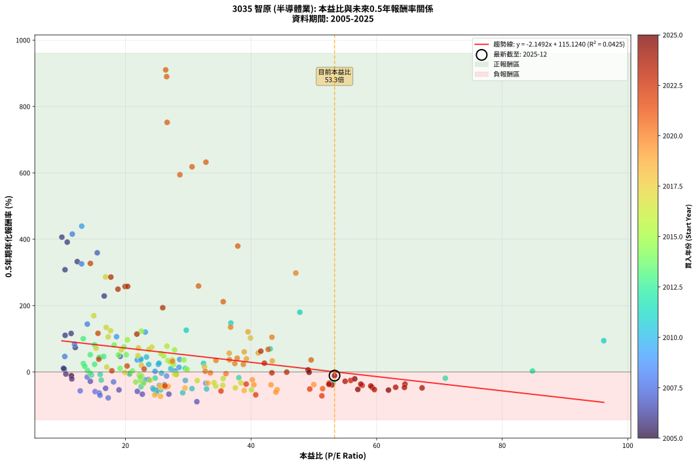
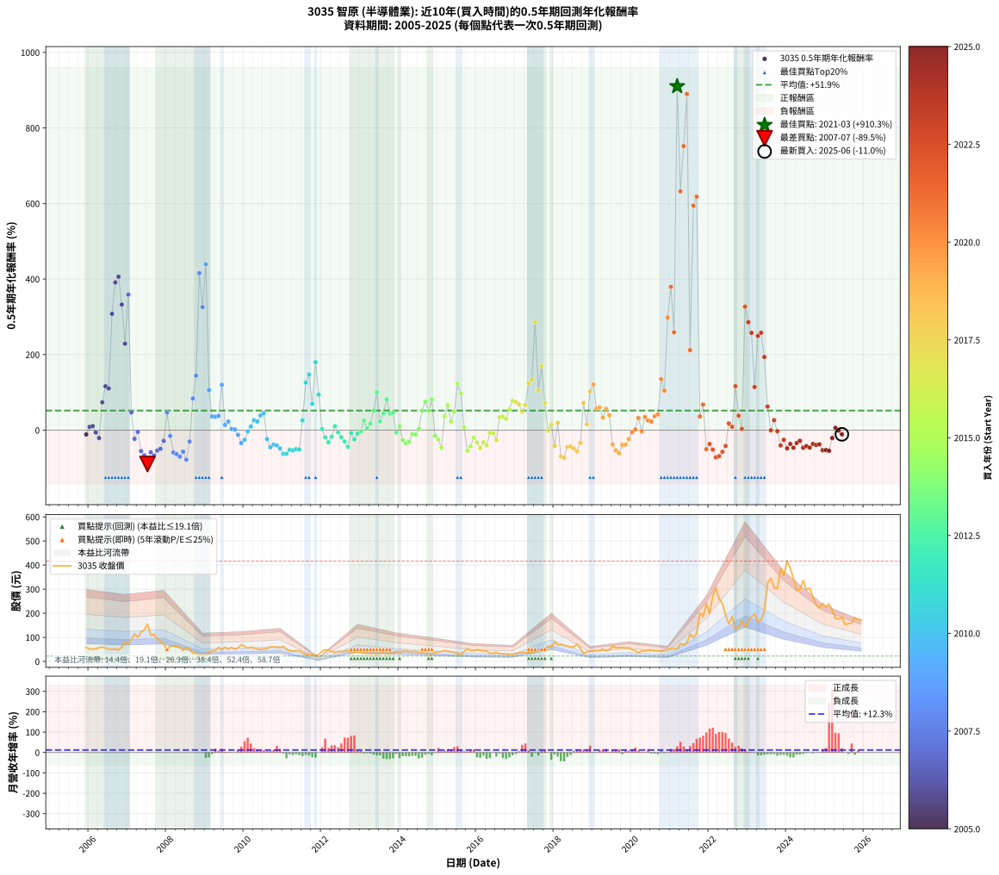

# 3035 智原 - 本益比與未來報酬率分析

!!! info "報告資訊"
    - **股票代號**: 3035
    - **公司名稱**: 智原
    - **產業別**: 半導體業
    - **分析期間**: 2006-2025 (234 個數據點)
    - **資料來源**: Type 12 (ShowMonthlyK_ChartFlow) 月收盤價與本益比
    - **報酬率口徑**: 含現金股利 (簡化: 年度合計，假設每年7/1入帳)
    - **報告生成時間**: 2026-01-13 00:54:48 CST

## 📈 視覺化圖表

### 圖表1: 本益比 vs 未來報酬率關係

*圖表1：3035 智原 本益比與0.5年期未來報酬率關係 (2006-2025)*

### 圖表2: 歷年買入時點的0.5年期實際報酬率

*圖表2：3035 智原 歷年買入時點的0.5年期實際報酬率 (2006-2025)*

## 📍 買點訊號說明

本報告提供兩種買點提示訊號（顯示於圖表2的股價子圖中）：

### ▲ 小綠色三角形（回測驗證）
- **計算方式**: 使用全部歷史資料計算本益比第25百分位數
- **用途**: 事後驗證，顯示歷史上哪些時點確實為低估區
- **限制**: 當下無法判斷，僅供回測參考
- **特性**: 後見之明（Look-Ahead Bias）

### ▲ 小橘色三角形（即時訊號）
- **計算方式**: 使用截至當月的過去5年資料計算本益比第25百分位數
- **用途**: 實際投資決策，當時即可判斷
- **優勢**: 可操作性強，符合實務需求
- **特性**: 無後見之明，滾動窗口計算

!!! tip "如何使用兩種訊號"
    - **綠色▲** 幫助理解歷史估值機會，驗證策略有效性
    - **橘色▲** 可作為實際買進參考，但仍需搭配基本面分析
    - 兩種訊號重疊時，表示即時判斷與事後驗證一致，信心度較高
    - 僅有綠色▲時，表示當時無法判斷（需要未來資料才能確認）
    - 僅有橘色▲時，表示即時判斷為買點，但事後可能不是最佳時機

## 📊 估值分析摘要

| 指標 | 數值 |
|:---:|:---:|
| **目前本益比** (2025-06) | **53.30 倍** |
| **歷史平均本益比** | 29.54 倍 |
| **估值水準** | 🔴 相對高估 |
| **預期0.5年年化報酬率** | **-0.00%** |
| **歷史平均報酬率** | +52.11% |
| **相關係數 (R²)** | 0.0438 |
| **趨勢線斜率** | -2.1927 |

!!! abstract "核心洞察"
    目前本益比顯著高於歷史平均，預期未來報酬率可能較低

    根據歷史數據回測，3035 智原 在目前本益比 **53.3倍** 的估值水準下，
    預期未來0.5年年化報酬率約為 **-0.0%**。

    **重要提醒**: 本分析基於歷史數據統計，實際報酬率會受到公司基本面變化、產業趨勢、
    總體經濟環境等多重因素影響。R² = 0.04 表示本益比可解釋約 4.4% 的報酬率變異。

## 📈 歷史估值統計

### 最佳買點 (最高報酬率)

| 項目 | 數值 |
|:---:|:---:|
| 起始時間 | 2021-03 |
| 當時本益比 | 26.41 倍 |
| 起始價格 | 52.1 元 |
| 0.5年後價格 | 201.0 元 |
| **0.5年年化報酬率** | **+910.32%** |

### 最差買點 (最低報酬率)

| 項目 | 數值 |
|:---:|:---:|
| 起始時間 | 2007-07 |
| 當時本益比 | 31.37 倍 |
| 起始價格 | 154.0 元 |
| 0.5年後價格 | 49.4 元 |
| **0.5年年化報酬率** | **-89.53%** |

## 🎯 投資啟示

### 本益比與報酬率關係

趨勢線方程式: **y = -2.1927x + 116.8721**

!!! warning "強負相關"
    本益比與未來報酬率呈現強負相關。在高本益比時期買入，未來報酬率顯著較低；
    在低本益比時期買入，未來報酬率顯著較高。**估值紀律至關重要**。

### 估值區間建議

基於歷史數據分析:

- **🟢 低估區** (P/E < 23.6): 預期報酬率較高，可考慮增加持股
- **🟡 合理區** (P/E 23.6-35.4): 預期報酬率符合長期趨勢，正常持有
- **🔴 高估區** (P/E > 35.4): 預期報酬率較低，可考慮減碼或觀望

!!! danger "風險提示"
    - 過去表現不代表未來結果
    - 本分析假設公司基本面無重大結構性變化
    - 產業環境劇變可能使歷史規律失效
    - 應結合公司財報、產業趨勢、總體經濟等多重因素綜合判斷

!!! success "長期投資觀點"
    歷史數據顯示，在合理或低估的估值水準買入並長期持有，
    往往能獲得較佳的投資報酬。**耐心等待好價格**是價值投資的核心原則。

## 📊 數據品質

- **資料來源**: GoodInfo.tw Type 12 (ShowMonthlyK_ChartFlow)
- **資料頻率**: 月度收盤價與本益比
- **回測期間**: 2006-2025
- **數據點數量**: 234 個 (每個點代表一次0.5年期回測)

### 計算方法說明

1. **0.5年期年化報酬率**:
   - 對每個歷史時點，計算其後0.5年的實際投資報酬率
   - 期末價值(不含股利): 期末價格
   - 期末價值(含現金股利): 期末價格 + 持有期間內的現金股利合計 (簡化: 年度合計，假設每年7/1入帳)
   - 公式: 年化報酬率 = [(期末價值/期初價格)^(1/年數) - 1] × 100%

2. **本益比 (P/E Ratio)**:
   - 使用當時的月收盤價與EPS計算
   - 資料來源: Type 12 月度河流圖本益比數據

3. **趨勢線 (Linear Regression)**:
   - 使用最小平方法擬合線性趨勢線
   - R²值衡量本益比對報酬率的解釋能力

---

*本報告由 Stock Analysis System v1.9.0 自動生成*
*數據更新時間: 2026-01-13 00:54:48 CST*

## 📋 月度回測明細表

（每一列對應時間線圖中的一個買入點；可用來對照 SVG 圖上的每個點。）

| 買入月份 | 賣出月份 | 回測期限_年 | 實際持有年數 | 買入本益比_倍 | 買入收盤價_元 | 賣出收盤價_元 | 現金股利合計_元 | 總報酬率_pct | 年化報酬率_pct |
| --- | --- | --- | --- | --- | --- | --- | --- | --- | --- |
| 2006-01 | 2006-07 | 0.5 | 0.496 | 10.95 | 51.90 | 50.80 | 3.30 | +4.24 | +8.74 |
| 2006-02 | 2006-08 | 0.5 | 0.498 | 10.76 | 51.00 | 50.40 | 3.30 | +5.29 | +10.91 |
| 2006-03 | 2006-10 | 0.5 | 0.586 | 11.10 | 52.60 | 47.40 | 3.30 | -3.61 | -6.09 |
| 2006-04 | 2006-10 | 0.5 | 0.501 | 12.03 | 57.00 | 47.40 | 3.30 | -11.05 | -20.85 |
| 2006-05 | 2006-12 | 0.5 | 0.586 | 12.53 | 59.40 | 78.80 | 3.30 | +38.22 | +73.74 |
| 2006-06 | 2006-12 | 0.5 | 0.501 | 11.77 | 55.80 | 78.80 | 3.30 | +47.13 | +116.14 |
| 2006-07 | 2007-01 | 0.5 | 0.504 | 10.72 | 50.80 | 73.90 | 0.00 | +45.47 | +110.44 |
| 2006-08 | 2007-03 | 0.5 | 0.580 | 10.63 | 50.40 | 114.00 | 0.00 | +126.19 | +308.05 |
| 2006-09 | 2007-03 | 0.5 | 0.496 | 10.93 | 51.80 | 114.00 | 0.00 | +120.08 | +391.25 |
| 2006-10 | 2007-05 | 0.5 | 0.580 | 10.00 | 47.40 | 121.50 | 0.00 | +156.33 | +406.18 |
| 2006-11 | 2007-05 | 0.5 | 0.496 | 12.41 | 58.80 | 121.50 | 0.00 | +106.63 | +332.57 |
| 2006-12 | 2007-07 | 0.5 | 0.580 | 16.62 | 78.80 | 154.00 | 3.27 | +99.58 | +228.91 |
| 2007-01 | 2007-07 | 0.5 | 0.496 | 15.51 | 73.90 | 154.00 | 3.27 | +112.82 | +359.10 |
| 2007-02 | 2007-08 | 0.5 | 0.498 | 19.17 | 91.80 | 108.00 | 3.27 | +21.21 | +47.12 |
| 2007-03 | 2007-10 | 0.5 | 0.586 | 23.69 | 114.00 | 94.50 | 3.27 | -14.24 | -23.06 |
| 2007-04 | 2007-10 | 0.5 | 0.501 | 20.68 | 100.00 | 94.50 | 3.27 | -2.23 | -4.40 |
| 2007-05 | 2007-12 | 0.5 | 0.586 | 25.00 | 121.50 | 72.50 | 3.27 | -37.64 | -55.33 |
| 2007-06 | 2007-12 | 0.5 | 0.501 | 26.92 | 131.50 | 72.50 | 3.27 | -42.38 | -66.72 |
| 2007-07 | 2008-01 | 0.5 | 0.504 | 31.37 | 154.00 | 49.40 | 0.00 | -67.92 | -89.53 |
| 2007-08 | 2008-03 | 0.5 | 0.583 | 21.89 | 108.00 | 64.80 | 0.00 | -40.00 | -58.35 |
| 2007-09 | 2008-03 | 0.5 | 0.498 | 22.69 | 112.50 | 64.80 | 0.00 | -42.40 | -66.95 |
| 2007-10 | 2008-05 | 0.5 | 0.583 | 18.97 | 94.50 | 60.10 | 0.00 | -36.40 | -53.98 |
| 2007-11 | 2008-05 | 0.5 | 0.498 | 16.84 | 84.30 | 60.10 | 0.00 | -28.71 | -49.29 |
| 2007-12 | 2008-07 | 0.5 | 0.583 | 14.41 | 72.50 | 56.30 | 3.49 | -17.53 | -28.14 |
| 2008-01 | 2008-07 | 0.5 | 0.498 | 10.34 | 49.40 | 56.30 | 3.49 | +21.03 | +46.69 |
| 2008-02 | 2008-08 | 0.5 | 0.501 | 13.92 | 63.00 | 54.50 | 3.49 | -7.95 | -15.24 |
| 2008-03 | 2008-10 | 0.5 | 0.586 | 15.17 | 64.80 | 34.90 | 3.49 | -40.75 | -59.08 |
| 2008-04 | 2008-10 | 0.5 | 0.501 | 15.82 | 63.60 | 34.90 | 3.49 | -39.64 | -63.49 |
| 2008-05 | 2008-12 | 0.5 | 0.586 | 15.95 | 60.10 | 26.05 | 3.49 | -50.85 | -70.25 |
| 2008-06 | 2008-12 | 0.5 | 0.501 | 12.80 | 45.00 | 26.05 | 3.49 | -34.35 | -56.83 |
| 2008-07 | 2009-01 | 0.5 | 0.504 | 17.26 | 56.30 | 26.20 | 0.00 | -53.46 | -78.09 |
| 2008-08 | 2009-03 | 0.5 | 0.580 | 18.11 | 54.50 | 44.35 | 0.00 | -18.62 | -29.89 |
| 2008-09 | 2009-03 | 0.5 | 0.496 | 11.89 | 32.80 | 44.35 | 0.00 | +35.21 | +83.82 |
| 2008-10 | 2009-05 | 0.5 | 0.580 | 13.93 | 34.90 | 58.60 | 0.00 | +67.91 | +144.21 |
| 2008-11 | 2009-05 | 0.5 | 0.496 | 11.54 | 26.00 | 58.60 | 0.00 | +125.38 | +415.45 |
| 2008-12 | 2009-07 | 0.5 | 0.580 | 13.02 | 26.05 | 58.90 | 1.49 | +131.84 | +325.77 |
| 2009-01 | 2009-07 | 0.5 | 0.496 | 13.04 | 26.20 | 58.90 | 1.49 | +130.51 | +439.38 |
| 2009-02 | 2009-08 | 0.5 | 0.498 | 18.58 | 37.50 | 52.30 | 1.49 | +43.45 | +106.29 |
| 2009-03 | 2009-10 | 0.5 | 0.586 | 21.87 | 44.35 | 51.70 | 1.49 | +19.94 | +36.39 |
| 2009-04 | 2009-10 | 0.5 | 0.501 | 22.41 | 45.65 | 51.70 | 1.49 | +16.53 | +35.70 |
| 2009-05 | 2009-12 | 0.5 | 0.586 | 28.64 | 58.60 | 69.20 | 1.49 | +20.64 | +37.75 |
| 2009-06 | 2009-12 | 0.5 | 0.501 | 23.16 | 47.60 | 69.20 | 1.49 | +48.52 | +120.22 |
| 2009-07 | 2010-01 | 0.5 | 0.504 | 28.53 | 58.90 | 62.90 | 0.00 | +6.79 | +13.93 |
| 2009-08 | 2010-03 | 0.5 | 0.580 | 25.23 | 52.30 | 59.00 | 0.00 | +12.81 | +23.08 |
| 2009-09 | 2010-03 | 0.5 | 0.496 | 27.90 | 58.10 | 59.00 | 0.00 | +1.55 | +3.15 |
| 2009-10 | 2010-05 | 0.5 | 0.580 | 24.72 | 51.70 | 52.30 | 0.00 | +1.16 | +2.01 |
| 2009-11 | 2010-05 | 0.5 | 0.496 | 26.56 | 55.80 | 52.30 | 0.00 | -6.27 | -12.25 |
| 2009-12 | 2010-07 | 0.5 | 0.580 | 32.80 | 69.20 | 52.40 | 2.00 | -21.39 | -33.94 |
| 2010-01 | 2010-07 | 0.5 | 0.496 | 29.54 | 62.90 | 52.40 | 2.00 | -13.52 | -25.40 |
| 2010-02 | 2010-08 | 0.5 | 0.498 | 25.74 | 55.30 | 52.30 | 2.00 | -1.81 | -3.60 |
| 2010-03 | 2010-10 | 0.5 | 0.586 | 27.22 | 59.00 | 60.30 | 2.00 | +5.59 | +9.73 |
| 2010-04 | 2010-10 | 0.5 | 0.501 | 25.34 | 55.40 | 60.30 | 2.00 | +12.45 | +26.39 |
| 2010-05 | 2010-12 | 0.5 | 0.586 | 23.71 | 52.30 | 57.00 | 2.00 | +12.81 | +22.84 |
| 2010-06 | 2010-12 | 0.5 | 0.501 | 22.47 | 50.00 | 57.00 | 2.00 | +18.00 | +39.14 |
| 2010-07 | 2011-01 | 0.5 | 0.504 | 23.35 | 52.40 | 63.20 | 0.00 | +20.61 | +45.06 |
| 2010-08 | 2011-03 | 0.5 | 0.580 | 23.11 | 52.30 | 44.75 | 0.00 | -14.44 | -23.56 |
| 2010-09 | 2011-03 | 0.5 | 0.496 | 26.42 | 60.30 | 44.75 | 0.00 | -25.79 | -45.22 |
| 2010-10 | 2011-05 | 0.5 | 0.580 | 26.20 | 60.30 | 45.60 | 0.00 | -24.38 | -38.21 |
| 2010-11 | 2011-05 | 0.5 | 0.496 | 25.38 | 58.90 | 45.60 | 0.00 | -22.58 | -40.34 |
| 2010-12 | 2011-07 | 0.5 | 0.580 | 24.36 | 57.00 | 37.30 | 1.50 | -31.94 | -48.46 |
| 2011-01 | 2011-07 | 0.5 | 0.496 | 29.12 | 63.20 | 37.30 | 1.50 | -38.62 | -62.65 |
| 2011-02 | 2011-08 | 0.5 | 0.498 | 24.93 | 49.85 | 29.10 | 1.50 | -38.63 | -62.46 |
| 2011-03 | 2011-10 | 0.5 | 0.586 | 24.45 | 44.75 | 27.55 | 1.50 | -35.09 | -52.18 |
| 2011-04 | 2011-10 | 0.5 | 0.501 | 25.63 | 42.55 | 27.55 | 1.50 | -31.74 | -53.33 |
| 2011-05 | 2011-12 | 0.5 | 0.586 | 30.60 | 45.60 | 28.85 | 1.50 | -33.45 | -50.10 |
| 2011-06 | 2011-12 | 0.5 | 0.501 | 32.92 | 43.45 | 28.85 | 1.50 | -30.16 | -51.15 |
| 2011-07 | 2012-01 | 0.5 | 0.504 | 32.43 | 37.30 | 41.90 | 0.00 | +12.33 | +25.97 |
| 2011-08 | 2012-03 | 0.5 | 0.583 | 29.69 | 29.10 | 46.80 | 0.00 | +60.82 | +125.87 |
| 2011-09 | 2012-03 | 0.5 | 0.498 | 36.79 | 29.80 | 46.80 | 0.00 | +57.05 | +147.40 |
| 2011-10 | 2012-05 | 0.5 | 0.583 | 43.05 | 27.55 | 37.50 | 0.00 | +36.12 | +69.68 |
| 2011-11 | 2012-05 | 0.5 | 0.498 | 47.77 | 22.45 | 37.50 | 0.00 | +67.04 | +180.00 |
| 2011-12 | 2012-07 | 0.5 | 0.583 | 96.17 | 28.85 | 41.00 | 1.50 | +47.30 | +94.29 |
| 2012-01 | 2012-07 | 0.5 | 0.498 | 84.82 | 41.90 | 41.00 | 1.50 | +1.42 | +2.88 |
| 2012-02 | 2012-08 | 0.5 | 0.501 | 70.94 | 48.80 | 42.45 | 1.50 | -9.94 | -18.87 |
| 2012-03 | 2012-10 | 0.5 | 0.586 | 53.07 | 46.80 | 35.80 | 1.50 | -20.31 | -32.12 |
| 2012-04 | 2012-10 | 0.5 | 0.501 | 38.06 | 40.95 | 35.80 | 1.50 | -8.92 | -17.01 |
| 2012-05 | 2012-12 | 0.5 | 0.586 | 29.53 | 37.50 | 38.35 | 1.50 | +6.26 | +10.92 |
| 2012-06 | 2012-12 | 0.5 | 0.501 | 28.08 | 41.10 | 38.35 | 1.50 | -3.05 | -5.99 |
| 2012-07 | 2013-01 | 0.5 | 0.504 | 24.73 | 41.00 | 37.00 | 0.00 | -9.76 | -18.44 |
| 2012-08 | 2013-03 | 0.5 | 0.580 | 22.92 | 42.45 | 34.50 | 0.00 | -18.73 | -30.04 |
| 2012-09 | 2013-03 | 0.5 | 0.496 | 22.49 | 46.00 | 34.50 | 0.00 | -25.00 | -44.04 |
| 2012-10 | 2013-05 | 0.5 | 0.580 | 15.98 | 35.80 | 34.20 | 0.00 | -4.47 | -7.58 |
| 2012-11 | 2013-05 | 0.5 | 0.496 | 16.15 | 39.30 | 34.20 | 0.00 | -12.98 | -24.46 |
| 2012-12 | 2013-07 | 0.5 | 0.580 | 14.59 | 38.35 | 34.30 | 2.00 | -5.35 | -9.04 |
| 2013-01 | 2013-07 | 0.5 | 0.496 | 14.36 | 37.00 | 34.30 | 2.00 | -1.89 | -3.79 |
| 2013-02 | 2013-08 | 0.5 | 0.498 | 13.30 | 33.60 | 35.60 | 2.00 | +11.90 | +25.32 |
| 2013-03 | 2013-10 | 0.5 | 0.586 | 13.94 | 34.50 | 33.50 | 2.00 | +2.90 | +4.99 |
| 2013-04 | 2013-10 | 0.5 | 0.501 | 13.53 | 32.80 | 33.50 | 2.00 | +8.23 | +17.10 |
| 2013-05 | 2013-12 | 0.5 | 0.586 | 14.40 | 34.20 | 41.70 | 2.00 | +27.77 | +51.94 |
| 2013-06 | 2013-12 | 0.5 | 0.501 | 13.28 | 30.85 | 41.70 | 2.00 | +41.65 | +100.36 |
| 2013-07 | 2014-01 | 0.5 | 0.504 | 15.09 | 34.30 | 38.10 | 0.00 | +11.08 | +23.19 |
| 2013-08 | 2014-03 | 0.5 | 0.580 | 16.02 | 35.60 | 44.10 | 0.00 | +23.88 | +44.61 |
| 2013-09 | 2014-03 | 0.5 | 0.496 | 15.10 | 32.80 | 44.10 | 0.00 | +34.45 | +81.73 |
| 2013-10 | 2014-05 | 0.5 | 0.580 | 15.79 | 33.50 | 41.40 | 0.00 | +23.58 | +44.02 |
| 2013-11 | 2014-05 | 0.5 | 0.496 | 16.54 | 34.25 | 41.40 | 0.00 | +20.88 | +46.61 |
| 2013-12 | 2014-07 | 0.5 | 0.580 | 20.64 | 41.70 | 38.10 | 2.00 | -3.85 | -6.53 |
| 2014-01 | 2014-07 | 0.5 | 0.496 | 19.15 | 38.10 | 38.10 | 2.00 | +5.24 | +10.85 |
| 2014-02 | 2014-08 | 0.5 | 0.498 | 22.37 | 43.80 | 35.70 | 2.00 | -13.94 | -26.01 |
| 2014-03 | 2014-10 | 0.5 | 0.586 | 22.88 | 44.10 | 32.30 | 2.00 | -22.23 | -34.89 |
| 2014-04 | 2014-10 | 0.5 | 0.501 | 21.64 | 41.05 | 32.30 | 2.00 | -16.45 | -30.15 |
| 2014-05 | 2014-12 | 0.5 | 0.586 | 22.19 | 41.40 | 36.90 | 2.00 | -6.05 | -10.10 |
| 2014-06 | 2014-12 | 0.5 | 0.501 | 22.56 | 41.40 | 36.90 | 2.00 | -6.05 | -11.71 |
| 2014-07 | 2015-01 | 0.5 | 0.504 | 21.12 | 38.10 | 38.70 | 0.00 | +1.57 | +3.15 |
| 2014-08 | 2015-03 | 0.5 | 0.580 | 20.13 | 35.70 | 45.50 | 0.00 | +27.45 | +51.88 |
| 2014-09 | 2015-03 | 0.5 | 0.496 | 19.77 | 34.45 | 45.50 | 0.00 | +32.08 | +75.31 |
| 2014-10 | 2015-05 | 0.5 | 0.580 | 18.87 | 32.30 | 41.10 | 0.00 | +27.24 | +51.45 |
| 2014-11 | 2015-05 | 0.5 | 0.496 | 18.21 | 30.60 | 41.10 | 0.00 | +34.31 | +81.36 |
| 2014-12 | 2015-07 | 0.5 | 0.580 | 22.36 | 36.90 | 32.05 | 1.52 | -9.03 | -15.05 |
| 2015-01 | 2015-07 | 0.5 | 0.496 | 23.93 | 38.70 | 32.05 | 1.52 | -13.26 | -24.96 |
| 2015-02 | 2015-08 | 0.5 | 0.498 | 25.65 | 40.65 | 28.25 | 1.52 | -26.77 | -46.49 |
| 2015-03 | 2015-10 | 0.5 | 0.586 | 29.31 | 45.50 | 53.10 | 1.52 | +20.04 | +36.58 |
| 2015-04 | 2015-10 | 0.5 | 0.501 | 27.83 | 42.30 | 53.10 | 1.52 | +29.12 | +66.55 |
| 2015-05 | 2015-12 | 0.5 | 0.586 | 27.63 | 41.10 | 44.80 | 1.52 | +12.70 | +22.63 |
| 2015-06 | 2015-12 | 0.5 | 0.501 | 26.08 | 37.95 | 44.80 | 1.52 | +22.05 | +48.84 |
| 2015-07 | 2016-01 | 0.5 | 0.504 | 22.53 | 32.05 | 48.00 | 0.00 | +49.77 | +122.95 |
| 2015-08 | 2016-03 | 0.5 | 0.583 | 20.32 | 28.25 | 41.95 | 0.00 | +48.50 | +96.99 |
| 2015-09 | 2016-03 | 0.5 | 0.498 | 29.83 | 40.50 | 41.95 | 0.00 | +3.58 | +7.31 |
| 2015-10 | 2016-05 | 0.5 | 0.583 | 40.08 | 53.10 | 33.70 | 0.00 | -36.53 | -54.14 |
| 2015-11 | 2016-05 | 0.5 | 0.498 | 34.39 | 44.45 | 33.70 | 0.00 | -24.18 | -42.63 |
| 2015-12 | 2016-07 | 0.5 | 0.583 | 35.56 | 44.80 | 37.40 | 2.00 | -12.05 | -19.77 |
| 2016-01 | 2016-07 | 0.5 | 0.498 | 38.40 | 48.00 | 37.40 | 2.00 | -17.92 | -32.71 |
| 2016-02 | 2016-08 | 0.5 | 0.501 | 37.50 | 46.50 | 31.60 | 2.00 | -27.74 | -47.72 |
| 2016-03 | 2016-10 | 0.5 | 0.586 | 34.11 | 41.95 | 31.45 | 2.00 | -20.26 | -32.05 |
| 2016-04 | 2016-10 | 0.5 | 0.501 | 35.49 | 43.30 | 31.45 | 2.00 | -22.75 | -40.26 |
| 2016-05 | 2016-12 | 0.5 | 0.586 | 27.85 | 33.70 | 30.35 | 2.00 | -4.01 | -6.74 |
| 2016-06 | 2016-12 | 0.5 | 0.501 | 28.12 | 33.75 | 30.35 | 2.00 | -4.15 | -8.11 |
| 2016-07 | 2017-01 | 0.5 | 0.504 | 31.43 | 37.40 | 32.15 | 0.00 | -14.04 | -25.94 |
| 2016-08 | 2017-03 | 0.5 | 0.580 | 26.78 | 31.60 | 37.50 | 0.00 | +18.67 | +34.30 |
| 2016-09 | 2017-03 | 0.5 | 0.496 | 27.48 | 32.15 | 37.50 | 0.00 | +16.64 | +36.43 |
| 2016-10 | 2017-05 | 0.5 | 0.580 | 27.11 | 31.45 | 36.70 | 0.00 | +16.69 | +30.47 |
| 2016-11 | 2017-05 | 0.5 | 0.496 | 25.65 | 29.50 | 36.70 | 0.00 | +24.41 | +55.38 |
| 2016-12 | 2017-07 | 0.5 | 0.580 | 26.62 | 30.35 | 41.40 | 1.00 | +39.70 | +77.90 |
| 2017-01 | 2017-07 | 0.5 | 0.496 | 24.20 | 32.15 | 41.40 | 1.00 | +31.88 | +74.79 |
| 2017-02 | 2017-08 | 0.5 | 0.498 | 23.74 | 36.00 | 45.65 | 1.00 | +29.58 | +68.22 |
| 2017-03 | 2017-10 | 0.5 | 0.586 | 21.99 | 37.50 | 46.35 | 1.00 | +26.27 | +48.89 |
| 2017-04 | 2017-10 | 0.5 | 0.501 | 19.36 | 36.65 | 46.35 | 1.00 | +29.20 | +66.74 |
| 2017-05 | 2017-12 | 0.5 | 0.586 | 17.63 | 36.70 | 57.90 | 1.00 | +60.49 | +124.21 |
| 2017-06 | 2017-12 | 0.5 | 0.501 | 16.94 | 38.45 | 57.90 | 1.00 | +53.19 | +134.25 |
| 2017-07 | 2018-01 | 0.5 | 0.504 | 16.84 | 41.40 | 81.80 | 0.00 | +97.58 | +286.44 |
| 2017-08 | 2018-03 | 0.5 | 0.580 | 17.25 | 45.65 | 69.40 | 0.00 | +52.03 | +105.79 |
| 2017-09 | 2018-03 | 0.5 | 0.496 | 14.97 | 42.45 | 69.40 | 0.00 | +63.49 | +169.65 |
| 2017-10 | 2018-05 | 0.5 | 0.580 | 15.33 | 46.35 | 63.40 | 0.00 | +36.79 | +71.55 |
| 2017-11 | 2018-05 | 0.5 | 0.496 | 19.90 | 63.90 | 63.40 | 0.00 | -0.78 | -1.57 |
| 2017-12 | 2018-07 | 0.5 | 0.580 | 17.03 | 57.90 | 60.00 | 2.70 | +8.29 | +14.71 |
| 2018-01 | 2018-07 | 0.5 | 0.496 | 25.52 | 81.80 | 60.00 | 2.70 | -23.35 | -41.53 |
| 2018-02 | 2018-08 | 0.5 | 0.498 | 22.56 | 67.90 | 71.60 | 2.70 | +9.43 | +19.81 |
| 2018-03 | 2018-10 | 0.5 | 0.586 | 24.65 | 69.40 | 32.00 | 2.70 | -50.00 | -69.37 |
| 2018-04 | 2018-10 | 0.5 | 0.501 | 25.57 | 67.00 | 32.00 | 2.70 | -48.21 | -73.10 |
| 2018-05 | 2018-12 | 0.5 | 0.586 | 26.14 | 63.40 | 42.30 | 2.70 | -29.02 | -44.29 |
| 2018-06 | 2018-12 | 0.5 | 0.501 | 26.82 | 59.80 | 42.30 | 2.70 | -24.75 | -43.31 |
| 2018-07 | 2019-01 | 0.5 | 0.504 | 29.48 | 60.00 | 43.00 | 0.00 | -28.33 | -48.38 |
| 2018-08 | 2019-03 | 0.5 | 0.580 | 38.91 | 71.60 | 44.55 | 0.00 | -37.78 | -55.85 |
| 2018-09 | 2019-03 | 0.5 | 0.496 | 33.13 | 54.50 | 44.55 | 0.00 | -18.26 | -33.42 |
| 2018-10 | 2019-05 | 0.5 | 0.580 | 22.07 | 32.00 | 43.90 | 0.00 | +37.19 | +72.42 |
| 2018-11 | 2019-05 | 0.5 | 0.496 | 32.59 | 40.90 | 43.90 | 0.00 | +7.33 | +15.35 |
| 2018-12 | 2019-07 | 0.5 | 0.580 | 39.91 | 42.30 | 62.90 | 0.80 | +50.59 | +102.45 |
| 2019-01 | 2019-07 | 0.5 | 0.496 | 39.51 | 43.00 | 62.90 | 0.80 | +48.14 | +121.01 |
| 2019-02 | 2019-08 | 0.5 | 0.498 | 41.15 | 45.95 | 56.80 | 0.80 | +25.35 | +57.38 |
| 2019-03 | 2019-10 | 0.5 | 0.586 | 38.91 | 44.55 | 58.00 | 0.80 | +31.99 | +60.59 |
| 2019-04 | 2019-10 | 0.5 | 0.501 | 43.38 | 50.90 | 58.00 | 0.80 | +15.52 | +33.37 |
| 2019-05 | 2019-12 | 0.5 | 0.586 | 36.53 | 43.90 | 56.30 | 0.80 | +30.07 | +56.63 |
| 2019-06 | 2019-12 | 0.5 | 0.501 | 39.27 | 48.30 | 56.30 | 0.80 | +18.22 | +39.66 |
| 2019-07 | 2020-01 | 0.5 | 0.504 | 49.99 | 62.90 | 49.45 | 0.00 | -21.38 | -37.97 |
| 2019-08 | 2020-03 | 0.5 | 0.583 | 44.15 | 56.80 | 36.30 | 0.00 | -36.09 | -53.59 |
| 2019-09 | 2020-03 | 0.5 | 0.498 | 43.95 | 57.80 | 36.30 | 0.00 | -37.20 | -60.68 |
| 2019-10 | 2020-05 | 0.5 | 0.583 | 43.18 | 58.00 | 43.60 | 0.00 | -24.83 | -38.70 |
| 2019-11 | 2020-05 | 0.5 | 0.498 | 40.46 | 55.50 | 43.60 | 0.00 | -21.44 | -38.39 |
| 2019-12 | 2020-07 | 0.5 | 0.583 | 40.21 | 56.30 | 47.05 | 1.10 | -14.48 | -23.52 |
| 2020-01 | 2020-07 | 0.5 | 0.498 | 36.01 | 49.45 | 47.05 | 1.10 | -2.63 | -5.21 |
| 2020-02 | 2020-08 | 0.5 | 0.501 | 32.71 | 44.05 | 43.40 | 1.10 | +1.02 | +2.05 |
| 2020-03 | 2020-10 | 0.5 | 0.586 | 27.50 | 36.30 | 41.65 | 1.10 | +17.77 | +32.20 |
| 2020-04 | 2020-10 | 0.5 | 0.501 | 33.52 | 43.35 | 41.65 | 1.10 | -1.38 | -2.74 |
| 2020-05 | 2020-12 | 0.5 | 0.586 | 34.42 | 43.60 | 50.90 | 1.10 | +19.27 | +35.08 |
| 2020-06 | 2020-12 | 0.5 | 0.501 | 37.42 | 46.40 | 50.90 | 1.10 | +12.07 | +25.54 |
| 2020-07 | 2021-01 | 0.5 | 0.504 | 38.78 | 47.05 | 52.20 | 0.00 | +10.95 | +22.90 |
| 2020-08 | 2021-03 | 0.5 | 0.580 | 36.57 | 43.40 | 52.10 | 0.00 | +20.05 | +37.00 |
| 2020-09 | 2021-03 | 0.5 | 0.496 | 37.80 | 43.85 | 52.10 | 0.00 | +18.81 | +41.61 |
| 2020-10 | 2021-05 | 0.5 | 0.580 | 36.75 | 41.65 | 68.40 | 0.00 | +64.23 | +135.06 |
| 2020-11 | 2021-05 | 0.5 | 0.496 | 43.33 | 47.95 | 68.40 | 0.00 | +42.65 | +104.79 |
| 2020-12 | 2021-07 | 0.5 | 0.580 | 47.13 | 50.90 | 112.50 | 1.00 | +122.99 | +298.14 |
| 2021-01 | 2021-07 | 0.5 | 0.496 | 37.89 | 52.20 | 112.50 | 1.00 | +117.43 | +379.41 |
| 2021-02 | 2021-08 | 0.5 | 0.498 | 31.64 | 53.00 | 99.20 | 1.00 | +89.06 | +258.99 |
| 2021-03 | 2021-10 | 0.5 | 0.586 | 26.41 | 52.10 | 201.00 | 1.00 | +287.72 | +910.32 |
| 2021-04 | 2021-10 | 0.5 | 0.501 | 32.82 | 74.50 | 201.00 | 1.00 | +171.14 | +632.17 |
| 2021-05 | 2021-12 | 0.5 | 0.586 | 26.64 | 68.40 | 239.00 | 1.00 | +250.88 | +752.04 |
| 2021-06 | 2021-12 | 0.5 | 0.501 | 26.56 | 76.10 | 239.00 | 1.00 | +215.37 | +889.94 |
| 2021-07 | 2022-01 | 0.5 | 0.504 | 35.57 | 112.50 | 199.50 | 0.00 | +77.33 | +211.79 |
| 2021-08 | 2022-03 | 0.5 | 0.580 | 28.67 | 99.20 | 305.50 | 0.00 | +207.96 | +594.42 |
| 2021-09 | 2022-03 | 0.5 | 0.496 | 30.61 | 115.00 | 305.50 | 0.00 | +165.65 | +618.20 |
| 2021-10 | 2022-05 | 0.5 | 0.580 | 49.57 | 201.00 | 240.50 | 0.00 | +19.65 | +36.22 |
| 2021-11 | 2022-05 | 0.5 | 0.496 | 42.73 | 186.00 | 240.50 | 0.00 | +29.30 | +67.96 |
| 2021-12 | 2022-07 | 0.5 | 0.580 | 51.40 | 239.00 | 156.00 | 3.30 | -33.35 | -50.29 |
| 2022-01 | 2022-07 | 0.5 | 0.496 | 39.23 | 199.50 | 156.00 | 3.30 | -20.15 | -36.50 |
| 2022-02 | 2022-08 | 0.5 | 0.498 | 49.35 | 272.50 | 187.00 | 3.30 | -30.17 | -51.35 |
| 2022-03 | 2022-10 | 0.5 | 0.586 | 51.28 | 305.50 | 142.00 | 3.30 | -52.44 | -71.87 |
| 2022-04 | 2022-10 | 0.5 | 0.501 | 40.75 | 260.50 | 142.00 | 3.30 | -44.22 | -68.81 |
| 2022-05 | 2022-12 | 0.5 | 0.586 | 35.22 | 240.50 | 142.50 | 3.30 | -39.38 | -57.44 |
| 2022-06 | 2022-12 | 0.5 | 0.501 | 26.29 | 191.00 | 142.50 | 3.30 | -23.66 | -41.67 |
| 2022-07 | 2023-01 | 0.5 | 0.504 | 20.26 | 156.00 | 169.50 | 0.00 | +8.65 | +17.91 |
| 2022-08 | 2023-03 | 0.5 | 0.580 | 22.98 | 187.00 | 196.50 | 0.00 | +5.08 | +8.91 |
| 2022-09 | 2023-03 | 0.5 | 0.496 | 15.63 | 134.00 | 196.50 | 0.00 | +46.64 | +116.52 |
| 2022-10 | 2023-05 | 0.5 | 0.580 | 15.76 | 142.00 | 171.50 | 0.00 | +20.77 | +38.43 |
| 2022-11 | 2023-05 | 0.5 | 0.496 | 17.84 | 168.50 | 171.50 | 0.00 | +1.78 | +3.63 |
| 2022-12 | 2023-07 | 0.5 | 0.580 | 14.42 | 142.50 | 326.00 | 5.00 | +132.28 | +327.17 |
| 2023-01 | 2023-07 | 0.5 | 0.496 | 17.68 | 169.50 | 326.00 | 5.00 | +95.28 | +285.95 |
| 2023-02 | 2023-08 | 0.5 | 0.498 | 19.95 | 185.50 | 345.00 | 5.00 | +88.68 | +257.55 |
| 2023-03 | 2023-10 | 0.5 | 0.586 | 21.82 | 196.50 | 302.00 | 5.00 | +56.23 | +114.16 |
| 2023-04 | 2023-10 | 0.5 | 0.501 | 18.81 | 164.00 | 302.00 | 5.00 | +87.20 | +249.52 |
| 2023-05 | 2023-12 | 0.5 | 0.586 | 20.35 | 171.50 | 357.00 | 5.00 | +111.08 | +257.89 |
| 2023-06 | 2023-12 | 0.5 | 0.501 | 25.94 | 211.00 | 357.00 | 5.00 | +71.56 | +193.69 |
| 2023-07 | 2024-01 | 0.5 | 0.504 | 41.56 | 326.00 | 416.50 | 0.00 | +27.76 | +62.63 |
| 2023-08 | 2024-03 | 0.5 | 0.583 | 45.68 | 345.00 | 344.00 | 0.00 | -0.29 | -0.50 |
| 2023-09 | 2024-03 | 0.5 | 0.498 | 42.13 | 306.00 | 344.00 | 0.00 | +12.42 | +26.48 |
| 2023-10 | 2024-05 | 0.5 | 0.583 | 43.32 | 302.00 | 297.50 | 0.00 | -1.49 | -2.54 |
| 2023-11 | 2024-05 | 0.5 | 0.498 | 57.70 | 385.50 | 297.50 | 0.00 | -22.83 | -40.55 |
| 2023-12 | 2024-07 | 0.5 | 0.583 | 55.87 | 357.00 | 296.50 | 4.29 | -15.74 | -25.45 |
| 2024-01 | 2024-07 | 0.5 | 0.498 | 67.24 | 416.50 | 296.50 | 4.29 | -27.78 | -47.96 |
| 2024-02 | 2024-08 | 0.5 | 0.501 | 64.52 | 387.00 | 304.00 | 4.29 | -20.34 | -36.48 |
| 2024-03 | 2024-10 | 0.5 | 0.586 | 59.28 | 344.00 | 234.50 | 4.29 | -30.58 | -46.37 |
| 2024-04 | 2024-10 | 0.5 | 0.501 | 52.44 | 294.00 | 234.50 | 4.29 | -18.78 | -33.97 |
| 2024-05 | 2024-12 | 0.5 | 0.586 | 54.98 | 297.50 | 241.00 | 4.29 | -17.55 | -28.06 |
| 2024-06 | 2024-12 | 0.5 | 0.501 | 64.43 | 336.00 | 241.00 | 4.29 | -27.00 | -46.64 |
| 2024-07 | 2025-01 | 0.5 | 0.504 | 59.07 | 296.50 | 225.00 | 0.00 | -24.11 | -42.18 |
| 2024-08 | 2025-03 | 0.5 | 0.580 | 63.03 | 304.00 | 212.50 | 0.00 | -30.10 | -46.04 |
| 2024-09 | 2025-03 | 0.5 | 0.496 | 57.48 | 266.00 | 212.50 | 0.00 | -20.11 | -36.44 |
| 2024-10 | 2025-05 | 0.5 | 0.580 | 52.91 | 234.50 | 176.00 | 0.00 | -24.95 | -39.01 |
| 2024-11 | 2025-05 | 0.5 | 0.496 | 52.41 | 222.00 | 176.00 | 0.00 | -20.72 | -37.41 |
| 2024-12 | 2025-07 | 0.5 | 0.580 | 59.65 | 241.00 | 152.50 | 3.00 | -35.48 | -52.99 |
| 2025-01 | 2025-07 | 0.5 | 0.496 | 57.01 | 225.00 | 152.50 | 3.00 | -30.89 | -52.55 |
| 2025-02 | 2025-08 | 0.5 | 0.498 | 61.89 | 238.50 | 158.00 | 3.00 | -32.49 | -54.55 |
| 2025-03 | 2025-10 | 0.5 | 0.586 | 56.52 | 212.50 | 182.50 | 3.00 | -12.71 | -20.70 |
| 2025-04 | 2025-10 | 0.5 | 0.501 | 49.09 | 180.00 | 182.50 | 3.00 | +3.06 | +6.19 |
| 2025-05 | 2025-12 | 0.5 | 0.586 | 49.25 | 176.00 | 170.50 | 3.00 | -1.42 | -2.41 |
| 2025-06 | 2025-12 | 0.5 | 0.501 | 53.30 | 185.50 | 170.50 | 3.00 | -6.47 | -12.50 |
