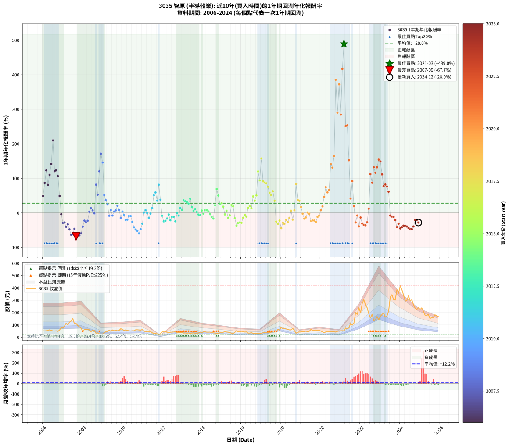

# 3035 智原 - 本益比與未來報酬率分析

!!! info "報告資訊"
    - **股票代號**: 3035
    - **公司名稱**: 智原
    - **產業別**: 半導體業
    - **分析期間**: 2005-2024 (229 個數據點)
    - **資料來源**: Type 12 (ShowMonthlyK_ChartFlow) 月收盤價與本益比
    - **報酬率口徑**: 含現金股利 (簡化: 年度合計，假設每年7/1入帳)
    - **報告生成時間**: 2025-12-23 12:16:53 CST

## 📈 視覺化圖表

### 圖表1: 本益比 vs 未來報酬率關係

*圖表1：3035 智原 本益比與1年期未來報酬率關係 (2005-2024)*

### 圖表2: 歷年買入時點的1年期實際報酬率

*圖表2：3035 智原 歷年買入時點的1年期實際報酬率 (2005-2024)*

## 📍 買點訊號說明

本報告提供兩種買點提示訊號（顯示於圖表2的股價子圖中）：

### ▲ 小綠色三角形（回測驗證）
- **計算方式**: 使用全部歷史資料計算本益比第25百分位數
- **用途**: 事後驗證，顯示歷史上哪些時點確實為低估區
- **限制**: 當下無法判斷，僅供回測參考
- **特性**: 後見之明（Look-Ahead Bias）

### ▲ 小橘色三角形（即時訊號）
- **計算方式**: 使用截至當月的過去5年資料計算本益比第25百分位數
- **用途**: 實際投資決策，當時即可判斷
- **優勢**: 可操作性強，符合實務需求
- **特性**: 無後見之明，滾動窗口計算

!!! tip "如何使用兩種訊號"
    - **綠色▲** 幫助理解歷史估值機會，驗證策略有效性
    - **橘色▲** 可作為實際買進參考，但仍需搭配基本面分析
    - 兩種訊號重疊時，表示即時判斷與事後驗證一致，信心度較高
    - 僅有綠色▲時，表示當時無法判斷（需要未來資料才能確認）
    - 僅有橘色▲時，表示即時判斷為買點，但事後可能不是最佳時機

## 📊 估值分析摘要

| 指標 | 數值 |
|:---:|:---:|
| **目前本益比** (2024-12) | **59.65 倍** |
| **歷史平均本益比** | 28.78 倍 |
| **估值水準** | 🔴 相對高估 |
| **預期1年年化報酬率** | **-4.08%** |
| **歷史平均報酬率** | +28.10% |
| **相關係數 (R²)** | 0.0321 |
| **趨勢線斜率** | -1.0425 |

!!! abstract "核心洞察"
    目前本益比顯著高於歷史平均，預期未來報酬率可能較低

    根據歷史數據回測，3035 智原 在目前本益比 **59.6倍** 的估值水準下，
    預期未來1年年化報酬率約為 **-4.1%**。

    **重要提醒**: 本分析基於歷史數據統計，實際報酬率會受到公司基本面變化、產業趨勢、
    總體經濟環境等多重因素影響。R² = 0.03 表示本益比可解釋約 3.2% 的報酬率變異。

## 📈 歷史估值統計

### 最佳買點 (最高報酬率)

| 項目 | 數值 |
|:---:|:---:|
| 起始時間 | 2021-03 |
| 當時本益比 | 26.41 倍 |
| 起始價格 | 52.1 元 |
| 1年後價格 | 305.5 元 |
| **1年年化報酬率** | **+489.01%** |

### 最差買點 (最低報酬率)

| 項目 | 數值 |
|:---:|:---:|
| 起始時間 | 2007-09 |
| 當時本益比 | 22.69 倍 |
| 起始價格 | 112.5 元 |
| 1年後價格 | 32.8 元 |
| **1年年化報酬率** | **-67.67%** |

## 🎯 投資啟示

### 本益比與報酬率關係

趨勢線方程式: **y = -1.0425x + 58.1035**

!!! warning "強負相關"
    本益比與未來報酬率呈現強負相關。在高本益比時期買入，未來報酬率顯著較低；
    在低本益比時期買入，未來報酬率顯著較高。**估值紀律至關重要**。

### 估值區間建議

基於歷史數據分析:

- **🟢 低估區** (P/E < 23.0): 預期報酬率較高，可考慮增加持股
- **🟡 合理區** (P/E 23.0-34.5): 預期報酬率符合長期趨勢，正常持有
- **🔴 高估區** (P/E > 34.5): 預期報酬率較低，可考慮減碼或觀望

!!! danger "風險提示"
    - 過去表現不代表未來結果
    - 本分析假設公司基本面無重大結構性變化
    - 產業環境劇變可能使歷史規律失效
    - 應結合公司財報、產業趨勢、總體經濟等多重因素綜合判斷

!!! success "長期投資觀點"
    歷史數據顯示，在合理或低估的估值水準買入並長期持有，
    往往能獲得較佳的投資報酬。**耐心等待好價格**是價值投資的核心原則。

## 📊 數據品質

- **資料來源**: GoodInfo.tw Type 12 (ShowMonthlyK_ChartFlow)
- **資料頻率**: 月度收盤價與本益比
- **回測期間**: 2005-2024
- **數據點數量**: 229 個 (每個點代表一次1年期回測)

### 計算方法說明

1. **1年期年化報酬率**:
   - 對每個歷史時點，計算其後1年的實際投資報酬率
   - 期末價值(不含股利): 期末價格
   - 期末價值(含現金股利): 期末價格 + 持有期間內的現金股利合計 (簡化: 年度合計，假設每年7/1入帳)
   - 公式: 年化報酬率 = [(期末價值/期初價格)^(1/年數) - 1] × 100%

2. **本益比 (P/E Ratio)**:
   - 使用當時的月收盤價與EPS計算
   - 資料來源: Type 12 月度河流圖本益比數據

3. **趨勢線 (Linear Regression)**:
   - 使用最小平方法擬合線性趨勢線
   - R²值衡量本益比對報酬率的解釋能力

---

*本報告由 Stock Analysis System v1.9.0 自動生成*
*數據更新時間: 2025-12-23 12:16:53 CST*

## 📋 月度回測明細表

（每一列對應時間線圖中的一個買入點；可用來對照 SVG 圖上的每個點。）

| 買入月份 | 賣出月份 | 回測期限_年 | 實際持有年數 | 買入本益比_倍 | 買入收盤價_元 | 賣出收盤價_元 | 現金股利合計_元 | 總報酬率_pct | 年化報酬率_pct |
| --- | --- | --- | --- | --- | --- | --- | --- | --- | --- |
| 2005-12 | 2006-12 | 1 | 0.999 | 11.39 | 58.00 | 78.80 | 3.30 | +41.55 | +41.59 |
| 2006-01 | 2007-01 | 1 | 0.999 | 10.26 | 51.90 | 73.90 | 3.30 | +48.75 | +48.79 |
| 2006-02 | 2007-02 | 1 | 0.999 | 10.14 | 51.00 | 91.80 | 3.30 | +86.47 | +86.55 |
| 2006-03 | 2007-03 | 1 | 0.999 | 10.51 | 52.60 | 114.00 | 3.30 | +123.00 | +123.13 |
| 2006-04 | 2007-04 | 1 | 0.999 | 11.46 | 57.00 | 100.00 | 3.30 | +81.23 | +81.30 |
| 2006-05 | 2007-05 | 1 | 0.999 | 12.01 | 59.40 | 121.50 | 3.30 | +110.10 | +110.21 |
| 2006-06 | 2007-06 | 1 | 0.999 | 11.35 | 55.80 | 131.50 | 3.30 | +141.58 | +141.72 |
| 2006-07 | 2007-07 | 1 | 0.999 | 10.40 | 50.80 | 154.00 | 3.27 | +209.59 | +209.83 |
| 2006-08 | 2007-08 | 1 | 0.999 | 10.38 | 50.40 | 108.00 | 3.27 | +120.78 | +120.90 |
| 2006-09 | 2007-09 | 1 | 0.999 | 10.73 | 51.80 | 112.50 | 3.27 | +123.50 | +123.62 |
| 2006-10 | 2007-10 | 1 | 0.999 | 9.88 | 47.40 | 94.50 | 3.27 | +106.27 | +106.37 |
| 2006-11 | 2007-11 | 1 | 0.999 | 12.33 | 58.80 | 84.30 | 3.27 | +48.93 | +48.97 |
| 2006-12 | 2007-12 | 1 | 0.999 | 16.62 | 78.80 | 72.50 | 3.27 | -3.84 | -3.85 |
| 2007-01 | 2008-01 | 1 | 0.999 | 15.51 | 73.90 | 49.40 | 3.27 | -28.73 | -28.74 |
| 2007-02 | 2008-02 | 1 | 0.999 | 19.17 | 91.80 | 63.00 | 3.27 | -27.81 | -27.82 |
| 2007-03 | 2008-03 | 1 | 1.002 | 23.69 | 114.00 | 64.80 | 3.27 | -40.29 | -40.22 |
| 2007-04 | 2008-04 | 1 | 1.002 | 20.68 | 100.00 | 63.60 | 3.27 | -33.13 | -33.07 |
| 2007-05 | 2008-05 | 1 | 1.002 | 25.00 | 121.50 | 60.10 | 3.27 | -47.84 | -47.77 |
| 2007-06 | 2008-06 | 1 | 1.002 | 26.92 | 131.50 | 45.00 | 3.27 | -63.29 | -63.22 |
| 2007-07 | 2008-07 | 1 | 1.002 | 31.37 | 154.00 | 56.30 | 3.49 | -61.17 | -61.10 |
| 2007-08 | 2008-08 | 1 | 1.002 | 21.89 | 108.00 | 54.50 | 3.49 | -46.30 | -46.24 |
| 2007-09 | 2008-09 | 1 | 1.002 | 22.69 | 112.50 | 32.80 | 3.49 | -67.74 | -67.67 |
| 2007-10 | 2008-10 | 1 | 1.002 | 18.97 | 94.50 | 34.90 | 3.49 | -59.37 | -59.30 |
| 2007-11 | 2008-11 | 1 | 1.002 | 16.84 | 84.30 | 26.00 | 3.49 | -65.02 | -64.94 |
| 2007-12 | 2008-12 | 1 | 1.002 | 14.41 | 72.50 | 26.05 | 3.49 | -59.25 | -59.18 |
| 2008-01 | 2009-01 | 1 | 1.002 | 10.34 | 49.40 | 26.20 | 3.49 | -39.90 | -39.83 |
| 2008-02 | 2009-03 | 1 | 1.081 | 13.92 | 63.00 | 44.35 | 3.49 | -24.06 | -22.47 |
| 2008-03 | 2009-03 | 1 | 0.999 | 15.17 | 64.80 | 44.35 | 3.49 | -26.17 | -26.19 |
| 2008-04 | 2009-04 | 1 | 0.999 | 15.82 | 63.60 | 45.65 | 3.49 | -22.73 | -22.75 |
| 2008-05 | 2009-05 | 1 | 0.999 | 15.95 | 60.10 | 58.60 | 3.49 | +3.31 | +3.32 |
| 2008-06 | 2009-06 | 1 | 0.999 | 12.80 | 45.00 | 47.60 | 3.49 | +13.54 | +13.55 |
| 2008-07 | 2009-07 | 1 | 0.999 | 17.26 | 56.30 | 58.90 | 1.49 | +7.27 | +7.28 |
| 2008-08 | 2009-08 | 1 | 0.999 | 18.11 | 54.50 | 52.30 | 1.49 | -1.30 | -1.30 |
| 2008-09 | 2009-09 | 1 | 0.999 | 11.89 | 32.80 | 58.10 | 1.49 | +81.69 | +81.76 |
| 2008-10 | 2009-10 | 1 | 0.999 | 13.93 | 34.90 | 51.70 | 1.49 | +52.42 | +52.46 |
| 2008-11 | 2009-11 | 1 | 0.999 | 11.54 | 26.00 | 55.80 | 1.49 | +120.36 | +120.48 |
| 2008-12 | 2009-12 | 1 | 0.999 | 13.02 | 26.05 | 69.20 | 1.49 | +171.38 | +171.56 |
| 2009-01 | 2010-01 | 1 | 0.999 | 13.04 | 26.20 | 62.90 | 1.49 | +145.78 | +145.93 |
| 2009-02 | 2010-02 | 1 | 0.999 | 18.58 | 37.50 | 55.30 | 1.49 | +51.45 | +51.49 |
| 2009-03 | 2010-03 | 1 | 0.999 | 21.87 | 44.35 | 59.00 | 1.49 | +36.40 | +36.43 |
| 2009-04 | 2010-04 | 1 | 0.999 | 22.41 | 45.65 | 55.40 | 1.49 | +24.63 | +24.65 |
| 2009-05 | 2010-05 | 1 | 0.999 | 28.64 | 58.60 | 52.30 | 1.49 | -8.20 | -8.21 |
| 2009-06 | 2010-06 | 1 | 0.999 | 23.16 | 47.60 | 50.00 | 1.49 | +8.18 | +8.19 |
| 2009-07 | 2010-07 | 1 | 0.999 | 28.53 | 58.90 | 52.40 | 2.00 | -7.64 | -7.65 |
| 2009-08 | 2010-08 | 1 | 0.999 | 25.23 | 52.30 | 52.30 | 2.00 | +3.82 | +3.82 |
| 2009-09 | 2010-09 | 1 | 0.999 | 27.90 | 58.10 | 60.30 | 2.00 | +7.23 | +7.23 |
| 2009-10 | 2010-10 | 1 | 0.999 | 24.72 | 51.70 | 60.30 | 2.00 | +20.50 | +20.51 |
| 2009-11 | 2010-11 | 1 | 0.999 | 26.56 | 55.80 | 58.90 | 2.00 | +9.14 | +9.14 |
| 2009-12 | 2010-12 | 1 | 0.999 | 32.80 | 69.20 | 57.00 | 2.00 | -14.74 | -14.75 |
| 2010-01 | 2011-01 | 1 | 0.999 | 29.54 | 62.90 | 63.20 | 2.00 | +3.65 | +3.66 |
| 2010-02 | 2011-02 | 1 | 0.999 | 25.74 | 55.30 | 49.85 | 2.00 | -6.24 | -6.25 |
| 2010-03 | 2011-03 | 1 | 0.999 | 27.22 | 59.00 | 44.75 | 2.00 | -20.77 | -20.78 |
| 2010-04 | 2011-04 | 1 | 0.999 | 25.34 | 55.40 | 42.55 | 2.00 | -19.59 | -19.60 |
| 2010-05 | 2011-05 | 1 | 0.999 | 23.71 | 52.30 | 45.60 | 2.00 | -8.99 | -9.00 |
| 2010-06 | 2011-06 | 1 | 0.999 | 22.47 | 50.00 | 43.45 | 2.00 | -9.10 | -9.11 |
| 2010-07 | 2011-07 | 1 | 0.999 | 23.35 | 52.40 | 37.30 | 1.50 | -25.96 | -25.98 |
| 2010-08 | 2011-08 | 1 | 0.999 | 23.11 | 52.30 | 29.10 | 1.50 | -41.50 | -41.52 |
| 2010-09 | 2011-09 | 1 | 0.999 | 26.42 | 60.30 | 29.80 | 1.50 | -48.10 | -48.12 |
| 2010-10 | 2011-10 | 1 | 0.999 | 26.20 | 60.30 | 27.55 | 1.50 | -51.83 | -51.86 |
| 2010-11 | 2011-11 | 1 | 0.999 | 25.38 | 58.90 | 22.45 | 1.50 | -59.35 | -59.37 |
| 2010-12 | 2011-12 | 1 | 0.999 | 24.36 | 57.00 | 28.85 | 1.50 | -46.76 | -46.79 |
| 2011-01 | 2012-01 | 1 | 0.999 | 29.12 | 63.20 | 41.90 | 1.50 | -31.34 | -31.35 |
| 2011-02 | 2012-02 | 1 | 0.999 | 24.93 | 49.85 | 48.80 | 1.50 | +0.89 | +0.89 |
| 2011-03 | 2012-03 | 1 | 1.002 | 24.45 | 44.75 | 46.80 | 1.50 | +7.92 | +7.90 |
| 2011-04 | 2012-04 | 1 | 1.002 | 25.63 | 42.55 | 40.95 | 1.50 | -0.25 | -0.25 |
| 2011-05 | 2012-05 | 1 | 1.002 | 30.60 | 45.60 | 37.50 | 1.50 | -14.48 | -14.46 |
| 2011-06 | 2012-06 | 1 | 1.002 | 32.92 | 43.45 | 41.10 | 1.50 | -1.97 | -1.96 |
| 2011-07 | 2012-07 | 1 | 1.002 | 32.43 | 37.30 | 41.00 | 1.50 | +13.93 | +13.90 |
| 2011-08 | 2012-08 | 1 | 1.002 | 29.69 | 29.10 | 42.45 | 1.50 | +51.02 | +50.89 |
| 2011-09 | 2012-09 | 1 | 1.002 | 36.79 | 29.80 | 46.00 | 1.50 | +59.39 | +59.23 |
| 2011-10 | 2012-10 | 1 | 1.002 | 43.05 | 27.55 | 35.80 | 1.50 | +35.38 | +35.30 |
| 2011-11 | 2012-11 | 1 | 1.002 | 47.77 | 22.45 | 39.30 | 1.50 | +81.72 | +81.50 |
| 2011-12 | 2012-12 | 1 | 1.002 | 96.17 | 28.85 | 38.35 | 1.50 | +38.12 | +38.03 |
| 2012-01 | 2013-01 | 1 | 1.002 | 84.82 | 41.90 | 37.00 | 1.50 | -8.12 | -8.11 |
| 2012-02 | 2013-03 | 1 | 1.081 | 70.94 | 48.80 | 34.50 | 1.50 | -26.24 | -24.53 |
| 2012-03 | 2013-03 | 1 | 0.999 | 53.07 | 46.80 | 34.50 | 1.50 | -23.08 | -23.10 |
| 2012-04 | 2013-04 | 1 | 0.999 | 38.06 | 40.95 | 32.80 | 1.50 | -16.25 | -16.26 |
| 2012-05 | 2013-05 | 1 | 0.999 | 29.53 | 37.50 | 34.20 | 1.50 | -4.81 | -4.81 |
| 2012-06 | 2013-06 | 1 | 0.999 | 28.08 | 41.10 | 30.85 | 1.50 | -21.30 | -21.31 |
| 2012-07 | 2013-07 | 1 | 0.999 | 24.73 | 41.00 | 34.30 | 2.00 | -11.47 | -11.47 |
| 2012-08 | 2013-08 | 1 | 0.999 | 22.92 | 42.45 | 35.60 | 2.00 | -11.43 | -11.43 |
| 2012-09 | 2013-09 | 1 | 0.999 | 22.49 | 46.00 | 32.80 | 2.00 | -24.35 | -24.36 |
| 2012-10 | 2013-10 | 1 | 0.999 | 15.98 | 35.80 | 33.50 | 2.00 | -0.84 | -0.84 |
| 2012-11 | 2013-11 | 1 | 0.999 | 16.15 | 39.30 | 34.25 | 2.00 | -7.76 | -7.77 |
| 2012-12 | 2013-12 | 1 | 0.999 | 14.59 | 38.35 | 41.70 | 2.00 | +13.95 | +13.96 |
| 2013-01 | 2014-01 | 1 | 0.999 | 14.36 | 37.00 | 38.10 | 2.00 | +8.38 | +8.38 |
| 2013-02 | 2014-02 | 1 | 0.999 | 13.30 | 33.60 | 43.80 | 2.00 | +36.31 | +36.34 |
| 2013-03 | 2014-03 | 1 | 0.999 | 13.94 | 34.50 | 44.10 | 2.00 | +33.62 | +33.65 |
| 2013-04 | 2014-04 | 1 | 0.999 | 13.53 | 32.80 | 41.05 | 2.00 | +31.25 | +31.27 |
| 2013-05 | 2014-05 | 1 | 0.999 | 14.40 | 34.20 | 41.40 | 2.00 | +26.90 | +26.92 |
| 2013-06 | 2014-06 | 1 | 0.999 | 13.28 | 30.85 | 41.40 | 2.00 | +40.68 | +40.71 |
| 2013-07 | 2014-07 | 1 | 0.999 | 15.09 | 34.30 | 38.10 | 2.00 | +16.90 | +16.91 |
| 2013-08 | 2014-08 | 1 | 0.999 | 16.02 | 35.60 | 35.70 | 2.00 | +5.89 | +5.89 |
| 2013-09 | 2014-09 | 1 | 0.999 | 15.10 | 32.80 | 34.45 | 2.00 | +11.12 | +11.12 |
| 2013-10 | 2014-10 | 1 | 0.999 | 15.79 | 33.50 | 32.30 | 2.00 | +2.38 | +2.38 |
| 2013-11 | 2014-11 | 1 | 0.999 | 16.54 | 34.25 | 30.60 | 2.00 | -4.83 | -4.83 |
| 2013-12 | 2014-12 | 1 | 0.999 | 20.64 | 41.70 | 36.90 | 2.00 | -6.72 | -6.73 |
| 2014-01 | 2015-01 | 1 | 0.999 | 19.15 | 38.10 | 38.70 | 2.00 | +6.81 | +6.82 |
| 2014-02 | 2015-02 | 1 | 0.999 | 22.37 | 43.80 | 40.65 | 2.00 | -2.63 | -2.64 |
| 2014-03 | 2015-03 | 1 | 0.999 | 22.88 | 44.10 | 45.50 | 2.00 | +7.70 | +7.71 |
| 2014-04 | 2015-04 | 1 | 0.999 | 21.64 | 41.05 | 42.30 | 2.00 | +7.91 | +7.91 |
| 2014-05 | 2015-05 | 1 | 0.999 | 22.19 | 41.40 | 41.10 | 2.00 | +4.10 | +4.10 |
| 2014-06 | 2015-06 | 1 | 0.999 | 22.56 | 41.40 | 37.95 | 2.00 | -3.51 | -3.51 |
| 2014-07 | 2015-07 | 1 | 0.999 | 21.12 | 38.10 | 32.05 | 1.52 | -11.90 | -11.90 |
| 2014-08 | 2015-08 | 1 | 0.999 | 20.13 | 35.70 | 28.25 | 1.52 | -16.62 | -16.63 |
| 2014-09 | 2015-09 | 1 | 0.999 | 19.77 | 34.45 | 40.50 | 1.52 | +21.97 | +21.98 |
| 2014-10 | 2015-10 | 1 | 0.999 | 18.87 | 32.30 | 53.10 | 1.52 | +69.10 | +69.16 |
| 2014-11 | 2015-11 | 1 | 0.999 | 18.21 | 30.60 | 44.45 | 1.52 | +50.22 | +50.26 |
| 2014-12 | 2015-12 | 1 | 0.999 | 22.36 | 36.90 | 44.80 | 1.52 | +25.52 | +25.54 |
| 2015-01 | 2016-01 | 1 | 0.999 | 23.93 | 38.70 | 48.00 | 1.52 | +27.95 | +27.98 |
| 2015-02 | 2016-02 | 1 | 0.999 | 25.65 | 40.65 | 46.50 | 1.52 | +18.13 | +18.14 |
| 2015-03 | 2016-03 | 1 | 1.002 | 29.31 | 45.50 | 41.95 | 1.52 | -4.47 | -4.46 |
| 2015-04 | 2016-04 | 1 | 1.002 | 27.83 | 42.30 | 43.30 | 1.52 | +5.95 | +5.94 |
| 2015-05 | 2016-05 | 1 | 1.002 | 27.63 | 41.10 | 33.70 | 1.52 | -14.31 | -14.28 |
| 2015-06 | 2016-06 | 1 | 1.002 | 26.08 | 37.95 | 33.75 | 1.52 | -7.07 | -7.05 |
| 2015-07 | 2016-07 | 1 | 1.002 | 22.53 | 32.05 | 37.40 | 2.00 | +22.93 | +22.88 |
| 2015-08 | 2016-08 | 1 | 1.002 | 20.32 | 28.25 | 31.60 | 2.00 | +18.94 | +18.90 |
| 2015-09 | 2016-09 | 1 | 1.002 | 29.83 | 40.50 | 32.15 | 2.00 | -15.68 | -15.65 |
| 2015-10 | 2016-10 | 1 | 1.002 | 40.08 | 53.10 | 31.45 | 2.00 | -37.01 | -36.95 |
| 2015-11 | 2016-11 | 1 | 1.002 | 34.39 | 44.45 | 29.50 | 2.00 | -29.13 | -29.08 |
| 2015-12 | 2016-12 | 1 | 1.002 | 35.56 | 44.80 | 30.35 | 2.00 | -27.79 | -27.74 |
| 2016-01 | 2017-01 | 1 | 1.002 | 38.40 | 48.00 | 32.15 | 2.00 | -28.85 | -28.80 |
| 2016-02 | 2017-03 | 1 | 1.081 | 37.50 | 46.50 | 37.50 | 2.00 | -15.05 | -14.00 |
| 2016-03 | 2017-03 | 1 | 0.999 | 34.11 | 41.95 | 37.50 | 2.00 | -5.84 | -5.84 |
| 2016-04 | 2017-04 | 1 | 0.999 | 35.49 | 43.30 | 36.65 | 2.00 | -10.74 | -10.75 |
| 2016-05 | 2017-05 | 1 | 0.999 | 27.85 | 33.70 | 36.70 | 2.00 | +14.84 | +14.85 |
| 2016-06 | 2017-06 | 1 | 0.999 | 28.12 | 33.75 | 38.45 | 2.00 | +19.85 | +19.87 |
| 2016-07 | 2017-07 | 1 | 0.999 | 31.43 | 37.40 | 41.40 | 1.00 | +13.37 | +13.38 |
| 2016-08 | 2017-08 | 1 | 0.999 | 26.78 | 31.60 | 45.65 | 1.00 | +47.63 | +47.67 |
| 2016-09 | 2017-09 | 1 | 0.999 | 27.48 | 32.15 | 42.45 | 1.00 | +35.15 | +35.18 |
| 2016-10 | 2017-10 | 1 | 0.999 | 27.11 | 31.45 | 46.35 | 1.00 | +50.56 | +50.60 |
| 2016-11 | 2017-11 | 1 | 0.999 | 25.65 | 29.50 | 63.90 | 1.00 | +120.00 | +120.12 |
| 2016-12 | 2017-12 | 1 | 0.999 | 26.62 | 30.35 | 57.90 | 1.00 | +94.07 | +94.16 |
| 2017-01 | 2018-01 | 1 | 0.999 | 24.20 | 32.15 | 81.80 | 1.00 | +157.54 | +157.71 |
| 2017-02 | 2018-02 | 1 | 0.999 | 23.74 | 36.00 | 67.90 | 1.00 | +91.39 | +91.47 |
| 2017-03 | 2018-03 | 1 | 0.999 | 21.99 | 37.50 | 69.40 | 1.00 | +87.73 | +87.81 |
| 2017-04 | 2018-04 | 1 | 0.999 | 19.36 | 36.65 | 67.00 | 1.00 | +85.54 | +85.62 |
| 2017-05 | 2018-05 | 1 | 0.999 | 17.63 | 36.70 | 63.40 | 1.00 | +75.48 | +75.54 |
| 2017-06 | 2018-06 | 1 | 0.999 | 16.94 | 38.45 | 59.80 | 1.00 | +58.13 | +58.18 |
| 2017-07 | 2018-07 | 1 | 0.999 | 16.84 | 41.40 | 60.00 | 2.70 | +51.45 | +51.49 |
| 2017-08 | 2018-08 | 1 | 0.999 | 17.25 | 45.65 | 71.60 | 2.70 | +62.76 | +62.81 |
| 2017-09 | 2018-09 | 1 | 0.999 | 14.97 | 42.45 | 54.50 | 2.70 | +34.75 | +34.77 |
| 2017-10 | 2018-10 | 1 | 0.999 | 15.33 | 46.35 | 32.00 | 2.70 | -25.13 | -25.15 |
| 2017-11 | 2018-11 | 1 | 0.999 | 19.90 | 63.90 | 40.90 | 2.70 | -31.77 | -31.79 |
| 2017-12 | 2018-12 | 1 | 0.999 | 17.03 | 57.90 | 42.30 | 2.70 | -22.28 | -22.29 |
| 2018-01 | 2019-01 | 1 | 0.999 | 25.52 | 81.80 | 43.00 | 2.70 | -44.13 | -44.15 |
| 2018-02 | 2019-02 | 1 | 0.999 | 22.56 | 67.90 | 45.95 | 2.70 | -28.35 | -28.37 |
| 2018-03 | 2019-03 | 1 | 0.999 | 24.65 | 69.40 | 44.55 | 2.70 | -31.92 | -31.93 |
| 2018-04 | 2019-04 | 1 | 0.999 | 25.57 | 67.00 | 50.90 | 2.70 | -20.00 | -20.01 |
| 2018-05 | 2019-05 | 1 | 0.999 | 26.14 | 63.40 | 43.90 | 2.70 | -26.50 | -26.51 |
| 2018-06 | 2019-06 | 1 | 0.999 | 26.82 | 59.80 | 48.30 | 2.70 | -14.72 | -14.73 |
| 2018-07 | 2019-07 | 1 | 0.999 | 29.48 | 60.00 | 62.90 | 0.80 | +6.17 | +6.17 |
| 2018-08 | 2019-08 | 1 | 0.999 | 38.91 | 71.60 | 56.80 | 0.80 | -19.55 | -19.57 |
| 2018-09 | 2019-09 | 1 | 0.999 | 33.13 | 54.50 | 57.80 | 0.80 | +7.52 | +7.53 |
| 2018-10 | 2019-10 | 1 | 0.999 | 22.07 | 32.00 | 58.00 | 0.80 | +83.75 | +83.83 |
| 2018-11 | 2019-11 | 1 | 0.999 | 32.59 | 40.90 | 55.50 | 0.80 | +37.65 | +37.68 |
| 2018-12 | 2019-12 | 1 | 0.999 | 39.91 | 42.30 | 56.30 | 0.80 | +34.99 | +35.02 |
| 2019-01 | 2020-01 | 1 | 0.999 | 39.51 | 43.00 | 49.45 | 0.80 | +16.86 | +16.87 |
| 2019-02 | 2020-02 | 1 | 0.999 | 41.15 | 45.95 | 44.05 | 0.80 | -2.39 | -2.40 |
| 2019-03 | 2020-03 | 1 | 1.002 | 38.91 | 44.55 | 36.30 | 0.80 | -16.72 | -16.69 |
| 2019-04 | 2020-04 | 1 | 1.002 | 43.38 | 50.90 | 43.35 | 0.80 | -13.26 | -13.24 |
| 2019-05 | 2020-05 | 1 | 1.002 | 36.53 | 43.90 | 43.60 | 0.80 | +1.14 | +1.14 |
| 2019-06 | 2020-06 | 1 | 1.002 | 39.27 | 48.30 | 46.40 | 0.80 | -2.28 | -2.27 |
| 2019-07 | 2020-07 | 1 | 1.002 | 49.99 | 62.90 | 47.05 | 1.10 | -23.45 | -23.41 |
| 2019-08 | 2020-08 | 1 | 1.002 | 44.15 | 56.80 | 43.40 | 1.10 | -21.65 | -21.62 |
| 2019-09 | 2020-09 | 1 | 1.002 | 43.95 | 57.80 | 43.85 | 1.10 | -22.23 | -22.19 |
| 2019-10 | 2020-10 | 1 | 1.002 | 43.18 | 58.00 | 41.65 | 1.10 | -26.29 | -26.25 |
| 2019-11 | 2020-11 | 1 | 1.002 | 40.46 | 55.50 | 47.95 | 1.10 | -11.62 | -11.60 |
| 2019-12 | 2020-12 | 1 | 1.002 | 40.21 | 56.30 | 50.90 | 1.10 | -7.64 | -7.62 |
| 2020-01 | 2021-01 | 1 | 1.002 | 36.01 | 49.45 | 52.20 | 1.10 | +7.79 | +7.77 |
| 2020-02 | 2021-03 | 1 | 1.081 | 32.71 | 44.05 | 52.10 | 1.10 | +20.77 | +19.07 |
| 2020-03 | 2021-03 | 1 | 0.999 | 27.50 | 36.30 | 52.10 | 1.10 | +46.56 | +46.59 |
| 2020-04 | 2021-04 | 1 | 0.999 | 33.52 | 43.35 | 74.50 | 1.10 | +74.39 | +74.46 |
| 2020-05 | 2021-05 | 1 | 0.999 | 34.42 | 43.60 | 68.40 | 1.10 | +59.40 | +59.45 |
| 2020-06 | 2021-06 | 1 | 0.999 | 37.42 | 46.40 | 76.10 | 1.10 | +66.38 | +66.44 |
| 2020-07 | 2021-07 | 1 | 0.999 | 38.78 | 47.05 | 112.50 | 1.00 | +141.23 | +141.38 |
| 2020-08 | 2021-08 | 1 | 0.999 | 36.57 | 43.40 | 99.20 | 1.00 | +130.88 | +131.01 |
| 2020-09 | 2021-09 | 1 | 0.999 | 37.80 | 43.85 | 115.00 | 1.00 | +164.54 | +164.71 |
| 2020-10 | 2021-10 | 1 | 0.999 | 36.75 | 41.65 | 201.00 | 1.00 | +384.99 | +385.52 |
| 2020-11 | 2021-11 | 1 | 0.999 | 43.33 | 47.95 | 186.00 | 1.00 | +289.99 | +290.35 |
| 2020-12 | 2021-12 | 1 | 0.999 | 47.13 | 50.90 | 239.00 | 1.00 | +371.51 | +372.01 |
| 2021-01 | 2022-01 | 1 | 0.999 | 37.89 | 52.20 | 199.50 | 1.00 | +284.10 | +284.45 |
| 2021-02 | 2022-02 | 1 | 0.999 | 31.64 | 53.00 | 272.50 | 1.00 | +416.04 | +416.62 |
| 2021-03 | 2022-03 | 1 | 0.999 | 26.41 | 52.10 | 305.50 | 1.00 | +488.29 | +489.01 |
| 2021-04 | 2022-04 | 1 | 0.999 | 32.82 | 74.50 | 260.50 | 1.00 | +251.01 | +251.31 |
| 2021-05 | 2022-05 | 1 | 0.999 | 26.64 | 68.40 | 240.50 | 1.00 | +253.07 | +253.38 |
| 2021-06 | 2022-06 | 1 | 0.999 | 26.56 | 76.10 | 191.00 | 1.00 | +152.30 | +152.46 |
| 2021-07 | 2022-07 | 1 | 0.999 | 35.57 | 112.50 | 156.00 | 3.30 | +41.60 | +41.63 |
| 2021-08 | 2022-08 | 1 | 0.999 | 28.67 | 99.20 | 187.00 | 3.30 | +91.83 | +91.92 |
| 2021-09 | 2022-09 | 1 | 0.999 | 30.61 | 115.00 | 134.00 | 3.30 | +19.39 | +19.41 |
| 2021-10 | 2022-10 | 1 | 0.999 | 49.57 | 201.00 | 142.00 | 3.30 | -27.71 | -27.73 |
| 2021-11 | 2022-11 | 1 | 0.999 | 42.73 | 186.00 | 168.50 | 3.30 | -7.63 | -7.64 |
| 2021-12 | 2022-12 | 1 | 0.999 | 51.40 | 239.00 | 142.50 | 3.30 | -39.00 | -39.02 |
| 2022-01 | 2023-01 | 1 | 0.999 | 39.23 | 199.50 | 169.50 | 3.30 | -13.38 | -13.39 |
| 2022-02 | 2023-02 | 1 | 0.999 | 49.35 | 272.50 | 185.50 | 3.30 | -30.72 | -30.73 |
| 2022-03 | 2023-03 | 1 | 0.999 | 51.28 | 305.50 | 196.50 | 3.30 | -34.60 | -34.62 |
| 2022-04 | 2023-04 | 1 | 0.999 | 40.75 | 260.50 | 164.00 | 3.30 | -35.78 | -35.80 |
| 2022-05 | 2023-05 | 1 | 0.999 | 35.22 | 240.50 | 171.50 | 3.30 | -27.32 | -27.33 |
| 2022-06 | 2023-06 | 1 | 0.999 | 26.29 | 191.00 | 211.00 | 3.30 | +12.20 | +12.21 |
| 2022-07 | 2023-07 | 1 | 0.999 | 20.26 | 156.00 | 326.00 | 5.00 | +112.18 | +112.29 |
| 2022-08 | 2023-08 | 1 | 0.999 | 22.98 | 187.00 | 345.00 | 5.00 | +87.17 | +87.25 |
| 2022-09 | 2023-09 | 1 | 0.999 | 15.63 | 134.00 | 306.00 | 5.00 | +132.09 | +132.22 |
| 2022-10 | 2023-10 | 1 | 0.999 | 15.76 | 142.00 | 302.00 | 5.00 | +116.20 | +116.31 |
| 2022-11 | 2023-11 | 1 | 0.999 | 17.84 | 168.50 | 385.50 | 5.00 | +131.75 | +131.88 |
| 2022-12 | 2023-12 | 1 | 0.999 | 14.42 | 142.50 | 357.00 | 5.00 | +154.04 | +154.20 |
| 2023-01 | 2024-01 | 1 | 0.999 | 17.68 | 169.50 | 416.50 | 5.00 | +148.67 | +148.83 |
| 2023-02 | 2024-02 | 1 | 0.999 | 19.95 | 185.50 | 387.00 | 5.00 | +111.32 | +111.43 |
| 2023-03 | 2024-03 | 1 | 1.002 | 21.82 | 196.50 | 344.00 | 5.00 | +77.61 | +77.40 |
| 2023-04 | 2024-04 | 1 | 1.002 | 18.81 | 164.00 | 294.00 | 5.00 | +82.32 | +82.09 |
| 2023-05 | 2024-05 | 1 | 1.002 | 20.35 | 171.50 | 297.50 | 5.00 | +76.38 | +76.18 |
| 2023-06 | 2024-06 | 1 | 1.002 | 25.94 | 211.00 | 336.00 | 5.00 | +61.61 | +61.45 |
| 2023-07 | 2024-07 | 1 | 1.002 | 41.56 | 326.00 | 296.50 | 4.29 | -7.73 | -7.72 |
| 2023-08 | 2024-08 | 1 | 1.002 | 45.68 | 345.00 | 304.00 | 4.29 | -10.64 | -10.62 |
| 2023-09 | 2024-09 | 1 | 1.002 | 42.13 | 306.00 | 266.00 | 4.29 | -11.67 | -11.65 |
| 2023-10 | 2024-10 | 1 | 1.002 | 43.32 | 302.00 | 234.50 | 4.29 | -20.93 | -20.89 |
| 2023-11 | 2024-11 | 1 | 1.002 | 57.70 | 385.50 | 222.00 | 4.29 | -41.30 | -41.23 |
| 2023-12 | 2024-12 | 1 | 1.002 | 55.87 | 357.00 | 241.00 | 4.29 | -31.29 | -31.24 |
| 2024-01 | 2025-01 | 1 | 1.002 | 67.24 | 416.50 | 225.00 | 4.29 | -44.95 | -44.88 |
| 2024-02 | 2025-03 | 1 | 1.081 | 64.52 | 387.00 | 212.50 | 4.29 | -43.98 | -41.48 |
| 2024-03 | 2025-03 | 1 | 0.999 | 59.28 | 344.00 | 212.50 | 4.29 | -36.98 | -37.00 |
| 2024-04 | 2025-04 | 1 | 0.999 | 52.44 | 294.00 | 180.00 | 4.29 | -37.32 | -37.34 |
| 2024-05 | 2025-05 | 1 | 0.999 | 54.98 | 297.50 | 176.00 | 4.29 | -39.40 | -39.42 |
| 2024-06 | 2025-06 | 1 | 0.999 | 64.43 | 336.00 | 185.50 | 4.29 | -43.51 | -43.54 |
| 2024-07 | 2025-07 | 1 | 0.999 | 59.07 | 296.50 | 152.50 | 3.00 | -47.55 | -47.58 |
| 2024-08 | 2025-08 | 1 | 0.999 | 63.03 | 304.00 | 158.00 | 3.00 | -47.04 | -47.06 |
| 2024-09 | 2025-09 | 1 | 0.999 | 57.48 | 266.00 | 158.50 | 3.00 | -39.29 | -39.31 |
| 2024-10 | 2025-10 | 1 | 0.999 | 52.91 | 234.50 | 182.50 | 3.00 | -20.90 | -20.91 |
| 2024-11 | 2025-11 | 1 | 0.999 | 52.41 | 222.00 | 174.00 | 3.00 | -20.27 | -20.28 |
| 2024-12 | 2025-12 | 1 | 0.999 | 59.65 | 241.00 | 172.00 | 3.00 | -27.39 | -27.40 |
